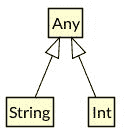
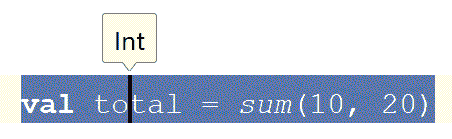
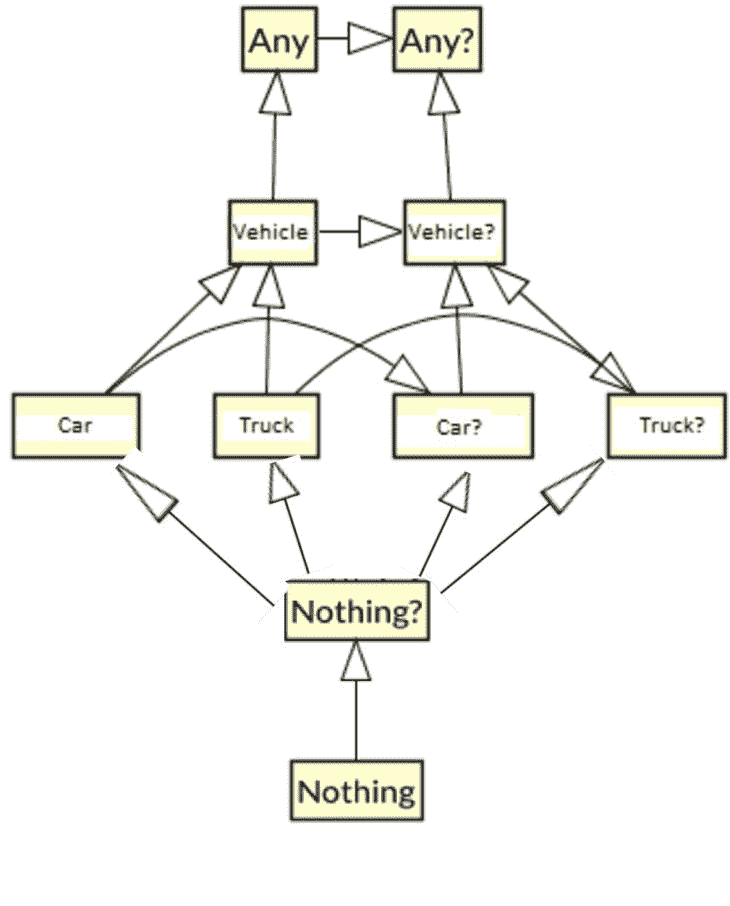
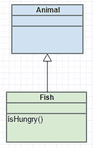
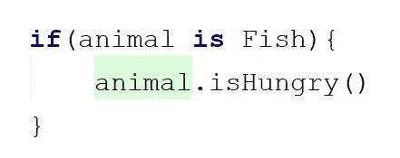
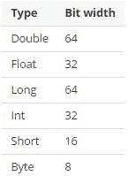
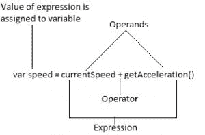
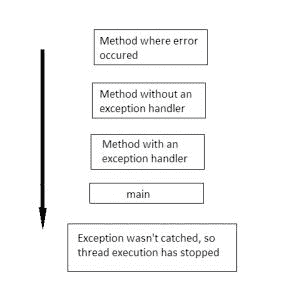
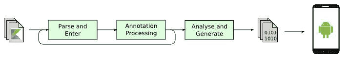

# 二、基础

这一章主要致力于作为 Kotlin 编程语言核心元素的基本构件。每一个看起来都是微不足道的，但是结合在一起，它们创造了真正强大的语言结构。我们将讨论引入严格空安全和智能强制转换的 Kotlin 类型系统。此外，我们将在 JVM 世界中看到一些新的操作符，以及与 Java 相比的许多改进。我们还将展示处理应用流的新方法，并以统一的方式处理平等。

在本章中，我们将涵盖以下主题:

*   变量、值和常量
*   类型推断
*   严格零安全
*   智能造型
*   Kotlin 数据类型
*   控制结构
*   异常处理

# 变量

在 Kotlin 中，我们有两种类型的变量:`var`或`val`。第一个，`var`，是一个可变引用(读写)，可以在初始化后更新。`var`关键字用于在 Kotlin 中定义变量。它相当于一个普通的(非最终的)Java 变量。如果我们的变量需要在某个时候改变，我们应该使用`var`关键字声明它。让我们看一个变量声明的例子:

```kt
    fun main(args: Array<String>) { 
        var fruit:String =  "orange" //1 
        fruit  = "banana" //2 
    } 
```

1.  创建水果变量并用变量`orange`值初始化它
2.  用`banana`值重新初始化水果变量

第二种类型的变量是只读引用。初始化后不能重新分配这种类型的变量。

The `val` keyword can contain a custom getter, so technically it can return different objects on each access. In other words, we can't guarantee that the reference to the underlying object is immutable:

`val random: Int`
`get() = Random().nextInt()`

Custom getters will be discussed in more detail in Chapter 4, *Classes and Objects*.

`val`关键字相当于一个带有`final`修饰符的 Java 变量。使用不可变变量是有用的，因为它确保变量永远不会被错误地更新。*不变性*的概念也有助于处理多线程，而不必担心数据同步是否正确。要声明不可变变量，我们将使用`val`关键字:

```kt
    fun main(args: Array<String>) { 
        val fruit:String= "orange"//1 
        a = "banana" //2  Error 
    } 
```

1.  创建水果变量并用字符串`orange`值初始化它
2.  编译器将抛出一个错误，因为水果变量已经初始化

Kotlin also allows us to define variables and functions at the level of the file. We will discuss it further in [Chapter 3](3.html#25JP20-7a7324e7f1a1454d830df91c6b78f317), *Playing with Functions*.

请注意，变量引用的类型(`var`、`val`)与引用本身有关，而与被引用对象的属性无关。这意味着当使用只读引用(`val`)时，我们将无法更改指向特定对象实例的引用(我们将无法重新分配变量值)，但我们仍然能够修改被引用对象的属性。让我们用一个数组来看看它是如何工作的:

```kt
    val list = mutableListOf("a","b","c") //1 
    list = mutableListOf("d", "e") //2 Error 
    list.remove("a") //3 
```

1.  初始化可变列表
2.  编译器将抛出一个错误，因为值引用不能被更改(重新分配)
3.  编译器将允许修改列表内容

关键字`val`不能保证底层对象是不可变的。

如果我们真的想确保对象不会被修改，我们必须使用不可变引用和不可变对象。幸运的是，Kotlin 的标准库包含任何集合接口的不可变等价物(`List`对`MutableList`、`Map`对`MutableMap`等等)，用于创建特定集合实例的帮助器函数也是如此:

| **变量/值定义** | **参考可以更改** | **物体状态可以改变** |
| `val = listOf(1,2,3)` | 不 | 不 |
| `val = mutableListOf(1,2,3)` | 不 | 是 |
| `var = listOf(1,2,3)` | 是 | 不 |
| `var = mutableListOf(1,2,3)` | 是 | 是 |

# 类型推断

正如我们在前面的例子中看到的，与 Java 不同，Kotlin 类型是在变量名之后定义的:

```kt
    var title: String 
```

乍一看，这对于 Java 开发人员来说可能看起来很奇怪，但是这个构造是 Kotlin 一个非常重要的特性的构建块，这个特性叫做**类型推断** *。*类型推断意味着编译器可以从上下文(分配给变量的表达式的值)推断类型。当变量声明和初始化一起执行时(单行)，我们可以省略类型声明。让我们看看下面的变量定义:

```kt
    var title: String = "Kotlin" 
```

`title`变量的类型是`String`，但是我们真的需要一个隐式类型声明来确定变量类型吗？在表达式的右边，我们有一个字符串`Kotlin`，我们将它分配给表达式左边定义的变量`title`。

我们将变量类型指定为`String`，但这是显而易见的，因为这与赋值表达式的类型(`Kotlin`)相同。幸运的是，这个事实对于 Kotlin 编译器来说也是显而易见的，因此我们可以在声明变量时省略 type，因为编译器会尝试从当前上下文中确定变量的最佳类型:

```kt
    var title = "Kotlin" 
```

请记住，类型声明被省略了，但是变量的类型仍然被隐式设置为`String`，因为 Kotlin 是一种强类型语言。这就是为什么前面的两个声明是相同的，Kotlin编译器仍然能够正确地验证变量的所有未来用法。这里有一个例子:

```kt
    var title = "Kotlin" 
    title = 12 // 1, Error 
```

1.  推断类型为`String`，我们正在尝试分配`Int`

如果我们想将`Int`(值`12`)分配给标题变量，那么我们需要将标题类型指定为一个`String`和`Int`通用类型。在类型层次结构中，最接近的是`Any`:

```kt
    var title: Any = "Kotlin" 
    title = 12
```

Any is an equivalent of the Java object type. It is the root of the Kotlin type hierarchy. All classes in Kotlin explicitly inherit from type `Any`, even primitive types such as `String` or `Int`



Any defines three methods: `equals`, `toString`, and `hashCode`. Kotlin standard library contains a few extensions for this type. We will discuss extensions in [Chapter 7](7.html#532G60-7a7324e7f1a1454d830df91c6b78f317), *Extension Functions and Properties*.

我们可以看到，*类型推断*并不局限于原值。让我们看看直接从函数推断类型:

```kt
    var total = sum(10, 20) 
```

在前面的示例中，推断的类型将与函数返回的类型相同。我们可能猜测它会是`Int`，但也可能是`Double`、`Float`或其他类型。如果从上下文中不明显会推断出什么类型，我们可以在变量名上使用 place 胡萝卜，运行 Android Studio 表达式类型命令(对于 Windows，是*Shift*+*Ctrl*+*P*，对于 macOS，是箭头键+ *control* + *P* )。这将在工具提示中显示变量类型，如下所示:



类型推理也适用于泛型类型:

```kt
    var persons = listOf(personInstance1, personInstance2) 
    // Inferred type: List<Person> () 
```

假设我们只传递`Person`类的实例，推断的类型将是`List<Person>`。`listOf`方法是Kotlin标准库中定义的一个帮助函数，允许我们创建集合。我们将在[第 7 章](7.html#532G60-7a7324e7f1a1454d830df91c6b78f317)、*扩展功能和属性*中讨论这个主题。让我们看看更高级的例子，它使用名为`Pair`的 Kotlin 标准库类型，该库包含一对由两个值组成的库:

```kt
    var pair = "Everest" to 8848 // Inferred type: Pair<String, Int> 
```

在前面的示例中，使用*中缀函数*创建了一个`pair`实例，这将在[第 4 章](4.html#2JTHG0-7a7324e7f1a1454d830df91c6b78f317)、*类和对象*中讨论，但是现在我们只需要知道这两个声明返回相同类型的`Pair`对象:

```kt
    var pair = "Everest" to 8848   
    // Create pair using to infix method 
    var pair2 = Pair("Everest", 8848) 
    // Create Pair using constructor 
```

类型推断也适用于更复杂的场景，例如从推断的类型推断类型。让我们使用Kotlin标准库的`mapOf`函数并插入`Pair`类的`to`方法来定义`map`。配对中的第一项将用于推断`map`键类型；第二个将用于推断值类型:

```kt
    var map = mapOf("Mount Everest" to 8848, "K2" to 4017) 
    // Inferred type: Map<String, Int> 
```

`Map<String, Int>`的泛型类型是从`Pair<String, Int>`的类型推断出来的，而`Pair<String, Int>`的类型是从传递给`Pair`构造函数的参数类型推断出来的。我们可能会想，如果用于创建`map`的配对的推断类型不同，会发生什么？第一对是`Pair<String, Int>`，第二对是`Pair<String, String>`:

```kt
    var map = mapOf("Mount Everest" to 8848, "K2" to "4017") 
    // Inferred type: Map<String, Any> 
```

在前面的场景中，Kotlin 编译器将尝试推断所有对的公共类型。两对中的第一个参数是`String` ( `Mount Everest`、`K2`)，所以这里自然会推断出`String`。每对的第二个参数不同(第一对为`Int`，第二对为`String`，所以 Kotlin 需要找到最接近的公共类型。选择`Any`类型，因为这是上游类型层次结构中最接近的常见类型:


正如我们所看到的，类型推断在大多数情况下都做得很好，但是如果我们想要，我们仍然可以选择显式定义数据类型，例如，我们想要不同的变量类型:

```kt
    var age: Int = 18
```

在处理整数时，`Int`类型始终是默认选择，但我们仍然可以明确定义不同的类型，例如，`Short`*来节省一些宝贵的安卓内存:*

```kt
    var age: Short = 18
```

另一方面，如果我们需要存储更大的值，我们可以将`age`变量的类型定义为`Long`。我们可以像以前一样使用显式类型声明，或者使用*文字常量*:

```kt
    var age: Long = 18 // Explicitly define variable type
    var age = 18L      
    // Use literal constant to specify value type
```

这两个声明是相等的，它们都将创建类型为`Long`的变量。

目前，我们知道代码中有更多的情况可以省略类型声明，以使代码语法更加简洁。然而，在某些情况下，由于缺乏上下文信息，Kotlin 编译器将无法推断类型。例如，没有赋值的简单声明将使类型推断变得不可能:

```kt
    val title // Error 
```

在前面的示例中，变量将在稍后初始化，因此无法确定其类型。这就是为什么必须显式指定类型。一般规则是，如果编译器知道表达式的类型，则可以推断类型。否则，必须明确指定。AndroidStudio中的 Kotlin 插件做得很好，因为它准确地知道哪里不能推断类型，然后它会突出显示错误。这使得我们在编写代码时，无需完成应用，就可以通过 IDE 立即显示正确的错误消息。

# 严格零安全

根据**敏捷软件评估***(*[【http://p3.snf.ch/Project-144126】](http://p3.snf.ch/Project-144126)*)*的研究，缺失空值检查是 Java 系统中最常见的 bug 模式。Java 中最大的错误来源是`NullPointerExceptions`。它是如此之大，以至于在 2009 年的一次会议上，东尼·霍尔爵士为发明空引用道歉，称其为一个 10 亿美元的错误(https://en.wikipedia.org/wiki/Tony_Hoare)。

为了避免`NullPointerException`，我们需要编写防御代码，在使用对象之前检查它是否为空。包括 Kotlin 在内的许多现代编程语言都采取措施将运行时错误转换为编译时错误，以提高编程语言的安全性。在 Kotlin 中这样做的方法之一是在语言类型系统中添加*可空性安全机制*。这是可能的，因为 Kotlin 类型系统区分了可以保存 null(可空引用)的引用和不能保存 null(不可空引用)的引用。Kotlin 的这个单一特性允许我们在开发的非常早期阶段检测到许多与`NullPointerException`相关的错误。编译器和 IDE 一起会阻止很多`NullPointerException`。在许多情况下，编译会失败，而不是应用在运行时失败。

严格的空值安全是 Kotlin 类型系统的一部分。默认情况下，常规类型不能为 null(不能存储 null 引用)，除非明确允许。要存储空引用，我们必须通过在变量类型声明中添加问号后缀，将变量标记为可空(允许它存储空引用)。这里有一个例子:

```kt
    val age: Int = null //1, Error 
    val name: String? = null //2 
```

1.  编译器将抛出错误，因为此类型不允许 null。
2.  编译器将允许空赋值，因为类型使用问号后缀标记为可空。

我们不允许在可能为空的对象上调用方法，除非在调用之前执行了无效性检查:

```kt
    val name: String? = null 
    // ... 
    name.toUpperCase() // error, this reference may be null 
```

我们将在下一节学习如何处理这个问题。Kotlin 中的每个不可空类型都有其等价的可空类型:`Int`有`Int?`，`String`有`String?`等等。同样的规则适用于安卓框架中的所有类(`View`有`View?`)、第三方库(`OkHttpClient`有`OkHttpClient?`)以及开发者定义的所有自定义类(`MyCustomClass`有`MyCustomClass?`)。这意味着每个非泛型类都可以用来定义两种类型，可空和不可空。不可空类型也是其可空等价类型的子类型。比如`Vehicle`，除了是`Vehicle?`的一个亚型，也是`Any` *的一个亚型:*



`Nothing`类型是空类型(无人居住类型)，不能有实例。我们将在[第三章](3.html#25JP20-7a7324e7f1a1454d830df91c6b78f317)、*玩转功能*中详细讨论。这种类型层次结构就是为什么我们可以将非空对象(`Vehicle` *)* 赋给类型为可空的变量(`Vehicle?` *)* ，但是我们不能将可空对象(`Vehicle?` *)* 赋给非空变量(`Vehicle`):

```kt
    var nullableVehicle: Vehicle?  
    var vehicle: Vehicle 

    nullableVehicle = vehicle // 1 
    vehicle = nullableVehicle // 2, Error 

```

1.  可能的分配
2.  错误，因为`nullableVehicle`可能为空

我们将在接下来的章节中讨论处理可空类型的方法。现在让我们回到类型定义。定义*泛型类型*时，有多种定义可空性的可能性，所以让我们通过比较包含类型`Int`项的泛型`ArrayList`的不同声明来检查各种集合类型。这里有一个表格，介绍了主要的区别:

| **类型声明** | **列表本身可以为空** | **元素可以为空** |
| `ArrayList<Int>` | 不 | 不 |
| `ArrayList<Int>?` | 是 | 不 |
| `ArrayList<Int?>` | 不 | 是 |
| `ArrayList<Int?>?` | 是 | 是 |

理解指定 null 类型声明的不同方法很重要，因为 Kotlin 编译器强制执行它是为了避免`NullPointerExceptions`。这意味着编译器会在访问任何可能为空的引用之前强制执行 null 检查。现在让我们检查一下`Activity`类的`onCreate`方法中常见的安卓/Java 错误:

```kt
    //Java 
    @Override 
    public void onCreate(Bundle savedInstanceState) { 
        super.onCreate(savedInstanceState); 
        savedInstanceState.getBoolean("locked"); 
    } 
```

在 Java 中，这段代码会编译得很好，访问空对象会导致应用在运行时崩溃抛出`NullPointerException`。现在让我们检查一下 Kotlin 版本的相同方法:

```kt
    override fun onCreate(savedInstanceState: Bundle?) { //1 
         super.onCreate(savedInstanceState) 
         savedInstanceState.getBoolean("key") //2 Error 
    } 
```

1.  `savedInstanceState`定义为可空`Bundle?`
2.  编译器会抛出错误

*`savedInstanceState`类型是一个平台类型，可以被 Kotlin 解释为可空或不可空。我们将在下面的章节中讨论平台类型，但是现在我们将把`savedInstanceState`定义为可空类型。我们正在这样做，因为我们知道`null`将在第一次创建活动时通过。仅当使用保存的实例状态重新创建活动时，才会传递`Bundle`的实例:*

*We will discuss functions in [Chapter 3](3.html#25JP20-7a7324e7f1a1454d830df91c6b78f317)*, Playing with Functions*, but for now, we can already see that the syntax for declaring functions in Kotlin is quite similar to Java.

修复 Kotlin 中的上述错误的最明显的方法是以与 Java 完全相同的方式检查无效性:

```kt
    override fun onCreate(savedInstanceState: Bundle?) { 
        super.onCreate(savedInstanceState)
    } 

    override fun onCreate(savedInstanceState: Bundle?) { 
        super.onCreate(savedInstanceState) 

        val locked: Boolean 
        if(savedInstanceState != null) 
            locked = savedInstanceState.getBoolean("locked")  
        else 
            locked = false 
    } 
```

前面的构造提供了一些样板代码，因为空值检查是 Java 开发中非常常见的操作(尤其是在 Android 框架中，大多数元素都是可以为空的)。幸运的是，Kotlin 允许一些更简单的解决方案来处理可空变量。第一个是*安全呼叫*接线员。

# 安全呼叫

安全呼叫操作符只是一个问号后跟一个点。理解安全强制转换操作符总是会返回值是很重要的。如果运算符的左侧为 null，则它将返回 null，否则它将返回右侧表达式的结果:

```kt
    override fun onCreate(savedInstanceState: Bundle?) { 
         super.onCreate(savedInstanceState) 
         val locked: Boolean? = savedInstanceState?.getBoolean("locked") 
    } 
```

如果`savedInstanceState`为`null` *、*，则返回`null`，否则返回一个`savedInstanceState?.getBoolean("locked")`表达式的求值结果。请记住，可空引用调用可能总是返回可空的，因此整个表达式的结果是可空的`Boolean*?*`。如果我们想确保我们将获得不可空的布尔，我们可以将*安全调用*运算符与 *elvis* 运算符相结合，这将在下一节中讨论。

*保存调用*运算符的多个调用可以链接在一起，以避免嵌套的`if`表达式或类似这样的复杂情况:

```kt
    //Java idiomatic - multiple checks
    val quiz: Quiz = Quiz()
    //...
    val correct: Boolean?

    if(quiz.currentQuestion != null) {
        if(quiz.currentQuestion.answer != null ) {
            //do something
        }
    }

    //Kotlin idiomatic - multiple calls of save call operator 
    val quiz: Quiz = Quiz() 

    //... 

    val correct = quiz.currentQuestion?.answer?.correct  
    // Inferred type Boolean? 
```

前面的链是这样工作的- `correct`只有在`answer`值不为空时才会被访问，`answer`只有在`currentQuestion`值不为空时才会被访问。因此，如果安全调用链中的任何对象为空，表达式将返回`correct property`返回的值或空值。

# 埃尔维斯算子

elvis 运算符由一个问号后跟一个冒号(`?:`)表示，语法如下:

```kt
    first operand ?: second operand 
```

elvis 运算符的工作原理如下:如果`first operand`不为空，则返回该操作数，否则返回`second operand`。猫王运算符允许我们编写非常简洁的代码。

我们可以将 elvis 操作符应用于我们的示例，以检索变量`locked`*，该变量将始终不可为空:*

```kt
    override fun onCreate(savedInstanceState: Bundle?) { 
        super.onCreate(savedInstanceState) 

        val locked: Boolean = savedInstanceState?.
                    getBoolean("locked") ?: false 
    } 
```

在上例中，如果`savedInstanceState`不为空，elvis 运算符将返回`savedInstanceState?.getBoolean("locked")`表达式的值，否则返回 false。这样我们就可以确保`locked`变量。感谢猫王操作符，我们可以定义默认值。还要注意，只有当左侧为空时，才会计算右侧表达式。然后，它将提供默认值，该值将在表达式为空时使用。回到上一节的测验示例，我们可以轻松地修改代码，使其始终返回一个不可为空的值:

```kt
    val correct = quiz.currentQuestion?.answer?.correct ?: false 
```

因此，如果*安全调用*链中的任何对象为空，表达式将返回`correct`属性或`false`返回的值。这意味着该值将始终被返回，因此推断出不可为空的布尔类型。

The operator name comes from the famous American singer-songwriter Elvis Presley, because his hairstyle is similar to a question mark.


# 非空断言

处理无效性的另一个工具是*非无效断言*运算符。用双感叹号(`!!`)表示。此运算符将可空变量显式转换为不可空变量。下面是一个用法示例:

```kt
    var y: String? = "foo" 
    var size: Int = y!!.length 
```

通常，我们无法将可空属性`length`的值赋给不可空的变量大小*。*然而，作为开发人员，我们可以向编译器保证，这个可空变量在这里会有一个值。如果我们是对的，我们的应用就会正常工作，但是如果我们错了，变量有空值，应用就会抛出`NullPointerException`。让我们来看看我们的活动方法`onCreate()`:

```kt
override fun onCreate(savedInstanceState: Bundle?) { 
    super.onCreate(savedInstanceState) 
    val locked: Boolean = savedInstanceState!!.getBoolean("locked")  
} 
```

前面的代码会编译，但是这段代码能正常工作吗？就像我们之前说的，恢复一个活动实例时，`savedInstanceState`会传递给`onCreate`方法，所以这段代码会无一例外的工作。但是，创建活动实例时，`savedInstanceState`将为空(没有要恢复的前一个实例)，因此运行时将抛出`NullPointerException`。这种行为类似于 Java，但主要区别在于，在 Java 中，访问潜在的可空对象而不进行空性检查是默认行为，而在 Kotlin 中，我们必须强制执行；否则，我们将得到一个编译错误。

只有很少正确的应用可以使用这个操作符，所以当你使用它或者在代码中看到它时，把它看作潜在的危险或者警告。建议很少使用非空断言，大多数情况下应该用安全调用或智能强制转换来代替。

Combating non-null assertions article presents few useful examples where non-null assertion operator is replaced with other, safe Kotlin constructs at [http://bit.ly/2xg5JXt](http://bit.ly/2xg5JXt).

实际上在这种情况下，使用 not null 断言操作符是没有意义的，因为我们可以使用 let 以更安全的方式解决问题。

# 让

另一个处理可空变量的工具是`let`。这其实不是运算符，也不是语言的特殊构造。它是在 Kotlin 标准库中定义的函数。让我们看看`let`结合*安全调用*运算符的语法:

```kt
    override fun onCreate(savedInstanceState: Bundle?) { 
        super.onCreate(savedInstanceState) 

        savedInstanceState?.let{ 
            println(it.getBoolean("isLocked")) // 1 
        } 
    } 
```

1.  `savedInstanceState`内部字母可以用变量
    来访问命名它。

如前所述，只有当左侧不为空时，才会计算安全调用运算符的右侧表达式。在这种情况下，右侧是以另一个函数(λ)为参数的`let`函数。如果`savedInstanceState`不为空，则执行`let` 后块中定义的代码。我们将在后面的[第 7 章](7.html#532G60-7a7324e7f1a1454d830df91c6b78f317)、*扩展函数和属性*中详细了解它以及如何定义这些函数。

# 可空性和 Java

我们知道 Kotlin 需要显式定义可以保存空值的引用。另一方面，Java 对可空性要宽容得多，因此我们可能会想知道 Kotlin 如何处理来自 Java 的类型(基本上是整个 Android SDK 和用 Java 编写的库)。只要有可能，Kotlin 编译器将从代码中确定类型的可空性，并使用可空性注释将类型表示为实际的可空或不可空类型。

The Kotlin compiler supports several flavors of nullability annotations, including:

*   安卓(`com.android.annotations`和`android.support.annotations`)
*   喷气大脑(`org.jetbrains.annotations`套餐中的`@Nullable`和`@NotNull`
*   JSR-305(“t0”)

We can find the full list in the Kotlin compiler source code ([https://github.com/JetBrains/kotlin/blob/master/core/descriptor.loader.Java/src/org/jetbrains/kotlin/load/Java/JvmAnnotationNames.kt](https://github.com/JetBrains/kotlin/blob/master/core/descriptor.loader.Java/src/org/jetbrains/kotlin/load/Java/JvmAnnotationNames.kt))

我们之前在 Activity 的`onCreate`方法中已经看到了这一点，其中`savedInstanceState`类型被显式设置为可空类型`Bundle?`:

```kt
    override fun onCreate(savedInstanceState: Bundle?) { 
        ...
    } 
```

然而，在许多情况下，不可能确定变量的可空性。除了注释为不可空的变量之外，所有来自 Java 的变量都可以为空..我们可以将它们都视为可空的，并在每次访问之前进行检查，但这是不切实际的。为了解决这个问题，Kotlin引入了*平台类型的概念。*这些类型来自带有宽松空值检查的 Java 类型，这意味着每个平台类型都可以为空值或不为空值。

虽然我们不能自己声明平台类型，但这种特殊的语法是存在的，因为编译器和 Android Studio 有时需要显示它们。我们可以在异常消息或方法参数列表中发现平台类型。平台类型语法只是变量类型声明中的一个感叹号后缀:

```kt
View! // View defined as platform type
```

我们可以将每个平台类型视为可空的，但是类型的可空性通常取决于上下文，所以有时我们可以将它们视为不可空的变量。这个伪代码显示了平台类型的可能含义:

```kt
    T! = T or T? 
```

作为开发人员，我们有责任决定如何处理这种类型，是可空的还是不可空的。让我们考虑一下`findViewById`方法的用法:

```kt
    val textView = findViewById(R.id.textView)  
```

`findViewById`法到底会回归什么？`textView`变量的推断类型是什么？可空类型(`TestView`)还是不可空(`TextView?` *)* ？默认情况下，Kotlin编译器对`findViewById`方法返回的值的可空性一无所知。这就是为什么`TextView`的推断类型有平台类型`View!`。

这就是我们所说的开发人员的责任。作为开发者，我们必须做出决定，因为只有我们知道布局是在所有配置(纵向、横向等)中定义`textView`还是仅在其中一些配置中定义。如果我们在当前布局中定义合适的视图`findViewById`方法将返回对此视图的引用，否则将返回 null:

```kt
    val textView = findViewById(R.id.textView) as TextView // 1 
    val textView = findViewById(R.id.textView) as TextView? // 2 
```

1.  假设`textView`出现在每个配置的每个布局中，因此`textView`可以定义为不可空

2.  假设`textView`没有出现在所有布局配置中(例如，只出现在横向布局中)，`textView`必须定义为可空，否则应用将在试图将 null 分配给不可空变量时抛出`NullPointerException`(当加载没有`textView`的布局时)

# 投

许多编程语言都支持强制转换概念。基本上，转换是一种将一种特定类型的对象转换成另一种类型的方法。在 Java 中，我们需要在访问一个对象的成员之前显式地对其进行强制转换，或者强制转换并将其存储在强制转换类型的变量中。Kotlin 通过引入*智能施法*，简化了施法概念，并将其提升到下一个层次。

在 Kotlin 中，我们可以执行几种类型的转换:

*   将对象显式转换为不同类型(*安全转换*操作符)
*   将对象隐式转换为不同类型或将可空类型转换为不可空类型(*智能转换*机制)

# 安全/不安全的演职人员

在强类型语言中，例如 Java 或 Kotlin，我们需要使用强制转换运算符显式地将值从一种类型转换为另一种类型。典型的转换操作是将一个特定类型的对象转换成另一个对象类型，即它的超类型(上转换)、子类型(下转换)或接口。让我们从可以用 Java 执行的铸造的一小部分开始:

```kt
    Fragment fragment = new ProductFragment(); 
    ProductFragment productFragment = (ProductFragment) fragment; 
```

在前面的例子中，有一个`ProductFragment`的实例被分配给一个存储`Fragment`数据类型的变量。为了能够将这些数据存储到只能存储`ProductFragment`数据类型的`productFragment`变量中，我们需要执行显式强制转换。与 Java 不同，Kotlin 有一个特殊的`as`关键字，代表处理铸造的*不安全铸造*操作符:

```kt
val fragment: Fragment = ProductFragment() 
val productFragment: ProductFragment =  fragment as ProductFragment 
```

`ProductFragment`变量是`Fragment`的一个子类型，所以前面的例子可以很好地工作。问题是转换到不兼容的类型会抛出异常`ClassCastException`。这就是为什么`as`操作员被称为不安全的演职人员:

```kt
    val fragment : String = "ProductFragment" 
    val productFragment : ProductFragment =  fragment as 
        ProductFragment  
    \\ Exception: ClassCastException  
```

要解决这个问题，我们可以使用*安全施法*操作符`as?` *。*它有时被称为**可空铸造**操作符。此运算符尝试将值转换为指定的类型，如果该值无法转换，则返回 null。这里有一个例子:

```kt
    val fragment: String = "ProductFragment" 
    val productFragment: ProductFragment? =  fragment as? 
        ProductFragment   
```

注意，*安全转换*操作符的使用要求我们将`name`变量定义为可空(`ProductFragment?`而不是`ProductFragment`)。作为替代，我们可以使用*不安全转换*操作符和可空类型`ProductFragment?`，这样我们就可以准确地看到我们要转换到的类型:

```kt
    val fragment: String = "ProductFragment" 
    val productFragment: ProductFragment? =  fragment as 
        ProductFragment? 
```

如果我们想要一个不可为空的`productFragment`变量，那么我们必须使用 elvis 操作符指定一个默认值:

```kt
    val fragment: String = "ProductFragment" 
    val productFragment: ProductFragment? = fragment as? 
        ProductFragment ?: ProductFragment() 
```

现在，`fragment as? ProductFragment`表达式将被评估，没有一个错误。如果这个表达式返回一个不可为空的值(可以执行强制转换)，那么这个值将被分配给`productFragment`变量，否则一个默认值(新的`ProductFragment`实例)将被分配给`productFragment`变量。下面是这两种运算符的比较:

*   不安全施法`(as)`:无法施法时抛出`ClassCastException`
*   安全施放`(as?)`:施放不可能时返回空

现在，当我们理解*安全施放*和*不安全施放*操作符之间的区别时，我们可以安全地从片段管理器中检索片段:

```kt
var productFragment: ProductFragment? = supportFragmentManager 
.findFragmentById(R.id.fragment_product) as? ProductFragment 
```

*安全浇注*和*不安全浇注*操作人员用于浇注复杂物体。当使用基元类型时，我们可以简单地使用 Kotlin 标准库转换方法之一。Kotlin 标准库中的大多数对象都有标准方法，用于将常见的铸造简化为其他类型。惯例是，这类函数的前缀是，我们要转换到的类的名称是。在本例中，使用`toString`方法将`Int`类型转换为`String`类型:

```kt
val name: String 
    val age: Int = 12 
    name = age.toString(); // Converts Int to String
```

我们将在基本数据类型部分讨论*基本类型*及其转换。

# 智能造型

**智能转换**将一种类型的变量转换为另一种类型，但与安全转换*、*相反，它是隐式完成的(我们不需要使用`as`或`as?`转换运算符)。只有当 Kotlin 编译器绝对确定变量在检查后不会被更改时，智能强制转换才起作用。这使得它们对于多线程应用来说非常安全。一般来说，智能强制转换适用于所有不可变引用(`val`)和本地可变引用(`var`)。我们有两种*智能铸件*:

*   将一种类型的对象投射到另一种类型的对象的智能投射
*   无效性*智能转换*，将可空引用转换为不可空引用

# 键入智能强制转换

让我们表示上一节中的`Animal`和`Fish`类:



让我们假设我们想要调用`isHungry`方法，并且我们想要检查`animal`是否是`Fish`的实例。在 Java 中，我们必须这样做:

```kt
    \\Java 
    if (animal instanceof Fish){ 
        Fish fish = (Fish) animal; 
        fish.isHungry(); 

        //or 
        ((Fish) animal).isHungry(); 
    } 
```

这段代码的问题在于它的冗余性。我们必须检查`animal`实例是否为`Fish`，然后在此检查*之后，我们必须显式地将`animal`转换为`Fish`。*如果编译器能为我们处理这个不是很好吗？事实证明，Kotlin 编译器在强制转换方面真的很聪明，所以它会使用*智能强制转换*机制为我们处理所有那些多余的强制转换。下面是智能铸造的一个例子:

```kt
    if(animal is Fish) { 
        animal.isHungry() 
    } 
```

**Smart cast in Android Studio**

Android Studio will display proper errors if smart casting is not possible, so we will know exactly if we can use it. Android Studio marks variables with green background when we access a member that required a cast.



在 Kotlin 中，我们不需要显式地将`animal`实例强制转换为`Fish`，因为在类型检查之后，Kotlin 编译器将能够隐式地处理强制转换。现在在`if` 区块内，可变动物被铸造到`Fish`。结果与前面的 Java 示例完全相同(运算符的 Java 实例在 Kotlin 中被称为 is)。这就是为什么我们可以安全地调用`isHungry`方法，而不需要任何显式的强制转换。请注意，在这种情况下，*智能施法*的范围受`if`区块的限制:

```kt
    if(animal is Fish) { 
        animal.isHungry() //1 
    } 

    animal.isHungry() //2, Error 
```

1.  在这个上下文中，动物实例是鱼，所以我们可以称之为`isHungry`方法。
2.  在这个上下文中，动物实例仍然是动物，所以我们不能称之为`isHungry`方法。

但是，也有智能转换范围大于单个块的其他情况，如下例所示:

```kt
    val fish:Fish? = // ... 
    if (animal !is Fish) //1 
        return 

    animal.isHungry() //1 
```

1.  从这一点来看，动物将隐式转换为不可空的鱼

在前面的例子中，如果`animal`不是`Fish`，整个方法将从函数返回，所以编译器知道`animal`在代码块的其余部分一定是`Fish`。Kotlin 和 Java 条件表达式的计算比较懒散。

意思是在表达式`condition1() && condition2()`中，方法`condition2`只有在`condition1`返回`true`时才会被调用。这就是为什么我们可以在条件表达式的右侧使用一个*智能铸造的*类型:

```kt
    if (animal is Fish && animal.isHungry()) { 
        println("Fish is hungry") 
    } 
```

请注意，如果`animal`不是`Fish`，则条件表达式的第二部分根本不会被计算。经过评估，Kotlin知道`animal`是`Fish`(聪明的演员)。

# 不可空的智能强制转换

*智能铸造*也处理其他情况，包括无效检查。让我们假设我们有一个标记为可空的`view`变量，因为我们不知道`findViewById`将在哪里返回视图或空值:

```kt
val view: View? = findViewById(R.layout.activity_shop) 
```

我们可以使用安全调用操作符来访问`view`方法和属性，但是在某些情况下，我们可能希望对同一个对象执行更多的操作。在这些情况下，智能铸造可能是更好的解决方案:

```kt
    val view: View? 

    if ( view != null ){ 
        view.isShown() 
        // view is casted to non-nullable inside if code block 
    } 

    view.isShown() // error, outside if the block view is nullable 
```

像这样执行空检查时，编译器会自动将可空视图(`View*?*`)强制转换为不可空视图(`View`)。这就是为什么我们可以在`if`块内调用`isShown`方法，而无需使用安全的调用运算符。在`if`街区之外，景色仍然可以为空。

每个*智能强制转换*仅适用于只读变量，因为读写变量可能会在执行检查和访问变量之间发生变化。

*智能转换*也可以处理函数的`return`语句。如果我们使用 return 语句在函数内部执行 will 值检查，那么变量也将被强制转换为不可 will 值:

```kt
    fun setView(view: View?){
        if (view == null)
        return
        //view is casted to non-nullable
        view.isShown()
    }
```

在这种情况下，Kotlin 绝对肯定变量值不会为空，因为否则函数会调用`return`。功能将在[第三章](3.html#25JP20-7a7324e7f1a1454d830df91c6b78f317) *、玩功能*中详细讨论。我们可以通过使用 elvis 操作符使前面的语法更加简单，并在一行 *:* 中执行无效性检查

```kt
    fun verifyView(view: View?){ 
        view ?: return 

        //view is casted to non-nullable 
        view.isShown() 
        //.. 
    } 
```

我们可能不希望仅仅从函数返回，而是希望更明确地说明存在的问题并抛出一个异常。然后，我们可以将猫王运算符与错误抛出一起使用:

```kt
    fun setView(view: View?){ 
        view ?: throw RuntimeException("View is empty") 

        //view is casted to non-nullable 
        view.isShown() 
    } 
```

我们可以看到，*智能施法*是一个非常强大的机制，可以让我们减少无效检查的次数。这就是为什么它被Kotlin大量开发的原因。请记住一般规则- *智能强制转换*只有在Kotlin绝对确定变量在强制转换后即使被另一个线程强制转换也不能改变的情况下才能工作。

# 原始数据类型

在 Kotlin 中，一切都是对象(引用类型，不是原语类型)。我们找不到像 Java 中可以使用的基本类型。这降低了代码的复杂性。我们可以调用任何变量的方法和属性。例如，我们可以这样将`Int`变量转换为`Char`:

```kt
    var code: Int = 75 
    code.toChar() 
```

通常情况下(只要有可能)，头罩下的类型如`Int`、`Long`或`Char`是优化的(存储为基本类型)，但我们仍然可以像在任何其他对象上一样在它们上面调用方法。

默认情况下，Java 平台将数字存储为 JVM 原语类型，但是当需要可空的数字引用(例如`Int?`)或涉及泛型时，Java 使用*装箱表示*。**装箱**是将一个图元类型包装成对应的装箱图元类型。这意味着实例表现为一个对象。原语类型的 Java 装箱表示的例子是 *int 对整数*或 *long 对 Long* 。由于 Kotlin 被编译成 JVM 字节码，这里也是如此:

```kt
    var weight: Int = 12 // 1 
    var weight: Int? = null // 2 
```

1.  值存储为基本类型
2.  值存储为装箱整数(复合类型)

这意味着，每次我们创建一个数字(`Byte`、`Short`、`Int`、`Long`、`Double`、`Float`)或者用`Char`、`Boolean`的时候，除非我们声明它是可空类型(`Byte?`、`Char?`、`Array?`等等)，否则它将被存储为一个原语类型；否则，它将被存储为盒装表示:

```kt
    var a: Int = 1 // 1 
    var b: Int? = null // 2 
    b = 12 // 3 
```

1.  `a`不可为空，因此存储为基元类型
2.  `b`为空，因此存储为装箱表示
3.  `b`虽然有值，但仍存储为装箱表示

泛型类型不能使用基元类型参数化，因此将执行装箱。重要的是要记住，使用装箱表示(复合类型)而不是主表示会有性能损失，因为与基元类型表示相比，它总是会产生内存开销。对于包含大量元素的列表和数组来说，这可能是显而易见的，因此使用主表示对于应用性能可能至关重要。另一方面，当涉及到单个变量甚至多个变量声明时，我们不应该担心表示的类型，即使在内存有限的安卓世界中也是如此。

现在让我们讨论最重要的 Kotlin 原始数据类型:数字、字符、布尔值和数组。

# 数字

用于数字的基本 Kotlin 数据类型相当于 Java 数字原语:



然而，Kotlin 处理数字的方式与 Java 略有不同。第一个区别是数字没有隐式转换——较小的类型不会隐式转换为较大的类型:

```kt
    var weight : Int = 12 
    var truckWeight: Long = weight // Error1 
```

这意味着我们不能在没有明确转换的情况下将类型为`Int`的值赋给`Long`变量。正如我们所说的，在 Kotlin 中，所有的东西都是一个对象，所以我们可以调用方法并将`Int`类型显式转换为`Long`来解决这个问题:

```kt
    var weight:I nt = 12 
    var truckWeight: Long = weight.toLong() 
```

起初，这看起来像是样板代码，但在实践中，这将允许我们避免许多与数字转换相关的错误，并节省大量调试时间。这实际上是一个罕见的例子，Kotlin 语法比 Java 有更多的代码。Kotlin标准库支持以下数字转换方法:

*   `toByte()`字节
*   `toShort()`:短
*   `toInt()` : Int
*   `toLong()`:龙
*   `toFloat()`:浮动
*   `toDouble()`:双
*   `toChar()` : Char

但是，我们可以显式指定一个数字文字来更改推断的变量类型:

```kt
    val a: Int = 1 
    val b = a + 1 // Inferred type is Int 
    val b = a + 1L // Inferred type is Long
```

Kotlin 和 Java 数字之间的第二个区别是，在某些情况下，数字文字略有不同。整数值有以下几种文字常量:

```kt
    27 // Decimals by default 
    27L // Longs are tagged by a upper case L suffix 
    0x1B // Hexadecimals are tagged by 0x prefix 
    0b11011 // Binaries are tagged by 0b prefix 
```

不支持八进制文字。Kotlin 还支持浮点数的传统表示法:

```kt
    27.5 // Inferred type is Double 
    27.5F // Inferred type is Float. Float are tagged by f or F 
```

# 茶

Kotlin中的字符存储在类型`Char`中。在许多方面，字符类似于字符串，所以我们将集中讨论相似之处和不同之处。要定义`Char`，我们必须使用单引号，与我们使用双引号的`String`相反:

```kt
    val char = 'a' \\ 1 
    val string = "a" \\ 2 
```

1.  定义类型为`Char`的变量
2.  定义类型为`String`的变量

在字符和字符串中，可以使用反斜杠对特殊字符进行转义。支持以下转义序列:

*   `\t`:制表器
*   `\b`:退格
*   `\n`:新线
*   `\r`:新线
*   `\'`:引用
*   `\"`:双引号
*   `\\`:斜线
*   `\$`:美元字符
*   `\u` : Unicode 转义序列

让我们定义包含阴阳 unicode 字符(U+262F)的*字符*:

```kt
    var yinYang = '\u262F'
```

# 数组

在 Kotlin 中，数组由`Array`类表示。为了在 Kotlin 中创建一个数组，我们可以使用许多 Kotlin 标准库函数。最简单的是`arrayOf()`:

```kt
    val array = arrayOf(1,2,3)   // inferred type Array<Int> 
```

默认情况下，该函数将创建一个装箱的`Int`数组。如果我们想要一个包含*短的*或者*长的*的数组，那么我们必须明确指定数组类型:

```kt
    val array2: Array<Short> = arrayOf(1,2,3) 
    val array3: Array<Long> = arrayOf(1,2,3) 
```

如前所述，使用装箱表示可能会降低应用性能。这就是为什么 Kotlin 有几个表示基元类型数组的专门类来减少装箱内存开销的原因:`ShortArray`、`IntArray`、`LongArray`等等。这些类与`Array`类没有继承关系，尽管它们有相同的方法和属性集。为了创建这个类的实例，我们必须使用相应的工厂函数:

```kt
    val array =  shortArrayOf(1, 2, 3) 
    val array =  intArrayOf(1, 2, 3) 
    val array =  longArrayOf(1, 2, 3) 
```

重要的是要注意并记住这种细微的差别，因为这些方法看起来相似，但是创建了不同的类型表示:

```kt
    val array = arrayOf(1,2,3) // 1 
    val array = longArrayOf(1, 2, 3) // 2 
```

1.  装箱长元素的泛型数组(推断类型:`Array<Long>`)
2.  包含基本长元素的数组(推断类型:`LongArray`)

知道数组的确切大小通常会提高性能，因此 Kotlin 有另一个库函数`arrayOfNulls`，它创建一个给定大小的数组，其中填充了空元素:

```kt
    val array = arrayOfNulls(3) // Prints: [null, null, null] 
    println(array) // Prints: [null, null, null] 
```

我们还可以使用 factory 函数填充预定义大小的数组，该函数将数组大小作为第一个参数，而 lambda 函数可以返回给定索引的每个数组元素的初始值作为第二个参数:

```kt
    val array = Array (5) { it * 2 } 
    println(array) // Prints: [0, 2, 4, 8, 10] 
```

我们将在[第 5 章](5.html#3N6MA0-7a7324e7f1a1454d830df91c6b78f317) *中更详细地讨论 lambdas(匿名函数)，作为一等公民的函数*。在 Kotlin 中访问数组元素的方式与在 Java 中相同:

```kt
    val array = arrayOf(1,2,3) 
    println(array[1]) //Prints: 2 
```

元素的索引方式也与 Java 相同，这意味着第一个元素的索引为 0，第二个元素的索引为 1，依此类推。不是每件事都一样，也有一些不同。主要的一点是，与 Java 不同，Kotlin 中的数组是不变的。我们将讨论*方差*是[第 6 章](6.html#4HT620-7a7324e7f1a1454d830df91c6b78f317)，*泛型是你的朋友*。

# 布尔类型

布尔是一种有两个可能值的逻辑类型:`true`和`false`。我们也可以使用可空的布尔类型:

```kt
    val isGrowing: Boolean = true 
    val isGrowing: Boolean? = null 
```

布尔类型还支持大多数现代编程语言中通常可用的标准内置操作:

*   `||`:逻辑或。当两个谓词中的任何一个返回`true`时，返回`true`。
*   `&&`:逻辑与。当两个谓词都返回`true`时，返回`true`。
*   `!`:否定运算符。返回`false`的`true`，返回`true`的`false`。

请记住，我们只能对任何类型的条件使用非空布尔值。

就像在 Java 中一样，在`||`和`&&`中，谓词被延迟计算，并且只在需要的时候才计算(*延迟连词*)。

# 复合数据类型

让我们讨论一下 Kotlin 内置的更复杂的类型。与 Java 相比，有些数据类型有很大的改进，而另一些则是全新的。

# 用线串

Kotlin 中的字符串与 Java 中的字符串行为类似，但它们有一些不错的改进。

要开始访问指定索引处的字符，我们可以使用*索引*运算符，并像访问数组元素一样访问字符:

```kt
    val str = "abcd" 
    println (str[1]) // Prints: b 
```

我们还可以访问 Kotlin 标准库中定义的各种扩展，这使得处理字符串变得更加容易:

```kt
    val str = "abcd" 
    println(str.reversed()) // Prints: dcba 
    println(str.takeLast(2)) // Prints: cd 
    println("john@test.com".substringBefore("@")) // Prints: john 
    println("john@test.com".startsWith("@")) // Prints: false 
```

这与 Java 中的 String 类完全一样，所以这些方法不是`String`类的一部分。它们被定义为扩展。我们将在[第 7 章](7.html#532G60-7a7324e7f1a1454d830df91c6b78f317)、*扩展功能和属性*中了解更多关于扩展的信息。

Check the `String` class documentation for a full list of the methods ([https://kotlinlang.org/api/latest/jvm/stdlib/kotlin/-string/](https://kotlinlang.org/api/latest/jvm/stdlib/kotlin/-string/)).

# 字符串模板

构建字符串是一个简单的过程，但是在 Java 中，它通常需要很长的串联表达式。让我们直接跳到一个例子。下面是用 Java 实现的多个元素构建的字符串:

```kt
\\Java 
String name = "Eva"; 
int age = 27; 
String message = "My name is" + name + "and I am" + age + "years old";
```

在 Kotlin 中，我们可以通过使用*字符串模板来大大简化字符串创建的过程。*不用串联，我们可以简单地将一个变量放在一个字符串中，用一个美元字符创建一个占位符。在插值过程中，字符串占位符将被实际值替换。这里有一个例子:

```kt
    val name = "Eva" 
    val age = 27 
    val message = "My name is $name and I am $age years old" 
    println(message) 
    //Prints: My name is Eva  and I am 27 years old 
```

这和串联一样有效，因为在引擎盖下，编译后的代码创建一个`StringBuilder`并将所有部分附加在一起。字符串模板不限于单个变量。它们也可以包含`${`和`}`字符之间的整个表达式。它可以是一个函数调用，将返回值或属性访问，如以下代码片段所示:

```kt
    val name = "Eva" 
    val message = "My name has ${name.length} characters" 
    println(message) //Prints: My name has 3 characters 
```

这种语法允许我们创建更简洁的代码，而不需要在每次需要变量或表达式的值来构造字符串时中断字符串。

# 范围

范围是定义值序列的一种方式。它由序列中的第一个和最后一个值表示。我们可以使用范围来存储重量、温度、时间和年龄。使用双点符号定义范围(在引擎盖下，使用`rangeTo`操作符定义范围):

```kt
    val intRange = 1..4 // 1 
    val charRange= 'b'..'g' // 2 
```

1.  推断类型为`IntRange`(相当于`i >= 1 && i <= 4`)
2.  推断类型为`CharRange`(相当于从`'b'`到`'g'`的字母)

Notice that we are using single quotes to define the character range.

`Int`、`Long`和`Char`类型范围可用于迭代`for... each`循环中的下一个值:

```kt
    for (i in 1..5) print(i) // Prints: 1234 
    for (i in 'b'..'g') print(i) // Prints: bcdefg 
```

范围可用于检查某个值是否大于起始值且小于结束值:

```kt
    val weight = 52 
    val healthy = 50..75 

    if (weight in healthy) 
        println("$weight is in $healthy range") 
        //Prints: 52 is in 50..75 range 
```

也可以这样用于其他类型的范围，如`CharRange`:

```kt
    val c = 'k'      // Inferred type is Char
    val alphabet = 'a'..'z'  

    if(c in alphabet) 
        println("$c is character") //Prints: k is a character 
```

在Kotlin，范围是封闭的(包括端点)。这意味着范围结束值包含在范围内:

```kt
    for (i in 1..1) print(i) // Prints: 123
```

请注意，默认情况下，Kotlin 中的范围是递增的(默认情况下，步长等于 1):

```kt
    for (i in 5..1) print(i) // Prints nothing 
```

要以相反的顺序迭代，我们必须使用`downTo`函数，该函数将步长设置为`-1`。就像这个例子:

```kt
    for (i in 5 downTo 1) print(i) // Prints: 54321 
```

我们还可以设置不同的步骤:

```kt
    for (i in 3..6 step 2) print(i) // Prints: 35 
```

请注意，在`3..6`范围内，最后一个元素没有被打印。这是因为*步进指数*在每个循环迭代中移动两步。因此，在第一次迭代中，它的值为`3`，在第二次迭代中，它的值为`5`，最后，在第三次迭代中，该值将为`7`，因此它被忽略，因为它在范围之外。

由`step`函数定义的步长必须是正的。如果我们想要定义负阶跃，那么我们应该使用`downTo`函数和`step`函数:

```kt
    for (i in 9 downTo 1 step 3) print(i) // Prints: 963 
```

# 收集

编程的一个非常重要的方面是使用集合。与 Java 相比，Kotlin 提供了多种集合和许多改进。我们将在[第 7 章](7.html#532G60-7a7324e7f1a1454d830df91c6b78f317)、*扩展功能和属性*中讨论这个主题。

# 语句与表达式

Kotlin 使用表达式的范围比 Java 更广，所以知道一个*语句*和一个*表达式*之间的区别很重要。一个程序基本上是一系列的语句和表达式。表达式产生一个值，该值可以用作另一个表达式、变量赋值或函数参数的一部分。表达式是一个或多个*操作数*(被操纵的数据)和零个或多个*操作符*(表示特定操作的标记)的序列，可以计算为单个值:



让我们回顾一下Kotlin的一些表达例子:

| **表达式(产生一个值)** | **指定值** | **类型的表达** |
| `a = true` | `true` | 布尔代数学体系的 |
| `a = "foo" + "bar"` | `"foobar"` | 线 |
| `a = min(2, 3)` | `2` | 整数 |
| `a = computePosition().getX()` | 通过`getX`方法返回的值 | 整数 |

另一方面，语句执行一个操作，并且不能分配给变量，因为它们根本没有值。语句可以包含用于定义类(`class`)、接口(`interface`)、变量(`val`、`var`)、函数(`fun`)、循环逻辑(`break`、`continue`)等的语言关键字。当表达式返回的值被忽略时，表达式也可以被视为语句(不要为变量赋值，不要从函数返回，不要将其用作其他表达式的一部分，等等)。

Kotlin 是一种面向表达的语言。这意味着许多在 Java 中是语句的构造在 Kotlin 中被视为表达式。第一个主要区别是 Java 和 Kotlin 处理*控制结构*的方式不同。在 Java 中，它们被视为语句，而在 Kotlin 中，除了循环之外，所有的控制结构都被视为表达式。这意味着在 Kotlin 中，我们可以使用控制结构编写非常简洁的语法。我们将在接下来的章节中看到例子。

# 控制流

Kotlin 有许多从 Java 中已知的控制流元素，但是它们提供了更多的灵活性，并且在某些情况下，它们的使用得到了简化。Kotlin 引入了一个新的控制流结构`when`，作为 Java `switch... case`的替代。

# if 语句

从本质上来说，Kotlin 的`if`子句的工作方式与 Java 相同:

```kt
    val x = 5 

    if(x > 10){ 
        println("greater") 
    } else { 
        println("smaller") 
    } 
```

如果块包含单个语句或表达式，则带有块体的版本也是正确的:

```kt
    val x = 5 

    if(x > 10) 
        println("greater") 
    else 
        println("smaller") 
```

然而，Java 将`if`视为*语句*，而 Kotlin 将`if`视为*表达式*。这是主要的区别，这个事实允许我们使用更简洁的语法。例如，我们可以将`if`表达式的结果直接作为函数参数传递:

```kt
    println(if(x > 10) "greater" else "smaller") 
```

我们可以将代码压缩成一行，因为结果`if`表达式(字符串类型)被求值，然后传递给`println`方法。当条件`x > 10`为`true`时，则该表达式将返回第一个分支(较大)，否则该表达式将返回第二个分支(较小)。让我们检查另一个例子:

```kt

    val hour = 10 
    val greeting: String 
    if (hour < 18) { 
        greeting = "Good day" 
    } else { 
        greeting = "Good evening" 
    } 
```

在前面的例子中，我们使用`if`作为语句。但是我们知道，Kotlin中的`if`是一个表达式，表达式的结果可以赋给一个变量。这样，我们可以将`if`表达式的结果直接分配给一个问候变量:

```kt
    val greeting = if (hour < 18) "Good day" else "Good evening" 
```

但是有时需要在`if`语句的分支中放置一些其他代码。我们仍然可以用 if 作为表达。那么匹配的`if`分支的最后一行将作为结果返回:

```kt
    val hour = 10 

    val greeting = if (hour < 18) { 
        //some code 
        "Good day" 
    } else { 
        //some code 
        "Good evening" 
    } 

    println(greeting) // Prints: "Good day" 
```

如果我们使用`if`作为表达式而不是语句，那么表达式需要有一个`else`分支。Kotlin 版本甚至比 Java 还要好。由于`greeting`变量被定义为不可空，编译器将验证整个`if`表达式，并检查所有情况是否被分支条件覆盖。由于`if`是一个表达式*，*我们可以在*字符串模板*中使用它:

```kt
val age = 18 
val message = "You are ${ if (age < 18) "young" else "of age" } person" 
println(message) // Prints: You are of age person 
```

将`if`视为*表达式*为我们提供了很多以前在 Java 世界中无法获得的可能性。

# 当表达式

Kotlin 中的`when`表达式是一个多路分支语句。`when`表达式被设计为对 Java `switch... case`语句的更强有力的替代。`when`语句通常比大量的`if... else if`语句提供了更好的选择，但是它提供了更简洁的语法。让我们看一个例子:

```kt
    when (x) { 
        1 -> print("x == 1") 
        2 -> print("x == 2") 
        else -> println("x is neither 1 nor 2") 
    } 
```

`when`表达式一个接一个地匹配其反对所有分支的参数，直到满足某个分支的条件。这个行为类似于 Java `switch... case`，但是我们不必在每个分支之后都写一个多余的`break`语句。

类似于`if`子句，我们可以将`when`用作忽略返回值的*语句*或者用作*表达式*并将其值赋给变量。如果将`when`用作*表达式*，则满足的分支的最后一行的值成为整个表达式的值。如果将其用作语句，则该值会被忽略。通常，如果先前的分支都不满足条件，则评估`else`分支:

```kt
    val vehicle = "Bike" 

    val message= when (vehicle) { 
        "Car" -> { 
            // Some code 
            "Four wheels" 
        } 
        "Bike" -> { 
            // Some code 
            "Two wheels" 
        } 
        else -> { 
            //some code 
            "Unknown number of wheels" 
        } 
    } 

    println(message) //Prints: Two wheels 
```

每次一个分支有一个以上的指令，我们必须把它放在代码块里面，由两个大括号`{... }`定义。如果`when`被视为表达式(计算`when`的结果被赋给变量)，则每个块的最后一行被视为返回值。我们已经看到了带有`if`表达式的相同行为，所以到目前为止，我们可能已经发现这是许多 Kotlin 构造中的常见行为，包括 lambdas，这将在本书中进一步讨论。

如果使用`when`作为表达式，`else`分支是强制的，除非编译器能够证明所有可能的情况都被分支条件覆盖。我们还可以在单个分支中处理许多匹配的参数，使用逗号来分隔它们:

```kt
    val vehicle = "Car" 

    when (vehicle) { 
        "Car", "Bike" -> print("Vehicle")
        else -> print("Unidentified funny object") 
    } 
```

`when`的另一个很好的特性是检查变量类型的能力。我们可以很容易地验证特定类型的值`is`或`!is`。智能强制转换再次变得很方便，因为我们可以在分支块中访问匹配类型的方法和属性，而无需任何额外的检查:

```kt
    val name = when (person) { 
        is String -> person.toUpperCase()
        is User -> person.name 
        //Code is smart casted to String, so we can 
        //call String class methods 
        //... 
    } 
```

类似地，我们可以检查任何包含特定值的范围或集合。这次我们将使用`is`和`!is`关键词:

```kt
    val riskAssessment = 47 

    val risk = when (riskAssessment) { 
        in 1..20 -> "negligible risk" 
        !in 21..40 -> "minor risk" 
        !in 41..60 -> "major risk" 
        else -> "undefined risk" 
    } 

    println(risk) // Prints: major risk 
```

其实我们可以把任何一种表情放在`when`分支的右边。它可以是方法调用或任何其他表达式。考虑以下示例，其中第二个`when`表达式用于`else`语句:

```kt
    val riskAssessment = 80 
    val handleStrategy = "Warn" 

    val risk = when (riskAssessment) { 
        in 1..20 -> print("negligible risk") 
        !in 21..40 -> print("minor risk") 
        !in 41..60 -> print("major risk") 
        else -> when (handleStrategy){ 
            "Warn" -> "Risk assessment warning"  
            "Ignore" -> "Risk ignored" 
            else -> "Unknown risk!" 
        }  
    } 

    println(risk) // Prints: Risk assessment warning 
```

正如我们所看到的，`when`是一个非常强大的构造，允许比 Java `switch`更多的控制，但是它甚至更强大，因为它不仅仅局限于检查值是否相等。在某种程度上，它甚至可以用来替代一条`if... else if`链子。如果没有参数被提供给`when`表达式，分支条件表现为布尔表达式，并且当其条件为`true`时，执行分支:

```kt
private fun getPasswordErrorId(password: String) = when { 
    password.isEmpty() -> R.string.error_field_required 
    passwordInvalid(password) -> R.string.error_invalid_password 
    else -> null 
} 
```

所有给出的例子都需要一个`else`分支。每次当所有可能的情况都包括在内时，我们可以省略一个`else`分支(穷举`when`)。让我们看看布尔型最简单的例子:

```kt
    val large:Boolean = true 

    when(large){ 
        true -> println("Big") 
        false -> println("Big") 
    } 
```

编译器可以验证所有可能的值都被处理了，所以不需要指定`else`分支。同样的逻辑适用于枚举和密封类，将在[第 4 章](4.html#2JTHG0-7a7324e7f1a1454d830df91c6b78f317) *、类和对象*中讨论。

检查是由 Kotlin 编译器执行的，因此我们确信任何情况都不会遗漏。这降低了常见的 Java 错误的可能性，即开发人员忘记处理`switch`语句中的所有情况(尽管多态性通常是更好的解决方案)*。*

# 环

循环是一种控制结构，它重复同一组指令，直到满足终止条件。在 Kotlin 中，循环可以迭代任何提供迭代器的东西。迭代器是一个有两种方法的接口:`hasNext`和`next`。它知道如何迭代集合、范围、字符串或任何可以表示为元素序列的实体。

To iterate through something, we have to supply an `iterator()` method. As `String` doesn't have one, so in Kotlin it is defined as an extension function. Extensions will be covered in [Chapter 7](7.html#532G60-7a7324e7f1a1454d830df91c6b78f317), *Extension Functions and Properties*.

Kotlin 提供了三种循环:`for`、`while`和`do... while`。它们的工作原理都与其他编程语言相同，因此我们将简要讨论它们。

# for 循环

我们需要显式定义迭代器的经典 Java `for`循环在 Kotlin 中并不存在。下面是 Java 中这种循环的一个例子:

```kt
    //Java 
    String str = "Foo Bar"; 
    for(int i=0; i<str.length(); i++) 
    System.out.println(str.charAt(i)); 
```

为了从头到尾迭代一组项目，我们可以简单地使用`for`循环来代替:

```kt
    var array = arrayOf(1, 2, 3) 

    for (item in array) { 
        print(item) 
    } 
```

它也可以在没有块体的情况下定义:

```kt
    for (item in array) 
        print(item) 
```

如果一个`collection`是一个通用集合，那么*项*将被智能铸造为对应于一个通用集合类型的类型。换句话说，如果一个集合包含类型为`Int`的元素，该项目将被智能封装为`Int`:

```kt
    var array = arrayOf(1, 2, 3) 

    for (item in array) 
        print(item) // item is Int 
```

我们还可以使用集合的索引来迭代集合:

```kt
    for (i in array.indices) 
        print(array[i]) 
```

`array.indices`参数返回带有所有索引的`IntRange`。相当于(`1.. array.length - 1` *)* 。还有一种可选的`withIndex`库方法，返回包含索引和值的`IndexedValue`属性列表。这可以通过以下方式分解成这些元素:

```kt
    for ((index, value) in array.withIndex()) { 
        println("Element at $index is $value") 
    } 
```

构造`(index, value)`被称为破坏性声明，我们将在[第 4 章](4.html#2JTHG0-7a7324e7f1a1454d830df91c6b78f317)、*类和对象*中讨论它。

# while 循环

`while`循环重复一个块，而其条件表达式返回`true`:

```kt
    while (condition) { 
        //code 
    } 
```

还有一个`do... while`循环，只要一个*条件表达式*返回`true`就重复这些块:

```kt
    do { 
        //code 
    } while (condition)  
```

Kotlin 与 Java 相反，可以使用`do... while`循环内部声明的变量作为条件。

```kt
    do { 
        var found = false 
        //.. 
    } while (found) 
```

`while`和`do... while`循环的主要区别在于条件表达式的求值时间。一个`while`循环正在代码执行前检查条件，如果条件不成立，那么代码将不会被执行。另一方面，`do... while`循环首先执行循环的主体，然后计算条件表达式，因此主体将总是至少执行一次。如果这个表达式是`true`，循环将重复。否则，循环终止。

# 其他迭代

还有其他方法可以使用内置的标准库函数迭代集合，例如`forEach`。我们将在[第 7 章](7.html#532G60-7a7324e7f1a1454d830df91c6b78f317)、*扩展功能和属性*中介绍它们。

# 中断并继续

Kotlin 中的所有循环都支持经典的`break`和`continue`语句。`continue`语句进入该循环的下一次迭代，而`break`停止执行最内部的封闭循环:

```kt
    val range = 1..6 

    for(i in range) { 
        print("$i ") 
    } 

    // prints: 1 2 3 4 5 6 
```

现在我们来添加一个`condition`和`break`当这个条件为`true`时的迭代:

```kt
    val range = 1..6 

    for(i in range) { 
        print("$i ") 

        if (i == 3) 
            break 
    } 

    // prints: 1 2 3 
```

`break`和`continue`语句在处理嵌套循环时特别有用。它们可能会简化我们的控制流程，并显著减少执行的工作量，从而节省无价的安卓资源。让我们执行嵌套迭代并打破外部循环:

```kt
    val intRange = 1..6 
    val charRange = 'A'..'B' 

    for(value in intRange) { 
        if(value == 3) 
            break 

        println("Outer loop: $value ") 

        for (char in charRange) { 
            println("\tInner loop: $char ") 
        } 
    } 

    // prints 
    Outer loop: 1  
        Inner loop: A  
        Inner loop: B  
    Outer loop: 2  
        Inner loop: A  
        Inner loop: B  
```

我们在第三次迭代开始时使用了`break`语句来终止外部循环，因此嵌套循环也终止了。请注意在控制台上添加缩进的`\t`转义序列的用法。我们也可以利用`continue`语句跳过循环的当前迭代:

```kt
    val intRange = 1..5 

    for(value in intRange) { 
        if(value == 3) 
            continue 

        println("Outer loop: $value ") 

        for (char in charRange) { 
            println("\tInner loop: $char ") 
        } 
    } 

    // prints 
    Outer loop: 1  
        Inner loop: A  
        Inner loop: B  
    Outer loop: 2  
        Inner loop: A  
        Inner loop: B  
    Outer loop: 4  
        Inner loop: A  
        Inner loop: B  
    Outer loop: 5  
        Inner loop: A  
        Inner loop: B  
```

当当前值等于`3`时，我们跳过外环的迭代。

`continue`和`break`语句都对封闭循环执行相应的操作。然而，有时我们想终止或跳过一个循环在另一个循环中的迭代；例如，从内部循环中终止外部循环迭代:

```kt
    for(value in intRange) { 
        for (char in charRange) { 
            // How can we break outer loop here? 
        } 
    } 
```

幸运的是，`continue`语句和`break`语句都有两种形式——标记和未标记。我们已经看到了无标签的，现在我们需要标签来解决我们的问题。以下是如何使用带标签的分隔符的示例:

```kt
    val charRange = 'A'..'B' 
    val intRange = 1..6 

    outer@ for(value in intRange) { 
        println("Outer loop: $value ") 

        for (char in charRange) { 
            if(char == 'B') 
                break@outer 

            println("\tInner loop: $char ") 
        } 
    } 

    // prints 
    Outer loop: 1  
        Inner loop: A  
```

`@outer`是标签名称。按照惯例，标签名称总是以`*@*`开头，后跟标签名称。标签放在循环之前。标记循环允许我们使用限定的`break` ( `break@outer`)，这是一种停止执行被这个标记引用的循环的方法。前面限定的`break`(带标签的中断)跳转到标记有该标签的循环之后的执行点。

放置`return`语句将中断所有循环，并从封闭匿名或命名函数返回:

```kt
    fun doSth() { 
        val charRange = 'A'..'B' 
        val intRange = 1..6 

        for(value in intRange) { 
            println("Outer loop: $value ") 

            for (char in charRange) { 
                println("\tInner loop: $char ") 

                return 
            } 
        }   
    } 

    //usage 
    println("Before method call") 
    doSth() 
    println("After method call") 

    // prints
    Outer loop: 1 
        Inner loop: A  
```

方法调用后:

```kt
    Outer loop: 1  
        Inner loop: A  
```

# 例外

大多数 Java 编程指南，包括《有效 Java》一书，都提倡有效性检查的概念。这意味着我们应该始终验证参数或对象的状态，并在有效性检查失败时抛出异常。Java 异常系统有两种异常:选中异常和未选中异常。

未检查的异常意味着开发人员不会通过使用`try... catch`块来强制捕捉异常。默认情况下，异常会在调用栈中一路向上，因此我们决定在哪里捕获它们。如果我们忘记抓住它们，它们会一直沿着调用堆栈向上，并以适当的消息停止线程执行(因此它们会提醒我们):



Java 有一个非常强大的异常系统，在许多情况下，它迫使开发人员显式标记每个可能抛出异常的函数，并通过`try... catch`块(选中的异常)包围它们来显式捕获每个异常。这对于非常小的项目非常有用，但是在真正的大规模应用中，这通常会导致以下冗长的代码:

```kt
    // Java 
    try { 
        doSomething() 
    } catch (IOException e) { 
        // Must be safe 
    } 
```

不是在调用堆栈中传递异常，而是通过提供一个空的 catch 块来忽略它，这样它就不会被正确处理，并且会消失。这种代码可能会掩盖关键的异常，给人一种错误的安全感，并导致意想不到的问题和难以发现的 bug。

在我们讨论如何在 Kotlin 中进行异常处理之前，让我们比较两种类型的异常:

| **代码** | **已检查异常情况** | **未检查的异常** |
| 函数声明 | 我们必须指定函数可以抛出哪些异常。 | 函数声明不包含所有抛出异常的信息。 |
| 异常处理 | 抛出异常的函数必须被`try... catch`块包围。 | 如果我们愿意，我们可以捕捉异常并做一些事情，但我们不会被迫这样做。异常出现在调用堆栈中。 |

Kotlin 和 Java 异常系统的最大区别在于，在 Kotlin 中，所有异常都是未检查的。这意味着我们永远不必用`try... catch`块包围一个方法，即使这是一个可能抛出缓存异常的 Java 方法。我们仍然可以做到，但我们不会被迫:

```kt
    fun foo() { 
        throw IOException() 
    } 

    fun bar() { 
        foo () //no need to surround method with try-catch block 
    } 
```

这种方法消除了代码冗长，提高了安全性，因为我们不需要引入空的 *catch* 块。

# 尝试...捕捉块

Kotlin `try... catch`块相当于 Java `try... catch`块。让我们看一个简单的例子:

```kt
    fun sendFormData(user: User?, data: Data?) { // 1 
        user ?: throw NullPointerException("User cannot be null") 
        // 2 
        data ?: throw NullPointerException("Data cannot be null")         

        //do something 
    } 

    fun onSendDataClicked() { 
        try { // 3 
            sendFormData(user, data) 
        } catch (e: AssertionError) { // 4 
            // handle error 
        }  finally { // 5 
            // optional finally block 
        } 
    } 
```

1.  不像在 Java 中那样在函数签名上指定异常。
2.  我们检查数据的有效性并抛出`NullPointerException`(注意创建对象实例时不需要新的关键字)。
3.  `try... catch`块类似于 Java 的构造。
4.  仅处理该特定异常(`AssertionError`异常)。
5.  始终执行`finally`块。

可以有零个或多个`catch`块，可以省略`finally`块。但是，至少应存在一个`catch`或`finally`区块。

在 Kotlin 中，异常处理`try`是一个表达式，所以它可以返回值，我们可以将其值赋给一个变量。实际赋值是执行块的最后一个表达式。让我们检查设备上是否安装了特定的安卓应用:

```kt
val result = try { // 1 
    context.packageManager.getPackageInfo("com.text.app", 0)  //2 
    true 
} catch (ex: PackageManager.NameNotFoundException) { // 3 
    false 
} 
```

1.  `try... catch`块返回由单个表达式函数返回的值。
2.  如果安装了应用，`getPackageInfo`方法将返回一个值(该值被忽略)，并且包含`true`表达式的下一行将被执行。这是`try`块执行的最后一个操作，因此它的值将被分配给一个变量(`true`)。

如果某个应用没有安装，`getPackageInfo`会抛出`PackageManager.NameNotFoundException`，执行`catch`块。`catch`块的最后一行包含一个`false`表达式，因此它的值将被赋给一个变量。

# 编译时常量

由于`val`变量是只读的，在大多数情况下，我们可以将其视为常量。我们需要注意的是，它的初始化可能会被延迟，所以这意味着存在这样的情况:`val`变量可能在编译时没有被初始化，例如，将方法调用的结果赋给一个值:

```kt
   val fruit:String  = getName() 
```

该值将在运行时分配。然而，在某些情况下，我们需要在编译时知道这个值。当我们想要将参数传递给注释时，需要精确的值。注释由注释处理器处理，该处理器在应用启动之前运行很长时间:



为了绝对确保该值在编译时是已知的(因此可以由注释处理器处理)，我们需要用`const`修饰符来标记它。让我们用定义最大日志条目的单个参数定义一个自定义注释`MyLogger`，并用它注释一个`Test`类:

```kt
    const val MAX_LOG_ENTRIES = 100 

        @MyLogger(MAX_LOG_ENTRIES ) 
        // value available at compile time
        class Test {}
```

我们必须意识到`const`用法的几个限制。第一个限制是必须用基元类型或`String`类型的值初始化。第二个限制是它必须在顶层声明或者作为对象的成员声明。我们将在[第四章](4.html#2JTHG0-7a7324e7f1a1454d830df91c6b78f317)、*类和对象*中讨论对象。第三个限制是他们不能有自定义的 getter。

# 委托

Kotlin为委托提供一流的支持。与 Java 相比，这是非常有用的改进。如果事实上，安卓开发中有很多委托的应用，所以我们决定在这个主题上留出整整一章([第 8 章](8.html#63G3A0-7a7324e7f1a1454d830df91c6b78f317)、*委托*)。

# 摘要

在本章中，我们讨论了变量、值和常量之间的区别，并讨论了包括范围在内的基本 Kotlin 数据类型。我们还研究了一个 Kotlin 类型系统，该系统强制实施严格的空值安全，并使用各种运算符和智能强制转换来处理可空引用。我们知道，我们可以通过利用类型推理和各种控制结构来编写更简洁的代码，这些结构在 Kotlin 中被视为表达式。最后，我们讨论了异常处理的方法。

在下一章中，我们将学习函数，并介绍定义函数的不同方法。我们将涵盖单表达式函数、默认参数和命名参数语法等概念，并讨论各种修饰符。***