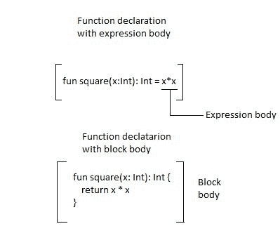
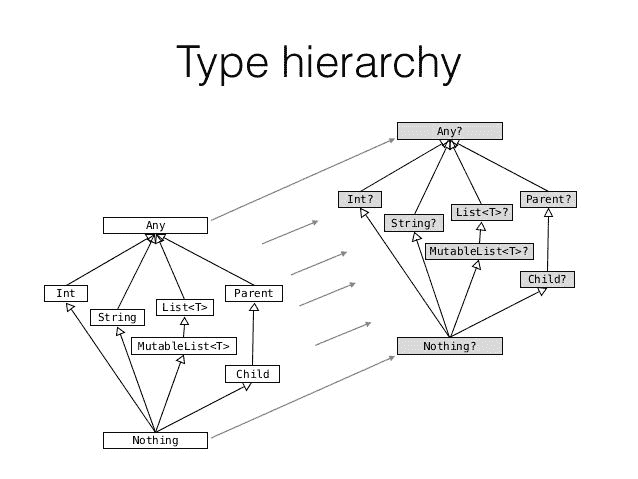

# 三、玩转函数

在前几章中，我们已经看到了柯特林变量、类型系统和控制结构。但是要创建应用程序，我们需要允许我们构建结构的构件。在 Java 中，类是代码的构造块。另一方面，Kotlin 支持函数式编程；因此，它使得创建没有任何类的整个程序或库成为可能。函数是 Kotlin 中最基本的构造块。本章介绍了 Kotlin 中的函数，以及不同的函数特性和类型。

在本章中，我们将涵盖以下主题:

*   Kotlin 中的基本函数用法
*   `Unit`返回类型
*   vararg 参数
*   单表达式函数
*   尾部递归函数
*   默认参数值
*   命名参数语法
*   顶级功能
*   本地功能
*   `Nothing`返回类型

# 基本功能声明和用法

程序员为了测试某种编程语言而编写的最常见的第一个程序是`Hello, World!`程序。这是一个完整的程序，只是在控制台上显示`Hello, World!`文本。我们也将从这个程序开始，因为在 Kotlin 中，它基于一个函数，并且只基于一个函数(不需要类)。所以Kotlin`Hello, World!`的程序看起来如下:

```kt
    // SomeFile.kt 
    fun main(args: Array<String>) {     // 1 
        println("Hello, World!")        // 2, Prints: Hello, World! 
    } 
```

1.  一个函数定义单参数 args，它包含一个用于运行程序的所有参数的数组(从命令行)。它被定义为不可空的，因为当程序在没有任何参数的情况下启动时，空数组被传递给一个方法。
2.  `println`函数是 Kotlin 标准库中定义的一个 Kotlin 函数，相当于 Java 函数`System.out.println`。

这个节目告诉我们很多关于柯特林的事情。它展示了函数是怎样的，我们可以不用任何类来定义函数。首先，我们来分析一下函数的结构。它以`fun`关键字开始，然后是函数的名称、括号中的参数和函数体。这是一个简单函数的另一个例子，但是这个函数返回值:

```kt
    fun double(i: Int): Int { 
        return 2 * i 
    } 
```

**Good to know frame**

There is much confusion around the difference between methods and function. Common definitions are as follows:

A function is a piece of code that is called by name.
The method is a function associated with an instance of class (object). Sometimes it is called member function.

So in simpler words, functions inside classes are called **methods**. In Java, there are officially only methods, but academic environments are often arguing that static Java methods are in fact functions. In Kotlin we can define functions that are not associated with any object.

在 Kotlin 中调用函数的语法与在 Java 和大多数现代编程语言中相同:

```kt
    val a = double(5) 
```

我们调用 double 函数，并将它返回的值赋给变量。让我们讨论 Kotlin 函数的参数和返回类型的细节。

# 因素

柯特林函数中的参数是用帕斯卡符号声明的，每个参数的类型都必须明确指定。所有参数都被定义为只读变量。没有办法使参数可变，因为这种行为容易出错，并且在 Java 中经常被程序员滥用。如果需要，我们可以通过声明同名的局部变量来显式地隐藏参数:

```kt
    fun findDuplicates(list: List<Int>): Set<Int> { 
        var list = list.sorted() 
        //... 
    } 
```

这是可能的，但它被视为不良做法，因此将显示警告。更好的方法是根据参数提供的数据来命名参数，根据参数服务的目的来命名变量。在大多数情况下，这些名称应该是不同的。

**Parameters versus arguments** In the programming community, arguments and parameters are often though to be the same thing. These words cannot be used interchangeably because they have different meanings. An argument is an actual value that is passed to the function when a function is called. Parameter refers to the variables declared inside function declaration. Consider the following example:

`fun printSum(a1: Int, a2: Int) { // 1.`
`print(a1 + a2)`
`}`
`add(3, 5) // 2.`

`1 - a1 and a2 are parameters`
`2 - 3 and 5 are arguments`

和 Java 一样，Kotlin 中的函数可以包含多个参数:

```kt
    fun printSum(a: Int, b: Int) { 
        val sum = a + b 
        print(sum) 
    }   
```

提供给函数的参数可以是参数声明中指定类型的子类型。我们知道，在 Kotlin 中，所有不可空类型的超类型都是`Any`，所以我们需要使用它，如果我们想接受所有类型的话:

```kt
    fun presentGently(v: Any) { 
        println("Hello. I would like to present you: $v") 
    } 

    presentGently("Duck")  
    // Hello. I would like to present you: Duck 
    presentGently(42)      
    // Hello. I would like to present you: 42 
```

要允许参数为 null，需要将类型指定为可为 null。注意`Any?`是所有可空和不可空类型的超类型，所以我们可以传递任何类型的对象作为参数:

```kt
    fun presentGently(v: Any?) { 
        println("Hello. I would like to present you: $v") 
    } 

    presentGently(null) 
    // Prints: Hello. I would like to present you: null 
    presentGently(1) 
    // Prints: Hello. I would like to present you: 1 
    presentGently("Str") 
    // Prints: Hello. I would like to present you: Str 
```

# 返回函数

到目前为止，大多数函数都是像过程一样定义的(不返回值的函数)。但实际上，Kotlin 中没有过程，所有函数都返回一些值。未指定时，默认返回值为`Unit`实例。出于演示目的，我们可以显式设置它:

```kt
    fun printSum(a: Int, b: Int): Unit { // 1 
        val sum = a + b 
        print(sum) 
    } 
```

1.  与 Java 不同，我们在函数名和参数之后定义返回类型。

`Unit`对象相当于 Java 的`void`，但也可以当作其他任何对象。所以我们可以把它存储在变量中:

```kt
    val p = printSum(1, 2) 
    println(p is Unit) // Prints: true 
```

当然，柯特林编码约定声称当一个函数返回`Unit`时，类型定义**应该被省略**。这样，代码可读性更强，理解起来也更简单:

```kt
    fun printSum(a: Int, b: Int) { 
        val sum = a + b 
        print(sum) 
    } 
```

**Good to know frame** Unit is a singleton, what means that there is only one instance of it. So all three conditions are true:

`println(p is Unit) // Print: true`
`println(p == Unit) // Print: true` `println(p === Unit) // Print: true`

Singleton pattern is highly supported in Kotlin and it will be more thoroughly covered in [Chapter 4](4.html#2JTHG0-7a7324e7f1a1454d830df91c6b78f317), *Classes and objects*.

要从具有`Unit`返回类型的函数返回输出，我们可以简单地使用不带任何值的返回语句:

```kt
    fun printSum(a: Int, b: Int) {  // 1 
        if(a < 0 || b < 0) { 
            return                  // 2 
        } 
        val sum = a + b 
        print(sum) 
        // 3 
    }  
```

1.  没有指定返回类型，因此返回类型隐式设置为单位。

2.  我们可以使用不带任何值的返回。
3.  当一个函数返回 Unit 时，返回调用是可选的。我们不必使用它。

我们也可以使用 return `Unit`，但是不应该使用，因为那样会产生误导，可读性更差。

当我们指定返回类型时，除了`Unit`之外，我们总是需要显式返回值:

```kt
    fun sumPositive(a: Int, b: Int): Int { 
        if(a > 0 && b > 0) { 
            return a + b 
        } 
        // Error, 1 
    } 
```

1.  函数不会编译它，因为没有指定返回值，if 条件没有满足。

这个问题可以通过添加第二个 return 语句来解决:

```kt
    fun sumPositive(a: Int, b: Int): Int { 
        if(a >= 0 && b >= 0) { 
            return a + b 
        } 
        return 0 
    } 
```

# Vararg 参数

有时，参数的数量是事先不知道的。在这种情况下，我们可以给参数添加一个`vararg`修改器。它允许函数接受任意数量的参数。下面是一个例子，其中函数打印多个整数的和:

```kt
    fun printSum(vararg numbers: Int) { 
        val sum = numbers.sum() 
        print(sum) 
    } 

    printSum(1,2,3,4,5) // Prints: 15 
    printSum()          // Prints: 0 
```

参数可以在方法内部作为保存所有提供值的数组来访问。数组的类型对应一个`vararg`参数类型。通常情况下，我们希望它是一个包含指定类型(`Array<T>`)的泛型数组，但是正如我们所知，Kotlin有一个针对`Int`数组的优化类型，称为`IntArray`，因此将使用该类型。例如，这里是类型为`String`的`vararg`参数的类型:

```kt
    fun printAll(vararg texts: String) {
    //Inferred type of texts is Array<String>
        val allTexts = texts.joinToString(",") 
        println("Texts are $allTexts") 
    } 

    printAll("A", "B", "C") // Prints: Texts are A,B,C 
```

请注意，我们仍然能够在`vararg`参数之前或之后指定更多的参数，只要清楚哪个参数指向哪个参数:

```kt
fun printAll(prefix: String, postfix: String, vararg texts: String) 
{ 
    val allTexts = texts.joinToString(", ") 
    println("$prefix$allTexts$postfix") 
} 

printAll("All texts: ", "!") // Prints: All texts: ! 
printAll("All texts: ","!" , "Hello", "World")  
// Prints: All texts: Hello, World! 
```

此外，提供给`vararg`参数的参数可以是指定类型的子类型:

```kt
    fun printAll(vararg texts: Any) { 
        val allTexts = texts.joinToString(",") // 1 
        println(allTexts) 
    } 

    // Usage 
    printAll("A", 1, 'c') // Prints: A,1,c 
```

1.  可以在列表上调用`joinToString`功能。它将元素连接成一个字符串。第一个参数指定了一个分隔符。

`vararg`用法的一个限制是每个函数声明只允许一个`vararg`参数。

当我们调用`vararg`参数时，我们可以逐个传递参数值，但是我们也可以传递一个值数组。这可以使用`spread`运算符(`*`前缀数组)来完成，如下例所示:

```kt
    val texts = arrayOf("B", "C", "D") 
    printAll(*texts) // Prints: Texts are: B,C,D 
    printAll("A", *texts, "E") // Prints: Texts are: A,B,C,D,E 
```

# 单表达式函数

在典型的编程过程中，许多函数只包含一个表达式。下面是这种函数的一个例子:

```kt
    fun square(x: Int): Int { 
        return x * x 
    } 
```

或者另一种经常在安卓项目中出现的模式是`Activity`中使用的模式，用于定义只从某个视图中获取文本或从该视图中提供其他数据以允许演示者获取它们的方法:

```kt
    fun getEmail(): String { 
        return emailView.text.toString() 
    } 
```

这两个函数都被定义为返回单个表达式的结果。在第一个例子中，它是`x * x`乘法的结果，在第二个例子中，它是表达式`emailView.text.toString()`的结果。这些功能在安卓项目中随处可见。以下是一些常见的用例:

*   提取一些小操作(如前面的`square`功能)
*   使用多态性提供特定于类的值
*   仅创建某些对象的函数
*   在架构层之间传递数据的函数(就像前面的例子一样，`Activity`将数据从视图传递给演示者)
*   基于递归的函数式编程风格函数

这样的函数经常被使用，所以Kotlin对此类函数有一个符号。当函数返回单个表达式时，可以省略大括号和函数体。我们直接使用相等字符指定表达式。以这种方式定义的函数称为**单表达式**函数。让我们更新我们的`square`函数，并将其定义为单表达式函数:



我们可以看到，单表达式函数有表达式体而不是块体。这种记数法比较短，但整个身体需要只是一个单一的表达。

在单表达式函数中，声明返回类型是可选的，因为编译器可以从表达式的类型中推断出它。这就是为什么我们可以简化`square`函数，并这样定义它:

```kt
    fun square(x: Int) = x * x 
```

安卓应用程序中有很多地方我们可以利用单个表达式函数。让我们考虑提供布局标识并创建`ViewHolder`的`RecyclerView`适配器:

```kt
class AddressAdapter : ItemAdapter<AddressAdapter.ViewHolder>() { 
    override fun getLayoutId() = R.layout.choose_address_view 
    override fun onCreateViewHolder(itemView: View) = ViewHolder(itemView) 

    // Rest of methods 
} 
```

在下面的例子中，由于一个表达式函数，我们实现了高可读性。单表达式函数在函数界也很流行。这个例子将在后面关于尾部递归函数的部分描述。单表达式函数符号也很好地与`when`结构配对。下面是它们连接的一个例子，用于根据一个键从一个对象获取特定数据(来自大 Kotlin 项目的用例):

```kt
fun valueFromBooking(key: String, booking: Booking?) = when(key) { 
    // 1 
    "patient.nin" -> booking?.patient?.nin 
    "patient.email" -> booking?.patient?.email 
    "patient.phone" -> booking?.patient?.phone 
    "comment" -> booking?.comment 
    else -> null 
} 
```

1.  我们不需要类型，因为它是从 when 表达式中推断出来的。

另一个常见的安卓例子是，我们可以将 when 表达式与处理顶部栏菜单点击的`activity`方法`onOptionsItemSelected`相结合:

```kt
override fun onOptionsItemSelected(item: MenuItem): Boolean = when 
{ 
    item.itemId == android.R.id.home -> { 
        onBackPressed() 
        true 
    } 
    else -> super.onOptionsItemSelected(item) 
} 
```

单表达式函数的语法很有用的另一个例子是，当我们在单个对象上链接多个操作时:

```kt
    fun textFormatted(text: String, name: String) = text 
                      .trim() 
                      .capitalize() 
                      .replace("{name}", name) 

    val formatted = textFormatted("hello, {name}", "Marcin") 
    println(formatted) // Hello, Marcin 
```

正如我们所看到的，单个表达式函数可以使我们的代码更加简洁并提高可读性。单表达式函数在 Kotlin 安卓项目中普遍使用，对于函数式编程来说确实很受欢迎。

**Imperative versus declarative programming** **Imperative programming**: This programming paradigm describes the exact sequence of steps required to perform an operation. It is most intuitive for most programmers.

**Declarative programming**: This programming paradigm describes a desired result, but not necessarily steps to achieve it (implementation of behavior). This means that programming is done with expressions or declarations instead of statements. Both *functional* and *logic* programming are characterized as declarative programming style. Declarative programming is often shorter and more readable than imperative.

# 尾部递归函数

递归函数是调用自己的函数。我们来看一个递归函数的例子，`getState`:

```kt
    fun getState(state: State, n: Int): State = 
        if (n <= 0) state // 1 
        else getState(nextState(state), n - 1) 
```

它们是函数式编程风格的重要组成部分，但问题是每个递归函数调用都需要将前一个函数的返回地址保留在堆栈上。当应用程序递归太深(堆栈上函数太多)时，抛出`StackOverflowError`。这种限制给循环使用带来了非常严重的问题。

这个问题的一个经典解决方案是使用迭代而不是递归，但是这种方法不太有表现力:

```kt
    fun getState(state: State, n: Int): State { 
        var state = state 
        for (i in 1..n) { 
            state = state.nextState() 
        } 
        return state 
    } 
```

这个问题的一个合适的解决方案是使用*尾部递归*函数，该函数由现代语言如柯特林支持。尾部递归函数是一种特殊的递归函数，函数在执行最后一个操作时调用自己(换句话说:递归发生在函数的最后一个操作中)。这允许我们通过编译器优化递归调用，并以更有效的方式执行递归操作，而不用担心潜在的`StackOverflowError`。要使函数尾部递归，我们需要用`tailrec`修饰符标记它:

```kt
    tailrec fun getState(state: State, n: Int): State = 
        if (n <= 0) state
        else getState(state.nextState(), n - 1) 
```

为了检验它是如何工作的，让我们编译这段代码并反编译成 Java。以下是可以找到的(简化后的代码):

```kt
    public static final State getState(@NotNull State state, int n) 
    { 
        while(true) { 
            if(n <= 0) { 
                return state; 
            } 
            state = state.nextState(); 
            n = n - 1; 
        } 
    } 
```

实现是基于迭代的，所以不可能发生堆栈溢出错误。要使`tailrec`修改器工作，需要满足一些要求:

*   函数只能在执行最后一个操作时调用自己
*   不能在`try` / `catch` / `finally`区块内使用
*   在编写本文时，它只允许在编译到 JVM 的 Kotlin 中使用

# 调用函数的不同方式

有时我们需要调用一个函数，并且只提供选定的参数。在 Java 中，我们可以创建同一个方法的多个重载，但是这个解决方案有一些限制。第一个问题是给定方法的可能排列的数量增长非常快(2 <sup class="calibre33">n</sup> ，使得它们非常难以维护。第二个问题是重载必须相互区分，这样编译器可能知道调用哪个重载，所以当一个方法定义几个相同类型的参数时，我们不能定义所有可能的重载。这就是为什么在 Java 中，我们经常需要将多个空值传递给一个方法:

```kt
    // Java 
    printValue("abc", null, null, "!"); 
```

多个空参数提供样板。这种情况会大大降低方法的可读性。在 Kotlin 中，不存在这样的问题，因为 Kotlin 有一个名为*默认参数*和*命名参数语法*的特性。

# 默认参数值

默认参数大部分是从 C++中知道的，c++是支持它的最古老的语言之一。默认参数为参数提供一个值，以防在方法调用期间不提供该值。每个函数参数都可以有一个默认值。它可以是任何与指定类型匹配的值，包括 null。这样我们可以简单地定义可以用多种方式调用的函数。这是一个带有默认值的函数示例:

```kt
    fun printValue(value: String, inBracket: Boolean = true, 
                   prefix: String = "", suffix: String = "") { 
        print(prefix) 
        if (inBracket) { 
            print("(${value})") 
        } else { 
            print(value) 
        } 
        println(suffix) 
    } 
```

我们可以通过为每个参数(所有参数)提供值，以与普通函数(没有默认参数值的函数)相同的方式使用该函数:

```kt
    printValue("str", true, "","")  // Prints: (str) 
```

由于缺省参数值，我们可以通过只为没有缺省值的参数提供参数来调用函数:

```kt
    printValue("str")  // Prints: (str) 
```

我们还可以提供没有默认值的所有参数，并且只提供一些有默认值的参数:

```kt
    printValue("str", false)  // Prints: str 
```

# 命名参数语法

有时我们只想为最后一个参数传递一个值。假设我们为后缀定义了想要的值，但没有为前缀和`inBracket`(在后缀之前定义)。通常，我们必须提供所有先前参数的值，包括默认参数值:

```kt
    printValue("str", true, true, "!") // Prints: (str) 
```

通过使用命名参数语法，我们可以使用参数名传递特定的参数:

```kt
    printValue("str", suffix = "!") // Prints: (str)! 
```

这允许非常灵活的语法，其中我们可以在调用函数时只提供选定的参数(也就是说，第一个和最后一个)。它经常被用来指定这个参数是什么，因为这样的调用更易读:

```kt
    printValue("str", inBracket = true) // Prints: (str) 
    printValue("str", prefix = "Value is ") // Prints: Value is str 
    printValue("str", prefix = "Value is ", suffix = "!! ") 
    // Prints:   Value is str!! 
```

我们可以使用命名参数语法以任何顺序设置我们想要的任何参数，只要提供所有不带默认值的参数。论点的顺序是相关的:

```kt
    printValue("str", inBracket= true, prefix = "Value is ") 
    // Prints: Value is (str) 

    printValue("str", prefix = "Value is ", inBracket= true) 
    // Prints: Value is (str) 
```

参数的顺序不同，但是前面的两个调用是等价的。

我们也可以将*命名参数语法*与*经典调用*一起使用。唯一的限制是，如果我们开始使用命名语法，我们就不能在接下来的参数中使用经典语法:

```kt
    printValue ("str", true, "") 
    printValue ("str", true, prefix = "") 
    printValue ("str", inBracket = true, prefix = "") 
    printValue ("str", inBracket = true, "") // Error 
    printValue ("str", inBracket = true, prefix = "", "") // Error 
```

这个特性允许我们以非常灵活的方式调用方法，而不需要定义多个方法重载。

命名参数语法给 Kotlin 程序员强加了一些额外的责任。我们需要记住，当我们更改参数名时，我们可能会在项目中导致错误，因为参数名可能会在其他类中使用。如果我们使用内置的重构工具重命名参数，安卓工作室会处理它，但这只会在我们的项目中起作用。Kotlin 库的创建者在使用命名参数语法时应该非常小心。参数名称的改变会破坏应用编程接口。请注意，在调用 Java 函数时不能使用命名参数语法，因为 Java 字节码并不总是保留函数参数的名称。

# 顶级功能

在一个简单的`Hello, World!`程序中我们可以观察到的另一件事是`main`函数不位于任何类内部。在[第二章](2.html#11C3M0-7a7324e7f1a1454d830df91c6b78f317)、*奠基*中，我们已经提到了Kotlin可以在顶层定义各种实体。在顶层定义的函数称为**顶层函数**。下面是其中一个例子:

```kt
    // Test.kt 
    package com.example 

    fun printTwo() { 
        print(2) 
    } 
```

顶层函数可以在整个代码中使用(假设它们是公共的，那么什么是默认可见性修饰符)。我们可以像从本地上下文调用函数一样调用它们。要访问顶级函数，我们需要使用 import 语句将其显式导入文件。安卓工作室的代码提示列表中有函数，所以选择(使用)函数时会自动添加导入。举个例子，让我们看看在`Test.kt`中定义的一个顶级函数，并在`Main.kt`文件中使用它:

```kt
    // Test.kt 
    package com.example 

    fun printTwo() { 
        print(2) 
    } 

    // Main.kt 
    import com.example.printTwo 

    fun main(args: Array<String>) { 
        printTwo() 
    } 
```

顶层函数通常很有用，但是明智地使用它们很重要。请记住，定义公共顶级函数将增加代码中可用函数的数量*提示列表*(通过*提示列表*我的意思是 IDE 建议作为提示的方法列表，当我们编写代码时)。这是因为公共顶级函数是由 IDE 在每个上下文中建议的(因为它们可以在任何地方使用)。如果顶级函数的名称没有明确说明这是顶级函数，那么它可能会与来自本地上下文的方法混淆，并被意外使用。下面是一些顶级函数的好例子:

*   `factorial`
*   `maxOf`和`minOf`
*   `listOf`
*   `println`

以下是一些可能不适合顶级函数的函数示例:

*   `sendUserData`
*   `showPossiblePlayers`

此规则仅适用于 Kotlin 面向对象编程项目。在面向函数的编程项目中，这些都是有效的顶层名称，但是我们假设几乎所有的函数都是在顶层定义的，而不是作为方法。

通常我们定义的函数只在特定的模块或特定的类中使用。为了限制函数的可见性(可以使用它的地方)，我们可以使用可见性修改器。我们将在[第 4 章](4.html#2JTHG0-7a7324e7f1a1454d830df91c6b78f317) *【类和对象】*中讨论可见性修改器。

# 引擎盖下的顶级功能

在安卓项目中，Kotlin被编译成运行在达尔维克虚拟机(安卓 5.0 之前)或安卓运行时(安卓 5.0 及更高版本)上的 Java 字节码。这两个虚拟机只能执行类中定义的代码。为了解决这个问题，Kotlin 编译器为顶级函数生成类。类名由文件名和`Kt`后缀构成。在这样的类中，所有的函数和属性都是静态的。例如，假设我们在`Printer.kt`文件中定义了一个函数:

```kt
    // Printer.kt 
    fun printTwo() { 
        print(2) 
    } 
```

Kotlin 代码被编译成 Java 字节码。生成的字节码将类似于从以下 Java 类生成的代码:

```kt
    //Java 
    public final class PrinterKt { // 1 
        public static void printTwo() { // 2 
            System.out.print(2); // 3 
        } 
    } 
```

1.  `PrinterKt`是由文件名和`*Kt*`后缀组成的名称。
2.  所有顶级函数和属性都被编译成静态方法和变量。
3.  `print`是一个 Kotlin 函数，但是由于它是一个内联函数，所以在编译时它的调用被它的体所代替。而它的本体只包括`System.out.println call`。

内联功能将在[第 5 章](5.html#3N6MA0-7a7324e7f1a1454d830df91c6b78f317)、*一等公民功能*中描述。

Java 字节码级别的 Kotlin 类将包含更多的数据(例如，参数的名称)。我们还可以通过在函数调用前加上类名，从 Java 文件中访问 Kotlin 顶级函数:

```kt
    //Java file, call inside some method 
    PrinterKt.printTwo() 
```

这样，完全支持从 Java 调用 Kotlin 顶级函数。我们可以看到，Kotlin 确实可以与 Java 互操作。为了让 Kotlin 顶级函数在 Java 中的使用更加舒适，我们可以添加一个注释，该注释将更改 JVM 生成的类的名称。当使用来自 Java 类的顶级 Kotlin 属性和函数时，这很方便。该注释如下所示:

```kt
    @file:JvmName("Printer") 
```

我们需要在文件顶部(包名之前)添加`JvmName`标注。应用后，生成的类名称将更改为`Printer`。这允许我们使用打印机作为类名在 Java 中调用`printTwo`函数:

```kt
    //Java 
    Printer.printTwo() 
```

有时我们正在定义顶级函数，我们希望在单独的文件中定义它们，但我们也希望在编译到 JVM 后它们在同一个类中。如果我们在文件顶部使用以下注释，这是可能的:

```kt
    @file:JvmMultifileClass 
```

例如，让我们假设我们正在制作一个带有数学助手的库，我们想从 Java 中使用它。我们可以定义以下文件:

```kt
    // Max.kt
    @file:JvmName("Math") 
    @file:JvmMultifileClass 
    package com.example.math 

    fun max(n1: Int, n2: Int): Int = if(n1 > n2) n1 else n2 

    // Min.kt 
    @file:JvmName("Math") 
    @file:JvmMultifileClass 
    package com.example.math 

    fun min(n1: Int, n2: Int): Int = if(n1 < n2) n1 else n2 
```

我们可以这样从 Java 类中使用它:

```kt
    Math.min(1, 2) 
    Math.max(1, 2) 
```

由于这一点，我们可以保持文件的简短和简单，同时保持它们都易于从 Java 中使用。

当我们在 Kotlin 中创建库时，更改生成的类名的`JvmName`注释特别有用，这些库也直接用于 Java 类。这在名字冲突的情况下也很有用。当我们在同一个包中创建一个包含一些顶级函数或属性的`X.kt`文件和一个`XKt`类时，可能会出现这种情况。但这种情况很少发生，也不应该发生，因为有一个惯例，任何班级都不应该有`Kt`后缀。

# 本地功能

Kotlin 允许在许多上下文中定义函数。我们可以在顶层定义函数，作为成员(在`class`、`interface`等内部)，在其他函数(局部函数)内部。考虑以下局部函数定义的例子:

```kt
    fun printTwoThreeTimes() { 
        fun printThree() { // 1 
            print(3) 
        } 
        printThree() // 2 
        printThree() // 2 
    } 
```

1.  `printThree`是局部函数，因为它位于另一个函数内部。
2.  不能从声明本地函数的函数外部访问本地函数。

局部函数内部可访问的元素不必从封闭函数作为参数传递，因为它们是可直接访问的。例如:

```kt
    fun loadUsers(ids: List<Int>) { 
        var downloaded: List<User> = emptyList() 

        fun printLog(comment: String) { 
            Log.i("loadUsers (with ids $ids): $comment\nDownloaded: 
                                              $downloaded") // 1 
        } 
        for(id in ids) { 
            printLog("Start downloading for id $id")  
            downloaded += loadUser(id) 
            printLog("Finished downloading for id $id") 
        } 
    } 
```

1.  局部函数可以访问注释参数和局部变量(下载的和标识)，它们在封闭函数中定义。

如果我们想将`printLog`定义为顶级函数，那么我们必须将`ids`和`downloaded`作为参数传递:

```kt
fun loadUsers(ids: List<Int>) { 
    var downloaded: List<User> = emptyList() 

    for(id in ids) { 
        printLog("Start downloading for id $id", downloaded, ids)   
        downloaded += loadUser(id) 
        printLog("Finished downloading for 
                  id $id", downloaded, ids)) 
    } 
} 

fun printLog(state: String, downloaded: List<User>, ids: List<Int>) 
{ 
    Log.i("loadUsers (with ids $ids): 
    $state\nDownloaded: downloaded") 
} 
```

这种实现不仅时间更长，而且更难维护。`printLog`中的变化可能需要不同的参数，而参数的变化需要这个函数调用中参数的变化。另外，如果我们改变在`printLog`中使用的`loadUsers`参数类型，那么我们也需要改变`printLog`的参数。如果`printLog`是一个地方功能，就不会有这样的问题。这解释了何时应该使用局部函数:当我们提取仅由单个函数使用的功能，并且该功能使用该函数的元素(变量、值、参数)时。此外，允许局部函数修改局部变量。就像这个例子:

```kt
    fun makeStudentList(): List<Student> { 
        var students: List<Student> = emptyList() 
        fun addStudent(name: String, state: Student.State = 
                       Student.State.New) { 
            students += Student(name, state, courses = emptyList()) 
        } 
        // ... 
        addStudent("Adam Smith") 
        addStudent("Donald Duck") 
        // ... 
        return students 
    } 
```

这样，我们可以提取和重用在 Java 中无法提取的功能。记住局部函数是很好的，因为它们有时允许很难用其他方式实现的代码提取。

# 无返回类型

有时我们需要定义一个总是抛出异常(从不正常终止)的函数*。*两个真实的用例是:

*   简化错误抛出的函数。这在错误系统很重要并且需要提供更多错误发生数据的库中尤其有用。(作为一个例子，请看本节介绍的`throwError`函数)。
*   用于在单元测试中抛出错误的函数。当我们需要测试代码中的错误处理时，这很有用。

对于这几种情况，有一个特殊的类叫做`Nothing`。`Nothing`类是空类型(无人居住类型)，意味着它没有实例。具有`Nothing`返回类型的函数不会返回任何东西，也永远不会到达`return`语句。它只能抛出一个异常。这就是为什么当我们看到函数返回`Nothing`时，它被设计成抛出异常。这样我们就可以区分不返回值的函数(像 Java 的`void`、Kotlin 的`Unit`)和永不终止的函数(返回`Nothing`)。让我们看一个可以用来简化单元测试中错误抛出的函数示例:

```kt
    fun fail(): Nothing = throw Error() 
```

以及使用定义它的上下文中可用的元素(在类或函数中)构造复杂错误消息的函数:

```kt
fun processElement(element: Element) { 
    fun throwError(message: String): Nothing 
    = throw ProcessingError("Error in element $element: $message") 

    // ... 
    if (element.kind != ElementKind.METHOD) 
        throwError("Not a method") 
    // ... 
} 
```

这种函数是可以使用的，就像`throw`语句一样，作为不影响函数返回类型的替代:

```kt
    fun getFirstCharOrFail(str: String): Char 
        = if(str.isNotEmpty()) str[0] else fail() 

    val name: String = getName() ?: fail() 

    val enclosingElement = element.enclosingElement ?: throwError ("Lack of enclosing element") 
```

怎么可能？这是`Nothing`类的一个特殊特征，它的行为就好像它是所有可能类型的一个子类型:可空和不可空。这就是为什么`Nothing`被称为**空类型**，这意味着运行时没有值可以有这种类型，它也是每个其他类的子类型。



无人居住类型的概念在 Java 世界中是新的，这就是为什么它可能会令人困惑。这个想法其实很简单。`Nothing`实例从不存在，而只有一个错误可能会从将它指定为返回类型的函数中返回。也不需要`Nothing`加入什么东西来影响它的类型。

# 摘要

在本章中，我们已经看到了如何定义和使用函数。我们学习了如何在顶层或其他函数内部定义函数。还讨论了与函数相关的不同特性- vararg 参数、默认名称和命名参数语法。最后我们看到了一些 Kotlin 的特殊返回类型:`Unit`，相当于 Java 的`void`，`Nothing`，是一个无法定义的类型，意味着什么都不能返回(只有异常)。

在下一章中，我们将看到如何在 Kotlin 中定义类。Kotlin 语言也特别支持类，并且对 Java 定义进行了许多改进。