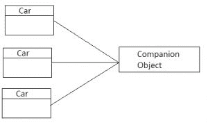

# 四、类和对象

Kotlin 语言为面向对象编程提供了全面的支持。我们将回顾强大的结构，这些结构允许我们简化数据模型定义，并以简单灵活的方式对其进行操作。我们将学习 Kotlin 如何简化和改进 Java 中许多概念的实现。我们将看看不同类型的类、属性、初始化器块和构造器。我们将学习**运算符重载**和接口默认实现。

在本章中，我们将涵盖以下主题:

*   类别声明
*   性能
*   属性访问语法
*   构造函数和初始值设定项块
*   构造器
*   遗产
*   接口
*   数据类
*   破坏性声明
*   操作员超载
*   对象声明
*   对象表达式
*   伴随对象
*   枚举类
*   密封类
*   嵌套类

# 班级

类是面向对象程序设计的基本构件。事实上，Kotlin 类与 Java 类非常相似。然而，Kotlin 允许更多的功能以及更简单和更简洁的语法。

# 类别声明

柯特林中的类是使用`class`关键字*定义的。*下面是最简单的类声明——一个名为`Person`的空类:

```kt
    class Person 
```

`Person`的定义不包含任何体。但是，它可以使用默认构造函数进行实例化:

```kt
    val person = Person() 
```

即使是像类实例化这样简单的任务在 Kotlin 中也被简化了。与 Java 不同，Kotlin 不需要`new`关键字来创建类实例。由于 Kotlin 与 Java 的强大互操作性，我们可以以完全相同的方式实例化 Java 和 Kotlin 中定义的类(没有`new`关键字)。用于实例化类的语法取决于用于创建类实例的实际语言(Kotlin 或 Java)，而不是该类的声明语言:

```kt
    // Instantiate Kotlin class inside Java file 
    Person person = new Person() 

    // Instantiate class inside Kotlin file 
    var person = Person() 
```

在 Java 文件中使用`new`关键字是经验法则，在 Kotlin 文件中永远不要使用`new`关键字。

# 性能

属性只是一个*后备字段*及其访问器的组合。它可以是一个既有接球手又有接发球手的*后场*，或者是一个只有其中一人的后场。属性可以在顶层定义(直接在文件内部)，也可以作为成员定义(例如，在类、接口等内部)。

一般来说，最好定义属性(带有 getter/setter 的私有字段)，而不是直接访问公共字段(根据 *Effective Java，作者 Joshua Bloch，*书的第 14 项:在公共类中，使用访问器方法，而不是公共字段)。

**Java getter and setter conventions for private fields

Getter**: A parameterless method with a name that corresponds to property name and a `get` prefix (for a `Boolean` property there might be an `is` prefix used instead)

**Setter**: Single-argument methods with names starting with `set`: for example, `setResult(String resultCode)`

Kotlin 通过语言设计来保护这一原则，因为这种方法提供了各种封装优势:

*   能够在不改变外部应用编程接口的情况下改变内部实现
*   强制执行不变量(调用验证对象状态的方法)
*   访问成员时执行附加操作的能力(例如，日志操作)

要定义顶级属性，我们只需在 Kotlin 文件中定义它:

```kt
    //Test.kt 
    val name:String  
```

假设我们需要一个类来存储一个人的基本数据。这些数据可以从外部应用编程接口(后端)下载，也可以从本地数据库中检索。我们的类必须定义两个(成员)属性，`name`和`age`。让我们先来看看 Java 实现:

```kt
    public class Person { 

        private int age; 
        private String name; 

        public Person(String name, int age) { 
            this.name = name; 
            this.age = age; 
        } 

        public int getAge() { 
            return age; 
        } 

        public void setAge(int age) { 
            this.age = age; 
        } 

        public String getName() { 
            return name; 
        } 

        public void setName(String name) { 
            this.name = name; 
        } 
    } 
```

这个类只包含两个属性。既然我们可以让 Java IDE 为我们生成访问器代码，至少我们不必自己编写代码。然而，这种方法的问题是，如果没有这些自动生成的块，我们就无法相处，这使得代码非常冗长。我们(开发人员)大部分时间只是阅读代码，而不是编写代码，所以阅读多余的代码会浪费很多宝贵的时间。还有一个简单的任务，比如重构属性名，变得有点复杂，因为集成开发环境可能不会更新构造函数参数名。

幸运的是，使用 Kotlin 可以显著减少样板代码。Kotlin 通过引入内置于语言中的*属性*的概念来解决这个问题。让我们看一下前面的 Java 类的 Kotlin 等价物:

```kt
    class Person { 
        var name: String 
        var age: Int 

        constructor(name: String, age: Int) { 
            this.name = name 
            this.age = age 
        } 
    } 
```

这相当于前面的 Java 类:

*   `constructor`方法相当于创建对象实例时调用的 Java 构造函数
*   Getters 和 setters 由 Kotlin 编译器生成

我们仍然可以定义 getters 和 setters 的自定义实现。我们将在*自定义获取器/设置器部分*中对此进行更详细的讨论。

我们已经定义的所有构造函数都被称为*二级* *构造函数。* Kotlin 还为定义构造函数提供了替代的、非常简洁的语法。我们可以定义一个构造函数(包含所有参数)作为类头的一部分。这种建造师称为*一级建造师*。让我们将一个属性声明从辅助构造函数移动到主构造函数中，使我们的代码稍微短一点:

```kt
    class Person constructor(name: String, age: Int) { 
        var name: String 
        var age: Int 

        init { 
            this.name = name 
            this.age = age 
            println("Person instance created") 
        } 
    } 
```

在 Kotlin 中，与二级构造函数相反，一级构造函数不能包含任何代码，因此所有初始化代码都必须放在初始化器块(`init`)中。初始化器块将在类创建过程中执行，因此我们可以为其中的字段分配构造函数参数。

为了简化代码，我们可以移除初始值设定项块，并直接在属性初始值设定项中访问构造函数参数。这允许我们为字段分配构造函数参数:

```kt
    class Person constructor(name: String, age: Int) { 
        var name: String = name 
        var age: Int = age 
    } 
```

我们设法使代码变得更短，但它仍然包含大量样板文件，因为类型声明和属性名称是重复的(构造函数参数、字段赋值和字段本身)。当 properties 没有任何自定义的 getters 或 setters 时，我们可以通过添加 val 或 var 修饰符直接在主构造函数中定义它们:

```kt
    class Person constructor (var name: String, var age: Int) 
```

最后，如果主构造函数没有任何注释(`@Inject`等)或可见性修饰符(`public`、`private`等)，那么`constructor`关键字可以省略:

```kt
    class Person (var name: String, var age: Int)
```

当构造函数接受几个参数时，最好在新行中定义每个参数，以提高代码可读性并减少潜在合并冲突的机会(当合并源代码库中的分支时):

```kt
    class Person( 
        var name: String,  
        var age: Int 
    ) 
```

综上所述，前面的例子相当于本节开头介绍的 Java 类——两个属性都直接在类主构造函数中定义，Kotlin 编译器为我们完成所有工作——它生成适当的字段和访问器(getter/setter)。

请注意，这个符号只包含关于这个数据模型类的最重要的信息——它的名称、参数名、类型和可变性(`val` / `var`)信息。实现几乎没有样板文件。这使得该类非常容易阅读、理解和维护。

# 读写与只读属性

前面例子中的所有属性都被定义为读写(生成一个 setter 和一个 getter)。要定义只读属性，我们需要使用`val`关键字，因此将只生成 getter。让我们看一个简单的例子:

```kt
    class Person( 
        var name: String, 
        // Read-write property (generated getter and setter)
        val age: Int      // Read-only property (generated getter) 
    ) 

    \\usage 
    val person = Person("Eva", 25) 

    val name = person.name 
    person.name = "Kate" 

    val age = person.age 
    person.age = 28 \\error: read-only property 
```

Kotlin 不支持只写属性(只生成 setter 的属性)。

| **关键词** | **读作** | **写** |
| `var` | 是 | 是 |
| `val` | 是 | 不 |
| (不受支持) | 不 | 是 |

# Kotlin 和 Java 之间的属性访问语法

Kotlin 引入的另一个重大改进是访问属性的方式。在 Java 中，我们会使用相应的方法(`setSpeed` / `getSpeed`)来访问属性。Kotlin 提升了*属性访问语法*，这是一种更具表现力的访问属性的方式。让我们比较两种方法，假设我们有一个简单的`Car`类，它有一个单一的`speed`属性:

```kt
    class Car (var speed: Double) 

    //Java access properties using method access syntax 
    Car car = new Car(7.4) 
    car.setSpeed(9.2) 
    Double speed = car.getSpeed(); 

    //Kotlin access properties using property access syntax 
    val car: Car = Car(7.4) 
    car.speed = 9.2 
    val speed = car.speed 
```

我们可以看到，在 Kotlin 中，不需要添加`get`、`set`前缀和括号来访问或修改对象属性。使用属性访问语法允许直接使用递增(+)、递减(-)运算符和属性访问:

```kt
    val car = Car(7.0) 
    println(car.speed)  //prints 7.0 
    car.speed++ 
    println(car.speed)  //prints 8.0 
    car.speed-- 
    car.speed-- 
    println(car.speed) //prints: 6.0 
```

# 递增和递减运算符

有两种递增(++)和递减(-)运算符:在表达式之前定义运算符的预递增/预递减，以及在表达式之后定义运算符的后递增/后递减:

```kt
    ++speed //pre increment
    --speed //pre decrement 

    speed++ //post increment 
    speed-- //post decrement

```

在前面的例子中，使用后递增/前递减不会改变什么，因为这些操作是按顺序执行的。但是当递增/递减运算符与函数调用结合使用时，这就有了很大的不同。

在预递增运算符中，速度被检索、递增，并作为参数传递给函数:

```kt
    var speed = 1.0 
    println(++speed) // Prints: 2.0   
    println(speed)   // Prints: 2.0 
```

在后递增运算中，速度被检索，作为参数传递给函数，然后它被递增，因此旧值被传递给函数:

```kt
    var speed = 1.0 
    println(speed++) // Prints: 1.0 
    println(speed) // Prints: 2.0 
```

This works in an analogical way for pre-decrement and post-decrement operators.

属性访问语法不仅限于 Kotlin 中定义的类。遵循 Java getter 和 setters 约定的每个方法在 Kotlin 中都表示为一个属性。

这意味着我们可以在 Java 中定义一个类，并使用*属性访问*语法在 Kotlin 中访问它的属性。让我们用两个属性定义一个 Java `Fish`类，`size`和`isHungry`，让我们在 Kotlin 中实例化这个类并访问这些属性:

```kt
    //Java class declaration 
    public class Fish { 
        private int size; 
        private boolean hungry; 

        public Fish(int size, boolean isHungry) { 
            this.size = size; 
            this.hungry = isHungry; 
        } 

        public int getSize() { 
            return size; 
        } 

        public void setSize(int size) { 
            this.size = size; 
        } 

        public boolean isHungry() { 
            return hungry; 
        } 

        public void setHungry(boolean hungry) { 
            this.hungry = hungry; 
        } 
    } 

    //Kotlin class usage 
    val fish = Fish(12, true) 
    fish.size = 7 
    println(fish.size) // Prints: 7 
    fish.isHungry = true 
    println(fish.isHungry) // Prints: true 
```

这是双向的，因此我们可以使用非常简洁的语法在 Kotlin 中定义`Fish`类，并以通常的 Java 方式访问它，因为 Kotlin 编译器将生成所有必需的 getters 和 setters:

```kt
    //Kotlin class declaration 
    class Fish(var size: Int, var hungry: Boolean) 

    //class usage in Java 
    Fish fish = new Fish(12, true); 
    fish.setSize(7); 
    System.out.println(fish.getSize()); 
    fish.setHungry(false); 
    System.out.println(fish.getHungry()); 
```

正如我们所看到的，用于访问类属性的语法取决于该类使用的实际语言，而不是声明该类的语言。这允许安卓框架中定义的许多类有更习惯的用法。让我们看一些例子:

| **Java 方法访问语法** | **Kotlin属性访问语法** |
| `activity.getFragmentManager()` | `activity.fragmentManager` |
| `view.setVisibility(Visibility.GONE)` | `view.visibility = Visibility.GONE` |
| `context.getResources().getDisplayMetrics().density` | `context.resources.displayMetrics.density` |

属性访问语法导致更简洁的代码，降低了原始 Java 语言的复杂性。请注意，尽管属性访问语法通常是更好的选择，但是仍然可以将方法访问语法与 Kotlin 一起使用。

安卓框架中有一些方法使用`is`前缀作为名称；在这种情况下，布尔属性也有`is`前缀:

```kt
    class MainActivity : AppCompatActivity() { 

        override fun onDestroy() { // 1 
            super.onDestroy() 

            isFinishing() // method access syntax 
            isFinishing // property access syntax 
            finishing // error 
        } 
    } 
```

1.  Kotlin 使用`override`修饰符标记被覆盖的成员，而不是像 Java 那样使用`@Override`注释。

虽然使用`finishing`将是最自然和一致的方法，但由于潜在的冲突，不可能默认使用它。

我们不能使用属性访问语法的另一种情况是，属性只定义 setter 而不定义 getter，因为 Kotlin 不支持只写属性，如本例所示:

```kt
    fragment.setHasOptionsMenu(true) 
    fragment.hasOptionsMenu = true // Error!
```

# 定制吸气剂/沉降剂

有时我们希望对财产使用有更多的控制。使用 property 时，我们可能需要执行其他辅助操作；例如，在将值分配给字段之前验证该值，记录整个操作，或者使实例状态无效。我们可以通过指定自定义设置器和/或获取器来实现。让我们将`ecoRating`属性添加到我们的`Fruit`类中。在大多数情况下，我们会将此属性添加到类声明头中，如下所示:

```kt
    class Fruit(var weight: Double, 
                val fresh: Boolean, 
                val ecoRating: Int) 
```

如果我们想定义自定义的 getters 和 setters，我们需要在类体中定义一个属性，而不是类声明头。让我们将`ecoRating`属性移入类体:

```kt
class Fruit(var weight: Double, val fresh: Boolean, ecoRating: Int)     
{ 
    var ecoRating: Int = ecoRating  
} 
```

当属性在类的主体中定义时，我们必须用值初始化它(甚至可空属性也需要用空值初始化)。我们可以提供默认值，而不是用构造函数参数填充属性:

```kt
    class Fruit(var weight: Double, val fresh: Boolean) { 
        var ecoRating: Int = 3 
    } 
```

我们还可以根据其他一些属性计算默认值:

```kt
    class Apple(var weight: Double, val fresh: Boolean) { 
        var ecoRating: Int = when(weight) { 
            in 0.5..2.0 -> 5 
            in 0.4..0.5 -> 4 
            in 0.3..0.4 -> 3 
            in 0.2..0.3 -> 2 
            else -> 1 
        } 
    } 
```

将为不同的权重构造函数参数设置不同的值。

当在类主体中定义属性时，可以省略类型声明，因为它可以从上下文中推断出来:

```kt
    class Fruit(var weight: Double) { 
        var ecoRating = 3 
    } 
```

让我们用默认行为定义一个自定义的 getter 和 setter，它将等同于前面的属性:

```kt
    class Fruit(var weight: Double) { 
        var ecoRating: Int = 3 
        get() { 
            println("getter value retrieved") 
            return field 
        } 
        set(value) { 
            field = if (value < 0) 0 else value 
            println("setter new value assigned $field") 
        } 
    } 

    // Usage 
    val fruit = Fruit(12.0) 
    val ecoRating = fruit.ecoRating 
    // Prints: getter value retrieved 
    fruit.ecoRating = 3;        
    // Prints: setter new value assigned 3 
    fruit.ecoRating = -5;       
    // Prints: setter new value assigned 0 
```

在`get`和`set`块中，我们可以访问一个名为`field`*的特殊变量，它指的是属性的对应后备字段。请注意，Kotlin 属性声明与自定义的 getter/setter 紧密相关。这与 Java 相矛盾，解决了字段声明通常在包含类的文件的顶部，对应的 getter/setter 在这个文件的底部的问题，所以我们不能在单个屏幕上真正看到它们，因此代码更难阅读。除了这个位置，Kotlin 属性行为与 Java 非常相似。每次我们从`ecoRating`属性中检索值时，将执行一个`get`块，每次我们为`ecoRating`属性分配一个新值时，将执行一个`set`块。*

 *这是一个读写属性(`var`)，因此它可能包含相应的获取器和设置器。如果我们只显式定义其中一个，默认实现将用于另一个。

为了在每次检索属性值时计算一个值，我们需要显式定义 getter:

```kt
    class Fruit(var weight: Double) { 
        val heavy             // 1 
        get() = weight > 20  
    } 

    //usage 
    var fruit = Fruit(7.0) 
    println(fruit.heavy) //prints: false 
    fruit.weight = 30.5 
    println(fruit.heavy) //prints: true 
```

1.  由于 Kotlin 1.1 类型可以省略(有待推断)。

# getter 对属性默认值

在前面的示例中，我们使用了 getter，因此每次检索属性值时都会计算属性值。通过省略 getter，我们可以为属性创建一个默认值。该值在类创建期间只计算一次，并且永远不会改变(改变`weight`属性对`isHeavy`属性值没有影响):

```kt
    class Fruit(var weight: Double) { 
        val isHeavy = weight > 20 
    } 

    var fruit = Fruit(7.0) 
    println(fruit.isHeavy) // Prints: false 
    fruit.weight = 30.5 
    println(fruit.isHeavy) // Prints: false 
```

这种类型的属性确实有一个支持字段，因为它的值总是在对象创建期间计算的。我们还可以在没有后备字段的情况下创建读写属性:

```kt
    class Car { 
        var usable: Boolean = true 
        var inGoodState: Boolean = true 

       var crashed: Boolean 
       get() = !usable && !inGoodState 
       set(value) { 
           usable = false 
           inGoodState = false 
       } 
    } 
```

这种类型的属性没有支持字段，因为它的值总是使用另一个属性计算。

# 后期初始化的属性

有时我们知道一个属性不会为空，但它不会在声明时用值初始化。让我们看看常见的安卓例子——检索对布局元素的引用:

```kt
    class MainActivity : AppCompatActivity() { 

       private var button: Button? = null 

       override fun onCreate(savedInstanceState: Bundle?) { 
           super.onCreate(savedInstanceState) 
           button = findViewById(R.id.button) as Button 
       } 
    } 
```

`button`变量在声明时无法初始化，因为`MainActivity`布局尚未初始化。我们可以在`onCreate`方法中检索对布局中定义的按钮的引用，但是要做到这一点，我们需要将变量声明为可空(`Button?`)。

这样的方法似乎很不切实际，因为在`onCreate`方法被称为`button`实例之后，它一直都是可用的。但是，客户端仍然需要使用安全呼叫操作符或其他无效性检查来访问它。

为了避免在访问一个属性时进行 nullity 检查，我们需要一种方法来通知 Kotlin 编译器，这个变量将在使用之前被填充，但是它的初始化将被及时延迟。为此，我们可以使用`lateinit`修改器:

```kt
    class MainActivity : AppCompatActivity() { 

        private lateinit var button: Button 

        override fun onCreate(savedInstanceState: Bundle?) { 
            button = findViewById(R.id.button) as Button 
            button.text = "Click Me" 
        } 
    } 
```

现在，使用标记为`lateinit`*的属性，我们可以访问我们的应用程序实例，而无需执行无效性检查。*

 *`lateinit`修饰符告诉编译器这个属性是不可空的，但是它的初始化被延迟了。自然，当我们试图在属性初始化之前访问它时，应用程序会抛出`UninitializedPropertyAccessException`。这很好，因为我们假设这种情况不应该发生。

在声明时不可能进行变量初始化的情况很常见，并且不总是与视图相关。属性可以通过依赖注入来初始化，或者通过单元测试的`setup`方法来初始化。在这种情况下，我们不能在构造函数中提供不可为 null 的值，但我们仍然希望避免 null 检查。

**The lateinit property and frameworks**

The `lateinit` property is also helpful when a property is injected by the Dependency Injection framework. The popular Android Dependency Injection framework, **Dagger**, uses the `@Inject` annotation to mark properties that need to be injected:

`@Inject lateinit var locationManager: LocationManager`

We know that the property will never be null (because it will be injected), but the Kotlin compiler does not understand this annotation.

Similar scenarios happen with the popular framework, **Mockito***:* `@Mock lateinit var mockEventBus: EventBus`

The variable will be mocked, but it will happen sometime later, after test class creation.

# 注释属性

Kotlin 从单个属性(`private`字段、getter、setter)生成多个 JVM 字节码元素。有时，框架注释处理器或基于反射的库需要将特定元素定义为公共字段。这种行为的一个很好的例子是 JUnit 测试框架。它要求通过测试类字段或 getter 方法提供规则。我们在定义`ActivityTestRule`或莫奇托(单元测试的嘲讽框架)`Rule`注释时可能会遇到这个问题:

```kt
    @Rule 
    val activityRule = ActivityTestRule(MainActivity::class.Java) 
```

前面的代码注释了 JUnit 无法识别的 Kotlin 属性，因此`ActivityTestRule`无法正确初始化。JUnit 注释处理器需要字段或 getter 上的`Rule`注释。有几种方法可以解决这个问题。我们可以通过使用`@JvmField`注释将 Kotlin 属性公开为一个 Java 字段:

```kt
    @JvmField @Rule 
    val activityRule = ActivityTestRule(MainActivity::class.Java) 
```

该字段将具有与基础属性相同的可见性。关于`@JvmField`注释的使用有一些限制。如果一个属性有一个支持字段，它不是私有的，没有 open、override 或 const 修饰符，并且不是委托属性，我们可以用`@JvmField`来注释它。

我们还可以通过直接向 getter 添加注释来注释 getter:

```kt
    val activityRule 
    @Rule get() = ActivityTestRule(MainActivity::class.java) 
```

如果我们不想定义 getter，我们仍然可以使用 use-site 目标(`get`)向 getter 添加注释。通过这样做，我们只需指定 Kotlin 编译器生成的哪个元素将被注释:

```kt
    @get:Rule  
    val activityRule = ActivityTestRule(MainActivity::class.Java) 
```

# 内嵌属性

我们可以通过使用`inline`修饰符来优化属性调用。在编译期间，每个属性调用都将被优化。调用将被属性体替换，而不是真正调用属性:

```kt
    inline val now: Long  
        get() { 
            println("Time retrieved") 
            return System.currentTimeMillis() 
        } 
```

对于内联属性，我们使用`inline`修改器。前面的代码将被编译为:

```kt
    println("Time retrieved") 
    System.currentTimeMillis() 
```

内联可以提高性能，因为不需要创建额外的对象。不会调用任何 getter，因为主体将替换属性用法。内联有一个限制——它只能应用于没有支持字段的属性。

# 构造器

Kotlin 允许我们在没有任何构造函数的情况下定义类。我们还可以定义一个主构造函数和一个或多个辅助构造函数:

```kt
    class Fruit(val weight: Int) { 
        constructor(weight: Int, fresh: Boolean) : this(weight) { } 
    } 

    //class instantiation 
    val fruit1 = Fruit(10) 
    val fruit2 = Fruit(10, true) 
```

二级构造函数不允许声明属性。如果我们需要一个由辅助构造函数初始化的属性，我们必须在类体中声明它，并且我们可以在辅助构造函数体中初始化它。让我们定义`fresh`属性:

```kt
    class Test(val weight: Int) { 
        var fresh: Boolean? = null 
        //define fresh property in class body 

        constructor(weight: Int, fresh: Boolean) : this(weight) { 
            this.fresh = fresh 
            //assign constructor parameter to fresh property 
        } 
    } 
```

请注意，我们将`fresh`属性定义为可空，因为当使用主构造函数创建对象实例时，`fresh`属性将为空:

```kt
    val fruit = Fruit(10) 
    println(fruit.weight) // prints: 10 
    println(fruit.fresh) // prints: null 
```

我们还可以为`fresh`属性指定默认值，使其不可为空:

```kt
    class Fruit(val weight: Int) { 
        var fresh: Boolean = true 

        constructor(weight: Int, fresh: Boolean) : this(weight) { 
            this.fresh = fresh 
        } 
    } 

    val fruit = Fruit(10) 
    println(fruit.weight) // prints: 10 
    println(fruit.fresh) // prints: true 
```

定义主构造函数时，每个辅助构造函数都必须隐式或显式调用主构造函数。隐式调用意味着我们直接调用主构造函数。显式调用意味着我们调用另一个调用主构造函数的辅助构造函数。要调用另一个构造函数，我们使用`this`关键字:

```kt
class Fruit(val weight: Int) { 

    constructor(weight: Int, fresh: Boolean) : this(weight) // 1 

    constructor(weight: Int, fresh: Boolean, color: String) : 
                this(weight, fresh) // 2 
} 
```

1.  调用主构造函数
2.  调用辅助构造函数

如果类没有主构造函数，而超类有一个非空的构造函数，那么每个辅助构造函数必须使用`super`关键字初始化基类，或者调用另一个这样做的构造函数:

```kt
class ProductView : View { 
   constructor(ctx: Context) : super(ctx) 
   constructor(ctx: Context, attrs : AttributeSet) : 
               super(ctx, attrs) 
} 
```

使用将在`@JvmOverloads`部分描述的`@JvmOverloads`注释可以大大简化视图示例。

默认情况下，此生成的构造函数将是公共的。如果我们想防止这种隐式`public`构造函数的生成，我们必须用`private`或`protected`可见性修饰符声明一个空的主构造函数:

```kt
    class Fruit private constructor()  
```

要更改构造函数可见性，我们需要在类定义头中显式使用`constructor`关键字。当我们想要注释一个构造函数时`constructor`关键字也是必需的。一个常见的例子是使用匕首(依赖注入框架)`@Inject`注释来注释类构造函数:

```kt
    class Fruit @Inject constructor() 
```

可见性修改器和注释可以同时应用:

```kt
    class Fruit @Inject private constructor { 
        var weight: Int? = null 
    } 
```

# 属性与构造函数参数

需要注意的重要一点是，如果我们从构造函数属性声明中移除`var` / `val`关键字，我们将得到一个构造函数参数声明。这意味着属性将被更改为构造函数参数，因此不会生成任何访问器，并且我们将无法访问类实例上的属性:

```kt
    class Fruit(var weight:Double, fresh:Boolean) 

    val fruit = Fruit(12.0, true) 
    println(fruit.weight) 
    println(fruit.fresh) // error 
```

在前面的例子中，我们有一个错误，因为`fresh`缺少一个`val`或`var`关键字，所以它是一个构造函数参数，而不是像`weight`这样的类属性。下表总结了编译器访问器生成:

| **类申报** | **吸气剂生成** | **设置器生成** | **类型** |
| `class Fruit (name:String)` | 不 | 不 | 构造函数参数 |
| `class Fruit (val name:String)` | 是 | 不 | 财产 |
| `class Fruit (var name:String)` | 是 | 是 | 财产 |

有时我们可能会想什么时候应该使用属性，什么时候应该使用方法。在下列情况下，最好使用属性而不是方法:

*   它不会引发异常
*   计算(或第一次运行时缓存)很便宜
*   它通过多次调用返回相同的结果

# 带有默认参数的构造函数

从 Java 早期开始，对象创建就存在严重的缺陷。当对象需要多个参数并且其中一些参数是可选的时，很难创建对象实例。有几种方法可以解决这个问题，例如伸缩构造函数模式、JavaBeans 模式，甚至是生成器模式。他们各有利弊。

# 模式

模式解决了对象创建的问题。每一个都解释如下:

*   **伸缩构造函数模式**:类有一个构造函数列表，每个构造函数添加一个新参数。现在几天它被认为是一个反模式，但安卓框架仍然在一些地方使用它；例如，`android.view.View`类:

```kt
        val view1 = View(context) 
        val view1 = View(context, attributeSet) 
        val view1 = View(context, attributeSet, defStyleAttr) 
```

*   **JavaBeans 模式**:无参数构造函数加一个或多个 setters 方法配置对象。这种模式的主要问题是，我们不能说是否在一个对象上调用了所有必需的方法，所以它可能只是部分构造的:

```kt
        val animal = Animal() 
        fruit.setWeight(10) 
        fruit.setSpeed(7.4) 
        fruit.setColor("Gray")
```

*   **Builder 模式**:使用另一个对象，一个 Builder，一步一步接收初始化参数，然后在调用 build 方法的时候立刻返回结果构造的对象；例如`android.app.Notification.Builder`，或者`android.app.AlertDialog.Builder`:

```kt
        Retrofit retrofit = new Retrofit.Builder() 
                                .baseUrl("https://api.github.com/") 
                                .build();
```

很长一段时间内，`builder`的使用最为广泛，但是*默认参数*和*命名参数语法*的组合是一个更加简洁的选项。让我们定义一些默认值:

```kt
    class Fruit(weight: Int = 0, fresh: Boolean = true, color: 
                String = "Green") 
```

通过定义默认参数值，我们可以以多种方式创建对象，而不需要传递所有参数:

```kt
    val fruit = Fruit(7.4, false) 
    println(fruit.fresh) // prints: false 

    val fruit2 = Fruit(7.4) 
    println(fruit.fresh) // prints: true 
```

使用带有默认参数的参数语法为我们创建对象提供了更大的灵活性。我们可以按照我们想要的任何顺序只传递必需的参数，而无需定义多个方法和构造函数，如下例所示:

```kt
val fruit1 = Fruit (weight = 7.4, fresh = true, color = "Yellow") 

val fruit2 = Fruit (color = "Yellow") 
```

# 遗产

我们已经知道，所有柯特林类型的超类型是`Any`。它相当于 Java `Object`类型。每个柯特林类都显式或隐式地扩展了`Any`类。如果我们不指定父类，`Any`将被隐式设置为该类的父类:

```kt
    class Plant // Implicitly extends Any 
    class Plant : Any // Explicitly extends Any 
```

Kotlin 和 Java 一样，提倡单一继承，所以一个类只能有一个父类，但是它可以实现多个接口。

与 Java 相反，默认情况下，Kotlin 中的每个类和每个方法都是最终的。这与*有效 Java 第 17 项:设计和文档继承一起使用，否则禁止*规则。这用于防止子类的意外行为改变。基类的修改会导致子类的错误行为，因为基类的已更改代码不再与其子类中的假设相匹配。

这意味着一个类不能被扩展，一个方法不能被覆盖，直到它使用`open`关键字被显式声明为打开。这与 Java `final`关键字正好相反。

假设我们要声明一个基类`Plant`和子类`Tree` *:*

```kt
    class Plant  
    class Tree : Plant() // Error 
```

前面的代码不会编译，因为类`Plant`默认是 final。让我们把它变成`open`:

```kt
    open class Plant  
    class Tree : Plant() 
```

请注意，我们在 Kotlin 中仅仅通过使用冒号字符(:)来定义继承。没有从 Java 知道的`extends`或者`implements`关键词。

现在让我们给我们的`Plant`类添加一些方法和属性，并尝试在`Tree`类中覆盖它:

```kt
    open class Plant { 
        var height: Int = 0 
        fun grow(height: Int) {} 
    } 

    class Tree : Plant() { 
        override fun grow(height: Int) { // Error 
            this.height += height 
        } 
    } 
```

这段代码也不会编译。我们已经说过，默认情况下所有方法也是关闭的，所以我们想要覆盖的每个方法都必须明确标记为`open`。让我们通过将`grow`方法标记为打开来修复代码:

```kt
    open class Plant { 
        var height: Int = 0 
        open fun grow(height: Int) {} 
    } 

    class Tree : Plant() { 
        override fun grow(height: Int) { 
            this.height += height 
        } 
    } 
```

以类似的方式，我们可以打开并覆盖`height`属性:

```kt
    open class Plant { 
        open var height: Int = 0 
        open fun grow(height: Int) {} 
    } 

    class Tree : Plant() { 
        override var height: Int = super.height 
            get() = super.height 
            set(value) { field = value} 

        override fun grow(height: Int) { 
            this.height += height 
        } 
    } 
```

To quickly override any member, go to a class where a member is declared, add the `open` modifier, and then go to a class where we want to override member, run the `override` members (the shortcut for Windows is *Ctrl* + *O*, and for macOS, it is *Command* + *O*) action, and select all the members you want to override. This way all the required code will be generated by Android Studio.

让我们假设所有的树都以相同的方式生长(生长算法的相同计算适用于所有的树)。我们希望允许创建`Tree`类的新子类对树有更多的控制，但同时我们希望保留我们的增长算法——不允许`Tree`类的任何子类覆盖这个行为。为此，我们需要将`Tree`类中的`grow`方法明确标记为`final`:

```kt
    open class Plant { 
        var height: Int = 0 

        open fun grow(height: Int) {} 
    } 

    class Tree : Plant() { 
        final override fun grow(height: Int) { 
            this.height += height 
        } 
    } 

    class Oak : Tree() { 
        // 1
    } 
```

1.  这里不可能覆盖生长方法，因为它是`final`

让我们总结一下这一切`open`和最终行为。为了使一个方法在子类中可重写，我们需要在超类中显式地将其标记为打开。为了确保被覆盖的方法不会被任何子类再次覆盖，我们需要将其标记为`final`。

在前面的例子中，`Plant`类中的 grow 方法并没有真正提供任何功能(它有一个空的主体)。这是一个信号，可能我们根本不想实例化`Plant`类，而是把它当作一个基类，只实例化各种类，比如扩展`Plant`类的`Tree`。我们应该将`Plant`类标记为`abstract`以禁止它的实例化:

```kt
    abstract class Plant { 
        var height: Int = 0 

        abstract fun grow(height: Int) 
    } 

    class Tree : Plant() { 
        override fun grow(height: Int) { 
            this.height += height 
        } 
    } 
    val plant = Plant() 
    // error: abstract class can't be instantiated 
    val tree = Tree() 
```

将类标记为抽象也会使方法类默认打开，所以我们不必显式地将每个成员标记为`open`。请注意，当我们将`grow`方法定义为抽象方法时，我们必须移除它的主体，因为`abstract`方法不能有主体。

# jvmooverlord 注释

安卓平台中的一些类使用了伸缩构造函数，这被认为是一种反模式。这样一个类的一个很好的例子是`android.view.View class`。可能会有只使用单个构造函数的情况(从 Kotlin 代码中膨胀自定义视图)，但是在子类化子类`android.view.View`时覆盖所有三个构造函数要安全得多，因为该类在所有情况下都能正常工作。通常，我们的自定义视图类如下所示:

```kt
    class CustomView : View { 

        constructor(context: Context?) : this(context, null) 

        constructor(context: Context?, attrs: AttributeSet?) : 
                    this(context, attrs, 0) 

        constructor(context: Context?, attrs: AttributeSet?, defStyleAttr: Int) : super(context, attrs, defStyleAttr) { 
            //... 
        } 
     } 
```

这种情况下引入了大量样板代码，这些代码只用于将调用委托给其他构造函数的构造函数。柯特林对这个问题的解决方案是使用`@JvmOverload`注释:

```kt
    class KotlinView @JvmOverloads constructor( 
        context: Context,  
        attrs: AttributeSet? = null,  
        defStyleAttr: Int = 0 
    ) : View(context, attrs, defStyleAttr) 
```

用`@JvmOverload`注释对构造函数进行注释会通知编译器在 JVM 字节码中为每个参数用默认值生成额外的构造函数重载。在这种情况下，将生成所有必需的构造函数:

```kt
public SampleView(Context context) { 
    super(context); 
} 

public SampleView(Context context, @Nullable AttributeSet attrs) { 
    super(context, attrs); 
} 

public SampleView(Context context, @Nullable AttributeSet attrs, int defStyleAttr) { 
    super(context, attrs, defStyleAttr); 
} 
```

# 接口

Kotlin 接口类似于 Java 8 接口，与以前 Java 版本的接口形成对比。使用`interface`关键字定义界面。让我们定义一个`EmailProvider`界面:

```kt
    interface EmailProvider { 
        fun validateEmail() 
   } 
```

要在 Kotlin 中实现前面的接口，请使用与扩展类相同的语法——单个冒号(`:`)。Java 中没有`implements`这样的关键字:

```kt
    class User:EmailProvider { 
        override fun validateEmail() { 
            //email validation 
        } 
    } 
```

问题可能出现在如何同时扩展一个类和实现一个接口。只需将类名放在冒号后，并使用逗号字符添加一个或多个接口。不要求将超级类放在第一个位置，尽管这被认为是很好的做法:

```kt
    open class Person {

        interface EmailProvider { 
            fun validateEmail() 
        } 

        class User: Person(), EmailProvider { 
        override fun validateEmail(){ 
            //email validation 
        } 
    } 
```

和 Java 一样，Kotlin 类只能扩展一个类，但它可以实现一个或多个接口。我们还可以在接口中声明属性:

```kt
    interface EmailProvider { 
        val email: String 
        fun validateEmail() 
    } 
```

所有方法和属性都必须在实现接口的类中被重写:

```kt
    class User() : EmailProvider { 

        override val email: String = "UserEmailProvider" 

        override fun validateEmail() { 
            //email validation 
        } 
    } 
```

此外，在主构造函数中定义的属性可用于重写接口的参数:

```kt
    class User(override val email: String) : EmailProvider { 
        override fun validateEmail() { 
            //email validation 
        } 
    } 
```

在没有默认实现的接口中定义的所有方法和属性默认情况下都被视为抽象的，所以我们不必显式地将它们定义为抽象的。所有抽象方法和属性都必须由实现接口的具体(非抽象)类来实现(重写)。

但是，在接口中定义方法和属性还有另一种方法。Kotlin 类似于 Java 8，对接口进行了重大改进。接口不仅定义行为，而且实现行为。这意味着属性实现的默认方法可以由接口提供。唯一的限制是接口不能引用任何支持字段——存储状态(因为没有好的地方存储它)。这是接口和抽象类之间的一个不同因素。接口是无状态的(它们不能有状态)，而抽象类是有状态的(它们可以有状态)。让我们看一个例子:

```kt
    interface EmailProvider { 

        fun validateEmail(): Boolean 

        val email: String 

        val nickname: String 
        get() = email.substringBefore("@") 
    } 
    class User(override val email: String) : EmailProvider { 
        override fun validateEmail() { 
            //email validation 
        } 
    } 
```

`EmailProvider`接口提供了`nickname`属性的默认实现，因此我们不必在`User`类中定义它，我们仍然可以将该属性用作类中定义的任何其他属性:

```kt
    val user = User (" johnny.bravo@test.com") 
    print(user.nickname) //prints: johnny 
```

这同样适用于方法。只需用接口中的主体定义一个方法，那么`User`类将从接口中获取所有默认实现，并且只需覆盖`email`成员——推理中唯一没有默认实现的成员:

```kt
    interface EmailProvider { 

        val email: String 

        val nickname: String 
        get() = email.substringBefore("@") 

        fun validateEmail() = nickname.isNotEmpty() 
    } 

    class User(override val email: String) : EmailProvider 

    //usage 
    val user = User("joey@test.com") 
    print(user.validateEmail()) // Prints: true 
    print(user.nickname) // Prints: joey 
```

有一个关于默认实现的有趣案例。一个类不能从多个类继承，但是它可以实现多个接口。我们可以有两个包含具有相同签名和默认实现的方法的接口:

```kt
    interface A { 
        fun foo() { 
            println("A") 
        } 
    } 

    interface B { 
        fun foo() { 
            println("B") 
        } 
    } 
```

在这种情况下，必须通过在实现接口的类中重写`foo`方法来显式解决冲突:

```kt
    class Item : A, B { 
        override fun foo() { 
            println("Item") 
        } 
    } 

    //usage 
    val item = Item() 
    item.foo() //prints: Item 
```

我们仍然可以通过使用尖括号限定`super`并指定父接口类型名称来调用这两个默认接口实现:

```kt
    class Item : A, B { 
        override fun foo() { 
            val a = super<A>.foo() 
            val b = super<B>.foo() 
            print("Item $a $b") 
        } 
    } 

    //usage 
    val item = Item() 
    item.foo() 

    //Prints: A
              B
              ItemsAB
```

# 数据类

我们经常创建一个类，它的唯一目的是存储数据；例如，从服务器或本地数据库中检索的数据。这些类是应用程序数据模型的构建块:

```kt
    class Product(var name: String?, var price: Double?) { 

       override fun hashCode(): Int { 
           var result = if (name != null) name!!.hashCode() else 0 
           result = 31 * result + if (price != null) price!!.hashCode() 
           else 0 
           return result 
       } 

       override fun equals(other: Any?): Boolean = when { 
           this === other -> true 
           other == null || other !is Product -> false 
           if (name != null) name != other.name else other.name != 
                             null -> false 
           price != null -> price == other.price 
           else -> other.price == null 
       } 

       override fun toString(): String { 
           return "Product(name=$name, price=$price)" 
       } 
    } 
```

在 Java 中，我们需要与`hashCode`和`equals`方法一起生成大量冗余的 getter/setter。AndroidStudio可以为我们生成大部分代码，但是维护这些代码仍然是一个问题。在 Kotlin 中，我们可以通过在类声明头中添加`data`关键字来定义一种称为数据类的特殊类:

```kt
    class Product(var name: String, var price: Double) 
    // normal class

    data class Product(var name: String, var price: Double) 
    // data class
```

数据类以 Kotlin 编译器生成的方法的形式向类添加了额外的功能。那些方法是`equals`、`hashCode`、`toString`、`copy`和多个`componentN`方法。限制是数据类不能标记为*抽象*、*内部、*和*密封*。让我们更详细地讨论由数据修饰符添加的方法。

# 等于和哈希码方法

在处理数据类时，经常需要比较两个实例的结构相等性(它们包含相同的数据，但不一定是相同的实例)。我们很多人只想检查`User`类的一个实例是否等于另一个`User`实例，或者两个产品实例是否代表同一产品。用于检查对象是否相等的常见模式是使用内部使用`hashCode`方法的`equals` 方法:

```kt
    product.equals(product2)  
```

`hashCode`的重写实现的一般约定是两个相等的对象(根据`equals`实现)需要具有相同的哈希代码。背后的原因是`hashCode`经常在`equals`之前被比较，因为它的性能——比较哈希代码比对象中的每个字段都便宜得多。

如果`hashCode`相同，则`equals`方法检查两个对象是否是相同的实例、相同的类型，然后通过比较所有有效字段来验证相等性。如果第一对象的至少一个场不等于第二对象的相应场，则这些对象不被认为是相等的。反过来说，当两个对象具有相同的`hashCode`并且所有有效(比较)字段具有相同的值时，它们是相等的。我们来看一个包含两个字段`name`和`price`的 Java 产品类的例子:

```kt
    public class Product { 

        private String name; 
        private Double price; 

        public Product(String name, Double price) { 
            this.name = name; 
            this.price = price; 
        } 

        @Override 
        public int hashCode() { 
            int result = name != null ? name.hashCode() : 0; 
         result = 31 * result + (price != null ? 
                                 price.hashCode() : 0); 
            return result; 
    } 

        @Override 
        public boolean equals(Object o) { 
            if (this == o) { 
                return true; 
            } 
            if (o == null || getClass() != o.getClass()) { 
                return false; 
            } 

            Product product = (Product) o; 

            if (name != null ? !name.equals(product.name) : 
            product.name != null) { 
                return false; 
            } 
            return price != null ? price.equals(product.price) : 
            product.price == null; 
        } 

        public String getName() { 
            return name; 
        } 

        public void setName(String name) { 
            this.name = name; 
        } 

        public Double getPrice() { 
            return price; 
        } 

        public void setPrice(Double price) { 
            this.price = price; 
        } 
    } 
```

这种方法在 Java 和其他面向对象编程语言中被广泛使用。在早期，程序员必须为每个需要比较的类手动编写代码，并维护代码，以确保它是正确的，并比较每个重要的值。

如今，像 Android Studio 这样的现代 IDEs 可以生成这些代码，并更新适当的方法。我们不需要编写代码，但是我们仍然需要通过确保所有必需的字段都通过`equals`方法进行比较来维护它。有时我们不知道它是由 IDE 生成的标准代码，还是经过调整的版本。对于每个Kotlin数据类*、*这些方法都是由编译器自动生成的，所以不存在这个问题。下面是 Kotlin 中`Product`的定义，它包含了前面的 Java 类中定义的所有方法:

```kt
    data class Product(var name: String, var price: Double) 
```

前面的类包含了以前的 Java 类中定义的所有方法，但是没有大量的样板代码需要维护。

在[第二章](2.html#11C3M0-7a7324e7f1a1454d830df91c6b78f317)、*奠基*中，我们提到，在柯特林中，使用结构等式运算符(= = =)将始终调用引擎盖下的`equals`方法，这意味着我们可以轻松安全地比较我们的`Product`数据类的实例:

```kt
    data class Product(var name:String, var price:Double) 

    val productA = Product("Spoon", 30.2) 
    val productB = Product("Spoon", 30.2) 
    val productC = Product("Fork", 17.4) 

    print(productA == productA) // prints: true 
    print(productA == productB) // prints: true 
    print(productB == productA) // prints: true 
    print(productA == productC) // prints: false 
    print(productB == productC) // prints: false 
```

默认情况下，`hashCode`和`equals`方法是基于主构造函数中声明的每个属性生成的。在大多数情况下，这已经足够了，但是如果我们需要更多的控制，我们仍然可以在数据类中自己重写这些方法。在这种情况下，编译器不会生成默认实现。

# toString 方法

生成的方法包含在主构造函数中声明的所有属性的名称和值:

```kt
    data class Product(var name:String, var price:Double) 
    val productA = Product("Spoon", 30.2) 
    println(productA) // prints: Product(name=Spoon, price=30.2) 
```

我们实际上可以将有意义的数据记录到控制台或日志文件中，而不是像在 Java 中那样记录类名和内存地址(`Person@a4d2e77`)。这使得调试过程更加简单，因为我们有一个合适的、人类可读的格式。

# 复制方法

默认情况下，Kotlin 编译器还会生成一个适当的`copy`方法，允许我们轻松创建一个对象的副本:

```kt
    data class Product(var name: String, var price: Double) 

    val productA = Product("Spoon", 30.2) 
    print(productA) // prints: Product(name=Spoon, price=30.2) 

    val productB = productA.copy() 
    print(productB) // prints: Product(name=Spoon, price=30.2) 
```

Java 没有命名参数语法，所以在调用`copy`方法 Java 代码时，我们需要传递所有的参数(参数的顺序对应于主构造函数中定义的属性的顺序)。在Kotlin，这种方法减少了对`copy`制造商或`copy`工厂的需求:

*   `copy`构造函数接受单个参数，类型是包含该构造函数的类，并返回该类的`newInstance`:

```kt
        val productB = Product(productA) 
```

*   `copy`工厂是静态工厂，它接受类型为包含工厂的类的单个参数，并返回该类的新实例:

```kt
        val productB = ProductFactory.newInstance(productA)
```

`copy`方法接受与主构造函数中声明的所有属性相对应的参数。结合默认参数语法，我们可以提供全部或部分属性来创建修改后的实例副本:

```kt
    data class Product(var name:String, var price:Double) 

    val productA = Product("Spoon", 30.2) 
    print(productA) // prints: Product(name=Spoon, price=30.2) 

    val productB = productA.copy(price = 24.0) 
    print(productB) // prints: Product(name=Spoon, price=24.0) 

    val productC = productA.copy(price = 24.0, name = "Knife") 
    print(productB) // prints: Product(name=Knife, price=24.0) 
```

这是一种非常灵活的创建对象副本的方法，我们可以很容易地判断副本是否以及如何不同于原始实例。另一方面，编程方法促进了不变性的概念，这可以通过对`copy`方法的无参数调用来轻松实现:

```kt
    //Mutable object - modify object state 
    data class Product(var name:String, var price:Double) 

    var productA = Product("Spoon", 30.2) 
    productA.name = "Knife" 

    //immutable object - create new object instance 
    data class Product(val name:String, val price:Double) 

    var productA = Product("Spoon", 30.2) 
    productA = productA.copy(name = "Knife") 
```

我们不需要定义可变属性(`var`)和修改对象状态，而是可以定义不可变属性(`val`)，使对象不可变，并通过用改变的值获取其副本来对其进行操作。这种方法减少了多线程应用程序中数据同步的需要和与之相关的潜在错误的数量，因为不可变对象可以在线程间自由共享。

# 破坏性声明

有时将对象重组为多个变量是有意义的。这个语法被称为**析构声明**:

```kt
    data class Person(val firstName: String, val lastName: String, 
                      val height: Int) 

    val person = Person("Igor", "Wojda", 180) 
    var (firstName, lastName, height) = person 
    println(firstName) // prints: "Igor" 
    println(lastName) // prints: "Wojda" 
    println(height) // prints: 180 
```

析构声明允许我们同时创建多个变量。前面的代码将导致创建值`firstName`、`lastName`、*、*和`height`变量。在引擎盖下，编译器将生成如下代码:

```kt
    val person = Person("Igor", "Wojda", 180) 
    var firstName = person.component1() 
    var lastName = person.component2() 
    var height = person.component3() 
```

对于数据类的主构造函数中声明的每个属性，Kotlin 编译器都会生成一个`componentN`方法。组件函数的后缀对应主构造函数中声明的属性顺序，所以`firstName`对应`component1`、`lastName`对应`component2`、`height`对应`component3`。事实上，我们可以直接在`Person`类上调用这些方法来检索属性值，但是这样做是没有意义的，因为它们的名称没有意义，并且代码很难阅读和维护。我们应该将这些方法留给编译器来销毁对象，并使用属性访问语法，如`person.firstName`。

我们还可以使用下划线省略一个或多个属性:

```kt
    val person = Person("Igor", "Wojda", 180) 
    var (firstName, _, height) = person 
    println(firstName) // prints: "Igor" 
    println(height) // prints: 180 
```

在这种情况下，我们只想创建两个变量，`firstName`和`height`；`lastName`被忽略了。编译器生成的代码如下所示:

```kt
    val person = Person("Igor", "Wojda", 180) 
    var firstName= person.component1() 
    var height = person.component3() 
```

我们也可以破坏像`String`这样的简单类型:

```kt
    val file = "MainActivity.kt" 
    val (name, extension) = file.split(".", limit = 2) 
```

破坏性声明也可以与`for`循环一起使用:

```kt
    val authors = listOf( 
       Person("Igor", "Wojda", 180), 
       Person("Marcin", "Moskała", 180) 
    ) 

    println("Authors:") 
    for ((name, surname) in authors) { 
        println("$name $surname") 
    }
```

# 操作员超载

Kotlin 有一组预定义的操作符，它们具有固定的符号表示(`+, *`)和固定的优先级。大多数操作符被直接翻译成方法调用；有些被翻译成更复杂的表达方式。下表包含 Kotlin 中所有可用运算符的列表:

| **操作员令牌** | **对应的方法/表达式** |
| `a + b` | `a.plus(b)` |
| `a - b` | `a.minus(b)` |
| `a * b` | `a.times(b)` |
| `a / b` | `a.div(b)` |
| `a % b` | `a.rem(b)` |
| `a..b` | `a.rangeTo(b)` |
| `a += b` | `a.plusAssign(b)` |
| `a -= b` | `a.minusAssign(b)` |
| `a *= b` | `a.timesAssign(b)` |
| `a /= b` | `a.divAssign(b)` |
| `a %= b` | `a.remAssign(b)` |
| `a++` | `a.inc()` |
| `a--` | `a.dec()` |
| `a in b` | `b.contains(a)` |
| `a !in b` | `!b.contains(a)` |
| `a[i]` | `a.get(i)` |
| `a[i, j]` | `a.get(i, j)` |
| `a[i_1, ..., i_n]` | `a.get(i_1, ..., i_n)` |
| `a[i] = b` | `a.set(i, b)` |
| `a[i, j] = b` | `a.set(i, j, b)` |
| `a[i_1, ..., i_n] = b` | `a.set(i_1, ..., i_n, b)` |
| `a()` | `a.invoke()` |
| `a(i)` | `a.invoke(i)` |
| `a(i, j)` | `a.invoke(i, j)` |
| `a(i_1, ..., i_n)` | `a.invoke(i_1, ..., i_n)` |
| `a == b` | `a?.equals(b) ?: (b === null)` |
| `a != b` | `!(a?.equals(b) ?: (b === null))` |
| `a > b` | `a.compareTo(b) > 0` |
| `a < b` | `a.compareTo(b) < 0` |
| `a >= b` | `a.compareTo(b) >= 0` |
| `a <= b` | `a.compareTo(b) <= 0` |

Kotlin 编译器将表示特定操作的标记(左列)转换为将被调用的相应方法或表达式(右列)。

我们可以通过在类`operator`方法中使用它们来为每个操作符提供定制的实现，该方法对应于一个`operator`标记。让我们定义一个简单的`Point`类，包含`x`和`y`属性以及两个运算符`plus`和`times`:

```kt
data class Point(var x: Double, var y: Double) { 
   operator fun plus(point: Point) = Point(x + point.x, y+ point.y) 

   operator fun times(other: Int) = Point(x * other, y * other) 
} 

//usage 
var p1 = Point(2.9, 5.0) 
var p2 = Point(2.0, 7.5) 

println(p1 + p2)     // prints: Point(x=4.9, y=12.5) 
println(p1 * 3)      // prints: Point(x=8.7, y=21.0) 
```

通过定义`plus`和`times`运算符，我们可以对任何`Point`实例执行加法和乘法运算。每次调用`+`或`*`操作时，Kotlin都会调用相应的操作方法`plus`或`times` *。*在引擎盖下，编译器会生成方法调用:

```kt
    p1.plus(p2) 
    p1.times(3) 
```

在我们的例子中，我们将另一个`point`实例传递给`plus`运算符方法，但是这种类型不是强制的。运算符方法实际上并不重写超类中的任何方法，因此它没有带有固定参数和固定类型的固定声明。我们不必从特定的 Kotlin 类型继承来重载操作符。我们需要的只是一个有适当签名的方法，标记为`operator`。Kotlin 编译器将通过运行对应于该运算符的方法来完成剩下的工作。事实上，我们可以定义多个具有相同名称和不同参数类型的运算符:

```kt
data class Point(var x: Double, var y: Double) { 
   operator fun plus(point: Point) = Point(x + point.x, y +point.y) 

   operator fun plus(vector:Double) = Point(x + vector, y + vector) 
} 

var p1 = Point(2.9, 5.0) 
var p2 = Point(2.0, 7.5) 

println(p1 + p2) // prints: Point(x=4.9, y=12.5) 
println(p1 + 3.1) // prints: Point(x=6.0, y=10.1) 
```

这两个运算符都运行良好，因为 Kotlin 编译器可以选择适当的运算符重载。很多基础操作符都有对应的复合赋值操作符(`plus`有`plusAssign`、【times】有`timesAssign`等等)，所以我们定义一个操作符比如`+`操作符的时候，Kotlin 也支持`+`操作和`+=`操作:

```kt
    var p1 = Point(2.9, 7.0) 
    var p2 = Point(2.0, 7.5) 

    p1 += p2 
    println(p1) // prints: Point(x=4.9, y=14.5) 
```

请注意一个重要的区别，在某些情况下，它可能对性能至关重要。复合赋值运算符(例如`+=`运算符)具有`Unit`返回类型，因此它只是修改现有对象的状态，而基本运算符(例如`+`运算符)总是返回对象的新实例:

```kt
    var p1 = Wallet(39.0, 14.5) 
    p1 += p2          // update state of p1  
    val p3 = p1 + p2  //creates new object p3      
```

当我们用相同的参数类型定义`plus`和`plusAssign`运算符时，当我们试图使用`plusAssign`(复合)运算符时，编译器会抛出一个错误，因为它不知道应该调用哪个方法:

```kt
    data class Point(var x: Double, var y: Double) { 
        init { 
            println("Point created $x.$y") 
        } 
        operator fun plus(point: Point) = Point(x + point.x, y + point.y) 

        operator fun plusAssign(point:Point) { 
            x += point.x 
            y += point.y 
        } 
    } 

    \\usage 
    var p1 = Point(2.9, 7.0) 
    var p2 = Point(2.0, 7.5) 
    val p3 = p1 + p2 
    p1 += p2 // Error: Assignment operations ambiguity 
```

运算符重载也适用于 Java 中定义的类。我们所需要的是一个具有适当签名和名称的方法，该方法对应于操作者的方法名称。Kotlin 编译器会将运算符用法转换为该方法。运算符修饰符在 Java 中不存在，因此在 Java 类中不是必需的:

```kt
    // Java 
    public class Point { 

        private final int x; 
        private final int y; 

        public Point(int x, int y) { 
            this.x = x; 
            this.y = y; 
        } 

        public int getX() { 
            return x; 
        } 

        public int getY() { 
            return y; 
        } 

        public Point plus(Point point) { 
            return new Point(point.getX() + x, point.getY() + y); 
        } 
    } 

    //Main.kt 
    val p1 = Point(1, 2) 
    val p2 = Point(3, 4) 
    val p3 = p1 + p2; 
    println("$x:{p3.x}, y:${p3.y}") //prints: x:4, y:6  
```

# 对象声明

Java 中有几种方法可以声明单例。以下是定义具有私有构造函数并通过静态工厂方法检索实例的类的最常见方法:

```kt
    public class Singleton { 

        private Singleton() { 
        } 

        private static Singleton instance; 

        public static Singleton getInstance() { 
            if (instance == null) { 
                instance = new Singleton(); 
            } 

            return instance; 
        } 
    } 
```

前面的代码对于单线程来说工作正常，但是它不是线程安全的，所以在某些情况下可以创建两个`Singleton`实例。有几种方法可以修复它。我们可以使用如下所示的`synchronized`模块:

```kt
    //synchronized  
    public class Singleton { 

        private static Singleton instance = null; 

        private Singleton(){ 
        } 

        private synchronized static void createInstance() { 
            if (instance == null) { 
                instance = new Singleton(); 
            } 
        } 

        public static Singleton getInstance() { 
            if (instance == null) createInstance(); 
            return instance; 
        } 
    } 
```

然而，这个解决方案非常冗长。在 Kotlin 中，有一种特殊的语言构造用于创建名为**对象声明**的单例，因此我们可以用一种简单得多的方式获得相同的结果。定义对象类似于定义类；唯一的区别是我们用`object`关键字代替了`class`关键字:

```kt
    object Singleton 
```

我们可以像在类中一样向对象声明中添加方法和属性:

```kt
    object SQLiteSingleton { 
        fun getAllUsers(): List<User> { 
            //... 
        } 
    } 
```

该方法的访问方式与任何 Java 静态方法相同:

```kt
    SQLiteSingleton.getAllUsers() 
```

对象声明是延迟初始化的，它们可以嵌套在其他对象声明或非内部类中。此外，它们不能分配给变量。

# 对象表达式

对象表达式相当于 Java 的匿名类。它用于实例化可能从某个类继承或实现接口的对象。一个典型的用例是当我们需要定义实现一些接口的对象时。这就是我们在 Java 中如何实现`ServiceConnection`接口并将其分配给一个变量:

```kt
    ServiceConnection serviceConnection = new ServiceConnection() { 
        @Override 
        public void onServiceDisconnected(ComponentName name) { 
            ...
        } 

        @Override 
        public void onServiceConnected(ComponentName name, 
            IBinder service) 
        {
            ... 
        } 
    } 
```

与前面的实现最接近的 Kotlin 等价如下:

```kt
    val serviceConnection = object: ServiceConnection { 

     override fun onServiceDisconnected(name: ComponentName?) { } 

     override fun onServiceConnected(name: ComponentName?, 
         service: IBinder?) { } 
    } 
```

前面的例子使用了一个对象表达式，该表达式创建了实现`ServiceConnection`接口的匿名类的实例。对象表达式也可以扩展类。下面是我们如何创建抽象类`BroadcastReceiver` *:* 的实例

```kt
    val broadcastReceiver = object : BroadcastReceiver() { 
       override fun onReceive(context: Context, intent: Intent) { 
           println("Got a broadcast ${intent.action}") 
       } 
    } 

    val intentFilter = IntentFilter("SomeAction"); 
    registerReceiver(broadcastReceiver, intentFilter) 
```

虽然对象表达式允许我们创建匿名类型的对象，这些对象可以实现一些接口和扩展一些类，但我们可以使用它们来轻松解决与适配器模式相关的有趣问题。

The Adapter design pattern allows otherwise incompatible classes to work together by converting the interface of one class into an interface expected by the clients.

假设我们有一个`Player`界面和功能，需要`Player`作为参数:

```kt
    interface Player { 
        fun play() 
    } 

    fun playWith(player: Player) { 
        print("I play with") 
        player.play() 
    } 
```

此外，我们有一个公共库中的`VideoPlaye*r*`类，它定义了`play`方法，但是它没有实现我们的`Player`接口:

```kt
    open class VideoPlayer { 
        fun play() { 
            println("Play video") 
        } 
    } 
```

`VideoPlayer`类满足所有接口要求，但由于没有实现接口，不能作为`Player`传递。要将其用作播放器，我们需要制作一个适配器。在这个例子中，我们将把它实现为一个匿名类型的对象，该对象实现`Player`接口:

```kt
    val player = object: VideoPlayer(), Player { } 
    playWith(player) 
```

我们能够在不定义`VideoPlayer`子类的情况下解决我们的问题。我们还可以在对象表达式中定义自定义方法和属性:

```kt
    val data = object { 
        var size = 1 
        fun update() { 
            //... 
        } 
    } 

    data.size = 2 
    data .update() 
```

这是定义 Java 中不存在的自定义匿名对象的一种非常简单的方法。要在 Java 中定义类似的类型，我们需要定义自定义接口。我们现在可以向我们的`VideoPlayer`类添加一个行为来完全实现`Player`接口:

```kt
    open class VideoPlayer { 
        fun play() { 
            println("Play video") 
        } 
    } 

    interface Player{ 
        fun play() 
        fun stop() 
    } 

    //usage 
    val player = object: VideoPlayer(), Player { 
        var duration:Double = 0.0 

        fun stop() { 
            println("Stop  video") 
        } 
    } 

    player.play() // println("Play video") 
    player.stop() // println("Stop  video") 
    player.duration = 12.5 
```

在前面的代码中，我们可以调用在`VideoPlayer`类和表达式对象中定义的匿名对象(`player`)方法。

# 伴随对象

与 Java 相反，Kotlin 缺乏定义静态成员的能力，但是它允许我们定义与类相关的*对象*。换句话说，一个对象只初始化一次；因此，一个对象只存在一个实例，在特定类的所有实例之间共享其状态。单例对象与同名类关联时，称为该类的**伴随对象**，该类称为该对象的**伴随类**:



上图展示了`Car`类共享一个对象实例的三个实例。

在伴随对象中定义的成员，如方法和属性，可以像我们在 Java 中访问静态字段和方法一样进行访问。伴随对象的主要目的是拥有与类相关的代码，但对于这个类的任何特定实例都不是必需的。这是定义在 Java 中被定义为静态的成员的好方法；例如，factory，它创建了一个类实例方法来转换一些单元、活动请求代码、共享首选项密钥等等。为了定义最简单的伴随对象，我们需要定义一个代码块:

```kt
    class ProductDetailsActivity { 

        companion object { 
        } 
    } 
```

现在让我们定义一个`start`方法，它允许我们以一种简单的方式开始一项活动:

```kt
    //ProductDetailsActivity.kt 
    class ProductDetailsActivity : AppCompatActivity() { 

        override fun onCreate(savedInstanceState: Bundle?) { 
            super.onCreate(savedInstanceState) 
            val product = intent.getParcelableExtra<Product>
                (KEY_PRODUCT) // 3 
            //... 
        } 

        companion object { 

            const val KEY_PRODUCT = "product" // 1 

            fun start(context: Context, product: Product) { // 2 
                val intent = Intent(context, 
                    ProductDetailsActivity::class.java) 
                intent.putExtra(KEY_PRODUCT, product) // 3 
                context.startActivity(intent) 
            } 
        }   
    } 

    // Start activity 
    ViewProductActivity.start(context, productId) // 2 
```

1.  `key`只存在一个实例
2.  无需创建对象实例即可调用方法 start。就像 Java 静态方法一样。
3.  创建实例后检索值。

请注意，我们可以在创建活动实例之前调用`start`。让我们使用伴随对象来跟踪`Car`类创建了多少个实例。为了实现这一点，我们需要用私人设定者来定义`count`财产。它也可以被定义为顶级属性，但是最好将其放在一个伴随对象中，因为我们不想允许在这个类之外进行反修改:

```kt
    class Car { 
        init { 
            count++; 
        } 

        companion object { 
            var count:Int = 0 
            private set 
        } 
    } 
```

该类可以访问伴随对象中定义的所有方法和属性，但是伴随对象不能访问任何类内容。伴随对象被分配给特定的类，但不分配给特定的实例:

```kt
    println(Car.count) // Prints 0   
    Car() 
    Car() 
    println(Car.count) // Prints: 2 
```

为了直接访问伴随对象的实例，我们可以使用类名。

We can also access the companion object by using more verbose syntax, `Car.Companion.count`, but in most cases there is no point of doing so, unless we want to access `companion` from Java code.

# 伴随对象实例化

伴随对象是由伴随类创建并保存在其静态属性中的单例。`companion`对象的实例化是懒惰的。这意味着`companion`对象将在第一次需要时被实例化——当它的成员被访问时，或者包含`companion`对象的类的实例被创建时。为了标记`Car`类实例及其对应的`companion`对象何时被创建，我们需要添加两个初始化器块——一个用于`Car`类，另一个用于伴随对象。

`companion`对象中的初始化程序块的工作方式与类中的完全相同——它在创建实例时执行:

```kt
    class Car { 
        init { 
            count++; 
            println("Car created") 
        } 

        companion object { 
            var count: Int = 0 

            init { 
                println("Car companion object created") 
            } 
        }  
    } 
```

虽然类初始化块相当于 Java 构造函数体，但编译对象初始化块相当于 Kotlin 中的 Java 静态初始化块。目前，`count`属性可以由任何客户端更新，因为它可以从`Car`类外部访问。我们将在本章后面的`Visibility`修改器部分解决这个问题。现在让我们访问`Car`伴随对象类成员:

```kt
    Car.count  // Prints: Car companion object created 
    Car() // Prints: Car created 
```

通过访问伴随对象中定义的`count`属性，我们触发了它的创建，但是注意到`Car`类的实例没有被创建。稍后当我们创建一个`Car`类实例`companion`对象时就已经创建好了。现在让我们在访问`companion`对象之前实例化`Car`类:

```kt
    Car()  
    //Prints: Car companion object created 
    //Prints: Car created 

    Car()  //Prints: Car created 
    Car.count 
```

伴随对象是与`Car`类的第一个实例一起创建的，所以当我们创建用户类的一些其他实例时，该类的`companion`对象已经存在，所以没有创建。

请记住，前面的实例化描述了两个独立的示例。这两种情况在一个程序中都不可能是真的，因为只有类`companion`对象的单个实例可以存在，并且是在需要时第一时间创建的。

`companion`对象还可以包含函数，实现接口，甚至扩展类。我们可以定义一个伴随对象，该对象将包括一个静态压缩方法，并具有额外的可能性来覆盖实现以进行测试:

```kt
  abstract class Provider<T> { // 1 

     abstract fun creator(): T // 2 

     private var instance: T? = null // 3 
     var override: T? = null // 4 

     fun get(): T = override ?: instance ?: creator().also { instance = it } //5 
  } 
```

1.  提供程序是一个泛型类。
2.  用于创建实例的抽象函数。
3.  用于保存已创建实例的字段。
4.  用于在测试中提供实例的替代实现的字段。
5.  如果设置了覆盖实例，则返回覆盖实例的函数，如果创建了覆盖实例，则返回覆盖实例的函数，或者使用 create 方法创建实例并用它填充实例字段的函数。

通过这样的实现，我们可以用默认的静态构造函数来定义接口:

```kt
  interface MarvelRepository { 

     fun getAllCharacters(searchQuery: String?): Single<List<MarvelCharacter>> 

     companion object : Provider<MarvelRepository>() { 
         override fun creator() = MarvelRepositoryImpl() 
     } 
  } 
```

要获取实例，我们需要使用:

```kt
    MarvelRepository.get() 
```

如果我们需要为测试目的指定一些其他实例(例如，在 Espresso 测试中)，那么我们总是可以使用对象表达式来指定它们:

```kt
    MarvelRepository.override = object : MarvelRepository { 
        override fun getAllCharacters(searchQuery: String?): 
        Single<List<MarvelCharacter>> { 
            //... 
        } 
    } 
```

伴侣对象在 Kotlin 安卓世界真的很受欢迎。它们主要用于定义 Java 中所有静态的元素(常量字段、静态创建者等等)，但是它们也提供了额外的功能。

# 枚举类

枚举类型(`enum`)是由一组命名值组成的数据类型。要定义枚举类型，我们需要将`enum`关键字添加到类声明头 *:*

```kt
    enum class Color { 
        RED, 
        ORANGE, 
        BLUE, 
        GRAY, 
        VIOLET 
    } 

    val favouriteColor = Color.BLUE 
```

要将字符串解析为`enum`，请使用`valueOf`方法(就像在 Java 中一样):

```kt
    val selectedColor = Color.valueOf("BLUE") 
    println(selectedColor == Color.BLUE) // prints: true 
```

或者柯特林助手方法:

```kt
    val selectedColor = enumValueOf<Color>("BLUE") 
    println(selectedColor == Color.BLUE) // prints: true 
```

要显示`Color`枚举中的所有值，请使用 values 函数(如在 Java 中):

```kt
    for (color in Color.values()) { 
        println("name: ${it.name}, ordinal: ${it.ordinal}") 
    } 
```

或者柯特林`enumerateValues`辅助法:

```kt
    for (color in enumValues<Color>()) { 
        println("name: ${it.name}, ordinal: ${it.ordinal}")    
    } 

    // Prints: 
    name: RED, ordinal: 0 
    name: ORANGE, ordinal: 1 
    name: BLUE, ordinal: 2 
    name: GRAY, ordinal: 3 
    name: VIOLET, ordinal: 4 
```

`enum`类型也可以有其构造函数，并且可以有与每个`enum`常量相关联的自定义数据。让我们用`red`、`green`、*、*和`blue`颜色分量的值来添加属性:

```kt
    enum class Color(val r: Int, val g: Int, val b: Int) { 
        RED(255, 0, 0), 
        ORANGE(255, 165, 0), 
        BLUE(0, 0, 255), 
        GRAY(49, 79, 79), 
        VIOLET(238, 130, 238) 
    } 

    val color = Color.BLUE 
    val rValue =color.r 
    val gValue = color.g 
    val bValue = color.b 
```

有了这些值，我们可以定义一个函数来计算每种颜色的 RGB 值。

请注意，最后一个常量(`VIOLET`)后面是分号。这是柯特林代码中实际需要分号的罕见情况。它将常量定义与成员定义分开:

```kt
    enum class Color(val r: Int, val g: Int, val b: Int) { 
        BLUE(0, 0, 255), 
        ORANGE(255, 165, 0), 
        GRAY(49, 79, 79), 
        RED(255, 0, 0), 
        VIOLET(238, 130, 238); 

        fun rgb() = r shl 16 + g shl 8 + b 
    } 

    fun printHex(num: Int) { 
        println(num.toString(16)) 
    } 

    printHex(Color.BLUE.rgb()) // Prints: ff 
    printHex(Color.ORANGE.rgb()) // Prints: ffa500 
    printHex(Color.GRAY.rgb()) // Prints: 314f4f 
```

`rgb()`方法访问特定枚举的`r`、`g`和`b`变量数据，并分别计算每个`enum`元素的值。我们还可以使用`init`块和 Kotlin 标准库`require`函数为枚举构造函数参数添加验证:

```kt
    enum class Color(val r: Int, val g: Int, val b: Int) { 
        BLUE(0, 0, 255), 
        ORANGE(255, 165, 0), 
        GRAY(49, 79, 79), 
        RED(255, 0, 0), 
        VIOLET(238, 130, 238); 

        init { 
            require(r in 0..255) 
            require(g in 0..255) 
            require(b in 0..255) 
       } 

       fun rgb() = r shl 16 + g shl 8 + b 
    } 
```

定义不正确的枚举将导致异常:

```kt
    GRAY(33, 33, 333) // IllegalArgumentException: Failed requirement. 
```

有些情况下，我们希望将根本不同的行为与每个常数联系起来。为此，我们可以定义一个抽象方法或属性，并在每个枚举块中覆盖它。让我们定义枚举`Temperature`和`temperature`属性:

```kt
    enum class Temperature { COLD, NEUTRAL, WARM } 

    enum class Color(val r: Int, val g: Int, val b: Int) { 
        RED(255, 0, 0) { 
            override val temperature = Temperature.WARM 
        },  
        ORANGE(255, 165, 0) { 
            override val temperature = Temperature.WARM 
        },  
        BLUE(0, 0, 255) { 
            override val temperature = Temperature.COLD 
        }, 
        GRAY(49, 79, 79) { 
            override val temperature = Temperature.NEUTRAL 
        },  
        VIOLET(238, 130, 238 { 
            override val temperature = Temperature.COLD 
        }; 

        init { 
            require(r in 0..256) 
            require(g in 0..256) 
            require(b in 0..256) 
        } 

        fun rgb() = (r * 256 + g) * 256 + b 

        abstract val temperature: Temperature 
    } 

    println(Color.BLUE.temperature) //prints: COLD 
    println(Color.ORANGE.temperature) //prints: WARM 
    println(Color.GRAY.temperature) //prints: NEUTRAL 
```

现在，每种颜色不仅包含 RGB 信息，还包含描述其温度的附加枚举。我们已经添加了一个属性，但是以类似的方式，我们可以向每个枚举元素添加自定义方法。

# 中缀调用命名方法

Infix 调用是 Kotlin 的特性之一，它允许我们创建更加流畅和可读的代码。它允许我们编写更接近人类自然语言的代码。我们已经在[第 2 章](2.html#11C3M0-7a7324e7f1a1454d830df91c6b78f317) *【奠基】*中看到了中缀方法的用法，它允许我们轻松地创建一个`Pair`类的实例。这里有一个快速提醒:

```kt
    var pair = "Everest" to 8848 
```

`Pair`类代表两个值的通用对。这个类中的值没有任何意义，因此它可以用于任何目的。`Pair`是一个数据类，所以包含了所有的数据类方法(`equals`、`hashCode`、`component1`等等)。以下是Kotlin标准库中`Pair`类的定义:

```kt
    public data class Pair<out A, out B>( // 1 
       public val first: A, 
       public val second: B 
    ) : Serializable { 

       public override fun toString(): String = "($first, $second)" 
       // 2 
    } 
```

1.  泛型类型后面使用的这个`out`修饰符的含义将在[第 6 章](6.html#4HT620-7a7324e7f1a1454d830df91c6b78f317)中描述，泛型是你的朋友。
2.  对子有一个自定义的`toString`方法。这是为了使打印的语法更易读，而第一个和第二个名称在大多数使用环境中没有意义。

在我们更深入地学习如何定义我们自己的中缀方法之前，让我们将所呈现的代码翻译成一种更熟悉的形式。每个中缀方法都可以像任何其他方法一样使用:

```kt
    val mountain = "Everest"; 
    var pair = mountain.to(8848) 
```

从本质上来说，中缀符号仅仅是不使用点操作符和调用操作符(括号)调用方法的能力。中缀符号只是看起来不同，但它下面仍然是一个常规的方法调用。在前面的两个例子中，我们只是在`String`类实例上调用*到*方法。*到*是一个扩展函数，将在[第 7 章](7.html#532G60-7a7324e7f1a1454d830df91c6b78f317)、*扩展函数和属性*中进行解释，但是我们可以想象它好像是`String`类的一个方法，在这种情况下，它只是返回一个包含自身和传递的参数的`Pair`的实例。我们可以像对任何数据类对象一样对返回的`Pair`进行操作:

```kt
    val mountain = "Everest"; 
    var pair = mountain.to(8848) 
    println(pair.first) //prints: Everest 
    println(pair.second) //prints: 8848 
```

在 Kotlin 中，只有当这个方法只有一个参数时，才允许它是中缀。此外，中缀符号不会自动出现——我们需要显式地将该方法标记为中缀。让我们用中缀方法定义我们的`Point`类:

```kt
    data class Point(val x: Int, val y: Int) {
        infix fun moveRight(shift: Int) = Point(x + shift, y)
    }
```

用法示例:

```kt
    val pointA = Point(1,4) 
    val pointB = pointA moveRight 2 
    println(pointB) //prints: Point(x=3, y=4) 
```

请注意，我们正在创建一个新的`Point`实例，但是我们也可以修改一个现有的实例(如果类型是可变的)。这个决定是由开发人员做出的，但是中缀更经常与不可变类型一起使用。

我们可以使用`infix`方法结合枚举来实现非常流畅的语法。让我们实现自然的语法，它将允许我们从一副经典的扑克牌中定义纸牌。它包括四种花色的 52:13 等级:梅花、钻石、红心和黑桃。


Source for the preceding image: [https://mathematica.stackexchange.com/questions/16108/standard-deck-of-52-playing-cards-in-curated-data](https://mathematica.stackexchange.com/questions/16108/standard-deck-of-52-playing-cards-in-curated-data)

我们的目标是定义语法，允许我们从花色中定义一张牌，并按以下方式排列:

```kt
    val card = KING of HEARTS 
```

首先，我们需要两个枚举来代表所有级别和套装:

```kt
    enum class Suit { 
        HEARTS,  
        SPADES,  
        CLUBS,  
        DIAMONDS 
    } 

    enum class Rank { 
        TWO, THREE, FOUR, FIVE, 
        SIX, SEVEN, EIGHT, NINE, 
        TEN, JACK, QUEEN, KING, ACE;  
    } 
```

那么我们需要一个类来表示由特定等级和特定套件组成的卡片:

```kt
    data class Card(val rank: Rank, val suit: Suit) 
```

现在我们可以这样实例化一个`Card`类:

```kt
    val card = Card(Rank.KING, Suit.HEARTS) 
```

为了简化语法，我们在`Rank`枚举中引入了一个新的中缀方法:

```kt
    enum class Rank { 
        TWO, THREE, FOUR, FIVE, 
        SIX, SEVEN, EIGHT, NINE, 
        TEN, JACK, QUEEN, KING, ACE; 

        infix fun of(suit: Suit) = Card(this, suit) 
    } 
```

这将允许我们创建如下的`Card`调用:

```kt
    val card = Rank.KING.of(Suit.HEARTS) 
```

因为该方法被标记为中缀，所以我们可以删除点调用运算符和括号:

```kt
    val card = Rank.KING of Suit.HEARTS 
```

静态导入的使用将允许我们进一步缩短语法，并实现我们的最终结果:

```kt
    import Rank.KING 
    import Suit.HEARTS 

    val card = KING of HEARTS 
```

除了超级简单之外，这段代码也是 100%类型安全的。我们只能使用`Rank`和`Suit`的预定义枚举来定义卡片，所以我们不能错误地定义一些虚构的卡片。

# 可见性修饰符

Kotlin 支持四种类型的可见性修改器(访问修改器)- `private`、`protected`、`public`和`internal`。Kotlin 不支持包- `private` Java 修饰符。主要区别是 Kotlin 中默认的可见性修饰符是`public`，不需要明确指定，所以对于特定的声明可以省略。所有的修饰符都可以应用于不同的元素，这些元素根据它们的声明位置分为两个主要组:顶级元素和嵌套成员。

A quick reminder from [Chapter 3](3.html#25JP20-7a7324e7f1a1454d830df91c6b78f317), *Playing with Functions*, top level elements are elements declared directly inside the Kotlin file, as opposed to elements nested inside a class, object, interface, or function. In Java, we could declare only classes and interfaces at the top level, while Kotlin also allows functions, objects, properties, and extensions there.

首先，我们有顶级元素可见性修饰符:

*   `public`(默认):元素随处可见。
*   `private`:元素在包含声明的文件中可见。
*   `protected`:顶层不可用。
*   `internal`:元素在同一个模块中随处可见。它对同一模块中的元素是公共的。

**What is a module in Java and Kotlin?**

A module is just a set of Kotlin files compiled together; for example, IntelliJ IDEA module, Gradle project. The modular structure of applications allows for better distributed responsibilities and speeds up build time, because only changed modules are recompiled.

让我们看一个例子:

```kt
    //top.kt  
    public val version: String = "3.5.0" // 1 

    internal class UnitConveter // 3 

    private fun printSomething() {  
        println("Something") 
    } 

    fun main(args: Array<String>) { 
        println(version) // 1, Prints: "3.5.0" 
        UnitConveter() // 2, Accessible 
        printSomething() // 3, Prints: Something 
    } 

    // branch.kt 
    fun main(args: Array<String>) { 
        println(version) // 1, Accessible
        UnitConveter() // 2, Accessible
        printSomething() // 3, Error 
    } 

    // main.kt in another module 
    fun main(args: Array<String>) { 
        println(version) // 1, Accessible 
        UnitConveter() // 2, Error 
        printSomething() // 3, Accessible
    } 
```

1.  `version`属性是公共的，所以在所有文件中都可以访问。
2.  `UnitConveter`在 branch.kt 文件中是可以访问的，虽然它在同一个模块中，但是不在`main.kt`中，因为它位于另一个模块中。
3.  `printSomething`功能只能在定义它的同一个文件中访问。

请注意，Kotlin 中的包没有给予任何额外的可见性特权。

第二组由成员元素组成，在顶级元素中声明。主要是方法、属性、构造函数，有时还有对象、伴随对象、获取器和设置器，偶尔还有嵌套类和嵌套接口。以下是强制性规则:

*   `public`(默认):看到声明类的客户端看到它的公共成员。
*   `private`:元素只在包含成员的类或接口中可见。
*   `protected`:在包含声明和子类的类内部可见。它不适用于对象内部，因为对象无法打开。
*   `internal`:这个模块内部的任何一个客户端看到声明类都会看到它的内部成员。

让我们定义一个顶级元素。在本例中，我们将定义类，但是相同的逻辑适用于任何具有嵌套成员的顶级元素:

```kt
    class Person { 
        public val name: String = "Igor" 
        protected var age:Int = 23 
        internal fun learn() {} 
        private fun speak() {} 
    } 
```

当我们创建`Person`类的实例时，我们只能访问用公共修改器标记的`name`属性和用`internal`修改器标记的`learn`方法:

```kt
    // main.kt inside the same package as Person definition 
    val person = Person() 
    println(person.name)   // 1 
    person.speak()         // 2, Error 
    person.age             // 3, Error 
    person.learn()         // 4 
```

1.  `client`谁可以访问`Person`实例，也可以访问`name`属性。
2.  `speak`方法只能在`Person`类内部访问。
3.  `age`属性可在`Person`类及其子类中访问。
4.  `client`在模块内部可以访问`Person`类实例也可以访问其`public`成员。

继承可访问性类似于外部访问可访问性，但主要区别在于标记有`protected`修饰符的成员在子类内部也是可见的:

```kt
    open class Person { 
        public val name: String = "Igor" 
        private fun speak() {} 
        protected var age: Int = 23 
        internal fun learn() {} 
    } 

    class Student() : Person() { 
        fun doSth() { 
            println(name) 
            learn() 
            print(age) 
            // speak()  // 1 
        } 
    }  
```

1.  在`Student`子类中，我们可以访问标记有公共、受保护和内部的成员，但不能访问标记有私有修饰符的成员。

# 内部修饰符和 Java 字节码

很明显`public`、`private`和`protected`修饰符是如何编译成 Java 的，而它们有直接的相似性。但是内部修饰符有一个问题，因为它在 Java 中没有直接的模拟，所以也不支持 Java 字节码。这就是为什么内部修饰符实际上被编译成`public`修饰符，并且为了传达它不应该在 Java 中使用，它的名字被捣碎了(被更改以至于它不再可用)。例如，当我们上`Foo`课时:

```kt
    open class Foo { 
        internal fun boo() { } 
    } 
```

可以通过以下方式从 Java 中使用它:

```kt
    public class Java { 
        void a() { 
            new Foo().boo$production_sources_for_module_SmallTest(); 
       } 
    } 
```

It is pretty controversial that internal visibility is guarded by Kotlin and it can be bypassed using a Java adapter, but there is no other possibility to implement it.

除了在类中定义可见性修饰符，我们还能够在重写成员时重写它们。这使我们能够削弱继承层次结构中的访问限制:

```kt
    open class Person { 
        protected open fun speak() {} 
    } 

    class Student() : Person() { 
        public override fun speak() { 
        } 
    } 

    val person = Person() 
    //person.speak() // 1 

    val student = Student() 
    student.speak() // 2
```

1.  错误发言方法不可访问，因为它受到保护。
2.  speak 方法的可见性已更改为公开，因此我们可以访问它。

为成员及其可见性范围定义修饰符非常简单，所以让我们看看如何定义类和构造函数的可见性。我们知道，主构造函数定义在类头中，所以一行中需要两个可见性修饰符:

```kt
    internal class Fruit private constructor { 
       var weight: Double? = null 

       companion object { 
           fun create() = Fruit() 
       } 
    } 
```

假设前面的类是在顶层定义的，它在模块中是可见的，但是它只能从包含类声明的文件中实例化:

```kt
    var fruit: Fruit? = null    // Accessible
    fruit = Fruit()             // Error 
    fruit = Fruit.create()      // Accessible
```

默认情况下，Getter 和 setter 具有与属性相同的可见性修饰符，但是我们可以修改它。Kotlin 允许我们在`get` / `set`关键字前放置可见性修改器:

```kt
    class Car { 
        init { 
            count++; 
            println("Car created") 
        } 

        companion object { 
            init { 
                println("Car companion object created") 
            } 

            var count: Int = 0 
                private set 
        } 
    } 
```

在前面的例子中，我们已经改变了 getter 的可见性。请注意，这种方法允许我们在不更改其默认实现(由编译器生成)的情况下更改可见性修饰符。现在，我们的实例计数器是安全的，因为它是只读的外部客户端，但是我们仍然可以从`Car`类内部修改属性值。

# 密封类

密封类是子类数量有限的类(密封子类型层次结构)。在 Kotlin 1.1 之前，这些子类必须在一个密封的类体内定义。Kotlin 1.1 削弱了这种限制，允许我们在同一个文件中定义密封类子类作为密封类声明。所有的类都被声明为彼此接近，因此我们只需查看一个文件就可以很容易地看到所有可能的子类:

```kt
    //vehicle.kt 

    sealed class Vehicle()
    class Car : Vehicle()
    class Truck : Vehicle()
    class Bus : Vehicle()
```

要将一个类标记为密封的，只需在类声明头中添加一个`sealed`修饰符。前面的声明意味着`Vehicle`类只能扩展三个类`Car`、`Truck`和`Bus`，因为它们是在同一个文件中声明的。我们可以在`vehicle.kt`文件中添加第四个类，但是不可能在另一个文件中定义这样的类。

`sealed`子类型限制仅适用于`Vehicle`类的直接继承者。这意味着`Vehicle`只能由同一文件中定义的类(`Car`、`Truck`或`Bus`)扩展，但假设`Car`、`Truck`或`Bus`类是开放的，那么它们可以由任何文件中声明的类扩展:

```kt
    //vehicle.kt 
    sealed class Vehicle() 
    open class Bus : Vehicle() 

    //data.kt 
    class SchoolBus:Bus() 
```

为了防止这种行为，我们还需要将`Car`、`Truck`或`Bus`类标记为密封:

```kt
    //vehicle.kt 
    sealed class Vehicle() 
    sealed class Bus : Vehicle() 

    //data.kt 
    class SchoolBus:Bus() //Error cannot access Bus 
```

密封类在`when`表达式下工作得非常好。不需要`else`子句，因为编译器可以验证密封类的每个子类在`when`块中都有相应的子句:

```kt
    when (vehicle) { 
        is Car -> println("Can transport 4 people") 
        is Truck -> println("Can transport furnitures ") 
        is Bus -> println("Can transport 50 people ") 
    } 
```

*W* e 可以安全地给`Vehicle`类添加一个新的子类，因为如果在应用程序的某个地方缺少了`when`表达式的相应子句，应用程序将无法编译。这解决了 Java `switch`语句的问题，在该语句中，程序员经常忘记添加适当的胶囊，这导致程序在运行时崩溃或未被发现的错误。

默认情况下，密封类是抽象的，因此抽象修饰符是多余的。密封类永远不可能是`open`或者`final`。如果我们需要确保只有一个实例存在，我们也可以用对象替换子类:

```kt
    sealed class Employee() 

    class Programmer : Employee() 
    class Manager : Employee() 
    object CEO : Employee() 
```

前面的声明不仅保护了继承层次结构，还将 CEO 限制在一个实例中。密封类有几个有趣的应用程序，超出了本书的范围，但了解它们很好:

*   定义数据类型，如链表或二叉树([https://en.wikipedia.org/wiki/Algebraic_data_type](https://en.wikipedia.org/wiki/Algebraic_data_type))。
*   在构建应用程序模块或库时，通过不允许客户端扩展我们的类来保护继承层次结构，同时仍然保持我们自己扩展它的能力
*   一些状态包含在其他状态中没有意义的数据的状态机([https://en.wikipedia.org/wiki/Finite-state_machine](https://en.wikipedia.org/wiki/Finite-state_machine))
*   词汇分析的可能标记类型列表

# 嵌套类

嵌套类是在另一个类中定义的类。在顶级类中嵌套小型类会使代码更接近使用它的地方，并允许更好地对类进行分组。典型的例子是`Tree` / `Leaf`听众或演讲者状态。类似于 Java 的 Kotlin 允许我们定义一个*嵌套类*，主要有两种方法。我们可以将类定义为类中的成员:

```kt
    class Outer { 
        private val bar: Int = 1 

        class Nested { 
            fun foo() = 2 
        } 
    } 

    val demo = Outer.Nested().foo() // == 2 
```

前面的例子允许我们创建`Nested`类的实例，而不创建`Outer`类的实例。在这种情况下，类不能直接引用在其封闭类中定义的实例变量或方法(它只能通过对象引用来使用它们)。这相当于一个 Java 静态嵌套类，一般来说是静态成员。

为了能够访问外部类的成员，我们必须通过将嵌套类标记为`inner`来创建第二类类:

```kt
    class Outer { 
        private val bar: Int = 1 

        inner class Inner { 
            fun foo() = bar 
        } 
    } 

    val outer = Outer() 
    val demo = outer.Inner().foo() // == 1 
```

现在要实例化`inner`类，我们必须首先实例化`Outer`类。在这种情况下，`Inner`类可以访问外部类中定义的所有方法和属性，并与外部类共享状态。每个`Outer`类的实例只能存在一个内部类的实例。让我们总结一下不同之处:

| **行为** | **班(员)** | **内班(员)** |
| 表现得像一个 Java 静态成员 | 是 | 不 |
| 此类的实例可以在没有封闭类实例的情况下存在 | 是 | 不 |
| 引用了外部类 | 不 | 是 |
| 与外部类共享状态(可以访问外部类成员) | 不 | 是 |
| 实例数量 | 无限的 | 每个外部类实例一个 |

在决定我们应该定义`inner`类还是顶级类时，我们应该考虑潜在的类用法。如果类只对单个类实例有用，我们应该将其声明为*内部*。如果某个*内部*类在另一个上下文中比服务其*外部类*更有用，那么我们应该将其声明为顶级类。

# 导入别名

别名是为类型引入新名称的一种方式。如果文件中已经使用了类型名，类型名不合适或太长，您可以引入不同的名称并使用它来代替原始类型名。Alias 不引入新的类型，它仅在编译时(编写代码时)才可用。编译器用实际的类替换类别名，因此它在运行时不存在。

有时我们需要在一个文件中使用几个同名的类。例如，在脸书和谷歌广告库中都定义了 InterstitialAd 类型。假设我们想在一个文件中同时使用它们。这种情况在项目中很常见，我们需要实现两个广告提供商，以便在它们之间进行利润比较。问题是，在单个文件中使用这两种数据类型意味着我们需要通过完全限定的类名(名称空间+类名)来访问它们中的一个或两个:

```kt
    import com.facebook.ads.InterstitialAd 

    val fbAd = InterstitialAd(context, "...") 
    val googleAd = com.google.android.gms.ads.InterstitialAd(context)
```

**Qualified versus unqualified class name**

The unqualified class name is simply the name of the class; for example, `Box`. A qualified class name is a namespace combined with a class name; for example, `com.test.Box`.

在这些情况下，人们常说最好的解决办法是重命名其中一个类，但有时这可能是不可能的(该类是在外部库中定义的)或可取的(类名与后端数据库表一致)。在这种两个类都位于外部库中的情况下，类命名冲突的解决方案是使用`import`别名。我们可以用它把谷歌`InterstitialAd`改名为`GoogleAd`，把脸书`InterstitialAd`改名为`FbAd`:

```kt
    import com.facebook.ads.InterstitialAd as FbAd 
    import com.google.android.gms.ads.InterstitialAd as GoogleAd 
```

现在我们可以在文件中使用这些别名，就像它们是实际类型一样:

```kt
    val fbAd = FbAd(context, "...") 
    val googleAd = GoogleAd(context) 
```

使用`import`别名，我们可以显式地重新定义导入到文件中的类名。在这种情况下，我们不必使用两个别名，但这有助于提高可读性-拥有`FbAd`和`GoogleAd`比拥有`InterstitialAd`和`GoogleAd`更好。我们不用再用全限定类名了，因为我们只是对编译器说“每次编译的时候遇到`GoogleAd`别名就翻译成`com.google.android.gms.ads.InterstitialAd`，每次遇到`FbAdalias`就翻译成`com.facebook.ads.InterstitialAd`。导入别名仅在定义了别名的文件中有效。

# 摘要

在这一章中，我们讨论了构造，它是面向对象编程的构建块。我们已经学习了如何定义接口和各种类，以及`inner`、`sealed`、`enum`和数据类之间的区别。我们了解到所有的元素默认都是公共的，所有的类/接口都是`final` *(* 默认 *)* ，所以我们需要显式的打开它们来允许继承和成员覆盖。

我们讨论了如何使用非常简洁的数据类结合更强大的属性来定义合适的数据模型。我们知道如何使用编译器生成的各种方法正确操作数据，以及如何重载运算符。

我们学习了如何通过使用对象声明来创建单例，以及如何定义匿名类型的对象，这些对象可以使用对象表达式来扩展一些类和/或实现一些接口。我们还展示了`lateinit`修饰符的用法，它允许我们定义初始化延迟的不可空数据类型。

在下一章中，我们将通过研究与**函数式编程** ( **FP** )相关的概念来探讨 Kotlin 更具功能性的一面。我们将讨论函数类型、lambdas 和高阶函数。**