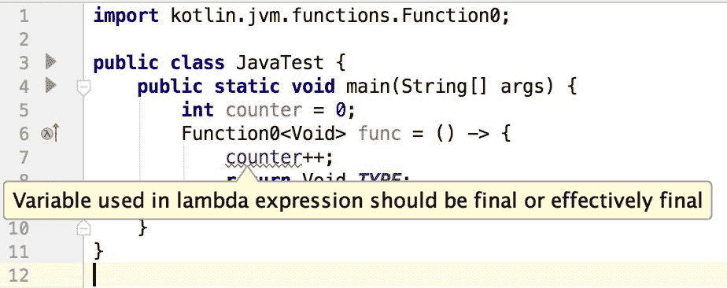
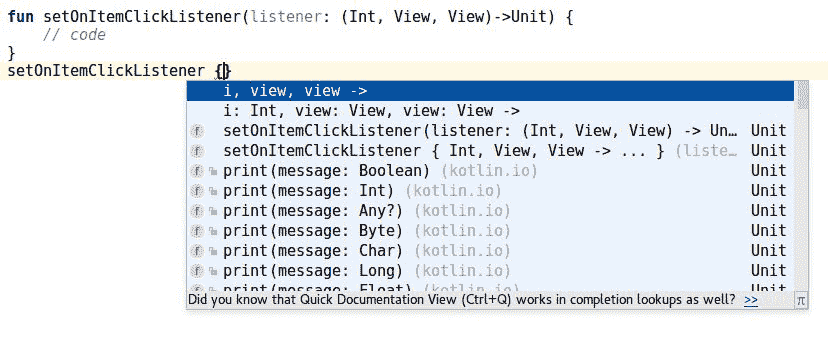
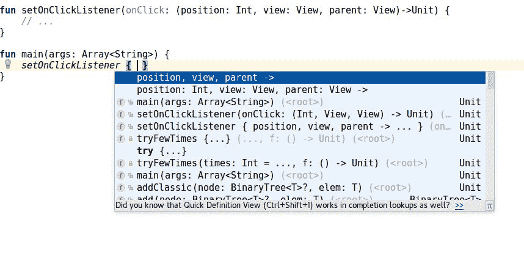
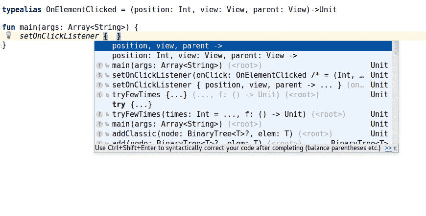
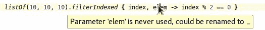
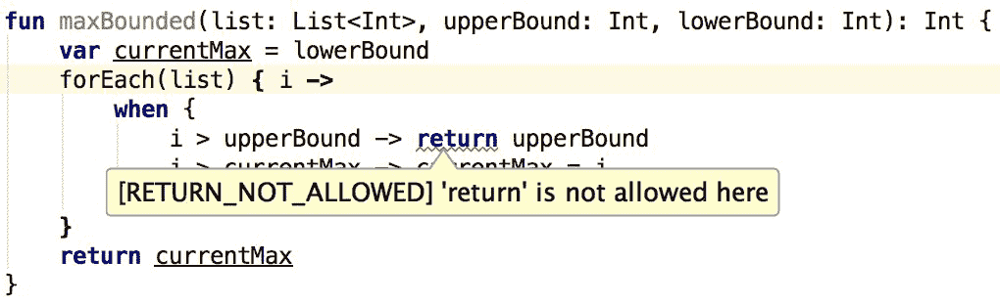
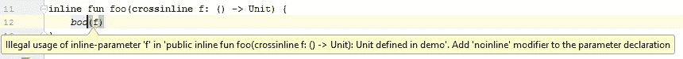

# 五、作为一等公民的函数

在前一章中，我们看到了 Kotlin 特性是如何与 OOP 相关联的。本章将介绍标准安卓开发中以前没有的高级功能编程特性。其中一些是在 Java 8 中引入的(在 Android 中是通过 Retrolambda 插件引入的)，但是 Kotlin 引入了更多的功能性编程特性。

这一章是关于高级功能和作为一级公民的功能。大多数概念对于过去使用过函数式语言的读者来说是熟悉的。

在本章中，我们将涵盖以下主题:

*   函数类型
*   匿名函数
*   λ表达式
*   lambda 表达式中单个参数的隐式名称
*   高阶函数
*   参数约定中的最后一个 lambda
*   Java **单抽象方法** ( **SAM** ) lambda 接口
*   参数使用的单一抽象方法
*   函数类型中的命名参数
*   类型别名
*   内嵌函数
*   函数引用

# 功能类型

Kotlin 支持函数式编程，函数在 Kotlin 是一等公民。在给定的编程语言中，一级公民是一个术语，它描述了一个实体，该实体支持其他实体通常可以使用的所有操作。这些操作通常包括作为参数传递、从函数返回以及分配给变量。句子“*一个函数在Kotlin*中是一等公民”那么应该理解为:*在Kotlin中可以传递函数作为参数，从函数中返回它们，并将其分配给变量*。虽然 Kotlin 是一种静态类型的语言，但是需要定义一个函数类型来允许这些操作。在柯特林中，用于定义函数类型的符号如下:

```kt
    (types of parameters)->return type 
```

以下是一些例子:

*   `(Int)->Int`:以`Int`为自变量返回`Int`的函数
*   `()->Int`:不带参数返回`Int`的函数
*   `(Int)->Unit`:取`Int`不返回任何东西的函数(只有`Unit`，不需要返回)

以下是一些可以保存函数的属性示例:

```kt
    lateinit var a: (Int) -> Int   
    lateinit var b: ()->Int 
    lateinit var c: (String)->Unit 
```

The term *function type* is most often defined as the type of a variable or parameter to which a function can be assigned, or the argument or result type of a higher-order function taking or returning a function. In Kotlin, the function type can be treated like an interface.

我们将在本章后面看到，Kotlin 函数可以在参数中采用其他函数，甚至返回它们:

```kt
    fun addCache(function: (Int) -> Int): (Int) -> Int { 
        // code 
    } 

    val fibonacciNumber: (Int)->Int = // function implementation 
    val fibonacciNumberWithCache = addCache(fibonacciNumber) 
```

如果函数可以接受或返回函数，那么函数类型也需要能够定义以函数作为参数的函数，或者返回函数。这是通过简单地将函数类型符号作为参数或返回类型来实现的。以下是一些例子:

*   `(String)->(Int)->Int`:取`String`返回`Int`类型返回`Int`的函数。
*   `(()->Int)->String`:以另一个函数为自变量，返回`String`类型的函数。参数中的函数不接受参数并返回`Int`。

具有函数类型的每个属性都可以像函数一样调用:

```kt
    val i = a(10) 
    val j = b() 
    c("Some String") 
```

函数不仅可以存储在变量中，还可以用作泛型。例如，我们可以将函数保留在列表中:

```kt
    var todoList: List<() -> Unit> = // ... 
    for (task in todoList) task() 
```

前面的列表可以存储带有`() -> Unit`签名的函数。

# 引擎盖下的功能类型是什么？

实际上，函数类型只是通用接口的语法糖。让我们看一些例子:

*   `()->Unit`签名是`Function0<Unit>`的接口。表达式为`Function0`，因为它的参数为零，`Unit`因为它是返回类型。
*   `(Int)->Unit`签名是`Function1<Int, Unit>`的接口。表达式为`Function1`，因为它有一个参数。
*   `()->(Int, Int)->String`签名是`Function0<Function2<Int, Int, String>>`的接口。

所有这些接口都只有一个方法`invoke`，就是运算符。它允许对象像函数一样使用:

```kt
    val a: (Int) -> Unit = //... 
    a(10)        // 1 
    a.invoke(10) // 1 
```

1.  这两种说法意思相同

标准库中不存在函数接口。它们是合成编译器生成的类型(它们是在编译期间生成的)。因此，函数类型参数的数量没有人为限制，标准库的大小也没有增加。

# 匿名函数

将函数定义为对象的一种方法是使用**匿名函数**。它们的工作方式与普通函数相同，但它们在`fun`关键字和参数声明之间没有名称，因此默认情况下它们被视为对象。这里有几个例子:

```kt
    val a: (Int) -> Int = fun(i: Int) = i * 2 // 1 
    val b: ()->Int = fun(): Int { return 4 } 
    val c: (String)->Unit = fun(s: String){ println(s) } 
```

1.  这是一个匿名的单表达式函数。请注意，与普通的单表达式函数一样，当从表达式返回类型推断返回类型时，不需要指定返回类型。

考虑以下用法:

```kt
    // Usage 
    println(a(10))      // Prints: 20 
    println(b())        // Prints: 4 
    c("Kotlin rules")   // Prints: Kotlin rules 
```

在前面的例子中，函数类型是显式定义的，但是虽然 Kotlin 有一个很好的类型推断系统，但是函数类型也可以从匿名默认函数定义的类型中推断出来:

```kt
    var a = fun(i: Int) = i * 2 
    var b = fun(): Int { return 4 } 
    var c = fun(s: String){ println(s) } 
```

它也以相反的方式工作。当我们定义属性的类型时，我们不需要在匿名函数中显式设置参数类型，因为它们是推断出来的:

```kt
    var a: (Int)->Int = fun(i) = i * 2 
    var c: (String)->Unit = fun(s){ println(s) }
```

如果我们检查函数类型的方法，那么我们会看到里面只有`invoke`方法。`invoke`方法是一个运算符函数，可以和函数调用一样使用。这就是为什么使用括号内的`invoke`调用可以获得相同的结果:

```kt
    println(a.invoke(4))        // Prints: 8 
    println(b.invoke())         // Prints: 4 
    c.invoke("Hello, World!")   // Prints: Hello, World! 
```

例如，当我们将函数保存在可空变量中时，这些知识可能会有所帮助。例如，我们可以通过使用安全调用来使用`invoke`方法:

```kt
    var a: ((Int) -> Int)? = null // 1 
    if (false) a = fun(i: Int) = i * 2 
    print(a?.invoke(4)) // Prints: null 
```

1.  变量`a`是可空的，我们通过安全调用来使用 invoke。

我们来看一个安卓的例子。我们通常希望定义一个包含多个日志记录方法的错误处理程序，并将其作为参数传递给不同的对象。下面是我们如何使用匿名函数实现它:

```kt
    val TAG = "MainActivity" 
    val errorHandler = fun (error: Throwable) { 
        if(BuildConfig.DEBUG) { 
            Log.e(TAG, error.message, error) 
        } 
        toast(error.message) 
        // Other methods, like: Crashlytics.logException(error) 
    } 

    // Usage in project 
    val adController = AdController(errorHandler) 
    val presenter = MainPresenter(errorHandler) 

    // Usage 
    val error = Error("ExampleError") 
    errorHandler(error) // Logs: MainActivity: ExampleError 
```

匿名函数简单而有用。它们是定义可以作为对象使用和传递的函数的简单方法。但是有一种更简单的方法来实现类似的行为，它被称为 lambda 表达式。

# λ表达式

在 Kotlin 中定义匿名函数的最简单方法是使用一个名为 lambda 表达式的特性。它们类似于 Java 8 lambda 表达式，但最大的区别是 Kotlin lambdas 实际上是闭包，因此它们允许我们从创建上下文中更改变量。这在 Java 8 lambdas 中是不允许的。我们将在本节后面讨论这种差异。让我们从一些简单的例子开始。Kotlin 中的 Lambda 表达式具有以下符号:

```kt
    { arguments -> function body } 
```

不是返回，而是返回最后一个表达式的结果。以下是一些简单的 lambda 表达式示例:

*   `{ 1 }`:不接受参数，返回 1 的 lambda 表达式。其类型为`()->Int`。
*   `{ s: String -> println(s) }`:一个 lambda 表达式，接受类型为`String`的一个参数，并打印出来。它返回`Unit`。其类型为`(String)->Unit`。
*   `{ a: Int, b: Int -> a + b }`:一个 lambda 表达式，接受两个`Int`参数并返回它们的总和。它的类型是`(Int, Int)->Int`。

我们在上一章中定义的函数可以使用 lambda 表达式来定义:

```kt
    var a: (Int) -> Int = { i: Int -> i * 2 } 
    var b: ()->Int = { 4 } 
    var c: (String)->Unit = { s: String -> println(s) } 
```

虽然返回值取自 lambda 表达式中的最后一条语句，但不允许返回，除非它有一个由标签限定的`return`语句:

```kt
    var a: (Int) -> Int = { i: Int -> return i * 2 } 
    // Error: Return is not allowed there 
    var l: (Int) -> Int = l@ { i: Int -> return@l i * 2 } 
```

Lambda 表达式可以是多行的:

```kt
    val printAndReturn = { i: Int, j: Int -> 
        println("I calculate $i + $j") 
        i + j // 1 
    } 
```

1.  这是最后一条语句，因此该表达式的结果将是返回值。

当多个语句用分号分隔时，也可以在一行中定义它们:

```kt
val printAndReturn = {i: Int, j: Int -> println("I calculate $i + $j"); 
                      i + j } 
```

lambda 表达式不需要只对参数提供的值进行操作。Kotlin 中的 Lambda 表达式可以使用创建它们的上下文中的所有属性和函数:

```kt
    val text = "Text" 
    var a: () -> Unit = { println(text) } 
    a() // Prints: Text 
    a() // Prints: Text 
```

这是 Kotlin 和 Java 8 lambda 用法的最大区别。Java 匿名对象和 Java 8 lambda 表达式都允许我们使用上下文中的字段，但是 Java 不允许我们为这些变量分配不同的值(lambda 中使用的 Java 变量必须是 final):



Kotlin 更进一步，允许 lambda 表达式和匿名函数修改这些变量。包含局部变量并允许我们在函数体内更改它们的 Lambda 表达式称为**闭包**。Kotlin 完全支持闭包定义。为了避免 lambdas 和闭包之间的混淆，在本书中，我们将总是把它们都称为 lambdas。让我们看一个例子:

```kt
    var i = 1 
    val a: () -> Int = { ++i } 
    println (i)     // Prints: 1 
    println (a())   // Prints: 2 
    println (i)     // Prints: 2 
    println (a())   // Prints: 3 
    println (i)     // Prints: 3
```

Lambda 表达式可以使用和修改本地上下文中的变量。下面是计数器的一个例子，其中的值保存在一个局部变量中:

```kt
    fun setUpCounter() { 
        var value: Int = 0 
        val showValue = { counterView.text = "$value" } 
        counterIncView.setOnClickListener { value++; showValue() } 
        // 1 
        counterDecView.setOnClickListener { value--; showValue() } 
        // 1 
    } 
```

1.  以下是如何使用 lambda 表达式在 Kotlin 中设置视图`onClickListener`。这将在Kotlin的 *Java SAM 支持部分进行描述。*

由于这一特性，使用 lambda 表达式变得更加简单。注意，在前面的例子中，没有指定`showValue`类型。这是因为在 Kotlin lambdas 中，当编译器可以从上下文中推断出参数时，键入参数是可选的:

```kt
    val a: (Int) -> Int = { i -> i * 2 }  // 1 
    val c: (String)->Unit = { s -> println(s) } // 2 
```

1.  `i`的推断类型是`Int`，因为函数类型定义了一个`Int`参数。
2.  `s`的推断类型是`String`，因为函数类型定义了一个`String`参数。

正如我们在下面的例子中看到的，我们不需要指定参数的类型，因为它是从属性的类型中推断出来的。类型推断也以另一种方式工作——我们可以定义 lambda 表达式的参数类型来推断属性类型:

```kt
    val b = { 4 }                        // 1 
    val c = { s: String -> println(s) }  // 2 
    val a = { i: Int -> i * 2 }          // 3 
```

1.  推断的类型是`()->Int`，因为`4`是`Int`，没有参数类型。
2.  推断类型为`(String)->Unit`，因为参数类型为`String`，`println`方法返回类型为`Unit`。
3.  推断的类型是`(Int)->Int`，因为`i`的类型是`Int`，从`Int`开始的倍运算的返回类型也是`Int`。

这个推论简化了 lambda 表达式的定义。通常，当我们将 lambda 表达式定义为函数参数时，我们不需要每次都指定参数类型。但是还有另一个好处——虽然可以推断参数类型，但是可以使用单参数 lambda 表达式的更简单的表示法。让我们在下一节讨论这个问题。

# 单个参数的隐式名称

当满足两个条件时，我们可以使用`it`关键字省略 lambda 参数定义和访问参数:

*   只有一个参数
*   参数类型可以从上下文中推断出来

作为一个例子，让我们再次定义属性`a`和`c`，但是这次使用单个参数的隐式名称:

```kt
    val a: (Int) -> Int = { it * 2 }         // 1
    val c: (String)->Unit = { println(it) }  // 2 
```

1.  与`{ i -> i * 2 }`相同。
2.  与`{ s -> println(s) }`相同。

这种符号在 Kotlin 中非常流行，主要是因为它更短，并且允许我们避免参数类型规范。它还提高了以 LINQ 风格定义的处理的可读性。这种风格需要尚未引入的组件，但为了展示这个想法，让我们看一个例子:

```kt
    strings.filter { it.length = 5 }.map { it.toUpperCase() } 
```

假设字符串为`List<String>`，该表达式过滤长度等于`5`的字符串，并将其转换为大写。

注意，在 lambda 表达式的主体中，我们可以使用`String`类的方法。这是因为函数类型(如`filter`的`(String)->Boolean`)是从方法定义中插入的，而方法定义是从可迭代类型(`List<String>`)中推断出`String`。此外，返回列表的类型(`List<String>`)取决于 lambda 返回的内容(`String`)。

LINQ 风格在函数式语言中很受欢迎，因为它使集合或字符串处理的语法变得非常简单和简洁。将在[第 7 章](7.html#532G60-7a7324e7f1a1454d830df91c6b78f317)、*扩展功能和属性*中详细讨论。

# 高阶函数

高阶函数是以至少一个函数作为参数的函数，或者返回一个函数作为结果的函数。它在Kotlin得到充分支持，因为它的功能是一级公民。让我们看一个例子。假设我们需要两个函数:一个将列表中所有`BigDecimal`数字相加的函数，一个将得到所有这些数字的乘积(该列表中所有元素相乘的结果)的函数:

```kt
    fun sum(numbers: List<BigDecimal>): BigDecimal { 
        var sum = BigDecimal.ZERO 
        for (num in numbers) { 
            sum += num 
        } 
        return sum 
    } 

    fun prod(numbers: List<BigDecimal>): BigDecimal { 
        var prod = BigDecimal.ONE 
        for (num in numbers) { 
            prod *= num 
        } 
        return prod 
    } 

    // Usage 
    val numbers = listOf( 
        BigDecimal.TEN,  
        BigDecimal.ONE,  
        BigDecimal.valueOf(2) 
    ) 
    print(numbers)          //[10, 1, 2] 
    println(prod(numbers))  // 20 
    println(sum(numbers))   // 13 
```

这些都是可读的函数，但这些函数几乎是相同的。唯一不同的是名称、累加器(`BigDecimal.ZERO`或`BigDecimal.ONE`)和操作。如果我们使用 **DRY** ( **不要重复自己**)规则，那么我们就不应该在项目中留下类似代码的两个部分。虽然很容易定义一个行为相似但使用的对象不同的函数，但很难定义一个执行的操作不同的函数(这里，函数的不同之处在于用于累加的操作)。解决方案带有函数类型，因为我们可以将操作作为参数传递。在本例中，可以通过以下方式提取常用方法:

```kt
    fun sum(numbers: List<BigDecimal>) = 
        fold(numbers, BigDecimal.ZERO) { acc, num -> acc + num } 

    fun prod(numbers: List<BigDecimal>) = 
       fold(numbers, BigDecimal.ONE) { acc, num -> acc * num } 

    private fun fold( 
        numbers: List<BigDecimal>, 
        start: BigDecimal, 
        accumulator: (BigDecimal, BigDecimal) -> BigDecimal 
    ): BigDecimal { 
        var acc = start 
        for (num in numbers) { 
            acc = accumulator(acc, num) 
        } 
        return acc 
    } 

    // Usage 

    fun BD(i: Long) = BigDecimal.valueOf(i) 
    val numbers = listOf(BD(1), BD(2), BD(3), BD(4)) 
    println(sum(numbers))   // Prints: 10 
    println(prod(numbers))  // Prints: 24 
```

`fold`函数迭代数字，并使用每个元素更新`acc`。请注意，函数参数的定义类似于任何其他类型，它可以像任何其他函数一样使用。例如，我们可以有 vararg 函数类型参数:

```kt
    fun longOperation(vararg observers: ()->Unit) {
        //... 
        for(o in observers) o()
    } 
```

在`longOperation`中，`for`用于迭代所有观察器，并一个接一个地调用它们。该函数允许提供多个函数作为参数。这里有一个例子:

```kt
    longOperation({ notifyMainView() }, { notifyFooterView() })
```

Kotlin 中的函数也可以返回函数。例如，我们可以定义一个函数，该函数将创建具有相同错误日志记录但不同标记的自定义错误处理程序:

```kt
    fun makeErrorHandler(tag: String) = fun (error: Throwable) { 
        if(BuildConfig.DEBUG) Log.e(tag, error.message, error) 
        toast(error.message) 
        // Other methods, like: Crashlytics.logException(error) 
    } 

    // Usage in project 
    val adController = AdController(makeErrorHandler("Ad in MainActivity")) 
    val presenter = MainPresenter(makeErrorHandler("MainPresenter")) 

    // Usage 
    val exampleHandler = makeErrorHandler("Example Handler") 
    exampleHandler(Error("Some Error")) // Logs: Example Handler: Some Error 
```

使用参数中的函数时，最常见的三种情况是:

*   为功能提供操作
*   观察者(听者)模式
*   线程操作后的回调

让我们详细看看它们。

# 为功能提供操作

正如我们在上一节中看到的，有时我们想从函数中提取公共功能，但是它们使用的操作不同。在这种情况下，我们仍然可以提取这个功能，但是我们需要提供一个带有操作的参数来区分它们。这样，任何通用模式都可以被提取和重用。例如，我们通常只需要列表中匹配某个谓词的元素，例如当我们只想显示活动的元素时。通常，这是这样实现的:

```kt
    var visibleTasks = emptyList<Task>() 
    for (task in tasks) { 
        if (task.active) 
        visibleTasks += task 
    } 
```

虽然这是一个常见的操作，但我们可以提取仅根据谓词过滤一些元素的功能，以分离函数并更容易地使用它:

```kt
    fun <T> filter(list: List<T>, predicate: (T)->Boolean) { 
        var visibleTasks = emptyList<T>() 
        for (elem in list) { 
            if (predicate(elem)) 
                visibleTasks += elem 
        } 
    } 

    var visibleTasks = filter(tasks, { it.active }) 
```

这种使用高阶函数的方式非常重要，这将在整本书中经常描述，但这不是经常使用高阶函数的唯一方式。

# 观察者(听者)模式

当我们想要在事件发生时执行操作时，我们使用观察者(监听器)模式。在安卓开发中，观察者经常被设置为查看元素。常见的例子有点击式监听器、触摸式监听器或文本观察器。在 Kotlin 中，我们可以设置没有样板文件的侦听器。例如，在按钮单击时设置监听器如下所示:

```kt
    button.setOnClickListener({ someOperation() }) 
```

注意`setOnClickListener`是安卓库中的一个 Java 方法。稍后，我们将详细了解为什么我们可以将它与 lambda 表达式一起使用。侦听器的创建非常简单。这里有一个例子:

```kt
    var listeners: List<()->Unit> = emptyList() // 1 
    fun addListener(listener: ()->Unit) { 
        listeners += listener // 2 
    } 

    fun invokeListeners() { 
        for( listener in listeners) listener() // 3 
    } 
```

1.  在这里，我们创建一个空列表来保存所有的侦听器。
2.  我们可以简单地在监听器列表中添加一个监听器。
3.  我们可以遍历侦听器，并一个接一个地调用它们。

很难想象这种模式有更简单的实现。还有另一种常见的使用情况，通常使用带有函数类型的参数——在线程操作之后回调。

# 线程操作后的回调

如果我们需要做一个长时间的操作，并且我们不想让用户等待它，那么我们必须在另一个线程中启动它。为了能够在单独的线程中调用长操作后使用回调，我们需要将其作为参数传递。下面是一个示例函数:

```kt
fun longOperationAsync(longOperation: ()->Unit, callback: ()->Unit) { 
        Thread({ // 1 
            longOperation() // 2 
            callback() // 3 
        }).start() // 4 
    } 

    // Usage
    longOperationAsync(
            longOperation = { Thread.sleep(1000L) },
            callback = { print("After second") } 
            // 5, Prints: After second
    )
    println("Now") // 6, Prints: Now
```

1.  在这里，我们创建`Thread`。我们还传递了一个希望在构造函数参数上执行的 lambda 表达式。
2.  这里，我们正在执行一个长时间的操作。
3.  这里，我们开始参数中提供的回调操作。
4.  `start`是启动已定义线程的方法。
5.  延迟一秒后打印。
6.  会立即打印出来。

实际上，使用回调有一些流行的替代方法，比如 RxJava。尽管如此，经典的回调仍然被普遍使用，在 Kotlin 中，它们可以不用样板文件来实现。

这些是使用高阶函数的最常见的用例。所有这些都允许我们提取常见行为并减少样板文件。Kotlin 允许对高阶函数进行一些改进。

# 命名参数和 lambda 表达式的组合

使用默认命名参数和 lambda 表达式在 Android 中非常有用。让我们看看其他一些实用的安卓例子。假设我们有一个下载元素并展示给用户的功能。我们将添加一些参数:

*   `onStart`:网络运行前会调用这个
*   `onFinish`:网络运行后会调用这个

```kt
fun getAndFillList(onStart: () -> Unit = {}, 
    onFinish: () -> Unit = {}){ 
        // code 
    } 
```

然后，我们可以在`onStart`和`onFinish`中显示和隐藏加载微调器:

```kt
    getAndFillList( 
        onStart = { view.loadingProgress = true } , 
        onFinish = { view.loadingProgress = false } 
    ) 
```

如果我们从`swipeRefresh`开始，那么当它结束时，我们只需要隐藏它:

```kt
getAndFillList(onFinish = { view.swipeRefresh.isRefreshing = 
   false }) 
```

如果我们想安静地刷新，那么我们就称之为:

```kt
    getAndFillList() 
```

命名参数语法和 lambda 表达式是多用途函数的完美匹配。这将选择我们想要实现的参数的能力和应该实现的操作联系起来。如果一个函数包含多个函数类型参数，那么在大多数情况下，它应该由命名参数语法使用。这是因为当使用多个参数时，lambda 表达式很少是自解释的。

# 参数约定中的最后一个 lambda

在 Kotlin 中，高阶函数真的很重要，因此让它们的使用尽可能舒适也很重要。这就是为什么Kotlin引入了一个特殊的约定，使高阶函数更加简单明了。它是这样工作的:如果最后一个参数是一个函数，那么我们可以在括号外定义一个 lambda 表达式。让我们看看如果与`longOperationAsync`函数一起使用会是什么样子，定义如下:

```kt
    fun longOperationAsync(a: Int, callback: ()->Unit) { 
        // ... 
    } 
```

函数类型位于参数的最后一个位置。这就是为什么我们可以这样执行它:

```kt
    longOperationAsync(10) {
        hideProgress() 
    } 
```

由于参数约定中的最后一个 lambda，我们可以在括号后找到 lambda。看起来好像不在争论范围之内。

举个例子，让我们看看如何在另一个线程中调用代码。在 Kotlin 中启动新线程的标准方式是使用 Kotlin 标准库中的`thread`函数。其定义如下:

```kt
    public fun thread( 
        start: Boolean = true, 
        isDaemon: Boolean = false, 
        contextClassLoader: ClassLoader? = null, 
        name: String? = null, 
        priority: Int = -1, 
        block: () -> Unit): Thread { 
            // implementation 
        } 
```

如我们所见，`block`参数取应该异步调用的操作，位于最后一个位置。所有其他参数都定义了默认参数。这就是为什么我们可以这样使用`thread`功能:

```kt
    thread { /* code */ } 
```

`thread`定义还有很多其他的参数，我们可以通过使用命名的参数语法或者通过一个接一个地提供它们来设置它们:

```kt
    thread (name = "SomeThread") { /*...*/ } 
    thread (false, false) { /*...*/ } 
```

参数约定中的最后一个 lambda 是语法糖，但它使使用高阶函数变得容易得多。这是两种最常见的情况，在这两种情况下，这个惯例真的有所不同:

*   命名代码周围
*   使用 LINQ 风格处理数据结构

让我们仔细看看它们。

# 命名代码周围

有时我们需要标记代码的某个部分，以不同的方式执行。`thread`功能就是这种情况。我们需要一些异步执行的代码，所以我们从`thread`函数开始用括号括起来:

```kt
    thread {  
        operation1() 
        operation2() 
    } 
```

从外部看，它似乎是被名为`thread`的块包围的代码的一部分。让我们看另一个例子。假设我们想要记录某个代码块的执行时间。作为助手，我们将定义`addLogs`函数，该函数将与执行时间一起打印日志。我们将以以下方式定义它:

```kt
    fun addLogs(tag: String, f: () -> Unit) { 
        println("$tag started") 
        val startTime = System.currentTimeMillis() 
        f() 
        val endTime = System.currentTimeMillis() 
        println("$tag finished. It took " + (endTime - startTime)) 
    } 
```

以下是该函数的用法:

```kt
    addLogs("Some operations") { 
        // Operations we are measuring 
    } 
```

下面是它的一个执行示例:

```kt
    addLogs("Sleeper") { 
        Thread.sleep(1000) 
    } 
```

在执行上述代码时，会出现以下输出:

```kt
    Sleeper started 
    Sleeper finished. It took 1001 
```

打印的确切毫秒数可能略有不同。

这种模式在 Kotlin 项目中非常有用，因为有些模式与代码块相连接。例如，在执行至少需要这个版本才能工作的功能之前，通常会检查应用编程接口的版本是否在安卓 5.x 棒棒糖之后。为了检查它，我们使用了以下条件:

```kt
    if (Build.VERSION.SDK_INT >= Build.VERSION_CODES.LOLLIPOP) {  
        // Operations 
    } 
```

但是在 Kotlin 中，我们可以通过以下方式提取函数:

```kt
    fun ifSupportsLolipop(f:()->Unit) { 
        if (Build.VERSION.SDK_INT >= Build.VERSION_CODES.LOLLIPOP) 
        {  
            f() 
        } 
    } 
```

```kt
    //Usage    
    ifSupportsLollipop { 
        // Operation 
    } 
```

这不仅很舒服，而且降低了代码的冗余度。这通常被称为非常好的做法。还要注意，这个约定允许我们定义以类似于标准方式工作的控制结构。例如，我们可以定义一个简单的控制结构，只要主体中的语句不返回错误，它就会运行。以下是定义和用法:

```kt
    fun repeatUntilError(code: ()->Unit): Throwable { 
        while (true) { 
            try { 
                code() 
            } catch (t: Throwable) { 
                return t 
            } 
        } 
    } 

    // Usage 
    val tooMuchAttemptsError = repeatUntilError { 
        attemptLogin() 
    } 
```

另一个优点是我们的自定义数据结构可以返回值。令人印象深刻的是，is 不需要任何额外的语言支持，我们可以定义几乎任何我们想要的控制结构。

# 使用 LINQ 风格处理数据结构

我们已经提到 Kotlin 允许 LINQ 风格的处理。参数约定中的最后一个 lambda 是帮助其可读性的另一个组件。例如，请看下面的代码:

```kt
    strings.filter { it.length == 5 }.map { it.toUpperCase() } 
```

它比不使用参数约定中最后一个 lambda 的符号更易读:

```kt
    strings.({ s -> s.length == 5 }).map({ s -> s.toUpperCase() }) 
```

同样，稍后将在[第 7 章](7.html#532G60-7a7324e7f1a1454d830df91c6b78f317)、*扩展函数和属性*中详细讨论这个处理，但是目前我们已经了解了两个提高其可读性的特性(参数约定中的最后一个 lambda 和单个参数的隐式名称)。

参数约定中的最后一个 lambda 是为了改进 lambda 表达式的使用而引入的 Kotlin 特性之一。还有更多这样的改进，它们如何协同工作对于使高阶函数的使用变得简单、可读和高效非常重要。

# Kotlin 中的 Java SAM 支持

在 Kotlin 中使用高阶函数真的很容易。问题是我们经常需要与 Java 进行互操作，而 Java 本身并不支持它。它通过仅使用一种方法的接口来实现替换。这种接口称为**单抽象方法** ( **SAM** )或功能接口。我们需要以这种方式设置函数的情况的最好例子是，当我们在`View`元素上使用`setOnClickListener`时。在 Java(直到 8)中，没有比使用匿名内部类更简单的方法了:

```kt
    //Java 
    button.setOnClickListener(new OnClickListener() { 
        @Override public void onClick(View v) { 
            // Operation 
        } 
    }); 
```

在前面的例子中，`OnClickListener`方法是 SAM，因为它只包含一个方法，`onClick`。虽然 SAMs 实际上经常被用作函数定义的替代，但是 Kotlin 也为它们生成了一个包含函数类型作为参数的构造函数。它被称为 SAM 构造函数。SAM 构造函数允许我们创建一个 Java SAM 接口的实例，只需调用它的名字并传递一个*函数文本*。这里有一个例子:

```kt
    button.setOnClickListener(OnClickListener { 
        /* ... */ 
    }) 
```

A *function literal* is an expression that defines unnamed function. In Kotlin, there are two kinds of *function literal*:

1\. Anonymous functions
2\. Lambda expressions

Both Kotlin *function literal* have already been described:

`val a = fun() {} // Anonymous function`
`val b = {} // Lambda expression`

更好的是，对于每一个使用 SAM 的 Java 方法，Kotlin 编译器都会生成一个版本，而不是使用一个函数作为参数。这就是为什么我们可以设置`OnClickListener`如下:

```kt
    button.setOnClickListener { 
        // Operations 
    } 
```

请记住，Kotlin 编译器只为 Java SAMs 生成 SAM 构造函数和函数方法。它不是用一个方法为 Kotlin 接口生成 SAM 构造函数。这是因为 Kotlin 社区正在推动使用函数类型，而不是 Kotlin 代码中的 SAMs。当一个函数用 Kotlin 编写并包含一个 SAM 时，我们不能将它用作参数上带有 SAM 的 Java 方法:

```kt
    interface OnClick { 
        fun call() 
    } 

    fun setOnClick(onClick: OnClick) { 
        //... 
    } 

    setOnClick {  } // 1\. Error 
```

1.  这不起作用，因为`setOnClick`函数是用 Kotlin 编写的。

在 Kotlin 中，接口不应该这样使用。首选的方法是使用函数类型而不是 SAMs:

```kt
    fun setOnClick(onClick: ()->Unit) { 
        //...   
    } 

    setOnClick {  } // Works 
```

Kotlin 编译器为 Java 中定义的每个 SAM 接口生成一个 SAM 构造函数。该接口只包括可以替代 SAM 的功能类型。请看下面的界面:

```kt
    // Java, inside View class 
    public interface OnClickListener { 
        void onClick(View v); 
    } 
```

我们可以这样在Kotlin使用它:

```kt
    val onClick = View.OnClickListener { toast("Clicked") } 
```

或者我们可以提供它作为函数参数:

```kt
    fun addOnClickListener(d: View.OnClickListener) {} 
    addOnClickListener( View.OnClickListener { v -> println(v) }) 
```

下面是更多来自安卓的 Java SAM lambda 接口和方法的例子:

```kt
    view.setOnLongClickListener { /* ... */; true } 
    view.onFocusChange { view, b -> /* ... */ } 

    val callback = Runnable { /* ... */ } 
    view.postDelayed(callback, 1000) 
    view.removeCallbacks(callback) 
```

这里有一些来自 RxJava 的例子:

```kt
    observable.doOnNext { /* ... */ } 
    observable.doOnEach { /* ... */ } 
```

现在，让我们看看如何实现 SAM 定义的 Kotlin 替代方案。

# 命名的 Kotlin 函数类型

Kotlin 不支持 Kotlin 中定义的类型的 SAM 转换，因为首选的方法是使用函数类型。但是 SAM 相对于经典的函数类型有一些优势:命名的和命名的参数。当函数类型的定义很长或作为参数多次传递时，最好将其命名为。当不清楚每个参数的类型意味着什么时，使用命名参数是很好的。

在接下来的部分中，我们将看到可以命名参数和函数类型的整个定义。这可以通过函数类型中的类型别名和命名参数来完成。这样，在坚持函数类型的同时，有可能拥有 SAM 的所有优点。

# 函数类型中的命名参数

到目前为止，我们只看到函数类型的定义，其中只指定了类型，而没有指定参数名。参数名称已在*函数文字*中指定:

```kt
    fun setOnItemClickListener(listener: (Int, View, View)->Unit) { 
        // code 
    } 
    setOnItemClickListener { position, view, parent -> /* ... */ } 
```

当参数不是不言自明的，开发人员不知道参数是什么意思时，问题就来了。对于 SAMs，有一些建议，但是在前面的示例中定义的函数类型中，它们并没有真正的帮助:



解决方法是用命名参数定义函数类型。这是它的样子:

```kt
    (position: Int, view: View, parent: View)->Unit 
```

这种表示法的好处是，集成开发环境建议将这些名称作为*函数文字*中的参数名称。正因为如此，程序员可以避免任何混乱:



当同一个函数类型被多次使用时，问题就出现了，那么为每个定义定义那些参数就不容易了。在这种情况下，使用了一个不同的 Kotlin 特性-我们在下一节中描述的特性- *类型别名*。

# 类型别名

从 1.1 版本开始，Kotlin 有一个名为**类型别名**的特性，它允许我们为现有类型提供替代名称。这里是一个类型别名定义的例子，我们列出了`Users`:

```kt
    data class User(val name: String, val surname: String) 
    typealias Users = List<User> 
```

这样，我们可以向现有数据类型添加更有意义的名称:

```kt
    typealias Weight = Double 
    typealias Length = Int 
```

类型别名必须在顶级声明。可见性修饰符可以应用于类型别名以调整其范围，但默认情况下它们是公共的。这意味着以前定义的类型别名可以不受任何限制地使用:

```kt
    val users: Users = listOf( 
        User("Marcin", "Moskala"),  
        User("Igor", "Wojda") 
    ) 

    fun calculatePrice(length: Length) { 
        // ... 
    } 
    calculatePrice(10) 

    val weight: Weight = 52.0 
    val length: Length = 34 
```

请记住，别名用于提高代码可读性，原始类型仍然可以互换使用:

```kt
    typealias Length = Int 
    var intLength: Int = 17 
    val length: Length = intLength 
    intLength = length 
```

`typealias`的另一个应用是缩短长泛型类型，赋予它们更有意义的名称。当同一类型在代码的多个位置使用时，这提高了代码的可读性和一致性:

```kt
    typealias Dictionary<V> = Map<String, V> 
    typealias Array2D<T> = Array<Array<T>> 
```

类型别名通常用于命名函数类型:

```kt
    typealias Action<T> = (T) -> Unit 
    typealias CustomHandler = (Int, String, Any) -> Unit 
```

我们可以将它们与函数类型参数名称一起使用:

```kt
    typealias OnElementClicked = (position: Int, view: View, parent: View)->Unit 
```

然后我们得到参数建议:



让我们看一个由类型别名命名的函数类型如何由类实现的例子。在本例中，来自函数类型的参数名也被建议作为方法参数名:

```kt
    typealias OnElementClicked = (position: Int, view: View, parent: View)->Unit 

    class MainActivity: Activity(), OnElementClicked { 

        override fun invoke(position: Int, view: View, parent: View) { 
            // code 
        } 
    } 
```

这些是我们使用命名函数类型的主要原因:

*   名称通常比整个函数类型定义更短、更容易
*   当我们传递函数时，在改变它们的定义之后，如果我们使用类型别名，我们不必到处都改变它
*   当我们使用类型别名时，更容易定义参数名

这两个特性(函数类型中的命名参数和类型别名)结合在一起就是为什么不需要在 Kotlin 中定义 SAMs 的原因——SAMs 相对于函数类型(名称和命名参数)的所有优势都可以通过函数类型定义和类型别名中的命名参数来实现。这是 Kotlin 如何支持函数式编程的另一个例子。

# 未使用变量的下划线

在某些情况下，我们定义的 lambda 表达式并不使用它的所有参数。当我们给它们命名时，它们可能会破坏正在读取这个 lambda 表达式并试图理解其目的的程序员。让我们看看每秒过滤一次元素的函数。第二个参数是元素值，在本例中未使用:

```kt
    list.filterIndexed { index, value -> index % 2 == 0 } 
```

为了避免误解，使用了一些约定，例如忽略参数名称:

```kt
    list.filterIndexed { index, ignored -> index % 2 == 0 } 
```

因为这些约定不清楚且有问题，Kotlin 引入了下划线符号，用于替代未使用的参数名称:

```kt
    list.filterIndexed { index, _ -> index % 2 == 0 } 
```

建议使用这种表示法，当 lambda 表达式参数未使用时，会显示一条警告:



# lambda 表达式中的析构

在[第 4 章](4.html#2JTHG0-7a7324e7f1a1454d830df91c6b78f317)、*类和对象*中，我们已经看到了如何使用析构声明将对象析构成多个属性:

```kt
data class User(val name: String, val surname: String, val phone: String) 

val (name, surname, phone) = user 
```

从 1.1 版本开始，Kotlin 可以对 lambda 参数使用析构声明语法。要使用它们，您应该使用圆括号，圆括号中包含我们想要析构到其中的所有参数:

```kt
    val showUser: (User) -> Unit = { (name, surname, phone) -> 
        println("$name $surname have phone number: $phone")  
    } 

    val user = User("Marcin", "Moskala", "+48 123 456 789") 
    showUser(user) 
    // Marcin Moskala have phone number: +48 123 456 789 
```

Kotlin's destructing declaration is position-based, as opposed to the property name-based destructuring declaration that can be found, for example, in TypeScript. In position-based destructing declarations, the order of properties decides which property is assigned to which variable. In property name-based destructuring, it is determined by the names of variables:

`//TypeScript`
`const obj = { first: 'Jane', last: 'Doe' };`
`const { last, first } = obj;`
`console.log(first); // Prints: Jane`
`console.log(last); // Prints: Doe`

Both solutions have its pros and cons. Position-based destructing declarations are secured for renaming a property, but they are not safe for property reordering. Name-based destructuring declarations are safe for property reordering but are vulnerable for property renaming.

析构声明可以在单个 lambda 表达式中多次使用，并且可以与普通参数一起使用:

```kt
    val f1: (Pair<Int, String>)->Unit = { (first, second) -> 
        /* code */ } // 1 
    val f2: (Int, Pair<Int, String>)->Unit = { index, (f, s)-> 
        /* code */ } // 2 
    val f3: (Pair<Int, String>, User) ->Unit = { (f, s), (name, 
        surname, tel) ->/* code */ } // 3 
```

1.  解构`Pair`
2.  `Pair`等元素的解构
3.  单个 lambda 表达式中的多重解构

请注意，我们可以将一个类分解成少于所有的组件:

```kt
    val f: (User)->Unit = { (name, surname) -> /* code */ } 
```

在析构声明中允许下划线标记。它最常用于进一步的组件:

```kt
    val f: (User)->Unit = { (name, _, phone) -> /* code */ } 
    val third: (List<Int>)->Int = { (_, _, third) -> third } 
```

可以指定析构参数的类型:

```kt
    val f = { (name, surname): User -> /* code */ } //1
```

1.  该类型是从 lambda 表达式中推断出来的

此外，由析构声明定义的参数:

```kt
    val f = { (name: String, surname: String): User -> 
       /* code */}// 1 
    val f: (User)->Unit = { (name, surname) -> 
      /* code */ } // 2 
```

1.  该类型是从 lambda 表达式中推断出来的。
2.  无法推断类型，因为 lambda 表达式中没有足够的类型信息。

这使得 lambdas 中的析构成为一个非常有用的特性。让我们看看安卓系统中使用 lambdas 解构的一些最常见的用例。用于处理`Map`的元素，因为它们属于`Map.Entry`类型，可以析构为`key`和`value`参数:

```kt
    val map = mapOf(1 to 2, 2 to "A") 
    val text = map.map { (key, value) -> "$key: $value" } 
    println(text) // Prints: [1: 2, 2: A] 
```

同样，可以析构成对列表:

```kt
    val listOfPairs = listOf(1 to 2, 2 to "A") 
    val text = listOfPairs.map { (first, second) -> 
        "$first and $second" } 
    println(text) // Prints: [1 and 2, 2 and A] 
```

当我们想要简化数据对象处理时，也可以使用析构声明:

```kt
    fun setOnUserClickedListener(listener: (User)->Unit) { 
        listView.setOnItemClickListener { _, _, position, _ -> 
            listener(users[position]) 
        } 
    } 

    setOnUserClickedListener { (name, surname) -> 
        toast("Clicked to $name $surname") 
    } 
```

这在用于异步处理元素的库中特别有用(比如 RxJava)。它们的函数被设计为处理单个元素，如果我们想要处理多个元素，那么我们需要将它们打包到`Pair`、`Triple`或其他一些数据类中，并在每个步骤中使用一个析构声明:

```kt
getQuestionAndAnswer() 
    .flatMap { (question, answer) -> 
      view.showCorrectAnswerAnimationObservable(question, answer)  
    }   
    .subscribe( { (question, answer) -> /* code */ } ) 
```

# 内嵌函数

高阶函数非常有帮助，它们可以真正提高代码的可重用性。然而，使用它们最大的问题之一是效率。Lambda 表达式被编译成类(通常是匿名类)，在 Java 中创建对象是一项繁重的操作。我们仍然可以有效地使用高阶函数，同时通过内联函数保持所有的好处。

内联函数的概念非常古老，它主要与 C++或 C 有关。当一个函数被标记为内联时，在代码编译期间，编译器会用该函数的实际主体替换所有的函数调用。此外，作为参数提供的 lambda 表达式被替换为它们的实际主体。它们不会被视为函数，而是实际代码。这使得字节码更长，但是运行时执行效率更高。稍后，我们将看到标准库中几乎所有的高阶函数都被标记为内联的。让我们看看这个例子。假设我们用`inline`修饰符标记了`printExecutionTime`函数:

```kt
    inline fun printExecutionTime(f: () -> Unit) { 
        val startTime = System.currentTimeMillis() 
        f() 
        val endTime = System.currentTimeMillis() 
        println("It took " + (endTime - startTime))  
    } 

    fun measureOperation() { 
        printExecutionTime { 
            longOperation() 
        } 
    } 
```

当我们编译和反编译`measureOperation`时，我们会发现函数调用被替换为它的实际体，参数函数调用被替换为 lambda 表达式的体:

```kt
    fun measureOperation() { 
        val startTime = System.currentTimeMillis() // 1 
        longOperation() // 2 
        val endTime = System.currentTimeMillis() 
        println("It took " + (endTime - startTime)) 
    } 
```

1.  `printExecutionTime`的代码被添加到`measureOperation`功能体。
2.  位于 lambda 内部的代码是在其调用中找到的。如果函数多次使用它，那么代码将替换每次调用。

The body of `printExecutionTime` can still be found in the code. It was skipped to make the example more readable. It is kept in the code because it might be used after compilation, for example, if this code is added to a project as a library. What is more, this function will still work as inline when used by Kotlin.

虽然不需要为 lambda 表达式创建类，但是内联函数可以加快具有函数参数的函数的执行速度。这种差异非常重要，因此建议对至少有一个函数参数的所有短函数使用 inline 修饰符。不幸的是，使用内联修饰符也有它不好的一面。第一，我们已经提到过——生成的字节码更长。这是因为函数调用被函数体替换，并且因为这个体内部的 lambda 调用被*函数文字*的体替换。此外，内联函数不能是递归的，并且它们不能使用具有比这个 lambda 表达式更严格的可见性修饰符的函数或类。例如，公共内联函数不能使用私有函数。原因是它可能导致代码注入到不能使用它们的函数中。这将导致编译错误。为了防止这种情况，Kotlin 不允许使用比放置它们的 lambda 表达式限制更少的元素。这里有一个例子:

```kt
    internal fun someFun() {}  
    inline fun inlineFun() { 
        someFun() // ERROR 
    } 
```

In fact, it is possible in Kotlin to use elements with more restrictive visibility in `inline` functions if we suppress this warning, but this is bad practice and it should never be used this way:

`// Tester1.kt`
`fun main(args: Array<String>) { a() }`

`// Tester2.kt`
`inline fun a() { b() }`
`private fun b() { print("B") }` How is it possible? For the internal modifier it is simpler, because the internal modifier is public under the hood. For private functions, there is an additional `access$b` function created that has `public` visibility and that is only invoking the `b` function:

`public static final void access$b() { b(); }` 
This behavior is presented here just to explain why less restrictive modifiers can sometimes be used inside `inline` functions (these situations can be found in Kotlin standard library in Kotlin 1.1). In the projects, we should design elements in such a way that there is no need to use such suppressions.

另一个问题是不太直观。虽然没有创建 lambda，但是我们不能将函数类型的参数传递给另一个函数。这里有一个例子:

```kt
    fun boo(f: ()->Int) { 
        //...  
    } 

    inline fun foo(f: () -> Int) { 
        boo (f) // ERROR, 1 
    } 
```

当函数为`inline`时，其函数参数不能传递给非内联函数。

这不起作用，因为没有创建`f`参数。它刚刚被定义为由*功能文字*体代替。这就是为什么它不能作为参数传递给另一个函数。

最简单的处理方法是将`boo`函数也内联。那就好了。在大多数情况下，我们不能内联太多函数。以下是几个原因:

*   `inline`功能应该用于较小的功能。如果我们正在制作使用其他`inline`函数的`inline`函数，那么它会导致编译后生成一个大的结构。这是一个问题，因为编译时间和结果代码的大小。
*   虽然`inline`函数不能使用具有比它们更严格的可见性修饰符的元素，但是如果我们希望在尽可能多的函数应该是私有的以保护 API 的库中使用它们，这将是一个问题。

处理这个问题最简单的方法就是制作我们确实想传递给另一个函数的函数参数`noinline`。

# 黑在线修改者

`noinline`是函数类型参数的修饰符。它将一个特定的参数视为普通的函数类型参数(它的调用不会被*函数文字*体所替代)。我们来看一个`noinline`的例子:

```kt
    fun boo(f: ()->Unit) { 
        //... 
    } 

    inline fun foo(before: ()->Unit, noinline f: () -> Unit) { // 1 
        before() // 2 
        boo (f) // 3 
    } 
```

1.  参数`f`之前的`noinline`注释修改器。
2.  before 函数将被用作参数的 lambda 表达式的主体替换。
3.  `f`是`noinline`，所以可以传递给 boo 函数。

使用`noinline`修改器的两个主要原因如下:

*   当我们需要将特定的 lambda 传递给其他函数时
*   当我们密集地调用 lambda 时，我们不想让代码膨胀太多

请注意，当我们设置所有函数参数`noinline,`时，内联这些函数几乎不会提高性能。虽然使用`inline`不太可能有好处，但编译器会显示警告。这就是为什么，在大多数情况下，`noinline`仅在有多个函数参数时使用，并且我们仅将其应用于其中一些参数。

# 非本地回报

带有函数参数的函数可能与本机结构(如循环)类似。我们已经看到了`ifSupportsLolipop`功能和`repeatUntilError`功能。一个更常见的例子是`forEach`修饰语。它是`for`控制结构的替代方案，它用一个接一个的元素调用一个参数函数。这就是它的实现方式(在柯特林标准库中有一个`forEach`修改器，但是我们稍后会看到它，因为它包含了尚未呈现的元素):

```kt
    fun forEach(list: List<Int>, body: (Int) -> Unit) { 
        for (i in list) body(i) 
    } 

    // Usage 
    val list = listOf(1, 2, 3, 4, 5) 
    forEach(list) { print(it) } // Prints: 12345 
```

最大的问题是，在以这种方式定义的`forEach`函数内部，我们无法从外部函数返回。例如，这就是我们如何使用`for`循环实现`maxBounded`功能:

```kt
    fun maxBounded(list: List<Int>, upperBound: Int, lowerBound: Int): 
    Int { 
        var currentMax = lowerBound 
        for(i in list) { 
            when { 
                i > upperBound -> return upperBound 
                i > currentMax -> currentMax = i 
            } 
        } 
        return currentMax 
    } 
```

如果我们想把`forEach`作为`for`循环的替代，那么类似的可能性应该被允许。问题是，相同的代码，但用`forEach`代替`for`循环，将无法编译:



原因与代码是如何编译的有关。我们已经讨论过，lambda 表达式被编译成匿名对象类，方法包括定义的代码，在那里我们不能从`maxBounded`函数返回，因为我们处于不同的上下文中。

我们会遇到`forEach`函数被标记为内联的情况。正如我们已经提到的，这个函数的主体在编译过程中会替换它的调用，参数中的所有函数都会替换为它们的主体。所以，在那里使用`return`修改器没有问题。然后，如果我们将`forEach`内联，我们可以在 lambda 表达式中使用 return:

```kt
    inline fun forEach(list: List<Int>, body: (Int)->Unit) { 
        for(i in list) body(i) 
    } 

    fun maxBounded(list: List<Int>, upperBound: Int, 
        lowerBound: Int): Int { 
        var currentMax = lowerBound 
        forEach(list) { i -> 
            when { 
                i > upperBound -> return upperBound 
                i > currentMax -> currentMax = i 
            } 
        } 
        return currentMax 
    } 
```

这就是`maxBounded`函数在 Kotlin 中是如何编译的，当它被反编译成 Java 时，代码看起来是这样的(经过一些清理和简化):

```kt
    public static final int maxBounded(@NotNull List list, 
    int upperBound, int lowerBound) { 
        int currentMax = lowerBound; 
        Iterator iter = list.iterator(); 

        while(iter.hasNext()) { 
            int i = ((Number)iter.next()).intValue(); 
            if(i > upperBound) { 
                return upperBound; // 1 
            } 

            if(i > currentMax) { 
                currentMax = i; 
            } 
        } 

        return currentMax; 
    } 
```

在前面的代码中，`return`很重要——它是在 lambda 表达式中定义的，并且是从`maxBounded`函数返回的。

在`inline`函数的 lambda 表达式中使用的`return`修饰符称为非局部返回。

# lambda 表达式中的标记返回

让我们看一个例子，我们需要从 lambda 表达式返回，而不是从函数返回。我们可以使用标签来做到这一点。下面是一个使用标签从 lambda 表达式返回的示例:

```kt
    inline fun <T> forEach(list: List<T>, body: (T) -> Unit) { // 1 
        for (i in list) body(i) 
    } 

    fun printMessageButNotError(messages: List<String>) { 
        forEach(messages) messageProcessor@ { // 2 
            if (it == "ERROR") return@messageProcessor // 3 
            print(it) 
        } 
    } 

    // Usage 
    val list = listOf("A", "ERROR", "B", "ERROR", "C") 
    processMessageButNotError(list) // Prints: ABC 
```

1.  这是`forEach`函数的通用实现，可以处理任何类型的列表。
2.  我们在`forEach`参数中为 lambda 表达式定义标签。
3.  我们从 label 指定的 lambda 表达式返回。

Kotlin 的另一个特性是，定义为函数参数的 lambda 表达式有一个默认标签，其名称与定义它们的函数相同。这个标签叫做**隐含标签**。当我们想要从`forEach`函数中定义的 lambda 表达式返回时，我们只需使用`return@forEach`即可。让我们看一个例子:

```kt
    inline fun <T> forEach(list: List<T>, body: (T) -> Unit) { // 1 
        for (i in list) body(i) 
    } 

    fun processMessageButNotError(messages: List<String>) { 
        forEach(messages) { 
            if (it == "ERROR") return@forEach // 1 
            process(it) 
        } 
    } 

    // Usage 
    val list = listOf("A", "ERROR", "B", "ERROR", "C") 
    processMessageButNotError(list) // Prints: ABC 
```

1.  隐式标签名取自函数名。

请注意，虽然`forEach`函数是内联的，但我们也可以使用非本地返回从`processMessageButNotError`函数返回:

```kt
    inline fun <T> forEach(list: List<T>, body: (T) -> Unit) { 
        for (i in list) body(i) 
    }  

    fun processMessageButNotError(messages: List<String>) { 
        forEach(messages) { 
            if (it == "ERROR") return 
            process(it) 
        } 
    } 

    // Usage 
    val list = listOf("A", "ERROR", "B", "ERROR", "C") 
    processMessageButNotError(list) // Prints: A 
```

让我们来看一个使用非本地返回标签的更复杂的例子。假设我们有两个`forEach`环，一个在另一个里面。当我们使用隐式标签时，它将从更深的循环返回。在我们的示例中，我们可以使用它来跳过特定消息的处理:

```kt
    inline fun <T> forEach(list: List<T>, body: (T) -> Unit) { // 1 
        for (i in list) body(i)  
    } 

    fun processMessageButNotError(conversations: List<List<String>>) { 
        forEach(conversations) { messages -> 
            forEach(messages) { 
                if (it == "ERROR") return@forEach // 1\. 
                process(it) 
            } 
        } 
    } 

    // Usage 
    val conversations = listOf( 
        listOf("A", "ERROR", "B"),  
        listOf("ERROR", "C"),  
        listOf("D") 
    ) 
    processMessageButNotError(conversations) // ABCD 
```

1.  这将从`forEach`函数中定义的 lambda 返回，该函数也将消息作为参数。

我们不能使用隐式标签从同一上下文中的另一个 lambda 表达式返回，因为它被更深的隐式标签遮蔽了。

在这些情况下，我们需要使用非本地隐式标签返回。仅允许使用内联函数参数。在我们的例子中，虽然`forEach`是内联的，但是我们可以通过这种方式从*函数文本*返回:

```kt
    inline fun <T> forEach(list: List<T>, body: (T) -> Unit) { // 1 
        for (i in list) body(i) 
    } 

    fun processMessageButNotError(conversations: List<List<String>>) { 
        forEach(conversations) conv@ { messages -> 
            forEach(messages) { 
                if (it == "ERROR") return@conv // 1\. 
                print(it) 
            } 
        } 
    } 

    // Usage 
    val conversations = listOf( 
        listOf("A", "ERROR", "B"), 
        listOf("ERROR", "C"), 
        listOf("D") 
    ) 
    processMessageButNotError(conversations) // AD 
```

1.  这将从在对话中调用的`forEach`中定义的 lambda 返回。

我们也可以只使用非本地退货(没有任何标签的退货)来完成处理:

```kt
    inline fun <T> forEach(list: List<T>, body: (T) -> Unit) { // 1 
        for (i in list) body(i) 
    } 

    fun processMessageButNotError(conversations: List<List<String>>) { 
        forEach(conversations) { messages -> 
            forEach(messages) { 
                if (it == "ERROR") return // 1\. 
                process(it) 
           } 
        } 
    } 
```

1.  这将从`processMessageButNotError`功能返回并完成处理。

# 交叉内嵌编辑

有时，我们需要使用内联函数的函数类型参数，而不是直接在函数体中使用，而是在另一个执行上下文中使用，例如本地对象或嵌套函数。但是内联函数的标准函数类型参数不允许以这种方式使用，因为它们允许非本地返回，如果该函数可以在另一个执行上下文中使用，则不应该允许。要通知编译器不允许非局部返回，这个参数必须标注为`crossinline`。那么它将像我们在`inline`函数中期望的替换一样工作，即使它在另一个 lambda 表达式中使用:

```kt
    fun boo(f: () -> Unit) { 
        //... 
    } 

    inline fun foo(crossinline f: () -> Unit) { 
        boo { println("A"); f() } 
    } 

    fun main(args: Array<String>) { 
        foo { println("B") } 
    } 
```

这将汇编如下:

```kt
    fun main(args: Array<String>) { 
        boo { println("A"); println("B") } 
    } 
```

虽然该函数没有创建任何属性，但不能将 crossinline 参数作为参数传递给另一个函数:



我们来看一个实际的例子。在安卓系统中，我们不需要`Context`在应用程序的主线程上执行操作，因为我们可以使用`Looper`类的`getMainLooper`静态函数获得一个主循环。因此，我们可以编写一个顶级函数，允许一个简单的线程变成主线程。为了优化它，我们首先检查当前线程是否不是主线程。如果是，那么这个动作就被调用了。如果不是，那么我们创建一个在主线程上操作的处理程序和一个从那里调用它的 post 操作。为了使这个函数的执行更快，我们将使`runOnUiThread`函数内联，但是为了允许来自另一个线程的动作调用，我们需要使它内联。下面是这个描述的函数的一个实现:

```kt
    inline fun runOnUiThread(crossinline action: () -> Unit) { 
        val mainLooper = Looper.getMainLooper() 
        if (Looper.myLooper() == mainLooper) { 
            action() 
        } else { 
            Handler(mainLooper).post { action() } // 1 
        } 
    } 
```

1.  多亏了`crossinline`修饰符，我们可以在λ表达式中运行`action`。

`crossinline`注释很有用，因为它允许在 lambda 表达式或局部函数的上下文中使用函数类型，同时保持函数`inline`的优点(在这种上下文中不需要创建 lambda)。

# 内嵌属性

从 Kotlin 1.1 开始，`inline`修改器可以用在没有背景场的属性上。它既可以应用于单独的访问器，这将导致它们的主体替换用法，也可以用于整个属性，这将与内联两个访问器的结果相同。让我们创建一个内联属性，用于检查和更改元素的可见性。下面是一个实现，其中两个访问器都是内联的:

```kt
var viewIsVisible: Boolean 
inline get() = findViewById(R.id.view).visibility == View.VISIBLE 
inline set(value) { 
  findViewById(R.id.view).visibility = if (value) View.VISIBLE 
  else View.GONE 
} 
```

如果我们将整个属性注释为内联，我们可以获得相同的结果:

```kt
inline var viewIsVisible: Boolean 
get() = findViewById(R.id.view).visibility == View.VISIBLE 
  set(value) { 
    indViewById(R.id.view).visibility = if (value) View.VISIBLE 
      else View.GONE 
    } 

// Usage 
if (!viewIsVisible) 
viewIsVisible = true 
```

前面的代码编译如下:

```kt
if (!(findViewById(R.id.view).getVisibility() == View.VISIBLE)) 
{ 
  findViewById(R.id.view).setVisibility(true?View.VISIBLE:View.GONE); 
} 
```

通过这种方式，我们省略了 setter 和 getter 函数调用，并且我们应该期望以增加编译代码大小为代价来提高性能。不过，对于大多数属性来说，使用`inline`修改器应该是有利可图的。

# 函数引用

有时，我们想要作为参数传递的函数已经被定义为一个单独的函数。然后我们可以用它的调用来定义 lambda:

```kt
    fun isOdd(i: Int) = i % 2 == 1 

    list.filter { isOdd(it) } 
```

但是 Kotlin 也允许我们传递一个函数作为一个值。为了能够使用顶级函数作为值，我们需要使用函数引用，它被用作双冒号和函数名(`::functionName`)。这里有一个例子，它可以用来为`filter`提供一个谓词:

```kt
    list.filter(::isOdd) 
```

这里有一个例子:

```kt
    fun greet(){ 
        print("Hello! ") 
    } 

    fun salute(){ 
        print("Have a nice day ") 
    } 

    val todoList: List<() -> Unit> = listOf(::greet, ::salute) 

    for (task in todoList) { 
        task()  
    } 

    // Prints: Hello! Have a nice day 
```

函数引用是反射的一个例子，这就是为什么这个操作返回的对象也包含被引用函数的信息:

```kt
    fun isOdd(i: Int) = i % 2 == 1 

    val annotations = ::isOdd.annotations 
    val parameters = ::isOdd.parameters   
    println(annotations.size) // Prints: 0 
    println(parameters.size) // Prints: 1 
```

但是这个对象也实现了函数类型，它可以这样使用:

```kt
    val predicate: (Int)->Boolean = ::isOdd 
```

也可以参考方法。为此，我们需要编写类型名、两个冒号和方法名(`Type::functionName`)。这里有一个例子:

```kt
    val isStringEmpty: (String)->Boolean = String::isEmpty 

    // Usage 
    val nonEmpty = listOf("A", "", "B", "") 
    .filter(String::isNotEmpty) 
    print(nonEmpty) // Prints: ["A", "B"] 
```

与前面的示例一样，当我们引用非静态方法时，需要有一个提供的类实例作为参数。`isEmpty`函数是一个不接受参数的`String`方法。对`isEmpty`的引用有一个`String`参数，该参数将用作调用函数的对象。对对象的引用始终作为第一个参数。这里是另一个例子，其中方法具有已经定义的属性`food`:

```kt
    class User { 

        fun wantToEat(food: Food): Boolean { 
            // ... 
        } 
    } 

    val func: (User, Food) -> Boolean = User::wantToEat 
```

当我们引用一个 Java 静态方法时，情况就不同了，因为它不需要定义它的类的实例。这类似于*对象*或*伴随对象*的方法，其中对象是预先已知的，不需要提供。在这些情况下，创建的函数具有与引用函数相同的参数和相同的返回类型:

```kt
    object MathHelpers { 
        fun isEven(i: Int) = i % 2 == 0 
    } 

    class Math { 
        companion object { 
            fun isOdd(i: Int) = i % 2 == 1 
        } 
    } 

    // Usage 
    val evenPredicate: (Int)->Boolean = MathHelpers::isEven 
    val oddPredicate: (Int)->Boolean = Math.Companion::isOdd 

    val numbers = 1..10 
    val even = numbers.filter(evenPredicate) 
    val odd = numbers.filter(oddPredicate) 
    println(even) // Prints: [2, 4, 6, 8, 10] 
    println(odd) // Prints: [1, 3, 5, 7, 9] 
```

在函数引用用法中，有一些常见的用例，我们希望使用函数引用来提供我们引用的类中的方法。常见的例子是，当我们想要提取一些操作作为同一个类的方法时，或者当我们想要从我们引用的类的引用成员函数中引用函数时。一个简单的例子是当我们定义网络操作后应该做什么。它在演示者(如`MainPresenter`)中定义，但它引用所有视图操作，这些操作由`view`属性(例如，类型为`MainView`)定义:

```kt
    getUsers().smartSubscribe ( 
        onStart = { view.showProgress() }, // 1 
        onNext = { user -> onUsersLoaded(user) }, // 2 
        onError = { view.displayError(it) }, // 1 
        onFinish = { view.hideProgress() } // 1 
    ) 
```

1.  `showProgress`、`displayError`、`hideProgress`在`MainView`中定义。
2.  `onUsersLoaded`是`MainPresenter`中定义的方法。

为了帮助解决这种情况，Kotlin 在 1.1 版本中引入了名为**绑定引用**的特性，它提供了绑定到特定对象的引用。由于这一点，这个对象不需要由参数提供。使用这种符号，我们可以这样替换以前的定义:

```kt
    getUsers().smartSubscribe ( 
        onStart = view::showProgress, 
        onNext = this::onUsersLoaded, 
        onError = view::displayError, 
        onFinish = view::hideProgress 
    ) 
```

我们可能要引用的另一个函数是构造函数。一个示例用例是当我们需要从一个**数据传输对象** ( **DTO** )映射到一个属于模型的类时:

```kt
    fun toUsers(usersDto: List<UserDto>) = usersDto.map { User(it) } 
```

这里，`User`需要有一个构造器，定义它是如何从`UserDto`构造的。

A DTO is an object that carries data between processes. It is used because classes used during communications between a system (in an API) are different than actual classes used inside the system (a model).

在 Kotlin 中，构造函数的使用和处理与函数类似。我们也可以用双冒号和类名来引用它们:

```kt
    val mapper: (UserDto)->User = ::User 
```

这样，我们可以用构造函数引用的构造函数调用替换 lambda:

```kt
    fun toUsers(usersDto: List<UserDto>) = usersDto.map(::User) 
```

使用函数引用而不是 lambda 表达式给了我们更短且更易读的符号。当我们传递多个函数作为参数，或者传递很长且需要提取的函数时，它也特别有用。在其他情况下，有有用的有界引用，它提供绑定到特定对象的引用。

# 摘要

在这一章中，我们讨论了作为一等公民使用函数。我们已经看到了函数类型是如何使用的。我们已经看到了如何定义*函数文字*(匿名函数和 lambda 表达式)，并且由于函数引用，任何函数都可以用作对象。我们还讨论了高阶函数和支持它们的不同 Kotlin 特性:单个参数的隐式名称、参数约定中的最后一个 lambda、Java SAM 支持、对未使用的变量使用下划线，以及 lambda 表达式中的析构声明。这些特性为高阶功能提供了强大的支持，它们使功能甚至超过了一等公民。

在下一章中，我们将看到泛型在 Kotlin 中是如何工作的。这将允许我们定义更强大的类和函数。我们还将看到它们在连接到高阶函数时的使用效果。