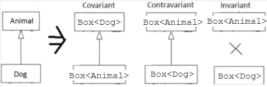

# 六、泛型是你的朋友

在前一章中，我们讨论了与函数编程相关的概念，以及在Kotlin中作为一等公民的函数。

在本章中，我们将讨论泛型类型和泛型函数的概念。我们将学习它们为什么存在以及如何使用它们——我们将定义泛型类、接口和函数。我们将讨论如何在运行时处理泛型，看看子类型关系，并处理泛型的可空性

在本章中，我们将讨论泛型类型和泛型函数的概念，称为泛型。我们将学习它们为什么存在，如何使用它们，以及如何定义泛型类、接口和函数。我们将讨论如何在运行时处理泛型，看看子类型关系，并处理泛型可空性。

在本章中，我们将涵盖以下主题:

*   泛型类
*   通用接口
*   通用函数
*   通用约束
*   通用可空性
*   差异
*   使用地点目标与申报地点目标
*   申报地点目标
*   类型擦除
*   具体化和擦除类型参数
*   星形投影语法
*   差异

# 无商标消费品

**泛型**是一种编程风格，其中类、函数、数据结构或算法的编写方式可以在以后指定确切的类型。一般来说，泛型提供了类型安全性，以及为各种数据类型重用特定代码结构的能力。

Java 和 Kotlin 中都有泛型。它们以类似的方式工作，但是 Kotlin 提供了对 Java 泛型类型系统的一些改进，例如使用位置变化、开始投影语法和具体化的类型参数。我们将在本章中讨论它们。

# 对泛型的需求

程序员通常需要一种方法来指定一个集合只包含特定类型的元素，如`Int`、`Student`或`Car`。如果没有泛型，我们需要为每种数据类型分别创建单独的类(`IntList`、`StudentList`、`CarList`等等)。这些类具有非常相似的内部实现，只是存储的数据类型不同。这意味着我们需要多次编写相同的代码(例如从集合中添加或移除一个项)，并分别维护每个类。这是一个很大的工作量，所以在泛型实现之前，程序员通常在通用列表上操作。这迫使他们在每次被访问时强制转换元素:

```kt
    // Java
    ArrayList list = new ArrayList();
    list.add(1);
    list.add(2);
    int first = (int) list.get(0);
    int second = (int) list.get(1);
```

强制转换会添加样板文件，当元素添加到集合中时，没有类型验证。泛型是这个问题的解决方案，因为泛型类定义并使用占位符而不是实类型。这个占位符叫做**类型参数** *。*让我们定义第一个泛型类:

```kt
    class SimpleList<T> // T is type parameter
```

type 参数意味着我们的类将使用某种类型，但是这种类型将在类创建期间指定。这样，我们的`SimpleList`类可以被实例化为多种类型。我们可以使用*类型参数*来参数化具有各种数据类型的泛型类。这允许我们从一个类创建多个数据类型:

```kt
     // Usage
    var intList: SimpleList<Int>
    var studentList: SimpleList<Student>
    var carList:SimpleList<Car>
```

`SimpleList`类用*类型参数* ( `Int`、`Student`和`Car`)进行参数化，这些参数定义了给定列表中可以存储何种数据。

# 类型参数与类型参数

函数有参数(在函数声明中声明的变量)和参数(传递给函数的实际值)。类似的术语也适用于泛型。*类型参数*是泛型中声明的类型的蓝图或占位符，*类型参数*是用于参数化泛型的实际类型。

我们可以在方法签名中使用*类型参数*。这样，我们可以确保能够将特定类型的项目添加到列表中，并检索特定类型的项目:

```kt
    class SimpleList<T> { 

       fun add(item:T) { // 1 
           // code 
       }  
       fun get(intex: Int): T { // 2 
           // code 
       } 
    } 
```

1.  用作项目类型的泛型类型参数`T`
2.  用作返回类型的类型参数

可以添加到列表或从列表中检索的项目类型取决于*类型参数*。让我们看一个例子:

```kt
    class Student(val name: String)
    val studentList = SimpleList<Student>()
    studentList.add(Student("Ted"))
    println(studentList.getItemAt(0).name)
```

我们只能从列表中添加和获取`Student`类型的项目。编译器将自动执行所有必要的类型检查。可以保证集合将只包含特定类型的对象。将不兼容类型的对象传递给 add 方法将导致编译时错误:

```kt
    var studentList: SimpleList<Student>
    studentList.add(Student("Ted"))
    studentList.add(true) // error
```

我们不能添加布尔值，因为预期类型是`Student`。

The Kotlin standard library defines various generic collections in the `kotlin.collections` package, such as `List`, `Set`, and `Map`. We will discuss them in [Chapter 7](7.html#532G60-7a7324e7f1a1454d830df91c6b78f317), *Extension Functions and Properties*.

在 Kotlin 中，泛型经常与高阶函数(在[第 5 章](5.html#3N6MA0-7a7324e7f1a1454d830df91c6b78f317)、*作为一等公民的函数*和扩展函数(我们将在[第 7 章](7.html#532G60-7a7324e7f1a1454d830df91c6b78f317)、*扩展函数和属性*中讨论)结合使用。这种连接的例子有功能:`map`、`filter`、`takeUntil`等等。我们可以执行细节不同的常见操作。例如，我们可以使用操作`filter`函数并指定如何检测匹配元素来在集合中查找匹配元素:

```kt
    val fruits = listOf("Babana", "Orange", "Apple", "Blueberry") 
    val bFruits = fruits.filter { it.startsWith("B") } //1 
    println(bFruits) // Prints: [Babana, Blueberry] 
```

1.  我们可以调用`startsWith`方法，因为集合只能包含`Strings`，所以 lambda 参数(`it`)具有相同的类型。

# 通用约束

默认情况下，我们可以用任何类型的*类型参数*参数化一个泛型类。但是，我们可以限制可以用作*类型参数*的可能类型。为了限制*类型参数*的可能值，我们需要定义一个*类型参数绑定*。最常见的*约束类型*是*上限*。默认情况下，所有类型参数都有`Any?`作为隐式*上限*。这就是为什么以下两个声明是等价的:

```kt
    class SimpleList<T>
    class SimpleList<T: Any?>
```

前面的界限意味着我们可以使用任何我们想要的类型作为我们的`SimpleList`类的*类型参数*(包括可空类型)。这是可能的，因为所有可空和不可空类型都是`Any?`的子类型:

```kt
    class SimpleList<T>
    class Student
    //usage

    var intList = SimpleList<Int>()
    var studentList = SimpleList<Student>()
    var carList = SimpleList<Boolean>()
```

在某些情况下，我们希望限制可以用作*类型参数的数据类型。*要做到这一点，我们需要明确定义一个*类型参数*的上限。假设我们希望能够只使用数字类型作为我们的`SimpleList`类的*类型参数*:

```kt
    class SimpleList<T: Number>
    //usage

    var numberList = SimpleList<Number>()
    var intList = SimpleList<Int>()
    var doubleList = SimpleList<Double>()
    var stringList = SimpleList<String>() //error
```

`Number`类是一个抽象类，即 Kotlin 数值类型的超类(`Byte`、`Short`、`Int`、`Long`、`Float`和`Double`)。我们可以使用`Number`类及其所有子类(`Int`、`Double`等)作为*类型参数*，但是不能使用`String`类，因为它不是`Number`的子类。任何添加不兼容类型的尝试都将被集成开发环境和编译器拒绝。类型参数还结合了 Kotlin 类型系统的可空性。

# 可空性

当我们定义一个具有无界类型参数的类时，我们可以使用不可空和可空类型作为*类型参数*。偶尔，我们需要确保特定的泛型类型不会被可空的*类型参数*参数化。为了阻止使用可空类型作为*类型参数的能力，*我们需要明确定义一个不可空的**类型参数上限**:

```kt
    class Action (val name:String)
    class ActionGroup<T : Action> 

    // non-nullable type parameter upper bound

    var actionGroupA: ActionGroup<Action>
    var actionGroupB: ActionGroup<Action?> // Error
```

现在我们不能将可空的*类型参数* ( `Action?`)传递给`ActionGroup`类。

让我们考虑另一个例子。想象一下，我们想要取回`ActionGroup`中的最后一个`Action`。`last`方法的简单定义如下:

```kt
    class ActionGroup<T : Action>(private val list: List<T>) {
        fun last(): T = list.last()
    }
```

让我们分析一下当我们将一个空列表传递给构造函数时会发生什么:

```kt
    val actionGroup = ActionGroup<Action>(listOf())

    //...
    val action = actionGroup.last 
    //error: NoSuchElementException: List is empty

    println(action.name)
```

我们的应用程序崩溃了，因为当列表中没有这样索引的元素时，方法`last`抛出了一个错误。当列表为空时，我们可能更喜欢空值，而不是异常。Kotlin 标准库已经有一个相应的方法将返回空值:

```kt
    class ActionGroup<T : Action>(private val list: List<T>) {
        fun lastOrNull(): T = list.lastOrNull() //error
    }
```

代码不会编译，因为不管*类型参数*是否为空，最后一个方法都有可能返回 null(列表中可能没有要返回的元素)。为了解决这个问题，我们需要通过向类型参数 use-site ( `T?`)添加问号来强制可空的返回类型:

```kt
    class ActionGroup<T : Action>(private val list: List<T>) { // 1
        fun lastOrNull(): T? = list.lastOrNull() // 2
    }
```

1.  类型参数*声明-地点*(代码中声明类型参数的地方)
2.  类型参数*使用地点*(代码中使用类型参数的地方)

`T?`参数意味着`lastOrNull`方法将总是可空的，而不管潜在的*类型参数*可空性如何。请注意，我们恢复了绑定为不可空类型`Action`的类型参数`T`，因为我们希望存储不可空类型，并且只在某些情况下处理可空性(例如不存在的最后一个元素)。让我们使用我们更新的`ActionGroup`类:

```kt
    val actionGroup= ActionGroup<Action>(listOf())
    val actionGroup = actionGroup.lastOrNull() 
    // Inferred type is Action?
    println(actionGroup?.name) // Prints: null
```

请注意`actionGroup`推断类型是可空的，即使我们用不可空的*类型参数*参数化了泛型。

使用站点上的可空类型不会阻止我们在声明站点中允许非空类型:

```kt
    open class Action
    class ActionGroup<T : Action?>(private val list: List<T>) {
        fun lastOrNull(): T? = list.lastOrNull()
    }

    // Usage
    val actionGroup = ActionGroup(listOf(Action(), null))
    println(actionGroup.lastOrNull()) // Prints: null
```

让我们总结一下上面的解决方案。我们为类型参数指定了一个不可空的界限，以禁止将具有可空类型的`ActionGroup`类参数化为*类型参数*。我们用不可空的*类型参数*T2 参数化了`ActionGroup`类。最后，我们在使用站点(`T?`)强制类型参数为空，因为如果列表中没有元素，最后一个属性可以返回 null。

# 差异

子类型化是面向对象编程范式中的一个流行概念。我们通过扩展类来定义两个类之间的继承:

```kt
    open class Animal(val name: String)
    class Dog(name: String): Animal(name)
```

类`Dog`扩展了类`Animal`，所以类型`Dog`是`Animal`的一个子类型。这意味着只要需要类型`Animal`的表达式，我们就可以使用类型`Dog`的表达式；例如，我们可以将其用作函数参数，或者将类型为`Dog`的变量分配给类型为`Animal`的变量:

```kt
    fun present(animal: Animal) {
        println( "This is ${ animal. name } " )
    }
    present(Dog( "Pluto" )) // Prints: This is Pluto
```

在我们继续之前，我们需要讨论类和类型的区别。类型是一个更通用的术语——它可以由类或接口定义，也可以内置到语言中(原语类型)。在 Kotlin 中，对于每个类(例如，`Dog`)，我们至少有两种可能的类型——不可空(`Dog`)和可空(`Dog?`)。此外，对于每个泛型类(例如，`class Box<T>`)我们可以定义多个数据类型(`Box*<Dog>*`、`Box<Dog?>` *、* `Box<Animal>` *、* `Box<Box<Dog>>`等等)。

前面的示例仅适用于简单类型。差异指定更复杂类型(例如`Box<Dog>`和`Box<Animal>`)之间的子类型如何与其组件(例如`Animal`和`Dog`)之间的子类型相关联。

在 Kotlin 中，默认情况下，泛型是*不变的*。这意味着泛型类型`Box<Dog>`和`Box<Animal>`之间没有子类型关系。`Dog`组件是`Animal`的子类型，但`Box<Dog>`既不是`Box<Animal>`的子类型，也不是其超类型；

```kt
    class Box<T>
    open class Animal
    class Dog : Animal()

    var animalBox = Box<Animal>()
    var dogBox = Box<Dog>()

    //one of the lines below line must be commented out,
    //otherwise Android Studio will show only one error
    animalBox = dogBox // 2, error
    dogBox = animalBox // 1, error
```

1.  错误类型不匹配。必选`Box<Animal>`，找到`Box<Dog>`。
2.  错误类型不匹配。必选`Box<Dog>`，找到`Box<Animal>`。

`Box<Dog>`类型既不是`Box<Animal>`的子类型，也不是超类型，因此我们不能使用前面代码中显示的任何赋值。

我们可以定义`Box<Dog>`和`Box<Animal>`之间的子类型关系。在柯特林中，泛型类型的子类型关系可以被保留(共变型)、反转(反变型)或忽略(不变型)。

当子类型关系共变时，意味着子类型被保留。泛型类型将具有与*类型参数*相同的关系。如果`Dog`是`Animal`的一个亚型，那么`Box<Dog>`就是`Box<Animal>`的一个亚型。

反向变异与共变异正好相反，共变异的子类型是反向的。泛型类型与*类型参数*的关系相反。如果`Dog`是`Animal`的一个亚型，那么`Box<Animal>`就是`Box<Dog>`的一个亚型。下图显示了所有类型的差异:



要定义同变或反变行为，我们需要使用*方差修改器。*

# 方差修饰符

默认情况下，Kotlin 中的泛型是不变的。这意味着我们需要使用 type 作为声明的变量或函数参数的类型:

```kt
    public class Box<T> { }
    fun sum(list: Box<Number>) { /* ... */ }

    // Usage
    sum(Box<Any>()) // Error
    sum(Box<Number>()) // Ok
    sum(Box<Int>()) // Error
```

我们不能使用用`Int`参数化的泛型类型，它是`Number`的子类型，`Any`是`Number.`的超类型。我们可以放宽这个限制，并通过使用方差修饰符来更改默认方差。在 Java 中，有问号(`?`)符号(通配符符号)用于表示未知类型。使用它，我们可以定义两种类型的通配符边界-上限和下限。在 Kotlin 中，我们可以使用`in`和`out`修改器实现类似的行为。

在 Java 中，上限通配符允许我们定义一个函数，该函数接受任何属于其子类型的参数。在以下示例中，sum 函数将接受任何用`Number`类或数字类的子类型(`Box<Integer>`、`Box<Double>`等)参数化的`List`:

```kt
    //Java
    public void sum(Box<? extends Number> list) { /* ... */ }

    // Usage
    sum(new Box<Any>()) // Error
    sum(new Box<Number>()) // Ok
    sum(new Box<Int>()) // Ok
```

我们现在可以将`Box<Number>`传递给我们的求和函数和所有子类型，例如`Box<Int>`。这个 Java 行为对应于 Kotlin out 修饰符。它表示协方差，将类型限制为特定类型或该类型的子类型。这意味着我们可以安全地传递用`Number`的任何直接或间接子类参数化的`Box`类的实例:

```kt
    class Box<T>
    fun sum(list: Box<out Number>) { /* ... */ }

    //usage
    sum(Box<Any>()) // Error
    sum(Box<Number>()) // Ok
    sum(Box<Int>()) // Ok
```

在 Java 中，下限通配符允许我们定义一个函数，该函数接受任何特定类型或其超类型的参数。在下面的例子中，`sum`函数将接受任何用`Number`类参数化的`List`或`Number`类的超类型(`Box<Number>`和`Box<Object>`):

```kt
    //Java
    public void sum(Box<? super Number> list) { /* ... */ }

    //usage
    sum(new Box<Any>()) // Ok
    sum(new Box<Number>()) // Ok
    sum(new Box<Int>()) // Error
```

我们现在可以将`Box<Any>`传递给我们的求和函数和所有子类型，例如`Box<Any>`。这个 Java 行为对应于修饰符中的 Kotlin。它表示反向差异，将类型限制为特定类型或该类型的超类型:

```kt
    class Box<T>
    fun sum(list: Box<in Number>) { /* ... */ }

    //usage
    sum(Box<Any>()) // Ok
    sum(Box<Number>()) // Ok
    sum(Box<Int>()) // Error
```

禁止一起使用`in`和`out`修饰词。我们可以用两种不同的方式定义方差修饰符。让我们在下一节中看看它们。

# 使用地点差异与申报地点差异

*使用地点*差异和*申报地点*差异基本上描述了代码(地点)中指定差异修饰符的地方。让我们考虑一下`View`和`Presenter`的例子:

```kt
    interface BaseView
    interface ProductView : BaseView
    class Presenter<T>

    // Usage
    var preseter = Presenter<BaseView>()
    var productPresenter = Presenter<ProductView>()
    preseter = productPresenter

    // Error: Type mismatch
    // Required: Presenter<BaseView>
    // Found: Presenter<ProductView>
```

类`Presenter`在其类型`parameterT`上是不变的。为了解决这个问题，我们可以明确定义子类型关系。我们可以通过两种方式来实现(使用网站和声明网站)。首先，让我们定义使用场所的差异:

```kt
    var preseter: Presenter<out BaseView> = Presenter<BaseView>() //1
    var productPresenter = Presenter<ProductView>()
    preseter = productPresenter
```

1.  在类型参数使用位置定义的差异修饰符

现在`preseter`变量可以存储`Presenter<BaseView>`的子类型，包括`Presenter<ProductView>`。我们的解决方案可行，但我们的实施可以改进。这种方法有两个问题。现在我们需要在每次想要使用泛型类型时指定这个`out`方差修饰符，例如，在不同类的多个变量中使用它:

```kt
    //Variable declared inside class A and class B

    var preseter = Presenter<BaseView>()
    var preseter: Presenter<out BaseView> = Presenter<ProductView>()
    preseter = productPresenter  
```

两个类`A`和`B`都包含有方差修改器的`preseter`变量。我们失去了使用类型推断的能力，结果代码更加冗长。为了改进我们的代码，我们可以在类型参数声明站点指定方差修饰符:

```kt
interface BaseView
interface ProductView: BaseView
class Presenter<out T> // 1   

//usage
//Variable declared inside class A and B

var preseter = Presenter<BaseView>()
var productPresenter = Presenter<ProductView>()
preseter = productPresenter
```

1.  在类型参数声明站点定义的差异修饰符

我们只需要在`Presenter`类中定义一次方差修改器。事实上，前面的两个实现是等价的，尽管*声明站点*的变化更加简洁，并且可以更容易地被类的外部客户端使用

# 收款差异

在 Java 中，数组是同变的。默认情况下，我们可以传递一个`String[]`数组，即使预期是一个`Object[]`数组:

```kt
    public class Computer {
        public Computer() {
            String[] stringArray = new String[]{"a", "b", "c"};
            printArray(stringArray); //Pass instance of String[]
        }

        void printArray(Object[] array) { 
            //Define parameter of type Object[]
            System.out.print(array);
        }
    }
```

这种行为在早期版本的 Java 中很重要，因为它允许我们使用不同类型的数组作为参数:

```kt
    // Java
    static void print(Object[] array) {
        for (int i = 0; i <= array.length - 1; i++)
        System.out.print(array[i] + " ");
        System.out.println();
    }

    // Usage
    String[] fruits = new String[] {"Pineapple","Apple", "Orange", 
                                    "Banana"};
    print(fruits); // Prints: Pineapple Apple Orange Banana
    Arrays.sort(fruits);
    print(fruits); // Prints: Apple Banana Orange Pineapple
```

但是这种行为也可能导致潜在的运行时错误:

```kt
    public class Computer {
        public Computer() {
            Number[] numberArray = new Number[]{1, 2, 3};
            updateArray(numberArray);
        }
        void updateArray(Object[] array) {
            array[0] = "abc"; 
            // Error, java.lang.ArrayStoreException: java.lang.String
        }
    }
```

函数`updateArray`接受类型`Object[]`的参数，我们通过`String[]`。我们用`String` 参数调用 add 方法。我们可以这样做，因为数组项的类型是`Object,`，所以我们可以使用`String`，这是一个新的值。最后，我们希望将`String`添加到可能只包含`String`类型项目的泛型数组中。由于默认的同变行为，编译器无法检测到这个问题，这将导致`ArrayStoreException`异常。

相应的代码不会在Kotlin中编译，因为Kotlin编译器将这种行为视为潜在的危险。这就是为什么 Kotlin 中的数组是不变的。因此，当需要`Array<Any>`时，传递`Array<Number>`以外的类型会导致编译时错误:

```kt
    public class Array<T> { /*...*/ }
```

因此，当需要`Array<Any>`时，传递除`Array<Number>`以外的类型将导致编译时错误:

```kt
    public class Array<T> { /*...*/ }
    class Computer {
        init {
            val numberArray = arrayOf<Number>(1, 2, 3)
            updateArray(numberArray)
        }
        internal fun updateArray(array: Array<Any>) {
            array[0] = "abc" 
            //error, java.lang.ArrayStoreException: java.lang.String
        }
    }
```

请注意，只有当我们可以修改对象时，才可能发生潜在的运行时异常。方差也适用于 Kotlin 集合接口。在 Kotlin 标准库中，我们有两个以不同方式定义的列表接口。柯特林`List`接口被定义为协同变体，因为它是不可变的(它不包含任何允许我们改变内部状态的方法)，而柯特林`MutableList`接口是不变的。以下是它们类型参数的定义:

```kt
    interface List<out E> : Collection<E> { /*...*/ }
    public interface MutableList<E> : List<E>, MutableCollection<E> {     
        /*...*/ 
    }
```

让我们看看这种定义在行动中的后果。它使可变列表免受协方差风险的影响:

```kt
    fun addElement(mutableList: MutableList<Any>) {
        mutableList.add("Cat")
    }

    // Usage
    val mutableIntList = mutableListOf(1, 2, 3, 4)
    val mutableAnyList = mutableListOf<Any>(1, 'A')
    addElement(mutableIntList) // Error: Type mismatch
    addElement(mutableAnyList)
```

该列表是安全的，因为它没有用于更改其内部状态的方法，并且其协方差行为允许更一般地使用函数:

```kt
    fun printElements(list: List<Any>) {
        for(e in list) print(e)
    }

    // Usage
    val intList = listOf(1, 2, 3, 4)
    val anyList = listOf<Any>(1, 'A')
    printElements(intList) // Prints: 1234
    printElements(anyList) // Prints: 1A
```

我们可以将`List<Any>`或其任何子类型传递给`printElements`函数，因为`List`接口是同变的。我们只能将`MutableList<Any>`传递给`addElement`功能，因为`MutableList`界面是不变的。

使用`in`和`out`修改器，我们可以操纵方差行为。我们也应该意识到方差有一些局限性。我们来讨论一下。

# 差异生产者/消费者限制

通过应用方差修改器，我们获得了类/接口的某个类型参数(声明-地点方差)或*类型参数*(使用-地点方差)的同变/反变行为。然而，我们需要意识到一个限制。为了安全起见，Kotlin 编译器限制了可以使用类型参数的位置。

使用不变量(类型参数上默认没有方差修改器)，我们可以在`in`(函数参数的类型)和`out`(函数返回类型)位置使用类型参数:

```kt
    interface Stack<T> {
        fun push(t:T) // Generic type at in position
        fun pop():T // Generic type at out position
        fun swap(t:T):T // Generic type at in and out positions
        val last: T // Generic type at out position
        var special: T // Generic type at out position
    }
```

使用方差修改器，我们只限于单个位置。这意味着我们只能将类型参数用作方法参数(`in`)或方法返回值(`out`)的类型。我们这个阶层可以是生产者，也可以是消费者，但绝不能两者兼而有之。我们可以说类*接受参数*或者*给出参数*。

让我们看看这个限制是如何与声明站点指定的方差修饰符相关联的。以下是两个类型参数`R`和`T`的所有正确和错误用法:

```kt
    class ConsumerProducer<in T, out R> {
        fun consumeItemT(t: T): Unit { } // 1

        fun consumeItemR(r: R): Unit { } // 2, error
        fun produceItemT(): T { // 3, error
            // Return instance of type T
        }
        fun produceItemR(): R { // 4
            //Return instance of type R
        }
    }
```

1.  在原位确定类型参数`T`
2.  错误，在位置输入参数`R`
3.  错误，在输出位置输入参数`T`
4.  好，在输出位置输入参数`R`

如我们所见，如果配置被禁止，编译器将报告错误。请注意，我们可以为两个类型参数`R`和`T`添加不同的修改器。

位置限制仅适用于类外部可访问(可见)的方法。这不仅意味着之前使用的所有`public`方法(`public`是默认修饰符)，还意味着标有`protected`或`internal`的方法。当我们将方法可见性更改为`private`时，我们可以在任何位置使用我们的类型参数(`R`和`T`，就像不变类型参数一样:

```kt
    class ConsumerProducer<in T, out R> {
        private fun consumeItemT(t: T): Unit { }
        private fun consumeItemR(r: R): Unit { }
        private fun produceItemT(): T {
            // Return instance of type T
        }

        private fun produceItemR(): R {
            //Return instance of type R
        }
    }
```

让我们看看下表，它显示了用作类型的类型参数的所有允许位置:

| **能见度修饰** | **不变性** | **协方差(出)** | **对比度(in)** |
| `public`、`protected`、`internal` | 进/出 | 在外 | 在 |
| `private` | 进/出 | 进/出 | 进/出 |

# 不变构造函数

上一节描述的`in`和`out`位置规则有一个重要的例外:构造函数参数总是不变的；

```kt
    class Producer<out T>(t: T)
    // Usage
    val stringProducer = Producer("A")
    val anyProducer: Producer<Any> = stringProducer
```

构造函数是公共的，类型参数`T`被声明为`out,`，但我们仍然可以在 in 位置将其用作构造函数参数类型。原因是创建实例后不能调用构造函数方法，所以调用它总是安全的。

正如我们在[第 4 章](4.html#2JTHG0-7a7324e7f1a1454d830df91c6b78f317)、*类和对象、*中所讨论的，我们也可以使用`val`或`var`修饰符直接在类构造函数中定义属性。当指定协方差时，我们只能在具有协变类型的构造函数中定义只读属性(`val`)。它是安全的，因为只有 getter 会被生成，所以这个属性的值在类实例化后不能改变:

```kt
    class Producer<out T>(val t: T) // Ok, safe
```

使用`var` *，*getter 和 setter 都是由编译器生成的，因此属性值可能会在某个时候发生变化。这就是为什么我们不能在构造函数中声明共变类型的读写(`var`)属性:

```kt
    class Producer<out T>(var t: T) // Error, not safe
```

我们已经说过，差异限制只适用于外部客户端，因此我们仍然可以通过添加私有可见性修饰符来定义一个共变读写属性:

```kt
    class Producer<out T>(private var t:T)
```

另一个流行的泛型类型限制，从 Java 中已知，与类型擦除有关。

# 类型擦除

类型擦除被引入到 JVM 中，以使 JVM 字节码向后兼容引入泛型之前的版本。在安卓平台上，Kotlin 和 Java 都是编译成 JVM 字节码的，所以都容易受到*类型擦除*的攻击。

类型擦除是从泛型类型中删除一个*类型参数*的过程，这样泛型类型在运行时会丢失它的一些类型信息(*类型参数*):

```kt
    package test
    class Box<T>

    val intBox = Box<Int>()
    val stringBox = Box<String>()

    println(intBox.javaClass) // prints: test.Box
    println(stringBox.javaClass) // prints: test.Box
```

编译器可以区分两种类型，保证类型安全。但是，在编译过程中，参数化类型`Box<Int>`和`Box<String>`被编译器翻译成`Box`(原始类型)。生成的 Java 字节码不包含任何与*类型参数*相关的信息，所以我们在运行时无法区分泛型类型。

类型擦除会导致一些问题。在 JVM 中，我们不能用相同的 JVM 签名声明同一个方法的两个重载:

```kt
    /*
    java.lang.ClassFormatError: Duplicate method name&signature...
    */
    fun sum(ints: List<Int>) {
        println("Ints")
    }

    fun sum(strings: List<String>) {
        println("Ints")
    }
```

当*类型参数*被移除时，这两个方法将具有完全相同的声明:

```kt
    /*
    java.lang.ClassFormatError: Duplicate method name&signature...
    */
    fun sum(ints: List) {
        println("Ints")
    }
    fun sum(strings: List) {
        println("Ints")
    }
```

我们也可以通过改变生成函数的 JVM 名称来解决这个问题。当代码被编译成 JVM 字节码时，我们可以使用`JvmName`注释来更改其中一个方法的名称:

```kt
    @JvmName("intSum") fun sum(ints: List<Int>) {
        println("Ints")
    }
    fun sum(strings: List<String>) {
        println("Ints")
    }
```

Kotlin 的这个函数用法没有什么变化，但是由于我们改变了第一个函数的 JVM 名称，我们需要使用一个新的名称来使用它:

```kt
    // Java
    TestKt.intSum(listOfInts);
```

有时我们希望在运行时保留*类型参数*，这也是`reified` *类型参数*非常方便的地方。

# 具体化类型参数

在某些情况下，在运行时访问类型参数会很有用，但由于类型擦除，这是不允许的:

```kt
    fun <T> typeCheck(s: Any) {
        if(s is T){ 
        // Error: cannot check for instance of erased type: T
            println("The same types")
        } else {
            println("Different types")
        }
    }
```

为了能够克服 JVM 的限制，Kotlin 允许我们使用一个特殊的修饰符，它可以在运行时保留一个*类型参数*。我们需要用具体化的修饰符标记类型参数:

```kt
    interface View
    class ProfileView: View
    class HomeView: View
    inline fun <reified T> typeCheck(s: Any) { // 1
        if(s is T){
            println("The same types")
        } else {
        println("Different types")
        }
    }
    // Usage
    typeCheck<ProfileView>(ProfileView()) // Prints: The same types
    typeCheck<HomeView>(ProfileView()) // Prints: Different types
    typeCheck<View>(ProfileView()) // Prints: The same types
```

1.  类型参数标记为细化，功能标记为`inline`。

现在我们可以在运行时安全地访问*类型参数*类型。具体化的类型参数只适用于内联函数，因为在编译(内联)期间，Kotlin 编译器会替换具体化的*类型参数*实际类。这样，*类型参数*就不会被类型擦除删除。

我们还可以在具体化的类型上使用反射来检索关于该类型的更多信息:

```kt
    inline fun <reified T> isOpen(): Boolean {
        return T::class.isOpen
    }
```

具体化类型参数的出现在 JVM 字节码级别被表示为实际类型或原语类型的包装类型。这就是为什么具体化的类型参数不受类型擦除的影响。

使用具体化的类型参数允许我们以一种全新的方式编写方法。要在 Java 中启动一个新的`Activity`，我们需要这样的代码:

```kt
    //Java
    startActivity(Intent(this, ProductActivity::class.java))
```

在 Kotlin 中，我们可以定义`startActivity`方法，该方法允许我们以更简单的方式导航到`Activity`:

```kt
    inline fun <reified T : Activity> startActivity(context: Context) {
        context.startActivity(Intent(context, T::class.java))
    }

    // Usage
    startActivity<UserDetailsActivity>(context)
```

我们定义了`startActivity`方法，并通过使用*类型的参数*传递了关于我们想要开始的`Activity`(`ProductActivity`)的信息。我们还定义了一个显式的具体化类型参数绑定，以确保我们只能使用`Activity`(及其子类)作为*类型参数*。

# startActivity 方法

为了正确使用`startActivity`方法，我们需要一种方法将参数传递给正在启动的`Activity`(`Bundle`)。可以更新前面的实现来支持这样的参数:

```kt
    startActivity<ProductActivity>("id" to 123, "extended" to true)
```

在前面的示例中，参数是使用成对提供的键和值填充的(由内联的*到*函数定义)。然而，这个函数的实现超出了本书的范围。但是，我们可以使用现有的。**安科**库([https://github.com/Kotlin/anko](https://github.com/Kotlin/anko))已经实现了具有所有所需功能的`startActivity`方法。我们只需要导入`Appcompat-v7-commons`依赖即可。

```kt
    compile "org.jetbrains.anko:anko-appcompat-v7-commons:$anko_version"
```

Anko 为`Context`和`Fragment`类定义了扩展，所以我们可以在任何`Activity`或`Fragment`中使用这个方法，就像类中定义的任何其他方法一样，而不需要在类中定义方法。我们将在[第 7 章](7.html#532G60-7a7324e7f1a1454d830df91c6b78f317)、*扩展功能和属性*中讨论扩展。

请注意，具体化类型参数有一个主要限制:我们不能从具体化类型参数创建类的实例(没有反射用法)。这背后的原因是构造函数总是只与一个具体的实例相关联(它从不被继承)，因此没有可以安全地用于所有可能的类型参数的构造函数。

# 恒星投影

由于类型擦除，不完整的类型信息在运行时可用。例如，泛型类型的类型参数不可用:

```kt
    val list = listOf(1,2,3)
    println(list.javaClass) // Prints: class java.util.Arrays$ArrayList
```

这导致了一些问题。我们无法执行任何检查来验证`List`包含哪些类型的元素:

```kt
    /*
    Compile time error: cannot check instance of erased type: 
    List<String>
    */
    if(collection is List<Int>) {
        //...
    }
```

出现该问题是因为在运行时执行了一项检查，此时关于 *t* 类型参数的信息不可用。然而，与 Java 相反，Kotlin 不允许我们声明原始类型(没有用*类型参数*参数化的泛型类型):

```kt
    SimpleList<> // Java: ok
    SimpleList<> // Kotlin: error
```

Kotlin 允许我们使用*星投影*语法来代替，这基本上是说关于*类型参数*的信息缺失或不重要的一种方式:

```kt
    if(collection is List<*>) {
        //...
    }
```

通过使用星投影语法，我们说`Box`存储某一类型的参数:

```kt
    class Box<T>

    val anyBox = Box<Any>()
    val intBox = Box<Int>()
    val stringBox = Box<String>()
    var unknownBox: Box<*>

    unknownBox = anyBox // Ok
    unknownBox = intBox // Ok
    unknownBox = stringBox // Ok
```

注意`Box<*>`和`Box<Any>`是有区别的。如果我们想要定义包含任何项目的列表，我们将使用`Box<Any>`。然而，如果我们想要定义包含某种类型的术语的列表，但该类型未知(可能是`Any`、`Int`、`String`等等)。但是我们没有这个类型的信息)，而`Box<Any>`表示列表包含`Any`类型的项目。我们将使用`Box<*>`:

```kt
    val anyBox: Box<Any> = Box<Int> // Error: Type mismatch
```

如果一个泛型类型用多个类型参数定义，我们需要为每个缺少的*类型参数*使用一个星号(`*`):

```kt
    class Container<T, T2>
    val container: Container<*, *>
```

当我们想要对类型执行操作时，星形投影也很有帮助，但是关于*类型参数*的信息并不重要:

```kt
    fun printSize(list: MutableList<*>) {
        println(list.size)
    }

    //usage
    val stringList = mutableListOf("5", "a", "2", "d")
    val intList = mutableListOf(3, 7)
    printSize(stringList) // prints: 4
    printSize(intList) // prints: 2
```

在前面的例子中，不需要关于*类型参数*的信息来确定集合大小。只要我们不使用任何依赖于*类型参数*的方法，使用星形投影语法就可以减少对方差修饰符的需求。

# 类型参数命名约定

官方 Java 类型参数命名约定([https://docs . Oracle . com/javase/tutorial/Java/generics/types . html](https://docs.oracle.com/javase/tutorial/java/generics/types.html))定义了以下参数命名准则:

*按照惯例，类型参数名称是单个大写字母。这与你已经知道的变量命名惯例形成了鲜明的对比，这是有充分理由的。没有这个约定，很难区分类型变量和普通类或接口名。最常用的类型参数名称是:*

*   *E:元素(被 Java 集合框架广泛使用)*
*   *K:键*
*   *N:数字*
*   *T:类型*
*   *V:值*
*   *S、U、V 等:第 2、3、4 类*

Kotlin 标准库中的许多类都遵循这个约定。它适用于流行的类，如公共类(`List` *、* `Mat` *、* `Set`等)或定义简单类型参数的类(`Box<T>`类)。然而，有了自定义类和多个类型参数，我们很快意识到单个字母并不能包含足够多的信息，有时很难快速判断类型参数代表什么类型的数据。这个问题有几种解决方法。

我们可以确保泛型被正确地记录下来，是的，这肯定会有帮助，但是我们仍然不能仅仅通过查看代码来确定类型参数的含义。文档很重要，但是我们应该将文档作为信息的辅助来源，并努力实现尽可能高的代码可读性。

多年来，程序员已经开始迁移到更有意义的命名约定中。**谷歌 Java 风格指南**([https://Google . github . io/Style Guide/javaguid . html # s 5 . 2 . 8-类型变量名](https://google.github.io/styleguide/javaguide.html#s5.2.8-type-variable-names))简要描述了官方 Java 类型参数命名约定和自定义命名约定的混合。他们提倡两种截然不同的风格。第一种是使用单个大写字母，可选地后跟单个数字(与 Java 描述的`S` *、* `U` *、* `V`名称相反):

```kt
    class Box<T, T2>
```

第二种样式更具描述性，因为它为类型参数添加了一个有意义的前缀:

```kt
    class Box<RequestT>
```

不幸是，类型参数 *r* 名称没有单一的标准。最常见的解决方案是使用单个大写字母。这些是简化的例子，但是请记住，类通常在多个地方使用泛型，因此正确的命名将提高代码的可读性。

# 摘要

在本章中，我们学习了泛型存在的原因，并讨论了定义泛型类和接口以及声明泛型类型的各种方法。我们知道如何使用使用站点和声明站点差异修饰符来处理子类型关系。我们学习了如何处理类型擦除，以及如何使用具体化的类型参数在运行时保留泛型类型。

在下一章中，我们将讨论 Kotlin 最令人兴奋的特性之一——扩展。这个特性允许我们向现有的类添加新的行为。我们将学习如何为任何给定的类实现新的方法和属性，包括来自安卓框架和第三方库的最终类。