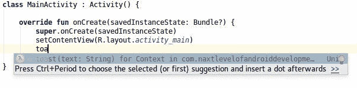
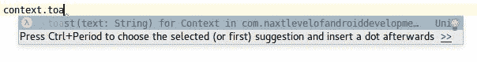
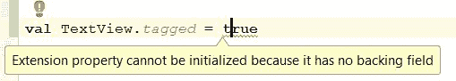
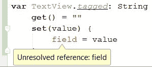
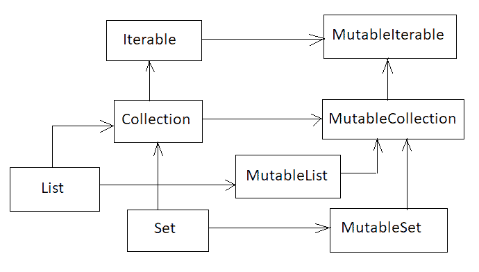
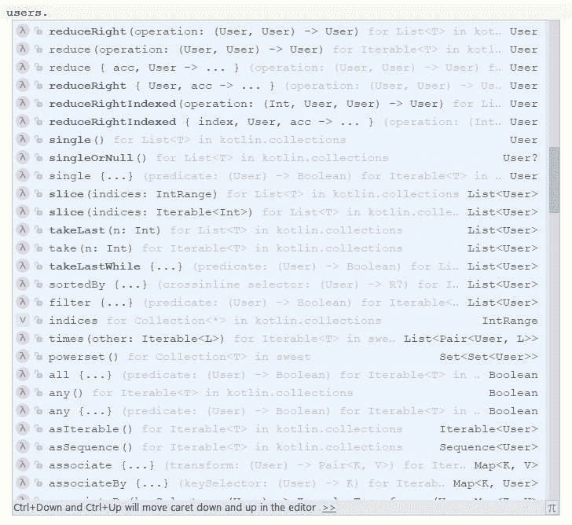

# 扩展函数和属性

在前几章中，大多数概念对于 Java 开发人员来说都很熟悉。在本章中，我们将介绍一个在 Java 中根本不知道的特性——扩展。这是 Kotlin 最好的特性之一，许多 Kotlin 开发人员都提到它是他们最喜欢的特性。扩展在安卓开发方面有了很大的进步。

在本章中，我们将涵盖以下主题:

*   扩展函数
*   扩展属性
*   成员扩展函数
*   通用扩展函数
*   收集处理
*   带接收器的函数类型和带接收器的函数文字
*   任何对象的一般扩展函数
*   Kotlin 特定领域语言

# 扩展函数

所有更大的 Java 项目都有实用程序类，比如`StringUtils`、`ListUtils`、`AndroidUtils`等等。它之所以如此受欢迎，是因为 util 函数捕获了常见的模式，并允许以更简单的方式测试和使用它们。问题是 Java 真的很难支持这些函数的创建和使用，因为它们必须作为某个类的静态函数来实现。让我们用一个例子来讨论这个问题。每个 Java Android 开发者都很清楚下面用来展示`Toast`的代码:

```kt
    Toast.makeText(context, text, Toast.LENGTH_SHORT).show(); 
```

它通常用于安卓项目中显示错误或短信，通常在大多数安卓教程的开头都会出现。实现这一功能的代码是冗长的，因为它是如何使用像构建器一样使用的静态函数的。可能每个 Java Android 开发人员至少有一次忘记在返回的对象上调用`show`方法，这让他检查了所有周围的条件，以找出为什么这不起作用。所有这些都使得这个简单的功能成为打包成 util 函数的完美候选。但是真的很少这样用。为什么呢？为了理解它，让我们首先看看它如何在 Java 中实现:

```kt
public class AndroidUtils { 
    public static void toast(Context context, String text) { 
        Toast.makeText(context, text, Toast.LENGTH_SHORT).show(); 
    } 
} 

// Usage 
AndroidUtils.toast(context, "Some toast"); 
```

当程序员想要使用下面的函数时，他们需要记住有这样的函数，它被本地化在哪个类中，它的名字是什么。因此，它的用法并不比以前简单。如果不改变 Android SDK 实现，就不可能将其实现为`Context`(超类`Activity`)的方法，但是在 Kotlin 中，可以创建一个扩展函数，其行为类似于类内部定义的实际方法。以下是我们如何实现`toast`作为`Context`的扩展:

```kt
    fun Context.toast(text: String) { // 1 
        Toast.makeText(this, text, LENGTH_LONG).show() //2 
    } 

    // Usage 
    context.toast("Some toast")  
```

1.  `Context`不在参数列表上，而是在函数名之前。这就是我们如何定义我们要扩展的类型。
2.  在函数体内部，我们可以使用 this 关键字来引用在其上调用扩展函数的对象。

扩展函数和标准函数在一般结构上的唯一区别是在函数名之前指定了一个接收器类型。一个不太明显的变化是在主体内部——在那里，我们可以通过`this`关键字访问接收者对象(调用扩展的对象)，或者直接调用它的函数或属性。有了这样的定义，`toast`函数的作用类似于`Context`中定义的方法:

```kt
    context.toast("Some toast") 

    Alternatively: 
    class MainActivity :Activity() { 

        override fun onCreate(savedInstanceState: Bundle?){ 
            super.onCreate(savedInstanceState) 
            toast("Some text") 
        } 
    } 
```

这使得使用`toast`功能比实现整个吐司显示代码容易得多。我们还从 IDE 得到建议，当我们在`Context`内部(比如在`Activity`内部)或者在`Context`的实例上时，我们可以调用这个函数:





在前面的例子中，`Context`是`toast`函数的接收器类型，`this`实例是对接收器对象的引用。接收器对象的所有功能和属性都可以显式访问，因此我们可以采用以下定义:

```kt
    fun Collection<Int>.dropPercent(percent: Double) 
        = this.drop(floor(this.size * percent) 
```

然后，我们可以用以下内容替换它:

```kt
    fun Collection<Int>.dropPercent(percent: Double) 
        = drop(floor(size * percent)) 
```

扩展函数有多种有用的用例。类似的扩展功能可以为`View`、`List`、`String`以及安卓框架或第三方库中定义的其他类和开发者定义的自定义类定义。扩展功能可以添加到任何可访问的类型，甚至添加到`Any`对象。这里有一个可以在每个对象上调用的扩展函数:

```kt
fun Any?.logError(error: Throwable, message: String = "error") { 
    Log.e(this?.javaClass?.simpleName ?: "null", message, error) 
} 
```

以下是一些通话示例:

```kt
    user.logError(e, "NameError") // Logs: User: NameError ... 
    "String".logError(e) // String: error ... 
    logError(e) // 1, MainActivity: error ... 
```

1.  假设我们在`MainActivity`中调用这个。

我们可以简单地将任何方法添加到我们想要的任何类中。这对于安卓开发来说是一个很大的提升。有了它，我们就有了一种向类型添加缺少的方法或属性的方法。

# 引擎盖下的扩展功能

虽然 Kotlin 扩展函数看起来很神奇，但实际上它们很简单。顶层扩展函数被编译为静态函数，第一个参数上有一个接收器对象。让我们看看已经呈现的`toast`功能:

```kt
    // ContextExt.kt 
    fun Context.toast(text: String) { 
        Toast.makeText(this, text, LENGTH_LONG).show() 
    } 

```

这个函数在编译和反编译成 Java 后，看起来类似于下面的函数:

```kt
//Java 
public class ContextExtKt { 
    public static void toast(Context receiver, String text) { 
        Toast.makeText(receiver, text, Toast.LENGTH_SHORT).show(); 
    } 
}
```

Kotlin 顶级扩展函数被编译为静态函数，第一个参数上有一个接收器对象。这就是为什么我们仍然可以使用 Java 的扩展:

```kt
    // Java 
    ContextExtKt.toast(context, "Some toast") 
```

此外，这意味着从 JVM 字节码的角度来看，该方法并没有真正被添加，但是在编译期间，所有扩展函数的用法都被编译为静态函数调用。虽然扩展函数只是函数，但是函数修饰符可以应用于它们，就像它们也可以应用于任何其他函数一样。例如，扩展功能可以标记为`inline`:

```kt
inline fun Context.isPermissionGranted (permission: String): Boolean = ContextCompat.checkSelfPermission (this, permission) ==  PackageManager.PERMISSION_GRANTED 
```

与其他`inline`函数一样，在应用程序编译期间，函数调用将被替换为实际体。我们能用扩展函数做几乎所有我们能用其他函数做的事情。它们可以是单个表达式，具有默认参数，由命名参数使用，等等。但是这种实现还有其他不太直观的后果。在接下来的部分中，我们将描述它们。

# 没有方法覆盖

当成员函数和扩展函数具有相同的名称和参数时，成员函数总是获胜。这里有一个例子:

```kt
    class A { 
        fun foo() { 
            println("foo from A") 
        } 
    } 

    fun A.foo() { 
        println("foo from Extension") 
    } 

    A().foo() // Prints: foo from A 
```

这总是真的。即使来自超类的方法也能通过扩展函数取胜:

```kt
    open class A { 
        fun foo() { 
            println("foo from A") 
        } 
    } 

    class B: A() 

    fun B.foo() { 
        println("foo from Extension") 
    } 

    A().foo() // foo from A 
```

关键是扩展函数不允许修改真实对象的行为。我们只能增加额外的功能。这使我们保持安全，因为我们知道没有人会改变我们正在使用的对象的行为，这可能会导致难以跟踪的错误。

# 对接收器元件的访问

一个扩展函数被编译成一个静态函数，在第一个参数上有一个接收器对象，所以我们没有额外的访问权限。`private`和`protected`元素是不可访问的，带有 Java `default`、Java `package`或 Kotlin `internal`修饰符的元素的访问方式与我们在标准对象上操作的方式相同。

由于这一点，这些元素得到了应有的保护。请记住，扩展函数虽然非常强大和有用，但只是语法糖，没有魔力。

# 扩展是静态解析的

扩展函数只是以接收器作为第一个参数的函数，因此它们的调用在编译时由调用该函数的类型来解析。例如，当超类和子类都有扩展函数时，那么在调用期间选择的扩展函数取决于我们正在操作的属性的类型。这里有一个例子:

```kt
    abstract class A 
    class B: A() 

    fun A.foo() { println("foo(A)") } 
    fun B.foo() { println("foo(B)") } 

    val b = B() 
    b.foo() // prints: foo(B) 
    (b as A).foo() // 1, prints: foo(A) 
    val a: A = b 
    a.foo() // 1, prints: foo(A) 
```

1.  这里我们可以预期`foo(B)`，而对象实际上是`B`类型的，但是扩展是静态解析的，它使用的是`A`的扩展函数，因为变量是`A`类型的，在编译过程中没有关于什么对象的信息。

这个事实有时是有问题的，因为当我们定义一个扩展函数到我们最常被转换到的类型时，我们不应该实现扩展函数到它的子类。

这是一个重要的限制，应该牢记在心，尤其是在公共库实现期间，因为这样，一些扩展函数会阻塞其他函数并导致意外行为。

# 伴随对象扩展

如果一个类定义了一个伴随对象，那么您也可以为这个伴随对象定义扩展函数(和属性)。为了区分类的扩展和伴随对象的扩展，需要在扩展类型和函数名之间添加`.Companion`:

```kt
    class A { 
        companion object {} 
    } 
    fun A.Companion.foo() { print(2) } 
```

定义后，`foo`方法可以像在`A`伴随对象中定义一样使用:

```kt
    A.foo() 
```

请注意，我们使用类类型而不是类实例来调用这个扩展。为了允许为伴随对象创建扩展函数，需要在类中显式定义一个伴随对象。即使是空的。没有它，就不可能定义扩展函数:


# 使用扩展函数的运算符重载

运算符重载是 Kotlin 的一大特性，但是我们经常需要使用 Java 库和没有在那里定义的运算符。例如，在 RxJava 中，我们使用`CompositeDisposable`函数来管理订阅。该集合使用`add`方法添加新元素。这是添加到`CompositeDisposable` *:* 的订阅示例

```kt
    val subscriptions = CompositeDisposable() 

    subscriptions.add(repository 
       .getAllCharacters(qualifiedSearchQuery) 
       .subscribeOn(Schedulers.io()) 
       .observeOn(AndroidSchedulers.mainThread()) 
       .subscribe(this::charactersLoaded, view::showError)) 
```

向可变集合添加新元素的标准 Kotlin 方法是使用`plusAssign`运算符(`+=`)。它不仅更通用，而且更干净，而我们可以省略括号:

```kt
    val list = mutableListOf(1,2,3) 
    list.add(1) 
    list += 1 
```

为了在我们的示例中应用它，我们可以添加以下扩展:

```kt
operator fun CompositeDisposable.plusAssign(disposable: Disposable) 
{ 
    add(disposable)  
} 
```

现在我们可以在`CompositeDisposable`上使用`plusAssign`方法:

```kt
    subscriptions += repository 
       .getAllCharacters(qualifiedSearchQuery) 
       .subscribeOn(Schedulers.io()) 
       .observeOn(AndroidSchedulers.mainThread()) 
       .subscribe(this::charactersLoaded, view::showError)
```

# 顶层扩展函数应该用在哪里？

当我们觉得其他程序员定义的类缺少某种方法时，扩展函数是最常用的。例如，如果我们认为`View`应该包含`show`和`hide`方法，其用法比可见性字段设置更容易，那么我们可以自己实现:

```kt
    fun View.show() { visibility = View.VISIBLE } 
    fun View.hide() { visibility = View.GONE } 
```

不需要记住持有 util 函数的类的名称。在集成开发环境中，我们只需在对象后面加一个点，我们就可以从项目和库中搜索与该对象扩展函数一起提供的所有方法。调用看起来不错，但它看起来像一个原始的对象成员。这是扩展函数的妙处，但也是一种危险。现在，已经有成吨的 Kotlin 库只是扩展函数的包。当我们使用大量扩展功能时，我们可以使我们的安卓代码不同于普通的安卓代码。这有利也有弊。以下是优点:

*   代码更短，可读性更强
*   代码呈现了更多的逻辑，而不是安卓的样板
*   扩展函数最常被测试，或者至少在多个地方使用，所以更容易发现它们是否工作正常
*   当我们使用扩展函数时，我们犯愚蠢错误的可能性很小，这将导致数小时的代码调试

为了说明最后两点，我们将回到`toast`功能。写下以下内容很难出错:

```kt
    toast("Some text") 
```

虽然在以下方面出错要容易得多:

```kt
    Toast.makeText(this, "Some text",Toast.LENGTH_LONG).show() 
```

项目中强扩展使用的最大问题是，事实上，我们正在制作自己的 API。我们正在命名和实现函数，并决定应该有哪些参数。当一些开发人员加入团队时，他需要学习我们创建的整个应用编程接口。安卓应用编程接口有很多缺点，但它的优点是它是通用的，并且是所有安卓开发者都知道的。

这是否意味着我们应该辞去延期？绝对不行！这是一个很好的特性，可以帮助我们让代码变得简洁明了。关键是我们应该明智地使用它们:

*   避免多个扩展做同样的事情。
*   简短的功能通常不需要扩展。
*   在项目中保持一种编码风格。与您的团队交谈，并指定一些标准。
*   使用带扩展的公共图书馆时要小心。将它们保留为您不能更改的代码，并将您的扩展与它们匹配，以保持 API 的清晰。

# 扩展属性

在本节中，我们将首先了解什么是扩展属性，然后我们将继续学习这些属性可以在哪里使用。正如我们已经知道的，Kotlin 中的属性是由它们的访问器(getter 和 setter)定义的:

```kt
    class User(val name: String, val surname: String) { 
        val fullName: String 
        get() = "$name $surname" 
    } 
```

我们还可以定义扩展属性。唯一的限制是这个属性不能有后备字段。原因是扩展不能存储状态，所以没有好的地方存储这个字段。以下是`TextView`的扩展属性定义示例:

```kt
    val TextView.trimmedText: String 
    get() = text.toString().trim() 

    // Usage 
    textView.trimmedText 
```

与扩展函数一样，上面的实现将被编译为一个访问器函数，在第一个参数上有一个接收器。以下是 Java 中的简化结果:

```kt
    public class AndroidUtilsKt { 
        String getTrimmedText(TextView receiver) { 
            return receiver.getText().toString().trim(); 
        } 
    } 
```

如果它是一个读写属性，那么 setter 和 getter 都会被实现。请记住，只有不需要 Java 字段的属性才允许被定义为扩展属性。例如，这是非法的:





# 扩展属性应该用在哪里？

扩展属性通常可以与扩展函数互换使用。它们都是最常用的顶级实用程序。当我们希望一个对象有一些不是本地开发的属性时，就使用扩展属性。关于我们应该使用扩展函数还是扩展属性的决定与关于我们应该在类中使用没有支持字段的函数还是属性的决定几乎是一样的。只是提醒你，根据惯例，当底层算法满足以下条件时，人们应该更喜欢属性而不是函数:

*   不会引发错误
*   具有 **O** ( *1* )复杂度
*   计算起来很便宜(或者第一次运行就很便宜)
*   通过调用返回相同的结果

我们来看一个简单的问题。我们经常需要在 Android 中获得一些服务，但是用来获得这些服务的代码很复杂:

```kt
    PreferenceManager.getDefaultSharedPreferences(this) 
    getSystemService(Context.LAYOUT_INFLATER_SERVICE) as LayoutInflater 
    getSystemService(Context.ALARM_SERVICE) as AlarmManager 
```

要使用诸如`AlarmManager`或`LayoutInflater`之类的服务，程序员必须记住它们中的每一个:

*   提供它的函数的名称(如`getSystemService`)和包含它的类(如`Context`)
*   指定该服务的字段名称(如`Context.ALARM_SERVICE`)
*   服务应该转换到的类的名称(如`AlarmManager`)

这很复杂，由于扩展属性，这是我们可以优化使用的最佳地方。我们可以这样定义扩展属性:

```kt
    val Context.preferences: SharedPreferences 
        get() = PreferenceManager 
            .getDefaultSharedPreferences(this) 

    val Context.inflater: LayoutInflater 
        get() = getSystemService(Context.LAYOUT_INFLATER_SERVICE) 
            as LayoutInflater 

    val Context.alarmManager: AlarmManager 
        get() = getSystemService(Context.ALARM_SERVICE) 
            as AlarmManager 
```

而从现在开始，我们可以把`preferences`、`inflater`、`alarmManager`当作`Context`的属性来使用:

```kt
context.preferences.contains("Some Key") 
context.inflater.inflate(R.layout.activity_main, root) 
context.alarmManager.setRepeating(ELAPSED_REALTIME, triggerAt, 
   interval, pendingIntent) 
```

这些是良好的只读扩展函数用法的完美例子。让我们关注`inflater`扩展属性。它有助于获得经常需要的元素，但是没有扩展很难获得。这很有帮助，因为程序员只需要记住他们需要的是一个打气筒，他们需要`Context`来拥有它，而他不需要记住提供系统服务的方法的名称(`getSystemService`)、用来获取`inflater`属性的密钥的名称(`ALARM_SERVICE`)、它所在的位置(在`Context`)以及这个服务应该被强制转换成什么(`AlarmManager`)。换句话说，这个扩展节省了大量的工作和程序员的内存。还有，按照指引来说是正确的，因为属性 getter 执行的时间短，复杂度为 **O** ( *1* )，没有抛出任何错误，总是返回同一个`inflater`(其实可能是不同的实例，但是从程序员的角度来说，它的用法总是一样的，这才是重要的)。

我们已经看到了只读扩展属性，但是没有看到读写扩展属性。这里有一个很好的例子，它是我们在扩展函数部分看到的`hide`和`show`函数的替代:

```kt
    var View.visible: Boolean 
    get() = visibility == View.VISIBLE 
    set(value) { 
        visibility = if (value) View.VISIBLE else View.GONE 
    } 
```

我们可以使用此属性更改视图元素的可见性:

```kt
    button.visible = true // the same as show() 
    button.visible = false // the same as hide() 

    Also, we can check view element visibility: 

    if(button.visible) { /* ... */ } 
```

一旦我们定义了它，我们就可以把它当作一个真正的`View`属性来对待。同样重要的是，我们所设定的与我们所获得的是一致的。因此，假设没有其他线程正在改变元素可见性，我们可以设置一些属性值:

```kt
    view.visible = true 
```

那么 getter 将始终提供相同的值:

```kt
    println(view.visible) // Prints: true 
```

最后，getter 和 setter 内部没有其他逻辑，只有特定属性的改变。所以我们之前介绍的其他约定也是令人满意的。

# 成员扩展函数和属性

我们已经看到了顶级扩展函数和属性，但是也可以在类或对象中定义它们。在那里定义的扩展称为成员扩展，它们比顶级扩展更常用于不同类型的问题。

让我们从使用成员扩展的最简单的用例开始。假设我们需要删除`String`列表中的每三个元素。这里是扩展功能，允许我们删除每个第一<sup class="calibre33">个</sup>元素:

```kt
    fun List<String>.dropOneEvery(i: Int) = 
        filterIndexed { index, _ -> index % i == (i - 1) } 
```

该函数的问题是，它不应该作为 util 扩展提取，原因如下:

*   不准备不同类型的列表(如`User`或`Int`列表)
*   这是一个很少有用的功能，所以它可能不会在项目的其他地方使用

这就是为什么我们希望将它作为私有的，并且将它作为成员扩展函数保留在我们使用它的类中是一个好主意:

```kt
    class UsersItemAdapter : ItemAdapter() { 
        lateinit var usersNames: List<String> 

        fun processList() { 
        usersNames = getUsersList() 
            .map { it.name } 
            .dropOneEvery(3) 
        } 

        fun List<String>.dropOneEvery(i: Int) = 
            filterIndexed { index, _ -> index % i == (i - 1) } 

        // ... 
    } 
```

这是我们使用成员扩展函数的第一个原因，以保护函数的可访问性。在这种情况下，可以通过在顶层的同一个文件中定义一个函数并使用私有修饰符来实现。但是成员扩展函数的行为与顶级函数不同。前面代码中使用的函数是公共的，但是只能在`List<String>`上调用，并且只能在`UsersItemAdapter`中调用。因此它只能在`UsersItemAdapter`类及其子类中使用，或者在`UsersItemAdapter`的扩展函数中使用:

```kt
    fun UsersItemAdapter.updateUserList(newUsers: List<User>) { 
        usersNames = newUsers 
           .map { it.name } 
           .dropOneEvery(3) 
    } 
```

请注意，要使用成员扩展函数，我们需要实现它的对象和调用该扩展函数的对象。这是因为我们可以使用这两个对象的元素。这是关于成员扩展的重要信息:它们可以使用来自接收器类型和来自成员类型的元素，而无需限定符。让我们看看如何使用它。这里再举一个例子，和上一个类似，但是用的是私有财产`category`:

```kt
    class UsersItemAdapter( 
        private val category: Category 
    ) : ItemAdapter() { 

       lateinit var usersNames: List<String> 

       fun processList() { 
            usersNames = getUsersList() 
                .fromSameCategory() 
                .map { it.name } 
       } 

       fun List<User>.fromSameCategory() = 
           filter { u -> u.category.id == category.id } 

       private fun getUsersList() = emptyList<User>() 
    } 
```

在成员扩展功能`fromSameCategory`中，我们在扩展接收器(`List<User>`)上操作，但是我们也使用来自`UsersItemAdapter`的`category`属性。我们在这里看到，以这种方式定义的函数需要是一个方法，并且它可以类似于其他方法来使用。相对于标准方法的优势在于我们可以在`List`上调用一个函数，这样我们就可以保持干净的流处理，而不是非扩展方法的用法:

```kt
    // fromSameCategory defined as standard method 
    usersNames = fromSameCategory(newUsers) 
         .dropLast(3) 

    // fromSameCategory defined as member extension function 
    usersNames = newUsers
         .fromSameCategory() 
         .dropLast(3) 
```

另一个常见的用法是，成员扩展函数或属性可以像普通方法一样使用，但是我们使用的事实是，在成员函数内部，我们可以使用接收器属性和方法，而不用命名它们，这样我们可以有更短的语法，并且我们实际上是在接收器上调用它们，而不是用与参数相同的类型调用它们。作为一个例子，我们可以采取以下方法:

```kt
    private fun setUpRecyclerView(recyclerView: RecyclerView) { 
        recyclerView.layoutManager  
            = LinearLayoutManager(recyclerView.context) 
        recyclerView.adapter 
            = MessagesAdapter(mutableListOf()) 
    } 

    // Usage 
    setUpRecyclerView(recyclerView) 
```

然后我们可以用下面的成员扩展函数替换它:

```kt
    private fun RecyclerView.setUp() { 
        layoutManager = LinearLayoutManager(context) 
        adapter = MessagesAdapter(mutableListOf()) 
    } 

    // Usage 
    recyclerView.setUp() 
```

使用成员扩展函数，我们可以实现更简单的调用和更简单的函数体。这种尝试最大的问题是不清楚我们使用的哪些函数是`RecyclerView`的成员，哪些是`Activity`和`RecyclerView`扩展的成员。这个问题将在下一页提出。

# 接收器类型

当我们有一个成员扩展函数时，管理我们调用的元素就变得更加复杂。在成员扩展中，我们可以隐式访问以下内容:

*   成员函数和属性，来自这个类和超类
*   接收器类型函数和属性，来自接收器类型及其超类型
*   顶级函数和属性

因此在`setUp`扩展函数中，我们可以同时使用成员和接收者的方法和属性:

```kt
    class MainActivity: Activity() { 

       override fun onCreate(savedInstanceState: Bundle?) { 
           super.onCreate(savedInstanceState) 
           setContentView(R.layout.main_activity) 
           val buttonView = findViewById(R.id.button_view) as Button 
           buttonView.setUp() 
       } 

       private fun Button.setUp() { 
           setText("Click me!") // 1, 2 
           setOnClickListener { showText("Hello") } // 2 
       } 

       private fun showText(text: String) { 
           toast(text) 
       } 
    } 
```

1.  `setText`是`Button`类的方法。
2.  我们可以交替使用`Button`类和`MainActivity`类成员。

这可能很棘手——可能大多数人不会注意到是否有错误，并且`setText`调用将与`showText`调用交换。

虽然我们可以使用来自不同接收者的内部成员扩展元素，但为了区分它们，所有类型的接收者都被命名了。首先，所有可以被`this`关键字使用的对象都被称为**隐式接收者**。他们是不用限定符就能访问的成员。在`setUp`函数内部，有两个隐式接收器:

*   **扩展接收器**:为其定义扩展的类的实例(`Button`)
*   **调度接收者**:声明扩展的类的实例(`MainActivity`)

请注意，虽然扩展接收器和调度接收器的成员都是同一主体中的隐式接收器，但可能会出现这样的情况，即我们使用两者中具有相同签名的成员。例如，如果我们将前面的类更改为在`textView`中显示文本，而不是在`toast`函数中显示文本，并将方法名称更改为`setText`，那么我们将拥有具有相同签名的调度方法和扩展接收者方法(一个在`Button`类中定义，另一个在`MainActivity`类中定义):

```kt
    class MainActivity: Activity() { 

        override fun onCreate(savedInstanceState: Bundle?) { 
            super.onCreate(savedInstanceState) 
            setContentView(R.layout.main_activity) 
            val buttonView = findViewById(R.id.button_view) as Button 
            buttonView.setUp() 
        } 

        private fun Button.setUp() { 
            setText("Click me!") 
            setOnClickListener { setText("Hello") } // 1 
        } 

        private fun setText(text: String) { 
            textView.setText(text) 
        } 
    } 
```

1.  `setText`既是调度接收方的方法，也是分机接收方的方法。哪一个会被称为？

结果从**分机接收器**调用`setText`功能，结果一个按钮点击会改变被点击按钮的文本！这是因为扩展接收器总是优先于调度接收器。但是，在这种情况下，通过使用限定的语法(带标签的`this`关键字，即区分我们要引用的接收者)，可以使用调度接收者:

```kt
    private fun Button.setUp() { 
        setText("Click me!") 
        setOnClickListener {  
            this@MainActivity.setText("Hello")  
        } 
    } 
```

这样，我们就可以解决区分发送方和接收方的问题。

# 引擎盖下的成员扩展功能和属性

成员扩展函数和属性的编译方式与顶级扩展函数和属性相同，唯一的区别是它们位于类内部，并且不是静态的。下面是一个简单的扩展函数示例:

```kt
    class A { 
        fun boo() {} 

        fun Int.foo() { 
            boo() 
         } 
    } 
```

这就是它的编译目的(经过简化):

```kt
    public final class A { 
        public final void boo() { 
            ...
        } 

        public final void foo(int $receiver) { 
            this.boo(); 
        } 
    } 
```

请注意，虽然它们只是以接收器作为第一个参数的方法，但我们可以用它们来做其他函数所能做的一切。访问修饰符的工作方式是相同的，如果我们将成员扩展函数定义为 open，那么我们可以在其子类中覆盖它。

# 通用扩展函数

当我们编写实用函数时，我们通常希望它们是通用的。最常见的例子是集合的扩展:`List`、`Map`和`Set`。以下是`List`的扩展属性示例:

```kt
    val <T> List<T>.lastIndex: Int 
        get() = size - 1 
```

前面的示例定义了泛型类型的扩展属性。这种扩展用于许多不同的问题。举个例子，启动另一个`Activity`是一个重复的任务，在项目中最常需要在多个地方实现。安卓 IDE 为`Activity`启动提供的方法并不容易。以下是用于启动名为`SettingsActivity`的新活动的代码:

```kt
    startActivity(Intent (this, SettingsActivity::class.java)) 
```

请注意，这个简单而重复的任务需要大量的代码，这些代码并不真正清晰。但是我们可以定义扩展函数，使`Intent`创建和`Activity`无参数开始更简单，使用一个带有`reified`类型的通用内联扩展函数:

```kt
    inline fun <reified T : Any> Context.getIntent() 
       = Intent(this, T::class.java) 

    inline fun <reified T : Any> Context.startActivity() 
       = startActivity(getIntent<T>()) 
```

现在我们可以简单地使用以下命令来启动`Activity`:

```kt
    startActivity<SettingsActivity>() 
```

或者我们可以这样创建`intent`:

```kt
    val intent = getIntent<SettingsActivity>() 
```

这样，我们可以以低成本使这项常见任务变得更容易。更进一步，像**安科**([https://github.com/Kotlin/anko](https://github.com/Kotlin/anko))这样的库提供了扩展功能，提供了一种用附加参数或标志启动`Activity`的简单方法，如本例所示:

```kt
    startActivity<SettingsActivity>(userKey to user) 
```

库的内部实现不在本书的讨论范围内，但是我们可以简单地通过将 Anko 库依赖项添加到我们的项目中来使用这个扩展。这个例子的重点是，几乎所有重复的代码都可以用使用扩展的更简单的代码来替换。也有其他方法可以启动一个`Activity`，比如`ActivityStarter`库([https://github.com/MarcinMoskala/ActivityStarter](https://github.com/MarcinMoskala/ActivityStarter))，它基于参数注入，并且强烈支持 Kotlin。它允许经典参数注入:

```kt
    class StudentDataActivity : BaseActivity() {
        lateinit @Arg var student: Student
        @Arg(optional = true) var lesson: Lesson = Lesson.default()
    }
```

或者，作为替代，它允许在 Kotlin 属性委托中进行惰性注入(在[第 8 章](8.html#63G3A0-7a7324e7f1a1454d830df91c6b78f317)、*委托*中有描述):

```kt
  class StudentDataActivity : BaseActivity() {
      @get:Arg val student: Student by argExtra()
      @get:Arg(optional = true) 
      var lesson: Lesson by argExtra(Lesson.default())
  }
```

`Activity`用这样的参数可以用生成的静态函数启动:

```kt
    StudentDataActivityStarter.start(context, student, lesson)
    StudentDataActivityStarter.start(context, student) 
```

让我们看另一个例子。在 Android 中，我们经常需要以 JSON 格式存储对象。例如，当我们需要将它们发送到一个应用编程接口或存储在一个文件中时。用于将对象序列化和反序列化为 JSON 的最流行的库是 Gson。让我们看看使用 Gson 库的标准方式:

```kt
    val user = User("Marcin", "Moskala") 
    val json: String = globalGson.toJson(user) 
    val userFromJson = globalGson.fromJson(json, User::class.java) 
```

我们可以在 Kotlin 中改进它，这要归功于带有`inline`修改器的扩展函数。下面是一个扩展函数的例子，它使用 GSON 以 JSON 格式将对象打包和解包到`String`:

```kt
    inline fun Any.toJson() = globalGson.toJson(this)!! 

    inline fun <reified T : Any> String.fromJson() 
      = globalGson.fromJson(this, T::class.java) 

    // Usage 
    val user = User("Marcin", "Moskala") 
    val json: String = user.toJson() 
    val userFromJson: User = json.fromJson<User>() 
```

`globalGson`实例是`Gson`的全局实例。这是一种常见的做法，而我们经常定义一些序列化器和反序列化器，定义它们并构建一次`Gson`实例是一种更简单有效的方法。

示例展示了通用扩展函数给开发人员带来的可能性。它们就像下一级代码提取:

*   它们是顶级的，但也可以在对象上调用，因此易于管理
*   它们是通用的，因此是通用的，可以应用于任何东西
*   当内嵌时，它们允许我们定义`reified`类型参数

这就是为什么在 Kotlin 中通常使用泛型扩展函数。此外，标准库提供了许多通用扩展。在下一节中，我们将看到一些集合扩展函数。这一部分很重要，不仅因为它提供了关于泛型扩展函数用法的知识，还因为它最终描述了 Kotlin 中的列表处理是如何工作的以及如何使用它。

# 收集处理

集合处理是编程中最常见的任务之一。这就是为什么开发人员学习的第一件事是如何迭代集合来操作元素。要求打印列表中所有用户的年轻开发人员最有可能使用`for`循环:

```kt
    for (user in users) { 
        println(user) 
    } 
```

如果我们要求他们只显示在学校通过的用户，那么他们很可能会在这个循环中添加一个`if`条件:

```kt
    for (user in users) { 
        if ( user.passing ) {   
            println(user) 
        } 
    } 
```

这仍然是正确的实现，但是当任务变得更加复杂时，真正的问题就开始了。如果他们被要求打印通过考试的三个最好的学生会怎么样？在循环中实现它确实很复杂，而使用 Kotlin 流处理来实现它则很简单。让我们看看例子。以下是学生的示例列表:

```kt
    data class Student( 
        val name: String,  
        val grade: Double,  
        val passing: Boolean 
    ) 

    val students = listOf( 
        Student("John", 4.2, true), 
        Student("Bill", 3.5, true), 
        Student("John", 3.2, false), 
        Student("Aron", 4.3, true), 
        Student("Jimmy", 3.1, true) 
    ) 
```

让我们使用 Java 中已知的命令式方法(使用循环和排序方法)过滤掉学生:

```kt
    val filteredList = ArrayList<Student>() 
    for (student in students) { 
        if(student.passing) filteredList += student 
    } 

    Collections.sort(filteredList) { p1, p2 -> 
        if(p1.grade > p2.grade) -1 else 1 
    } 

    for (i in 0..2) { 
        val student = filteredList[i] 
        println(student) 
    } 

    // Prints: 
    // Student(name=Aron, grade=4.3, passing=true) 
    // Student(name=John, grade=4.2, passing=true) 
    // Student(name=Bill, grade=3.5, passing=true) 
```

使用 Kotlin 流处理，我们可以用更简单的方法获得相同的结果:

```kt
    students.filter { it.passing } // 1 
       .sortedByDescending { it.grade } // 2 
       .take(3) // 3 
       .forEach(::println) // 4 
```

1.  只录取通过的学生。
2.  按年级对学生进行排序(降序排列，让成绩较好的学生处于较高的位置)。
3.  只拿前三个。
4.  打印每一个。

关键是每个流处理功能，比如前面例子中的`sortedByDescending`、`take`、`forEach`，都是提取一个小的功能，动力来自于它们的组合。结果比使用经典循环要简单得多，可读性也更强。

流处理实际上是一种非常常见的语言特性。它在 C#、JavaScript、Scala 和许多其他语言中都是已知的，包括从版本 8 开始的 Java。流行的反应式编程库，如 RxJava，也大量利用这一概念来处理数据。在本节中，我们将深入探讨 Kotlin 集合处理。

# Kotlin 集合类型层次结构

Kotlin 类型层次结构设计得非常好。标准集合实际上是来自本机语言(如 Java)的集合，隐藏在接口后面。它们的创建是由标准顶层函数(`listOf`、`setOf`、`mutableListOf`等)完成的，因此可以在公共模块(编译到多个平台的模块)中创建和使用。此外，Kotlin 接口可以像它们在 Java 中的等效接口一样工作(像`List`、`Set`等等)，这使得 Kotlin 集合高效并且与外部库高度兼容。同时，Kotlin 集合了接口的层次结构，可以在常用模块中使用。这种层次结构很简单，理解它是有益的:



Kotlin 集合接口层次结构

最通用的界面是`Iterable`。它表示可以迭代的元素序列。任何实现`iterable`的对象都可以在`for`循环中使用:

```kt
    for (i in iterable) { /* ... */ } 
```

许多不同的类型实现了一个可迭代的接口:所有的集合、级数(`1..10`、`'a'..'z'`)甚至`String`。它们都允许我们迭代它们的元素:

```kt
    for (char in "Text") { print("($char)") } // Prints: (T)(e)(x)(t) 
```

`Collection`界面代表元素的集合，并扩展了`Iterable`。增加属性`size`和方法`contains`、`containsAll`和`isEmpty`。

继承自`Collection`的两个主要接口是`List`和`Set`。它们的区别在于`Set`是无序的，不包含重复的元素(根据`equals`方法)。`List`和`Set`接口都不包含任何允许我们改变对象状态的方法。这就是为什么默认情况下，Kotlin 集合被视为不可变的。当我们有`List`的实例时，那么在安卓系统中最常见的就是`ArrayList`。`ArrayList`是一个可变的集合，但是虽然它隐藏在接口`List`后面，但它实际上表现得像不可变的，因为它没有公开任何允许我们应用更改的方法(除非它被降级)。

在 Java 中，集合是可变的，但是默认情况下 Kotlin 集合接口只提供不可变的行为(而不是改变集合状态的方法，例如`add`和`removeAt`):

```kt
    val list = listOf('a', 'b', 'c') 
    println(list[0]) // Prints: a 
    println(list.size) // Prints: 3 
    list.add('d') // Error 
    list.removeAt(0) // Error 
```

所有不可变接口(`Collection`、`List`等)都有它们的可变等价物(`MutableCollection`、`MutableList`等)，它们继承自相应的不可变接口。可变意味着实际的对象可以被修改。这些是表示标准库中可变集合的接口:

*   `MutableIterable`允许通过应用更改进行迭代
*   `MutableCollection`确保添加和移除元素的方法
*   `MutableList`和`MutableSet`是`List`和`Set`的可变等价物

现在，我们可以修复前面的示例，并使用`add`和`remove`方法更改集合:

```kt
    val list = mutableListOf('a', 'b', 'c') 
    println(list[0]) // Prints: a 
    println(list.size) // Prints: 3 
    list.add('d') 
    println(list) // Prints: [a, b, c, d] 
    list.removeAt(0) 
    println(list) // Prints: [b, c, d] 
```

不可变和可变接口都只提供了少数方法，但是 Kotlin 标准库为它们提供了许多有用的扩展:



这使得处理集合比在 Java 中更容易。

Kotlin 使用扩展实现集合处理方法。这种方法有很多优点；例如，如果我们想要实现一个自定义集合(比如`List`)，我们只需要实现一个只包含几个方法的`iterable`接口。我们仍然可以使用为`iterable`界面提供的所有扩展。

另一个原因是，当这些函数是接口的扩展时，它们可以灵活地使用。例如，这些采集处理功能大部分实际上是`Iterable`的扩展，实现的类型比`Collection`多得多，例如`String`或`Range`。因此，也可以在`IntRange`上使用`Iterable`的所有扩展功能。这里有一个例子:

```kt
    (1..5).map { it * 2 }.forEach(::print) // Prints: 246810
```

这使得所有这些扩展真正具有普遍性。还有一个缺点是，收集流处理方法是作为扩展函数实现的。虽然扩展是静态解析的，但是重写特定类型的扩展函数是不正确的，因为当它在接口后面时，它的行为将与直接访问它时不同。

让我们分析一些用于收集处理的扩展函数。

# 地图、过滤器、平面地图功能

我们已经简单介绍了`map`、`filter`、`flatMap`，因为它们是最基本的流处理功能。`map`函数返回一个列表，其中的元素根据参数中的函数进行了更改:

```kt
    val list = listOf(1,2,3).map { it * 2 }
    println(list) // Prints: [2, 4, 6]
```

`filter`函数只允许与提供的谓词匹配的元素:

```kt
    val list = listOf(1,2,3,4,5).map { it > 2 } 
    println(list) // Prints: [3, 4, 5] 
```

`flatMap`函数返回由转换函数产生的所有元素的单个列表，该列表在原始集合的每个元素上调用:

```kt
    val list = listOf(10, 20).flatMap { listOf(it, it+1, it + 2) } 
    println(list) // Prints: [10, 11, 12, 20, 21, 22] 
```

它最常用于展平集合列表:

```kt
    shops.flatMap { it.products } 
    schools.flatMap { it.students } 
```

让我们看看这些扩展函数的简化实现:

```kt
inline fun <T, R> Iterable<T>.map(transform: (T) -> R): List<R> { //1 
    val destination = ArrayList<R>() 
    for (item in this) destination.add(transform(item)) // 2 
    return destination 
} 

inline fun <T> Iterable<T>.filter(predicate: (T) -> Boolean): List<T> { // 1 
    val destination = ArrayList<T>() 
    for (item in this) if(predicate(item)) destination.add(item) // 2 
    return destination 
} 

inline fun <T, R> Iterable<T>.flatMap(transform: (T) -> Collection<R>): List<R> { 
// 1 
    val destination = ArrayList<R>() 
    for (item in this) destination.addAll(transform(item)) // 2 
    return destination 
} 
```

1.  所有这些函数都是内联的。
2.  所有这些函数在内部用于循环，并返回一个包含适当元素的新列表。

大多数带有函数类型的 Kotlin 标准库扩展函数都是`inline`，因为它使 lambda 表达式的使用变得高效。因此，整个集合流处理实际上大多是在运行时编译成嵌套循环。举个例子，下面是这个简单的处理:

```kt
    students.filter { it.passing } 
       .map { "${it.name} ${it.surname}" } 
```

编译和反编译成 Java 后，看起来如下(已清理):

```kt
    Collection destination1 = new ArrayList(); 
    Iterator it = students.iterator(); 
    while(it.hasNext()) { 
        Student student = (Student) it.next(); 
        if(student.getPassing()) { 
            destination1.add(student); 
        } 
    }  
    Collection destination2 = new ArrayList(destination1.size()); 
    it = destination2.iterator(); 
    while(it.hasNext()) { 
        Student student = (Student) it.next(); 
        String var = student.getName() + " " + student.getSurname(); 
        destination2.add(var); 
    } 
```

# 每个函数的 foreach 和

`forEach`函数已经在关于函数的章节中讨论过了。它是`for`循环的替代，因此它对列表的每个元素执行一个操作:

```kt
    listOf("A", "B", "C").forEach { print(it) } // prints: ABC 
```

从 Kotlin 1.1 开始，有一个类似的函数`onEach`，它也对每个元素调用一个动作。它返回一个扩展接收器(这个列表)，所以我们可以在流处理过程中对每个元素调用一个操作。常见的用例是日志记录。这里有一个例子:

```kt

    (1..10).filter { it % 3 == 0 } 
       .onEach(::print) // Prints: 369 
       .map { it / 3 } 
       .forEach(::print) // Prints: 123 
```

# 带有索引和索引变量的

有时，元素处理的方式取决于它在列表中的索引。解决这个问题最普遍的方法是使用`withIndex`函数，该函数返回一个包含索引的值列表:

```kt
    listOf(9,8,7,6).withIndex() // 1 
       .filter { (i, _) -> i % 2 == 0 } // 2 
       .forEach { (i, v) -> print("$v at $i,") }  
    // Prints: 9 at 0, 7 at 2, 
```

1.  功能`withIndex`是将每个元素打包到包含元素及其索引的`IndexedValue`中。

2.  在 lambda 中，`IndexedValue`被析构为索引和值，但是当值未被使用时，会放一个下划线。它可能会被省略，但这种编码方式更易读。该行仅过滤具有偶数索引的元素。

此外，提供索引的不同流处理方法有多种变体:

```kt
    val list1 = listOf(2, 2, 3, 3) 
        .filterIndexed { index, _ -> index % 2 == 0 } 
    println(list1) // Prints: [2, 3] 

    val list2 = listOf(10, 10, 10) 
        .mapIndexed { index, i -> index * i } 
    println(list2) // Prints: [0, 10, 20] 

    val list3 = listOf(1, 4, 9) 
        .forEachIndexed { index, i -> print("$index: $i,") } 
    println(list3) // Prints: 0: 1, 1: 4, 2: 9 
```

# 求和、计数、最小值、最大值和排序函数

`sum`函数计算列表中所有元素的总和。可在`List<Int>`、`List<Long>`、`List<Short>`、`List<Double>`、`List<Float>`、`List<Byte>`上调用:

```kt
    val sum = listOf(1,2,3,4).sum() 
    println(sum) // Prints: 10 
```

通常我们需要对元素的一些属性求和，比如对所有用户的点求和。可以通过将用户列表映射到点数列表，然后计算总和来处理:

```kt
    class User(val points: Int) 
    val users = listOf(User(10), User(1_000), User(10_000)) 

    val points = users.map { it.points }. sum() 
    println(points) // Prints: 11010 
```

但是我们不必要通过调用`map`函数来创建中间集合，直接对点求和会更有效。为此，我们可以使用带有适当选择器的`sumBy`:

```kt
    val points = users.sumBy { it.points } 
    println(points) // Prints: 11010
```

`sumBy`正在等待选择器返回`Int`，并且正在返回所有元素之和的`Int`。如果数值不是`Int`而是`Double`，那么我们可以使用`sumByDouble`，返回`Double`:

```kt
    class User(val points: Double) 
    val users = listOf(User(10.0), User(1_000.0), User(10_000.0)) 

    val points = users.sumByDouble { it.points } 
    println(points) // Prints: 11010.0 
```

`count`函数提供了类似的功能，当我们需要计算与谓词匹配的元素时，可以使用该函数:

```kt
    val evens = (1..5).count { it % 2 == 1 } 
    val odds = (1..5).count { it % 2 == 0 } 
    println(evens) // Prints: 3 
    println(odds) // Prints: 2 
```

不带任何谓词的`count`函数返回集合或可迭代的大小:

```kt
    val nums = (1..4).count() 
    println(nums) // Prints: 4   
```

接下来重要的函数是`min`和`max`，它们是返回列表中最小和最大元素的函数。它们可以用于具有自然排序的元素列表(实现`Comparable<T>`界面)。这里有一个例子:

```kt
    val list = listOf(4, 2, 5, 1) 
    println(list.min()) // Prints: 1 
    println(list.max()) // Prints: 5 
    println(listOf("kok", "ada", "bal", "mal").min()) // Prints: ada 
```

同样，使用功能`sorted`。它返回一个排序列表，但是需要在实现`Comparable<T>`接口的元素集合上调用。以下是如何使用`sorted`获取按字母数字排序的字符串列表的示例:

```kt
    val strs = listOf("kok", "ada", "bal", "mal").sorted() 
    println(strs) // Prints: [ada, bal, kok, mal] 
```

如果物品没有可比性怎么办？有两种方法对它们进行排序。第一种方式是按照可比成员排序。我们已经看到了一个例子，当我们根据学生的成绩对他们进行排序时:

```kt
    students.filter { it.passing } 
       .sortedByDescending { it.grade } 
       .take(3) 
       .forEach(::println) 
```

在前面的例子中，我们使用可比较的`grade`属性对学生进行排序。在那里，使用了`sortedByDescending`，其工作原理类似于`sortedBy`，唯一的区别是顺序是递减的(从最大到最小)。函数内部的选择器可以返回任何与其自身相当的值。这里有一个例子，其中`String`用于指定顺序:

```kt
    val list = listOf(14, 31, 2) 
    print(list.sortedBy { "$it" }) // Prints: [14, 2, 31] 
```

根据选择器，可以使用类似的函数来寻找最小和最大元素:

```kt
    val minByLen = listOf("ppp", "z", "as") 
        .minBy { it.length } 
    println(minByLen) // Prints: "z" 

    val maxByLen = listOf("ppp", "z", "as") 
        .maxBy { it.length } 
    println(maxByLen) // Prints: "ppp" 
```

指定排序顺序的第二种方法是定义一个`Comparator`，它将决定元素应该如何比较。接受比较器的函数变体应该有一个`With`后缀。比较器可以由将 lambda 转换为 SAM 类型的适配器函数定义:

```kt
    val comparator = Comparator<String> { e1, e2 ->  
        e2.length - e1.length  
    } 
    val minByLen = listOf("ppp", "z", "as") 
       .sortedWith(comparator) 
    println(minByLen) // Prints: [ppp, as, z]
```

Kotlin 还包括用于简化`Comparator`创建的标准库顶层函数(`compareBy`、`compareByDescending`)。以下是我们如何创建一个比较器，按照`surname`和`name`对学生进行字母数字排序:

```kt
    data class User(val name: String, val surname: String) { 
        override fun toString() = "$name $surname" 
    } 

    val users = listOf( 
       User("A", "A"), 
       User("B", "A"), 
       User("B", "B"), 
       User("A", "B") 
    ) 
    val sortedUsers = users 
       .sortedWith(compareBy({ it.surname }, { it.name })) 

    print(sortedUsers) // [A A, B A, A B, B B] 
```

请注意，我们可以使用属性引用来代替 lambda 表达式:

```kt
    val sortedUsers = users 
       .sortedWith(compareBy(User::surname, User::name)) 
    print(sortedUsers) // [A A, B A, A B, B B]  
```

另一个重要功能是`groupBy`，根据选择器对元素进行分组。`groupBy`返回`Map`，即从选定的键映射到被选定映射到以下键的元素列表:

```kt
    val grouped = listOf("ala", "alan", "mulan", "malan") 
        .groupBy { it.first() } 
    println(grouped) // Prints: {'a': ["ala", "alan"], "m": ["mulan", "malan"]} 
```

让我们看一个更复杂的例子。我们需要一份每个班最好学生的名单。以下是我们如何从学生名单中找到他们:

```kt
    class Student(val name: String, val classCode: String, val meanGrade: Float) 

    val students = listOf( 
       Student("Homer", "1", 1.1F), 
       Student("Carl", "2", 1.5F), 
       Student("Donald", "2", 3.5F), 
       Student("Alex", "3", 4.5F), 
       Student("Marcin", "3", 5.0F), 
       Student("Max", "1", 3.2F) 
    ) 

    val bestInClass = students 
       .groupBy { it.classCode } 
       .map { (_, students) -> students.maxBy { it.meanGrade }!! } 
       .map { it.name } 

    print(bestInClass) // Prints: [Max, Donald, Marcin]
```

# 其他流处理功能

有许多不同的流处理功能，这里不需要全部描述，而 Kotlin 在其网站上包含了大量的文档。大多数扩展函数的名称都是不言自明的，没有必要真正阅读文档来猜测它们在做什么。在安卓工作室，我们可以通过按下 *Ctrl* ( *命令*键在 mac 上)并点击我们想要读取其实现的功能来检查真正的实现。

当您对可变集合进行操作时，集合处理中的重要区别就出现了，因为虽然它们可以使用为可变类型定义的附加扩展(`MutableIterable`和`MutableCollection`)，但重要的区别在于，正在改变对象的函数是以现在的命令形式(例如，`sort`)来表达的，而正在返回具有改变的值的新集合的函数最常以动词的过去形式(例如，`sorted`)来表达。这里有一个例子:

*   `sort`:对可变对象进行排序的函数。它返回`Unit`。
*   `sorted`:返回排序集合的函数。它不会更改调用它的集合。

```kt
    val list = mutableListOf(3,2,4,1) 
    val list2 = list.sorted() 
    println(list) // [3,2,4,1] 
    println(list2) // [1,2,3,4] 
    list.sort() 
    println(list) // [1,2,3,4] 
```

# 流收集处理的示例

我们已经看到了一些流处理函数，但是将它们用于复杂的用例需要一些技巧和创造力。这就是为什么在这一部分，我们将讨论一些复杂的流处理示例。

让我们假设我们再次需要找到根据分数及格的最好的三个学生。关键的区别是，在这种情况下，学生的最终顺序必须与开始时相同。请注意，在按等级排序操作期间，此顺序会丢失。但是如果我们把价值和指数放在一起，我们就能保护它。由于这一点，我们以后可以根据这个保留的索引对元素进行排序。下面是如何实现这个处理:

```kt
    data class Student( 
       val name: String, 
       val grade: Double, 
       val passing: Boolean 
    ) 

    val students = listOf( 
       Student("John", 4.2, true), 
       Student("Bill", 3.5, true), 
       Student("John", 3.2, false), 
       Student("Aron", 4.3, true), 
       Student("Jimmy", 3.1, true) 
    ) 

    val bestStudents = students.filter { it.passing } // 1 
       .withIndex() // 2 
       .sortedBy { it.value.grade } // 3 
       .take(3) // 4 
       .sortedBy { it.index } // 5 
       .map { it.value } // 6 

    // Print list of names 
    println(bestStudents.map { it.name }) // [John, Bill, Jimmy] 
```

1.  过滤，只保留通过的学生
2.  向元素添加索引，以便能够重现元素顺序
3.  根据学生的成绩对他们进行分类
4.  只带 10 个最好的学生
5.  通过根据索引排序来重现顺序
6.  将带有索引的值映射到仅有的值

请注意，此实现非常简洁，对集合执行的每个操作都很容易逐行读取。

The big advantage of collection stream processing is that it is easy to manage the complexity of this process. We know that the complexity of most operations, such as `map` or `filter`, is **O**(*n*) and the complexity of sorting operations is **O**(*n*log(n)*). The complexity of stream operations is maximal complexity of each of the steps, so the complexity of the above processing is **O**(*n*log(n)*) because `sortedBy` is the step with the biggest complexity.

作为下一个例子，让我们假设我们有一个包含不同类别玩家结果的列表:

```kt
    class Result( 
       val player: Player, 
       val category: Category, 
       val result: Double 
    ) 
    class Player(val name: String) 
    enum class Category { SWIMMING, RUNNING, CYCLING } 
```

我们有一些示例数据:

```kt
    val results = listOf( 
       Result("Alex", Category.SWIMMING, 23.4), 
       Result("Alex", Category.RUNNING, 43.2), 
       Result("Alex", Category.CYCLING, 15.3), 
       Result("Max", Category.SWIMMING, 17.3), 
       Result("Max", Category.RUNNING, 33.3), 
       Result("Bob", Category.SWIMMING, 29.9), 
       Result("Bob", Category.CYCLING, 18.0) 
    ) 
```

以下是我们如何在每个类别中找到最佳玩家:

```kt
    val bestInCategory = results.groupBy { it.category } // 1 
       .mapValues { it.value.maxBy { it.result }?.player } // 2 
    print(bestInCategory)  
    // Prints: {SWIMMING=Bob, RUNNING=Alex, CYCLING=Bob} 
```

1.  我们将结果分类。返回类型为`Map<Category>`、`List<Result>`。
2.  我们正在映射`map`函数的值。在里面，我们找到了这个类别中最好的结果，我们选择了与这个结果相关联的玩家。`mapValues`功能的返回是`Map<Category`、`Player?>`。

前面的例子展示了由于集合处理功能，与集合相关的复杂问题可以在 Kotlin 中轻松解决。和 Kotlin 一起工作了一段时间，那些函数大部分都是程序员熟知的，然后集合处理问题就相当容易解决了。当然，像上面介绍的这么复杂的函数并不多见，但是简单、少步骤的处理在日常编程中非常常见。

# 顺序

`Sequence`是一个接口，也用来引用元素的集合。这是`Iterable`的替代方案。对于`Sequence`，大多数采集处理功能都有单独的实现(`map`、`flatMap`、`filter`、`sorted`等等)。关键的区别在于，所有这些函数都是以这样一种方式构造的，即它们返回序列，该序列是在前一个序列的基础上打包的。因此，以下几点成为事实:

*   序列的大小不需要事先知道
*   序列处理更有效，特别是对于我们想要执行几个转换的大型集合(细节将在后面描述)

在安卓系统中，序列用于处理非常大的集合，或者用于处理事先不知道大小的元素(例如读取可能很长的文档的行)。创建序列有不同的方法，但最简单的是在`Iterable`上调用`asSequence`函数，或者使用`sequenceOf`顶级函数使序列与列表相似。

序列大小不需要事先知道，因为值是在需要时计算的。这里有一个例子:

```kt
    val = generateSequence(1) { it + 1 } // 1\. Instance of GeneratorSequence 
       .map { it * 2 } // 2\. Instance of TransformingSequence 
       .take(10) // 3\. Instance of  TakeSequence 
       .toList() // 4\. Instance of List 

    println(numbers) // Prints: [2, 4, 6, 8, 10, 12, 14, 16, 18, 20]
```

1.  功能`generateSequence`是序列生成的一种方式。这个序列包含从 1 到无穷大的下一个数字。

2.  `map`函数将一个序列打包成另一个序列，从第一个序列中获取值，然后计算转换后的值。

3.  功能`take(10)`还会将一个序列打包到另一个正在完成第 10 个元素的序列中。如果没有这一行执行，当我们在无限序列上操作时，处理时间将是无限的。
4.  最后，函数`toList`正在处理每个值，并返回最终列表。

需要强调的是，在最后一步(终端操作)中，元素会被一个接一个地处理。让我们看另一个例子，其中每个操作也是为了记录目的而打印值。让我们从下面的代码开始:

```kt
    val seq = generateSequence(1) { println("Generated ${it+1}"); it + 1 } 
       .filter { println("Processing of filter: $it"); it % 2 == 1 } 
       .map { println("Processing map: $it"); it * 2 } 
       .take(2) 
```

控制台上会打印什么？绝对没有。未计算任何值。原因是所有那些中间操作都很懒。检索一个结果，需要用到一些终端操作，比如`toList`。让我们使用以下内容:

```kt
    seq.toList() 
```

然后我们将在控制台中看到以下内容:

```kt
Processing of filter: 1 
Processing map: 1 
Generated 2 
Processing of filter: 2 
Generated 3 
Processing of filter: 3 
Processing map: 3 
```

请注意，元素被一个接一个地完全处理。在标准列表处理中，操作顺序将完全不同:

```kt
    (1..4).onEach { println("Generated $it") } 
       .filter { println("Processing filter: $it"); it % 2 == 1 } 
       .map { println("Processing map: $it"); it * 2 } 
```

上面的代码打印了以下内容:

```kt
Generated 1 
Generated 2 
Generated 3 
Generated 4 
Processing filter: 1 
Processing filter: 2 
Processing filter: 3 
Processing filter: 4 
Processing map: 1 
Processing map: 3 
```

这解释了为什么序列比经典的集合处理更有效——不需要在中间步骤中创建集合。值根据需要逐个处理。

# 带接收器的函数文字

正如函数有一个函数类型，允许它们作为一个对象保存一样，扩展函数也有它们的类型，允许它们以这种方式保存。它被称为带接收器的函数类型。它看起来像简单的函数类型，但是接收器类型位于参数之前(像在扩展定义中):

```kt
    var power: Int.(Int) -> Int
```

带接收器的函数类型的引入使得函数和类型之间有了充分的衔接，因为现在所有的函数都可以表示为对象。它可以使用带有接收器的 lambda 表达式或带有接收器的匿名函数来定义。

在一个带有 receiver 定义的 lambda 表达式中，唯一的区别就是我们可以通过`this`引用 receiver，并且可以显式使用 receiver 元素。对于 lambda 表达式，必须在参数中指定类型，因为没有指定接收器类型的语法。这里`power`定义为带有接收器的λ表达式:

```kt
    power = { n -> (1..n).fold(1) { acc, _ -> this * acc } } 
```

匿名函数也允许我们定义接收者，它的类型放在函数名之前。在这样的函数中，我们可以使用体内的`this`来引用扩展接收器对象。请注意，匿名扩展函数正在指定接收器类型，因此可以推断属性类型。这里`power`定义为匿名扩展函数:

```kt
    power = fun Int.(n: Int) = (1..n).fold(1) { acc, _ -> this * acc } 
```

带接收器的函数类型可以像接收器类型的方法一样使用:

```kt
    val result = 10.power(3) 
    println(result) // Prints: 1000 
```

函数类型最常用作函数参数。下面是一个示例，其中参数函数用于在元素创建后对其进行配置:

```kt
    fun ViewGroup.addTextView(configure: TextView.()->Unit) { 
        val view = TextView(context) 
        view.configure() 
        addView(view) 
    }

    // Usage 
    val linearLayout = findViewById(R.id.contentPanel) as LinearLayout 

    linearLayout.addTextView { // 1 
        text = "Marcin" // 2 
        textSize = 12F // 2 
    }
```

1.  这里我们使用 lambda 表达式作为参数。
2.  在 lambda 表达式内部，我们可以直接调用接收器方法。

# Kotlin 标准库函数

Kotlin stdlib 提供了一组扩展函数(`let`、`apply`、`also`、`with`、`run`和`to`)带有通用非受限接收器(通用类型没有限制)。它们是小而方便的扩展，理解它们非常有利可图，因为它们在所有 Kotlin 项目中都非常有用。其中一个功能`let`在[第 2 章](2.html#11C3M0-7a7324e7f1a1454d830df91c6b78f317) *中进行了简要介绍，奠定了*的基础，我们看到了如何将其用作无效性检查的替代方法:

```kt
    savedInstanceState?.let{ state ->  
        println(state.getBoolean("isLocked"))
    } 
```

`let`所做的只是调用指定的函数并返回其结果。虽然在上面的示例中，它与安全调用运算符一起使用，但只有当属性`savedInstanceState`不为空时，才会调用它。`let`函数实际上只是一个带有参数函数的通用扩展函数:

```kt
    inline fun <T, R> T.let(block: (T) -> R): R = block(this) 
```

在 stdlib 中，有更多类似`let`的功能。这些功能是`apply`、`also`、`with`和`run`。它们是相似的，所以我们将一起描述它们。以下是其余功能的定义:

```kt
inline fun <T> T.apply(block: T.() -> Unit): T { 
    block(); 
    return this 
} 
inline fun <T> T.also(block: (T) -> Unit): T { 
    block(this); 
    return this 
} 
inline fun <T, R> T.run(block: T.() -> R): R = block() 
inline fun <T, R> with(receiver: T, block: T.() -> R): R = receiver.block() 
```

让我们看看用法示例:

```kt
    val mutableList = mutableListOf(1) 
    val mutableList = mutableListOf(1)
    val letResult = mutableList.let {
        it.add(2)
        listOf("A", "B", "C")
    }
    println(letResult) // Prints: [A, B, C]
    val applyResult = mutableList.apply {
        add(3)
        listOf("A", "B", "C")
    }
    println(applyResult) // Prints: [1, 2, 3]
    val alsoResult = mutableList.also {
       it.add(4)
       listOf("A", "B", "C")
    }
    println(alsoResult) // Prints: [1, 2, 3, 4]
    val runResult = mutableList.run {
       add(5)
       listOf("A", "B", "C")
    }
    println(runResult) // Prints: [A, B, C]
    val withResult = with(mutableList) {
       add(6)
       listOf("A", "B", "C")
    }
    println(withResult) // Prints: [A, B, C]
    println(mutableList) // Prints: [1, 2, 3, 4, 5, 6]
```

下表总结了差异:

| **返回的对象/参数功能类型** | **带接收器的功能文字**(接收器对象表示为*本*) | **功能文字**(接收器对象表示为 *it* ) |
| **接收器对象** | `apply` | `also` |
| **函数文字的结果** | `run` / `with` | `let` |

虽然这些功能是相似的，并且在许多情况下，它们可以互换使用，但是有一些约定定义了哪些功能对于某些用例是首选的。

# 字母函数

当我们想要使用标准函数时，就像它们是流处理中的扩展函数一样，首选`let`函数:

```kt
    val newNumber = number.plus(2.0) 
       .let { pow(it, 2.0) } 
       .times(2) 
```

像其他分机一样，它可以与保存呼叫操作符结合使用:

```kt
    val newNumber = number?.plus(2.0) 
       ?.let { pow(it, 2.0) } 
```

当我们只想解包一个可空的读写属性时，`let`函数也是首选。在这种情况下，无法对该属性进行智能转换，我们需要对其进行隐藏，如本解决方案所示:

```kt
    var name: String? = null 

    fun Context.toastName() { 
        val name = name
        if(name != null) { 
            toast(name) 
        } 
    }   
```

`name`变量是隐藏属性名称，如果名称是读写属性，这是必要的，因为智能转换只允许在可变或局部变量上进行。

我们可以用`let`用法和安全呼叫操作符替换前面的代码:

```kt
    name?.let { setNewName(it) } 
```

注意，使用猫王操作符，当`name`为`null`时，我们可以很容易地添加一个`return`或异常抛出:

```kt
    name?.let { setNewName(it) } ?: throw Error("No name setten") 
```

类似的方式，`let`可以作为以下语句的替代:

```kt
    val comment = if(field == null) getComment(field) else "No comment 
```

使用`let`函数的实现如下所示:

```kt
    val comment = field?.let { getComment(it) } ?: "No comment" 
```

以这种方式使用的`let`函数在转换接收器的方法链中是首选的:

```kt
    val text = "hello {name}" 

    fun correctStyle(text: String) = text 
       .replace("hello", "hello,") 

    fun greet(name: String) { 
        text.replace("{name}", name) 
           .let { correctStyle(it) } 
           .capitalize() 
           .let { print(it) } 
    } 

    // Usage 
    greet("reader") // Prints: Hello, reader 
```

我们还可以通过传递函数引用作为参数来使用更简单的语法:

```kt
    text.replace("{name}", name) 
       .let(::correctStyle) 
       .capitalize() 
       .let(::print)
```

# 使用应用功能进行初始化

有时我们需要通过调用一些方法或修改一些属性来创建和初始化一个对象，例如当我们创建一个`Button`时:

```kt
    val button = Button(context) 
    button.text = "Click me"   
    button.isVisible = true 
    button.setOnClickListener { /* ... */ } 
    this.button = button 
```

我们可以通过使用`apply`扩展功能来减少代码冗长。我们可以从`button`是接收者对象的上下文中调用所有这些方法:

```kt
    button = Button(context).apply { 
        text = "Click me" 
        isVisible = true 
        setOnClickListener { /* ... */ } 
    } 
```

# “也”功能

`also`函数类似于`apply`*，唯一的区别是参数函数接受一个参数作为参数，而不是接受者。当我们想对一个对象进行一些操作时，它是首选的，这些操作不是初始化:*

```kt
    abstract class Provider<T> { 

       var original: T? = null 
       var override: T? = null 

       abstract fun create(): T 

       fun get(): T = override ?: original ?: create().also { original = it } 
    } 
```

当我们需要在处理过程中进行一些操作时，例如，在使用 Builder 模式构建对象的过程中，`also`功能也是首选的:

```kt
    fun makeHttpClient(vararg interceptors: Interceptor) =  
        OkHttpClient.Builder() 
            .connectTimeout(60, TimeUnit.SECONDS) 
            .readTimeout(60, TimeUnit.SECONDS) 
            .also { it.interceptors().addAll(interceptors) } 
            .build() 
```

首选`also`的另一种情况是当我们已经处于扩展功能中，并且不想添加另一个扩展接收器时:

```kt
    class Snail { 
        var name: String = "" 
        var type: String = "" 

        fun greet() { 
            println("Hello, I am $name") 
        } 
    } 

    class Forest { 
        var members = listOf<Sneil>() 

       fun Sneil.reproduce(): Sneil = Sneil().also { 
           it.name = name 
           it.type = type 
           members += it 
       } 
    } 
```

# 运行和带功能

`run`和`with`函数都接受 lambda 文字作为参数，并返回其结果。它们的区别在于`run`接受的是一个接收器，而`with`函数不是一个扩展函数，它以我们正在操作的对象为参数。当我们设置一个对象时，这两个功能都可以作为`apply`功能的替代:

```kt
    val button = findViewById(R.id.button) as Button 

    button.apply { 
        text = "Click me" 
        isVisible = true 
        setOnClickListener { /* ... */ } 
    } 

    button.run { 
        text = "Click me" 
        isVisible = true 
        setOnClickListener { /* ... */ } 
    } 

    with(button) { 
        text = "Click me" 
        isVisible = true 
        setOnClickListener { /* ... */ } 
    } 
```

`apply`、`run`、`with`的区别在于`apply`返回的是接收对象，`run`和`with`返回的是函数文字的结果。尽管当我们需要其中任何一个时，我们应该选择返回它的函数。当我们不需要任何返回值时，应该使用哪一个是有争议的。大多数情况下，建议使用`run`或`with`函数，因为`also`更常用于需要返回值的情况。

关于`run`和`with`函数之间的区别:当一个值可以为空时，使用`run`函数代替`with`函数，因为这样我们就可以使用安全调用或非空断言:

```kt
    val button = findViewById(R.id.button) as? Button 

    button?.run { 
        text = "Click me" 
        isVisible = true 
       setOnClickListener { /* ... */ } 
    } 

```

当表达式较短时，`with`函数优于 run:

```kt

    val button = findViewById(R.id.button) as Button 

    with(button) { 
        text = "Click me" 
        isVisible = true 
        setOnClickListener { /* ... */ } 
    } 
```

另一方面，当表达式较长时，`run`优于`with`:

```kt
    itemAdapter.holder.button.run { 
        text = "Click me" 
        isVisible = true 
        setOnClickListener { /* ... */ } 
    } 
```

# 函数的

中缀函数在[第四章](4.html#2JTHG0-7a7324e7f1a1454d830df91c6b78f317)、*类和对象*中有介绍，但它们不仅可以定义为成员类，还可以定义为扩展函数。它可以为任何对象创建一个中缀扩展函数。其中一种扩展功能是`to`，在[第二章](2.html#11C3M0-7a7324e7f1a1454d830df91c6b78f317)、*奠基*中有简要描述。现在我们有了理解其实现所需的知识。这是如何定义的:

```kt
    infix fun <A, B> A.to(that: B): Pair<A, B> = Pair(this, that) 
```

这使得可以将`to`放置在任意两个物体之间，并以这种方式与它们一起`Pair`:

```kt
    println( 1 to 2 == Pair(1, 2) ) // Prints: true 
```

请注意，我们可以进行`infix`扩展函数的事实使得我们可以将`infix`函数定义为任何类型的扩展。这里有一个例子:

```kt
    infix fun <T> List<T>.intersection(other: List<T>) 
        = filter { it in other } 

    listOf(1, 2, 3) intersection listOf(2, 3, 4) // [2,3] 
```

# 特定领域语言

像带有接收器和成员扩展函数的 lambda literal 这样的特性使得定义类型安全的构建器成为可能，这在 Groovy 中是已知的。最著名的安卓例子是 Gradle 配置，`build.gradle`*，目前是用 Groovy 写的。这些类型的构建器是 XML、HTML 或配置文件的良好替代。相反，使用 Kotlin 的优势在于，我们可以使这样的配置完全类型安全，并提供更好的 ide。这样的构建者是科特林**领域特定语言** ( **DSL** )的一个例子。*

 *安卓系统中最流行的 Kotlin DSL 模式是可选回调类的实现。它用于解决对多方法回调接口缺乏功能支持的问题。通常，实现需要使用对象表达式，如下例所示:

```kt
searchView.addTextChangedListener(object : TextWatcher { 
  override fun beforeTextChanged(s: CharSequence, start: Int, count: Int, after: Int) {} 

  override fun onTextChanged(s: CharSequence, start: Int, before: Int, count: Int) { 
    presenter.onSearchChanged(s.toString()) 
  } 

  override fun afterTextChanged(s: Editable) {} 
}) 
```

这种实施的主要问题如下:

*   我们需要实现接口中存在的所有方法
*   需要为每个方法实现函数结构
*   我们需要使用对象表达式

让我们定义下面的类，它将回调保持为可变属性:

```kt
class TextWatcherConfig : TextWatcher { 

  private var beforeTextChangedCallback: (BeforeTextChangedFunction)? = null // 1 
  private var onTextChangedCallback: (OnTextChangedFunction)? = null // 1 
  private var afterTextChangedCallback: (AfterTextChangedFunction)? = null // 1 

  fun beforeTextChanged(callback: BeforeTextChangedFunction){  // 2 
    beforeTextChangedCallback = callback 
  } 

  fun onTextChanged(callback: OnTextChangedFunction) { // 2 
    onTextChangedCallback = callback 
  } 

  fun afterTextChanged(callback: AfterTextChangedFunction) { // 2 
    afterTextChangedCallback = callback 
  } 

  override fun beforeTextChanged (s: CharSequence?, start: Int, count: Int, 
  after: Int) { // 3 
    beforeTextChangedCallback?.invoke(s?.toString(), start, count, after) // 4 
  } 

  override fun onTextChanged(s: CharSequence?, start: Int, before: 
  Int, count: Int) { // 3 
    onTextChangedCallback?.invoke(s?.toString(), start, before, count) // 4 

  } 

  override fun afterTextChanged(s: Editable?) { // 3 
    afterTextChangedCallback?.invoke(s) 
  } 
} 

private typealias BeforeTextChangedFunction = 
(text: String?, start: Int, count: Int, after: Int)->Unit 

private typealias OnTextChangedFunction = 
(text: String?, start: Int, before: Int, count: Int)->Unit 

private typealias AfterTextChangedFunction = 
(s: Editable?)->Unit 

```

1.  回调，在调用任何被重写的函数时使用。
2.  用于设置新回调的函数。它们的名称对应于处理函数名称，但它们包含回调作为参数。
3.  每个事件处理函数都只是在调用回调函数，如果它存在的话。
4.  为了简化用法，我们还改变了类型，原来方法中的`CharSequence`改为了`String` *。*

现在我们只需要一个扩展函数来简化回调配置。它的名字不能和`TextView,`的任何名字一样，但我们需要做的只是一个小小的修改:

```kt
fun TextView.addOnTextChangedListener(config: TextWatcherConfig.()->Unit) { 
    val textWatcher = TextWatcherConfig() 
    textWatcher.config() 
    addTextChangedListener(textWatcher) 
} 
```

有了这样的定义，我们可以这样定义我们需要的回调:

```kt
    searchView.addOnTextChangedListener { 
       onTextChanged { text, start, before, count ->  
           presenter.onSearchChanged(text)  
       } 
    } 
```

我们使用下划线来隐藏未使用的参数，以改进我们的实现:

```kt
    searchView.addOnTextChangedListener { 
        onTextChanged { text, _, _, _ -> 
            presenter.onSearchChanged(text) 
        } 
    } 
```

现在另外两个回调`beforeTextChanged`和`afterTextChanged`被忽略，但是我们仍然可以添加其他实现:

```kt
    searchView.addOnTextChangedListener { 
        beforeTextChanged { _, _, _, _ -> 
            Log.i(TAG, "beforeTextChanged invoked") 
        } 
        onTextChanged { text, _, _, _ -> 
            presenter.onSearchChanged(text) 
        } 
        afterTextChanged { 
            Log.i(TAG, "beforeTextChanged invoked") 
        } 
    } 
```

以这种方式定义的侦听器具有以下属性:

*   它比对象表达式实现更短
*   它包括默认函数实现
*   它允许我们隐藏未使用的参数

虽然在安卓软件开发工具包中有多个侦听器和多个处理程序，但是可选回调类的 DSL 实现在安卓项目中非常流行。类似的实现也可以在库中找到，比如已经提到的 Anko。

另一个例子是 DSL，它将用于定义布局结构，而不使用 XML 布局文件。我们将定义一个函数来添加和配置`LinearLayout`和`TextView`，并使用它来定义一个简单的视图:

```kt
    fun Context.linearLayout(init: LinearLayout.() -> Unit): LinearLayout { 
        val layout = LinearLayout(this) 
        layout.layoutParams = LayoutParams(WRAP_CONTENT, WRAP_CONTENT) 
        layout.init() 
        return layout 
    } 

    fun ViewGroup.linearLayout(init: LinearLayout.() -> Unit): LinearLayout { 
        val layout = LinearLayout(context) 
        layout.layoutParams = LayoutParams(WRAP_CONTENT, WRAP_CONTENT) 
        layout.init() 
        addView(layout) 
        return layout  
    } 

    fun ViewGroup.textView(init: TextView.() -> Unit): TextView { 
        val layout = TextView(context) 
        layout.layoutParams = LayoutParams(WRAP_CONTENT, WRAP_CONTENT) 
        layout.init() 
        addView(layout) 
        return layout 
    } 

    // Usage 
    class MainActivity : AppCompatActivity() { 

       override fun onCreate(savedInstanceState: Bundle?) { 
           super.onCreate(savedInstanceState) 
           val view = linearLayout { 
               orientation = LinearLayout.VERTICAL 
               linearLayout { 
                   orientation = LinearLayout.HORIZONTAL 
                   textView { text = "A" } 
                   textView { text = "B" } 
               } 
               linearLayout { 
                   orientation = LinearLayout.HORIZONTAL 
                   textView { text = "C" } 
                   textView { text = "D" } 
               } 
           } 
           setContentView(view) 
       } 
    } 
```

我们也可以从头开始定义我们的定制 DSL。让我们制作一个简单的 DSL，定义一个文章列表。我们知道每篇文章应该被定义在不同的类别中，并且该文章有它的名称、URL 和标签。我们希望实现以下定义:

```kt
   category("Kotlin") {
       post {
           name = "Awesome delegates"
           url = "SomeUrl.com"
       }
       post {
           name = "Awesome extensions"
           url = "SomeUrl.com"
       }
   }
   category("Android") {
       post {
           name = "Awesome app"
           url = "SomeUrl.com"
           tags = listOf("Kotlin", "Google Login")
       }
    }
```

这里最简单的对象是`Post`类。它保存帖子属性，并允许对其进行更改:

```kt
    class Post { 
        var name: String = "" 
        var url: String = "" 
        var tags: List<String> = listOf() 
    } 
```

接下来，我们需要定义一个保存类别的类。它需要存储一个帖子列表，还需要包含它的名字。还必须有一个定义的函数，允许简单的后期添加。该函数需要包含一个函数参数，其中`Post`为接收器类型。定义如下:

```kt
    class PostCategory(val name: String) { 
        var posts: List<Post> = listOf() 

        fun post(init: Post.()->Unit) { 
            val post = Post() 
            post.init() 
            posts += post 
        } 
    } 
```

此外，我们需要一个包含类别列表并允许简单类别定义的类:

```kt
    class PostList { 

        var categories: List<PostCategory> = listOf() 

        fun category(name: String, init: PostCategory.()->Unit) { 
            val category = PostCategory(name) 
            category.init() 
            categories += category 
        } 
    } 
```

我们现在需要的是`definePosts`函数，它的定义可能如下:

```kt
    fun definePosts(init: PostList.()->Unit): PostList { 
        val postList = PostList() 
        postList.init() 
        return postList 
    } 
```

这就是我们所需要的。现在，我们可以通过一个简单的、类型安全的构建器来定义对象结构:

```kt
val postList = definePosts { 
   category("Kotlin") { 
       post { 
           name = "Awesome delegates" 
           url = "SomeUrl.com" 
       } 
       post { 
           name = "Awesome extensions" 
           url = "SomeUrl.com" 
       } 
   } 
   category("Android") { 
       post { 
           name = "Awesome app" 
           url = "SomeUrl.com" 
           tags = listOf("Kotlin", "Google Login") 
       } 
   } 
} 
```

DSL 是一个非常强大的概念，在 Kotlin 社区中越来越多地被使用。由于有了库，使用科特林 DSL 完全取代以下内容已经成为可能:

*   安卓布局文件(Anko)
*   渐变配置文件
*   HTML 文件(`kotlinx.html`)
*   JSON 文件(Kotson)

和许多其他配置文件。让我们看一些定义 Kotlin DSL 的示例库，以提供类型安全的构建器。

# 安科

Anko 是一个库，它提供了一个 DSL 来定义安卓视图，而没有任何 XML 布局。这与我们已经看到的例子非常相似，但是 Anko 使得从项目中完全移除 XML 布局文件成为可能。以下是用 Anko DSL 编写的示例视图:

```kt
    verticalLayout { 
        val name = editText() 
        button("Say Hello") { 
            onClick { toast("Hello, ${name.text}!") } 
        } 
    } 
```

这是结果:


资料来源:https://github . com/kot Lin/anko

也可以使用 Anko DSL 定义更复杂的布局。这些视图可以放在作为视图的自定义类上，甚至可以直接放在`onCreate`方法中:

```kt
    override fun onCreate(savedInstanceState: Bundle?) { 
        super.onCreate(savedInstanceState) 

       verticalLayout { 
           padding = dip(30) 
           editText { 
               hint = "Name" 
               textSize = 24f 
           } 
           editText { 
                hint = "Password" 
                textSize = 24f 
           } 
           button("Login") { 
              textSize = 26f 
           } 
       }  
    } 
```

To learn more about this example, you can visit Anko Wiki at [https://github.com/Kotlin/anko/wiki/Anko-Layouts](https://github.com/Kotlin/anko/wiki/Anko-Layouts).

DSL layoutdefinition 是否会取代 XML 定义仍有争议。在撰写本文时，以这种方式定义视图并不那么流行，因为缺乏谷歌的支持，但尽管谷歌宣布他们将支持 Kotlin，因此这一想法可能会变得更加流行，基于 DSL 的布局也将得到更多支持，甚至有一天可能会普及。

# 摘要

在本章中，我们讨论了 Kotlin 扩展函数和属性，它们都被定义为顶级成员和类型成员。我们已经看到了如何使用 Kotlin 标准库扩展函数来简化收集处理和执行各种操作。我们还描述了带有接收器的函数类型以及带有接收器的函数文本。此外，我们还从标准库中看到了一些重要的泛型函数，它们使用了扩展:`let`、`apply`、`also`、`with`、`run`和`to`。最后，我们已经看到了如何在 Kotlin 中定义 DSL，以及它在哪里有用。

在下一章中，将介绍 Java 世界中没有的下一个特性，同时它为 Kotlin 开发类和属性委托提供了很大的可能性。**