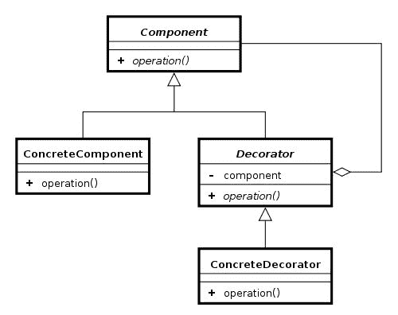

# 八、委托

Kotlin非常重视设计模式。之前，我们已经看到了如何通过对象声明来简化 Singleton 模式的使用，以及如何通过高阶函数和函数类型来简化 Observator 模式的使用。此外，由于 lambda 表达式和函数类型，Kotlin 简化了大多数函数模式的使用。在本章中，我们将看到委托和装饰模式的使用是如何由于类委托而被简化的。我们还将看到一个在编程世界中相当新的特性——属性委托——以及如何使用它来使 Kotlin 属性更加强大。

在本章中，我们将涵盖以下主题:

*   委托模式
*   班级委托
*   装饰图案
*   财产委托
*   标准库中的属性委托
*   创建自定义属性委托

# 班级委托

Kotlin 有一个功能叫做**类委托**。这是一个非常不起眼的特性，有很多实际应用。值得注意的是，它与两种设计模式紧密相连:委托模式和装饰模式。我们将在接下来的章节中更详细地讨论这些模式。委托和装饰模式已经为人所知很多年了，但是在 Java 中，它们的实现需要大量的样板代码。Kotlin 是最早为那些将样板代码减少到最低限度的模式提供本地支持的语言之一。

# 委托模式

在面向对象编程中，委托模式是一种设计模式，是继承的替代。委托意味着对象通过将请求委托给另一个对象(委托)来处理请求，而不是扩展类。

为了支持 Java 中已知的多态行为，两个对象应该实现保存所有委托方法和属性的同一个接口。委托模式的一个简单示例如下:

```kt
    interface Player { // 1 
        fun playGame() 
    } 

    class RpgGamePlayer(val enemy: String) : Player { 
        override fun playGame() { 
            println("Killing $enemy") 
        } 
    } 

    class WitcherPlayer(enemy: String) : Player { 
        val player = RpgGamePlayer(enemy) // 2 

        override fun playGame() { 
            player.playGame() // 3 
        } 
    } 

    // Usage 
    RpgGamePlayer("monsters").playGame() // Prints: Killing monsters 
    WitcherPlayer("monsters").playGame() // Prints: Killing monsters 
```

1.  当我们谈论类委托时，需要有一个接口来定义委托什么方法。

2.  我们委托给的对象(委托)。
3.  `WitcherPlayer`类内部的所有方法都应该调用委托对象(`player`)上的相应方法。

这被称为委托，因为`WitcherPlayer`类正在将`Player`接口中定义的方法委托给类型为`RpgGamePlayer` ( `player`)的实例。通过使用继承而不是委托，可以得到类似的结果。它看起来如下:

```kt
    class WitcherPlayer() : RpgGamePlayer() 
```

乍一看，这两种方法可能看起来相似，但是委托和继承有很多不同。一方面，继承更流行，使用更普遍。它经常在 Java 中使用，并连接到多个 OOP 模式。另一方面，有消息来源强烈支持授权。比如*四人帮*的影响力之作*设计模式*就包含了这样的原则:*重对象构成轻类继承*。另外，热门书籍*有效 Java* 中有一条规则:*重组合轻继承*(第 6 项)。他们都强烈支持授权模式。下面是一些支持使用委托模式而不是继承的基本论点:

*   通常类不是为继承而设计的。当我们重写方法时，我们不知道关于类内部行为的潜在假设(当调用方法时，这些调用如何影响对象、状态等)。例如，当我们重写方法时，我们可能不知道它被其他方法使用，因此重写的方法可能会被一个超类意外调用。即使我们检查方法何时被调用，这个行为也可能在类的新版本中改变(例如，如果我们从外部库扩展类)，从而破坏子类的行为。非常少量的类是为继承而正确设计和记录的，但是几乎所有非抽象类都是为使用而设计的(这包括委托)。
*   在 Java 中，可以将一个类委托给多个类，但只能从一个类继承。
*   通过接口，我们指定要委托哪些方法和属性。这与*接口隔离*原则(来自 SOLID)是兼容的——我们不应该向客户端暴露不必要的方法。
*   有些课是期末的，所以我们只能委托给他们。事实上，所有不是为继承而设计的类都应该是最终类。Kotlin 的设计者意识到了这一点，他们默认将 Kotlin 中的所有类都设置为最终类。
*   对公共图书馆来说，期末考试和提供适当的界面是很好的做法。我们可以改变一个类的实现，而不用担心它会影响库用户(只要从接口的角度来看行为是相同的)。这使得他们不可能继承，但他们仍然是伟大的候选人委托。

More information on how classes should be designed to support inheritance and when delegation should be used can be found in the book *Effective Java*, in *Item 16: Favor composition over inheritance*.

当然，用委托代替继承也有缺点。以下是主要问题:

*   我们需要创建接口来指定应该委托哪些方法
*   我们无法访问受保护的方法和属性

在 Java 中，使用继承还有一个更有力的论据:它更容易实现。即使在比较我们的`WitcherPlayer`示例中的代码时，我们也可以看到委托需要大量额外的代码:

```kt
     class WitcherPlayer(enemy: String) : Player { 
         val player = RpgGamePlayer(enemy)    
         override fun playGame() { 
             player.playGame() 
         } 
     } 

     class WitcherPlayer() : RpgGamePlayer() 
```

当我们用多种方法处理接口时，这尤其成问题。幸运的是，现代语言重视委托模式的使用，其中许多语言都支持本地类委托。Swift 和 Groovy 中对委托模式有很强的支持，Ruby、Python、JavaScript 和 Smalltalk 中也有通过其他机制的支持。Kotlin 还强烈支持类委托，并且使得这种模式的使用非常简单，并且使用几乎为零的样板代码。示例中的`WitcherPlayer`类可以用这种方式在 Kotlin 中实现:

```kt
    class WitcherPlayer(enemy: String) : Player by RpgGamePlayer(enemy) {} 
```

使用`by`关键字，我们通知编译器将`Player`接口中定义的所有方法从`WitcherPlayer`委托给`RpgGamePlayer`。`RpgGamePlayer`的一个实例是在`WitcherPlayer`建造期间创建的。简单来说:`WitcherPlayer`是将`Player`界面中定义的方法委托给一个新的`RpgGamePlayer`对象。

这里真正发生的是，在编译期间，Kotlin 编译器从`WitcherPlayer`中的`Player`生成未实现的方法，并用对`RpgGamePlayer`实例的调用填充它们(与我们在第一个示例中实现它们的方式相同)。最大的改进是我们不需要自己实现那些方法。还要注意，如果委托方法的签名改变了，那么我们就不需要改变委托给它的所有对象，这样类就更容易维护了。

还有另一种方法可以创建和保存委托的实例。它可以由构造函数提供，如本例所示:

```kt
    class WitcherPlayer(player: Player) : Player by player 
```

我们还可以委托给构造函数中定义的属性:

```kt
    class WitcherPlayer(val player: Player) : Player by player 
```

最后，我们可以委托给在类声明期间可访问的任何属性:

```kt
    val d = RpgGamePlayer(10) 
    class WitcherPlayer(a: Player) : Player by d 
```

此外，一个对象可以有多个不同的委托:

```kt
    interface Player { 
        fun playGame() 
    } 

    interface GameMaker { // 1 
        fun developGame() 
    } 

    class WitcherPlayer(val enemy: String) : Player { 
        override fun playGame() { 
            print("Killin $enemy! ") 
        } 
    } 

    class WitcherCreator(val gameName: String) : GameMaker{ 
        override fun developGame() { 
            println("Makin $gameName! ") 
        } 
    } 

    class WitcherPassionate : 
        Player by WitcherPlayer("monsters"), 
        GameMaker by WitcherCreator("Witcher 3") { 

        fun fulfillYourDestiny() { 
            playGame() 
            developGame() 
        } 
    } 

    // Usage 
    WitcherPassionate().fulfillYourDestiny() // Killin monsters! Makin Witcher 3! 
```

1.  `WitcherPlayer`类将`Player`接口委托给一个新的`RpgGamePlayer`对象，`GameMaker`委托给一个新的`WitcherCreator`对象，并且还包括使用来自两个委托的函数的函数`fulfillYourDestiny`。注意`WitcherPlayer`和`WitcherCreator`都没有被标记为打开，没有这个，它们不能被扩展。不过，他们可以被委派。

有了这样的语言支持，委托模式比继承更有吸引力。虽然这种模式有优点也有缺点，但是知道什么时候应该使用它还是很好的。应该使用代理的主要情况如下:

*   当你的子类违反*李斯科夫替代原则*；例如，当我们处理这样的情况时，实现继承只是为了重用超类的代码，但实际上并不是这样。
*   当子类只使用超类的一部分方法时。在这种情况下，有人调用他们不应该调用的超类方法只是时间问题。使用委托，我们只重用我们选择的方法(在接口中定义)。
*   当我们不能或不应该继承时，因为:
    *   这门课是期末考试
    *   它不能从接口后面访问和使用
    *   它不是为继承而设计的

请注意，虽然默认情况下 Kotlin 中的类是最终类，但大多数类都是最终类。如果这些类被放在一个库中，那么我们很可能无法更改或打开这个类。委托将是唯一的选择，使类具有不同的行为。

The Liskov substitution principle is a concept in OOP stating that all subclasses should act like their superclasses. In easier words, If unit tests are passing for some class, they should be passing for its subclasses too. This principle has been popularized by Robert C. Martin, who placed it in his set of most important OOP rules and described it in the popular book *Clean Code*.

书中*有效 Java* 指出“*继承只适用于子类真的是超类*的子类型的情况。”换句话说，只有当两个类之间存在 *is-a* 关系时，类`B`才应该扩展一个类。如果你很想有课`B`延伸课`A`，问问自己*每个 B 真的是 A 吗？*在下一部分中，本书建议在其他情况下都应该使用复合(其中最常见的实现是委托)。

还值得注意的是，Cocoa(苹果公司用于构建软件程序在 iOS 上运行的 UI 框架)经常使用委托而不是继承。这种模式越来越流行，在Kotlin得到了高度支持。

# 装饰图案

Kotlin 类委托真正有用的另一个常见情况是当我们实现 Decorator 模式时。Decorator 模式(也称为 Wrapper 模式)是一种设计模式，它使得在不使用继承的情况下向现有类添加行为成为可能。与我们无需修改对象就可以添加新行为的扩展相反，我们正在创建一个具有不同行为的具体对象。Decorator 模式使用委托，但方式非常特殊——委托是从类外部提供的。下面的 UML 图展示了经典的结构:



装饰模式的经典实现的 UML 图。来源:[http://upload.wikimedia.org](http://upload.wikimedia.org)

装饰器包含它在实现相同接口时装饰的对象。

Java 世界中最流行的装饰器用法的例子是`InputStream`。扩展`InputStream`的类型有很多种，有很多装饰者可以用来给它们添加功能。这个装饰器可以用来添加缓冲，获取压缩文件的内容，或者将文件内容转换成 Java 对象。让我们看看使用多个装饰器来读取压缩的 Java 对象的例子:

```kt
    // Java 
    FileInputStream fis = new FileInputStream("/someFile.gz"); // 1 
    BufferedInputStream bis = new BufferedInputStream(fis); // 2 
    GzipInputStream gis = new GzipInputStream(bis); // 3 
    ObjectInputStream ois = new ObjectInputStream(gis); // 4 
    SomeObject someObject = (SomeObject) ois.readObject(); // 5 
```

1.  创建一个简单的流来读取文件。
2.  创建一个包含缓冲的新流。
3.  创建一个包含读取 GZIP 文件格式压缩数据功能的新流。
4.  创建一个新的流，添加反序列化原始数据和先前使用`ObjectOutputStream`编写的对象的功能。
5.  流在`ObjectInputStream`的`readObject`方法中使用，但是这个例子中的所有对象都在实现`InputStream`(是什么使得这样打包成为可能)并且可以被这个接口指定的方法读取。

请注意，这种模式也类似于继承，但是我们可以决定我们想要使用什么装饰器以及使用的顺序。这更加灵活，并在使用过程中提供了更多的可能性。有些人认为`InputStream`的用法会更好，如果设计师将所有设计的功能做成一个大类，然后使用方法打开或关闭其中的一些。这种方法将违反“T1”单一责任原则“T2”，并导致更复杂和更不可扩展的代码。

虽然 Decorator 模式被认为是实际应用中最好的模式之一，但它很少在 Java 项目中使用。这是因为实现并不简单。接口通常包含多个方法，在每个装饰器中为它们创建委托会生成大量样板代码。Kotlin 中有一种不同的情况——我们已经看到，在 Kotlin 类中，委托实际上是微不足道的。让我们来看看 Decorator 模式中实用的类委托用法的一些经典例子。假设我们想将第一个位置作为*零*元素添加到几个不同的`ListAdapters`中。这个额外的位置有一些特殊的属性。我们无法使用继承来实现这一点，因为这些不同列表的`ListAdapters`属于不同类型(这是标准情况)。在这种情况下，我们可以改变每个类的行为(DRY 规则)，也可以创建一个装饰器。下面是这个装饰器的简短代码:

```kt
class ZeroElementListDecorator(val arrayAdapter: ListAdapter) : 
    ListAdapter by arrayAdapter { 
  override fun getCount(): Int = arrayAdapter.count + 1 
  override fun getItem(position: Int): Any? = when { 
      position == 0 -> null 
      else -> arrayAdapter.getItem(position - 1) 
  } 

  override fun getView(position: Int, convertView: View?,parent: 
ViewGroup): View = when { 
    position == 0 -> parent.context.inflator
        .inflate(R.layout.null_element_layout, parent, false) 
    else -> arrayAdapter.getView(position - 1, convertView, parent) 
  } 
} 

override fun getItemId(position: Int): Long = when { 
  position == 0 -> 0 
  else -> arrayAdapter.getItemId(position - 1) 
} 
```

我们这里使用了`Context`的一个打气筒扩展属性，这个属性在 Kotlin 安卓项目中经常出现，应该是从[第七章](7.html#532G60-7a7324e7f1a1454d830df91c6b78f317)、*扩展功能和属性*知道的:

```kt
    val Context.inflater: LayoutInflater 
        get() = LayoutInflater.from(this) 
```

以这种方式定义的`ZeroElementListDecorator`类总是添加具有静态视图的第一个元素。这里我们可以看到一个简单的使用例子:

```kt
    val arrayList = findViewById(R.id.list) as ListView 
    val list = listOf("A", "B", "C") 
    val arrayAdapter = ArrayAdapter(this, 
          android.R.layout.simple_list_item_1, list) 
    arrayList.adapter = ZeroElementListDecorator(arrayAdapter) 
```

在`ZeroElementListDecorator`中，我们需要重写四个方法可能看起来很复杂，但事实上，还有八个方法，我们不必重写它们，这要归功于 Kotlin 的类委托。我们可以看到，Kotlin 类委托使得 Decorator 模式的实现变得更加容易。

Decorator 模式实现起来非常简单，非常直观。它可以在许多不同的情况下用来扩展具有额外功能的类。这真的很安全，通常被认为是一种好的做法。这些例子只是类委托提供的一些可能性。我相信读者将会发现更多的用例，这些用例具有呈现的模式和使用类委托，从而使项目更加干净、安全和简洁。

# 财产委托

Kotlin 不仅允许类委托，还允许属性委托。在本节中，我们将了解什么是委托属性，回顾 Kotlin 标准库中的属性委托，并学习如何创建和使用自定义属性委托。

# 什么是委托属性？

让我们从解释什么是属性委托开始。下面是使用属性委托的一个示例:

```kt
    class User(val name: String, val surname: String) 

    var user: User by UserDelegate() // 1 

    println(user.name) 
    user = User("Marcin","Moskala")
```

1.  我们将`user`属性委托给`UserDelegate`的一个实例(由构造函数创建)。

属性委托类似于类委托。我们使用相同的关键字(`by`)委托给一个对象。对属性(`set` / `get`)的每次调用将委托给另一个对象(`UserDelegate`)。这样，我们可以为多个属性重用相同的行为，例如，仅当满足某些条件时才设置属性值，或者在访问/更新属性时添加日志条目。

我们知道一个属性并不真正需要一个支持字段。它可能只由 getter(只读)或 getter/setter(读写)定义。在引擎盖下，属性委托只是被翻译成相应的方法调用(`setValue` / `getValue`)。前面的例子将被编译成这样的代码:

```kt
    var p$delegate = UserDelegate() 
    var user: User 
    get() = p$delegate.getValue(this, ::user) 
    set(value) { 
        p$delegate.setValue(this, ::user, value) 
    } 
```

该示例显示，通过使用`by`关键字，我们委托 setter 和 getter 调用来委托。这就是为什么任何具有带正确参数的`getValue`和`setValue`函数的对象都可以用作委托(对于只读属性`getValue`就足够了，因为只需要 getter)。重要的是，该类能够充当属性委托所需要的就是这两种方法。不需要接口。下面是`UserDelegate`的一个实现例子:

```kt
class UserDelegate { 
    operator fun getValue(thisRef: Any?, property: KProperty<*>): 
          User = readUserFromFile() 

    operator fun setValue(thisRef: Any?, property: KProperty<*>, 
          user:User) { 
        saveUserToFile(user) 
    } 
    //... 
} 
```

`setValue`和`getValue`方法用于设置和获取属性的值(属性设置器调用委托给`setValue`方法，属性获取器将值委托给`getValue`方法)。这两个功能都需要标注`operator`关键字。它们有一些特殊的参数集，这些参数决定了委托可以服务的位置和属性。如果一个属性是只读的，那么一个对象只需要有一个`getValue`方法就可以作为它的委托:

```kt
class UserDelegate { 

    operator fun getValue(thisRef: Any?, property: KProperty<*>):
        User = readUserFromFile() 
} 
```

`getValue`方法返回的类型和用户在`setValue`方法中定义的属性类型决定了委托属性的类型。

`getValue`和`setValue`函数(`thisRef`)的第一个参数的类型包含对使用委托的上下文的引用。它可用于限制委托可用于的类型。例如，我们可以通过以下方式定义只能在`Activity`类中使用的委托:

```kt
class UserDelegate { 

    operator fun getValue(thisRef: Activity, property: KProperty<*>): 
          User = thisRef.intent
          .getParcelableExtra("com.example.UserKey") 
} 
```

正如我们所看到的，在所有可用的上下文中都会有对`this`的引用。只有在扩展函数内部或扩展属性上，才会出现 null。引用`this`是从上下文中获取一些数据。如果我们将其输入到`Activity`，那么我们将只能在`Activity`中使用该委托(在任何情况下`this`属于`Activity`类型)。

另外，如果我们想强制委托只在顶层使用，那么我们可以将第一个参数(`thisRef`)类型指定为`Nothing?`，因为该类型唯一可能的值是`null`。

这些方法中的另一个参数是`property`。它包含对委托属性的引用，委托属性包含其元数据(属性名称、类型等)。

属性委托可用于在任何上下文中定义的属性(顶级属性、成员属性、局部变量等):

```kt
    var a by SomeDelegate() // 1 

    fun someTopLevelFun() { 
        var b by SomeDelegate() // 2 
    } 

    class SomeClass() { 
        var c by SomeDelegate() // 3 

        fun someMethod() { 
            val d by SomeDelegate() // 4 
        } 
    } 
```

1.  具有委托的顶级属性
2.  带委托的局部变量(顶级函数内部)
3.  具有委托的成员属性
4.  带委托的局部变量(方法内部)

在接下来的几节中，我们将描述来自 Kotlin 标准库的委托。它们之所以重要，不仅是因为它们通常很有用，还因为它们是如何使用属性委托的好例子。

# 预定义的委托

Kotlin 标准库包含一些非常方便的属性委托。让我们讨论如何在现实项目中使用它们。

# 懒惰功能

有时我们需要初始化一个对象，但是我们希望确保该对象只被初始化一次，当它第一次被使用时。在 Java 中，我们可以通过以下方式解决这个问题:

```kt
    private var _someProperty: SomeType? = null 
    private val somePropertyLock = Any() 
    val someProperty: SomeType 
    get() { 
        synchronized(somePropertyLock) { 
            if (_someProperty == null) { 
                _someProperty = SomeType() 
            } 
            return _someProperty!! 
        } 
    } 
```

这种构造是 Java 开发中的一种流行模式。Kotlin 允许我们通过提供`lazy`委托以更简单的方式解决这个问题。它是最常用的委托。它仅适用于只读属性(`val`)，其用法如下:

```kt
    val someProperty by lazy { SomeType() } 
```

提供委托的标准库函数中的`lazy`函数:

```kt
    public fun <T> lazy(initializer: () -> T): 
          Lazy<T> =  SynchronizedLazyImpl(initializer) 
```

形式上，在`SynchronizedLazyImpl`的这个示例对象中，它被用作属性委托。虽然，最常见的是从其对应的函数名中将其称为**惰性委托**。与其他委托从提供它们的函数名称中命名的方式相同。

The lazy delegate also has a thread safety mechanism. By default, delegates are fully thread safe, but we can change this behavior to make this function more efficient in situations where we know that there never will be more than one thread using it at the same time. To fully turn off thread-safety mechanisms we need to place the `enum` type value `LazyThreadSafetyMode.NONE` as a first argument of the `lazy` function:

`val someProperty by lazy(LazyThreadSafetyMode.NONE) { SomeType() }`

由于惰性委托，属性的初始化被延迟，直到需要该值。使用惰性委托有几个好处:

*   更快的类初始化导致更快的应用程序启动时间，因为值初始化被延迟到第一次使用时
*   有些值可能永远不会用于某些流，因此它们永远不会被初始化——我们正在节省资源(内存、处理器时间、电池)

另一个好处是，有些对象需要在创建它们的类实例之后再创建。例如，在`Activity`中，在使用`setContentView`方法设置布局之前，我们不能访问资源，这通常在`onCreate`方法中调用。我将在这个例子中展示它。让我们看看用经典的 Java 方式填充视图引用元素的 Java 类:

```kt
//Java 
public class MainActivity extends Activity { 

    TextView questionLabelView 
    EditText answerLabelView 
    Button confirmButtonView 

    @Override 
    public void onCreate(Bundle savedInstanceState) { 
        super.onCreate(savedInstanceState); 
        setContentView(R.layout.activity_main); 

        questionLabelView = findViewById<TextView>
              (R.id.main_question_label);    
        answerLabelView   = findViewById<EditText>
              (R.id.main_answer_label);    
        confirmButtonView = findViewById<Button>
              (R.id.main_button_confirm);      
    } 
} 
```

如果我们一对一地把它翻译成Kotlin，它看起来如下:

```kt
class MainActivity : Activity() { 

    var questionLabelView: TextView? = null 
    var answerLabelView: TextView? = null 
    var confirmButtonView: Button? = null 

    override fun onCreate(savedInstanceState: Bundle) { 
        super.onCreate(savedInstanceState) 
        setContentView(R.layout.main_activity) 

        questionLabelView = findViewById<TextView>
              (R.id.main_question_label)   
        answerLabelView = findViewById<TextView>
              (R.id.main_answer_label)
        confirmButtonView = findViewById<Button>
              (R.id.main_button_confirm)
    } 
}
```

使用惰性委托，我们可以用一种更简单的方式实现这个行为:

```kt
class MainActivity : Activity() { 

   val questionLabelView: TextView by lazy 
{ findViewById(R.id.main_question_label) as TextView } 
   val answerLabelView: TextView by lazy 
{ findViewById(R.id.main_answer_label) as TextView } 
   val confirmButtonView: Button by lazy 
{ findViewById(R.id.main_button_confirm) as Button } 

   override fun onCreate(savedInstanceState: Bundle) { 
     super.onCreate(savedInstanceState) 
     setContentView(R.layout.main_activity) 
   } 
} 
```

这种方法的好处如下:

*   属性在一个地方声明和初始化，所以代码更简洁。
*   属性是不可空的，而不是可空的。这防止了大量无用的可空性检查。
*   这些属性是只读的，因此我们拥有线程同步或智能强制转换等所有优势。
*   传递给惰性委托(包含`findViewById`)的 lambda 只有在第一次访问属性时才会执行。
*   取值将晚于课程创建期间。这将加快启动速度。如果我们不使用这些视图中的一些，它们的值将根本不会被采用(`findViewById`在视图复杂时并不是真正有效的操作)。
*   编译器将标记未使用的属性。在 Java 实现中不会，因为编译器会注意到值集的用法。

我们可以通过提取公共行为并将其转换为扩展函数来改进前面的实现:

```kt
fun <T: View> Activity.bindView(viewId: Int) = lazy { findViewById(viewId) as T } 
```

然后，我们可以用更简单、更简洁的代码定义视图绑定:

```kt
class MainActivity : Activity() { 

  var questionLabelView: TextView by bindView(R.id.main_question_label)  // 1 
  var answerLabelView: TextView by bindView(R.id.main_answer_label)   // 1 
  var confirmButtonView: Button by bindView(R.id.main_button_confirm) // 1 

  override fun onCreate(savedInstanceState: Bundle) { 
    super.onCreate(savedInstanceState) 
    setContentView(R.layout.main_activity) 
  } 
} 
```

1.  我们不需要设置提供给`bindView`函数的类型，因为它是从属性类型推断出来的。

现在，当我们第一次访问一个特定的视图时，我们有一个单独的代理在引擎盖下调用`findViewById`。这是一个非常简洁的解决方案。

There is another way of dealing with this problem. The current popular one is the *Kotlin Android Extension* plugin, which generates auto-binding to views in `Activities` and `Fragments`. We will discuss the practical applications in [Chapter 9](9.html#6JMSS0-7a7324e7f1a1454d830df91c6b78f317), *Making your Marvel Gallery Application*.

即使有这样的支持，使用绑定仍然有好处。一个是我们使用什么视图元素的明确知识，另一个是元素标识的名称和我们保存这个元素的变量的名称之间的分离。同样编译时间也更快。

同样的机制可以应用于解决其他安卓相关的问题。例如，当我们将一个参数传递给`Activity`时。标准的 Java 实现如下所示:

```kt
//Java 
class SettingsActivity extends Activity { 

  final Doctor DOCTOR_KEY = "doctorKey" 
  final String TITLE_KEY = "titleKey" 

  Doctor doctor 
  Address address 
  String title 

  public static void start ( Context context, Doctor doctor, 
  String title ) { 
    Intent intent = new Intent(context, SettingsActivity.class ) 
    intent.putExtra(DOCTOR_KEY, doctor) 
    intent.putExtra(TITLE_KEY, title) 
    context.startActivity(intent) 
  } 

  @Override 
  public void onCreate(Bundle savedInstanceState) { 
    super.onCreate(savedInstanceState); 
    setContentView(R.layout.activity_main); 

    doctor = getExtras().getParcelable(DOCTOR_KEY)   
    title = getExtras().getString(TITLE_KEY)   

    ToastHelper.toast(this, doctor.id) 
    ToastHelper.toast(this, title) 
  } 
} 
```

我们可以在 Kotlin 中编写相同的实现，但是我们也可以检索参数值(`getString` / `getParcerable`)以及变量声明。为此，我们需要以下扩展函数:

```kt
fun <T : Parcelable> Activity.extra(key: String) = lazy 
    { intent.extras.getParcelable<T>(key) } 

fun Activity.extraString(key: String) = lazy 
    { intent.extras.getString(key) } 
```

然后我们可以通过使用`extra`和`extraString`委托获得额外的参数:

```kt
class SettingsActivity : Activity() { 

    private val doctor by extra<Doctor>(DOCTOR_KEY) // 1 
    private val title by extraString(TITLE_KEY) // 1 

    override fun onCreate(savedInstanceState: Bundle?) { 
        super.onCreate(savedInstanceState) 
        setContentView(R.layout.settings_activity) 
        toast(doctor.id) // 2 
        toast(title) // 2 
    } 

    companion object { // 3 
        const val DOCTOR_KEY = "doctorKey" 
        const val TITLE_KEY = "titleKey" 

    fun start(context: Context, doctor: Doctor, title: String) { // 3 
        ontext.startActivity(getIntent<SettingsActivity>().apply { // 4 
            putExtra(DOCTOR_KEY, doctor) // 5 
            putExtra(TITLE_KEY, title) // 5 
        }) 
    } 
  } 
} 
```

1.  我们正在定义应该使用相应的键从`Activity`参数中检索哪些值的属性。
2.  这里我们从`onCreate`方法中的参数访问属性。当我们请求属性(使用 getter)时，惰性委托将从额外的东西中获取它的值，并将其存储起来供以后使用。

3.  要使静态方法开始活动，我们需要使用伴随对象。
4.  `SettingsActivity::class.java`是 Java 类引用`SettingsActivity.class`的类似物。
5.  我们正在使用第 7 章、*扩展功能和属性*中定义的方法。

我们还可以通过函数来检索 **Bundle** 可以持有的其他类型(例如`Long`、`Serializable`)。当我们想要保持非常快的编译时间时，这是参数注入库(如`ActivityStarter`)的一个非常好的替代。我们可以使用类似的函数来绑定字符串、颜色、服务、存储库以及模型和逻辑的其他部分:

```kt
fun <T> Activity.bindString(@IdRes id: Int): Lazy<T> = 
    lazy { getString(id) } 
fun <T> Activity.bindColour(@IdRes id: Int): Lazy<T> = 
    lazy { getColour(id) } 
```

在`Activity`中，所有重的或者依赖于参数的东西都应该使用惰性委托来声明(或者异步提供)。此外，我们应该将依赖于需要延迟初始化的元素的所有元素定义为延迟。例如，取决于`doctor`属性的`presenter`定义:

```kt
    val presenter by lazy { MainPresenter(this, doctor) } 
```

否则，构建`MainPresenter`对象的尝试将在类创建期间发生，此时我们还不能从意图中读取值，并且它不能填充`doctor`属性，应用程序将崩溃。

我认为这些例子足以让我们相信懒惰的委托在安卓项目中真的很有用。它也是一个很好的属性委托，因为它简单而优雅。

# notNull 函数

`notNull`委托是最简单的标准库委托，这就是为什么它将首先呈现。用法如下:

```kt
    var someProperty: SomeType by notNull()
```

Functions that provide most standard library delegates (including the `notNull` function) are defined in `object` delegates. To use them, we need to either refer to this object (`Delegates.notNull()`) or import it (`import kotlin.properties.Delegates.notNull`). We will assume in examples that this `object` is imported so we will omit reference to it.

`notNull`委托允许我们定义一个不可空的变量，该变量在以后初始化，而不是在对象构建期间初始化。我们可以在不提供默认值的情况下将变量定义为不可为空。`notNull`功能是`lateinit`的替代功能:

```kt
    lateinit var someProperty: SomeType 
```

`notNull`委托提供了与`lateinit`几乎相同的效果(只是错误信息不同)。如果在首先设置值之前尝试使用该属性，它将抛出`IllegalStateException`并终止安卓应用程序。因此，只有当我们知道在第一次尝试使用之前会设置一个值时，才应该使用它。

`lateinit`和`notNull`委托之间的区别很简单。`lateinit`比`notNull`委托更快，所以应该尽可能经常使用它来代替`notNull`委托。但它有限制，`lateinit`不能用于原语或顶级属性，所以在这种情况下，改为使用`notNull`。

我们来看看`notNull`委托实现。下面是`notNull`的功能实现:

```kt
    public fun <T: Any> notNull(): ReadWriteProperty<Any?, T> =  
        NotNullVar() 
```

正如我们所看到的，`notNull`实际上是一个返回一个对象的函数，该对象是隐藏在`ReadWriteProperty`接口后面的我们的实际委托的一个实例。让我们看一个实际的委托定义:

```kt
private class NotNullVar<T: Any>() : ReadWriteProperty<Any?, T> { // 1 
  private var value: T? = null 

  public override fun getValue(thisRef: Any?, 
  property: KProperty<*>): T { 
     return value ?: throw IllegalStateException("Property 
            ${property.name} should be initialized before get.") // 2 
  } 

  public override fun setValue(thisRef: Any?, 
  property: KProperty<*>, value: T) { 
     this.value = value 
  } 
} 
```

1.  班级是私人的。有可能是因为它是由功能`notNull`提供的，功能`notNull`是将它作为`ReadWriteProperty<Any?, T>`返回的，是公共接口。
2.  这里我们看到返回值是如何提供的。如果在使用过程中它为 null，则值未设置，并且方法将引发错误。否则，它将返回值。

这个委托应该很容易理解。`setValue`函数将值设置为可空字段，如果不为空，则`getValue`返回该字段，如果为空，则抛出异常。下面是这个错误的一个例子:

```kt
    var name: String by Delegates.notNull() 
    println(name) 
    // Error: Property name should be initialized before get. 
```

这是委托属性用法的一个非常简单的例子，也是对属性委托如何工作的一个很好的介绍。委托属性是非常强大的结构，具有多个应用程序。

# 可观察到的委托

可观察的是可变属性最有用的标准库委托。每次设置值时(调用`setValue`方法)，都会调用声明中的 lambda 函数。可观察委托的一个简单示例如下:

```kt
    var name: String by Delegates.observable("Empty"){ 
        property, oldValue, newValue -> // 1 
        println("$oldValue -> $newValue") // 2 
    } 

    // Usage 
    name = "Martin" // 3, 
    Prints: Empty -> Martin 
    name = "Igor" // 3, 
    Prints: Martin -> Igor 
    name = "Igor" // 3, 4 
    Prints: Igor -> Igor
```

1.  lambda 函数的参数如下:
    *   `property`:对委托财产的引用。这里指的是名字。这与描述的`setValue`和`getValue`的属性相同。它是`KProperty`型的。在这种情况下(并且在大多数情况下)，我们可以在不使用下划线(“`_`”符号)时使用它。
    *   `oldValue`:上一次`property`的数值(变化前)。
    *   `newValue`:新值`property`(变更后)。
2.  每次为属性设置新值时，都会调用 lambda 函数。
3.  当我们设置新值时，该值会更新，但同时调用委托中声明的 lambda 方法。
4.  请注意，每次使用 setter 时都会调用 lambda，新值是否等于以前的值并不重要。

特别重要的是要记住，每次设置新值时都会调用 lambda，而不是在对象的内部状态改变时。例如:

```kt
    var list: MutableList<Int> by observable(mutableListOf()) 
    { _, old, new ->  
        println("List changed from $old to $new") 
    } 

    // Usage 
    list.add(1)  // 1 
    list =  mutableListOf(2, 3) 
    // 2, prints: List changed from [1] to [2, 3] 
```

1.  不打印任何东西，因为我们不改变属性(不使用 setter)。我们只更改列表中定义的属性，而不更改对象本身。
2.  在这里，我们更改了 list 的值，因此调用了来自可观察委托的 lambda 函数，并打印了文本。

与可变类型相反，可观察委托对于不可变类型非常有用。幸运的是，Kotlin 中的所有基本类型默认都是不可变的(`List`、`Map`、`Set`、`Int`、`String`)。让我们看一个实际的安卓例子:

```kt
    class SomeActivity : Activity() { 

        var list: List<String> by Delegates.observable(emptyList()) { 
            prop, old, new -> if(old != new) updateListView(new) 
        }   
        //  ... 
    } 
```

每次我们更改列表时，视图都会更新。请注意，虽然`List`是不可变的，但是当我们想要应用任何更改时，我们需要使用 setter，因此我们可以确定在此操作之后，列表将会更新。这比每次列表变化都记得调用`updateListView`方法要容易得多。这种模式可以在项目中广泛用于声明编辑视图的属性。它改变了更新视图机制的工作方式。

使用可观察的委托可以解决的另一个问题是，在`ListAdapters`中，每当列表中的元素发生变化时，总有一个问题需要调用`notifyDataSetChanged`。在 Java 中，经典的解决方案是封装这个列表，并在修改它的每个函数中调用`notifyDataSetChanged`。在 Kotlin 中，我们可以使用一个可观察的属性委托来简化这一点:

```kt
var list: List<LocalDate> by observable(list) { _, old, new ->  // 1 
  if(new != old) notifyDataSetChanged() 
} 
```

1.  注意这里的列表是不可变的，所以没有使用`notifyDataSetChanged`就没有办法改变它的元素。

可观察委托用于定义属性值更改时应该发生的行为。当我们有每次更改属性时都应该执行的操作时，或者当我们想要将属性值与视图或一些其他值绑定时，最常使用它。但是在函数内部，我们无法决定是否设置新值。为此，使用`vetoable`委托。

# 可否决的委托

`vetoable`函数是一个标准的库属性委托，其工作方式类似于可观察的委托，但有两个主要区别:

*   在设置新值之前，会调用参数中的 lambda
*   它允许声明中的 lambda 函数决定是接受还是拒绝一个新值

例如，如果我们假设列表必须总是包含比旧列表更多的项目，那么我们将定义以下`vetoable`委托:

```kt
var list: List<String> by Delegates.vetoable(emptyList()) 
{ _, old, new ->  
   new.size > old.size 
} 
```

如果新列表包含的项目数量不会超过旧列表，则该值不会改变。所以我们可以像对待`observable`一样对待`vetoable`，这也是在决定值要不要改变。让我们假设我们希望有一个绑定到视图的列表，但是它至少需要有三个元素。我们不允许任何可能减少元素的改变。实现如下:

```kt
var list: List<String> by Delegates.vetoable(emptyList()) 
{ prop, old, new ->  
    if(new.size < 3) return@vetoable false // 1 
    updateListView(new) 
    true // 2 
} 
```

1.  如果一个新的列表大小小于 3，那么我们不接受，从 lambda 返回`false`。这个带标签的 return 语句返回的`false`值(用于 lambda 表达式的返回)是新值不应该被接受的信息。
2.  这个 lambda 函数需要返回值。该值取自带有标签的`return`或λ体的最后一行。这里的值`true`通知应该接受一个新值。

下面是一个简单的用法示例:

```kt
    listVetoable = listOf("A", "B", "C") // Update A, B, C 
    println(listVetoable) // Prints: [A, B, C] 
    listVetoable = listOf("A") // Nothing happens 
    println(listVetoable) // Prints: [A, B, C] 
    listVetoable = listOf("A", "B", "C", "D", "E")  
    // Prints: [A, B, C, D, E] 
```

我们也可以因为一些其他原因使它不可更改，例如，我们可能仍在加载数据。此外，可否决的属性委托可以在验证器中使用。例如:

```kt
    var name: String by Delegates.vetoable("") 
    { prop, old, new ->  
    if (isValid(new)) { 
        showNewData(new) 
        true 
    } else { 
        showNameError() 
        false 
    }
```

该属性只能根据谓词`isValid(new)`更改为正确的值。

# 映射类型的属性委托

标准库包含`Map`和`MutableMap`的扩展，具有提供`getValue`和`setValue`功能的`String`键类型。感谢他们，`map`也可以作为属性委托:

```kt
    class User(map: Map<String, Any>) { // 1 
        val name: String by map 
        val kotlinProgrammer: Boolean by map 
    } 

    // Usage 
    val map: Map<String, Any> = mapOf( // 2 
        "name" to "Marcin", 
        "kotlinProgrammer" to true 
    ) 
    val user = User(map) // 3 
    println(user.name)  // Prints: Marcin 
    println(user.kotlinProgrammer)  // Prints: true 
```

1.  映射键类型需要为`String`，值类型不受限制。往往是`Any`或者`Any?`
2.  创建包含所有值的`Map`
3.  给物体提供一个`map`。

当我们将数据保存在`Map`中时，这可能是有用的，并且也适用于以下情况:

*   当我们想要简化对这些值的访问时
*   当我们定义一个结构，告诉我们在这个映射中应该期望什么类型的键时
*   当我们请求一个被委托给`Map`的属性时，它的值将从这个映射值中获取一个等于属性名的键

它是如何实现的？以下是标准库中的简化代码:

```kt
operator fun <V, V1: V> Map<String, V>.getValue( // 1 
      thisRef: Any?, // 2 
      property: KProperty<*>): V1 { // 3 
          val key = property.name // 4 
          val value = get(key) 
          if (value == null && !containsKey(key)) { 
              throw NoSuchElementException("Key ${property.name} 
              is missing in the map.") 
          } else { 
              return value as V1 // 3 
          } 
      } 
```

1.  `V`是列表中的一种值
2.  `thisRef`属于`Any?`类型，因此`Map`可以在任何上下文中用作属性委托
3.  `V1`为返回式。这通常是从属性中推断出来的，但它必须是类型`V`的子类型
4.  物业名称在`map.`上作为`key`

请记住，这只是一个扩展函数。一个对象需要成为委托的只是包含`getValue`方法(和`setValue`，用于读写属性)。我们甚至可以使用`object`声明从匿名类的对象创建委托:

```kt
val someProperty by object { // 1 
    operator fun  getValue(thisRef: Any?, 
    property: KProperty<*>) = "Something" 
} 
println(someProperty) // prints: Something 
```

1.  对象没有实现任何接口。它只包含有适当签名的`getValue`方法。这足以使它作为只读属性委托工作。

注意在`map`中，当我们要求属性值时，需要有一个这样名称的条目，否则会抛出一个错误(使属性可空并不会改变它)。

例如，当我们有一个来自带有动态字段的应用编程接口的对象时，将字段委托给映射会很有用。我们希望将提供的数据视为一个对象，以便更容易地访问其字段，但我们也需要将它保持为一个映射，以便能够列出由一个应用编程接口给出的所有字段(甚至是我们没有预料到的字段)。

在前面的例子中，我们使用了`Map`，它是不可变的；因此，对象属性是只读的(`val`)。如果我们想做一个可以改变的对象，那么我们应该使用`MutableMap`，然后属性可以定义为可变的(`var`)。这里有一个例子:

```kt
class User(val map: MutableMap<String, Any>) { 
    var name: String by map 
    var kotlinProgrammer: Boolean by map 

    override fun toString(): String = "Name: $name, 
    Kotlin programmer: $kotlinProgrammer" 
} 

// Usage 
val map = mutableMapOf( // 1 
    "name" to "Marcin", 
    "kotlinProgrammer" to true 
) 
val user = User(map) 
println(user) // prints: Name: Marcin, Kotlin programmer: true 
user.map.put("name", "Igor") // 1  
println(user) // prints: Name: Igor, Kotlin programmer: true 
user.name = "Michal" // 2 
println(user) // prints: Name: Michal, Kotlin programmer: true 
```

1.  属性值可以通过改变`map`的值来改变
2.  属性值也可以像任何其他属性一样更改。那里真正发生的是价值变化被委托给`setValue`，而这又在改变`map`。

虽然这里的属性是可变的，但也必须提供`setValue`功能。作为`MutableMap`的扩展功能实现。下面是简化代码:

```kt
    operator fun <V> MutableMap<String, V>.setValue( 
        thisRef: Any?,  
        property: KProperty<*>,  
        value: V 
    ) { 
        put(property.name, value) 
    } 
```

请注意，即使如此简单的函数也能允许使用公共对象的创新方式。这显示了财产委托人给予的可能性。

Kotlin 允许我们定义自定义委托。现在，我们可以找到许多提供新属性委托的库，它们可以在安卓中用于不同的目的。属性委托在 Android 中有多种使用方式。在下一节中，我们将看到一些自定义属性委托的例子，并且我们将看一看这个特性真正有帮助的情况。

# 自定义委托

所有以前的委托都来自标准库，但是我们可以轻松地实现自己的属性委托。我们已经看到，为了允许一个类成为委托，我们需要提供`getValue`和`setValue`函数。它们必须有具体的签名，但是不需要扩展类或实现接口。使用对象作为委托，我们甚至不需要改变它的内部实现，因为我们可以定义`getValue`和`setValue`作为扩展函数。但是，当我们创建自定义类作为委托时，接口可能会很有用:

*   它将定义函数结构，因此我们可以在AndroidStudio中生成适当的方法。
*   如果我们正在创建库，那么我们可能希望将委托类设为私有或内部类，以防止对它们的不当使用。我们已经在`notNull`部分看到了这种情况，类`NotNullVar`是私有的，作为一个接口`ReadWriteProperty<Any?, T>`。

提供允许某些类被委托的全部功能的接口是`ReadOnlyProperty`(对于只读属性)和`ReadWriteProperty`(对于读写属性)。这些接口非常有用，所以让我们看看它们的定义:

```kt
    public interface ReadOnlyProperty<in R, out T> { 
        public operator fun getValue(thisRef: R, 
            property: KProperty<*>): T 
    } 

    public interface ReadWriteProperty<in R, T> { 
       public operator fun getValue(thisRef: R, 
           property: KProperty<*>): T 
       public operator fun setValue(thisRef: R, 
           property: KProperty<*>, value: T) 
    } 
```

参数的值已经解释过了，但是让我们再看一遍:

*   `thisRef`:对使用委托的对象的引用。它的类型定义了可以使用委托的上下文。
*   `property`:包含委托属性数据的引用。它包含有关该属性的所有信息，例如它的名称或类型。
*   `value`:要设置的新值。

The parameters `thisRef` and `property` are not used in the following delegates: Lazy, Observable and Vetoable. `Map`, `MutableMap`, and `notNull` use property to obtain the name of the property for the key. But these parameters can be used in different cases.

让我们看一些小的但有用的自定义属性委托的例子。我们已经看到了只读属性的惰性属性委托；然而，有时我们需要一个可变的惰性属性。如果在初始化之前要求它提供值，那么它应该从初始化器中填充它的值并返回它。在其他情况下，它应该像普通的可变属性一样工作:

```kt
fun <T> mutableLazy(initializer: () -> T): ReadWriteProperty<Any?, T> = MutableLazy<T>(initializer) 

private class MutableLazy<T>(val initializer: () -> T) : ReadWriteProperty<Any?, T> { 

   private var value: T? = null 
   private var initialized = false 

   override fun getValue(thisRef: Any?, property: KProperty<*>): T { 
       synchronized(this) { 
           if (!initialized) { 
               value = initializer() 
           } 
           return value as T 
       } 
   } 

   override fun setValue(thisRef: Any?, 
       property: KProperty<*>, value: T) { 
       synchronized(this) { 
           this.value = value 
           initialized = true 
       } 
   } 
} 
```

1.  委托隐藏在接口后面，由函数提供服务，因此允许我们更改`MutableLazy`的实现，而不用担心它是否会影响正在使用它的代码。

2.  我们正在实施`ReadWriteProperty`。它是可选的，但是非常有用，因为它强加了读写属性的正确结构。它的第一种类型是`Any?`，这意味着我们可以在任何上下文中使用这个属性委托，包括顶层。它的第二种类型是泛型。请注意，对该类型没有限制，因此它也可以为空。
3.  属性的值存储在`value`属性中，它的存在存储在一个初始化的属性中。我们需要这样做，因为我们希望允许`T`为可空类型。那么值中的`null`可能意味着它还没有初始化，或者它只是等于`null`。

4.  我们不需要使用`operator`修改器，因为它已经在界面中使用了。
5.  如果在设置任何值之前调用`getValue`，则使用初始值设定项填充该值。
6.  我们需要将该值强制转换为`T`，因为它可能不是-null，我们将该值初始化为可空值，并将 null 作为初始值。

这个属性委托可能在安卓开发的不同用例中有用；例如，当一个属性的默认值存储在一个文件中，我们需要读取它(这是一个繁重的操作):

```kt
    var gameMode : GameMode by MutableLazy { 
        getDefaultGameMode()  
    } 

    var mapConfiguration : MapConfiguration by MutableLazy { 
        getSavedMapConfiguration() 
    } 

    var screenResolution : ScreenResolution by MutableLazy { 
        getOptimalScreenResolutionForDevice() 
    } 
```

这样，如果用户在使用之前设置了这个属性的自定义值，我们就不必自己计算了。第二个自定义属性委托将允许我们定义属性 getter:

```kt
    val a: Int get() = 1 
    val b: String get() = "KOKO" 
    val c: Int get() = 1 + 100 
```

在 Kotlin 1.1 定义它之前，我们总是需要定义属性的类型。为了避免这种情况，我们可以将以下扩展函数定义为函数类型(因此，也是 lambda 表达式):

```kt
    inline operator fun <R> (() -> R).getValue( 
        thisRef: Any?, 
        property: KProperty<*> 
    ): R = invoke() 
```

然后我们可以这样定义具有相似行为的属性:

```kt
    val a by { 1 } 
    val b by { "KOKO" } 
    val c by { 1 + 100 } 
```

这种方式不是首选的，因为它降低了效率，但它是委托属性为我们提供的可能性的一个很好的例子。如此小的扩展函数使得函数类型成为属性委托。这是编译后 Kotlin 中的简化代码(注意扩展函数被标记为内联的，所以它的调用被它的主体替换):

```kt
    private val `a$delegate` = { 1 } 
    val a: Int get() = `a$delegate`() 
    private val `b$delegate` = {  "KOKO" } 
    val b: String get() = `b$delegate`() 
    private val `c$delegate` = { 1 + 100 } 
    val c: Int get() = `c$delegate`() 
```

在下一节中，我们将看到一些为真实项目创建的自定义委托。它们将与它们解决的问题一起呈现。

# 视图绑定

当我们在项目中使用**模型-视图-演示者** ( **MVP** )时，那么我们需要通过演示者在视图中进行所有的更改。因此，我们被迫在视图上创建多个函数，例如:

```kt
    override fun getName(): String { 
        return nameView.text.toString() 
    } 

    override fun setName(name: String) { 
        nameView.text = name 
    } 
```

我们还必须在下面的`interface`中定义函数:

```kt
    interface MainView { 
        fun getName(): String 
        fun setName(name: String) 
    } 
```

我们可以通过使用属性绑定来简化前面的代码，减少对 setter/getter 方法的需求。我们可以将属性绑定到 view 元素。这是我们希望实现的结果:

```kt
    override var name: String by bindToTex(R.id.textView) 
```

和`interface`:

```kt
    interface MainView { 
        var name: String 
    } 
```

前面的例子更简洁，更容易维护。请注意，我们通过参数提供元素标识。一个简单的类会给我们预期的结果如下:

```kt
fun Activity.bindToText( 
    @IdRes viewId: Int ) = object : 
    ReadWriteProperty<Any?, String> { 

  val textView by lazy { findViewById<TextView>(viewId) } 

  override fun getValue(thisRef: Any?, 
      property: KProperty<*>): String { 
      return textView.text.toString() 
  } 

  override fun setValue(thisRef: Any?, 
      property: KProperty<*>, value: String) { 
      textView.text = value 
  } 
} 
```

我们可以为不同的视图属性和不同的上下文(`Fragment`、`Service`)创建类似的绑定。另一个真正有用的工具是绑定到可见性，即将逻辑属性(类型为`Boolean`)绑定到`view`元素的可见性:

```kt
fun Activity.bindToVisibility( 
   @IdRes viewId: Int ) = object : 
   ReadWriteProperty<Any?, Boolean> { 

   val view by lazy { findViewById(viewId) } 

  override fun getValue(thisRef: Any?, 
      property: KProperty<*>): Boolean { 
      return view.visibility == View.VISIBLE 
  } 

  override fun setValue(thisRef: Any?, 
      property: KProperty<*>, value: Boolean) { 
      view.visibility = if(value) View.VISIBLE else View.GONE 
  } 
} 
```

这些实现提供了在 Java 中很难实现的可能性。可以为其他`View`元素创建类似的绑定，以使使用 MVP 更短更简单。刚才展示的片段只是简单的例子，但是更好的实现可以在库`KotlinAndroidViewBindings`([https://github.com/MarcinMoskala/KotlinAndroidViewBindings](https://github.com/MarcinMoskala/KotlinAndroidViewBindings))中找到。

# 偏好绑定

为了展示更复杂的例子，我们将介绍帮助使用`SharedPreferences`的尝试。对于这个问题，有更好的 Kotlin 方法，但是这个尝试很好分析，并且它是我们在扩展属性上使用属性委托的一个合理的例子。因此，我们希望能够将保存在`SharedPreferences`中的值视为`SharedPreferences`对象的属性。下面是用法示例:

```kt
    preferences.canEatPie = true 
    if(preferences.canEatPie) { 
        // Code 
    } 
```

如果我们进行以下扩展属性定义，我们就可以实现它:

```kt
    var SharedPreferences.canEatPie: 
    Boolean by bindToPreferenceField(true) // 1

    var SharedPreferences.allPieInTheWorld: 
    Long by bindToPreferenceField(0,"AllPieKey") //2
```

1.  布尔类型的属性。当属性不可为空时，必须在函数的第一个参数中提供默认值。

2.  属性可以提供自定义键。它在现实项目中很有用，在现实项目中，我们必须控制这个键(例如，在属性重命名期间不要无意中更改它)。

让我们通过深入研究非空属性来分析它是如何工作的。首先，让我们看看提供者函数。请注意，属性的类型决定了从`SharedPreferences`获取值的方式(因为有不同的函数，如`getString`、`getInt`等)。为了获得它，我们需要这个类类型作为`inline`函数的`reified`类型提供，或者通过参数提供。委托提供者函数是这样的:

```kt
inline fun <reified T : Any> bindToPreferenceField( 
      default: T?, 
      key: String? = null 
): ReadWriteProperty<SharedPreferences, T> // 1 
    = bindToPreferenceField(T::class, default, key) 

fun <T : Any> bindToPreferenceField( // 2 
    clazz: KClass<T>, 
    default: T?, 
    key: String? = null 
): ReadWriteProperty<SharedPreferences, T> 
      = PreferenceFieldBinder(clazz, default, key) // 1 
```

1.  两个功能都是在界面`ReadWriteProperty<SharedPreferences, T>`后面返回对象。请注意，这里的上下文设置为`SharedPreferences`，因此只能在那里或`SharedPreferences`扩展中使用。定义这个函数是因为类型参数不能被重新定义，我们需要提供类型作为普通参数。
2.  请注意，`bindToPreferenceField`函数不能是私有的或内部的，因为内联函数只能使用具有相同或较少限制修饰符的函数。

最后，让我们看看`PreferenceFieldDelegate`类，它是我们的委托:

```kt
internal open class PreferenceFieldDelegate<T : Any>( 
      private val clazz: KClass<T>, 
      private val default: T?, 
      private val key: String? 
) : ReadWriteProperty<SharedPreferences, T> { 

  override operator fun getValue(thisRef: SharedPreferences, 
  property: KProperty<*>): T
    = thisRef.getLong(getValue<T>(clazz, default, getKey(property))

  override fun setValue(thisRef: SharedPreferences, 
  property: KProperty<*>, value: T) { 
     thisRef.edit().apply 
     { putValue(clazz, value, getKey(property)) }.apply() 
  } 

  private fun getKey(property: KProperty<*>) = 
  key ?: "${property.name}Key" 
} 
```

现在我们知道`thisRef`参数是如何使用的了。它是`SharedPreferences`类型的，我们可以用它来获取和设置所有的值。以下是根据属性类型获取和保存值的函数定义:

```kt
internal fun SharedPreferences.Editor.putValue(clazz: KClass<*>, value: Any, key: String) {
   when (clazz.simpleName) {
       "Long" -> putLong(key, value as Long)
       "Int" -> putInt(key, value as Int)
       "String" -> putString(key, value as String?)
       "Boolean" -> putBoolean(key, value as Boolean)
       "Float" -> putFloat(key, value as Float)
       else -> putString(key, value.toJson())
   }
}

internal fun <T: Any> SharedPreferences.getValue(clazz: KClass<*>, default: T?, key: String): T = when (clazz.simpleName) {
   "Long" -> getLong(key, default as Long)
   "Int" -> getInt(key, default as Int)
   "String" -> getString(key, default as? String)
   "Boolean" -> getBoolean(key, default as Boolean)
   "Float" -> getFloat(key, default as Float)
   else -> getString(key, default?.toJson()).fromJson(clazz)
} as T
```

我们还需要`toJson`和`fromJson`定义:

```kt
var preferencesGson: Gson = GsonBuilder().create()
internal fun Any.toJson() = preferencesGson.toJson(this)!!
internal fun <T : Any> String.fromJson(clazz: KClass<T>) = preferencesGson.fromJson(this, clazz.java)
```

有了这样的定义，我们可以为`SharedPreferences`定义额外的扩展属性:

```kt
var SharedPreferences.canEatPie: Boolean by bindToPreferenceField(true) 
```

正如我们已经在[第 7 章](7.html#532G60-7a7324e7f1a1454d830df91c6b78f317)、*扩展函数和属性*中看到的，在 Java 中没有这样一个我们可以添加到类中的字段。在幕后，扩展属性被编译成 getter 和 setter 函数，它们将调用委托给一个已创建的委托:

```kt
val 'canEatPie$delegate' = bindToPreferenceField(Boolean::class, true) 

fun SharedPreferences.getCanEatPie(): Boolean { 
  return 'canEatPie$delegate'.getValue(this, 
  SharedPreferences::canEatPie) 
} 

fun SharedPreferences.setCanEatPie(value: Boolean) { 
  'canEatPie$delegate'.setValue(this, SharedPreferences::canEatPie, 
   value) 
} 
```

还要记住，扩展函数实际上只是静态函数，在第一个参数上有一个扩展:

```kt
val 'canEatPie$delegate' = bindToPreferenceField(Boolean::class, true) 

fun getCanEatPie(receiver: SharedPreferences): Boolean {
   return 'canEatPie$delegate'.getValue(receiver, 
   SharedPreferences::canEatPie)
}

fun setCanEatPie(receiver: SharedPreferences, value: Boolean) {
   'canEatPie$delegate'.setValue(receiver, 
    SharedPreferences::canEatPie, value)
}
```

给出的例子应该足以理解属性委托是如何工作的，以及如何使用它们。属性委托在 Kotlin 开源库中被大量使用。它们用于进行快速简单的依赖注入(例如，Kodein、Injekt、TornadoFX)，绑定到视图、`SharedPreferences`或其他元素(已经显示的尝试包括`PreferenceHolder`和`KotlinAndroidViewBindings`)，在配置定义中定义属性键(例如，Konfig)，甚至定义数据库列结构(例如，Kwery)。仍然有一个很大的用法领域等待被发现。

# 提供委托

从 Kotlin 1.1 开始，有一个运算符`provideDelegate`，用于在类初始化期间提供委托。`provideDelegate`背后的主要动机是它允许根据属性的特征(名称、类型、注释等)提供定制的委托。

`provideDelegate`运算符返回委托，所有具有该运算符的类型都不需要自己是委托才能用作委托。这里有一个例子:

```kt
    class A(val i: Int) { 

        operator fun provideDelegate( 
            thisRef: Any?, 
            prop: KProperty<*> 
        ) = object: ReadOnlyProperty<Any?, Int> { 

            override fun getValue( 
                thisRef: Any?, 
                property: KProperty<*> 
            ) = i 
        } 
    } 

    val a by A(1) 
```

在这个例子中，`A`被用作委托，而它既不实现`getvalue`也不实现`setvalue`功能。这是可能的，因为它定义了一个`provideDelegate`运算符，该运算符返回将用来代替`A`的委托。属性委托被编译成以下代码:

```kt
    private val a$delegate = A().provideDelegate(this, this::prop) 
    val a: Int 
    get() = a1$delegate.getValue(this, this::prop) 
```

实例可见库`ActivityStarter`([https://github.com/MarcinMoskala/ActivityStarter](https://github.com/MarcinMoskala/ActivityStarter))柯特林配套部分。活动参数是使用注释定义的，但是我们可以使用属性委托来简化 Kotlin 的用法，并允许属性定义为可能的只读，而不是`lateinit`:

```kt
    @get:Arg(optional = true) val name: String by argExtra(defaultName)
    @get:Arg(optional = true) val id: Int by argExtra(defaultId)
    @get:Arg val grade: Char  by argExtra()
    @get:Arg val passing: Boolean  by argExtra() 
```

但是有一些要求:

*   当使用`argExtra`时，属性 getter 必须被注释
*   如果参数是可选的并且类型不可为空，我们需要指定默认值。

为了检查这个需求，我们需要引用属性来获得 getter 注释。我们不能在`argExtra`函数中有这样的引用，但是我们可以在`provideDevegate`内部实现它们:

```kt
fun <T> Activity.argExtra(default: T? = null) = ArgValueDelegateProvider(default)
fun <T> Fragment.argExtra(default: T? = null) = ArgValueDelegateProvider(default)
fun <T> android.support.v4.app.Fragment.argExtra(default: T? = null) = 
        ValueDelegateProvider(default)

class ArgValueDelegateProvider<T>(val default: T? = null) {
    operator fun provideDelegate(
        thisRef: Any?,
        prop: KProperty<*>
    ): ReadWriteProperty<Any, T> {
        val annotation = prop.getter.findAnnotation<Arg>()
        when {
            annotation == null -> 
            throw Error(ErrorMessages.noAnnotation)
            annotation.optional && !prop.returnType.isMarkedNullable && 
            default == null -> 
            throw Error(ErrorMessages.optionalValueNeeded)
        }
        return ArgValueDelegate(default)
    }
}

internal object ErrorMessages {
    const val noAnnotation = 
     "Element getter must be annotated with Arg"

    const val optionalValueNeeded = 
    "Arguments that are optional and have not-
        nullable type must have defaut value specified"
}
```

当条件不满足时，此类委托将抛出适当的错误:

```kt
val a: A? by ArgValueDelegateProvider() 
// Throws error during initialization: Element getter must be annotated with Arg
```

`@get:Arg(optional = true) val a: A by ArgValueDelegateProvider()`初始化时抛出错误:`Arguments that are optional and have not-nullable type must have default value specified`。

这样，不可接受的参数定义会在对象初始化期间引发适当的错误，而不是在意外情况下中断应用程序。

# 摘要

在本章中，我们描述了类委托、属性委托，以及如何使用它们来移除代码中的冗余。我们将委托定义为其他对象或属性的调用被委托给的对象。我们学习了设计模式，类委托与委托模式和装饰模式紧密相连。

委托模式是继承的一种替代方式，装饰模式是一种向实现相同接口的不同类添加功能的方式。我们已经看到了属性委托是如何工作的，以及 Kotlin 标准库属性委托:`notNull`、`lazy`、`observable`、`vetoable`以及`Map`作为委托的用法。我们了解了它们是如何工作的，以及何时应该使用它们。我们还看到了如何进行自定义属性委托，以及实际使用的例子。

关于不同特性及其用法的知识是不够的——还需要了解如何将它们结合起来构建出色的应用程序。在下一章中，我们将编写一个演示应用程序，并解释如何将本书中描述的各种 Kotlin 特性结合在一起。