# 制作您的漫威画廊申请

我们已经看到了最重要的 Kotlin 特性，这些特性使我们能够使安卓开发变得更加容易和高效，但是仅仅通过查看各个部分很难理解全貌。这就是为什么在本章中，我们将构建一个用 Kotlin 编写的完整的 Android 应用程序。

在本章中选择应该实现什么应用程序是一个艰难的决定。它必须短而简单，但同时它应该利用尽可能多的柯特林功能。同时，我们希望尽量减少使用的库的数量，因为这是一本关于 Kotlin 中 Android 开发的书，而不是关于 Android 库的书。我们想让它看起来尽可能好，但我们也想避免实现自定义图形元素，因为它们通常很复杂，从 Kotlin 的角度来看并不能真正提供好处。

我们最终决定制作一个漫威画廊应用程序——一个小应用程序，我们可以用它来找到我们最喜欢的漫威角色并显示他们的细节。所有数据均由漫威网站的应用编程接口提供。

# 漫威画廊

让我们实现我们的漫威画廊应用程序。该应用程序应该允许以下用例:

*   启动应用程序后，用户可以看到一个字符库。
*   启动应用程序后，用户可以通过名称搜索字符。
*   当用户点击角色图片时，会显示一个配置文件。角色配置文件包含角色名称、照片、描述及其出现次数。

这是三个描述应用程序主要功能的用例。在接下来的部分中，我们将一个接一个地实现它们。如果您在本章中迷路了，请记住，您可以随时查看 GitHub([https://github.com/MarcinMoskala/MarvelGallery](https://github.com/MarcinMoskala/MarvelGallery))上的完整应用程序。

为了更好地理解我们想要构建什么，让我们来看看我们应用程序最终版本的一些截图:

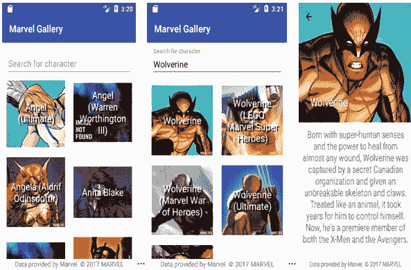

# 如何使用本章

本章显示了构建应用程序所需的所有步骤和代码。其目的是展示这个应用程序开发的逐步过程。当你阅读这一章的时候，集中精力在开发过程上，试着理解所展示的代码的目的是什么。你不需要完全理解布局，也不需要理解单元测试定义，只要你理解它们在做什么。专注于使最终代码更简单的应用程序结构和 Kotlin 解决方案。大多数解决方案在前面的章节中已经描述过了，所以它们只有一个简短的描述。本章的价值在于，它们的用法是在具体应用的上下文中呈现的。

可以从 GitHub([https://github.com/MarcinMoskala/MarvelGallery](https://github.com/MarcinMoskala/MarvelGallery))下载应用代码。

在 GitHub 上，您可以看到最终代码，下载它，或者使用 Git 将其克隆到您的计算机上:

```kt
git clone git@github.com:MarcinMoskala/MarvelGallery.git
```

The application also includes UI tests written in **Espresso**, but they are not presented on this chapter to make it simpler for readers who are not proficient in Espresso usage.

本章的每一节在这个项目上都有一个相应的 Git 分支，所以如果你想看看代码在这一节的末尾是什么样子，那么你可以切换到相应的分支:

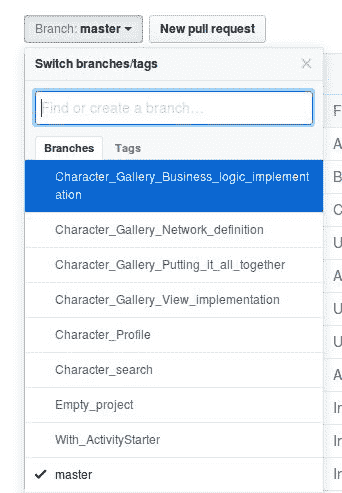

另外，在本地，克隆存储库后，可以使用以下 Git 命令签出相应的分支:

```kt
git checkout Character_search 
```

如果你有这本书的电子版本，并且你想通过复制和粘贴部分代码来制作整个应用程序，那么你可以这样做，但是要记住把文件放在对应于包的文件夹中。这样，您将在项目中保持干净的结构。

请注意，如果您将图书中的代码放在另一个文件夹中，将会显示一条警告:

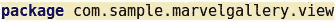

您可以有意将文件放在任何文件夹中，因为第二个修复建议是将文件移动到与定义的包相对应的路径中:

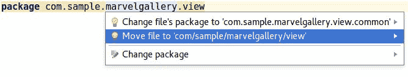

您可以使用它将文件移动到正确的位置。

# 制作一个空项目

在我们可以开始实现功能之前，我们需要创建一个空的 Kotlin Android 项目，只有一个活动，`MainActivty`。这个过程在[第 1 章](1.html#K0RQ0-7a7324e7f1a1454d830df91c6b78f317)**开始你的Kotlin冒险*中有描述。因此，我们不需要深入描述，但我们将展示安卓工作室 3.0 中的步骤是什么:*

 *1.  为新项目设置名称、包和位置。记得勾选包含 Kotlin 支持选项:*。*

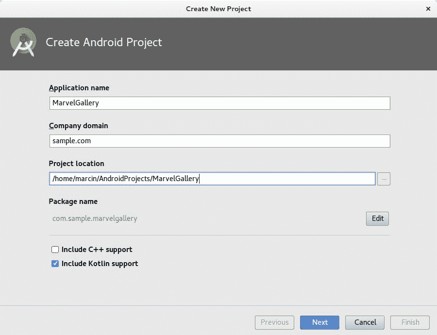

2.  我们可以选择其他最低限度的安卓版本，但在本例中，我们将设置 API 16:

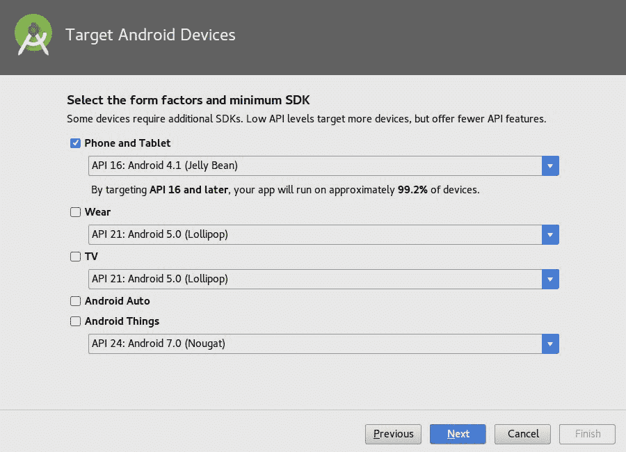

3.  选择一个模板。我们不需要这些模板，所以我们应该从空活动 *:* 开始

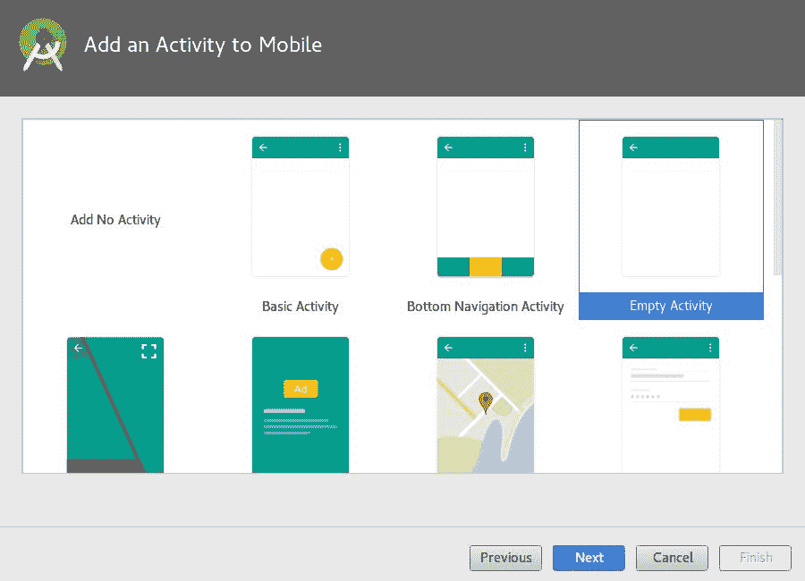

4.  命名新创建的活动。我们可以保留第一个名为`MainActivity` *:* 的视图

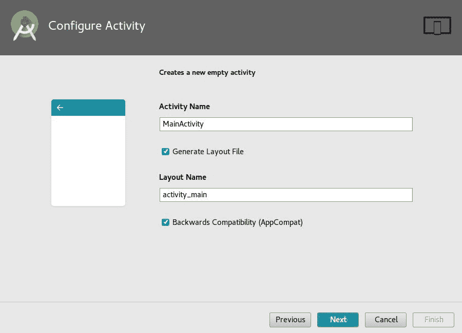

For Android Studio prior to 3.x, we need to follow slightly different steps:

Create a project from template with empty *Activity*.

1\. Configure Kotlin in the project (for example, *Ctrl*/*Cmd* + *Shift* + *A* and Configure Kotlin in project).
2\. Convert all Java classes to Kotlin (for example, in `MainActivity` *Ctrl/Cmd+Shift+A* and Convert Java file to Kotlin file).

完成这些步骤后，我们将创建一个带有空活动的 Kotlin 安卓应用程序:

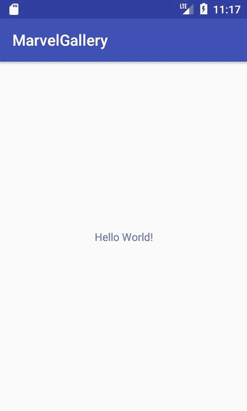

# 角色库

在本节中，我们将实现一个用例——在启动应用程序后，用户可以看到一个字符库。

这是一个非常复杂的用例，因为它需要呈现视图、与 API 的网络连接以及业务规则的实现。因此，我们将把它分成以下任务:

*   查看实施情况
*   与应用编程接口的通信
*   字符显示的业务逻辑实现
*   把它们放在一起

这样的任务更容易实现。让我们一个接一个地实现它们。

# 查看实施情况

让我们从视图实现开始。在这里，我们将定义字符列表的外观。出于测试目的，我们还将定义几个字符并显示它们。

先从`MainActivity`布局实现说起。我们将使用`RecyclerView`显示元素列表。`RecyclerView`布局分布在单独的依赖项中，我们必须将其添加到`app`模块`build.gradle`文件中:

```kt
implementation "com.android.support:recyclerview-v7:$android_support_version" 
```

`android_support_version`实例是一个尚未定义的变量。背后的原因是，所有安卓支持库的版本应该是相同的，当我们提取这个版本号作为分隔符变量时，就更容易管理了。这就是为什么我们应该将每个安卓支持库的硬编码版本替换为参考`android_support_version`:

```kt
implementation "com.android.support:appcompat-  
    v7:$android_support_version" 
implementation "com.android.support:design:$android_support_version" 
implementation "com.android.support:support-
    v4:$android_support_version" 
implementation "com.android.support:recyclerview-
    v7:$android_support_version" 
```

我们必须设置支持库版本值。好的做法是在`buildscript`内的项目`build*.*gradle`文件中定义它，在`kotlin*_*version`定义之后:

```kt
ext.kotlin_version = '1.1.4-2' 
ext.android_support_version = "26.0.1" 
```

现在可以开始实施`MainActivity`布局了。这就是我们想要达到的效果:


我们将把`RecyclerView`上的角色元素打包到`SwipeRefreshLayout`中，以允许滑动刷新。此外，为了实现漫威版权，需要有一个呈现的标签，通知数据是由漫威提供的。布局`activity_main` ( `res/layout/activity_main.xml`)应替换为以下定义:

```kt
<?xml version="1.0" encoding="utf-8"?> 
<RelativeLayout xmlns:android="http://schemas.android.com/apk/res/android" 
   xmlns:app="http://schemas.android.com/apk/res-auto" 
   xmlns:tools="http://schemas.android.com/tools" 
   android:id="@+id/charactersView" 
   android:layout_width="match_parent" 
   android:layout_height="match_parent" 
   android:background="@android:color/white" 
   android:fitsSystemWindows="true"> 

   <android.support.v4.widget.SwipeRefreshLayout  
       xmlns:android="http://schemas.android.com/apk/res/android" 
       android:id="@+id/swipeRefreshView" 
       android:layout_width="match_parent" 
       android:layout_height="match_parent"> 

       <android.support.v7.widget.RecyclerView 
           android:id="@+id/recyclerView" 
           android:layout_width="match_parent" 
           android:layout_height="match_parent" 
           android:scrollbars="vertical" /> 

   </android.support.v4.widget.SwipeRefreshLayout> 

   <TextView 
       android:layout_width="match_parent" 
       android:layout_height="wrap_content" 
       android:layout_alignParentBottom="true" 
       android:background="@android:color/white" 
       android:gravity="center" 
       android:text="@string/marvel_copyright_notice" /> 
</RelativeLayout> 
```

我们需要给字符串(`res/values/strings.xml`)添加版权声明:

```kt
<string name="marvel_copyright_notice">
    Data provided by Marvel. © 2017 MARVEL
</string> 
```

以下是预览:


下一步是定义项目视图。我们希望每个元素总是正方形的。为此，我们需要定义一个保持正方形形状的视图(将其放入`view/views`):

```kt
package com.sample.marvelgallery.view.views 

import android.util.AttributeSet 
import android.widget.FrameLayout 
import android.content.Context 

class SquareFrameLayout @JvmOverloads constructor( // 1 
       context: Context, 
       attrs: AttributeSet? = null, 
       defStyleAttr: Int = 0 
) : FrameLayout(context, attrs, defStyleAttr) { 

   override fun onMeasure(widthMeasureSpec: Int, 
   heightMeasureSpec: Int) { 
       super.onMeasure(widthMeasureSpec, widthMeasureSpec) // 2 
   } 
} 
```

1.  使用`JvmOverloads`注释，我们避免了通常用于在 Android 中定义自定义视图的伸缩构造函数。这在[第四章](4.html#2JTHG0-7a7324e7f1a1454d830df91c6b78f317)*类和对象*中有描述。
2.  我们强制元素的高度始终与宽度相同。

借助`SquareFrameLayout`，我们可以定义图库项目的布局。这就是我们想要的样子:


我们需要定义`ImageView`显示人物形象，`TextView`显示其名称。虽然`SquareFrameLayout`实际上是具有固定高度的`FrameLayout`，但是它的子元素(图像和文本)在默认情况下是上下放置的。让我们在`res/layout`中的`item_character.xml`文件中添加布局:

```kt
// ./res/layout/item_character.xml 

<com.sample.marvelgallery.view.views.SquareFrameLayout xmlns:android="http://schemas.android.com/apk/res/android" 
   xmlns:tools="http://schemas.android.com/tools" 
   android:layout_width="match_parent" 
   android:layout_height="wrap_content" 
   android:gravity="center_horizontal" 
   android:orientation="horizontal" 
   android:padding="@dimen/element_padding"> 

   <ImageView 
       android:id="@+id/imageView" 
       android:layout_width="match_parent" 
       android:layout_height="match_parent"/> 

   <TextView 
       android:id="@+id/textView" 
       android:layout_width="match_parent" 
       android:layout_height="match_parent" 
       android:gravity="center" 
       android:paddingLeft="10dp" 
       android:paddingRight="10dp" 
       android:shadowColor="#111" 
       android:shadowDx="5" 
       android:shadowDy="5" 
       android:shadowRadius="0.01" 
       android:textColor="@android:color/white" 
       android:textSize="@dimen/standard_text_size" 
       tools:text="Some name" /> 
</com.sample.marvelgallery.view.views.SquareFrameLayout> 
```

请注意，我们也在使用诸如`dimens`中定义的`element_padding`之类的值。让我们将它们添加到`res/values`中的`dimen.xml`文件中:

```kt
<?xml version="1.0" encoding="utf-8"?> 
<resources> 
   <dimen name="character_header_height">240dp</dimen> 
   <dimen name="standard_text_size">20sp</dimen> 
   <dimen name="character_description_padding">10dp</dimen> 
   <dimen name="element_padding">10dp</dimen> 
</resources> 
```

正如我们所看到的，每个元素都需要显示角色的名称及其图像。因此，角色的模型需要包含这两个属性。让我们为角色定义一个简单的模型:

```kt
package com.sample.marvelgallery.model 

data class MarvelCharacter( 
       val name: String, 
       val imageUrl: String 
) 
```

要使用`RecyclerView`显示元素列表，我们需要实现一个`RecyclerView`列表和一个项目适配器。列表适配器用于管理列表中的所有元素，而项适配器是单个项类型的适配器。这里，我们只需要一个项目适配器，因为我们显示单一类型的项目。然而，假设将来这个列表中可能会有其他类型的元素，例如漫画或广告，这是一个很好的做法。列表适配器也是如此——在这个例子中，我们只需要一个，但是在大多数项目中，不止一个列表，最好将公共行为提取到一个抽象类中。

虽然这个例子旨在展示如何在更大的项目中使用 Kotlin，但是我们将定义一个抽象列表适配器，我们将命名为`RecyclerListAdapter`，以及一个抽象项目适配器，我们将命名为`ItemAdapter`。以下是`ItemAdapter`的定义:

```kt
package com.sample.marvelgallery.view.common 

import android.support.v7.widget.RecyclerView 
import android.support.annotation.LayoutRes 
import android.view.View 

abstract class ItemAdapter<T : RecyclerView.ViewHolder>
(@LayoutRes open val layoutId: Int) { // 1 

   abstract fun onCreateViewHolder(itemView: View): T // 2 

   @Suppress("UNCHECKED_CAST") // 1 
   fun bindViewHolder(holder: RecyclerView.ViewHolder) { 
       (holder as T).onBindViewHolder() // 1 
   } 

   abstract fun T.onBindViewHolder() // 1, 3 
} 
```

1.  我们需要传递一个 holder 作为类型参数，以允许对其字段进行直接操作。支架是在`onCreateViewHolder`中创建的，所以我们知道它的类型永远是类型参数`T`。因此，我们可以在`bindViewHolder`上将支架铸造到`T`上，并将其用作`onBindViewHolder`的接收对象。压制`@Suppress("UNCHECKED_CAST")`在这里只是为了隐藏警告，同时我们知道在这种情况下我们可以安全施放。
2.  用于创建视图支架的函数。在大多数情况下，它将是一个只调用构造函数的单一表达式函数。
3.  在`onBin+dViewHolder`功能中，我们将设置项目视图上的所有值。

以下是`RecyclerListAdapter`的定义:

```kt
package com.sample.marvelgallery.view.common 

import android.support.v7.widget.RecyclerView 
import android.view.LayoutInflater 
import android.view.ViewGroup 

open class RecyclerListAdapter( // 1 
       var items List<AnyItemAdapter> = listOf() 
) : RecyclerView.Adapter<RecyclerView.ViewHolder>() { 

   override final fun getItemCount() = items.size // 4 

   override final fun getItemViewType(position: Int) = 
       items[position].layoutId // 3, 4 

   override final fun onCreateViewHolder(parent: ViewGroup, 
       layoutId: Int): RecyclerView.ViewHolder { // 4 

   val itemView = LayoutInflater.from(parent.context)
       .inflate(layoutId, parent, false) 
       return items.first 
       { it.layoutId == layoutId }.onCreateViewHolder(itemView) // 3 
   } 

   override final fun onBindViewHolder
   (holder: RecyclerView.ViewHolder, position: Int) { // 4 
       items[position].bindViewHolder(holder) 
   } 
} 

typealias AnyItemAdapter = ItemAdapter 
    <out RecyclerView.ViewHolder> // 5 
```

1.  类是`open`而不是`abstract`，因为它可以在没有任何子级的情况下初始化和使用。我们定义子对象来允许我们为不同的列表定义自定义方法。
2.  我们把物品列在清单上。
3.  我们将使用布局来区分项目类型。因此，我们不能在同一个列表中使用两个布局相同的项目适配器，但是这个解决方案简化了很多。

4.  方法是`RecyclerView.Adapter`的覆盖方法，但是它们也使用`final`修饰符来限制它们在子对象中的覆盖。所有扩展`RecyclerListAdapter`的列表适配器都应该对项目进行操作。
5.  我们定义类型别名来简化任何`ItemAdapter`的定义。

使用前面的定义，我们可以定义`MainListAdapter`(字符列表适配器)和`CharacterItemAdapter`(列表项目适配器)。以下是`MainListAdapter`的定义:

```kt
package com.sample.marvelgallery.view.main 

import com.sample.marvelgallery.view.common.AnyItemAdapter 
import com.sample.marvelgallery.view.common.RecyclerListAdapter 

class MainListAdapter(items: List<AnyItemAdapter>) : RecyclerListAdapter(items) 
```

在这个项目中，我们不需要在`MainListAdapter`中定义任何特殊的方法，但是为了展示定义它们有多容易，这里给出了`MainListAdapter`的附加添加和删除方法:

```kt
class MainListAdapter(items: List<AnyItemAdapter>) : RecyclerListAdapter(items) { 

   fun add(itemAdapter: AnyItemAdapter) { 
       items += itemAdapter) 
       val index = items.indexOf(itemAdapter) 
       if (index == -1) return 
       notifyItemInserted(index) 
   } 

   fun delete(itemAdapter: AnyItemAdapter) { 
       val index = items.indexOf(itemAdapter) 
       if (index == -1) return 
       items -= itemAdapter 
       notifyItemRemoved(index) 
   } 
 }    
```

以下是`CharacterItemAdapter`的定义:

```kt
package com.sample.marvelgallery.view.main 

import android.support.v7.widget.RecyclerView 
import android.view.View 
import android.widget.ImageView 
import android.widget.TextView 
import com.sample.marvelgallery.R 
import com.sample.marvelgallery.model.MarvelCharacter 
import com.sample.marvelgallery.view.common.ItemAdapter 
import com.sample.marvelgallery.view.common.bindView 
import com.sample.marvelgallery.view.common.loadImage 

class CharacterItemAdapter( 
       val character: MarvelCharacter // 1 
) : ItemAdapter<CharacterItemAdapter.ViewHolder>(R.layout.item_character) { 

   override fun onCreateViewHolder(itemView: View) = ViewHolder(itemView) 

   override fun ViewHolder.onBindViewHolder() { // 2 
       textView.text = character.name 
       imageView.loadImage(character.imageUrl) // 3 
   } 

   class ViewHolder(itemView: View) : RecyclerView.ViewHolder(itemView)  
   { 
       val textView by bindView<TextView>(R.id.textView) // 4 
       val imageView by bindView<ImageView>(R.id.imageView) // 4 
   } 
} 
```

1.  `MarvelCharacter`由构造函数传递。
2.  `onBindViewHolder`方法用于设置视图。它在`ItemAdapter`中被定义为一个抽象的成员扩展函数，由于这个，现在我们可以在它的体内显式地使用`textView`和`imageView`。
3.  功能`loadImage`尚未定义。稍后我们将把它定义为一个扩展函数。
4.  在视图容器中，我们使用即将定义的`bindView`函数将属性绑定到视图元素。

在内部，我们使用尚未定义的函数`loadImage`和`bindView`。`bindView`是`RecyclerView.ViewHolder`的顶级扩展函数，它提供了一个惰性委托，该委托提供了一个由其 ID 找到的视图:

```kt
// ViewExt.kt 
package com.sample.marvelgallery.view.common 

import android.support.v7.widget.RecyclerView 
import android.view.View 

fun <T : View> RecyclerView.ViewHolder.bindView(viewId: Int)  
      = lazy { itemView.findViewById<T>(viewId) } 
```

我们还需要定义`loadImage`扩展函数，它将帮助我们从 URL 下载一个图像并将其放入`ImageView`。用于此目的的两个典型图书馆是**毕加索**和**格莱德**。我们将使用格莱德，为此，我们需要在`build.gradle`中添加一个依赖项:

```kt
implementation "com.android.support:recyclerview-
v7:$android_support_version" 
implementation "com.github.bumptech.glide:glide:$glide_version" 
```

在项目`build.gradle`中指定版本:

```kt
ext.android_support_version = "26.0.0" 
ext.glide_version = "3.8.0" 
```

在`AndroidManifest`中添加使用互联网的权限:

```kt
<manifest xmlns:android="http://schemas.android.com/apk/res/android" 
   package="com.sample.marvelgallery"> 
   <uses-permission android:name="android.permission.INTERNET" /> 
   <application 
... 
```

我们最终可以为`ImaveView`类定义`loadImage`扩展函数:

```kt
// ViewExt.kt 
package com.sample.marvelgallery.view.common 

import android.support.v7.widget.RecyclerView 
import android.view.View 
import android.widget.ImageView 
import com.bumptech.glide.Glide 

fun <T : View> RecyclerView.ViewHolder.bindView(viewId: Int)  
       = lazy { itemView.findViewById<T>(viewId) } 

fun ImageView.loadImage(photoUrl: String) { 
   Glide.with(context) 
           .load(photoUrl) 
           .into(this) 
} 
```

是时候定义将显示此列表的活动了。我们将使用另一个元素，Kotlin安卓扩展插件。它用于简化从代码中查看元素的访问。它的用法很简单——我们在模块`build.gradle`中添加`kotlin-android-extensions`插件:

```kt
apply plugin: 'com.android.application' 
apply plugin: 'kotlin-android' 
apply plugin: 'kotlin-android-extensions' 

And we have some view defined in layout: 

<TextView 
   android:id="@+id/nameView" 
   android:layout_width="wrap_content" 
   android:layout_height="wrap_content" /> 
```

然后我们可以在`Activity`中导入对此视图的引用:

```kt
import kotlinx.android.synthetic.main.activity_main.* 
```

我们可以直接使用`View`元素的名称来访问它，而不需要使用`findViewById`方法或者定义注释:

```kt
nameView.text = "Some name" 
```

我们将在项目的所有活动中使用 Kotlin Android 扩展。现在让我们定义`MainActivity`来显示带有图像的字符列表:

```kt
package com.sample.marvelgallery.view.main 

import android.os.Bundle 
import android.support.v7.app.AppCompatActivity 
import android.support.v7.widget.GridLayoutManager 
import android.view.Window 
import com.sample.marvelgallery.R 
import com.sample.marvelgallery.model.MarvelCharacter 
import kotlinx.android.synthetic.main.activity_main.* 

class MainActivity : AppCompatActivity() { 

   private val characters = listOf( // 1 
       MarvelCharacter(name = "3-D Man", imageUrl = "http://i.annihil.us/u/prod/marvel/i/mg/c/e0/535fecbbb9784.jpg"), 
       MarvelCharacter(name = "Abomination (Emil Blonsky)", imageUrl = "http://i.annihil.us/u/prod/marvel/i/mg/9/50/4ce18691cbf04.jpg") 
   ) 

   override fun onCreate(savedInstanceState: Bundle?) { 
       super.onCreate(savedInstanceState) 
       requestWindowFeature(Window.FEATURE_NO_TITLE) // 2 
       setContentView(R.layout.activity_main) 
       recyclerView.layoutManager = GridLayoutManager(this, 2) // 3 
       val categoryItemAdapters = characters
       .map(::CharacterItemAdapter) // 4 
       recyclerView.adapter = MainListAdapter(categoryItemAdapters) 
   } 
} 
```

1.  这里我们定义一个要显示的临时字符列表。
2.  我们使用这个窗口功能是因为我们不想显示标题。
3.  我们使用`GridLayoutManager`作为`RecyclerView`布局管理器来实现网格效果。
4.  我们正在使用`CharacterItemAdapter`构造函数引用从字符创建项目适配器。

现在我们可以编译该项目，我们将看到以下屏幕:

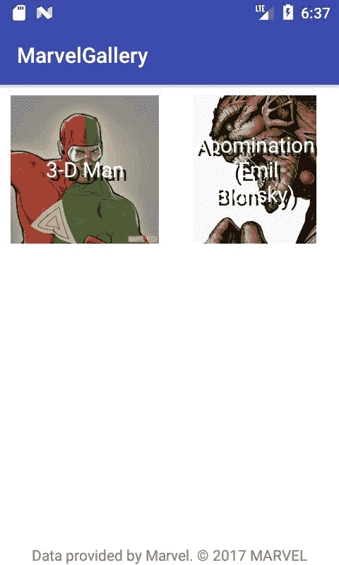

# 网络定义

到目前为止，呈现的数据是在应用程序内部硬编码的，但是我们希望使用来自漫威 API 的数据。为此，我们需要定义一些网络机制，从服务器检索数据。我们将使用**改装**，一个用于简化网络操作的流行安卓库，以及一个用于反应式编程的流行库 RxJava。对于这两个库，我们将只使用基本功能，以使它们的使用尽可能简单。要使用它们，我们需要在模块`build.gradle`中添加以下依赖项:

```kt
dependencies { 
   implementation "org.jetbrains.kotlin:kotlin-stdlib-jre7:
   $kotlin_version" 
   implementation "com.android.support:appcompat-v7:
   $android_support_version" 
   implementation "com.android.support:recyclerview-v7:
   $android_support_version" 
   implementation "com.github.bumptech.glide:glide:$glide_version" 

   // RxJava 
   implementation "io.reactivex.rxjava2:rxjava:$rxjava_version" 

   // RxAndroid 
   implementation "io.reactivex.rxjava2:rxandroid:$rxandroid_version" 

   // Retrofit 
   implementation(["com.squareup.retrofit2:retrofit:$retrofit_version", 
                   "com.squareup.retrofit2:adapter- 
                    rxjava2:$retrofit_version", 
                   "com.squareup.retrofit2:converter-
                    gson:$retrofit_version", 
                   "com.squareup.okhttp3:okhttp:$okhttp_version", 
                   "com.squareup.okhttp3:logging-
                   interceptor:$okhttp_version"]) 

  testImplementation 'junit:junit:4.12' 
  androidTestImplementation 
  'com.android.support.test:runner:1.0.0' 
  androidTestImplementation   
  'com.android.support.test.espresso:espresso-core:3.0.0' 
} 
```

项目`build.gradle`中的版本定义:

```kt
ext.kotlin_version = '1.1.3-2' 
ext.android_support_version = "26.0.0" 
ext.glide_version = "3.8.0" 
ext.retrofit_version = '2.2.0' 
ext.okhttp_version = '3.6.0' 
ext.rxjava_version = "2.1.2" 
ext.rxandroid_version = '2.0.1' 
```

我们已经在`AndroidManifest`上定义了互联网权限，所以不需要添加。简单的`Retrofit`定义可能如下所示:

```kt
val retrofit by lazy { makeRetrofit() } // 1 

private fun makeRetrofit(): Retrofit = Retrofit.Builder() 
       .baseUrl("http://gateway.marvel.com/v1/public/") // 2 
       .build() 
```

1.  我们可以将`retrofit`实例保留为惰性顶级属性。
2.  这里我们定义`baseUrl`

但是改装有一些额外的要求需要匹配。我们需要添加转换器来与 RxJava 一起使用改装，并发送序列化为 JSON 的对象。我们还需要拦截器，用于提供漫威应用编程接口所需的头和额外的查询。这是一个小应用程序，因此我们可以将所有必需的元素定义为顶级函数。完整的改装定义如下:

```kt
// Retrofit.kt 
package com.sample.marvelgallery.data.network.provider 

import com.google.gson.Gson 
import okhttp3.OkHttpClient 
import retrofit2.Retrofit 
import retrofit2.adapter.rxjava2.RxJava2CallAdapterFactory 
import retrofit2.converter.gson.GsonConverterFactory 
import java.util.concurrent.TimeUnit 

val retrofit by lazy { makeRetrofit() } 

private fun makeRetrofit(): Retrofit = Retrofit.Builder() 
       .baseUrl("http://gateway.marvel.com/v1/public/") 
       .client(makeHttpClient()) 
       .addConverterFactory(GsonConverterFactory.create(Gson())) // 1 
       .addCallAdapterFactory(RxJava2CallAdapterFactory.create()) // 2 
       .build() 

private fun makeHttpClient() = OkHttpClient.Builder() 
       .connectTimeout(60, TimeUnit.SECONDS) // 3 
       .readTimeout(60, TimeUnit.SECONDS) // 4 
       .addInterceptor(makeHeadersInterceptor()) // 5 
       .addInterceptor(makeAddSecurityQueryInterceptor()) // 6 
       .addInterceptor(makeLoggingInterceptor()) // 7 
       .build() 
```

1.  添加一个转换器，允许使用 GSON 库进行对象 JSON 序列化和反序列化。
2.  添加一个转换器，允许将 RxJava2 类型(可观察的，单一的)作为网络请求返回值的可观察的。
3.  我们增加了定制拦截器。我们需要定义它们。

让我们定义所需的拦截器。`makeHeadersInterceptor`用于为每个请求添加标准头:

```kt
// HeadersInterceptor.kt 
package com.sample.marvelgallery.data.network.provider 

import okhttp3.Interceptor 

fun makeHeadersInterceptor() = Interceptor { chain -> // 1 
   chain.proceed(chain.request().newBuilder() 
           .addHeader("Accept", "application/json") 
           .addHeader("Accept-Language", "en") 
           .addHeader("Content-Type", "application/json") 
           .build()) 
}
```

1.  拦截器是 SAM，所以我们可以使用 SAM 构造函数来定义它。

`makeLoggingInterceptor`功能用于在调试模式下运行应用程序时，在控制台上显示日志:

```kt
// LoggingInterceptor.kt 
package com.sample.marvelgallery.data.network.provider 

import com.sample.marvelgallery.BuildConfig 
import okhttp3.logging.HttpLoggingInterceptor 

fun makeLoggingInterceptor() = HttpLoggingInterceptor().apply { 
   level = if (BuildConfig.DEBUG) HttpLoggingInterceptor.Level.BODY 
           else HttpLoggingInterceptor.Level.NONE 
} 
```

`makeAddRequiredQueryInterceptor`功能比较复杂，因为它是用来提供漫威 API 用来验证用户的查询参数。这些参数需要使用 MD5 算法计算的哈希。它还需要一个来自漫威应用编程接口的公钥和私钥。每个人都可以在[https://developer.marvel.com/](https://developer.marvel.com/)生成自己的密钥。生成密钥后，我们需要将它们放入`gradle.properties`文件中:

```kt
org.gradle.jvmargs=-Xmx1536m 
marvelPublicKey=REPLEACE_WITH_YOUR_PUBLIC_MARVEL_KEY 
marvelPrivateKey=REPLEACE_WITH_YOUR_PRIVATE_MARVEL_KEY 
```

在`defaultConfig`部分的安卓模块`build.gradle`中也添加以下定义:

```kt
defaultConfig { 
   applicationId "com.sample.marvelgallery" 
   minSdkVersion 16 
   targetSdkVersion 26 
   versionCode 1 
   versionName "1.0" 
   testInstrumentationRunner 
   "android.support.test.runner.AndroidJUnitRunner" 
   buildConfigField("String", "PUBLIC_KEY", "\"${marvelPublicKey}\"") 
   buildConfigField("String", "PRIVATE_KEY", "\"${marvelPrivateKey}\"") 
} 
```

项目重建后，您可以通过`BuildConfig.PUBLIC_KEY`和`BuildConfig.PRIVATE_KEY`访问这些值。使用这些键，我们可以生成漫威 API 所需的查询参数:

```kt
// QueryInterceptor.kt 
package com.sample.marvelgallery.data.network.provider 

import com.sample.marvelgallery.BuildConfig 
import okhttp3.Interceptor 

fun makeAddSecurityQueryInterceptor() = Interceptor { chain -> 
   val originalRequest = chain.request() 
   val timeStamp = System.currentTimeMillis() 

   // Url customization: add query parameters 
   val url = originalRequest.url().newBuilder() 
           .addQueryParameter("apikey", BuildConfig.PUBLIC_KEY) // 1 
           .addQueryParameter("ts", "$timeStamp") // 1 
           .addQueryParameter("hash", calculatedMd5(timeStamp.toString() + BuildConfig.PRIVATE_KEY + BuildConfig.PUBLIC_KEY)) // 1 
           .build() 

   // Request customization: set custom url 
   val request = originalRequest 
           .newBuilder() 
           .url(url) 
           .build() 

   chain.proceed(request) 
} 
```

1.  我们需要提供三个额外的查询:
    *   `apikey`:也就是包括我们的公钥。
    *   `ts`:这只是包含以毫秒为单位的设备时间。它用于提高下一个查询中提供的哈希的安全性。
    *   `hash`:在单个`String`中，从时间戳、私钥和公钥一个接一个地计算为 MD5 哈希。

以下是用于计算 MD5 哈希的函数的定义:

```kt
// MD5.kt 
package com.sample.marvelgallery.data.network.provider 

import java.math.BigInteger 
import java.security.MessageDigest 

/** 
* Calculate MD5 hash for text 
* @param timeStamp Current timeStamp 
* @return MD5 hash string 
*/ 
fun calculatedMd5(text: String): String { 
   val messageDigest = getMd5Digest(text) 
   val md5 = BigInteger(1, messageDigest).toString(16) 
   return "0" * (32 - md5.length) + md5 // 1 
} 

private fun getMd5Digest(str: String): ByteArray = MessageDigest.getInstance("MD5").digest(str.toByteArray()) 

private operator fun String.times(i: Int) = (1..i).fold("") { acc, _ -> acc + this } 
```

1.  如果哈希值小于 32，我们将使用 times 扩展运算符来填充零。

我们已经定义了拦截器，所以我们可以定义实际的 API 方法。漫威应用编程接口包含许多表示字符、列表等的数据模型。我们需要将它们定义为单独的类。这些类被称为**数据传输对象** ( **数据传输对象**)。我们将定义我们需要的对象:

```kt
package com.sample.marvelgallery.data.network.dto 

class DataContainer<T> { 
   var results: T? = null 
} 

package com.sample.marvelgallery.data.network.dto 

class DataWrapper<T> { 
   var data: DataContainer<T>? = null 
} 

package com.sample.marvelgallery.data.network.dto 

class ImageDto { 

   lateinit var path: String // 1 
   lateinit var extension: String // 1 

   val completeImagePath: String 
       get() = "$path.$extension" 
} 

package com.sample.marvelgallery.data.network.dto 

class CharacterMarvelDto { 
   lateinit var name: String // 1 
   lateinit var thumbnail: ImageDto // 1 

   val imageUrl: String 
       get() = thumbnail.completeImagePath 
} 
```

1.  对于可能没有提供的值，我们应该设置一个默认值。强制性的值可能会以`lateinit`作为前缀。

改进是使用反射来创建基于接口定义的 HTTP 请求。这就是我们如何实现定义 HTTP 请求的接口:

```kt
package com.sample.marvelgallery.data.network 

import com.sample.marvelgallery.data.network.dto.CharacterMarvelDto 
import com.sample.marvelgallery.data.network.dto.DataWrapper 
import io.reactivex.Single 
import retrofit2.http.GET 
import retrofit2.http.Query 

interface MarvelApi { 

   @GET("characters") 
   fun getCharacters( 
           @Query("offset") offset: Int?, 
           @Query("limit") limit: Int? 
   ): Single<DataWrapper<List<CharacterMarvelDto>>> 
}  
```

有了这样的定义，我们终于可以得到一个字符列表:

```kt
retrofit.create(MarvelApi::class.java) // 1 
    .getCharacters(0, 100) // 2
    .subscribe({ /* code */ }) // 3 
```

1.  我们使用`retrofit`实例来创建一个对象，该对象将根据`MarvelApi`接口定义发出 HTTP 请求。
2.  我们创建可观察的准备发送调用到应用编程接口。
3.  通过`subscribe`，我们发送一个 HTTP 请求，并开始监听响应。第一个参数是当我们成功接收到响应时调用的回调。

这样的网络定义可能就足够了，但是我们可能会更好地实现它。最大的问题是，我们现在需要对 d to 对象进行操作，而不是对我们自己的数据模型对象进行操作。对于映射，我们应该定义一个附加层。存储库模式用于此目的。当我们实现单元测试时，这种模式也非常有用，因为我们可以模拟存储库，而不是整个 API 定义。这是我们想要的存储库的定义:

```kt
package com.sample.marvelgallery.data 

import com.sample.marvelgallery.model.MarvelCharacter 
import io.reactivex.Single 

interface MarvelRepository { 

   fun getAllCharacters(): Single<List<MarvelCharacter>> 
} 

And here is the implementation of MarvelRepository: 

package com.sample.marvelgallery.data 

import com.sample.marvelgallery.data.network.MarvelApi 
import com.sample.marvelgallery.data.network.provider.retrofit 
import com.sample.marvelgallery.model.MarvelCharacter 
import io.reactivex.Single 

class MarvelRepositoryImpl : MarvelRepository { 

   val api = retrofit.create(MarvelApi::class.java) 

   override fun getAllCharacters(): Single<List<MarvelCharacter>> = api.getCharacters( 
           offset = 0, 
           limit = elementsOnListLimit 
   ).map { 
       it.data?.results.orEmpty().map(::MarvelCharacter) // 1 
   } 

   companion object { 
       const val elementsOnListLimit = 50 
   } 
} 
```

1.  我们得到了 DTO 元素的列表，并使用构造函数引用将其映射到`MarvelCharacter`中。

为了让它工作，我们需要在`MarvelCharacter`中定义一个额外的构造函数，它以`CharacterMarvelDto`为参数:

```kt
package com.sample.marvelgallery.model 

import com.sample.marvelgallery.data.network.dto.CharacterMarvelDto 

class MarvelCharacter( 
       val name: String, 
       val imageUrl: String 
) { 

   constructor(dto: CharacterMarvelDto) : this( 
           name = dto.name, 
           imageUrl = dto.imageUrl 
   ) 
} 
```

有不同的方式提供`MarvelRepository`的实例。在最常见的实现中，`MarvelRepository`的具体实例作为构造函数参数传递给`Presenter`。但是 UI 测试呢(比如 Espresso 测试)？我们不想测试漫威应用编程接口，也不想依赖它进行用户界面测试。解决方案是建立一种机制，在正常运行时生成标准实现，但也允许我们为测试目的设置不同的实现。我们将对此机制进行以下通用实现(将其放入数据中):

```kt
package com.sample.marvelgallery.data 

abstract class Provider<T> { 

   abstract fun creator(): T 

   private val instance: T by lazy { creator() } 
   var testingInstance: T? = null 

   fun get(): T = testingInstance ?: instance 
} 
```

Instead of defining our own `Provider`, we might use some of Dependency Injection libraries, such as **Dagger** or **Kodein**. Dagger usage for such purposes is really common in Android development, but we've decided that we won't include it in this example to avoid additional complexity for developers who are not experienced with this library.

我们可以使`MarvelRepository`伴随对象提供程序扩展到类之上:

```kt
package com.sample.marvelgallery.data 

import com.sample.marvelgallery.model.MarvelCharacter 
import io.reactivex.Single 

interface MarvelRepository { 

   fun getAllCharacters(): Single<List<MarvelCharacter>> 

   companion object : Provider<MarvelRepository>() { 
       override fun creator() = MarvelRepositoryImpl() 
   } 
} 
```

感谢前面的定义，我们可以使用`MarvelRepository`伴随对象来获得`MarvelRepository`的实例:

```kt
val marvelRepository = MarvelRepository.get()  
```

这将是一个 MarvelRepositoryImpl 的惰性实例，直到有人设置了一些非空值的`testingInstance`属性:

```kt
MarvelRepository.get() // Returns instance of MarvelRepositoryImpl 

MarvelRepository.testingInstance= object: MarvelRepository { 
   override fun getAllCharacters(): Single<List<MarvelCharacter>>  
         = Single.just(emptyList()) 
} 

MarvelRepository.get() // returns an instance of an anonymous class in which the returned list is always empty. 
```

这样的结构对于使用浓缩咖啡进行用户界面测试非常有用。它对元素覆盖的用法存在于项目中，可以在 GitHub 中找到。本节没有介绍它，以使不精通测试的开发人员更容易理解。如果你愿意看，那么你可以在[https://github . com/Marcinmoskala/Marvelgallery/blob/master/app/src/androidTest/Java/com/sample/Marvelgallery/mainactivity test . kt](https://github.com/MarcinMoskala/MarvelGallery/blob/master/app/src/androidTest/java/com/sample/marvelgallery/MainActivityTest.kt)找到。

最后，让我们通过实现角色库显示的业务逻辑来连接这个存储库和视图。

# 业务逻辑实现

我们已经实现了视图和存储库部分，现在是时候最终实现业务逻辑了。在这一点上，我们只需要获取字符列表，并在用户进入屏幕或刷新屏幕时将其显示在列表上。我们将通过使用名为**模型-视图-演示者** ( **MVP** )的架构模式从视图实现中提取这些业务逻辑规则。以下是简化的规则:

*   **模型**:这是负责管理数据的层。模型的职责包括使用 API、缓存数据、管理数据库等等。
*   **演示者**:演示者是模型和视图之间的中间人，应该包括你所有的演示逻辑。演示者负责对用户交互做出反应，使用并更新模型和视图。
*   **查看**:负责呈现数据，将用户交互事件转发给呈现者。

在这个模式的实现中，我们将把活动视为一个视图，对于每个视图，我们需要创建一个演示者。编写单元测试来检查业务逻辑规则是否正确实现是一个很好的实践。为了简单起见，我们需要将 Activity 隐藏在一个易于模拟的界面后面，该界面代表所有可能的演示者与视图(Activity)的交互。此外，我们将在 Activity 中创建所有依赖项(如`MarvelRepository`)，并通过构造函数将它们作为隐藏在接口后面的对象传递给 Presenter(例如，将`MarvelRepositoryImpl`传递为`MarvelRepository`)。

在 Presenter 中，我们需要实现以下行为:

*   当演示者等待响应时，将显示加载动画
*   创建视图后，将加载并显示一个字符列表
*   调用刷新方法后，将加载一个字符列表
*   当应用编程接口返回字符列表时，它会显示在视图上
*   当应用编程接口返回错误时，它会显示在视图上

我们可以看到，Presenter 需要通过构造函数 View 和`MarvelRepository`来获取，它应该指定在创建视图或刷新用户请求列表时将调用的方法:

```kt
package com.sample.marvelgallery.presenter 

import com.sample.marvelgallery.data.MarvelRepository 
import com.sample.marvelgallery.view.main.MainView 

class MainPresenter(val view: MainView, val repository: MarvelRepository) { 

   fun onViewCreated() { 
   } 

   fun onRefresh() { 
   } 
} 
```

视图需要指定在视图刷新时显示字符列表、显示错误和显示进度条的方法(在`view/main`中定义并移动`MainActivity`到`view/main`):

```kt
package com.sample.marvelgallery.view.main.main 

import com.sample.marvelgallery.model.MarvelCharacter 

interface MainView { 
   var refresh: Boolean 
   fun show(items: List<MarvelCharacter>) 
   fun showError(error: Throwable) 
} 
```

在向演示者添加逻辑之前，让我们定义前两个单元测试:

```kt
// test source set 
package com.sample.marvelgallery 

import com.sample.marvelgallery.data.MarvelRepository 
import com.sample.marvelgallery.model.MarvelCharacter 
import com.sample.marvelgallery.presenter.MainPresenter 
import com.sample.marvelgallery.view.main.MainView 
import io.reactivex.Single 
import org.junit.Assert.assertEquals 
import org.junit.Assert.fail 
import org.junit.Test 

@Suppress("IllegalIdentifier") // 1 
class MainPresenterTest { 

   @Test 
   fun `After view was created, list of characters is loaded and displayed`() { 
       assertOnAction { onViewCreated() }.thereIsSameListDisplayed() 
   } 

   @Test 
   fun `New list is shown after view was refreshed`() { 
       assertOnAction { onRefresh() }.thereIsSameListDisplayed() 
   } 

   private fun assertOnAction(action: MainPresenter.() -> Unit) 
           = PresenterActionAssertion(action) 

   private class PresenterActionAssertion
   (val actionOnPresenter: MainPresenter.() -> Unit) { 

       fun thereIsSameListDisplayed() { 
           // Given 
           val exampleCharacterList = listOf(// 2 
                   MarvelCharacter("ExampleName", "ExampleImageUrl"), 
                   MarvelCharacter("Name1", "ImageUrl1"), 
                   MarvelCharacter("Name2", "ImageUrl2") 
           ) 

           var displayedList: List<MarvelCharacter>? = null 

           val view = object : MainView { //3 
               override var refresh: Boolean = false 

               override fun show(items: List<MarvelCharacter>) { 
                   displayedList = items // 4 
               } 

               override fun showError(error: Throwable) { 
                   fail() //5 
               } 
           } 
           val marvelRepository = object : MarvelRepository { // 3 
               override fun getAllCharacters(): 
                Single<List<MarvelCharacter>> 
                  = Single.just(exampleCharacterList) // 6 
           } 

           val mainPresenter = MainPresenter(view, marvelRepository) 
           // 3 

           // When 
           mainPresenter.actionOnPresenter() // 7 

           // Then 
           assertEquals(exampleCharacterList, displayedList) // 8 
       } 
   } 
} 
```

1.  描述性名称在 Kotlin 单元测试中是允许的，但是会显示一个警告。需要抑制来隐藏此警告。
2.  定义要显示的示例字符列表。
3.  定义视图和存储库，并使用它们创建演示者。
4.  当显示一个元素列表时，我们应该将其设置为显示列表。
5.  调用`showError`时，测试失败。
6.  `getAllCharacters`方法只是返回一个示例列表。
7.  我们称之为对演示者的定义动作。
8.  我们检查存储库返回的列表是否与显示的列表相同。

为了简化前面的定义，我们可以提取`BaseMarvelRepository`和`BaseMainView`，并将示例数据保存在一个单独的类中:

```kt
// test source set 
package com.sample.marvelgallery.helpers 

import com.sample.marvelgallery.data.MarvelRepository 
import com.sample.marvelgallery.model.MarvelCharacter 
import io.reactivex.Single 

class BaseMarvelRepository( 
       val onGetCharacters: () -> Single<List<MarvelCharacter>> 
) : MarvelRepository { 

   override fun getAllCharacters() = onGetCharacters() 
} 

// test source set 
package com.sample.marvelgallery.helpers 

import com.sample.marvelgallery.model.MarvelCharacter 
import com.sample.marvelgallery.view.main.MainView 

class BaseMainView( 
       var onShow: (items: List<MarvelCharacter>) -> Unit = {}, 
       val onShowError: (error: Throwable) -> Unit = {}, 
       override var refresh: Boolean = false 
) : MainView { 

   override fun show(items: List<MarvelCharacter>) { 
       onShow(items) 
   } 

   override fun showError(error: Throwable) { 
       onShowError(error) 
   } 
} 

// test source set 
package com.sample.marvelgallery.helpers 

import com.sample.marvelgallery.model.MarvelCharacter 

object Example { 
   val exampleCharacter = MarvelCharacter
   ("ExampleName", "ExampleImageUrl") 
   val exampleCharacterList = listOf( 
           exampleCharacter, 
           MarvelCharacter("Name1", "ImageUrl1"), 
           MarvelCharacter("Name2", "ImageUrl2") 
   ) 
} 
```

现在我们可以简化`PresenterActionAssertion`的定义:

```kt
package com.sample.marvelgallery 

import com.sample.marvelgallery.helpers.BaseMainView 
import com.sample.marvelgallery.helpers.BaseMarvelRepository 
import com.sample.marvelgallery.helpers.Example 
import com.sample.marvelgallery.model.MarvelCharacter 
import com.sample.marvelgallery.presenter.MainPresenter 
import io.reactivex.Single 
import org.junit.Assert.assertEquals 
import org.junit.Assert.fail 
import org.junit.Test 

@Suppress("IllegalIdentifier") 

class MainPresenterTest { 

   @Test 
   fun `After view was created, list of characters is loaded and displayed`() { 
       assertOnAction { onViewCreated() }.thereIsSameListDisplayed() 
   } 

   @Test 
   fun `New list is shown after view was refreshed`() { 
       assertOnAction { onRefresh() }.thereIsSameListDisplayed() 
   } 

   private fun assertOnAction(action: MainPresenter.() -> Unit) 
           = PresenterActionAssertion(action) 

   private class PresenterActionAssertion
   (val actionOnPresenter: MainPresenter.() -> Unit) { 

       fun thereIsSameListDisplayed() { 
           // Given 
           var displayedList: List<MarvelCharacter>? = null 

           val view = BaseMainView( 
                   onShow = { items -> displayedList = items }, 
                   onShowError = { fail() } 
           ) 
           val marvelRepository = BaseMarvelRepository( 
                 onGetCharacters = 
           { Single.just(Example.exampleCharacterList) } 
           ) 

           val mainPresenter = MainPresenter(view, marvelRepository) 

           // When 
           mainPresenter.actionOnPresenter() 

           // Then 
           assertEquals(Example.exampleCharacterList, displayedList) 
       } 
   } 
} 
```

我们开始测试:

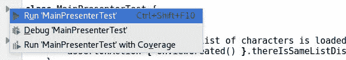

我们会看到他们没有通过:

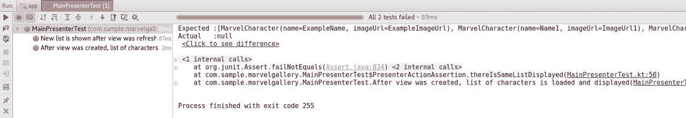

原因是`MainPresenter`还没有实现功能。通过这个单元测试的最简单的代码如下:

```kt
package com.sample.marvelgallery.presenter 

import com.sample.marvelgallery.data.MarvelRepository 
import com.sample.marvelgallery.view.main.MainView 

class MainPresenter(val view: MainView, val repository: MarvelRepository) { 

   fun onViewCreated() { 
       loadCharacters() 
   } 

   fun onRefresh() { 
       loadCharacters() 
   } 

   private fun loadCharacters() { 
       repository.getAllCharacters() 
               .subscribe({ items -> 
                   view.show(items) 
               }) 
   } 
} 
```

现在我们的测试通过了:

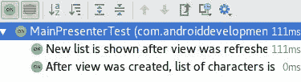

但是以下实现有两个问题:

*   这在安卓系统中是行不通的，因为`getAllCharacters`使用的是网络操作，不能像本例那样在主线程上运行
*   如果用户在加载完成前离开应用程序，我们将会有内存泄漏

为了解决第一个问题，我们需要指定应该在哪些线程上运行什么操作。网络请求应该在 I/O 线程上运行，我们应该在 Android 主线程上观察(因为我们正在回调中更改视图):

```kt
repository.getAllCharacters() 
       .subscribeOn(Schedulers.io()) // 1 
       .observeOn(AndroidSchedulers.mainThread()) // 2 
       .subscribe({ items -> view.show(items) }) 
```

1.  我们指定网络请求应该在 IO 线程中运行。
2.  我们指定回调应该在主线程上启动。

虽然这些是常见的调度程序，但我们可以在顶级扩展函数中提取它们:

```kt
// RxExt.kt 
package com.sample.marvelgallery.data 

import io.reactivex.Single 
import io.reactivex.android.schedulers.AndroidSchedulers 
import io.reactivex.schedulers.Schedulers 

fun <T> Single<T>.applySchedulers(): Single<T> = this 
       .subscribeOn(Schedulers.io()) 
       .observeOn(AndroidSchedulers.mainThread()) 

And use it in MainPresenter: 

repository.getAllCharacters() 
       .applySchedulers() 
       .subscribe({ items -> view.show(items) }) 
```

测试不允许访问安卓主线程。因此，我们的测试不会通过。此外，在新线程上运行的操作不是我们在单元测试中想要的，因为我们会有断言同步的问题。为了解决这些问题，我们需要在单元测试之前覆盖调度器，以使所有的东西都在同一个线程上运行(将其添加到`MainPresenterTest`类中):

```kt
package com.sample.marvelgallery 

import com.sample.marvelgallery.helpers.BaseMainView 
import com.sample.marvelgallery.helpers.BaseMarvelRepository 
import com.sample.marvelgallery.helpers.Example 
import com.sample.marvelgallery.model.MarvelCharacter 
import com.sample.marvelgallery.presenter.MainPresenter 
import io.reactivex.Single 
import io.reactivex.android.plugins.RxAndroidPlugins 
import io.reactivex.plugins.RxJavaPlugins 
import io.reactivex.schedulers.Schedulers 
import org.junit.Assert.assertEquals 
import org.junit.Assert.fail 
import org.junit.Before 
import org.junit.Test 

@Suppress("IllegalIdentifier") 

class MainPresenterTest { 

   @Before 
   fun setUp() { 
       RxAndroidPlugins.setInitMainThreadSchedulerHandler { 
           Schedulers.trampoline() } 
       RxJavaPlugins.setIoSchedulerHandler { Schedulers.trampoline() } 
       RxJavaPlugins.setComputationSchedulerHandler { 
           Schedulers.trampoline() } 
       RxJavaPlugins.setNewThreadSchedulerHandler { 
           Schedulers.trampoline() } 
   } 

   @Test 
   fun `After view was created, list of characters is loaded and 
        displayed`() { 
       assertOnAction { onViewCreated() }.thereIsSameListDisplayed() 
   } 

   @Test 
   fun `New list is shown after view was refreshed`() { 
       assertOnAction { onRefresh() }.thereIsSameListDisplayed() 
   } 
```

现在单元测试又通过了:


另一个问题是内存泄漏，如果用户在我们得到服务器响应之前离开应用程序。一个常见的解决方案是将所有订阅保存在复合中，并在用户离开应用程序时处理掉它们:

```kt
private var subscriptions = CompositeDisposable() 

fun onViewDestroyed() { 
   subscriptions.dispose() 
} 
```

在较大的应用程序中，大多数演示者都有一些订阅。因此，当用户破坏视图时，收集订阅并处理它们的功能可以被视为常见行为，并在`BasePresenter`中提取。此外，为了简化过程，我们可以创建一个`BaseActivityWithPresenter`类，该类将主持人保持在`Presenter`界面后面，并在视图被破坏时调用`onViewDestroyed`方法。让我们在应用程序中定义这个机制。以下是`Presenter`的定义:

```kt
package com.sample.marvelgallery.presenter 

interface Presenter { 
   fun onViewDestroyed() 
} 
```

以下是`BasePresenter`的定义:

```kt
package com.sample.marvelgallery.presenter 

import io.reactivex.disposables.CompositeDisposable 

abstract class BasePresenter : Presenter { 

   protected var subscriptions = CompositeDisposable() 

   override fun onViewDestroyed() { 
       subscriptions.dispose() 
   } 
} 
```

以下是`BaseActivityWithPresenter`的定义:

```kt
package com.sample.marvelgallery.view.common 

import android.support.v7.app.AppCompatActivity 
import com.sample.marvelgallery.presenter.Presenter 

abstract class BaseActivityWithPresenter : AppCompatActivity() { 

   abstract val presenter: Presenter 

   override fun onDestroy() { 
       super.onDestroy() 
       presenter.onViewDestroyed() 
   } 
} 
```

为了简化向订阅添加新订阅的方式，我们可以定义一个加号赋值运算符:

```kt
// RxExt.ext 
package com.sample.marvelgallery.data 

import io.reactivex.Single 
import io.reactivex.android.schedulers.AndroidSchedulers 
import io.reactivex.disposables.CompositeDisposable 
import io.reactivex.disposables.Disposable 
import io.reactivex.schedulers.Schedulers 

fun <T> Single<T>.applySchedulers(): Single<T> = this 
       .subscribeOn(Schedulers.io()) 
       .observeOn(AndroidSchedulers.mainThread()) 

operator fun CompositeDisposable.plusAssign(disposable: Disposable) { 
   add(disposable) 
} 
```

我们可以使用这两种解决方案来确保`MainPresenter`的安全:

```kt
package com.sample.marvelgallery.presenter 

import com.sample.marvelgallery.data.MarvelRepository 
import com.sample.marvelgallery.data.applySchedulers 
import com.sample.marvelgallery.data.plusAssign 
import com.sample.marvelgallery.view.main.MainView 

class MainPresenter( 
       val view: MainView, 
       val repository: MarvelRepository 
) : BasePresenter() { 

   fun onViewCreated() { 
       loadCharacters() 
   } 

   fun onRefresh() { 
       loadCharacters() 
   } 

   private fun loadCharacters() { 
       subscriptions += repository.getAllCharacters() 
               .applySchedulers() 
               .subscribe({ items -> 
                   view.show(items) 
               }) 
   } 
} 
```

前两个`MainPresenter`行为已经实现。是时候进行下一步了——当应用编程接口返回错误时，它会显示在视图上。我们可以在`MainPresenterTest`中添加此要求作为测试:

```kt
@Test 
fun `New list is shown after view was refreshed`() { 
   assertOnAction { onRefresh() }.thereIsSameListDisplayed() 
} 

@Test 
fun `When API returns error, it is displayed on view`() { 
   // Given 
   val someError = Error() 
   var errorDisplayed: Throwable? = null 
   val view = BaseMainView( 
           onShow = { _ -> fail() }, 
           onShowError = { errorDisplayed = it } 
   ) 
   val marvelRepository = BaseMarvelRepository 
   { Single.error(someError) } 
   val mainPresenter = MainPresenter(view, marvelRepository) 
   // When 
   mainPresenter.onViewCreated() 
   // Then 
   assertEquals(someError, errorDisplayed) 
} 

private fun assertOnAction(action: MainPresenter.() -> Unit) 
       = PresenterActionAssertion(action) 
```

使这个测试通过的一个简单的改变是`MainPresenter`中 subscribe 方法中的错误处理程序规范:

```kt
subscriptions += repository.getAllCharacters() 
       .applySchedulers() 
       .subscribe({ items -> // onNext 
           view.show(items) 
       }, { // onError 
           view.showError(it) 
       }) 
```

虽然`subscribe`是 Java 方法，但是我们不能使用命名参数约定。这样的调用实际上不是描述性的。这就是为什么我们要在`RxExt.kt`中定义名为`subscribeBy`的自定义订阅方法:

```kt
// Ext.kt

fun <T> Single<T>.applySchedulers(): Single<T> = this
       .subscribeOn(Schedulers.io())
       .observeOn(AndroidSchedulers.mainThread())
fun <T> Single<T>.subscribeBy(
       onError: ((Throwable) -> Unit)? = null,
       onSuccess: (T) -> Unit
): Disposable = subscribe(onSuccess, { onError?.invoke(it) })
```

我们将使用它来代替订阅:

```kt
subscriptions += repository.getAllCharacters()
       .applySchedulers()
       .subscribeBy(
               onSuccess = view::show,
               onError = view::showError
      )
```

`subscribeBy` in full version defined for different RxJava typed (such as Observable, Flowable, and so on) together with lots of other useful Kotlin extensions to RxJava can be found in **RxKotlin** library ([https://github.com/ReactiveX/RxKotlin](https://github.com/ReactiveX/RxKotlin)).

为了显示和隐藏列表加载，我们将为总是在处理前后发生的事件定义额外的侦听器:

```kt
subscriptions += repository.getAllCharacters()
       .applySchedulers()
       .doOnSubscribe { view.refresh = true },}
               onSuccess = view::show,
       .doFinally { view.refresh = false }
       .subscribeBy(
                     onSuccess = view::show,
                     onError = view::showError,
                onFinish = { view.refresh = false }
       )
```

测试又通过了:

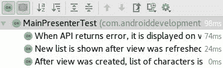

`subscribe`方法的可读性越来越差，但我们将与另一个业务规则一起解决这个问题，其定义如下——当演示者等待响应时，会显示刷新。在`MainPresenterTest`中定义其单元测试:

```kt
package com.sample.marvelgallery 

import com.sample.marvelgallery.helpers.BaseMainView 
import com.sample.marvelgallery.helpers.BaseMarvelRepository 
import com.sample.marvelgallery.helpers.Example 
import com.sample.marvelgallery.model.MarvelCharacter 
import com.sample.marvelgallery.presenter.MainPresenter 
import io.reactivex.Single 
import io.reactivex.android.plugins.RxAndroidPlugins 
import io.reactivex.plugins.RxJavaPlugins 
import io.reactivex.schedulers.Schedulers 
import org.junit.Assert.* 
import org.junit.Before 
import org.junit.Test 

@Suppress("IllegalIdentifier") 

class MainPresenterTest { 

   @Test 
   fun `When presenter is waiting for response, refresh is displayed`()  
   { 
       // Given 
       val view = BaseMainView(refresh = false) 
       val marvelRepository = BaseMarvelRepository( 
               onGetCharacters = { 
                   Single.fromCallable { 
                       // Then 
                       assertTrue(view.refresh) // 1 
                       Example.exampleCharacterList 
                   } 
               } 
       ) 
       val mainPresenter = MainPresenter(view, marvelRepository) 
       view.onShow = { _ -> 
           // Then 
           assertTrue(view.refresh) // 1 
       } 
       // When 
       mainPresenter.onViewCreated() 
       // Then 
       assertFalse(view.refresh) // 1 
   } 
 } 
```

1.  我们期望在网络请求期间和显示元素时显示刷新，但不是在处理完成后。

我们希望在网络请求期间和显示元素时显示刷新，但不是在处理完成后。

In the presented version on RxJava2, assertions inside callbacks are not breaking the test but displaying an error on the execution report instead:

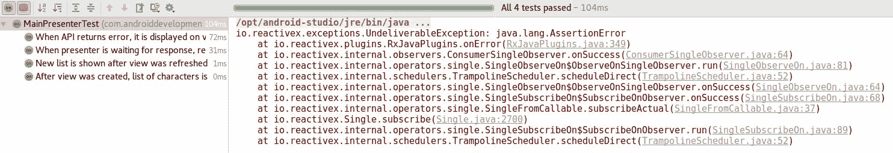

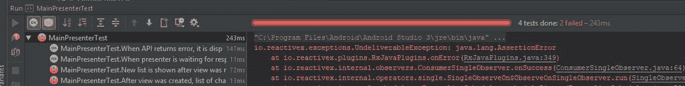

Probably, in future versions, it will be possible to add a handler that is allowing to fail a test from inside a callback.

为了显示和隐藏列表加载，我们将为总是在处理前后发生的事件定义额外的侦听器:

```kt
subscriptions += repository.getAllCharacters()
       .applySchedulers()
       .doOnSubscribe { view.refresh = true }
       .doFinally { view.refresh = false }
       .subscribeBy(
                     onSuccess = view::show,
                     onError = view::showError
        )
```

经过这些更改后，所有测试都将再次通过:

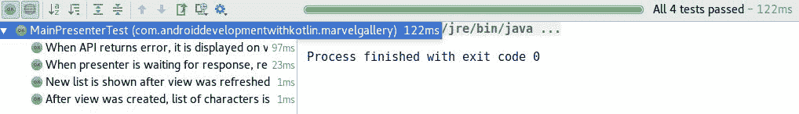

现在我们有了一个功能齐全的演示者、网络和视图。是时候将这一切联系起来，完成第一个用例的实现了。

# 把它们放在一起

我们已经准备好在项目中使用。现在我们需要在`MainActivity`中使用它:

```kt
package com.sample.marvelgallery.view.main 

import android.os.Bundle 
import android.support.v7.widget.GridLayoutManager 
import android.view.Window 
import com.sample.marvelgallery.R 
import com.sample.marvelgallery.data.MarvelRepository 
import com.sample.marvelgallery.model.MarvelCharacter 
import com.sample.marvelgallery.presenter.MainPresenter 
import com.sample.marvelgallery.view.common.BaseActivityWithPresenter 
import com.sample.marvelgallery.view.common.bindToSwipeRefresh 
import com.sample.marvelgallery.view.common.toast 
import kotlinx.android.synthetic.main.activity_main.* 

class MainActivity : BaseActivityWithPresenter(), MainView { // 1 

   override var refresh by bindToSwipeRefresh(R.id.swipeRefreshView) 
   // 2 
   override val presenter by lazy 
   { MainPresenter(this, MarvelRepository.get()) } // 3 

   override fun onCreate(savedInstanceState: Bundle?) { 
       super.onCreate(savedInstanceState) 
       requestWindowFeature(Window.FEATURE_NO_TITLE) 
       setContentView(R.layout.activity_main) 
       recyclerView.layoutManager = GridLayoutManager(this, 2) 
       swipeRefreshView.setOnRefreshListener 
       { presenter.onRefresh() } // 4 
       presenter.onViewCreated() // 4 
   } 

   override fun show(items: List<MarvelCharacter>) { 
       val categoryItemAdapters = items.map(::CharacterItemAdapter) 
       recyclerView.adapter = MainListAdapter(categoryItemAdapters) 
   } 

   override fun showError(error: Throwable) { 
       toast("Error: ${error.message}") // 2 
       error.printStackTrace() 
   } 
} 
```

1.  活动应扩展`BaseActivityWithPresenter`并实施`MainView`。
2.  `bindToSwipeRefresh`和`toast`尚未实施。
3.  我们懒洋洋地做主持人。第一个参数是对`MainView`界面后面活动的引用。
4.  我们需要使用演示者的方法将事件传递给演示者。

在前面的代码中，我们使用了书中已经描述过的两个函数，`toast`用于在屏幕上显示 toast，而`bindToSwipeRefresh`用于将属性与滑动刷新的可见性绑定:

```kt
// ViewExt.kt 
package com.sample.marvelgallery.view.common 

import android.app.Activity 
import android.content.Context 
import android.support.annotation.IdRes 
import android.support.v4.widget.SwipeRefreshLayout 
import android.support.v7.widget.RecyclerView 
import android.view.View 
import android.widget.ImageView 
import android.widget.Toast 
import com.bumptech.glide.Glide 
import kotlin.properties.ReadWriteProperty 
import kotlin.reflect.KProperty 

fun <T : View> RecyclerView.ViewHolder.bindView(viewId: Int) 
       = lazy { itemView.findViewById<T>(viewId) } 

fun ImageView.loadImage(photoUrl: String) { 
   Glide.with(context) 
           .load(photoUrl) 
           .into(this) 
} 

fun Context.toast(text: String, length: Int = Toast.LENGTH_LONG) { 
   Toast.makeText(this, text, length).show() 
} 

fun Activity.bindToSwipeRefresh(@IdRes swipeRefreshLayoutId: Int): ReadWriteProperty<Any?, Boolean> 
       = SwipeRefreshBinding(lazy { findViewById<SwipeRefreshLayout>(swipeRefreshLayoutId) }) 

private class SwipeRefreshBinding(lazyViewProvider: Lazy<SwipeRefreshLayout>) : ReadWriteProperty<Any?, Boolean> { 

   val view by lazyViewProvider 

   override fun getValue(thisRef: Any?, 
   property: KProperty<*>): Boolean { 
       return view.isRefreshing 
   } 

   override fun setValue(thisRef: Any?, 
   property: KProperty<*>, value: Boolean) { 
       view.isRefreshing = value 
   } 
} 
```

现在，我们的应用程序应该正确地显示一个字符列表:

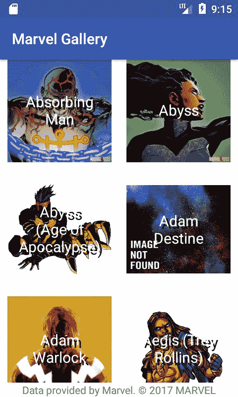

我们的第一个用例已经实现。我们可以继续下一个。

# 字符搜索

我们需要实现的另一个行为是字符搜索。这里是用例定义，在启动应用程序后，用户可以通过名称搜索字符。

要添加它，我们要将`EditText`添加到`activity_main`布局中:

```kt
<?xml version="1.0" encoding="utf-8"?> 
<RelativeLayout xmlns:android="http://schemas.android.com/apk/res/android" 
   xmlns:app="http://schemas.android.com/apk/res-auto" 
   xmlns:tools="http://schemas.android.com/tools" 
   android:id="@+id/charactersView" 
   android:layout_width="match_parent" 
   android:layout_height="match_parent" 
   android:background="@android:color/white" 
   android:fitsSystemWindows="true"> 

<!-- Dummy item to prevent EditText from receiving 
     focus on initial load --> 
   <LinearLayout 
       android:layout_width="0px" 
       android:layout_height="0px" 
       android:focusable="true" 
       android:focusableInTouchMode="true" 
       tools:ignore="UselessLeaf" /> 

  <android.support.design.widget.TextInputLayout 
     android:id="@+id/searchViewLayout" 
     android:layout_width="match_parent" 
     android:layout_height="wrap_content" 
     android:layout_margin="@dimen/element_padding"> 

     <EditText 
         android:id="@+id/searchView" 
         android:layout_width="match_parent" 
         android:layout_height="wrap_content" 
         android:layout_centerHorizontal="true" 
         android:hint="@string/search_hint" /> 

  </android.support.design.widget.TextInputLayout> 

   <android.support.v4.widget.SwipeRefreshLayout xmlns:android="http://schemas.android.com/apk/res/android" 
       android:id="@+id/swipeRefreshView" 
       android:layout_width="match_parent" 
       android:layout_height="match_parent" 
       android:layout_below="@+id/searchViewLayout" 
       app:layout_behavior="@string/appbar_scrolling_view_behavior"> 

       <android.support.v7.widget.RecyclerView 
           android:id="@+id/recyclerView" 
           android:layout_width="match_parent" 
           android:layout_height="match_parent" 
           android:scrollbars="vertical" /> 

   </android.support.v4.widget.SwipeRefreshLayout> 

   <TextView 
       android:layout_width="match_parent" 
       android:layout_height="wrap_content" 
       android:layout_alignParentBottom="true" 
       android:background="@android:color/white" 
       android:gravity="center" 
       android:text="@string/marvel_copyright_notice" /> 
</RelativeLayout> 
```

我们需要添加**安卓支持设计** 库依赖以允许`TextInputLayout`使用:

```kt
implementation "com.android.support:appcompat-v7:$android_support_version" 
implementation "com.android.support:design:$android_support_version" 
implementation "com.android.support:recyclerview-v7:$android_support_version" 
```

并在`strings.xml`中串`search_hint`定义:

```kt
<resources> 
   <string name="app_name">MarvelGallery</string> 
   <string name="search_hint">Search for character</string> 
   <string name="marvel_copyright_notice">
      Data provided by Marvel. © 2017 MARVEL
   </string> 
</resources> 
```

另外，为了保留打开键盘时通知漫威版权的标签，我们还需要在`AndroidManifest`中的`activity`定义中`adjustResize`到`windowSoftInputMode`:

```kt
<activity 
   android:name="com.sample.marvelgallery.view.main.MainActivity" 
   android:windowSoftInputMode="adjustResize"> 
   <intent-filter> 
       <action android:name="android.intent.action.MAIN" /> 
       <category android:name="android.intent.category.LAUNCHER" /> 
   </intent-filter> 
</activity> 
```

我们应该会看到以下预览:

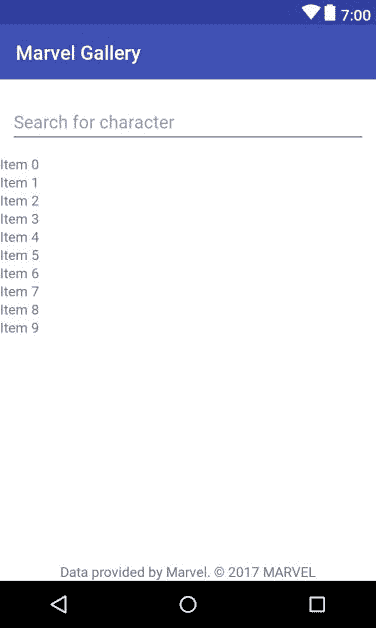

现在我们在`MainActivity`中增加了一个搜索栏:

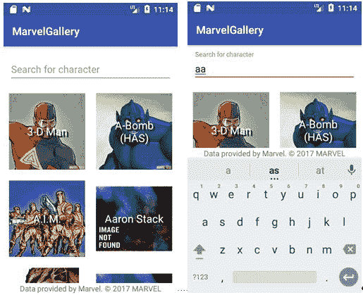

我们期望的行为是，每当用户更改搜索字段中的文本时，都会加载一个新列表。我们需要在`MainPresenter`中有一个新的方法，用于通知演示者文本已被更改。我们称之为`onSearchChanged`:

```kt
fun onRefresh() { 
   loadCharacters() 
} 

fun onSearchChanged(text: String) { 
   // TODO 
}

private fun loadCharacters() {
   subscriptions += repository.getAllCharacters()
           .applySchedulers()
           .doOnSubscribe { view.refresh = true }
           .doFinally { view.refresh = false }
           .subscribeBy(
               onSuccess = view::show,
               onError = view::showError
         )
   }
}
```

我们需要更改`MarvelRepository`定义以接受作为`getAllCharacters`参数的搜索查询(记得也更新`BaseMarvelRepository`):

```kt
interface MarvelRepository { 

   fun getAllCharacters(searchQuery: String?): 
   Single<List<MarvelCharacter>> 

   companion object : Provider<MarvelRepository>() { 
       override fun creator() = MarvelRepositoryImpl() 
   } 
} 
```

因此，我们必须更新实现:

```kt
class MarvelRepositoryImpl : MarvelRepository { 

   val api = retrofit.create(MarvelApi::class.java) 

   override fun getAllCharacters(searchQuery: String?): 
   Single<List<MarvelCharacter>> = api.getCharacters( 
           offset = 0, 
           searchQuery = searchQuery, 
           limit = elementsOnListLimit 
   ).map { it.data?.results.orEmpty().map(::MarvelCharacter) ?: 
    emptyList() } 

   companion object { 
       const val elementsOnListLimit = 50 
   } 
} 
```

我们还更新了网络请求定义:

```kt
interface MarvelApi { 

   @GET("characters") 
   fun getCharacters( 
           @Query("offset") offset: Int?, 
           @Query("nameStartsWith") searchQuery: String?, 
           @Query("limit") limit: Int? 
   ): Single<DataWrapper<List<CharacterMarvelDto>>> 
} 
```

为了允许代码编译，我们需要在`MainPresenter`中提供`null`作为`getAllCharacters`参数:

```kt
private fun loadCharacters() {
   subscriptions += repository.getAllCharacters(null)
           .applySchedulers()
           .doOnSubscribe { view.refresh = true }
           .doFinally { view.refresh = false }
           .subscribeBy(
                       onSuccess = view::show,
                       onError = view::showError
         )
   }
}
```

而我们需要更新`BaseMarvelRepository`:

```kt
package com.sample.marvelgallery.helpers 

import com.sample.marvelgallery.data.MarvelRepository 
import com.sample.marvelgallery.model.MarvelCharacter 
import io.reactivex.Single 

class BaseMarvelRepository( 
       val onGetCharacters: (String?) -> Single<List<MarvelCharacter>> 
) : MarvelRepository { 

   override fun getAllCharacters(searchQuery: String?) 
           = onGetCharacters(searchQuery) 
} 
```

现在，我们的网络实现返回一个从查询开始的字符列表，如果我们没有指定任何查询，则返回一个填充列表。是时候实施演示者了。让我们定义以下测试:

```kt
@file:Suppress("IllegalIdentifier") 

package com.sample.marvelgallery 

import com.sample.marvelgallery.helpers.BaseMainView 
import com.sample.marvelgallery.helpers.BaseMarvelRepository 
import com.sample.marvelgallery.presenter.MainPresenter 
import io.reactivex.Single 
import org.junit.Assert.* 
import org.junit.Test 

class MainPresenterSearchTest { 

   @Test 
   fun `When view is created, then search query is null`() { 
       assertOnAction { onViewCreated() } searchQueryIsEqualTo null 
   } 

   @Test 
   fun `When text is changed, then we are searching for new query`() { 
       for (text in listOf("KKO", "HJ HJ", "And so what?")) 
           assertOnAction { onSearchChanged(text) } 
           searchQueryIsEqualTo text 
   } 

   private fun assertOnAction(action: MainPresenter.() -> Unit)  
         = PresenterActionAssertion(action) 

   private class PresenterActionAssertion(val actionOnPresenter: 
       MainPresenter.() -> Unit) { 

       infix fun searchQueryIsEqualTo(expectedQuery: String?) { 
           var checkApplied = false 
           val view = BaseMainView(onShowError = { fail() }) 
           val marvelRepository = BaseMarvelRepository { searchQuery -> 
               assertEquals(expectedQuery, searchQuery) 
               checkApplied = true 
               Single.never() 
           } 
           val mainPresenter = MainPresenter(view, marvelRepository) 
           mainPresenter.actionOnPresenter() 
           assertTrue(checkApplied) 
       } 
   } 
} 
```

为了通过下面的测试，我们需要在`MainPresenter`的`loadCharacters`方法中添加一个带有默认参数的搜索查询作为参数:

```kt
fun onSearchChanged(text: String) { 
   loadCharacters(text) 
} 

private fun loadCharacters(searchQuery: String? = null) {
   subscriptions += repository.getAllCharacters(searchQuery)
           .applySchedulers()
           .doOnSubscribe { view.refresh = true }
           .doFinally { view.refresh = false }
           .subscribeBy(
                       onSuccess = view::show,
                       onError = view::showError
         )
   }
}
```

但棘手的是，漫威应用编程接口不允许只有空格作为搜索查询。应该有`null`发送代替。因此，如果用户删除最后一个字符，或者如果他们试图在搜索字段中只搜索空格，那么应用程序将崩溃。我们应该防止这种情况。这里有一个测试，检查演示者是否正在将只有空格的查询更改为`null`:

```kt
@Test 
fun `When text is changed, then we are searching for new query`() { 
   for (text in listOf("KKO", "HJ HJ", "And so what?")) 
       assertOnAction { onSearchChanged(text) } 
       searchQueryIsEqualTo text 
} 

@Test 
fun `For blank text, there is request with null query`() { 
   for (emptyText in listOf("", "   ", "       ")) 
       assertOnAction { onSearchChanged(emptyText) } 
       searchQueryIsEqualTo null 
} 

private fun assertOnAction(action: MainPresenter.() -> Unit)  
      = PresenterActionAssertion(action) 

We can implement a security mechanism in the loadCharacters method: 

private fun loadCharacters(searchQuery: String? = null) { 
   val qualifiedSearchQuery = if (searchQuery.isNullOrBlank()) null 
                              else searchQuery 
   subscriptions += repository 
           .getAllCharacters(qualifiedSearchQuery) 
           .applySchedulers() 
           .smartSubscribe( 
                   onStart = { view.refresh = true }, 
                   onSuccess = view::show, 
                   onError = view::showError, 
                   onFinish = { view.refresh = false } 
           ) 
} 
```

现在所有测试都再次通过:

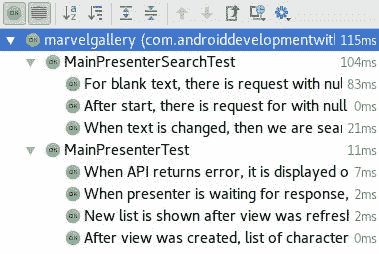

我们仍然需要实现一个`Activity`功能，当文本发生变化时，它会调用演示者。我们将使用[第 7 章](7.html#532G60-7a7324e7f1a1454d830df91c6b78f317)、*扩展函数和属性*中定义的可选回调类来实现:

```kt
// TextChangedListener.kt 
package com.sample.marvelgallery.view.common 

import android.text.Editable 
import android.text.TextWatcher 
import android.widget.TextView 

fun TextView.addOnTextChangedListener(config: TextWatcherConfiguration.() -> Unit) { 
   addTextChangedListener(TextWatcherConfiguration().apply { config() }
   addTextChangedListener(textWatcher) 
} 

class TextWatcherConfiguration : TextWatcher { 

   private var beforeTextChangedCallback: 
   (BeforeTextChangedFunction)? = null 
   private var onTextChangedCallback: 
   (OnTextChangedFunction)? = null 
   private var afterTextChangedCallback: 
   (AfterTextChangedFunction)? = null 

   fun beforeTextChanged(callback: BeforeTextChangedFunction) { 
       beforeTextChangedCallback = callback 
   } 

   fun onTextChanged(callback: OnTextChangedFunction) { 
       onTextChangedCallback = callback 
   } 

   fun afterTextChanged(callback: AfterTextChangedFunction) { 
       afterTextChangedCallback = callback 
   } 

   override fun beforeTextChanged(s: CharSequence, 
   start: Int, count: Int, after: Int) { 
       beforeTextChangedCallback?.invoke(s.toString(), 
       start, count, after) 
   } 

   override fun onTextChanged(s: CharSequence, start: Int, 
   before: Int, count: Int) { 
       onTextChangedCallback?.invoke(s.toString(), 
       start, before, count) 
   } 

   override fun afterTextChanged(s: Editable) { 
       afterTextChangedCallback?.invoke(s) 
   } 
} 

private typealias BeforeTextChangedFunction = 
  (text: String, start: Int, count: Int, after: Int) -> Unit 
private typealias OnTextChangedFunction = 
  (text: String, start: Int, before: Int, count: Int) -> Unit 
private typealias AfterTextChangedFunction = 
  (s: Editable) -> Unit 
```

并在`MainActivity`的`onCreate`方法中使用:

```kt
package com.sample.marvelgallery.view.main 

import android.os.Bundle 
import android.support.v7.widget.GridLayoutManager 
import android.view.Window 
import com.sample.marvelgallery.R 
import com.sample.marvelgallery.data.MarvelRepository 
import com.sample.marvelgallery.model.MarvelCharacter 
import com.sample.marvelgallery.presenter.MainPresenter 
import com.sample.marvelgallery.view.common.BaseActivityWithPresenter 
import com.sample.marvelgallery.view.common.addOnTextChangedListener 
import com.sample.marvelgallery.view.common.bindToSwipeRefresh 
import com.sample.marvelgallery.view.common.toast 
import kotlinx.android.synthetic.main.activity_main.* 

class MainActivity : BaseActivityWithPresenter(), MainView { 

   override var refresh by bindToSwipeRefresh(R.id.swipeRefreshView) 
   override val presenter by lazy 
     { MainPresenter(this, MarvelRepository.get()) } 

   override fun onCreate(savedInstanceState: Bundle?) { 
       super.onCreate(savedInstanceState) 
       requestWindowFeature(Window.FEATURE_NO_TITLE) 
       setContentView(R.layout.activity_main) 
       recyclerView.layoutManager = GridLayoutManager(this, 2) 
       swipeRefreshView.setOnRefreshListener { presenter.onRefresh() } 
       searchView.addOnTextChangedListener { 
           onTextChanged { text, _, _, _ -> 
               presenter.onSearchChanged(text) 
           } 
       } 
       presenter.onViewCreated() 
   } 

   override fun show(items: List<MarvelCharacter>) { 
       val categoryItemAdapters = items.map(::CharacterItemAdapter) 
       recyclerView.adapter = MainListAdapter(categoryItemAdapters) 
   } 

   override fun showError(error: Throwable) { 
       toast("Error: ${error.message}") 
       error.printStackTrace() 
   } 
} 
```

这就是我们定义角色搜索功能所需的全部内容。现在我们可以构建应用程序，并使用它来找到我们最喜欢的角色:

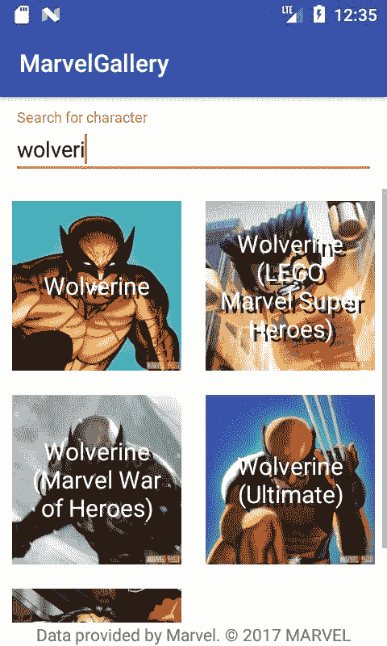

有了一个正常工作的应用程序，我们可以继续下一个用例。

# 字符轮廓显示

搜索字符是不够的。为了使应用程序发挥作用，我们应该添加一个字符描述显示。这里是我们定义的用例——当用户点击某个角色图片时，会显示一个概要文件。角色配置文件包含角色名称、照片、描述及其出现次数。

为了实现这个用例，我们需要创建一个新的活动和布局来定义这个`Activity`是什么样子的。为此，在包`com.sample.marvelgallery.view.character`中创建新的活动`CharacterProfileActivity`:

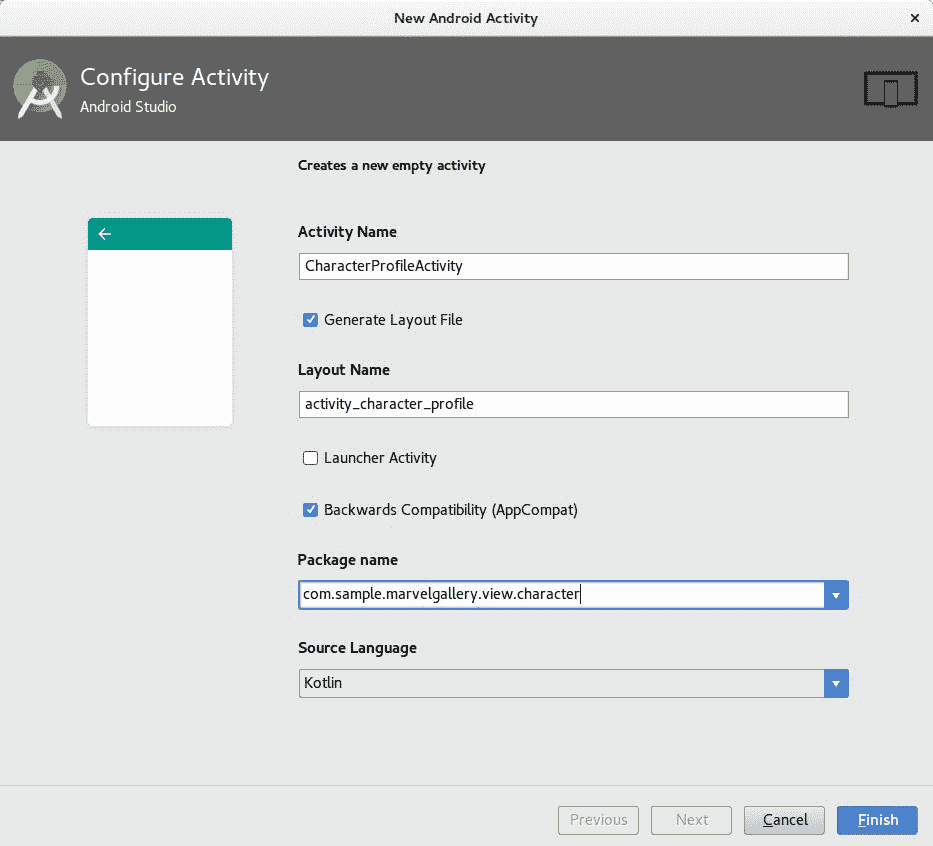

我们将从布局的变化开始实施(在`activity_character_profile.xml`)。以下是我们希望达到的最终结果:


基础元素为`CoordinatorLayout``AppBar`和`CollapsingToolbarLayout`均用于实现材料设计中已知的塌陷效果:


Collapsing effect step by step.

我们还需要`TextView`来描述下一个用例中将要填充数据的事件。以下是完整的`activity_character_profile`布局定义:

```kt
<?xml version="1.0" encoding="utf-8"?> 
<android.support.design.widget.CoordinatorLayout xmlns:android="http://schemas.android.com/apk/res/android" 
   xmlns:app="http://schemas.android.com/apk/res-auto" 
   xmlns:tools="http://schemas.android.com/tools" 
   android:id="@+id/character_detail_layout" 
   android:layout_width="match_parent" 
   android:layout_height="match_parent" 
   android:background="@android:color/white"> 

   <android.support.design.widget.AppBarLayout 
       android:id="@+id/appBarLayout" 
       android:layout_width="match_parent" 
       android:layout_height="wrap_content" 
       android:theme="@style/ThemeOverlay.AppCompat.ActionBar"> 

       <android.support.design.widget.CollapsingToolbarLayout 
           android:id="@+id/toolbarLayout" 
           android:layout_width="match_parent" 
           android:layout_height="match_parent" 
           app:contentScrim="?attr/colorPrimary" 
           app:expandedTitleTextAppearance="@style/ItemTitleName" 
           app:layout_scrollFlags="scroll|exitUntilCollapsed"> 

           <android.support.v7.widget.AppCompatImageView 
               android:id="@+id/headerView" 
               android:layout_width="match_parent" 
               android:layout_height="@dimen/character_header_height" 
               android:background="@color/colorPrimaryDark" 
               app:layout_collapseMode="parallax" /> 

           <android.support.v7.widget.Toolbar 
               android:id="@+id/toolbar" 
               android:layout_width="match_parent" 
               android:layout_height="?attr/actionBarSize" 
               android:background="@android:color/transparent" 
               app:layout_collapseMode="pin" 
               app:popupTheme="@style/ThemeOverlay.AppCompat.Light" /> 

       </android.support.design.widget.CollapsingToolbarLayout> 
   </android.support.design.widget.AppBarLayout> 

   <android.support.v4.widget.NestedScrollView 
       android:layout_width="match_parent" 
       android:layout_height="match_parent" 
       android:overScrollMode="never" 
       app:layout_behavior="@string/appbar_scrolling_view_behavior"> 

       <LinearLayout 
           android:id="@+id/details_content_frame" 
           android:layout_width="match_parent" 
           android:layout_height="match_parent" 
           android:focusableInTouchMode="true" 
           android:orientation="vertical"> 

           <TextView 
               android:id="@+id/descriptionView" 
               android:layout_width="match_parent" 
               android:layout_height="wrap_content" 
               android:gravity="center" 
               android:padding="@dimen/character_description_padding" 
               android:textSize="@dimen/standard_text_size" 
               tools:text="This is some long text that will be visible as an character description." /> 

           <TextView 
               android:id="@+id/occurrencesView" 
               android:layout_width="match_parent" 
               android:layout_height="wrap_content" 
               android:padding="@dimen/character_description_padding" 
               android:textSize="@dimen/standard_text_size" 
               tools:text="He was in following comics:\n* KOKOKO \n* KOKOKO \n* KOKOKO \n* KOKOKO \n* KOKOKO \n* KOKOKO \n* KOKOKO \n* KOKOKO \n* KOKOKO \n* KOKOKO \n* KOKOKO " /> 
       </LinearLayout> 

   </android.support.v4.widget.NestedScrollView> 

   <TextView 
       android:layout_width="match_parent" 
       android:layout_height="wrap_content" 
       android:layout_gravity="bottom" 
       android:background="@android:color/white" 
       android:gravity="bottom|center" 
       android:text="@string/marvel_copyright_notice" /> 

   <ProgressBar 
       android:id="@+id/progressView" 
       style="?android:attr/progressBarStyleLarge" 
       android:layout_width="wrap_content" 
       android:layout_height="wrap_content" 
       android:layout_gravity="center" 
       android:visibility="gone" /> 

</android.support.design.widget.CoordinatorLayout> 
```

我们还需要在`styles.xml`中添加以下样式:

```kt
<resources> 

   <!-- Base application theme. --> 
   <style name="AppTheme" 
          parent="Theme.AppCompat.Light.DarkActionBar"> 
       <!-- Customize your theme here. --> 
       <item name="colorPrimary">@color/colorPrimary</item> 
       <item name="colorPrimaryDark">@color/colorPrimaryDark</item> 
       <item name="colorAccent">@color/colorAccent</item> 
   </style> 
   <style name="AppFullScreenTheme" 
          parent="Theme.AppCompat.Light.NoActionBar"> 
       <item name="android:windowNoTitle">true</item> 
       <item name="android:windowActionBar">false</item> 
       <item name="android:windowFullscreen">true</item> 
       <item name="android:windowContentOverlay">@null</item> 
   </style> 

   <style name="ItemTitleName" 
          parent="TextAppearance.AppCompat.Headline"> 
       <item name="android:textColor">@android:color/white</item> 
       <item name="android:shadowColor">@color/colorPrimaryDark</item> 
       <item name="android:shadowRadius">3.0</item> 
   </style> 
   <style name="ItemDetailTitle" 
          parent="@style/TextAppearance.AppCompat.Small"> 
       <item name="android:textColor">@color/colorAccent</item> 
   </style> 

</resources> 
```

我们需要定义`AppFullScreenTheme`作为`AndroidManifest`中`CharacterProfileActivity`的主题:

```kt
<activity android:name=".view.CharacterProfileActivity" 
   android:theme="@style/AppFullScreenTheme" /> 
```

以下是已定义布局的预览:


该视图将用于显示关于角色的数据，但首先我们需要从`MainActivity`打开它。我们需要在`CharacterItemAdapter`*中设置`onClickListener`，也就是调用构造函数提供的`clicked`回调:*

```kt
package com.sample.marvelgallery.view.main 

import android.support.v7.widget.RecyclerView 
import android.view.View 
import android.widget.ImageView 
import android.widget.TextView 
import com.sample.marvelgallery.R 
import com.sample.marvelgallery.model.MarvelCharacter 
import com.sample.marvelgallery.view.common.ItemAdapter 
import com.sample.marvelgallery.view.common.bindView 
import com.sample.marvelgallery.view.common.loadImage 

class CharacterItemAdapter( 
       val character: MarvelCharacter, 
       val clicked: (MarvelCharacter) -> Unit 
) : ItemAdapter<CharacterItemAdapter.ViewHolder>(R.layout.item_character) { 

   override fun onCreateViewHolder(itemView: View) = 
   ViewHolder(itemView) 

   override fun ViewHolder.onBindViewHolder() { 
       textView.text = character.name 
       imageView.loadImage(character.imageUrl) 
       itemView.setOnClickListener { clicked(character) } 
   } 

   class ViewHolder(itemView: View) : 
   RecyclerView.ViewHolder(itemView) { 
       val textView by bindView<TextView>(R.id.textView) 
       val imageView by bindView<ImageView>(R.id.imageView) 
   } 
} 
```

而我们需要更新`MainActivity`:

```kt
package com.sample.marvelgallery.view.main 

import android.os.Bundle 
import android.support.v7.widget.GridLayoutManager 
import android.view.Window 
import com.sample.marvelgallery.R 
import com.sample.marvelgallery.data.MarvelRepository 
import com.sample.marvelgallery.model.MarvelCharacter 
import com.sample.marvelgallery.presenter.MainPresenter 
import com.sample.marvelgallery.view.character.CharacterProfileActivity 
import com.sample.marvelgallery.view.common.BaseActivityWithPresenter 
import com.sample.marvelgallery.view.common.addOnTextChangedListener 
import com.sample.marvelgallery.view.common.bindToSwipeRefresh 
import com.sample.marvelgallery.view.common.toast 
import kotlinx.android.synthetic.main.activity_main.* 

class MainActivity : BaseActivityWithPresenter(), MainView { 

   override var refresh by bindToSwipeRefresh(R.id.swipeRefreshView) 
   override val presenter by lazy
   { MainPresenter(this, MarvelRepository.get()) } 

   override fun onCreate(savedInstanceState: Bundle?) { 
       super.onCreate(savedInstanceState) 
       requestWindowFeature(Window.FEATURE_NO_TITLE) 
       setContentView(R.layout.activity_main) 
       recyclerView.layoutManager = GridLayoutManager(this, 2) 
       swipeRefreshView.setOnRefreshListener { presenter.onRefresh() } 
       searchView.addOnTextChangedListener { 
           onTextChanged { text, _, _, _ -> 
               presenter.onSearchChanged(text) 
           } 
       } 
       presenter.onViewCreated() 
   } 

   override fun show(items: List<MarvelCharacter>) { 
       val categoryItemAdapters = 
       items.map(this::createCategoryItemAdapter) 
       recyclerView.adapter = MainListAdapter(categoryItemAdapters) 
   } 

   override fun showError(error: Throwable) { 
       toast("Error: ${error.message}") 
       error.printStackTrace() 
   } 

   private fun createCategoryItemAdapter(character: MarvelCharacter) 
           = CharacterItemAdapter(character, 
             { showHeroProfile(character) }) 

   private fun showHeroProfile(character: MarvelCharacter) { 
       CharacterProfileActivity.start(this, character) 
   } 
} 
```

在前面的实现中，我们使用了一个从`CharacterProfileActivity`伴随对象开始`CharacterProfileActivity`的方法。我们需要通过`MarvelCharacter`反对这个方法。传递`MarvelCharacter`对象的最有效方法是将其作为*可传递*。要允许它，`MarvelCharacter`必须实现`Parcelable`接口。这就是为什么有用的解决方案是使用一些注释处理库，如 **Parceler** 、**paper package**或**走私者**，它们生成必要的元素。我们将使用我们已经在项目中使用的 Kotlin Android 扩展的解决方案。在图书出版过程中，还处于试验阶段，因此需要在`build.gradle`模块中增加以下定义:

```kt
androidExtensions {
   experimental = true
}
```

我们需要做的就是在类前添加`Parcelize`标注，我们需要让这个类实现`Parcelable`。我们还将添加错误抑制，因为要隐藏默认的安卓警告:

```kt
package com.sample.marvelgallery.model 

import android.annotation.SuppressLint 
import android.os.Parcelable 
import com.sample.marvelgallery.data.network.dto.CharacterMarvelDto 

import kotlinx.android.parcel.Parcelize
@SuppressLint("ParcelCreator")
@Parcelize

   constructor(dto: CharacterMarvelDto) : this( 
           name = dto.name, 
           imageUrl = dto.imageUrl 
   )
} 
```

现在我们可以实现`start`函数和字段`character`，这将使用属性委托从意图中获取参数值:

```kt
package com.sample.marvelgallery.view.character 

import android.content.Context 
import android.support.v7.app.AppCompatActivity 
import android.os.Bundle 
import android.view.MenuItem 
import com.sample.marvelgallery.R 
import com.sample.marvelgallery.model.MarvelCharacter 
import com.sample.marvelgallery.view.common.extra 
import com.sample.marvelgallery.view.common.getIntent 
import com.sample.marvelgallery.view.common.loadImage 
import kotlinx.android.synthetic.main.activity_character_profile.* 

class CharacterProfileActivity : AppCompatActivity() { 

   val character: MarvelCharacter by extra(CHARACTER_ARG) // 1 

   override fun onCreate(savedInstanceState: Bundle?) { 
       super.onCreate(savedInstanceState) 
       setContentView(R.layout.activity_character_profile) 
       setUpToolbar() 
       supportActionBar?.title = character.name 
       headerView.loadImage(character.imageUrl, centerCropped = true) // 1 
   } 

   override fun onOptionsItemSelected(item: MenuItem): Boolean = when { 
       item.itemId == android.R.id.home -> onBackPressed().let { true } 
       else -> super.onOptionsItemSelected(item) 
   } 

   private fun setUpToolbar() { 
       setSupportActionBar(toolbar) 
       supportActionBar?.setDisplayHomeAsUpEnabled(true) 
   } 

   companion object { 

       private const val CHARACTER_ARG = "com.sample.marvelgallery.view.character.CharacterProfileActivity.CharacterArgKey" 

       fun start(context: Context, character: MarvelCharacter) { 
           val intent = context 
                   .getIntent<CharacterProfileActivity>() // 1 
                   .apply { putExtra(CHARACTER_ARG, character) } 
           context.startActivity(intent) 
       } 
   } 
} 
```

1.  `extra`和`getIntent`扩展功能已经在书中介绍过了，但是在项目中还没有实现。此外，`loadImage`将显示一个错误，因为它需要更改。

我们需要更新`loadImage`，定义`extra`和`getIntent`为顶级功能:

```kt
// ViewExt.kt 
package com.sample.marvelgallery.view.common 

import android.app.Activity 
import android.content.Context 
import android.content.Intent 
import android.os.Parcelable 
import android.support.annotation.IdRes 
import android.support.v4.widget.SwipeRefreshLayout 
import android.widget.ImageView 
import android.widget.Toast 
import com.bumptech.glide.Glide 
import kotlin.properties.ReadWriteProperty 
import kotlin.reflect.KProperty 
import android.support.v7.widget.RecyclerView 
import android.view.View 

fun <T : View> RecyclerView.ViewHolder.bindView(viewId: Int)  
      = lazy { itemView.findViewById<T>(viewId) } 

fun ImageView.loadImage(photoUrl: String, centerCropped: Boolean = false) { 
   Glide.with(context) 
           .load(photoUrl) 
           .apply { if (centerCropped) centerCrop() } 
           .into(this) 
} 

fun <T : Parcelable> Activity.extra(key: String, default: T? = null): Lazy<T>  
      = lazy { intent?.extras?.getParcelable<T>(key) ?: default ?: throw Error("No value $key in extras") } 

inline fun <reified T : Activity> Context.getIntent() = Intent(this, T::class.java) 

// ...
```

Instead of defining functions to start the Activity, we might use some library that is generating these methods. For example, we might use the `ActivityStarter` library. This is what `CharacterProfileActivity` would look like:

```kt
class CharacterProfileActivity : AppCompatActivity() { 

   @get:Arg val character: MarvelCharacter by argExtra() 

   override fun onCreate(savedInstanceState: Bundle?) { 
       super.onCreate(savedInstanceState) 
       setContentView(R.layout.activity_character_profile) 
       setUpToolbar() 
       supportActionBar?.title = character.name 
       headerView.loadImage(character.imageUrl, centerCropped = true) // 1 
   } 

   override fun onOptionsItemSelected(item: MenuItem): Boolean = when { 
       item.itemId == android.R.id.home -> onBackPressed().let { true } 
       else -> super.onOptionsItemSelected(item) 
   } 

   private fun setUpToolbar() { 
       setSupportActionBar(toolbar) 
       supportActionBar?.setDisplayHomeAsUpEnabled(true) 
   } 
} 
```

我们应该开始使用生成类的静态方法`CharacterProfileActivityStarter`来获取它的意图；

```kt
CharacterProfileActivityStarter.start(context, character) 
val intent = CharacterProfileActivityStarter.getIntent(context, character) 
```

为了允许它，我们需要模块`build.gradle`中的 **kapt** 插件(用于支持 Kotlin 中的注释处理):

```kt
apply plugin: 'kotlin-kapt' 
```

以及模块`build.gradle`中的`ActivityStarter`依赖关系:

```kt
implementation 'com.github.marcinmoskala.activitystarter:activitystarter:1.00' 
implementation 'com.github.marcinmoskala.activitystarter:activitystarter-kotlin:1.00' 
kapt 'com.github.marcinmoskala.activitystarter:activitystarter-compiler:1.00' 
```

在这些改变之后，当我们在`MainActivity`中点击进入字符时，那么`CharacterProfileActivity`将被启动:

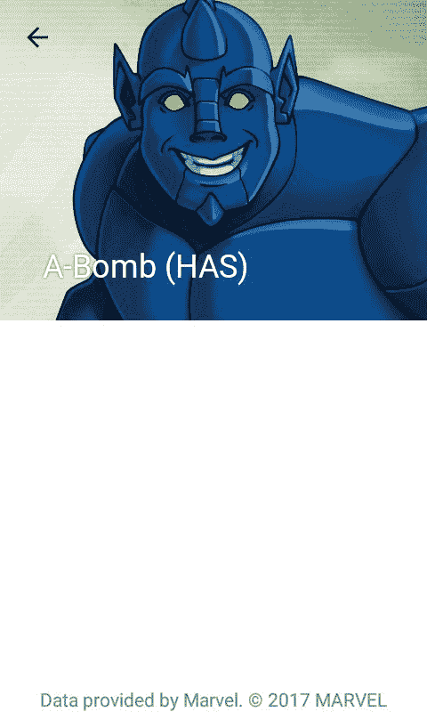

我们正在显示姓名和人物照片。下一步是显示事件的描述和列表。必要的数据可以在漫威 API 中找到，我们只需要扩展 d to 模型就可以获得它们。我们需要添加用于保存列表的`ListWrapper`:

```kt
package com.sample.marvelgallery.data.network.dto 

class ListWrapper<T> { 
   var items: List<T> = listOf() 
} 
```

我们需要定义`ComicDto`，它保存了我们需要的关于发生的数据:

```kt
package com.sample.marvelgallery.data.network.dto 

class ComicDto { 
   lateinit var name: String 
} 
```

而我们需要更新`CharacterMarvelDto`:

```kt
package com.sample.marvelgallery.data.network.dto 

class CharacterMarvelDto { 

   lateinit var name: String 
   lateinit var description: String 
   lateinit var thumbnail: ImageDto 
   var comics: ListWrapper<ComicDto> = ListWrapper() 
   var series: ListWrapper<ComicDto> = ListWrapper() 
   var stories: ListWrapper<ComicDto> = ListWrapper() 
   var events: ListWrapper<ComicDto> = ListWrapper() 

   val imageUrl: String 
       get() = thumbnail.completeImagePath 
} 
```

数据现在从 API 中读取并保存在 DTO 对象中，但是要在项目中使用它们，我们还需要更改`MarvelCharacter`类定义，并添加一个新的构造函数:

```kt
@SuppressLint("ParcelCreator")
@Parcelize

class MarvelCharacter( 
       val name: String, 
       val imageUrl: String, 
       val description: String, 
       val comics: List<String>, 
       val series: List<String>, 
       val stories: List<String>, 
       val events: List<String> 
) : Parcelable { 

   constructor(dto: CharacterMarvelDto) : this( 
           name = dto.name, 
           imageUrl = dto.imageUrl, 
           description = dto.description, 
           comics = dto.comics.items.map { it.name }, 
           series = dto.series.items.map { it.name }, 
           stories = dto.stories.items.map { it.name }, 
           events = dto.events.items.map { it.name } 
   ) 
} 
```

现在我们可以更新`CharacterProfileActivity`来显示事件的描述和列表:

```kt
class CharacterProfileActivity : AppCompatActivity() { 

   val character: MarvelCharacter by extra(CHARACTER_ARG) 
   override fun onCreate(savedInstanceState: Bundle?) { 
       super.onCreate(savedInstanceState) 
       setContentView(R.layout.activity_character_profile) 
       setUpToolbar() 
       supportActionBar?.title = character.name 
       descriptionView.text = character.description 
       occurrencesView.text = makeOccurrencesText() // 1 
       headerView.loadImage(character.imageUrl, centerCropped = true) 
   } 

   override fun onOptionsItemSelected(item: MenuItem): Boolean = when { 
       item.itemId == android.R.id.home -> onBackPressed().let { true } 
       else -> super.onOptionsItemSelected(item) 
   } 

   private fun setUpToolbar() { 
       setSupportActionBar(toolbar) 
       supportActionBar?.setDisplayHomeAsUpEnabled(true) 
   } 

   private fun makeOccurrencesText(): String = "" // 1, 2 
           .addList(R.string.occurrences_comics_list_introduction, character.comics) 
           .addList(R.string.occurrences_series_list_introduction, character.series) 
           .addList(R.string.occurrences_stories_list_introduction, character.stories) 
           .addList(R.string.occurrences_events_list_introduction, character.events) 

   private fun String.addList(introductionTextId: Int, list: List<String>): String { // 3 
       if (list.isEmpty()) return this 
       val introductionText = getString(introductionTextId) 
       val listText = list.joinToString(transform = 
           { " $bullet $it" }, separator = "\n") 
       return this + "$introductionText\n$listText\n\n" 
   } 

   companion object { 
       private const val bullet = '\u2022' // 4 
       private const val CHARACTER_ARG = "com.naxtlevelofandroiddevelopment.marvelgallery.presentation.heroprofile.CharacterArgKey" 

       fun start(context: Context, character: MarvelCharacter) { 
           val intent = context 
                   .getIntent<CharacterProfileActivity>() 
                   .apply { putExtra(CHARACTER_ARG, character) } 
           context.startActivity(intent) 
       } 
   } 
}
```

1.  事件列表的合成是一个相当复杂的任务，所以我们将其提取到函数`makeOccurrencesText`中。在那里，对于每种出现类型(漫画、系列等)，我们希望仅在出现一些这种类型的情况时才显示介绍文本和列表。我们还想在每个项目前加上一个项目符号。

2.  `makeOccurrencesText`是一个单一的表达式函数，它使用`addList`为我们想要显示的下一个列表附加一个初始为空的字符串。
3.  `addList`是成员扩展函数。如果提供的列表为空，它将返回一个未更改的字符串，或者返回一个附加了介绍文本和带有项目符号的元素列表的字符串。
4.  这是用作列表项目符号的字符。

我们还需要在`strings.xml`中定义字符串:

```kt
<resources> 
   <string name="app_name">Marvel Gallery</string> 
   <string name="marvel_copyright_notice">
       Data provided by Marvel. © 2017 MARVEL</string> 
   <string name="search_hint">Search for character</string> 
   <string name="occurrences_comics_list_introduction">Comics:</string> 
   <string name="occurrences_series_list_introduction">Series:</string> 
   <string name="occurrences_stories_list_introduction">Stories:</string> 
   <string name="occurrences_events_list_introduction">Events:</string> 
</resources> 
```

现在，我们可以看到整个角色简介——角色名称、形象、描述，以及它在漫画、系列、事件和故事中出现的列表:

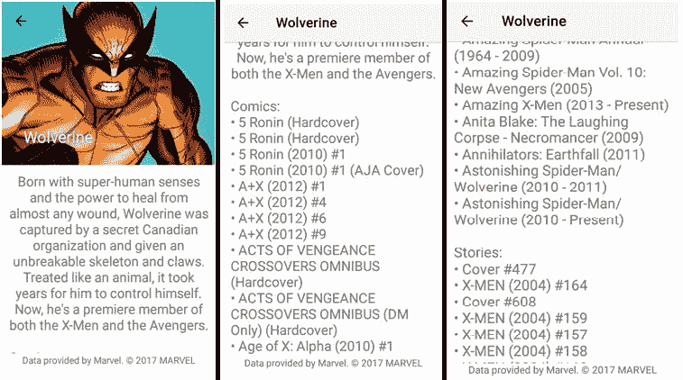

# 摘要

应用程序已经完成，但仍有许多功能可以添加。在这个应用程序中，我们看到了一些如何使用 Kotlin 简化安卓开发的例子。但仍有很多解决方案有待发现。Kotlin 简化了任何级别的安卓开发——从监听器集或视图元素引用等常见操作，到功能编程或集合处理等高级功能。

这本书不能说所有关于用 Kotlin 开发安卓的事情。它旨在展示足够多的东西，让每个人都可以带着满满的想法和对功能的理解开始自己的冒险。下一步是打开 Android Studio，创建自己的项目，开始和 Kotlin 一起玩得开心。大冒险就在你面前。**