# 一、安卓和移动取证

### 本章中的信息

[安卓平台](#S0015)

[Linux、开源软件和取证](#S0055)

[安卓开源项目](#S0170)

[国际化](#S0195)

[安卓市场](#S0230)

[安卓取证](#S0245)

## 介绍

数字取证是一个令人兴奋的快节奏领域，可以对各种情况产生强大的影响，包括公司内部调查、民事诉讼、刑事调查、情报收集和涉及国家安全的事项。可以说，移动取证是发展最快、发展最快的数字取证学科，它提供了巨大的机遇，也带来了许多挑战。虽然安卓取证的有趣部分涉及从设备获取和分析数据，但对平台和整个调查过程中使用的工具有一个广泛的了解是很重要的。透彻的理解将有助于法医或安全工程师成功调查和分析安卓设备。

小费

### 图书更正、更新和软件

本书的所有更正、更新甚至软件示例都将在线保存在以下网页上:

[http://via forensics . com/education/Android-forensics-mobile-security-book/](http://viaforensics.com/education/android-forensics-mobile-security-book/)

请查看网站，因为随着时间的推移，它会不断发展，并为读者提供显著和不断增加的价值。除了更正和更新，书中引用的一些软件也可以下载。

## 安卓平台

安卓是一个基于 Linux 2.6 内核的开源移动设备平台，由开放手机联盟管理，该联盟由运营商、移动设备和组件制造商以及软件供应商组成。

安卓已经对智能手机市场产生了重大影响，因此在取证领域也是如此。在第一款安卓设备推出两年零一个月后(2008 年 10 月)，安卓成为第二大智能手机平台，占据了美国 6150 万智能手机用户的 26.0%([comScore 报道，n.d.](#BIB12) )。[根据 comScore，Inc .的数据，表 1.1](#T0010) 显示了截至 2010 年 11 月的顶级智能手机平台。

不错...当我在努力处理下载文件提示和使用 jquery ajax 时..这个解决方案对我来说非常有效..+1

| 平台 | 智能手机用户的份额(%) |
| --- | --- |
| 边 | Thirty-three point five |
| 谷歌 | Twenty-six |
| 苹果 | Twenty-five |
| 微软 | Nine |
| 手掌 | Three point nine |

但安卓的影响力远远超出了美国市场。根据 Gartner，Inc .的数据，安卓操作系统(OS)在 2010 年第三季度是第二受欢迎的，占全球智能手机销量的 25.5%([Gartner 称，n.d.](#BIB14) )，如[表 1.2](#T0015) 所示。

表 1.2 2009-2010 年第三季度按操作系统分列的全球智能手机终端用户销售额(单位:千部)

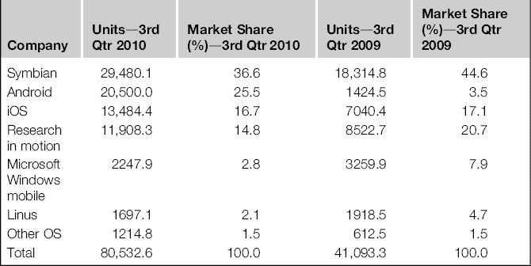

根据谷歌投资者网站，谷歌首席执行官埃里克·施密特报告称，截至 2011 年 2 月，每天有超过 35 万台安卓设备被激活。这些统计数据集中在智能手机市场，这只是市场上众多安卓设备类型中的一种。

安卓的开源性质不仅为行业确立了新的方向，还让开发者、精通代码的法医分析师和(不幸的是)老练的犯罪分子能够从最基本的层面理解设备。随着核心平台迅速成熟并继续免费提供，运营商和硬件供应商可以将精力集中在旨在留住客户的定制上。

### 安卓历史

三十多年来，公司在手持计算设备的研发上投入了大量资源，希望能打开新的市场。与传统计算机一样，构建此类设备的核心硬件组件也取得了显著进步，现在为手持计算机提供了一个虽小但功能强大的移动平台。

安卓发展的核心人物是安迪·鲁宾，他过去的雇主包括机器人公司、苹果公司、网络电视公司和危险公司。他以前的公司危险公司开发了一款智能手机，并支持 T-Mobile Sidekick 最认可的操作系统。这个移动操作系统，DangerOS，是用 Java 构建的。它提供了一个软件开发工具包，并具有当前智能手机的一些功能。2004 年，鲁宾离开了 Danger，并修补了几个新的想法。他再次回到智能手机开发领域，与过去公司的几位工程师合作。鲁宾在 2003 年成立的公司叫做安卓公司。

当团队开始开发时，鲁宾正在积极向潜在投资者和无线运营商推销安卓系统。他采访的公司之一是谷歌，该公司随后于 2005 年 7 月收购了安卓系统。此次收购，加上涉及移动设备的新专利和服务，以及对无线频谱的大规模收购，引发了大量猜测，即谷歌正在开发自己的智能手机，或许其目标是成为一家完整的无线运营商。

然而，2007 年 11 月 5 日，安迪·鲁宾在谷歌官方博客([谷歌官方博客，n.d.](#BIB22) )上宣布了一项更为雄心勃勃的计划:

安卓是第一个真正开放和全面的移动设备平台。它包括操作系统、用户界面和应用程序——所有运行手机的软件，但没有阻碍移动创新的专有障碍。我们与开放手机联盟合作开发了安卓系统，该联盟由包括摩托罗拉、高通、宏达电和 T-Mobile 在内的 30 多家科技和移动领导者组成。通过与运营商、设备制造商、开发人员和其他人的深度合作，我们希望通过创建一个标准、开放的移动软件平台，为移动世界创造一个开放的生态系统。我们认为，最终的结果将是更好、更快的创新步伐，为移动客户提供无法预见的应用和功能。

一周后，谷歌向开发者发布了安卓软件开发工具包的早期版本。这使得谷歌创建了第一个安卓开发者挑战赛，从 2008 年 1 月持续到 2008 年 4 月。谷歌拨出 100 万美元奖励最具创新性的安卓应用。排名前 50 的应用可以在[http://code.google.com/android/adc/adc_gallery/](http://code.google.com/android/adc/adc_gallery/)查看。

2008 年 8 月，谷歌宣布开放安卓市场，开发者可以上传他们的应用，供移动设备所有者浏览和安装。最初的版本不支持付费应用。然而，该功能是在 2009 年初添加的。最后，2008 年 10 月标志着安卓开源项目(AOSP)和第一款可公开使用的安卓智能手机——T-Mobile G1 的正式发布。

自成立以来，安卓生态系统已经有了显著的发展，并且由不同的贡献者群体组成。[表 1.3](#T0020) 总结了安卓平台的重要里程碑。

表 1.3 安卓里程碑

| 日期 | 事件 |
| --- | --- |
| 2005 年 7 月 1 日 | 谷歌收购安卓公司。 |
| 2007 年 11 月 12 日 | 安卓启动器 |
| 2008 年 8 月 28 日 | 安卓市场宣布 |
| 2008 年 9 月 23 日 | 安卓 1.0 平台发布 |
| 08 年 10 月 21 日 | 安卓作为开源软件发布 |
| 2009 年 2 月 13 日 | 安卓市场:美国接受付费应用 |
| 2009 年 3 月 12 日 | 安卓市场:英国接受付费应用 |
| 2009 年 4 月 15 日 | 安卓 1.5(纸杯蛋糕)平台发布 |
| 2009 年 9 月 16 日 | 安卓 1.6(甜甜圈)平台发布 |
| 2009 年 10 月 5 日 | 安卓 2.0/2.1(艾克蕾尔)平台发布 |
| 2010 年 5 月 20 日 | 安卓 2.2 (Froyo)平台发布 |
| 2010 年 5 月 23 日 | 安卓 2.2。Nexus One 手机发布 |
| 2010 年 12 月 6 日 | 安卓 2.3(姜饼)平台发布 |
| 2011 年 2 月 2 日 | 安卓 3.0(蜂巢)预览版发布 |

#### 开放手机联盟

开放手机联盟(OHA)是移动技术公司之间的合作，包括无线运营商、手机和组件制造商、软件开发商以及其他支持和集成公司。该联盟成立于 2007 年 11 月 5 日，最初有 34 名成员。然而，截至 2011 年 1 月，有近 80 名成员。

OHA 致力于“加速移动创新，为消费者提供更丰富、更便宜、更好的移动体验”( [Alliance FAQ，n.d.](#BIB1) )，主要关注安卓设备的协调、开发和发布。谷歌是 OHA 和 AOSP 背后的驱动力。一些人抱怨说，联盟只是一种营销手段，对成员或消费者没有什么价值。然而，2010 年全年都有新成员加入，OHA 无疑将延续到未来。截至 2011 年 2 月 3 日在[表 1.4](#T0025) 中列出的成员按移动运营商、手机制造商、半导体公司、软件公司和商业化公司分组([联盟成员，未注明](#BIB2))。

表 1.4 开放手机联盟成员

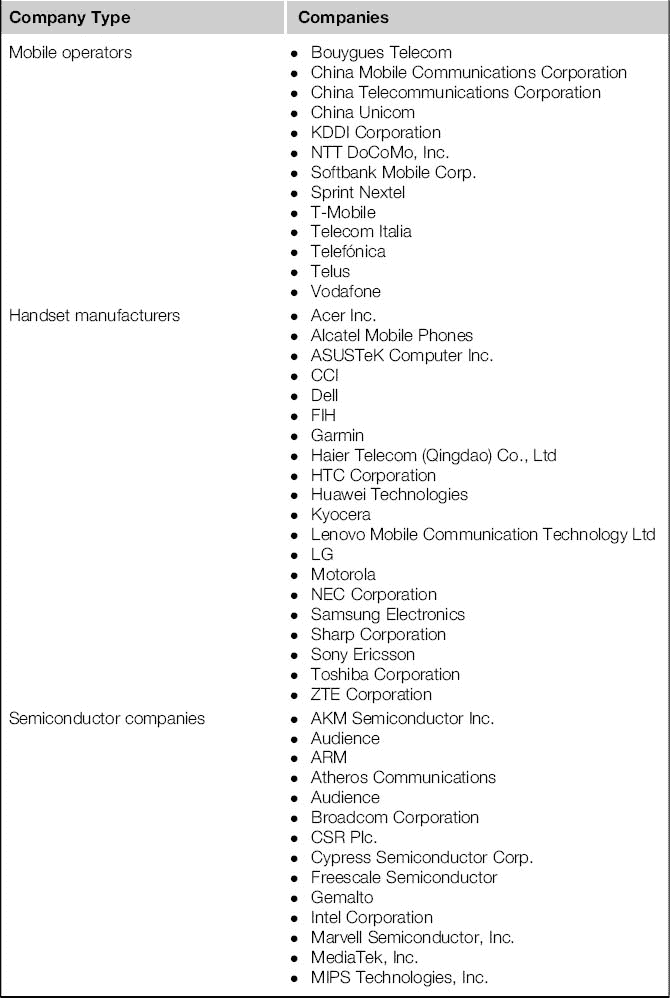

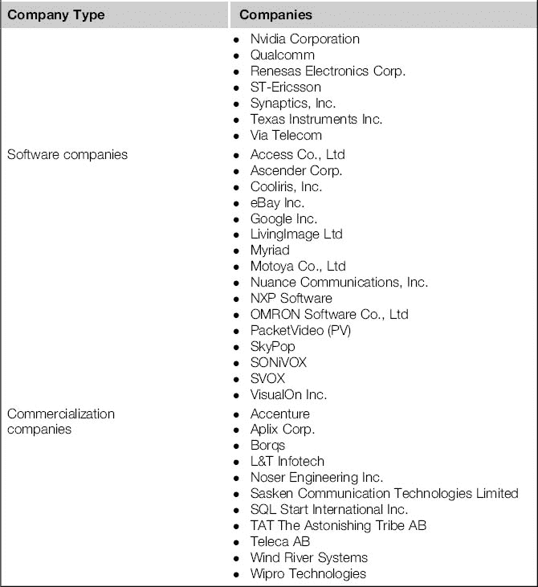

#### 安卓功能

虽然我们将在下一章更多地探讨各种安卓设备类型，但我们可以在这里讨论大多数安卓设备共有的几个特性。

首先，无论是使用全球移动通信系统和码分多址(GSM/CDMA)等蜂窝网络还是无线网络(Wi-Fi)，Android 从一开始就被设计成在线。无论在哪里，在线的能力是任何安卓设备的核心特征。许多设备实际上是智能手机，因此支持发送和接收电话、短信和蜂窝网络上的其他服务。与设备交互通常是通过触摸屏，但许多设备也允许键盘或其他按钮，支持用户交互。

安卓设备的第二个核心功能是能够从安卓市场下载和安装应用程序。这是许多用户的主要功能，因为它允许他们扩展设备的功能。这些应用程序通常也是法医分析师丰富的信息来源。

最后一个核心特性是用户能够在设备上存储他们的数据。当然，这是本书详细介绍的取证工作的基础。大多数安卓设备都配备了一些使用闪存的设备内存储，以及一个便携式的外部 SD 卡，用于存储大量数据。一些最近的宏达电设备现在附带了一个仿真 SD 卡，这是一个独立的 USB 设备标识，映射到 NAND 并呈现为 SD 卡。仿真 SD 卡通常使用微软的 FAT32 文件系统格式化。

#### 支持的蜂窝网络

由于智能手机是安卓设备中最大的类别，了解安卓目前支持的各种蜂窝技术非常重要。

第一个安卓设备，HTC DREA100 或 T-Mobile G1，是一款全球移动通信系统(GSM)手机。全球移动通信系统是世界上使用最广泛、支持最广泛的蜂窝系统，具有出色的支持能力。美国支持 GSM 的主要无线提供商包括美国电话电报公司和 T-Mobile。全球移动通信系统利用用户识别模块(SIM)或通用用户识别模块(USIM)向蜂窝网络识别用户。

安卓支持的下一个蜂窝系统是码分多址，通常被称为码分多址。码分多址是用于编码和发送码分多址电话使用的语音、数据和控制信号的技术。它在美国很受欢迎，但在世界各地不太受欢迎。在美国，使用的主要技术标准被称为 CDMA2000。主要运营商包括威瑞森无线、斯普林特、美国蜂窝和板球通信。

安卓支持的最后一个蜂窝系统是集成数字增强网络(iDEN)，其主要吸引力是支持 流行的一键通功能。在美国，唯一支持 iDEN 的大型运营商是 Sprint Nextel(同时拥有 Boost Mobile)。iDEN 的开发者摩托罗拉也开发了摩托罗拉 i1，这是第一款支持 iDEN 的安卓手机。

### 谷歌的战略

安卓显然是一个强大的移动设备平台，开发成本巨大。那么谷歌为什么要免费赠送安卓呢？

答案始于谷歌明确定义的使命([公司信息:关于，n.d.](#BIB11) ):

谷歌的使命是组织世界信息，并使其普遍可访问和有用。

手机是最受欢迎的消费设备，数量超过 40 亿，因此通过免费提供先进的移动堆栈，谷歌相信它们正在履行其使命中普遍可访问的部分。但是，显然谷歌还是有一些好处的。当更多的人在线时，更多的人使用搜索，这最终推动了广告收入——谷歌的主要收入来源。在 2009 年 3 月的一次采访中，安迪·鲁宾解释说:

谷歌在广告方面有很好的商业模式，开源和广告商业模式之间有着天然的联系。开源基本上是一种分发策略，它完全消除了进入采用的障碍。

[克拉齐，n .](#BIB17)

对安卓的批评之一是，现在市场高度分散，安卓有不同的版本和变体——这是谷歌如何向制造商发布安卓的直接结果。这与其他设备形成对比，例如苹果完全控制硬件和操作系统，并对第三方应用程序有重大影响的 iPhone。然而，鲁宾为这种模式辩护。在同一次采访中，鲁宾进一步评论了这一方面( [Krazit，n.d.](#BIB17) ):

控制整个设备很好，(但是)我们说的是 40 亿部手机。当你控制整个设备时，当它来自单一供应商时，快速创新的能力是非常有限的。你可以有创新的迸发。你可以钉住企业，钉住某些接口技术，或者你可以钉住手机中的 Web 业务，但是你不能做所有的事情。你总是会有所作为。我们正在谈论的是走出一个利基市场，让人们以他们期望的方式访问互联网。我不想创造一些互联网的衍生品，我不想只从互联网上分一杯羹，我不想在某个角落里有一些互联网的简化版本，我想在互联网上。

因此，通过创建满足消费者需求以及制造商和无线运营商需求的移动操作系统，谷歌为他们的创收搜索和广告业务提供了一个出色的分销平台。

#### 应用程序

安卓支持核心移动堆栈之外的创新的一个重要方式是支持在安卓上开发和分发第三方应用程序。截至 2011 年 1 月，已经开发了超过 20 万个安卓应用。当然，这与苹果制定的策略类似。然而，他们的方法有很大的不同。苹果对他们的应用商店保持着严格的控制，要求开发者提交一个有时很长的审查过程，并向苹果提供应用的最终批准。应用程序可能会根据多种标准被拒绝，尤其是如果它们包含任何苹果认为令人反感的内容。另一方面，谷歌在安卓市场发布应用只需要很少的审查。虽然谷歌有能力禁止开发者，从安卓市场移除应用，甚至从安卓设备远程卸载应用，但总的来说，他们的应用管理方法是不干涉的。

#### Nexus 手机

2010 年 1 月，谷歌发布了自己的智能手机，Nexus One (N1)如图[图 1.1](#F0010) 。N1 是由宏达电开发的，从各方面来看，它是制造商开发手机的理想模式。处理器速度极快(1 千兆赫)，运行最新版本的安卓系统，并有创新，如三个麦克风，可以测量背景噪音并混合您的声音，以创造最清晰的对话。

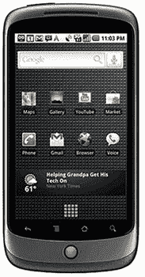

图 1.1 HTC 的谷歌 Nexus One。

N1 由谷歌直接出售，出售时没有上锁——许多分析师认为，此举是对运营商锁定模式的直接挑战，在这种模式下，客户必须签署两年协议才能获得该设备的折扣。N1 也可以通过 T-Mobile 以低价获得，前提是用户签署延长合同。最终，N1 的销量并不是压倒性的，有人猜测谷歌在实施中失败了([图 1.1](#F0010) )。

然而，当时谷歌也试图证明他们认为安卓手机应该如何发布和维护。令很多人惊讶的是，一年后谷歌发布了三星生产的 Nexus S，如图[图 1.2](#F0015) 所示。Nexus S 的一个有趣的特性是，它运行在安卓 2.3 上，允许本地拨打网络电话。如果一个设备有数据连接，无论是[Wi-Fi.com](http://Wi-Fi.com)还是其他网络，那么它可以使用任何数量的流行网络电话服务发送和接收电话。在美国，手机仅通过百思买商店销售，服务通过 T-Mobile 提供([图 1.2](#F0015) )。

图 1.2 三星的谷歌 Nexus S。

目前还不清楚谷歌 Nexus 系列智能手机的总体目标是什么。然而，很明显，他们打算发布谷歌手机，并最终可能为消费者购买和使用智能手机提供新的灵活性。

## Linux、开源软件和取证

开源软件对数字取证学科产生了巨大的影响。作为免费开源软件发布的取证工具比闭源解决方案有着巨大的优势，包括:

审查源代码和理解所采取的确切步骤的能力

改进软件和与整个社区共享增强功能的能力

价格

虽然许多免费的开源软件包不提供商业支持模式，但一些公司专门提供支持。例如，红帽已经建立了一个为 Linux 操作系统提供支持和服务的重要业务。此外，许多免费开源软件包的维护者通常非常容易访问，对查询的响应也很快，并且在直接维护软件时，通常能够提供更好的支持。

自由开源软件最重要的例子是 Linux 操作系统。Linux 不仅是安卓的关键组件，也可以作为一个强大的取证工具。

### Linux 简史

已经有很多关于 Linux 的书了，仅仅用一个章节来描述如此重要的操作系统是很困难的。还有许多关于 Linux 的精彩在线资源，其中一些侧重于 Linux 作为取证工具。

1991 年，莱纳斯·托瓦尔兹是赫尔辛基大学的一名学生，当时他决定开发一个终端仿真器，可以用来连接该大学的系统。该代码是专门为他的计算机开发的，该计算机采用了英特尔 386 处理器。在他完成了最初的开发后，他意识到代码实际上可以形成操作系统的基础，他在 Usenet 新闻组 comp.os.minix ( [Torvalds，1991](#BIB25) )上发布了以下著名消息:

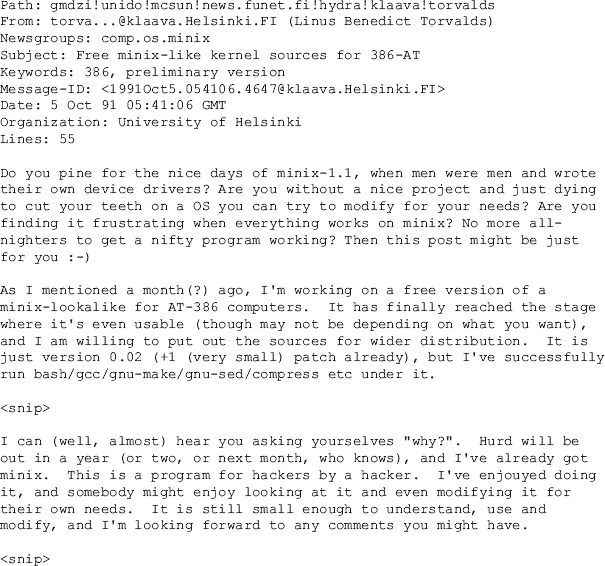

阅读这篇文章，许多狂热的 Linux 用户的心态被捕获在理解、修改、创建和以其他方式修补复杂系统的欲望中(通常被称为黑客心态)。Linus 发布的新闻组是针对 Minix 操作系统的，这在当时是许多想要测试和开发类似 Unix 操作系统的人的首选操作系统。然而，Linus 想要克服 Minix 的许可限制和技术限制。

在近 20 年的时间里，Linux 已经非常成熟，并在许多个人电脑、服务器以及现在的移动设备上使用。对于许多编程语言来说，确实有成千上万种强大的工具以及完整的开发环境。有许多发行版专注于不同的需求，包括服务器、工作站、笔记本电脑、嵌入式设备、安全套件等等。

#### 在 VirtualBox 中安装 Linux

Linux 是一个真正令人惊叹的操作系统，我们将在本书中使用它的力量，以供读者理解和完成。本书中的所有示例都是在作为虚拟机运行的 Ubuntu 10.10 64 位桌面安装上执行的。虽然多家供应商的虚拟机软件是兼容的(包括运行在 Mac OS X 上的 VMWare Fusion)，但本书重点介绍了免费、开放或两者兼而有之的选项。在这种情况下，VirtualBox 既是开源软件，也是免费提供的。

注意

这款 Ubuntu 虚拟机将在本书的所有示例中广泛使用。后续章节将通过添加更多的工具和脚本在此基础上进行构建。我们鼓励读者创建这个 Ubuntu 虚拟机，并遵循所有示例来最大化知识。Ubuntu 虚拟机可以直接用于安卓取证案例。

VirtualBox 现在归 Oracle 所有，并以 GPLv2 许可证分发。甲骨文网站上有一个部分解决了有关许可的常见问题。

你可以从[http://www.virtualbox.org/](http://www.virtualbox.org/)下载很多操作系统的 VirtualBox，包括微软 Windows、Mac OS X 和 Linux (2.4 和 2.6)。安装 VirtualBox 后，您将看到 Oracle 虚拟机 VirtualBox 管理器，如图[图 1.3](#F0020) 所示，您可以在其中创建和管理新的虚拟机。

图 1.3 操作系统 X 的甲骨文虚拟机虚拟箱管理器

创建新虚拟机时，请确保您有足够的硬盘空间(建议至少 20 GB)和尽可能多的可用内存。对于安卓版本，谷歌建议至少 1536 MB (1.5 GB) ( [获取安卓源代码，n.d.](#BIB15) )。

使用 VirtualBox Manager 图形用户界面(GUI)来设置新的虚拟机非常简单。但是，如果您可以访问 Ubuntu Linux 64 位工作站或服务器，但不具备运行桌面应用程序的能力，则可以按照以下步骤设置、配置和运行新的虚拟机(VirtualBox 3.2.10)。

在 ssh 会话中，最好使用程序“屏蔽”，这样，如果您失去了与服务器的连接，您的虚拟机将保持活动状态。然后，按照以下步骤操作:

此时，虚拟机将启动，您可以使用任何远程桌面协议(RDP)查看器访问安装，例如 Windows 上的远程桌面连接、Linux 上的 rdesktop 或微软的 Mac 远程桌面连接客户端。要访问上述会话，您需要连接到<host server="" ip:3392="">。从那里，按照安装，直到它是时候重新启动。</host>

如果关闭或重新启动，VBoxHeadless 会话将结束；您可以简单地再次发出命令来启动服务器备份。然后，RDP 回到机器上，安装 openssh 服务器，这样我们就可以使用 ssh 代替效率较低的 RDP:

现在，您可以通过运行 ifconfig 并查看 eth0 的“inet addr”来找到虚拟机的 IP 地址。你可以使用你最喜欢的 ssh 程序(如果在 Windows 上，试试 Putty，这是一个很棒的免费客户端)和 ssh 进入虚拟机。

##### 侦探工具包

布莱恩·开利有一个优秀的开源法医工具包，叫做侦探工具包(TSK)，这将在本节中讨论。贯穿本书的例子将广泛利用 TSK。Brian 开发并继续维护 TSK，为我们的行业提供了巨大的服务。如果不熟悉 TSK，可以访问[http://sleuthkit.org/](http://sleuthkit.org/)的网站，考虑使用程序。TSK 的网站上有相当多的信息，还有很多法医博客和书籍。如果您打算遵循本书中的示例，您应该使用以下命令在 Linux 工作站上安装 TSK:

希望其他人能跟随布莱恩的脚步，为法医社区提供如此重要的工具包和服务。

#### 禁用自动装载

至关重要的是，法医工作站没有启用自动装载，顾名思义，当在连接的设备上发现文件系统时，自动装载将自动装载该文件系统。在 Ubuntu 中禁用自动挂载的选项是针对每个用户的，因此如果工作站有多个用户帐户，请确保您更改了每个帐户:

然后导航到应用> nautilus >首选项，确保“media_automount”和“media_automount_open”选项未选中，如图[图 1.4](#F0025) 所示。

图 1.4 禁用 Ubuntu 上的自动挂载。

然后，您可以关闭 Gnome 配置编辑器。现在，自动装载被禁用。对于典型用户来说，这是更多的工作。然而，对于法医分析师来说，这是绝对必要的(硬件写阻止程序的使用也是如此)。

#### Linux 和取证—基本命令

在我们设置和配置 Linux 取证工作站之前，概述一下 Linux 与取证的相关性是很有帮助的。由于对许多文件系统的广泛支持、可用的高级工具以及开发和编译源代码的能力，Linux 工作站是法医调查的强大工具。然而，由于许多考官不熟悉 Linux，下面几节提供了一些更常见的 Linux 命令的细分，包括命令的描述、它的一般用法，以及如何应用命令的一个或多个示例。

#### 男人

“man”命令在终端窗口中调出所请求命令的在线手册。手册将提供命令及其用法的详细描述(包括该命令的所有选项或“标志”)。

在下面的示例中，第一个命令列出了“mount”命令的手册页的开头，而第二个命令搜索所有包含字符“grep”的手册，这是一个强大的搜索工具。

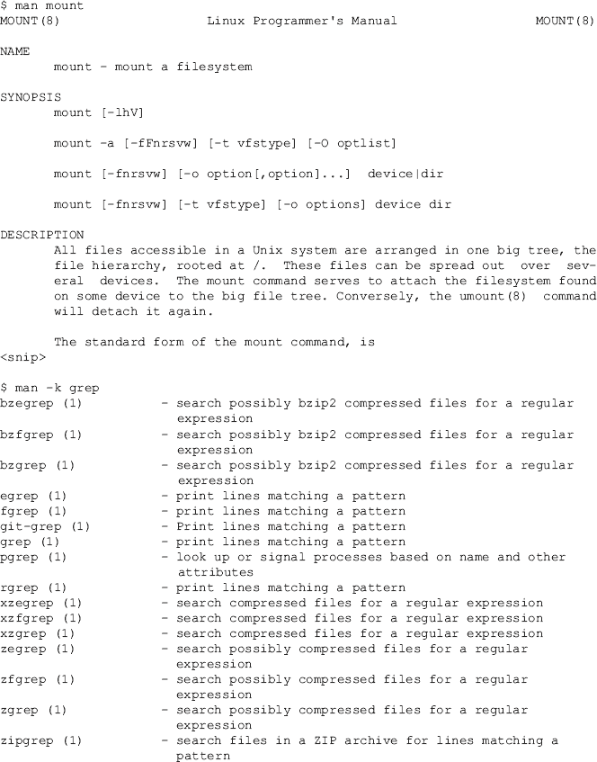

#### 帮助

“help”命令显示所请求命令的信息，包括用法和示例，类似于“man”一些命令使用- help 符号，而另一些命令只使用-h 或-help。

#### 激光唱片

此命令用于切换到另一个目录。在 Linux 中，特殊字符~用于表示当前用户的主目录。例如，用户 a hog 在/home/a hog 的 Linux 系统上有一个主目录。从文件系统的任何地方，你都可以使用~来引用/home/ahoog。这对于文档来说很有效，所以在本书中，我们参考了~并且，即使您已经设置了不同的用户名，该命令仍将按预期运行。

#### mkdir

除非另外指定，否则“mkdir”命令会在当前位置创建一个目录。

#### rmdir/rm

此命令根据指定的标志删除现有目录或文件。“rmdir”命令将只删除空文件夹。如果目录中有文件，首先需要在运行“rmdir”命令之前删除这些文件。“rm”命令可用于删除文件和文件夹，并在删除前提示用户。您可以使用-f 选项覆盖提示，但要谨慎使用，因此出现了短语“rm 减 rf”或 rm -rf。

#### 毫微；纤（10 的负九次方）

“nano”是一个基于终端的编辑器，允许创建和修改文本文件。要创建文件，只需键入命令。

键入“nano”将打开终端窗口或 ssh 会话内的文本编辑器，允许用户输入自己想要的内容，如图[图 1.5](#F0030) 所示。

图 1.5 使用“nano”创建文件

输入文本后，按下控制按钮 X 将退出文本编辑器，并提示您保存文件。在这种情况下，我们将文件名设置为 newfile.txt。

要修改现有文件，只需使用文件名或完整路径和文件名(如果文件位于不同的目录中)执行 nano 命令:

#### 限位开关（Limit Switch）

该命令列出文件和文件夹。没有指定任何选项的" ls "命令将只列出当前目录中的文件/文件夹名称。添加“-LH”选项将提供一个更详细的长列表，包括权限、所有权、大小以及日期和时间戳。

#### 树

“tree”命令显示指定目录的文件夹层次结构。如果没有指定参数，将使用当前目录。在 Linux 中，当前目录被称为“单一目录”而一个目录向上是双句点“..”。在下面的输出中，使用了当前目录，它恰好是当前用户的主目录。用户可以用“-L”标志指定他们希望查看多少目录级别。在第一个示例中，显示了一个级别。而在第二个示例中，显示了两个级别的源目录和文件。别忘了:你可以通过查看手册页(手册树)或指定命令的帮助参数(树-帮助)来了解命令的所有细节。

#### 较少的

“less”命令一次一页地显示指定的文件。该命令通常与其他命令结合使用，一次显示一页输出。以下命令将在终端窗口中一次一个屏幕地显示 sanitize-csv.sh 文件的内容。一旦使用了不太实用的工具，有几个关键命令需要记住:

h:访问帮助菜单

问:退出帮助菜单

空格键:向下显示一屏/一页

b:显示一屏/向上一页

/:搜索模式

回车:下移一行

y:上移一行

这个强大的实用程序有更多的命令和技巧，所以请阅读帮助屏幕、手册页或简单地在互联网上搜索更多有用的提示。

#### 猫

“cat”命令将文件内容输出到屏幕或新文件(如果指定的话)(不保留文件格式)。

该命令也可用于将多个文件组合成一个文件(即，通常称为串联文件)。

#### 发现

“find”命令用于在目录层次结构中搜索文件。以下命令将列出指定用户主目录中包含的所有文件，包括完整路径。

find 命令的输出也可以用在另一个命令中。例如，下面将对来自“find”命令的文件运行“md5sum”命令。指定了几个参数:

查找:命令

∞:在当前用户的主目录中查找文件

-键入 f:仅列出常规文件(不列出目录)

-exec:运行以下命令

sha256sum:计算文件 sha256 哈希的实用程序

{ } \；:疯狂的 shell 转义和符号！

如果针对大量文件的结果运行命令，可能会遇到问题。在这种情况下，您应该研究将文件命令的输出传送到一个名为 xargs 的实用程序。

对于大多数 Linux 命令，您还可以将命令的输出保存到文件中。例如，上面同一命令的输出可以保存在用户主目录中一个名为 md5.txt 的文件中:

针对 sha256sum 实用程序运行的 find 命令的输出被重定向到用户主目录中的 sha256sum.txt 文件。

#### chmod

“更改模式”的缩写，此命令更改文件或文件夹权限。以下列表中提供了许多示例。请注意，这些命令必须在存储“textfile.txt”的目录中运行，或者必须提供文件的完整路径。

“chmod”命令也可以在一组文件或一个文件夹上运行。

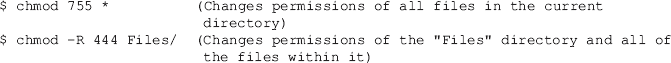

#### 呵呵

“chown”命令更改指定文件或目录的所有者或组。在下面的示例中，“textfile.txt”的原始所有者和组是一个日志。chown 命令将所有者更改为“root”。该命令需要“sudo”。

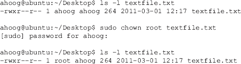

#### sudo

在任何命令前面加上“sudo”会给用户提升权限，允许他们以超级用户或其他用户的身份运行命令。Sudo 需要运行某些命令，如 apt-get(安装软件)、chown(如果您不是所有者，则更改所有权)、mount、访问原始磁盘设备以及许多其他命令，具体取决于它必须访问的文件。要使用 sudo，只需在命令前面加上“sudo”，它会提示您输入密码。然后在 sudo 日志中记录命令:

#### 容易得到

apt-get 命令的“apt”部分代表高级打包工具，允许用户安装和卸载软件，升级现有软件，甚至执行系统更新。要运行此命令，需要 sudo 权限。

#### 可做文件内的字符串查找

“grep”命令在文件或文件和文件夹列表中搜索指定的短语。这相当于打开一个文档，对某个短语进行“查找”。搜索区分大小写，因此如果您不确定字母是大写还是小写，那么您应该指定“-i”(不区分大小写)标志。此选项将花费更长时间，具体取决于正在搜索的文件的大小。

一般用法是:

下面包含几个“grep”用法的例子。

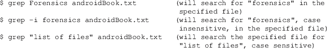

下一个命令在用户桌面上的所有文件内容中搜索“不必要”这个词结果显示，在“textfile.txt”中找到了这个词，在“WXP-PRO-OEM.iso”中也有与这个词匹配的词。因为这是一个二进制文件，所以需要执行进一步的技术来使内容可见。

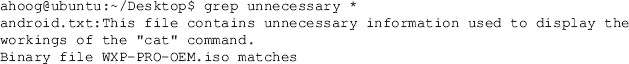

随着您更广泛地使用 Linux 进行法医调查，grep 将成为不可或缺的实用程序。

#### 管道和重定向文件(|和>)

管道字符“|”(位于大多数键盘上的“回车”键上方)允许将一个命令的输出发送到另一个命令进行进一步处理。也可以使用“>”将输出重定向到另一个文件中。

以下命令获取“cat file.txt”的结果，并将其传送到“less”命令，允许用户一次查看一页的内容。

下一个命令使用 grep 命令在“ch1.xml”中搜索“android”，然后获取搜索结果并执行另一个搜索，不区分大小写，用于“取证”。最后的结果通过管道传输到“更少”的地方，一次显示一页。

重定向命令的输出也很有帮助。以下命令获取“book.txt”的输出(使用“cat”命令)，并将输出复制到用户桌面上名为“newdocument.txt”的文件中。

在特定文件甚至整个磁盘映像上运行“strings”命令时，重定向非常有用，这将在[第 7 章](7.html)中进一步探讨。

## 安卓开源项目

安卓背后的开放策略自然导致了 2008 年 10 月 21 日通过 AOSP 发布安卓源代码。网站声明([获取安卓源代码，n.d.](#BIB15) ):

我们创建安卓是为了回应我们自己推出移动应用的经历。我们希望确保始终有一个开放的平台可供运营商、原始设备制造商和开发人员使用，以实现他们的创新想法。我们希望确保没有失败的中心点，一个行业参与者可以限制或控制任何其他人的创新。我们选择的解决方案是一个开放和开源的平台。

发展战略侧重于旗舰设备(例如，Nexus 系列)，这使得谷歌能够通过新平台吸收大部分风险。然后，制造商可以在他们的设备上使用最新版本的安卓，而 AOSP 则开发下一个主要版本。

### AOSP 执照

AOSP 由两个主要软件许可证管理，即 Apache 软件许可证 2.0 (Apache 2.0 或 ASL2.0)和 GNU 公共许可证 v2 (GPLv2)。GPLv2 是一个限制性更强的许可证，它强制贡献者在同一许可证下分发他们的所有源代码。谷歌认为这将限制安卓的商业支持，因此 GPLv2 主要涵盖了仅在安卓上使用 Linux 内核。

然而，Apache 2.0 许可证更被商业实体接受，因为它的限制性更小，并且不会强制公司开放其所有相关软件的源代码。AOSP 解决了他们为什么选择 Apache 2.0 许可证的问题:

我们有时会被问到为什么 Apache 软件许可证 2.0 是 Android 的首选许可证。对于用户空间(即非内核)软件，我们实际上更喜欢 ASL2.0(以及类似的许可证，如 BSD、MIT 等。)超过 LGPL 等其他牌照。

安卓关乎自由和选择。安卓的目的是促进移动世界的开放性，但我们认为不可能预测或支配人们想要将我们的软件用于的所有用途。因此，虽然我们鼓励每个人制造开放和可修改的设备，但我们不认为强迫他们这样做是我们的职责。使用 LGPL 图书馆通常会迫使他们这样做。

以下是我们关注的一些具体问题:

1\. LGPL(简单来说)要求:将来源运送到应用程序；来源的书面报价；或者动态链接 LGPL 图书馆，并允许用户手动升级或更换图书馆。由于安卓软件通常以静态系统映像的形式发货，遵守这些要求最终会限制原始设备制造商的设计。(例如，用户很难替换只读闪存上的库。)

2\. LGPL 要求允许客户修改和反向工程来调试这些修改。大多数设备制造商不希望受到这些条款的约束，因此为了尽量减少这些公司的负担，我们尽量减少用户空间中 LGPL 软件的使用。

3.历史上，LGPL 图书馆一直是下游设备制造商和应用程序开发人员大量合规问题的源头。不幸的是，在这些问题上教育工程师既困难又缓慢。设备制造商尽可能容易地遵守许可证，这对安卓的成功至关重要。鉴于过去遵守 LGPL 的困难，如果我们能够避免的话，最好不要使用 LGPL 图书馆。

上面讨论的问题是我们选择 ASL2.0 作为我们自己的代码的原因。它们不是对 LGPL 或其他执照的批评。我们确实对这个话题有强烈的感觉，甚至到了我们已经竭尽全力确保尽可能多的代码是 ASL2.0 的地步。然而，我们热爱所有免费和开源的许可证，并尊重他人的意见和偏好。我们只是认定 ASL2.0 是实现我们目标的正确许可。

### 显色法

AOSP 是一个非常复杂的开源项目，需要世界各地许多开发者的协调。因此，AOSP 有一套明确的角色和流程，必须遵循这些角色和流程才能为项目做出贡献。这些角色包括:

贡献者/开发者:向项目贡献代码的个人和公司

验证者:测试代码变更的个人

批准人:有经验的开发人员，他们决定变更是包括在内还是排除在外

项目负责人:通常是谷歌员工，负责 AOSP 项目的整体管理

任何人都可以下载、编译和增强 AOSP 项目。[图 1.6](#F0035) 说明了开发过程。

图 1.6 AOSP 发展历程。

### 开源在取证中的价值

没有多少法医检验师会或需要直接为 AOSP 做出贡献。然而，下载软件有巨大的价值。例如，当检查来自安卓 1.5 设备的另一个闪存文件系统(YAFFS2)物理映像时，当使用字符串提取 ASCII 文本时，短语“愚蠢的旧名称”经常出现。对于大多数文件系统，审查员不得不简单地猜测“愚蠢的旧名字”的相关性。然而，通过下载源代码，审查员可以快速搜索短语，识别代码，并检查它以获得更多信息。在这种情况下，当 YAFFS2 对象(例如文件)的对象头被更新时，在某些情况下，名称字段被设置为“愚蠢的旧名称”。

从文件内核/fs/yaffs2/yaffs_guts.c 中的 AOSP，有一个名为 yaffs_UpdateObjectHeader 的函数。代码和函数头中的注释为:

创建了一个名为“旧名称”的变量，其内容为“愚蠢的旧名称”:

并且当先前的“ChunkId”大于 0 时，被更新的对象头的名称字段被设置为“旧名称”:

代码还检查对函数的原始调用是否传入了对象的新名称。如果没有为函数提供新的名称值，则使用旧名称(仍然是“愚蠢的旧名称”)的值:

虽然不是每个考官都乐于解释程序员的代码(在本例中为 C)，但显然这些信息在法医检查中可能会有用。当然，还有很多其他的情况，比如短信是如何打上时间戳的，或者地理标签是如何实现的，这些都会给考试带来巨大的价值。

### 下载和编译 AOSP

希望参考安卓源代码的价值已经在前面的 YAFFS2 例子中得到证明。下一节重点介绍了从 AOSP 下载和编译最新版本时应遵循的步骤。虽然安卓 2.2 和更早的版本将在 32 位机器上编译，但 AOSP 的最新版本(安卓 2.3)和更早的版本需要 64 位计算机。

使用我们之前构建的 Ubuntu VM，我们现在可以开始更新库存 Ubuntu 安装，然后从源代码构建 Android。

恭喜你，你已经从源代码中构建了安卓系统(或者开始构建——这需要一段时间)。

现在，如果你遇到一个你需要更好理解的安卓方面，你可以搜索源代码，了解更多。[表 1.5](#T0030) 绘制了核心安卓项目，你会发现大致映射到安卓源树中的目录。项目信息可在位于[https://sites.google.com/a/android.com/opensource/projects](https://sites.google.com/a/android.com/opensource/projects)的 AOSP 网站上找到，该网站简要描述了每个项目的功能。

表 1.5 安卓核心项目

| 项目 | 描述 |
| --- | --- |
| 仿生学的 | 运行时:libc、libm、libdl、动态链接器 |
| 引导加载程序/传统 | 引导加载程序参考代码 |
| 建设 | 构建系统 |
| 达尔维克 | Dalvik 虚拟机 |
| 发展 | 高级开发和调试工具 |
| 框架/基础 | 核心安卓应用框架库 |
| 框架/政策/基础 | 框架配置策略 |
| 硬件/libhardware | 硬件抽象库 |
| 硬件/ril | 无线电接口层 |
| 核心 | Linux 内核 |
| 预建的 | 支持 Linux 和 Mac 操作系统构建的二进制文件 |
| 恢复 | 系统恢复环境 |
| 系统/蓝牙 | 蓝牙工具 |
| systemcare | 最小可引导环境 |
| 系统/附加功能 | 低级调试/检查工具 |
| 系统/无线局域网/ti | TI 1251 无线局域网驱动程序和工具 |

## 国际化

安卓平台广泛支持国际语言和地区。这不仅允许手机以多种语言显示菜单、网站和图形用户界面的其他方面，还支持多种国际键盘格式的输入。

### 统一码

安卓支持多种语言的关键是能够用 Unicode 编码和解码字符，Unicode 是支持 600 多种语言的行业标准编码方案([语言和脚本，n.d.](#BIB19) )。

小费

### 楔形支撑

对于那些好奇和喜欢冒险的读者来说，Unicode 确实支持楔形文字，尽管我们仍然在等待有人在苏美尔-阿卡德楔形文字中实现安卓用户界面。Unicode 支持的语言和脚本的完整列表可在[http://Unicode . org/repo/cldr-tmp/trunk/diff/supplicate/languages _ and _ scripts . html](http://unicode.org/repos/cldr-tmp/trunk/diff/supplemental/languages_and_scripts.html)上查看

### 键盘

安卓支持许多不同类型的键盘，有时被称为输入法。比如运行安卓虚拟设备(AVD)时，模拟器允许你更改键盘输入的语言，如图[图 1.7](#F0040) 所示。

图 1.7 带中文数字键盘的 Android 虚拟设备。

处理各种语言的能力只是简单地内置在 AVD 系统中。这在法医调查中有着重要的意义，在法医调查中，分析师必须保持警惕，并考虑到一些数据可能会以一种意想不到的语言编码。

ADV 的相同功能也可以在物理安卓设备上使用。例如，在威瑞森无线在美国发行的 HTC 不可思议上，有一个设置叫做语言和键盘。您可以为手机用户界面选择两种语言:英语和西班牙语。然后，在文本设置下，您可以选择您的触摸输入设置。从这里，您可以指定键盘类型(QWERTY、电话键盘或紧凑型 QWERTY)，从 20 多个国际键盘中进行选择，中文文本输入(繁体或简体中文)的特定选项，以及许多其他选项。最新版本的安卓(姜饼，2.3)现在支持 57 种语言([安卓 2.3 平台，n.d.](#BIB8) )。

最后，安卓支持用户可以安装的第三方键盘。另一种越来越受欢迎的键盘叫做 Swype，它允许用户用手指在键盘上连续拖动每个字母。该软件然后能够确定，很大概率，你在打什么字。该软件支持多种语言，是一个可插拔键盘输入的好例子。

### 自定义分支

由于安卓是作为开源发布的，任何人(包括你在遵循以上步骤后！)可以下载然后定制安卓源代码。虽然许多从事这项工作的人最终将他们的更改发布回谷歌，以纳入安卓系统，但有些人完全将代码分支，并发布自己的安卓版本。

#### 售后固件

定制安卓分支(也称为 Mods、固件和 ROMs)最丰富的例子可能来自安卓黑客和发烧友社区。该社区是一个非常大和多样化的个人群体，他们被激励去开发、实验和黑客入侵安卓系统。他们的一些工作可能涉及获得安卓设备的根权限，启用新功能，或者只是吹嘘他们的最新定制。这个社区热情洋溢，内容丰富，是一个极好的信息来源(也有错误信息)，他们会对许多求助做出回应。认真的安卓研究人员如果忽视这个社区，将是失职。然而，庞大的信息量使得这是一项非常耗时的工作。

最受欢迎的社区之一被称为 XDA 开发者，自称是“安卓和视窗移动平台智能手机爱好者和开发者的最大互联网社区”( [xda-developers，n.d.](#BIB26) )。他们的网站拥有超过 320 万注册用户，并经营着一个真正令人印象深刻的论坛。

许多定制的 mod 在 XDA 发布，通常开发者自己也活跃在社区中。也许最受欢迎的售后固件是氰根莫德。该固件基于 AOSP。它增加了新的功能，并试图在供应商和运营商直接发布的基于安卓的只读存储器上提高设备的性能和可靠性。目前，CyanogenMod 支持来自六家制造商的 17 种不同的智能手机和平板设备:Commitva、戴尔、宏达电、摩托罗拉、三星和 Viewsonic。这些售后固件在设备上启用了根访问，正如我们将在[第 6 章](6.html)中讨论的，根访问是获得设备物理获取的关键。

#### 听听操作系统

开放式手机操作系统(OPhone OS)基于安卓系统，由中国软件开发商 Borqs 开发。OPhone OS 是为中国政府拥有的中国移动设计的，中国移动是世界上最大的移动运营商，拥有超过 5 亿用户。2010 年 6 月，OPhone OS 2.0 在北京发布，虽然 Borqs/OPhone OS 在中国之外相对不为人知，但它们显然在安卓生态系统中扮演着重要且日益增长的角色。在中国国内，博格斯首席执行官表示，他们只与一家运营商中国移动合作，因为在该国“你不能为两个主人服务”(中国的 OPhone，n.d. )。

所以，他们为自己的中国移动软件保留了 OPhone OS 这个名字。然而，根据他们的网站，他们还开发了安卓软件的另一个分支，他们称之为安卓+ ( [中国的 OPhone，n.d.](#BIB10) )。在他们的新闻稿中，Borqs 解释说，戴尔 Aero 配备了他们的安卓+软件，包括苹果式的用户界面，他们的软件也由戴尔在巴西和墨西哥分发。

#### iPhone 上的安卓(以及其他非安卓设备)

或许最具争议的售后市场固件之一是支持安卓在 iPhone 上运行的固件。由于许多移动设备基于 ARM 处理器，移植过程是可以实现的。这使得安卓可以在运行其他操作系统的设备上运行，如视窗移动、塞班、iOS 等。没有什么比向苹果粉丝展示你运行安卓系统的漂亮 iPhone 更好的了！

## 安卓市场

安卓市场是第三方开发者向任何拥有安卓设备的人发布应用的渠道。安卓市场最早于 2008 年 8 月 28 日在谷歌开发者博客上宣布为“一个开放的内容分发系统，将帮助最终用户在他们的安卓设备上找到、购买、下载和安装各种类型的内容”([安卓开发者博客，t 2 特区)。当市场在 2008 年 10 月首次发布时，它不支持付费应用。然而，到 2009 年初，安卓市场在美国和英国都支持付费应用。截至 2011 年 1 月，安卓市场在 29 个国家支持付费应用(](#BIB3)[支持地点，T4 特区)。其他几个国家，尤其是印度，可以使用安卓市场，但目前无法安装付费应用。](#BIB24)

谷歌管理安卓市场的轻松方式与苹果对其应用商店的严格管理形成了鲜明对比。虽然安卓市场确实有面向用户的服务条款(安卓市场条款，编号为“T1”)和面向开发者的安卓市场开发者分销协议(T2 安卓市场开发者，编号为“T3”)，但应用发布到市场时并没有经过批准程序。相反，谷歌认为，应用评级将剔除有问题或没有什么价值的应用。

要将一款应用发布到安卓市场，开发者必须注册，支付 25 美元的费用，并使用能够在市场上唯一识别他们的私钥签署他们的应用。当用户购买一个应用程序时，开发者会收到购买价格的 70%，剩下的 30%归谷歌(有时也包括相关的运营商)。最初，用户有一个 48 小时的时间窗口可以返回应用程序。然而，2010 年 12 月，谷歌将该窗口缩短至 15 分钟。

谷歌不仅能够从安卓市场远程移除应用，还能直接从安卓设备移除应用。远程应用程序删除功能是安卓拥有的一项安全控制，可以以快速且可扩展的方式将危险的应用程序从活动循环中删除，以防止进一步暴露给用户([安卓开发者博客:锻炼，未注明](#BIB4))。安全控制最早是在 2010 年 6 月实施的，当时一名安全研究人员发布了一个概念验证应用程序，该应用程序允许其在设备上下载并安装另一个应用程序(北卡罗来纳州[米尔斯](#BIB21))。

本着安卓的开放精神，谷歌也不排除用户从开发者网站直接在手机上安装应用，也不排除开发竞争性的应用市场。安卓市场有几种选择，相比之下大多数都很小。此外，包括亚马逊、百思买和威瑞森在内的几家大公司已经宣布或表明了创建替代应用商店的意图。

### 安装应用程序

要从安卓市场安装应用，如图[图 1.8](#F0045) 所示，用户必须首先运行市场应用，并使用 Gmail 帐户登录。该账户允许用户通过谷歌结账账户购买付费应用，并提供地址和信用卡信息。最近，谷歌与一些运营商合作，因此可以购买一个应用程序，并将其放在用户每月的无线运营商账单上，而不是谷歌结账信用卡上。

图 1.8 运行安卓 2.2 的宏达不可思议上的安卓市场。

市场应用程序允许用户搜索应用程序，并根据主题或受欢迎程度进行浏览。选择应用程序后，将显示一个专用的应用程序页面，用户可以从中安装该应用程序。专用页面还提供一般信息，如描述、下载次数、平均评分、详细评论、相关应用程序、开发人员信息，最后还有机会提供反馈或标记应用程序不合适。

正如我们将要讨论的，权限是安卓安全的核心组件。一旦用户决定安装一个应用程序，他们会看到一个屏幕，显示一个应用程序正在请求的所有权限，如图 1.9 所示。此时，用户可以接受权限并继续安装或返回上一屏幕。

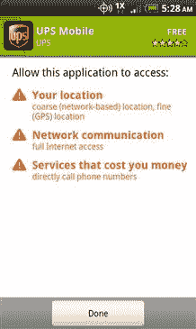

图 1.9 安卓应用权限。

然后下载并安装该应用程序，结果显示在设备顶部的通知栏中。从那里，用户可以运行应用程序或随时从应用程序列表中访问它。

要删除应用程序，用户可以访问设备的设置并选择应用程序设置。从那里，他们可以管理应用程序(见[图 1.10](#F0055) )，其中显示了下载、运行和在 SD 卡上等各种特性的应用程序列表。

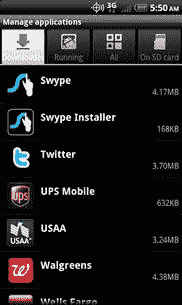

图 1.10 管理应用程序。

通过选择一个应用程序，用户可以看到应用程序信息屏幕，其中显示了关于应用程序的各种信息，并允许用户选项强制停止、清除数据、清除缓存和卸载，如图[图 1.11](#F0060) 。

图 1.11 应用程序信息，包括卸载。

### 应用统计

安卓市场增长迅速。发布 6 个月后，T-Mobile 首席技术官科尔·布罗曼评论称，用户需要更多过滤器才能从市场上近 2300 个应用中成功定位应用。截至 2011 年 1 月，市场上已有超过 20 万个应用程序，仅 2010 年 11 月就增加了 27227 个应用程序(T2 安卓市场统计，未注明“T3”)。估计下载的应用数量超过 25 亿。

显然，应用程序是安全和取证的关键关注领域。在[第 4 章](4.html)中，我们将详细探讨应用程序如何将数据保存到安卓设备上，存储了哪些类型的信息，以及如何恢复和分析数据。

## 安卓取证

显然，需要安卓取证。一般来说，智能手机可能是最了解个人的电子设备。对于大多数人来说，他们的智能手机在任何时候都很少离他们超过几英尺——包括睡觉的时候。该设备融合了个人和公司信息，能够存储大量数据，包括短信、电子邮件、全球定位系统位置、图片、视频等。人们倾向于比任何其他人或设备更诚实地使用他们的智能手机。为什么呢？因为人们觉得设备是安全的，可以为他们提供问题的答案，他们可能会选择不与任何人分享。不止一位法医曾调侃道，“你就是你的谷歌”，这显然是直接看到人们使用智能手机时的诚实的副产品。

### 挑战

当然，没有什么值得做的事情是容易的，尤其是移动取证和安卓取证都有许多必须克服的挑战。

数字取证的一个基本目标是防止审查员对目标设备进行任何修改。然而，手机缺乏传统的硬盘，可以关机，连接到写拦截器，并以合法的方式成像。与智能手机的任何交互都会在某种程度上改变设备。因此，检查人员在检查移动设备时必须使用他们的判断，如果设备被修改，他们必须解释它是如何被修改的，以及——同样重要的是——为什么要做出这样的选择。

一些法医对这种方法持反对意见，并引发了争论。然而，可能改变用于法医检查的计算机的技术已经使用了一段时间。例如，在调查恶意软件攻击时，经常需要进行实时内存分析。同样，如果硬盘被加密，检查人员必须在设备仍在运行时对其进行成像，否则他们将面临无法访问硬盘上数据的风险。其他好的例子是由于复杂的环境而必须保持在线的系统，通常在涉及大型公司服务器的情况下可以找到。虽然每个审查员都应该努力不改变他们正在调查的设备，但在移动世界中这是很少可能的。因此，如果设备无法修改，那么唯一的其他选择就是不检查设备。显然，这种选择是不可接受的，因为来自移动取证的证据是许多调查的关键组成部分，甚至已经解决了许多犯罪。

让安卓取证更加复杂的是设备、安卓版本和应用程序的多样性。仅设备和安卓版本的排列就有数千个，每个设备加平台都有独特的特点。虽然对每部安卓手机的逻辑分析都是可以实现的，但庞大的组合使得对每部安卓设备的完全物理获取很可能无法实现。在高风险的情况下，即使是安卓版本中的微小差异也可能需要大量的测试和验证。

## 摘要

安卓是一个快速发展、功能丰富、令人兴奋的移动平台。功能、连接性和受欢迎程度的结合自然会导致对安卓取证的需求不断增长。虽然移动取证的难度在增加，但价值也在增加。安卓的开源方面极大地有助于法医分析师所需的 基本理解，使安卓成为一个理想的工作平台。

## 参考

1.联盟，食品和药物管理局。*开放手机联盟*。检索时间 2011 年 1 月 3 日，[http://www.openhandsetalliance.com/oha_faq.html](http://www.openhandsetalliance.com/oha_faq.html)。

2.联盟成员。(未注明日期)。*开放手机联盟*。检索时间 2011 年 3 月 9 日，[http://www.openhandsetalliance.com/oha_members.html](http://www.openhandsetalliance.com/oha_members.html)。

3.*安卓开发者博客:安卓市场:用户驱动的内容分发系统*。(未注明日期)。检索于 2011 年 1 月 9 日，[http://Android-developers . blogspot . com/2008/08/Android-market-user-driven-content . html](http://android-developers.blogspot.com/2008/08/android-market-user-driven-content.html)。

4.*安卓开发者博客:锻炼我们的远程应用移除功能*。(未注明日期)。检索日期:2011-01-09，摘自[http://Android-developers . blogspot . com/2010/06/acting-我们的-远程-应用. html](http://android-developers.blogspot.com/2010/06/exercising-our-remote-application.html) 。

5.*安卓市场开发者分销协议*。(未注明日期)。检索时间 2011 年 1 月 9 日，摘自[http://www . Android . com/us/developer-distribution-agreement . html](http://www.android.com/us/developer-distribution-agreement.html)。

6.*安卓市场服务条款*。(未注明日期)。检索时间 2011 年 1 月 9 日，[http://www.google.com/mobile/android/market-tos.html](http://www.google.com/mobile/android/market-tos.html)。

7.*安卓市场统计来自安卓库、安卓库、安卓应用和游戏目录*。(未注明日期)。检索时间 2011 年 1 月 9 日，[http://www.androlib.com/appstats.aspx](http://www.androlib.com/appstats.aspx)。

8.安卓 2.3 平台&安卓开发者。(未注明日期)。检索时间:2011 年 1 月 8 日，来自[http://developer.android.com/sdk/android-2.3.html#locs](http://developer.android.com/sdk/android-2.3.html%23locs)。

9.博尔特市。*安卓现已开源*。安卓开源项目。2011 年 1 月 3 日检索自[https://sites . Google . com/a/Android . com/open source/post/open source](https://sites.google.com/a/android.com/opensource/posts/opensource)。

10.*中国的 OPhone 以安卓* +，找到了通往美国的路。(未注明日期)。检索时间 2011 年 1 月 8 日，[http://www.borqs.com/news.jsp](http://www.borqs.com/news.jsp)。

11.*公司信息:关于*。(未注明日期)。谷歌。检索时间 2011 年 1 月 4 日，[http://www.google.com/corporate/](http://www.google.com/corporate/)。

12. *comScore 报告 2010 年 11 月美国移动用户市场份额*。(未注明日期)。comScore.Inc .检索自[2011 年 1 月 9 日。](http://www.comscore.com/Press_Events/Press_Releases/2011/1/comScore_Reports_November)

13.*氰根 Mod，关于 Rom，氰根 Mod* 。(未注明日期)。检索时间 2011 年 1 月 8 日，[http://www.cyanogenmod.com/about](http://www.cyanogenmod.com/about)。

14. *Gartner 表示，2010 年第三季度全球手机销量增长了 35%；智能手机销量增长 96%*。(北美)技术研究&商业领袖洞察。Gartner Inc .于 2011 年 3 月 9 日从[http://www.gartner.com/it/page.jsp?检索到 id = 1466313](http://http://www.gartner.com/it/page.jsp?id = 1466313) 。

15.*获取安卓源代码，安卓开源*。(未注明日期)。检索时间 2011 年 3 月 9 日，[http://source.android.com/source/download.html](http://source.android.com/source/download.html)。

16.*谷歌投资者:谷歌安卓每日激活 35 万台设备(数据可视化视频)“全球顶级智能手机平台。”*(未注明日期)。2011 年 3 月 9 日检索自[http://googinvestor . blogspot . com/2011/03/Google-Android-activations-35 万-daily.html](http://googinvestor.blogspot.com/2011/03/google-android-activations-350k-daily.html) 。

17.Krazit(未注明日期)。*谷歌的鲁宾:安卓“一场革命。”数字媒体网新闻。科技新闻——CNET 新闻*。检索时间 2011 年 1 月 5 日，[http://news.cnet.com/8301-1023_3-10245994-93.html](http://news.cnet.com/8301-1023_3-10245994-93.html)。

18.执照。(未注明日期)。*安卓开源*。检索时间 2011 年 1 月 5 日，[http://source.android.com/source/licenses.html](http://source.android.com/source/licenses.html)。

19.语言和文字。(未注明日期)。 *Unicode 联盟*。[http://unicode . org/repos/cldr-tmp/trunk/diff/sublimited/languages _ and _ scripts . html](http://unicode.org/repos/cldr-tmp/trunk/diff/supplemental/languages_and_scripts.html)。

20.南卡罗来纳州劳森。*T-Mobile 表示，安卓市场需要更多的滤镜*。IT 世界、IT 新闻、技术分析和操作方法资源。检索于 2011 年 1 月 9 日，来自[http://www . it world . com/personal-tech/64481/Android-market-needs-more-filters-t-mobile-say](http://www.itworld.com/personal-tech/64481/android-market-needs-more-filters-t-mobile-says)。

21.伊利诺伊州米尔斯。*谷歌远程清除安卓手机上的应用程序*。不安全情结——CNET 新闻。技术新闻——CNET 新闻。检索时间 2011 年 1 月 9 日，[http://news.cnet.com/8301-27080_3-20008922-245.html](http://news.cnet.com/8301-27080_3-20008922-245.html)。

22.*谷歌官方博客:我的 Gphone 呢？*(未注明日期)。检索于 2011 年 1 月 2 日，来自[。](http://googleblog.blogspot.com/2007/11/wheres-my-gphone.html)

23.*商家支持的位置–安卓市场帮助*。(未注明日期)。检索时间:2011 年 1 月 9 日，来自[http://www.google.com/support/androidmarket/bin/answer.py?hl](http://www.google.com/support/androidmarket/bin/answer.py%3Fhl) = en &答案= 150324。

24.托瓦尔兹，洛杉矶(1991 年，10 月 5 日)。*为 386-AT–comp . OS . minix*免费提供类似 minix 的内核资源。谷歌集团。检索于 2011 年 3 月 3 日，[http://groups . Google . com/group/comp . OS . minix/msg/2194d 253268 b0a1b](http://groups.google.com/group/comp.os.minix/msg/2194d253268b0a1b)。

25.xda-开发者。(未注明日期)。检索时间:2011 年 1 月 8 日，来自[www.xda-developers.com/](http://www.xda-developers.com/)。