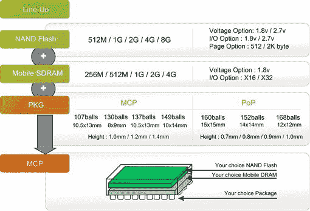
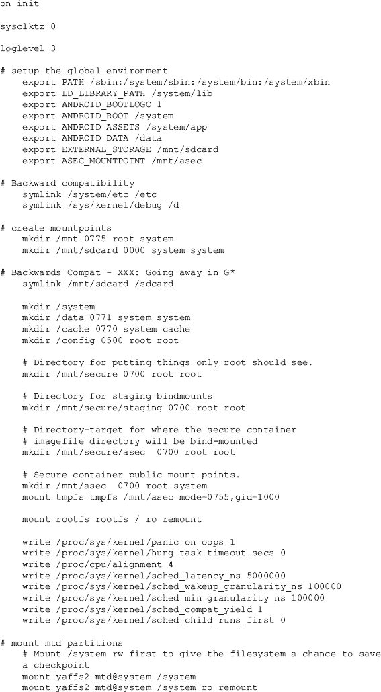
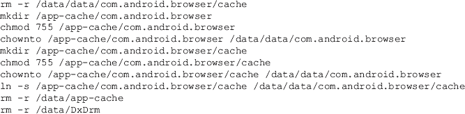
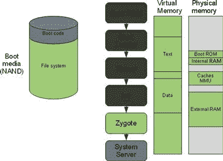
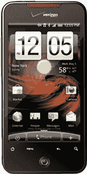

# 二、安卓硬件平台

### 本章中的信息

[核心部件概述](#S0015)

[不同设备类型概述](#S0085)

[只读存储器和引导加载器](#S0125)

[制造商](#S0160)

[特定设备](#S0180)

## 介绍

安卓被设计成与各种硬件兼容。这在很大程度上是通过 Linux 内核实现的，多年来，Linux 内核已经发展到支持各种各样的硬件。这是该平台的一个重要特征，因为它允许制造商自由设计、采购或以其他方式集成安卓设备的理想组件。这一战略导致开发了强大的双核安卓设备，能够进行大量处理，以及针对入门级无线计划的入门级设备。尽管硬件兼容性对制造商、无线提供商和最终消费者来说非常好，但这种多样性给法医分析师和安全工程师带来了挑战。了解安卓的硬件组件、设备类型和引导过程将有助于您全面了解安卓。

## 核心组件概述

Android 的开发是为了支持各种各样的设备和制造商。因此，任何主要组件的列表一旦打印出来就可能会过时。但是在安卓设备中发现了一些一致的组件，有利于讨论。以下组件构成了安卓设备的核心。

### 中央处理机

中央处理器(CPU)是大多数法医分析师相当熟悉的一个术语，它在 Android 设备上的作用并不令人惊讶。中央处理器负责执行操作系统(OS)和应用程序代码，并协调或控制其他核心组件，包括网络、存储、显示器和输入设备。

从一开始，大多数(如果不是所有的话)安卓设备都使用 ARM 处理器作为其 CPU，这对于移动平台来说足够强大，但设计用于低功耗——这是最大限度延长电池寿命的一个关键方面。

然而，企业和爱好者都将安卓移植到了其他平台。在企业方面，英特尔已经将安卓移植到他们的凌动处理器上。同样，谷歌也在他们的谷歌电视产品中移植了安卓系统，该产品建立在安卓系统之上。也有项目，比如安卓-x86 ( [安卓-x86，n.d](#BIB1) 。)，它们已经发布了运行在英特尔 x86 架构上的安卓移植版本。一些受支持的平台包括许多 Eee 个人电脑型号和联想 ThinkPad x61 平板电脑。

### 基带调制解调器/无线电

基带调制解调器和无线电是硬件和软件系统，为安卓设备提供与蜂窝网络的连接。这允许来自设备的语音和数据通信。

设备设计人员通常会利用一个专用组件来管理蜂窝通信的复杂性，而不是用这些活动来占据主 CPU。因此，尽管中央处理器可以指导设备的整体活动，但基带调制解调器管理蜂窝通信。

在本书中，我们将交替使用术语*基带*、*基带调制解调器*和*无线电*。虽然这些系统很复杂，并且在这个定义中可能会忽略某些细微差别，但是这些区别对于法医分析人员来说并不重要。

### 存储器(随机存取存储器和与非门闪存)

安卓设备，因为在某种程度上只是计算机，需要各种类型的内存来操作。所需的两种主要类型的存储器是易失性(随机存取存储器)和非易失性(NAND 闪存)。

系统使用内存来加载、执行和操作操作系统、应用程序或数据的关键部分。随机存取存储器是易失性的，这意味着它不能在没有电源的情况下保持其状态。

然而，与非门闪存(我们将该存储器简称为与非门闪存)是非易失性的，因此，数据在设备断电后仍会保留。NAND 闪存用于存储引导加载程序、操作系统和用户数据。因此，它是任何取证调查的关键组件，类似于笔记本电脑、台式机或服务器取证调查中的硬盘。NAND 闪存还具有独特的属性，使其成为移动设备的理想选择，同时也给程序员带来了许多挑战(这通常会给法医分析师带来独特的机会)。这些特征将在[第 4 章](4.html)中详细探讨。

从硬件角度来看，移动设备显然有很大的空间限制。通常，随机存取存储器和与非闪存被制造成称为多芯片封装的简单组件。在检查安卓设备组件时，通常 NAND 闪存和 RAM 会打包为一个 MCP。

虽然[图 2.1](#F0010) 特定于内存制造商海力士(用于戴尔 Streak 和其他安卓设备)，但这种整体架构很好地描述了 MCP 组件，不仅包括 NAND 闪存和 RAM，还包括适合各种设备的封装选项。

图 2.1 微通道板架构([移动内存，未注明](#BIB8))。

### 全球定位系统

自从蜂窝通信被纳入以来，移动设备中最重要的创新之一无疑是将全球定位系统(GPS)集成到核心产品中。该功能不仅可以使用全球定位系统卫星网络识别设备的位置，还可以用于点对点方向、位置感知应用等应用，毫无疑问，还可以用于未来更多有趣的用途。

### 无线([Wi-Fi.com](http://Wi-Fi.com)和蓝牙)

除了蜂窝网络之外，大多数设备还支持其他无线技术，例如用于高速数据连接的[Wi-Fi.com](http://Wi-Fi.com)，以及用于连接耳机、键盘、打印机等外部设备的蓝牙。事实上，一些设备可能会省略蜂窝网络连接，这不仅降低了设备的成本和复杂性，还消除了消费者每月的重复费用。这些设备可以设计为仅用于家庭使用(例如，家用电话或多媒体设备)，或者在[Wi-Fi.com](http://Wi-Fi.com)连接不可用时用于离线模式(即，平板电脑或电子阅读器)。

### 安全数字卡

大多数安卓设备都附带一张可移动存储卡，称为安全数字卡。像设备上的 NAND 闪存一样，SD 卡是非易失性的，也使用 NAND 闪存技术。然而，因为 SD 卡被设计成便携式的，所以它们必须遵守各种物理和通信规范，以允许它们与大多数设备互操作。

SD 卡是大多数安卓设备和流行的苹果 iPhone 之间一个明显的设计差异。iPhone 的设计是搭载 4GB 到 32GB 的 NAND 闪存，不提供 SD 卡。虽然更贵，但这为设备制造商(在本例中是苹果)提供了对设备的更多控制。在安卓的情况下，更大的用户文件打算存储在 SD 卡上。这不仅为消费者提供了更便宜且易于升级的内存选项，而且还具有便携性，因此如果消费者购买了新手机，他们可以使用现有的 SD 卡轻松传输数据。

最近的宏达电手机(尤其是宏达不可思议)提供了标准的 SD 卡接口，但没有安装 SD 卡。相反，他们通过雕刻一部分板载与非门存储器并将其呈现为 SD 卡来创建模拟 SD 卡。这给法医分析师增加了额外的复杂性。分析师必须首先确定是否有 SD 卡、模拟 SD 卡或其他用户数据存储方式(除了板载 NAND 闪存)。

### 屏幕

安卓设备上的屏幕显然是一个关键组件。它是用户交互的主要界面，不仅通过视觉显示，而且通过响应用户的触摸。显示器背后的技术是激烈开发的焦点。早期的迭代包括一个液晶显示器和检测用户在屏幕上输入的第二层。最近的改进包括更高的显示分辨率、更亮的屏幕、更灵敏和复杂的用户触摸交互以及更低的功耗。事实上，最近的一些安卓智能手机，比如那些使用三星 Super AMOLED 技术的智能手机，很大程度上由于屏幕功能而受到消费者的欢迎。

### 照相机

最初，智能手机上的摄像头被用来拍照。虽然这在当时是一个令人兴奋的发展，但在这个领域也有重大的创新。大多数设备现在也支持视频录制(有些是高清的)。当然，相机的质量有所提高，现在通常包括集成闪光灯。

最近，一些设备包括两个摄像头。第一个位于设备背面，用于外部图片和视频。第二个前置摄像头支持视频会议等新应用。

大多数安卓设备还结合了摄像头功能和全球定位系统；因此，您不仅可以记录图片的日期和时间，还可以记录全球定位系统坐标。然后，您可以使用网络轻松上传或共享图片，或者通过蜂窝电话提供商的多媒体消息服务发送图片。

这个领域一个有趣的发展是使用摄像头读取条形码。专门的应用程序利用摄像头拍摄条形码，然后分析数据。它可能会查找产品评论，确定最佳价格，或者自动将您登记到餐厅的应用程序中，以便您对体验进行评分。也许在未来，这些应用甚至可以让你为你想购买的物品付费。

这方面的一个早期实现是一个名为 Goggles 的谷歌应用。用户可以给任何东西拍照，应用程序会尝试识别对象。谷歌提供的一个有趣的例子是，游客使用该应用程序来识别他们正在参观的地标。

### 键盘

你可能会认为键盘几乎没有创新的可能；然而，情况肯定不是这样。得益于触摸屏技术，大多数安卓设备都配备了屏幕键盘。许多设备也有基于硬件的键盘。

强大的软件键盘可以适应屏幕方向(即如果您将屏幕旋转 90 度，键盘也会旋转)，并且可以支持多种语言。

也有公司正在开发更有效的方法来将文本输入设备。Swype Inc .就是这样一家公司，它开发了一种键盘，用户不需要为每个字母选择单独的键。相反，对于每个单词，他们只需从第一个字母开始，然后用手指在键盘上滑动(不拿起)到后面的每个字母，直到完成。然后，Swype 键盘确定可能的单词并完成它(或提供建议)。事实证明，这种方法相当成功，我们预计将看到更多的 Swype 技术(或类似的创新)集成到安卓键盘中。

### 电池

电池寿命一直是智能手机用户关注的主要问题。你可能喜欢你的手机，但讨厌它的电池寿命。越多的人使用这款设备——以及使它如此强大的组件——消耗的电池就越多。在最小化功耗方面非常小心。然而，大多数人发现他们必须每天给手机充电。

随着时间的推移，硬件、软件和电池技术的改进可能会降低充电频率。在这一领域有一些有趣的研究计划，比如在没有电线的情况下给手机充电，利用人体的运动进行持续充电，或者简单地制造更强大的电池。无论有什么改进，都会受到消费者的欢迎。

对于法医分析师来说，有一点要记住，那就是 SD 卡通常位于电池后面。因此，要访问 SD 卡(并确定确切的设备类型和标识)，您通常必须卸下电池(从而关闭设备电源)。这里有各种各样的考虑，我们将在[第 6 章](6.html)中讨论。

### 通用串行总线

大多数安卓设备支持几个通用串行总线接口，可以从计算机访问。设备之间的电缆可能会有所不同，但总的来说，通用串行总线接口允许大多数现代操作系统连接到设备。以下是安卓设备公开的一些常见界面:

1.仅充电:设备可以通过 USB 线充电

2.磁盘接口:设备的一部分，包括 SD 卡、仿真 SD 卡和其他磁盘接口，作为大容量存储设备呈现给操作系统并可供其访问

3.特定于供应商的接口:这些接口包括定制的同步协议、用于软件安装的模拟光盘只读存储器(ROM)驱动器，以及用于共享手机互联网连接的专用连接

4.安卓调试桥(ADB):一个为用户提供设备外壳提示和其他高级功能的界面

在[第 3 章](3.html)中，我们将探讨磁盘接口和 ADB 接口，这两个都是安卓设备取证调查中的关键组件。

### 加速度计/陀螺仪

安卓可以根据设备如何握持或旋转来检测和改变用户界面。这通常通过加速度计来实现，该加速度计检测设备被加速(或定位)的大小和方向。通常，这用于在横向和纵向之间更改显示。

最新版本的安卓(截至本文撰写时为 2.3)现在支持陀螺仪，它比加速度计更灵敏、更复杂。陀螺仪是更灵敏、更精确的设备运动测量工具，是高级游戏开发的关键。

### 扬声器/麦克风

最后，没有听觉或发声能力的智能手机或平板电脑就没那么有趣了。像其他组件一样，扬声器和麦克风随着每次迭代不断成熟。例如，一些安卓设备包含两个或三个麦克风，结合安卓软件，能够检测和消除背景噪音，以提供更好的音质。也许在这十年中最令人惊叹的技术发展中，扬声器电话已经发展到可以实际用于真实对话的地步！

## 不同设备类型概述

通过这些核心组件，设计人员创造了各种各样的设备类型。早在 2008 年 10 月，T-Mobile G1 (HTC Dream 100)刚刚发布，跟踪安卓设备和类型相当容易。这只是 G1。唯一的设备类型是智能手机。当然，已经有关于新设备类型的博客文章飞来飞去，但那都是猜测。

然而，到 2010 年底，不仅安卓设备的数量大幅增长，而且设备的类型也大幅增加。有很多网站试图追踪安卓设备；然而，大多数都是不完整的。在准备检查新的安卓设备时，一个不错的参考是[PDAdb.net](http://PDAdb.net)，它跟踪关于当前和未来设备的重要信息。目前，他们正在追踪 300 多台运行安卓系统的设备，你可以从他们的掌上电脑主页(“T2”主页，北卡罗来纳州)搜索到这些设备。

主要的设备类型仍然是智能手机和平板电脑，但是越来越多的超便携电脑(我们称之为上网本)和电子阅读器。在创新方面，谷歌电视设备(运行安卓)开始冲击市场，少数媒体播放器存在，多家汽车公司宣布将运行安卓作为其媒体和导航系统的一部分。最后，有一整组属于“其他”类别，它们可能仍然是一次性设备，或者肯定会成为主流。例子包括电器、游戏设备、全球定位系统接收器、家用电话和音频设备、相框和打印机。以下部分详细介绍了其中一些设备类型。

### 智能手机

智能手机是最受欢迎的安卓设备。它们包含上述几乎所有的成分，通常是最广为人知的。截至 2010 年 10 月，安卓设备占美国智能手机市场的 22%([n . d .](#BIB9)Nielsen Wire)，并且增长迅速。人们普遍认为，安卓将超越 iPhone，或许最终将成为最受欢迎的智能手机平台。

### 药片

尽管平板电脑已经存在了几十年，但硬件、软件、移动网络和应用程序的融合似乎最终会产生一个可行的市场。市场上有很多安卓平板电脑。然而，最新和最广为人知的设备是三星 Galaxy Tab。这款 7 英寸设备基本上拥有安卓智能手机的所有组件，但外形更大。尽管平板电脑可能支持蜂窝数据连接(如 Galaxy Tab)，但它们通常仅限于数据和短消息服务/彩信，不支持蜂窝语音通话。然而，随着语音和数据的融合，我们预计平板设备将很快支持互联网协议语音电话和视频通话。

### 上网本

上网本是一种高便携、低功耗的笔记本电脑，是安卓的好选择。需要注意的是，Android 与另一个名为 Chromium OS 的谷歌项目不同，该项目“是一个开源项目，旨在构建一个操作系统，为大部分时间都在网络上的人提供快速、简单、更安全的计算体验”( [Chromium OS，n.d.](#BIB3) )。安卓是最早开发的，比 Chromium OS 成熟得多。

除了上网本有完整的硬件键盘和通常更大的铰链屏幕之外，现在可以买到的许多安卓上网本都有平板电脑的共同特征。通常，上网本的主要数据存储介质是 NAND 闪存。然而，不能使用更传统的硬盘驱动器没有技术上的原因。

### 谷歌电视

像过去的许多公司一样，谷歌正试图弥合观看广播电视和互联网内容之间的差距。这些设备从内置安卓系统的全电视机，到连接现有电视的机顶盒。但关键是利用安卓作为基础操作系统，整合互联网和电视节目，并为开发者提供一个框架来创建针对新媒体的新应用。

### 车辆(车载)

一个令人兴奋的领域是将安卓设备集成到汽车中，通常作为导航/抬头显示或娱乐系统的一部分。到目前为止，这种系统是每个车辆制造商特有的，这导致系统在功能、稳定性和有效性方面有很大的不同。如果制造商集成了不断发展的安卓操作系统的全部功能，这将使他们能够专注于用户体验，而不是基本的构建模块。用户会发现不同车辆之间以及与安卓设备之间的一致性。开发人员可以针对车辆需求的特定应用，并拥有更广泛的分销市场。最后，可能还有许多其他感兴趣的参与者，如保险机构、律师、研究机构、法医分析师等，他们可以用多种方式分析来自这些系统的信息。

第一辆运行安卓系统的量产车是上海汽车工业公司在中国研发和销售的荣威 350。此外，许多美国汽车制造商已经宣布支持安卓系统，从与智能手机的连接，到将安卓操作系统完全集成到他们的汽车中。

### 全球定位系统

如前所述，大多数安卓设备的硬件中都内置了全球定位系统。当全球定位系统首次向消费者提供时，制造商创建了定制的操作系统来管理他们的设备。尽管大多数人仍在利用他们的定制系统，但也有一些人已经转向安卓操作系统。因此，法医分析师可能会遇到运行安卓系统的专用全球定位系统设备。

### 其他设备

越来越多的新安卓设备一旦被提及就会彻底过时。安卓对制造商来说太好了，不能错过。操作系统是免费的、成熟的，并且允许专有开发。它还为应用程序开发提供了一种机制，无论是内部开发还是通过第三方开发。因此，许多制造商放弃了昂贵的操作系统开发、维护和支持，而是在安卓系统的基础上进行构建。以下是其他安卓设备类型的一些示例:

洗衣机和微波炉等家用电器

电子阅读器，如巴恩斯和诺博的 Nook

媒体播放器

复印机等办公设备

家用电话、音频和视频(如相框)设备

专用游戏设备

打印机

正如你所知，制造商有许多方法可以利用安卓，这肯定会让法医分析师的工作保持有趣(就好像它还没有)。

## 只读存储器和引导加载程序

安卓设备和任何其他计算机一样，有一个相当标准的引导过程，允许设备将所需的固件、操作系统和用户数据加载到内存中，以支持完全操作。虽然引导过程本身定义良好，但固件和只读存储器因制造商和设备而异。本节的目标是提供安卓引导过程的高级概述，因为本书后面提到的技术将在不同级别与设备交互。这是一个高层次的概述，因为对安卓或 Linux 启动过程的深入描述很容易需要整本书。

本节中的大部分信息基于一篇名为“安卓开机启动过程”的帖子，作者是埃内亚安卓能力中心的 Mattias bjrnheden([n . d . bjrnheden](#BIB2))。在这篇文章中，马蒂亚斯指出了安卓启动过程的七个关键步骤:

1.开机并执行片内引导 ROM 代码

2.引导加载程序

3.Linux 内核

4.初始化过程

5.合子和达尔维克

6.系统服务器

7.启动完成

我们将详细研究这些步骤。

### 开机和片内引导只读存储器代码执行

当安卓设备第一次开机时，会执行与中央处理器配对的特殊引导只读存储器代码，以(1)初始化设备硬件和(2)定位引导介质。只读存储器代码特定于设备使用的中央处理器。引导过程中的这一步类似于用于引导计算机的基本输入输出系统。

例如，硬件黑客社区流行的一款 CPU 是德州仪器 OMAP3530 ARM 兼容 CPU，它有一个 3444 页的*技术参考手册*公开提供([omap 35xx 公开版，2010](#BIB10) )。虽然阅读技术手册并不适合所有人，但它提供了关于中央处理器如何初始化和加载操作系统的大量细节和见解。在第 3373 页，手册提供了详细说明整个引导顺序的流程图。启动整个过程的只读存储器代码被硬编码在地址 0x00014000，这样当设备通电时，中央处理器就能准确地知道引导只读存储器的位置，从而开始引导序列。

一旦设备硬件初始化，只读存储器代码就会扫描，直到找到引导介质(安卓设备存储在与非门闪存上)，并将初始引导加载程序复制到内部随机存取存储器。然后执行从引导 rom 跳转到 RAM 中新加载的代码，如图[图 2.2](#F0015) 所示。

图 2.2 开机和片内引导只读存储器代码。

### 引导加载程序(初始程序加载/第二程序加载程序)

现在从引导介质复制的引导加载程序在内部内存中执行。这一步类似于引导计算机(如 Windows、Mac 和 Linux)时找到的引导加载程序。一个典型的计算机引导加载程序，如用于 Linux 的 GRUB，允许用户选择他们想要引导的操作系统并相应地加载它。

对于安卓设备，引导加载器有两个不同的阶段:初始程序加载(IPL)和第二个程序加载器(SPL)。IPL 负责检测和设置外部 RAM，这是启动和操作设备所需的基本组件。准备好外部内存后，IPL 会将 SPL 拷贝到内存中，然后将执行转移到 SPL。

SPL 不仅负责加载安卓操作系统，还提供对其他引导模式的访问，如快速引导、恢复或其他旨在更新、调试或维护设备的模式。SPL 一般由制造商提供。然而，安卓社区积极创建他们自己的 spl(和其他定制图像)，以实现额外的特性和功能。在典型的引导场景中，SPL 将初始化硬件组件，如时钟、控制台、显示器、键盘和基带调制解调器，以及文件系统、虚拟内存和操作设备所需的其他功能。

然后，SPL 在引导介质上定位 Linux 内核，将其复制到内存，加载引导参数，最后将执行转移到内核。[图 2.3](#F0020) 说明了这个过程。

图 2.3 引导加载程序。

### Linux 内核

在 Linux 内核上已经写了很多卷，并且大部分都可以在线获得。对于这本书，我们只是承认 Linux 内核现在正在控制设备。在设备上设置附加功能后，从 NAND 闪存中读取根文件系统，这将提供对系统和用户数据的访问，如[图 2.4](#F0025) 所示。

图 2.4 Linux 内核。

### 初始化过程

一旦内核可以访问系统分区，它就可以处理启动关键系统和用户进程的初始化脚本。这类似于在传统 Linux 设备上找到的/etc/init.d 脚本。对于 Android，init.rc 通常位于根文件系统上，并为内核提供如何启动核心服务的详细信息。

在运行 Android 2.2 的 HTC 上，init.rc 和 init.inc.rc 文件包含 650 多行，提供了对设备设置的深入了解。/init.rc 文件的选定部分如下:

从取证的角度来看，HTC 不可思议改变了引导过程完成后浏览器存储缓存的方式。/bootcomplete.inc.rc 的内容很能说明问题:

如您所见，一旦设备完成引导过程，浏览器缓存将从存储在 NAND 闪存上的用户数据分区移动到位于/app-cache 的临时 RAM 磁盘(tmpfs)中。这意味着当设备断电时，写入/app-cache 的任何数据都将丢失，如图 2.5 所示。

图 2.5 初始化过程。

总之，init.rc 是安卓设备设置中的一个基本步骤，可以仔细研究以了解特定安卓设备是如何配置和运行的。

### 合子和达尔维克

在[第 3 章](3.html)中，我们将介绍每个用户应用程序作为运行时沙箱提供的单个虚拟机的细节。达尔维克虚拟机是谷歌为创建这个应用程序沙箱而选择的技术。启动时，合子序列基本上建立了 Java 运行时环境，并向系统注册了一个套接字；因此，需要初始化的新应用程序可以请求一个新的 Dalvik 虚拟机。没有合子服务，安卓内核可以运行。但是，没有任何应用程序会运行，包括内置应用程序，如电话、浏览器和其他核心功能，如[图 2.6](#F0035) 所示。

图 2.6 合子和达尔维克。

### 系统服务器

上一节提到的设备的核心功能是由系统服务器启动的。一旦设置了 Java 运行时，并且合子进程正在侦听，系统服务器就会启动。它运行核心功能，如电话、网络和设备及其他应用程序所依赖的其他基本组件。[图 2.7](#F0040) 说明系统服务器如何运行。

图 2.7 系统服务器。

系统最终会发送一个名为 ACTION_BOOT_COMPLETED 的标准广播操作，该操作会提醒相关进程启动过程已经完成。安卓系统现已全面运行，并准备好与用户互动。

## 制造商

谷歌的安卓战略催生了一个多样化的安卓设备制造商群体。在安卓开发者网站上，维护着一个 USB 供应商 id 列表，目前跟踪 15 家制造商([使用硬件设备，未注明](#BIB11))。该清单包括以下内容:

• 钢

• 戴尔

富士康

嘉明-华硕

高温超导

华为

京瓷

LG

摩托罗拉

英伟达

□t0〔拖鞋〕

三星

锋利

锋利

中兴通讯

然而，一旦你考虑到上面没有列出的制造商和计划阶段的设备，就有 50 多个不同的安卓设备制造商。

当然，这对法医调查员和公司安全经理来说都是一个独特的挑战。设备制造商、设备类型和设备的庞大数量导致了一系列复杂的政策、程序、技术，甚至 USB 电缆。

## 安卓更新

安卓的更新模式是分散的，设备特定的，由运营商或设备制造商负责，而不是谷歌。尽管主要受谷歌影响的开放手机联盟负责维护核心安卓操作系统，但他们并不对特定设备行使控制权。这种分散的方法在几个方面影响了设备的取证和安全程序。

首先，分析师永远无法确定设备将安装什么版本的安卓系统。这在一定程度上是由企业追求尽可能高的利润率所驱动的。值得注意的是，在美国，如果消费者购买了一台两年合同的安卓设备，运营商实际上已经锁定了消费者，因为提前终止费在不断上涨。由于用户不太可能升级他们的服务或购买新手机，它们代表了运营商的固定收入。升级现有安卓设备的工程、开发、部署和支持成本相当高。因此，运营商可以投资新的安卓设备，这将产生巨大的兴趣和可能的销售额，也可以维护现有的设备，这几乎不会带来额外的收入。通常情况下，使用旧安卓手机的消费者会继续使用旧的、功能较弱、安全性较低的安卓版本。这是谷歌已经承认的问题，并表示他们正在努力解决。

其次，保护和获取安卓设备的取证图像在安卓版本和设备类型之间有很大差异。例如，分析师将用于运行安卓 1.5 内核 2.6.30.4 或更早版本的 HTC Dream 100 (T-Mobile G1)的技术与运行安卓 1.6 或内核大于 2.6.30.4 的相同设备有很大不同。你可以想象，有 50 多家制造商，300 多台安卓设备，四个主要版本和数百个次要版本，可能的组合是巨大的。

第三，用于连接不同安卓设备的硬件、驱动程序和软件可能会有所不同。在[第 3 章](3.html)中讨论的安卓软件开发工具包(SDK)确实提供了一些一致性。但是，每个制造商可能都有自己的一套特定驱动程序和软件。例如，如果将三星 Galaxy S 连接到运行 Windows 的计算机，则需要首先安装三星提供的特定软件。然而，许多其他设备都有谷歌通过其软件开发工具包提供的标准通用串行总线驱动程序。

最后，每个制造商都有自己的引导过程，包括硬件、引导加载程序和只读存储器固件。在[第 6 章](6.html)中，我们将探讨各种制造商在设备上利用引导过程的一些技术。

### 自定义用户界面

安卓的部分内容是根据 Apache 2.0 开源许可的，而不是完整的 GPLv2 开源许可。Apache 2.0 许可证允许制造商和开发人员定制安卓系统的某些部分，但解除了他们将源代码返还给社区的义务。Apache 2.0 许可证主要涵盖设备的特定驱动程序，在这些驱动程序中，制造商的知识产权可能会受到损害，并且在用户界面定制领域也是如此。

通过允许专有用户界面，谷歌允许制造商为目标受众量身定制一个关键领域，并将他们的安卓设备与竞争对手区分开来。例如，一款安卓设备可能面向青少年市场，专注于短信和社交应用，而另一款设备可能主要面向商业用户。从根本上说，这些设备的工作原理非常相似。然而，用户界面定制(以及硬件设计实现)创造了独特的体验。[表 2.1](#T0010) 描述了厂商定制的用户界面。

表 2.1 定制安卓用户界面

| 制造商 | 自定义用户界面 |
| --- | --- |
| 摩托罗拉 | 摩托车手 |
| 常简称为 HTC 或宏达电 | 感觉 |
| 三星电子 | 触地得分 |
| 索尼爱立信 | 莱克斯·UX·雷切尔 |
| 宏基电脑公司 | 触摸 3D |
| （里面或周围有树的）小山谷 | 阶段 |
| Viewsonic | TapTap 网站 |

### 售后安卓设备

由于安卓操作系统是开源的，已经创建了定制版本，这些版本将在最初与其他操作系统一起发布到市场上的设备上运行。在一个臭名昭著的例子中，存在可以在 iPhone 上安装和运行的 Android 版本(iPhone 上的 [Linux，n.d.](#BIB6) )。当这样的壮举完成时，看着苹果粉丝们的反应当然很有趣。更实际的是，安卓已经被移植到许多最初搭载视窗手机的宏达电手机上。此外，还有很多例子涉及诺基亚等公司的设备，甚至智能手机以外类别的设备。

虽然这种情况可能不会经常发生，但重要的是要考虑到你需要法医分析的 Windows 手机(或 iPhone)可能确实在运行 Android。

## 特定设备

本书通篇使用了以下设备，此处提供了每个设备的简要概述，以供参考。其中一些设备是首批商用安卓智能手机中的一部分，人们对此非常了解。它们可以以相当合理的价格购买，并且可能是一个很好的设备来填充和实验本书中的例子。

### G1 移动电话公司

[图 2.8](#F0045) 所示的 T-Mobile G1 由 HTC 制造，于 2008 年 10 月由 T-Mobile 发布到美国市场。像许多第一代设备一样，手机也存在可用性问题。然而，它在头六个月就卖出了 100 多万部(新泽西州克拉兹特)，是一部很好的参考手机。

图 2.8t-移动 G1 (DREA100)。

设备信息:

制造商:宏达电

车型:G1(又名:HTC 梦想 100)

承运人:T-Mobile

发布日期:2008 年 10 月

### 摩托罗拉 Droid

[图 2.9](#F0050) 所示的摩托罗拉 Droid 由摩托罗拉制造，2009 年 11 月由威瑞森发布到美国市场。在最初的 74 天里，售出了 105 万部 Droid 智能手机，这使得它比 2007 年 6 月发布的最初的 iPhone([第 74 天销售，北卡罗来纳州](#BIB4))更受欢迎。Droid 是一款优秀的参考手机，如果你打算购买一款设备进行测试，你应该强烈考虑这款设备。

图 2.9 摩托罗拉 Droid (A855)。

设备信息:

制造商:摩托罗拉移动设备

车型:A855

运营商:威瑞森无线

发布日期:2009 年 11 月

### 难以置信

HTC 不可思议，如图[图 2.10](#F0055) 发布在威瑞森网络上，在美国也非常受欢迎。该设备在本书中被广泛用作参考电话。

图 2.10 宏达不可思议。

设备信息:

制造商:宏达电

型号:ADR6300

运营商:威瑞森无线

发布日期:2010 年 4 月

### 谷歌 Nexus One

如[第一章](1.html)所述，谷歌在 2010 年 1 月发布了自己的智能手机 Nexus One (N1)，如图[图 2.11](#F0060) 所示。N1 是由宏达电开发的，从各方面来看，它是制造商开发手机的理想模式。这款处理器速度极快(1 GHz)，运行的是最新版本的安卓系统，并且它有一些创新，比如三个麦克风，可以测量背景噪音并融合你的声音，创造出最清晰的对话。

图 2.11 谷歌 Nexus One (N1)。

设备信息:

制造商:宏达电

车型:宏达激情

运营商:T-Mobile、威瑞森、沃达丰

发布日期:2010 年 1 月

## 摘要

尽管设备组件各不相同，但大多数设备都有几个共同的核心组件。在许多情况下，对这些组件的基本了解，以及对各种设备类型的了解，对于法医分析师来说就足够了。然而，很明显，在调查中还有许多其他不同的因素需要考虑。引导过程的高级概述为更深入地讨论这些过程提供了基础，这将被进一步探讨。最后，对制造商和设备的概述提供了对分析师需要考虑的各种因素的洞察。安卓市场是分裂和多样化的，法医分析师需要记住，在调查安卓设备时，“一刀切”的策略是行不通的。

## 参考

1.*安卓-x86——将安卓移植到 x86* 。(未注明日期)。检索时间 2011 年 3 月 9 日，[http://www.android-x86.org/](http://www.android-x86.org/)。

2.Bjo rnheden(博士)。 *Enea 安卓博客:安卓开机过程从*开始。检索时间:2010-12-17，摘自[http://www . androidenea . com/2009/06/Android-bootprocession-from-power-on . html](http://www.androidenea.com/2009/06/android-bootprocess-from-power-on.html)。

3.*铬操作系统——铬项目*。(未注明日期)。检索时间 2010 年 12 月 13 日，[http://www.chromium.org/chromium-os](http://www.chromium.org/chromium-os)。

4.*第 74 天销量:苹果 iPhone vs 谷歌 Nexus One vs 摩托罗拉 Droid* 。(未注明日期)。疾风博客——移动应用分析 iPhone 分析安卓分析。检索于 2010 年 12 月 18 日，来自[。](http://blog.flurry.com/bid/31410/Day-74-Sales-Apple-iPhone-vs-Google-Nexus-One-vs-Motorola-Droid)

5.Krazit(未注明日期)。 *T-Mobile 已售出 100 万部 G1 安卓手机*。无线网络新闻。科技新闻网。检索时间 2010 年 12 月 18 日，[http://news.cnet.com/8301-1035_3-10226034-94.html](http://news.cnet.com/8301-1035_3-10226034-94.html)。

6.*iPhone 上的 Linux*。(未注明日期)。检索时间 2010 年 12 月 15 日，[http://linuxoniphone.blogspot.com/](http://linuxoniphone.blogspot.com/)。

7.*主页面 jpdadb . net——智能手机、PDA、PDA 手机、PNA、上网本&移动设备规格*综合数据库。(未注明日期)。检索时间 2010 年 11 月 28 日，[http://pdadb.net/index.php](http://pdadb.net/index.php)。

8.*移动内存*。(未注明日期)。海力士。检索时间 2011 年 3 月 9 日，来自[http://www.hynix.com/products/mobile/mcp.jsp?menuNo](http://www.hynix.com/products/mobile/mcp.jsp%3FmenuNo)= 1&m = 4&s = 4。

9.尼尔森电线。(未注明日期)。*美国智能手机争夺战升温:哪个是“最想要的”操作系统？*检索时间:2010 年 12 月 12 日，来自 blog . Nielsen . com/Nielsen wire/online _ mobile/us-smart phone-battle-热身赛/。

10.OMAP35xx 的公共版本。(2010).*技术参考手册—M 版(SPRUF98M)* 德克萨斯州休斯顿:德州仪器公司。检索时间 2010 年 12 月 17 日，[http://focus.ti.com/docs/prod/folders/print/omap3530.html](http://focus.ti.com/docs/prod/folders/print/omap3530.html)。

11.使用硬件设备。(未注明日期)。*安卓开发者*。检索时间 2011 年 3 月 9 日，[http://developer.android.com/guide/developing/device.html](http://developer.android.com/guide/developing/device.html)。