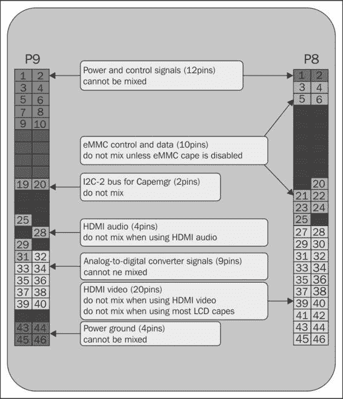

# 二、与安卓系统接口

上一章，你在 BBB 上安装了安卓。您还收集了试用本书中的练习所需的所有硬件和组件。现在，您已经有了一个运行良好的安卓系统和探索它所需的硬件，是时候深入研究安卓并了解如何准备它与定制硬件接口了。

大多数人不会认为安卓和 Linux 非常相似，但两者的共同点比你可能意识到的要多。在精致的用户界面和各种各样的应用之下，安卓暗地里是 Linux。安卓的文件系统布局和服务与典型的 Linux 系统有很大不同，所以两者在用户空间(应用和其他进程执行的地方)方面肯定有很多不同。就内核空间(设备驱动程序在其中执行，资源分配给每个运行的进程)而言，它们在功能上几乎完全相同。理解 BBB 如何与 Linux 内核驱动程序交互是创建能够做到这一点的安卓应用的关键。

在这一章中，我们将向您介绍安卓的硬件抽象层，即 HAL。我们还将向您介绍 PacktHAL，这是一个特殊的库，您可以将其包含在您的应用中，以与 BBB 上的硬件接口。我们假设您已经在您的系统上安装并运行了 Eclipse **安卓开发工具** ( **ADT** )、安卓软件开发工具包安卓**原生开发工具包** ( **NDK** )和**安卓调试桥** ( **ADB** )工具。

在本章中，我们将涵盖以下主题:

*   了解安卓哈尔
*   安装 PacktHAL
*   为 PacktHAL 设置安卓 NDK
*   多路复用 BBB 引脚

### 类型

**是不是少了几个工具？**

如果您的系统上尚未安装 Eclipse ADT 或 Android NDK 工具，您可以在以下位置找到安装说明和下载链接:

*   **日食 ADT**:[http://developer.android.com/sdk](http://developer.android.com/sdk)
*   **安卓 NDK**:[http://developer.android.com/tools/sdk/ndk](http://developer.android.com/tools/sdk/ndk)

如何安装 ADB 将在本章后面讨论。本章假设您已经将 Eclipse ADT 安装到`c:\adt-bundle`目录(如果您使用的是 Windows 的话)(我们对 Linux 不做任何假设)，并且假设您已经将 Android NDK 安装到您主目录(Linux)的`c:\android-ndk`目录(Windows)或`android-ndk`。如果您已经将这些工具安装到不同的位置，您将不得不对本章后面的一些说明进行一些简单的调整。

# 了解安卓 HAL

一个安卓内核包含一些典型的 Linux 内核所没有的附加特性，比如**Binder IPC**T4【低内存杀手】，但除此之外它仍然是 Linux。这为您提供了一个非常大的优势，当硬件与安卓接口时，也就是说，如果用于安卓系统的内核中已经存在一个 Linux 驱动程序，那么您已经有了一个用于该设备的安卓驱动程序。

安卓应用必须通过生成视频和音频数据、接收按钮和触摸屏输入事件以及从摄像头、加速度计和其他从外部世界收集信息的设备接收传感器事件来与安卓设备的硬件进行交互。为这些设备利用现有的 Linux 驱动程序使安卓支持变得更加容易。与传统的 Linux 发行版不同，后者授予应用直接访问许多不同设备文件的权限(通过直接打开`/dev`文件系统中的文件)，安卓极大地限制了进程直接访问硬件的能力。

考虑使用设备音频功能来播放声音或录制音频数据的不同安卓应用的数量。在安卓系统下，Linux 内核通过一个 **高级 Linux 声音架构** ( **ALSA** )音频驱动程序提供这种音频功能。在大多数情况下，一次只有一个进程可以打开和控制 ALSA 驱动程序资源。如果单个应用负责获取、使用和发布 ALSA 驱动程序，那么协调所有不同应用之间的音频资源使用将变得非常混乱。一个行为不端的应用可以轻松控制音频资源，并阻止所有其他应用使用它们！但是如何处理这些资源的分配和控制呢？为了解决这个问题，安卓使用*管理器*。

## 安卓管理者

管理者是代表所有应用控制硬件设备的系统组件。每个应用都需要一些资源(如音频、全球定位系统和网络访问)来执行其工作。经理负责分配和连接这些资源，并确定应用是否有权使用这些资源。

让经理处理这些低级细节让生活变得容易多了。安卓可以安装在各种各样的硬件平台上，这些平台在物理大小和输入/输出能力方面差异很大，不能指望应用开发人员对他们的应用可以安装的每个平台都有深入的了解。

要使用资源，应用必须通过`android.content.Context`类的`getSystemService()`方法创建对适当管理器的引用:

```java
// Create a reference to the system "location" manager
LocationManager locationManager = (LocationManager)
  mContext.getSystemService(LOCATION_SERVICE);
```

然后，通过此经理参考提出信息和控制请求:

```java
// Query the location manager to determine if GPS is enabled
isGPSEnabled = locationManager.
isProviderEnabled(LocationManager.GPS_PROVIDER);
```

应用通过 Java Android API 与管理人员进行交互。当管理者响应这些 Java 方法时，他们最终必须使用 **Java 原生接口** ( **JNI** )来调用直接与硬件交互的原生代码。这是真正控制硬件的地方。安卓应用编程接口和控制硬件的本机代码调用之间的桥梁被称为**硬件抽象层** ( **HAL** )。

HAL 的各个部分通常用 C/C++ 编写，每个设备的供应商负责实现它们。如果哈尔的某些部分缺失，服务和应用将无法充分利用硬件平台的所有方面。各种安卓服务使用 HAL 与硬件通信，应用使用 IPC 与这些服务通信并获得对硬件的访问。服务代表应用与硬件交互(假设应用拥有适当的安卓权限来访问特定的硬件资源)。

## HAL 开发工作流程

通常，创建一个完整的 HAL 遵循以下步骤:

1.  确定或开发一个 Linux 内核设备驱动程序来控制硬件。
2.  创建一个内核设备树覆盖，实例化和配置驱动程序。
3.  开发一个用户空间库与内核设备驱动程序接口。
4.  开发用户空间库的 JNI 绑定。
5.  使用 JNI 绑定开发一个安卓管理器来连接硬件。

有时，对于特定的定制硬件应该在哪里被适当地集成到 HAL 中，以及哪个管理器应该负责访问硬件，并不是一个明确的决定。哪些安卓权限控制对硬件的访问？该应用编程接口是否必须扩展以提供新类型的权限？是否必须创建定制服务？

对于业余爱好者、学生和其他对硬件接口的简单实验感兴趣的开发人员来说，为一个定制硬件实现一个合适的 HAL 的每个方面都有点过分了。虽然商用安卓系统必须解决所有这些步骤才能开发出合适的 HAL，但在本书中，我们对硬件访问采取了更直接的方法。

由于我们的重点是展示如何将安卓应用与硬件对接，我们跳过步骤 1 至 4，为您提供**pack HAL**，一个实现非常简单的 HAL 的原生库。PacktHAL 将让您轻松完成与 BBB 上的硬件接口的艰巨任务，它提供了一组能够与本书中示例中使用的硬件接口的功能。严格来说，你的应用将充当管理每个硬件资源的管理者。

## 与 PacktHAL 合作

应用使用 JNI 将与本地的 PacktHAL 通话。PacktHAL 演示了如何通过三种不同的接口方法执行用户空间与硬件的接口:`GPIO`、`SPI`和`I2C`。使用 PacktHAL，您可以直接访问硬件设备。[第 3 章](3.html#page_1 "Chapter 3. Handling Inputs and Outputs with GPIOs")到[第 6 章](6.html#page_1 "Chapter 6. Creating a Complete Interfacing Solution")提供了这种接口如何工作以及如何在自己的安卓应用代码中使用它的示例。每一章都将检查该章应用示例中使用的各种 PacktHAL。

### 类型

【PacktHAL 实际上是如何与硬件对话的？

一般来说，任何允许你在 Linux 下与硬件接口的方法都可以被 HAL 用于接口。读取、写入和调用`/dev`文件系统中的文件将会工作，就像使用`mmap()`提供对内存映射控制寄存器的访问一样。PacktHAL 使用所有这些技术与您连接到 BBB 的硬件接口。

使用 PacktHAL 远没有一个合适的 HAL 实现安全，因为我们必须更改硬件用户空间界面的权限，这样*任何*应用都可以直接访问硬件。这可能会使您的系统容易受到恶意应用的攻击，因此这种方法永远不应该在生产设备中使用。根用户(获得超级用户访问权限)商用安卓手机和平板电脑通常这样做是为了减少默认情况下对这些设备的严格权限。这允许他们安装和启用自定义功能，并为他们的设备提供更多的灵活性和自定义。

由于您正在使用 BBB 作为安卓原型设备，这样的方法是您与硬件交互的最简单方法。这是开发您自己的定制管理器和服务的垫脚石，这些管理器和服务代表应用与您的硬件对话。理想情况下，在商用设备上，只有安卓管理器才有必要的权限直接与硬件接口。

### 类型

一旦你习惯了在你的应用中使用 PacktHAL，你就可以检查 PacktHAL 的源代码，以更好地理解本机代码是如何与 Linux 内核接口的。最终，您可能会发现自己将 PacktHAL 集成到自己的定制管理器中。您甚至可能会发现自己正在为实际的内核开发定制代码！

# 安装包装

各种 PacktHAL 的所有都位于`PacktHAL.tgz`文件中，可从 Packt 的网站([http://www.packtpub.com/support](http://www.packtpub.com/support)下载。这是一个压缩的 tar 文件，其中包含了修改 BBBAndroid 以使用 PacktHAL 并在您的应用中包含 PacktHAL 支持所需的所有源代码和配置文件。

## 在 Linux 下准备 PacktHAL

一旦下载了`PacktHAL.tgz`文件，就必须解压缩。我们将假设您在下载后已经将`PacktHAL.tgz`复制到您的主目录，并将从那里解压缩。我们将把你的主目录称为`$HOME`。

使用 Linux `tar`命令解压缩文件:

```java
$ cd $HOME
$ tar –xvf PacktHAL.tgz

```

一个名为`PacktHAL`的目录现在存在于你的`$HOME`目录中。所有的打包文件都位于这个目录中。

## 在 Windows 下准备数据包

一旦你下载了`PacktHAL.tgz`文件，解压并解压。我们将假设您在下载后已经将`PacktHAL.tgz`复制到`C:`驱动器的根目录中，并将使用 WinRAR 从那里解压缩它。

### 类型

**我应该在哪里打开包装？**

你可以在桌面上或者任何你想去的地方解压和解压`PacktHAL.tgz`，但是你稍后会执行一些命令行命令来复制文件。如果在`C:`驱动器的根目录下对`PacktHAL.tgz`进行解压缩和取消解压缩，执行这些操作会简单得多，因此我们假设您正在那里执行这些操作。

执行以下步骤提取`PacktHAL.tgz`文件:

1.  打开文件浏览器窗口，导航到`C:`驱动器的根目录。
2.  在文件浏览器中右键单击`PacktHAL.tgz`文件，选择**提取此处**。

名为`C:\PacktHAL`的目录现在已经存在。所有的打包文件都位于这个目录中。

## PacktHAL 目录结构

`PacktHAL`目录有以下结构:

```java
PacktHAL/
  |
  +----cape/
  |      |
  |      +----BB-PACKTPUB-00A0.dts
  |      +----build_cape.sh
  |
  +----jni/
  |      |
  |      +----(Various .c and .h files)
  |      +----(Various .mk files)
  |
  +----prebuilt/
  |      |
  |      +----BB-PACTPUB-00A0.dtbo
  |      +----init.genericam33xx(flatteneddevicetr.rc
  |      +----spi
  |             |
  |             +----spidev.h
  |
  +----README.txt
```

`cape`子目录包含源代码和构建脚本，用于构建一个设备树覆盖，以实现 PacktHAL 所需的所有硬件功能。在本章后面，您将了解更多关于设备树覆盖的信息。`jni`子目录包含实现 PacktHAL 的源代码文件。这些源文件将在后面的章节中添加到您的项目中，以在您的应用中构建 PacktHAL 支持。`prebuilt`目录包含一些预制文件，必须添加到你的 BBBAndroid 图像和安卓 NDK 来构建和使用 PacktHAL。在接下来的几节中，您将把`prebuilt`目录中的文件安装到它们需要的位置。

## 为 PacktHAL 准备安卓

在使用任何应用之前，你必须准备好你的 T2 BBBAndroid 安装。默认情况下，安卓对其分配给硬件设备的权限有非常严格的限制。要使用 PacktHAL，您必须减少权限限制，并为您将与之接口的硬件配置安卓。这些操作需要将一些预先构建的文件复制到您的安卓系统中，以进行一些配置更改，从而放宽各种安卓权限，并为 PacktHAL 的使用正确配置硬件。

您将使用 ADB 工具将必要的文件推送到运行中的 BBB 系统。在推送文件之前，请在 BBB 上引导 Android，并使用 BBB 附带的 USB 电缆将 BBB 连接到您的电脑。一旦达到这一点，继续执行说明。

## 在 Linux 下推送 PacktHAL 文件

以下步骤是为了在 Linux 下发布 PacktHAL 文件而使用的:

1.  开始之前，使用`adb devices`命令确保 ADB 可以看到您的 BBB。BBB 将报告序列号为`BBBAndroid`。执行以下命令:

    ```java
    $ adb devices
    List of devices attached
    BBBAndroid      device

    ```

2.  If you are missing the `adb` command, install the `android-tools-adb` package via `apt-get`:

    ```java
    $ sudo apt-get install android-tools-adb

    ```

    ### 类型

    **为什么 Linux 找不到我的 BBB？**

    如果`adb`安装在您的系统上，并且您看不到 BBB，您可能需要向您的系统添加一个`udev`规则，并执行一些额外的故障排除。谷歌提供了添加该规则的说明，以及遇到任何困难时的一些故障排除步骤，这可以在[http://developer.android.com/tools/device.html](http://developer.android.com/tools/device.html)找到。

    BBBAndroid 报告其 ADB 接口的 USB 设备 id 为`18D1:4E23`，这是一个 Google Nexus S 的设备 ID，因此 BBB 的 USB 供应商 ID 为 18d 1(Google 设备的设备 ID)。

3.  一旦你确认`adb`可以看到 BBB，进入`PacktHAL`目录，通过`adb`进入安卓系统，重新挂载只读`rootfs`文件系统为读写:

    ```java
    $ cd $HOME/PacktHAL/prebuilt
    $ adb shell
    root@beagleboneblack:/ # mount rootfs rootfs / rw
    root@beagleboneblack:/ # exit

    ```

4.  现在，将必要的文件推入安卓的`rootfs`文件系统:

    ```java
    $ adb push BB-PACKTPUB-00A0.dtbo /system/vendor/firmware
    $ adb push init.genericam33xx\(flatteneddevicetr.rc /
    $ adb chmod 750 /init.genericam33xx\(flatteneddevicetr.rc

    ```

5.  最后，进入安卓的`rootfs`文件系统进行同步，并以只读方式重新挂载:

    ```java
    $ adb shell
    root@beagleboneblack:/ # sync
    root@beagleboneblack:/ # mount rootfs rootfs / ro remount
    root@beagleboneblack:/ # exit

    ```

6.  你已经现在在 Linux 下为 PacktHAL 准备好了你的 BBBAndroid 镜像。从您的 BBB 上拔下电源线和 USB 线，将其关闭。
7.  然后，打开 BBB 的电源，验证安卓是否可以通过您刚才所做的修改正常启动。

## 在 Windows 下推送 PacktHAL 文件

您必须找到您的`adb.exe`文件所在的。它是安卓软件开发工具包中平台工具的一部分。在下面的说明中，我们假设您在`c:\adt-bundle`目录中安装了 Eclipse ADT，使`adb`的完整路径成为`c:\adt-bundle\sdk\platform-tools\adb.exe`。

使用以下步骤在 Windows 下发布打包哈尔文件:

1.  Before you get started, make sure that `adb` can see your BBB by using the `adb devices` command. The BBB will report as having a serial number of `BBBAndroid`:

    ```java
    $ adb devices
    List of devices attached
    BBBAndroid      device

    ```

    ### 类型

    **为什么 Windows 找不到我的 BBB？**

    众所周知，在 Windows 下很难看到安卓设备。这是因为创建安卓设备的每个硬件制造商都提供了自己的 Windows ADB 设备驱动程序，Windows 使用该驱动程序与该设备进行对话。BBBAndroid 报告其 ADB 接口的 USB 设备 id 为`18D1:4E23`，这是一个 Google Nexus S 的设备 ID，该设备是 Koushik Dutta 优秀的 Windows 通用 ADB 驱动程序支持的(众多)USB 设备之一。如果`adb`找不到您的 BBB，请安装通用 ADB 驱动程序，然后重试。您可以从[http://www.koushikdutta.com/post/universal-adb-driver](http://www.koushikdutta.com/post/universal-adb-driver)下载驱动程序。

2.  一旦你验证了这一点，`adb`可以看到 BBB，通过`adb`进入安卓系统，并将只读`rootfs`文件系统重新挂载为读写:

    ```java
    $ adb shell
    root@beagleboneblack:/ # mount rootfs rootfs / rw
    root@beagleboneblack:/ # exit

    ```

3.  现在，将必要的文件推入安卓的`rootfs`文件系统:

    ```java
    $ adb push c:\PacktHAL\prebuilt\BB-PACKTPUB-00A0.dtbo /system/vendor/firmware
    $ adb push c:\PacktHAL\prebuilt\init.genericam33xx(flatteneddevicetr.rc /
    $ adb chmod 750 /init.genericam33xx\flatteneddevicetr.rc

    ```

4.  最后，将放入安卓的`rootfs`文件系统中进行同步，并以只读方式重新挂载:

    ```java
    $ adb shell
    root@beagleboneblack:/ # sync
    root@beagleboneblack:/ # mount rootfs rootfs / ro remount
    root@beagleboneblack:/ # exit

    ```

5.  You have now prepared your BBBAndroid image for PacktHAL under Windows. Remove the power supply cable and USB cable from your BBB to shut it down. Then, power up the BBB to verify that Android boots properly with the modifications that you have just made.

    ### 类型

    **为什么 init . generica m33 xx(flappeneddevicetr . RC)文件的命名这么奇怪？**

    安卓设备有一组只读属性，向应用和管理人员描述系统的硬件和软件。其中一个属性是`ro.hardware`，它描述了内核配置的硬件。安卓系统中特定于设备的`.rc`文件具有`init.{ro.hardware}.*rc`格式。

    在 Linux 内核源代码中，`arch/arm/mach-omap2/board-generic.c`文件使用`DT_MACHINE_START()`宏将 BBB 平台的名称指定为`Generic AM33XX (Flattened Device Tree)`。该文本字符串被转换为小写，空格被删除，字符串被截断以产生存储在`ro.hardware`属性中的最终字符串。

# 为 PacktHAL 设置安卓 NDK

不幸的是，安卓**原生开发套件** ( **NDK** )缺少一个构建 PacktHAL 所需的内核头文件。缺少的标题描述了用户空间应用和通用 SPI 驱动程序(`spidev`)之间的接口，您将在[第 5 章](5.html#page_1 "Chapter 5. Interfacing with High-speed Sensors Using SPI")、*中使用 SPI 与高速传感器接口*。这个头文件丢失不是 NDK 的错，因为通常应用永远不需要直接访问`spidev`驱动程序。

当您使用应用与硬件直接对话时，您需要将这个缺失的标题复制到您的 NDK 安装中。

### 类型

为了您的方便，我们在 PacktHAL 源 tarball 中包含了这个头文件的副本。您只需要在构建软件包之前将文件复制到您的 NDK 安装中。

BBBAndroid 是 4.4.4 KitKat，API 级别 19 是这个版本支持的最高级别。您将为 API 级别 19 构建本书中的所有示例。在 NDK，每个应用编程接口级别都有一组不同的头，因此您必须将缺少的头添加到应用编程接口级别 19 的`include/linux`目录中。如果您决定在较低的应用编程接口级别构建应用，您可以重复以下步骤，将附加头文件添加到您希望的任何其他应用编程接口级别。

## 在 Linux 下给 NDK 添加头部

如果你打算在 Linux 下使用 Eclipse ADT 构建应用，你需要在你的 Linux 系统上安装安卓 NDK。对于这些说明，我们将假设您已经将 NDK 安装到您的`$HOME`目录中的`android-ndk`文件夹。由于您已经在本章前面的`$HOME`目录中下载、解压缩并取消了`PacktHAL.tgz`文件，我们将假设您创建的`PacktHAL`目录仍然存在:

```java
$ cd $HOME/android-ndk/platforms/android-19/arch-arm/usr/include/linux
$ cp -rf $HOME/PacktHAL/prebuilt/spi

```

这将把`spi`头文件目录的内容复制到你的 NDK 头文件中。您的 Linux NDK 安装现在有了构建打包所需的额外头文件。

## 在 Windows 下将标题添加到 NDK

如果你是要在 Windows 下使用 Eclipse ADT 构建应用，你需要在你的 Windows 系统上安装安卓 NDK。对于这些说明，我们将假设您已经将 NDK 安装到`c:\android-ndk`文件夹中。由于您已经在本章前面的`c:\`目录中下载、解压缩并取消了`PacktHAL.tgz`文件，我们将假设您创建的`PacktHAL`目录仍然存在:

1.  打开文件浏览器窗口，导航至`c:\android-ndk\platforms\android-19\arch-arm\usr\include\linux`路径。
2.  打开第二个文件浏览器窗口，导航至`c:\PacktHAL\prebuilt`路径。右键单击`spi`目录，从上下文菜单中选择**复制**。
3.  切换到安卓 NDK 窗口，在窗口文件列表空白区域内任意位置右键单击，从上下文菜单中选择**粘贴**。

这将把`spi`头文件目录的内容复制到你的 NDK 头文件中。您的 Windows NDK 安装现在有了构建打包所需的额外头文件。

# 多路复用 BBB 引脚

由于在安卓系统下访问硬件资源的过程与在 Linux 系统下相同，因此了解 Linux 内核如何配置设备驱动程序并将其分配给特定的硬件非常重要。还需要了解这些内核驱动程序如何提供 PacktHAL 可以与之交互的用户空间接口。

BBB 的 AM3359 处理器在其数百个引脚上提供各种信号。这些信号包括许多不同的专用接口总线和传感器输入。有太多的潜在信号可用于向外界提供这些信号。为了选择哪些信号在引脚上可用，引脚被多路复用，或*多路复用*到特定信号。

处理器的几个引脚连接到 BBB 的 P8 和 P9 接口。BBB 用户对这些特定引脚的多路复用非常感兴趣，因为多路复用决定了哪些处理器信号和功能易于用户进行硬件接口。BBB 的两个接头上各有 46 个引脚，总共有 92 个引脚可供连接。不幸的是，默认情况下，这些引脚中有 61 个正在使用中，这意味着您的项目只能更改 31 个引脚，而不必禁用 BBB 的一个或多个标准功能来使更多引脚可用。


BeagleBone Black 色的 P8 和 P9 扩展头

插头上的一些引脚被永久分配，例如提供电压(1.8、3.3 和 5 伏直流电可用)和接地信号的引脚。其他引脚虽然，可以混合，以满足您的项目需求。适当的多路复用所有 P8/P9 引脚以提供所需的所有资源有时可能会很棘手，尤其是当您刚刚开始了解 BBB 的硬件接口方面时。幸运的是，我们已经为您确定了一个 pinmux 配置，它将为 PacktHAL 提供运行本书中所有练习所需的所有硬件资源。



BeagleBone Black 上使用的默认引脚

## 内核设备树和 capemgr

BBB 的引脚必须以特定的方式混合才能与定制硬件通话，但这实际上是在哪里以及如何做到的？答案是“内核的**设备树**设备树是内核内部的一种分层数据结构，它描述了存在什么硬件，该硬件使用哪些资源，以及应该使用哪些内核驱动程序来与每个硬件设备进行对话。它描述了硬件的不同方面，例如引脚多路复用设置、时钟速度和传递给内核设备驱动程序的参数。

如果每次硬件改变时都要求用户安装新的内核，这将是一个令人讨厌的麻烦。对于 BBB 这样的硬件平台，用户可以在电源周期之间更换连接到 BBB 的硬件！能够动态更改设备树以动态添加或删除硬件将非常有用。BBB 的 Linux 3.8 内核有一个特殊的子系统，叫做**cape manager**(**cape mgr**)，可以让你做到这一点。

capemgr 动态添加和移除设备树的片段或*覆盖*。它提供三种重要的服务:

*   它可以识别任何连接到 BBB 的 cape 硬件
*   它加载适当的设备树覆盖，以启用和配置每个可识别的海角
*   它允许从用户空间动态加载任意设备树覆盖，以配置任何不会自动发现的硬件

## 定义斗篷

A cape 是连接到 BBB 的 P8/P9 连接器的任何硬件附件(类似于屏蔽板如何连接到 Arduino)，并且包含一个**电可擦除可编程只读存储器** ( **EEPROM** )芯片，该芯片向内核的 capebus 报告 cape 的身份。然后，内核中的 capemgr 可以为特定的 cape 动态启用适当的设备树覆盖。这使您可以将各种不同的商用 cape 板连接到 BBB，它们都可以自动工作，而无需您更改单个配置文件。

一个更宽松的 cape 定义是通过 P8/P9 连接器连接的任何外部电路。如果不包含一个告诉 capemgr“我是斗篷，我的名字是 XYZ”的 EEPROM，capemgr 将不会自动定位和加载斗篷的适当设备树覆盖。这是本书所有例子的情况。您仍然可以将连接到 BBB 的硬件视为安卓与之接口的斗篷，但是设备树覆盖必须从用户空间手动加载。

在一章的前面，您使用`adb`将一个名为`BB-PACKTPUB-00A0.dtbo`的文件推送到您的安卓映像中。该文件是设备树覆盖图，为您将在本书的练习中使用的硬件配置 BBB。在安卓系统的引导过程中，你手动推送到安卓系统映像的自定义`init.genericam33xx(flatteneddevicetr.rc`文件会为你加载这个覆盖图。

在 Linux 文件系统中，自定义的覆盖被放入`/lib/firmware`目录。然而，在安卓系统下，`rootfs`中没有`/lib`目录，所以覆盖被放入`/system/vendor/firmware`目录中。这也是内核编译期间构建的固件(`.fw` 文件)的安装位置。当您在未来的项目中使用自己的设备树覆盖时，请记住将它们放入`/system/vendor/firmware`目录，以便 capemgr 可以找到它们。

### 类型

**在哪里可以了解更多关于 BBB 引脚复用、设备树和创建自定义覆盖的信息？**

学习如何为自定义项目选择最佳引脚复用并创建适当的设备树覆盖不在本书的讨论范围之内，但有许多优秀的资源可以向您介绍这一过程。以下是一些很好的资源，我们建议您阅读以了解更多信息:

*   BeagleBone Black 色系统参考手册:[http://www.adafruit.com/datasheets/BBB_SRM.pdf](http://www.adafruit.com/datasheets/BBB_SRM.pdf)
*   德里克·莫洛伊的网站:[http://derekmolloy.ie/category/embedded-systems/beaglebone/](http://derekmolloy.ie/category/embedded-systems/beaglebone/)
*   AdaFruit 的设备树叠加教程:[https://learn . AdaFruit . com/beagle bone-black-Device-Tree 简介](https://learn.adafruit.com/introduction-to-the-beaglebone-black-device-tree)

# 总结

在这一章中，我们解释了安卓如何使用 HAL 来允许安卓管理器提供对应用的硬件访问。我们向您介绍了 PacktHAL，它可以用来与本书中的所有示例进行交互。您将 BBBAndroid 映像配置为使用 PacktHAL，并修改了您的 NDK 安装，将 PacktHAL 构建到您的应用中。

我们还展示了 BBB 的 P8/P9 报头的哪些引脚可以复用，什么是设备树，如何使用它来复用引脚，以及 capemgr 如何加载设备树覆盖来动态复用 BBB 的引脚。

在下一章中，您将让 PacktHAL 开始工作，并使用 GPIOs 构建您的第一个硬件接口应用。