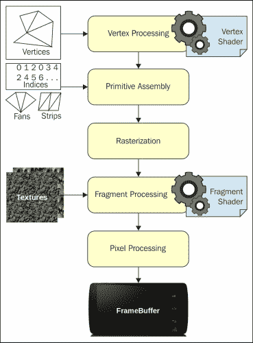
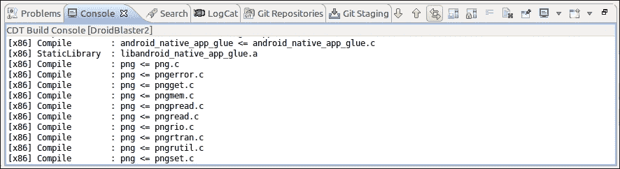
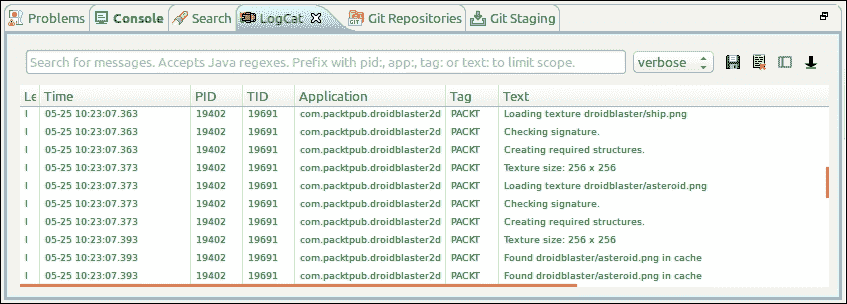
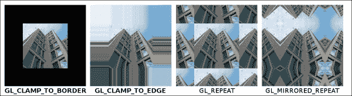
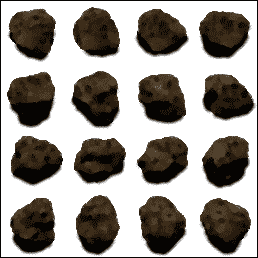
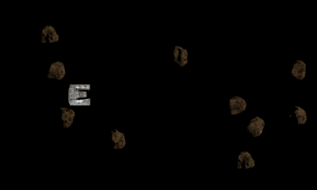

# 六、使用 OpenGL 专家系统渲染图形

> *让我们面对一个事实，安卓 NDK 的主要兴趣之一是编写多媒体应用和游戏。事实上，这些程序消耗大量资源，需要响应。这就是为什么安卓 NDK 最早可用的应用编程接口(直到最近几乎是唯一的)之一是图形应用编程接口:嵌入式系统的**开放图形库**(缩写为 **OpenGL ES** )。*
> 
> *OpenGL 是由 Silicon Graphics 创建的标准 API，现在由 Khronos 集团管理(参见[http://www.khronos.org/](http://www.khronos.org/))。OpenGL 为桌面上所有标准的**图形处理器**(**图形处理单元**像你的图形卡等等)提供了一个公共接口。OpenGL ES 是一个衍生的 API，可以在很多嵌入式平台上使用，比如安卓或者 iOS。编写可移植、高效的图形代码是你最大的希望。OpenGL 可以渲染 2D 和三维图形。*

安卓目前支持的 OpenGL ES 主要有三个版本:

*   所有安卓设备都支持 OpenGL ES 1.0 和 1.1(1.1 除外，它在少数非常老的设备上支持)。它提供了一个老式的图形应用编程接口，带有**固定管道**(也就是说，一组固定的可配置操作来转换和渲染几何图形)。规范没有完全实现，但是大多数特性都是可用的。对于简单的 2D 或 3D 图形，或者移植传统的 OpenGL 代码，这仍然是一个不错的选择。
*   从 API Level 8 开始，现在几乎所有手机都支持 OpenGL ES 2，即使是比较老的手机也是如此。它用带有**顶点**和**片段着色器**的现代可编程管道代替了固定管道。它有点复杂，但也更强大。对于更复杂的 2D 或 3D 游戏来说，这是一个不错的选择，同时仍然保持着非常好的兼容性。注意，OpenGL ES 1。x 经常被幕后的 OpenGL 2 实现所模仿。
*   OpenGL ES 3.0 从 API Level 18 开始在现代设备上可用，OpenGL ES 3.1 从 API Level 21 开始可用(尽管并非所有这些 API 级别的设备都支持)。它们为 GLES 2 ( **纹理压缩**作为标准功能、**遮挡查询、实例化渲染**等 3.0、**计算着色器**、**间接绘制** 命令等 3.1)带来了一系列新的改进，并与桌面版本的 OpenGL 有了更好的兼容性。它与 OpenGL ES 2 向后兼容。

本章教你如何使用 OpenGL ES 2 创建一些基本的 2D 图形。更具体地说，您将发现如何:

*   初始化 OpenGL ES
*   从打包在资源中的 PNG 文件加载纹理
*   使用顶点和片段着色器绘制子画面
*   渲染粒子效果
*   使图形适应各种分辨率

对于 OpenGL ES 和一般的图形，这是一个广泛的主题，这一章只涵盖了基本知识。

# 初始化 OpenGL ES

创建令人敬畏的 2D 和三维图形的第一步是初始化 OpenGL ES。虽然不是非常复杂，但是这个任务需要一些样板代码来将渲染上下文绑定到安卓窗口。这些部分在 OpenGL ES 的配套应用编程接口**嵌入式系统图形库** ( **EGL** )的帮助下被粘合在一起。

对于第一部分，我们将使用 OpenGL ES 替换上一章中实现的原始绘图系统。黑到白的渐变效果将证明 EGL 初始化工作正常。

### 注

由此产生的项目以`DroidBlaster_Part5`的名称提供本书。

# 行动时间-初始化 OpenGL ES

让我们重写我们的 `GraphicsManager`来初始化一个 OpenGL ES 上下文:

1.  通过执行以下操作修改`jni/GraphicsManager.hpp`:
    *   包括将 OpenGL ES 绑定到安卓平台的`EGL/egl.h`和渲染图形的`GLES2/gl2.h`
    *   添加一个方法`stop()`来解除 OpenGL 渲染上下文的绑定，并在您离开活动时释放图形资源
    *   定义`EGLDisplay`、`EGLSurface`、`EGLContext`成员变量，代表系统资源句柄，如下图:

        ```cpp
        ...
        #include "Types.hpp"

        #include <android_native_app_glue.h>
        #include <GLES2/gl2.h>
        #include <EGL/egl.h>
        ...

        class GraphicsManager {
        public:
            ...
            status start();
            void stop();
            status update();

        private:
            ...
            int32_t mRenderWidth; int32_t mRenderHeight;
            EGLDisplay mDisplay; EGLSurface mSurface; EGLContext mContext;

            GraphicsElement* mElements[1024]; int32_t mElementCount;
        };
        #endif
        ```

2.  通过用基于 OpenGL 的代码替换以前基于 Android 原始图形 API 的代码，重新实现`jni/GraphicsManager.cpp`。首先向构造函数初始化列表中添加新成员:

    ```cpp
    #include "GraphicsManager.hpp"
    #include "Log.hpp"

    GraphicsManager::GraphicsManager(android_app* pApplication) :
        mApplication(pApplication),
        mRenderWidth(0), mRenderHeight(0),
        mDisplay(EGL_NO_DISPLAY), mSurface(EGL_NO_CONTEXT),
     mContext(EGL_NO_SURFACE),
        mElements(), mElementCount(0) {
        Log::info("Creating GraphicsManager.");
    }
    ...
    ```

3.  艰苦的工作必须在方法`start()`中完成:
    *   首先，声明一些变量。注意 EGL 是如何定义自己的类型并重新声明原语类型`EGLint`和`EGLBoolean`以支持平台独立性的。
    *   然后，在常量属性列表中定义所需的 OpenGL 配置。这里，我们想要 OpenGL ES 2 和一个 16 位的曲面(5 位代表红色，6 位代表绿色，5 位代表蓝色)。我们还可以选择 32 位表面，以获得更好的色彩保真度(但在某些设备上性能较差)。属性列表由`EGL_NONE`标记终止:

        ```cpp
        ...
        status GraphicsManager::start() {
            Log::info("Starting GraphicsManager.");
            EGLint format, numConfigs, errorResult; GLenum status;
            EGLConfig config;
            // Defines display requirements. 16bits mode here.
            const EGLint DISPLAY_ATTRIBS[] = {
                EGL_RENDERABLE_TYPE, EGL_OPENGL_ES2_BIT,
                EGL_BLUE_SIZE, 5, EGL_GREEN_SIZE, 6, EGL_RED_SIZE, 5,
                EGL_SURFACE_TYPE, EGL_WINDOW_BIT,
                EGL_NONE
            };
            // Request an OpenGL ES 2 context.
            const EGLint CONTEXT_ATTRIBS[] = {
                EGL_CONTEXT_CLIENT_VERSION, 2, EGL_NONE
            };
        ...
        ```

4.  连接默认**显示**，即安卓主窗口，有`eglGetDisplay()`和`eglInitialize()`。然后，找到合适的**帧缓冲区**(OpenGL 术语，指渲染表面，可能还有其他缓冲区，如**【Z-buffer】**或**模板**缓冲区)配置，以`eglChooseConfig()`为显示。根据要求的属性选择配置:

    ```cpp
    ...
        mDisplay = eglGetDisplay(EGL_DEFAULT_DISPLAY);
        if (mDisplay == EGL_NO_DISPLAY) goto ERROR;
        if (!eglInitialize(mDisplay, NULL, NULL)) goto ERROR;

        if(!eglChooseConfig(mDisplay, DISPLAY_ATTRIBS, &config, 1,
            &numConfigs) || (numConfigs <= 0)) goto ERROR;
    ...
    ```

5.  Reconfigure the Android window with the selected configuration (retrieved with `eglGetConfigAttrib()`). This operation is Android-specific and performed with the Android `ANativeWindow` API.

    之后，使用之前选择的显示和配置创建显示表面和 OpenGL 上下文。上下文包含与 OpenGL 状态相关的所有数据(启用设置、禁用设置等):

    ```cpp
    ...
        if (!eglGetConfigAttrib(mDisplay, config,
            EGL_NATIVE_VISUAL_ID, &format)) goto ERROR;
        ANativeWindow_setBuffersGeometry(mApplication->window, 0, 0,
            format);

        mSurface = eglCreateWindowSurface(mDisplay, config,
            mApplication->window, NULL);
        if (mSurface == EGL_NO_SURFACE) goto ERROR;
        mContext = eglCreateContext(mDisplay, config, NULL,
            CONTEXT_ATTRIBS);
        if (mContext == EGL_NO_CONTEXT) goto ERROR;
    ...
    ```

6.  使用`eglMakeCurrent()`激活创建的渲染上下文。最后，根据`eglQuerySurface()`检索到的曲面属性定义显示视口。不需要 Z 缓冲区，可以禁用:

    ```cpp
    ...
        if (!eglMakeCurrent(mDisplay, mSurface, mSurface, mContext)
       || !eglQuerySurface(mDisplay, mSurface, EGL_WIDTH, &mRenderWidth)
       || !eglQuerySurface(mDisplay, mSurface, EGL_HEIGHT, &mRenderHeight)
       || (mRenderWidth <= 0) || (mRenderHeight <= 0)) goto ERROR;

        glViewport(0, 0, mRenderWidth, mRenderHeight);
        glDisable(GL_DEPTH_TEST);
        return STATUS_OK;

    ERROR:
        Log::error("Error while starting GraphicsManager");
        stop();
        return STATUS_KO;
    }
    ...
    ```

7.  当应用停止运行时，将应用从安卓窗口中解除绑定，并释放 EGL 资源:

    ```cpp
    ...
    void GraphicsManager::stop() {
        Log::info("Stopping GraphicsManager.");

        // Destroys OpenGL context.
        if (mDisplay != EGL_NO_DISPLAY) {
            eglMakeCurrent(mDisplay, EGL_NO_SURFACE, EGL_NO_SURFACE,
                           EGL_NO_CONTEXT);
            if (mContext != EGL_NO_CONTEXT) {
                eglDestroyContext(mDisplay, mContext);
                mContext = EGL_NO_CONTEXT;
            }
            if (mSurface != EGL_NO_SURFACE) {
                eglDestroySurface(mDisplay, mSurface);
                mSurface = EGL_NO_SURFACE;
            }
            eglTerminate(mDisplay);
            mDisplay = EGL_NO_DISPLAY;
        }
    }
    ...
    ```

## *刚刚发生了什么？*

我们已经与 EGL 一起初始化并连接了 OpenGL ES 和 Android 原生窗口系统。多亏了这个应用编程接口，我们查询了一个符合我们预期的显示配置，并创建了一个帧缓冲区来渲染我们的场景。EGL 是一个由 Khronos 小组指定的标准应用编程接口(像 OpenGL)。平台通常实现自己的变体(随意地，iOS 上的 EAGL 等等)，以便显示窗口初始化保持特定于操作系统。因此，可移植性在实践中非常有限。

这个初始化过程导致创建一个 OpenGL 上下文，这是启用 OpenGL 图形管道的第一步。在使用 OpenGL 上下文时要特别小心，这种上下文在 Android 上经常丢失:当你离开或返回主屏幕时，当接到呼叫时，当设备进入睡眠状态时，当你切换到另一个应用时，等等。随着丢失的上下文变得不可用，尽快释放图形资源非常重要。

### 类型

OpenGL ES 规范支持为一个显示表面创建多个上下文。这允许在线程之间划分渲染操作或者渲染到几个窗口。但是在安卓硬件上并没有很好的支持，应该避免。

OpenGL ES 现已初始化，但除非我们开始在显示屏上渲染一些图形，否则不会显示任何内容。

# 行动时间-清除和交换缓冲区

让我们清除颜色从黑色变为白色的显示缓冲区:

1.  While still being in `jni/GraphicsManager.cpp`, refresh the screen during each update step with `eglSwapBuffers()`.

    为了获得视觉反馈，在用`glClear()`擦除帧缓冲区之前，借助`glClearColor()`逐渐改变显示背景颜色:

    ```cpp
    ...
    status GraphicsManager::update() {
        static float clearColor = 0.0f;
        clearColor += 0.001f;
        glClearColor(clearColor, clearColor, clearColor, 1.0f);
        glClear(GL_COLOR_BUFFER_BIT);

        if (eglSwapBuffers(mDisplay, mSurface) != EGL_TRUE) {
            Log::error("Error %d swapping buffers.", eglGetError());
            return STATUS_KO;
        } else {
            return STATUS_OK;
        }
    }
    ```

2.  更新 `Android.mk`文件链接`the EGL` 和`GLESv2`库:

    ```cpp
    LOCAL_PATH := $(call my-dir)

    include $(CLEAR_VARS)

    LS_CPP=$(subst $(1)/,,$(wildcard $(1)/*.cpp))
    LOCAL_MODULE := droidblaster
    LOCAL_SRC_FILES := $(call LS_CPP,$(LOCAL_PATH))
    LOCAL_LDLIBS := -landroid -llog -lEGL -lGLESv2
    LOCAL_STATIC_LIBRARIES := android_native_app_glue

    include $(BUILD_SHARED_LIBRARY)

    $(call import-module,android/native_app_glue)
    ```

## *刚刚发生了什么？*

启动应用。如果一切正常，您的设备屏幕将逐渐从黑色变成白色。我们调用了高效的 OpenGL ES 绘图原语，而不是像上一章看到的那样用原始的`memset()`清除显示，或者一个接一个地设置像素。请注意，该效果仅在应用第一次启动时出现，因为清晰的颜色存储在静态变量中。要使它再次出现，请终止应用并重新启动它。

渲染场景需要清除帧缓冲区并交换显示缓冲区。当调用`eglSwapBuffers()`时，触发后一个操作。安卓上的对换与屏幕刷新率同步，避免图像**撕裂**；这是一个 **VSync** 。刷新率因设备而异。常见的值是 60 Hz，但有些设备有不同的刷新率。

在内部，渲染是在后缓冲区上执行的，后缓冲区与显示给用户的前缓冲区交换。前缓冲器变成后缓冲器，反之亦然(指针被切换)。这种技术通常被称为**翻页**。根据驱动程序实现，交换链可以用第三缓冲区扩展。在这种的情况下，我们来谈谈**三重缓冲**。

我们的 OpenGL 管道现在已经正确初始化，能够在屏幕上显示图形。然而，你可能仍然会发现“管道”这个概念有点模糊。让我们看看它背后隐藏着什么。

# 对 OpenGL 管道的洞察

我们之所以说管道，是因为图形数据要经过一系列的变换步骤。下图显示了 OpenGL ES 2 管道的简化表示:



*   **顶点处理**:给定为**顶点缓冲对象**或**顶点数组**的顶点输入网格在顶点着色器中逐顶点变换。例如，顶点着色器可以移动或旋转单个顶点，将它们投影到屏幕上，调整纹理坐标，计算光照等。它生成一个输出顶点，可以在管道中进一步处理。
*   **图元装配**:单个顶点连接在一起形成三角形、点、线等。发送抽奖呼叫时，更多连接信息由客户端代码指定。它可以采用索引缓冲区(每个索引通过其等级指向一个顶点)或预定义规则(如剥离或扇形)的形式。如**背面剔除**或**裁剪**等变换在此阶段完成。
*   **栅格化**:图元被插值成碎片，这是一个术语，涵盖了与要渲染的一个像素相关联的所有数据(如颜色、法线等)。一个片段与一个像素相关。这些片段为片段着色器提供素材。
*   **片段处理**:片段着色器是处理每个片段来计算要显示的像素的程序。这是应用纹理映射的阶段，使用由顶点着色器计算并由光栅化器插值的坐标。可以计算不同的着色算法来渲染特定的效果(例如，**卡通着色**)。
*   **像素处理**:片段着色器输出必须合并到现有帧缓冲区(渲染表面)中的像素，其中一些像素可能已经被绘制。透明度效果或混合应用于此阶段。

顶点和片段着色器可在 **GL 着色语言** ( **GLSL** )中编程。它们仅在 OpenGL ES 2 和 3 中可用。OpenGL ES 1 提供了一个固定的功能管道，带有一组预定义的可能转换。

这只是 OpenGL 渲染管道完成的所有处理的简要概述。要找到更多关于它的信息，请看位于 http://www.opengl.org/wiki/Rendering_Pipeline_Overview 的 OpenGL.org 维基。

# 使用资源管理器加载纹理

我猜你需要一些比仅仅改变屏幕颜色更一致的东西！但是在我们的应用中显示令人敬畏的图形之前，我们需要加载一些外部资源。

在第二部分中，我们将把一个纹理加载到 OpenGL ES 中，这要感谢 Android 素材管理器，这是自 NDK R5 以来提供的一个应用编程接口。它允许程序员访问他们项目中`assets`文件夹中存储的任何资源。然后，在应用编译期间，存储在那里的素材被打包到最终的 APK 档案中。素材资源被视为原始二进制文件，您的应用需要使用它们相对于`assets`文件夹的文件名来解释和访问这些文件(可以使用`mydir/myfile`路径访问文件`img/mydir/myfile`)。文件在只读模式下可用，可能会被压缩。

如果您已经编写了一些 Java Android 应用，那么您知道 Android 还提供了可通过 res 项目文件夹中编译时生成的 id 访问的资源。这在安卓 NDK 系统上无法直接使用。除非你准备好使用 JNI 大桥，否则素材是在你的 APK 打包资源的唯一方法。

我们现在将加载一个纹理，该纹理是用当今最流行的图片格式之一**便携式网络图形** ( **PNG** )编码的。为此，我们将把 **libpng** 集成到 NDK 模块中。

### 注

由此产生的项目以`DroidBlaster_Part6`的名称提供本书。

# 行动时间-与素材经理一起阅读素材

让我们创建一个类来读取安卓素材文件:

1.  Create `jni/Resource.hpp` to encapsulate the access to asset files. We are going to use the `AAsset` API defined in `android/asset_manager.hpp` (which is already included in `android_native_app_glue.h`).

    申报三个主要操作:`open()`、`close()`、`read()`。我们还需要在`getPath()`中检索资源的路径。

    安卓素材管理应用编程接口入口点是一个不透明的结构。我们可以从中访问素材文件，由第二个不透明结构`AAsset`表示:

    ```cpp
    #ifndef _PACKT_RESOURCE_HPP_
    #define _PACKT_RESOURCE_HPP_

    #include "Types.hpp"

    #include <android_native_app_glue.h>

    class Resource {
    public:
        Resource(android_app* pApplication, const char* pPath);

        const char* getPath() { return mPath; };

        status open();
        void close();
        status read(void* pBuffer, size_t pCount);

        bool operator==(const Resource& pOther);

    private:
        const char* mPath;
        AAssetManager* mAssetManager;
        AAsset* mAsset;
    };

    #endif
    ```

2.  Implement the class `Resource` in `jni/Resource.cpp`.

    素材管理器由**本地应用胶水**模块在其`android_app->activity`结构中提供:

    ```cpp
    #include "Resource.hpp"

    #include <sys/stat.h>

    Resource::Resource(android_app* pApplication, const char* pPath):
        mPath(pPath),
        mAssetManager(pApplication->activity->assetManager),
        mAsset(NULL) {
    }
    ...
    ```

3.  素材经理用`AassetManager_open()`打开素材。除了列出文件夹之外，这是该方法的唯一责任。我们使用默认的打开模式`AASSET_MODE_UNKNOWN`(稍后将详细介绍):

    ```cpp
    ...
    status Resource::open() {
        mAsset = AAssetManager_open(mAssetManager, mPath,
                                    AASSET_MODE_UNKNOWN);
        return (mAsset != NULL) ? STATUS_OK : STATUS_KO;
    }
    ...
    ```

4.  与经典应用中的文件一样，打开的素材必须在完成`AAsset_close()`后关闭，以便释放系统分配的任何资源:

    ```cpp
    ...
    void Resource::close() {
        if (mAsset != NULL) {
            AAsset_close(mAsset);
            mAsset = NULL;
        }
    }
    ...
    ```

5.  最后，代码用`AAsset_read()`对素材文件进行操作，读取数据。这与标准的 Posix 文件 API 非常相似。这里，我们尝试读取内存缓冲区中的`pCount`数据，并检索有效读取的数据量(以防我们到达素材的末尾):

    ```cpp
    ...
    status Resource::read(void* pBuffer, size_t pCount) {
        int32_t readCount = AAsset_read(mAsset, pBuffer, pCount);
        return (readCount == pCount) ? STATUS_OK : STATUS_KO;
    }

    bool Resource::operator==(const Resource& pOther) {
        return !strcmp(mPath, pOther.mPath);
    }
    ```

## *刚刚发生了什么？*

我们已经看到了如何调用安卓素材应用编程接口来读取存储在`assets`目录中的文件。安卓素材是只读的，应该只用来持有静态素材。安卓素材应用编程接口在`android/assert_manager.h`包含文件中定义。

## 关于素材管理器应用编程接口的更多信息

安卓素材管理器提供了一组访问目录的方法:

*   `AAssetManager_openDir()`给出了探索素材目录的可能性。配合`AAssetDir_getNextFileName()``AAssetDir_rewind()`使用。打开的目录必须用`AAssetDir_close()` :

    ```cpp
    AAssetDir* AAssetManager_openDir(AAssetManager* mgr,
                                     const char* dirName);
    ```

    关闭
*   `AAssetDir_getNextFileName()`列出指定素材目录中所有可用的文件。每次调用时返回一个文件名，或者当所有文件都已列出时返回`NULL`:

    ```cpp
    const char* AAssetDir_getNextFileName(AAssetDir* assetDir);
    ```

*   `AAssetDir_rewind()`给出了从过程开始时用`AAssetDir_getNextFileName()`重新开始文件迭代过程的可能性:

    ```cpp
    void AAssetDir_rewind(AAssetDir* assetDir);
    ```

*   `AAssetDir_close()`释放目录打开时分配的所有资源。此方法必须与`AAssetManager_openDir()` :

    ```cpp
    void AAssetDir_close(AAssetDir* assetDir);
    ```

    成对调用

可以使用类似于 POSIX 文件应用编程接口的应用编程接口打开文件:

*   `AAssetManager_open()`打开素材文件读取其内容，检索其内容作为缓冲区，或访问其文件描述符。打开的素材必须使用`AAsset_close()` :

    ```cpp
    AAsset* AAssetManager_open(AAssetManager* mgr,
                               const char* filename, int mode);
    ```

    关闭
*   `AAsset_read()`尝试在提供的缓冲区中读取请求的字节数。发生错误时，返回实际读取的字节数或负值:

    ```cpp
    int AAsset_read(AAsset* asset, void* buf, size_t count);
    ```

*   `AAsset_seek()`直接移动到文件中指定的偏移量，忽略之前的数据:

    ```cpp
    off_t AAsset_seek(AAsset* asset, off_t offset, int whence);
    ```

*   `AAsset_close()`关闭素材，释放文件打开时分配的所有资源。此方法必须与`AAssetManager_open()` :

    ```cpp
    void AAsset_close(AAsset* asset);
    ```

    成对调用
*   `AAsset_getBuffer()`返回一个指向包含整个素材内容的内存缓冲区的指针，如果出现问题，则返回`NULL`。缓冲区可能是内存映射的。小心，因为安卓压缩了一些素材(取决于它们的扩展名)，所以缓冲区可能无法直接读取:

    ```cpp
    const void* AAsset_getBuffer(AAsset* asset);
    ```

*   `AAsset_getLength()`以字节为单位给出总素材大小。在读取素材之前，此方法可能有助于预先分配合适大小的缓冲区:

    ```cpp
    off_t AAsset_getLength(AAsset* asset);
    ```

*   `Aasset_getRemainingLength()`与`AAsset_getLength()`相似，只是它考虑了已经读取的字节:

    ```cpp
    off_t AAsset_getRemainingLength(AAsset* asset);
    ```

*   `AAsset_openFileDescriptor()`返回一个原始 Unix 文件描述符。这在 OpenSL 中用来读取音乐文件:

    ```cpp
    int AAsset_openFileDescriptor(AAsset* asset, off_t* outStart, off_t* outLength);
    ```

*   `AAsset_isAllocated()`表示素材返回的缓冲区是否内存映射:

    ```cpp
    int AAsset_isAllocated(AAsset* asset);
    ```

我们将在后面的章节中看到更多关于这些方法的内容。

打开素材文件的可用模式有:

*   `AASSET_MODE_BUFFER`:这有助于执行快速小读取
*   `AASSET_MODE_RANDOM`:这有助于向前和向后读取数据块
*   `AASSET_MODE_STREAMING`:这有助于偶尔向前寻道时按顺序读取数据
*   `AASSET_MODE_UNKNOWN`:这有助于保持系统默认设置

很多时候`AASSET_MODE_UNKNOWN`会是要走的路。

### 类型

安装大型 APK 可能会有问题，即使它们部署在 SD 卡上(参见安卓清单中的`installLocation`选项)。因此，处理吨兆字节素材的一个好策略是只保留你的 APK 的基本素材。在运行时将剩余的文件下载到 SD 卡，或者在第二个 APK 内打包它们。

现在我们有了要读取的巴布亚新几内亚素材文件，让我们使用`libpng`加载它们。

# 行动时间-编译和嵌入 libpng 模块

让我们从 DroidBlaster 的一个 PNG 文件中加载一个 OpenGL 纹理。

1.  Go to the website [http://www.libpng.org/pub/png/libpng.html](http://www.libpng.org/pub/png/libpng.html) and download the `libpng` source package (which is Version 1.6.10 in this book).

    ### 注

    原`libpng` 1.6.10 档案在`Libraries/libpng`文件夹中随本书提供。

    在`$ANDROID_NDK/sources/`内创建一个名为`libpng`的文件夹。将所有文件从`libpng`包移入此处。

    将文件`libpng/scripts/pnglibconf.h.prebuilt`与其他源文件一起复制到根文件夹`libpng`中。改名为`pnglibconf.h`。

    ### 注

    文件夹`$ANDROID_NDK/sources`是默认情况下视为模块文件夹的特殊文件夹。它包含可重用的库。更多信息请参见[第 9 章](09.html "Chapter 9. Porting Existing Libraries to Android")、*将现有库移植到安卓系统*。

2.  用以下代码给出的内容编写`$ANDROID_NDK/sources/libpng/Android.mk`文件:

    ```cpp
    LOCAL_PATH:= $(call my-dir)

    include $(CLEAR_VARS)

    LS_C=$(subst $(1)/,,$(wildcard $(1)/*.c))

    LOCAL_MODULE := png
    LOCAL_SRC_FILES := \
        $(filter-out example.c pngtest.c,$(call LS_C,$(LOCAL_PATH)))
    LOCAL_EXPORT_C_INCLUDES := $(LOCAL_PATH)
    LOCAL_EXPORT_LDLIBS := -lz

    include $(BUILD_STATIC_LIBRARY)
    ```

3.  Now, open `jni/Android.mk` in the `DroidBlaster` directory.

    借助`LOCAL_STATIC_LIBRARIES`和`import-module`指令链接和导入`libpng`。这类似于我们对原生应用胶水模块所做的工作:

    ```cpp
    LOCAL_PATH := $(call my-dir)

    include $(CLEAR_VARS)

    LS_CPP=$(subst $(1)/,,$(wildcard $(1)/*.cpp))
    LOCAL_MODULE := droidblaster
    LOCAL_SRC_FILES := $(call LS_CPP,$(LOCAL_PATH))
    LOCAL_LDLIBS := -landroid -llog -lEGL -lGLESv2
    LOCAL_STATIC_LIBRARIES := android_native_app_glue png

    include $(BUILD_SHARED_LIBRARY)

    $(call import-module,android/native_app_glue)
    $(call import-module,libpng)

    ```

## *刚刚发生了什么？*

在前一章中，我们嵌入了现有的原生应用胶水模块来创建一个完全原生的应用。这次我们创建了第一个本地可重用模块来集成`libpng`。通过编译`DroidBlaster`保证其工作。如果你查看`libpng`源文件的**控制台**视图，它应该为每个目标平台编译。请注意，NDK 提供增量编译，不会重新编译已经编译的源代码:



本机库模块(此处为`libpng`)在位于其自身目录根目录的 Makefile 中定义。然后从另一个 Makefile 模块引用它，通常是应用模块(这里是`Droidblaster`)。

这里`libpng`库 Makefile 在自定义宏`LS_C`的帮助下选择所有的 C 文件。该宏是从`LOCAL_SRC_FILES`指令中调用的。我们排除`example.c`和`pngtest.c`，这只是测试文件，使用标准的“制作”功能`filter-out()`。

所有先决条件都包括通过指令`LOCAL_EXPORT_C_INCLUDES`使客户端模块可用的文件，该指令在这里指的是源目录`LOCAL_PATH`。像`libzip`(选项`-lz`)这样的必备库这次也是使用`LOCAL_EXPORT_LDLIBS` 指令提供给客户端模块的。所有包含`_EXPORT_`术语的指令都会导出附加到客户端模块自身指令的指令。

有关 Makefiles、指令和标准函数的更多信息，请查看[第 9 章](09.html "Chapter 9. Porting Existing Libraries to Android")、*将现有库移植到 Android* 。

# 行动时间–加载 PNG 图像

现在`libpng`已经编译好了，让我们用它来读取一个真实的 PNG 文件:

1.  Edit `jni/GraphicsManager.hpp` and include the `Resource` header file.

    创建名为`TextureProperties`的新结构，包含:

    *   表示纹理资源的资源
    *   一个 OpenGL 纹理标识符(它是一种句柄)
    *   宽度和高度

        ```cpp
        ...
        #include "Resource.hpp"
        #include "Types.hpp"
        ...

        struct TextureProperties {
            Resource* textureResource;
            GLuint texture;
            int32_t width;
            int32_t height;
        };
        ...
        ```

2.  Append a method `loadTexture()` to the `GraphicsManager` to read a PNG and load it into an OpenGL texture.

    纹理保存在`mTextures`数组中，以缓存和最终确定它们。

    ```cpp
    ...
    class GraphicsManager {
    public:
        ...
        status start();
        void stop();
        status update();

        TextureProperties* loadTexture(Resource& pResource);

    private:
        ...
        int32_t mRenderWidth; int32_t mRenderHeight;
        EGLDisplay mDisplay; EGLSurface mSurface; EGLContext mContext;

        TextureProperties mTextures[32]; int32_t mTextureCount;
        GraphicsElement* mElements[1024]; int32_t mElementCount;
    };
    #endif
    ```

3.  编辑`jni/GraphicsManager.cpp`以包含名为`png.h`的新标题，并更新构造函数初始化列表:

    ```cpp
    #include "GraphicsManager.hpp"
    #include "Log.hpp"

    #include <png.h>

    GraphicsManager::GraphicsManager(android_app* pApplication) :
        mApplication(pApplication),
        mRenderWidth(0), mRenderHeight(0),
        mDisplay(EGL_NO_DISPLAY), mSurface(EGL_NO_CONTEXT),
        mContext(EGL_NO_SURFACE),
     mTextures(), mTextureCount(0),
        mElements(), mElementCount(0) {
        Log::info("Creating GraphicsManager.");
    }
    ...
    ```

4.  当`GraphicsManager`停止使用`glDeleteTetxures()`时，释放纹理相关资源。这个函数可以一次删除几个纹理，这也解释了为什么这个方法需要一个序数和一个数组。但我们不会在这里使用这种可能性:

    ```cpp
    ...
    void GraphicsManager::stop() {
        Log::info("Stopping GraphicsManager.");
        for (int32_t i = 0; i < mTextureCount; ++ i) {
            glDeleteTextures(1, &mTextures[i].texture);
        }
        mTextureCount = 0;

        // Destroys OpenGL context.
        if (mDisplay != EGL_NO_DISPLAY) {
            ...
        }
    }
    ...
    ```

5.  To be fully independent from the data source, `libpng` provides a mechanism to integrate custom-read operations. This takes the form of a callback and reads the requested quantity of data into a buffer provided by `libpng`.

    结合安卓素材应用编程接口实现这个回调，以访问从应用素材读取的数据。通过由`png_get_io_ptr()`作为非类型化指针给出的`Resource`实例读取素材文件。这个指针将由我们在设置回调函数时提供(使用`png_set_read_fn()`)。我们将在接下来的步骤中了解如何做到这一点:

    ```cpp
    ...
    void callback_readPng(png_structp pStruct,
        png_bytep pData, png_size_t pSize) {
        Resource* resource = ((Resource*) png_get_io_ptr(pStruct));
        if (resource->read(pData, pSize) != STATUS_OK) {
            resource->close();
        }
    }
    ...
    ```

6.  执行`loadTexture()`。首先，在缓存中查找`texture`。就内存和性能而言，纹理非常昂贵，应该小心管理(就像所有 OpenGL 资源一样):

    ```cpp
    ...
    TextureProperties* GraphicsManager::loadTexture(Resource& pResource) {
        for (int32_t i = 0; i < mTextureCount; ++ i) {
            if (pResource == *mTextures[i].textureResource) {
                Log::info("Found %s in cache", pResource.getPath());
                return &mTextures[i];
            }
        }
    ...
    ```

7.  If you could not find the texture in the cache, let's read it. Define a few variables needed to read the PNG file first.

    然后，使用`AAsset` API 打开图像并检查图像签名(文件的前 8 个字节)以确保文件是一个 PNG(注意它可能仍然被破坏):

    ```cpp
    ...
        Log::info("Loading texture %s", pResource.getPath());
        TextureProperties* textureProperties; GLuint texture; GLint format;
        png_byte header[8];
        png_structp pngPtr = NULL; png_infop infoPtr = NULL;
        png_byte* image = NULL; png_bytep* rowPtrs = NULL;
        png_int_32 rowSize; bool transparency;

        if (pResource.open() != STATUS_OK) goto ERROR;
        Log::info("Checking signature.");
        if (pResource.read(header, sizeof(header)) != STATUS_OK)
            goto ERROR;
        if (png_sig_cmp(header, 0, 8) != 0) goto ERROR;
    ...
    ```

8.  Allocate all the structures necessary to read a PNG image. After that, prepare reading operations by passing our `callback_readPng()`, implemented earlier in this tutorial, to `libpng`, along with our `Resource` reader. `Resource` pointer is the one retrieved in the callback with `png_get_io_ptr()`.

    另外，用`setjmp()`设置错误管理。这种机制允许像`goto`一样通过调用栈跳转代码。如果发生错误，控制流程将回到首先调用`setjmp()`但进入`if`块的位置(此处为`goto ERROR`)。此时，我们可以提供以下脚本:

    ```cpp
    ...
        Log::info("Creating required structures.");
        pngPtr = png_create_read_struct(PNG_LIBPNG_VER_STRING,
            NULL, NULL, NULL);
        if (!pngPtr) goto ERROR;
        infoPtr = png_create_info_struct(pngPtr);
        if (!infoPtr) goto ERROR;

        // Prepares reading operation by setting-up a read callback.
        png_set_read_fn(pngPtr, &pResource, callback_readPng);
        // Set-up error management. If an error occurs while reading,
        // code will come back here and jump
        if (setjmp(png_jmpbuf(pngPtr))) goto ERROR;
    ...
    ```

9.  Ignore the first 8 bytes from the signature, which have already been read, for file signatures with `png_set_sig_bytes()` and `png_read_info()`:

    用`png_get_IHDR()`开始读取 PNG 文件头:

    ```cpp
    ...
        // Ignores first 8 bytes already read.
        png_set_sig_bytes(pngPtr, 8);
        // Retrieves PNG info and updates PNG struct accordingly.
        png_read_info(pngPtr, infoPtr);
        png_int_32 depth, colorType;
        png_uint_32 width, height;
        png_get_IHDR(pngPtr, infoPtr, &width, &height,
            &depth, &colorType, NULL, NULL, NULL);
    ...
    ```

10.  The PNG files can be encoded in several formats: RGB, RGBA, 256 colors with a palette, grayscale, and so on. R, G, and B color channels can be encoded up to 16 bits. Hopefully, `libpng` provides transformation functions to decode unusual formats and transforms them into more classical RGB and luminance formats (with 8 bits per channel, with or without an alpha channel).

    使用`png_set`功能选择正确的变换。转换通过`png_read_update_info()`验证。

    同时，选择相应的 OpenGL 纹理格式:

    ```cpp
    ...
        // Creates a full alpha channel if transparency is encoded as
        // an array of palette entries or a single transparent color.
        transparency = false;
        if (png_get_valid(pngPtr, infoPtr, PNG_INFO_tRNS)) {
            png_set_tRNS_to_alpha(pngPtr);
            transparency = true;
        }
        // Expands PNG with less than 8bits per channel to 8bits.
        if (depth < 8) {
            png_set_packing (pngPtr);
        // Shrinks PNG with 16bits per color channel down to 8bits.
        } else if (depth == 16) {
            png_set_strip_16(pngPtr);
        }
        // Indicates that image needs conversion to RGBA if needed.
        switch (colorType) {
        case PNG_COLOR_TYPE_PALETTE:
            png_set_palette_to_rgb(pngPtr);
            format = transparency ? GL_RGBA : GL_RGB;
            break;
        case PNG_COLOR_TYPE_RGB:
            format = transparency ? GL_RGBA : GL_RGB;
            break;
        case PNG_COLOR_TYPE_RGBA:
            format = GL_RGBA;
            break;
        case PNG_COLOR_TYPE_GRAY:
            png_set_expand_gray_1_2_4_to_8(pngPtr);
            format = transparency ? GL_LUMINANCE_ALPHA:GL_LUMINANCE;
            break;
        case PNG_COLOR_TYPE_GA:
            png_set_expand_gray_1_2_4_to_8(pngPtr);
            format = GL_LUMINANCE_ALPHA;
            break;
        }
        // Validates all transformations.
        png_read_update_info(pngPtr, infoPtr);
    ...
    ```

11.  为`libpng`分配必要的临时缓冲区来保存图像数据和第二个带有每个输出图像行地址的缓冲区。请注意，行顺序是颠倒的，因为 OpenGL 使用的坐标系(第一个像素在左下角)不同于 PNG(第一个像素在左上角)。

    ```cpp
    ...
        // Get row size in bytes.
        rowSize = png_get_rowbytes(pngPtr, infoPtr);
        if (rowSize <= 0) goto ERROR;
        // Ceates the image buffer that will be sent to OpenGL.
        image = new png_byte[rowSize * height];
        if (!image) goto ERROR;
        // Pointers to each row of the image buffer. Row order is
        // inverted because different coordinate systems are used by
        // OpenGL (1st pixel is at bottom left) and PNGs (top-left).
        rowPtrs = new png_bytep[height];
        if (!rowPtrs) goto ERROR;
        for (int32_t i = 0; i < height; ++ i) {
            rowPtrs[height - (i + 1)] = image + i * rowSize;
        }
    ...
    ```

12.  Then, start reading the image content with `png_read_image()`.

    最后，完成后，释放所有临时资源:

    ```cpp
    ...
        // Reads image content.
        png_read_image(pngPtr, rowPtrs);
        // Frees memory and resources.
        pResource.close();
        png_destroy_read_struct(&pngPtr, &infoPtr, NULL);
        delete[] rowPtrs;
    ```

13.  最后，当完成时，释放所有临时资源:

    ```cpp
    ...
    ERROR:
        Log::error("Error loading texture into OpenGL.");
        pResource.close();
        delete[] rowPtrs; delete[] image;
        if (pngPtr != NULL) {
            png_infop* infoPtrP = infoPtr != NULL ? &infoPtr: NULL;
            png_destroy_read_struct(&pngPtr, infoPtrP, NULL);
        }
        return NULL;
    }
    ```

## *刚刚发生了什么？*

将我们的本机库模块`libpng`与素材管理器 API 相结合，使我们能够加载打包在素材目录中的 PNG 文件。PNG 是一种相对简单的图像格式，很容易集成。此外，它支持压缩，这有利于限制您的 apk 的大小。请注意，一旦加载，巴布亚新几内亚图像缓冲区是未压缩的，可能会消耗大量内存。所以，尽快释放他们。有关巴布亚新几内亚格式的详细信息，请参见[http://www.w3.org/TR/PNG/](http://www.w3.org/TR/PNG/)。

现在我们的 PNG 图像已经加载，我们可以从它生成一个 OpenGL 纹理。

# 动作时间-生成 OpenGL 纹理

由`libpng`填充的`image`缓冲区现在包含原始纹理数据。下一步是从中生成纹理:

1.  Let's continue our previous method `which is GraphicsManager::loadTexture()`.

    用`glGenTextures()`生成新的纹理标识符。

    表示我们正在使用`glBindTexture()`处理纹理。

    使用`glTexParameteri()`配置纹理参数，以指定过滤和包裹纹理的方式。使用`GL_NEAREST`，因为平滑对于没有缩放效果的 2D 游戏来说并不重要。纹理重复也不是必须的，可以通过`GL_CLAMP_TO_EDGE`来防止:

    ```cpp
    ...
        png_destroy_read_struct(&pngPtr, &infoPtr, NULL);
        delete[] rowPtrs;

     GLenum errorResult;
     glGenTextures(1, &texture);
     glBindTexture(GL_TEXTURE_2D, texture);
     // Set-up texture properties.
     glTexParameteri(GL_TEXTURE_2D, GL_TEXTURE_MIN_FILTER,
     GL_NEAREST);
     glTexParameteri(GL_TEXTURE_2D, GL_TEXTURE_MAG_FILTER,
     GL_NEAREST);
     glTexParameteri(GL_TEXTURE_2D, GL_TEXTURE_WRAP_S,
     GL_CLAMP_TO_EDGE);
     glTexParameteri(GL_TEXTURE_2D, GL_TEXTURE_WRAP_T,
     GL_CLAMP_TO_EDGE);
    ...
    ```

2.  Push the image data into OpenGL texture with `glTexImage2D()`.

    这将解除纹理绑定，使 OpenGL 管道恢复到以前的状态。这并不是严格必要的，但它有助于避免在未来的绘制调用中出现配置错误(即，使用不需要的纹理进行绘制)。

    最后，请不要忘记释放临时图像缓冲区。

    您可以使用`glGetError()`检查纹理是否已正确创建:

    ```cpp
    ...
        // Loads image data into OpenGL.
     glTexImage2D(GL_TEXTURE_2D, 0, format, width, height, 0, format,
     GL_UNSIGNED_BYTE, image);
     // Finished working with the texture.
     glBindTexture(GL_TEXTURE_2D, 0);
     delete[] image;
     if (glGetError() != GL_NO_ERROR) goto ERROR;
     Log::info("Texture size: %d x %d", width, height);
    ...
    ```

3.  最后，在返回

    ```cpp
    ...
        // Caches the loaded texture.
     textureProperties = &mTextures[mTextureCount++ ];
     textureProperties->texture = texture;
     textureProperties->textureResource = &pResource;
     textureProperties->width = width;
     textureProperties->height = height;
     return textureProperties;

    ERROR:
        ...
    }
    ...
    ```

    之前缓存`texture`
4.  在`jni/DroidBlaster.hpp`中，包含`Resource`标题并定义两个资源，其中一个用于船，另一个用于小行星:

    ```cpp
    ...
    #include "PhysicsManager.hpp"
    #include "Resource.hpp"
    #include "Ship.hpp"
    #include "TimeManager.hpp"
    #include "Types.hpp"

    class DroidBlaster : public ActivityHandler {
        ...
    private:
        ...
        EventLoop mEventLoop;

        Resource mAsteroidTexture;
        Resource mShipTexture;

        Asteroid mAsteroids;
        Ship mShip;
    };
    #endif
    ```

5.  打开 `jni/DroidBlaster.cpp` 并在构造函数中初始化`texture`资源。

    ```cpp
    ...
    DroidBlaster::DroidBlaster(android_app* pApplication):
        mTimeManager(),
        mGraphicsManager(pApplication),
        mPhysicsManager(mTimeManager, mGraphicsManager),
        mEventLoop(pApplication, *this),

        mAsteroidTexture(pApplication, "droidblaster/asteroid.png"),
        mShipTexture(pApplication, "droidblaster/ship.png"),

        mAsteroids(pApplication, mTimeManager, mGraphicsManager,
                mPhysicsManager),
        mShip(pApplication, mGraphicsManager) {
        ...
    }
    ...
    ```

6.  为确保代码正常工作，请在`onActivate()`中加载纹理。纹理只能在`GraphicsManager` :

    ```cpp
    ...
    status DroidBlaster::onActivate() {
        Log::info("Activating DroidBlaster");

        if (mGraphicsManager.start() != STATUS_OK) return STATUS_KO;
        mGraphicsManager.loadTexture(mAsteroidTexture);
        mGraphicsManager.loadTexture(mShipTexture);

        mAsteroids.initialize();
        mShip.initialize();

        mTimeManager.reset();
        return STATUS_OK;
    }
    ...
    ```

    初始化 OpenGL 后才能加载

在运行`DroidBlaster`之前，将`asteroid.png`和`ship.png`添加到`droidblaster/assets`目录中(必要时创建)。

### 注

PNG 文件在`DroidBlaster_Part6/assets`目录中提供了本书。

## *刚刚发生了什么？*

运行该应用，您应该看不出有什么不同。事实上，我们已经加载了两个 PNG 纹理，但我们实际上并没有渲染它们。但是，如果您检查日志，您应该会看到显示纹理已正确加载并从缓存中检索的痕迹，如下图所示:



OpenGL 中的纹理是对象(以 OpenGL 的方式)，它们以内存数组的形式分配在**图形处理单元** ( **GPU** )上，用于存储特定数据。将图形数据存储在图形处理器内存中比存储在主内存中提供更快的内存访问，主内存有点像中央处理器上的缓存。这种效率是有代价的:纹理加载成本很高，必须在启动过程中尽可能多地执行。

### 类型

纹理的像素被命名为**纹理元素**。纹素是“**纹理像素**的收缩。在场景渲染过程中，纹理和纹理元素会投影到三维对象上。

## 关于纹理的更多信息

处理纹理时需要记住的一个重要要求是它们的尺寸；OpenGL 纹理必须具有二维的幂(例如，128 或 256 像素)。其他尺寸将在大多数设备上失效。这些维度简化了一种称为“T2”的技术，这种技术的意义很小。MIPmaps 是相同纹理的较小版本(见下图)，根据渲染的对象距离有选择地应用。它们提高了性能并减少了混叠伪像。


纹理配置用`glTexParameteri()`设置。它们只需要在纹理创建时指定。可以应用以下两种主要参数:

*   **Texture Filtering** with `GL_TEXTURE_MAG_FILTER` and `GL_TEXTURE_MIN_FILTER`.

    这些参数控制执行纹理放大和缩小的方式，即当纹理分别小于或大于光栅化图元时应用的处理。如下图所示，在这种情况下可能有两个值。

*   `GL_LINEAR` interpolates textures drawn onscreen based on the closest texel colors (also known as Bilinear filtering). This calculation results in a smooth effect.`GL_NEAREST` displays the closest texel color without any interpolation. This value gives slightly better performance than `GL_LINEAR`.

    

    存在可以与 MIPmaps 结合使用的变体，以指示如何应用缩小；其中一些变体是`GL_NEAREST_MIPMAP_NEAREST`、`GL_LINEAR_MIPMAP_NEAREST`、`GL_NEAREST_MIPMAP_LINEAR`和`GL_LINEAR_MIPMAP_LINEAR`(这一个更为人所知的是为**三线性滤波**)。

*   **Texture Wrapping** with `GL_TEXTURE_WRAP_S` and `GL_TEXTURE_WRAP_T`.

    当纹理坐标超出范围[0.0，1.0]时，这些参数控制纹理重复的方式。s 代表 X 轴，T 代表 Y 轴。它们不同的命名是为了避免与位置坐标混淆。它们通常被称为 U 和 v。下图显示了一些可能的值及其效果:

    

处理纹理时需要记住的一些好的做法是:

*   切换纹理是一个昂贵的操作，所以尽可能避免 OpenGL 管道状态的改变(绑定一个新的纹理，用`glEnable()`改变一个选项就是状态改变的例子)。
*   纹理可能是最消耗内存和带宽的资源。考虑使用**压缩的**纹理格式来大大提高性能。可悲的是，纹理压缩算法相当依赖于硬件。
*   Create big textures to pack, as much data as you can, even from multiple objects. This is known as **Texture Atlas**. For example, if you look at the ship and asteroid texture, you will find that several sprite images are packed in them (we could even pack more):

    

这篇关于纹理的介绍稍微概括了一下 OpenGL ES 可以实现的功能。关于纹理的更多信息，请看位于[http://www.opengl.org/wiki/Texture](http://www.opengl.org/wiki/Texture)的 OpenGL.org 维基。

# 画 2D 精灵

2D 游戏基于**精灵**，这是合成在屏幕上的图像片段。它们可以表示对象、角色、静态或动态元素。可以使用图像的 alpha 通道以透明效果显示子画面。通常，一个图像将包含子画面的几个帧，每个帧代表不同的动画步骤或不同的对象。

### 类型

如果你需要一个强大的多平台图像编辑器，可以考虑使用 **GNU 图像处理程序** ( **GIMP** )。这个程序可以在视窗、Linux 和 OS X 的苹果电脑上使用，并且是一个强大的开源软件。可以从[http://www.gimp.org/](http://www.gimp.org/)下载。

使用 OpenGL 绘制精灵有几种技术。其中一个叫做**雪碧批次**。这是用 OpenGL ES 2 创建 2D 游戏最有效的方法之一。它基于一个顶点数组(存储在主内存中)，该数组在每一帧与所有要渲染的子画面一起重新生成。渲染是在一个简单的顶点着色器和一个片段着色器的帮助下进行的，顶点着色器将 2D 坐标投影到屏幕上，片段着色器输出原始的子画面纹理颜色。

我们现在将在`DroidBlaster`中实现一个精灵批次来渲染飞船和多个小行星。

### 注

由此产生的项目以`DroidBlaster_Part7`的名称提供本书。

# 行动时间-初始化 OpenGL ES

现在让我们看看如何在 DroidBlaster 中实现精灵批处理:

1.  Modify `jni/GraphicsManager.hpp`. Create the class `GraphicsComponent`, which defines a common interface for all rendering techniques starting with sprite batches. Define a few new methods such as:
    *   `getProjectionMatrix()`提供一个 OpenGL 矩阵在屏幕上投影 2D 图形
    *   `loadShaderProgram()`加载顶点和片段着色器，并将它们链接到一个 OpenGL 程序中
    *   `registerComponent()`记录要初始化和渲染的`GraphicsComponent`列表

    创建表示单个子画面顶点结构的`RenderVertex`私有结构。

    另外，声明一些新的成员变量，例如:

    *   `mProjectionMatrix`存储正投影(与 3D 游戏中使用的透视投影相对)。
    *   `mShaders`、`mShaderCount`、`mComponents`、`mComponentCount`保持所有资源的踪迹。

    最后，去掉上一章用来渲染原始图形的所有`GraphicsElement`素材，如下代码所示:

    ```cpp
    ...
    class GraphicsComponent {
    public:
        virtual status load() = 0;
        virtual void draw() = 0;
    };
    ...
    ```

2.  Then, define a few new methods in `GraphicsManager`:
    *   `getProjectionMatrix()`提供一个 OpenGL 矩阵在屏幕上投影 2D 图形
    *   `loadShaderProgram()`加载顶点和片段着色器，并将它们链接到一个 OpenGL 程序中
    *   `registerComponent()`记录要初始化和渲染的图形组件列表

    创建表示单个子画面顶点结构的`RenderVertex`私有结构。

    另外，声明一些新的成员变量，例如:

    *   `mProjectionMatrix`存储正投影(与 3D 游戏中使用的透视投影相反)
    *   `mShaders`、`mShaderCount`、`mComponents`、`mComponentCount`保持所有资源的踪迹。

    最后，去掉上一章用来渲染原始图形的所有`GraphicsElement`素材:

    ```cpp
    ...
    class GraphicsManager {
    public:
        GraphicsManager(android_app* pApplication);
        ~GraphicsManager();

        int32_t getRenderWidth() { return mRenderWidth; }
        int32_t getRenderHeight() { return mRenderHeight; }
        GLfloat* getProjectionMatrix() { return mProjectionMatrix[0]; }

     void registerComponent(GraphicsComponent* pComponent);

        status start();
        void stop();
        status update();

        TextureProperties* loadTexture(Resource& pResource);
        GLuint loadShader(const char* pVertexShader,
     const char* pFragmentShader);

    private:
        struct RenderVertex {
     GLfloat x, y, u, v;
        };

        android_app* mApplication;

        int32_t mRenderWidth; int32_t mRenderHeight;
        EGLDisplay mDisplay; EGLSurface mSurface; EGLContext mContext;
        GLfloat mProjectionMatrix[4][4];

        TextureProperties mTextures[32]; int32_t mTextureCount;
        GLuint mShaders[32]; int32_t mShaderCount;

        GraphicsComponent* mComponents[32]; int32_t mComponentCount;
    };
    #endif
    ```

3.  Open `jni/GraphicsManager.cpp`.

    更新构造函数初始化列表和析构函数。再次，摆脱与`GraphicsElement`相关的一切。

    也执行`registerComponent()`代替`registerElement()`:

    ```cpp
    ...
    GraphicsManager::GraphicsManager(android_app* pApplication) :
        mApplication(pApplication),
        mRenderWidth(0), mRenderHeight(0),
        mDisplay(EGL_NO_DISPLAY), mSurface(EGL_NO_CONTEXT),
        mContext(EGL_NO_SURFACE),
        mProjectionMatrix(),
        mTextures(), mTextureCount(0),
        mShaders(), mShaderCount(0),
        mComponents(), mComponentCount(0) {
        Log::info("Creating GraphicsManager.");
    }

    GraphicsManager::~GraphicsManager() {
        Log::info("Destroying GraphicsManager.");
    }

    void GraphicsManager::registerComponent(GraphicsComponent* pComponent)
    {
        mComponents[mComponentCount++ ] = pComponent;
    }
    ...
    ```

4.  Amend `onStart()` to initialize the **Orthographic** projection matrix array with display dimensions (we will see how to compute matrices more easily using GLM in [Chapter 9](09.html "Chapter 9. Porting Existing Libraries to Android"), *Porting Existing Libraries to Android*) and load components.

    ### 类型

    投影矩阵是一种将构成场景的三维物体投影到 2D 平面(即屏幕)的数学方法。在正投影中，投影垂直于显示表面。也就是说，一个物体无论靠近还是远离视点，其大小都完全相同。正投影适合 2D 奥运会。**透视**投影，物体离得越远看起来越小，更适合用于 3D 游戏。

    更多信息，请看[http://en.wikipedia.org/wiki/Graphical_projection](http://en.wikipedia.org/wiki/Graphical_projection)。

    ```cpp
    ...
    status GraphicsManager::start() {
        ...
        glViewport(0, 0, mRenderWidth, mRenderHeight);
        glDisable(GL_DEPTH_TEST);

        // Prepares the projection matrix with viewport dimesions.
     memset(mProjectionMatrix[0], 0, sizeof(mProjectionMatrix));
     mProjectionMatrix[0][0] =  2.0f / GLfloat(mRenderWidth);
     mProjectionMatrix[1][1] =  2.0f / GLfloat(mRenderHeight);
     mProjectionMatrix[2][2] = -1.0f; mProjectionMatrix[3][0] = -1.0f;
     mProjectionMatrix[3][1] = -1.0f; mProjectionMatrix[3][2] =  0.0f;
     mProjectionMatrix[3][3] =  1.0f;

     // Loads graphics components.
     for (int32_t i = 0; i < mComponentCount; ++ i) {
     if (mComponents[i]->load() != STATUS_OK) {
     return STATUS_KO;
            }
        }
        return STATUS_OK;
        ...
    }
    ...
    ```

5.  释放`stop()`中加载有`loadShaderProgram()`的任何资源。

    ```cpp
    ...
    void GraphicsManager::stop() {
        Log::info("Stopping GraphicsManager.");
        for (int32_t i = 0; i < mTextureCount; ++ i) {
            glDeleteTextures(1, &mTextures[i].texture);
        }
        mTextureCount = 0;

        for (int32_t i = 0; i < mShaderCount; ++ i) {
     glDeleteProgram(mShaders[i]);
     }
     mShaderCount = 0;

        // Destroys OpenGL context.
        ...
    }
    ...
    ```

6.  清除显示后，刷新前，在`update()`中渲染任何已注册的组件:

    ```cpp
    ...
    status GraphicsManager::update() {
        glClear(GL_COLOR_BUFFER_BIT);

        for (int32_t i = 0; i < mComponentCount; ++ i) {
     mComponents[i]->draw();
        }

        if (eglSwapBuffers(mDisplay, mSurface) != EGL_TRUE) {
        ...
    }
    ...
    ```

7.  Create the new method `loadShader()`. Its role is to compile and load the given shaders passed as a human-readable GLSL program. To do so:
    *   用`glCreateShader()`生成一个新的顶点着色器。
    *   用`glShaderSource()`将顶点着色器源上传到 OpenGL 中。
    *   用`glCompileShader()`编译着色器，用`glGetShaderiv()`检查编译状态。编译错误可以用`glGetShaderInfoLog()`阅读。

    对给定的片段着色器重复该操作:

    ```cpp
    ...
    GLuint GraphicsManager::loadShader(const char* pVertexShader,
            const char* pFragmentShader) {
        GLint result; char log[256];
        GLuint vertexShader, fragmentShader, shaderProgram;

        // Builds the vertex shader.
        vertexShader = glCreateShader(GL_VERTEX_SHADER);
        glShaderSource(vertexShader, 1, &pVertexShader, NULL);
        glCompileShader(vertexShader);
        glGetShaderiv(vertexShader, GL_COMPILE_STATUS, &result);
        if (result == GL_FALSE) {
            glGetShaderInfoLog(vertexShader, sizeof(log), 0, log);
            Log::error("Vertex shader error: %s", log);
            goto ERROR;
        }

        // Builds the fragment shader.
        fragmentShader = glCreateShader(GL_FRAGMENT_SHADER);
        glShaderSource(fragmentShader, 1, &pFragmentShader, NULL);
        glCompileShader(fragmentShader);
        glGetShaderiv(fragmentShader, GL_COMPILE_STATUS, &result);
        if (result == GL_FALSE) {
            glGetShaderInfoLog(fragmentShader, sizeof(log), 0, log);
            Log::error("Fragment shader error: %s", log);
            goto ERROR;
        }
    ...
    ```

8.  一旦被编译，将编译的顶点和片段着色器链接在一起。为此:
    *   用`glCreateProgram()`创建程序对象。
    *   指定要使用的着色器`glAttachShader()`。
    *   用`glLinkProgram()`将它们链接在一起，创建最终程序。此时会检查着色器与硬件的一致性和兼容性。结果可用`glGetProgramiv()`检查。
    *   最后，去掉着色器，因为它们一旦链接到程序中就没用了。

        ```cpp
        ...
            shaderProgram = glCreateProgram();
            glAttachShader(shaderProgram, vertexShader);
            glAttachShader(shaderProgram, fragmentShader);
            glLinkProgram(shaderProgram);
            glGetProgramiv(shaderProgram, GL_LINK_STATUS, &result);
            glDeleteShader(vertexShader);
            glDeleteShader(fragmentShader);
            if (result == GL_FALSE) {
                glGetProgramInfoLog(shaderProgram, sizeof(log), 0, log);
                Log::error("Shader program error: %s", log);
                goto ERROR;
            }

            mShaders[mShaderCount++ ] = shaderProgram;
            return shaderProgram;

        ERROR:
            Log::error("Error loading shader.");
            if (vertexShader > 0) glDeleteShader(vertexShader);
            if (fragmentShader > 0) glDeleteShader(fragmentShader);
            return 0;
        }
        ...
        ```

9.  Create `jni/Sprite.hpp`, which defines a class with all the necessary data to animate and draw a single sprite.

    创建一个定义子画面顶点内容的`Vertex`结构。我们需要一个 2D 的位置和纹理坐标来界定雪碧图片。

    然后，定义几个方法:

    *   精灵动画可以通过`setAnimation()`和`animationEnded()`进行更新和检索。为了简单起见，位置是公开的。
    *   授予我们稍后将定义的名为`SpriteBatch`的组件的特权访问权限。它可以`load()`和`draw()`精灵。

        ```cpp
        #ifndef _PACKT_GRAPHICSSPRITE_HPP_
        #define _PACKT_GRAPHICSSPRITE_HPP_

        #include "GraphicsManager.hpp"
        #include "Resource.hpp"
        #include "Types.hpp"

        #include <GLES2/gl2.h>

        class SpriteBatch;

        class Sprite {
            friend class SpriteBatch;
        public
            struct Vertex {
                GLfloat x, y, u, v;
            };

            Sprite(GraphicsManager& pGraphicsManager,
                Resource& pTextureResource, int32_t pHeight, int32_t pWidth);

            void setAnimation(int32_t pStartFrame, int32_t pFrameCount,
                float pSpeed, bool pLoop);
            bool animationEnded() { return mAnimFrame > (mAnimFrameCount-1); }

            Location location;

        protected:
            status load(GraphicsManager& pGraphicsManager);
            void draw(Vertex pVertex[4], float pTimeStep);
        ...
        ```

10.  最后，定义一个几个属性:
    *   包含子画面及其对应资源的纹理
    *   **雪碧帧数据** : `mWidth`和`mHeight`，`mFrameXCount`，`mFrameYCount`和`mFrameCount`的水平、垂直和总帧数
    *   **动画数据**:一个动画在`mAnimStartFrame`和`mAnimFrameCount`中的第一帧和总帧数，`mAnimSpeed`中的动画速度，`mAnimFrame`中当前显示的帧，`mAnimLoop`中的循环指示器:

        ```cpp
        ...
        private:
            Resource& mTextureResource;
            GLuint mTexture;
            // Frame.
            int32_t mSheetHeight, mSheetWidth;
            int32_t mSpriteHeight, mSpriteWidth;
            int32_t mFrameXCount, mFrameYCount, mFrameCount;
            // Animation.
            int32_t mAnimStartFrame, mAnimFrameCount;
            float mAnimSpeed, mAnimFrame;
            bool mAnimLoop;
        };
        #endif
        ```

11.  编写`jni/Sprite.cpp`构造函数，将成员初始化为默认值:

    ```cpp
    #include "Sprite.hpp"
    #include "Log.hpp"

    Sprite::Sprite(GraphicsManager& pGraphicsManager,
            Resource& pTextureResource,
        int32_t pHeight, int32_t pWidth) :
        location(),
        mTextureResource(pTextureResource), mTexture(0),
        mSheetWidth(0), mSheetHeight(0),
        mSpriteHeight(pHeight), mSpriteWidth(pWidth),
        mFrameCount(0), mFrameXCount(0), mFrameYCount(0),
        mAnimStartFrame(0), mAnimFrameCount(1),
        mAnimSpeed(0), mAnimFrame(0), mAnimLoop(false)
    {}
    ...
    ```

12.  帧信息(水平、垂直和总帧数)需要在`load()`中重新计算，因为纹理尺寸仅在加载时才知道:

    ```cpp
    ...
    status Sprite::load(GraphicsManager& pGraphicsManager) {
        TextureProperties* textureProperties =
                pGraphicsManager.loadTexture(mTextureResource);
        if (textureProperties == NULL) return STATUS_KO;
        mTexture = textureProperties->texture;
        mSheetWidth = textureProperties->width;
        mSheetHeight = textureProperties->height;

        mFrameXCount = mSheetWidth / mSpriteWidth;
        mFrameYCount = mSheetHeight / mSpriteHeight;
        mFrameCount = (mSheetHeight / mSpriteHeight)
                    * (mSheetWidth / mSpriteWidth);
        return STATUS_OK;
    }
    ...
    ```

13.  动画从精灵表中的给定开始，在一定数量的帧后结束，帧的数量根据速度而变化。动画结束后可以循环到从头重新开始:

    ```cpp
    ...
    void Sprite::setAnimation(int32_t pStartFrame,
        int32_t pFrameCount, float pSpeed, bool pLoop) {
        mAnimStartFrame = pStartFrame;
        mAnimFrame = 0.0f, mAnimSpeed = pSpeed, mAnimLoop = pLoop;
        mAnimFrameCount = pFrameCount;
    }
    ...
    ```

14.  在`draw()`中，首先根据精灵动画和从上一帧开始花费的时间更新要绘制的帧。我们需要的是精神页中框架的索引:

    ```cpp
    ...
    void Sprite::draw(Vertex pVertices[4], float pTimeStep) {
        int32_t currentFrame, currentFrameX, currentFrameY;
        // Updates animation in loop mode.
        mAnimFrame += pTimeStep * mAnimSpeed;
        if (mAnimLoop) {
            currentFrame = (mAnimStartFrame +
                             int32_t(mAnimFrame) % mAnimFrameCount);
        } else {
            // Updates animation in one-shot mode.
            if (animationEnded()) {
                currentFrame = mAnimStartFrame + (mAnimFrameCount-1);
            } else {
                currentFrame = mAnimStartFrame + int32_t(mAnimFrame);
            }
        }
        // Computes frame X and Y indexes from its id.
        currentFrameX = currentFrame % mFrameXCount;
        // currentFrameY is converted from OpenGL coordinates
        // to top-left coordinates.
        currentFrameY = mFrameYCount - 1
                      - (currentFrame / mFrameXCount);
    ...
    ```

15.  子画面由输出数组中绘制的四个顶点组成。每个顶点由一个精灵位置(`posX1`、`posY1`、`posX2`、`posY2`)和纹理坐标(`u1`、`u2`、`v1`、`v2`)组成。在参数中提供的内存缓冲区`pVertices`中动态计算和生成这些顶点。这个内存缓冲区稍后会交给 OpenGL 来渲染精灵:

    ```cpp
    ...
        // Draws selected frame.
        GLfloat posX1 = location.x - float(mSpriteWidth / 2);
        GLfloat posY1 = location.y - float(mSpriteHeight / 2);
        GLfloat posX2 = posX1 + mSpriteWidth;
        GLfloat posY2 = posY1 + mSpriteHeight;
        GLfloat u1 = GLfloat(currentFrameX * mSpriteWidth)
                        / GLfloat(mSheetWidth);
        GLfloat u2 = GLfloat((currentFrameX + 1) * mSpriteWidth)
                        / GLfloat(mSheetWidth);
        GLfloat v1 = GLfloat(currentFrameY * mSpriteHeight)
                        / GLfloat(mSheetHeight);
        GLfloat v2 = GLfloat((currentFrameY + 1) * mSpriteHeight)
                        / GLfloat(mSheetHeight);

        pVertices[0].x = posX1; pVertices[0].y = posY1;
        pVertices[0].u = u1;    pVertices[0].v = v1;
        pVertices[1].x = posX1; pVertices[1].y = posY2;
        pVertices[1].u = u1;    pVertices[1].v = v2;
        pVertices[2].x = posX2; pVertices[2].y = posY1;
        pVertices[2].u = u2;    pVertices[2].v = v1;
        pVertices[3].x = posX2; pVertices[3].y = posY2;
        pVertices[3].u = u2;    pVertices[3].v = v2;
    }
    ```

16.  Specify `jni/SpriteBatch.hpp` with methods such as:
    *   `registerSprite()`添加新的精灵进行绘制
    *   `load()`初始化所有注册的精灵
    *   `draw()`有效渲染所有注册的精灵

    我们需要成员变量:

    *   在`mSprites`和`mSpriteCount`中绘制的一组精灵
    *   `mVertices`、`mVertexCount`、`mIndexes`和`mIndexCount`，它们定义了顶点和索引缓冲区
    *   由`mShaderProgram`标识的着色器程序

    顶点和片段着色器参数为:

    *   `aPosition`，是雪碧转角位置之一。
    *   `aTexture`，这是雪碧角落纹理坐标。它定义了要在精灵表中显示的精灵。
    *   `uProjection`，是正投影矩阵。
    *   `uTexture`，包含雪碧图片。

        ```cpp
        #ifndef _PACKT_GRAPHICSSPRITEBATCH_HPP_
        #define _PACKT_GRAPHICSSPRITEBATCH_HPP_

        #include "GraphicsManager.hpp"
        #include "Sprite.hpp"
        #include "TimeManager.hpp"
        #include "Types.hpp"

        #include <GLES2/gl2.h>

        class SpriteBatch : public GraphicsComponent {
        public:
            SpriteBatch(TimeManager& pTimeManager,
                    GraphicsManager& pGraphicsManager);
            ~SpriteBatch();

            Sprite* registerSprite(Resource& pTextureResource,
                int32_t pHeight, int32_t pWidth);

            status load();
            void draw();

        private:
            TimeManager& mTimeManager;
            GraphicsManager& mGraphicsManager;

            Sprite* mSprites[1024]; int32_t mSpriteCount;
            Sprite::Vertex mVertices[1024]; int32_t mVertexCount;
            GLushort mIndexes[1024]; int32_t mIndexCount;
            GLuint mShaderProgram;
            GLuint aPosition; GLuint aTexture;
            GLuint uProjection; GLuint uTexture;
        };
        #endif
        ```

17.  Implement the `jni/SpriteBach.cpp` constructor to initialize the default values. The component must register with `GraphicsManager` to be loaded and rendered.

    在析构函数中，当组件被销毁时，分配的子画面必须被释放。

    ```cpp
    #include "SpriteBatch.hpp"
    #include "Log.hpp"

    #include <GLES2/gl2.h>

    SpriteBatch::SpriteBatch(TimeManager& pTimeManager,
            GraphicsManager& pGraphicsManager) :
        mTimeManager(pTimeManager),
        mGraphicsManager(pGraphicsManager),
        mSprites(), mSpriteCount(0),
        mVertices(), mVertexCount(0),
        mIndexes(), mIndexCount(0),
        mShaderProgram(0),
        aPosition(-1), aTexture(-1), uProjection(-1), uTexture(-1)
    {
        mGraphicsManager.registerComponent(this);
    }

    SpriteBatch::~SpriteBatch() {
        for (int32_t i = 0; i < mSpriteCount; ++ i) {
            delete mSprites[i];
        }
    }
    ...
    ```

18.  索引缓冲区相当静态。我们可以在注册精灵时预先计算它的内容。每个索引指向顶点缓冲区中的一个顶点(0 代表第一个顶点，1 代表第二个顶点，依此类推)。由于一个精灵由 2 个三角形 3 个顶点组成(形成一个四边形)，我们需要每个精灵 6 个索引:

    ```cpp
    ...
    Sprite* SpriteBatch::registerSprite(Resource& pTextureResource,
            int32_t pHeight, int32_t pWidth) {
        int32_t spriteCount = mSpriteCount;
        int32_t index = spriteCount * 4; // Points to 1st vertex.

        // Precomputes the index buffer.
        GLushort* indexes = (&mIndexes[0]) + spriteCount * 6;
        mIndexes[mIndexCount++ ] = index+0;
        mIndexes[mIndexCount++ ] = index+1;
        mIndexes[mIndexCount++ ] = index+2;
        mIndexes[mIndexCount++ ] = index+2;
        mIndexes[mIndexCount++ ] = index+1;
        mIndexes[mIndexCount++ ] = index+3;

        // Appends a new sprite to the sprite array.
        mSprites[mSpriteCount] = new Sprite(mGraphicsManager,
                pTextureResource, pHeight, pWidth);
        return mSprites[mSpriteCount++ ];
    }
    ...
    ```

19.  Write the GLSL vertex and fragment shaders as constant strings.

    着色器代码写在一个`main()`函数中，类似于 c 语言中的代码。像任何普通的计算机程序一样，着色器需要变量来处理数据:属性(每个顶点的数据，如位置)、均匀性(每次绘制调用的全局参数)和变化性(每个片段的插值，如纹理坐标)。

    这里，纹理坐标被传递到`vTexture`中的片段着色器。顶点位置从 2D 矢量转换为 4D 矢量，并转化为预定义的 GLSL 变量`gl_Position`。片段着色器检索`vTexture`中的插值纹理坐标。该信息用作预定义功能`texture2D()`中的索引，以访问纹理颜色。颜色保存在预定义的输出变量`gl_FragColor`中，表示最终像素:

    ```cpp
    ...
    static const char* VERTEX_SHADER =
       "attribute vec4 aPosition;\n"
       "attribute vec2 aTexture;\n"
       "varying vec2 vTexture;\n"
       "uniform mat4 uProjection;\n"
       "void main() {\n"
       "    vTexture = aTexture;\n"
       "    gl_Position =  uProjection * aPosition;\n"
       "}";

    static const char* FRAGMENT_SHADER =
        "precision mediump float;\n"
        "varying vec2 vTexture;\n"
        "uniform sampler2D u_texture;\n"
        "void main() {\n"
        "  gl_FragColor = texture2D(u_texture, vTexture);\n"
        "}";
    ...
    ```

20.  加载着色器程序并在`load()`中检索着色器属性和统一标识符。然后，初始化精灵，如下代码所示:

    ```cpp
    ...
    status SpriteBatch::load() {
        GLint result; int32_t spriteCount;

        mShaderProgram = mGraphicsManager.loadShader(VERTEX_SHADER,
                FRAGMENT_SHADER);
        if (mShaderProgram == 0) return STATUS_KO;
        aPosition = glGetAttribLocation(mShaderProgram, "aPosition");
        aTexture = glGetAttribLocation(mShaderProgram, "aTexture");
        uProjection = glGetUniformLocation(mShaderProgram,"uProjection");
        uTexture = glGetUniformLocation(mShaderProgram, "u_texture");

        // Loads sprites.
        for (int32_t i = 0; i < mSpriteCount; ++ i) {
            if (mSprites[i]->load(mGraphicsManager)
                    != STATUS_OK) goto ERROR;
        }
        return STATUS_OK;

    ERROR:
        Log::error("Error loading sprite batch");
        return STATUS_KO;
    }
    ...
    ```

21.  Write `draw()`, which executes the OpenGL sprite rendering logic.

    首先，选择 sprite 着色器并传递其参数:矩阵和纹理制服:

    ```cpp
    ...
    void SpriteBatch::draw() {
        glUseProgram(mShaderProgram);
        glUniformMatrix4fv(uProjection, 1, GL_FALSE,
                mGraphicsManager.getProjectionMatrix());
        glUniform1i(uTexture, 0);
    ...
    ```

    然后，用`glEnableVertexAttribArray()`和`glVertexAttribPointer()`向 OpenGL 指示位置和紫外坐标如何存储在顶点缓冲区中。这些称呼基本上描述了`mVertices`的结构。请注意顶点数据如何链接到着色器属性:

    ```cpp
    ...
        glEnableVertexAttribArray(aPosition);
        glVertexAttribPointer(aPosition, // Attribute Index
                              2, // Size in bytes (x and y)
                              GL_FLOAT, // Data type
                              GL_FALSE, // Normalized
                              sizeof(Sprite::Vertex),// Stride
                              &(mVertices[0].x)); // Location
        glEnableVertexAttribArray(aTexture);
        glVertexAttribPointer(aTexture, // Attribute Index
                              2, // Size in bytes (u and v)
                              GL_FLOAT, // Data type
                              GL_FALSE, // Normalized
                              sizeof(Sprite::Vertex), // Stride
                              &(mVertices[0].u)); // Location
    ...
    ```

    使用混合功能激活透明度，在背景或其他精灵上绘制精灵:

    ```cpp
    ...
        glEnable(GL_BLEND);
        glBlendFunc(GL_SRC_ALPHA, GL_ONE_MINUS_SRC_ALPHA);
    ...
    ```

    ### 类型

    关于 OpenGL 提供的混合模式的更多信息，请看[https://www.opengl.org/wiki/Blending](https://www.opengl.org/wiki/Blending)。

22.  We can now start the rendering loop to render all sprites in a batch.

    第一个外循环基本上迭代纹理。事实上，OpenGL 中管道状态的改变代价很高。像`glBindTexture()`这样的方法应该尽量少调用，以保证性能:

    ```cpp
    ...
        const int32_t vertexPerSprite = 4;
        const int32_t indexPerSprite = 6;
        float timeStep = mTimeManager.elapsed();
        int32_t spriteCount = mSpriteCount;
        int32_t currentSprite = 0, firstSprite = 0;
        while (bool canDraw = (currentSprite < spriteCount)) {
            // Switches texture.
            Sprite* sprite = mSprites[currentSprite];
            GLuint currentTexture = sprite->mTexture;
            glActiveTexture(GL_TEXTURE0);
            glBindTexture(GL_TEXTURE_2D, sprite->mTexture);
    ...
    ```

    内部循环为所有具有相同纹理的精灵生成顶点:

    ```cpp
    ...
            // Generate sprite vertices for current textures.
            do {
                sprite = mSprites[currentSprite];
                if (sprite->mTexture == currentTexture) {
                    Sprite::Vertex* vertices =
                            (&mVertices[currentSprite * 4]);
                    sprite->draw(vertices, timeStep);
                } else {
                    break;
                }
            } while (canDraw = (++ currentSprite < spriteCount));
    ...
    ```

23.  Each time the texture changes, render the bunch of sprites with `glDrawElements()`. The vertex buffer specified earlier is combined with the index buffer given here to render the right sprites with the right texture. At this point, draw calls are sent to OpenGL, which executes the shader program:

    ```cpp
    ...
            glDrawElements(GL_TRIANGLES,
                    // Number of indexes
                    (currentSprite - firstSprite) * indexPerSprite,
                    GL_UNSIGNED_SHORT, // Indexes data type
                    // First index
                    &mIndexes[firstSprite * indexPerSprite]);

            firstSprite = currentSprite;
        }
    ...
    ```

    渲染完所有子画面后，恢复 OpenGL 状态:

    ```cpp
    ...
        glUseProgram(0);
        glDisableVertexAttribArray(aPosition);
        glDisableVertexAttribArray(aTexture);
        glDisable(GL_BLEND);
    }
    ```

24.  Update `jni/Ship.hpp` with the new sprite system. You can remove the previous `GraphicsElement` stuff:

    ```cpp
    #include "GraphicsManager.hpp"
    #include "Sprite.hpp"

    class Ship {
    public:
        ...
        void registerShip(Sprite* pGraphics);
        ...
    private:
        GraphicsManager& mGraphicsManager;
        Sprite* mGraphics;
    };
    #endif
    ```

    文件`jni/Ship.cpp`除了`Sprite`类型外变化不大:

    ```cpp
    ...
    void Ship::registerShip(Sprite* pGraphics) {
        mGraphics = pGraphics;
    }
    ...
    ```

    在`jni/DroidBlaster.hpp`中加入新的`SpriteBatch`组件:

    ```cpp
    ...
    #include "Resource.hpp"
    #include "Ship.hpp"
    #include "SpriteBatch.hpp"
    #include "TimeManager.hpp"
    #include "Types.hpp"

    class DroidBlaster : public ActivityHandler {
        ...
    private:
        ...
        Asteroid mAsteroids;
        Ship mShip;
        SpriteBatch mSpriteBatch;
    };
    #endif
    ```

25.  In `jni/DroidBlaster.cpp`, define some new constants with animation properties.

    然后，使用 `SpriteBatch`组件注册飞船和小行星图形。

    再次删除之前与`GraphicsElement`相关的内容:

    ```cpp
    ...
    static const int32_t SHIP_SIZE = 64;
    static const int32_t SHIP_FRAME_1 = 0;
    static const int32_t SHIP_FRAME_COUNT = 8;
    static const float SHIP_ANIM_SPEED = 8.0f;

    static const int32_t ASTEROID_COUNT = 16;
    static const int32_t ASTEROID_SIZE = 64;
    static const int32_t ASTEROID_FRAME_1 = 0;
    static const int32_t ASTEROID_FRAME_COUNT = 16;
    static const float ASTEROID_MIN_ANIM_SPEED = 8.0f;
    static const float ASTEROID_ANIM_SPEED_RANGE = 16.0f;

    DroidBlaster::DroidBlaster(android_app* pApplication):
       ...
        mAsteroids(pApplication, mTimeManager, mGraphicsManager,
                mPhysicsManager),
        mShip(pApplication, mGraphicsManager),
        mSpriteBatch(mTimeManager, mGraphicsManager) {
        Log::info("Creating DroidBlaster");

        Sprite* shipGraphics = mSpriteBatch.registerSprite(mShipTexture,
     SHIP_SIZE, SHIP_SIZE);
     shipGraphics->setAnimation(SHIP_FRAME_1, SHIP_FRAME_COUNT,
     SHIP_ANIM_SPEED, true);
        mShip.registerShip(shipGraphics);

        // Creates asteroids.
        for (int32_t i = 0; i < ASTEROID_COUNT; ++ i) {
            Sprite* asteroidGraphics = mSpriteBatch.registerSprite(
     mAsteroidTexture, ASTEROID_SIZE, ASTEROID_SIZE);
     float animSpeed = ASTEROID_MIN_ANIM_SPEED
     + RAND(ASTEROID_ANIM_SPEED_RANGE);
     asteroidGraphics->setAnimation(ASTEROID_FRAME_1,
     ASTEROID_FRAME_COUNT, animSpeed, true);
            mAsteroids.registerAsteroid(
                    asteroidGraphics->location, ASTEROID_SIZE,
                    ASTEROID_SIZE);
        }
    }
    ...
    ```

26.  We do not need to load textures manually in `onActivate()` anymore. Sprites will handle this for us.

    最后发布`onDeactivate()`中的图形资源:

    ```cpp
    ...
    status DroidBlaster::onActivate() {
        Log::info("Activating DroidBlaster");

        if (mGraphicsManager.start() != STATUS_OK) return STATUS_KO;

        // Initializes game objects.
        mAsteroids.initialize();
        mShip.initialize();

        mTimeManager.reset();
        return STATUS_OK;
    }

    void DroidBlaster::onDeactivate() {
        Log::info("Deactivating DroidBlaster");
        mGraphicsManager.stop();
    }
    ...
    ```

## *刚刚发生了什么？*

启动 DroidBlaster。你现在应该看到一艘被可怕的旋转小行星包围的动画船:



在这一部分中，我们已经看到了如何借助雪碧批处理技术高效地绘制雪碧。事实上，OpenGL 程序性能不佳的一个常见原因在于状态变化。更改 OpenGL 设备状态(例如，绑定新的缓冲区或纹理，用`glEnable()`更改选项等)是一项昂贵的操作，应尽可能避免使用。因此，最大化 OpenGL 性能的一个好方法是命令绘制调用并只更改所需的状态。

### 类型

最好的 OpenGL ES 文档之一可在苹果开发者网站[上获得。](https://developer.apple.com/library/IOS/documentation/3DDrawing/Conceptual/OpenGLES_ProgrammingGuide/)

但是首先，让我们了解更多关于 OpenGL 在内存中存储顶点的方式以及 OpenGL ES 着色器的基础知识。

## 顶点数组与顶点缓冲对象

**顶点** **数组** ( **VA** )和**顶点缓冲对象** ( **VBO** )是 OpenGL ES 中管理顶点的两种主要方式。像纹理一样，多个 VAs/VBo 可以同时绑定到一个顶点着色器。

在 OpenGL ES 中管理顶点主要有两种方式:

*   在主存(也就是内存)中，我们讨论顶点数组(缩写为 VA)。每个绘制调用都将顶点数组从中央处理器传输到图形处理器。因此，它们的渲染速度较慢，但也更容易更新。因此，当顶点网格频繁变化时，它们是合适的。这解释了使用顶点数组来实现 sprite 批处理的决定；每次渲染新帧时，每个子画面都会更新(位置以及纹理坐标，以切换到新帧)。
*   在驱动程序内存中(一般在 GPU 内存或 **VRAM** 中)，我们讨论**顶点缓冲对象**。顶点缓冲区绘制速度更快，但更新成本更高。因此，它们通常用于呈现永不改变的静态数据。您仍然可以使用顶点着色器对其进行变换，这将在下一部分中介绍。请注意，可以在初始化期间向驱动程序提供一些提示(`GL_DYNAMIC_DRAW`)以允许快速更新，但代价是更复杂的缓冲区管理(即多重缓冲)。

变换后，顶点在基本装配阶段连接在一起。它们可以通过以下方式组装:

*   如清单 3 乘 3(这可能导致顶点重复)，以扇形，以条状，等等；在这种情况下，我们使用`glDrawArrays()`。
*   Using an index buffers which specifies 3 by 3, where vertices are connected together. Index buffers are often the best way to achieve better performance. Indices need to be sorted to favor caching. Indices are drawn with their associated VBO or VA using `glDrawElements()`.

    

处理顶点时需要记住的一些好的做法是:

*   尽可能多地在每个缓冲区中打包顶点，甚至可以从多个网格中打包。事实上，从一组顶点切换到另一组顶点(VA 或 VBO)是很慢的。
*   避免在运行时更新静态顶点缓冲区。
*   使顶点结构的大小为 2 的幂(以字节为单位)，以利于数据对齐。由于 GPU 处理数据的方式，通常首选填充数据，而不是传输未对齐的数据。

关于顶点管理的更多信息，请看位于[http://www.opengl.org/wiki/Vertex_Specification](http://www.opengl.org/wiki/Vertex_Specification)和[的 opengl.org 维基。](http://www.opengl.org/wiki/Vertex_Specification_Best_Practices)

# 渲染粒子效果

DroidBlaster 需要一个背景，让它看起来更愉悦。由于动作位于太空中，那么一颗流星给人一种速度的印象怎么样？

这种效果可以用几种方法来模拟。一种可能的选择是显示粒子效应，其中每个粒子对应一颗恒星。OpenGL 通过**点** **精灵**提供了这样的功能。点精灵是一种特殊的元素，只需要一个顶点来绘制精灵。结合一个完整的顶点缓冲区，可以高效地同时绘制多个小精灵。

点子画面可用于顶点和片段着色器。为了更高效，我们可以使用它们的能力直接在着色器内部处理粒子移动。因此，我们不需要在每次粒子改变时重新生成顶点缓冲区，就像我们对精灵批次所做的那样。

### 注

由此产生的项目以`DroidBlaster_Part8`的名称提供本书。

# 行动时间-渲染星域

现在来看看如何在`DroidBlaster`中应用这个粒子效果:

1.  In `jni/GraphicsManager.hpp`, define a new method to load a vertex buffer.

    添加一个数组来存储顶点缓冲区资源:

    ```cpp
    ...
    class GraphicsManager {
    public:
        ...
        GLuint loadShader(const char* pVertexShader,
                const char* pFragmentShader);
        GLuint loadVertexBuffer(const void* pVertexBuffer,
     int32_t pVertexBufferSize);

    private:
        ...
        GLuint mShaders[32]; int32_t mShaderCount;
        GLuint mVertexBuffers[32]; int32_t mVertexBufferCount;

        GraphicsComponent* mComponents[32]; int32_t mComponentCount;
    };
    #endif
    ```

2.  在`jni/GraphicsManager.cpp`中，更新`stop()` :

    ```cpp
    ...
    GraphicsManager::GraphicsManager(android_app* pApplication) :
        ...
        mTextures(), mTextureCount(0),
        mShaders(), mShaderCount(0),
        mVertexBuffers(), mVertexBufferCount(0),
        mComponents(), mComponentCount(0) {
        Log::info("Creating GraphicsManager.");
    }

    ...

    void GraphicsManager::stop() {
        Log::info("Stopping GraphicsManager.");
        ...

        for (int32_t i = 0; i < mVertexBufferCount; ++ i) {
     glDeleteBuffers(1, &mVertexBuffers[i]);
     }
     mVertexBufferCount = 0;

        // Destroys OpenGL context.
        ...
    }
    ...
    ```

    中的构造函数初始化列表并释放顶点缓冲区资源
3.  创建新的方法`loadVertexBuffer()`将数据从给定的内存位置上传到 OpenGL 顶点缓冲区。与在计算机内存中使用动态顶点缓冲区的 SpriteBatch 示例相反，以下顶点缓冲区是静态的，位于 GPU 内存中。这使得它更快，但也相当不灵活。为此:
    *   用`glGenBuffers()`生成一个缓冲区标识符。
    *   表示我们正在使用`glBindBuffer()`进行顶点缓冲。
    *   用`glBufferData()`将给定内存位置的顶点数据推入 OpenGL 顶点缓冲区。
    *   解除顶点缓冲区的绑定，使 OpenGL 恢复到以前的状态。这并不是严格必要的，就像纹理一样，但它有助于避免未来绘制调用中的配置错误。
    *   您可以使用`glGetError()` :

        ```cpp
        ...
        GLuint GraphicsManager::loadVertexBuffer(const void* pVertexBuffer,
                int32_t pVertexBufferSize) {
            GLuint vertexBuffer;
            // Upload specified memory buffer into OpenGL.
            glGenBuffers(1, &vertexBuffer);
            glBindBuffer(GL_ARRAY_BUFFER, vertexBuffer);
            glBufferData(GL_ARRAY_BUFFER, pVertexBufferSize, pVertexBuffer,
                    GL_STATIC_DRAW);
            // Unbinds the buffer.
            glBindBuffer(GL_ARRAY_BUFFER, 0);
            if (glGetError() != GL_NO_ERROR) goto ERROR;

            mVertexBuffers[mVertexBufferCount++ ] = vertexBuffer;
            return vertexBuffer;

        ERROR:
            Log::error("Error loading vertex buffer.");
            if (vertexBuffer > 0) glDeleteBuffers(1, &vertexBuffer);
            return 0;
        }
        ...
        ```

        检查顶点缓冲区是否已正确创建
4.  Define the new `StarField` component in `jni/StarField.hpp`.

    覆盖`the GraphicsComponent`方法，如前所述。

    用 3 个坐标`x`、`y`和`z`定义一个特定的`Vertex`结构。

    星域的特征是`mStarCount`中的恒星数量和`mTextureResource`中代表单个恒星的纹理。

    我们将需要一些 OpenGL 资源:一个顶点缓冲区、一个纹理和一个带有变量的着色器程序:

    *   `aPosition`，也就是星位。
    *   `uProjection`，即正投影矩阵。
    *   `uTime`，即`TimeManager`给出的总经过时间。这是模拟恒星运动所必需的。
    *   `uHeight`，即显示器的高度。当这些星星到达屏幕边界时，它们将被回收。
    *   `uTexture`，其中包含星图。

        ```cpp
        #ifndef _PACKT_STARFIELD_HPP_
        #define _PACKT_STARFIELD_HPP_

        #include "GraphicsManager.hpp"
        #include "TimeManager.hpp"
        #include "Types.hpp"

        #include <GLES2/gl2.h>

        class StarField : public GraphicsComponent {
        public:
            StarField(android_app* pApplication, TimeManager& pTimeManager,
                    GraphicsManager& pGraphicsManager, int32_t pStarCount,
                    Resource& pTextureResource);

            status load();
            void draw();

        private:
            struct Vertex {
                GLfloat x, y, z;
            };

            TimeManager& mTimeManager;
            GraphicsManager& mGraphicsManager;

            int32_t mStarCount;
            Resource& mTextureResource;

            GLuint mVertexBuffer; GLuint mTexture; GLuint mShaderProgram;
            GLuint aPosition; GLuint uProjection;
            GLuint uTime; GLuint uHeight; GLuint uTexture;
        };
        #endif
        ```

5.  创建 `jni/StarField.cpp`并实现其构造函数:

    ```cpp
    #include "Log.hpp"
    #include "StarField.hpp"

    StarField::StarField(android_app* pApplication,
        TimeManager& pTimeManager, GraphicsManager& pGraphicsManager,
        int32_t pStarCount, Resource& pTextureResource):
            mTimeManager(pTimeManager),
            mGraphicsManager(pGraphicsManager),
            mStarCount(pStarCount),
            mTextureResource(pTextureResource),
            mVertexBuffer(0), mTexture(-1), mShaderProgram(0),
            aPosition(-1),
            uProjection(-1), uHeight(-1), uTime(-1), uTexture(-1) {
        mGraphicsManager.registerComponent(this);
    }
    ...
    ```

6.  The star field logic is mostly implemented in the vertex shader. Each star, represented by a single vertex, is moved from top to bottom according to time, speed (which is constant), and star distance. The farther it is (distance being determined by the `z` vertex component), the slower it scrolls.

    代表模数的 GLSL 函数`mod`在到达屏幕底部时重置星位置。最终的起始位置保存在预定义的变量`gl_Position`中。

    屏幕上的恒星大小也是其距离的函数。尺寸以像素为单位保存在预定义变量`gl_PointSize`中:

    ```cpp
    ...
    static const char* VERTEX_SHADER =
       "attribute vec4 aPosition;\n"
       "uniform mat4 uProjection;\n"
       "uniform float uHeight;\n"
       "uniform float uTime;\n"
       "void main() {\n"
       "    const float speed = -800.0;\n"
       "    const float size = 8.0;\n"
       "    vec4 position = aPosition;\n"
       "    position.x = aPosition.x;\n"
       "    position.y = mod(aPosition.y + (uTime * speed * aPosition.z),"
       "                                              uHeight);\n"
       "    position.z = 0.0;\n"
       "    gl_Position =  uProjection * position;\n"
       "    gl_PointSize = aPosition.z * size;"
       "}";
    ...
    ```

    片段着色器简单得多，仅在屏幕上绘制星形纹理:

    ```cpp
    ...
    static const char* FRAGMENT_SHADER =
        "precision mediump float;\n"
        "uniform sampler2D uTexture;\n"
        "void main() {\n"
        "  gl_FragColor = texture2D(uTexture, gl_PointCoord);\n"
        "}";
    ...
    ```

7.  在`load()`功能中，借助在`GraphicsManager`中实现的`loadVertexBuffer()`方法生成顶点缓冲区。每颗恒星都由一个单独的顶点代表。屏幕上的位置和深度是随机生成的。深度以[0.0，1.0] 的比例确定。完成后，释放保存星形字段数据的临时内存缓冲区:

    ```cpp
    ...
    status StarField::load() {
        Log::info("Loading star field.");
        TextureProperties* textureProperties;

        // Allocates a temporary buffer and populate it with point data:
        // 1 vertices composed of 3 floats (X/Y/Z) per point.
        Vertex* vertexBuffer = new Vertex[mStarCount];
        for (int32_t i = 0; i < mStarCount; ++ i) {
            vertexBuffer[i].x = RAND(mGraphicsManager.getRenderWidth());
            vertexBuffer[i].y = RAND(mGraphicsManager.getRenderHeight());
            vertexBuffer[i].z = RAND(1.0f);
        }
        // Loads the vertex buffer into OpenGL.
        mVertexBuffer = mGraphicsManager.loadVertexBuffer(
            (uint8_t*) vertexBuffer, mStarCount * sizeof(Vertex));
        delete[] vertexBuffer;
        if (mVertexBuffer == 0) goto ERROR;
    ...
    ```

8.  然后，加载`star`纹理，并从上面定义的着色器生成程序。检索它们的属性和统一标识符:

    ```cpp
    ...
        // Loads the texture.
        textureProperties =
                mGraphicsManager.loadTexture(mTextureResource);
        if (textureProperties == NULL) goto ERROR;
        mTexture = textureProperties->texture;

        // Creates and retrieves shader attributes and uniforms.
        mShaderProgram = mGraphicsManager.loadShader(VERTEX_SHADER,
                FRAGMENT_SHADER);
        if (mShaderProgram == 0) goto ERROR;
        aPosition = glGetAttribLocation(mShaderProgram, "aPosition");
        uProjection = glGetUniformLocation(mShaderProgram,"uProjection");
        uHeight = glGetUniformLocation(mShaderProgram, "uHeight");
        uTime = glGetUniformLocation(mShaderProgram, "uTime");
        uTexture = glGetUniformLocation(mShaderProgram, "uTexture");

        return STATUS_OK;

    ERROR:
        Log::error("Error loading starfield");
        return STATUS_KO;
    }
    ...
    ```

9.  Finally, render the `star` field by sending the static vertex buffer, the texture, and the shader program together in one draw call. To do so:
    *   禁用混合，即透明度管理。事实上，恒星“粒子”很小，稀疏，并且画在黑色背景上。
    *   首先用`glBindBuffer()`选择顶点缓冲区。当加载时已生成静态顶点缓冲区时，此调用是必要的。
    *   指出顶点数据是如何通过`glVertexAttribPointer()`构建的，以及它与`glEnableVertexAttribArray()`相关的着色器属性。请注意，`glVertexAttribPointer()`的最后一个参数这次不是指向缓冲区的指针，而是顶点缓冲区内的索引。的确，顶点缓冲区是静态的，并且在 GPU 内存中，所以我们不知道它的地址。
    *   选择要用`glActiveTexture()`和`glBindTexture()`绘制的纹理。
    *   用`glUseProgram()`选择着色器程序。
    *   用`glUniform`函数变量绑定程序参数。
    *   最后用`glDrawArrays()`将的绘制调用发送到 OpenGL。

    然后可以恢复 OpenGL 管道状态:

    ```cpp
    ...
    void StarField::draw() {
        glDisable(GL_BLEND);

        // Selects the vertex buffer and indicates how data is stored.
        glBindBuffer(GL_ARRAY_BUFFER, mVertexBuffer);
        glEnableVertexAttribArray(aPosition);
        glVertexAttribPointer(aPosition, // Attribute Index
                              3, // Number of components
                              GL_FLOAT, // Data type
                              GL_FALSE, // Normalized
                              3 * sizeof(GLfloat), // Stride
                              (GLvoid*) 0); // First vertex

        // Selects the texture.
        glActiveTexture(GL_TEXTURE0);
        glBindTexture(GL_TEXTURE_2D, mTexture);

        // Selects the shader and passes parameters.
        glUseProgram(mShaderProgram);
        glUniformMatrix4fv(uProjection, 1, GL_FALSE,
                mGraphicsManager.getProjectionMatrix());
        glUniform1f(uHeight, mGraphicsManager.getRenderHeight());
        glUniform1f(uTime, mTimeManager.elapsedTotal());
        glUniform1i(uTexture, 0);

        // Renders the star field.
        glDrawArrays(GL_POINTS, 0, mStarCount);

        // Restores device state.
        glBindBuffer(GL_ARRAY_BUFFER, 0);
        glUseProgram(0);
    }
    ```

10.  在`jni/DroidBlaster.hpp`中，定义新的`StarField`组件以及新的纹理资源:

    ```cpp
    ...
    #include "Ship.hpp"
    #include "SpriteBatch.hpp"
    #include "StarField.hpp"
    #include "TimeManager.hpp"
    #include "Types.hpp"

    class DroidBlaster : public ActivityHandler {
        ...
    private:
        ...
        Resource mAsteroidTexture;
        Resource mShipTexture;
        Resource mStarTexture;

        Asteroid mAsteroids;
        Ship mShip;
        StarField mStarField;
        SpriteBatch mSpriteBatch;
    };
    #endif
    ```

11.  在`jni/DroidBlaster.cpp`构造器中用`50`星

    ```cpp
    ...

    static const int32_t STAR_COUNT = 50;

    DroidBlaster::DroidBlaster(android_app* pApplication):
        mTimeManager(),
        mGraphicsManager(pApplication),
        mPhysicsManager(mTimeManager, mGraphicsManager),
        mEventLoop(pApplication, *this),

        mAsteroidTexture(pApplication, "droidblaster/asteroid.png"),
        mShipTexture(pApplication, "droidblaster/ship.png"),
        mStarTexture(pApplication, "droidblaster/star.png"),

        mAsteroids(pApplication, mTimeManager, mGraphicsManager,
                mPhysicsManager),
        mShip(pApplication, mGraphicsManager),
        mStarField(pApplication, mTimeManager, mGraphicsManager,
                STAR_COUNT, mStarTexture),
        mSpriteBatch(mTimeManager, mGraphicsManager) {
        Log::info("Creating DroidBlaster");
        ...
    }
    ```

    实例化

在运行 `DroidBlaster`之前，将`droidblaster/star.png` 添加到素材目录中。这些文件与本书一起提供在`DroidBlaster_Part8/assets`目录中。

## *刚刚发生了什么？*

运行`DroidBlaster`。当以随机速度滚动屏幕时，星形字段应如下图所示:


所有这些星星都被渲染为点精灵，其中每个点代表一个四边形，由以下各项确定:

*   **屏幕上的一个位置**:该位置代表点精灵的中心
*   **点大小**:该大小隐式定义了点子画面四边形

点精灵是一种创建粒子效果的有趣方式，但是它们有一些缺点，它们是:

*   它们可能的大小或多或少受到硬件能力的限制。用`glGetFloatv()`查询`GL_ALIASED_POINT_SIZE_RANGE`可以找到最大尺寸；请看下面这个例子:

    ```cpp
    float pointSizeRange[2];
    glGetFloatv(GL_ALIASED_POINT_SIZE_RANGE, pointSizeRange);
    ```

*   如果你画更大的点精灵，你会注意到粒子在它们的中心被剪辑(也就是被屏蔽)，整个精灵的边界不会离开屏幕。

因此，根据您的需要，使用经典顶点可能更合适。

说到顶点，你可能已经注意到我们没有创建顶点数组，而是创建了一个顶点缓冲对象。事实上，点精灵完全在顶点着色器中计算。这个优化允许我们使用一个静态的几何图形(`glBufferData()`带有提示`GL_STATIC_DRAW`)，这个几何图形可以被驾驶员有效地管理。请注意，顶点缓冲区对象也可以使用提示`GL_DYNAMIC_DRAW`(这意味着缓冲区将频繁更改)或`GL_STREAM_DRAW`(这意味着缓冲区将被使用一次并抛出)标记为要更新。创建 VBO 的过程类似于在 OpenGL 中创建任何其他类型对象的过程，包括生成新的标识符，选择它，最后将数据上传到驱动程序内存中。如果你理解了这个过程，你就理解了 OpenGL 的工作方式。

## 用 GLSL 编程着色器

着色器是在 GLSL 编写的，这是一种(相对)高级的编程语言，允许定义函数(具有输入、输出和输入参数)、条件、循环、变量、数组、结构、算术运算符等。它尽可能多地抽象硬件特性。GLSL 允许使用以下类型的变量:

<colgroup><col style="text-align: left"> <col style="text-align: left"></colgroup> 
| **属性** | 这些包含每个顶点的数据，如顶点位置或纹理坐标。每次着色器执行时，只处理一个顶点。 |
| **常量** | 它表示编译时常数或只读函数参数。 |
| **制服** | 这些是一种全局参数，可以按图元(即，按绘制调用)进行更改。它对整个网格具有相同的值。例如，模型视图矩阵(对于顶点着色器)或纹理(对于片段着色器)。 |
| **变化** | 这些是根据顶点着色器输出计算的每像素插值。它们是顶点着色器中的输出参数和片段着色器中的输入参数。在 OpenGL ES 3 中，“可变”参数有了新的语法:顶点着色器中的`out`和像素着色器中的`in`。 |

下表显示了允许声明此类变量的主要参数类型:

<colgroup><col style="text-align: left"> <col style="text-align: left"></colgroup> 
| **作废** | 这仅用于函数结果。 |
| **布尔值** | 这是一个布尔值。 |
| **浮动** | 这是一个浮点值。 |
| **int** | 这是一个有符号的整数值。 |
| **案例 2，案例 3，案例 4** | 这是一个浮点向量。向量存在于其他类型中，例如布尔型的`bvec`或有符号整数的`ivec`。 |
| mat 2，mat3，mat4 | 这些是 2x2、3x3 和 4x4 浮点矩阵。 |
| **样品 r2D** | 这允许访问 2D 纹理纹理元素。 |

注意 GLSL 规范提供了一些预定义的变量，如下表所示:

<colgroup><col style="text-align: left"> <col style="text-align: left"> <col style="text-align: left"></colgroup> 
| **highp vec4 gl_Position** | 顶点着色器输出 | 这是变换后的顶点位置。 |
| **medump 浮动 gl_PointSize** | 顶点着色器输出 | 这是以像素为单位的点精灵的大小(更多信息将在下一部分讨论)。 |
| **medump vec 4 GL _ fragcoord** | 片段着色器输入 | 这些是帧缓冲区中片段的坐标。 |
| **medump vec 4****gl_FragColor** | 片段着色器输出 | 这是片段显示的颜色。 |

还提供了众多功能，多为算术功能，如`sin()`、`cos()`、`tan()`、`radians()`、`degrees()`、`mod()`、`abs()`、`floor()`、`ceil()`、`dot()`、`cross()`、`normalize()`、`texture2D()`等。

以下是处理着色器时需要记住的一些最佳实践:

*   不要在运行时编译或链接着色器。
*   注意具有不同功能的不同硬件，更具体地说，允许的变量数量有限。
*   在定义精度说明符(例如，`highp`、`medium`或`lowp`)时，在性能和精度之间找到一个好的平衡点。毫不犹豫地重新定义它们，以获得一致的行为。请注意，应该在 GLES 片段着色器中定义`float`精度说明符。
*   尽可能避免条件分支。

更多信息，请查看[http://www.opengl.org/wiki/OpenGL_Shading_Language](http://www.opengl.org/wiki/OpenGL_Shading_Language)[http://www.opengl.org/wiki/Vertex_Shader](http://www.opengl.org/wiki/Vertex_Shader)和[http://www.opengl.org/wiki/Fragment_Shader](http://www.opengl.org/wiki/Fragment_Shader)的 OpenGL.org 维基。

请注意，因为这些页面的内容适用于 OpenGL，但不一定适用于 GLES。

# 使图形适应各种分辨率

写游戏时要处理的一个复杂的主题是安卓屏幕尺寸碎片化。低端手机的分辨率只有几百像素，而一些高端设备的分辨率超过两千像素。

有几种方法可以处理各种屏幕尺寸。我们可以调整图形资源，在屏幕周围使用黑色带，或者将响应设计应用到游戏中。

另一个简单的解决方案包括以固定的大小在屏幕外渲染游戏场景。然后将屏幕外的帧缓冲区复制到屏幕上，并缩放到适当的大小。这种*一刀切* 的技术不能提供最好的质量，在低端设备上可能会有点慢(尤其是当它们的分辨率低于屏幕外帧缓冲时)。然而，应用起来相当简单。

### 注

由此产生的项目以`DroidBlaster_Part9`的名称提供本书。

# 行动时间-通过屏幕外渲染调整分辨率

让我们在屏幕外渲染游戏场景:

1.  更改`jni/GraphicsManager.hpp`，接下来是这些步骤:
    *   为屏幕宽度和高度定义新的 getter 方法及其相应的成员变量
    *   创建一个新的功能`initializeRenderBuffer()`，创建一个屏幕外的缓冲区来渲染场景:

        ```cpp
        ...
        class GraphicsManager {
        public:
            ...
            int32_t getRenderWidth() { return mRenderWidth; }s
            int32_t getRenderHeight() { return mRenderHeight; }
            int32_t getScreenWidth() { return mScreenWidth; }
         int32_t getScreenHeight() { return mScreenHeight; }
            GLfloat* getProjectionMatrix() { return mProjectionMatrix[0]; }

        ...
        ```

2.  当仍在同一个文件中时，请按照下列步骤操作:
    *   用四个组件声明一个新的`RenderVertex`结构- `x`、`y`、`u`和`v`
    *   定义帧缓冲区所需的 OpenGL 资源，即纹理、顶点缓冲区、着色器程序及其变量:

        ```cpp
        ...
        private:
            status initializeRenderBuffer();

         struct RenderVertex {
         GLfloat x, y, u, v;
            };

            android_app* mApplication;

            int32_t mRenderWidth; int32_t mRenderHeight;
            int32_t mScreenWidth; int32_t mScreenHeight;
            EGLDisplay mDisplay; EGLSurface mSurface; EGLContext mContext;
            GLfloat mProjectionMatrix[4][4];
            ...

            // Rendering resources.
         GLint mScreenFrameBuffer;
         GLuint mRenderFrameBuffer; GLuint mRenderVertexBuffer;
         GLuint mRenderTexture; GLuint mRenderShaderProgram;
         GLuint aPosition; GLuint aTexture;
         GLuint uProjection; GLuint uTexture;
        };
        #endif
        ```

3.  更新`jni/GraphicsManager.cpp`构造函数初始化列表，初始化默认值:

    ```cpp
    #include "GraphicsManager.hpp"
    #include "Log.hpp"

    #include <png.h>

    GraphicsManager::GraphicsManager(android_app* pApplication) :
        ...
        mComponents(), mComponentCount(0),
        mScreenFrameBuffer(0),
     mRenderFrameBuffer(0), mRenderVertexBuffer(0),
     mRenderTexture(0), mRenderShaderProgram(0),
     aPosition(0), aTexture(0),
     uProjection(0), uTexture(0) {
        Log::info("Creating GraphicsManager.");
    }
    ...
    ```

4.  Change `start()` method to save the display surface width and height respectively in `mScreenWidth` and `mScreenHeight`.

    然后，呼叫`initializeRenderBuffer()`:

    ```cpp
    ...
    status GraphicsManager::start() {
        ...
        Log::info("Initializing the display.");
        mSurface = eglCreateWindowSurface(mDisplay, config,
            mApplication->window, NULL);
        if (mSurface == EGL_NO_SURFACE) goto ERROR;
        mContext = eglCreateContext(mDisplay, config, NULL,
            CONTEXT_ATTRIBS);
        if (mContext == EGL_NO_CONTEXT) goto ERROR;

        if (!eglMakeCurrent(mDisplay, mSurface, mSurface, mContext)
       || !eglQuerySurface(mDisplay, mSurface, EGL_WIDTH, &mScreenWidth)
     || !eglQuerySurface(mDisplay, mSurface, EGL_HEIGHT, &mScreenHeight)
     || (mScreenWidth <= 0) || (mScreenHeight <= 0)) goto ERROR;

     // Defines and initializes offscreen surface.
     if (initializeRenderBuffer() != STATUS_OK) goto ERROR;

        glViewport(0, 0, mRenderWidth, mRenderHeight);
        glDisable(GL_DEPTH_TEST);
        ...
    }
    ...
    ```

5.  为屏幕外渲染定义顶点和片段着色器。这和我们现在看到的类似:

    ```cpp
    ...
    static const char* VERTEX_SHADER =
        "attribute vec2 aPosition;\n"
        "attribute vec2 aTexture;\n"
        "varying vec2 vTexture;\n"
        "void main() {\n"
        "    vTexture = aTexture;\n"
        "    gl_Position = vec4(aPosition, 1.0, 1.0 );\n"
        "}";

    static const char* FRAGMENT_SHADER =
        "precision mediump float;"
        "uniform sampler2D uTexture;\n"
        "varying vec2 vTexture;\n"
        "void main() {\n"
        "  gl_FragColor = texture2D(uTexture, vTexture);\n"
        "}\n";
    ...
    ```

6.  In `initializeRenderBuffer()`, create a predefined array of a vertex that is going to be loaded into OpenGL. It represents a single quad with a full texture rendered on it.

    基于`600`像素的固定目标宽度计算新渲染高度。

    使用`glGetIntegerv()`和特殊值`GL_FRAMEBUFFER_BINDING`从渲染最终场景的位置检索当前屏幕帧缓冲区:

    ```cpp
    ...
    const int32_t DEFAULT_RENDER_WIDTH = 600;

    status GraphicsManager::initializeRenderBuffer() {
        Log::info("Loading offscreen buffer");
        const RenderVertex vertices[] = {
            { -1.0f, -1.0f, 0.0f, 0.0f },
            { -1.0f,  1.0f, 0.0f, 1.0f },
            {  1.0f, -1.0f, 1.0f, 0.0f },
            {  1.0f,  1.0f, 1.0f, 1.0f }
        };

        float screenRatio = float(mScreenHeight) / float(mScreenWidth);
        mRenderWidth = DEFAULT_RENDER_WIDTH;
        mRenderHeight = float(mRenderWidth) * screenRatio;
        glGetIntegerv(GL_FRAMEBUFFER_BINDING, &mScreenFrameBuffer);
    ...
    ```

7.  为屏幕外渲染创建一个纹理，就像我们之前看到的一样。在`glTexImage2D()`中，传递一个`NULL`值作为最后一个参数，只创建表面，不初始化其内容:

    ```cpp
    ...
        glGenTextures(1, &mRenderTexture);
        glBindTexture(GL_TEXTURE_2D, mRenderTexture);
        glTexParameteri(GL_TEXTURE_2D, GL_TEXTURE_MAG_FILTER, GL_LINEAR);
        glTexParameteri(GL_TEXTURE_2D, GL_TEXTURE_MIN_FILTER, GL_LINEAR);
        glTexParameteri(GL_TEXTURE_2D, GL_TEXTURE_WRAP_S,
                GL_CLAMP_TO_EDGE);
        glTexParameteri(GL_TEXTURE_2D, GL_TEXTURE_WRAP_T,
                GL_CLAMP_TO_EDGE);
        glTexImage2D(GL_TEXTURE_2D, 0, GL_RGB, mRenderWidth,
                mRenderHeight, 0, GL_RGB, GL_UNSIGNED_SHORT_5_6_5, NULL);
    ...
    ```

8.  Then, create an off-screen framebuffer with `glGenFramebuffers()`.

    用`glBindFramebuffer()`将之前的纹理附加到上面。

    通过恢复设备状态终止:

    ```cpp
    ...
        glGenFramebuffers(1, &mRenderFrameBuffer);
        glBindFramebuffer(GL_FRAMEBUFFER, mRenderFrameBuffer);
        glFramebufferTexture2D(GL_FRAMEBUFFER, GL_COLOR_ATTACHMENT0,
                GL_TEXTURE_2D, mRenderTexture, 0);
        glBindTexture(GL_TEXTURE_2D, 0);
        glBindFramebuffer(GL_FRAMEBUFFER, 0);
    ...
    ```

9.  创建用于将纹理渲染到屏幕的着色器程序，并检索其属性和制服:

    ```cpp
    ...
        mRenderVertexBuffer = loadVertexBuffer(vertices,
                sizeof(vertices));
        if (mRenderVertexBuffer == 0) goto ERROR;

        mRenderShaderProgram = loadShader(VERTEX_SHADER, FRAGMENT_SHADER);
        if (mRenderShaderProgram == 0) goto ERROR;
        aPosition = glGetAttribLocation(mRenderShaderProgram,"aPosition");
        aTexture = glGetAttribLocation(mRenderShaderProgram, "aTexture");
        uTexture = glGetUniformLocation(mRenderShaderProgram,"uTexture");

        return STATUS_OK;

    ERROR:
        Log::error("Error while loading offscreen buffer");
        return STATUS_KO;
    }
    ...
    ```

10.  活动结束后不要忘记在`stop()`释放分配的资源:

    ```cpp
    ...
    void GraphicsManager::stop() {
        ...

        if (mRenderFrameBuffer != 0) {
     glDeleteFramebuffers(1, &mRenderFrameBuffer);
     mRenderFrameBuffer = 0;
     }
     if (mRenderTexture != 0) {
     glDeleteTextures(1, &mRenderTexture);
     mRenderTexture = 0;
     }

        // Destroys OpenGL context.
        ...
    }
    ...
    ```

11.  Finally, use the new off-screen framebuffer to render the scene. To do so, you need to:

    用`glBindFramebuffer()`选择帧缓冲器。

    指定渲染视口，该视口必须与屏幕外帧缓冲区的尺寸相匹配，如下所示:

    ```cpp
    ...
    status GraphicsManager::update() {
        glBindFramebuffer(GL_FRAMEBUFFER, mRenderFrameBuffer);
     glViewport(0, 0, mRenderWidth, mRenderHeight);
        glClear(GL_COLOR_BUFFER_BIT);

        // Render graphic components.
        for (int32_t i = 0; i < mComponentCount; ++ i) {
            mComponents[i]->draw();
        }
    ...
    ```

12.  Once it's rendered, restore the normal screen framebuffer and the correct viewport dimensions.

    然后，选择以下参数作为源:

    *   附加到屏幕外帧缓冲区的屏幕外纹理
    *   着色器程序除了投影顶点和缩放纹理之外，基本上什么也不做
    *   顶点缓冲区，包含一个带有纹理坐标的单个四边形，如下面的代码所示:

        ```cpp
        ...
            glBindFramebuffer(GL_FRAMEBUFFER, mScreenFrameBuffer);
         glClear(GL_COLOR_BUFFER_BIT);
         glViewport(0, 0, mScreenWidth, mScreenHeight);

         glActiveTexture(GL_TEXTURE0);
         glBindTexture(GL_TEXTURE_2D, mRenderTexture);
         glUseProgram(mRenderShaderProgram);
         glUniform1i(uTexture, 0);

         // Indicates to OpenGL how position and uv coordinates are stored.
         glBindBuffer(GL_ARRAY_BUFFER, mRenderVertexBuffer);
         glEnableVertexAttribArray(aPosition);
         glVertexAttribPointer(aPosition, // Attribute Index
         2, // Number of components (x and y)
         GL_FLOAT, // Data type
         GL_FALSE, // Normalized
         sizeof(RenderVertex), // Stride
         (GLvoid*) 0); // Offset
         glEnableVertexAttribArray(aTexture);
         glVertexAttribPointer(aTexture, // Attribute Index
         2, // Number of components (u and v)
         GL_FLOAT, // Data type
         GL_FALSE, // Normalized
         sizeof(RenderVertex), // Stride
         (GLvoid*) (sizeof(GLfloat) * 2)); // Offset
        ...
        ```

13.  Terminate by rendering the off-screen buffer into the screen.

    然后，您可以再次恢复设备状态，如下所示:

    ```cpp
    ...
        glDrawArrays(GL_TRIANGLE_STRIP, 0, 4);
     glBindBuffer(GL_ARRAY_BUFFER, 0);

        // Shows the result to the user.
        if (eglSwapBuffers(mDisplay, mSurface) != EGL_TRUE) {
        ...
    }
    ...
    ```

## *刚刚发生了什么？*

在多个设备上启动应用。每个设备都应该显示成比例的相似场景。事实上，现在图形被渲染到附加到纹理的屏幕外帧缓冲区。然后根据目标屏幕分辨率对结果进行缩放，以在不同设备上提供相同的体验。这种简单而廉价的解决方案是有代价的，即低端设备可能会受到影响，这取决于所选择的固定分辨率，而高端设备会看起来模糊不清。

### 注

处理各种屏幕分辨率是一回事。管理它们的各种长宽比是另一个问题。对于这个问题有几种解决方案，例如使用黑色条纹，拉伸屏幕，或者定义最小和最大可显示区域，只有第一个区域包含重要信息。

更一般地说，屏幕外场景的渲染通常被称为**渲染到纹理**。这种技术通常用于实现阴影、反射或后处理效果。掌握这项技术是实现高质量游戏的关键。

# 总结

OpenGL，以及一般的图形，是一个复杂且技术性很强的 API。一本书不足以完全涵盖它，但用纹理和缓冲对象绘制 2D 图形为更高级的东西打开了大门！

更详细地说，您已经学习了如何初始化一个 OpenGL ES 上下文并将其绑定到一个 Android 窗口。然后，您已经看到了如何将 libpng 转换为模块，并从 png 素材加载纹理。我们使用了这个纹理，然后将其与顶点缓冲区和着色器相结合来渲染精灵和粒子。最后，我们找到了一个简单的屏幕外和缩放渲染技术来解决安卓分辨率碎片问题的方法。

OpenGL ES 是一个复杂的 API，需要深入了解才能获得最佳的性能和质量。这甚至适用于 OpenGL ES 3，我们在这里没有涉及到它，它是从安卓 KitKat 开始提供的。毫不犹豫地看一看:

*   http://www.khronos.org/registry/gles/的 openES 和 GLSL 规格
*   位于[的安卓](http://developer.android.com/guide/topics/img/opengl.html)开发者网站

有了在这里获得的知识，到 OpenGL ES 2 或 3 的道路是在一个完美的步行距离！所以现在，让我们在下一章中，用 OpenSL ES 来发现如何到达第四维度，音乐的第四维度。