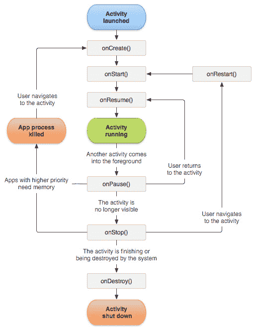
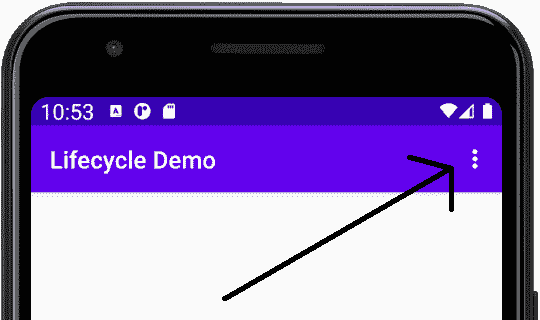
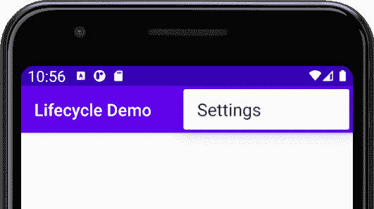

# *第六章*:安卓生命周期

在本章中，我们将熟悉安卓应用程序的生命周期。起初，这听起来可能有点奇怪，计算机程序有生命周期，但它很快就会有意义。

生命周期是所有安卓应用程序与安卓操作系统交互的方式。就像人类的生命周期与周围的世界互动一样，我们别无选择，只能与它互动，如果我们想让我们的应用程序生存下去，就必须准备好处理不同的事件，而无需通知。

我们将看到应用程序从创建到销毁的生命周期阶段，以及这如何帮助我们知道将我们的 Java 代码放在哪里，这取决于我们试图实现什么。

简而言之，在本章中，我们将了解以下内容:

*   安卓应用的生活和时代
*   什么是方法覆盖
*   安卓生命周期的各个阶段
*   我们需要知道和做什么来编码我们的应用程序
*   生命周期演示迷你应用。
*   快速查看代码结构，以便在下一章中了解 Java 编码

让我们开始了解安卓的生命周期。

# 技术要求

你可以在[https://GitHub . com/PacktPublishing/Android-初学者编程-第三版/tree/main/章节%2006](https://github.com/PacktPublishing/Android-Programming-for-Beginners-Third-Edition/tree/main/chapter%2006) 找到本章中出现的代码文件。

# 一款安卓应用的生命和时代

我们已经谈到了代码的结构；我们知道我们可以编写类，在这些类中，我们有方法，这些方法包含我们的代码，从而完成事情。我们还知道，当我们希望一个方法中的代码运行(被执行)时，我们通过使用它的名称来调用该方法。

此外，在 [*第二章*](02.html#_idTextAnchor043) *、第一接触:Java、XML 和 UI 设计器*中，我们了解到就在应用准备启动之前，安卓本身就调用了`onCreate`方法。当我们输出到 logcat 并使用`Toast`类向用户发送弹出消息时，我们看到了这一点。

我们将在这一章看到的是在我们编写的每个应用程序的整个生命周期中发生的事情——当它开始和结束时，以及其间的几个阶段。我们将会看到，安卓在许多场合与我们的应用程序交互，每次运行时。

# 安卓如何与我们的应用互动

它通过调用包含在`Activity`类中的方法来实现。即使该方法在我们的 Java 代码中不可见，它仍然在适当的时候被安卓调用。如果这似乎没有任何意义，那就继续读下去。

你有没有想过为什么`onCreate`方法前面有一行奇怪的代码？

```java
@Override
```

这里发生的事情是我们在对安卓说，当你调用`onCreate`时，请使用我们的覆盖版本，因为我们当时有些事情要做。

此外，您可能还记得`onCreate`方法中看起来很奇怪的第一行代码:

```java
super.onCreate(savedInstanceState)
```

这是在告诉安卓在继续我们的覆盖版本之前调用`onCreate`的原始/官方版本。这不仅仅是安卓的一个怪癖——方法 **覆盖**是将构建到 Java 中的。

我们还可以选择覆盖许多其他方法，它们允许我们在安卓应用程序的生命周期中的适当时间添加代码。就像`onCreate`在 app 展示给用户之前被调用一样，其他时候调用的方法也更多。我们还没有看到它们，还没有覆盖它们，但是它们在那里，它们被调用，它们的代码执行。

我们需要关心安卓随时调用的我们的应用程序的方法的原因是它们控制着我们代码的生死。例如，如果我们的应用程序允许用户输入一个重要的提醒。然后，在输入提醒的中途，他们的手机响起，我们的应用消失了，数据(提醒)也不见了。

重要的是，值得庆幸的是，在我们的应用程序生命周期中，我们了解安卓将在何时、为何以及调用哪些方法是非常简单的。然后，我们就可以知道在哪里需要重写方法来添加我们自己的代码，以及在哪里添加定义我们的应用程序的真正功能(代码)。

让我们检查一下安卓的生命周期，然后我们可以继续了解 Java 的来龙去脉，我们将知道我们编写的代码应该放在哪里。

# 安卓生命周期的简化解释

如果你曾经使用过安卓设备，你可能已经注意到它的工作方式与许多其他操作系统截然不同。例如，你可以使用一个应用程序——比如你正在检查人们在脸书做什么。然后，您会收到一封电子邮件通知，并点击该通知进行阅读。在阅读电子邮件的中途，你可能会收到推特通知，因为你在等待你关注的人的重要消息，你会中断你的电子邮件阅读，轻轻一点就把应用程序换成推特。

看完这条推文，你想玩一个愤怒的小鸟游戏，但是在第一次玩的中途，你突然想起了脸书的帖子。所以，你退出愤怒的小鸟，点击脸书图标。

然后你继续脸书，可能就在你离开的同一时间。你可以继续阅读邮件，决定回复推文，或者启动一个全新的应用程序。

所有这些前前后后都需要操作系统进行大量管理，独立于各个应用程序本身。

比方说，在我们刚刚讨论的上下文中，一台 Windows PC 和 Android 之间的区别是这样的:对于 Android，尽管用户决定他们正在使用哪个应用程序，但 OS 决定何时关闭(销毁)一个应用程序以及**我们用户的数据**(就像假设的注释一样)。我们只需要在编写应用程序时考虑这一点。仅仅因为我们可能编写代码来用用户的输入做一些很酷的事情，并不意味着安卓会让代码执行。

## 生命周期阶段被揭开神秘面纱

安卓系统有多个不同的阶段，任何给定的应用程序都可以进入。根据不同的阶段，安卓系统决定用户如何查看应用程序，或者是否查看应用程序。

安卓有这些阶段，因此它可以决定哪个应用程序正在使用，然后它可以提供适量的资源，例如内存和处理能力。

此外，当用户与设备交互时，例如通过触摸屏幕，安卓必须将交互的细节提供给正确的应用程序。例如，在《愤怒的小鸟》中，一个拖拽和释放的动作意味着拍一张照片，但在一个消息应用程序中，它可能意味着删除一条短信。

我们已经提出了用户什么时候退出我们的 app 接听电话的问题；他们会失去他们的进展/数据/重要记录吗？

安卓有一个系统，出于解释的目的稍微简化一下，这意味着安卓设备上的每个应用程序都处于以下阶段之一:

*   正在创建
*   开始
*   重新开始
*   运转
*   暂停
*   填料
*   被摧毁

希望阶段列表看起来合乎逻辑。例如，用户按下脸书应用图标，该应用被**创建**。然后是**启动**。到目前为止一切都很简单，但是下一个名单是**恢复**。

如果我们可以暂时接受应用程序在启动后恢复，然后随着我们的继续，一切都会变得清晰，这并不像最初看起来的那样不合逻辑。

**恢复后，**app 正在**运行**。此时，脸书应用程序可以控制屏幕、更大份额的系统内存和处理能力，并接收用户输入的详细信息。

那么，当我们从脸书应用程序切换到电子邮件应用程序时，我们的例子如何呢？

当我们点击进入阅读我们的电子邮件时，脸书应用将进入**暂停**阶段，随后**停止**阶段，电子邮件应用将进入**被** **创建**阶段，随后**恢复**，然后**运行**。

如果我们决定重游脸书，就像前面的场景一样，脸书应用程序可能会跳过创建，直接进入**继续**，然后再次运行**，很可能就在我们离开的地方。**

 **注意，在任何时候，安卓都可以决定**停止**，然后**摧毁**一个应用。在这种情况下，当我们再次运行该应用时，它将需要在第一阶段再次被**创建**。

因此，如果脸书的应用程序停止运行足够长的时间，或者愤怒的小鸟需要如此多的系统资源，以至于安卓摧毁了脸书的应用程序，那么我们找到之前阅读的准确帖子的体验可能会有所不同。

如果所有这些阶段的东西都开始变得令人困惑，那么你会很高兴地知道，提及它的唯一理由如下:

*   你知道它的存在
*   我们偶尔需要与它互动
*   当我们这样做的时候，我们会一步一步来

现在我们了解了生命周期阶段，让我们了解如何处理它们。

# 我们如何处理生命周期阶段

当我们在编程一个应用程序时，我们如何与这种复杂性互动？好消息是，当我们创建第一个项目时自动生成的安卓代码为我们完成了大部分工作。

正如我们已经讨论过的，我们只是看不到处理这种交互的方法，但是如果需要的话，我们确实有机会**覆盖**它们，并将我们自己的代码添加到那个阶段。

这意味着我们可以继续学习 Java 和制作安卓应用程序，直到我们偶尔需要在某个阶段做些什么。

重要说明

如果我们的应用程序有多个活动，它们将有各自的生命周期。这不一定会让事情变得复杂，总的来说，它会让我们的事情变得更容易。

接下来是对安卓提供的管理生命周期阶段的方法的快速解释。为了澄清我们对生命周期方法的讨论，它们被列在我们已经讨论过的相应阶段的旁边。但是，正如您将会看到的，方法名称清楚地表明了它们适合的位置。

还有一个简短的解释或建议，当我们可能使用一个给定的方法，从而在一个特定的阶段互动。当我们阅读这本书的时候，我们会遇到这些方法中的大部分。我们当然已经看到了`onCreate`:

*   `onCreate`:此方法在**创建**活动时执行。在这里，我们为应用程序做好了一切准备，包括用户界面(如调用`setContentView`)、图形和声音。
*   `onStart`:此方法在 app 处于**启动**阶段时执行。
*   `onResume`:这个方法在`onStart`之后运行，但是也可以在我们之前暂停的活动恢复之后进入(最符合逻辑)。我们可能会从应用程序中断时重新加载以前保存的用户数据(如重要注释)，可能是因为电话或用户运行另一个应用程序。
*   `onPause`:这个发生在我们的 app**暂停**的时候。在这里，我们可以保存未保存的数据(如注释)，这些数据可以在`onResume`中重新加载。当另一个用户界面元素显示在当前活动的顶部时(例如，弹出对话框)，或者当活动即将停止时(例如，当用户导航到不同的活动时)，活动总是会转换到暂停状态。
*   `onStop`:这个涉及到**停止**阶段。这是我们可以撤销在`onCreate`中所做的一切的地方，比如释放系统资源或者将信息写入数据库。如果我们到达这里，我们可能很快就会被毁灭。
*   `onDestroy`:这是我们的活动最终被**摧毁**的时候。这个阶段没有回头路。这是我们有序拆除应用的最后机会。如果我们到达这里，下次我们将从头开始经历生命周期阶段。

此图显示了方法之间可能的执行流程:



图 6.1–执行流程

所有的方法描述和它们相关的阶段应该看起来简单明了。唯一真正的问题是跑步阶段怎么样？正如我们将在其他方法/阶段中编写代码时看到的那样，`onCreate`、`onStart`和`onResume`方法将准备应用程序，然后应用程序持续运行，形成运行阶段。然后是`onPause`、`onStop`和`onDestroy`方法。

现在我们可以用一个迷你应用程序来看看这些生命周期方法的实际应用。我们将通过覆盖它们并为每个添加一个`Log`消息和一个`Toast`消息来实现。这将直观地证明我们的应用程序所经历的阶段。

# 生命周期演示应用

在这一节中，我们将做一个快速实验，这将有助于我们熟悉我们的应用程序使用的生命周期方法，并让我们有机会玩更多的 Java 代码。

按照以下步骤启动一个新项目，然后我们可以添加一些代码:

1.  开始一个新项目。
2.  选择**基本活动**模板。
3.  调用项目**生命周期演示**。当然，代码在下载包中的 [*第 6 章*](#_idTextAnchor119) 文件夹中，如果你想参考它或复制粘贴它。
4.  等待AndroidStudio生成项目文件，然后在代码编辑器中打开`MainActivity.java`文件。

您已经使用所有默认设置创建了一个新项目。我们只需要`MainActivity.java`文件进行演示，不会构建用户界面。

## 编写生命周期演示应用程序

在`MainActivity.java`文件中，找到`onCreate`方法，在结束的大括号`}`前添加这两行代码，这标志着`onCreate`方法的结束:

```java
Toast.makeText(this, "In onCreate", Toast.LENGTH_SHORT).show();
Log.i("info", "In onCreate");
```

整个`onCreate`方法现在应该看起来像下面这段代码，突出显示的代码是我们刚刚添加的两行代码，而`…`是我们跳过了一些自动生成的代码行以使本书更具可读性的地方。有关完整的代码列表，请查看下载包中的`MainActivity.java`文件。下面是代码:

```java
@Override
protected void onCreate(Bundle savedInstanceState) {
   super.onCreate(savedInstanceState);
   setContentView(R.layout.activity_main);    
             Toast.makeText(this, "In onCreate", 
 Toast.LENGTH_SHORT).show();
 Log.i("info", "In onCreate");
}
```

小费

记住你需要使用 *Alt* + *输入*键盘组合两次来导入`Toast`和`Log.`所需的类

在`onCreate`方法的右花括号`}`后，留下一行，并添加以下五个生命周期方法及其包含的代码。还要注意，我们以什么顺序添加被重写的方法并不重要。安卓会以正确的顺序调用它们，而不管我们键入它们的顺序:

```java
@Override
public void onStart() {
   // First call the "official" version of this method
   super.onStart();
   Toast.makeText(this, "In onStart", 
         Toast.LENGTH_SHORT).show();
   Log.i("info", "In onStart");
}
@Override
public void onResume() {
   // First call the "official" version of this method
   super.onResume();
   Toast.makeText(this, "In onResume",
         Toast.LENGTH_SHORT).show();
   Log.i("info", "In onResume");
}
@Override
public void onPause() {
   // First call the "official" version of this method
   super.onPause();
   Toast.makeText(this, "In onPause", 
         Toast.LENGTH_SHORT).show();
   Log.i("info", "In onPause");
}
@Override
public void onStop() {
   // First call the "official" version of this method
   super.onStop();
   Toast.makeText(this, "In onStop", 
         Toast.LENGTH_SHORT).show();
   Log.i("info", "In onStop");
}
@Override
public void onDestroy() {
   // First call the "official" version of this method
   super.onDestroy();
   Toast.makeText(this, "In onDestroy", 
         Toast.LENGTH_SHORT).show();
   Log.i("info", "In onDestroy");
}
```

首先，我们来谈谈代码本身。请注意，方法名称都对应于我们在本章前面讨论的生命周期方法和阶段。请注意，所有方法声明的前面都有`@Override`行代码。还要看到每个方法里面的第一行代码是`super.on...`。

这里的到底是怎么回事如下:

*   安卓在我们已经讨论过的不同时间调用我们的方法。
*   `@Override`关键字显示这些方法替换/覆盖了作为 Android API 一部分提供的方法的原始版本。请注意，我们没有看到这些被覆盖的方法，但它们确实存在，如果我们没有覆盖它们，这些原始版本将由安卓而不是我们调用。

`super.on...`是每个被重写方法中的第一行代码，然后调用这些原始版本。因此，我们不会简单地覆盖这些原始方法来添加我们自己的代码——我们也会调用它们，它们的代码也会被执行。

小费

对于好奇的人来说，关键词`super`就是超一流。随着我们的进展，我们将在几章中探索方法重写和超级类。

最后，您添加的代码将使每个方法输出一条`Toast`消息和一条`Log`消息。然而，输出的消息各不相同，从双引号`""`之间的文本可以看出这一点。输出的消息将表明是哪种方法产生的。

## 运行生命周期演示应用程序

现在我们已经查看了代码，我们可以玩我们的应用程序，并从发生的事情中了解生命周期:

1.  在设备或模拟器上运行应用程序。
2.  观看模拟器的屏幕，您会看到以下消息在屏幕上一个接一个地出现为`Toast`消息:**在 onCreate** 、**在 onStart** 和**在 onResume。**
3.  请注意 logcat 窗口中的以下消息。如果消息太多，请记住您可以通过将**日志级别**下拉列表设置为**信息**来过滤它们。

    ```java
                 info:in onCreate
                 info:in onStart
                 info:in onResume
    ```

4.  现在点击模拟器或设备上的后退按钮。请注意，您会收到以下三条`Toast`消息，它们的顺序完全相同:**在 onPause** 、**在 ontop**和**在 onDestroy** 。验证我们在 logcat 窗口中有匹配的输出。
5.  接下来，通过点击模拟器/设备屏幕上的图标，运行一个不同的应用程序——可能是来自[*第 1 章*](01.html#_idTextAnchor014) *【初代安卓和 Java】*的*你好安卓*应用程序。
6.  现在尝试以下操作:在模拟器上打开任务管理器。
7.  如果您不确定如何在模拟器上完成此操作，请参见 [*第 3 章*](03.html#_idTextAnchor064) *【探索AndroidStudio和项目结构】*和*将模拟器用作真实设备*部分。
8.  您现在应该可以在设备上看到所有最近运行的应用程序。
9.  点击**生命周期演示**应用程序，注意通常会显示三条启动消息。这是因为我们的应用程序之前被破坏了。
10.  不过，现在再次点击**任务管理器**按钮，切换到**你好安卓**应用。请注意，这一次，只显示了 onPause 中的**和 ontop**中的**消息。验证我们在 logcat 中有匹配的输出。app 已经*不是*被破坏了。**
11.  现在，再次使用**任务管理器**按钮，切换到**生命周期** **演示**应用程序。您将看到，只显示 onStart 中的**和 onResume** 中的**消息，表示无需`onCreate`即可让应用再次运行。这正如所料，因为该应用之前没有被破坏，只是被停止了。**

接下来，让我们谈谈运行该应用时看到的情况。

## 检查生命周期演示应用程序输出

当我们第一次启动生命周期演示应用时，我们看到调用了`onCreate`、`onStart`和`onResume`方法。然后，当我们使用**返回**按钮关闭应用程序时，调用了`onPause`、`onStop`和`onDestroy`方法。

此外，我们从代码中知道，所有这些方法的原始版本也被调用，因为我们自己用`super.on...`代码调用它们，这是我们在每个被重写的方法中做的第一件事。

当我们使用任务管理器在应用程序之间切换时，我们应用程序的行为出现了古怪——当从生命周期演示中切换出来时，它没有被破坏，随后，当切换回来时，没有必要运行`onCreate`。

我的吐司呢？

开始的三个和结束的三个`Toast`消息被排队，并且在显示它们的时候方法已经完成。您可以通过再次运行实验来验证这一点，并且会看到在显示第二条`Toast`消息之前，所有三条启动/关闭日志消息都已输出。然而，`Toast`的信息确实加强了我们对订单的了解，如果不是时间的话。

完全有可能(但不太可能)当你遵循前面的步骤时会得到稍微不同的结果。我们可以肯定的是，当我们的应用程序由数百万不同的用户在数千种不同的设备上运行时，这些用户对与他们的设备交互有不同的偏好，安卓会在我们无法轻易预测的时候调用生命周期方法。

例如，当用户按下主页按钮退出应用程序时会发生什么？当我们一个接一个地打开两个应用程序，然后使用后退按钮切换到更早的应用程序时，这会破坏还是只是停止应用程序？当用户的任务管理器中有十几个应用程序，而操作系统需要销毁一些以前只停止的应用程序时，会发生什么；我们的 app 会成为“受害者”之一吗？

当然，您可以在模拟器上测试前面所有的场景。但是结果只会在你第一次测试的时候才是真的。不能保证每次都会显示相同的行为，当然也不能保证每个不同的安卓设备上都会显示相同的行为。

终于有好消息了！解决所有这些复杂性的方法是遵循一些简单的规则:

*   用`onCreate`方法设置你的应用程序准备运行。
*   用`onResume`方法加载你的用户数据。
*   用`onPause`方法保存你的用户数据。
*   整理好你的 app，用`onDestroy`的方法做一个好的安卓公民。
*   在整本书中，注意我们可能喜欢使用`onStart`和`onStop`的几个场合。

如果我们做了上面提到的事情(我们将在本书中看到如何)，我们就可以停止担心所有这些生命周期的东西，让安卓来处理它！我们还可以覆盖其他一些方法。那么，让我们看看他们。

## 其他一些被覆盖的方法

你可能已经注意到在我们所有使用基本活动模板的项目代码中还有另外两个自动生成的方法。分别是`onCreateOptionsMenu`和`onOptionsItemSelected`。大多数安卓应用都有一个弹出菜单，所以默认情况下AndroidStudio会生成一个；包括使其工作的基本代码。

您可以从项目浏览器中看到描述`res/menu/menu_main.xml`中菜单的 XML。XML 代码的关键行是这样的:

```java
<item
      android:id="@+id/action_settings"
      android:orderInCategory="100"
      android:title="@string/action_settings"
      app:showAsAction="never" />
```

这描述了带有文本**设置**的菜单**项目**。如果您运行任何使用我们迄今为止创建的基本活动模板构建的应用程序，您将看到如下所示的按钮:



图 6.2–设置按钮

如果您点击按钮，您将看到它在运行，如下所示:



图 6.3–设置选项

那么，`onCreateOptionsMenu`和`onOptionsItemSelected`方法是如何产生这些结果的呢？

`onCreateOptionsMenu`方法从`menu_main.xml`文件加载菜单，代码如下:

```java
getMenuInflater().inflate(R.menu.menu_main, menu);
```

它被`onCreate`方法的默认版本调用，这就是为什么我们没有看到它发生。

小费

我们将使用 [*第 17 章*](17.html#_idTextAnchor300)**数据持久化和共享、*中的弹出菜单在我们 app 的不同屏幕之间切换。*

 *当用户点击菜单按钮时，调用`onOptionsItemSelected`方法。这个方法处理当一个项目被选中时会发生什么。现在什么都没发生——只是`returns true`。

请随意在这些方法中添加`Toast`和`Log`消息，以测试我刚才描述的顺序和时间。我只是认为这是一个快速介绍这两种方法的好时机，因为它们一直潜伏在我们的代码中，没有介绍，我不想让它们感到被冷落。

现在我们已经看到了安卓的生命周期是如何工作的，并被引入了一系列我们可以覆盖的方法来与生命周期交互，我们最好学习 Java 的基础知识，这样我们就可以编写一些代码来使用这些方法以及我们自己的方法。

# Java 代码的结构——重温

我们已经看到每次我们创建一个新的安卓项目，我们也创建一个新的 Java **包**作为我们编写的代码的一种容器。

我们还学习了和一起玩**类**。我们已经从安卓应用编程接口中导入并直接利用了类，如`Log`和`Toast`。我们也使用了`AppCompatActivity`类，但是使用方式与`Log`和`Toast`不同。您可能还记得到目前为止我们所有项目中的第一行代码，在`import`语句之后，使用了`extends`关键字:

```java
public class MainActivity extends AppCompatActivity {
```

当我们扩展一个类而不仅仅是导入它时，我们是在使它成为我们自己的。事实上，如果你再看一下这一行代码，你可以看到我们正在用一个新的名字`MainActivity.`创建一个新的类，但是它是基于安卓应用编程接口的`AppCompatActivity`类。

重要说明

`AppCompatActivity`类是`Activity`类的稍加修改的版本。它为旧版本的安卓提供了额外的功能，否则这些功能将不会出现。我们所讨论的关于`Activity`的一切同样适用于`AppCompatActivity`。随着我们的进步，我们会在`Activity`课上看到更多的变化。完全有可能你有一个不同的类来代替`AppCompatActivity`，这取决于自从这个被写出来后发生的变化。AndroidStudio的更新有时会改变它在创建新项目时使用的默认`Activity`类。如果名字以`...Activity`结尾，那也没关系，因为我们讨论过的和将要讨论的都是同样真实的。我就简称这个班为`Activity`。

总之:

*   我们可以导入类来使用它们。
*   我们可以扩展类来使用它们。
*   We will eventually make our own classes.

    这里的关键点是:

    各种形式的类是 Java 中每一行代码的基础。Java 中的一切都是或者是类的一部分。

我们自己的类和其他人编写的类是我们代码的构建块，类中的方法包装了功能代码——完成工作的代码。

我们可以在我们扩展的类中编写方法；正如我们在 [*第 2 章*](02.html#_idTextAnchor043)**中对`topClick`和`bottomClick`所做的一样:第一次接触:Java、XML 和 UI 设计器*。此外，我们重写了已经是其他人编写的类的一部分的方法，比如`onCreate`和`onPause`等等。*

 *然而，我们放入这些方法中的唯一代码是使用`Toast`和`Log`的几次调用。我们不会用它来编写下一个杀手级应用。但是现在我们可以采取更多的措施。

# 介绍片段和生命周期

你可能还记得从 [*第二章*](02.html#_idTextAnchor043) *【第一次接触:Java，XML，UI Designer，*中基本活动模板中的 Java 代码不仅仅包含在`MainActivity.java`文件中。还有`FirstFragment.java`和`SecondFragment.java`文件。我们了解到，这些文件包含代码控制当用户在基本活动模板应用程序的两个屏幕之间导航时会发生什么。这两个文件中的代码在结构上与`MainActivity.java`文件不同。这里快速浏览一下`FirstFragment.java`:

```java
public class FirstFragment extends Fragment {
    @Override
    public View onCreateView(
            LayoutInflater inflater, ViewGroup container,
            Bundle savedInstanceState
    ) 
     {
        ...
    }

     ...
}
```

我从这个文件中省略了很多代码，因为对于这个介绍性讨论来说，它是不必要的。一个**片段**也是一个类，就像一个**活动**也是一个类一样。一个`Fragment`可以，并且在这个应用中确实代表了一个来自该应用的屏幕。该应用程序的`Fragment`类和包含它们的其他应用程序由`Activity`类控制。我们将仔细查看第 24 章 、*设计模式、多布局和片段*中的`Fragment`类。这里需要注意的是`Fragment`类有一个`onCreateView`方法。

当我们的应用程序使用一个或多个`Fragment`类的实例时，它们也将是安卓生命周期的一部分，并且`Fragment`类有自己的一套生命周期方法，其中`onCreateView`就是一个。

操作系统生命周期、`Activity`类和`Fragment`类如何相互作用将在 [*第 24 章*](24.html#_idTextAnchor411) *、设计模式、多布局和片段*中解释。现在值得知道的是，它们都是相互关联的。

# 总结

我们已经了解了安卓的生命周期，以及操作系统如何在设定的时间调用设定的方法。

我们还看到，不仅是我们可以调用我们的代码。操作系统还可以调用包含在我们已经重写的方法中的代码。通过将适当的代码添加到各种被覆盖的生命周期方法中，我们可以确保在正确的时间执行正确的代码。

我们现在需要做的是学习如何编写更多的 Java 代码。在下一章中，我们将开始关注 Java，因为我们已经在安卓上有了如此好的基础，所以我们练习和使用所学的一切都没有问题。****