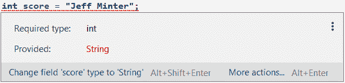

# *第 7 章* : Java 变量、运算符和表达式

在这一章和下一章中，我们将学习和练习 Java 数据的核心基础以及如何操作这些数据。在这一章中，我们将专注于创建和理解数据本身，在下一章中，我们将看到如何操纵和响应它。

我们还将快速回顾我们在前面几章中所学的关于 Java 的知识，然后深入学习如何编写我们自己的 Java 代码。我们将要学习的原理不仅限于 Java，也适用于其他编程语言。

到这一章结束时，您将可以轻松地编写在安卓系统中创建和使用数据的 Java 代码。本章将带您了解以下主题:

*   理解 Java 语法和行话
*   存储和使用带有变量的数据
*   使用变量
*   使用运算符更改变量的值
*   尝试表达式

让我们学习一些 Java。

# 技术要求

你可以在[https://GitHub . com/PacktPublishing/Android-初学者编程-第三版/tree/main/章节%2007](https://github.com/PacktPublishing/Android-Programming-for-Beginners-Third-Edition/tree/main/chapter%2007) 找到本章中出现的代码文件。

# Java 无处不在

我们即将学习的核心 Java 基础知识适用于我们继承的类(如`AppCompatActivity`)以及我们自己编写的类(正如我们将在 [*第 10 章*](10.html#_idTextAnchor187)*面向对象编程*中开始做的那样)。

由于在编写自己的类之前学习基础知识更符合逻辑，我们将使用扩展的`Activity`类`AppCompatActivity`，在一个小型项目中添加一些 Java 代码。我们将再次使用`Log`和`Toast`类来查看我们在`Activity`类的被覆盖的`onCreate`方法中的编码结果，以触发我们代码的执行。

然而，当我们转到 [*第 10 章*](10.html#_idTextAnchor187)*面向对象编程*并开始编写自己的类，以及更多地了解其他人编写的类是如何工作的时，我们在这里所学的一切也将适用——事实上，如果您将它从`Activity`类中剥离出来并粘贴到另一个 Java 环境中，您在本章和下一章所学的所有 Java 都将适用，例如:

*   任何主要的桌面操作系统
*   许多现代电视
*   卫星导航
*   智能冰箱

Java 也会在那里工作！

调用所有 Java 大师

如果你已经做过一些 Java 编程，理解了下面的关键词(`if`、`else`、`while`、`do while`、`switch`、`for`，大概可以跳到[、*第十章*、](10.html#_idTextAnchor187)、*面向对象编程*。或者，您可能希望浏览这些信息作为复习资料。

让我们继续学习如何用 Java 编写代码。

# 理解 Java 语法和行话

纵观本书，我们会用通俗易懂的英语来讨论一些技术性的东西。您永远不会被要求阅读以前没有用非技术语言解释过的 Java 或 Android 概念的技术解释。

到目前为止，有几次我要求您接受一个简化的解释，以便在更合适的时候提供更全面的解释，就像我对类和方法所做的那样。

话虽如此，Java 和 Android 社区都充斥着用技术术语说话的人，要加入这些社区并从中学习，你需要了解他们使用的术语。因此，这本书采取的方法是使用完全通俗易懂的语言学习一个概念或欣赏一个想法，但同时引入行话/技术术语作为学习的一部分。

Java 语法是我们将 Java 的语言元素组合在一起以生成在 Dalvik **虚拟机** ( **VM** )中工作的代码的方式。Java 语法是我们使用的单词的组合，并将这些单词组成类似句子的结构，组成我们的代码。

这些 Java“单词”数量很多，但是小块小块的比任何人类语言都更容易学习。我们把这些词称为**关键词**。

我相信，如果你会阅读，那么你就可以学习 Java，因为学习 Java 要容易得多。那么，完成了初级 Java 课程的人和专业程序员有什么区别呢？

把语言学生和杰出诗人区分开来的完全一样的东西。Java 的专业知识不在于我们知道如何使用的 Java 关键字的数量，而在于我们使用它们的方式。语言的掌握来自于练习、进一步的学习和更熟练地使用关键词。许多人认为编程既是一门科学，也是一门艺术，这是有一定道理的。

## 更多代码注释

随着您在编写 Java 程序方面变得更加先进，您用来创建程序的解决方案将变得更长、更复杂。此外，正如我们将在后面的章节中看到的，Java 旨在通过让我们将代码分成单独的类来管理复杂性，通常是跨多个文件。

**代码注释**是 Java 程序中在程序执行中没有任何功能的部分。编译器会忽略这些注释。它们的作用是帮助程序员记录、解释和澄清他们的代码，让他们自己或其他可能需要使用或更改代码的程序员更容易理解。

我们已经看到了一个单行评论。此处转载:

```java
// this is a comment explaining what is going on
```

前面的注释以两个`//`正斜杠字符开始。注释在行尾结束。因此，该行中的任何内容都只供人类使用，而下一行中的任何内容(除非是另一条注释)都需要语法正确的 Java 代码，如下所示:

```java
// I can write anything I like here
but this line will cause an error
```

我们可以使用多个单行注释，如下图所示:

```java
// Below is an important note
// I am an important note
// We can have as many single line comments like this as we like
```

如果我们想暂时禁用一行代码，单行注释也很有用。我们可以把`//`放在代码前面，它不会包含在程序中。还记得这段告诉安卓加载我们布局的代码吗？

```java
// setContentView(R.layout.activity_main);
```

在前面的情况下，布局不会被加载，应用程序在运行时会有一个空白屏幕，因为编译器会忽略整行代码。

重要说明

我们在 [*第五章*](05.html#_idTextAnchor101)**带 CardView 和 ScrollView 的美丽布局*中看到了这一点，当时我们暂时评论了我们的一个方法。*

 *在 Java 中还有另一种类型的注释，称为**多行注释**。多行注释对于跨越多行的较长注释以及在代码文件顶部添加版权信息等内容非常有用。与单行注释一样，多行注释可以用来暂时禁用代码——在这种情况下，通常是跨多行。

前导`/*`和结尾`*/`之间的所有内容都被编译器忽略。以下是一些例子:

```java
/*
   You can tell I am good at this because my
   code has so many helpful comments in it.
*/
```

多行注释的行数没有限制；哪种类型的评论最好使用将取决于情况。在这本书里，我总是会明确地解释文本中的每一行代码，但是你经常会在代码本身中发现大量的注释，这些注释增加了进一步的解释、洞察力或上下文。因此，彻底阅读所有代码总是一个好主意。

```java
/*
   The winning lottery numbers for next Saturday are
   9,7,12,34,29,22
   But you still want to make Android apps?
*/
```

小费

所有优秀的 Java 程序员都会在代码中随意添加注释！

# 存储和使用带变量的数据

我们可以把**变量**想象成一个命名的储物盒。我们选择一个的名字，也许是`variableA`。这些名字就像我们程序员进入用户安卓设备内存的窗口。

变量是内存中的值，在必要时可以使用或更改它们的名称。

计算机内存有一个高度复杂的寻址系统，幸运的是我们不需要与之交互。Java 变量允许我们为程序需要处理的所有数据设计自己方便的名称。**达尔维克虚拟机** ( **DVM** )将处理与操作系统交互的所有技术细节，操作系统将依次与物理内存交互。

所以，我们可以把安卓设备的内存想象成一个巨大的仓库，就等着我们添加变量。当我们给变量命名时，它们被存储在仓库中，以备我们需要时使用。当我们使用变量的名称时，设备确切知道我们指的是什么。然后我们可以告诉它做这样的事情:

*   给`variableA` 赋值
*   将`variableA`添加到`variableB`
*   测试`variableB`的值，并根据结果采取行动
*   …还有更多，我们很快就会看到

在一个典型的应用程序中，我们可能有一个名为`unreadMessages`的变量，也许是为了保存用户未读消息的数量。我们可以在新消息到达时添加它，在用户阅读消息时删除它，并在应用程序布局的某个地方向用户显示它，以便他们知道他们有多少未读消息。

以下是可能出现的一些情况:

*   一个用户获得三条新消息，因此将`3`添加到`unreadMessages`的值中。
*   用户登录到该应用程序，因此使用`Toast`显示一条消息以及存储在`unreadMessages`中的值。
*   一个用户看到一堆消息来自他们不喜欢的人，就删除了六条消息。然后我们可以从`unreadMessages`中减去 6。

这些是变量名称的任意示例，如果您不使用 Java 限制的任何字符或关键字，您实际上可以随意调用您的变量。

然而，在实践中，最好采用**命名约定**，这样您的变量名就会一致。在本书中，我们将使用一个松散的变量名约定，从小写字母开始。当变量名称中有多个单词时，第二个单词将以大写字母开头。这就是叫做**骆驼套**。

以下是一些例子:

*   `unreadMessages`
*   `contactName`
*   `isFriend`

在我们看一些带有变量的真实 Java 代码之前，我们需要先看看我们可以创建和使用的变量类型。

## 变量类型

不难想象即使是一个简单的 app 也会有相当多的变数。在前一节中，我们引入了`unreadMessages`变量作为假设的例子。如果一个应用程序有一个联系人列表，并且需要记住他们的每个名字，该怎么办？我们可能需要每个联系人的变量。

当应用程序需要知道联系人是朋友还是普通联系人时，该怎么办？我们可能需要测试朋友状态的代码，然后将来自该联系人的消息添加到适当的文件夹中，以便用户知道这些消息是否来自朋友。

包括安卓应用在内的计算机程序的另一个常见要求是真假。

为了涵盖这一类型以及您可能想要存储或操作的许多其他类型的数据，Java 有**类型**。

### 原始类型

变量有很多类型，我们甚至可以发明自己的类型。但是现在，我们将看看最常用的内置 Java 类型，公平地说，它们几乎涵盖了我们可能会遇到的每种情况。提供一些例子是解释类型的最好方法。

我们已经讨论了假设的`unreadMessages`变量。这个变量当然是一个数字，所以我们必须通过给它一个合适的类型来告诉 Java 编译器。

另一方面，假设的`contactName`变量当然会保存组成联系人姓名的字符。

持有常规号码的类型为称为 **int** 类型，持有类名数据的类型为称为 **String** 类型；如果我们试图将联系人姓名存储在`int`类型中，如`unreadMessages`，意为数字，我们肯定会遇到麻烦，从下面的截图中可以看出:



图 7.1–存储联系人姓名

正如我们所看到的，Java 的设计是为了使这种错误不可能成为一个运行的程序。

以下是 Java 中变量的主要类型:

*   `int`:一个`int`类型是存储整数，整数。这种类型使用 32 块(**位**)内存，因此可以存储略超过 20 亿的值，包括负值。
*   `long`: As the name hints at, `long` data types can be used when even larger numbers are needed. A `long` type uses 64 bits of memory, and 2 to the power of 63 is what we can store in this. If you want to see what that looks like, here it is: 9,223,372,036,854,775,807\. Perhaps surprisingly, there are uses for long variables, but the point is that if a smaller variable will do, we should use it because our program will use less memory.

    重要说明

    你可能想知道什么时候你可以使用这种大小的数字。显而易见的例子是进行复杂计算的数学或科学应用程序，但另一个用途可能是计时。当你计算某件事需要多长时间时，Java `Date`类使用自 1970 年 1 月 1 日以来的毫秒数。一毫秒是一秒的千分之一，所以从 1970 年以来已经有相当多的毫秒了。

*   `float`:这是针对浮点数的——也就是精度超过小数点的数字。由于一个数的小数部分与整数部分一样占用内存空间，因此与非浮点数相比，一个数在`float`类型中的可能范围减小了。因此，除非我们的变量将使用额外的精度，`float`将不是我们选择的数据类型。
*   `double`:当一个`float`型的精度不够的时候，我们有`double`。
*   `boolean`: We will be using plenty of Booleans throughout the book. The `boolean` variable type can be either `true` or `false`; nothing else. Booleans answer questions such as the following:

    *联系人是朋友吗？*

    *有新消息吗？*

    *一个布尔型的两个例子够吗？*

*   `char`:以`char`类型存储单个字母数字字符。它不会独自改变世界，但是如果我们把它们放在一起，它会很有用。
*   `short`:这种类型就像是`int`的节省空间版本。它可以用来存储既有正值又有负值的整数，并且可以对其执行数学运算。它与`int`的不同之处在于它只使用了 16 位内存，与`int`相比，这只是内存量的一半。`short`的缺点是，与`int`相比，它只能存储-32768 到 32767 范围内的一半数值。
*   `byte`: This type is like an even more space-saving version of `short`. It can be used to store whole numbers with both positive and negative values, and can have mathematical operations performed on it. Where it differs from `int` and `short` is that it uses only 8 bits of memory, which is just half the amount of memory compared to `byte`, and quarter the memory of `int`. The downside to `byte` is that it can only store half the range of values compared to `int`, from -32768 to 32767\. Saving 8 or even 16 bits in total is unlikely to ever matter; however, if you needed to store millions of whole numbers in a program, then `short` and `byte` are worth considering.

    重要说明

    我一直将关于数据类型的讨论保持在实用的水平，这在本书的上下文中是有用的。如果你对一个数据类型的值是如何存储的以及为什么限制是什么感兴趣，那么看看*甲骨文 Java 教程*网站，网址是 http://docs . Oracle . com/javase/tutorial/Java/nut sandbolts/data types . html。注意，你不需要比我们已经讨论过的更多的信息来继续阅读这本书。

正如我们刚刚了解到的，我们可能想要存储的每种类型的数据都需要特定数量的内存。因此，在开始使用变量之前，我们必须让 Java 编译器知道变量的类型。

前面描述的变量被称为**基元**类型。大多数原始类型贯穿于不同的编程语言(以及关键字)，所以如果你对类型和关键字有很好的理解，那么跳到另一种语言会远比第一次容易！这些类型使用预定义数量的内存，因此，使用我们的仓库存储类比，适合预定义大小的存储盒。

正如“原始”标签所暗示的，它们并不像**引用**类型那样复杂。

### 参考类型

您可能已经注意到我们没有涵盖`String`变量类型，我们之前使用它来引入保存字母数字数据的变量的概念，例如联系人的姓名。

#### 用线串

字符串是一种特殊类型变量的一个例子，称为一个**参考**类型。它们只是简单地引用内存中开始存储变量的地方，但是引用类型本身并没有定义特定的内存量。原因很简单:因为在程序运行之前，我们并不总是知道需要在其中存储多少数据。

我们可以把字符串和其他引用类型看作是不断扩展和收缩的存储盒。那么，这些`String`引用类型中的一个最终会不会撞上另一个变量呢？

当我们把一个设备的内存想象成一个巨大的仓库，里面装满了货架上贴有标签的存储盒时，那么你可以把 DVM 想象成一个超级高效的叉车司机，把不同类型的存储盒放在最合适的地方；而且，如果有必要，DVM 会在几分之一秒内快速移动东西，以避免碰撞。此外，当需要时，叉车司机达尔维克甚至会蒸发掉任何不需要的储物箱。

这一切都发生在不断卸载所有类型的新存储盒并将它们放在该类型变量的最佳位置的同时。达尔维克将引用变量与原始变量保存在仓库的不同部分，我们将在 [*第 12 章*](12.html#_idTextAnchor218)*堆栈、堆和垃圾收集器中了解更多细节。*

字符串可以用来存储任何键盘字符，比如`char`类型，但几乎可以是任何长度。从联系人的名字到整本书，任何东西都可以存储在一个单一的“T1”类型中。我们将定期使用字符串，包括在本章中。

我们还将探索更多的参考类型。

#### 数组

数组是一种存储大量相同类型变量的方式，为快速和高效访问做好了准备。我们将在 [*第 15 章*](15.html#_idTextAnchor267)*中查看数组、地图和随机数。*

把一个数组想象成我们仓库中的一个通道，某一类型的所有变量都以精确的顺序排列。数组是引用类型，因此 Dalvik 将它们作为 Strings 保存在仓库的同一部分。例如，我们可以使用一个数组来存储几十个联系人。

#### 班级

另一个参考类型是`class`类型，我们已经讨论过了，但是没有解释清楚。我们将在 [*第 10 章*](10.html#_idTextAnchor187)*面向对象编程*中熟悉课程。

现在，我们知道我们可能想要存储的每种类型的数据都需要一定的内存。因此，在开始使用变量之前，我们必须让 Java 编译器知道变量的类型。我们用变量**声明**来实现。

# 使用变量

理论够了。让我们看看如何使用我们的变量和类型。请记住，每种原语类型都需要特定数量的真实设备内存。这就是为什么编译器需要知道变量是什么类型的原因之一。

## 变量声明

我们必须先**声明**一个变量及其类型，然后再尝试使用它。要声明名为`unreadMessages`的类型为`int`的变量，我们需要键入以下内容:

```java
int unreadMessages;
```

就是这样——简单地陈述类型(在本例中为`int`)，然后留下一个空格，并键入您想要用于这个变量的名称。还要注意的是，行尾的`;`分号会告诉编译器，我们已经完成了这一行，接下来的内容，如果有的话，不是变量声明的一部分。

类似地，对于几乎所有其他变量类型，声明将以相同的方式发生。这里有一些例子。示例中的变量名是任意的。这就像在仓库里预留一个贴了标签的收纳盒。

看看下面的代码片段:

```java
long millisecondsElapsed;
float accountBalance;
boolean isFriend;
char contactFirstInitial;
String messageText;
```

注意我说的*几乎所有其他变量类型*。例外之一是`class`类型的变量。我们已经看到一些声明`class`类型变量的代码。你还记得`MainActivity.java`文件中 [*第三章*](03.html#_idTextAnchor064)*探索安卓工作室和项目结构*的这段代码片段吗？

```java
FloatingActionButton fab…
```

这段编辑过的代码片段声明了一个名为`fab`的类型为`FloatingActionButton`的变量。但是我们有点跑题了，会回到 [*第 10 章*](10.html#_idTextAnchor187)*面向对象编程*上课。

## 变量初始化

**初始化**是的下一步。这里，对于每种类型，我们初始化一个变量的值。这就像在仓库的储物盒里放一个值。

```java
unreadMessages = 10;
millisecondsElapsed = 1438165116841l;// 29th July 2016 11:19am
accountBalance = 129.52f;
isFriend = true;
contactFirstInitial = 'C';
messageText = "Hi reader, I just thought I would let you know that Charles Babbage was an early computing pioneer and he invented the difference engine. If you want to know more about him, you can click find look here: www.charlesbabbage.net";
```

请注意，`char`变量在初始化值周围使用了`'`单引号，而`String`类型使用了`"`双引号。

我们还可以将声明和初始化步骤结合起来。在这里，我们声明并初始化与之前相同的变量，但只需一步:

```java
int unreadMessages = 10;
long millisecondsElapsed = 1438165116841l;//29th July 2016 11:19am
float accountBalance = 129.52f;
boolean isFriend = true;
char contactFirstInitial = 'C';
String messageText = " Hi reader, I just thought I would let you know that Charles Babbage was an early computing pioneer and he invented the difference engine. If you want to know more about him, you can click this link www.charlesbabbage.net";
```

我们是单独声明和初始化还是一起声明和初始化取决于具体情况。重要的是，我们必须在某个时候同时做到这两点。

```java
int a;
// That's me declared and ready to go!
// The line below attempts to output a to the console
Log.i("info", "int a = " + a);
// Oh no I forgot to initialize a!!
```

这将导致以下情况:

**编译器错误:变量 a 可能没有初始化**

这条规则有一个重要的例外。在某些情况下，变量可以有**默认值**。我们将在 [*第 10 章*](10.html#_idTextAnchor187)*面向对象编程*中看到这一点；但是，声明和初始化变量是一种好的做法。

# 用运算符改变变量的值

当然，在几乎任何程序中，我们都需要用这些变量的值“做事”。我们用**操作符**操纵(改变)变量。这里列出了可能是最常见的允许我们操作变量的 Java 操作符。您不需要记住它们，因为我们将在第一次使用它们时查看每一行代码。当我们初始化变量时，我们已经看到了第一个操作符，但是我们将再次看到它，这次有点冒险。

## 赋值运算符

这是任务操作员:`=`

它使运算符左侧的变量与右侧的值相同，例如，如下面的代码行所示:

```java
unreadMessages = newMessages;
```

前一行代码执行后，`unreadMessages`中存储的值将与`newMessages`中存储的值相同。

## 加法运算符

这是加法运算符:`+`

它将运算符两侧的值相加，通常与赋值运算符一起使用。例如，它可以将两个具有数值的变量相加，如下面的代码行所示:

```java
 unreadMessages = newMessages + unreadMessages; 
```

一旦先前的代码已经执行了`newMessages`和`unreadMessages`持有的值的组合值，该值现在存储在`unreadMessages`中。作为同样事情的另一个例子，请看下面这段代码:

```java
accountBalance = yesterdaysBalance + todaysDeposits; 
```

重要说明

请注意，在运算符的两端同时使用同一个变量是完全可以接受的。

## 减法运算符

这是减法运算符:`-`

它将从左边的值中减去运算符右边的值。这通常与赋值运算符结合使用，如下面的代码示例所示:

```java
unreadMessages = unreadMessages - 1; 
```

或者，作为一个类似的例子，它用在这一行代码中:

```java
accountBalance = accountBalance - withdrawals;
```

前一行代码执行后，`accountBalance`将保持其原始值减去，无论`withdrawals`中的值是多少。

## 除法运算符

这是分部操作员:`/`

它会用左边的数字除以右边的数字。同样，它通常与赋值运算符一起使用。下面是一行示例代码:

```java
fairShare = numSweets / numChildren;
```

如果在前一行代码中`numSweets`持有九个糖果，`numChildren`持有三个糖果，那么`fairShare`现在将持有三个糖果的值。

## 乘法运算符

这是乘法运算符:`*`

它将变量和数字相乘，并且像许多其他运算符一样，通常与赋值运算符一起使用。例如，看看这一行代码:

```java
answer = 10 * 10; 
```

或者，看看这一行代码:

```java
biggerAnswer = 10 * 10 * 10;
```

前两行代码执行完毕后，`answer`保存值 100，`biggerAnswer`保存值 1000。

## 增量运算符

这是增量运算符:`++`

增量运算符是一种将一个值加到另一个值上的快速方法。例如，看下一行代码，它使用加法运算符:

```java
myVariable = myVariable + 1; 
```

前一行代码的结果与这里这个更紧凑的代码相同:

```java
   myVariable ++; 
```

## 递减运算符

这是减量运算符:`--`

减量操作符(正如你可能猜到的)是一种从某物中减去 1 的快速方法。例如，看下一行代码，它使用减法运算符:

```java
myVariable = myVariable -1; 
```

上一行代码与`myVariable --;`相同。

重要说明

这些运算符的形式名称与前面解释的略有不同，例如，除法运算符是乘法运算符之一。但是前面给出的名字对于学习 Java 的目的来说要有用得多，如果你在和 Java 社区的人交谈时使用术语*除法运算符*，他们就会确切地知道你的意思。

Java 中的运算符甚至比这还多。我们将在下一章中遇到其中的一些，当我们学习用 Java 做决策的时候。

重要说明

如果你对操作符好奇，可以在*甲骨文 Java 教程*网站[上找到它们的完整列表。完成本书中项目所需的所有操作人员都将在本书中得到充分的说明。这个链接是为我们中间比较好奇的人提供的。](http://docs.oracle.com/javase/tutorial/java/nutsandbolts/operators.html)

# 尝试表达

让我们尝试使用一些声明、赋值和运算符。当我们将这些元素捆绑成一些有意义的语法时，我们称之为**表达式**。让我们写一个快速应用来尝试一些表达。然后我们将使用`Toast`和`Log`来检查我们的结果。

## 表达自己演示应用

创建一个名为`Expressing Yourself`的新项目，使用**基本活动**项目，并保留所有其他设置的默认值。我们将在这个项目中编写的完整代码可以在下载包的 [*第 7 章*](#_idTextAnchor134) `/Expressing Yourself`文件夹中找到。

切换到编辑器中的**MainActivity.java**选项卡，我们将编写一些代码。在`onCreate`方法中，就在`}`右花括号之前，添加以下代码:

```java
int numMessages;
```

在前一行代码的正下方，我们将一个值初始化为`numMessages`。

接下来，添加这一行代码:

```java
numMessages = 10;
```

紧接在前一行代码之后和`onCreate`的`}`右花括号之前，添加以下代码:

```java
// Output the value of numMessages
Log.i("numMessages = ", "" + numMessages);
numMessages++;
numMessages = numMessages + 1;
Log.i("numMessages = ", "" + numMessages);
// Now a boolean (just true or false)
boolean isFriend = true;
Log.i("isFriend = ", "" + isFriend);
// A contact and an important message
String contact = "James Gosling";
String message = "Dear reader, I invented Java.";
// Now let's play with those String variables
Toast.makeText(this, "Message from " + contact, Toast.LENGTH_SHORT).show();
Toast.makeText(this, "Message is: " + message, Toast.LENGTH_SHORT).show();
```

重要说明

您将需要导入`Toast`和`Log`类，正如我们之前所做的那样。

运行 app，我们可以先检查输出，再检查代码。在 logcat 窗口中，您将看到以下输出:

```java
numMessages =: 10
numMessages =: 12
isFriend =: true
```

在屏幕上，你会看到两个弹出的`Toast`信息。第一条是来自詹姆斯·高斯林的信息。第二条说**信息是:亲爱的读者，我发明了 Java。**如下图所示:


图 7.2–第二个弹出的吐司消息

让我们逐步浏览代码，并确保每一行都是清晰的，然后再继续。

首先，我们声明并初始化了一个名为`numMessages`的`int`类型变量。我们本可以在一条线上完成，但我们是这样做的:

```java
int numMessages;
numMessages = 10;
```

接下来，我们使用`Log`输出一条消息。这次我们使用`+`运算符将`numMessages`添加到输出中，而不是简单地在`""`双引号之间键入消息，正如我们在控制台中看到的那样，`numMessages`的实际值被输出，如下所示:

```java
// Output the value of numMessages
Log.i("numMessages = ", "" + numMessages);
```

为了进一步证明我们的`numMessages`变量是应该通用的，我们使用了`++`运算符，该运算符应该通过`1`增加其值，然后使用`+ 1`将`numMessages`添加到自身。然后我们输出`numMessages`的新值，确实发现它的值从 10 增加到了 12，如下面的代码片段所示:

```java
numMessages ++;
numMessages = numMessages + 1;
Log.i("numMessages = ", "" + numMessages);
```

接下来，我们创建了一个名为`isFriend`的`boolean`类型的变量，并将其输出到控制台。我们从输出中看到`true`被显示。当我们在下一节看决策时，这个变量类型将充分证明它的有用性。下面的代码片段演示了该代码:

```java
// Now a boolean (just true or false)
boolean isFriend = true;
Log.i("isFriend = ", "" + isFriend);
```

之后，我们声明并初始化了两个`String`类型的变量，如下所示:

```java
// A contact and an important message
String contact = "James Gosling";
String message = "Dear reader, I invented Java.";
```

最后，我们使用`Toast`输出`String`变量。我们使用了`"Message from "`消息的硬编码部分，并用`+ contact`添加了消息的可变部分。我们也用同样的方法形成了第二条`Toast`信息。

小费

当我们将两个字符串加在一起形成一个更长的`String`类型时，这被称为**串联**。

```java
// Now let's play with those String variables
Toast.makeText(this, "Message from " + contact, Toast.LENGTH_SHORT).show();
Toast.makeText(this, "Message is:" + message, Toast.LENGTH_SHORT).show();
```

现在，我们可以声明变量，将它们初始化为一个值，稍微修改一下，然后使用`Toast`或`Log`输出它们。

# 总结

最后，我们使用了一些严肃的 Java。我们学习了变量、声明和初始化。我们看到了如何使用运算符来改变变量的值。如果你没有马上记住所有的东西，那也没关系，因为我们会在整本书中不断地使用这些技巧和关键词。

在下一章中，让我们看看如何根据这些变量的值做出决策，并找出这对我们有什么帮助。*