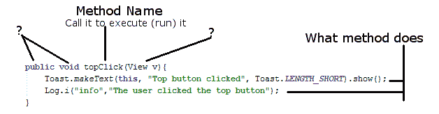
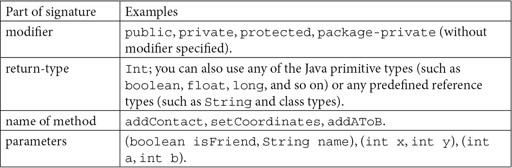
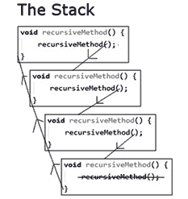

# 九、学习 Java 方法

当我们开始熟悉 Java 编程时，在这一章中，我们将更仔细地看一下方法，因为尽管我们知道您可以**调用**它们来让它们执行代码，但是它们还有比我们到目前为止讨论的更多的东西。

在本章中，我们将了解以下内容:

*   方法结构
*   方法重载与重写
*   一个方法演示小应用
*   方法如何影响我们的变量
*   方法递归

首先，让我们快速回顾一下方法。

# 技术要求

你可以在[https://GitHub . com/PacktPublishing/Android-初学者编程-第三版/tree/main/章节%2009](https://github.com/PacktPublishing/Android-Programming-for-Beginners-Third-Edition/tree/main/chapter%2009) 找到本章中出现的代码文件。

# 方法回顾

这个数字总结了我们目前对方法的理解:



图 9.1–理解方法

正如我们在图中看到的，方法周围仍然有几个问号。我们将完全揭开方法的盖子，看看它们是如何工作的，以及该方法的其他部分在本章后面会做什么。在 [*第 10 章*](10.html#_idTextAnchor187) *【面向对象编程】*和 [*第 11 章*](11.html#_idTextAnchor201) *【更多面向对象编程】*中，我们将在讨论面向对象编程的同时，理清最后几部分的方法之谜。

## 【Java 方法到底是什么？

方法是变量、表达式和控制流语句的集合，捆绑在开头和结尾的大括号内，前面有**签名**。我们已经使用了很多方法，但是我们只是还没有仔细研究它们。

让我们从方法结构开始。

# 方法结构

我们编写的方法的第一部分叫做签名。下面是一个假设的方法签名:

```java
public boolean addContact(boolean isFriend, string name)
```

如果我们添加一对左右花括号`{}`，加上该方法执行的一些代码，那么我们就有了一个完整的方法——一个**定义**。下面是另一个在语法上正确的方法:

```java
private void setCoordinates(int x, int y){
   // code to set coordinates goes here
}
```

正如我们所看到的，我们可以从代码的另一部分使用新方法，如下所示:

```java
// I like it here
setCoordinates(4,6);// now I am going off to setCoordinates method
// Phew, I'm back again - code continues here
```

在我们调用方法的地方，我们的程序的执行将转移到包含在该方法中的代码。该方法将一步一步地执行其中的所有语句，直到它到达末尾，然后将控制权返回给调用它的代码，或者如果它遇到`return`语句，则更快。然后，代码将在方法调用后从第一行继续运行。

下面是一个方法的另一个示例，它包含使方法返回调用它的代码的代码:

```java
int addAToB(int a, int b){
   int answer = a + b;
   return answer;
}
```

使用前面方法的调用可能如下所示:

```java
int myAnswer = addAToB(2, 4); 
```

显然，我们不需要编写方法来将两个`int`变量加在一起，但是这个例子帮助我们更多地了解方法的工作原理。首先，我们传入值`2`和`4`。在方法签名中，值`2`分配给`int a`，值`4`分配给`int b`。

在方法体内，变量`a`和`b`被加在一起，用于初始化新的变量`int answer`。线路`return answer`将存储在`answer`中的值返回到调用代码，使`myAnswer`用值`6`初始化。

请注意，前面示例中的每个方法签名都略有不同。这是因为 Java 方法签名非常灵活，允许我们精确地构建我们需要的方法。

确切地说，方法签名如何定义必须如何调用该方法，以及该方法必须如何返回值，值得进一步讨论。

让我们给签名的每个部分起一个名字，这样我们就可以把它分成几部分，并了解这些部分。

下面的粗体文本是一个方法签名，它的各个部分已经标记好，可以讨论了。另外，看一下粗体文本后面的表格，进一步明确签名的哪个部分是哪个。这将使我们对方法的其余讨论变得简单明了:

**修改器** | **返回式** | **方法名称(参数)**



## 修改

在我们早期的例子中，我们只在几个例子中使用了一个修改器，部分原因是该方法不需要使用修改器。修饰符是一种指定什么代码可以使用(调用)您的方法的方式，通过使用修饰符，如`public`和`private`。

变量也可以有修饰符，如下所示:

```java
// Most code can see me
public int a;
// Code in other classes can't see me
private String secret = "Shhh! I am private";
```

修饰符(用于方法和变量)是一个基本的 Java 主题，但是当我们讨论已经绕过几次的另一个重要的 Java 主题——类时，它们会得到最好的处理。我们将在下一章这样做。

## 返回类型

表格中的下一个是返回类型。像修饰符一样，返回类型是可选的。所以，让我们仔细看看。我们已经看到，我们的方法可以做任何我们可以用 Java 编码的事情。但是，如果我们需要一种方法的结果呢？到目前为止，我们看到的最简单的返回类型示例如下:

```java
int addAToB(int a, int b){
   int answer = a + b;
   return answer;
}
```

这里，签名中的返回类型被突出显示。返回类型是`int`。`addAToB`方法向调用它的代码发回(返回)一个适合于`int`变量的值。

返回类型可以是我们目前看到的任何 Java 类型。但是，该方法根本不需要返回值。当方法不返回值时，签名必须使用`void`关键字作为返回类型。当使用`void`关键字时，方法体不得试图返回值，因为这会导致编译器错误。但是，它可以不带值地使用`return`关键字。

以下是返回类型和使用`return`关键字的一些有效组合:

```java
void doSomething(){
   // our code
   // I'm done going back to calling code here
   // no return is necessary
}
```

另一组合如下:

```java
void doSomethingElse(){
   // our code
   // I can do this as long as I don't try and add a value
   return;
}
```

以下代码是另一种组合:

```java
void doYetAnotherThing(){
   // some code
   if(someCondition){

         // if someCondition is true returning to calling 
         code 
         // before the end of the method body
         return;
   }

   // More code that might or might not get executed

   return;
   /* 
         As I'm at the bottom of the method body 
         and the return type is void, I'm 
         really not necessary but I suppose I make it 
         clear that the method is over.
   */
}
String joinTogether(String firstName, String lastName){
   return firstName + lastName;
}
```

我们可以这样依次调用前面的每个方法:

```java
// OK time to call some methods
doSomething();
doSomethingElse();
doYetAnotherThing();
String fullName = joinTogether("Alan ","Turing")
// fullName now = Alan Turing
// continue with code from here
```

前面的代码将依次执行每个方法中的所有代码。

## 方法的名称

表中的下一个是方法的名称。当我们设计自己的方法时，方法名是任意的。但是习惯上使用动词来清楚地解释这个方法会做什么。此外，使用名称中第一个单词的第一个字母小写，随后所有单词的第一个字母大写的惯例。这叫做 camel case，我们在学习变量名的时候学过。考虑下一个例子:

```java
void XGHHY78802c(){
   // code here
}
```

前面的方法是完全合法的，并且会起作用；但是，让我们看三个使用这些约定的更清楚的例子:

```java
void doSomeVerySpecificTask(){
   // code here
}
void getMyFriendsList(){
   // code here
}
void startNewMessage(){
   // code here
} 
```

这一点非常清楚，因为名字让方法的作用显而易见。

让我们来看看方法中的参数。

## 参数

表中的最后一个题目是**参数**。我们知道方法可以向调用代码返回结果。但是如果我们需要用方法共享调用代码*中的一些数据值*呢？**

参数允许我们向被调用的方法发送值。当我们查看返回类型时，我们已经看到了一个带有参数的例子。我们将看同一个例子，但更仔细地看参数:

```java
int addAToB(int a, int b){
   int answer = a + b;
   return answer;
}
```

这里，参数被突出显示。参数包含在括号中，`(parameters go here)`，紧接在方法名之后。

请注意，在方法体的第一行，我们使用`a + b`就好像它们已经是声明和初始化的变量。那是因为他们是。方法签名的参数是它们的声明，调用方法的代码初始化它们，如下一行代码中突出显示的:

```java
int returnedAnswer = addAToB(10,5);
```

此外，正如我们在前面的例子中部分看到的，我们不必仅仅在参数中使用`int`。我们可以使用任何 Java 类型，包括我们自己设计的类型。

此外，我们还可以混合和匹配类型。我们也可以使用尽可能多的参数来解决我们的问题。一个例子可能会有帮助:

```java
void addToAddressBook(char firstInitial, 
String lastName, 
String city, 
int age){

   /*
         all the parameters are now living, breathing,
         declared and initialized variables.

         The code to add details to address book goes here.
   */
}
```

前面的示例将有四个已声明并初始化的变量可供使用。

现在我们来看看方法体——方法内部的东西。

## 身体

在我们之前的例子中，我们已经用如下注释对我们的方法体进行了伪编码:

```java
// code here
```

还使用了以下内容:

```java
// some code
```

也使用了`addToAddressBook`方法:

```java
/*
             all the parameters are now living, breathing,
             declared and initialized variables.

             The code to add details to address book goes 
             here.
      */
```

但是我们已经知道在身体里该做什么了。到目前为止，我们所学的任何 Java 语法都可以在方法体中使用。事实上，如果我们回想一下，到目前为止我们在这本书里写的所有代码*都在一个方法里。*

 *我们接下来能做的最好的事情就是写几个在体内有所作为的方法。

# 使用方法演示应用程序

在这里我们将快速构建两个应用来进一步探索方法。首先用`Real World Methods` app 探索基本面，然后用`Exploring Method Overloading` app 瞥见一个新话题，**方法重载**。

像往常一样，您可以用通常的方式打开准备好的代码文件。接下来的两个方法示例可以在 [*第 9 章*](#_idTextAnchor169) 文件夹以及`Real World Methods`和`Exploring Method Overloading`子文件夹的下载包中找到。

## 真实世界的方法

首先，让我们自己做一些简单的工作方法，用返回类型参数和全功能体来完成。

首先，创建一个名为`Real World Methods`的新安卓项目，使用**空活动**模板，并将所有其他设置保留为默认值。通过左键点击编辑器上方的**MainActivity.java**标签切换到`MainActivity.java`文件，我们可以开始编码了。

首先，将这三种方法添加到`MainActivity`类中。将它们添加到`onCreate`方法的右花括号`}`之后:

```java
String joinThese(String a, String b, String c){
   return a + b + c;
}
float getAreaCircle(float radius){
   return 3.141f * radius * radius;
}
void changeA(int a){
   a++;
}
```

我们添加的第一个方法叫做`joinThese`。它将返回一个`String`值，并且需要三个`String`变量。在方法体中，只有一行代码。`return a + b + c`代码将连接传递给它的三个字符串，返回连接的字符串作为结果。

下一个名为`getAreaCircle`的方法将一个`float`变量作为参数，然后返回一个`float`变量。方法的主体只是使用圆的面积公式，结合传入的半径，然后将答案返回给调用代码。`3.141`末尾的奇怪的`f`是让编译器知道这个数字是`float`类型的。任何浮点数都被认为是`double`类型，除非它的尾部是`f`。

第三种也是最后一种方法是所有方法中最简单的。请注意，它不返回任何内容；它有一个`void`返回类型。我们包含了这个方法，以明确我们想要记住的关于方法的一个要点。但在我们谈论它之前，让我们先看看它的实际效果。

现在，在`onCreate`方法中，在调用`setContentView`方法之后，添加这段代码，它调用我们的三个新方法，然后向 logcat 窗口输出一些文本:

```java
String joinedString = joinThese("Methods ", "are ", "cool ");
Log.i("joinedString = ","" + joinedString);
float area  = getAreaCircle(5f);
Log.i("area = ","" + area);
int a = 0;
changeA(a);
Log.i("a = ","" + a);
```

运行 app在 logcat 窗口看到输出，这里提供是为了方便大家:

```java
joinedString =: Methods are cool
area =: 78.525
a =: 0
```

在 logcat 输出中，我们首先可以看到的是`joinedString`字符串的值。不出所料，这是我们传递到`joinThese`方法中的三个单词的串联。

接下来，我们可以看到`getAreaCircle`确实已经根据传入的半径长度计算并返回了圆的面积。

即使在传递到`changeA`方法后，`a`变量仍然保持值`0`的事实值得单独讨论。

### 发现可变范围

输出的最后一行最有意思:`a=: 0`。在`onCreate`方法中，我们声明并初始化`int a`为`0`，然后我们调用`changeA`方法。在`changeA`的正文中，我们用代码`a++`增加了`a`。然而，回到`onCreate`方法，我们看到当我们使用`Log.i`方法将`a`的值打印到 logcat 窗口时，它仍然是 **0** 。

所以，当我们在`a`中传递到`changeA`方法时，我们实际上是在传递存储在 *a* 中的*值* *，而不是传递*实际变量* *a* 。这在 Java 中被称为按值传递。*

小费

当我们在一个方法中声明一个变量时，在那个方法中只能看到*。当我们在另一个方法中声明一个变量时，即使它有完全相同的名字，它也是*而不是*同一个变量。一个变量在它被声明的方法中只有**作用域**。*

 *对于所有原始变量，这就是将它们传递给方法的工作方式。有了参考变量，它的工作方式略有不同，我们将在下一章中看到如何工作。

重要说明

我已经和许多不熟悉 Java 的人谈过这个范围概念。对一些人来说，这似乎显而易见，甚至很自然。然而，对其他人来说，这是一个不断混乱的原因。如果您属于后一类，请不要担心，因为我们将在本章的稍后部分对此进行更多的讨论，并且在未来的章节中，我们将更深入地探索范围，并确保它不再是一个问题。

让我们看另一个方法的实际例子，同时学习一些新的东西。

# 探索方法重载

正如我们开始意识到的，方法作为一个话题是相当深刻的。但是，希望通过一次一步地采取这些措施，我们将看到它们在任何方面都不会令人生畏。我们也将在下一章回到方法。现在，让我们创建一个新项目来探索**方法重载**的话题。

创建一个名为`Exploring Method` `Overloading`的新**空活动**模板项目，然后我们将继续编写三种方法，但有一点小的转折。

我们很快就会看到，如果参数不同，我们可以创建多个同名的方法。这个项目中的代码很简单。在我们分析它之前，它是如何工作的可能会显得有点奇怪。

在第一种方法中，我们将简单地将其称为`printStuff`，并通过要打印的参数传入一个`int`变量。

在关闭`onCreate`方法的`}`之后，但在关闭`MainActivity`类的`}`之前插入该方法。记得以通常的方式导入`Log`类:

```java
void printStuff(int myInt){
   Log.i("info", "This is the int only version");
   Log.i("info", "myInt = "+ myInt);
}
```

在第二种方法中，我们也称之为`printStuff`，但是传入一个要打印的`String`变量。在关闭`onCreate`方法的`}`之后但在关闭`MainActivity`类的`}`之前插入此方法:

```java
void printStuff(String myString){
   Log.i("info", "This is the String only version");
   Log.i("info", "myString = "+ myString);
}
```

在第三个方法中，我们将再次称之为`printStuff`，但是传入一个`String`变量和一个要打印的`int`值。在关闭`onCreate`的`}`之后但在关闭`MainActivity`类的`}`之前插入该方法:

```java
void printStuff(int myInt, String myString){
   Log.i("info", "This is the combined int and String 
   version");
   Log.i("info", "myInt = "+ myInt);
   Log.i("info", "myString = "+ myString);
}
```

最后，在关闭`onCreate`方法的`}`之前插入这段代码，调用这些方法，并将一些值打印到 logcat 窗口:

```java
// Declare and initialize a String and an int
int anInt = 10;
String aString = "I am a string";

// Now call the different versions of printStuff
// The name stays the same, only the parameters vary
printStuff(anInt);
printStuff(aString);
printStuff(anInt, aString);
```

现在，我们可以在模拟器或真实设备上运行该应用程序。以下是输出:

```java
Info: This is the int only version
Info: myInt = 10
Info: This is the String only version
Info: myString = I am a string
Info: This is the combined int and String version
Info: myInt = 10
Info: myString = I am a string
```

可以看到，Java 已经把三个同名的方法当成了不同的方法。正如我们刚刚表明的那样，这可能是有用的。叫做**方法重载**。

方法重载和重写混淆

**重载**是指我们有多个同名但参数不同的方法。

**覆盖**是当我们替换一个同名的方法和相同的参数表。

我们对重载和覆盖了解得足够多，可以完成这本书；但是如果你很勇敢，你的思想在徘徊，是的，你可以覆盖一个重载的方法，但是那是另一个时间的事情。

这就是它的工作原理。在我们编写代码的每个步骤中，我们都创建了一个名为`printStuff`的方法。但是每个`printStuff`方法都有不同的参数，所以每个实际上是一个不同的方法，可以单独调用:

```java
void printStuff(int myInt){
   ...
}
void printStuff(String myString){
   ...
}
void printStuff(int myInt, String myString){
   ...
}
```

每个方法的主体都很简单，只是打印出传入的参数，并确认正在调用哪个版本的方法。

代码的下一个重要部分是，当我们通过使用与签名中的参数匹配的特定参数来明确我们想要调用的方法版本时。在最后一步中，我们使用匹配的参数依次调用每个方法，以便 Java 知道所需的确切方法:

```java
printStuff(anInt);
printStuff(aString);
printStuff(anInt, aString);
```

我们现在已经知道了所有需要知道的方法，所以让我们快速地看一下方法和变量之间的关系。然后，我们将更多地了解这个范围现象。

# 重新审视范围和变量

你可能还记得在`Real World Methods`项目中，稍微令人不安的异常是，一种方法中的变量显然与另一种方法中的变量不同，即使它们确实有相同的名称。如果在一个方法中声明一个变量，无论它是生命周期方法之一还是我们自己的方法之一，它都只能在该方法中使用。

如果我们在`onCreate`中这样做是没有用的:

```java
int a = 0;
```

然后，接下来，我们尝试在`onPause`或其他方法中这样做:

```java
a++;
```

我们将得到一个错误，因为`a`只在它被声明的方法中可见。起初，这似乎是一个问题，但令人惊讶的是，它实际上是 Java 的一个特别有用的特性。

我已经提到了，用来描述这个的术语是**范围**。当一个变量可用时，它被称为在作用域内，当它不可用时，它被称为在作用域外。范围的话题最好和类一起讨论，我们将在 [*第 10 章*](10.html#_idTextAnchor187) *、面向对象编程、*和 [*第 11 章*](11.html#_idTextAnchor201) *、更多面向对象编程*中进行讨论，但是作为对未来的一种潜移默化，你可能想知道一个类可以有它自己的变量，当它有变量时，它们对整个类都有范围；也就是说，它的所有方法都可以“看到”并使用它们。我们称之为**成员**变量或**字段**。

要声明成员变量，只需在类开始后使用通常的语法，在类中声明的任何方法之外。假设我们的应用程序是这样开始的:

```java
public class MainActivity extends AppCompatActivity {

   int mSomeVariable = 0;
   // Rest of code and methods follow as usual
   // ...
```

我们可以在任何地方使用`mSomeVariable`，在这个类的任何方法里面。我们的新变量`mSomeVariable`有**类范围**。我们在变量名后附加一个`m`，只是为了在我们看到它时提醒我们它是一个**成员**变量。这不是编译器所要求的，但它是一个有用的约定。

在我们继续上课之前，让我们再看一个方法主题。

# 方法递归

方法递归是当一个方法调用自己的时候。起初，这看起来像是一件偶然发生的事情，但却是解决一些编程问题的有效技术。

下面是一些代码，展示了递归方法的最基本形式:

```java
void recursiveMethod() {
     recursiveMethod();
}
```

如果我们调用`recursiveMethod`方法，那么它唯一的一行代码将调用它自己，然后它将调用它自己，然后它将调用它自己，以此类推。此过程将一直持续到应用程序崩溃，从而在 Logcat 中出现以下错误:

```java
java.lang.StackOverflowError: stack size 8192KB
```

当方法被调用时，它的指令被移动到处理器中被称为堆栈的区域，当它返回时，它的指令被移除。如果该方法从未返回，但添加了越来越多的指令副本，最终堆栈将耗尽内存(或溢出)，我们得到`StackOverflowError`。

我们可以尝试使用下一个截图来可视化前四个方法调用。此外，在下一个截图中，我划掉了对方法的调用，以表明如果我们能够在某个时候阻止方法调用，最终所有方法都将返回并从堆栈中清除:



图 9.2–方法调用

为了使我们的递归方法有价值，我们需要增强两个方面。我们将很快研究第二个方面。首先，也是最明显的，我们需要给它一个目标。不如让我们的递归方法将 0 到给定目标值(比如 10、100 或更多)范围内的数值相加？让我们修改前面的方法，赋予它新的用途，并相应地重命名它。我们还将添加一个类作用域为`answer`的变量(在方法之外):

```java
int answer = 0;
void computeSum(int target) {
answer += target;
     computeSum(target-1);
}
```

现在我们有一个叫`computeSum`的方法，它以一个`int`为参数。如果我们想计算 0 到 10 之间所有数字的总和，我们可以这样调用方法:

```java
computeSum(10);
```

以下是每次函数调用时`answer`变量的值:

`computeSum`第一次通话:`answer` = 10

`computeSum`第二次呼叫:`answer` = 19

…

`computeSum`第十次召唤:`answer` = 55

表面上的成功——直到你意识到这个方法在达到 0 的`target`变量之外继续调用自己。事实上，我们仍然有与第一个递归方法相同的问题，在数万次方法调用后，应用程序将再次与`StackOverflowError`崩溃。

我们需要的是一种方法，一旦`target`等于 0，就停止方法调用本身。我们解决这个问题的方法是检查`target`的值是否为 0，如果是，我们就停止调用方法。看看下面显示的附加突出显示的代码:

```java
void computeSum(int target) {
     answer += target;
     if(target > 0) {
          Log.d("target = ", "" + target);
          computeSum(target - 1);
     }
     Log.d("answer = ", "" + answer);
```

我们使用了`if`语句来检查目标变量是否大于 0。当最后一次调用该方法时，我们还有一个额外的`Log.d`代码来输出`answer`的值。在阅读输出后面的解释之前，看看你是否能弄清楚发生了什么。

调用`computeSum(10)`的输出如下:

```java
target =: 10
target =: 9
target =: 8
target =: 7
target =: 6
target =: 5
target =: 4
target =: 3
target =: 2
target =: 1
answer =: 55
```

`if(target > 0)`告诉代码首先检查`target`变量是否在 0 以上。如果是，那么它才会再次调用方法并传入`target – 1`的值。如果不是，则停止整个过程。

重要说明

在本书中，我们不会使用方法递归，但是理解它是一个有趣的概念。

我们对完成书中所有项目的方法了解得非常多。让我们用一些问题和答案来快速回顾一下。

# 问题

1.  What is wrong with this method definition?

    ```java
    doSomething(){
       // Do something here
    }
    ```

    没有声明返回类型。您不必从方法中返回值，但在这种情况下，它的返回类型必须是`void`。方法应该是这样的:

    ```java
    void doSomething(){
       // Do something here
    }
    ```

2.  What is wrong with this method definition?

    ```java
    float getBalance(){
       String customerName = "Linus Torvalds";
       float balance = 429.66f;
       return userName;
    }
    ```

    该方法返回一个字符串(`userName`)，但是签名声明它必须返回一个`float`类型。使用像`getBalance`这样的方法名，这个代码可能就是想要的:

    ```java
    float getBalance(){
       String customerName = "Linus Torvalds";
       float balance = 429.66f;
       return balance;
    }
    ```

3.  When do we call the `onCreate` method? (Trick question alert!)

    我们没有。安卓决定何时调用`onCreate`方法，以及构成活动生命周期的所有其他方法。我们只是忽略了对我们有用的东西。然而，我们确实调用了`super.onCreate`以便我们的覆盖版本和原始版本都被执行。

    重要说明

    为了完全公开，从技术上讲，从我们的代码中调用生命周期方法是可能的，但是在本书的上下文中，我们永远不需要这样做。最好把这些东西留给安卓。

# 总结

在前五章中，我们非常精通一系列小部件和其他用户界面元素。我们还构建了广泛的用户界面布局选择。在这一章和前三章中，我们非常深入地探讨了 Java 和 Android 活动生命周期，尤其是考虑到我们完成得有多快。

我们已经在很小程度上创建了我们的 Java 代码和用户界面之间的交互。我们通过设置`onClick`属性调用了我们的方法，并且使用`setContentView`方法加载了我们的用户界面布局。然而，我们还没有真正在用户界面和 Java 代码之间建立适当的联系。

我们现在真正需要做的是将这些东西整合在一起，这样我们就可以开始使用安卓用户界面显示和操作我们的数据了。为了实现这一点，我们需要更多地了解类。

类从 [*第 1 章*](01.html#_idTextAnchor014) *【始安卓】和*就一直潜伏在我们的代码中，我们甚至使用了一点。然而，到目前为止，除了不断提到 [*【第 10 章*](10.html#_idTextAnchor187) *【面向对象编程】*之外，我们还没有恰当地解决它们。在下一章 [*第 10 章*](10.html#_idTextAnchor187) *【面向对象编程】*中，我们将快速掌握类，然后我们最终可以开始构建 UI 设计和我们的 Java 代码完美协调工作的应用程序。

# 进一步阅读

我们已经学了足够多的 Java 来继续这本书。然而，看到更多的 Java 实例并超越最低限度的必要知识继续进行总是有益的。如果你想要一个更深入学习 Java 的好来源，那么甲骨文官网是不错的。请注意，您不需要学习本网站就可以继续阅读本书。此外，请注意，甲骨文网站上的教程不是在安卓环境中设置的。该网站是一个有用的资源书签和浏览都一样:

*   官方 Java 教程:[https://docs.oracle.com/javase/tutorial/](https://docs.oracle.com/javase/tutorial/)
*   安卓官方开发者网站:[https://developer.android.com/training/basics/firstapp](https://developer.android.com/training/basics/firstapp)**