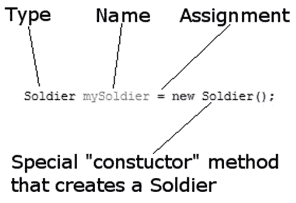
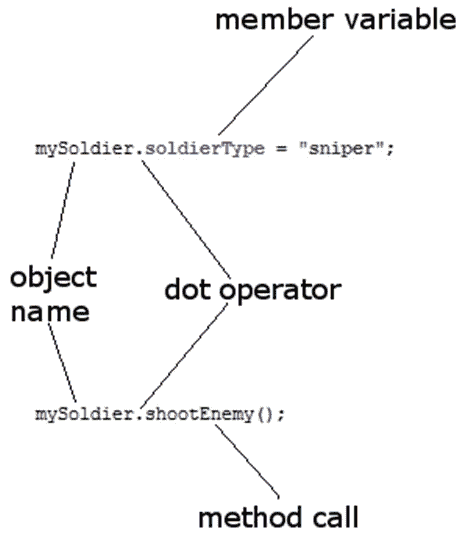
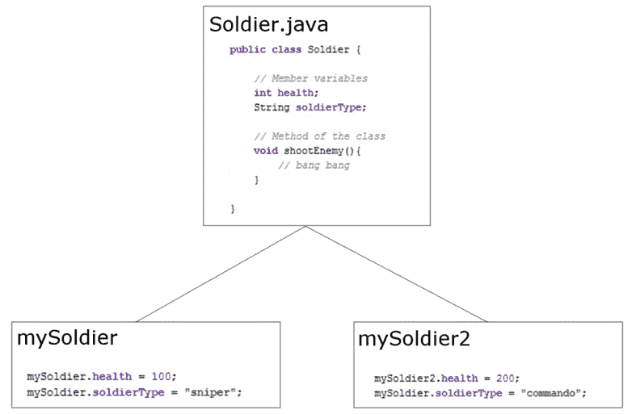

# 十、面向对象编程

在这一章中，我们将发现在 Java 中，类几乎是一切的基础。我们也将开始理解为什么早在 20 世纪 90 年代早期，太阳微系统公司的软件工程师们用他们的方式制造了 Java。

我们已经讨论过重用其他人的代码，特别是安卓应用编程接口，但是在本章中，我们将真正了解这是如何工作的，并了解面向对象编程以及如何使用它。

总之，我们将涵盖以下主题:

*   什么是面向对象编程，包括**封装**、**继承**、**多态**
*   在应用中编写和使用我们的第一课

# 技术要求

你可以在[https://GitHub . com/PacktPublishing/Android-初学者编程-第三版/tree/main/章节%2010](https://github.com/PacktPublishing/Android-Programming-for-Beginners-Third-Edition/tree/main/chapter%2010) 找到本章中出现的代码文件。

# 重要内存管理警告

我指的是我们大脑的记忆。如果你试图记住这一章(或下一章)，你将不得不在你的大脑中腾出很多空间，你可能会忘记一些真正重要的事情——比如去工作或者感谢作者告诉你不要试图记住这些东西。

一个好的目标将是尝试并获得它。这样，你的理解会变得更加全面。需要时，您可以参考本章(或下一章)进行复习。

小费

如果你没有马上完全理解这一章的所有内容也没关系！继续阅读，确保完成所有的应用。

# 面向对象编程

在 [*第一章*](01.html#_idTextAnchor014) *【始安卓与 Java】*中，我们提到了 Java 是一种面向对象的语言。一门面向对象的语言要求我们使用**面向对象** **编程(OOP** )。它不像汽车上的赛车扰流板或游戏电脑中的脉动发光二极管那样是可选的配件。它是 Java 的一部分，因此也是安卓的一部分。

让我们多了解一点。

## OOP 到底是什么？

面向对象编程是一种编程方式，包括将我们的需求分解成比整体更容易管理的块。

每个块都是独立的，但可能被其他程序重用，同时作为一个整体与其他块一起工作。

这些块就是我们所说的对象。当我们计划/编码一个对象时，我们用一个类来做。一个类可以被认为是一个对象的蓝图。

我们实现了一个类的对象。这被称为一个类的**实例**。想想房子的蓝图。你不能住在里面，但是你可以用它盖房子；你建立一个它的实例。通常，当我们为我们的应用设计类时，我们编写它们来表示现实世界的事物。

然而，OOP 不止于此。这也是一种做事的方式——一种定义最佳实践的方法。

OOP 的三个核心原则分别是**封装**、**多态**、**继承**。这听起来可能很复杂，但如果一步一步来，就相当简单了。

### 包装

**封装**意味着通过只允许您选择的变量和方法被访问，来保持代码的内部工作不受使用它的代码的干扰。

这意味着您的代码可以随时更新、扩展或改进，而不会影响使用它的程序，只要暴露的部分仍然以相同的方式被访问。

还记得从 [*第一章*](01.html#_idTextAnchor014) *开始的这段代码吗，开始安卓和 Java* ？

```java
locationManager.getLastKnownLocation(LocationManager.GPS_PROVIDER)
```

有了适当的封装，卫星公司或安卓应用编程接口团队是否需要更新他们的代码工作方式并不重要。只要`getLastKnownLocation`方法签名保持不变，我们就不用担心里面发生了什么。我们在更新前编写的代码在更新后仍然有效。

如果汽车制造商去掉车轮，把它做成电动气垫车，只要它还有方向盘、油门和刹车踏板，驾驶它应该不会太有挑战性。

重要说明

当我们使用安卓应用编程接口的类时，我们是按照安卓开发人员设计它们的类来允许我们这样做的。

### 多态性

**多态性**允许我们编写代码，该代码不太依赖于我们试图操纵的*类型*，使我们的代码更加清晰和高效。多态性是指*不同的形式*。如果我们编码的对象可以是多种类型的东西，那么我们可以利用这一点。下一章中的一些例子将使这一点变得清晰，接下来的类比将给你一个真实世界的视角。

如果我们有一家汽车工厂，只需改变给机器人的指令和生产线上的零件，就可以制造面包车和小卡车，那么这家工厂就是在使用多态性。

如果我们能够编写无需重新启动就能处理不同类型数据的代码，那岂不是很有用？我们将在《更多面向对象编程》第 11 章 *中看到一些这样的例子。*

### 遗产

就像它听起来的那样，**继承**意味着我们可以利用其他人的类的所有特性和好处，包括封装和多态性，同时针对我们的情况进一步细化他们的代码。其实我们已经这样做了，每次使用`extends`关键字:

```java
public class MainActivity extends AppCompatActivity {
```

`AppCompatActivity`类本身继承自`Activity`。所以，每次我们创建一个新的安卓项目，我们都继承了`Activity`。我们可以走得更远，看看它有多有用。

想象一下，如果世界上最强壮的男人和世界上最聪明的女人在一起。他们的孩子很有可能从基因遗传中获得重大利益。Java 中的继承让我们可以对另一个人的代码和我们自己的代码做同样的事情，创建一个更符合我们需求的类。

## 为什么会这样？

如果编写得当，所有这些 OOP 都允许您添加新特性，而不用太担心它们如何与现有特性交互。当你不得不改变一个类时，它的自包含(封装)特性对程序的其他部分来说意味着更少甚至可能为零的结果。这是封装部分。

你可以使用其他人的代码(比如安卓应用编程接口)，而不知道甚至不关心它是如何工作的:想想安卓的生命周期、`Toast`、`Log`、所有的用户界面小部件、收听卫星等等。例如，`Button`类有将近 50 种方法——我们真的想自己写所有这些方法，仅仅为了一个按钮吗？用别人的`Button`类好多了。

面向对象程序允许你不费力地为高度复杂的情况编写应用。

通过使用继承，您可以创建一个类的多个相似但不同的版本，而无需从头开始创建该类；由于多态性，您仍然可以在新对象中使用原对象类型的方法。

真的有道理。 Java 从一开始就考虑到了所有这些，所以我们被迫使用所有这些 OOP 不过，这是一件好事。

让我们快速回顾一下课堂。

## 课程回顾

类是代码行的集合，代码行可以包含方法、变量、循环和我们已经学习过的所有其他 Java 语法。一个类是 Java 包的一部分，大多数包通常有多个类。通常，尽管不总是这样，每个新类都将在它自己的`.java`代码文件中定义，与类同名——就像到目前为止我们所有的 Activity 类一样。

一旦我们写了一个类，我们就可以用它来制作我们想要的任何对象。记住，类是蓝图，我们基于蓝图制作对象。房子不是蓝图，正如物体不是阶级；它是由类制成的对象。一个对象是一个引用变量，就像一个`String`变量一样，稍后我们会发现引用变量到底意味着什么。现在，让我们看一些实际的代码。

# 查看一个类的代码

假设我们正在为军方制作一个应用。它供高级军官在战斗中微观管理他们的部队。其中，我们可能需要一个类来代表一个士兵。

## 类实现

这是我们假设的类的真实代码。我们称之为类**实现**。由于类名为`Soldier`，如果我们真的实现了这个类，我们会在名为`Soldier.java`的文件中实现它:

```java
public class Soldier {

   // Member variables
   int health;
   String soldierType;
   // Method of the class
   void shootEnemy(){
             // Bang! Bang!
   }

}
```

前面是一个名为`Soldier`的类的类实现。有两个**成员** **变量**，或者**字段**，一个`int`变量叫做`health`，一个`String`变量叫做`soldierType`。

还有一种方法叫做`shootEnemy`。该方法没有参数和一个`void`返回类型，但是类方法可以是我们在 [*第 9 章*](09.html#_idTextAnchor169) *【学习 Java 方法】中讨论的任何形状或大小。*

准确地说，关于成员变量和字段，当类被实例化为一个真实的对象时，字段成为对象本身的变量，我们称它们为**实例**或**成员**变量。

它们只是类的变量，不管它们被称为什么样的花哨名字。然而，在方法中声明的字段和变量(称为**局部**变量)之间的差异确实随着我们的进步而变得更加重要。

我们在 [*第 9 章*](09.html#_idTextAnchor169) *的末尾简要讨论了变量范围，学习 Java 方法*我们将在下一章的后面再次查看所有类型的变量。让我们专注于编码和使用一个类。

## 声明、初始化和使用类的对象

记住`Soldier`只是一个类，不是一个 实际可用的对象。是军人的蓝图，不是实际的军人对象，就像`int`、`String`、`boolean`不是变量一样；它们只是我们可以制造变量的类型。这就是我们如何从`Soldier`类中制作类型`Soldier`的对象:

```java
Soldier mySoldier = new Soldier();
```

在代码的第一部分，`Soldier mySoldier`声明了一个名为`mySoldier`的类型为`Soldier`的新变量。代码的最后一部分`new Soldier()`调用一个名为**构造器**的特殊方法，该构造器是由编译器为所有类自动生成的。

正是这个构造器方法创建了一个实际的`Soldier`对象。如您所见，构造函数方法与类同名。我们将在本章后面更深入地研究构造函数。

当然，两部分中间的赋值运算符`=`将第二部分的结果赋给第一部分的结果。下图总结了所有这些信息:



图 10.1–声明、初始化和使用类的对象

这与我们处理常规变量的方式相差不远，除了构造函数/方法调用，而不是代码行末尾的值。为了创建和使用一个非常基本的类，我们已经做得够多了。

重要说明

当我们进一步探索时，我们将会看到，我们可以编写自己的构造函数，而不是依赖自动生成的构造函数。这给了我们很大的力量和灵活性，但我们现在将继续探索最简单的情况。

就像常规的变量一样，我们也可以这样分成两部分来做。

```java
Soldier mySoldier;
mySoldier = new Soldier();
```

这就是我们如何分配并使用我们假设的类的变量:

```java
mySoldier.health = 100;
mySoldier.soldierType = "sniper";
// Notice that we use the object name mySoldier.
// Not the class name Soldier.
// We didn't do this:
// Soldier.health = 100; 
// ERROR!
```

这里，点运算符`.`用于访问类的变量。这就是我们调用方法的方式——同样，使用对象名，而不是类名，后跟点运算符:

```java
mySoldier.shootEnemy();
```

我们可以用图表总结点运算符的用法:



图 10.2–点运算符

小费

我们可以把类的方法想象成它能做什么，把它的实例/成员变量想象成它自己知道什么。

我们也可以继续并制作另一个`Soldier`对象并访问其方法和变量:

```java
Soldier mySoldier2 = new Soldier();
mySoldier2.health = 150;
mySoldier2.soldierType = "special forces";
mySoldier2.shootEnemy();
```

重要的是要认识到`mySoldier2`是一个完全独立的对象，与`mySoldier`有完全不同的实例变量:



图 10.3–士兵对象

这里同样重要的是前面的代码不会在类本身中编写。例如，我们可以在名为`Soldier.java`的外部文件中创建`Soldier`类，然后使用我们刚刚看到的代码，可能是在`MainActivity`类中。

当我们一分钟后在一个实际的项目中编写我们的第一个类时，这将变得更加清晰。

还要注意，所有的事情都是在对象本身上完成的。我们必须创建类的对象来使它们有用。

重要说明

一如既往，这条规则也有例外。但他们是少数，我们将在下一章中看看例外情况。事实上，到目前为止，我们已经在书中看到了两个例外。我们看到的例外是`Toast`和`Log`类。他们到底发生了什么很快就会被解释清楚。

让我们通过真实地写一个来更深入地探索一下基础课。

# 基础课 app

将使用我们应用的将军将需要不止一个`Soldier`对象。在我们将要构建的应用中，我们将实例化并使用多个对象。我们还将演示在变量和方法上使用点运算符，以显示不同的对象有它们自己的实例变量。

您可以在代码下载中获得该示例的完整代码。它在 [*第 10 章*](#_idTextAnchor187) 文件夹中。但是继续阅读来创建自己的工作示例是最有用的。

使用**空活动**模板创建项目。调用应用`Basic` `Classes`。现在我们将创建一个名为`Soldier`的新班级:

1.  右键单击项目浏览器窗口中的`com.yourdomain.basicclasses`(或无论你的包名是什么)文件夹。
2.  选择**新建| Java 类**。
3.  在**名称**:字段中，输入`Soldier`，按*进入*键。

新的类是为我们创建的，它有一个代码模板，可以将我们的实现放入其中，正如下面的代码所示。

```java
package com.yourdomain.basicclasses;
public class Soldier {
}
```

请注意，AndroidStudio 已经将该类与我们应用的其他 Java 文件放在了同一个包/文件夹中。

现在我们可以编写它的实现了。

如图所示，在`Soldier`类的左大括号和右大括号内编写以下类实现代码。要键入的新代码突出显示:

```java
public class Soldier {
    int health;
    String soldierType;
    void shootEnemy(){
        //let's print which type of soldier is shooting
        Log.i(soldierType, " is shooting");
    }
}
```

既然我们有了类，有了`Soldier`类未来物体的蓝图，我们就可以开始建造我们的军队了。在编辑器窗口中，左键单击**MainActivity.java**选项卡。我们将像往常一样，在调用`setContentView`方法之后，在`onCreate`方法中编写下一个代码。键入此代码:

```java
// First, we make an object of type soldier
Soldier rambo = new Soldier();
rambo.soldierType = "Green Beret";
rambo.health = 150;
// It takes a lot to kill Rambo
// Now we make another Soldier object
Soldier vassily = new Soldier();
vassily.soldierType = "Sniper";
vassily.health = 50;
// Snipers have less health
// And one more Soldier object
Soldier wellington = new Soldier();
wellington.soldierType = "Sailor";
wellington.health = 100;
// He's tough but no green beret
```

现在我们有了极其多样化和不太可能的军队，我们可以使用它来验证每个物体的身份。

在下方输入该代码，即上一步的代码:

```java
Log.i("Rambo's health = ", "" + rambo.health);
Log.i("Vassily's health = ", "" + vassily.health);
Log.i("Wellington's health = ", "" + wellington.health);
rambo.shootEnemy();
vassily.shootEnemy();
wellington.shootEnemy();
```

现在我们可以运行我们的应用了。所有输出都将在 logcat 窗口中。

这就是它的工作原理。首先，我们创建了新的`Soldier`类。然后我们实现了我们的类，包括声明两个字段(成员变量)，一个`int`变量和一个名为`health`和`soldierType`的`String`变量。

我们班还有一个方法叫`shootEnemy`。让我们再看一遍，看看发生了什么:

```java
void shootEnemy(){
        //let's print which type of soldier is shooting
        Log.i(soldierType, " is shooting");
}
```

在方法的主体中，我们打印到 logcat 窗口:首先是`soldierType`，然后是文本`" is shooting"`。这里的巧妙之处在于，根据我们称之为`shootEnemy`方法的对象，字符串`soldierType`会有所不同。

接下来，我们声明并创建了三个类型为`Soldier`的新对象。分别是`rambo`、`vassily`和`wellington`。

最后，我们为`health`和`soldierType`分别初始化了不同的值。

以下是输出:

```java
Rambo's health =: 150
Vassily's health =: 50
Wellington's health =: 100
Green Beret: is shooting
Sniper: is shooting
Sailor: is shooting
```

请注意，每次我们访问每个`Soldier`对象的`health`变量时，它都会打印出我们分配给它的值，这证明了尽管这三个对象属于同一类型，但它们是完全独立的个体实例/对象。

也许更有趣的是对`shootEnemy`的三次调用。一个接一个地调用我们的每个`Soldier`对象的`shootEnemy`方法，并将`soldierType`变量打印到 logcat 窗口。该方法对每个单独的对象都有适当的值，进一步证明我们有三个不同的对象(类的实例)，尽管是从同一个`Soldier`类创建的。

我们看到了每个物体是如何完全独立于其他物体的。然而，如果我们想象我们的应用中有大量的`Soldier`对象，那么我们会意识到我们需要学习处理大量对象(以及常规变量)的新方法。

想想仅仅管理 100 个独立的`Soldier`对象。当我们有成千上万个物体时呢？此外，这不是很动态。我们现在编写代码的方式依赖于我们(开发人员)知道将军(用户)将要指挥的士兵的确切细节。我们将在 [*第 15 章*](15.html#_idTextAnchor267) *、数组、地图和随机数中看到解决方案。*

## 第一节课我们可以做更多的事情

我们可以像对待其他变量一样对待一个类。我们可以在方法签名中使用类作为参数，如下所示:

```java
public void healSoldier(Soldier soldierToBeHealed){
   // Use soldierToBeHealed here
   // And because it is a reference the changes
   // are reflected in the actual object passed into
   // the method.
   // Oops! I just mentioned what 
   // a reference variable can do
   // More info in the FAQ, chapter 11, and onwards
}
```

当我们调用方法时，我们当然必须传递一个这种类型的对象。这里有一个对`healSoldier`方法的假设调用:

```java
healSoldier(rambo);
```

当然，前面的例子可能会提出问题，比如`healSoldier`方法应该是类的方法吗？

```java
fieldhospital.healSoldier(rambo);
```

可能是，也可能不是。这取决于对这种情况的最佳解决方案是什么。我们将看更多的面向对象程序，然后许多类似难题的最佳解决方案应该更容易呈现出来。

而且，正如你可能猜到的，我们也可以使用一个对象作为一个方法的返回值。以下是更新后的假设`healSoldier`签名和实现现在的样子:

```java
Soldier healSoldier(Soldier soldierToBeHealed){
   soldierToBeHealed.health++;
   return soldierToBeHealed;
}
```

事实上，我们已经看到类被用作参数。例如，这里是我们来自 [*第二章*](02.html#_idTextAnchor043) *的`topClick`方法，第一联系人:Java、XML 和 UI 设计器*。它接收一个名为`View`类型的`v`的对象:

```java
public void topClick(View v){
```

然而，在`topClick`方法的情况下，我们没有对类型为`View`的传入对象做任何事情。一方面是因为我们不需要，另一方面是因为我们还不知道如何处理 T2 类型的物体。

正如我在本章开头提到的，你不需要理解或记住本章的所有内容。擅长 OOP 的唯一方法就是一直使用它。就像学习一门口语一样——学习它并钻研语法规则会有所帮助，但远不如进行口头(或书面)对话有所帮助。如果你差不多明白了，继续下一章。

# 常见问题

1.  I just can't wait any longer. What is a reference already!?

    从字面上看，它与普通(非编程)语言中的引用是一回事。它是一个标识/指向数据而不是实际数据本身的值。思考这个问题的一种方式是，引用是一个内存位置/地址。它识别并访问内存中该位置/地址的实际数据。

2.  If it is not the actual object but just a reference, how come we can do things like call methods on it, such as `mySoldier.shootEnemy()`?

    Java 在幕后计算出确切的细节，但是你可以把一个引用想象成一个对象的控制器，任何你想对这个对象做的事情都必须通过控制器来完成，因为实际的对象/内存本身是不能被直接访问的。在[*第 12 章*](12.html#_idTextAnchor218) *【堆栈、堆和垃圾收集器】中有更多关于这方面的内容。*

# 总结

我们终于写完了第一课。我们已经看到，我们可以在与类同名的 Java 文件中实现一个类。在我们实例化类的对象/实例之前，类本身什么也不做。一旦我们有了类的实例，我们就可以使用它的变量和方法。正如我们在 basic classes 应用中证明的那样，一个类的每个实例都有自己独特的变量，就像当你买一辆工厂制造的汽车时，你会得到自己的方向盘、卫星导航和加速条纹一样。

所有这些信息将引发更多问题。OOP 就是这样。因此，让我们在下一章中再看一看变量和封装、多态和继承，来巩固所有这些类的东西。然后，我们可以进一步研究类，探索静态类(如 Log 和 Toast)以及抽象类和接口的更高级概念。