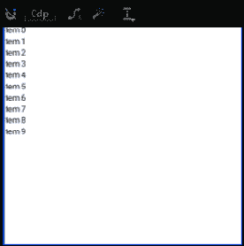
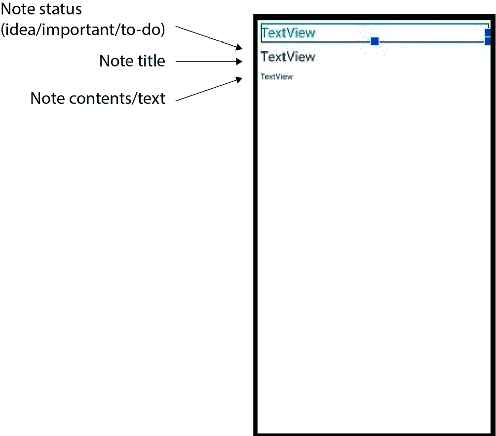
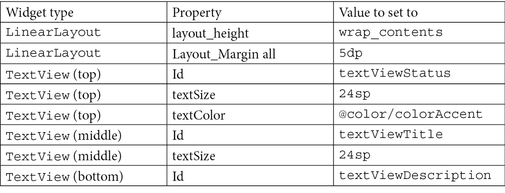
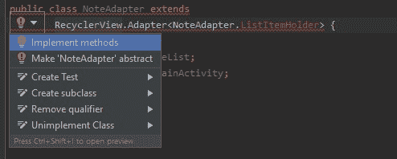
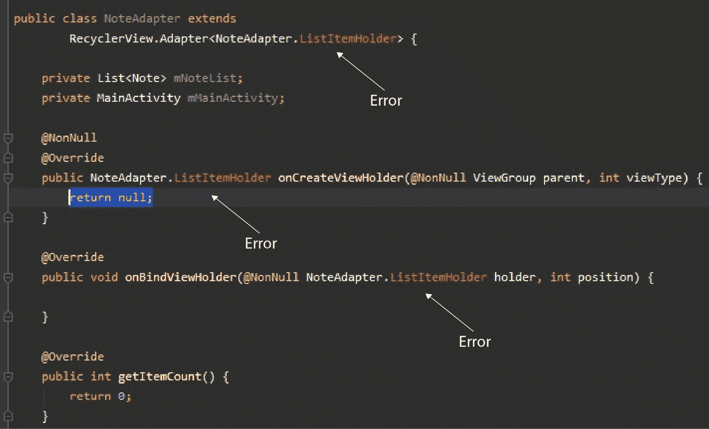
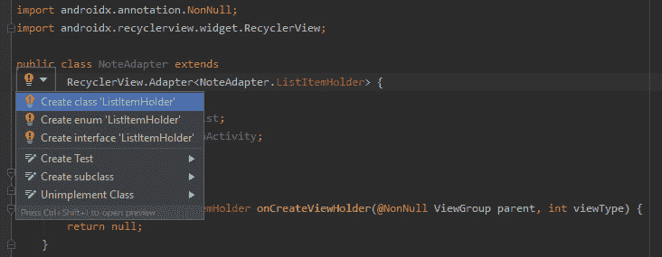
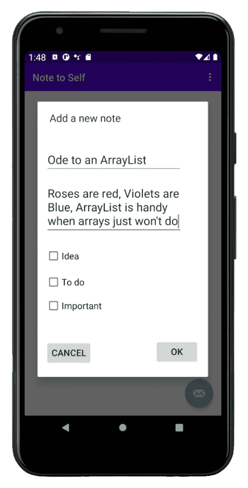
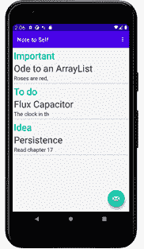

# 十六、适配器和回收器

在这简短的一章中，我们将取得很大成就。我们将首先介绍适配器和列表的理论——我们如何在 Java 代码中扩展`RecyclerAdapter`类，并在我们的 UI 中添加一个充当列表的`RecyclerView`实例——然后介绍安卓应用编程接口如何将它们绑定在一起，以便`RecyclerView`显示`RecyclerAdapter`的内容，并允许用户滚动内容。您可能已经猜到，我们将使用这种技术在“自我笔记”应用中显示我们的笔记列表。

在本章中，我们将介绍以下内容:

*   查看适配器的理论，并将它们绑定到我们的用户界面
*   用`RecyclerView`实现布局
*   布置一个列表项用于`RecyclerView`
*   用`RecyclerAdapter`实现适配器
*   将适配器绑定到`RecyclerView`
*   将笔记存储在`ArrayList`中，并在`RecyclerView`中显示
*   讨论我们如何进一步改进自我笔记应用

很快我们将有一个自我管理的布局，保存和显示我们所有的笔记，所以让我们开始吧。

# 技术要求

你可以在[https://GitHub . com/packt publishing/Android-初学者编程-第三版/tree/main/chapter%2016 上找到本章中出现的代码文件。](https://github.com/PacktPublishing/Android-Programming-for-Beginners-Third-Edition/tree/main/chapter%2016 )

# 回收视图和回收面板

在 [*第 5 章*](05.html#_idTextAnchor101)*带 CardView 和 ScrollView 的漂亮布局*中，我们使用了`ScrollView`并用一些`CardView`小部件填充了它，这样我们就可以看到它滚动了。我们可以利用刚刚学到的关于数组和 T2 的知识，创建一个 T3 小部件的数组，用它们来填充 T4，并在每个 T5 中放置一个注释的标题。对于 来说，这听起来是一个完美的解决方案，它显示每个笔记，以便可以在“给自己的笔记”应用中点击。

我们可以在 Java 代码中动态创建`TextView`小部件，将它们的`text`属性设置为注释的标题，然后将`TextView`小部件添加到包含在`ScrollView`中的`LinearLayout`中。然而，这并不完美。

## 显示大量小部件的问题

这可能看起来很好，但是如果有几十个、几百个甚至几千个音符呢？我们不可能在内存中有成千上万的小部件，因为安卓设备可能会耗尽内存，或者至少会停止运行，因为它试图处理如此大量的小部件及其数据的滚动。

现在，也想象一下，我们想要(我们做了)在`ScrollView`中的每个音符来显示它是重要的、要做的还是一个想法。从笔记的正文中摘录一小段怎么样？

我们需要设计一些聪明的代码，从多个`ArrayList`实例加载和销毁`Note`对象和每个音符的多个`TextView`小部件。这是可以做到的，但要有效地做到这一点远非易事。

## 显示大量小部件问题的解决方案

幸运的是，这是移动开发者普遍面临的问题，安卓应用编程接口内置了一个解决方案。

我们可以在我们的用户界面布局中添加一个名为`RecyclerView`的小部件(就像一个环保的`ScrollView`一样，但是也有助推器)。`RecyclerView`课正是为了解决我们一直在讨论的问题而设计的。此外，我们需要用一种特殊类型的类与`RecyclerView`互动，这种类理解`RecyclerView`是如何工作的。

我们将使用适配器与之交互。我们将使用`RecyclerAdapter`类，扩展它，定制它，然后使用它来控制来自我们的`ArrayList`实例(它将保存我们的`Note`实例)的数据，并在`RecyclerView`中显示它。

让我们进一步了解一下的`RecyclerView`和`RecyclerAdapter`课程是如何工作的。

## 如何使用 RecyclerView 和 RecyclerAdapter

我们已经知道如何存储几乎无限的纸币；我们可以在`ArrayList`实例中这样做，尽管我们还没有实现它。我们还知道，有一个名为`RecyclerView`的用户界面布局，专门用于显示来自`ArrayList`实例的数据的潜在长列表。我们只需要看看如何将这一切付诸行动。

要在我们的布局中添加一个`RecyclerView`小部件，我们可以简单地以通常的方式将其从调色板拖放到我们的用户界面上。先别做。我们先讨论一下。

如果您在`content_main.xml`中的按钮下方添加了一个`RecyclerView`小部件，则该小部件在用户界面设计器中会如下所示，例如:



图 16.1-recycle service widget

然而，这种外观与其说是应用的实际外观，不如说是可能性的表现。如果我们在添加一个`RecyclerView`小部件后直接运行应用，我们会得到一个空白区域，这里是`RecyclerView`小部件。

我们需要做的第一件事，要实际使用`RecyclerView`，就是决定列表中的每一项会是什么样子。它可能只是一个小部件，也可能是一个完整的布局。我们将使用`LinearLayout`。为了清楚具体，我们将使用一个`LinearLayout`，它为我们的`RecyclerView`中的每个项目保存三个`TextView`小部件。这将允许我们显示笔记状态(重要、想法或待办事项)、笔记标题以及来自实际笔记内容的一小段文本。

一个列表项需要在自己的 XML 文件中定义，那么`RecyclerView`可以保存这个列表项布局的多个实例。

当然，这些都不能解释我们如何克服管理哪些数据显示在哪个列表项中以及如何从`ArrayList`中检索数据的复杂性。

这个数据处理由我们自己定制的`RecyclerAdapter`类实现来处理。`RecyclerAdapter`类实现了`Adapter`接口。我们不需要知道`Adapter`内部是如何工作的；我们只需要覆盖必要的方法，然后`RecyclerAdapter`将完成与我们的`RecyclerView`小部件通信的所有工作。

将`RecyclerAdapter`的实现连接到`RecyclerView`当然比将 20 个`TextView`实例拖到`ScrollView`上更复杂——但是一旦完成，我们就可以忘记它，它将继续工作，会自行管理，而不管我们给`ArrayList`添加多少注释。它还内置了处理诸如整洁的格式和检测列表中哪个项目被点击之类的功能。

我们将需要重写`RecyclerAdapter`类的一些方法，并添加一些我们自己的代码。

## 我们将如何使用 RecyclerAdapter 和笔记数组列表来设置 RecyclerView

让我们看一下所需步骤的概要，这样我们就知道会发生什么。要启动并运行整个系统，我们将执行以下操作:

1.  删除临时按钮和相关代码，然后用特定的`id`属性给我们的布局添加一个`RecyclerView`小部件。
2.  创建一个 XML 布局来表示列表中的每个项目。我们已经提到了列表中的每个项目都将是一个包含三个`TextView`小部件的`LinearLayout`。
3.  创建一个扩展`RecyclerAdapter`的新类，并向几个被覆盖的方法添加代码来控制它的外观和行为，包括使用我们的列表项布局和充满`Note`实例的`ArrayList`。
4.  向`MainActivity`类添加代码以使用`RecyclerAdapter`类和`RecyclerView`小部件，并将其绑定到我们的`ArrayList`实例。
5.  在`MainActivity`中添加一个`ArrayList`来保存我们所有的笔记，并更新`createNewNote`方法来将`DialogNewNote`类中创建的任何新笔记添加到这个`ArrayList`中。

让我们详细介绍一下这些步骤。

# 将 RecyclerView、RecyclerAdapter 和 ArrayList 添加到“给自己的笔记”项目中

打开自我项目的注释。提醒一下，如果你想查看完成本章后的已完成代码和工作 app，可以在[T5【第 16 章](#_idTextAnchor285) `/Note to self`文件夹中找到。

注意

随着本章中所需的操作在不同的文件、类和方法之间跳转，我鼓励您继续下载包中的文件，方法是将其保持打开，以便在首选文本编辑器中参考。

## 删除临时“显示注释”按钮，并添加回收视图

接下来的这些几步将会去掉我们在 [*第 14 章*](14.html#_idTextAnchor249) *【安卓对话窗口】*中添加的临时代码，并设置好我们的`RecyclerView`小部件准备绑定到本章后面的`RecyclerAdapter`:

1.  在`content_main.xml`文件中，删除临时的`Button`，其 ID 为`button`，这是我们之前为了测试而添加的。
2.  在`MainActivity.java`文件的`onCreate`方法中，删除`Button`实例声明和初始化以及处理其点击的匿名类，因为这个代码现在产生了一个错误。我们将在本章后面删除一些临时代码。删除以下代码:

    ```java
    // Temporary code
    Button button = (Button) findViewById(R.id.button);
    button.setOnClickListener(new View.OnClickListener() {
       @Override
       public void onClick(View v) {
             // Create a new DialogShowNote called dialog
             DialogShowNote dialog = new DialogShowNote();
             // Send the note via the sendNoteSelected 
             method
             dialog.sendNoteSelected(mTempNote);
             // Create the dialog
             dialog.show(getSupportFragmentManager(), 
             "123");
       }
    });
    ```

3.  现在在设计视图中切换回`content_main.xml`文件，并将一个**recycle view**小部件从调色板的**容器**类别拖到布局上。
4.  将其`id`属性设置为`recyclerView`。

现在我们已经从我们的项目中移除了临时的用户界面方面，并且我们有了一个`RecyclerView`小部件，带有一个唯一的`id`值，可以从我们的 Java 代码中引用。

## 为回收视图创建列表项

接下来，我们需要一个布局来表示我们的`RecyclerView`小部件中的每个项目。如前所述，我们将使用一个包含三个`TextView`小部件的`LinearLayout`。

使用以下步骤创建一个在我们的`RecyclerView`中使用的列表项:

1.  右键单击项目浏览器中的**布局**文件夹，选择**新建** | **布局资源文件**。在**名称**字段中输入`listitem`，将**根元素**设置为`LinearLayout`。
2.  确保您在**设计**选项卡上，并将`orientation`属性设置为`vertical`。
3.  Look at the next screenshot to see what we are trying to achieve with the remaining steps of this section. I have annotated it to show what each part will be in the finished app:

    

    图 16.2–列出在我们的回收视图中使用的项目

4.  根据参考图像，将三个`TextView`小部件拖到布局上，一个在另一个之上。第一个(顶部)将保存笔记状态/类型(想法、重要或待办事项)。第二个(中间)将保存笔记标题，第三个(底部)保存笔记本身的文本片段。
5.  Configure the various attributes of the `LinearLayout` and `TextView` widgets as shown in the following table:

    

现在我们有了主布局的`RecylerView`小部件和用于`RecyclerView`列表中每个项目的布局。我们可以继续编码我们的`RecyclerAdapter`类实现。

## 对回收器类进行编码

我们现在将创建并编码一个全新的类。让我们称我们的新班级为`NoteAdapter`。在与`MainActivity`类(以及所有其他类)相同的文件夹中创建一个名为`NoteAdapter`的新类。

通过添加这些`import`语句并用`RecyclerView.Adapter`类扩展来编辑`NoteAdapter`类的代码，然后添加这两个重要的成员变量。将`NoteAdapter`类编辑为与我们刚才讨论的以下代码相同:

```java
import android.view.LayoutInflater;
import android.view.View;
import android.view.ViewGroup;
import android.widget.TextView;
import java.util.List;
import androidx.recyclerview.widget.RecyclerView;
public class NoteAdapter extends 
   RecyclerView.Adapter<NoteAdapter.ListItemHolder> {

    private List<Note> mNoteList;
    private MainActivity mMainActivity;
}
```

注意类声明用红色下划线标出，表明我们的代码中有一个错误。错误就在那里，因为`RecylerView.Adapter`类(我们正在扩展)需要我们覆盖它的一些抽象方法。

注意

我们在 [*第 11 章*](11.html#_idTextAnchor201)*更多面向对象编程*中讨论了抽象类及其方法。

最快的方法是点击类声明，按住 *Alt* 键，然后点击*回车*键。选择**实施方式**，如下图所示:



图 16.3–选择实施方法

然后点击**确定**让 AndroidStudio 自动生成需要的方法。

该流程增加了以下三种方法:

*   `onCreateViewHolder`方法，当需要列表项的布局时调用。
*   `onBindViewHolder`方法，当`RecyclerAdapter`绑定到布局中的`RecyclerView`时调用。
*   `getItemCount`方法，用于返回`ArrayList`中`Note`实例的数量。现在只是返回`0`。

我们将很快向这些方法中的每一个添加代码，以便在指定的时间完成所需的工作。

但是，请注意，我们的代码中仍然有多个错误，包括自动生成的方法和类声明。这个阶段的代码编辑器截图可能会很有用:



图 16.4–我们代码中的多个错误

错误是存在的，因为`NoteAdapter.ListItemHolder`类不存在。`ListItemHolder`是我们扩展`NoteAdapter`时添加的。我们选择的类别类型将用作每个列表项的持有者。目前，它不存在，因此出现了错误。同样因为同样的原因出现同样错误的两个方法，是我们要求 Android Studio 实现缺失的方法时自动生成的。

让我们从必修的`ListItemHolder`课开始来解决这个问题。如果`ListItemHolder`实例与`NoteAdapter`共享数据/变量，这对我们很有用，因此我们将创建`ListItemHolder`作为内部类。

点击类声明中的错误，选择**创建类【ListItemHolder】**，如下图截图所示:



图 16.5–选择创建类“列表项持有者”

以下代码已添加到`NoteAdapter`类中:

```java
public class ListItemHolder {
}
```

但是类声明仍然有一个错误，如这个截图所示:


图 16.6–类声明的错误

错误信息写着**……应该扩展** **“安卓. recylerview . widget . recyclerview . view holder”**，因为我们可能已经添加了`ListItemHolder`，但是`ListItemHolder`还必须扩展`RecyclerView.ViewHolder`才能用作参数化类型。

修改`ListItemHolder`类的声明以匹配该代码:

```java
public class ListItemHolder extends 
   RecyclerView.ViewHolder 
   implements View.OnClickListener {
}
```

现在错误已经从`NoteAdapter`类声明中消失了，但是因为我们实现了`View.OnClickListener`，所以我们需要实现`onClick`方法。再者，`ViewHolder`没有提供默认构造函数，所以我们需要做。将以下`onClick`方法(目前为空)和该构造函数方法(目前为空)添加到`ListItemHolder`类中:

```java
public ListItemHolder(View view) {
   super(view);
}
@Override
public void onClick(View view) {
}
```

注意

请确保您将代码添加到了内部`ListItemHolder`类，而不是`NoteAdapter`类。

经过大量的修改和自动生成，我们终于有了一个无错误的`NoteAdapter`类，带有被覆盖的方法和一个内部类，我们可以对其进行编码以使我们的`RecyclerAdapter`类工作。此外，我们可以编写代码来响应每个`ListItemHolder`实例上的点击(在`onClick`方法中)。

### 编写 NoteAdapter 构造函数的代码

接下来，我们将编码`NoteAdapter`构造函数方法，该方法将初始化`NoteAdapter`类的成员。将此构造函数添加到`NoteAdapter`类中:

```java
public NoteAdapter(MainActivity mainActivity, 
                            List<Note> noteList) {

   mMainActivity = mainActivity;
   mNoteList = noteList;
}
```

首先，请注意构造函数的参数。它接收一个`MainActivity`实例和一个`List`。这意味着当我们使用这个类时，我们将需要发送一个对这个应用的主要活动的引用(`MainActivity`)以及一个`List` / `ArrayList`。我们将很快看到`MainActivity`引用的用途，但是我们可以明智地猜测，对带有参数化`<Note>`类型的`List`的引用将是对我们即将在`MainActivity`类中编码的`ArrayList`实例的引用。`NoteAdapter`将永久引用所有用户的笔记。

### 对 onCreateViewHolder 方法进行编码

接下来，我们将采用自动生成的`onCreateViewHolder`方法。将两个高亮显示的代码行添加到`onCreateViewHolder`方法中，并研究自动生成的参数:

```java
@NonNull
@Override
public NoteAdapter.ListItemHolder onCreateViewHolder(
         @NonNull ViewGroup parent, int viewType) {

   View itemView = LayoutInflater.from(parent.getContext())
.inflate(R.layout.listitem, parent, 
                  false);

   return new ListItemHolder(itemView);
}
```

这段代码通过使用`LayoutInflater`和我们新设计的`listitem`布局初始化`itemView`来工作。然后返回一个新的`ListItemHolder`实例，带有一个膨胀的现成布局。

### 对 onBindViewHolder 方法进行编码

接下来我们将改编`onBindViewHolder`方法。添加突出显示的代码，使方法与此代码相同，并确保研究方法的参数:

```java
@Override
public void onBindViewHolder(
@NonNull NoteAdapter.ListItemHolder holder, int position) {
   Note note = mNoteList.get(position);
   holder.mTitle.setText(note.getTitle());
   // Show the first 15 characters of the actual note
   // Unless a short note then show half
if(note.getDescription().length() > 15) {
holder.mDescription.setText(note.getDescription()
.substring(0, 15));
}
else{
          holder.mDescription.setText(note.getDescription()
          .substring(0, note.getDescription().length() /2 ));
}
   // What is the status of the note?
   if(note.isIdea()){
          holder.mStatus.setText(R.string.idea_text);
   }
   else if(note.isImportant()){
          holder.mStatus.setText(R.string.important_text);
   }
   else if(note.isTodo()){
          holder.mStatus.setText(R.string.todo_text);
   }
}
```

首先，代码检查注释是否超过 15 个字符，如果超过，则截断注释，使其在列表中看起来合理。

然后，它检查它是什么类型的注释(想法、待办事项或重要事项)，并从字符串资源中分配适当的标签。

这个新代码在带有`holder.mTitle`、`holder.mDescription`和`holder.mStatus`变量的代码中留下了一些错误，因为我们需要将它们添加到我们的`ListItemHolder`内部类中。我们很快就会这么做。

### Coding getItemCount

将中的`return`语句修改为与下一个高亮显示的代码行相同的自动生成方法:

```java
@Override
public int getItemCount() {
   return mNoteList.size();
}
```

该代码由类内部使用，它提供`ArrayList`中的当前项目数。

### ListItemHolder 内部类的编码

现在我们可以把我们的注意力转移到内在阶级上了。通过添加以下突出显示的代码调整`ListItemHolder`内部类:

```java
public class ListItemHolder 
   extends RecyclerView.ViewHolder 
   implements View.OnClickListener {

   TextView mTitle;
   TextView mDescription;
   TextView mStatus;
   public ListItemHolder(View view) {
          super(view);
          mTitle = 
                view.findViewById(R.id.textViewTitle);

mDescription = 
                view.findViewById(R.id.textViewDescription);

mStatus = 
                view.findViewById(R.id.textViewStatus);
          view.setClickable(true);
          view.setOnClickListener(this);
   }
   @Override
   public void onClick(View view) {
          mMainActivity.showNote(getAdapterPosition());
   }
}
```

`ListItemHolder`构造函数只是获取对布局中每个`TextView`小部件的引用。最后两行代码将整个视图设置为可点击的，这样当点击持有人时，操作系统将调用我们讨论的下一个方法`onClick`。

在`onClick`方法中，对`mMainActivity.showNote`方法的调用有一个错误，因为该方法还不存在，但是我们将在下一节中修复这个问题。该调用将在相应的`DialogFragment`实例中显示被点击的注释。

## 对主要活动进行编码，以使用 RecyclerView 和 RecyclerAdapter 类

现在，在编辑器窗口中将切换到`MainActivity`类。将这三个新成员添加到`MainActivity`类，并删除下面注释掉的临时代码:

```java
// Temporary code
//Note mTempNote = new Note();
private List<Note> noteList = new ArrayList<>();
private RecyclerView recyclerView;
private NoteAdapter mAdapter;
```

如果您尚未添加以下`import`指令:

```java
import androidx.recyclerview.widget.RecyclerView;
import java.util.ArrayList;
import java.util.List;
```

这三个成员是我们所有`Note`实例的`ArrayList`，我们的`RecyclerView`实例，以及我们类的一个实例`NoteAdapter`。

### 向 onCreate 方法添加代码

在处理的代码按下浮动动作按钮上的后，将以下突出显示的代码添加到`onCreate`方法中(为上下文再次显示):

```java
fab.setOnClickListener(new View.OnClickListener() {
   @Override
   public void onClick(View view) {
         DialogNewNote dialog = new DialogNewNote();
         dialog.show(getSupportFragmentManager(), "");
   }
});
recyclerView = 
   findViewById(R.id.recyclerView);
mAdapter = new NoteAdapter(this, noteList);
RecyclerView.LayoutManager mLayoutManager = 
   new LinearLayoutManager(getApplicationContext());

recyclerView.setLayoutManager(mLayoutManager);
recyclerView.setItemAnimator(new DefaultItemAnimator());
// Add a neat dividing line between items in the list
recyclerView.addItemDecoration(
   new DividerItemDecoration(this, LinearLayoutManager.VERTICAL));
// set the adapter
recyclerView.setAdapter(mAdapter);
```

前面的代码将需要以下三个`import`指令:

```java
import androidx.recyclerview.widget.LinearLayoutManager;
import androidx.recyclerview.widget.DefaultItemAnimator;
import androidx.recyclerview.widget.DividerItemDecoration;
```

在前面的代码中，我们用布局中的`RecyclerView`实例初始化`recyclerView`引用。我们的`NoteAdapter` ( `mAdapter`)是通过调用我们编码的构造函数来初始化的，注意到对`MainActivity` ( `this`)和`ArrayList`实例的引用被传入，正如我们之前编码的类所要求的那样。

接下来，我们创建一个新对象，`LayoutManager`。在下一行代码中，我们在`recyclerView`上调用`setLayoutManager`，并传入这个新的`LayoutManager`实例。现在我们可以配置`recyclerView`的一些属性。

`setItemAnimator`和`addItemDecoration`方法使每个列表项更加直观增强了列表中每个项目之间的分隔线。稍后，当我们构建一个设置屏幕时，我们将为用户提供添加和删除该分隔符的选项。

我们做的最后一件事是调用`setAdapter`方法，它将我们的适配器和视图结合在一起。

现在我们将对`addNote`方法进行一些更改。

### 修改 addnode 方法

在`addNote`方法中，删除我们在 [*第十四章*](14.html#_idTextAnchor249) *中添加的临时代码，安卓对话框窗口*(显示注释掉)，并添加新的高亮代码，如下所示:

```java
public void createNewNote(Note n){
   // Temporary code
   //mTempNote = n;
   noteList.add(n);
   mAdapter.notifyDataSetChanged();
}
```

新的突出显示的代码向`ArrayList`添加了一个注释，而不是简单地初始化一个单独的`Note`对象，这个对象现在已经被注释掉了。然后，我们需要调用`notifyDataSetChanged`方法，它让我们的适配器知道一个新的注释已经被添加。

### 对 showNote 方法进行编码

添加这个新的方法，它是使用传递到`NoteAdapter`构造函数的对这个类的引用从`NoteAdapter`类调用的。更具体地说，当用户点击`RecyclerView`中的一个项目时，从`ListerItemHolder`内部类调用它。将`showNote`方法添加到`MainActivity`类中:

```java
public void showNote(int noteToShow){
   DialogShowNote dialog = new DialogShowNote();
   dialog.sendNoteSelected(noteList.get(noteToShow));
   dialog.show(getSupportFragmentManager(), "");
}
```

注意

`NoteAdapter.java`文件中的所有错误现在都消失了。

刚刚添加的代码将启动`DialogShowNote`的新实例，并按照`noteToShow`的指示传入特定的必需注释。

# 运行应用

现在可以运行应用，输入新的备注，如下图截图所示:



图 16.7–添加新注释

当你输入了几个类型的几个音符后，列表(`RecyclerView`)会是这样的:



图 16.8–注释列表

读者挑战

我们本可以花更多的时间来格式化两个对话窗口的布局。为什么不参考 [*第五章*](05.html#_idTextAnchor101) *、带 CardView 和 ScrollView 的美丽布局*以及材质设计网站，做得比我们目前做得更好？此外，您可以通过使用`CardView`而不是`LinearLayout`来增强`RecyclerView`类别/笔记列表。

不过，不要花太长时间添加新笔记，因为有一个小问题。关闭并重启应用。哦哦，所有的笔记都不见了！

# 常见问题

1.  I still don't understand how `RecyclerAdapter` works – why?

    那是因为我们还没有真正讨论过。我们没有讨论幕后细节的原因是我们不需要了解它们。如果我们覆盖所需的方法，正如我们刚刚看到的，一切都将工作。这就是`RecyclerAdapter`和我们使用的大多数其他类的含义:用公共方法隐藏实现，以公开必要的功能。

2.  Do I need to know what is going on inside the `RecyclerAdapter` class and other classes as well?

    诚然，关于`RecyclerAdapter`(以及我们在本书中使用的几乎每一个类)有更多的细节，我们没有空间去讨论。阅读您使用的类的官方文档是一个很好的做法。你可以在这里阅读更多关于安卓应用编程接口的课程:https://developer.android.com/reference。

# 总结

现在，我们增加了保存多个笔记的功能，并实现了显示它们的功能。

我们通过学习和使用`RecyclerAdapter`类来实现这一点，该类实现了`Adapter`接口，允许我们将`RecyclerView`和`ArrayList`绑定在一起，允许无缝显示数据，而我们(程序员)不必担心这些类中的复杂代码，我们甚至看不到这些代码。

在下一章中，我们将从当用户退出应用或关闭设备时让他们的笔记保持不变开始。此外，我们将创建一个设置屏幕，看看我们如何使设置保持不变。我们将使用不同的技术来实现这些目标。