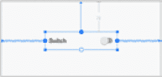
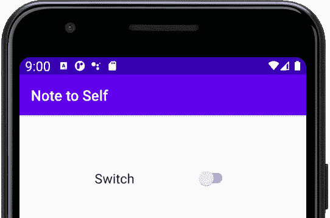
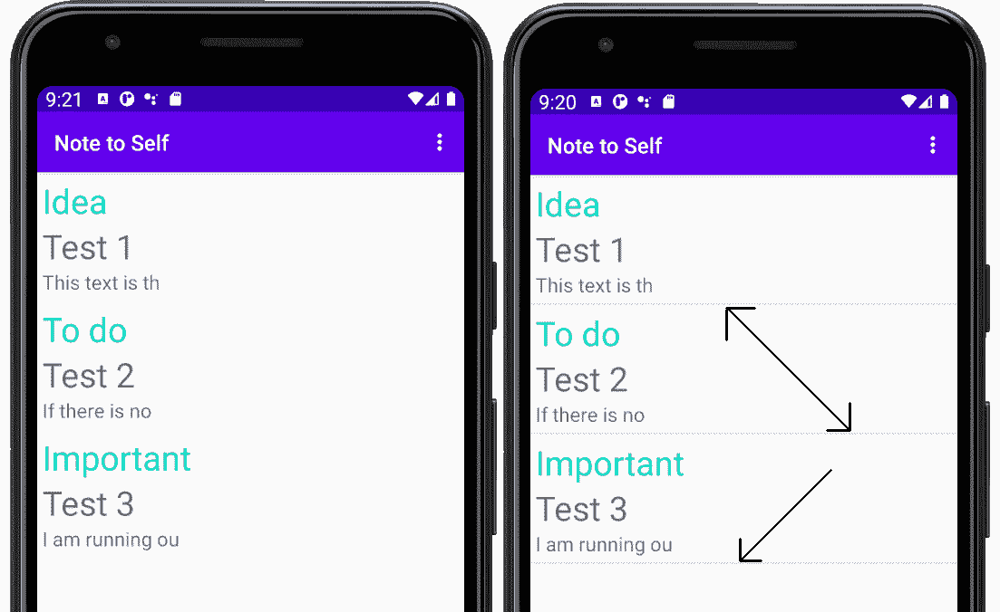

# *第十七章*:数据持久化和共享化

在这一章中，我们将看看将数据保存到安卓设备永久存储的几种不同方法。同样，我们将首次在我们的应用中添加第二个`Activity`。当在我们的应用中实现一个单独的“屏幕”时，比如设置屏幕，在一个新的`Activity`中这样做通常是有意义的。我们可以不厌其烦地隐藏原始用户界面，然后显示新的用户界面，但这将很快导致混乱和容易出错的代码。因此，我们将看到如何添加一个`Activity`类并在它们之间导航用户。

总之，在本章中，我们将执行以下操作:

*   了解使用安卓意图在`Activity`类之间切换和传递数据
*   在一个新的`Activity`类中为自我笔记项目创建一个简单(非常简单)的设置屏幕
*   使用`SharedPreferences`类保存设置屏幕数据
*   了解用于序列化的 **JavaScript 对象符号** ( **JSON** )
*   探索 Java 的`try` - `catch` - `finally`语法
*   在我们的自我提示应用中实现保存数据

# 技术要求

你可以在[https://GitHub . com/PacktPublishing/Android-初学者编程-第三版/tree/main/章节%2017](https://github.com/PacktPublishing/Android-Programming-for-Beginners-Third-Edition/tree/main/chapter%2017) 找到本章中出现的代码文件。

# 安卓意图

这个`Intent`班被恰当地命名了。这是一个从我们的应用中展示`Activity`类意图的类。它明确了意图，也促进了意图的实现。

到目前为止，我们所有的应用都只有一个`Activity`，但许多安卓应用包含不止一个。

或许最常见的用法是`Intent`类允许我们在`Activity`实例之间切换。但是，当然，`Activity`实例是由带有成员变量的类构成的。那么，当我们在变量的值和数据之间切换时，它们会发生什么变化呢？意图通过允许我们在`Activity`实例之间传递数据来为我们处理这个问题。

意图不仅仅是连接我们应用的`Activity`实例。它们也使得与其他应用的交互成为可能。例如，我们可以在我们的应用中提供一个链接，让用户发送电子邮件、打电话、与社交媒体互动，或者在浏览器中打开网页，让电子邮件应用、电话应用、社交媒体应用或网络浏览器完成所有工作。

这本书没有足够的页面来真正深入挖掘与其他应用的交互，我们将主要关注在活动和传递数据之间的切换。

## 切换活动

假设我们有一个应用，有两个`Activity`类，因为我们很快就会。我们可以假设像往常一样，我们有一个名为`MainActivity`的`Activity`类，这是该应用启动的地方，还有一个名为`SettingsActivity`的第二个`Activity`。这就是我们如何从`MainActivity`切换到`SettingsActivity`的方法:

```java
// Declare and initialize a new Intent object called myIntent
Intent myIntent = new Intent(this, SettingsActivity.class);
// Switch to the SettingsActivity
startActivity(myIntent);
```

仔细看看我们是如何初始化`Intent`对象的。`Intent`有一个接受两个参数的构造函数。首先是对当前`Activity`、`this`的引用。第二个参数是我们要打开的`Activity`类的名称，`SettingsActivity.class`。`SettingsActivity`末尾的`.class`部分使其成为`AndroidManifest.xml`文件中声明的`Activity`类的全名，我们将在稍后进行意向实验时查看。

唯一的问题是`SettingsActivity`没有共享`MainActivity`的任何数据。在某种程度上，这是一件好事，因为如果你需要来自`MainActivity`的所有数据，那么这是一个合理的迹象，表明切换活动可能不是继续你的应用设计的最佳方式。然而，将封装得如此彻底以至于两个`Activity`实例对彼此一无所知是不合理的。

## 在活动之间传递数据

如果我们为用户提供了一个登录屏幕，并且我们希望将用户的凭据传递给我们应用的每个`Activity`会怎么样？我们可以利用意图来做到这一点。

我们可以像这样向`Intent`类添加数据:

```java
// Create a String called username 
// and set its value to bob
String username = "Bob";
// Create a new Intent as we have already seen
Intent myIntent = new Intent(this, SettingsActivity.class);
// Add the username String to the Intent
// using the putExtra method of the Intent class
myIntent.putExtra("USER_NAME", username);
// Start the new Activity as we did before
startActivity(myIntent);
```

在`SettingsActivity`中，我们可以这样检索字符串:

```java
// Here we need an Intent also
// But the default constructor will do
// as we are not switching Activity
Intent myIntent = new Intent();
// Initialize username with the passed in String 
String username = intent.getExtra().getStringKey("USER_NAME");
```

在前面的两个代码块中，我们以我们已经看到的相同方式切换了`Activity`。但是在我们调用`startActivity`方法之前，我们使用了`putExtra`方法将一个字符串加载到意图中。

我们使用**键值对**添加数据。每条数据都需要有一个`identifier`实例，该实例可用于检索`Activity`来识别和检索数据。

标识符名称由您决定，但应该使用有用/值得记住的值。

然后，在接收`Activity`中，我们简单地使用默认构造函数创建一个意图:

```java
Intent myIntent = new Intent();
```

然后我们可以使用`getExtras`方法和键值对中的适当标识符来检索数据。

一旦我们想开始发送多个值，就值得考虑不同的策略。

当发送比这个更复杂的数据时，`Intent`类可以帮助我们，但是`Intent`类有它的局限性。例如，我们将无法发送一个`Note`对象。

# 添加一个设置页面给自己备注

现在我们已经掌握了所有关于安卓`Intent`类的知识，我们可以在我们的笔记到自我应用中添加另一个屏幕(`Activity`)。我们将添加一个设置屏幕。

我们将首先为我们的设置屏幕创建一个新的`Activity`，看看这对`AndroidManifest.xml`文件有什么影响；然后，我们将为我们的设置屏幕创建一个非常简单的布局，并添加 Java 代码来从`MainActivity`切换到新的布局。但是，我们将推迟用 Java 连接设置屏幕，直到我们学会如何将设置保存到磁盘。我们将在本章的稍后部分进行此操作，然后返回到设置屏幕，使其数据保持不变。

首先，让我们创建那个新的`Activity`类。我们称之为`SettingsActivity`。

## 创建设置活动

这将是一个屏幕，用户可以打开或关闭`RecyclerView`小部件中每个音符之间的装饰分隔线。这将不是一个全面的设置屏幕，但它将是一个有用的练习，我们将学习如何在活动之间切换以及将数据保存到磁盘。按照以下步骤开始:

1.  在项目浏览器中，右键单击包含所有`.java`文件并且与您的包同名的文件夹。从弹出的上下文菜单中，选择**新建** | **活动** | **空活动**。
2.  在**活动名称**字段中，输入`SettingsActivity`。
3.  将所有其他选项保留为默认值，然后左键单击**完成**。

AndroidStudio为我们创建了一个新的基于`Activity`的类及其相关的`.java`文件。让我们快速浏览一下在幕后为我们完成的一些工作，因为了解正在发生的事情很有用。

在项目浏览器的`manifests`文件夹中打开`AndroidManifest.xml`文件。请注意下面的代码行，它大约是这个文件的一半:

```java
<activity android:name=".SettingsActivity"></activity>
```

一个`Activity`类就是这样**注册**到操作系统的。如果一个`Activity`类没有注册，那么试图运行它将会使应用崩溃。我们可以通过在一个新的`.java`文件中创建一个扩展`Activity`(或`AppCompatActivity`)的类来创建一个`Activity`类。然而，我们必须自己添加前面的代码。此外，通过使用新的`Activity`向导，我们获得了一个为我们自动生成的布局 XML 文件(`activity_settings.xml`)。

## 设计设置屏幕布局

我们将快速为我们的设置屏幕构建一个 UI，下面的步骤和图应该会让这变得简单明了:

1.  Open the `activity_settings.xml` file, switch to the **Design** tab, and we will quickly lay out our settings screen. Use this next figure as a guide while following the rest of the steps:

    

    图 17.1–设计设置屏幕

2.  将**开关**部件拖放到布局的中间顶部。我通过拖动边缘来拉长我的头发。
3.  添加一个`switch1`的`id`属性(如果默认还没有的话)，这样我们就可以使用`SettingsActivity.java`的 Java 代码与之交互。
4.  使用约束手柄固定开关的位置，或点击**推断约束**按钮自动固定。

现在我们的设置屏幕有了一个简单的新布局，并且`id`属性已经准备好了，当我们在本章后面用我们的 Java 代码连接它时，就可以使用了。

## 使用户能够切换到设置屏幕

我们已经知道如何切换到。此外，由于我们不会向它传递任何数据，也不会从它那里传递任何数据，因此我们只需两行 Java 代码就可以完成这项工作。

您可能已经注意到我们应用的操作栏中有一个菜单图标。它是我们创建项目时使用的基本活动模板的默认部分。如下图所示:


图 17.2–菜单图标

如果你点击它，里面已经有一个菜单选项用于**设置**，这是我们第一次创建应用时默认提供的。这是您点击菜单图标时将看到的内容:


图 17.3–设置选项

我们所需要做的就是将我们的代码切换到`MainActivity`类的`onOptionsItemSelected`方法中的`SettingsActivity`类。AndroidStudio甚至默认提供了一个`if`块，供我们粘贴代码，假设有一天我们想要添加一个设置屏幕。多体贴啊。

在编辑器窗口中将切换到`MainActivity.java`，在`onOptionsItemSelected`方法中找到以下代码块:

```java
//noinspection SimplifiableIfStatement
if (id == R.id.action_settings) {
   return true;
}
```

将此代码添加到之前显示的`if`块中，就在`return true`语句之前:

```java
Intent intent = new Intent(this, SettingsActivity.class);
startActivity(intent);
```

您将需要使用您喜欢的技术导入`Intent`类来添加这一行代码:

```java
import android.content.Intent;
```

您现在可以通过点击**设置**菜单选项来运行应用并访问新的设置屏幕。此屏幕截图显示了模拟器上运行的设置屏幕:



图 17.4–设置屏幕

要将从`SettingsActivity`返回到`MainActivity`，您可以点击设备上的后退按钮。

# 用共享引用保存数据

在安卓系统中，有几种方法可以让数据持久化。坚持，我的意思是，如果用户退出应用，那么当他们回到应用时，他们的数据仍然可用。使用哪种方法是正确的取决于应用和数据类型。

在这本书里，我们将研究三种使数据持久化的方法。为了保存用户的设置，我们只需要一个简单的方法。毕竟，我们只需要知道他们是否想要`RecyclerView`小部件中每个音符之间的装饰分隔线。

让我们看看如何让我们的应用将变量保存并重新加载到设备的内部存储中。我们需要使用`SharedPreferences`类。`SharedPreferences`是一个提供数据访问的类，应用的所有`Activity`类都可以访问和编辑这些数据。让我们看看如何使用它:

```java
// A SharedPreferences for reading data
SharedPreferences prefs;
// A SharedPreferences.Editor for writing data
SharedPreferences.Editor editor; 
```

和所有对象一样，我们需要先初始化它们，然后才能使用它们。我们可以使用`getSharedPreferences`方法初始化`prefs`对象，并传入一个字符串，该字符串将用于引用使用该对象读取和写入的所有数据。通常，我们可以使用应用的名称作为该字符串的值。在接下来的代码中，`MODE_PRIVATE`表示任何类，仅在此应用中，可以访问它:

```java
prefs = getSharedPreferences("My App", MODE_PRIVATE);
```

然后，我们使用新初始化的`prefs`对象，通过调用`edit`方法来初始化我们的`editor`对象:

```java
editor = prefs.edit();
```

假设我们想将用户名保存在名为`username`的字符串中。然后，我们可以将数据写入设备的内部存储器，如下所示:

```java
editor.putString("username", username);
editor.commit();
```

`putString`方法中使用的第一个参数是可以用来引用数据的标签；第二个是保存我们想要保存的数据的实际变量。前面代码的第二行启动保存过程。因此，我们可以像这样将多个变量写入磁盘:

```java
editor.putString("username", username);
editor.putInt("age", age);
editor.putBoolean("newsletter-subscriber", subscribed);
// Save all the above data
editor.commit();
```

前面的代码演示了可以保存其他变量类型，当然它假设`username`、`age`和`subscribed`变量已经被声明，然后用适当的值初始化。

一旦`editor.commit()`被执行，数据被存储。我们可以退出应用，甚至关闭设备，数据会持续存在。

# 用共享引用重新加载数据

让我们看看如何在下次运行应用时重新加载我们的数据。这段代码将重新加载前一段代码保存的三个值。我们甚至可以声明我们的变量并用存储的值初始化它们:

```java
String username  = 
   prefs.getString("username", "new user");
int age  = prefs.getInt("age", -1);
boolean subscribed = 
   prefs.getBoolean("newsletter-subscriber", false)
```

在前面的代码中，我们使用适合数据类型的方法和最初保存数据时使用的标签从磁盘加载数据。不太清楚的是每个方法调用的第二个参数。

`getString`、`getInt`和`getBoolean`方法需要默认值作为第二个参数。如果没有存储该标签的数据，它将返回默认值。

然后，我们可以在代码中检查这些默认值，并尝试获取真实值。请看这里，例如:

```java
if (age == -1){
   // Ask the user for his age
}
```

我们现在对的了解足以将用户的设置保存在Self Note 应用中。

# 使“注意自我”设置持续

我们已经学习了如何将数据保存到设备的内存中。当我们实现保存用户设置时，我们还将再次看到我们如何处理`Switch`输入，以及我们刚刚看到的代码将在哪里使我们的应用按照我们希望的方式工作。

## 编码设置活动类

大部分动作将发生在`SettingsActivity.java`文件中。因此，单击适当的选项卡，我们将一次添加一点代码。

首先，我们需要一些成员变量来给我们提供工作`SharedPreferences`和`Editor`实例。我们还想要一个成员变量来表示用户的设置选项:他们是否想要装饰性的分隔符。

在类声明之后将以下成员变量添加到`SettingsActivity`类中:

```java
private SharedPreferences mPrefs;
private SharedPreferences.Editor mEditor;
private boolean mShowDividers;
```

导入`SharedPreferences`类:

```java
import android.content.SharedPreferences;
```

现在在`onCreate`方法中，添加代码初始化`mPrefs`和`mEditor`:

```java
mPrefs = getSharedPreferences("Note to self", MODE_PRIVATE);
mEditor = mPrefs.edit();
```

接下来，还是在`onCreate`方法中，让我们获取对我们的`Switch`小部件的引用，并加载保存的数据，该数据代表我们的用户之前选择是否显示分隔线。

我们在第 13 章[](13.html#_idTextAnchor228)**【匿名类–将安卓小部件带入生活】*中获得了对开关的引用。请注意默认值为`true`–显示分频器。我们还会根据情况将开关设置为开或关:*

```java
mShowDividers  = mPrefs.getBoolean("dividers", true);
Switch switch1 = findViewById(R.id.switch1);
// Set the switch on or off as appropriate
switch1.setChecked(mShowDividers);
```

您需要导入`Switch`类:

```java
import android.widget.Switch;
```

接下来，我们创建一个匿名类来监听和处理对我们的`Switch`小部件的更改。

当`isChecked`变量为`true`时，我们使用`prefs`对象将`dividers`标签和`mShowDividers`变量设置为`true`；未勾选时，我们将其设置为`false`。

将以下代码添加到我们刚刚讨论的`onCreate`方法中:

```java
switch1.setOnCheckedChangeListener(
      new CompoundButton.OnCheckedChangeListener() {
             public void onCheckedChanged(
                         CompoundButton buttonView, 
                               boolean isChecked) {
                   if(isChecked){
                         mEditor.putBoolean(
                                     "dividers", true);

                         mShowDividers = true;
                   }else{
                         mEditor.putBoolean(
                                     "dividers", false);

                         mShowDividers = false;
                   }
             }
      }
);
```

您需要导入`CompoundButton`类:

```java
import android.widget.CompoundButton;
```

您可能已经注意到，在任何代码中，我们都没有调用`mEditor.commit`方法来保存用户的设置。我们本可以在检测到交换机发生变化后将其放置，但是将它放置在保证被调用的位置要简单得多，但只能放置一次。

我们将使用我们对`Activity`生命周期的知识并覆盖`onPause`方法。当用户离开`SettingsActivity`屏幕返回`MainActivity`或退出应用时，操作系统将调用`onPause`方法并保存设置。添加此代码以覆盖`onPause`方法并保存用户设置。在`SettingsActivity`类的右花括号前添加代码:

```java
@Override
protected void onPause() {
   super.onPause();
   // Save the settings here
   mEditor.commit();
}
```

最后，我们可以在`MainActivity`类中添加一些代码，在 app 启动时或者用户从设置画面切换回主画面时加载设置。

## 对主要活动类进行编码

在我们的`NoteAdapter` 实例被声明后，添加这个高亮显示的代码来添加一些成员变量:

```java
private List<Note> noteList = new ArrayList<>();
private RecyclerView recyclerView;
private NoteAdapter mAdapter;
private boolean mShowDividers;
private SharedPreferences mPrefs;
```

导入`SharedPreferences`类:

```java
import android.content.SharedPreferences;
```

现在我们有一个`boolean`成员来决定是否显示分隔线，还有一个`SharedPreferences`实例来从磁盘读取设置。

现在我们将覆盖`onResume`方法来初始化我们的`mPrefs`变量，并将设置加载到`mShowDividers`变量中。

添加被覆盖的`onResume`方法，如`MainActivity`类旁边所示:

```java
@Override
protected void onResume(){
   super.onResume();
   mPrefs = getSharedPreferences(
         "Note to self", MODE_PRIVATE);

   mShowDividers  = mPrefs.getBoolean(
         "dividers", true);
}
```

用户现在可以选择他们的设置。该应用将根据需要保存和重新加载它们，但我们需要让`MainActivity`类响应用户的选择。

在`onCreate`方法中找到该代码并删除:

```java
// Add a neat dividing line between items in the list
recyclerView.addItemDecoration(
   new DividerItemDecoration(
   this, LinearLayoutManager.VERTICAL));
```

前面的代码设置了列表中每个音符之间的分隔线。将这个新代码添加到`onResume`方法中，这是由`if`语句包围的同一行代码，只有当`mShowDividers`为`true`时，才能有选择地使用分隔符。在`onResume`方法中的前一个代码后添加代码:

```java
if(mShowDividers) {
   // Add a neat dividing line between list items
   recyclerView.addItemDecoration(
         new DividerItemDecoration(
         this, LinearLayoutManager.VERTICAL));
}else{
   // check there are some dividers
// or the app will crash
if(recyclerView.getItemDecorationCount() > 0) {
         recyclerView.removeItemDecorationAt(0);
}
}
```

运行应用，注意分隔线不见了；转到设置屏幕，打开分隔线，返回主屏幕(用后退按钮)–看:现在有分隔线了。下图显示了带有和不带分隔符的列表，以说明我们添加的代码是有效的，并且设置在两个 Activity 类之间保持不变:



图 17.5–带分隔符和不带分隔符的列表

请务必尝试退出应用并重新启动，以验证设置是否已保存到磁盘。您甚至可以关闭模拟器，然后再次打开，设置将保持不变。

现在我们有了一个整洁的设置屏幕，我们可以永久保存用户对装饰偏好的选择。当然，关于持久性，最大的缺失环节是用户的基础数据，他们的笔记，仍然没有持久性。

# 更高级的坚持

让我们想想我们需要做什么。我们想把一堆笔记存到内部存储器。更具体地说，我们希望存储字符串和相关布尔值的选择。这些字符串和布尔值表示用户的笔记标题、笔记文本，以及它是待办事项、重要事项还是想法。

鉴于我们对`SharedPreferences`类的了解，乍一看这似乎并不特别具有挑战性——除非我们对需求进行更深入的挖掘。如果用户喜欢我们的应用，最终得到 100 个笔记怎么办？我们需要 100 个键值对标识符。不是不可能，但开始变得尴尬。

现在考虑一下，我们希望增强应用，并让用户能够在其中添加日期。安卓有一个`Date`类非常适合这个。然后在我们的应用中添加一些简洁的功能，比如提醒，会相当简单。但是当涉及到保存数据时，事情突然变得复杂起来。

我们如何使用`SharedPreferences`存储日期？不是为这个设计的。我们可以在保存时将其转换为字符串，并在加载时再次转换回来，但这并不简单。

随着我们的应用在功能上的增长，我们的用户得到越来越多的笔记，整个持久性的事情变成了一场噩梦。我们需要的是一种保存和加载对象的方法，实际的 Java 对象。如果我们可以简单地保存和加载对象，包括它们的内部数据(字符串、布尔值、日期或其他任何东西)，我们的应用就可以拥有我们能想到的任何类型的数据来适应我们的用户。

将数据对象转换为位和字节存储在磁盘上的过程称为**序列化**；相反的过程称为**反序列化**。序列化本身是一个庞大的话题，远非简单明了。幸运的是，正如我们所料，有一个类可以为我们处理大部分的复杂性。

## 什么是 JSON？

**JSON** 代表 **JavaScript 对象符号**，广泛应用于安卓和 Java 语言之外的领域。它可能最常用于在 web 应用和服务器之间发送数据。

幸运的是，安卓有一些 JSON 类几乎完全隐藏了序列化过程的复杂性。通过学习更多的 Java 概念，我们可以很快开始使用这些类，并开始将整个 Java 对象写入设备存储，而不用担心对象是由什么基元类型组成的。

与我们目前看到的其他类相比，JSON 类承担的操作的失败概率高于正常情况，超出了它们的控制范围。为了找出为什么会这样，以及对此可以做些什么，让我们来看看 Java 异常。

## Java 异常——尝试、捕捉，最后

所有这些关于 JSON 的谈论都要求我们学习一个新的 Java 概念:**例外**。当我们编写一个执行可能失败的操作的类时，特别是由于我们无法控制的原因，建议在我们的代码中明确这一点，以便任何使用我们类的人都为这种可能性做好准备。

保存和加载数据是一种场景，在这种场景中，故障可能超出我们的控制。当 SD 卡被移除或损坏时，请考虑尝试加载数据。代码可能失败的另一个例子可能是当我们编写依赖于网络连接的代码时——如果用户在数据传输的中途离线了怎么办？

Java 异常是解决方案，JSON 类使用它们，所以现在是了解它们的好时机。

当我们编写一个使用有可能失败的代码的类时，我们可以通过使用带有`try`、`catch`和`finally`的异常来准备我们类的用户。

我们可以在我们的类中使用签名末尾的`throws` Java 关键字编写方法——可能有点像这样:

```java
public void somePrecariousMethod() throws someException{
   // Risky code goes here
}
```

现在任何使用`somePrecariousMethod`方法的代码都需要**处理**异常。我们处理异常的方式是通过在`try`和`catch`块中包装代码——可能是这样的:

```java
try{
   ...
   somePrecariousMethod();
   ...
}catch(someException e){
   Log.e("Exception:" + e, "Uh ohh")
   // Take action if possible
}
```

可选地，如果我们想在`try`和`catch`块之后采取任何进一步的行动，我们也可以添加一个`finally`块:

```java
finally{
   // More action here
}
```

在我们对 Self 应用的注释中，我们将采取最少的操作来处理异常，并简单地向 logcat 输出一个错误，但是您可以做的事情，例如通知用户，重试操作，或者将一些巧妙的备份计划付诸行动。

# 备份自己的笔记中的用户数据

因此，随着我们对异常的新的洞察，让我们修改我们的注意到自我代码，然后我们可以被介绍到`JSONObject`和`JSONException`类。

首先，让我们对我们的`Note`类做一些小的修改。为我们的`Note`类的每个方面添加更多的成员，作为键值对中的键:

```java
private static final String JSON_TITLE = "title";
private static final String JSON_DESCRIPTION = "description";
private static final String JSON_IDEA = "idea";
private static final String JSON_TODO = "todo";
private static final String JSON_IMPORTANT = "important";
```

现在添加一个构造函数和一个接收`JSONObject`并抛出`JSONException`的空默认构造函数。构造函数的主体通过调用`JSONObject`的`getString`或`getBoolean`方法来初始化定义单个`Note`对象属性的每个成员，并将键作为参数传入。我们还提供了一个空的默认构造函数，这是我们现在提供专门的构造函数所必需的:

```java
// Constructor
// Only used when new is called with a JSONObject
public Note(JSONObject jo) throws JSONException {

   mTitle =  jo.getString(JSON_TITLE);
   mDescription = jo.getString(JSON_DESCRIPTION);
   mIdea = jo.getBoolean(JSON_IDEA);
   mTodo = jo.getBoolean(JSON_TODO);
   mImportant = jo.getBoolean(JSON_IMPORTANT);
}
// Now we must provide an empty default constructor 
// for when we create a Note as we provide a
// specialized constructor.
public Note (){
}
```

您需要导入`JSONException`和`JSONObject`类:

```java
import org.json.JSONException;
import org.json.JSONObject;
```

我们将看到的下一个代码将把一个给定的`Note`对象的成员变量加载到`JSONObject`中。这就是`Note`对象的成员打包成一个单独的`JSONObject`的地方，为实际的序列化做好准备。

我们需要做的就是用合适的键和匹配的成员变量调用`put`方法。这个方法返回`JSONObject`(我们一分钟后会看到在哪里)，它也抛出一个`JSONObject`异常。添加我们刚刚讨论过的代码:

```java
public JSONObject convertToJSON() throws JSONException{

   JSONObject jo = new JSONObject();
   jo.put(JSON_TITLE, mTitle);
   jo.put(JSON_DESCRIPTION, mDescription);
   jo.put(JSON_IDEA, mIdea);
   jo.put(JSON_TODO, mTodo);
   jo.put(JSON_IMPORTANT, mImportant);
   return jo;
}
```

现在让我们创建一个`JSONSerializer`类，它将执行实际的序列化和反序列化。创建一个新的类，并将其称为`JSONSerializer`。

让我们把它分成几个块，并讨论我们在编码每个块时正在做什么。

首先，声明和几个成员变量:一个保存数据的文件名的字符串和一个在安卓系统中将数据写入文件所必需的`Context`对象。在刚刚创建的类中添加高亮显示的代码:

```java
public class JSONSerializer {
    private String mFilename;
 private Context mContext;

 // All the rest of the code for the class goes here

}// End of class
```

注意

您需要导入`Context`类:

`import android.content.Context;`

前面的代码显示该类的右花括号和该类的所有后续代码都应该输入其中。这里有一个非常简单的构造函数，我们初始化作为参数传入的两个成员变量。添加`JSONSerializer`的构造函数:

```java
public JSONSerializer(String fn, Context con){
   mFilename = fn;
   mContext = con;
}
```

现在我们可以开始编写这个类的真正内核了。接下来是`save`方法。它首先创建一个`JSONArray`对象，这是一个专门用于处理 JSON 对象的`ArrayList`类。

接下来，代码使用增强的`for`循环遍历`notes`数组列表中的所有`Note`对象，并使用我们之前添加的`Note`类中的`convertToJSON`方法将它们转换为 JSON 对象。然后，我们将这些转换后的`JSONObject`实例加载到`jArray`中。

接下来，代码使用一个`Writer`实例和一个`OutputStream`实例将数据写入一个实际文件。注意`OutputStream`实例需要初始化`mContext`对象。添加我们刚刚讨论过的代码:

```java
public void save(List<Note> notes)
   throws IOException, JSONException{
   // Make an array in JSON format
   JSONArray jArray = new JSONArray();
   // And load it with the notes
   for (Note n : notes)
         jArray.put(n.convertToJSON());
   // Now write it to the private disk space of our app
   Writer writer = null;
   try {
         OutputStream out = 
         mContext.openFileOutput(mFilename,
                mContext.MODE_PRIVATE);
         writer = new OutputStreamWriter(out);
         writer.write(jArray.toString());
   } finally {
         if (writer != null) {
                writer.close();
         }
   }
}
```

您需要为这些新类添加以下`import`语句:

```java
import org.json.JSONArray;
import org.json.JSONException;
import java.io.IOException;
import java.io.OutputStream;
import java.io.OutputStreamWriter;
import java.io.Writer;
import java.util.List;
```

现在是反序列化——加载数据。正如我们所料，这一次该方法没有接收任何参数，而是返回一个`ArrayList`实例。使用`mContext.openFileInput`创建一个`InputStream`实例，打开包含所有数据的文件。

我们使用一个`while`循环将所有数据附加到一个字符串中，并使用我们新的`Note`构造器，该构造器将 JSON 数据提取到常规原语变量中，将每个`JSONObject`解包到一个`Note`对象中，并将其添加到返回到调用代码的`ArrayList`中:

```java
public ArrayList<Note> load() throws IOException, JSONException{
   ArrayList<Note> noteList = new ArrayList<Note>();
   BufferedReader reader = null;
   try {
         InputStream in = 
         mContext.openFileInput(mFilename);
         reader = new BufferedReader(new 
         InputStreamReader(in));
         StringBuilder jsonString = new StringBuilder();
         String line = null;
         while ((line = reader.readLine()) != null) {
                jsonString.append(line);
         }
         JSONArray jArray = (JSONArray) new
               JSONTokener(jsonString.toString()
               ).nextValue();
         for (int i = 0; i < jArray.length(); i++) {
                noteList.add(new 
                Note(jArray.getJSONObject(i)));
         }
   } catch (FileNotFoundException e) {
         // we will ignore this one, since it happens
         // when we start fresh. You could add a log here.
   } finally {// This will always run
         if (reader != null)
                reader.close();
   }
   return noteList;
}
```

您需要添加这些导入:

```java
import org.json.JSONTokener;
import java.io.BufferedReader;
import java.io.FileNotFoundException;
import java.io.InputStream;
import java.io.InputStreamReader;
import java.util.ArrayList;
```

现在我们需要做的就是让我们的新班级在`MainActivity`班工作。在`MainActivity`声明后添加新成员，如下图所示。另外，删除`noteList`的初始化，只留下声明，因为我们现在将用`onCreate`方法中的一些新的代码初始化它。我已经注释掉了您需要删除的行:

```java
public class MainActivity extends AppCompatActivity {
 private JSONSerializer mSerializer;
   //private List<Note> noteList = new ArrayList<>();
 private List<Note> noteList;
```

现在，在`onCreate`方法中，我们通过用文件名和`getApplicationContext()`调用`JSONSerializer`构造函数来初始化`mSerializer`，这将返回应用的`Context`实例，并且是必需的。然后我们可以使用`JSONSerializer load`方法加载任何保存的数据。在处理浮动操作按钮的代码之后添加这个新的突出显示的代码。这个新代码必须在我们处理`RecyclerView`实例之前出现:

```java
…
FloatingActionButton fab = 
         (FloatingActionButton) findViewById(R.id.fab);

fab.setOnClickListener(new View.OnClickListener() {
         @Override
         public void onClick(View view) {
                DialogNewNote dialog = new DialogNewNote();
                dialog.show(getSupportFragmentManager(), "");
         }
});
   mSerializer = new JSONSerializer("NoteToSelf.json", 
 getApplicationContext());
 try {
 noteList = mSerializer.load();
 } catch (Exception e) {
 noteList = new ArrayList<Note>();
 Log.e("Error loading notes: ", "", e);
 }
   recyclerView =
         findViewById(R.id.recyclerView);
mAdapter = new NoteAdapter(this, noteList);
             …
```

注意

此时需要导入`Log`类:

`import android.util.Log;`

我在前面的代码中展示了大量的上下文，因为它的定位对它的工作至关重要。如果您在运行该程序时遇到任何问题，请务必将其与 [*第 17 章*](#_idTextAnchor300) `/java`文件夹中的下载包中的代码进行比较。

现在我们可以给我们的`MainActivity`类添加一个新的方法，这样我们就可以调用它来保存我们用户的所有数据。这个新方法所做的只是调用`JSONSerializer`类的`save`方法，传入所需的`Note`对象列表:

```java
public void saveNotes(){
   try{
         mSerializer.save(noteList);
   }catch(Exception e){
         Log.e("Error Saving Notes","", e);
   }
}
```

现在，就像我们保存用户设置时一样，我们将覆盖`onPause`方法来保存用户的笔记数据。请务必在`MainActivity`类中添加此代码:

```java
@Override
protected void onPause(){
   super.onPause();
   saveNotes();
}
```

就这样。我们现在可以运行应用，添加任意多的笔记。`ArrayList`将把它们全部存储在我们的运行应用中，我们的`RecyclerAdapter`将管理在`RecyclerView`中显示它们，现在 JSON 将负责把它们加载到磁盘上，并把它们加载回来。

# 常见问题

1.  I didn't understand everything in this chapter – am I not cut out to be a programmer?

    本章介绍了许多新的类、概念和方法。如果你的头有点痛，那是意料之中的。如果一些细节不清楚，不要让它阻碍你。继续下几章(它们要简单得多)，然后重新访问这一章并检查完整的代码文件。

2.  So, how does serialization work in detail?

    序列化真的是一个很大的话题。你可以一辈子写应用，而且永远不需要真正理解它。这种类型的主题可能是计算机科学学位的主题。想了解更多的话，可以看看这篇文章:[https://en.wikipedia.org/wiki/Serialization](https://en.wikipedia.org/wiki/Serialization)。

# 总结

在我们的安卓应用编程接口之旅的这一点上，值得总结一下我们所知道的。我们可以布局自己的用户界面设计，并从广泛多样的小部件中进行选择，以允许用户与用户界面进行交互。我们可以创建多个屏幕以及弹出对话框，并且可以捕获全面的用户数据。此外，我们现在可以保持这些数据。

当然，安卓应用编程接口还有很多东西需要学习，甚至超出了这本书将教给你的，但关键是我们现在已经足够了解如何规划和实现一个有效的应用。你可以现在就开始使用你自己的应用。

如果你有立即开始自己项目的冲动，那么我的建议是继续做下去。不要等到你认为自己是“专家”或更有准备的时候。阅读这本书，更重要的是，实现应用会让你成为一个更好的安卓程序员，但没有什么能比设计和实现自己的应用更快地教会你了！通读这本书并同时进行自己的项目是完全可能的。

在下一章中，我们将通过使该应用多语言化来为其添加最后的润色。这是相当快速和容易的。*