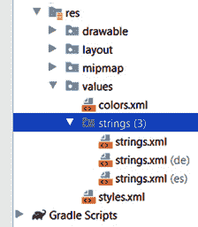
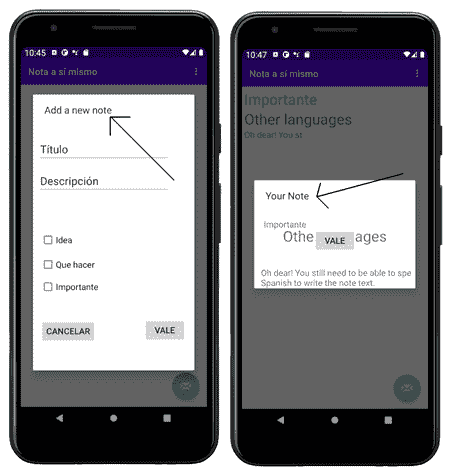
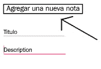

# 十八、本地化

这一章又快又简单，我们将在这里学习如何让数百万潜在用户访问你的应用。我们将看到如何添加其他语言。我们还将看到在添加多种语言时，通过字符串资源以正确的方式添加文本对我们有什么好处。

在本章中，我们将介绍以下内容:

*   通过添加西班牙语和德语，使“自我注意”应用多语言化
*   学习如何更充分地使用字符串资源

我们开始吧。

# 技术要求

你可以在[https://GitHub . com/PacktPublishing/Android-初学者编程-第三版/tree/main/章节%2018](https://github.com/PacktPublishing/Android-Programming-for-Beginners-Third-Edition/tree/main/chapter%2018) 找到本章中出现的代码文件。

# 让说西班牙语和德语的人可以访问“自我笔记”应用

首先，我们需要给我们的项目添加一些文件夹——每种新语言一个。文本被归类为**资源**，因此需要进入`res`文件夹。按照以下步骤为项目添加西班牙语和德语支持。

重要说明

本项目的源文件在 [*第 18 章*](#_idTextAnchor320) 文件夹中提供，仅供参考。您需要完成接下来描述的过程来实现多语言功能。

## 增加西班牙语语言支持

按照以下步骤添加西班牙语支持:

1.  右键单击 **res** 文件夹，然后选择**新建** | **安卓资源目录**。在**目录名**字段中，键入`values-es`。
2.  左键单击**确定**。
3.  现在我们需要添加一个文件，我们可以在其中放置我们所有的西班牙语翻译。右键单击**资源**，然后选择**新建** | **安卓资源文件**，并在**文件名**字段中键入`strings.xml`。在**目录名**字段中输入`values-es`。
4.  左键单击 **确定**。

在这个阶段，我们有一个新的西班牙语翻译文件夹，里面有一个用于字符串资源的`strings.xml`文件。让我们对德语也这样做。

## 增加德语语言支持

按照以下步骤添加德语支持:

1.  右键单击 **res** 文件夹，然后选择**新建** | **安卓资源目录**。在**目录名**字段中，键入`values-de`。
2.  左键单击**确定**。
3.  现在我们需要添加一个文件，我们可以在其中放置我们所有的德语翻译。右键单击**资源**，然后选择**新建** | **安卓资源文件**，并在**文件名**字段中键入`strings.xml`。在**目录名**字段中输入`values-de`。
4.  左键单击**确定**。

这就是`strings.xml`文件夹的样子。您可能想知道`strings.xml`文件夹是从哪里来的，因为它不符合我们在前面步骤中创建的结构。AndroidStudio 正在帮助我们(显然)按照安卓操作系统的要求整理文件和文件夹。但是，您可以看到西班牙语和德语文件，分别由它们的特定于国家的扩展名 **es** 和 **de** 表示:



图 18.1–strings . XML 文件夹

现在我们可以将翻译添加到文件中。

## 添加字符串资源

正如我们所知，`strings.xml`文件包含了应用将显示的单词，比如“重要”、“要做”、“想法”等等。通过为我们想要支持的每种语言准备一个`strings.xml`文件，我们就可以让安卓根据用户的语言设置选择合适的文本。

当您阅读以下内容时，请注意，尽管我们将正在翻译的任何单词的翻译作为值，但是`name`属性保持不变。仔细想想，这是合乎逻辑的，因为这是我们在布局文件中引用的`name`属性。

让我们提供翻译，看看我们取得了什么成就，然后回来讨论我们将如何处理 Java 代码中的文本。实现该代码最简单的方法是从原始`strings.xml`文件中复制并粘贴代码，然后编辑每个`name`属性的值:

1.  双击打开`strings.xml`文件。一定要选择 **(es)** 后缀旁边的那个。编辑文件如下:

    ```java
    <?xml version="1.0" encoding="utf-8"?>
    <resources>
    <string name="app_name">Nota a sí mismo</string>
    <string name="action_settings">Configuración</string>
    <string name="action_add">add</string>
    <string name="title_hint">Título</string>
    <string name="description_hint">Descripción</string>
    <string name="idea_text">Idea</string>
    <string name="important_text">Importante</string>
    <string name="todo_text">Que hacer</string>
    <string name="cancel_button">Cancelar</string>
    <string name="ok_button">Vale</string>
    <string name="settings_title">Configuración</string>
    </resources>
    ```

2.  Open the `strings.xml` file by double-clicking it. Be sure to choose the one next to the **(de)** postfix. Edit the file to look like this:

    ```java
    <?xml version="1.0" encoding="utf-8"?>
    <resources>
    <string name="app_name">Hinweis auf selbst</string>
    <string name="action_settings">Einstellungen</string>
    <string name="action_add">add</string>
    <string name="title_hint">Titel</string>
    <string name="description_hint">Beschreibung</string>
    <string name="idea_text">Idee</string>
    <string name="important_text">Wichtig</string>
    <string name="todo_text">zu tun</string>
    <string name="cancel_button">Abbrechen</string>
    <string name="ok_button">Okay</string>
    <string name="settings_title">Einstellungen</string>
    </resources>
    ```

    注意

    如果您没有提供额外(西班牙语和德语)`strings.xml`文件中的所有字符串资源，那么丢失的资源将从默认文件中获取。

我们所做的是提供两个翻译。安卓知道哪种翻译是针对哪种语言的，因为它们被放置在不同的文件夹中。此外，我们使用了一个**字符串标识符**(属性`name`)来引用翻译。回头看看前面的代码，你会发现相同的标识符被用于两个翻译以及原始的`strings.xml`文件。

您甚至可以本地化为一种语言的不同版本，例如美国或英国英语。完整的代码列表可以在这里找到:[http://stack overflow . com/questions/7973023/什么是支持的语言列表-安卓上的地区](http://stackoverflow.com/questions/7973023/what-is-the-list-of-supported-languages-locales-on-android)。您甚至可以本地化资源，如图像和声音。点击这里了解更多信息:[http://developer . Android . com/guide/topics/resources/localization . html](http://developer.android.com/guide/topics/resources/localization.html)。

翻译是从谷歌翻译复制粘贴的，所以很有可能有些翻译是远非正确。像这样便宜地进行翻译是一种有效的方法，可以让一个应用拥有一组基本的字符串资源，这些资源可以放在对自己说不同语言的用户的设备上。一旦你开始需要任何深度的翻译，也许在故事驱动的游戏或社交媒体应用的情况下，你肯定会受益于由人类专业人员完成的翻译。

这个练习的目的是展示安卓是如何工作的，而不是如何翻译。

注意

我真诚地向任何可能看到这里提供的翻译的局限性的说西班牙语或德语的人道歉。

现在我们有了翻译，我们可以在一定程度上看到他们的行动。

# 用德语或西班牙语写给自己的跑步笔记

运行应用看看是否正常工作。现在我们可以更改本地化设置，以西班牙语查看。不同的设备在如何做到这一点上略有不同，但 Pixel 3 仿真器选项如下:

1.  选择**设置** | **系统** | **语言并输入** | **添加语言**。接下来，选择**西班牙语**，然后您将能够从列表中在西班牙语和英语之间切换。
2.  左键单击并拖动**西班牙语(Estados Unidos)** ，使其位于列表顶部。

恭喜，您的模拟器现在默认为西班牙语。完成本章后，您可以将首选语言拖回列表顶部。

现在你可以用常用的方式运行这个应用了。这里有一些运行西班牙语的应用的截图。我并排修改了几张截图，展示了“给自己的笔记”应用的不同屏幕:



图 18.2–以西班牙语运行的应用

在截图中可以清楚的看到我们的 app 是翻译成西班牙语的，主要是。显然，用户输入的文本将是他们所说的任何语言；这不是我们应用的缺陷。然而，仔细看截图，注意到我指出了几个文本仍然是英文的地方。我们的每个对话窗口中仍有一些未翻译的文本。

这是，因为文本是直接包含在我们的 Java 代码中的。正如我们所看到的，在多种语言中使用字符串资源，然后在我们的布局中引用它们是很容易的，但是我们如何从我们的 Java 代码中引用字符串资源呢？

## 用 Java 代码进行翻译

第一件事是在三个`strings.xml`文件中创建资源。以下是需要添加到三个不同文件中的两个资源。

在`strings.xml`(没有任何国家后缀)中，在`<resources></resources>`标签内添加这两个资源:

```java
<string name="add_new_note">Add a new note</string>
<string name="your_note">Your note</string>
```

在带有 **(es)** 后缀的`strings.xml`中，在`<resources></resources>`标签内添加这两个资源:

```java
<string name="add_new_note">Agregar una nueva nota</string>
<string name="your_note">Su nota</string>
```

在带有**(德)**后缀的`strings.xml`中，在`<resources></resources>`标签内添加这两个资源:

```java
<string name="add_new_note">Eine neue Note hinzufügen</string>
<string name="your_note">Ihre Notiz</string>
```

接下来，我们需要编辑一些 Java 代码来引用资源，而不是硬编码的字符串。

打开`DialogNewNote.java`文件，找到这行代码:

```java
builder.setView(dialogView).setMessage("Add a new note");
```

编辑它，如下所示，使用我们刚刚添加的字符串资源，而不是硬编码文本:

```java
builder.setView(dialogView).setMessage(getResources().
getString(R.string.add_new_note));
```

新代码使用链式`getResources.getString`方法来替换先前硬编码的`"Add a new note"`文本。仔细观察，您会发现发送到`getString`方法的参数是`R.string.add_new_note`字符串标识符。

`R.string`代码指的是`res`文件夹中的字符串资源，`add_new_note`是我们的标识。然后，安卓将能够根据运行该应用的设备的地区来决定哪个版本(默认、西班牙或德国)合适。

我们还有一个硬编码字符串要更改。

打开`DialogShowNote.java`文件，找到这行代码:

```java
builder.setView(dialogView).setMessage("Your Note");
```

编辑它，如下所示，使用我们刚刚添加的字符串资源，而不是硬编码文本:

```java
builder.setView(dialogView).setMessage(getResources().
getString(R.string.your_note));
```

新代码再次使用链式`getResources.getString`方法来替换先前硬编码的`"Your note"`文本。同样，发送到`getString`的参数是字符串标识符，在本例中是`R.string.your_note`。

安卓现在可以根据运行该应用的设备的地区来决定哪个版本(默认、西班牙或德语)合适。下一张截图显示**新注释**屏幕现在有了相应语言的开始文本:



图 18.3–新注释屏幕

可以添加任意多的字符串资源。作为来自 [*第三章*](03.html#_idTextAnchor064)*探索 AndroidStudio 和项目结构*的提醒，注意使用字符串资源是向所有项目添加任何文本的推荐方式。本书中的教程(除了《给自己的笔记》)将倾向于对它们进行硬编码，以形成一个更紧凑的教程。

# 总结

我们已经看到了如何迎合世界上对我们说不同语言的地区。我们现在可以通过我们的应用走向全球，并添加更灵活的字符串资源，而不是硬编码所有的文本。

在下一章中，我们将看到如何使用动画和插值器为我们的应用添加酷动画。