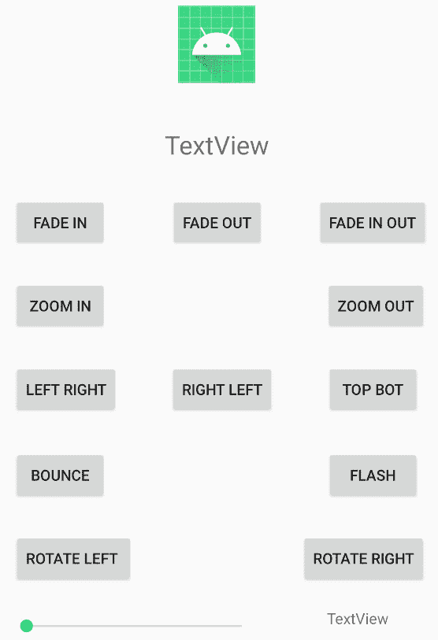
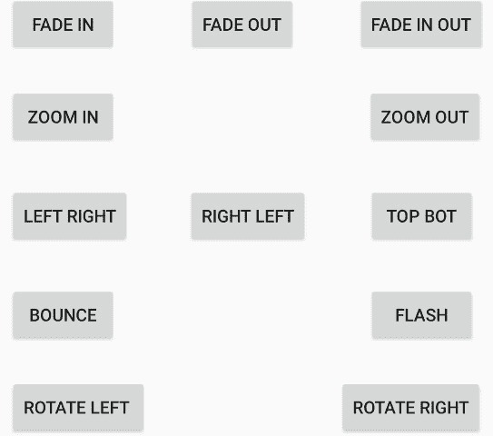
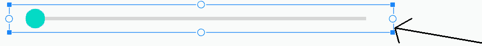
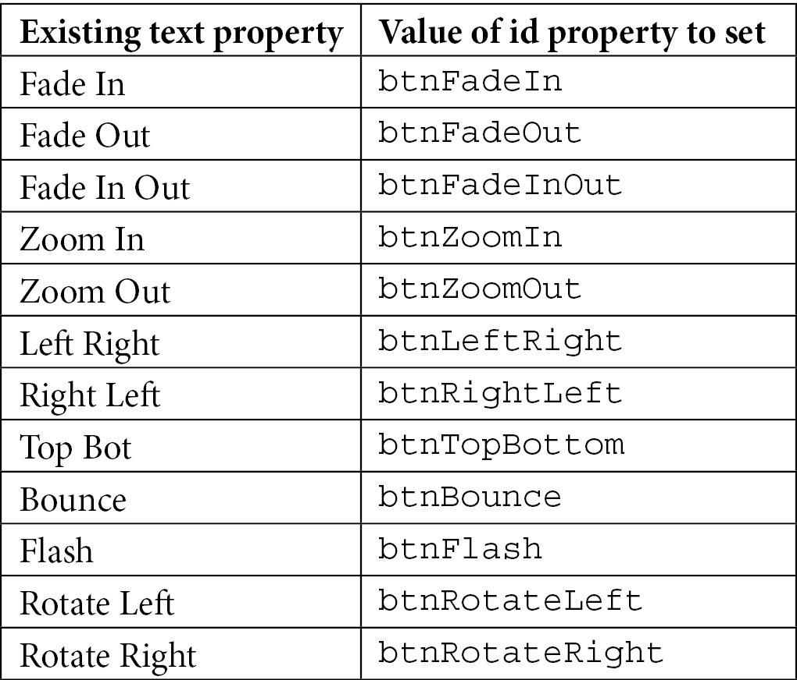
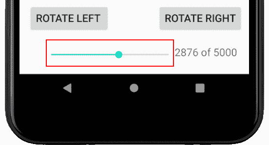
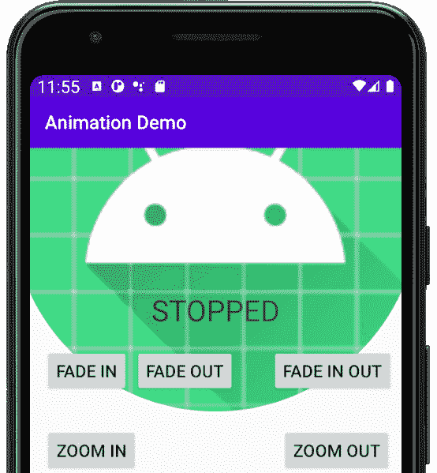
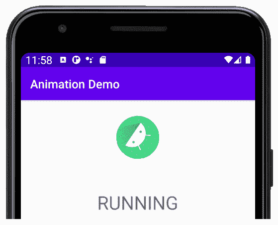

# *第 19 章* : 动画和插值

在这里，我们将看到如何使用`Animation`类来使我们的 UI 少一点静态，多一点有趣。正如我们所料，安卓应用编程接口将允许我们用相对简单的代码做一些相当高级的事情，而`Animation`类也没有什么不同。

本章可大致分为以下几个部分:

*   介绍安卓系统中动画是如何工作和实现的
*   介绍一个我们还没有探索过的用户界面小部件，`SeekBar`
*   创建工作动画应用

首先，让我们探索一下安卓系统中的动画是如何工作的。

# 技术要求

你可以在[https://GitHub . com/PacktPublishing/Android-初学者编程-第三版/tree/main/章节%2019](https://github.com/PacktPublishing/Android-Programming-for-Beginners-Third-Edition/tree/main/chapter%2019) 找到本章中出现的代码文件。

# 安卓动画

在安卓系统中创建动画的正常方式是通过 XML。我们可以编写 XML 动画，然后在指定的用户界面小部件上用 Java 加载和播放它们。因此，例如，我们可以编写一个动画，在 3 秒内淡入淡出 5 次，然后在`ImageView`或任何其他小部件上播放该动画。我们可以将这些 XML 动画视为一个脚本，因为它们定义了类型、顺序和时间。

让我们探索一下我们可以分配给动画的一些不同属性，然后如何在我们的 Java 代码中使用它们，最后，我们可以制作一个整洁的动画应用来尝试这一切。

## 用 XML 设计酷炫的动画

我们已经了解到，XML 可以用来描述动画和用户界面布局，但是让我们来看看具体是如何做到的。我们可以陈述描述小部件开始和结束外观的动画属性。然后，我们的 Java 代码可以通过引用包含它的 XML 文件的名称并将其转换为可用的 Java 对象来加载 XML，这也与用户界面布局类似。

这里是我们可以用来创建动画的一些动画属性对的快速浏览。在我们看了一些 XML 之后，我们将看到如何在我们的 Java 中使用它。

### 淡入淡出

阿尔法是透明度的量度。所以，通过陈述开始`fromAlpha`和结束`toAlpha`的值，我们可以淡入淡出项目。`0.0`的值是不可见的，`1.0`是对象的正常外观。在两者之间稳定移动会产生淡入效果:

```java
<alpha
   android:fromAlpha="0.0"
   android:toAlpha="1.0" />
```

### 移动的

我们可以使用类似的技术在用户界面中移动一个对象。`fromXDelta`和`toXDelta`可以将其值设置为动画对象大小的百分比。

下面的代码将对象从左向右移动，移动距离等于对象本身的宽度:

```java
<translate 
   android:fromXDelta="-100%"
   android:toXDelta="0%"/>
```

此外，还有用于上下动画的`fromYDelta`和`toYDelta`属性。

### 缩放或拉伸

`fromXScale`和`toXScale`将增加或减少一个物体的比例。例如，以下代码将更改对象，将动画从正常大小运行到不可见:

```java
<scale
   android:fromXScale="1.0"
   android:fromYScale="0.0"/>
```

作为另一个例子，我们可以使用`android:fromYScale="0.1"`将物体缩小到通常尺寸的十分之一，或者使用`android:fromYScale="10.0"`将其放大 10 倍。

### 控制持续时间

当然，如果这些动画立即得出它们的结论，它们都不会特别有趣。因此，为了使我们的动画更有趣，我们可以以毫秒为单位设置它们的持续时间。一毫秒是千分之一秒。我们还可以通过设置`startOffset`使计时更容易，尤其是相对于其他动画，同样以毫秒为单位。

下一个代码将在我们开始动画三分之一秒后开始动画，需要三分之二秒才能完成:

```java
   android:duration="666"
   android:startOffset="333"
```

### 旋转动画

如果你想旋转什么东西，就用`fromDegrees`和`toDegrees`。下一段代码，可能可以预见，将使一个小部件在一个完整的圆内旋转，因为，当然，圆内有 360 度:

```java
   <rotate android:fromDegrees="360"
           android:toDegrees="0"
   />
```

### 重复动画

重复在某些动画中可能很重要，可能是抖动或抖动效果，所以我们可以添加一个`repeatCount`属性。在中，我们可以通过设置`repeatMode`来指定动画是如何重复的。

下面的代码将一个动画重复 10 次，每次都反转动画的方向。`repeatMode`属性相对于动画的当前状态。这意味着，例如，如果您将按钮从 0 度旋转到 360 度，动画的第二部分(第一次重复)将从 360 度旋转回 0 度。动画的第三部分(第二次重复)将再次反转并从 0°旋转到 360°:

```java
   android:repeatMode="reverse"
   android:repeatCount="10"
```

使用 360 度旋转示例，前面的代码将一个小部件向右旋转 360 度，然后向左旋转 360 度，旋转 5 次。这是 10 次重复，每次重复后反转。

### 将动画的属性与 set 相结合

要组合这些效果的组，我们需要使用`set`。这段代码展示了我们如何将刚才看到的所有代码片段组合成一个实际的 XML 动画，该动画将编译:

```java
<?xml version="1.0" encoding="utf-8"?>
<set xmlns:android="http://schemas.android.com/apk/res/android"
             ...All our animations go here
</set>
```

我们仍然没有看到任何 Java 可以将这些动画变成现实。我们现在就解决这个问题。

## 实例化动画并用 Java 代码控制它们

下一段 Java 代码展示了我们如何声明一个`Animation`类型的对象，用包含在名为`fade_in.xml`的 XML 文件中的动画初始化它，并在`ImageView`小部件上启动动画。很快，我们将在一个项目中这样做，并看看将 XML 动画放在哪里:

```java
// Declare an Animation object
Animation animFadeIn;
// Initialize it 
animFadeIn = AnimationUtils.loadAnimation(
getApplicationContext(), R.anim.fade_in);
// Get an ImageView from the UI in the usual way
ImageView findViewById(R.id.imageView);
// Start the animation on the ImageView
imageView.startAnimation(animFadeIn);
```

我们已经有了相当强大的动画和控制功能，例如时间。但是安卓应用编程接口给我们的不仅仅是这个。

## 更多动画功能

我们可以监听动画的状态，就像我们可以监听按钮的点击一样。我们也可以使用**插值器**使我们的动画更加逼真和令人愉悦。先看听众。

### 听众

如果我们实现`AnimationListener`界面，我们确实可以通过覆盖告诉我们什么时候发生了什么的三种方法来监听动画的状态。我们可以根据这些事件采取行动。

`OnAnimationEnd`宣布动画结束，`onAnimationRepeat`在每次动画开始重复时都会被调用，也许可以预见的是，当动画开始动画时，会调用`onAnimationStart`。如果在动画的 XML 中设置了`startOffset`，这可能与调用`startAnimation`的时间不同:

```java
@Override
public void onAnimationEnd(Animation animation) {
   // Take some action here
}
@Override
public void onAnimationRepeat(Animation animation) {

   // Take some action here
}
@Override
public void onAnimationStart(Animation animation) {

   // Take some action here
}
```

我们将看到在动画演示应用中的工作方式，以及将另一个小部件`SeekBar`付诸行动。

### 动画插值器

如果你能回想一下高中时代，你可能会记得关于计算加速度的激动人心的课程。如果我们以恒定的速度使某物产生动画，那么乍一看，事情可能看起来没问题。如果我们将动画与另一个使用逐渐加速的动画进行比较，那么后者几乎肯定会更令人愉悦。

有可能，如果我们没有被告知这两个动画之间的唯一区别是一个使用了加速，而另一个没有，我们将无法说出为什么我们更喜欢它。我们的大脑更容易接受符合周围世界规范的事物。这就是为什么增加一些真实世界的物理特性，比如加速和减速，可以改善我们的动画。

然而，我们最不想做的事情就是开始做一堆数学计算，只为了在屏幕上滑动一个按钮或者旋转一些文字。

这就是**插值器**的作用。它们是动画修改器，我们可以在 XML 中的一行代码中设置它们。

插值器的一些例子有`accelerate_interpolator`和`cycle_interpolator`:

```java
android:interpolator="@android:anim/accelerate_interpolator"android:interpolator="@android:anim/cycle_interpolator"/>
```

接下来，我们将使用一些插值器，以及一些 XML 动画和相关的 Java 代码。

注意

你可以在开发者网站上了解更多关于插值器和安卓`Animation`类的信息:http://developer . Android . com/guide/topics/resources/animation-resource . html。

# 动画演示应用——介绍 SeekBar

这就够了理论，尤其是对于应该是视觉的东西。让我们构建一个动画演示应用，探索我们刚刚讨论的所有内容以及更多内容。

这个应用包含大量不同文件中的少量代码。因此，我已经尝试清楚地说明哪个代码在哪个文件中，这样您就可以跟踪正在发生的事情。这将使我们为这个应用编写的 Java 也更容易理解。

该应用将演示旋转、淡入淡出、平移、动画事件、插值，并使用`SeekBar`小部件控制持续时间。解释`SeekBar`小部件的作用的最好方法是构建它，然后观察它的运行。

## 布置动画演示

使用**空活动**模板创建一个名为`Animation Demo`的新项目，将所有其他设置保留为默认值。像往常一样，如果您希望通过复制和粘贴布局、Java 代码或动画 XML 来加快速度，可以在 [*第 19 章*](#_idTextAnchor331) 文件夹中找到。

使用以下已完成布局的参考屏幕截图来帮助指导您完成后续步骤:



图 19.1–完成的布局

下面是如何布局这个应用的用户界面:

1.  在编辑器窗口的设计视图中打开`activity_main.xml`。
2.  删除默认**你好世界！** `TextView`。
3.  在布局的顶部中央添加一个`ImageView`小部件。用之前的参考截图来指导你。在弹出的**资源**窗口中选择**项目** | **ic_launcher** ，使用`@mipmap/ic_launcher`在`ImageView`小部件中显示安卓机器人。
4.  Set the `id` property of the `ImageView` widget to `imageView`.

    在`ImageView`小部件的正下方，添加一个`TextView`小部件。将`id`属性设置为`textStatus`。我通过拖动其边缘使我的`TextView`小部件变大了一点，并将其`textSize`属性更改为`40sp`。

5.  Now we will add a large selection of **Button** widgets to the layout. The exact positioning is not vital but the exact `id` property values we add to them later in the tutorial will be. Follow this next screenshot to lay out 12 buttons. Alter the `text` attribute on each so that your buttons have the same text as those in the next screenshot. The `text` attributes are detailed specifically in the next step in case the screenshot isn't clear enough:

    

    图 19.2–文本属性

    注意

    为了使布局按钮的过程更快，首先大致布局，然后添加下一步的`text`属性，然后微调按钮位置以获得整洁的布局。

6.  添加截图中的文本值。这里是从左到右、从上到下的所有数值:`FADE IN`、`FADE OUT`、`FADE IN OUT`、`ZOOM IN`、`ZOOM OUT`、`LEFT RIGHT`、`RIGHT LEFT`、`TOP BOT`、`BOUNCE`、`FLASH`、`ROTATE LEFT`和`ROTATE RIGHT`。
7.  从调色板的**小部件**类别中添加一个`SeekBar`小部件，在按钮下方的左侧。将`id`属性设置为`seekBarSpeed`，将`max`属性设置为`5000`。这意味着当用户从左向右拖动时，搜索条将保持在`0`和`5000`之间的值。我们将很快看到如何读取和使用这些数据。
8.  We want to make the `SeekBar` widget much wider. To achieve this, you use the exact same technique as with any widget; just drag the edges of the widget. However, as the seek bar is quite small, it is hard to increase its size without accidentally selecting the constraint handles. To overcome this problem, zoom in to the design by holding the *Ctrl* key and rolling the middle mouse wheel forward. You can then grab the edges of the seek bar without touching the constraint handles. I have shown this in action in the next screenshot:

    

    图 19.3–抓住寻道条的边缘

9.  现在在`SeekBar`小部件的右侧添加一个`TextView`小部件，并将其`id`属性设置为`textSeekerSpeed`。
10.  调整位置，使其看起来像这些步骤开始时的参考图像，然后单击**推断约束**按钮锁定位置。当然，如果你想练习，你可以手动完成。
11.  Next add the following `id` properties to the buttons, as identified by the text property that you have already set. If you are asked whether you want to **Update usages…** as you enter these values, select **Yes**:

    

当我们在几节时间内开始对`MainActivity`类进行编码时，我们将看到如何在我们的用户界面(`SeekBar`)中使用这个新成员。

## 对 XML 动画进行编码

右键单击**资源**文件夹上的，选择**新建** | **安卓资源目录**。在**目录名**字段输入`anim`，左键点击**确定**。

现在，右击新的**动画**目录，选择**新的** | **动画资源文件**。在**文件名**字段中，键入`fade_in`，然后左键单击**确定**。删除全部内容并添加以下代码来创建动画:

```java
<?xml version="1.0" encoding="utf-8"?>
<set xmlns:android="http://schemas.android.com/apk/res/android"
android:fillAfter="true" >
<alpha
android:fromAlpha="0.0"
android:interpolator="
@android:anim/accelerate_interpolator"
android:toAlpha="1.0" />
</set>
```

右键单击**动画**目录，选择**新建** | **动画资源文件**。在**文件名**字段中，键入`fade_out`，然后左键单击**确定**。删除全部内容并添加该代码创建动画:

```java
<?xml version="1.0" encoding="utf-8"?>
<set xmlns:android="http://schemas.android.com/apk/res/android"
android:fillAfter="true" >
   <alpha
         android:fromAlpha="1.0"
         android:interpolator="
         @android:anim/accelerate_interpolator"
         android:toAlpha="0.0" />
</set>
```

右键单击**动画**目录，选择**新建** | **动画资源文件**。在**文件名**字段，输入`fade_in_out`，然后左键单击**确定**。删除全部内容并将此代码添加到创建动画:

```java
<?xml version="1.0" encoding="utf-8"?>
<set xmlns:android="http://schemas.android.com/apk/res/android"
    android:fillAfter="true" >
<alpha
android:fromAlpha="0.0"
android:interpolator="
@android:anim/accelerate_interpolator"
android:toAlpha="1.0" />
<alpha
android:fromAlpha="1.0"
android:interpolator="
@android:anim/accelerate_interpolator"
android:toAlpha="0.0" />
</set>
```

右键单击**动画**目录，选择**新建** | **动画资源文件**。在**文件名**字段，输入`zoom_in`，然后左键单击**确定**。删除全部内容并将此代码添加到创建动画:

```java
<set xmlns:android="http://schemas.android.com/apk/res/android"
    android:fillAfter="true" >
    <scale
        android:fromXScale="1"
        android:fromYScale="1"
        android:pivotX="50%"
        android:pivotY="50%"
        android:toXScale="6"
        android:toYScale="6" >
    </scale>
</set>
```

右键单击**动画**目录，选择**新建** | **动画资源文件**。在**文件名**字段中，键入`zoom_out`，然后左键单击**确定**。删除全部内容并添加以下代码来创建动画:

```java
<?xml version="1.0" encoding="utf-8"?>
<set xmlns:android="http://schemas.android.com/apk/res/android">
    <scale
        android:fromXScale="6"
        android:fromYScale="6"
        android:pivotX="50%"
        android:pivotY="50%"
        android:toXScale="1"
        android:toYScale="1" >
    </scale>
</set>
```

右键单击**动画**目录，选择**新建** | **动画资源文件**。在**文件名**字段中，键入`left_right`，然后左键单击**确定**。删除全部内容并添加该代码创建动画:

```java
<?xml version="1.0" encoding="utf-8"?>
<set xmlns:android="http://schemas.android.com/apk/res/android">
    <translate 

        android:fromXDelta="-500%"
        android:toXDelta="0%"/>
</set>
```

右键单击**动画**目录，选择**新建** | **动画资源文件**。在**文件名**字段中，键入`right_left`，然后左键单击**确定**。删除全部内容并添加以下代码来创建动画:

```java
<?xml version="1.0" encoding="utf-8"?>
<set xmlns:android="http://schemas.android.com/apk/res/android">
    <translate 
        android:fillAfter="false"
        android:fromXDelta="500%"
        android:toXDelta="0%"/>
</set>
```

右键单击**动画**目录，选择**新建** | **动画资源文件**。在**文件名**字段中，键入`top_bot`，然后左键单击**确定**。删除全部内容并添加以下代码来创建动画:

```java
<?xml version="1.0" encoding="utf-8"?>
<set xmlns:android="http://schemas.android.com/apk/res/android">
    <translate 
        android:fillAfter="false"
        android:fromYDelta="-100%"
        android:toYDelta="0%"/>
</set>
```

右键单击**动画**目录中的，选择新建**|**动画资源文件**。在**文件名**字段中，键入`flash`，然后左键单击**确定**。删除全部内容并添加以下代码来创建动画:**

```java
<?xml version="1.0" encoding="utf-8"?>
<set xmlns:android="http://schemas.android.com/apk/res/android">
    <alpha android:fromAlpha="0.0"
        android:toAlpha="1.0"
        android:interpolator="
        @android:anim/accelerate_interpolator"
        android:repeatMode="reverse"
        android:repeatCount="10"/>
</set>
```

右键单击**动画**目录，选择**新建** | **动画资源文件**。在**文件名**字段，输入`bounce`，然后 左键单击**确定**。删除全部内容并添加此代码来创建动画:

```java
<?xml version="1.0" encoding="utf-8"?>
<set xmlns:android="http://schemas.android.com/apk/res/android"
    android:fillAfter="true"
    android:interpolator="
    @android:anim/bounce_interpolator">
    <scale
        android:fromXScale="1.0"
        android:fromYScale="0.0"
        android:toXScale="1.0"
        android:toYScale="1.0" />
</set>
```

右键点击**动画**目录，选择**新建** | **动画资源文件**。在**文件名**字段中，键入`rotate_left`，然后左键单击**确定**。删除全部内容并添加此代码来创建动画。这里我们看到一些新的东西，`pivotX="50%"`和`pivotY="50%"`。这使得旋转动画成为将要制作动画的小部件的中心。我们可以认为这是设置动画的轴心点:

```java
<?xml version="1.0" encoding="utf-8"?>
<set xmlns:android="http://schemas.android.com/apk/res/android">
    <rotate android:fromDegrees="360"
        android:toDegrees="0"
        android:pivotX="50%"
        android:pivotY="50%"
        android:interpolator="
        @android:anim/cycle_interpolator"/>
</set>
```

右键单击**动画**目录，选择**新建** | **动画资源文件**。在**文件名**字段，输入`rotate_right`，然后左键点击**确定**。删除全部内容并添加以下代码来创建动画:

```java
<?xml version="1.0" encoding="utf-8"?>
<set xmlns:android="http://schemas.android.com/apk/res/android">
    <rotate android:fromDegrees="0"
        android:toDegrees="360"
        android:pivotX="50%"
        android:pivotY="50%"
        android:interpolator="
        @android:anim/cycle_interpolator"/>
</set>
```

现在我们可以编写 Java 代码，将动画添加到用户界面中。

## 用 Java 连接动画演示应用

打开文件。现在，在类声明下面，我们可以为动画声明以下成员变量:

```java
Animation animFadeIn;
Animation animFadeOut;
Animation animFadeInOut;
Animation animZoomIn;
Animation animZoomOut;
Animation animLeftRight;
Animation animRightLeft;
Animation animTopBottom;
Animation animBounce;
Animation animFlash;
Animation animRotateLeft;
Animation animRotateRight;
```

现在，在前面的代码之后，在下面为 UI 小部件添加这些成员变量:

```java
ImageView imageView;
TextView textStatus;
Button btnFadeIn;
Button btnFadeOut;
Button btnFadeInOut;
Button zoomIn;
Button zoomOut;
Button leftRight;
Button rightLeft;
Button topBottom;
Button bounce;
Button flash;
Button rotateLeft;
Button rotateRight;
SeekBar seekBarSpeed;
TextView textSeekerSpeed;
```

注意

此时您需要添加以下`import`语句:

`import android.view.animation.Animation;`

`import android.widget.Button;`

`import android.widget.ImageView;`

`import android.widget.SeekBar;`

`import android.widget.TextView;`

接下来，我们添加一个`int`成员变量，用于跟踪搜索栏的当前值/位置:

```java
int seekSpeedProgress;
```

现在让我们在调用`setContentView`方法之后，从`onCreate`方法调用两个新方法:

```java
@Override
protected void onCreate(Bundle savedInstanceState) {
   super.onCreate(savedInstanceState);
   setContentView(R.layout.activity_main);
   loadAnimations();
   loadUI();
}
```

此时，两行新代码会有错误直到我们实现这两个新方法。

现在我们将实施`loadAnimations`方法。虽然该方法中的代码相当广泛，但也非常简单。我们所做的就是使用`AnimationUtils`类的静态`loadAnimation`方法，用我们的一个 XML 动画初始化我们的每个`Animation`引用。还要注意的是，对于`animFadeIn` `Animation`的引用，我们也称之为`setAnimationListener`。我们将很快编写监听事件的方法。

添加`loadAnimations`方法:

```java
private void loadAnimations(){
   animFadeIn = AnimationUtils.loadAnimation(
   this, R.anim.fade_in);
   animFadeIn.setAnimationListener(this);
   animFadeOut = AnimationUtils.loadAnimation(
   this, R.anim.fade_out);
   animFadeInOut = AnimationUtils.loadAnimation(
   this, R.anim.fade_in_out);
   animZoomIn = AnimationUtils.loadAnimation(
   this, R.anim.zoom_in);
   animZoomOut = AnimationUtils.loadAnimation(
   this, R.anim.zoom_out);
   animLeftRight = AnimationUtils.loadAnimation(
   this, R.anim.left_right);
   animRightLeft = AnimationUtils.loadAnimation(
   this, R.anim.right_left);
   animTopBottom = AnimationUtils.loadAnimation(
   this, R.anim.top_bot);
   animBounce = AnimationUtils.loadAnimation(
   this, R.anim.bounce);
   animFlash = AnimationUtils.loadAnimation(
   this, R.anim.flash);
   animRotateLeft = AnimationUtils.loadAnimation(
   this, R.anim.rotate_left);
   animRotateRight = AnimationUtils.loadAnimation(
   this, R.anim.rotate_right);
}
```

注意

此时，您需要导入一个新类:

`import android.view.animation.AnimationUtils;`

分三个段执行`loadUI`方法。首先，让我们以通常的方式获得对 XML 布局部分的引用:

```java
private void loadUI(){
   imageView = findViewById(R.id.imageView);
   textStatus = findViewById(R.id.textStatus);
   btnFadeIn = findViewById(R.id.btnFadeIn);
   btnFadeOut = findViewById(R.id.btnFadeOut);
   btnFadeInOut = findViewById(R.id.btnFadeInOut);
   zoomIn = findViewById(R.id.btnZoomIn);
   zoomOut = findViewById(R.id.btnZoomOut);
   leftRight = findViewById(R.id.btnLeftRight);
   rightLeft = findViewById(R.id.btnRightLeft);
   topBottom = findViewById(R.id.btnTopBottom);
   bounce = findViewById(R.id.btnBounce);
   flash = findViewById(R.id.btnFlash);
   rotateLeft = findViewById(R.id.btnRotateLeft);
   rotateRight = findViewById(R.id.btnRotateRight);
```

现在我们将为每个按钮添加一个点击监听器。在`loadUI`方法中，在最后一个块后立即添加该代码:

```java
btnFadeIn.setOnClickListener(this);
btnFadeOut.setOnClickListener(this);
btnFadeInOut.setOnClickListener(this);
zoomIn.setOnClickListener(this);
zoomOut.setOnClickListener(this);
leftRight.setOnClickListener(this);
rightLeft.setOnClickListener(this);
topBottom.setOnClickListener(this);
bounce.setOnClickListener(this);
flash.setOnClickListener(this);
rotateLeft.setOnClickListener(this);
rotateRight.setOnClickListener(this);
```

注意

我们刚刚添加的代码会在代码的所有行中产生错误。我们可以暂时忽略它们，因为我们将很快修复它们并讨论发生了什么。

`loadUI`方法的第三部分也是最后一部分设置了一个匿名类来处理`SeekBar`小部件。我们可以像监听按钮点击和动画事件一样，将它作为一个接口添加到`MainActivity`类中，但是像这样的一个`SeekBar`小部件，直接处理它是有意义的。

在实现`OnSeekBarChangeListener`时，我们将根据接口的要求覆盖三种方法:

*   一种检测寻道条位置变化的方法，称为`onProgressChanged`
*   检测用户开始改变位置的方法称为`onStartTrackingTouch`
*   一种检测用户何时结束使用搜索栏的方法，称为`onStopTrackingTouch`

为了实现我们的目标，我们只需要向`onProgressChanged`方法添加代码，但是我们仍然必须覆盖它们。

我们在`onProgressChanged`方法中所做的就是将搜索栏的当前值分配给`seekSpeedProgress`成员变量，这样就可以从其他地方访问它。然后我们将该值与通过调用`seekBarSpeed.getMax()`获得的`SeekBar`小部件的最大可能值一起使用，并向`textSeekerSpeed` `TextView`小部件输出消息。

将我们刚才讨论的代码添加到`loadUI`方法中:

```java
seekBarSpeed = findViewById(R.id.seekBarSpeed);
textSeekerSpeed = findViewById(R.id.textSeekerSpeed);
seekBarSpeed.setOnSeekBarChangeListener(new SeekBar.OnSeekBarChangeListener() {
   @Override
   public void onProgressChanged(SeekBar seekBar, 
   int value, boolean fromUser) {
         seekSpeedProgress = value;
         textSeekerSpeed.setText("" 
         + seekSpeedProgress 
         + " of " 
         + seekBarSpeed.getMax());
   }
   @Override
   public void onStartTrackingTouch(SeekBar seekBar) {
   }
   @Override
   public void onStopTrackingTouch(SeekBar seekBar) {
   }
});
}
```

现在我们需要修改`MainActivity`类声明来实现两个接口。在这个应用中，我们将监听点击和动画事件，所以我们将使用的两个界面是`View.OnClickListener`和`Animation.AnimationListener`。请注意，要实现多个接口，我们只需用逗号分隔这些接口。

通过添加我们刚刚讨论过的以下突出显示的代码来更改`MainActivity`类声明:

```java
public class MainActivity extends AppCompatActivity 
   implements View.OnClickListener, 
   Animation.AnimationListener {
```

在这个阶段，我们可以为这些接口添加和实现所需的方法——首先是`AnimationListener`的以下方法:`onAnimationEnd`、`onAnimationRepeat`和`onaAnimationStart`。我们只需要在其中两个方法中添加一点代码。在`onAnimationEnd`中，我们将`textStatus`的`text`属性设置为`STOPPED`，在的`onAnimationStart`方法中，我们将的`text`属性设置为`RUNNING`。这将证明我们的动画听众确实在倾听和工作:

```java
@Override
public void onAnimationEnd(Animation animation) {
   textStatus.setText("STOPPED");
}
@Override
public void onAnimationRepeat(Animation animation) {
}
@Override
public void onAnimationStart(Animation animation) {
   textStatus.setText("RUNNING");
}
```

`onClick`方法很长，但并不复杂。处理用户界面中每个按钮的每个`case`只需根据搜索栏的当前位置设置动画的持续时间，设置动画以便可以收听事件，然后开始动画。

注意

您需要使用您喜欢的技术来导入`View`类:

`import android.view.View;`

加上我们刚才讨论的`onClick`方法，我们有然后完成这个小应用:

```java
@Override
public void onClick(View v) {
switch(v.getId()){
   case R.id.btnFadeIn:
         animFadeIn.setDuration(seekSpeedProgress);
         animFadeIn.setAnimationListener(this);
         imageView.startAnimation(animFadeIn);
         break;
   case R.id.btnFadeOut:
         animFadeOut.setDuration(seekSpeedProgress);
         animFadeOut.setAnimationListener(this);
         imageView.startAnimation(animFadeOut);
         break;
   case R.id.btnFadeInOut:
         animFadeInOut.setDuration(seekSpeedProgress);
         animFadeInOut.setAnimationListener(this);
         imageView.startAnimation(animFadeInOut);
         break;
   case R.id.btnZoomIn:
         animZoomIn.setDuration(seekSpeedProgress);
         animZoomIn.setAnimationListener(this);
         imageView.startAnimation(animZoomIn);
         break;
   case R.id.btnZoomOut:
         animZoomOut.setDuration(seekSpeedProgress);
         animZoomOut.setAnimationListener(this);
         imageView.startAnimation(animZoomOut);
         break;
   case R.id.btnLeftRight:
         animLeftRight.setDuration(seekSpeedProgress);
         animLeftRight.setAnimationListener(this);
         imageView.startAnimation(animLeftRight);
         break;
   case R.id.btnRightLeft:
         animRightLeft.setDuration(seekSpeedProgress);
         animRightLeft.setAnimationListener(this);
         imageView.startAnimation(animRightLeft);
         break;
   case R.id.btnTopBottom:
         animTopBottom.setDuration(seekSpeedProgress);
         animTopBottom.setAnimationListener(this);
         imageView.startAnimation(animTopBottom);
         break;
   case R.id.btnBounce:
         /*
            Divide seekSpeedProgress by 10 because with
            the seekbar having a max value of 5000 it
            will make the animations range between
            almost instant and half a second 
            5000 /  10 = 500 milliseconds
         */
         animBounce.setDuration(seekSpeedProgress / 10);
         animBounce.setAnimationListener(this);
         imageView.startAnimation(animBounce);
         break;
   case R.id.btnFlash:
         animFlash.setDuration(seekSpeedProgress / 10);
         animFlash.setAnimationListener(this);
         imageView.startAnimation(animFlash);
         break;
   case R.id.btnRotateLeft:
         animRotateLeft.setDuration(seekSpeedProgress);
         animRotateLeft.setAnimationListener(this);
         imageView.startAnimation(animRotateLeft);
         break;
   case R.id.btnRotateRight:
         animRotateRight.setDuration(seekSpeedProgress);
         animRotateRight.setAnimationListener(this);
         imageView.startAnimation(animRotateRight);
         break;
}
}
```

现在运行应用。将搜索栏移动到大致中心位置，使动画运行一段合理的时间，如下图所示:



图 19.4–将寻道条大致移到中间

点击**放大**按钮查看效果，如下图所示:



图 19.5–放大效果

请注意安卓机器人上的文本如何在适当的时候将从 **RUNNING** 更改为**stop**。现在点击其中一个**旋转**按钮，看到下面显示的效果:



图 19.6–旋转按钮

其他大部分动画在截图中没有做到公正，所以一定要亲自尝试一下。

# 常见问题

1.  I know how to animate widgets now but what about shapes or images that I create myself?

    一个`ImageView`可以装任何你喜欢的形象。只需将图像添加到`drawable`文件夹，然后在`ImageView`小部件上设置适当的`src`属性。然后，您可以激活`ImageView`中显示的任何图像。

2.  But what if I want more flexibility than this, such as for a drawing app or even a game?

    为了实现这种功能，我们需要了解另一个通用计算概念(**线程**)以及一些更多的安卓类(如`Paint`、`Canvas`和`SurfaceView`)。我们将从下一章 [*第二十章*](20.html#_idTextAnchor345)*绘制图形*开始，学习如何从单个像素绘制任何东西到形状，然后在屏幕上移动它们。

# 总结

现在我们又有了一个增强应用的锦囊妙计，我们知道安卓系统中的动画非常简单。我们可以用 XML 设计一个动画，并将文件添加到`anim`文件夹中。之后，我们可以在 Java 代码中用一个`Animation`对象获得对 XML 动画的引用。

然后，我们可以在用户界面中使用对小部件的引用，并使用`setAnimation`和传入`Animation`对象为其设置动画。我们通过调用小部件引用上的`startAnimation`开始动画。

我们还看到，我们可以控制动画的时间，以及收听动画事件。

在下一章中，我们将学习在 Android 中绘制图形。这将是关于图形的几个章节的开始，我们将在那里建立一个儿童风格的绘图应用。

<colgroup><col> <col></colgroup> 
| **现有文本属性** | **要设置的 id 属性的值** |
| 渐显 | `btnFadeIn` |
| 淡出 | `btnFadeOut` |
| 淡入淡出 | `btnFadeInOut` |
| 放大 | `btnZoomIn` |
| 缩小 | `btnZoomOut` |
| 左向右 | `btnLeftRight` |
| 右左 | `btnRightLeft` |
| 顶级 Bot | `btnTopBottom` |
| 活力 | `btnBounce` |
| 闪光 | `btnFlash` |
| 左旋 90 度 | `btnRotateLeft` |
| 右旋 90 度 | `btnRotateRight` |**