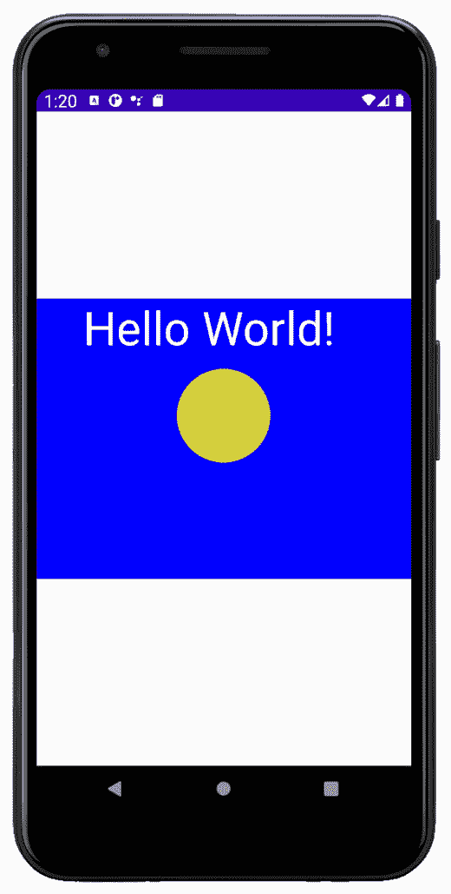
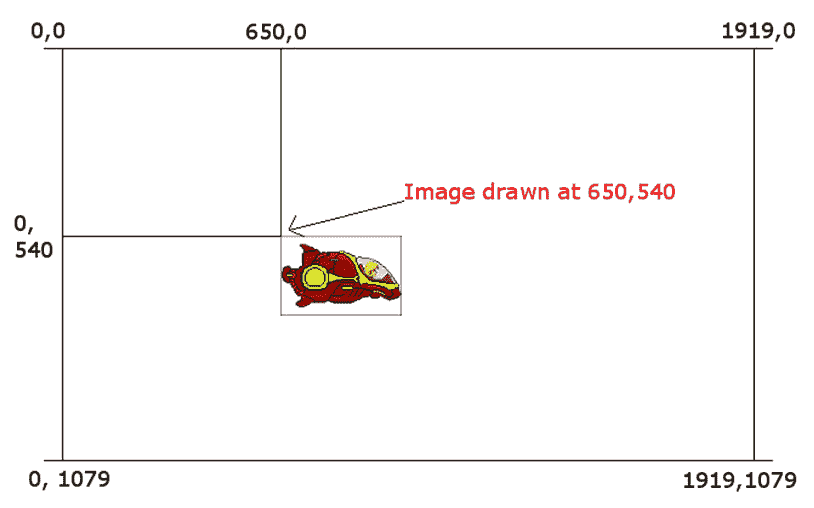
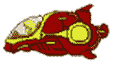
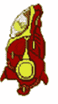
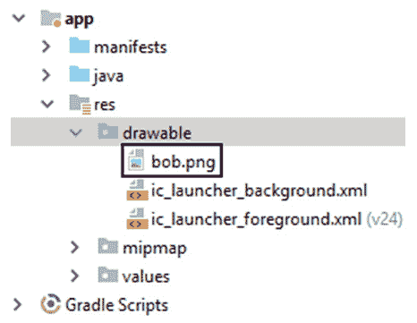
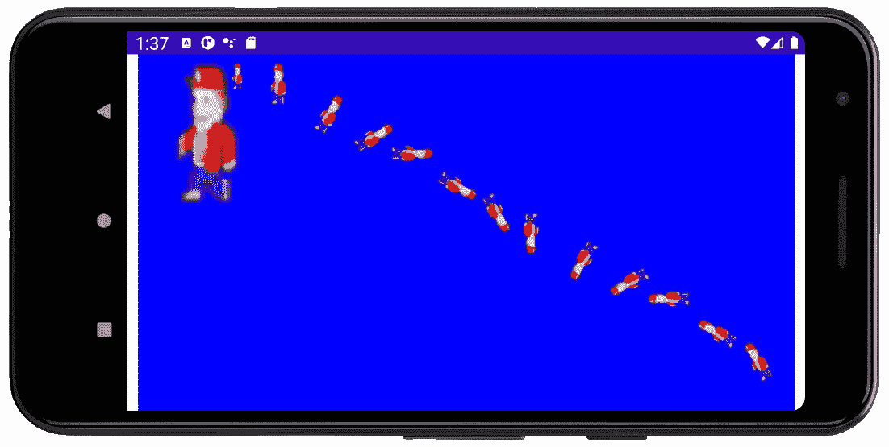

# *第二十章*:绘制图形

这一整章都是关于安卓`Canvas`类和一些相关的类，包括`Paint`、`Color`和`Bitmap`。这些课程结合在一起，在屏幕绘画方面带来了巨大的力量。有时候安卓应用编程接口提供的默认用户界面不是我们需要的。如果我们想制作一个绘图应用程序，绘制图表，或者创建一个游戏，我们需要控制安卓设备提供的每个像素。

在本章中，我们将介绍以下内容:

*   了解`Canvas`及相关课程
*   编写基于`Canvas`的演示应用程序
*   查看安卓坐标系，这样我们就知道在哪里绘图了
*   了解绘制和操作位图
*   编写基于位图的演示应用程序

我们画画吧！

# 技术要求

你可以在[https://GitHub . com/PacktPublishing/Android-初学者编程-第三版/tree/main/章节%2020](https://github.com/PacktPublishing/Android-Programming-for-Beginners-Third-Edition/tree/main/chapter%2020) 找到本章中出现的代码文件。

# 了解画布类

`Canvas`级是`android.graphics`套装的一部分。在接下来的两章中，我们将使用`android.graphics`包中的以下所有`import`语句，以及现在熟悉的`View`包中的另一个语句。它们让我们可以从安卓应用编程接口访问一些强大的绘图方法:

```java
import android.graphics.Bitmap;
import android.graphics.Canvas;
import android.graphics.Color;
import android.graphics.Paint;
import android.widget.ImageView;
```

首先，让我们来谈谈`Bitmap``Canvas`和`ImageView`，正如前面代码中所强调的。

## 开始使用位图、画布和图像视图进行绘制

由于 Android 是设计的来运行所有类型的移动应用，我们不能立即开始输入我们的绘图代码并期望它能工作。我们需要做一些准备(编码)来考虑我们的应用程序运行的具体设备。诚然，有些准备工作可能会有点违反直觉，但我们会一步一步来完成。

### 画布和位图

根据如何使用`Canvas`类，该术语可能会略微误导。虽然`Canvas`类*是*类，您可以将图形绘制到该类，就像绘制画布一样，但您仍然需要一个表面来将画布移置到该类。

在这种情况下(在我们的前两个演示应用程序中)，表面将来自`Bitmap`类。我们可以这样想:我们得到一个`Canvas`对象和一个`Bitmap`对象，然后将`Bitmap`对象设置为`Canvas`对象的一部分进行绘制。

如果你从字面上理解画布这个词，这有点违反直觉，但是一旦它被设置好，我们就可以忘记它，专注于我们想要画的图形。

注意

`Canvas`类提供*能力*进行绘制。它拥有绘制形状、文本、线条和图像文件(包括其他位图)，甚至绘制单个像素的所有方法。

`Bitmap`类由`Canvas`类使用，是绘制的表面。您可以将`Bitmap`实例想象为位于`Canvas`实例的图片框内。

### 颜料

除了到`Canvas`和`Bitmap`班，我们还将使用`Paint`班。这就容易理解多了。`Paint`是用于配置特定属性的类，例如我们将在`Bitmap`上绘制的颜色(在`Canvas`内)。

在我们开始画画之前，还有一个难题要解决。

### 图像视图和活动

`ImageView`类是类将用来向用户显示输出的类。第三层抽象的原因是，正如我们在整本书中看到的那样，`Activity`类需要向`setContentView`方法传递一个`View`来向用户显示一些东西。到目前为止，在整本书中，这是我们在可视化设计器或 XML 代码中创建的布局。

这一次，我们不想要常规的 UI；我们想要绘制线条、像素和形状。

有多种类型的类扩展了`View`类，可以制作许多不同类型的应用，它们都将与`Activity`类兼容，这是所有常规安卓应用(包括绘图应用和游戏)的基础。

因此，一旦绘制完成，有必要将绘制的`Bitmap`类(通过其与`Canvas`的关联)与`ImageView`关联起来。最后一步将告诉`Activity`我们的`ImageView`类通过将内容传递给`setContentView`方法来表示用户要查看的内容。

### 画布、位图、绘画和图像查看快速摘要

如果说的理论我们需要设置的代码结构似乎并不简单，当你看到相对简单的代码后，你会松一口气。

我们目前所知的一个快速总结:

*   每个应用程序都需要一个`Activity`类来与用户和底层操作系统进行交互。因此，如果我们想要成功，就必须遵循所需的层次结构。
*   我们将使用`ImageView`类，它是`View`类的一种类型。`View`类是`Activity`需要向用户显示我们的应用程序。
*   类提供了绘制线条、像素和其他图形的能力。它拥有绘制形状、文本、线条和图像文件，甚至绘制单个像素的所有方法。
*   `Bitmap`类将与`Canvas`类相关联，并且它是实际被绘制的表面。
*   `Canvas`类使用`Paint`类配置颜色等细节。

最后，一旦位图被绘制，我们必须将其与`ImageView`实例相关联，然后通过`setContentView`方法将其设置为`Activity`的视图。

结果将是我们在`Canvas`实例中的`Bitmap`实例上绘制的，通过调用`setContentView`方法通过`ImageView`实例显示给用户。唷！

注意

如果不是 100%清楚也没关系。这并不是说你没有看清楚事情——这根本不是一种明确的关系。反复编写代码和使用技术会使事情变得更加清晰。查看代码，完成本章和下一章中的演示应用程序，然后重新阅读这一部分。

让我们看看如何在代码中建立这种关系。不要担心输入代码；先研究一下。

# 使用画布类

让我们看看代码和获取绘图所需的不同阶段，然后我们可以使用`Canvas`演示应用程序快速进入真实绘图。

## 准备所需类的实例

第一步是声明我们需要的类的实例:

```java
// Here are all the objects(instances)
// of classes that we need to do some drawing
ImageView myImageView;
Bitmap myBlankBitmap;
Canvas myCanvas;
Paint myPaint;
```

前面的代码声明了`ImageView`、`Bitmap`、`Canvas`和`Paint`类型的引用。分别命名为`myImageView`、`myBlankBitmap`、`myCanvas`、`myPaint`。

## 初始化对象

接下来，我们需要在使用新对象之前初始化它们:

```java
// Initialize all the objects ready for drawing
// We will do this inside the onCreate method
int widthInPixels = 800;
int heightInPixels = 800;
myBlankBitmap = Bitmap.createBitmap(widthInPixels,
         heightInPixels,
         Bitmap.Config.ARGB_8888);
myCanvas = new Canvas(myBlankBitmap);
myImageView = new ImageView(this);
myPaint = new Paint();
// Do drawing here
```

请注意前面代码中的这个注释:

```java
// Do drawing here
```

这是我们配置颜色和绘画的地方。另外，请注意在代码的顶部，我们声明并初始化了两个名为`widthInPixels`和`heightInPixels`的`int`变量。当我们编写`Canvas`演示应用程序时，我将更详细地介绍其中一些代码行。

我们现在准备抽签。我们所要做的就是将`ImageView`实例分配给`Activity`。

## 设置活动内容

最后，在看到我们的图之前，我们告诉安卓使用我们的`ImageView`实例`myImageView`作为向用户显示的内容:

```java
// Associate the drawn upon Bitmap with the ImageView
myImageView.setImageBitmap(myBlankBitmap);
// Tell Android to set our drawing
// as the view for this app
// via the ImageView
setContentView(myImageView);
```

到目前为止，我们已经在每个应用程序中看到，`setContentView`方法是`Activity`类的一部分，我们将`myImageView`作为一个参数传入，而不是像我们到目前为止在整本书中所做的那样是一个 XML 布局。就这样。我们现在必须学习的是如何实际利用`Bitmap`实例。

在我们做一些绘图之前，我认为启动一个真正的项目，将我们刚刚讨论过的代码一步一步复制粘贴到正确的位置，然后实际上看到一些绘制到屏幕上的东西会很有用。

让我们画些画。

# 帆布演示应用

我们将创建一个新项目，只是为了探索用`Canvas`绘画的话题。我们将重用我们刚刚学习的内容，这一次，我们还将绘制到`Bitmap`实例。

## 创建新项目

创建一个新的项目，并将其称为`Canvas Demo`。选择**空活动**模板。

此外，我们将使用`Activity`类的普通版本，因此`MainActivity`类将扩展`Activity`而不是我们之前使用的`AppCompatActivity`。这仅仅是因为我们不再需要`AppCompatActivity`类提供的额外功能。

注意

这个应用的完整代码可以在 [*第 20 章*](#_idTextAnchor345) `/Canvas Demo`文件夹的下载包中找到。

### 编写画布演示应用程序

首先，编辑`MainActivity.java`中的代码，包括添加`import` 指令和更改`MainActivity`类继承的`Activity`类的版本。另请注意，在下一个代码中，对`setContentView`方法的调用也被删除了。我们将很快更换它:

```java
import android.app.Activity;
import android.graphics.Bitmap;
import android.graphics.Canvas;
import android.graphics.Color;
import android.graphics.Paint;
import android.os.Bundle;
import android.widget.ImageView;
public class MainActivity extends Activity {
    // Here are all the objects(instances)
    // of classes that we need to do some drawing
    ImageView myImageView;
    Bitmap myBlankBitmap;
    Canvas myCanvas;
    Paint myPaint;
    @Override
    protected void onCreate(Bundle savedInstanceState) {
        super.onCreate(savedInstanceState);
    }
}
```

现在我们已经声明了所需类的实例，我们可以初始化它们了。在调用`super.onCreate…`后，将以下代码添加到`onCreate`方法中，如以下代码所示的:

```java
@Override
protected void onCreate(Bundle savedInstanceState) {
   super.onCreate(savedInstanceState);
   // Initialize all the objects ready for drawing
   // We will do this inside the onCreate method
   int widthInPixels = 800;
   int heightInPixels = 600;
   // Create a new Bitmap
   myBlankBitmap = Bitmap.createBitmap(widthInPixels,
                heightInPixels,
                Bitmap.Config.ARGB_8888);
   // Initialize the Canvas and associate it
   // with the Bitmap to draw on
   myCanvas = new Canvas(myBlankBitmap);
   // Initialize the ImageView and the Paint
   myImageView = new ImageView(this);
   myPaint = new Paint();
}
```

这个代码和我们之前讨论`Canvas`时看到的一样。值得探索的是`Bitmap`类的初始化，因为它并不简单。

#### 探索位图初始化

位图，更典型的是基于图形的应用程序和游戏中的，用于表示对象，如不同的画笔、玩家、背景、游戏对象等。这里我们只是用它来借鉴。在下一个项目中，我们将使用位图来表示我们的绘图主题，而不仅仅是要绘制的表面。

需要说明的方法是`createBitmap`法。从左到右的参数如下:

*   宽度(像素)
*   高度(像素)
*   位图配置

位图可以通过几种不同的方式进行配置。`ARGB_8888`配置意味着每个像素由 4 字节的内存表示。

安卓可以使用的位图格式有几种。这是一个很好的颜色范围完美，将确保我们使用的位图和我们要求的颜色将按照预期绘制。有更高和更低的配置，但`ARGB_8888`是本章的完美选择。

现在我们可以进行实际绘制了。

### 在屏幕上绘图

在`myPaint`初始化后，在`onCreate`方法的右花括号内添加下一个高亮显示的代码:

```java
   myPaint = new Paint();
   // Draw on the Bitmap
   // Wipe the Bitmap with a blue color
   myCanvas.drawColor(Color.argb(255, 0, 0, 255));
   // Re-size the text
   myPaint.setTextSize(100);
   // Change the paint to white
   myPaint.setColor(Color.argb(255, 255, 255, 255));
   // Draw some text
   myCanvas.drawText("Hello World!",100, 100, myPaint);
   // Change the paint to yellow
   myPaint.setColor(Color.argb(255, 212, 207, 62));
   // Draw a circle
   myCanvas.drawCircle(400,250, 100, myPaint);
}
```

之前的代码使用`myCanvas.drawColor`方法给屏幕填充颜色。

`myPaint.setTextSize`方法定义了接下来将要绘制的文本的大小。`myPaint.setColor`方法决定了任何未来的绘图将是什么颜色。`myCanvas.drawText`方法实际上将文本绘制到屏幕上。

分析传递到`drawText`方法中的参数，我们可以看到文本会说“Hello World！”并且将从左边画 100 像素，从我们的位图顶部画 100 像素(`myBitmap`)。

接下来，我们再次使用`setColor`方法来更改将用于绘制的颜色。最后，我们使用`drawCircle`方法画一个从左边 400 像素到顶部 100 像素的圆。该圆的半径为 100 像素。

我保留解释`Color.argb`方法到现在。

#### 解释颜色

不出所料，`Color`类帮助我们操纵并表现颜色。先前使用的`argb`方法返回使用 **alpha(不透明度/透明度)、红色、绿色、蓝色** ( **argb** )模型构建的颜色。该模型对每个元素使用从 0(无颜色)到 255(全颜色)的值。重要的是要注意，尽管反射看起来很明显，混合的颜色是光的强度，与我们混合颜料时的情况大不相同。

注意

要设计 argb 值并进一步探索该模型，请查看这个方便的网站:[https://www.rapidtables.com/web/color/RGB_Color.html](https://www.rapidtables.com/web/color/RGB_Color.html)。该网站帮助您选择 RGB 值；然后，您可以试验阿尔法值。

用于清除绘图表面的值为`255, 0, 0, 255`。这些值表示完全不透明(纯色)、无红色、无绿色和完全蓝色。这就形成了蓝色。

对`argb`方法的下一次调用是在对`setColor`的第一次调用中，在这里我们为文本设置所需的颜色。值`255, 255, 255, 255`表示完全不透明、完全红色、完全绿色和完全蓝色。当你把光和这些值结合起来，你就变成了白色。

对`argb`方法的最后调用是在我们设置颜色画圆时对`setColor`方法的最后调用。`255, 21, 207, 62`呈太阳黄色。

运行代码之前的最后一步是添加对`setContentView`方法的调用，该方法将我们的`ImageView` ( `myImageView`)作为`View`实例，设置为该应用程序的内容。以下是要在`onCreate`方法的右大括号前添加的最后几行代码:

```java
// Associate the drawn upon Bitmap with the ImageView
myImageView.setImageBitmap(myBlankBitmap);
// Tell Android to set our drawing
// as the view for this app
// via the ImageView
setContentView(myImageView);
```

最后，我们通过调用`setContentView`方法告诉`Activity`类使用`myImageView`。

这就是`Canvas`演示运行时的样子。我们可以看到一个 800×800 像素的图形。在下一章中，我们将使用更先进的技术来利用整个屏幕，我们还将学习线程来使图形实时移动:



图 20.1–画布演示

如果我们更好地理解安卓坐标系，将有助于理解我们在`Canvas`类绘制方法中使用的坐标的结果。

# 安卓坐标系

我们可以看到，画一张位图是微不足道的。但是我们用来绘制图形的坐标系需要一个简单的解释。

## 绘图和绘图

当我们在屏幕上绘制一个`Bitmap`物体时，我们在我们想要绘制物体的坐标中传递。给定安卓设备的可用坐标取决于其屏幕的分辨率。

例如，谷歌像素手机在横向视图中的屏幕分辨率为 1920 像素(横向)乘以 1080 像素(向下)。

这些坐标的编号系统从左上角的`0, 0`开始，向下向右直到右下角，这就是像素`1919, 1079`。`1920`和`1919`以及`1080`和`1079`之间明显的 1 像素差异是因为编号从 0 开始。

因此，当我们在屏幕上绘制位图或其他任何东西(如`Canvas`圆和矩形)时，我们必须指定一个`x, y`坐标。

此外，位图(或`Canvas`形状)当然包括许多像素。那么，给定位图的哪个像素绘制在我们将要指定的`x, y`屏幕坐标上呢？

答案是`Bitmap`物体的左上角像素。请看下图，以谷歌 Pixel 手机为例，应该可以明确屏幕坐标。作为解释安卓坐标绘图系统的图形手段，我将使用一个可爱的飞船图形:



图 20.2–屏幕坐标

此外，坐标与您绘制的相关。因此，在我们刚刚编码的`Canvas`演示应用程序中，以及下一个演示中，坐标是相对于位图(`myBitmap`)的。在下一章中，我们将使用整个屏幕，上图将是正在发生的事情的准确表示。

让我们再做一些绘图，这次是用图形文件中的位图。我们将使用与在此应用程序中看到的相同的起始代码。

# 创建位图

让我们先做一点理论上的，然后再深入到代码中，仔细考虑我们将如何在屏幕上生动地呈现图像。要绘制位图，我们将使用`Canvas`类的`drawBitmap`方法。

首先，我们需要向`res/drawable`文件夹中的项目添加位图；我们将在即将到来的`Bitmap`演示应用中真正做到这一点。现在，假设图形文件/位图的名称为`myImage.png`。

接下来，我们声明一个`Bitmap`类型的对象，就像我们在前面的演示中用于背景的`Bitmap`对象一样:

```java
Bitmap mBitmap;
```

接下来，我们需要使用我们之前添加到项目的`drawable`文件夹中的首选图像来初始化`mBitmap`对象:

```java
mBitmap = BitmapFactory.decodeResource
                (getResources(), R.drawable.myImage);
```

`BitmapFactory`方法的静态`decodeResource`方法用于初始化`mBitmap`。它取两个参数。第一个是对`getResources`的调用，由`Activity`类提供。顾名思义，该方法提供对项目资源的访问，第二个参数`R.drawable.myImage`指向`drawable`文件夹中的`myImage.png`文件。位图(`mBitmap`)现在可以由`Canvas`类绘制了。

然后，您可以使用以下代码绘制位图:

```java
// Draw the bitmap at coordinates 100, 100
mCanvas.drawBitmap(mBitmap, 
                100, 100, mPaint);
```

以下是上一节中的宇宙飞船图形绘制到屏幕上时的样子，作为我们讨论旋转位图时的参考:


图 20.3–宇宙飞船图形

# 操作位图

然而，我们经常需要绘制旋转或改变状态的位图。使用 Photoshop 或者任何你喜欢的图像编辑软件来从原始位图创建更多的位图以面向其他方向将会非常容易。然后，当我们开始绘制位图时，我们可以简单地决定以哪种方式面对并绘制适当的预加载位图。

然而，我认为，如果我们只使用一个单一的源图像，并了解安卓为在我们的 Java 代码中操作图像而提供的类，会更有趣、更有启发性。然后，您将能够向应用程序开发人员的工具包中添加旋转和反转图形。

## 位图到底是什么？

位图之所以被称为位图，是因为它就是这样:比特的*图*。虽然有许多位图格式使用不同的范围和值来表示颜色和透明度，但它们都是一样的。它们是值的网格/映射，每个值代表单个像素的颜色。

因此，要旋转、缩放或反转位图，我们必须对位图的图像/网格/贴图的每个像素/位执行适当的数学计算。计算并不十分复杂，但也不是特别简单。如果你把数学带到高中结束，你很可能不用太麻烦就能理解数学。

不幸的是，理解数学是不够的。我们还需要设计高效的代码，理解位图格式，然后为每种格式修改代码。这不是小事。幸运的是，安卓应用编程接口已经为我们做了这一切。迎接`Matrix`班。

## 矩阵类

该类被命名为`Matrix`，因为它使用数学概念和规则对一系列被称为矩阵的值进行计算——矩阵的复数。

注意

安卓`Matrix`类与同名电影系列无关。然而，作者建议所有有抱负的应用程序开发人员都服用红色药丸。

你可能对矩阵很熟悉，但如果你不熟悉也不要担心，因为`Matrix`类隐藏了所有的复杂性。此外，`Matrix`类不仅允许我们对一系列值进行计算，而且它还具有一些预先准备好的计算，使我们能够将一个点围绕另一个点旋转特定的度数。这一切都是在对三角学一无所知的情况下。

注意

如果你对数学是如何工作的很感兴趣，并且想要一个绝对的旋转游戏对象数学入门指南，那么看看我网站上的这一系列安卓教程，最后是一个可飞行和旋转的宇宙飞船:

[http://gamecode school . com/essentials/computing-2d 游戏中的航向-使用三角函数-part-1/](http://gamecodeschool.com/essentials/calculating-heading-in-2d-games-using-trigonometric-functions-part-1/)

[http://gamecode school . com/essentials/rotating-graphics-in-2d-games-use-三角函数-part-2/](http://gamecodeschool.com/essentials/rotating-graphics-in-2d-games-using-trigonometric-functions-part-2/)

[http://gamecode school . com/Android/2d-旋转和航向-演示/](http://gamecodeschool.com/android/2d-rotation-and-heading-demo/)

这本书将坚持使用安卓`Matrix`类，但是我们将在下一章创建粒子系统时进行稍微高级的数学运算。

### 反转位图以面向相反的方向

首先，我们需要创建一个`Matrix`类的实例。下一行代码通过在默认构造函数上调用`new`以一种熟悉的方式实现了这一点:

```java
Matrix matrix = new Matrix();
```

注意

请注意，您现在不需要将这些代码添加到项目中；很快，我们将再次展示更多的内容。我只是觉得提前看到所有`Matrix`相关的代码会更容易。

现在我们可以使用`Matrix`类的许多简洁方法之一。`preScale`方法取两个参数:一个用于水平变化，一个用于垂直变化。看看这一行代码:

```java
matrix.preScale(-1, 1);
```

`preScale`方法将循环遍历每个像素位置，将所有水平坐标乘以`-1`，将所有垂直坐标乘以`1`。

这些计算的结果是，所有的垂直坐标将保持不变，因为如果你乘以 1，那么数字不会改变。但是当乘以-1 时，像素的水平位置会反转。举以下例子:

水平位置 0、1、2、3 和 4 将变成 0、-1、-2、-3 和-4。

在这个阶段，我们已经创建了一个矩阵，可以对位图执行必要的计算。我们实际上还没有对位图做任何事情。为了使用矩阵，我们调用`Bitmap`类的`createBitmap`方法，如下所示的代码行:

```java
mBitmapLeft = Bitmap
.createBitmap(mBitmap,
          0, 0, 25, 25, matrix, true);
```

前面的代码假设`mBitmapLeft`和`mBitmap`已经初始化。`createBitmap`方法的参数解释如下:

*   `mBitmapHeadRight`是一个已经被创建和缩放的`Bitmap`物体，里面装载了一个宇宙飞船的图像(面朝右)。这是将用作创建新位图的源的图像。源位图实际上根本不会改变。
*   `0, 0`是我们希望新位图映射到的水平和垂直起始位置。
*   `25, 25`参数是设置位图缩放大小的值。
*   下一个参数是我们预先准备好的`Matrix`实例，`matrix`。
*   最后一个参数`true`指示`createBitmap`方法需要过滤来正确处理位图的创建。

这就是`mBitmapLeft`被吸引到屏幕上时的样子:



图 20.4-mbitmapleft

我们也可以使用旋转矩阵创建朝上或朝下的位图。

### 将位图向上或向下旋转

先看旋转一个位图，然后就可以搭建演示应用了。我们已经有了一个`Matrix`类的实例，所以我们所要做的就是调用`preRotate`方法来创建一个矩阵，该矩阵能够在给`preRotate`的单个参数中将每个像素旋转指定的度数。看看这一行代码:

```java
// A matrix for rotating
matrix.preRotate(-90);

```

这有多简单？`matrix`实例现在可以逆时针(`-`)旋转`90`度，旋转我们传递给它的任何一系列数字。

下一行代码的参数与我们之前剖析的对`createBitmap`的调用完全相同，只是新的`Bitmap`实例被分配给了`mBitmapUp`，`matrix`的效果是执行旋转而不是`preScale`:

```java
mBitmapUp = Bitmap
.createBitmap(mBitmap,
         0, 0, ss, ss, matrix, true);
```

这是绘制时`mBitmapUp`的样子:



图 20.5-mbit pup

您也可以使用相同的技术，但在参数`preRotate`中使用不同的值来向下旋转位图。让我们继续使用演示应用程序，看看所有这些东西是如何运作的。

# 位图操作演示应用

现在我们已经学习了理论，让我们绘制并旋转一些位图。使用**空活动**模板创建一个新项目，并将其称为`Manipulating Bitmaps`。

## 将图形添加到项目中

右键单击，选择**复制**，从 [*第 20 章*](#_idTextAnchor345) `/Manipulating Bitmaps/drawable`文件夹的下载包中复制`bob.png`图形文件。

在安卓工作室中，在项目浏览器窗口中找到`app/res/drawable`文件夹。下一张截图清楚地显示了该文件夹的位置以及其中的`bob.png`图像:



图 20.6–带 bob.png 的 app/RES/可绘制文件夹

右键单击**可绘制的**文件夹，选择**粘贴**将`bob.png`文件添加到项目中。单击**确定**两次，确认将文件导入项目的默认选项。

编辑`MainActivity`类的代码，包括所有必需的`import`指令、`Activity`类的基本版本以及成员变量的选择，这样我们就可以开始了。`MainActivity`级在此阶段的状态如下所示:

```java
import android.app.Activity;
import android.graphics.Bitmap;
import android.graphics.Canvas;
import android.graphics.Paint;
import android.os.Bundle;
import android.widget.ImageView;
import android.graphics.BitmapFactory;
import android.graphics.Color;
import android.graphics.Matrix;
public class MainActivity extends Activity {
    // Here are all the objects(instances)
    // of classes that we need to do some drawing
    ImageView myImageView;
    Bitmap myBlankBitmap;
    Bitmap bobBitmap;
    Canvas myCanvas;
    Paint myPaint;
    @Override
    protected void onCreate(Bundle savedInstanceState) {
        super.onCreate(savedInstanceState);

    }
}
```

现在我们可以初始化`onCreate`中的所有成员:

```java
// Initialize all the objects ready for drawing
int widthInPixels = 2000;
int heightInPixels = 1000;
// Create a new Bitmap
myBlankBitmap = Bitmap.createBitmap(widthInPixels,
         heightInPixels,
         Bitmap.Config.ARGB_8888);
// Initialize Bob
bobBitmap = BitmapFactory.decodeResource
         (getResources(), R.drawable.bob);
// Initialize the Canvas and associate it
// with the Bitmap to draw on
myCanvas = new Canvas(myBlankBitmap);
// Initialize the ImageView and the Paint
myImageView = new ImageView(this);
myPaint = new Paint();
// Draw on the Bitmap
// Wipe the Bitmap with a blue color
myCanvas.drawColor(Color.argb(255, 0, 0, 255));
```

接下来，我们添加对我们即将编写的三个方法的调用，并将我们的新绘图设置为应用程序的视图:

```java
// Draw some bitmaps
drawRotatedBitmaps();
drawEnlargedBitmap();
drawShrunkenBitmap();
// Associate the drawn upon Bitmap with the ImageView
myImageView.setImageBitmap(myBlankBitmap);
// Tell Android to set our drawing
// as the view for this app
// via the ImageView
setContentView(myImageView);
```

现在添加进行位图操作的`drawRotatedBitmap`方法:

```java
void drawRotatedBitmaps(){
   float rotation = 0f;
   int horizontalPosition =350;
   int verticalPosition = 25;
   Matrix matrix = new Matrix();
   Bitmap rotatedBitmap = Bitmap.createBitmap(100,
                200,
                Bitmap.Config.ARGB_8888);
   for(rotation = 0; rotation < 360; rotation += 30){
         matrix.reset();
         matrix.preRotate(rotation);
         rotatedBitmap = Bitmap
                      .createBitmap(bobBitmap,
                                  0, 0, bobBitmap
                                  .getWidth()-1, 
                                  bobBitmap.getHeight()-1, 
                                  matrix, true);
         myCanvas.drawBitmap(rotatedBitmap, 
                      horizontalPosition, 
                      verticalPosition,  
                      myPaint);

         horizontalPosition += 120;
         verticalPosition += 70;
   }
}
```

前面的代码使用`for`循环一次循环 360 度 30 度。每次通过循环的值在`Matrix`实例中用于旋转鲍勃的图像，然后使用`drawBitmap`方法将他绘制到屏幕上。

添加最后两种方法，如下图:

```java
void drawEnlargedBitmap(){
   bobBitmap = Bitmap
                .createScaledBitmap(bobBitmap,
                            300, 400, false);
   myCanvas.drawBitmap(bobBitmap, 25,25, myPaint);
}
void drawShrunkenBitmap(){
   bobBitmap = Bitmap
                .createScaledBitmap(bobBitmap,
                            50, 75, false);
   myCanvas.drawBitmap(bobBitmap, 250,25, myPaint);
}
```

`drawEnlargedBitmap`法采用`createScaledBitmap`法，300 乘 400 像素。`drawBitmap`方法然后将其绘制到屏幕上。

`drawShrunkenBitmap`使用完全相同的技术，除了缩放然后绘制 50×75 像素的图像。

运行该应用程序，查看鲍勃的成长，然后缩小，然后以 30 度的间隔旋转 360 度，如下面的截图所示:



图 20.7–应用程序如何运行

我们的绘画曲目中唯一缺少的东西是能够在活动发生时观看所有这些活动。我们将在下一章中弥补我们知识上的这个差距。

# 常见问题

1.  I know how to do all this drawing but I can't see anything move. Why?

    要看到事物移动，您需要能够控制绘图的每个部分何时发生。你需要使用动画技术。这不是微不足道的，但也不是一个坚定的初学者所不能理解的。我们将在下一章研究所需的主题。

    # 总结

    在本章中，我们看到了如何绘制自定义形状、文本和位图。既然我们知道了如何绘制和操作基本形状、文本和位图，我们就可以更进一步了。

    在下一章，我们将开始我们的下一个主要应用程序，这是一个孩子的绘画应用程序，实际上一按按钮就变得生动起来。