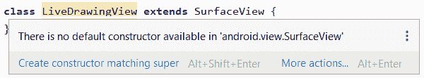
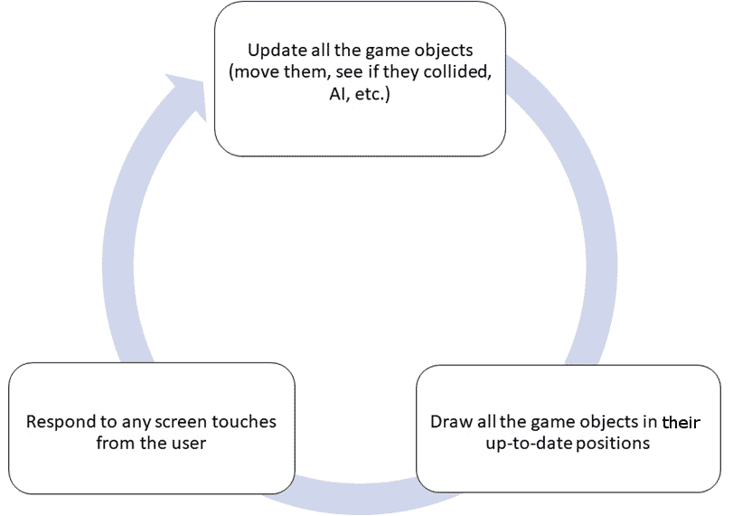
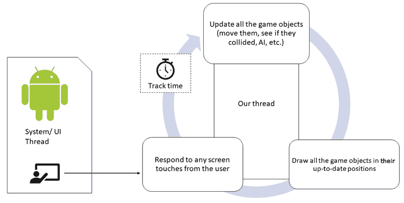
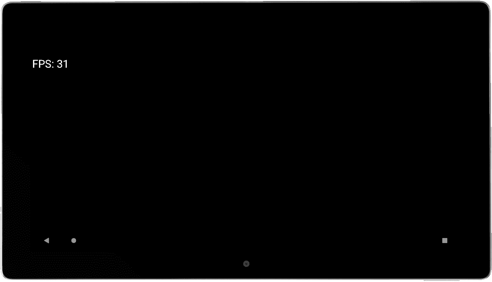

# *第 21 章*:线程和启动实时绘图应用

在这一章，我们将开始我们的下一个应用。这款应用将是一款儿童绘画应用，用户可以用手指在屏幕上绘画。然而，这个绘图应用会略有不同。用户绘制的线将包括爆炸成数千块的粒子系统。我们将该项目称为实时绘图。

为此，我们将采取以下措施:

*   开始使用实时绘图应用
*   了解实时交互，有时称为游戏循环
*   了解线程
*   编写实时系统代码，以便在下一章中使用

我们开始吧。

# 技术要求

你可以在[https://GitHub . com/PacktPublishing/Android-初学者编程-第三版/tree/main/章节%2021](https://github.com/PacktPublishing/Android-Programming-for-Beginners-Third-Edition/tree/main/chapter%2021) 找到本章中出现的代码文件。

# 创建实时绘图项目

首先，在 Android Studio 中创建新的项目，并将其称为`Live Drawing`。使用**空活动**项目。

现在我们将考虑文件的名称和屏幕房地产。在这个项目中，我们将学到一些新的东西。为我们的活动类使用默认名称并不总是合适的。在这个项目中，活动类不会是最重要的类，`MainActivity`似乎不是一个合适的名称。让我们给它重新命名。

## 将主活动重构为活动绘制活动

对我们代码的所有不同部分使用有意义的名称是一个很好的做法。对于这个项目，我觉得`MainActivity`有点模糊，没有定论。我们可以将就一下，但是让我们把它改名为更有意义的东西。这也会让我们看到如何使用AndroidStudio的**重构**工具。我们使用术语重构而不仅仅是重命名的原因是，当我们更改代码中使用的名称时，通常不仅仅是在幕后进行简单的名称更改。比如，一会儿，当我们把`MainActivity`文件名重构为`LiveDrawingActivity`时，AndroidStudio会改变文件名以及`AndroidManifest.xml`文件和`MainActivity.java`(即将成为`LiveDrawingActivity.java`)文件中的一些代码。

在项目面板中，右键单击`MainActivity`文件，选择**重构** | **重命名**。在弹出窗口中，将**主活动**更改为**活绘图活动**。将所有其他选项保留为默认值，然后左键单击**重构**按钮。

请注意，项目面板中的文件名已按预期更改，但是`AndroidManifest.xml`文件中的多次出现的`MainActivity`已更改为`LiveDrawingActivity`以及`LiveDrawingActivity.java`文件中的一个实例。如果您感兴趣，您可以现在扫描这些文件来查看，但是我们将在接下来的章节中详细介绍这两个文件。

注意

重构是一个重要的工具，理解幕后发生的更多事情对于避免混乱至关重要。

## 将游戏锁定为全屏和横向

我们希望使用用户的安卓设备必须提供的每一个像素，所以我们将对`AndroidManifest.xml`文件进行更改，这允许我们为我们的应用使用一种样式，对用户界面隐藏所有默认菜单。

从`manifests`文件夹打开`AndroidManifest.xml`文件。在`AndroidManifest.xml`文件中，找到以下代码行:`android:name=".LiveDrawingActivity">.`

将光标放在前面显示的关闭`>`之前。点击*输入*键几次，将`>`移动到前面显示的线的其余部分下方几行。

紧接在`".LiveDrawingActivity"`下方，但在新定位的`>`之前，键入或复制并粘贴下一行代码，使游戏在没有默认用户界面的情况下运行。

请注意，代码行显示为两行，因为它太长，无法放入打印页面，但是在AndroidStudio中，您应该将其输入为一行:

```java
android:theme=
"@android:style/Theme.Holo.Light.NoActionBar.Fullscreen"
```

这是一组复杂的步骤，所以在这里，我向您展示了这个文件的更大范围，其中突出显示了我们刚刚添加的代码，以获得额外的上下文。如前所述，我不得不展示两行代码:

```java
…
<activity android:name=".LiveDrawingActivity"
     android:theme=
     "@android:style/
     Theme.Holo.Light.NoActionBar.Fullscreen"
     >
     <intent-filter>
          <action android:name="android.intent.action.MAIN"
          />
<category android:name= "android.intent.category.LAUNCHER" />
     </intent-filter>
</activity>
…
```

现在，我们的应用将使用设备提供的所有屏幕空间，而无需任何额外的菜单。我们还将看到一些新的 Java 代码，使我们的应用主导屏幕的每个像素。

### 制作一些占位符类

该应用仅由 Java 文件组成。在下载包的 [*第 21 章*](#_idTextAnchor366) 文件夹中可以找到到本章末尾为止的所有代码的 Java 文件。

接下来，我们将创建空类，我们将在接下来的两章中对整个项目进行编码。创建一个名为`LiveDrawingView`的新类、一个名为`ParticleSystem`的新类和一个名为`Particle`的新类。

让我们向前看一点。

## 展望实时绘图应用

由于这个 app 比较深入，需要实时响应，所以需要使用稍微深入一点的结构。起初，这看起来很复杂，但从长远来看，它甚至可以使我们的代码更简单、更容易理解。

在“实时绘图”应用中，我们将有四节课:

*   `LiveDrawingActivity`:安卓 API 提供的`Activity`类是与操作系统交互的类。我们已经看到了当用户点击应用图标启动应用时，操作系统是如何与`onCreate`交互的。我们将有一个基于 Activity 的类来处理应用的启动和关闭，并通过获取屏幕分辨率来帮助初始化，而不是有一个名为`MainActivity`的类来做所有的事情。这个班将是`Activity`类型，这是有道理的。然而，正如您将很快看到的，我们将把与触摸的交互委托给另一个类，这个类也将处理应用的几乎每个方面。这将向我们介绍一些对我们来说是新的有趣的概念。
*   `LiveDrawingView`:这是将负责绘图和创建实时环境的类，它允许用户在他们的创作移动和进化的同时进行交互。
*   `ParticleSystem`:这个类将管理多达数千个`Particle`类的实例。
*   `Particle`:这个班将会是最简单的一个班。它将在屏幕上有一个位置和一个标题。当`LiveDrawingView`类提示时，它将每秒更新大约 60 次。

现在我们可以开始编码了。

## 对 LiveDrawingActivity 类进行编码

让我们从开始编写基于`Activity`的类。当我们重构`MainActivity`时，我们称这个类为`LiveDrawingActivity`。

将`LiveDrawingActivity`类的内容(不包括包声明)替换为以下代码:

```java
import android.app.Activity;
import android.graphics.Point;
import android.os.Bundle;
import android.view.Display;
import android.view.Window;
public class LiveDrawingActivity extends Activity {
    private LiveDrawingView mLiveDrawingView;
    @Override
    protected void onCreate(Bundle savedInstanceState) {
        super.onCreate(savedInstanceState);
        requestWindowFeature(Window.FEATURE_NO_TITLE);
        Display display = getWindowManager()
        .getDefaultDisplay();
        Point size = new Point();
        display.getSize(size);
        mLiveDrawingView = new LiveDrawingView(
        this, size.x, size.y);
        setContentView(mLiveDrawingView);
    }
}
```

代码显示了一些错误，我们将很快讨论它们。

第一行新代码如下:

```java
requestWindowFeature(Window.FEATURE_NO_TITLE);
```

这一行代码从用户界面中删除了标题。当我们运行这个应用时，屏幕将完全空白。

代码通过以下方式获取设备的像素数(宽和高)。再看下一行新代码:

```java
Display display = getWindowManager().getDefaultDisplay();
```

我们创建一个名为`display`的类型为`Display`的对象，并通过依次调用两个`getWindowManager`和`getDefaultDisplay`方法来初始化它，这两个方法是`Activity`类的一部分。

然后我们创建一个名为`Point`类型的`size`的新对象。我们将`size`作为`display.getSize`方法的论据。`Point`类型有一个`x`和`y`成员变量，因此`size`对象也是如此，它在第三行代码之后保存了显示屏的宽度和高度(以像素为单位)。

现在我们有了隐藏在`size`对象中的`x`和`y`变量中的屏幕分辨率。

下一个新的事情是，我们正在声明我们的`LiveDrawingView`类的一个实例。目前，这是一个空类:

```java
private LiveDrawingView mLiveDrawingView;
```

接下来在`onCreate`方法中，我们这样初始化`mLiveDrawingView`:

```java
mLiveDrawingView = new LiveDrawingView(this, size.x, size.y);
```

我们正在做的是将三个参数传递给`LiveDrawingView`构造函数。我们显然还没有编写构造函数，正如我们所知，默认构造函数接受零个参数。因此，这一行将导致错误，直到我们修复它。

传入的论点很有趣。首先是`this`，是对`LiveDrawingActivity`类的引用。`LiveDrawingView`类将需要使用它需要这个参考的方法。

第二个和第三个参数是水平和垂直屏幕分辨率。有意义的是，我们的应用将需要这些来执行任务，例如检测屏幕边缘和将绘图对象缩放到适当的大小。当我们开始编码`LiveDrawingView`构造函数时，我们将进一步讨论这些参数。

接下来，看看下面的行:

```java
setContentView(mLiveDrawingView);
```

在画布演示应用中，我们将`ImageView`设置为应用的内容。记住的`Activity`类的`setContentView`方法必须带一个`View`对象，`ImageView`是一个`View`。前一行代码似乎暗示我们将使用`LiveDrawingView`类作为应用的可见内容。但是`LiveDrawingView`虽然有名字，却不是`View`。反正还没有。

在我们向`LiveDrawingActivity`添加几行代码后，我们将修复构造函数和非`View`问题。

读者挑战

你能猜到解决方案可能是哪个面向对象的概念吗？

添加这两个被覆盖的方法，然后我们将讨论它们。将它们添加到`onCreate`方法的右花括号下面，但在`LiveDrawingActivity`类的右花括号之前:

```java
@Override
protected void onResume() {
   super.onResume();
   // More code here later in the chapter
}
@Override
protected void onPause() {
   super.onPause();
   // More code here later in the chapter
}
```

我们所做的是覆盖`Activity`类的另外两个方法。我们将看到为什么我们需要这样做，以及我们将在这些方法中做什么。这里需要注意的是，通过添加这些被覆盖的方法，我们给了操作系统机会在另外两种情况下通知我们用户的意图。就像我们在“自我笔记”应用中保存和加载数据时所做的那样。

在这一点上，转到`LiveDrawingView`类是有意义的，这是这个应用的主要类。我们将在本章接近结束时回到`LiveDrawingActivity`课。

## 对 LiveDrawingView 类进行编码

我们要做的第一件事是解决我们的`LiveDrawingView`类不是`View`类的问题。更新突出显示的类声明，如下所示:

```java
class LiveDrawingView extends SurfaceView {
```

注意

您需要导入`android.view.SurfaceView`类。

`SurfaceView`是`View`的后代，现在`LiveDrawingView`通过继承也是`View`的一个类型。再来看看已经添加的`import`声明。如下所述，这种关系很明显:

```java
import android.view.SurfaceView
```

注意

请记住，正是因为多态性，我们可以将`View`的后代发送到`LiveDrawingActivity`类中的`setContentView`方法，正是因为继承，`LiveDrawingView`类现在是`SurfaceView`的一种类型。

我们可以扩展`View`的很多后代来解决这个最初的问题，但是随着我们的继续，我们会看到`SurfaceView`类有一些非常具体的特性，非常适合实时交互应用，这使得这个选择对我们来说是正确的。

我们这个班和`LiveDrawingActivity`班还是有错误的。这两种情况都是由于缺乏合适的构造方法。

这是一个截图，显示了自从我们扩展`SurfaceView`以来`LiveDrawingView`类中的错误:



图 21.1–实时绘图视图类中的错误

`LiveDrawingActivity`中的误差更明显；我们正在调用一个不存在的方法。但是，上一张截图中显示的错误不太容易理解。现在我们来讨论一下`LiveDrawingView`类声明中的错误。

`LiveDrawingView`类，现在是一个`SurfaceView`，必须提供一个构造函数，因为正如在 OOP 章节中提到的，一旦你提供了自己的构造函数，默认的(没有参数的)构造函数就不复存在了。由于`SurfaceView`类实现了几个不同的构造函数，我们必须专门实现其中的一个或者编写我们自己的。因此出现了之前的错误。

由于`SurfaceView`提供的构造函数都不是我们所需要的，所以我们将提供我们自己的。

注意

如果你想知道你究竟如何知道提供了什么构造函数，以及你需要找到的关于安卓类的任何其他细节，只需谷歌一下。键入类名，后跟`API`。谷歌几乎总是会提供安卓开发者网站相关页面的链接作为首要结果。这里有`SurfaceView`页面的直接链接:[https://developer . Android . com/reference/Android/view/surface view . html](https://developer.android.com/reference/android/view/SurfaceView.html)。在**公共构造函数**标题下，你会看到一些构造函数是可选的。

`LiveDrawingActivity`还要求我们创建一个构造函数，该构造函数与我们试图在`LiveDrawingActivity`类的这行代码中初始化它的方式相匹配:

```java
mLiveDrawingView = new LiveDrawingView(this, size.x, size.y);
```

让我们添加一个构造函数来匹配从`LiveDrawingActivity`传入的调用和屏幕分辨率，并同时解决这两个问题。

## 对 LiveDrawingView 类进行编码

记住`LiveDrawingView`类看不到`LiveDrawingActivity`类中的变量。通过使用构造函数，`LiveDrawingActivity`正在为`LiveDrawingView`提供对自身(`this`)的引用，以及包含在`size.x`和`size.y`中的屏幕尺寸(以像素为单位)。将此构造函数添加到`LiveDrawingView.java`文件中。代码必须在类的左大括号和右大括号内。这是一个约定，但不要求将构造函数放在其他方法之上，而是放在成员变量声明之后:

```java
// The LiveDrawingView constructor
// Called when this line:
// mLiveDrawingView = new LiveDrawingView(this, size.x, size.y);
// is executed from LiveDrawingActivity
public LiveDrawingView(Context context, int x, int y) {
        // Super... calls the parent class
        // constructor of SurfaceView
        // provided by the Android API
        super(context);
}
```

注意

用这行代码导入`Context`类:

`import android.content.Context;`

现在我们的`LiveDrawingView`类或者初始化它的`LiveDrawingActivity`类中没有错误。

在这个阶段，我们可以运行应用，看到使用`LiveDrawingView`作为`setContentView`中的`View`已经成功，我们有一个漂亮的空白屏幕，准备绘制我们的粒子系统。如果你愿意，可以尝试这样做，但是我们将对`LiveDrawingView`类进行编码，这样它就可以做一些事情，包括向构造函数添加代码。

在这个项目的过程中，我们会不断地回到这个班。我们现在要做的是，在下一章对`ParticleSystem`实例进行编码之后，准备好添加它们的基础设置。

为了实现这一点，首先我们将添加一堆成员变量，然后我们将在构造函数内部添加一些代码，以便在类被`LiveDrawingActivity`实例化/创建时设置它。

接下来，我们对`draw`方法进行编码，这将揭示我们需要采取的每秒在屏幕上绘制 60 次的新步骤，我们还将看到一些熟悉的代码，这些代码使用了上一章中我们的老朋友`Canvas`、`Paint`和`drawText`。

在这一点上，我们需要讨论一些更多的理论——比如我们将如何对粒子的动画计时，以及我们如何在不干扰安卓平稳运行的情况下锁定这些计时。最后两个主题**游戏循环**和**线程**将允许我们添加章节的最终代码，并在行动中见证我们的粒子系统绘画应用——尽管只有一点文本。

注意

游戏循环是一个概念，它描述了允许虚拟系统在更新和绘制自己的同时允许它们被用户更改/交互。

### 添加成员变量

将变量添加为如下所示的，在`LiveDrawingView`声明之后但在构造函数之前，然后导入必要的额外类:

```java
// Are we debugging?
private final boolean DEBUGGING = true;
// These objects are needed to do the drawing
private SurfaceHolder mOurHolder;
private Canvas mCanvas;
private Paint mPaint;
// How many frames per second did we get?
private long mFPS;
// The number of milliseconds in a second
private final int MILLIS_IN_SECOND = 1000;
// Holds the resolution of the screen
private int mScreenX;
private int mScreenY;
// How big will the text be?
private int mFontSize;
private int mFontMargin;
// The particle systems will be declared here later
// These will be used to make simple buttons
```

添加以下`import`代码:

```java
import android.graphics.Canvas;
import android.graphics.Paint;
import android.view.SurfaceHolder;
```

一定要研究代码，然后我们才能谈论它。

我们使用的是在成员变量名前添加`m`的命名约定。当我们在方法中添加局部变量时，这将有助于区分它们。

另外，注意所有的变量都被声明为`private`。你可以删除所有的`private`访问说明符，代码仍然可以工作，但是因为我们不需要从这个类之外访问这些变量，所以通过声明它们`private`来保证它永远不会发生是明智的。

第一个成员变量是`DEBUGGING`。我们将此声明为`final`，因为我们不想在应用执行期间更改其值。请注意，声明它`final`并不妨碍我们在调试和不调试之间切换时手动切换它的值。

我们声明实例的接下来三个类将处理屏幕上的绘图。请注意我之前强调过的我们从未见过的新问题:

```java
// These objects are needed to do the drawing
private SurfaceHolder mOurHolder;
private Canvas mCanvas;
private Paint mPaint;
```

需要`SurfaceHolder`类才能进行绘图。字面意思是*握着*的物体是图纸表面。当我们一分钟后对`draw`方法进行编码时，我们将看到它允许我们在屏幕上绘制的方法。

接下来的两个变量让我们对实现流畅一致的动画需要什么有了一些了解。他们又来了:

```java
// How many frames per second did we get?
private long mFPS;
// The number of milliseconds in a second
private final int MILLIS_IN_SECOND = 1000;
```

`mFPS`变量是`long`类型的，因为它将持有一个巨大的数字。自 1970 年以来，计算机以毫秒为单位测量时间——当我们谈论游戏循环时，会有更多的时间。但是现在，我们需要知道，监控和测量动画每一帧的速度是我们如何确保粒子准确地按照它们应该的方式移动。

第一个`mFPS`将在动画的每一帧被重新初始化，大约每秒 60 次。它将被传递到每个粒子系统(动画的每一帧)，这样它就知道已经过去了多少时间。

`MILLIS_IN_SECOND`变量初始化为`1000`。一秒钟确实有`1000`毫秒。我们将在计算中使用这个变量，因为它将使我们的代码比使用文字值`1000`时更清晰。之所以宣称`final`是因为一秒的毫秒数显然永远不会改变。

为了方便起见，这里再次显示了我们刚刚添加的下一段代码:

```java
// Holds the resolution of the screen
private int mScreenX;
private int mScreenY;
// How big will the text be?
private int mFontSize;
private int mFontMargin;
```

变量`mScreenX`和`mScreenY`将保持屏幕的水平和垂直分辨率。请记住，它们是从`LiveDrawingActivity`传入构造函数的。

接下来的两个，即`mFontSize`和`mMarginSize`，将基于屏幕大小(以像素为单位)进行初始化，以保存一个像素值，从而使我们的文本格式简洁明了，而不是不断地对每一位文本进行计算。

现在我们可以开始初始化构造函数中的一些变量。

### 编写 LiveDrawingView 构造函数

将高亮显示的代码添加到构造函数中。一定要研究代码，然后我们可以讨论它:

```java
public LiveDrawingView(Context context, int x, int y) {
   // Super... calls the parent class
   // constructor of SurfaceView
   // provided by Android
   super(context);
   // Initialize these two members/fields
   // With the values passed in as parameters
   mScreenX = x;
   mScreenY = y;
   // Font is 5% (1/20th) of screen width
   mFontSize = mScreenX / 20;
   // Margin is 1.3% (1/75th) of screen width
   mFontMargin = mScreenX / 75;
   // getHolder is a method of SurfaceView
    mOurHolder = getHolder();
   mPaint = new Paint();
   // Initialize the two buttons
   // Initialize the particles and their systems
}
```

我们刚刚添加到的代码构造器开始使用作为参数(`x`和`y`)传入的值来初始化`mScreenX`和`mScreenY`。我们整个`LiveDrawingView`班现在可以随时使用屏幕分辨率。这又是两行字:

```java
// Initialize these two members/fields
   // With the values passed in as parameters
   mScreenX = x;
   mScreenY = y;
```

接下来，我们将`mFontSize`和`mFontMargin`初始化为屏幕宽度的一小部分(以像素为单位)。这些值有点随意，但它们是有效的，我们将使用这些变量的各种倍数在屏幕上整齐地对齐文本。下面是我提到的两行代码:

```java
   // Font is 5% (1/20th) of screen width
   mFontSize = mScreenX / 20;
   // Margin is 1.3% (1/75th) of screen width
   mFontMargin = mScreenX / 75;
```

接下来，我们初始化我们的`Paint`和`SurfaceHolder`对象。`Paint`使用默认构造函数，就像我们之前做的那样，但是`mHolder`使用`getHolder`方法，这是`SurfaceView`类的一个方法。`getHolder`方法返回一个初始化为`mHolder`的引用，所以`mHolder`现在就是那个引用。简而言之，`mHolder`现在可以使用了。我们可以使用这个方便的方法，因为`LiveDrawingView`是一个`SurfaceView` :

```java
   // getHolder is a method of SurfaceView
   mOurHolder = getHolder();
   mPaint = new Paint();
```

我们需要在`draw`方法中做更多的准备，然后才能像以前一样使用我们的`Paint`和`Canvas`课程。我们很快就会看到确切的结果。请注意指示的注释，我们将最终开始初始化粒子系统以及两个控制按钮。

让我们准备画画。

### 绘制方法的编码

在构造函数方法之后添加下一步显示的`draw`方法。代码中会有几个错误。我们将处理它们，然后我们将详细讨论`draw`方法将如何与`SurfaceView`类相关联地工作，因为其中有一些看起来完全陌生的代码行以及一些熟悉的代码行。这是要添加的代码:

```java
// Draw the particle systems and the HUD
private void draw() {
if (mOurHolder.getSurface().isValid()) {
// Lock the canvas (graphics memory) ready to draw
         mCanvas = mOurHolder.lockCanvas();
         // Fill the screen with a solid color
         mCanvas.drawColor(Color.argb(255, 0, 0, 0));
         // Choose a color to paint with
         mPaint.setColor(Color.argb(255, 255, 255, 255));
         // Choose the font size
         mPaint.setTextSize(mFontSize);
         // Draw the particle systems
         // Draw the buttons
         // Draw the HUD
         if(DEBUGGING){
                printDebuggingText();
         }
          // Display the drawing on screen
         // unlockCanvasAndPost is a method of
         SurfaceHolder
         mOurHolder.unlockCanvasAndPost(mCanvas);
    }
}
```

我们有两个错误。一是`Color`类需要导入。您可以用通常的方法修复这个问题，或者手动添加下一行代码。无论您选择哪种方法，都需要在文件顶部的代码中添加以下额外的一行:

```java
import android.graphics.Color;
```

让我们来处理另一个错误。

#### 添加打印调试文本方法

第二个错误是调用`printDebuggingText`。方法还不存在。现在让我们补充一下。

在`draw`方法后添加代码:

```java
private void printDebuggingText(){
   int debugSize = mFontSize / 2;
   int debugStart = 150;
   mPaint.setTextSize(debugSize);
   mCanvas.drawText("FPS: " + mFPS ,
         10, debugStart + debugSize, mPaint);
   // We will add more code here in the next chapter
}
```

前面的代码使用局部变量`debugSize`来保存成员变量`mFontSize`一半的值。这意味着当`mFontSize`(用于平视显示器)基于屏幕分辨率动态初始化时，`debugSize`将始终是它的一半。在我们开始绘制文本之前，`debugSize`变量被用来设置字体的大小。`debugStart`变量只是在垂直方向一个好的位置开始打印调试文本的猜测。

然后，这两个值用于在屏幕上定位一行文本，该行文本每秒显示当前帧。由于这个方法是从`draw`开始调用的，而`draw`又会从游戏循环中调用，所以这一行文本会每秒钟被不断刷新高达 60 次。

注意

在非常高或非常低分辨率的屏幕上，您可能需要试验文本大小，以找到更适合您屏幕的内容。

让我们探索一下`draw`方法中的那些新的代码行，以及我们如何使用`SurfaceView`来处理我们所有的绘图需求，我们的`LiveDrawingView`类就是从这里派生出来的。

### 了解绘制方法和 SurfaceView 类

从方法的中间开始，向外改变，我们有一些熟悉的东西，比如对`drawColor`、`setTextSize`和`drawText`方法的调用。我们还可以看到评论，指出我们最终将在哪里添加代码来绘制粒子系统和平视显示器:

*   `drawColor`代码用纯色清除屏幕。
*   `setTextSize`方法设置用于绘制抬头显示器的文本大小。
*   一旦我们对粒子系统有了更多的探索，我们将编码绘制平视显示器。我们会让玩家知道他们画的是多少粒子和系统。

然而，全新的是`draw`方法最开始的代码。又来了:

```java
if (mOurHolder.getSurface().isValid()) {
// Lock the canvas (graphics memory) ready to draw
mCanvas = mOurHolder.lockCanvas(); 
…
…
```

`if`语句包含对`getSurface`的调用，并将其与对`isValid`的调用联系起来。如果这一行返回`true`，它确认我们想要操作来表示我们的画框的内存区域是可用的，并且代码在`if`语句中继续。

这些方法(尤其是第一个)内部发生的事情非常复杂。它们是必要的，因为我们所有的绘图和其他处理(如移动对象)将与检测用户输入并监听操作系统消息的代码异步进行。这在之前的项目中不是问题，因为我们的代码只是画了一个单独的框架，然后坐在那里等待。

现在，我们希望每秒执行 60 次代码，我们需要在访问内存之前确认我们可以访问内存。

这引发了更多关于该代码如何异步运行的问题。这将在我们稍后讨论线程时得到回答。目前，只需知道代码行检查我们代码的其他部分或安卓本身是否正在使用所需的内存部分。如果是自由的，则执行`if`语句内部的代码。

此外，`if`语句中要执行的第一行代码调用`lockCanvas`方法，这样，如果另一个应用或安卓试图在我们的代码访问内存时访问内存，它将无法访问。然后我们做所有的画。

最后，在`draw`方法中，在末尾有下一行(加上注释):

```java
// Display the drawing on screen
// unlockCanvasAndPost is a method of SurfaceHolder
mOurHolder.unlockCanvasAndPost(mCanvas);
```

`unlockCanvasAndPost`方法将我们新装饰的`Canvas`对象(`mCanvas`)发送到屏幕上进行绘制，并释放锁，以便其他代码区域可以再次使用它——尽管在整个过程再次开始之前非常短暂。这个过程发生在动画的每一帧中。

我们现在理解`draw`方法中的代码；然而，我们仍然没有反复调用`draw`方法的机制。其实我们连`draw`法都不叫一次。我们需要谈谈游戏循环和线程。

# 游戏循环

什么是游戏循环？几乎每一个现场绘图/图形游戏都有一个游戏循环。即使是你可能怀疑没有的游戏，比如基于回合的游戏，仍然需要在遵循底层操作系统规则的同时，将玩家输入与绘图和 AI 同步。

经常需要更新应用中的对象，可能是通过移动它们，在响应用户输入的同时将所有内容绘制在其当前位置。图表可能会有帮助:



图 21.2–游戏循环

我们的游戏循环包括三个主要阶段:

1.  通过移动、检测碰撞和处理人工智能(如粒子运动和状态变化)来更新所有游戏/绘图对象。
2.  根据刚刚更新的数据，绘制动画的最新状态。
3.  响应用户的屏幕触摸。

我们已经有了一个处理这部分循环的`draw`方法。这表明我们将有一个方法来完成所有的更新。我们将很快为一种`update`方法编写大纲。此外，我们知道我们可以对屏幕触摸做出反应，尽管我们需要稍微适应之前的所有项目，因为我们不再在活动或中工作，不再在布局中使用传统的用户界面小部件。

还有一个问题是(正如我简要提到的)，所有的更新和绘制都与检测屏幕触摸和收听操作系统异步进行。

注意

明确一点，异步意味着它不会同时发生。我们的游戏代码将通过与安卓和用户界面共享执行时间来工作。CPU 会非常快速地在我们的代码和 Android/用户输入之间来回切换。

但是这三个阶段到底是如何循环的呢？我们将如何对这个可以调用`update`和`draw`方法的异步系统进行编码，以及如何使循环以正确的速度(帧速率)运行？

我们大概可以猜到，编写一个高效的游戏循环并不像`while`循环那么简单。

注意

然而，我们的游戏循环也将包含一个`while`循环。

我们需要考虑定时、启动和停止循环，以及不要因为我们垄断了循环中的整个 CPU 而导致操作系统无响应。

但是什么时候我们怎么称呼我们的`draw`方法呢？我们如何测量和跟踪帧速率？考虑到这些事情，我们完成的游戏循环可能可以用下面这张图来更好地表示。注意**线程**概念的引入。



图 21.3–游戏循环结束

现在我们知道我们想要实现什么，让我们了解线程。

# 螺纹

那么，什么是线程呢？你可以把编程中的线程想象成故事中的线程。在故事的一个线索中，我们可能会看到主角在前线与敌人战斗，而在另一个线索中，士兵的家人却在一天天的生活。当然，一个故事不一定只有两条线索；我们可以引入第三条线索。也许这个故事也讲述了政治家和军事指挥官做出的决定。这些决定会潜移默化地或不那么潜移默化地影响其他线程中发生的事情。

编程线程就是这样。我们在程序中创建零件/线程，为我们控制不同的方面。在安卓系统中，当我们需要确保一个任务不会干扰到应用的主(UI)线程时，或者如果我们有一个后台任务需要很长时间才能完成，并且绝不能中断执行的主线程时，线程就特别有用。我们引入线程来表示这些不同的方面，原因如下:

*   从组织的角度来看，它们是有意义的。
*   它们是一种行之有效的构建程序的方法。
*   我们工作的系统的性质迫使我们使用它们。

在安卓系统中，我们同时使用线程有三个原因。这是有道理的，这是有效的，我们必须这样做，因为安卓系统的设计需要这样做。

通常，我们在不知道的情况下使用线程。这是因为我们使用代表我们使用线程的类。我们在 [*第 19 章*](19.html#_idTextAnchor331)*动画和插值*中编码的所有动画都是在线程中运行的。安卓中的另一个这样的例子是`SoundPool`类，它在一个线程中加载声音。我们将在 [*第 23 章*](23.html#_idTextAnchor400) *【支持不同版本的 Android、音效和 Spinner Widget】*中看到或者更确切地说听到`SoundPool`在起作用，我们看到并将再次看到，我们的代码不必处理我们即将学习的线程的方面，因为它都是由类内部处理的。然而，在这个项目中，我们需要更多的参与。

在实时系统中，想象一个线程正在接收玩家左右移动的按钮点击，同时监听来自操作系统的消息，例如调用`onCreate`(以及我们很快会看到的其他方法)作为一个线程，另一个线程绘制所有图形并计算所有移动。

## 线程问题

多线程的程序会出现问题。就像一个故事的线索，如果没有适当的同步，事情可能会出错。如果我们的士兵在战斗前或战争存在前就参战了呢？很奇怪。

假设我们有一个变量`int x`，它代表一个关键的数据，比如说，我们程序的三个线程使用的数据。如果一个线程稍微领先于它自己，并使其他两个线程的数据“错误”，会发生什么。这个问题就是多线程争分夺秒导致的**正确性**问题——因为毕竟它们只是哑代码。

正确性的问题可以通过密切监督线程和锁定来解决。**锁定**意味着暂时阻止在一个线程中执行，以确保事情以同步的方式工作——有点像冻结一名士兵登船参战，直到船靠岸，跳板被放下，避免尴尬的水花。

多线程程序的另一个问题是**死锁**的问题，一个或多个线程被锁定，等待访问`int x`的“正确”时刻，但那个时刻从未到来，最终，整个程序陷入停顿。

您可能已经注意到，第一个问题(正确性)的解决方案是第二个问题(死锁)的原因。

幸运的是，问题已经为我们解决了。就像我们使用`Activity`类并覆盖`onCreate`来知道何时需要创建我们的应用一样，我们也可以使用其他类来创建和管理我们的线程。就像`Activity`一样，我们只需要知道如何使用它们——而不是它们是如何工作的。

所以当你不需要知道的时候，我为什么要告诉你这些关于线程的东西，你问得对。仅仅因为我们将编写看起来不同的代码，并且是以一种不熟悉的方式构建的。如果我们能够做到以下几点，那么我们就可以毫不费力地编写 Java 代码来创建线程并在线程中工作:

*   理解线程的一般概念，它和故事线程是一样的，几乎同时发生
*   学习使用线程的几个规则

有几个不同的安卓类处理线程。不同的线程类在不同的情况下效果最好。

我们需要记住的是，我们将编写几乎同时在*和*运行的程序部分。

注意

几乎是什么意思？正在发生的情况是，CPU 轮流/异步地在线程之间切换。然而，这发生得如此之快，以至于我们除了同时/同步之外，将无法感知任何东西。当然，在故事线索类比中，人们确实完全同步行动。

让我们看一下我们的线程代码会是什么样子。暂时不要向项目中添加任何代码。我们可以这样声明一个类型为`Thread`的对象:

```java
Thread ourThread;
```

像这样初始化并启动它:

```java
ourThread = new Thread(this);
ourThread.start();
```

这种思路还有一个难题。看看初始化线程的构造函数。为了方便起见，下面是代码行:

```java
ourThread = new Thread(this);
```

查看传递给构造函数的突出显示的参数。我们通过`this`。请记住，代码是进入`LiveDrawingView`类，而不是`LiveDrawingActivity`类。因此，我们可以推测`this`是对`LiveDrawingView`类的引用(扩展了`SurfaceView`)。

当安卓总部的书呆子们写`Thread`课时，他们似乎不太可能意识到有一天我们会写`LiveDrawingView`课。那么这是怎么做到的呢？

`Thread`类需要一个完全不同的类型来传递给它的构造函数。`Thread`构造器需要一个类型为`Runnable`的对象。

注意

你可以在这里查看安卓开发者网站上的`Thread`类来确认这个事实:[https://developer . Android . com/reference/Java/lang/Thread . html # Thread(Java . lang . runnable](https://developer.android.com/reference/java/lang/Thread.html#Thread(java.lang.Runnable))。

还记得我们在 [*第十一章*](11.html#_idTextAnchor201)*更多面向对象编程*中谈到的接口吗？提醒一下，我们可以使用`implements`关键字和类声明后的接口名称来实现一个接口，如下面的代码所示:

```java
class someClass extends someotherClass implements Runnable{
```

然后我们必须实现接口的抽象方法。`Runnable`只有一个。就是`run`法。

注意

你可以在这里查看安卓开发者网站上的`Runnable`界面确认最后一个事实:[https://developer . Android . com/reference/Java/lang/runnable . html](https://developer.android.com/reference/java/lang/Runnable.html)。

然后，我们可以使用 Java `@override`关键字来更改当操作系统允许我们的线程对象运行其代码时会发生什么:

```java
class someClass extends someotherClass implements Runnable{
   @override
run(){
         // Anything in here executes in a thread
         // No skill needed on our part
         // It is all handled by Android, the Thread class
         // and the Runnable interface
}
}
```

在被覆盖的`run`方法中，我们将调用两个方法:一个是我们已经开始的`draw`，另一个是`update`。`update`方法是我们所有计算和人工智能的方向。代码看起来有点像这样——先不要添加:

```java
@override
public void run() {

    // Update the drawing based on
    // user input, physics,
    // collision detection and artificial intelligence
    update();

    // Draw all the particle systems in their updated 
    locations
    draw();

}
```

在适当的时候，我们也可以这样停止我们的线程:

```java
ourThread.join();
```

现在`run`方法中的一切都是在一个单独的线程中执行，让缺省或 UI 线程监听触摸和系统事件。我们将很快看到这两个线程如何在绘图项目中相互通信。

请注意，代码的所有这些部分将进入我们的应用的确切位置还没有解释，因为在实际项目中向您展示要容易得多。

# 用线程实现游戏循环

现在我们已经了解了游戏循环和线程，我们可以把它们放在一起，在 live Drawing 项目中实现我们的游戏循环。

我们将为游戏循环添加完整的代码，包括在`LiveDrawingActivity`类中编写两个方法来启动和停止线程，线程将控制循环。

注意

你能猜到基于活动的类将如何启动和停止`LiveDrawingView`类中的线程吗？

## 实现 Runnable 并提供运行方法

通过实现`Runnable`来更新类声明，就像我们讨论的那样需要并且如下面突出显示的代码所示:

```java
class LiveDrawingView extends SurfaceView implements Runnable{
```

请注意，代码中有一个新错误。将鼠标指针悬停在单词`Runnable`上，您将看到一条消息，通知您我们需要再次实现`run`方法，就像我们在讨论接口时讨论的那样。添加空的`run`方法，包括`@override`标签，如片刻所示。

如果它在`LiveDrawingView`类的花括号内，而不在另一个方法内，那么添加到哪里并不重要。我在构造函数方法之后添加了我的方法，因为它靠近顶部，很容易到达。我们将在这一章中对此进行大量的编辑。添加空`run`方法，如下图:

```java
// When we start the thread with:
// mThread.start();
// the run method is continuously called by Android
// because we implemented the Runnable interface
// Calling mThread.join();
// will stop the thread
@Override
public void run() {
}
```

错误消失了，现在我们可以声明并初始化一个`Thread`对象。

## 对线程进行编码

声明更多的成员变量和实例，如下所示，在`LiveDrawingView`类的所有其他成员下面:

```java
// Here is the Thread and two control variables
private Thread mThread = null;
// This volatile variable can be accessed
// from inside and outside the thread
private volatile boolean mDrawing;
private boolean mPaused = true;
```

现在我们可以开始和停止线程。想想我们可以在哪里做这件事。请记住，应用需要响应操作系统启动和停止应用。

## 启动和停止线程

现在我们需要开始并停止线程。我们已经看到了我们需要的代码，但是我们应该在何时何地做呢？让我们编写两个方法，一个开始，一个停止，然后我们可以进一步考虑何时从何处调用这些方法。在`LiveDrawingView`类中添加这两个方法。如果他们的名字听起来耳熟，那不是偶然的:

```java
// This method is called by LiveDrawingActivity
// when the user quits the app
public void pause() {
   // Set mDrawing to false
   // Stopping the thread isn't
   // always instant
   mDrawing = false;
   try {
         // Stop the thread
         mThread.join();
   } catch (InterruptedException e) {
         Log.e("Error:", "joining thread");
   }
}
// This method is called by LiveDrawingActivity
// when the player starts the app
public void resume() {
   mDrawing = true;
   // Initialize the instance of Thread
   mThread = new Thread(this);
   // Start the thread
   mThread.start();
}
```

发生了什么被评论稍微泄露了一下——你看评论了吗？我们现在有一个`pause`和`resume`方法，使用我们之前讨论的相同代码来停止和启动`Thread`对象。

请注意，新方法是`public`，因此可以从类外部访问到任何具有`LiveDrawingView`实例的其他类。还记得`LiveDrawingActivity`有完整声明并初始化的`LiveDrawingView`实例吗？

让我们使用安卓活动生命周期来调用这两个新方法。

## 使用活动生命周期来启动和停止线程

用突出显示的代码行更新`LiveDrawingActivity`中的覆盖的`onResume`和`onPause`方法，如下所示:

```java
@Override
protected void onResume() {
   super.onResume();
   // More code here later in the chapter
   mLiveDrawingView.resume();
}
@Override
protected void onPause() {
   super.onPause();
   // More code here later in the chapter
   mLiveDrawingView.pause();
}
```

现在，当操作系统恢复和暂停我们的应用时，我们的线程将启动和停止。请记住`onResume`是在第一次创建应用后`onCreate`调用的，而不仅仅是从暂停中恢复。`onResume`和`onPause`内部的代码使用`mLiveDrawingView`对象调用其`resume`和`pause`方法，后者又有启动和停止线程的代码。然后这段代码触发线程的`run`方法执行。正是在这个`run`方法中(在`LiveDrawingView`中)，我们将编码我们的游戏循环。我们现在就开始吧。

## 对运行方法进行编码

虽然我们的线程已经建立并准备好了，但是没有任何事情发生，因为`run`方法是空的。如下所示对`run`方法进行编码:

```java
@Override
public void run() {
   // mDrawing gives us finer control
   // rather than just relying on the calls to run
   // mDrawing must be true AND
   // the thread running for the main 
// loop to execute
   while (mDrawing) {
         // What time is it now at the start of the loop?
         long frameStartTime = System.currentTimeMillis();
         // Provided the app isn't paused
         // call the update method
         if(!mPaused){
                update();
                // Now the particles are in 
                // their new positions

         }
         // The movement has been handled and now 
         // we can draw the scene.
         draw();
         // How long did this frame/loop take?
         // Store the answer in timeThisFrame
         long timeThisFrame = 
                System.currentTimeMillis() - 
                frameStartTime;
         // Make sure timeThisFrame is at least 1 
         // millisecond because accidentally dividing 
         // by zero crashes the app
         if (timeThisFrame > 0) {
                // Store the current frame rate in mFPS
                // ready to pass to the update methods of
                // of our particles in the next frame/loop
                mFPS = MILLIS_IN_SECOND / timeThisFrame;
         }
   }
}
```

注意AndroidStudio有两个错误。这是因为我们还没有写`update`方法。让我们快速为它添加一个空方法(带注释)。我在`run`方法后添加了我的:

```java
private void update() {
   // Update the particles
}
```

现在让我们详细讨论一下`run`方法中的代码是如何通过一次看一点整件事情来达到我们游戏循环的目的的。

第一部分以条件`mDrawing`启动一个`while`循环，它将剩余的代码包装在`run`中，因此需要启动线程(调用`run`)并且`mDrawing`需要为真才能执行`while`循环:

```java
@Override
public void run() {
   // mPlaying gives us finer control
   // rather than just relying on the calls to run
   // mPlaying must be true AND
   // the thread running for the main 
   // loop to execute
   while (mPlaying) {
```

`while`循环中的第一行代码声明并初始化一个局部变量`frameStartTime`，无论当前时间是多少。`System`类的静态方法`currentTimeMillis`返回这个值。如果以后，我们想测量一帧花了多长时间，那么我们需要知道它开始的时间:

```java
   // What time is it now at the start of the loop?
   long frameStartTime = System.currentTimeMillis();
```

接下来，仍然在`while`循环中，我们检查应用是否暂停，只有当应用没有暂停时，才会执行下一个代码。如果逻辑允许在该块内执行，则调用`update`:

```java
         // Provided the app isn't paused
         // call the update method
         if(!mPaused){
                update();
                // Now the particles are in 
                // their new positions
         }
```

在之前的`if`语句之外，调用`draw`方法来绘制刚刚更新位置的所有对象。此时，另一个局部变量被声明并初始化为完成整个帧(更新和绘制)所需的时间长度。该值通过再次使用`currentTimeMillis`获取当前时间并从中减去`frameStartTime`来计算:

```java
         // The movement has been handled and collisions
         // detected now we can draw the scene.
         draw();
         // How long did this frame/loop take?
         // Store the answer in timeThisFrame
         long timeThisFrame = 
                System.currentTimeMillis() - 
                frameStartTime;
```

下一条`if`语句检测`timeThisFrame`是否大于零。如果线程在对象初始化之前运行，该值可能为零。如果您查看`if`语句中的代码，它会通过将经过的时间除以`MILLIS_IN_SECOND`来计算帧速率。如果你除以零，应用会崩溃，这就是为什么我们要做检查。

一旦`mFPS`获得分配给它的值，我们可以在下一帧中使用它来传递给所有粒子的`update`方法，我们将在下一章中对其进行编码。他们将使用该值来确保根据他们的目标速度和帧所用的时间长度精确地移动正确的量:

```java
         // Make sure timeThisFrame is at least 1 
         // millisecond because accidentally dividing 
         // by zero crashes the app
         if (timeThisFrame > 0) {
                // Store the current frame rate in mFPS
                // ready to pass to the update methods of
                // the particles in the next frame/loop
                mFPS = MILLIS_IN_SECOND / timeThisFrame;
         }
   }
}
```

在每一帧中初始化`mFPS`的计算结果是`mFPS`将保持 1 的分数。因此，当我们在每个粒子对象内部使用该值时，我们将能够使用以下计算:

```java
mSpeed / mFPS 
```

为了确定在任何给定帧上经过的时间，当帧速率波动时，`mFPS`将保持不同的值，并为游戏对象提供适当的数字来计算每次移动。

# 运行应用

点击AndroidStudio中的播放按钮，后两章的辛苦和理论就会跃然纸上。以下是我们的应用在平板电脑模拟器上运行的开始:



图 21.4–运行应用

你可以看到我们现在有了一个用我们的游戏循环和一个线程创建的实时系统。如果你在一个真实的设备上运行这个，在这个阶段你将很容易达到每秒 60 帧。

# 总结

这可能是迄今为止最技术性的一章。线程、游戏循环、计时、使用界面以及活动生命周期等等……这是一个非常长的要塞进去的主题列表。

如果这些事物之间的确切相互关系不完全清楚，那就不是问题。你需要知道的是，当用户启动和停止应用时，`LiveDrawingActivity`类将通过调用`LiveDrawingView`类的`pause`和`resume`方法来处理线程的启动和停止。它通过被操作系统调用的被覆盖的`onPause`和`onResume`方法来实现这一点。

一旦线程在内部运行代码，`run`方法就在监听用户输入的用户界面线程旁边执行。我们称`update`和`draw`方法为`run`方法，同时记录每一帧要花多长时间，我们的应用就可以开始摇摆了。

我们只需要允许用户在他们的作品中添加一些粒子，然后我们可以在每次调用`update`方法时更新这些粒子，并在每次调用`draw`方法时绘制它们。

在下一章中，我们将编码、更新和绘制`Particle`和`ParticleSytem`类。此外，我们将为用户编写代码，与应用进行交互(绘制一些图形)。