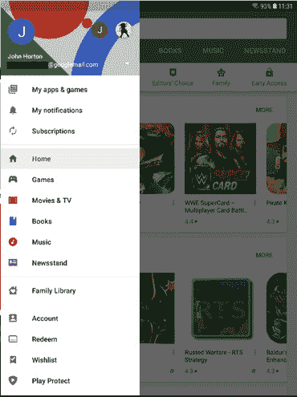
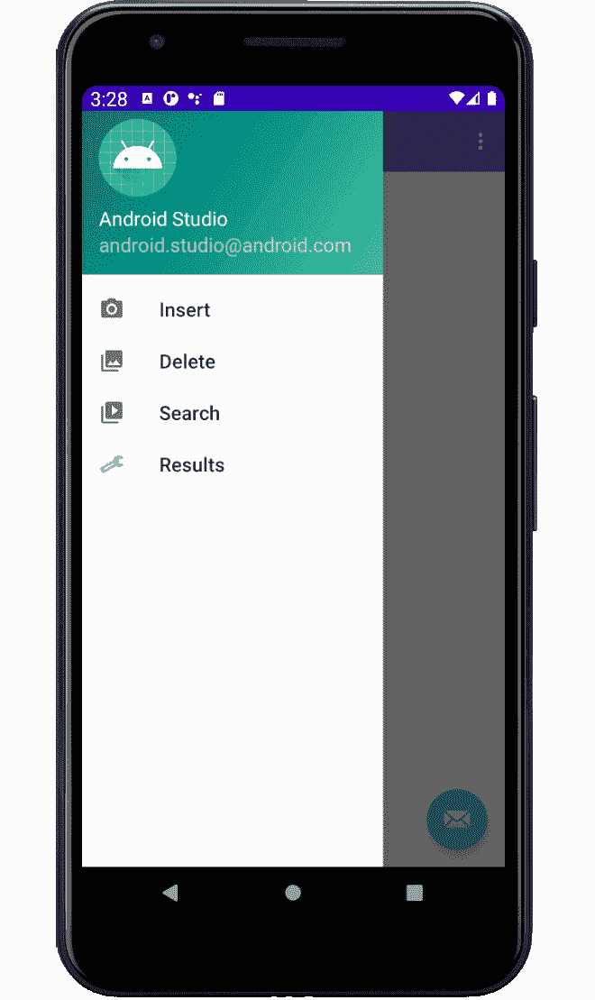
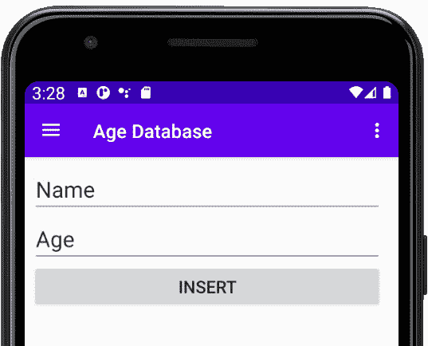
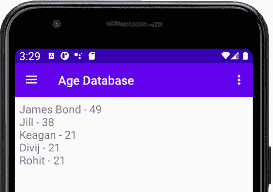
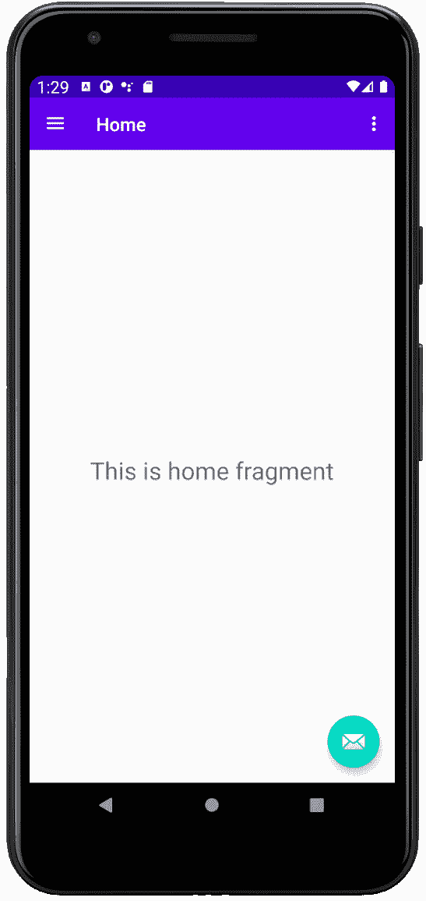
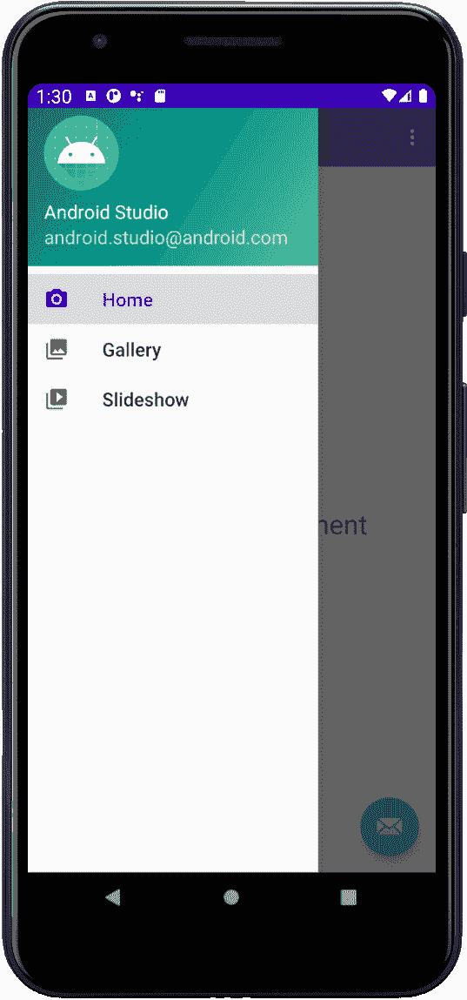
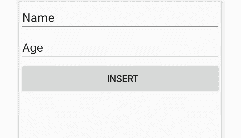
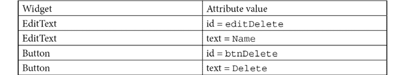
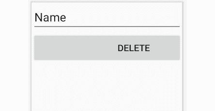
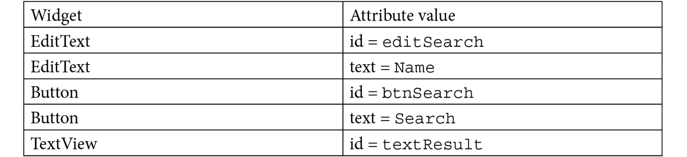

# *第 26 章*:带导航抽屉和碎片的高级 UI

在本章中，我们将看到什么是(可以说)最高级的用户界面。`NavigationView`小部件或导航抽屉，由于其滑出内容的方式，可以在您创建新项目时简单地选择它作为模板来创建。我们将这样做，然后我们将检查自动生成的代码，并学习如何与之交互。然后，我们将使用我们所知道的关于`Fragment`的所有信息，用不同的行为和视图填充每个“抽屉”。然后在下一章，我们将学习数据库，为每个`Fragment`增加一些新的功能。

这就是我们在这一章要做的:

*   介绍`NavigationView`
*   简单数据库应用入门
*   基于自动生成的AndroidStudio模板实现`NavigationView`项目
*   向`NavigationView`添加多个片段和布局

让我们来看看这个非常酷的 UI 模式。

# 技术要求

你可以在[https://GitHub . com/PacktPublishing/Android-初学者编程-第三版/tree/main/章节%2026](https://github.com/PacktPublishing/Android-Programming-for-Beginners-Third-Edition/tree/main/chapter%2026) 找到本章中出现的代码文件。

# 介绍导航视图

`NavigationView`有什么了不起的？嗯，第一件事可能会吸引你的眼球，那就是它可以做得看起来非常时尚。看看下面这张截图，它展示了谷歌 Play 应用中的一个`NavigationView`正在运行:



图 26.1–导航视图正在运行

老实说，从一开始，我们的就不会像谷歌游戏应用中的那样花哨。但同样的功能将出现在我们的应用中。

这个用户界面的另一个优点是它滑动的方式，以便在需要时隐藏/显示自己。正是因为这种行为，它可以是一个很大的尺寸，使它在可以放在上面的选项方面非常灵活，当用户用完它时，它就完全消失了，就像一个抽屉。

我建议你现在就试试谷歌游戏应用，如果你还没有的话，看看它是如何工作的。

你可以从屏幕的左边滑动你的拇指/手指，抽屉会慢慢滑出。你当然可以再往相反的方向滑。

当导航抽屉打开时，屏幕的其余部分会稍微变暗(如前一张截图所示)，帮助用户专注于提供的导航选项。

您也可以在导航抽屉打开时轻按它的任何位置，它会自己滑走，让整个屏幕对应用的其余部分都是清晰的。

点击左上角的菜单图标也可以打开抽屉。

我们还可以调整和细化导航抽屉的行为，正如我们将在本章末尾看到的那样。

# 检查简单数据库应用

在本章中，我们将重点关注创建`NavigationView`并用四个`Fragment`类实例及其各自的布局填充它。在下一章中，我们将学习并实现数据库功能。

数据库应用的屏幕如下。这就是我们辉煌的布局。请注意，使用`NavigationView`活动模板时，许多选项和大部分外观和装饰都是默认提供的。



图 26.2–导航视图布局

四个主要选项是我们将添加到用户界面的内容。分别是**插入**、**删除**、**搜索**、**结果**。显示了布局，其目的描述如下。

## 插入

第一个屏幕允许用户将一个人的名字和他们相关的年龄插入数据库:



图 26.3–插入

这个简单的布局有两个`EditText`小部件和一个按钮。用户将输入姓名和年龄，然后点击**插入**按钮将其添加到数据库中。

## 删除

这个屏幕更简单。用户将在`EditText`小部件中输入一个名称并点击按钮:


图 26.4–删除

如果输入的姓名是数据库中存在的，那么该条目(姓名和年龄)将被删除。

## 搜索

该布局与之前的布局非常相似，但目的不同:


图 26.5–搜索

用户将在`EditText`小部件中输入名称，然后点击**搜索**按钮。如果数据库中存在该名称，则它将与匹配的年龄一起显示。

## 结果

该屏幕显示了整个数据库中的所有条目:



图 26.6–结果

让我们从导航抽屉开始。

# 启动简单数据库项目

在AndroidStudio新建项目。称之为`Age Database`，使用**导航抽屉活动**模板。在我们做任何其他事情之前，非常值得在模拟器上运行该应用，看看有多少是作为该模板的一部分自动生成的:



图 26.7–主页

乍一看，它只是一个带有`TextView`小部件的普通旧布局。但从屏幕左边缘轻扫或按下菜单按钮，导航抽屉布局就会显示出来:



图 26.8–导航页面

现在我们可以修改选项，并为每个选项插入一个`Fragment`(带布局)。为了理解它是如何工作的，让我们检查一些自动生成的代码。

# 探索自动生成的代码和资产

打开`res/menu`文件夹。注意有一个名为`activity_main_drawer.xml`的额外文件。下面这段代码是这个文件的摘录，因此我们可以讨论它的内容:

```java
<group android:checkableBehavior="single">
     <item
          android:id="@+id/nav_home"
          android:icon="@drawable/ic_menu_camera"
          android:title="@string/menu_home" />
     <item
          android:id="@+id/nav_gallery"
          android:icon="@drawable/ic_menu_gallery"
          android:title="@string/menu_gallery" />
     <item
          android:id="@+id/nav_slideshow"
          android:icon="@drawable/ic_menu_slideshow"
          android:title="@string/menu_slideshow" />
</group>
```

请注意，`group`标签中有四个`item`标签。现在请注意从上到下的`title`标签与自动生成的导航抽屉菜单中的三个文本选项完全对应。还要注意，在每个`item`标签中，都有一个`id`标签，所以我们可以在【Java 代码中引用它们，还有一个`icon`标签，它对应于`drawable`文件夹中的一个图标，是导航抽屉中选项旁边显示的图标。

还有一些我们不会使用的文件已经自动生成。

让我们对基于`Fragment`的类及其布局进行编码。

# 对片段类及其布局进行编码

我们将创建四个类，包括加载布局的代码以及实际布局，但是在下一章了解安卓数据库之前，我们不会将任何数据库功能放入 Java 中。

在我们有了四个类和它们的布局之后，我们将看到如何从导航抽屉菜单中加载它们。到这一章结束时，我们将有一个完全正常工作的导航抽屉，它允许用户在片段之间进行交换，但是在下一章之前，片段实际上不会有任何功能。

## 为类和布局创建空文件

右键单击`layout`文件夹，选择**新建** | **布局资源文件**，创建四个以竖排`LinearLayout`为父视图的布局文件。命名第一档`content_insert`，第二档`content_delete`，第三档`content_search`，第四档`content_results`。除了`LinearLayout`选项和文件名之外的所有选项都可以保留为它们的默认值。

您现在应该有四个包含`LinearLayout`父级的新布局文件。

让我们编写相关的 Java 类。

## 对类进行编码

通过右键单击包含`MainActivity.java`文件的文件夹并选择**新建** | **Java 类**来创建四个新类。命名为`InsertFragment`、`DeleteFragment`、`SearchFragment`和`ResultsFragment`。从名字来看应该很清楚哪些片段会显示哪些布局。

为了清楚起见，让我们给每个类添加一些代码，使类扩展`Fragment`并加载它们相关的布局。

打开`InsertFragment.java`，编辑包含以下代码:

```java
import android.os.Bundle;
import android.view.LayoutInflater;
import android.view.View;
import android.view.ViewGroup;
import androidx.fragment.app.Fragment;
public class InsertFragment extends Fragment {

   @Override
   public View onCreateView(
                LayoutInflater inflater, 
                ViewGroup container, 
                Bundle savedInstanceState) {

          View v = inflater.inflate(
                      R.layout.content_insert, 
                      container, false);

          // Database and UI code goes here in next chapter
          return v;
    }
}
```

打开`DeleteFragment.java`编辑到包含以下代码:

```java
import android.os.Bundle;
import android.view.LayoutInflater;
import android.view.View;
import android.view.ViewGroup;
import androidx.fragment.app.Fragment;
public class DeleteFragment extends Fragment {

   @Override
   public View onCreateView(
                LayoutInflater inflater, 
                ViewGroup container, 
                Bundle savedInstanceState) {

          View v = inflater.inflate(
                      R.layout.content_delete, 
                      container, false);

         // Database and UI code goes here in next chapter

         return v;
    }
}
```

打开`SearchFragment.java`并编辑它以包含以下代码:

```java
import android.os.Bundle;
import android.view.LayoutInflater;
import android.view.View;
import android.view.ViewGroup;
import androidx.fragment.app.Fragment;
public class SearchFragment extends Fragment{
   @Override
    public View onCreateView(
                LayoutInflater inflater, 
                ViewGroup container, 
                Bundle savedInstanceState) {

           View v = inflater.inflate(
                      R.layout.content_search,
                      container, false);

           // Database and UI code goes here in next 
           chapter

         return v;
    }
}
```

打开`ResultsFragment.java`编辑到包含以下代码:

```java
import android.os.Bundle;
import android.view.LayoutInflater;
import android.view.View;
import android.view.ViewGroup;
import androidx.fragment.app.Fragment;
public class ResultsFragment extends Fragment {
    @Override
    public View onCreateView(
                LayoutInflater inflater, 
                ViewGroup container, 
                Bundle savedInstanceState) {

         View v = inflater.inflate(
                      R.layout.content_results, 
                      container, false);
         // Database and UI code goes here in next chapter

         return v;
    }
}
```

除了在`onCreateView`方法中，从关联的布局文件中加载适当的布局之外，每个类都完全没有功能。

让我们将用户界面添加到之前创建的布局文件中。

## 设计布局

正如我们在章节开始时看到的，所有的布局都很简单。让您的布局与我的布局相同并不重要，但像往常一样，标识值必须相同，否则我们在下一章中编写的 Java 代码将无法工作。

## 设计内容 _ 插入. xml

将两个`Plain Text`部件从调色板的`Text`类别拖到布局上。记住`Plain Text`小部件是`EditText`实例。现在将一个`Button`部件拖到两个`Plain Text`部件之后的布局上。

根据下表配置小部件:


这是您的布局在AndroidStudio的设计视图中应该是什么样子:



图 26.9–插入布局

## 设计内容 _ 删除. xml

将一个`Plain Text`拖到布局上，其下方有一个`Button`小部件。根据此表配置部件:



这是您的布局在AndroidStudio的设计视图中应该是什么样子:



图 26.10–删除布局

## 设计内容 _ 搜索. xml

将一个`Plain Text`后跟一个按钮和一个常规`TextView`拖到布局上，然后根据下表配置小部件:



这是您的布局在AndroidStudio的设计视图中应该是什么样子:


图 26.11–搜索布局

## 设计内容 _ 结果. xml

将单个`TextView`部件(这次不是`Plain Text` / `EditText`部件)拖到布局上。我们将在下一章中看到如何将整个列表添加到这个单一的`TextView`小部件中。

根据下表配置小部件:


这是您的布局在AndroidStudio的设计视图中应该是什么样子:


图 26.12–结果布局

现在我们可以使用基于`Fragment`的类及其布局。

# 使用片段类及其布局

这个阶段有三个步骤。首先，我们需要编辑导航抽屉布局的菜单，以反映用户拥有的选项。接下来，我们需要布局中的一个`View`实例来保存活动的`Fragment`实例，最后，我们需要向`MainActivity.java`添加代码，以便当用户点击菜单时在不同的`Fragment`实例之间切换。

## 编辑导航抽屉菜单

在项目浏览器的`res/menu`文件夹中打开`activity_main_drawer.xml`文件。编辑我们之前看到的的`group`标签内的代码，以反映我们的菜单选项**插入**、**删除**、**搜索**和**结果**:

```java
<group android:checkableBehavior="single">
   <item
         android:id="@+id/nav_insert"
         android:icon="@drawable/ic_menu_camera"
         android:title="Insert" />
   <item
         android:id="@+id/nav_delete"
         android:icon="@drawable/ic_menu_gallery"
         android:title="Delete" />
   <item
         android:id="@+id/nav_search"
         android:icon="@drawable/ic_menu_slideshow"
         android:title="Search" />
   <item
         android:id="@+id/nav_results"
         android:icon="@drawable/ic_menu_camera"
         android:title="Results" />
</group>
```

请注意，结果项重复使用相机图标。如果你想添加一个独一无二的图标，这是一个挑战。

现在我们可以在主布局中添加一个布局来保存当前活动片段。

## 在主布局中添加支架

打开`layout`文件夹中的`content_main.xml`文件。找到下面的现有代码，它是不适合我们使用的当前片段持有者:

```java
<fragment
     android:id="@+id/nav_host_fragment"
     android:name="androidx.navigation
          .fragment.NavHostFragment"
     android:layout_width="match_parent"
     android:layout_height="match_parent"
     app:defaultNavHost="true"
     app:layout_constraintLeft_toLeftOf="parent"
     app:layout_constraintRight_toRightOf="parent"
     app:layout_constraintTop_toTopOf="parent"
     app:navGraph="@navigation/mobile_navigation" />
```

删除前面的代码，并在`ConstraintLayout`的结束标记之前用这个 XML 代码替换:

```java
    <FrameLayout
        android:id="@+id/fragmentHolder"
        android:layout_width="368dp"
        android:layout_height="495dp"
        tools:layout_editor_absoluteX="8dp"
        tools:layout_editor_absoluteY="8dp">
    </FrameLayout>
```

切换到设计视图，点击**推断约束**按钮，将新布局固定到位。

现在我们有了一个属性为`fragmentHolder`的`FrameLayout`小部件，我们可以引用它并将所有`Fragment`实例布局加载到其中。

## 编码 MainActivity.java 类

将所有现有`import`指令替换为以下指令:

```java
import android.os.Bundle;
import com.google.android.material.
            floatingactionbutton.FloatingActionButton;
import com.google.android.material.snackbar.Snackbar;
import android.view.View;
import com.google.android.material.navigation.
        NavigationView;
import androidx.core.view.GravityCompat;
import androidx.drawerlayout.widget.DrawerLayout;
import androidx.appcompat.app.ActionBarDrawerToggle;
import androidx.appcompat.app.AppCompatActivity;
import androidx.appcompat.widget.Toolbar;
import androidx.fragment.app.FragmentTransaction;
import android.view.MenuItem;
```

打开`MainActivity.java`文件，编辑整个代码，使其符合以下内容。

注意

删除除了我们刚刚添加的`import`指令之外的所有指令可能是最快的。

接下来我们将讨论代码，因此研究变量名和各种类及其相关方法:

```java
public class MainActivity extends AppCompatActivity
        implements NavigationView.
OnNavigationItemSelectedListener {
    @Override
    protected void onCreate(Bundle savedInstanceState) {
        super.onCreate(savedInstanceState);
        setContentView(R.layout.activity_main);
        Toolbar toolbar = findViewById(R.id.toolbar);
        setSupportActionBar(toolbar);
        FloatingActionButton fab = findViewById(R.id.fab);
        fab.setOnClickListener(new View.OnClickListener() {
            @Override
            public void onClick(View view) {
                Snackbar.make(view, "
                Replace with your own action", 
                Snackbar.LENGTH_LONG)
                        .setAction("Action", null).show();
            }
        });
        DrawerLayout drawer = 
        findViewById(R.id.drawer_layout);
        ActionBarDrawerToggle toggle = new 
        ActionBarDrawerToggle(
                this, drawer, toolbar, 
                      R.string.navigation_drawer_open, 
                      R.string.navigation_drawer_close);

        drawer.addDrawerListener(toggle);
        toggle.syncState();
        NavigationView navigationView 
        = findViewById(R.id.nav_view);
        navigationView
        .setNavigationItemSelectedListener(this);
    }
}
```

在前面的代码中，`onCreate`方法处理我们用户界面的各个方面。该代码获得了一个`DrawerLayout`小部件的引用，该小部件对应于我们刚刚看到的布局。该代码还创建了一个新的`ActionBarDrawerToggle`实例，允许控制/切换抽屉。接下来，捕获对导航抽屉本身的布局文件的引用(`nav_view`)，最后一行代码在`NavigationView`上设置一个监听器。

现在添加`onBackPressed`方法如下:

```java
@Override
public void onBackPressed() {
     DrawerLayout drawer = 
     findViewById(R.id.drawer_layout);
     if (drawer.isDrawerOpen(GravityCompat.START)) {
          drawer.closeDrawer(GravityCompat.START);
     } else {
          super.onBackPressed();
     }
}
```

`onBackPressed`方法是一种被覆盖的活动方法，它处理当用户按下设备上的返回按钮时发生的事情。如果抽屉是打开的，代码会关闭抽屉，如果不是，则简单地调用`super.onBackPressed`。这意味着，如果抽屉是打开的，后退按钮将关闭抽屉，如果抽屉已经关闭，后退按钮将具有默认行为。

添加`onCreateOptionsMenu`和`onOptionsItemSelected`方法，这两个方法在本应用中并未真正使用，但会在`options`按钮中添加默认功能:

```java
@Override
public boolean onCreateOptionsMenu(Menu menu) {
     // Inflate the menu; this adds items to the action bar 
     if it is present.
     getMenuInflater().inflate(R.menu.main, menu);
     return true;
}
@Override
public boolean onOptionsItemSelected(MenuItem item) {
     // Handle action bar item clicks here. The action bar 
     will
     // automatically handle clicks on the Home/Up button, 
     so long
     // as you specify a parent activity in 
     AndroidManifest.xml.
     int id = item.getItemId();
     //noinspection SimplifiableIfStatement
     if (id == R.id.action_settings) {
          return true;
     }
     return super.onOptionsItemSelected(item);
}
```

现在添加如下所示的`onNavigatioItemSelected`方法:

```java
@Override
public boolean onNavigationItemSelected(MenuItem item) {
     // Handle navigation view item clicks here.
     // Create a transaction
     FragmentTransaction transaction = 
          getSupportFragmentManager().beginTransaction();
     int id = item.getItemId();
     if (id == R.id.nav_insert) {
          // Create a new fragment of the appropriate type
          InsertFragment fragment = new InsertFragment();
          // What to do and where to do it
          transaction.replace(R.id.fragmentHolder, 
          fragment);
     } else if (id == R.id.nav_search) {
          SearchFragment fragment = new SearchFragment();
          transaction.replace(R.id.fragmentHolder, 
          fragment);
     } else if (id == R.id.nav_delete) {
          DeleteFragment fragment = new DeleteFragment();
          transaction.replace(R.id.fragmentHolder, 
          fragment);
     }  else if (id == R.id.nav_results) {
          ResultsFragment fragment = new ResultsFragment();
          transaction.replace(R.id.fragmentHolder, 
          fragment);
     }
     // Ask Android to remember which
     // menu options the user has chosen
     transaction.addToBackStack(null);
     // Implement the change
     transaction.commit();
     DrawerLayout drawer = 
     findViewById(R.id.drawer_layout);
     drawer.closeDrawer(GravityCompat.START);
     return true;
}
```

让我们来看看`onNavigationItemSelected`方法中的代码。大部分代码应该看起来很熟悉。对于我们的每个菜单选项，我们创建一个新的合适类型的`Fragment`，并将其插入到我们的`RelativeLayout`中，其`id`属性值为`fragmentHolder`。

最后，对于`MainActivity.java`文件，`transaction.addToBackStack`方法意味着所选的`Fragment`实例将与其他任何实例一起按顺序被记住。这样做的结果是，如果用户选择了`insert`片段，那么`results`片段然后点击后退按钮，那么应用将把用户返回到`insert`片段。

您现在可以运行该应用，并使用导航抽屉菜单在我们所有不同的`Fragment`实例之间切换。它们看起来会和本章开头截图中的一样，但是它们还没有任何功能。

# 总结

在本章中，我们看到了拥有一个吸引人且令人愉悦的用户界面是多么简单，尽管我们的`Fragment`实例还没有任何功能，但是一旦我们了解了数据库，它们就已经准备好了。

在下一章中，我们将了解数据库的一般情况，安卓应用可以使用的特定数据库，然后我们将向我们的`Fragment`类添加功能。