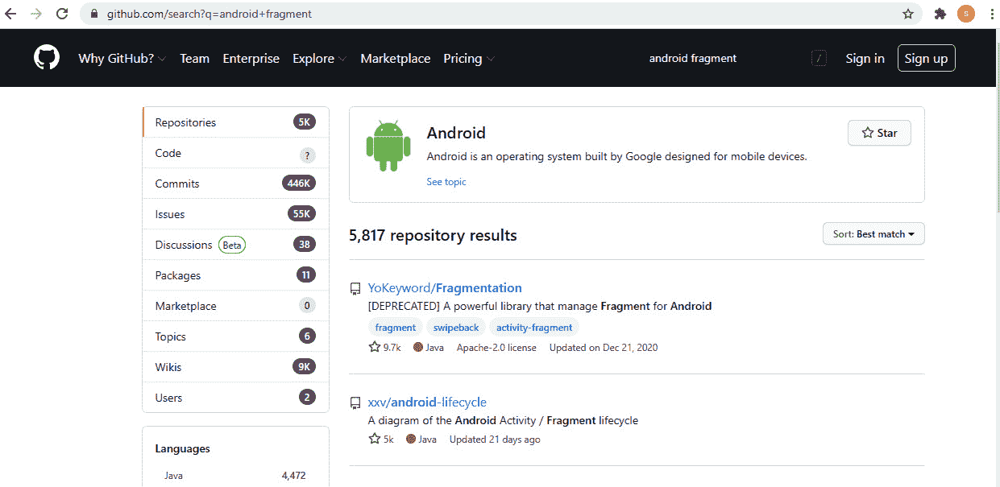
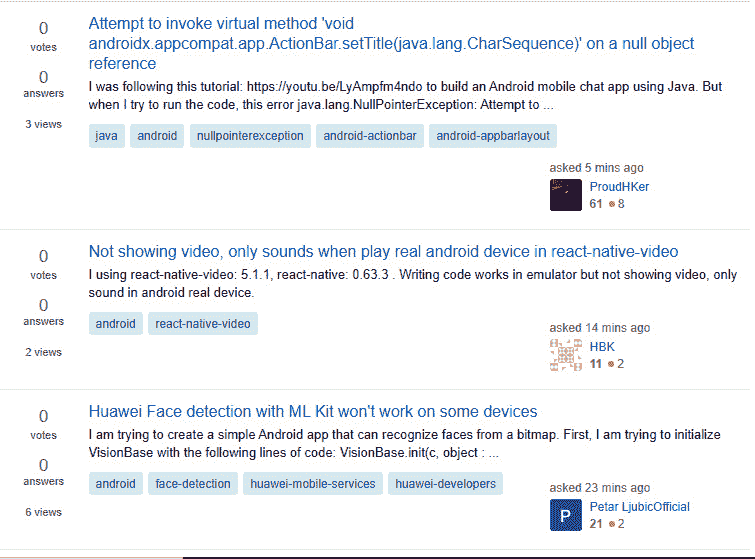

# *第 28 章*:走之前聊一聊

我们的旅程就要结束了。这一章给出了一些想法和建议，你可能会喜欢在匆忙开始制作自己的应用程序之前看看:

*   出版
*   制作您的第一个应用程序
*   继续学习
*   谢谢

# 出版

你很容易知道足够多来设计你自己的应用。你甚至可以对本书中的一个应用程序进行一些修改。

我决定不在谷歌的 Play Store 上包含发布的分步指南，因为步骤并不复杂。然而，它们相当深入，有点费力。大多数步骤包括输入关于你和你的应用程序的个人信息以及图像。这样的教程应该是这样的:

1.  填写此文本框。
2.  现在填写文本框。
3.  上传这张图片。
4.  等等。

没什么意思，也没什么用。

首先，您只需访问[https://play.google.com/apps/publish](https://play.google.com/apps/publish)并支付少量的一次性费用(大约 25 美元，取决于您所在地区的货币)。这允许你终身发布游戏。

注意

如果你想要一个发布的清单，看看这个链接，https://developer . Android . com/distribute/best-practices/launch/launch-check list . html，但是你会发现这个过程很直观(如果非常冗长的话)。

# 做个 app！

如果你把这一点付诸实践，你可以忽略本章的其他内容:

*不要等到成为专家才开始做应用！*

开始构建你的梦想应用程序，一个拥有所有功能的应用程序，它将会让谷歌 Play 一炮而红。然而，一个简单的建议是:先做些计划！但不要太多；那就开始吧。

在场外有一些更小、更容易实现的项目:你可以向朋友和家人展示的项目，以及探索安卓新领域的项目。如果你对这些应用程序有信心，你可以上传到谷歌游戏上。如果你担心他们可能会被评论者接受，那么让他们自由，并在描述中注明“只是一个原型”或类似的东西。

如果你的体验和我的一样，你会发现当你阅读、学习和构建应用程序时，你会发现你的梦想应用程序可以在很多方面得到改进，你可能会受到启发重新设计它，甚至重新开始。

如果你这样做了，我可以保证下次你构建应用的时候，你会用一半的时间完成，至少会有两倍的效果！

# 坚持学习

如果你觉得你已经走了很长的路，你是对的。然而，总有更多的东西需要学习。

## 继续阅读

你会发现，当你制作第一个应用程序时，你突然意识到你的知识中有一个空白需要填补，以使一些功能变得生动起来。这是正常的，有保证的，所以不要让它影响你。想想如何描述问题，在谷歌上搜索解决方案。

您可能还会发现，项目中的特定类会变得越来越不实用和不可维护。这是一个迹象，表明有一种更好的方法来构造事物，并且可能有一种现成的设计模式会让你的生活变得更容易。

为了先发制人，为什么不马上研究一些模式呢？一个很好的来源是 *Head First: Java 设计模式*，所有好的书店都有。

## GitHub

GitHub 允许你搜索和浏览别人写的代码，看看他们是如何解决问题的。这是很有用的，因为看到类的文件结构，然后浏览它们，通常会显示如何从一开始就计划你的应用程序，并防止你从错误的路径开始。你甚至可以获得一个 GitHub 应用程序，让你在手机或平板电脑的舒适环境中完成这项工作。或者，你可以配置安卓工作室将你的项目保存并共享给 GitHub。比如在首页搜索`Android fragment`、[www.github.com](http://www.github.com)，你会看到 1000 多个你可以窥探到的相关项目:

图 28.1–安卓片段结果

## 堆栈溢出

如果你卡住了，出现了一个奇怪的错误，或者出现了一个无法解释的崩溃，通常最好求助的地方是谷歌。这样做，你会惊讶于堆栈溢出在搜索结果中的出现频率，这是有充分理由的。

堆栈溢出允许用户发布他们的问题描述以及示例代码，这样社区就可以给出答案。然而，根据我的经验，很少需要发布问题，因为几乎总有人遇到完全相同的问题。

堆栈溢出对于边缘问题尤其有用。如果一个新的安卓工作室版本有一个 bug，或者一个新版本的安卓应用编程接口似乎没有做它应该做的事情，那么你几乎可以肯定世界上有几千名其他开发人员和你有同样的问题。然后，一些聪明的程序员，通常来自安卓开发团队本身，会在那里给出一个答案。

堆栈溢出也是好的一点轻读。进入首页，[www.stackoverflow.com](http://www.stackoverflow.com)，在搜索框中输入`Android`，你会看到 Stack Overflow 社区正在出现的所有最新问题列表:

图 28.2–安卓列表

我并不是建议你现在就开始尝试回答所有的问题，但是阅读这些问题和建议会教会你很多，你可能会发现比你预期的更多的时候，你已经有了解决方案或者至少有了解决方案的想法。

## 安卓用户论坛

还有，很值得注册一些安卓论坛，偶尔去逛逛，从用户的角度了解一下热点话题和趋势是什么。我不会在这里列出任何，因为一个快速的网络搜索是所有需要的。

如果你对这个话题是认真的，那么你可以参加一些安卓会议，在那里你可以和成千上万的其他开发人员接触并参加讲座。如果你对此感兴趣，可以在网上搜索 droidcon、安卓开发者日和 GDG 开发者节。

## 更高层次的学习

你现在可以阅读更多安卓书籍。我在这本书的开头提到，很少有书，甚至可以说没有，教没有 Java 经验的读者安卓编程。这就是我写这本书的原因。

既然你对 OOP 和 Java 有了很好的理解，并且对应用程序设计和 Android API 有了一个简单的介绍，那么你就可以像现在这样，为已经知道如何用 Java 编程的人阅读 Android“初学者”书籍了。

这些书充满了你可以建立或阅读的好例子，以巩固你在这本书里学到的东西，以不同的方式使用你的知识，当然，也学习一些全新的东西。

可能还值得进一步阅读一些纯 Java 书籍。刚刚浏览了大约 750 页，这可能很难让人相信，但是 Java 还有很多东西没有来得及介绍。

我可以说出一些书名，但亚马逊上正面评论最多的书往往是值得探索的。

# 我的其他频道

请保持联系！

*   [gamecodeschool.com](http://gamecodeschool.com)
*   [facebook.com/gamecodeschool](http://facebook.com/gamecodeschool)
*   [twitter.com/gamecodeschool](http://twitter.com/gamecodeschool)
*   [youtube.com/c/Gamecodeschool/videos](http://youtube.com/c/Gamecodeschool/videos)
*   [linkedin.com/in/gamecodeschool](http://linkedin.com/in/gamecodeschool)

# 再见，谢谢

我写这本书很开心。我知道这是老生常谈，但也是事实。然而，最重要的是，我希望你能从中学到一些东西，并把它作为你未来编程的垫脚石。

你读这篇文章可能是为了一点乐趣，或者是为了发布一个应用程序的荣誉，一个编程工作的垫脚石，或者你真的会开发一个让谷歌 Play 大受欢迎的应用程序。

无论如何，我非常感谢你买了这本书，并祝你在未来的努力中一切顺利。

我认为每个人都有一个应用程序在里面，你所需要做的就是做足够的工作来把它从你身上拿出来。