# 第二章。柯特林、XML 和用户界面设计器

在这个阶段，我们有一个运行良好的安卓开发环境，我们已经构建并部署了我们的第一个应用程序。然而，很明显，AndroidStudio自动生成的代码不会成为谷歌 Play 上的下一个畅销应用。我们需要探索这个自动生成的代码，这样我们就可以开始理解安卓，然后学习如何在这个有用的模板上构建。牢记这一目标，我们将在本章中执行以下操作:

*   了解如何从我们的应用程序中获得技术反馈。
*   检查我们第一个应用程序中的Kotlin代码和**用户界面** ( **用户界面** ) XML 代码。
*   获得我们第一次使用安卓 UI 设计器的体验。
*   编写我们的第一个 Kotlin 代码。
*   了解一些核心的 Kotlin 基础知识，以及它们与 Android 的关系。

首先，让我们看看如何从我们的应用程序中获得反馈。

# 检查日志输出

在前一章中，我们提到我们的应用程序在仿真器或真实设备上以调试模式运行；这样我们就可以监控它，并在出现问题时获得反馈。那么，这些反馈都在哪里？

您可能已经注意到AndroidStudio窗口底部有很多滚动文本。如果没有，点击**日志**选项卡，如下图中标记为 **1** 的高亮区域所示:

### 类型

请注意，模拟器必须正在运行，或者必须在调试模式下连接一个真实的设备，以便您看到以下窗口。此外，如果你因为某种原因重启了AndroidStudio，但还没有执行应用，那么**日志**窗口将是空的。请参考第一章，让应用程序在模拟器或真实设备上运行:

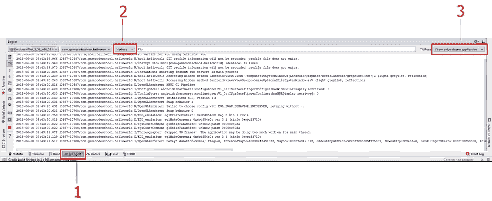

如果你想看得更多，你可以拖动窗口使其更高，就像在大多数其他窗口应用程序中一样。

这个窗口被称为 **logcat** ，或者，有时候，它被称为**控制台**。这是我们的应用程序告诉我们在用户看到的东西下面发生了什么的方式。如果应用崩溃或有错误，原因或线索会出现在这里。如果我们需要输出调试信息，我们也可以在这里这样做。

### 类型

如果你只是不明白为什么你的应用程序会崩溃，从 logcat 复制一点文本粘贴到谷歌通常会揭示原因。

## 过滤日志输出

你可能已经注意到 logcat 的大部分(如果不是全部的话)内容几乎是不可理解的。没关系；现在，我们只对用红色突出显示的错误和我们接下来将了解的调试信息感兴趣。为了在我们的**日志**窗口中看到更少的多余文本，我们可以打开一些过滤器来使事情更加清晰。

在之前的截图中，我又突出了两个区域，分别是 **2** 和 **3** 。区域 **2** 是控制第一个过滤器的下拉列表。现在左键点击，从**详细**变为**信息**。我们大幅削减了文本输出。当我们对我们的应用做了一些改变并重新部署时，我们将看到这是多么有用。在我们探索了代码和构成项目的资产之后，我们将这样做。此外，再次检查标记为 **3** 的区域是否显示**仅显示选定的应用程序**。如果没有，左键点击并将其更改为**仅显示所选应用程序**。

现在，我们可以看看AndroidStudio为我们自动生成了什么，然后我们可以开始更改和添加代码，以个性化它，超越我们从项目创建阶段获得的内容。

# 探索项目的 Kotlin 代码和主布局的 XML 代码

我们将查看包含定义简单 UI 布局的代码的资源文件和包含 Kotlin 代码的文件。在这个阶段，我们不会试图理解所有的东西，因为我们需要学习更多的基础知识，这样做才有意义。然而，我们将看到的是这两个文件的基本内容和结构，因此我们可以将它们的内容与我们已经知道的关于 Android 资源和 Kotlin 的内容进行协调。

## 检查 MainActivity.kt 文件

我们先来看看的 Kotlin 代码。左键点击`MainActivity.kt`标签可以看到这个代码，如下图截图所示:

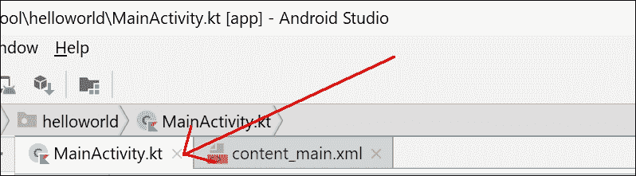

由于我们没有看到代码的复杂细节，一个带注释的截图比以文本形式再现实际代码更有用。阅读本节时，请定期参考以下截图:

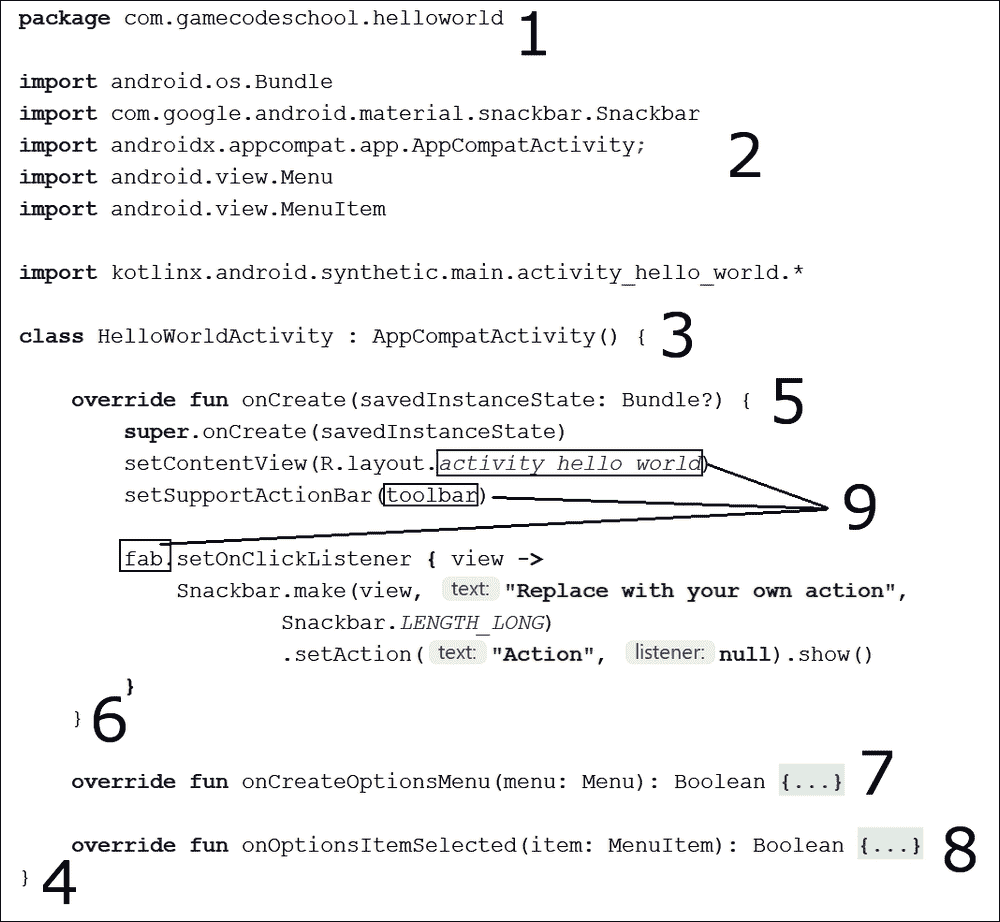

首先要注意的是，我在代码中添加了几行空行，以分隔内容并呈现更清晰的图像。

### 安卓 Studio 中的代码折叠(隐藏)

现在，在 Android Studio 中查看窗口左侧的(不是前面的截图)，观察编辑器左侧所有可以折叠和展开部分代码的 **+** 和 **-** 按钮:

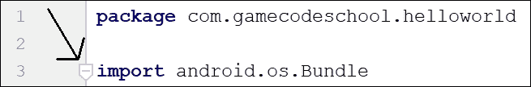

我已经折叠了代码的一些部分，并保留了其他可见的部分。所以，你在屏幕上看到的和你看前面截图看到的略有不同。在AndroidStudio中，玩一会 **+** 和**–**按钮，练习隐藏和取消隐藏部分代码。您可能能够让您的屏幕看起来像前面的截图，但这不是继续的要求。像这样隐藏代码的技术术语叫做**折叠**T7】。

### 包裹申报

第 **1** 部分被称为**包声明**，如您所见，这是我们在创建项目时选择的包名，前面有`package`一词。每个 Kotlin 文件的顶部都会有一个包声明。

### 导入类

第 **2** 部分是六行代码，都以`import`开头。在`import,`之后，我们可以看到各种的点分单词。每行的最后一个单词是该行导入到我们项目中的类的名称，每行中所有前面的单词都是包含这些类的包和子包。

例如，下一行从`androidx.appcompat.app`包和子包中导入`AppCompatActivity`类:

```kt
import androidx.appcompat.app.AppCompatActivity
```

这意味着在我们的项目中，我们将可以访问这些类。事实上，自动生成的代码正是使用这些类来制作我们的简单应用程序，我们在上一章中已经看到了这一点。

我们不会在本章中讨论所有这些类。正是我们可以导入类的想法，让我们可以访问更多现在很重要的功能。请注意，我们可以在任何时候从任何包中添加额外的类，并且当我们很快改进我们的应用程序时，我们会这样做。

### 班级申报

我们代码的第 **3** 部分叫做**类声明**。这是那一行的全文；我强调了其中的一部分，内容如下:

```kt
class MainActivity : AppCompatActivity() {
```

班级宣言是一个班级的开始。请注意，高亮显示的部分`MainActivity`是我们创建项目时自动生成的名称，也与`MainActivity.kt`文件名相同。这正如我们之前讨论过的柯特林课程一样。

冒号(`:`)意味着我们这个名为`MainActivity`的班级属于`AppCompatActivity`类型。这表明，虽然这个文件中没有那么多行代码，但我们也使用了更多我们没有看到的来自`AppCompatActivity`类的代码。所有这些和更多将在[第 10 章](12.html "Chapter 10. Object-Oriented Programming") *面向对象编程*中变得清晰。

最后，对于部分 **3** ，请看行尾的左花括号:`{`。现在看看我们代码的 **4** 部分截图的底部。这个右花括号(`}`)表示类的结束。在大括号开始和结束之间的一切，`{...},`都是这个类的一部分。

### 类内部的函数

现在看看代码的第 **5** 部分。这是完整的代码行，突出了我们当前讨论的关键部分:

```kt
override fun onCreate(savedInstanceState: Bundle?) {
```

这是的一个功能**的签名**。突出显示的部分`onCreate`是功能**名称**。Kotlin `fun`关键字明确表示这是一个函数的开始。我们通过使用名称使函数执行它的代码。我们说我们这样做是**在调用**一个函数。

虽然我们现在不关心函数名两边的代码部分，但是您可能已经注意到了`Bundle`，我们在代码的 **2** 部分导入的类之一。如果我们删除相关的`import` 行，AndroidStudio将不知道`Bundle`类是什么，它将无法使用，并以红色下划线突出显示为错误。

我们的代码将无法编译和运行。请注意，前面代码的最后一行是一个左大括号(`{`)。这表示包含在`onCreate`功能中的代码的开始。现在跳到代码的第 **6** 部分，您将看到一个右花括号(`}`)。你可能已经猜到这是函数的结尾。`onCreate`函数的左大括号和右大括号之间的所有内容都是调用该函数时执行的代码。

我们还不需要深入研究这段代码的作用，但是作为概述，它通过引用一些资源文件来设置应用程序的外观和布局，这些资源文件是在我们创建项目时由AndroidStudio自动生成的。在之前的截图中，我已经用一个标记为 **9** 的轮廓突出显示了这些资源文件。

部分 **7** 和 **8** 也是我为了让截图和本次讨论更直白而折叠的功能。他们的名字分别是`onCreateOptionsMenu`和`onOptionsItemSelected`。

我们对我们的Kotlin代码了解得足够多，可以取得一些进展。我们将再次看到这段代码，并在本章稍后进行更改。

### 到目前为止柯特林代码的总结

确实包含在前面的代码中，有一些复杂的语法。然而，我们正在做的是建立关于这段代码的足够知识，这样我们就可以在其中工作，并开始在学习柯特林和安卓方面取得快速进展，而不必先阅读数百页的柯特林理论。到这本书的结尾，所有的代码都会有意义。但是为了现在取得快速进展，我们只需要接受一些细节将在一段时间内保持神秘。

## 检查主布局文件

现在我们将只看众多`.xml`文件中的一个。有几个不同的布局文件，我们将在本书的整个过程中遇到它们，但是让我们从决定我们应用程序外观的最重要的一个开始。

左键点击我们一直在讨论的`MainActivity.kt`标签旁边的`content_main.xml`标签。

在右侧主窗口，你会看到我们 app 的**设计**视图，如下图截图所示:

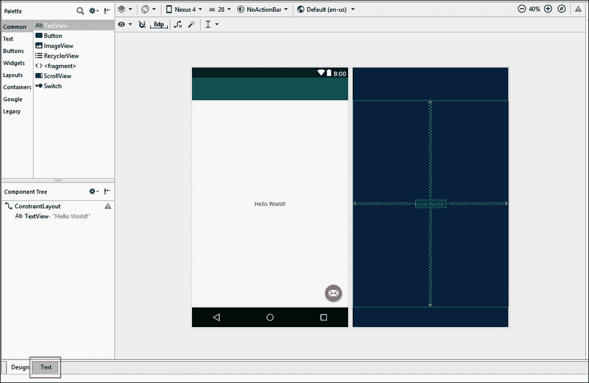

当我们设计应用程序时，我们在整本书中所做的大部分工作将在这个设计视图中完成。然而，重要的是要知道幕后发生了什么。

设计视图是包含在`content_main.xml`文件中的 XML 代码的图形表示。点击**文本**选项卡(如前一张截图中左下角所示)，查看构成布局的 XML 代码。我已经注释了一个 XML 文本的截图，以便我们接下来可以讨论它:

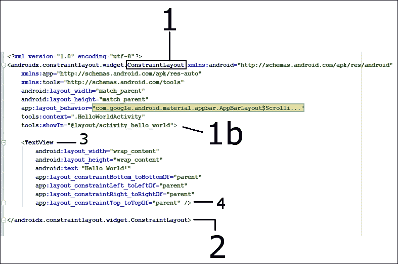

首先要注意的是，这个文件并不代表整个布局。然而，它确实代表了大部分的表面区域和中间的**你好世界**信息。此外，在左侧，我们可以看到现在熟悉的 **+** 和**–**图标，这样我们就可以折叠和展开代码的部分。

### UI 布局元素

如果我们首先看代码中标记为 **1** 的部分，我们可以看到第一件事就是`…ConstraintLayout...`。`ConstraintLayout`元素是用于包装用户界面其他部分的用户界面元素。

### 注

有更多的技术和具体的方式来指代我们的用户界面设计的不同“元素”。随着我们的进展，我们还将介绍诸如小部件、视图和视图组等术语。

当我们在安卓中向用户界面添加一个新元素时，我们总是以一个左尖括号(`<`)后跟元素名称的行开始。

沿着这条看起来很长很麻烦的线的代码定义了这个元素将具有的**属性**。根据用户界面元素的类型，这可以包括几十种不同的东西。在这里，在一些其他的 XML 中，我们可以看到诸如`layout_width`、`layout_height`和`showIn`之类的东西。所有这些属性定义了`ConstraintLayout`元素在用户屏幕上的显示方式。`ConstraintLayout`元素的属性在第一个直角括号(`>`)处结束，标记为 **1b** 。

如果我们看一下我们的 XML 截图的底部，我们会看到标记为 **2** 的代码。该代码`</…ConstraintLayout>`标记了中的`ConstraintLayout`元素的结束，该元素属性的右括号(`>`)和定义其结束的`</…ConstraintLayout>`代码之间的任何内容都被认为是该元素的**子元素**。因此，我们可以看到我们的`ConstraintLayout`元素有(或包含)一个孩子。让我们现在看看那个孩子。

### UI 文本元素

利用我们刚刚学到的知识，我们可以设计出从截图中的 **3** 位置开始的 UI 元素称为`TextView`元素。就像它的父代一样，它以一个左尖括号(`<`)和它的名字:`<TextView...`开始。如果我们进一步观察我们的`TextView`元素，我们可以看到它有几个属性。它有一个设置为`"Hello world!"`的`text`属性。当然，这是我们的应用程序向用户显示的确切文本。它还有`layout_width`和`layout_height`属性，都设置为`"wrap_content"`。这告诉`TextView`元素，它可以占用它所需要的内容的空间，但不能再多了。正如我们将在整本书中看到的，还有更多属性可用于这个和其他用户界面元素。

请注意，我们的 XML 截图中 **4** 位置的代码是`/>`。这标志着`TextView`元素的结束。这与`ConstraintLayout`元素的结尾书写方式略有不同。当 XML 中的一个元素没有子元素时，我们可以这样结束它:`/>`。当元素有子元素，并且它的结束在定义它的属性的代码中出现得更远时，通过像这样重复它的名字来结束元素就更清楚了:`</…ConstraintLayout>`。

### 注

您可能想知道为什么`TextView`元素的元素名称简短而简洁(简单地说，`TextView`)，而`ConstraintView`元素的全名前面是明显复杂的混乱(`androidx.constraintlayout.widget.ConstraintLayout`)。这个`ConstraintLayout`元素是布局的特殊版本，用于确保我们的应用程序与旧版本的安卓兼容。正如我们稍后将看到的，当我们向应用程序添加按钮时，大多数元素都有简单明了的名称。

我们将在下一节中编辑这段代码，并了解更多关于属性的信息，以及探索另一种类型的用户界面元素——即`Button`元素。

# 向主布局文件添加按钮

在这里，我们将在屏幕上添加几个按钮，然后探索一种让它们做某事的快速方法。我们将以两种不同的方式添加按钮；首先，使用可视化设计器，其次，通过直接添加和编辑 XML 代码。

## 通过视觉设计器添加按钮

要开始添加我们的第一个按钮，点击我们刚刚讨论的 XML 代码下面的**设计**选项卡，切换回设计视图。该按钮在以下屏幕截图中突出显示:

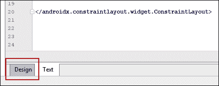

请注意，在布局的左侧，我们有一个名为**调色板**的窗口:

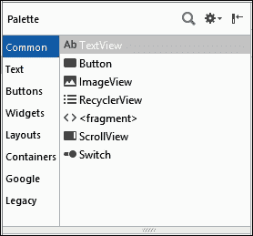

调色板窗口分为两部分。左侧列表包含用户界面元素的类别，允许您选择一个类别，而右侧则显示当前所选类别中所有可用的用户界面元素。

确定选择了**常用**类别，如上一张截图所示。现在，左键单击并按住**按钮**部件，然后将其拖动到靠近顶部和中心的布局上。

不确切也没关系；然而，练习把它做对是很好的。所以，如果你对你的按钮的位置不满意，那么你可以左键点击它在布局上选择它，然后点击键盘上的*删除*键来摆脱它。现在，您可以重复上一步，直到有一个您满意的整齐放置的按钮，如下图所示:

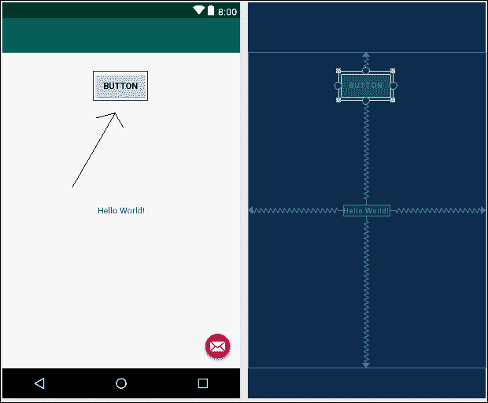

此时，我们可以在模拟器或真实设备上运行应用程序，按钮就会出现。如果我们点击它，甚至会有一个简单的动画来表示按钮被按下并释放。如果你愿意的话，现在就试试这个吧。

为了让应用程序更有趣，我们将使用**属性**窗口编辑按钮的属性。

### 编辑按钮的属性

通过左键点击确定按钮被选中。现在找到编辑窗口右侧的**属性**窗口，如下所示:

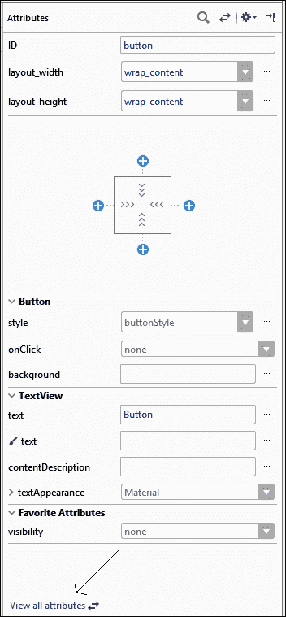

在前面的截图中，您可以看到我们可以访问按钮的一些属性，尽管不是全部。要显示更多的属性，点击**查看所有属性**链接(如前面的截图所示)。

现在你可以看到按钮的全部细节，我们可以开始编辑了。看上去像按钮一样简单的东西却有如此多的属性，这似乎令人惊讶。这是安卓应用编程接口为用户界面操作提供的多功能性和强大功能的标志。请看下面的截图，它显示了我们最近添加的按钮的完整属性列表:

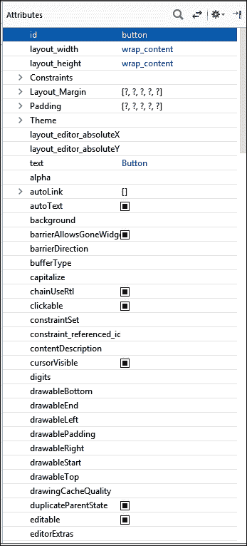

此外，请注意，即使是前面的截图也没有显示所有内容，您可以使用**属性**窗口右侧的滚动条来显示更多属性。

如您所见，我们可以在用户界面设计器中编辑大量不同的属性。在[第 12 章](14.html "Chapter 12. Connecting Our Kotlin to the UI and Nullability")、*将我们的Kotlin连接到 UI 和可空性*中，我们还将编辑并使用我们的Kotlin代码操纵这些属性。现在，我们将只编辑一个属性。向下滚动**属性**窗口，直到看到 **onClick** 属性，然后左键点击选择进行编辑，如下图截图所示:

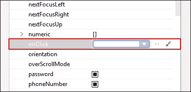

### 类型

属性是按字母顺序排列的，点击可以在冗长的列表中找到大约三分之二的位置。

在**中输入`topClick`点击**属性的编辑框，按键盘上的*进入*。一定要用同样的大小写，包括稍微违反直觉的小写`t`和大写`C`。

完成后**属性**窗口将看起来像下一个截图:

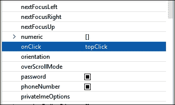

我们在这里所做的是在我们的代码中命名 Kotlin 函数，当用户点击这个按钮时，我们希望调用(或执行)这个函数。这个名字是任意的，但是，由于这个按钮在屏幕的顶部，这个名字看起来很有意义，也很容易记住。我们使用的奇怪的大小写是一个惯例，它将帮助我们保持代码清晰易读。随着我们的代码变得越来越长、越来越复杂，我们将看到这样做的好处。

当然`topClick`功能还不存在。AndroidStudio很有帮助，但是有些事情我们需要自己去做。在我们向用户界面添加了第二个按钮之后，我们将使用 Kotlin 代码编写这个函数。此时你可以运行应用，它仍然会工作，但是如果你点击按钮，应用会崩溃，你会得到一条错误消息，因为该功能不存在。

## 检查新按钮的 XML 代码

在我们为这个项目添加最后一个按钮之前，点击编辑器下方的**文本**选项卡，切换回查看构成我们的用户界面的 XML 代码:

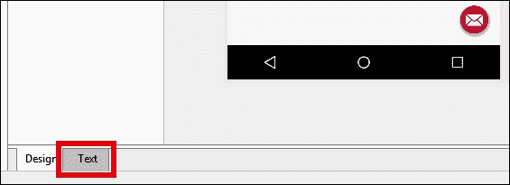

请注意，在我们之前检查的 XML 代码中有一个新的代码块。下面是新代码块的截图:

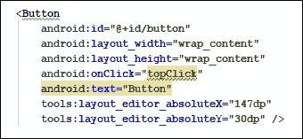

请注意以下细节，这些细节应该对应于我们对 XML 和 Android UI 元素的了解:

*   新代码以`<Button`文本开始，以`/>.`结束
*   新代码有一系列定义按钮的属性，包括`layoutWidth`和`layoutHeight.`
*   代码包括我们添加了值`"topClick".`的`onClick`属性
*   `onClick`属性的`topClick`值用红色下划线标出，显示一个错误，因为该函数还不存在。
*   代表按钮的代码的开始和结束包含在`ConstraintLayout`元素中。

### 注

`dp`是测量/距离的单位，将在[第 5 章](07.html "Chapter 5. Beautiful Layouts with CardView and ScrollView")、*带卡片视图和滚动视图的美丽布局*中进行更深入的讨论。

将鼠标光标悬停在带下划线的`topClick`值上，以显示问题的详细信息，如下图所示:


我们可以确认，问题是AndroidStudio希望在我们的代码中实现一个名为`topClick`的函数。一旦我们添加了第二个按钮，我们就会这样做。

## 通过编辑 XML 代码添加按钮

只是为了的多样性，为了证明我们可以，我们现在将只使用 XML 代码添加另一个按钮，而不使用 UI 设计器。大多数情况下，我们将使用用户界面设计器，但是这个快速练习应该会巩固用户界面设计器和您头脑中底层 XML 代码之间的关系。

我们将通过复制和粘贴现有按钮的代码来实现这一点。然后，我们将对粘贴的代码进行一些小的编辑。

在开始`<Button`的按钮代码前左键单击。请注意，代码的开头和结尾现在有一个轻微的突出显示:

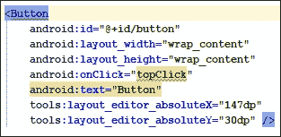

这已经确定了我们想要复制的代码部分。现在，左键单击并拖动以选择所有按钮代码，包括高亮显示的开始和结束，如下一个屏幕截图所示:

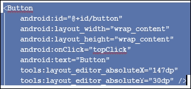

按下 *Ctrl* + *C* 键盘组合复制高亮显示的文本。将光标置于现有按钮代码下方，点击*输入*键几次，留下一些额外的空行。

按 *Ctrl* + *V* 键盘组合粘贴按钮代码。此时，我们有两个按钮；然而，有几个问题:

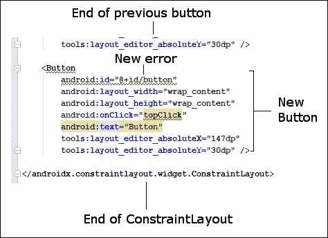

我们在代表按钮的两个代码块中都有一个额外的错误。`id`属性(在两个块中)用红色下划线标出。出现此错误的原因是两个按钮具有相同的`id`属性。`id`属性应该将一个用户界面元素与所有其他用户界面元素区分开来，所以它们不能相同。让我们试着解决这个问题。

## 赋予按钮唯一的 id 属性

我们可以通过将第二个按钮称为`button2,`来解决这个问题，但是将两者都更改会更有意义。编辑第一个按钮中的代码，赋予其`buttonTop`的`id`属性。为此，请识别以下代码行(在第一个按钮中):

```kt
android:id="@+id/button"
```

然后，将代码行更改为以下内容:

```kt
android:id="@+id/buttonTop"
```

### 类型

注意`button`中的小写`b`和`Top`中的大写`T`。

现在在第二个按钮中识别这一行代码:

```kt
android:id="@+id/button"
```

然后，将代码行更改为以下内容:

```kt
android:id="@+id/buttonBottom"
```

`id`属性线上的错误都没有了。在这一点上，你可能认为我们可以继续来解决我们缺失的功能问题。

但是，如果您运行该应用程序并快速浏览一下，您会看到我们似乎只有一个按钮。不仅如此，按钮也不在我们预期的位置:

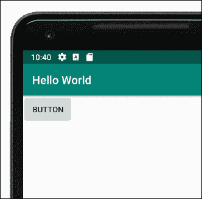

这样做的原因是因为我们没有明确定位它们，所以它们默认在屏幕的左上角。我们在**设计**选项卡上看到的位置只是设计时的位置。所以，现在让我们改变这一点。

## 在布局中定位两个按钮

之所以我们只能看到一个按钮，是因为两个按钮位置相同。第二个按钮正好覆盖第一个按钮。因此，即使在**设计**选项卡(请随意查看)中，按钮仍然相互重叠，尽管它们位于屏幕中间:

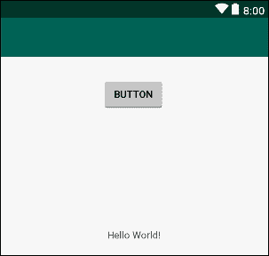

### 注

您可能想知道为什么 UI 布局工具是以这种明显违反直觉的方式设计的；原因是灵活性。正如您将在接下来的两章中看到的，不仅可以在设计时以不同于应用程序运行时的方式定位用户界面元素，而且还有一系列不同的布局方案可供应用程序设计者(也就是您)选择，以适应他们的计划。这种灵活性导致了在学习安卓系统时的一点尴尬，而一旦你克服了这种尴尬，就有了强大的设计能力。但是别担心，我们会一步一步来，直到你把这个东西打败。

我们将通过首先添加到我们的代码中，然后使用 UI 设计器，让 Android Studio 自动为我们解决问题。首先，让我们把设计时的布局做好。在第二个按钮的代码中，找到这一行代码:

```kt
tools:layout_editor_absoluteY="30dp" />
```

现在将其编辑为与下面一行代码相同:

```kt
tools:layout_editor_absoluteY="100dp" />
```

### 类型

根据您放置第一个按钮的确切位置，AndroidStudio中的值可能与刚才讨论的值不同。如果第二个按钮比第一个按钮高大约 70dp，那么您可以继续这个练习。

这种微妙的变化会将第二个按钮下移一点，但只是在设计时。如果你查看**设计**标签，按钮被整齐地放置在第一个按钮的下面，但是如果你在模拟器上运行应用程序，它们仍然在屏幕的左上角，并且在彼此的顶部。

切换到**设计**选项卡，找到如下截图所示的**推断约束**按钮:

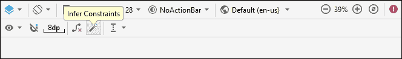

点击**推断约束**按钮。AndroidStudio将编辑 XML 代码。让我们简单看看幕后发生了什么。从代表按钮的两段代码的末尾，删除了以下代码行:

```kt
tools:layout_editor_absoluteX="147dp"
tools:layout_editor_absoluteY="30dp" />
```

这两行代码是水平方向(`…absoluteX`)和垂直方向(`…absoluteY`)按钮的定位。

AndroidStudio还在第一个按钮上增加了四行代码，在第二个按钮上增加了三行代码。下面是在第一个按钮开始处添加的代码:

```kt
android:layout_marginTop="30dp"
```

### 类型

`dp`的确切值可能会因您将按钮放置的确切位置而异。

该代码使按钮顶部有一个`30`的边距。但是在什么之上呢？查看添加在第一个按钮末尾的以下三行代码:

```kt
app:layout_constraintEnd_toEndOf="parent"
app:layout_constraintStart_toStartOf="parent"
app:layout_constraintTop_toTopOf="parent" />
```

注意`layout_constraintEnd_toEndOf`、`layout_constraintStart_toStartOf`和`layout_constraintTop_toTopOf`的新属性。分配给每个属性的值是`"parent"`。这导致第一个按钮相对于父用户界面元素定位。父级是包含其他所有内容的布局；在这种情况下，父元素是`ConstraintLayout`元素。

现在看第二个(底部)按钮上增加的三行代码。

在代码的开头，我们看到了以下内容:

```kt
android:layout_marginTop="22dp"
```

### 类型

同样，`dp`的精确值可能会根据您将按钮放置的确切位置而有所不同。

在第二个按钮的代码末尾，我们看到以下两行额外的代码:

```kt
app:layout_constraintStart_toStartOf="@+id/buttonTop"
app:layout_constraintTop_toBottomOf="@+id/buttonTop" />
```

这意味着第二个按钮的位置相对于`buttonTop`有 22°的余量。

现在运行该应用程序，您会看到我们有两个不同的按钮。一个按钮具有`buttonTop,`的`id`属性，它位于另一个按钮之上，具有`buttonBottom`的`id`属性:

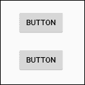

显然，布局比我到目前为止提到的要多，但是你已经对AndroidStudio提供的设计我们应用程序用户界面的选项有了第一印象。我们将仔细查看`ConstraintLayout`，并在[第四章](06.html "Chapter 4. Getting Started with Layouts and Material Design") *中探索更多布局选项*。

我们想对我们的 XML 代码再做一次修改。

## 让按钮调用不同的功能

将切换回**文本**选项卡，并在第二个(`buttonBottom`)按钮中识别下一行代码:

```kt
android:onClick="topClick"
```

接下来，按如下方式编辑代码:

```kt
android:onClick="bottomClick"
```

现在我们有两个按钮，一个在另一个上面。最上面一个的`id`属性为`buttonTop`，而`onClick`属性的值为`topClick`。另一个具有`id`属性`buttonBottom`和`onClick`属性`bottomClick`值。

这些最后的 XML 代码更改现在意味着我们需要在我们的 Kotlin 代码中提供两个函数(`topClick`和`bottomClick`)。

### 类型

两个按钮被点击时调用同一个函数在技术上是可以的——这不是语法错误。然而，大多数按钮确实有不同的目的，所以如果我们的按钮做不同的事情，这个练习会更有意义。

我们很快就会这样做，但在此之前，让我们多了解一点关于 Kotlin 注释的知识，并查看一些我们可以编写的 Kotlin 代码，以便向用户和我们自己发送消息进行调试。

# 在我们的 Kotlin 代码中留下注释

在编程中，编写称为代码注释的消息，并在代码中随意地添加它们，总是一个聪明的想法。这是为了提醒我们在编写代码时在想什么。为此，您只需添加一个双正斜杠，然后键入您的注释，如下所示:

```kt
// This is a comment and it could be useful
```

此外，我们可以使用注释来注释掉一行代码。假设我们有一行代码要暂时禁用；我们可以通过添加两个正斜杠来实现，如下所示:

```kt
// The code below used to send a message
// Log.i("info","our message here")
// But now it doesn't do anything
// And I am getting ahead of where I should be
```

### 类型

使用注释来注释掉代码应该只是一种临时措施。一旦找到了要使用的正确代码，就应该剪切注释掉的代码，以保持代码文件的整洁和有序。

我们来看一下安卓系统中两种不同的发送消息的方式，然后我们可以编写一些当我们的 UI 按钮被按下时会发送消息的功能。

# 给用户和开发者编码消息

在本章和上一章的介绍中，我们谈到了使用其他人的代码，特别是通过安卓应用编程接口的类及其功能。我们发现我们可以用相当少量的代码做一些相当复杂的事情(比如和卫星通话)。

为了让我们开始编码，我们将使用安卓应用编程接口中的两个不同的类来输出消息。第一个类`Log`，允许我们向 logcat 窗口输出消息。第二类`Toast`，虽然不是美味的早餐，但它会产生一个吐司形状的弹出消息，让我们的应用程序用户看到。

下面是我们需要编写的向 logcat 发送消息的代码:

```kt
Log.i("info","our message here")
```

在[第 10 章](12.html "Chapter 10. Object-Oriented Programming")、*面向对象编程*中，这种工作方式的确切原因会变得更加清晰，但现在，我们只需要知道，无论我们在两组引号之间放什么，都会输出到 logcat 窗口。我们将很快看到将这种类型的代码放在哪里。

下面是我们需要编写的代码，以便向用户的屏幕发送消息:

```kt
Toast.makeText(this, "our message",
   Toast.LENGTH_SHORT).show()
```

这是一行看起来非常复杂的代码，它到底是如何工作的，直到第 9 章、*柯特林函数*才会变得清楚。这里重要的一点是，无论我们在引号之间放什么，都会出现在给用户的弹出消息中。

让我们把一些代码(就像我们刚刚看到的)真实地放到我们的应用程序中。

# 编写我们的第一个Kotlin代码

因此，我们现在知道将输出到 logcat 或用户屏幕的代码。然而，我们把代码放在哪里呢？要回答这个问题，我们需要了解`MainActivity.kt`中的`onCreate`功能是在 app 准备展示给用户时执行的。所以，如果我们把代码放在这个函数的末尾，它就会像用户看到的那样运行；听起来不错。

### 类型

我们知道要在函数中执行代码，我们需要**调用**它。我们已经将按钮连接起来以调用一些功能，例如`topClick`和`bottomClick`。很快，我们将编写这些函数。但是谁或者什么在呼唤`onCreate`？这个谜团的答案是，安卓本身调用`onCreate`是为了响应用户点击应用图标运行应用。在[第六章](08.html "Chapter 6. The Android Lifecycle") *安卓生命周期*中，我们会看得更深，会清楚代码到底执行什么，什么时候执行。你现在不需要完全理解这一点；我只是想给你一个大概的了解。

让我们快速尝试一下；切换到 Android Studio 中的`MainActivity.kt`选项卡。

我们知道`onCreate`函数是在应用程序真正启动之前调用的。让我们复制并将一些代码粘贴到我们的 Hello World 应用程序的`onCreate`功能中，看看当我们运行它时会发生什么。

## 向 onCreate 函数添加消息代码

找到`onCreate`函数的右花括号(`}`)，添加如下代码块所示的高亮代码。在代码中，我没有显示`onCreate`功能的完整内容，而是使用了`…`来指示一些没有显示的代码行。重要的是将新代码(完整显示)放在末尾，但在右花括号(`}`)之前:

```kt
override fun onCreate(savedInstanceState: Bundle?) {
…
…
…
 // Your code goes here
 Toast.makeText(this, "Can you see me?", 
 Toast.LENGTH_SHORT).show()

 Log.i("info", "Done creating the app")
}
```

注意`Toast`和`Log`的实例在 Android Studio 中用红色突出显示。它们是错误。我们知道`Toast`和`Log`是类，类是代码的容器。

问题是AndroidStudio直到我们告诉他们才知道。我们必须为每个类添加一个`import`指令。幸好这是半自动的。

左键点击`Toast`；现在按住 *Alt* 键，点击*进入*。这一步需要做两次，一次为`Toast`，一次为`Log`。AndroidStudio将`import`指令添加到我们其他导入的代码的顶部，错误就消失了。

### 类型

*Alt* + *Enter* 只是众多有用的键盘快捷键之一。以下是AndroidStudio的键盘快捷键参考。更具体地说，它是针对AndroidStudio所基于的 IntelliJ Idea 的。将此网页设为书签；这将是本书的无价之宝。

滚动至`MainActivity.kt`顶部，查看添加的`import`指令。这些是为了您的方便:

```kt
import android.util.Log
import android.widget.Toast
```

以通常的方式运行应用，查看**日志**窗口中的输出。

### 检查输出

以下是 logcat 窗口中输出的截图:

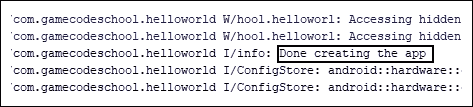

查看日志，您可以看到我们的消息–**完成了应用程序**的创建，尽管它与我们目前不感兴趣的其他系统消息混在一起。如果您在应用程序首次启动时观看了模拟器，您还会看到用户将看到的简洁的弹出消息:

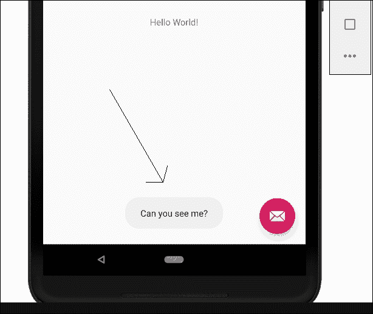

您可能想知道为什么消息会在当时输出。简单的答案就是`onCreate`功能就在 app 开始响应用户之前被调用。安卓开发者的常见做法是在这个函数中放入代码来设置他们的应用程序，并为用户输入做好准备。

现在，我们将更进一步，编写由用户界面按钮调用的我们自己的函数。我们将在其中放置类似的`Log`和`Toast`消息。

## 编写我们自己的柯特林函数

让我们直接进入开始写我们的第一个 Kotlin 函数，在其中包含更多的`Log`和`Toast`消息。

### 类型

如果您还没有这样做，现在是获取包含所有代码文件的下载包的好时机。您可以查看每章的完整代码。例如，本章的完整代码可以在`Chapter02`文件夹中找到。我进一步将`Chapter02`文件夹细分为`kotlin`和`res`文件夹(用于 Kotlin 和资源文件)。在包含多个项目的章节中，我将进一步划分文件夹以包含项目名称。你应该在文本编辑器中查看这些文件。我最喜欢的是记事本++，从[https://notepad-plus-plus.org/download/](https://notepad-plus-plus.org/download/)免费下载。在文本编辑器中查看代码比直接从书中阅读更容易，尤其是平装版，在代码行很长的地方更是如此。文本编辑器也是选择部分代码复制并粘贴到AndroidStudio的好方法。你可以在AndroidStudio打开代码，但是你可能会把我的代码和AndroidStudio自动生成的代码混在一起。

识别`MainActivity`类的右花括号(`}`)。

### 类型

请注意，您正在寻找整个类的结尾，而不是`onCreate`函数的结尾，如前一节所述。花点时间来识别新代码，以及它在现有代码中的位置。

在大括号内，输入以下高亮显示的代码:

```kt
override fun onCreate(savedInstanceState: Bundle?) {
…
…
…
…
}

…
…
…
fun topClick(v: View) {
 Toast.makeText(this, "Top button clicked", 
 Toast.LENGTH_SHORT).show()

 Log.i("info", "The user clicked the top button")
}

fun bottomClick(v: View) {
 Toast.makeText(this, "Bottom button clicked", 
 Toast.LENGTH_SHORT).show()

 Log.i("info", "The user clicked the bottom button")
}

} // This is the end of the class
```

注意`View`的两个实例是红色的，表示有错误。只需使用 *Alt* + *输入*键盘组合，导入`View`类并删除错误。

以通常的方式将应用程序部署到真实的设备或模拟器上，并开始点击按钮，以便我们可以观察输出。

### 检查输出

终于，我们的应用有所作为了！我们可以看到，我们在按钮`onClick`属性中定义的函数名确实是在按钮被点击的时候调用的；适当的消息被添加到**日志**窗口；并且适当的`Toast`消息被显示给用户。

诚然，我们仍然不明白为什么`Toast`和`Log`真的起作用，也不完全理解我们函数语法的`(v: View)`部分，或者自动生成代码的其余部分。随着我们的进步，这一点将变得清晰。如前所述，在[第 10 章](12.html "Chapter 10. Object-Oriented Programming")、*面向对象编程*中，我们将深入探究类的世界，在[第 9 章](11.html "Chapter 9. Kotlin Functions")、*Kotlin* *函数*中，我们将掌握与函数相关的其余语法。

看看 logcat 的输出；您可以看到，日志条目是由`onCreate`函数创建的，就像以前一样，也是由我们自己编写的两个函数创建的，每次您点击一个按钮。在下面的截图中，你可以看到我点击了每个按钮三次:

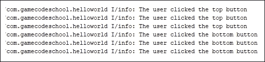

由于您现在已经熟悉了在哪里可以找到**日志文件**窗口，在未来，我将把日志文件输出呈现为修剪后的文本，因为它看起来更清晰:

```kt
The user clicked the top button
The user clicked the top button
The user clicked the top button
The user clicked the bottom button
The user clicked the bottom button
The user clicked the bottom button
```

在下面的截图中，可以看到顶部按钮已经被点击，并且`topClick`功能被调用，触发弹出`Toast`消息:


在本书中，我们将定期输出到 logcat，这样我们就可以看到我们应用程序的用户界面后面发生了什么。`Toast`消息更多的是通知用户有事情发生。这可能是下载已经完成，新的电子邮件已经到达，或其他一些需要他们注意的事件。

# 常见问题

问题 1)你能提醒我有哪些功能吗？

a)函数是我们代码的容器，可以从代码的其他部分执行(调用)。

问题 2)和第一章一样，我觉得这一章很难走。我需要再读一遍吗？

a)不，如果你成功地构建了应用程序，你已经取得了足够的进展来处理下一章的所有内容。随着本书的进展，我们知识中的所有空白都将被不断填补，并被实现的辉煌时刻所取代。

# 总结

我们在这次练习中取得了很大的成绩。的确，大部分的 XML 代码仍然是不可理解的。没关系，因为在接下来的两章中，我们将真正掌握可视化设计器，并了解更多关于 XML 代码的知识，尽管最终我们的目标是尽可能少地使用 XML 代码。

我们已经看到，当我们将一个按钮拖到我们的设计上时，XML 代码是如何为我们生成的。此外，如果我们在**属性**窗口中更改了一个属性，那么 XML 代码也将为我们编辑。此外，我们可以直接键入(或者，在我们的例子中，复制并粘贴)XML 代码，在用户界面上创建新按钮或者编辑现有按钮。

我们已经看到并编写了我们的第一个 Kotlin 代码，包括帮助我们记录代码的注释，我们甚至还添加了自己的函数，向 logcat 输出调试消息，并向用户弹出`Toast`消息。

在下一章中，我们将对AndroidStudio进行一次完整的导游，看看不同的事情到底在哪里完成。此外，我们将了解项目资产(如文件和文件夹)的结构以及我们如何管理它们。这将为我们更深入地了解[第 4 章](06.html "Chapter 4. Getting Started with Layouts and Material Design")、*布局和材质设计入门*和[第 5 章](07.html "Chapter 5. Beautiful Layouts with CardView and ScrollView")、*使用 CardView 和 ScrollView* 的漂亮布局做好准备，届时我们将为我们的应用构建一些重要的真实世界布局。