# 第三章。探索安卓工作室和项目结构

在本章中，我们将创建并运行另外两个安卓项目。这些练习的目的是更深入地探索 Android Studio 和 Android 项目的结构。

当我们构建准备部署的应用程序时，代码和资源文件需要打包，因为它们在 APK 文件中。因此，我们将很快看到的所有布局文件和其他资源都需要在正确的结构中。

幸运的是，当我们从模板创建项目时，安卓工作室会为我们处理这个问题。然而，我们仍然需要知道如何查找和修改这些文件，如何添加我们自己的文件，有时删除安卓工作室创建的文件，以及资源文件是如何相互链接的——有时是相互链接，有时是与科特林代码(即自动生成的科特林代码，以及我们自己的代码)链接。

除了了解我们项目的组成，确保我们从模拟器中获得最大收益也是有益的。

### 类型

当你想确保你的应用程序可以在你没有的硬件上运行时，仿真器特别有用。此外，学习一些最新的功能(正如我们将在本书中介绍的)通常需要最新的手机，模拟器是一种经济高效的方式，可以在不购买最新手机的情况下跟随所有迷你应用程序。

在本章中，我们将执行以下操作:

*   探索**空活动**项目模板的文件和文件夹结构。
*   查看**空活动**和**基础活动**模板的区别。
*   了解如何从模拟器中获得最大收益。

本章将在下一章中为我们提供一个构建和部署多种不同布局的好位置。

# 安卓工作室快速导览

为了让开始，看看这个安卓工作室的注释图。我们将重新熟悉我们已经看到的部分，并了解我们尚未讨论的部分:

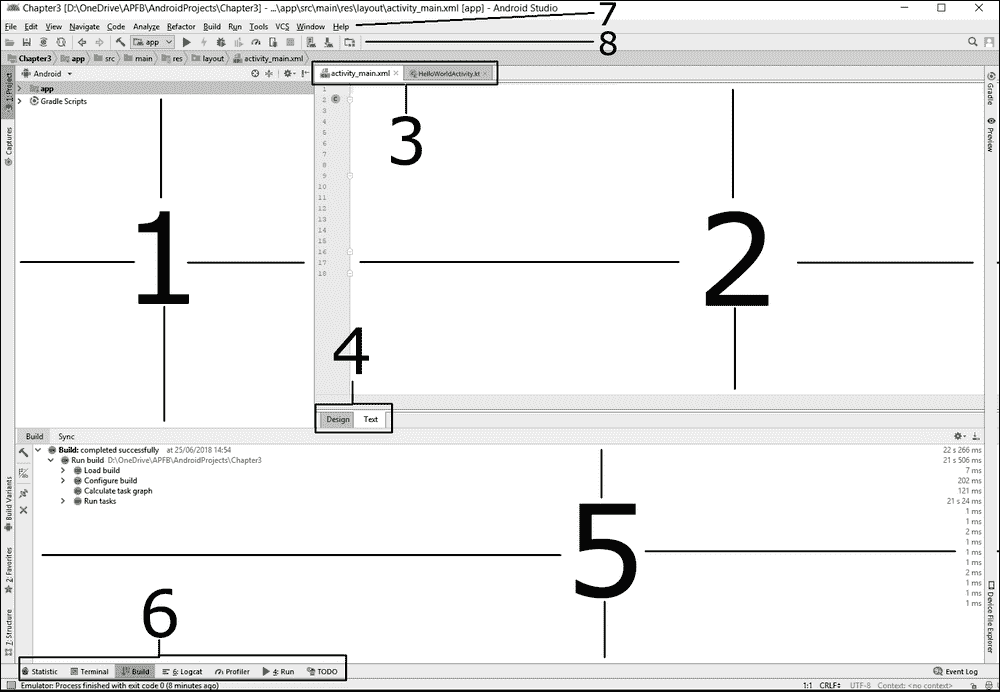

正式指出并命名安卓工作室**用户界面** ( **UI** )的各个部分会有用，这样我就可以通过名字来指代它们，而不是一直描述它们的位置和显示截图。那么，让我们从第 **1** 号开始浏览它们:

1.  This is the **Project** window and will be the main focus of this chapter. It enables us to explore the folders, code, and resources of the project and is also referred to as the Project Explorer window. Double-click on a file here to open the file and add a new tab to area **3** on the diagram. The structure of the files and folders here closely resembles the structure that will eventually end up in the finished APK file.

    ### 类型

    正如我们将看到的，虽然安卓项目的文件夹结构保持不变，但是文件、文件名和文件内容有很大的不同。因此，我们将在本章中探讨两个项目，然后在阅读本书的过程中查看更多项目。

2.  这是**编辑器**窗口。正如我们已经看到的那样，**编辑器**窗口根据我们正在编辑的内容呈现出几种不同的形式。如果我们正在编辑 Kotlin，那么我们可以看到我们的代码被整齐地格式化并准备好进行编辑；如果我们正在设计一个 UI，那么它要么为我们提供一个可视化的编辑视图，要么提供一个文本/XML 代码视图。您也可以在此窗口中查看和编辑图形和其他文件。
3.  这些选项卡允许我们在项目中的不同文件之间切换。**编辑器**窗口将显示我们在此选择的文件。我们可以通过双击**项目**窗口中的文件来为该部分添加另一个选项卡。
4.  这允许我们在当前正在编辑的文件的**设计**和**文本**(代码)视图之间切换。
5.  该窗口根据图表第 **6** 部分中选择的选项而变化。通常，在本书中，我们会在 **Build** 窗口和 **Logcat** 窗口之间切换，前者可以看到我们的项目已经编译并无错误地启动，后者可以查看调试输出以及来自我们的应用程序的任何错误或崩溃报告。
6.  用户界面的这个区域用于在第 **5** 部分描述的不同显示之间切换。

### 注

Android Studio 中甚至有更多的选项卡，但我们在本书的上下文中不需要它们。

现在我们知道如何明确地引用 UI 的各个部分，让我们将注意力转向**项目** / **项目浏览器**窗口。

# 项目探索者和项目解剖

当我们创建一个新的安卓项目时，我们通常使用项目模板，就像我们在[第 1 章](03.html "Chapter 1. Getting Started with Android and Kotlin")、*安卓入门和科特林*中所做的那样。我们使用的模板决定了安卓工作室将生成的文件的确切选择和内容。虽然所有项目都有值得注意的相似之处，但看到差异也有帮助。让我们构建两个不同的模板项目，并检查文件、它们的内容以及它们如何通过代码(XML 和 Kotlin)链接在一起。

## 空活动项目

带有自动生成用户界面的最简单的项目类型是**空活动**项目。在这里，用户界面是空的，但是可以添加到。也有可能生成一个完全没有 UI 的项目。当我们创建一个项目时，即使有一个空的用户界面，安卓工作室也会自动生成科特林代码来显示用户界面。因此，当我们添加它时，它就可以显示了。

让我们创建一个**空活动**项目。这几乎与我们在[第 1 章](03.html "Chapter 1. Getting Started with Android and Kotlin")、*安卓和柯特林*入门的过程相同，但有一点我要指出:

1.  在安卓工作室，选择**文件** | **新建** | **新建项目……**。
2.  在**选择项目**屏幕上，选择**空活动**模板，点击**下一步**。
3.  将**名称**字段更改为`Empty Activity App`。
4.  选择与上一个项目相同的包名称和保存位置。
5.  一定要选择 **Kotlin** 作为语言。
6.  如前所述，选中**使用安卓系统工件**复选框。
7.  剩下的设置可以保留默认设置，只需点击**下一步**。

安卓工作室将生成所有的代码和其他项目资源。现在我们可以看到已经生成的内容，并将其与我们在项目资源管理器窗口中预期的内容进行比较。

如果模拟器还没有运行，选择**工具** | **自动驾驶仪管理器**启动模拟器，然后在**安卓虚拟设备**窗口启动模拟器。单击快速启动栏中的播放按钮，在模拟器上运行应用程序:


看看这个应用，注意它和第一个项目有一点不同。它是，嗯，空的；顶部没有菜单，底部也没有浮动按钮。然而，它仍然有**你好世界！**文字:

### 注

不要担心引用第一个项目；我们将很快建造另一个类似的。

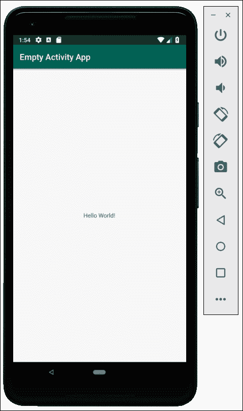

现在我们有了一个全新的**空活动 App** 项目，让我们探索安卓工作室为我们生成的文件和文件夹。

## 探索空活动项目

现在，是时候深入了解我们应用程序的文件和文件夹了。这将为我们节省大量的时间，并在本书的后面挠头。但是，请注意，不需要记住所有这些文件的位置，更不需要理解文件中的代码。事实上，XML 代码的一部分在本书的最后仍然是一个谜，但它不会阻止你设计、编码和发布惊人的应用程序。

创建项目后，查看项目资源管理器窗口:

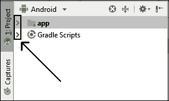

请注意上一张截图中显示的两个箭头。正如你可能猜到的，这些允许我们展开`app`和`Gradle Scripts`文件夹。

### 注

我们不需要在本书的上下文中探究`Gradle Scripts`文件夹。Gradle 是 Android Studio 的重要组成部分，但它的作用是向用户隐藏 Android Studio 执行的相当复杂的过程，例如添加资源文件、编译和构建项目。因此，我们不需要进一步深究。然而，如果你决定让安卓更上一层楼，那么充分了解 Gradle 及其与安卓工作室的关系是一个很好的时间投资。

我们将更详细地探索`app`文件夹。点击`app`文件夹旁边的箭头展开其内容，我们将开始探索。第一级内容显示在下面的屏幕截图中:

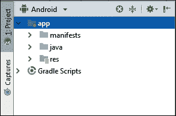

我们又展示了三个文件夹:`manifests`、`java`和`res`。让我们仔细看看这三个，从顶部开始。

### 注

我们将把我们的科特林代码保存在`java`文件夹中。另外，自 Android Studio 版本发布以来，也有一个名为`generatedjava`的文件夹，但我们不需要去探究。

### 清单文件夹

`manifests`文件夹里面只有一个文件。展开`manifests`文件夹，双击`AndroidManifest.xml`文件上的。请注意，该文件已在编辑器窗口中打开，并添加了一个选项卡，以便我们可以轻松地在该文件和其他文件之间切换。下面的截图显示了已经添加的新标签，以及包含在`manifests`文件夹内的`AndroidManifest.xml`文件中的 XML 代码:

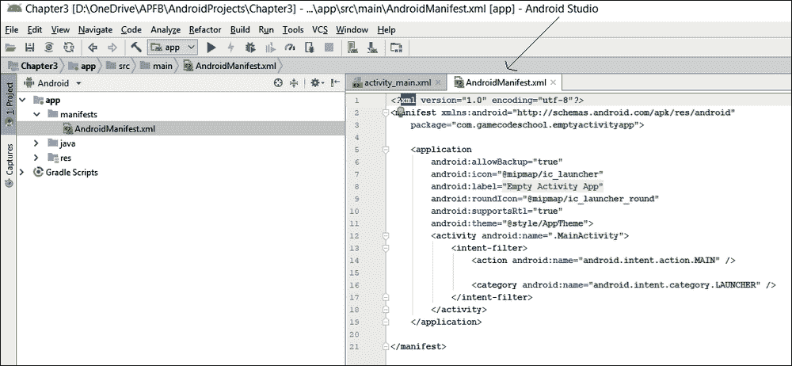

我们不需要理解这个文件中的所有内容，但是值得指出的是，我们会在这里偶尔进行修改，例如，当我们需要请求用户允许访问他们设备的某些功能时，例如消息应用程序或图像文件夹。当我们想要制作一个沉浸式的全屏应用程序时，比如一个游戏，我们也会编辑这个文件。

请注意，该文件的结构与我们在上一章中看到的布局文件的结构非常相似。例如，有以`<section name`开始，以`</section name>`结束的明确标注的部分。真实的例子有`<application`和`</application>`，还有`<activity`和`</activity>`。

事实上，除了第一行，整个文件内容都被包装在`<manifest`和`</manifest>`中。

就像我们在计算器中输入计算的括号一样，这些开始和结束部分必须匹配，否则文件会在我们的项目中导致错误。安卓工作室在行前缩进(即放置制表符)，以使这种结构中的部分及其深度更加清晰。

这段代码的一些具体部分值得注意，所以我将指出其中的一些行。

下面的行告诉安卓，我们希望在用户的应用抽屉/主屏幕中向用户显示的图标，以及他们可以用来启动应用的图标，包含在`mipmap`文件夹中，称为`ic_launcher`:

```kt
android:icon="@mipmap/ic_launcher"
```

当我们继续探索时，我们将亲自验证这一点。

下一条线有两个方面值得探讨。首先，它表示我们给我们的应用程序起的名字；其次，这个名字包含在一个带有标签`app_name`的**字符串**中:

```kt
android:label="@string/app_name"
```

### 类型

在编程中，包括 Kotlin 和 XML，字符串可以是任何字母数字值。我们将在整本书中学习更多关于字符串的知识，从第 7 章[、](09.html "Chapter 7. Kotlin Variables, Operators, and Expressions")、*柯特林变量、运算符和表达式*开始。

因此，我们可以猜测`app_name`标签的字母数字值是`Empty Activity App`，因为这就是我们创建应用程序时所说的。

这听起来可能不寻常，但是我们很快就会看到这个文件及其标签。而且，在以后的项目中，我们会给它添加更多的标签和值。我们也将逐渐理解为什么我们会在应用程序中添加文本，在这个阶段，这似乎是一种复杂的方式。

我们可以讨论`AndroidManifest.xml`文件中的每一行，但我们不需要。让我们看看另外两行，因为它们是相互关联的。下面一行表示我们活动的名称，它是在我们创建项目时自动生成的。我突出了活动名称，只是为了让它显得突出:

```kt
<activity android:name=".MainActivity">
```

出现在`<activity`和`</activity>`标签中的下面一行表示它是`activity`文件的一个属性。这告诉我们，这个活动是应用启动时应该运行的活动；是`LAUNCHER`:

```kt
<category android:name="android.intent.category.LAUNCHER" />
```

这意味着我们的应用程序可以有多个活动。很多时候，如果你的应用有多个屏幕，比如主屏幕或设置屏幕，这些屏幕是由多个活动类**实例**构建的。

### 注

在 XML 中，比如`AndroidManifest`文件，`activity`是小写的；但是在科特林，`Activity`类有一个大写的`A`。这只是惯例，没什么好担心的。

正如你刚刚看到的，在 XML 中`activity`有一个`name`属性，它的值引用了一个柯特林`Activity`的实例。

现在让我们进入`java`文件夹。

### Java 文件夹

在这里，我们将找到所有的科特林代码。首先，这个只有一个文件，但是随着我们项目的进一步发展，我们会增加更多。展开`java`文件夹，会发现还有三个文件夹，如下图截图所示:

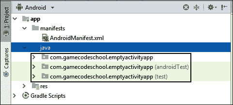

对于这本书，我们只需要这三个文件夹中的一个；也就是最上面的那个。这些文件夹的名称由包名(在我们创建应用程序时选择)和应用程序名组成，应用程序名以小写表示，没有空格(这也是在我们创建应用程序时选择的)。

### 类型

有多个同名文件夹的原因是由于自动化测试，这超出了本书的范围。因此，您可以放心地忽略以`(androidTest)`和`(test)`结尾的文件夹。

我们对这本书唯一感兴趣的文件夹是顶层文件夹，对于这个应用(在我的屏幕上)来说是`com.gamecodeschool.emptyactivityapp`。根据您选择的软件包名称和我们当前正在使用的应用程序的名称，文件夹名称将会更改，但它将始终是我们需要访问并添加或编辑其内容的顶级文件夹。

现在展开`com.gamecodeschool.emptyactivityapp`(或者你的名字)文件夹查看它的内容。在下面的截图中，您可以看到该文件夹只有一个文件:

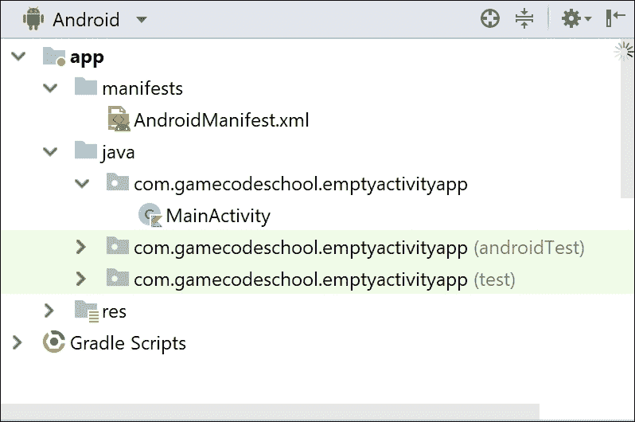

它是`MainActivity.kt`文件，尽管文件扩展名没有显示在项目窗口中，尽管它在编辑器窗口上方的选项卡中。事实上，这本书的`java/packagename.appname`文件夹中的所有文件都有`.kt`扩展名。

如果您双击`MainActivity.kt`文件，它将在编辑器窗口中打开，尽管我们可以单击编辑器窗口上方的`MainActivity.kt`选项卡。随着我们向项目中添加更多的 Kotlin 文件，知道它们保存在哪里将会很有用。

检查`MainActivity.kt`文件，你会看到它是我们在第一个项目中使用的柯特林文件的简化版本。都是一样的，只是`onCreate`功能的功能少，代码少。功能缺失是因为 UI 比较简单，不需要；因此，安卓工作室没有生成它们。

参考一下下面截图中`MainActivity.kt`文件的内容:

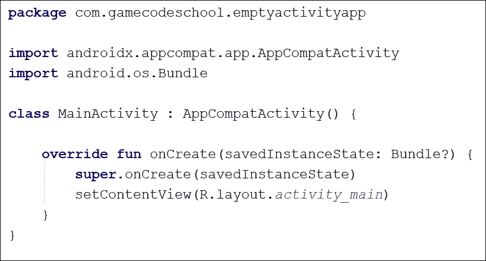

文件还有`onCreate`功能，在 app 运行的时候运行，但是里面的代码少了很多，`onCreate`是唯一的功能。看看`onCreate`函数的最后一行代码，我们将在继续探索`res`文件夹之前讨论一下。下面是正在讨论的代码行:

```kt
setContentView(R.layout.activity_main)
```

代码正在调用名为`setContentView`的函数，并将一些数据传递到`setContentView`中，供`setContentView`函数中的代码使用。传递给`setContentView`的数据是`R.layout.activity.main`。

目前我只提一下`setContentView`功能是安卓 API 提供的，是为用户准备和显示 UI 的功能。那么，`R.layout.activity_main`到底是什么？

让我们通过浏览`res`文件夹来了解一下。

### RES 文件夹

`res`文件夹是所有资源的去处。左键单击展开`res`文件夹，我们将检查里面有什么。这是`res`文件夹中最顶层文件夹的截图:

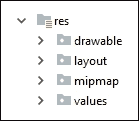

让我们从列表的顶部开始；也就是`drawable`文件夹。

### 资源/可绘制文件夹

这个名字透露了一些东西，但是`drawable`文件夹保存的不仅仅是图形。当我们阅读这本书时，我们确实会在这个文件夹中添加图形；然而，目前它只保存了两个文件。

这些文件是`ic_launcher_foreground`和`ic_launcher_background`。我们不会检查这些文件，因为我们永远不需要修改它们，但我会很快提到它们是什么。

如果你打开这些文件，你会发现它们相当长而且技术性很强。它们包括坐标、颜色等列表。它们就是所谓的**图形遮罩**。

它们是安卓用来适配或屏蔽其他图形的；在这种情况下，应用程序的启动器图标。这些文件是安卓如何调整应用启动器图标的说明。

这个系统是可以使用的，这样不同的设备制造商可以创建自己的面具来适应自己的安卓设备。默认情况下位于`drawable`文件夹中的蒙版(`ic_launcher_foreground`和`ic_launcher_background`)是默认的自适应蒙版，为启动器图标添加视觉上令人愉悦的阴影和深度。

### 类型

如果你对自适应图标的概念感兴趣，那么你可以在[https://developer . Android . com/guide/practices/ui _ guidelines/icon _ design _ adaptive](https://developer.android.com/guide/practices/ui_guidelines/icon_design_adaptive)的安卓开发者网站上参考一个完整且非常直观的解释。

现在我们已经对`drawable`了解得够多了，接下来我们继续`layout`。

### 资源/布局文件夹

展开`layout`文件夹，您会看到我们在上一章中编辑过的熟悉的布局文件。这次内容少了，因为我们生成了一个空活动项目。它并不完全是空的，因为它仍然有一个包装着“T2”小部件的“T1”布局，上面写着“T3”。

一定要看内容——你会发现它看起来和你想象的一样，但这里感兴趣的不是内容。仔细看看文件的名称(没有 XML 文件扩展名):`activity_main`。

现在回想一下`MainActivity.kt`文件中的 Kotlin 代码。下面是设置 UI 的代码行；我强调了代码的一部分:

```kt
setContentView(R.layout.activity_main);
```

`R.layout.activity_main`代码确实是对`res` / `layout`文件夹中`activity_main`文件的引用。这是我们的科特林代码和我们的 XML 布局/设计之间的联系。

第一个项目有的区别；在第一个项目的`layout`文件夹中，还有一个附加文件。在本章的后面，我们将使用第一章中使用的相同模板(基本活动)来构建另一个项目，以了解原因。

在此之前，让我们探索最后两个文件夹及其所有子文件夹，从列表中的下一个开始，`mipmap`。

### RES/MIP map 文件夹

`mipmap`文件夹很简单——也就是说，*相当的*简单。展开文件夹以查看其内容，如下图所示:

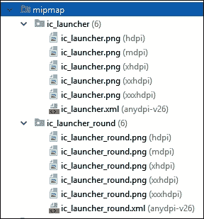

在这里，你可以看到两个子文件夹；它们是`ic_launcher`和`ic_launcher_round`。`ic_launcher`的内容包括我们在设备的应用抽屉/主屏幕中看到的常规启动器图标的图形，而`ic_launcher_round`保存使用圆形图标而不是方形图标的设备的图形。双击每个文件夹中的一个`.png`文件进行查看。为了帮助我们的讨论，我在这张截图中并排做了一张图片:


你可能也在想为什么每个文件夹里有五个`ic_launcher….png`文件。这样做的原因是提供适合不同尺寸和屏幕分辨率的图标是很好的做法。通过提供具有`hdpi`、`mdpi`、`xhdpi`、`xxhdpi`和`xxxhdpi`资格的图像，不同的安卓设备可以选择最适合用户的图标。

### 注

字母`dpi`代表**每英寸点数**，前缀`h`、`m`、`xh`、`xxh`、`xxxh`代表高、中、特高、特高等等。这些被称为**限定符**，当你阅读这本书的时候，你会发现安卓有很多限定符，这有助于我们构建应用程序，以适应用户可以选择的各种不同设备。

`mipmap`文件夹的最后一个难题是，两个子文件夹中的每一个都有一个 XML 文件。打开其中一个，您会看到它们引用了我们在`drawable`文件夹中查看的`ic_launcher_foreground`和`ic_launcher_background`文件。这告诉安卓设备从哪里获取自适应图标的细节。这些文件不是必需的，但是它们使图标看起来更好，并且增加了外观的灵活性。

我们还有一个文件夹及其所有文件需要探索，然后我们将最终了解一个安卓应用程序的结构。

### 资源/值文件夹

打开`res` / `values`文件夹，展示三个文件，我们将依次简单介绍。所有这些文件相互链接，并引用我们已经看到的其他文件。

为了完整起见，这里是`res` / `values`文件夹中三个文件的截图:

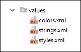

理解的关键不在于记忆连接，当然也不在于试图记忆甚至理解文件中的代码，而在于了解到目前为止我们所看到的所有文件和代码的内在联系。

让我们一次浏览一个文件。

#### colors . XML 文件

接下来，看一下`colors.xml`文件的内容:

```kt
<?xml version="1.0" encoding="utf-8"?>
<resources>
    <color name="colorPrimary">#008577</color>
    <color name="colorPrimaryDark">#00574B</color>
    <color name="colorAccent">#D81B60</color>
</resources>
```

请注意，开始和结束标记采用了我们从 XML 文件中得到的常见模式。有一个开始`<resources>`标签和一个结束`</resources>`标签。作为资源的孩子，有三对`<color> … </color>`标签。

在每个`color`标签中包含一个`name`属性和一些由数字和字母组成的看起来很奇怪的代码。`name`属性是一种颜色的名称。在接下来的另一个文件中，我们将看到这个文件中的各种名称是从另一个文件中引用的。

代码是定义实际颜色本身的东西。因此，当提到名称时，相关代码定义的颜色就是屏幕上产生的颜色。

### 注

该代码被称为十六进制代码，因为在代码的每个位置，可以使用值`0`到`9`和字母`a`到`f`，给出 16 个可能的值。如果您想了解更多关于 hex `colors`的信息，请访问[http://www.color-hex.com/color-wheel/](http://www.color-hex.com/color-wheel/)。如果你对数字基数很感兴趣，比如十六进制(基数 16)、二进制(基数 2)等等，那么看看这篇文章，它解释了它们，并讨论了为什么人类通常使用基数 10:[https://betterexplained.com/articles/numbers-and-bases/](https://betterexplained.com/articles/numbers-and-bases/)。

我们将在后面看到这些名称的引用位置。

#### 字符串. xml 文件

大多数现代应用程序都是为尽可能多的受众制作的。此外，如果应用程序有很大的规模或复杂性，那么软件公司中的角色通常被分成许多不同的团队。例如，为安卓应用程序编写科特林代码的人很可能与设计用户界面的布局没有什么关系。

通过将应用程序的内容与应用程序的编程分开，可以更容易地随时进行更改，并且还可以为多种不同的语言创建内容，而无需更改每种语言的 Kotlin 代码。

看看`strings.xml`文件的以下内容:

```kt
<resources>
    <string name="app_name">Empty Activity App</string>
</resources>
```

你可以看到，在现在熟悉的`<resources>…</resources>`标签里面，有一个`<string>…</string>`标签。在`string`标签中，有一个名为`name`的属性，它有一个`app_name`值，然后还有一个`Empty Activity App`值。

让我们再看一下文件中的一行，我们之前在清单文件夹部分已经探讨过了。有问题的行显示在下面的代码中，但是如果您想查看该行的完整上下文，请参考 Android Studio 中的文件本身:

```kt
android:label="@string/app_name"
```

`android:label`属性被赋予一个值`@string/app_name`。在安卓系统中，`@string`指的是`strings.xml`文件中的所有字符串。在这个特定的应用程序中，带有`app_name`标签的`string`属性具有`Empty Activity App`值。

因此，之前显示的`AndroidManifest.xml`文件中的代码行在应用运行时，在屏幕上有以下效果:


虽然这个系统一开始看起来很复杂，但实际上，它将设计和内容从编码中分离出来，这是非常有效的。如果设计者想更改应用的名称，只需编辑`strings.xml`文件即可。没有必要与 Kotlin 程序员交互，如果应用程序中的所有文本都是作为字符串资源提供的，那么随着项目的进行，所有文本都可以很容易地被修改和改编。

安卓通过允许开发人员为每种语言和地区的字符串资源使用不同的文件，进一步提高了的灵活性。这意味着开发者可以用完全相同的柯特林代码迎合一个充满快乐用户的星球。Kotlin 程序员只需要引用一个字符串资源的`name`属性，而不是**硬编码**文本本身，然后其他部门就可以设计文本内容，处理翻译等任务。我们将在[第 18 章](20.html "Chapter 18. Localization") *本地化*中制作一个多语种的 app。

### 注

可以将实际文本直接硬编码到 Kotlin 代码中，而不是使用字符串资源，大多数时候，我们这样做是为了轻松演示一些 Kotlin 代码，而不会因为编辑或添加到`strings.xml`文件而陷入困境。

我们对`strings.xml`了解得足够多，可以进入我们将为空项目模板探索的最终文件。

#### 样式. xml 文件

在这里，您可以看到这个项目模板的互连拼图的各个部分终于走到了一起。研究`styles.xml`文件和中的代码，然后我们可以讨论它:

```kt
<resources>
<!-- Base application theme. -->
<style name="AppTheme" 
parent="Theme.AppCompat.Light.DarkActionBar">
   <!-- Customize your theme here. -->
   <item name="colorPrimary">@color/colorPrimary</item>
   <item name="colorPrimaryDark">@color/colorPrimaryDark</item>
   <item name="colorAccent">@color/colorAccent</item>
</style>
</resources>
```

这是另一个资源文件，但它指的是我们之前看到的`colors.xml`文件。请注意，有一个`style`标签，它包含多个`item`标签；每个`item`标签都有一个名称，如`colorPrimary`、`colorPrimaryDark`或`colorAccent`。然后，这些名称中的每一个都被赋予一个值，例如`@color/colorPrimary`。

你可能想知道发生了什么；`@color`指的是`colors.xml`文件，`colorPrimary`、`colorPrimaryDark`和`colorAccent`指的是该文件中用它们的十六进制值定义的实际颜色。但是为什么要费心创建颜色并给它们命名，然后在另一个文件中定义`item`实例并将这些颜色分配给`item`实例呢？为什么不直接给每个`item`分配十六进制颜色值呢？

看一看代码块顶部的，了解这种明显不必要的复杂背后的原因。我再次展示了相关的行代码，这样我们可以更容易地讨论它们:

```kt
<style name="AppTheme" 
parent="Theme.AppCompat.Light.DarkActionBar">
```

事情是这样的，项目已经被定义，并且项目包含在一个`style`元素中。可以看到，样式叫做`AppTheme`。此外，这种风格有一个名为`Theme.AppCompat.Light.DarkActionBar`的母体。

系统允许设计者选择颜色，然后在`colors.xml`文件中定义它们。然后，他们可以进一步构建以不同组合使用这些颜色的风格——每个应用程序通常会有不止一种风格。样式可以进一步与主题相关联(`parent = "…"`)。这个父主题可以是完全由应用设计师的风格和颜色设计的主题，也可以是安卓的默认主题之一，比如`Theme.AppCompat.Light.DarkActionBar`。

然后，用户界面设计者可以简单地引用`AndroidManifest.xml`文件中的一种样式，如下行所示:

```kt
android:theme="@style/AppTheme"
```

然后，用户界面设计者可以愉快地调整颜色和它们的使用位置(项目)，而不会干扰科特林代码。这也允许在不改变实际布局文件(在本例中为`activity_main.xml`)的情况下，为世界的不同区域创建不同的样式。

比如在西方文化中，绿色可以代表自然、正确等主题；在许多中东国家，绿色代表生育能力，是与伊斯兰教相关的颜色。虽然你可以在这两个地区分发绿色产品，但你的应用会有很大的不同。

如果你随后在印度尼西亚推出你的应用程序，你会发现绿色在许多印尼人(尽管不是所有人)中被文化鄙视。接下来，如果你在中国推出，你会发现绿色与不忠的配偶有潜在的负面含义。这是一个典型的程序员永远学不会导航的雷区。而且，幸运的是，由于我们可以在 Android Studio 中划分责任的方式，他们不需要学习。

因此，颜色、风格和主题是非常专业的主题。虽然我们不会比快速进军绿色领域更深入地探索，但希望您能看到将编程、布局、颜色和文本内容的责任分开的系统的好处。

### 类型

我认为在这一点上也值得一提的是，图像也可以分为不同的地区，这样不同地区的用户在同一个应用程序中可以看到不同的图像。如果你想知道，是的，这意味着为每个地区提供不同的分辨率(如`hdpi`和`xhdpi`等)。

还值得一提的是不需要单独迎合每个地区，完全有可能生产出一款让成千上万甚至上百万用户都喜欢的神奇应用。然而，即使我们不打算雇佣设计师、翻译和文化专家组成的团队，我们也必须在这个为他们设计的系统中工作，这就是我们如此深入的原因。

在这个阶段，我们已经很好地掌握了安卓项目中的内容以及它们是如何链接在一起的。现在让我们再构建一个应用程序，看看不同的应用程序模板对安卓工作室生成的底层文件有何不同。

# 基本活动项目

具有自动生成的用户界面的下一个最简单的项目类型是基本活动项目。这是我们在[第 1 章](03.html "Chapter 1. Getting Started with Android and Kotlin")、*安卓入门和科特林*中创建的同一类型的项目。现在请随意打开该项目，但建议生成一个新项目，这样我们就可以检查它，而不会有任何更改和添加影响讨论。

让我们创建一个基本活动项目，如下所示:

1.  在安卓工作室，选择**文件** | **新建** | **新建项目……**。
2.  在**选择项目**屏幕上，选择**基本活动**模板，点击**下一步**。
3.  将**名称**字段更改为`Basic Activity App`。
4.  选择相同的包名，并将位置保存为上一个项目中的位置。
5.  一定要选择 **Kotlin** 作为语言。
6.  如前所述，选中**使用安卓系统工件**复选框。
7.  其余的设置可以保留默认值，只需点击**下一步**。

现在我们可以深入研究这些文件了。我们不会像在“空活动”项目中一样详细地看待每件事；我们只看差异和多余的部分。

## 探索基础活动项目

我们先对比一下的科特林代码。看看代码编辑器中的`MainActivity.kt`选项卡。它们都包含一个名为`MainActivity`的类。区别在于功能的数量和`onCreate`功能的内容。

如前所述，基本活动项目比空活动项目有更多的内容。

### 类型

你可以打开任意多的安卓工作室实例。如果要并排比较项目，选择**文件** | **打开**选择项目，然后在出现提示时，选择**新窗口**打开项目，不关闭任何已经打开的项目。

第一个区别是`onCreate`函数中有一些额外的代码。

### main activity . kt 文件

我在第 2 章、*柯特林、XML 和用户界面设计器*中非常简短地提到了，柯特林代码和XML 代码中存在的互连。让我们浏览一下资源文件，指出这段 Kotlin 代码指向的 XML 文件。

以下是来自`onCreate`功能的相关 Kotlin 代码；我稍微修改了格式，使它在书中更易读:

```kt
setSupportActionBar(toolbar)

fab.setOnClickListener { view ->
   Snackbar.make(view, "Replace with your own action",
               Snackbar.LENGTH_LONG)
               .setAction("Action", null).show()
}
```

全面理解这段代码将需要更多的章节，但是指出这段代码在资源中使用文件的地方只需要一点时间，然后会让我们更加了解组成我们项目的组件。

代码指的是比空活动项目多两个资源。第一个是`toolbar`，第二个是`fab`，两者都引用了一个我们接下来会看到的 XML 文件。

如果您在项目窗口中打开`res` / `layout`文件夹，您可以看到事情看起来与它们在空活动项目中的情况略有不同:

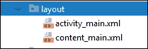

现在有两个文件是自动生成的。我们将浏览`content_main.xml`文件，并了解为什么很快就需要它。

### activity _ main . XML 文件

现在，打开`activity_main.xml`文件，你会看到有一些元素可以同时代表`toolbar`和`fab`。通过引用这些元素，科特林代码正在设置工具栏和浮动动作栏，以备使用。正如我们所料，XML 代码描述了它们的样子。

下面是工具栏的 XML 代码:

```kt
<androidx.appcompat.widget.Toolbar
   android:id="@+id/toolbar"
   android:layout_width="match_parent"
   android:layout_height="?attr/actionBarSize"
   android:background="?attr/colorPrimary"
   app:popupTheme="@style/AppTheme.PopupOverlay" />
```

请注意，它指的是一种`Toolbar`、一种颜色和一种样式，以及其他一些。这是以`android:id…`开头的一行，它声明了一个类型为`Toolbar`的小部件及其`@+id/toolbar`值，这使得它可以通过科特林代码中的`toolbar`实例名进行访问。

为清晰起见，这是实际工作应用程序中的工具栏:


这里是浮动动作按钮的 XML 代码。我已经将第一行代码稍微重新格式化为两行:

```kt
<com.google.android.material.floatingactionbutton.
         FloatingActionButton

   android:id="@+id/fab"
   android:layout_width="wrap_content"
   android:layout_height="wrap_content"
   android:layout_gravity="bottom|end"
   android:layout_margin="@dimen/fab_margin"
   app:srcCompat="@android:drawable/ic_dialog_email" />
```

注意它有一个`fab`的`id`属性。正是通过这个`id`属性，我们可以访问科特林代码中的浮动操作按钮。

现在，我们的 Kotlin 代码中的`fab`可以直接控制浮动动作按钮及其所有属性。在[第 13 章](15.html "Chapter 13. Bringing Android Widgets to Life") *将安卓小部件带入生活*中，我们将详细学习如何做到这一点。

这里是实际 app 中的浮动动作按钮:


很明显我没有详细解释代码；现阶段没有意义。相反，记下相互联系，如下所示:

*   XML 文件可以引用其他 XML 文件。
*   Kotlin 可以引用 XML 文件(我们很快就会看到，也可以引用其他 Kotlin 文件)。
*   在 Kotlin 中，我们可以通过它的`id`属性获取对一个 XML 文件中用户界面特定部分的控制。

从这个文件中我们已经看得够多了；让我们继续看剩下的文件。

### main activity . kt 中的额外功能

那么函数是做什么的，什么时候调用，到底是谁调用的呢？

下一个区别是这个额外的功能，如下所示:

```kt
override fun onCreateOptionsMenu(menu: Menu): Boolean {
  // Inflate the menu; this adds items to 
  // the action bar if it is present.
  menuInflater.inflate(R.menu.menu_main, menu)
  return true
}
```

该代码准备(膨胀)在`menu_main.xml`文件中定义的菜单。而且，就像`onCreate`一样，函数被覆盖，直接被操作系统调用。

然后还有另一个功能，如下所示:

```kt
override fun onOptionsItemSelected(item: MenuItem): Boolean {
  // Handle action bar item clicks here. The action bar will
  // automatically handle clicks on the Home/Up button, so long
  // as you specify a parent activity in AndroidManifest.xml.
  return when (item.itemId) {
        R.id.action_settings -> true
        else -> super.onOptionsItemSelected(item)
  }
}
```

该函数也被覆盖，并由操作系统直接调用。它处理发生的事情`when`用户从菜单中选择一个项目(或选项)。目前，它只处理一个选项，即设置选项，并且目前不采取任何行动。

上述代码确定是否单击了设置菜单选项；如果是，则代码执行时的`return`，控制返回到应用程序被用户点击**设置**菜单选项中断之前正在执行的部分。我们将在[第 8 章](10.html "Chapter 8. Kotlin Decisions and Loops")、*柯特林决策和循环*中了解更多关于柯特林`when`关键字的信息。

我们现在几乎知道得够多了；不要担心记住所有这些联系。我们将回到每一个联系，更深入地调查，巩固我们对每个联系的理解。

那么，为什么我们需要`res` / `layout`文件夹中的第二个文件呢？

### content _ main . XML 文件

文件在`R.layout.activity_main`上调用`setContentView`。然后，依次`activity_main`突出显示了这一行代码:

```kt
…
</com.google.android.material.appbar.AppBarLayout>

<include layout="@layout/content_main" />

<com.google.android.material.floatingactionbutton
  .FloatingActionButton
…
```

高亮显示的行代码做`include``content_main`文件。因此，就在应用程序栏被添加到布局之后，执行分支到`content_main`，在那里它的所有 XML 代码被转换成用户界面；然后，执行回到`activity_main`，浮动动作栏添加到布局中。当我们构建一些整洁的滚动`CardView`布局并将定义`CardView`的代码与`CardView`的实际内容分开时，我们将使用[第五章](07.html "Chapter 5. Beautiful Layouts with CardView and ScrollView")和*中的`include`以及卡片视图和滚动视图*。

# 探索安卓模拟器

随着我们的进展，确切地熟悉如何使用安卓模拟器会有所帮助。如果你没有使用最新版本的安卓系统，一些实现简单任务的方法(比如查看所有应用程序)可能会与你当前设备的工作方式不同。此外，我们想知道如何使用所有仿真器附带的额外控件。

## 仿真器控制面板

您可能在运行模拟器时注意到了模拟器旁边出现的迷你控制面板。让我们来看看一些最有用的控件。看看这个模拟器控制面板的截图。为了帮助讨论，我对它进行了注释:

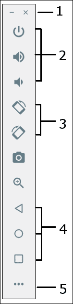

我将只提到更明显的控制，并在必要时深入讨论:

1.  这些是窗口控件。它们最小化或关闭模拟器窗口。
2.  从上到下，第一个按钮用于关闭仿真器，以模拟关闭实际设备。接下来的两个图标会提高和降低音量。
3.  These two buttons allow you to rotate the emulator both left and right. This means that you can test what your app looks like in all orientations, as well as how it handles orientation changes while the app is running. The icons immediately underneath these take a screenshot and zoom in, respectively. Here is the emulator after being rotated horizontally:

    

4.  这些图标模拟后退按钮、主页按钮和查看正在运行的应用程序按钮。玩一玩这些按钮——我们需要不时地使用它们，包括在[第 6 章](08.html "Chapter 6. The Android Lifecycle")、*安卓生命周期*中。
5.  Press the button labelled **5** in the annotated image to launch the advanced settings menu, where you can interact with things such as sensors, GPS, the battery, and the fingerprint reader. Have a play around with some of these settings if you are curious:

    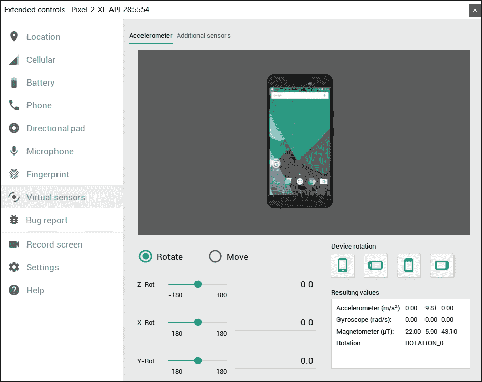

让我们玩一下模拟器本身。

## 将仿真器用作真实设备

模拟器可以模拟真实手机的每一个功能，所以可以单独在上面写一整本书。如果你想写你的用户喜欢的应用程序，那么了解一系列安卓设备是非常值得花时间去做的。我只想在这里指出几个最基本的特点，因为没有这些基本的互动，就很难跟得上这本书。此外，如果你有一个旧的安卓设备，那么一些基本的东西(比如访问应用抽屉)已经改变了，你可能会有点困惑。

### 访问应用抽屉

按住主屏幕底部的鼠标光标，向上拖动即可访问应用抽屉(包含所有应用)；下面的截图显示了这个操作的一半:


现在，您可以运行模拟器上安装的任何应用程序。请注意，当您通过安卓工作室运行您的应用程序之一时，它仍然安装在模拟器上，因此可以从应用程序抽屉中运行。但是，您在安卓工作室中对应用程序所做的每一个更改都将要求您通过单击安卓工作室快速启动栏上的播放按钮来再次运行或安装应用程序，就像我们一直在做的那样。

### 查看活动应用并在应用之间切换

要查看活动应用，可以使用模拟器控制面板，即模拟器控制面板截图上标注为数字 **4** 的方块。要使用手机屏幕访问相同的选项(就像在真实设备上一样)，向上滑动，就像访问应用程序抽屉一样，但只能在大约四分之一的屏幕长度内进行，如下图所示:


您现在可以通过左右滑动最近的应用程序，向上滑动应用程序以关闭它，或者点击后退按钮以返回到您查看该选项之前正在做的事情。一定要尝试一下，因为我们会在本书中经常用到这些基本特性。

# 总结

请记住，本章的目标是让我们熟悉安卓系统和结构以及一个安卓项目。安卓项目是 Kotlin 和大量资源文件的精心交织。资源文件可以包含 XML 来描述我们的布局、文本内容、样式和颜色，以及图像。可以针对世界上不同的语言和地区制作资源。我们将在整本书中看到和使用的其他资源类型包括主题和音效。

记住不同资源文件和 Kotlin 文件相互连接的所有不同方式并不重要。只需要意识到它们*是*互联的，并且还能够检查各种类型的文件，意识到它们何时依赖于另一个文件中的代码。每当我们创建从 Kotlin 代码到 XML 代码的连接时，我总是会再次指出连接的细节。

除了 Kotlin 之外，我们不需要学习 XML，但是在接下来的 25 章中，我们会对它有一点熟悉。Kotlin 将是本书的重点，但是我们的 Kotlin 代码将经常引用 XML 代码，所以理解并看到一些互连的例子将对您取得更快的进步大有裨益。

我们还探索了模拟器，以便在测试我们的应用程序时充分利用它。

在下一章中，我们将使用三种不同的安卓布局方案构建三种自定义布局。我们还将编写一些科特林代码，这样我们就可以通过点击按钮在它们之间进行切换。