# 第四章。布局和材料设计入门

我们已经看到了安卓工作室的用户界面设计器，以及更多的柯特林。在这一实践章节中，我们将构建另外三个布局——仍然非常简单，但比我们目前所做的工作更进一步。

在进入动手部分之前，我们先简单介绍一下**材料设计**的概念。

我们将研究另一种类型的布局，称为`LinearLayout`，并遍历它，使用它来创建一个可用的用户界面。我们将使用`ConstraintLayout`更进一步，既理解约束，又设计更复杂和精确的用户界面设计。最后，我们将与`TableLayout`见面，将数据排列在一个易于阅读的表格中。

我们还将编写一些科特林代码，在一个应用程序/项目中的不同布局之间切换。这是第一个将多个主题链接到一个整洁的包中的主要应用程序。这个应用叫做探索布局。

在本章中，我们将涵盖以下主题:

*   材料设计
*   建立一个`LinearLayout`并学习什么时候最好使用这个类型
*   构建另一个稍微高级一点的`ConstraintLayout`，了解更多关于使用约束的信息
*   建立`TableLayout`并用数据填充显示
*   在一个名为“探索布局”的应用程序中将所有内容链接在一起

首先是材料设计。

# 材料设计

你可能听说过材质设计，但是到底是什么呢？材料设计的目标很简单，就是实现漂亮的用户界面。然而，这也是为了让这些用户界面在安卓设备上保持一致。材料设计不是一个新的想法。它直接取自于纸笔设计中使用的设计原则，比如有视觉上令人愉悦的点缀，如阴影和深度。

材质设计使用了材质层的概念，您可以像在照片编辑应用程序中一样考虑材质层。一致性是通过一套原则、规则和指导方针来实现的。必须强调的是，材料设计是完全可选的，但也必须强调材料设计是有效的，如果你没有遵循它，很有可能你的设计会被用户不喜欢。毕竟，用户已经习惯了某种类型的用户界面，而这种用户界面很可能是使用材料设计原则创建的。

所以，材料设计是一个值得努力的标准，但是当我们学习材料设计的细节时，我们不能让它阻碍我们学习如何开始使用安卓。

这本书将专注于完成事情，同时偶尔指出材料设计何时会影响我们的工作方式，并为那些想立即更深入地了解材料设计的人指出进一步的资源。

# 探索安卓 UI 设计

我们会看到，通过安卓的 UI 设计，我们学到的很多东西都是上下文相关的。给定小部件的 x 属性影响其外观的方式可能取决于小部件的 y 属性，甚至取决于另一个小部件的属性。逐字逐句地学习这个不容易。最好是期望随着实践逐渐达到更好更快的效果。

例如，如果您通过将小部件拖放到设计中来使用设计器，则生成的 XML 代码将根据您使用的布局类型而有很大不同。我们将在本章中看到这一点。

这是因为不同的布局类型使用不同的手段来决定自己孩子的位置。例如，我们接下来要探索的`LinearLayout`，其工作方式与`ConstraintLayout`非常不同，后者是在[第 1 章](03.html "Chapter 1. Getting Started with Android and Kotlin")、*安卓入门和科特林*中默认添加到我们的项目中的。

这个信息最初可能看起来像是一个问题，甚至是一个坏主意，它肯定会有点尴尬。然而，我们将开始了解的是，这种明显丰富的布局选项及其个人怪癖是一件好事，因为它们给了我们几乎无限的设计潜力。很少有你能想象到的布局是不可能实现的。

然而，正如所暗示的，这种几乎无限的潜力带有一点复杂性。开始处理这个问题的最好方法是构建几个类型的工作示例。在这一章中，我们将看到三个——一个`LinearLayout`、一个`ConstraintLayout`和一个`TableLayout`。我们将看到如何使用视觉设计器的独特功能使事情变得更容易，我们还将关注自动生成的 XML，以使我们的理解更加全面。

# 布局

我们已经看到了但是还有更多。布局是将其他用户界面元素/小部件组合在一起的构件。布局本身可以并且经常包含其他布局。

让我们来看看安卓系统中一些常用的布局，因为了解不同的布局以及它们的优缺点会让我们更加意识到可以实现什么，因此会扩大我们对可能实现什么的视野。

我们已经看到，一旦我们设计了一个布局，我们就可以使用我们的 Kotlin 代码中的`setContentView`函数将它付诸行动。

让我们构建三种不同布局类型的设计，然后将`setContentView`投入工作并在它们之间切换。

# 创建探索布局项目

安卓系统中最困难的事情之一不仅仅是找出如何做某事，而是找出如何做其他事情。这就是为什么，在这本书里，除了向你展示如何做一些简单的事情，我们还会将许多主题链接到跨越多个主题和章节的应用程序中。**探索布局**项目是这种类型的第一个应用。我们将学习如何构建多种布局类型，同时将它们链接到一个便捷应用程序中:

1.  Create a new project in Android Studio. If you already have a project open, select **File** | **New Project**. When prompted, choose **Open in same window**, as we do not need to refer to our previous project.

    ### 类型

    如果你在安卓工作室的开始屏幕上，只需点击**开始一个新的安卓工作室项目**选项，就可以创建一个新的项目。

2.  选择**空活动**项目模板，因为我们将从头开始构建大部分 UI。点击**下一步**按钮。
3.  项目名称输入`Exploring Layouts`。
4.  其余的所有设置都与我们在前面三个项目中使用的设置相同。
5.  点击**完成**按钮。

看`MainActivity.kt`文件。以下是全部代码，不包括`import…`语句:

```kt
class MainActivity : AppCompatActivity() {

    override fun onCreate(savedInstanceState: Bundle?) {
        super.onCreate(savedInstanceState)
        setContentView(R.layout.activity_main)
    }
}
```

找到对`setContentView`的呼叫并删除整个线路。该行在前面的代码中突出显示。

这正是我们想要的，因为现在我们可以构建自己的布局，探索底层的 XML，并编写自己的 Kotlin 代码来显示这些布局。如果现在运行应用，只会出现一个带标题的空白屏幕；甚至没有一个 Hello World！消息。

我们将探索的第一种布局是`LinearLayout`。

# 用线性布局构建菜单

`LinearLayout`可能是安卓提供的最简单的布局了。顾名思义，里面所有的 UI 项都是线性布局的。你只有两个选择——垂直和水平。通过添加以下代码行(或通过属性窗口编辑)，您可以配置一个`LinearLayout`来垂直布局:

```kt
android:orientation="vertical"
```

然后你可以(正如你可能已经猜到的)将`"vertical"`改为`"horizontal"`来横向布局。

在我们使用`LinearLayout`做任何事情之前，我们需要向布局文件中添加一个。而且，当我们在这个项目中构建三个布局时，我们还需要一个新的布局文件。

## 向项目添加线性布局

在项目窗口中，展开`res`文件夹。现在右击`layout`文件夹，选择**新建**。注意**布局资源** **文件**有一个选项，如下图截图所示:

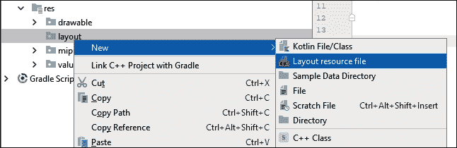

选择**布局资源文件**，会看到**新建资源文件**对话框窗口:

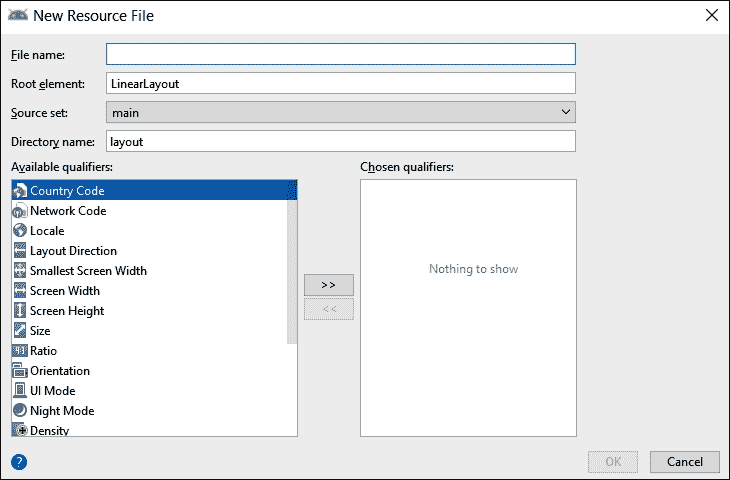

在**文件名**字段中，输入`main_menu`。名称是任意的，但是这个布局将是我们的“主”菜单，用于选择其他布局，所以名称似乎是合适的。

请注意，它已经选择了**线性布局**作为**根** **元素**选项。

点击**确定**按钮，安卓工作室将在一个名为`main_menu`的 XML 文件中生成一个新的`LinearLayout`，并将其放置在`layout`文件夹中，为我们构建新的主菜单界面做好准备。安卓工作室还将打开用户界面设计器，调色板在左边，属性窗口在右边。

## 准备您的工作空间

通过拖动和调整窗口的边框来调整窗口(在大多数窗口应用程序中可以这样做)，以使调色板、设计和属性尽可能清晰，但不要超过必要的大小。这个小截图显示了我选择的大致窗口比例，以便尽可能清晰地设计我们的用户界面和探索 XML。截图中的细节并不重要:

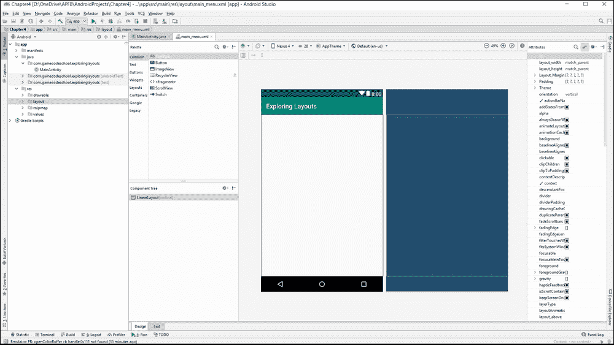

请注意，我已经使项目、调色板和属性窗口尽可能窄，但没有模糊任何内容。我还关闭了屏幕底部的 build/logcat 窗口，结果是我有了一个很好的清晰的画布来构建用户界面。

## 检查生成的 XML

点击**文本**标签，我们将看到在这个阶段形成我们设计的 XML 代码的当前状态。下面是我们可以进一步讨论的代码:

```kt
<?xml version="1.0" encoding="utf-8"?>
<LinearLayout 
   xmlns:android="http://schemas.android.com/apk/res/android"

 android:orientation="vertical" 
 android:layout_width="match_parent"
 android:layout_height="match_parent">

</LinearLayout>
```

我们有通常的开始和结束标签，正如我们可以预测的，它们是`<LinearLayout`和`</LinearLayout>`。还没有子元素，但是有三个属性。我们知道它们是`LinearLayout`的属性，而不是孩子，因为它们出现在第一次关闭`>`之前。为了清楚起见，定义这个`LinearLayout`的三个属性已经在前面的代码中突出显示了。

第一个属性是`android:orientation`，或者更简洁的说，我们只参考没有`android:`部分的属性。`orientation`属性的值为`vertical`。这意味着，当我们开始向这个布局添加项目时，它将从上到下垂直排列它们。我们可以将数值从`vertical`更改为`horizontal`，它将从左到右排列。

接下来的两个属性是`layout_width`和`layout_height`。这些决定了`LinearLayout`的大小。这两个属性的值都是`match_parent`。布局的父级是整个可用空间。因此，通过水平和垂直匹配父级，布局将填满整个可用空间。

## 向用户界面添加文本视图

切换回到**设计**选项卡，我们会给 UI 添加一些元素。

首先，在调色板中找到**文本视图**。这可以在**通用**和**文本**类别中找到。左键点击并拖动**文本视图**到用户界面上，注意它整齐地位于`LinearLayout`的顶部。

查看**文本**选项卡上的 XML，并确认它是`LinearLayout`的子级，并缩进一个选项卡以明确这一点。以下是`TextView`的代码，没有`LinearLayout`的周围代码:

```kt
<TextView
   android:id="@+id/textView"
   android:layout_width="match_parent"
   android:layout_height="wrap_content"
   android:text="TextView" />
```

注意它有四个属性:`id`，以防我们需要从另一个 UI 元素或者从我们的 Kotlin 代码中引用它；`layout_width`设置为`match_parent`，表示`TextView`横跨`LinearLayout`的整个宽度；一个`layout_height`属性被设置为`wrap_content`，这意味着`TextView`精确到足以包含其中的文本；最后，就目前而言，它有一个`text`元素，该元素决定了它将显示的实际文本，而这目前只是设置为`TextView.`

切换回设计选项卡，我们将进行一些更改。

我们希望这个文本成为这个屏幕的标题文本，这是主菜单屏幕。在属性窗口中，点击搜索图标，在搜索框中输入`text`，将**文本**属性改为`Menu`，如下图截图所示:

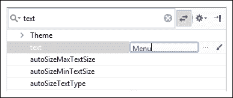

### 类型

您可以通过搜索或滚动选项来找到任何属性。找到要编辑的属性后，左键选中它，然后按键盘上的*回车*键使其可编辑。

接下来，使用您喜欢的搜索技术找到`textSize`属性，并将`textSize`设置为`50sp`。输入新值后，文本大小将会增加。

`sp`代表可缩放像素。这意味着，当用户在他们的安卓设备上更改字体大小设置时，字体将自动重新缩放。

现在，搜索**重力**属性，点击如下截图所示的小箭头展开选项:

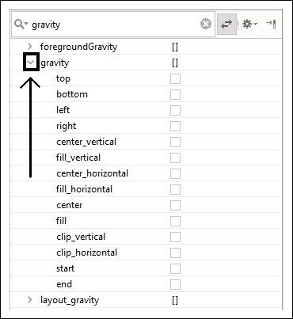

将**重心**设置为**中心水平，**为，如下图截图所示:

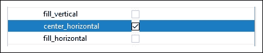

`gravity`属性指的是`TextView`本身内部的重力，我们的改变起到了将`TextView`内部的实际文字向中心移动的效果。

### 类型

注意`gravity`与`layout_gravity`不同。`layout_gravity`属性设置布局内的重力:在这种情况下，父级`LinearLayout`。我们将在本项目后期使用`layout_gravity`。

此时，我们已经更改了`TextView`的文本，增加了它的大小，并将其水平居中。用户界面设计器现在应该如下图所示:

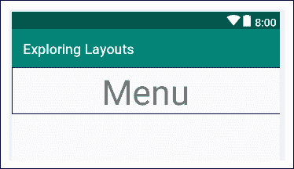

快速浏览一下**文本**标签，可以看到以下代码:

```kt
<TextView
   android:id="@+id/textView"
   android:layout_width="match_parent"
   android:layout_height="wrap_content"
   android:gravity="center_horizontal"
   android:text="Menu"
   android:textSize="50sp" />
```

可以看到新的属性如下:`gravity`，设置为`center_horizontal`；正文，已改为`Menu`；和`textSize`，设置为`50sp`。

如果你运行应用程序，你可能看不到你所期望的。这是因为我们没有在 Kotlin 代码中调用`setContentView`来加载 UI。您仍然会看到空白的用户界面。一旦我们在用户界面方面取得了一些进展，我们就会解决这个问题。

## 向用户界面添加多行文本视图

切换回**设计**选项卡，在调色板的**文本**类别中找到**多行文本**，并将其拖动到刚才我们添加的`TextView`下方的设计上。

使用您喜欢的搜索技术，将**文本**设置为`Select a layout type to view an example. The onClick attribute of each button will call a function which executes setContentView to load the new layout`。

您的布局现在将如下图所示:


您的 XML 将在`TextView`之后的`LinearLayout`中用另一个子元素更新，如下所示:

```kt
<EditText
   android:id="@+id/editText"
   android:layout_width="match_parent"
   android:layout_height="wrap_content"
   android:ems="10"
   android:inputType="textMultiLine"
   android:text="Select a layout type to view an example. 
         The onClick attribute of each button will call a function 
         which executes setContentView to load the new layout" />
```

您可以看到用户界面项目的细节，结果是**多行文本**调色板上的描述并不完全清楚这将是什么。看一下 XML 就会发现我们有一个`inputType`属性，表示这个文本可以被用户编辑。还有一个也是我们之前没有见过的属性，那就是`ems`。`ems`属性控制每行可以输入多少字符，`10`的值由安卓工作室自动选择。但是，另一个属性`layout_width="match_parent"`会覆盖该值，因为它会导致元素展开以适合其父元素；换句话说，覆盖屏幕的整个宽度。

当您运行该应用程序时(在下一部分)，您将看到文本确实是可编辑的——尽管对于这个演示应用程序来说，它没有任何实际用途。

# 用科特林代码连接用户界面(第 1 部分)

要实现一个互动 app，我们会做以下三件事:

1.  我们将从`onCreate`功能调用`setContentView`来显示我们运行应用程序时的用户界面进度。
2.  我们将编写另外两个自己的函数，每个函数将在不同的布局上调用`setContentView`(我们还没有设计)。
3.  然后，在本章的后面，当我们设计另外两个用户界面布局时，我们将能够在点击按钮时加载它们。

由于我们将构建一个`ConstraintLayout`和一个`TableLayout`，我们将分别调用我们的新函数，`loadConstraintLayout`和`loadTableLayout`。

让我们现在就这样做，然后我们将看到如何添加一些按钮来调用这些函数以及一些格式简洁的文本。

在`onCreate`功能中，添加以下高亮显示的代码:

```kt
override fun onCreate(savedInstanceState: Bundle?) {
   super.onCreate(savedInstanceState)

 setContentView(R.layout.main_menu)
}
```

代码使用`setContentView`功能加载我们当前正在处理的 UI。您现在可以运行该应用程序来查看以下结果:

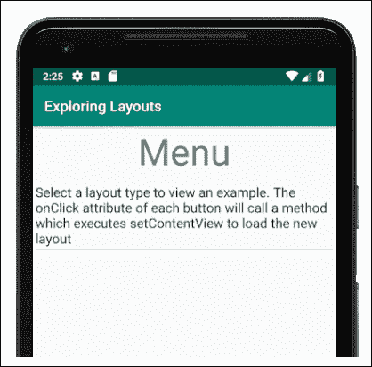

在`onCreate`函数之后的`MainActivity`类中添加这两个新函数:

```kt
fun loadConstraintLayout(v: View) {
  setContentView(R.layout.activity_main)
}

fun loadTableLayout(v: View) {
  setContentView(R.layout.my_table_layout)
}
```

第一个函数有一个错误，第二个函数有两个错误。首先我们可以通过添加`import`语句来修复，这样安卓工作室就知道`View`类了。左键点击`View`选择错误。按住 *Alt* 键，然后点击*进入*键。您将看到以下弹出窗口:

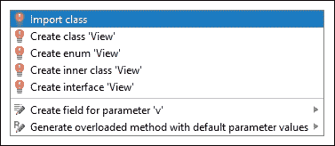

选择了**导入类**。错误现在已经消失了。如果您滚动到代码的顶部，您会看到我们刚才执行的快捷方式添加了一行新的代码。以下是新代码:

```kt
import android.view.View
```

安卓工作室不再认为`View`类是错误的。

然而，第二个函数仍然有一个错误。问题是函数调用`setContentView`函数加载新的 UI ( `R.layout.my_table_layout`)。由于该用户界面布局尚不存在，因此会产生错误。您可以注释掉这个调用来消除错误，直到我们创建文件并在本章后面设计用户界面布局。添加双正斜杠(`//`)，如以下代码所示:

```kt
fun loadTableLayout(v: View) {
  //setContentView(R.layout.my_table_layout)
}
```

现在我们可以添加一些按钮，我们可以点击这些按钮来调用我们的新功能，并加载我们即将构建的新布局。但是添加几个带有文本的按钮太容易了——我们以前就做过。我们要做的是用右边的按钮排列一些文本。问题是我们的`LinearLayout`将`orientation`属性设置为`vertical`，正如我们所看到的，我们添加到布局中的所有新零件都将垂直排列。

# 在布局中添加布局

以不同于其他元素的方向布局一些元素的解决方案是在布局中嵌套布局。下面是如何做到的。

从调色板的**布局**类别中，将一个**线性布局(水平)**拖到设计上，将其放置在**多行文本**的正下方。请注意**多行文字**下方有一个蓝色边框占据了所有空间:

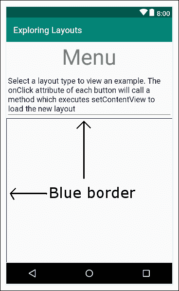

这表明我们新的**线性布局(水平)**正在填充空间。请记住这个蓝色边框区域，因为它是我们将在用户界面上放置下一个项目的地方。

现在，回到调色板的**文本**类别，将一个**文本视图**拖到我们刚刚添加的新`LinearLayout`上。请注意`TextView`如何依偎在新`LinearLayout`的左上角:

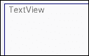

起初，这似乎与之前的垂直`LinearLayout`没有什么不同，它从一开始就是我们用户界面的一部分。但是看看当我们添加下一部分用户界面时会发生什么。

### 注

用于在布局内添加布局的术语是**嵌套**。安卓术语应用于任何出现在用户界面上的项目(例如按钮和文本)是**视图**，任何包含视图的都是**视图组。**由于术语**视图**和**视图组**并不总是在特定的上下文中明确它们的含义，我通常会具体地(如`TextView`、`Button`、`LinearLayout`)或更广泛地(用户界面元素、项目或小部件)引用用户界面的某些部分。

从**按钮**类别中，将一个**按钮**拖到上一个`TextView`的右侧。请注意，按钮位于文本的右侧，如下图所示:

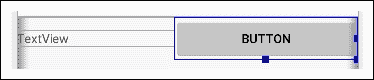

接下来，通过点击空白部分选择`LinearLayout`(水平部分)。找到`layout_height`属性并将其设置为`wrap_content`。注意`LinearLayout`现在只占用它需要的空间:

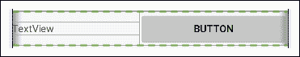

在添加下一部分用户界面之前，让我们配置`TextView`和`Button`的文本属性。将`Button`的`text`属性更改为`LOAD`。把我们新`TextView`的文字属性改成`Load ConstraintLayout`。

### 类型

你自己想好如何达到前面的指示了吗？什么事？太棒了！你现在已经熟悉了安卓视图的编辑属性。没有吗？左键单击要编辑的项目(本例中为`TextView`)，使用搜索图标进行搜索，或者在**属性**窗口中滚动找到要编辑的属性(本例中为`text` 属性)，选择该属性，按*回车*进行编辑。我现在可以对如何构建未来的用户界面项目给出更简洁的说明，这让你成为安卓忍者的旅程变得更快。

现在我们可以自己重复并在刚刚完成的另一个**线性布局(水平)**中添加另一个`TextView`和`Button`属性。为此，请按以下顺序执行这些步骤:

1.  在前一个布局的正下方添加另一个**线性布局(水平)**
2.  在新的`LinearLayout`中添加**文本视图**
3.  将`TextView`的`text`属性更改为`Load TableLayout`
4.  在`TextView`的右侧增加一个`Button`
5.  将`Button`的`text`属性更改为`LOAD`
6.  通过将`layout_height`属性更改为`wrap_content`来调整`LinearLayout`的大小

现在我们有了两个整齐(和水平)对齐的文本和按钮。

只是为了好玩，也为了更多地探索调色板，找到调色板的 **Widgets** 类别，并将一个**评级栏**拖到最终`LinearLayout`正下方的设计上。现在，您的用户界面应该非常类似于下面的截图:

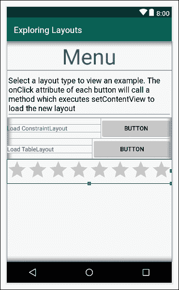

### 注

在前两张截图中，我还没有更改两个`Button`元素的`text`属性。其他的都应该和你的一样。

让我们为布局添加一些视觉上的收尾工作。

# 让布局看起来漂亮

在本节中，我们将探索更多控制用户界面细节的属性。你可能已经注意到用户界面在某些地方看起来有点拥挤，而在其他地方看起来不稳定和不对称。随着本书的进展，我们将不断增加我们的曲目，以改善我们的布局，但这些简短的步骤将介绍和处理一些基本问题:

1.  选择`Multiline Text`，然后展开`Padding`属性。将`all`选项设置为`15sp`。这使得文本外部周围有一个整洁的空间区域。
2.  要在`Multiline text`下方创建一个漂亮的空间，找到并展开`Layout_Margin`属性，将`bottom` 设置为`100sp`。
3.  在与按钮对齐/相关的两个`TextView` 小部件上，将`textSize`属性设置为`20sp`、`layout_gravity`设置为`center_vertical`、`layout_width`设置为`match_parent`、`layout_weight`设置为`.7`。
4.  在两个按钮上，将重量设置为`.3`。请注意，这两个按钮现在分别占据了宽度的`.3`和`LinearLayout`的文字`.7`，使得整个外观更加美观。
5.  在`RatingBar`上，找到`Layout_Margin`属性，然后将`left`和`right`设置为`15sp`。
6.  仍然使用`RatingBar`和`Layout_Margin`属性，将`top`更改为`75sp`。

您现在可以运行该应用程序并看到我们的第一个完整布局的全部荣耀:


请注意，您可以使用`RatingBar`进行游戏，尽管当应用程序关闭时，评级不会持续。

### 类型

通过读者挑战，找到一两个可以进一步改善`LoadConstraintLayout`和`LoadTableLayout`文本外观的属性。它们看起来有点靠近屏幕的边缘。请参考[第 5 章](07.html "Chapter 5. Beautiful Layouts with CardView and ScrollView")、*开头的“属性-快速总结”一节，以及“卡片视图”和“滚动视图”*。

不幸的是，按钮还没有任何作用。我们来解决这个问题。

# 用科特林代码连接用户界面(第 2 部分)

选择`Load ConstraintLayout`文本旁边的按钮。找到的`onClick`属性并将其设置为`loadConstraintLayout`。

选择`Load TableLayout`文本旁边的按钮。找到`onClick`属性并将其设置为`loadTableLayout`。

现在按钮会调用函数，但是`loadTableLayout`函数内部的代码被注释掉了，以免出错。请随意运行该应用程序，点击`loadConstraintLayout`按钮即可切换到`ConstraintLayout`。但是它只有一条**你好世界**的信息。

我们现在可以继续建造这个了。

# 使用约束布局构建精确的用户界面

打开在我们创建项目时自动生成的`ConstraintLayout`。它可能已经在编辑器顶部的选项卡中了。如果没有，它将在`res` / `layout`文件夹中。它的名字叫`activity_main.xml`。

检查**文本**标签中的 XML，注意它是空的，除了一个写着`Hello World`的`TextView`。切换回**设计**页签，左键点击`TextView`选择，点击*删除*键去掉。

现在我们可以为自己构建一个简单而复杂的用户界面。当您想要非常精确地定位用户界面的一部分和/或相对于其他部分时，`ConstraintLayout`非常有用。

## 添加日历视图

首先，查看调板的**小部件**类别，找到`CalenderView`。将`CalenderView`拖放到顶部附近，水平居中。当您拖动`CalenderView`时，请注意它会跳到/捕捉到特定位置。

还要注意视图对齐时显示的细微视觉提示。我在下面的截图中突出显示了水平居中的视觉提示:


水平居中时放开，如截图所示。现在，我们将调整它的大小。

## 在约束布局中调整视图的大小

左键按住放开`CalenderView`时露出的一角方块中的一个，向内拖动减小`CalenderView`的大小:

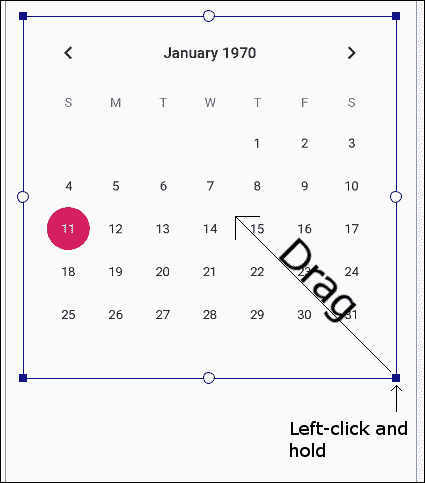

将尺寸缩小一半，将`CalenderView`留在顶部附近，水平居中。调整大小后，您可能需要稍微重新定位它，有点像下图:

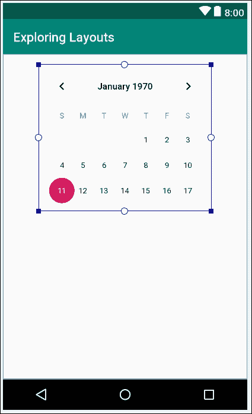

你不需要把`CalenderView`放在和我完全一样的地方。本练习的目的是熟悉通知您放置位置的视觉提示，而不是创建我的布局的副本。

## 使用组件树窗口

现在看看**组件树**窗口——位于视觉设计器左侧和调色板下方的窗口。组件树是可视化 XML 布局的一种方式，但是没有所有的细节。

在下面的截图中，我们可以看到`CalenderView`缩进到了`ConstraintLayout`的右边，因此是一个孩子。在我们构建的下一个用户界面中，我们将看到我们有时需要利用**组件树**来构建用户界面。

现在，我只想让你注意到我们的`CalenderView`旁边有一个警告标志。我在下面的截图中强调了这一点:

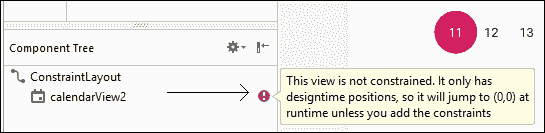

错误说**这个观点不受约束。它只有设计时位置，所以它会在运行时跳转到(0，0)，除非您添加约束**。还记得我们第一次在[第二章](04.html "Chapter 2. Kotlin, XML, and the UI Designer")、*科特林、XML 和用户界面设计器*中给屏幕添加按钮时，它们只是消失在左上角吗？

### 类型

现在运行应用，如果你想被提醒这个问题，点击**加载约束布局**按钮。

现在，我们可以通过点击[第 2 章](04.html "Chapter 2. Kotlin, XML, and the UI Designer")、*柯特林、XML 和用户界面设计器*中使用的**推断约束**按钮来解决这个问题。这里再次提醒大家:


但是学习手动添加约束是值得的，因为它为我们提供了更多的选择和灵活性。而且，随着您的布局变得越来越复杂，总有一两个项目的表现不如您希望的那样，手动修复它几乎总是必要的。

## 手动添加约束

确保选择了`CalenderView`，观察顶部、底部、左侧和右侧的四个小圆圈:

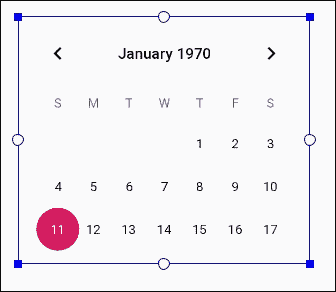

这些是约束句柄。我们可以点击并拖动它们，将它们与用户界面的其他部分或屏幕的侧面锚定在一起。通过将`CalenderView`与屏幕的四个边缘锚定，我们可以在应用运行时将其锁定到位。

一次一个，单击并拖动顶部手柄到设计的顶部，设计的右侧，设计的底部，设计的左侧。

观察`CalenderView`现在被约束在中心。左键单击并将`CalenderView`拖回屏幕上部的某个位置，如下图所示。使用视觉提示(如下图所示)确保`CalenderView`水平居中:

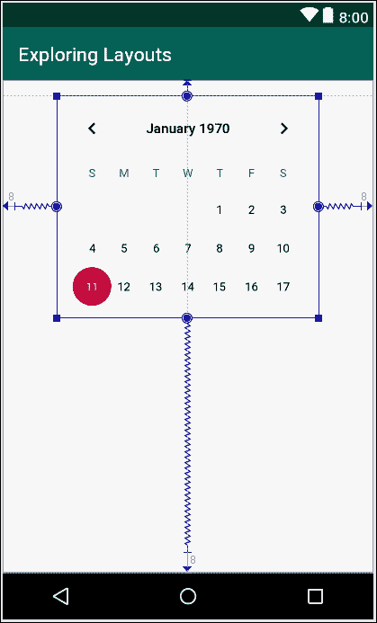

在这个阶段，您可以运行应用程序，并且`CalenderView`将被定位，如前面的截图所示。

让我们再向用户界面添加几个项目，看看如何约束它们。

## 添加和约束更多 UI 元素

从调色板的**部件** 类别中拖动一个`ImageView`，并将其定位在`CalenderView`的下方和左侧。当您放置`ImageView`时，会弹出一个窗口提示您选择一个图像。选择**项目** | **ic_launcher，**后点击**确定**。

将`ImageView`的左侧和`ImageView`的底部分别约束到 UI 的左侧和底部。这是你现在应该处于的位置:

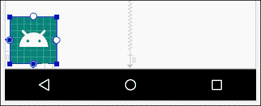

`ImageView`被约束在左下角。现在，抓住`ImageView`上的顶部约束手柄，将其拖动到`CalenderView`的底部约束手柄。这就是现在的现状:

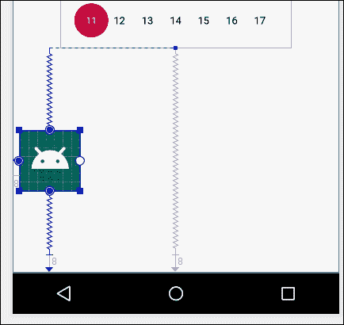

`ImageView`仅水平约束在一侧，因此被固定/约束在左侧。在`CalenderView`和用户界面底部之间，它同样受到垂直和均等的约束。

接下来，在`ImageView`的右侧添加一个`TextView`。将`TextView`的右边限制在用户界面的右边，将`TextView`的左边限制在`ImageView`的右边。将`TextView`的顶部约束到`ImageView`的顶部，将`TextView`的底部约束到 UI 的底部。现在，您将看到类似下图的内容:

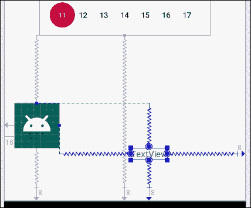

请注意，**组件树**窗口中关于无约束项目的所有警告都已消失。

### 注

有关于硬编码字符串的警告，因为我们将文本直接添加到布局而不是`strings.xml`文件，还有关于缺少**内容描述**属性的警告。**内容描述**属性应该用于添加文本描述，以便视障用户可以在应用程序中获得图像的口头描述。为了快速推进`ConstraintLayout`，我们将忽略这两个警告。我们将在[第 18 章](20.html "Chapter 18. Localization") *本地化*中查看正确添加字符串资源，您可以在安卓开发者网站[https://developer.android.com/studio/intro/accessibility](https://developer.android.com/studio/intro/accessibility)上阅读安卓工作室的辅助功能。

您可以移动三个用户界面元素，并按照您想要的方式整齐地排列它们。请注意，当您移动`ImageView`时，`TextView`也会随之移动，因为`TextView`被约束到`ImageView`上。但也要注意，你可以独立移动`TextView`，无论你把它放在哪里，这都代表它相对于`ImageView`的新的约束位置。无论一个项目被约束到什么位置，它的位置总是相对于该项目的。而且，正如我们已经看到的那样，水平和垂直约束是彼此不同的。我的定位如下图所示:

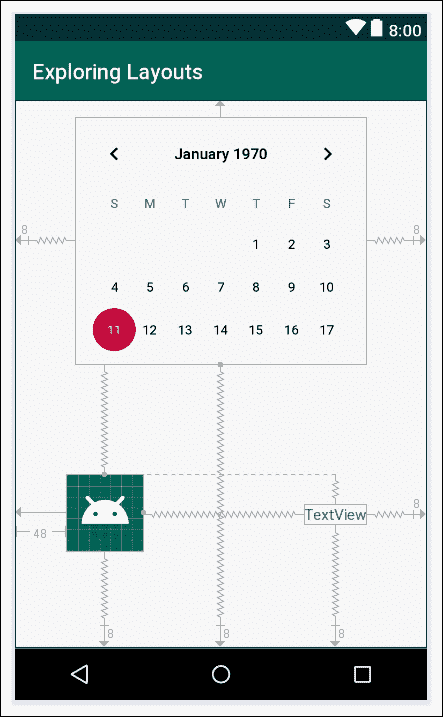

### 类型

`ConstraintLayout`是最新的布局类型，虽然它比其他布局更复杂，但它是最强大的，也是在我们用户设备上运行最好的。值得花更多的时间去看看更多关于`ConstraintLayout`的教程。尤其是在 YouTube 上，因为视频是学习调整`ConstraintLayout`的绝佳媒介。我们将在整本书中回到`ConstraintLayout`，除了我们已经介绍过的内容，您不需要知道更多就可以继续前进。

## 使文本可点击

我们的 T2 快完蛋了。我们只是想连接回主菜单屏幕。这是一个很好的机会来证明`TextView`(和大多数其他用户界面项目)也是可点击的。事实上，可点击文本在现代安卓应用中可能比传统外观的按钮更常见。

将`TextView`的`text`属性更改为`Back to the menu`。现在，找到`onClick`属性，进入`loadMenuLayout`。

现在，在`loadTableLayout`函数之后的`MainActivity.kt`文件中添加以下函数，如下图所示:

```kt
fun loadTableLayout(v: View) {
  //setContentView(R.layout.my_table_layout)
}

fun loadMenuLayout(v: View) {
 setContentView(R.layout.main_menu)
}

```

现在，只要用户点击`Back to the menu`文本，就会调用`loadMenuLayout`功能，`setContentView function` 将布局加载到`main_menu.xml`中。

您可以运行该应用程序，并在主菜单(`LinearLayout`)和`CalenderView`小部件(`ConstraintLayout`)之间来回点击。

让我们构建本章的最终布局。

# 用表格布局布局数据

在项目窗口中，展开文件夹。现在，右键单击`layout`文件夹并选择**新建**。注意**布局资源** **文件**有一个选项。

选择**布局资源文件**，会看到**新建资源文件**对话框窗口。

在**文件名**字段中，输入`my_table_layout`。这与我们在调用`loadTableLayout`函数中的`setContentView`时使用的名称相同。

请注意，它已经选择了**线性布局**作为**根**元素选项。删除`LinearLayout`并在其位置键入`TableLayout`。

点击**确定**按钮安卓工作室将在一个名为`my_table_layout`的 XML 文件中生成一个新的`TableLayout`，并将其放置在`layout`文件夹中，为我们构建新的基于表格的用户界面做好准备。安卓工作室还将打开用户界面设计器(如果还没有)，调色板在左边，属性窗口在右边。

您现在可以取消`loadTableLayout`功能的注释:

```kt
fun loadTableLayout(v: View) {
  setContentView(R.layout.my_table_layout)
}
```

你现在可以在运行应用时切换到基于`TableLayout`的屏幕，虽然目前是空白的。

## 向表格布局添加表格行

将`Layouts`类别中的`TableRow`元素拖到用户界面设计上。请注意，这个新的`TableRow`的出现几乎察觉不到，以至于不值得在书中插入图表。UI 顶部只有一条细细的蓝线。这是因为`TableRow`已经围绕其内容进行了自我折叠，目前内容为空。

可以将我们选择的用户界面元素拖放到这条蓝色细线上，但这也有点尴尬，甚至违背直觉。此外，一旦我们有多个相邻的`TableRow`元素，它会变得更加困难。解决方案在**组件树**窗口，我们在构建`ConstraintLayout`时简单介绍过。

## 使用组件树时，视觉设计者不会这样做

看**组件树**和注意你是如何看到`TableRow`作为`TableLayout`的孩子的。我们可以将用户界面直接拖动到**组件树**中的`TableRow`上。将三个`TextView`对象拖到**组件树**中的`TableRow`上，这将为您留下以下布局。我对下面的截图进行了 photoshopped 处理，在同一个图中展示了**组件树**和常规 UI 设计器:

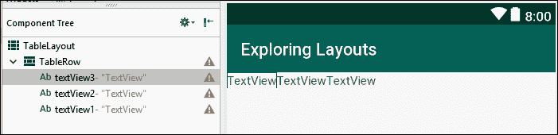

现在添加另外两个`TableRow`对象(来自**布局**类别)。您可以通过**组件树**窗口或用户界面设计器添加它们。

### 类型

你需要把它们放在窗口的最左边，否则新的`TableRow`会变成上一个`TableRow`的孩子。这会让整个桌子有点混乱。如果您不小心添加了一个`TableRow`作为前一个`TableRow,`的子级，您可以选择它，然后点击*删除*键，使用 *Ctrl* + Z 键盘组合将其撤销，或者向左拖动放置错误的`TableRow`(在**组件树**中)使其成为表格的子级，这是应该的。

现在，为每个新的`TableRow`项目添加三个`TextView`对象。这将通过**组件树**窗口添加它们来实现。检查您的布局，确保它如下面的截图所示:

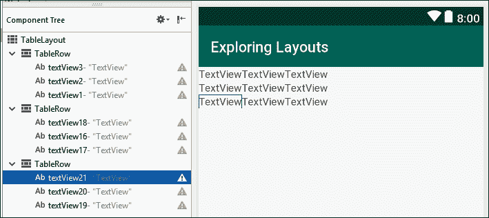

让我们通过改变一些属性，让表格看起来更像一个真实的数据表格。

在`TableLayout`上，将`layout_width`和`layout_height`属性设置为`wrap_content`。这就消除了多余的细胞。

通过编辑`textColor`属性，将所有外部(沿左上下方)`TextView`对象的颜色更改为黑色。您可以通过选择第一个`TextView`，搜索其`color`属性，然后在`color`属性值字段中键入`black`来实现。然后，您可以从下拉列表中选择`@android:color/black`。对每个外部`TextView`元件进行此操作。

编辑每个`TextView`的`padding`，并将`all`属性更改为`10sp`。

## 组织表格列

在这一点上似乎我们已经完成了，但是我们需要更好地组织数据。像许多表格一样，我们的表格会在左上角有一个空白单元格来划分列标题和行标题。为了实现这一点，我们需要对所有细胞进行编号。为此，我们需要编辑`layout_column`属性。

### 类型

单元格编号从左边的零开始编号。

从删除左上角`TextView`开始。请注意，右侧的`TextView`已经移动到左上角的位置。

接下来，在新的左上角`TextView,`中，将`layout_column`属性编辑为`1`(这将其分配给第二个单元格，因为第一个单元格是`0`，我们希望将第一个单元格留空)，对于下一个单元格，将`layout_column`属性编辑为`2`。

对于接下来的两行单元格，从左到右编辑它们从`0`到`2`的`layout_column`属性。

如果您想在编辑后澄清这一行的精确代码，这里有一个片段，记得在`Chapter04` `/LayoutExploration`文件夹的下载包中查看整个文件的上下文:

```kt
<TableRow
   android:layout_width="wrap_content"
   android:layout_height="wrap_content">

   <TextView
         android:id="@+id/textView2"
         android:layout_width="wrap_content"
         android:layout_height="wrap_content"
         android:layout_column="1"
         android:padding="10sp"
         android:text="India"
         android:textColor="@android:color/black" />

   <TextView
         android:id="@+id/textView1"
         android:layout_width="wrap_content"
         android:layout_height="wrap_content"
         android:layout_column="2"
         android:padding="10sp"
         android:text="England"
         android:textColor="@android:color/black" />

</TableRow>
```

然而，尽可能使用**属性**窗口来完成本练习。

## 链接回主菜单

最后，对于这个布局，我们将添加一个链接回主菜单的按钮。通过**组件树**添加另一个`TableRow`。将一个按钮拖到新的`TableRow`上。将其`layout_column`属性编辑为`1`，使其位于行的中间。将其`text`属性编辑为`Menu`并编辑其`onClick`属性以匹配我们已经存在的`loadMenuLayout`功能。

您现在可以运行该应用程序，并在不同的布局之间来回切换。

如果您愿意，您可以通过编辑`TextView`小部件的所有`text`属性来给表格添加一些有意义的标题和数据，就像我在下面的截图中所做的那样，显示了在模拟器中运行的`TableLayout`:

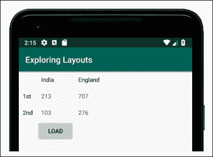

最后一个想法是，考虑一个呈现数据表的应用程序。有可能数据会被动态地添加到表中，而不是像我们刚刚做的那样由开发人员在设计时添加，而是更有可能由用户或者从网络上的数据库中添加。在[第 16 章，](18.html "Chapter 16. Adapters and Recyclers") *适配器和回收器*中，我们将看到如何使用适配器将数据动态添加到不同类型的布局中，在[第 27 章](29.html "Chapter 27. Android Databases")*安卓数据库*中，我们还将看到如何在我们的应用程序中创建和使用数据库。

# 总结

在短短的几十页中，我们已经讨论了许多主题。我们不仅构建了三种不同类型的布局，包括带有嵌套布局的`LinearLayout`、带有手动配置约束的`ConstraintLayout`和`TableLayout`(尽管使用了假数据)，而且我们还将所有布局与可点击的按钮和文本连接在一起，这些按钮和文本触发我们的 Kotlin 代码在所有这些不同的布局之间切换。

在下一章，我们将继续讨论布局的话题。我们将回顾我们已经看到的许多属性，我们将通过将多个`CardView`布局(带有深度和阴影)合并到平滑滚动的`ScrollView`布局中，来构建迄今为止最具美感的布局。