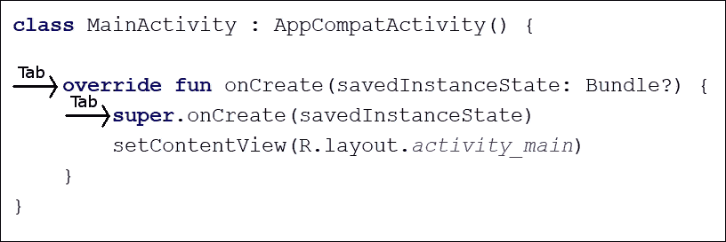

# 第八章。柯特林决策和循环

我们刚刚学习了变量，现在我们了解了如何改变它们在表达式中的值，但是我们如何采取依赖于变量值的行动呢？

我们当然可以将新消息的数量添加到以前未读的消息的数量中，但是，例如，当用户已经阅读了他们所有的消息时，我们如何在我们的应用程序中触发一个操作呢？

第一个问题是，我们需要一种方法来测试一个变量的值，然后当值落在一个值的范围内或者等于一个特定的值时做出响应。

编程中常见的另一个问题是，根据变量值，我们需要代码的某些部分被执行一定次数(不止一次，有时甚至根本不执行)。

为了解决第一个问题，我们将看看在科特林用`if`、`else`和`when`做决策。为了解决后者，我们将使用`while`、`do`–`while`、`for`、 `continue`和`break`来查看 Kotlin 中的循环。

此外，我们将了解到，在柯特林，决策也是产生价值的表达。我们将在本章中讨论以下主题:

*   与`if`、`else`、`else`–`if`和`switch`一起决策
*   `when`演示应用
*   科特林`while`循环和`do` - `while`循环
*   kot Lin〔t0〕回圈

现在让我们了解更多关于科特林的知识。

# 在科特林做决定

我们的科特林代码将不断地做出决策。例如，我们可能需要知道用户是否有新消息，或者他们是否有一定数量的朋友。我们需要能够测试我们的变量，看看它们是否满足某些条件，然后根据它们是否满足条件来执行特定的代码部分。

在本节中，随着我们的代码越来越深入，它有助于以一种更易读的方式呈现代码。让我们看看代码缩进，让我们关于决策的讨论变得更容易。

## 为清晰起见，缩进代码

您可能已经注意到我们项目中的 Kotlin 代码是缩进的。例如，`MainActivity`类内的第一行代码缩进一个制表符。此外，第一行代码在每个函数中缩进另一个标签；这里有一个注释图来说明这一点:



请注意，当缩进的块结束时，通常用一个右花括号(`}`)缩进，缩进程度与开始该块的代码行相同。

我们这样做是为了让代码更易读。然而，它不是 Kotlin 语法的一部分，如果我们不费心这样做，代码仍然会编译。

随着代码变得越来越复杂，缩进和注释有助于保持代码的意义和结构清晰。我现在提到这一点，是因为当我们开始学习 Kotlin 中用于决策的语法时，缩进变得特别有用，建议您以同样的方式缩进代码。这种缩进大部分是安卓工作室为我们完成的，但不是全部。

现在我们知道如何更清楚地展示我们的代码，我们可以了解更多的操作符，然后我们可以通过与 Kotlin 一起做决定来开始工作。

## 更多柯特林算子

我们可以用运算符已经加(`+`)、带走(`-`)、乘(`*`)、除(`/`)、赋(`=`)、增(`++`)和减(`--`)。现在我们将探索一些更有用的运算符，然后我们将直接学习如何使用它们。

### 类型

不要担心记住以下每个操作符。浏览一下它们和它们的解释，然后进入下一部分。在那里，我们将使用一些操作符，当我们看到它们允许我们做什么的例子时，它们将变得更加清晰。它们以列表的形式呈现在这里，只是为了从一开始就清楚运营商的种类和范围。如果不与随后关于实施的讨论相结合，该清单也将更便于以后参考。

我们使用运算符来创建一个非真即假的表达式。我们用括号或括号将该表达式包装如下:`(expression goes here)`。

### 比较运算符

这是比较运算符。它考验平等并且不是真就是假；它属于`Boolean`类型:

```kt
==
```

比如像`(10 == 9)`这样的表达式就是假的。10 显然不等于 9。然而`(2 + 2 == 4)`这样的表述显然是对的。

### 类型

也就是除了在 *1984* 的时候，2+2 = = 5([https://en.wikipedia.org/wiki/Nineteen_Eighty-Four](https://en.wikipedia.org/wiki/Nineteen_Eighty-Four))。

### 逻辑非运算符

这是逻辑非运算符:

```kt
!
```

它是用来测试一个表达式的否定。如果表达式为假，则非运算符使表达式为真。

例如，表达式`(!(2+2 == 5))`的计算结果为真，因为 2 + 2 *不是* 5。但是`(!(2 + 2 = 4))`的另一个例子是假的。这是因为 2 + 2 *明显是*4。

### 不等运算符

这是不相等运算符，是另一个比较运算符:

```kt
!=
```

非相等运算符测试某物是否不相等；例如，`(10 != 9)`表达式为真，因为 10 不等于 9。另一方面，`(10 != 10)`为假，因为 10 等于 10。

### 大于运算符

另一个比较运算符(还有一个比较运算符)是大于运算符:

```kt
>
```

这个运算符测试某个事物是否比其他事物更伟大。表达式`(10 > 9)`为真，表达式`(9 > 10)`为假。

### 小于运算符

你可以大概猜到这个运算符测试的值比其他运算符少；这是操作员的样子:

```kt
<
```

表达式`(10 < 9)`为假，因为 10 不小于 9，而表达式`(9 < 10)`为真。

### 大于或等于运算符

该运算符测试一个值是否大于或等于另一个，如果其中一个为真，则结果为真。操作员是这样的:

```kt
>=
```

举个例子，表达式`(10 >= 9)`为真，表达式`(10 >= 10)`也为真，但是表达式`(10 >= 11)`为假，因为 10 既不大于也不等于 11。

### 小于或等于运算符

和前面的算子一样，这一个测试两个条件，但是这次，**小于等于**；看看下面的运算符:

```kt
<=
```

表达式`(10 <= 9)`为假，表达式`(10 <= 10)`为真，表达式`(10 <= 11)`也为真。

### 逻辑“与”运算符

这个运算符被称为逻辑“与”。它测试表达式的两个或多个独立部分，并且两个或所有部分必须为真，整个表达式才为真:

```kt
&&
```

逻辑“与”通常与其他运算符结合使用，以构建更复杂的测试。表达式`((10 > 9) && (10 < 11))`为真，因为两部分都为真。另一方面，表达式`((10 > 9) && (10 < 9))`是假的，因为表达式只有一部分是真的–`(10 > 9)`，而另一部分是假的–`(10 < 9)`。

### 逻辑或运算符

这个运算符被称为逻辑 or，它就像逻辑 and 一样，只是表达式的两个或多个部分中只有一个需要为真，表达式才为真:

```kt
||
```

再举一个看一下前面我们用于逻辑“与”的例子，但是取而代之的是将`&&`替换为`||`。表达式`((10 > 9) || (10 < 9))`现在是真的，因为只需要表达式的一个或多个部分为真。

在本章和本书的其余部分，从更实际的角度来看这些运算符，将有助于阐明它们的不同用途。现在我们知道如何用运算符、变量和值来形成表达式了。接下来，我们可以研究一种构造和组合表达式的方法，以做出几个深刻的决定。

## 如何使用所有这些运算符来测试变量

所有这些操作符实际上都是无用的，没有办法正确使用它们来做出影响真实变量和代码的真实决定。

现在我们已经有了所有需要的信息，我们可以看一下假设的情况，然后实际检查一些用于决策的代码。

### 使用 if 表达式

正如你们所看到的，操作者自己的目的很少，但是仅仅看到我们可以获得的广泛多样的范围的一部分是有用的。现在，当我们考虑使用最常见的运算符`==`时，我们可以开始看到它们提供的强大而精细的控制。

让我们使前面的例子不那么抽象。通过检查以下代码，满足 **if** 表达式:

```kt
val time = 9

val amOrPm = if(time < 12) {
  "am"
} else {
  "pm"
}

Log.i("It is ", amOrPm)
```

前面的代码从声明一个名为`time`的`Int`类型并将其初始化为`9`的值开始。下一行代码非常有趣，因为它做了两件事。`if(time < 12)`的表达是一种考验；我们知道时间比`12` 少，因为我们刚刚将其初始化为`9`。当条件为真时，`if`表达式返回`"am"`值和`if`表达式之前的第一行代码，并用该值声明并初始化一个名为`amOrPm`的新的`String`类型。

如果我们将`time`变量初始化为不小于 12(即 12 或更高)的任何值，那么返回的值将是来自`else`块的`"pm"`。如果将前面的代码复制粘贴到项目中，如`onCreate`函数，logcat 中的输出如下:

```kt
It is: am

```

对`if`表达式求值，如果条件为真，则执行第一组花括号(`{…}`)中的代码；如果条件为假，则执行`else {…}`块中的代码。

值得注意的是`if`不一定要返回值，而是可以根据测试结果简单地执行一些代码；看看下面的示例代码:

```kt
val time = 13

if(time < 12) {
  // Execute some important morning task here
} else {
  // Do afternoon work here
}
```

在前面的代码中，没有返回值；我们只关心正确的代码被执行。

### 类型

从技术上来说，仍然有一个返回值(在这种情况下，是真还是假)，但是我们选择不使用它。

此外，我们的`if`表达式可以处理两个以上的结果，我们将在后面看到。

我们也可以在字符串模板中使用。我们在上一章中看到，我们可以通过在`$`符号后面的花括号之间插入表达式来将表达式插入到`String`类型中。以下是上一章的代码提示:

```kt
Log.i("info", "$name 
was born in $yearOfBirth and is $age years old. 
Next year he will be ${currentYear - yearOfBirth} years old)")
```

前面代码中突出显示的部分将导致从`currentYear`中减去的`yearOfBirth`值被打印在消息的其余部分中。

下面的代码示例展示了如何以同样的方式将整个`if`表达式插入到`String`模板中:

```kt
val weight = 30
val instruction = 
  "Put bag in ${if (weight >= 25) "hold" else "cabin" }"

Log.i("instruction is ", instruction)
```

前面的代码使用`if`来测试`weight`变量是否被初始化为大于或等于 25 的值。根据表达式是否为真，将在`String`初始化中添加`hold`或`cabin`两个字。

如果您执行前面的代码，您将获得以下输出:

```kt
instruction is: Put this bag in the hold

```

如果您将`weight`的初始化更改为 25 以下的任何值并执行代码，您将获得以下输出:

```kt
instruction is: Put this bag in the cabin

```

让我们看一个更复杂的例子。

## 如果他们过桥，就开枪打他们！

在下一个例子中，我们将使用`if`、几个条件运算符和一个小故事来演示它们的用法。

队长快死了，知道自己剩下的下属经验不多，决定写一个 Kotlin 程序(还有什么？)传达他死后的最后命令。部队在等待增援时必须守在桥的一边，但要遵守一些决定他们行动的规则。

船长想让他的部队明白的第一条命令如下:

**如果他们过桥，就开枪打他们。**

那么，我们如何在科特林模拟这种情况呢？我们需要一个`Boolean`变量–`isComingOverBridge`。下一段代码假设`isComingOverBridge`变量已经声明并初始化为`true`或`false`。

然后我们可以如下使用`if`:

```kt
if(isComingOverBridge){

   // Shoot them

}
```

如果`isComingOverBridge`布尔值为真，将执行左右花括号内的代码。如果`isComingOverBridge`为假，程序将在`if`块之后继续，并且不运行其中的代码。

### 否则就这样做

上尉也想告诉他的部队，如果敌人不过桥该怎么办。在这种情况下，他希望他们留在原地等待。

对此，我们可以使用`else`。当`if`表达式没有评估为真时，当我们想要明确地做某事时，我们使用`else`。

例如，要告诉部队在敌人不过桥时原地不动，我们可以编写以下代码:

```kt
if(isComingOverBridge){

   // Shoot them

}else{

   // Hold position

}
```

船长随后意识到问题并不像他最初想的那么简单。如果敌人过桥，但是兵力太多怎么办？他的队伍将被蹂躏和屠杀。

因此，他提出了以下代码(这次，我们也将使用一些变量):

```kt
var isComingOverBridge: Boolean
var enemyTroops: Int
var friendlyTroops: Int

// Code that initializes the above variables one way or another

// Now the if
if(isComingOverBridge && friendlyTroops > enemyTroops){

   // shoot them

}else if(isComingOveBridge && friendlyTroops < enemyTroops) {

   // blow the bridge

}else{

   // Hold position

}
```

前面的代码有三种可能的执行路径。第一是如果敌人正在过桥，而友军人数较多:

```kt
if(isComingOverBridge && friendlyTroops > enemyTroops)
```

第二种是如果敌军越过桥梁，但人数超过友军:

```kt
else if(isComingOveBridge && friendlyTroops < enemyTroops)
```

如果其他两个路径都不为真，将执行的第三个也是最后一个可能的结果被最终的`else`语句捕获，并且没有`if`条件。

### 类型

**读者挑战**

你能发现前面代码的缺陷吗？一个可能会让一群没有经验的士兵完全陷入混乱的计划？敌军和友军人数完全相等的可能性还没有明确处理，因此将由最后的`else`声明处理，这意味着没有敌军。任何一个自尊的上尉都会期望他的部队在这种情况下作战，他可以改变第一个`if`语句来适应这种可能性，如下所示:

`if(isComingOverBridge && friendlyTroops >= enemyTroops)`

最后，船长最后担心的是，如果敌人挥舞着投降的白旗越过大桥，并被迅速屠杀，那么他的部下将最终成为战犯。这里需要的代码显而易见；使用`wavingWhiteFlag`布尔变量，他可以编写以下测试:

```kt
if (wavingWhiteFlag){

   // Take prisoners

}
```

但是把这个代码放在哪里就不太清楚了。最后，队长选择以下嵌套解，并将`wavingWhiteFlag`的测试改为逻辑非，如下:

```kt
if (!wavingWhiteFlag){

   // not surrendering so check everything else

   if(isComingOverBridge && friendlyTroops >= enemyTroops){

          // shoot them
   }else if(isComingOverBridge && friendlyTroops < 
                enemyTroops) {

         // blow the bridge

   }

}else{

   // this is the else for our first if
   // Take prisoners

}

// Holding position
```

这表明我们可以将`if`和`else`语句嵌套在一起，以创建深入而详细的决策。

我们可以继续用`if`和`else,`做出越来越复杂的决定，但是我们在这里看到的作为介绍已经足够了。

或许值得指出的是，很多时候，解决问题的方法不止一种。正确的方法通常是以最清晰和最简单的方式解决问题的方法。

现在我们将在 Kotlin 中研究一些其他的决策方法，然后我们可以将它们放在一个应用程序中。

## 用什么时候做决定

我们已经看到了将柯特林算子与`if`和`else`语句相结合的巨大且几乎无限的可能性。但是，有时候，科特林的决定可以用其他方式更好地做出。

当我们想要根据一系列可能的结果做出决定并执行不同的代码部分时，我们可以使用`when`。以下代码声明并初始化`rating`变量，然后根据`rating`的值向 logcat 窗口输出不同的响应:

```kt
val rating:Int = 4
when (rating) {
  1 -> Log.i("Oh dear! Rating = ", "$rating stars")
  2 -> Log.i("Not good! Rating = ", "$rating stars")
  3 -> Log.i("Not bad! Rating = ", "$rating stars")
  4 -> Log.i("This is good! Rating = ", "$rating stars")
  5 -> Log.i("Amazing! Rating = ", "$rating stars")

  else -> {    
    Log.i("Error:", "$rating is not a valid rating")
  }
}
```

如果将前面的代码复制粘贴到某个 app 的`onCreate`功能中，会产生如下输出:

```kt
This is good! Rating =: 4 stars

```

该代码首先将名为`rating`的`Int`变量初始化为`4`。然后`when`块使用`rating`作为其条件:

```kt
val rating:Int = 4
when (rating) {
```

接下来，处理评级可以初始化为的五种不同的值的可能性。对于每一个值，`1`到`5`，一个不同的消息被输出到 logcat 窗口:

```kt
1 -> Log.i("Oh dear! Rating = ", "$rating stars")
2 -> Log.i("Not good! Rating = ", "$rating stars")
3 -> Log.i("Not bad! Rating = ", "$rating stars")
4 -> Log.i("This is good! Rating = ", "$rating stars")
5 -> Log.i("Amazing! Rating = ", "$rating stars")
```

最后，有一个`else`块，如果指定的选项都不为真，则执行该块:

```kt
else -> {
  Log.i("Error:", "$rating is not a valid rating")
}
```

让我们通过构建一个小的演示应用来看看`when`的一个稍微不同的用法。

## 何时演示应用

为了启动，创建一个名为`When Demo`的新安卓项目。使用**空活动**项目模板，并将所有其他选项保留在其常规设置中。通过左键点击编辑器上方的 **MainActivity.kt** 选项卡切换到`MainActivity.kt`文件，我们就可以开始编码了。

你可以在下载包的`Chapter08/When Demo`文件夹中获取这个应用的代码。该文件还包括与我们之前关于表达式和`if`的讨论相关的代码。为什么不玩转代码，运行应用，研究输出呢？

在`onCreate`函数中添加以下代码。该应用程序展示了多个不同的值可以触发相同的执行路径:

```kt
// Enter an ocean, river or breed of dog
val name:String = "Nile"
when (name) {
  "Atlantic","Pacific", "Arctic" -> 
    Log.i("Found:", "$name is an ocean")

  "Thames","Nile", "Mississippi" -> 
    Log.i("Found:", "$name is a river")

  "Labrador","Beagle", "Jack Russel" -> 
    Log.i("Found:", "$name is a dog")

  else -> {
    Log.i("Not found:", "$name is not in database")
  }
}
```

在前面的代码中，根据`name`变量的初始化值，有四种可能的执行路径。如果使用了`Atlantic`、`Pacific`或`Arctic`值中的任何一个，则执行以下代码行:

```kt
Log.i("Found:", "$name is an ocean")
```

如果使用任何`Thames`、`Nile`或`Mississippi`值，则执行以下代码行:

```kt
Log.i("Found:", "$name is a river")
```

如果使用= `Labrador`、`Beagle`或`Jack Russel`值中的任何一个，则执行以下代码行:

```kt
Log.i("Found:", "$name is a dog")
```

如果海洋、河流或狗都没有使用来初始化`name`变量，那么应用程序分支到`else`块并执行这一行代码:

```kt
Log.i("Not found:", "$name is not in database")
```

如果您在`name`初始化为`Nile`的情况下执行应用程序(与前面的代码一样)，这是您将在 logcat 窗口中看到的输出:

```kt
Found:: Nile is a river

```

运行几次应用程序，每次将`name`的初始化改为新的。请注意，当您将`name`初始化为由语句显式处理的内容时，我们会得到预期的输出。否则，我们将得到由`else`块处理的默认输出。

如果我们在一个`when`块中有很多代码要为一个选项执行，我们可以把它们都包含在一个函数中，然后调用那个函数。我在下面的假设代码中突出显示了已更改的行:

```kt
   "Atlantic","Pacific", "Arctic" -> 
         printFullDetailsOfOcean(name)

```

当然，我们接下来需要编写新的`printFullDetailsOfOcean`函数。然后，当`name`被初始化为一个明确处理的海洋时，`printFullDetailsOfOcean`功能将被执行。然后，执行将返回到`when`块之外的第一行代码。

### 类型

您可能想知道将`name`变量放在`printFullDetailsOfOcean(name)`函数调用的括号中的意义。正在发生的是，我们正在将存储在`name`变量中的数据传递给`printFullDetailsOfOcean`函数。这意味着`printFullDetailsOfOcean`函数可以使用这些数据。这将在下一章中详细介绍。

当然，这段代码严重缺乏的东西之一是与图形用户界面的交互。我们已经看到如何通过点击按钮来调用函数，但即使这样也不足以让这段代码在真正的应用程序中变得有价值。我们将在[第 12 章](14.html "Chapter 12. Connecting Our Kotlin to the UI and Nullability")、*中看到如何将我们的科特林连接到用户界面和可空性*来解决这个问题。

我们遇到的另一个问题是，代码执行完之后，就这样了——应用程序不会做其他任何事情！我们需要它不断地向用户寻求指导，不仅仅是一次，而是一次又一次。接下来我们将研究这个问题的解决方案。

# 循环重复代码

在这里，我们将通过查看 Kotlin 中的几种类型的**循环**，来学习如何以受控且精确的方式重复执行部分代码。这些包括`while`循环、`do-while`循环和`for`循环。我们还将了解使用这些不同类型循环的最合适的情况。

问循环与编程有什么关系是完全合理的，但它们正是名字所暗示的。它们是一种多次重复同一部分代码的方式，或者是在同一部分代码上循环的方式，尽管每次都有可能产生不同的结果。

这可能意味着做同样的事情，直到被循环的代码(**迭代**)提示循环结束。它可以是循环代码本身指定的预定迭代次数。可能直到满足预定情况或**条件**。或者，它可以是这些东西的组合。与`if`、`else`和`when`一起，循环是科特林**控制流语句**的一部分。

我们将查看 Kotlin 为我们提供的所有主要类型的循环来控制我们的代码，我们将使用其中的一些来实现一个工作的迷你应用程序，以确保我们完全理解它们。让我们来看看 Kotlin 中第一个也是最简单的循环类型，`while`循环。

# 同时循环

Kotlin `while`循环有最简单的语法。回想一下`if`的语句；我们可以在`if`语句的条件表达式中使用几乎任何运算符和变量的组合。如果表达式评估为真，则执行`if`块主体中的代码。在`while`循环中，我们还使用了一个可以评估为真或假的表达式:

```kt
var x = 10

while(x > 0) {
  Log.i("x=", "$x")
  x--
}
```

看看前面的代码；这里发生的情况如下:

1.  在`while`循环之外，一个名为`x`的`Int`类型被声明并初始化为 10。
2.  然后，`while`循环开始；其条件为`x > 0`。因此，`while`循环将执行其主体中的代码。
3.  其主体中的代码将重复执行，直到条件计算为 false。

因此，前面的代码将执行 10 次。

第一遍`x`等于 10，第二遍等于 9，然后是 8，依此类推。但是`x`一旦等于 0，当然不再大于 0。此时，执行将退出`while`循环，并继续执行`while`循环后的第一行代码(如果有)。

与`if`语句相同，有可能`while`循环甚至不会执行一次。看看下面的例子，`while`循环中的代码不会执行:

```kt
var x = 10

while(x > 10){
   // more code here.
   // but it will never run 
  // unless x is greater than 10.
}
```

而且，条件表达式的复杂程度和循环体中能进的代码量没有限制；下面是另一个例子:

```kt
var newMessages = 3
var unreadMessages = 0

while(newMessages > 0 || unreadMessages > 0){
   // Display next message
   // etc.
}

// continue here when newMessages and unreadMessages equal 0
```

前面的`while`循环将继续执行，直到`newMessages`和 `unreadMessages`都等于或小于零。由于条件使用逻辑或运算符(`||`)，这些条件中的任何一个为真都将导致`while`循环继续执行。

值得注意的是，一旦进入循环的主体，它将总是完整的，即使表达式在一部分过程中计算为 false。这是因为在代码尝试开始另一轮之前，不会再次测试它:

```kt
var x = 1

while(x > 0){
   x--
   // x is now 0 so the condition is false
   // But this line still runs
   // and this one
   // and me!
}
```

前面的循环体将恰好执行一次。我们还可以设置一个永远运行的`while`循环！这叫做一个**无限循环**；这里有一个无限循环的例子:

```kt
var x = 0

while(true){
   x++ // I am going to get very big!
}
```

前面的代码永远不会结束；它将永远循环往复。我们将很快看到一些控制何时打破`while`循环的解决方案。接下来，我们将看看`while`循环的一个变体。

# 边做边循环

`do`–`while`循环的工作方式与普通的`while`循环相同，只是`do`块的存在保证了代码将至少执行一次，即使当`while`表达式的条件不为真时:

```kt
var y = 10
do {
  y++
  Log.i("In the do block and y=","$y")
}
while(y < 10)
```

如果您在`onCreate`功能中将这段代码复制并粘贴到您的某个应用程序中，然后执行它，输出可能不是您所期望的。以下是输出:

```kt
In the do block and y=: 11

```

这是一个较少使用但有时完美的解决问题的方法。即使`while`循环的条件为假，`do`块执行其代码，将`y`变量增加到 11，并向 logcat 打印一条消息。`while`循环的条件是`y < 10`，所以`do`块中的代码不再执行。然而，如果`while`条件中的表达式为真，则`do`块中的代码继续执行，就好像它是常规的`while`循环一样。

# 范围

为了继续我们对循环的讨论，有必要简单介绍一下范围这个话题。范围与数组的柯特林主题密切相关，我们将在[第 15 章](17.html "Chapter 15. Handling Data and Generating Random Numbers")、*处理数据和生成随机数*中更全面地讨论。接下来是范围的快速介绍，使我们能够继续覆盖`for`循环。

看看下面使用范围的代码行:

```kt
val rangeOfNumbers = 1..4 
```

正在发生的事情是，我们正在使用类型推理来创建一个包含值 1、2、3 和 4 的值列表。

我们还可以显式声明和初始化列表，如以下代码所示:

```kt
val rangeOfNumbers = listOf(1, 2, 3, 4, 5, 6, 7, 8, 9, 10)
```

前面的代码使用`listOf`关键字显式创建一个包含数字 1 到 10 的列表。

当我们在[第 15 章](17.html "Chapter 15. Handling Data and Generating Random Numbers")、*处理数据和生成随机数*中了解数组时，将会更深入地探索这些在引擎盖下是如何工作的。然后，我们将看到范围、数组和列表比我们在这里讨论的要多得多。通过查看`for`循环，有这个快速的介绍来完成我们对循环的讨论是很有帮助的。

# 用于循环

要使用`for`循环，我们需要一个范围或列表。然后我们可以使用`for`循环遍历列表，并在每一步中执行一些代码；看看下面的例子:

```kt
// We could do this...
// val list = listOf(1, 2, 3, 4, 5, 6, 7, 8, 9, 10)
// It is much quicker to do this...
val list = 1..10
for (i in list)
  Log.i("Looping through list","Current value is $i")
```

看看如果复制并粘贴到应用程序中会产生的输出:

```kt
Looping through list: Current value is 1
Looping through list: Current value is 2
Looping through list: Current value is 3
Looping through list: Current value is 4
Looping through list: Current value is 5
Looping through list: Current value is 6
Looping through list: Current value is 7
Looping through list: Current value is 8
Looping through list: Current value is 9
Looping through list: Current value is 10

```

从输出中可以看到`list`变量确实包含了从 1 到 10 的所有值。每次循环时，`i`变量保存当前值。您还可以看到`for`循环允许我们遍历所有这些值，并基于这些值执行一些代码。

此外，当我们希望循环包含多行代码时，我们可以使用带有`for`循环的左大括号和右大括号:

```kt
for (i in list){
  Log.i("Looping through list","Current value is $i")
   // More code here
  // etc.
}
```

在 Kotlin 中，`for`循环非常灵活，可以处理的不仅仅是简单的`Int`值。我们不会探究本章中的所有选项，因为我们需要先了解更多课程。然而，在本书的剩余部分，我们将在许多地方回到`for`循环。

# 控制带有中断和继续的循环

刚刚讨论了我们可以控制代码循环的所有方法，重要的是要知道，有时我们需要比循环条件指定的时间更早地脱离循环。

对于这样的场合，科特林有`break`关键词。下面是`while`循环中的`break`:

```kt
var countDown = 10
while(countDown > 0){

  if(countDown == 5)break

  Log.i("countDown =","$countDown")
  countDown --
}
```

在前面的代码中，`while`循环的条件应该使代码在`countDown`变量大于零时重复执行。然而，在`while`循环中，有一个`if` 表达式检查`countDown`是否等于 5。如果等于 5，则使用`break`语句。此外，在`while`循环中，`countDown`的值被打印到 logcat 窗口并递减(减 1)。当执行这段代码时，请看下面的输出:

```kt
countDown =: 10
countDown =: 9
countDown =: 8
countDown =: 7
countDown =: 6

```

从前面的输出可以看出，当`countDown`等于 5 时，`break`语句执行，并且在打印到 logcat 窗口之前，执行退出`while`循环。

有时，我们可能只想在一个循环中执行部分代码，而不是完全停止循环。对此，科特林有`continue`关键词。看看下面带有`while`循环的代码，它展示了我们如何在应用程序中使用`continue`:

```kt
var countUp = 0
while(countUp < 10){
  countUp++

  if(countUp > 5)continue

  Log.i("Inside loop","countUp = $countUp")
}
Log.i("Outside loop","countUp = $countUp")
```

在前面的代码中，我们将一个名为`countUp`的变量初始化为零。然后我们建立一个`while`循环，当`countUp`小于 10 时继续执行。在`while`循环中，我们增加(增加 1) `countUp`。下一行代码检查`countUp`是否大于 5，如果大于，则执行`continue`语句。下一行代码将`countUp`的值打印到 logcat 窗口。打印值的代码行只有在`countUp`为 5 或更低时才会执行，因为`continue`语句将应用程序的执行发送回循环的开始。看看下面的代码输出，以验证发生了什么:

```kt
Inside loop: countUp = 1
Inside loop: countUp = 2
Inside loop: countUp = 3
Inside loop: countUp = 4
Inside loop: countUp = 5
Outside loop: countUp = 10

```

您可以在前面的输出中看到`countUp`在值为 5 或更低时被打印。一旦其值超过 5，`continue`语句将阻止执行打印的代码行。但是，循环外的最后一行代码打印了`countUp`的值，您可以看到它的值是 10，这表明循环中的第一行代码(以`countUp`为增量)持续执行，直到完成`while`循环条件。

`break`和`continue`关键词也可以用于`for`循环和`do`–`while`循环。

# 样本代码

如果你想玩循环代码，你可以创建一个名为`Loops Demo`的新项目，并将本章的任何代码复制到`onCreate`函数的末尾。我已经将我们在讨论循环时使用的代码放在了`Chapter08/Loops Demo`文件夹中。

# 总结

在本章中，我们使用了`if`、`else`和`when`来用表达式进行决策，并分支我们的代码。我们看到并练习了`while`、`for`和`do` - `while`来重复部分代码。此外，我们使用`break`在条件允许之前中断循环，并且使用`continue`有条件地只执行循环中的部分代码。

如果你没有马上记住所有的东西也没关系，因为我们会在整本书中不断地使用所有这些技巧和关键词。我们还将探索一些使用这些技术的更高级的方法。

在下一章中，我们将更仔细地研究 Kotlin 函数，这是我们所有测试和循环代码的地方。