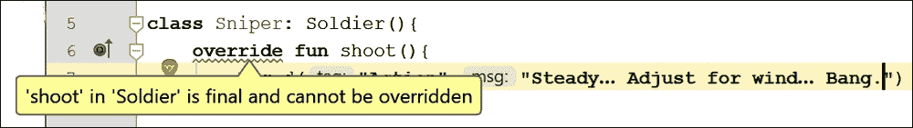

# 十一、Kotlin的继承

在本章中，我们将看到继承在起作用。事实上，我们已经看到了它，但是现在我们将更仔细地检查它，讨论它的好处，并编写我们可以继承的类。在这一章中，我将向您展示几个继承的实际例子，在这一章的最后，我们将从上一章改进我们的海战模拟，并展示我们如何通过使用继承来节省大量的打字和未来的调试。

我们将在本章中讨论以下主题:

*   **面向对象编程** ( **OOP** )和继承
*   使用开放类的继承
*   覆盖功能
*   更多关于多态性的信息
*   抽象类
*   继承示例应用

首先，让我们多谈一点理论。

# OOP 与继承

我们已经看到了如何通过从类中实例化/创建对象来重用我们自己的代码和其他人的代码。但是整个 OOP 的事情比这更进一步。

如果有一个类中有很多有用的功能，但并不是我们想要的，该怎么办？想想我们写`Carrier`课的时候。它离`Destroyer`班很近，我们几乎可以复制粘贴它。我们可以从一个类中继承**，然后进一步细化或增加它的工作原理和功能。**

 **听到我们已经这样做了，你可能会感到惊讶。事实上，我们已经用我们创建的每个应用做到了这一点。当我们使用`:`语法时，我们是在继承。您可能还记得`MainActivity`类中的这段代码:

```kt
class MainActivity : AppCompatActivity() {
```

这里，我们继承了`AppCompatActivity`类的所有功能——或者更具体地说，继承了类的设计者希望我们访问的所有功能。

我们甚至可以覆盖一个函数，并且仍然在某种程度上依赖于我们继承的类中被覆盖的函数。例如，我们每次继承`AppCompatActivity`类时都会覆盖`onCreate`函数。但是当我们这样做的时候，我们也调用了类设计器提供的默认实现:

```kt
super.onCreate(... 
```

### 类型

`super`关键字指的是超级类，是从继承而来的类。

在[第 6 章](08.html "Chapter 6. The Android Lifecycle")*安卓生命周期*中，我们覆盖了更多`Activity`类的生命周期功能。请注意，您可以有多个继承级别，尽管好的设计通常建议没有太多的级别。举个例子，我已经提到了`AppCompatActivity`是从`Activity,`继承过来的，我们也是从`AppCompatActivity`继承过来的。

考虑到这一点，让我们看看一些示例类，看看我们如何扩展它们，只是看看语法，作为第一步，并能够说我们已经做到了。

# 使用开放类的继承

在这一点上，一些术语对学习是有用的，那就是继承的类被称为**超**或**基**类。其他常见的指代这种关系的方式是**父**和**子**类。子类继承自父类。

默认情况下，类不能从继承。它被称为**最终**类-不开放扩展或继承。然而，很简单改变一个类，这样它就可以从继承。我们需要做的就是在类声明中添加`open`关键字。

## 基本继承示例

看看接下来的这段代码，它在类声明中使用了`open`关键字，并使类能够继承自:

```kt
open class Soldier() {

    fun shoot () {
        Log.i("Action","Bang bang bang")
    }
}
```

### 类型

本章中的所有示例都可以在`Chapter11/Chapter Examples`文件夹中找到，作为已完成的课程。

我们现在可以创建`Soldier`类型的对象并调用`shoot`函数，如下面的代码所示:

```kt
val soldier = Soldier()
soldier.shoot()
```

前面的代码仍然会将`Bang bang bang`输出到 logcat 窗口；我们不必继承它来使用它。然而，如果我们想要细化或专门化我们对`Soldier`类的使用，我们可以创建一个专门化类型的`Soldier`并继承`shoot`函数。我们可以创建更多的类，也许是`Special Forces`和`Paratrooper`，并使用`:`语法从`Soldier`继承。以下是`SpecialForces`类的代码:

```kt
class SpecialForces: Soldier(){
    fun SneakUpOnEnemy(){
        Log.i("Action","Sneaking up on enemy")
    }
}
```

请注意使用冒号来表示继承。还增加了`sneakUpOnEnemy`功能。

接下来，考虑一个`Paratrooper`类的以下代码:

```kt
class Paratrooper: Soldier() {
    fun jumpOutOfPlane() {
        Log.i("Action", "Jump out of plane")
    }
}
```

前面的代码也让`Paratrooper`继承了`Soldier`，增加了一个`jumpOutOfPlane`功能。

这就是我们如何使用这两个新的子类:

```kt
val specialForces = SpecialForces()
specialForces.shoot()
specialForces.SneakUpOnEnemy()

val paratrooper = Paratrooper()
paratrooper.shoot()
paratrooper.jumpOutOfPlane()
```

在前面的代码中，我们实例化了一个`SpecialForces`实例和一个`Paratrooper`实例。代码演示了两个实例都可以访问基类中的`shoot`函数，并且两个类都可以访问它们自己的专用函数。代码的输出如下:

```kt
Action: Bang bang bang
Action: Sneaking up on enemy
Action: Bang bang bang
Action: Jump out of plane

```

继承的意义甚至不止于此。让我们看看当我们需要进一步细化基类/超类的功能时会发生什么。

## 覆盖功能

超越功能是我们已经做过的事情，但是我们需要进一步讨论。我们已经覆盖了我们编写的每个应用中的`onCreate`功能，并且在[第 6 章](08.html "Chapter 6. The Android Lifecycle")、*安卓生命周期*中，我们覆盖了更多来自`AppCompatActivity`类的功能。

考虑我们可能想要添加一个`Sniper`类。起初，这似乎很简单。只需编写一个类，从`Soldier`继承，也许还可以添加一个`getIntoPosition`函数。如果我们想让`Sniper`班的拍摄与普通的`Soldier`班不同呢？看看这个`Sniper`类的代码，它覆盖了`shoot`函数并用`Sniper`类的专用版本替换它:

```kt
class Sniper: Soldier(){
    override fun shoot(){
        Log.i("Action","Steady… Adjust for wind… Bang.")
    }

    fun getIntoPosition(){
        Log.i("Action","Preparing line of sight to target")
    }
}
```

你可能会觉得工作已经完成了，但这引起了一个小问题。`Sniper`类有一个错误，如下图所示:



错误是因为`shoot`函数没有被重写。默认情况下，函数是最终的，就像类一样。这意味着子类必须按原样使用它。解决方法是回到`Soldier`类，在`shoot`函数声明前添加`open`关键字。以下是`Soldier`类的更新代码，突出显示了微妙但重要的附加信息:

```kt
open class Soldier() {

    open fun shoot () {
        Log.i("Action","Bang bang bang")
    }
}
```

现在我们已经修复了错误，可以编写以下代码来实例化`Sniper`类并使用被覆盖的`shoot`函数:

```kt
val sniper = Sniper()
sniper.shoot()
sniper.getIntoPosition()
```

这将产生以下输出:

```kt
Action: Steady… Adjust for wind… Bang.
Action: Preparing line of sight to target

```

我们可以看到被覆盖的功能已经被使用。有趣的是，即使子类已经重写了父类的函数，如果愿意，它仍然可以使用父类的函数。考虑一下，如果狙击手的狙击枪弹药用完，需要换成其他武器，会发生什么。看看这个为`Sniper`类修改的代码:

```kt
class Sniper: Soldier(){
    // He forget to bring enough ammo
    var sniperAmmo = 3

    override fun shoot(){
        when (sniperAmmo > 0) {
            true -> {
                Log.i("Action", "Steady… Adjust for wind… Bang.")
                sniperAmmo--;
            }
            false -> super.shoot()
        }
    }

    fun getIntoPosition(){
        Log.i("Action","Preparing line of sight to target")
    }
}
```

在新版本的`Sniper`类中，有一个新的属性叫做`sniperAmmo`，它被初始化为`3`。被覆盖的`shoot`函数现在使用`when`表达式来检查`sniperAmmo`是否大于零。如果大于零，则通常的文本被打印到 logcat 窗口，并且`sniperAmmo`被递减。这意味着表达式只会返回三次 true。`when`表达式还处理当它为假时发生的事情，并调用`super.shoot()`。这一行代码从超级类`Soldier`调用`shoot`函数的版本。

我们现在可以尝试在`Sniper`实例上调用`shoot`函数四次，如下面的代码所示，并观察发生了什么:

```kt
val sniper = Sniper()
sniper.getIntoPosition()
sniper.shoot()
sniper.shoot()
sniper.shoot()
// Damn! where did I put that spare ammo
sniper.shoot()
```

这是我们从前面的代码中获得的输出:

```kt
Action: Preparing line of sight to target
Action: Steady… Adjust for wind… Bang.
Action: Steady… Adjust for wind… Bang.
Action: Steady… Adjust for wind… Bang.
Action: Bang bang bang

```

我们可以看到对`sniper.shoot()`的前三次调用是从`Sniper`类中被覆盖的`shoot`函数获取输出，第四次仍然调用被覆盖的版本，但是`when`表达式的`false`分支调用`shoot`的超类版本，我们从`Soldier`类获取输出。

### 类型

在代码下载的`Chapter11`文件夹中可以找到一个基于到目前为止用于继承的例子的工作项目。叫做`Inheritance Examples`。

## 至今总结

好像 OOP 还不够有用，我们现在可以对现实世界的对象建模了。我们已经也看到，通过子类化/扩展/继承其他类，我们可以让 OOP 更加有用。

### 类型

像往常一样，我们可能会问自己这个关于继承的问题:为什么？原因大概是这样的:如果我们在父类中编写公共代码，那么我们可以更新那个公共代码，并且从它继承的所有类也将被更新。此外，我们可以使用可见性修饰符来帮助封装，因为子类只能使用公共/受保护的实例变量和函数，并且只能覆盖开放函数。因此，如果设计得当，这也进一步增强了封装的好处。

# 更多多态性

我们已经知道多态性意味着多种形式，但是它对我们意味着什么呢？

简单来说，它的意思如下:

### 注

任何子类都可以用作使用超类的代码的一部分。

这意味着我们可以编写更容易理解、更容易更改的代码。

此外，我们可以为超级类编写代码，并依赖于这样一个事实，即无论它被子类化多少次，代码仍然会在某些参数内工作。我们来讨论一个例子。

假设我们想使用多态性来帮助编写一个动物园管理应用。我们可能会想要一个功能，比如`feed`。假设我们有`Lion`、`Tiger,`和`Camel`类，它们都继承自一个名为`Animal`的父类。我们可能还想传递一个要输入到`feed`功能中的动物的参考。这看起来像是我们需要为每一种类型的`Animal`编写一个 feed 函数。

但是，我们可以用多态参数编写多态函数:

```kt
fun feed(animalToFeed: Animal){
   // Feed any animal here
}
```

前面的函数有`Animal`作为参数，这意味着从继承自`Animal`的类构建的任何对象都可以传递到其中。

所以，你甚至可以在今天写代码，在一周、一个月或一年内制作另一个子类，同样的函数和数据结构仍然可以工作。

此外，我们可以对子类强制执行一套规则，规定它们可以做什么和不可以做什么，以及如何做。所以，一个阶段的巧妙设计可以影响到其他阶段。

但是我们真的想要实例化一个真实的`Animal`吗？

## 抽象类和函数

抽象的函数是用`abstract`关键字声明的函数。目前没问题。然而，一个抽象的函数也完全没有身体。明确地说，抽象函数中没有代码。那么，我们为什么要这么做呢？答案是当我们编写一个抽象函数时，我们强制任何从具有抽象函数的类继承的类实现/覆盖该函数。这里有一个假设的抽象函数:

```kt
abstract fun attack(): Int
```

没有正文，没有代码，甚至没有空的大括号。任何想要从该类继承的类都必须使用前面声明的签名来实现`attack`函数。

`abstract`类是一个不能被实例化的类——不能被做成一个对象。那么，这是一个永远不会被使用的蓝图？但这就像花钱请建筑师来设计你的房子，然后永远不要建造它！你可能会对自己说，“我有一种抽象函数的想法，但是抽象类很傻。”

如果一个类的设计者想强制一个类的用户在使用他们的类之前继承，他们可以将一个类声明为`abstract` **。**那么，我们不能用它制造一个物体；因此，我们必须首先从它继承，并从子类中创建一个对象。

我们来看一个例子。我们用`abstract`关键字声明一个类`abstract`，如下所示:

```kt
abstract class someClass{
   /*
         All functions and properties here.
         As usual!
         Just don't try and make 
         an object out of me!
   */
}
```

是的，但是为什么？

有时候我们想要一个可以作为多态类型使用的类，但是需要保证它永远不能作为对象使用。例如，`Animal`本身并没有真正的意义。

我们不谈论动物，我们谈论动物的种类。我们不会说，“哦，看看那只可爱的毛茸茸的白色动物，”或者“昨天我们去宠物店买了一只动物和一张动物床。”只是太，嗯，*抽象*。

因此，`abstract`类有点像模板，任何继承它的类都可以使用它。

我们可能想要一个类，并扩展这个类来制造`Miner`、`Steelworker`、`OfficeWorker`，当然还有`Programmer`。但是普通的`Worker`到底是做什么的呢？为什么我们要实例化一个呢？

答案是我们不想实例化一个，但我们可能想将其作为多态类型使用，这样我们就可以在函数之间传递多个工作子类，并拥有可以保存所有类型`Worker`的数据结构。

我们称这种类型的类为抽象类，当一个类甚至有一个抽象函数时，它必须声明自己是抽象的。所有抽象函数都必须被从它继承的任何类重写。

这意味着抽象类可以提供一些在其所有子类中都可用的通用功能。例如，`Worker`类可能具有`height`、`weight`和`age`属性。

它也可能有`getPayCheck`函数，这个函数不是抽象的，在所有子类中都是一样的，但是有一个`doWork`函数，这个函数是抽象的，必须被覆盖，因为所有不同类型的工作者`doWork`有很大的不同。

# 使用继承示例应用的类

我们已经研究了如何创建类的层次结构来建模适合我们应用的系统。所以，让我们建立一个项目来改进前一章中的海战。

使用空活动模板创建一个名为`Basic Classes with` `Inheritance Example`的新项目。正如你所料，完整的代码可以在`Chapter11`文件夹中找到。

这就是我们要做的:

*   将`Carrier`和`Destroyer`类的大部分功能放入一个`Ship`超级类。
*   对于`Carrier`和`Destroyer`都从`Ship`类继承，因此节省了大量的代码维护。
*   使用多态性适配`Shipyard`类中的`serviceShip`函数，使其以`Ship`为参数，因此可以服务于从`Ship`继承的任何实例，从而减少类中的函数数量。
*   我们还将看到，不仅实现与以前相同功能的代码减少了，而且它也比以前封装得更多。

创建一个名为`Ship`的新类，并按如下方式编码。然后，我们将讨论它与前一个项目的`Destroyer`和`Carrier`类相比如何:

```kt
abstract class Ship(
        val name: String,
        private var type: String,
        private val maxAttacks: Int,
        private val maxHullIntegrity: Int) {

    // The stats that all ships have
    private var sunk = false
    private var hullIntegrity: Int
    protected var attacksRemaining: Int

    init{
        hullIntegrity = this.maxHullIntegrity
        attacksRemaining = 1
    }

    // Anything can use this function
    fun takeDamage(damageTaken: Int) {
        if (!sunk) {
            hullIntegrity -= damageTaken
            Log.i("$name damage taken =","$damageTaken")
            Log.i("$name hull integrity =","$hullIntegrity")

            if (hullIntegrity <= 0) {
                Log.i(type, "$name has been sunk")
                sunk = true
            }
        } else {
            // Already sunk
            Log.i("Error", "Ship does not exist")
        }
    }

    fun serviceShip() {
        attacksRemaining = maxAttacks
        hullIntegrity = maxHullIntegrity
    }

    fun showStats(){
        Log.i("$type $name",
                "Attacks:$attacksRemaining - Hull:$hullIntegrity")
    }

    abstract fun attack(): Int

}
```

首先，你会注意到类被声明为`abstract`，所以我们知道我们必须从这个类继承，我们不能直接使用它。向下扫描到接近代码的末尾，你会看到一个名为`attack`的抽象函数。我们现在知道，当我们从`Ship`继承时，我们需要覆盖并提供一个名为`attack`的函数的代码。这正是我们所需要的，因为你可能记得航母发动攻击，驱逐舰发射炮弹。

回扫到前面代码的顶部，你会看到构造函数声明了四个属性。其中两个属性是新的，两个与上一个项目有相同的用途，但是我们如何调用构造函数很有趣，我们很快就会看到。

两个新属性分别是`maxAttacks`和`maxHullIntegrity`，这样`Shipyard`就可以将它们恢复到适合特定舰船类型的等级。

在`init`块中，未在构造函数中初始化的属性被初始化。接下来是`takeDamage`函数，它的功能与上一个项目中的`takeDamage`函数相同，只是它只在`Ship`类中，而不是在`Carrier`和`Destroyer`类中。

最后，我们有一个`showStats`函数，用于将与统计相关的值打印到 logcat 窗口，这意味着这些属性也可以是私有的。

请注意，除了`name`和一个名为`attacksRemaining`的受保护属性外，所有属性都是私有的。记住`protected`意味着它只在从`Ship`类继承的实例中可见。

现在，对新的`Destroyer`类进行编码，如下所示:

```kt
class Destroyer(name: String): Ship(
        name,
        "Destroyer",
        10,
        200) {

    // No external access whatsoever
    private var shotPower = 60

    override fun attack():Int {
        // Let the calling code no how much damage to do
        return if (attacksRemaining > 0) {
            attacksRemaining--
            shotPower
        }else{
            0
        }
    }
}
```

现在，对下面的`Carrier`类进行编码，然后我们可以比较`Destroyer`和`Carrier`:

```kt
class Carrier (name: String): Ship(
        name,
        "Carrier",
        20,
        100){

    // No external access whatsoever
    private var attackPower = 120

    override fun attack(): Int {
        // Let the calling code no how much damage to do
        return if (attacksRemaining > 0) {
            attacksRemaining--
            attackPower
        }else{
            0
        }
    }
}
```

请注意前面两个类都只接收到一个名为`name`的`String`值作为构造函数参数。你会进一步注意到`name` 不是用`val`或者`var`声明的，所以它不是属性，只是一个不会持久的一次性参数。每个类做的第一件事是从`Ship`继承并调用`Ship`类的构造函数，传入`name`以及适用于`Destroyer`或`Carrier`的值。

这两个类都具有与攻击相关的属性。`Destroyer`有`shotPower`，`Carrier`有`attackPower`。然后，它们都实现/覆盖`attack` 功能，以适应它们将执行的攻击类型。但是，这两种类型的攻击将以相同的方式用相同的函数调用触发。

对新的`Shipyard`类进行编码，如下所示:

```kt
class ShipYard {
    fun serviceShip(shipToBeServiced: Ship){
        shipToBeServiced.serviceShip()
        Log.i("Servicing","${shipToBeServiced.name}")
    }
}
```

在`Shipyard`类中，现在只有一个函数。它是一个多态函数，以`Ship`实例为参数。然后它调用超级类的`serviceShip`功能，这将恢复弹药/攻击和`hullIntegrity`回到适合该类型船只的水平。

### 类型

`Shipyard`班确实肤浅。我们可以直接调用`serviceShip`，而不需要将实例传递给另一个类。但是它清楚地表明，我们可以将两个不同的类视为同一个类型，因为它们继承自同一个类型。多态性的概念甚至比这更进一步，我们将在下一章讨论接口时看到这一点。毕竟，多态性意味着很多东西，而不仅仅是两件事。

最后，在`MainActivity`类的`onCreate`函数中添加代码，将我们的努力付诸行动:

```kt
val friendlyDestroyer = Destroyer("Invincible")
val friendlyCarrier = Carrier("Indomitable")

val enemyDestroyer = Destroyer("Grey Death")
val enemyCarrier = Carrier("Big Grey Death")

val friendlyShipyard = ShipYard()

// A small battle
friendlyDestroyer.takeDamage(enemyDestroyer.attack())
friendlyDestroyer.takeDamage(enemyCarrier.attack())
enemyCarrier.takeDamage(friendlyCarrier.attack())
enemyCarrier.takeDamage(friendlyDestroyer.attack())

// Take stock of the supplies situation
friendlyDestroyer.showStats()
friendlyCarrier.showStats()

// Dock at the shipyard
friendlyShipyard.serviceShip(friendlyCarrier)
friendlyShipyard.serviceShip(friendlyDestroyer)

// Take stock of the supplies situation
friendlyDestroyer.showStats()
friendlyCarrier.showStats()

// Finish off the enemy
enemyDestroyer.takeDamage(friendlyDestroyer.attack())
enemyDestroyer.takeDamage(friendlyCarrier.attack())
enemyDestroyer.takeDamage(friendlyDestroyer.attack())
```

该代码遵循与以下完全相同的模式:

1.  攻击友军船只
2.  反击并击沉敌人的航母
3.  打印统计数据
4.  参观船厂进行维修和重新装备
5.  再次打印统计数据
6.  消灭最后的敌人

现在我们可以观察输出:

```kt
Invincible damage taken =: 60
Invincible hull integrity =: 140
Invincible damage taken =: 120
Invincible hull integrity =: 20
Big Grey Death damage taken =: 120
Big Grey Death hull integrity =: -20
Carrier: Big Grey Death has been sunk
Error: Ship does not exist
Destroyer Invincible: Attacks:0 - Hull:20
Carrier Indomitable: Attacks:0 - Hull:100
Servicing: Indomitable
Servicing: Invincible
Destroyer Invincible: Attacks:10 - Hull:200
Carrier Indomitable: Attacks:20 - Hull:100
Grey Death damage taken =: 60
Grey Death hull integrity =: 140
Grey Death damage taken =: 120
Grey Death hull integrity =: 20
Grey Death damage taken =: 60
Grey Death hull integrity =: -40
Destroyer: Grey Death has been sunk

```

在前面的输出中，我们可以看到几乎相同的输出。然而，我们用更少的代码和更多的封装实现了它，并且此外，如果在六个月内我们需要一个用鱼雷攻击的`Submarine`类，那么我们可以在不改变任何已有代码的情况下添加它。

# 总结

如果你没有记住所有的东西，或者有些代码看起来有点太深入，那么你还是成功了。

如果你仅仅理解 OOP 是通过封装、继承和多态来编写可重用、可扩展和高效的代码，那么你就有潜力成为 Kotlin 大师。

简而言之，OOP 使我们能够使用其他人的代码，即使那些其他人不知道我们在他们工作的时候会做什么。

你所要做的就是不断地练习，因为我们会在整本书中不断地反复使用这些相同的概念，所以你甚至不需要在这一点上已经开始掌握它们。

在下一章中，我们将重温这一章中的一些概念，以及面向对象的一些新方面，以及它如何使我们的Kotlin代码与我们的 XML 布局交互。**