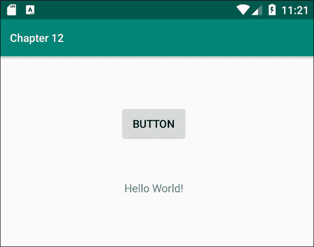
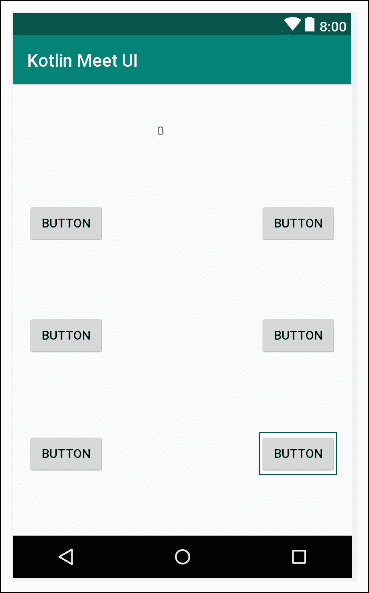
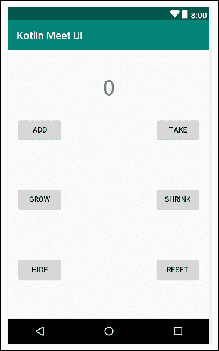
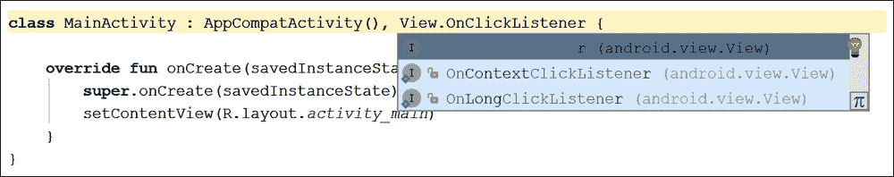
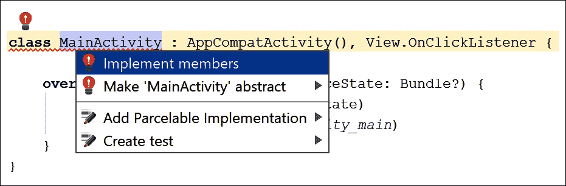
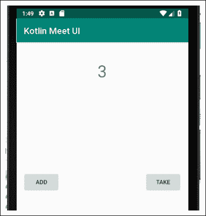
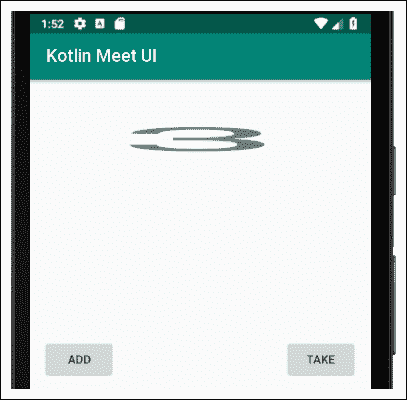
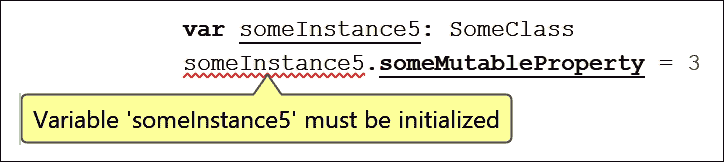

# 第十二章。将我们的 Kotlin 连接到用户界面和可空性

到本章结束时，我们的 Kotlin 代码和我们的 XML 布局之间缺失的链接将被完全揭示，留给我们像以前一样在布局中添加各种小部件和 UI 功能的能力，但这一次我们将能够通过我们的代码来控制它们。

在这一章中，我们将控制一些简单的用户界面元素，如`Button`和`TextView`，在下一章中，我们将进一步操作一系列用户界面元素。

为了让我们能够理解正在发生的事情，我们需要更多地了解应用程序中的内存，尤其是两个区域——T2 堆栈和 T4 堆。

在本章中，我们将涵盖以下主题:

*   安卓用户界面元素是类
*   碎片帐集
*   我们的用户界面已经堆好了
*   更多多态性
*   可空性–重新评估价值和风险值
*   铸造成不同类型

准备让你的 UI 变得生动起来。

# 所有安卓 UI 元素也是类

当我们的应用运行时，从`onCreate` 函数调用`setContentView`函数时，布局从 XML UI 中**膨胀**，并作为可用对象加载到内存中。它们存储在内存的一部分，称为堆。

但是这个堆的地方在哪里？我们当然看不到代码中的用户界面实例。我们究竟是如何得到它们的？

每个安卓设备内部的操作系统负责为我们的应用分配内存。此外，它在不同的地方存储不同类型的变量。

我们在函数中声明和初始化的变量存储在称为堆栈的内存区域中。我们已经知道如何用简单的表达式操作堆栈上的变量。那么，让我们再来谈谈堆。

### 注

重要事实:类的所有对象都是引用类型变量，只是对存储在堆上的实际对象的引用——它们不是实际对象。

将堆看作同一个仓库的一个独立区域，就像我们的常规变量存储的地方一样。堆有大量的地板空间用于放置奇怪形状的物体，架子用于放置较小的物体，大量的长排带有较小尺寸的小隔间，等等。这是存储对象的地方。问题是我们不能直接访问堆。把它想象成仓库的限制进入部分。你实际上不能去那里，但是你可以*参考*那里储存的东西。让我们看看参考变量到底是什么。

它是我们通过引用来引用和使用的变量。一个引用可以被松散但有用地定义为一个地址或位置。对象的引用(地址或位置)在堆栈上。

因此，当我们使用点运算符时，我们要求操作系统在特定位置执行任务，该位置存储在引用中。

### 类型

参考变量只是一个参考。它们是访问和操作对象(属性和函数)的一种方式，但它们不是实际的对象本身。

为什么我们会想要这样的系统？只要把我的东西给我就行了！原因如下。

## 一个扔垃圾的快速休息时间

这就是整个栈和堆的事情为我们所做的。

正如我们所知，操作系统为我们跟踪所有的对象，并将它们存储在仓库中一个名为堆的专用区域。当我们的应用程序运行时，操作系统将定期扫描堆栈，即我们仓库的常规机架，并将引用与堆上的对象进行匹配。任何没有匹配引用的对象都会被销毁。或者，用正确的术语来说，它收集垃圾。

想象一下，一辆极具辨识度的垃圾车行驶在我们的堆中间，扫描对象以匹配引用(在堆栈上)。没有引用意味着是垃圾回收。

如果一个对象没有相关的引用变量，我们无论如何也不可能对它做任何事情，因为我们没有办法访问它/引用它。这个垃圾收集系统通过释放未使用的内存来帮助我们的应用程序更高效地运行。

如果把这项任务留给我们，我们的应用程序编写起来会复杂得多。

因此，在函数内部声明的变量在堆栈上是局部的，并且只在声明它们的函数中可见。一个属性(对象的)在堆上，可以从任何引用它的地方引用，如果访问修饰符(封装)允许的话。

## 关于堆栈和堆的七个有用事实

让我们快速了解一下堆栈和堆的知识:

*   你不删除对象，但是操作系统在认为合适的时候发送垃圾收集器。这通常是在没有对对象的活动引用时。
*   变量在堆栈上，并且是声明它们的特定函数的本地变量。
*   属性在堆(及其对象/实例)上，但是对对象/实例(其地址)的引用是堆栈上的局部变量。
*   我们控制堆栈上的内容。我们可以使用堆上的对象，但只能通过引用它们。
*   垃圾收集器保持堆的干净和最新。
*   当不再有对对象的有效引用时，该对象将被垃圾收集。因此，当引用变量从堆栈中移除时，它的相关对象就可以进行垃圾收集了。而且，当操作系统决定时机成熟时(通常非常迅速)，它会释放内存以避免耗尽。
*   如果我们试图引用一个不存在的对象，我们将得到一个**空指针异常**错误，应用程序将崩溃。柯特林的主要特点之一是它保护我们免受这种情况的影响。在Kotlin试图改进的 Java 中，空指针异常错误是应用崩溃最常见的原因。我们将在本章末尾名为*可空性–*`val`*和* `var` *的章节中了解更多关于 Kotlin 如何帮助我们避免 **NullPointerException** 错误的信息。*

让我们继续前进，看看这些信息在控制用户界面方面到底给我们带来了什么。

## 那么，这个堆东西对我有什么帮助呢？

任何在 XML 布局中设置了`id`属性的用户界面元素都可以从堆中检索并使用它的引用，就像我们在前面两章中自己编写并声明的类一样。

如果我们用一个基本活动模板创建一个项目(请随意，但您不需要这样做)，将一个按钮拖到用户界面上，推断约束，并在模拟器上运行应用程序。然后，我们将看到下一张截图:



这是我们应该从前五章已经看到的内容中期待的。如果我们将这一行代码添加到`onCreate`函数中，那么将会发生一些有趣的事情:

```kt
button.text = "WOO HOO!"
```

再次运行应用，观察按钮的变化:


我们已经更改了按钮上的文字。

### 类型

在这一点上，如果你以前使用 Java 为安卓编程过，你可能想躺几分钟，想想从现在开始生活会有多轻松。

这非常令人兴奋，因为它表明我们可以从我们的布局中获取对一大堆东西的引用。然后，我们可以开始使用安卓应用编程接口提供的这些对象的所有功能和属性。

代码中的`button`实例引用了 XML 布局中`Button`小部件的`id`。我们的代码中的`text`实例引用了`Button`类的`text` 属性，而我们的代码中的`= "WOO HOO!"`文本使用`text`属性的设置器来更改它持有的值。

### 类型

如果`Button`类(或其他用户界面元素)有不同的`id`值，那么我们需要相应地调整我们的代码。

如果你认为在十一个章节之后，我们终于要开始用安卓做一些整洁的东西，你会是对的！

让我们了解一下 OOP 的另一个方面，然后我们将能够构建我们迄今为止功能最强大的应用程序。

# Kotlin接口

接口就像一个类。唷！那就没什么复杂的了。但是，它就像一个总是抽象的类，只有抽象的功能。

我们可以把一个接口想象成一个完全抽象的类，它的所有功能和属性都是抽象的。当属性是抽象的时，它不包含值。它没有属性的支持字段。但是，当另一个类实现(使用)接口时，它必须重写属性，从而提供后备字段来存储值。

简单地说，接口是无状态类。它们提供了一个没有任何数据的实现模板。

好的，所以你可以用抽象类来包装你的头脑，因为至少它可以传递它的函数中的一些功能，以及它的属性中的一些状态，这些不是抽象的，而是多态类型。

但是，说真的，这个界面似乎有点无意义。让我们看一个接口的最简单的例子，然后我们可以进一步讨论它。

要定义接口，我们键入以下内容:

```kt
interface SomeInterface { 

   val someProperty: String 
   // Perhaps more properties

   fun someFunction() 
   // Perhaps more functions
   // With or without parameters
   // and return types
}
```

接口的函数没有主体，因为它们是抽象的，但是它们仍然可以有返回类型和参数。

为了使用接口，我们在类声明后使用相同的`:`语法:

```kt
class SomeClass() : SomeInterface{ 

   // Overriding any properties
   // is not optional
   // It is an obligation for a class
   // that uses the interface
   override val someProperty: String = "Hello" 

   override fun someFunction() { 
      // This implementation is not optional
      // It is an obligation for a class
      // that uses the interface
   } 
}
```

在前面的代码中，属性和函数已经在实现接口的类中被覆盖。编译器强制接口的用户这样做，否则代码将无法编译。

如果您在实现一个或多个接口的同时从一个类继承，那么这个超类就简单地进入了接口列表。把不同的关系搞清楚，把超级班放在第一位，这是惯例。然而，编译器并不要求这样做。

这使我们能够对来自完全不相关的继承层次结构的多个不同对象使用多态性。如果一个类实现了一个接口，那么整个东西就可以像它是那个东西一样被传递或者使用，因为它就是那个东西。它是多态的(很多东西)。

我们甚至可以让一个类同时实现多个不同的接口。只需在每个接口之间添加一个逗号，并确保覆盖所有必要的功能。

在这本书里，我们将比自己编写更多地使用安卓应用编程接口的接口。在下一节中，我们将使用的一个这样的界面是`OnClickListener`界面。

很多东西可能想知道它们被点击的时间，比如`Button`小部件或者`TextView` 小部件。因此，使用一个界面，我们不需要为我们可能喜欢点击的每种用户界面元素提供不同的功能。

让我们在将我们的Kotlin代码与用户界面连接起来的同时，看看一个正在运行的界面。

# 在界面的帮助下，使用按钮和文本查看我们布局中的小部件

为了跟随这个项目，创建一个新的AndroidStudio项目，称之为`Kotlin Meet UI`，选择**空活动**模板。您可以在`Chapter12` `/Kotlin Meet UI` 文件夹中找到代码和 XML 布局代码。

首先，让我们通过观察以下步骤来构建一个简单的用户界面:

1.  在AndroidStudio的编辑器窗口中，切换到`activity_main.xml`并确保你在**设计**选项卡上。
2.  删除自动生成的`TextView`，上面写着“你好世界！”。
3.  将**文本视图**小部件添加到布局的顶部中心。
4.  将其**文本**属性设置为`0`，其`id`属性设置为`txtValue`，其 `textSize` 设置为`40sp`。注意`id`值的情况。它有一个大写的`V`。
5.  Now, drag and drop six buttons on to the layout so that it looks a bit like the following diagram. The exact layout isn't important:

    

6.  当布局如你所愿时，点击**推断约束**按钮约束所有的 UI 项。
7.  依次双击左键(从左到右，再从上到下)，设置`text`和`id`属性， 如下表所示:

    <colgroup><col style="text-align: left"><col style="text-align: left"></colgroup>
    | `text` 属性 | `id` 属性 |
    | `add` | `btnAdd` |
    |  |
    |  | T65 | `btnHide` |
    | `reset` | `btnReset` |

当完成后，你的布局应该如下图所示:



按钮上精确的位置和文本不是很重要，但是给`id`属性的值必须相同。原因是我们将使用这些`id`值从我们的Kotlin代码中获取对这个布局中的`Button`实例和`TextView`实例的引用。

切换到编辑器中的 **MainActivity.kt** 选项卡，找到以下一行:

```kt
class MainActivity : AppCompatActivity(){
```

现在将代码行修改如下:

```kt
class MainActivity : AppCompatActivity,
   View.OnClickListener{
```

当你输入时，你会得到一个弹出列表，要求你选择一个接口来实现。选择 **OnClickListener(安卓. view.view)** ，如下图所示:



### 类型

您需要导入`View`类。在继续下一步之前，请务必这样做，否则您会得到令人困惑的结果:

```kt
import android.view.View
```

请注意，`MainActivity`声明用红色下划线标出，表示有错误。现在，因为我们已经把`MainActivity`作为接口加入到`OnClickListener`中，所以我们必须实现`OnClickListener`的抽象功能。这个函数叫做`onClick`。当我们添加函数时，错误将消失。

我们可以让AndroidStudio在包含错误的代码上的任何地方左键点击，然后使用键盘组合 *Alt* + *进入*来为我们添加。左键点击**实现成员**，如下图截图所示:



现在，左键点击**确定**确认我们想要AndroidStudio添加`onClick`方法/功能。错误消失了，我们可以继续添加代码。我们还有一个`onClick`功能，我们很快就会看到我们将如何使用它。

### 注

术语快速笔记。一个**方法**是一个在类中实现的函数。Kotlin 允许程序员独立于类实现函数，所以所有的方法都是函数，但不是所有的函数都是方法。我选择将本书中的所有函数/方法都称为函数。有一种观点认为方法应该是一个更精确的术语，但是在这本书的上下文中，两者都是正确的。如果愿意，可以在类方法中调用函数。

现在，在类声明的内部，但在任何函数的外部/之前添加以下属性:

```kt
class MainActivity : AppCompatActivity(), View.OnClickListener {

 // An Int property to hold a value
 private var value = 0

```

我们已经声明了一个名为`value`的`Int`属性，并将其初始化为`0`。请注意，它是`var`属性，因为我们需要更改它。

接下来，在`onCreate`函数中，添加以下六行代码:

```kt
// Listen for all the button clicks
btnAdd.setOnClickListener(this)
btnTake.setOnClickListener(this)
txtValue.setOnClickListener(this)
btnGrow.setOnClickListener(this)
btnShrink.setOnClickListener(this)
btnReset.setOnClickListener(this)
btnHide.setOnClickListener(this)
```

### 类型

使用*Alt*+*+**进入*键盘组合，从`activity_main.xml`布局文件导入所有`Button`和`TextView`实例。或者，手动添加以下导入语句:

```kt
import kotlinx.android.synthetic.main.activity_main.* 
```

前面的代码设置了我们的应用程序来监听布局中按钮的点击。每一行代码都做同样的事情，但是在不同的按钮上。例如`btnAdd`是指我们布局中`id`属性值为`btnAdd`的按钮，`btnTake`是指我们布局中`id`属性值为`btnTake`的按钮。

然后每个按钮实例调用自身的`setOnClickListener`功能。传入的参数是`this`。记住从[第 10 章](12.html "Chapter 10. Object-Oriented Programming")、*面向对象编程*、`this`指的是当前编写代码的类。因此，在前面的代码中，`this`指的是`MainActivity`。

`setOnClickListener`功能设置我们的 app 调用`OnClickListener`界面的`onClick`功能。现在，只要我们的一个按钮被点击，就会调用`onClick`功能。这一切都是因为`MainActivity`实现了`OnClickListener`接口。

如果你想验证这一点，暂时从类声明的末尾删除`View.OnClickListener`代码，我们的代码会突然布满一片红色的错误海洋。这是因为`this`不再是`OnCLickListener`类型，因此不能传递给各个按钮的`setOnClickListener`功能，`onClick`功能也会显示错误，因为编译器不知道我们试图覆盖什么。接口是所有这些功能结合在一起的原因。

### 类型

如果您之前删除了类声明末尾的`View.OnClickListener`，请将其替换。

现在，向下滚动到我们实现`OnClickListener`界面后，AndroidStudio为我们添加的`onClick`功能。添加`Float size`变量声明和一个空`when`块，使它看起来像下面的代码。接下来突出显示要添加的新代码。还有一件事要注意，并在下一个代码中实现。当`onClick`功能由AndroidStudio自动生成时，`v: View?`参数后面加了一个问号。删除问号，如以下代码所示:

```kt
override fun onClick(v: View) {
 // A local variable to use later
 val size: Float

 when (v.id) {

 }
}
```

请记住`when`将检查表达式的匹配值。`when`条件是`v.id`。`v`变量被传递给`onClick`功能，`v.id`标识被点击按钮的`id`属性。它将匹配布局中我们的一个按钮的`id`。

### 注

如果你对我们删除的那个奇怪的问号感到疑惑，它将在下一节中解释:*可空性–val 和 var 再次讨论。*

我们接下来需要做的是处理每个按钮发生的事情。将下一段代码添加到`when`表达式的左括号和右括号中，然后我们将讨论它。先试着自己算出代码，因为你会惊喜地发现我们已经了解了这么多:

```kt
R.id.btnAdd -> {
   value++
   txtValue.text = "$value"
}

R.id.btnTake -> {
   value--
   txtValue.text = "$value"
}

R.id.btnReset -> {
   value = 0
   txtValue.text = "$value"
}

R.id.btnGrow -> {
   size = txtValue.textScaleX
   txtValue.textScaleX = size + 1
}

R.id.btnShrink -> {
   size = txtValue.textScaleX
   txtValue.textScaleX = size - 1
}

R.id.btnHide -> 
   if (txtValue.visibility 
            == View.VISIBLE) {
   // Currently visible so hide it
   txtValue.visibility = View.INVISIBLE

   // Change text on the button
   btnHide.text = "SHOW"

} else {
   // Currently hidden so show it
   txtValue.visibility = View.VISIBLE

   // Change text on the button
   btnHide.text = "HIDE"
}
```

这里又是第一行代码:

```kt
override fun onClick(v: View) {
```

`View`是`Button`、`TextView`等的父类。因此，也许正如我们所料，使用`v.id`将返回已经被点击的用户界面小部件的`id`属性，这首先触发了对`onClick`的调用。

然后我们需要做的就是为我们想要响应的每个`Button` id 值提供一个`when`语句(和一个适当的动作)。为了方便起见，下面是代码的这一部分:

```kt
when (v.id) {

}
```

再看看代码的下一部分:

```kt
R.id.btnAdd -> {
   value++
   txtValue.text = "$value"
}

R.id.btnTake -> {
   value--
   txtValue.text = "$value"
}

R.id.btnReset -> {
   value = 0
   txtValue.text = "$value"
}
```

前面的代码是前三个`when`分支。他们处理`R.id.btnAdd`、`R.id.btnTake`和`R.id.btnReset`。

`R.id.btnAdd`分支中的代码只是增加`value`变量，然后它做一些新的事情。

它设置`txtValue`对象的属性。这会导致`TextView` 显示`value`中存储的任何值。

**TAKE** 按钮(`R.id.btnTake`)做的完全一样，只是它从`value` 中减去一，而不是加一。

`when`语句的第三个分支处理**重置**按钮，将`value`设置为零，并再次更新`txtValue`的`text`属性。

无论执行哪个`when`分支结束，整个`when`块都退出，`onClick`功能返回，生活恢复正常——直到用户下一次点击。

让我们继续检查`when`块的下两个分支。为了您的方便，它们再次出现在这里:

```kt
R.id.btnGrow -> {
   size = txtValue.textScaleX
   txtValue.textScaleX = size + 1
}

R.id.btnShrink -> {
   size = txtValue.textScaleX
   txtValue.textScaleX = size - 1
}
```

下一个两个分支从我们的用户界面处理**收缩**和**增长**按钮。我们可以从 id 的`R.id.btnGrow`值和`R.id.btnShrink`值来确认这一点。新的更有趣的是按钮上使用的`TextView`类的获取器和设置器。

`textScaleX`属性的 getter 返回使用它的对象中文本的水平比例。我们可以看到它使用的对象是我们的`TextView txtValue`实例。代码行开头的`size =`代码将返回值赋给我们的`Float`变量`size`。

每个`when`分支中的下一个代码行使用`textScaleX`属性的设置器更改文本的水平比例。按下**生长**按钮，刻度设置为`size + 1`，按下**收缩**按钮，刻度设置为`size - 1`。

总体效果是允许这两个按钮在每次点击时以`1`的比例放大和缩小`txtValue`中的文本。

让我们看看`when`代码的最后一个分支。为了您的方便，这里再重复一遍:

```kt
R.id.btnHide -> 
   if (txtValue.visibility == View.VISIBLE) {
      // Currently visible so hide it
      txtValue.visibility = View.INVISIBLE

      // Change text on the button
      btnHide.text = "SHOW"

   } else {
      // Currently hidden so show it
      txtValue.visibility = View.VISIBLE

      // Change text on the button
      btnHide.text = "HIDE"
   }
```

前面的代码需要一点解释，所以让我们一步一步来。首先，有一个`if`–`else`表达式嵌套在`when`分支中。这里又是`if`部分:

```kt
if (txtValue.visibility == View.VISIBLE)
```

待评估的条件为`txtValue.visibility == View.VISIBLE`。第一部分，在`==`操作符之前，使用`visibility`属性的 getter 返回描述`TextView`当前是否可见的值。返回值将是`View`类中定义的三个可能的常数值之一。分别是`View.VISIBLE`、`View.INVISIBLE,`、`View.GONE`。

如果用户在用户界面上看到`TextView`，获取器返回`View.VISIBLE`，条件为评估为`true,`，执行`if` 块。

在`if`块中，我们使用`visibility`属性的设置器，并使用`View.INVISIBLE`值使其对用户不可见。

除此之外，我们使用`text`属性的设置器将`btnHide`对象上的文本更改为**显示**。

在`if`块执行后，`txtValue`将是不可见的，我们的用户界面上有一个按钮，上面写着**显示**。当用户在这种状态下点击时，`if`语句将为假，并且`else`块将执行。在`else`街区，我们扭转了局面。我们将`txtValue`对象的`visibility`属性设置回`View.VISIBLE`，将`btnHide`上的`text`属性设置回 **HIDE** 。

如果这有任何不清楚的地方，只需输入代码，运行应用程序，并在您看到最后的代码和解释后重新访问它。

我们已经有了用户界面和代码，所以现在是时候运行应用程序并尝试所有按钮了。注意**添加**和**获取**按钮在任一方向上将`value`的值改变一，然后在`TextView`中显示结果。在下一张图片中，我点击了三次**添加**按钮:



注意的**收缩**和**增长**按钮增加了文本的宽度，**重置**将`value`变量设置为零并显示在`TextView`上。在下面的截图中，我已经点击了 **GROW** 按钮八次:



最后，**隐藏**按钮不仅隐藏了`TextView,`还将自己的文本更改为**显示**，如果再次点击，确实会重新显示`TextView`。

### 类型

我不会给你看隐藏的东西的图像来打扰你。请务必在模拟器中尝试该应用程序，并跟随本书。如果您想知道`View.INVISIBLE`和`View.GONE`之间的区别，`INVISIBLE`只是隐藏了对象，但是当使用`GONE`时，布局的行为就像对象从未存在过一样，因此会影响其余用户界面的布局。将代码行从`INVISIBLE`更改为`GONE`，并运行应用程序观察差异。

请注意在这个应用程序中不需要`Log`或`Toast`，因为我们最终使用Kotlin代码来操作用户界面。

# 可空性–重新评估价值和风险值

当我们用`val` 声明一个类的实例时，并不意味着我们不能改变属性中的值。决定我们是否可以重新分配属性持有的值的是属性本身是`val` 还是`var`。

当我们用`val`声明一个类的实例时，这只是意味着我们不能给它重新分配另一个实例。当我们想要重新分配给一个实例时，我们必须用`var`声明它。以下是一些例子:

```kt
val someInstance = SomeClass()
someInstance.someMutableProperty = 1// This was declared as var
someInstance.someMutableProperty = 2// So we can change it

someInstance.someImutableProperty = 1
// This was declared with val. ERROR!
```

在前面的假设代码中，声明了一个名为`someInstance`的实例，它属于`SomeClass`类型。它被宣布为`val`。接下来的三行代码表明，如果用`var`声明其属性，我们可以更改那些属性，但是，正如我们已经了解到的，当用`val`声明属性时，我们不能更改它。那么，用`val`或者`var`声明一个实例到底是什么意思呢？看看下面这个假设的代码:

```kt
// Continued from previous code
// Three more instances of the same class
val someInstance2 = SomeClass() // Immutable
val someInstance3 = SomeClass()// Immutable
var someInstance4 = SomeClass() // Mutable

// Let's change these instances around— or try to
someInstance = someInstance2 
// Error cannot reassign, someInstance is immutable

someInstance2 = someInstance3 // Error someInstance2 is immutable
someInstance3 = someInstance4 // Error someInstance3 is immutable

// However,
someInstance4 = someInstance 
// No problem! someInstance4 and someInstance are now the
// same object— refer to the same object on the heap

// Sometime in the future…
someInstance4 = someInstance3 // No problem
// Sometime in the future…
someInstance4 = someInstance2 // No problem
// Sometime in the future…
// I need a new SomeClass instance

someInstance4 = SomeClass() // No problem
// someInstance4 now uniquely refers 
// to a new object on the heap
```

前面的代码表明，当一个实例是`val`时，它不能被重新分配来引用堆中的不同对象，但是当它是`var`时，它可以。实例是`val`还是`var`并不影响其属性是`val`还是`var`。

我们已经在讨论属性时了解到，如果不需要改变值，那么声明为`val`是一个很好的做法。对象/实例也是如此。如果我们不需要重新分配实例，我们应该将其声明为`val`。

## 空对象

当我们将一个对象或属性声明为`var`时，我们可以选择不立即初始化它，有时这就是我们需要的。当我们不初始化一个对象时，它被称为**空引用**，因为它不引用任何东西。我们经常需要声明一个对象，但是直到我们的应用程序运行时才初始化它，但是这可能会导致一个问题。看一些更假设的代码:

```kt
var someInstance5: SomeClass
someInstance5.someMutableProperty = 3
```

在前面的代码中，我们已经声明了一个名为`someInstance5`的`SomeClass`的新实例，但是我们还没有初始化它。现在，看看这个截图，看看当我们在初始化这个实例之前尝试使用它时会发生什么:



编译器不会允许我们这样做。当我们在程序执行过程中需要初始化一个实例时，我们必须专门将其初始化为`null`，这样编译器就知道它是有意的。此外，当我们将一个实例初始化为`null`时，我们必须使用**可空操作符**。请看下一个假设的代码，它解决了我们刚刚看到的问题:

```kt
var someInstance5: SomeClass? = null
```

在前面的代码中，可空运算符用在`SomeClass?`类型的末尾，实例被初始化为`null`。当我们使用可空操作符时，我们可以认为实例是一种不同的类型–*some class 可空*，而不仅仅是 *SomeClass* 。

然后，我们可以在代码中随时初始化实例。我们将在[第 14 章](16.html "Chapter 14. Android Dialog Windows")、*安卓对话窗口*以及本书的其余部分看到一些真实的例子，但是现在，这里有一个假设的方法，我们可以有条件地初始化这个空对象:

```kt
var someBoolean = true
// Program execution or user input might change 
// the value of someBoolean 

if(someBoolean) {
   someInstance5 = someInstance
}else{
   someInstance5 = someInstance2
}
```

然后我们可以正常使用`someInstance5`。

### 安全呼叫接线员

有时候我们需要更多的灵活性。假设我们需要`someInstance5`中某个属性的值，但是无法保证已经初始化？在这种情况下我们可以使用**安全呼叫** `?` 接线员:

```kt
val someInt = someInstance5?.someImmutableProperty
```

在前面的代码中，如果`someInstance5` 已经初始化，存储在`someImmutable`属性中的值将用于初始化`someInt`。如果还没有初始化，那么`someInt`将被初始化为空。因此，请注意`someInt`被推断为`Int`可空类型，而非普通`Int`。

### 非空断言

将会出现这样的情况:在编译时，我们不能保证实例被初始化，并且不可能让编译器满意。在这种情况下，我们必须用**非空断言** `!!` 运算符断言对象不为空。考虑以下代码:

```kt
val someBoolean = true
if(someBoolean) {
   someInstance5 = someInstance
}

someInstance5!!.someMutableProperty = 3
```

在前面的代码中，有可能`someInstance5`没有被初始化，我们使用了非空断言操作符，或者代码没有被编译。

还要注意，如果我们写了一些错误的逻辑，并且当我们使用它时实例仍然为空，那么应用程序将会崩溃。事实上，`!!`操作符应该尽量少用，因为安全呼叫操作符是首选。

## 审查中的可空性

可空性比我们到目前为止讨论的更多。可以写很多页来讨论不同运算符的不同用法，而且还有更多。关键是，Kotlin 旨在尽可能帮助我们避免因空对象而导致的崩溃。然而，看到可空类型、安全调用操作符和非空断言操作符在起作用，要比从理论上对它们进行阐述更有启发性。我们会在整本书中经常碰到他们三个，希望他们的背景比他们的理论更有启发性。

# 总结

在这一章中，我们终于在代码和用户界面之间进行了一些真正的交互。事实证明，每次我们向用户界面添加一个小部件时，我们都在添加一个类的 Kotlin 实例，我们可以通过代码中的引用来访问它。所有这些对象都与我们自己的类的任何实例一起存储在一个名为堆的独立内存区域中。

我们现在可以了解一些更有趣的小部件，并做一些很酷的事情。我们将在下一章[第 13 章](15.html "Chapter 13. Bringing Android Widgets to Life")、*将安卓小部件带入生活*中查看大量的小部件，并且我们还将在本书的其余部分不断介绍新的小部件。