# 第十四章。安卓对话窗口

在本章中，我们将学习如何向用户呈现一个弹出对话框窗口。然后，我们可以把我们所知道的一切放入我们第一个多章节应用程序的第一阶段*自我注释*。然后，我们将在本章和随后的四章(直到[第 18 章](20.html "Chapter 18. Localization")、*本地化*)中了解更多安卓和柯特林功能，然后使用我们新获得的知识来增强 Note to self 应用。

在每一章中，我们还将从这个主应用程序中选择一些较小的应用程序。那么，[第十四章](# "Chapter 14. Android Dialog Windows")、*安卓对话窗口*为你储备了什么？本章将涵盖以下主题:

*   用弹出对话框实现一个简单的应用程序
*   了解如何使用`DialogFragment`开始“自我提示”应用程序
*   启动“自我注释”应用程序，学习如何在项目中添加字符串资源，而不是在布局中硬编码文本
*   实现更复杂的对话框来捕获用户的输入

那么，让我们开始吧。

# 对话框窗口

通常在我们的应用程序中，我们会希望向用户显示一些信息，或者要求在弹出窗口中确认某个操作。这就是所谓的**对话框**窗口。如果你快速扫描安卓工作室的调色板，你可能会惊讶地发现没有提到任何对话窗口。

安卓中的对话框窗口比简单的小部件甚至整个布局都要高级。这些类也可以有自己的布局和其他用户界面元素。

在安卓中创建对话框窗口的最好方法是使用`DialogFragment`类。

### 类型

碎片在安卓中是一个广泛而重要的话题，我们将在本书的后半部分花很多时间来探索和使用它们。然而，为我们的用户创建一个整洁的弹出对话框(使用`DialogFragment`)进行交互是对片段的一个很好的介绍，一点也不复杂。

## 创建对话框演示项目

我们之前提到在 Android 中创建对话框窗口的最好方法是使用`DialogFragment`类。然而，有另一种方法可以在安卓系统中创建对话框，可以说是简单了一点。这个更简单的`Dialog`类的问题是它在活动生命周期中没有得到很好的支持。甚至有可能使用`Dialog`会意外导致应用崩溃。

如果你正在编写一个固定方向布局的应用程序，只需要一个简单的弹出对话框，可以说应该使用更简单的`Dialog`类。但是，由于我们的目标是构建具有高级功能的现代专业应用程序，因此忽略这一类会让我们受益。

使用**空活动**项目模板在安卓工作室创建一个新项目，并将其称为`Dialog Demo`。这个项目的完整代码在下载包的`Chapter14/Dialog Demo`文件夹中。

## 编码一个对话片段类

在安卓工作室中创建一个新类，方法是右键单击包含你的包名的文件夹(包含`MainActivity.kt`文件的文件夹)。选择**新建** | **柯特林文件/类**，命名为`MyDialog`，在下拉选择器中选择**类**。左键点击**确定**创建类。

首先需要做的是将类声明改为从`DialogFragment`继承。另外，让我们添加这个类中需要的所有导入。完成后，您的新班级将如下所示:

```kt
import android.app.Dialog
import android.os.Bundle
import androidx.appcompat.app.AlertDialog
import androidx.fragment.app.DialogFragment

class MyDialog : DialogFragment() {    
}
```

现在，让我们一次向这个类添加一点代码，并解释每一步发生了什么。

与安卓应用编程接口中的许多类一样，`DialogFragment`为我们提供了一些函数，我们可以覆盖这些函数来与类中发生的不同事件进行交互。

添加以下高亮显示的代码，覆盖`onCreateDialog`功能。仔细研究它，然后我们将检查正在发生的事情:

```kt
class MyDialog : DialogFragment() {

    override
 fun onCreateDialog(savedInstanceState: Bundle?): Dialog {

 // Use the Builder class because this dialog
 // has a simple UI.
 // We will use the more flexible onCreateView function
 // instead of onCreateDialog in the next project
 val builder = AlertDialog.Builder(this.activity!!)

 // More code here soon
 }
}
```

### 注

代码中有一个错误，因为我们缺少 return 语句，该语句需要返回一个类型为`Dialog`的对象。当我们很快完成函数的剩余部分的编码时，我们将添加这个。

在我们刚刚添加的代码中，我们首先添加被覆盖的`onCreateDialog`函数，当我们稍后用来自`MainActivity`类的代码显示对话框时，安卓将调用该函数。

然后，在`onCreateDialog`函数中，我们得到了一个新类的实例。我们声明并初始化一个`AlertDialog.Builder`类型的对象，它需要一个对`MainActivity`类的引用来传递到它的构造函数中。这就是为什么我们用`activity!!`作为论据；我们断言该实例不为 null(！！).

### 类型

参考[第 12 章](14.html "Chapter 12. Connecting Our Kotlin to the UI and Nullability")、*连接我们的科特林到用户界面和可空性*，了解非空断言(`!!`)的更新。

`activity`属性是`Fragment`类的一部分(因此也是`DialogFragment`的一部分)，并且是对将创建`DialogFragment`实例的`Activity`类实例的引用。在这种情况下，这就是我们的`MainActivity`班。

现在我们已经声明并初始化了`builder`，让我们看看我们可以用它做什么。

### 使用链接配置 DialogFragment 类

现在我们可以用我们的`builder`对象来做剩下的工作了。接下来的三个代码块有点奇怪。如果你向前看并快速扫描它们，你会注意到点运算符有三种用法，但实际上只有一种用法放在`builder`对象旁边。这表明这三个明显的代码块实际上只是编译器的一行。

我们已经看到了这里发生的事情，但是是在一个不太明显的情况下。当我们创建一个`Toast`消息并在它的末尾添加一个`.show()`调用时，我们就是**链接**。也就是说，我们在同一对象上按顺序调用多个函数。这相当于写多行代码；这样会更清晰、更简短。

在我们在`onCreateDialog`中添加的前一个代码之后添加这个利用链接的代码，检查它，然后我们将讨论它:

```kt
// Dialog will have "Make a selection" as the title
builder.setMessage("Make a selection")
   // An OK button that does nothing
   .setPositiveButton("OK", { dialog, id ->
      // Nothing happening here
   })
   // A "Cancel" button that does nothing
   .setNegativeButton("Cancel", { dialog, id ->
      // Nothing happening here either
   })
```

我们添加的三部分代码可以解释如下:

1.  在使用链接的三个块的第一个中，我们调用`builder.setMessage`，它设置了用户将在对话框中看到的主消息。此外，请注意，在链式函数调用的各个部分之间有注释是没有问题的，因为编译器会完全忽略这些注释。
2.  然后，我们用`setPositiveButton`函数在对话框中添加一个按钮，第一个参数将按钮上的文本设置为`OK`。第二个参数是一个 lambda，它实现了处理按钮点击的`DialogInterface.OnClickListener`。请注意，我们不会向`onClick`函数添加任何代码，但是我们可以，就像我们在上一章中所做的那样。我们只想看到这个简单的对话框，我们将在下一个项目中更进一步。
3.  接下来，我们在同一个`builder`对象上调用另一个函数。这次是`setNegativeButton`功能。同样，这两个参数将`Cancel`设置为按钮的文本，λ用于设置点击的监听。同样，出于本演示的目的，我们不会在被覆盖的`onClick`功能中采取任何行动。

接下来，我们将对`return`语句进行编码，以完成功能并消除错误。将`return`语句添加到`onCreateDialog`函数的末尾(但将其保留在最后一个大括号内):

```kt
   // Create the object and return it
   return builder.create()
}// End of onCreateDialog
```

最后一行代码的效果是返回到`MainActivity`(它将首先调用`onCreateDialog`)我们新的、完全配置的对话框窗口。我们将很快看到并添加这个调用代码。

既然我们有了从`FragmentDialog`继承的`MyDialog`类，我们所要做的就是声明`MyDialog`的一个实例，实例化它，并调用它被覆盖的`onCreateDialog`函数。

## 使用 DialogFragment 类

在我们转到代码之前，让我们通过观察以下步骤在布局中添加一个按钮:

1.  切换到`activity_main.xml`选项卡，然后切换到**设计**选项卡。
2.  将**按钮**部件拖到布局上，并确保其`id`属性设置为`button`。
3.  单击**推断约束**按钮，将按钮精确约束在您放置的位置，但位置并不重要；我们将如何使用它来创建我们的`MyDialog`类的实例是关键的一课。

现在切换到`MainActivity.kt`选项卡，我们将使用一个 lambda 来处理这个新按钮的点击，就像我们在[第 13 章](15.html "Chapter 13. Bringing Android Widgets to Life")、*在小部件探索应用程序期间将安卓小部件带入生活*中所做的那样。我们这样做是因为我们在布局中只有一个按钮，这似乎比做另一个选择更明智和紧凑(也就是说，实现`OnClickListener`接口，然后像我们在[第 12 章](14.html "Chapter 12. Connecting Our Kotlin to the UI and Nullability")、*中那样为整个`MainActivity`类覆盖`onClick`，将我们的 Kotlin 连接到用户界面和可空性*)。

在调用`setContentView`后，将以下代码添加到`MainActivity`的`onCreate`功能中:

```kt
val button = findViewById<Button>(R.id.button)
// We could have removed the previous line of code by
// adding the ...synthetic.main.activity_main.* import
// as an alternative

button.setOnClickListener {
   val myDialog = MyDialog()
   myDialog.show(supportFragmentManager, "123")
   // This calls onCreateDialog
   // Don't worry about the strange looking 123
   // We will find out about this in chapter 18
}
```

### 注

该代码需要以下`import`语句:

```kt
import android.widget.Button;
```

请注意，代码中唯一发生的事情是`setOnClickListener`λ覆盖了`onClick`。这意味着当按钮被按下时，`MyDialog`的新实例被创建并调用其`show`函数，这将显示我们的对话框窗口，就像我们在`MyDialog`类中配置它一样。

`show`函数需要引用`FragmentManager`，这是我们从`supportFragmentManager`属性得到的。这是跟踪和控制`Activity`实例的所有片段实例的类。我们也传入一个 ID ( `"123"`)。

当我们更深入地观察片段时，更多关于`FragmentManager`的细节将会被揭示，从[第 24 章、](26.html "Chapter 24. Design Patterns, Multiple Layouts, and Fragments") *设计模式、多重布局和片段*开始。

### 注

我们使用`supportFragmentManager`属性的原因是因为我们通过扩展`AppCompatActivity`来支持旧设备。如果我们简单地扩展`Activity`，那么我们可以使用`fragmentManager`属性。不利的一面是，这款应用不会在许多旧设备上运行。

现在我们可以运行应用程序，欣赏我们点击布局中的按钮时出现的新对话框窗口。请注意，单击对话框窗口中的任一按钮都会将其关闭；这是默认行为。下面的截图显示了我们的对话窗口在平板电脑模拟器上的运行情况:

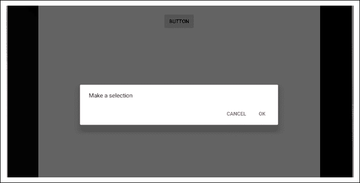

接下来，我们将制作另外两个实现对话框的类，作为我们的多章节自我笔记应用程序的第一阶段。我们将会看到，一个对话窗口几乎可以有我们选择的任何布局，并且我们不必依赖`Dialog.Builder`类提供给我们的简单布局。

# 自我应用注意事项

欢迎来到我们将在本书中实现的第一个多章节应用程序。当我们做这些项目时，我们会比做较小的应用程序做得更专业。在这个项目中，我们将使用字符串资源，而不是在布局中硬编码文本。

有时候，当你试图学习一个新的安卓或柯特林话题时，这些东西可能会被过度使用，但在实际项目中尽快开始使用它们是有用和重要的。它们很快就变成了第二天性，我们应用程序的质量将从中受益。

## 使用字符串资源

在[第 3 章](05.html "Chapter 3. Exploring Android Studio and the Project Structure") *探索安卓工作室和项目结构*中，我们讨论了在布局文件中使用字符串资源而不是硬编码文本。这样做有一些好处，但也有点啰嗦。

由于这是我们的第一个多章项目，这是一个以正确的方式做事的好时机。如果您想快速了解 String 资源的优势，请参考[第 3 章](05.html "Chapter 3. Exploring Android Studio and the Project Structure") *探索 Android Studio 和项目结构*。

## 如何获取笔记自带应用的代码文件

完整的应用程序，包括所有代码和资源，可以在下载包的`Chapter18/Note to self`文件夹中找到。当我们在接下来的五章中实现这个应用程序时，在每一章的末尾看到部分完成的、可运行的应用程序也是很有用的。部分完成、可运行的应用程序及其所有相关代码和资源可以在各自的文件夹中找到:

`Chapter14/Note to self`

`Chapter16/Note to self`

`Chapter17/Note to self`

`Chapter18/Note to self`

### 注

在[第 15 章](17.html "Chapter 15. Handling Data and Generating Random Numbers")、*处理数据和生成随机数*中没有 Note to self 代码，因为虽然我们会了解到 Note to self 中使用的主题，但是直到[第 16 章](18.html "Chapter 16. Adapters and Recyclers")、*适配器和回收器*我们才会对应用进行更改。

请注意，这些文件夹中的每一个都包含一个单独的、可运行的项目，并且还包含在其自己的唯一包中。这是为了让你可以很容易地看到应用程序运行，因为它会做后，完成一个给定的章节。复制和粘贴代码时，注意不要包含包名，因为它可能与您的包名不同，导致代码无法编译。

如果你跟随并打算从头到尾建立笔记，我们将建立一个项目，简称为`Note to self`。然而，仍然没有什么能阻止你在任何时候从每章的项目代码文件中进行复制和粘贴。只是不要从文件顶部复制包指令。此外，请注意，在说明中的几个地方，您将被要求删除或替换前一章中偶尔出现的代码行。

因此，即使您复制和粘贴的内容比键入的代码多，也一定要完整阅读说明，并查看书中的代码，以获得可能有用的额外注释。

在每一章中，代码将被呈现为好像您已经完整地完成了最后一章，在必要的地方显示来自前面章节的代码，作为新代码的上下文。

每一章都不会只专注于自我应用笔记。我们将学习其他相关的东西，并建立一些更小更简单的应用程序。因此，当我们谈到自我实现的注意事项时，我们将为此做好技术准备。

## 已完成的应用

以下功能和截图来自已完成的 app。显然，在不同的发展阶段，情况会略有不同。必要时，我们将查看更多图像，或者作为提醒，或者查看整个开发过程中的差异。

完成后的应用程序将允许用户点击应用程序右下角的浮动按钮图标，打开一个对话框窗口添加新的注释。以下屏幕截图显示了这一突出显示的功能:

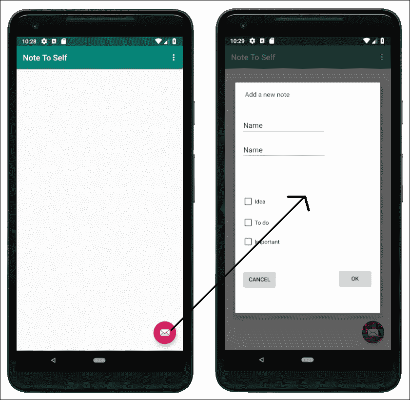

左边的截图显示了要点击的按钮，右边的截图显示了用户可以添加新注释的对话框窗口。

最终，随着用户添加更多的笔记，他们将在应用程序的主屏幕上看到他们添加的所有笔记的列表，如下图所示。用户可以选择该笔记是**重要的**、一个**想法**和/或一个**要做的**笔记:

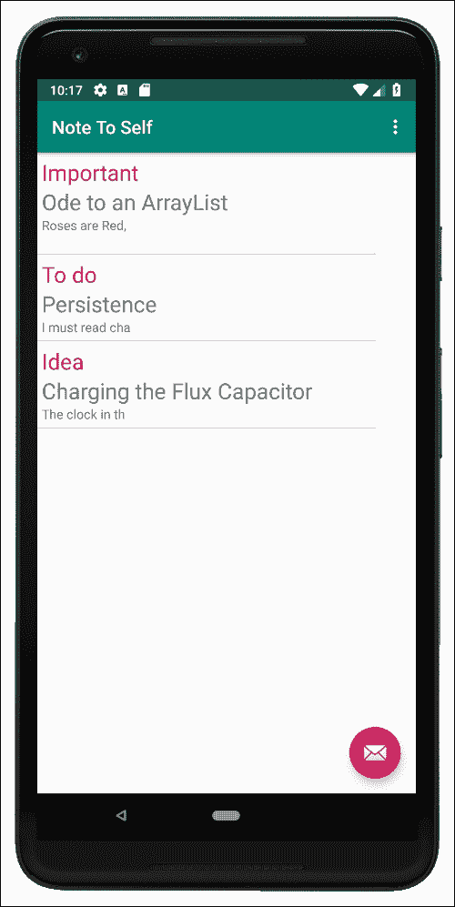

他们将能够滚动列表并点击一个笔记，以看到它显示在另一个专用于该笔记的对话框窗口中。这是显示注释的对话框窗口:

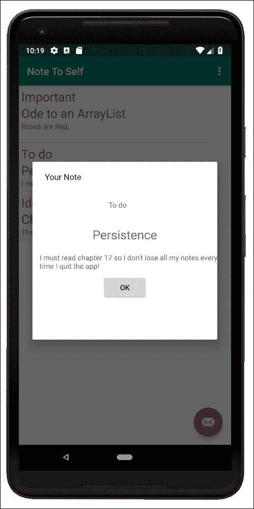

还有一个简单(非常简单)的设置屏幕，可以从菜单中访问，允许用户配置笔记列表是否用分隔线格式化。以下是正在运行的设置菜单选项:

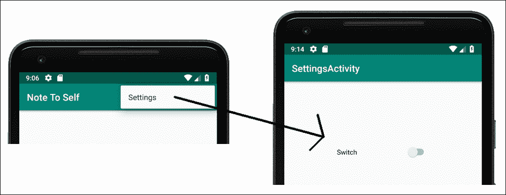

现在我们确切地知道我们将要构建什么，我们可以开始着手实施它。

## 建设项目

让我们现在创建我们的新项目。调用项目`Note to Self`并使用**基本活动**模板。记得从[第三章，](05.html "Chapter 3. Exploring Android Studio and the Project Structure") *探索安卓工作室和项目结构，*这个模板会生成一个简单的菜单和一个浮动动作按钮，这两个都用在这个项目中。将其他设置保留为默认设置。

## 准备字符串资源

在这里，我们将创建我们将从布局文件中引用的所有字符串资源，而不是像我们到目前为止一直在做的那样硬编码`text`属性。严格来说，这是一个可以避免的步骤。然而，如果你想制作深入的安卓应用程序，你会从学习这样做中受益。

首先，从项目浏览器的`res/values`文件夹中打开`strings.xml`文件。您将看到自动生成的资源。添加以下突出显示的字符串资源，我们将在项目的其余部分使用这些资源。在关闭`</resources>`标签前添加代码:

```kt
...
<resources>
    <string name="app_name">Note To Self</string>
    <string name="hello_world">Hello world!</string>
    <string name="action_settings">Settings</string>

    <string name="action_add">add</string>
    <string name="title_hint">Title</string>
    <string name="description_hint">Description</string>
    <string name="idea_text">Idea</string>
    <string name="important_text">Important</string>
    <string name="todo_text">To do</string>
    <string name="cancel_button">Cancel</string>
    <string name="ok_button">OK</string>

    <string name="settings_title">Settings</string>
    <string name="theme_title">Theme</string>
    <string name="theme_light">Light</string>
    <string name="theme_dark">Dark</string>

</resources>
```

观察前面代码中的，每个字符串资源都有一个唯一的`name`属性，并将其与所有其他属性区分开来。`name`属性还为它所代表的实际字符串值提供了一个有意义的，并且希望是令人难忘的线索。我们将使用这些名称值来引用我们希望在布局文件中使用的字符串。

## 对笔记类进行编码

这是app 的基本数据结构。这是一个我们将从头开始编写的类，它具有我们表示单个用户注释所需的所有属性。在[第 15 章](17.html "Chapter 15. Handling Data and Generating Random Numbers") *处理数据和生成随机数*中，我们将学习一些新的科特林代码，以了解如何让用户拥有几十个、几百个甚至几千个笔记。

通过右键单击与您的包同名的文件夹来创建一个新的类，通常是包含`MainActivity.kt`文件的文件夹。选择**新建** | **科特林文件/类**，命名为`Note`，从下拉选择器中选择**类**。左键点击**确定**创建类。

向新的`Note`类添加以下代码:

```kt
class Note {
    var title: String? = null
    var description: String? = null
    var idea: Boolean = false
    var todo: Boolean = false
    var important: Boolean = false
}
```

我们有一个没有函数的简单类，叫做`Note`。该类有五个`var`属性，分别叫做`title`、`description`、`idea`、`todo`和`important`。它们的用途是保存用户笔记的标题、笔记的描述(或内容)，并分别详细说明笔记是想法、待办事项还是重要笔记。现在让我们设计两个对话框窗口的布局。

## 实现对话设计

现在我们会做一些我们以前做过很多次的事情，但是这次，因为不同的原因。如您所知，我们将有两个对话框窗口，一个供用户输入新注释，另一个供用户查看他们选择的注释。

我们可以设计这两个对话框窗口的布局，就像我们以前设计所有布局一样。当我们开始为`FragmentDialog`类创建 Kotlin 代码时，我们将学习如何合并这些布局。

首先，让我们按照以下步骤为“新注释”对话框添加布局:

1.  右键单击项目浏览器中的`layout`文件夹，选择**新建** | **布局资源文件**。在**文件名:**字段中输入`dialog_new_note`，然后在**根元素:**字段中输入`Constrai`。请注意，有一个下拉列表，其中有多个以 **Constrai…** 开头的选项。现在选择**androidx . constraint layout . widget . constraint layout**。左键单击**确定**以生成新的布局文件，该文件将以`ConstraintLayout`类型作为其根元素。
2.  Refer to the target design in the following screenshot while following the rest of these instructions. I have photoshopped together the finished layout, including the constraints that we will soon autogenerate, next to the layout, with the constraints hidden for extra clarity:

    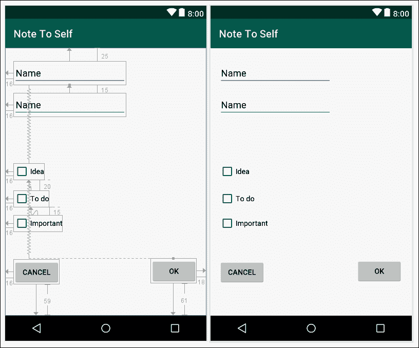

3.  将一个**纯文本**小部件(从**文本**类别)拖放到布局的最顶部和左侧，然后在其下方添加另一个**纯文本**。暂时不要担心任何属性。
4.  从**按钮**类别中拖放三个**复选框**部件，一个在另一个下面。查看之前的参考截图获得指导。同样，现在不要担心任何属性。
5.  将两个**按钮**拖放到布局上，第一个按钮位于上一步最后一个**复选框**小部件的正下方，第二个按钮与第一个**按钮**小部件水平对齐，但完全位于布局的右侧。
6.  整理布局，使其尽可能接近参考截图，然后点击**推断约束**按钮，固定您选择的位置。
7.  现在我们可以设置我们所有的`text`、`id`和`hint`属性。您可以通过使用下表中的值来实现这一点。请记住，我们将字符串资源用于`text`和`hint`属性。

### 注

当您编辑第一个`id`属性时，您可能会看到一个弹出窗口，要求确认您的更改。勾选**框，本次**不再询问，点击**是**继续，如下图截图所示:

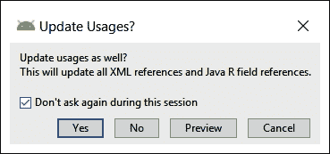

以下是要输入的值:

<colgroup><col style="text-align: left"> <col style="text-align: left"> <col style="text-align: left"></colgroup> 
| 

**小工具类型**

 | 

**属性**

 | 

**设置为**的值

 |
| --- | --- | --- |
| 纯文本(顶部) | 身份证明（identification） | `editTitle` |
| 纯文本(顶部) | 暗示 | `@string/title_hint` |
| 纯文本(底部) | 身份证明（identification） | `editDescription` |
| 纯文本(底部) | 暗示 | `@string/description_hint` |
| 纯文本(底部) | 输入类型 | 文本多行(取消任何其他选项) |
| 复选框(顶部) | 身份证明（identification） | `checkBoxIdea` |
| 复选框(顶部) | 文本 | `@string/idea_text` |
| 复选框(中间) | 身份证明（identification） | `checkBoxTodo` |
| 复选框(中间) | 文本 | `@string/todo_text` |
| 复选框(底部) | 身份证明（identification） | `checkBoxImportant` |
| 复选框(底部) | 文本 | `@string/important_text` |
| 按钮(左侧) | 身份证明（identification） | `btnCancel` |
| 按钮(左侧) | 文本 | `@string/cancel_button` |
| 按钮(右侧) | 身份证明（identification） | `btnOK` |
| 按钮(右侧) | 文本 | `@string/ok_button` |

我们现在有一个很好的整洁的布局来显示我们的科特林代码。一定要记住不同小部件的`id`值，因为我们在编写代码时会看到它们在起作用。重要的是，我们的布局看起来很好，每个相关项目都有一个`id`值，这样我们就可以引用它。

让我们布局对话框，向用户显示一条注释:

1.  右键单击项目浏览器中的**布局**文件夹，并选择**新建|布局资源文件**。在**文件名:**字段输入`dialog_show_note`，然后在**根元素:**字段开始输入`Constrai`。请注意，有一个下拉列表，其中有多个以 **Constrai…** 开头的选项。现在选择**androidx . constraint layout . widget . constraint layout**。左键单击**确定**以生成新的布局文件，该文件将以`ConstraintLayout`类型作为其根元素。
2.  Refer to the target design in the next screenshot, while following the rest of these instructions. I have photoshopped together the finished layout including the constraints we will soon autogenerate, next to the layout, with the constraints hidden for extra clarity:

    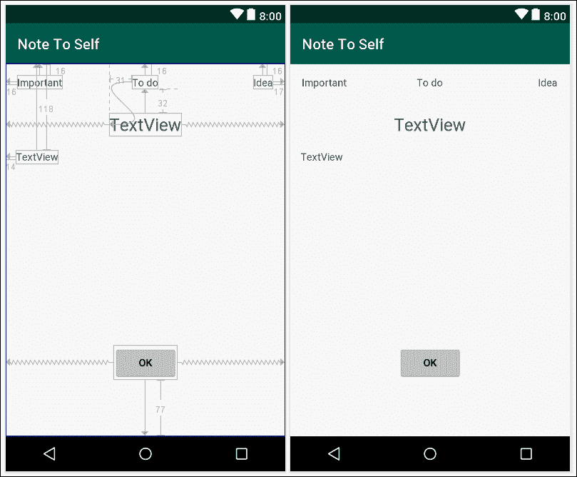

3.  首先，拖动并放下三个**文本视图**小部件，在布局顶部垂直对齐。
4.  接下来，将另一个**文本视图**部件拖放到前面三个`TextView`部件的正下方。
5.  在前一个小部件的正下方，但在左侧，添加另一个**文本视图**小部件。
6.  Now add a **Button** horizontally and centrally, and near the bottom of the layout. This is what it should look like so far:

    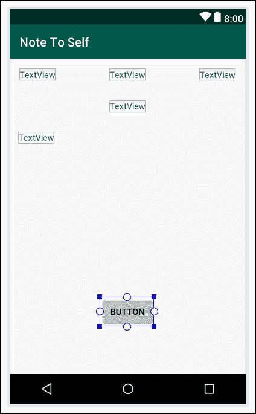

7.  整理布局，使其尽可能接近参考截图，然后点击**推断约束**按钮，固定您选择的位置。
8.  Configure the attributes from the following table: Text (upper left corner)

    <colgroup><col style="text-align: left"> <col style="text-align: left"> <col style="text-align: left"></colgroup> 
    | **gadget type** | 

    **Attribute**

     | 

    **is set to the value of**

     |
    | --- | --- | --- |
    | `id` | `textViewImportant` |
    | 【 | `text` | `@string/important_text` |
    | Text view | `id` | `textViewTodo` |
    | Text view (top center | `text` | `@string/todo_text` |
    | Text view (upper right corner) | `id` | `textViewIdea` |
    | Text view (upper right corner) | `text` | `@string/idea_text` |
    | Second row) | `id` | `txtTitle` |
    | 【 Second line) | `textSize` | `24sp` |
    |  | `id` | `txtDescription` |
    | 81 】 | `id` | `btnOK` |
    | Button【`text` | `@string/ok_button` |

### 类型

在前面的更改之后，您可能想要通过在屏幕上拖动来调整一些用户界面元素的最终位置，因为我们已经调整了它们的大小和内容。首先点击**清除所有约束**，然后将布局调整到你想要的样子，最后点击**推断约束**再次约束位置。

现在我们有了一个布局，可以用来向用户显示注释。请注意，我们可以重用一些字符串资源。我们的应用程序越大，以这种方式做事就越有利。

## 对对话框进行编码

现在已经为我们的两个对话窗口(“显示注释”和“新注释”)设计好了，我们可以使用我们所知道的`FragmentDialog`类来实现一个类来表示用户可以与之交互的每个对话窗口。

我们将从“新笔记”屏幕开始。

### 对 DialogNewNote 类进行编码

右键单击包含`.kt`文件的项目文件夹，选择**新建** | **柯特林文件/类**，创建新类。命名`DialogNewNote`类，在下拉选择器中选择**类**。点击**确定**生成新类。

首先，更改类声明并从`DialogFragment`继承。此外，覆盖`onCreateDialog`函数，这是这个类中所有剩余代码的去处。为了实现这一点，请使您的代码与以下代码相同:

```kt
class DialogNewNote : DialogFragment() {

   override 
   fun onCreateDialog(savedInstanceState: Bundle?): Dialog {

        // All the rest of the code goes here

    }
}
```

### 类型

您还需要添加这些新的导入:

```kt
import androidx.fragment.app.DialogFragment;
import android.app.Dialog;
import android.os.Bundle;
```

我们在新的类中暂时有一个错误，因为我们在`onCreateDialog`函数中需要一个`return`语句，但是我们将在一会儿到达那里。

在我们稍后要添加的下一个代码块中，首先我们声明并初始化一个`AlertDialog.Builder`对象，就像我们之前在创建对话框窗口时所做的那样。然而，这一次，我们不会像以前那样频繁地使用这个对象。

接下来，我们初始化一个`LayoutInflater`对象，我们将使用它来膨胀我们的 XML 布局。“膨胀”仅仅意味着把我们的 XML 布局变成一个 Kotlin 对象。一旦这样做了，我们就可以用通常的方式访问所有的小部件。我们可以考虑用`inflater.inflate`代替`setContentView`函数调用我们的对话框。在第二行中，我们使用`inflate`功能来完成。

添加我们刚刚讨论过的三行代码:

```kt
// All the rest of the code goes here
val builder = AlertDialog.Builder(activity!!)

val inflater = activity!!.layoutInflater

val dialogView = inflater.inflate
   (R.layout.dialog_new_note, null)
```

### 类型

为了支持前面三行代码中的新类，您需要添加以下`import`语句:

```kt
import androidx.appcompat.app.AlertDialog
import android.view.View
import android.view.LayoutInflater
```

现在有了一个名为`dialogView`的`View`对象，它包含了我们的`dialog_new_note.xml`布局文件中的所有用户界面元素。

现在，在前面的代码块下面，我们将添加以下代码。

这段代码将获得对每个用户界面小部件的引用。在前一个代码块之后添加以下代码:

```kt
val editTitle =
      dialogView.findViewById(R.id.editTitle) as EditText

val editDescription =
      dialogView.findViewById(R.id.editDescription) as 
                EditText

val checkBoxIdea =
      dialogView.findViewById(R.id.checkBoxIdea) as CheckBox

val checkBoxTodo =
      dialogView.findViewById(R.id.checkBoxTodo) as CheckBox

val checkBoxImportant =
      dialogView.findViewById(R.id.checkBoxImportant) as 
                CheckBox

val btnCancel =
      dialogView.findViewById(R.id.btnCancel) as Button

val btnOK =
      dialogView.findViewById(R.id.btnOK) as Button
```

### 类型

务必添加以下`import`代码，使您刚才添加的代码无错误:

```kt
import android.widget.Button
import android.widget.CheckBox
import android.widget.EditText
```

在前面的代码中有一个新的 Kotlin 特性，称为`as`关键字；例如`as EditText`、`as CheckBox`和`as Button`。之所以使用这个特性，是因为编译器无法推断每个 UI 小部件的具体类型。尝试从代码中删除一个`as…`关键词，并注意出现的错误。使用`as`关键字(因为我们知道类型)可以克服这个问题。

在下一个代码块中，我们将使用`builder`实例设置对话框的消息。然后，我们将编写一个 lambda 来处理`btnCancel`上的点击。在被覆盖的`onClick`函数中，我们将简单地调用`DialogFragment`的函数`dismiss()`来关闭对话框。如果用户点击**取消**，这正是我们需要的。

添加我们刚刚讨论过的代码:

```kt
builder.setView(dialogView).setMessage("Add a new note")

// Handle the cancel button
btnCancel.setOnClickListener {
   dismiss()
}
```

现在我们将添加一个 lambda 来处理当用户点击**确定**按钮(`btnOK`)时发生的事情。

在里面，我们创建了一个新的`Note`，叫做`newNote`。然后，我们将`newNote`中的每个属性设置为表单的适当内容。

之后，我们使用对`MainActivity`的引用来调用`MainActivity`中的`createNewNote`函数。

### 类型

注意，我们还没有写这个`createNewNote`函数，在本章后面写之前，函数调用会显示一个错误。

这个函数发送的参数是我们新初始化的`newNote`对象。这具有将用户的新笔记发送回`MainActivity`的效果。我们将在本章的后面部分看到如何处理这个问题。

最后，我们调用`dismiss`关闭对话框窗口。在我们添加的前一个代码块之后添加我们一直在讨论的代码:

```kt
btnOK.setOnClickListener {
   // Create a new note
   val newNote = Note()

   // Set its properties to match the
   // user's entries on the form
   newNote.title = editTitle.text.toString()

   newNote.description = editDescription.text.toString()

   newNote.idea = checkBoxIdea.isChecked
   newNote.todo = checkBoxTodo.isChecked
   newNote.important = checkBoxImportant.isChecked

   // Get a reference to MainActivity
   val callingActivity = activity as MainActivity?

   // Pass newNote back to MainActivity
   callingActivity!!.createNewNote(newNote)

   // Quit the dialog
   dismiss()
}

return builder.create()
```

这是我们完成的第一个对话窗口。我们还没有连线到从`MainActivity`开始出现，我们也需要实现`createNewNote`功能。我们将在创建下一个对话框后立即这样做。

### 对 DialogShowNote 类进行编码

右键单击包含所有`.kt`文件的项目文件夹，选择**新建** | **柯特林文件/类**，创建一个新类。命名`DialogShowNote`类，然后在下拉选择器中选择**类**，点击**确定**生成新类。

首先更改类声明并从`DialogFragment`继承，然后覆盖`onCreateDialog`函数。由于这个类的大部分代码都在`onCreateDialog`函数中，实现如下代码所示的签名和空体，我们将在一分钟后重新访问它。

请注意，我们声明了一个属于`Note`类型的`var`属性`note`。另外，添加`sendNoteSelected`函数及其初始化`note`的单行代码。该函数将由`MainActivity`调用，并传入用户点击的`Note`对象。

加上我们刚刚讨论过的代码，然后我们可以看看`onCreateDialog`的细节:

```kt
class DialogShowNote : DialogFragment() {

    private var note: Note? = null

    override fun 
    onCreateDialog(savedInstanceState: Bundle?): Dialog {

        // All the other code goes here

    }

    // Receive a note from the MainActivity class
    fun sendNoteSelected(noteSelected: Note) {
        note = noteSelected
    }

}
```

### 类型

此时，您需要导入以下类:

```kt
import android.app.Dialog;
import android.os.Bundle;
import androidx.fragment.app.DialogFragment;
```

接下来，我们声明并初始化`AlertDialog.Builder`的一个实例。接下来，正如我们对`DialogNewNote`所做的那样，我们声明并初始化`LayoutInflater`，然后使用它创建一个`View`对象，该对象具有对话框的布局。在这种情况下，是来自`dialog_show_note.xml`的布局。

最后，在下面的代码块中，我们获得了对每个 UI 小部件的引用，并使用在`sendNoteSelected`函数调用中初始化的`note`中相应的相关属性在`txtTitle`和`textDescription`上设置了`text` 属性。

在`onCreateDialog`函数中添加我们刚刚讨论过的代码:

```kt
val builder = AlertDialog.Builder(this.activity!!)

val inflater = activity!!.layoutInflater

val dialogView = inflater.inflate(R.layout.dialog_show_note, null)

val txtTitle = 
   dialogView.findViewById(R.id.txtTitle) as TextView

val txtDescription = 
   dialogView.findViewById(R.id.txtDescription) as TextView

txtTitle.text = note!!.title
txtDescription.text = note!!.description      

val txtImportant = 
   dialogView.findViewById(R.id.textViewImportant) as TextView

val txtTodo = 
   dialogView.findViewById(R.id.textViewTodo) as TextView

val txtIdea = 
   dialogView.findViewById(R.id.textViewIdea) as TextView
```

### 类型

添加以下`import`语句，使前面代码中的所有类可用:

```kt
import android.view.LayoutInflater;
import android.view.View;
import android.widget.TextView;
import androidx.appcompat.app.AlertDialog;
```

下一个代码也在`onCreateDialog`功能中。它检查正在显示的注释是否“重要”，然后相应地显示或隐藏`txtImportant TextView`小部件。然后我们对`txtTodo`和`txtIdea` 部件进行同样的操作。

在上一个代码块之后添加这个代码，同时仍然在`onCreateDialog`功能中:

```kt
if (!note!!.important){
   txtImportant.visibility = View.GONE
}

if (!note!!.todo){
   txtTodo.visibility = View.GONE
}

if (!note!!.idea){
   txtIdea.visibility = View.GONE
}
```

我们现在需要做的就是`dismiss`(也就是当用户点击**确定**按钮时关闭)对话框窗口。这是用一个 lambda 完成的，我们已经见过几次了。`onClick`功能只是调用关闭对话框的`dismiss`功能。

将该代码添加到前一代码块后的`onCreateDialog`功能中:

```kt
val btnOK = dialogView.findViewById(R.id.btnOK) as Button

builder.setView(dialogView).setMessage("Your Note")

btnOK.setOnClickListener({
   dismiss()
})

return builder.create()
```

### 类型

用这行代码导入`Button`类:

```kt
import android.widget.Button;
```

我们现在有两个准备滚动的对话窗口。我们只需要在`MainActivity`类中添加一些代码来完成这项工作。

## 展示和使用我们的新对话框

在`MainActivity`声明后添加一个新的临时属性:

```kt
// Temporary code
private var tempNote = Note()
```

### 类型

这些代码不会出现在最终的应用程序中；这只是为了让我们可以立即测试我们的对话窗口。

现在添加这个功能，这样我们就可以从`DialogNewNote`类接收新的注释:

```kt
fun createNewNote(n: Note) {
   // Temporary code
   tempNote = n
}
```

现在，要向`DialogShowNote`功能发送通知，我们需要向`layout_main.xml`布局文件添加一个带有`button` `id`的按钮。

为了清楚这个按钮是干什么用的，我们将其`text`属性改为`Show Note`，如下:

*   将一个`Button`部件拖到`layout_main.xml`上，将其`id`配置为`button`，将`text`配置为`Show Note`。
*   点击**推断约束**按钮，使按钮停留在您放置的位置。这个按钮的确切位置在这个阶段并不重要。

### 注

只是澄清一下，这是一个用于测试目的的临时按钮，不会在最终的应用中使用。在开发的最后，我们将从列表中点击一个笔记的标题。

现在，在`onCreate`功能中，我们将设置一个 lambda 来处理临时按钮的点击。`onClick`中的代码将执行以下操作:

*   创建一个新的`DialogShowNote`实例，简称为`dialog`。
*   调用`dialog`上的`sendNoteSelected`函数传入我们的`Note`对象，称为`tempNote`，作为参数。
*   最后，它将调用`show`，为我们的新对话注入活力。

将之前描述的代码添加到`onCreate`功能中:

```kt
// Temporary code
val button = findViewById<View>(R.id.button) as Button
button.setOnClickListener {
   // Create a new DialogShowNote called dialog
   val dialog = DialogShowNote()

   // Send the note via the sendNoteSelected function
   dialog.sendNoteSelected(tempNote)

   // Create the dialog
   dialog.show(supportFragmentManager, "123")
}
```

### 类型

一定要用这一行代码导入`Button`类:

```kt
import android.widget.Button;
```

我们现在可以通过点击按钮来召唤我们的`DialogShowNote`对话窗口。运行应用程序，点击**显示注释**按钮，看到`dialog_show_note.xml`布局的`DialogShowNote`对话框，如下图所示:

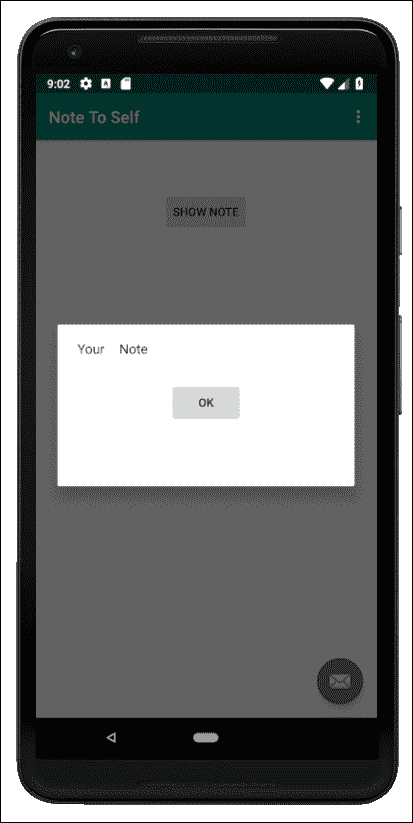

诚然，考虑到我们在本章中做了多少编码，这并不算什么，但是当我们让`DialogNewNote`类工作时，我们将看到`MainActivity`如何在两个对话框之间交互和共享数据。

让我们使用`DialogNewNote`对话框。

### 对浮动动作按钮进行编码

这很容易。布局中为我们提供了浮动操作按钮。提醒一下，这是浮动操作按钮:

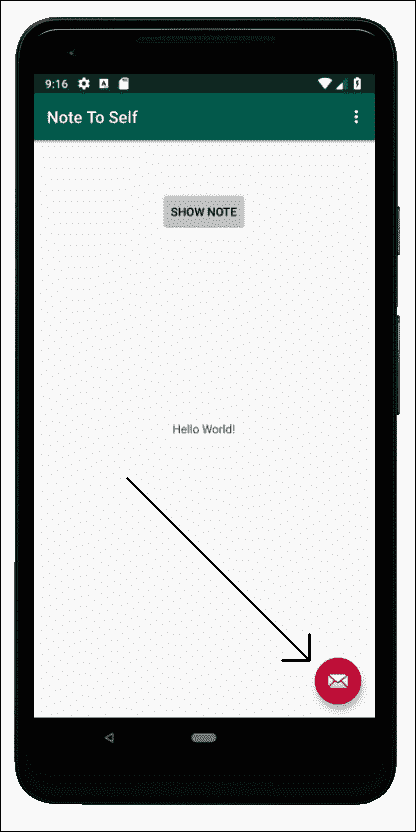

在`activity_main.xml`文件中。这是定位和定义其外观的 XML 代码:

```kt
<com.google.android.material.floatingactionbutton
    .FloatingActionButton

   android:id="@+id/fab"
   android:layout_width="wrap_content"
   android:layout_height="wrap_content"
   android:layout_gravity="bottom|end"
   android:layout_margin="@dimen/fab_margin"
   app:srcCompat="@android:drawable/ic_dialog_email" />
```

安卓工作室甚至提供了一个现成的 lambda 来处理浮动动作按钮的点击。我们所需要做的就是在这个已经提供的代码的`onClick`函数中添加一些代码，我们就可以使用`DialogNewNote`类了。

浮动动作按钮通常用于应用程序的核心动作。例如，在一个电子邮件应用程序中，它可能会被用来启动一个新的电子邮件；或者，在笔记应用程序中，它可能会被用来添加新的笔记。所以，我们现在就开始吧。

在`MainActivity.kt`中，在`onCreate`函数的`MainActivity.kt`类中找到安卓工作室提供的自动生成代码；以下是完整的代码:

```kt
fab.setOnClickListener { view ->
   Snackbar.make(view, "Replace with your own action", 
 Snackbar.LENGTH_LONG)
 .setAction("Action", null).show()
}
```

在之前的代码中，注意高亮显示的行并删除它。现在添加以下代码来代替删除的代码:

```kt
val dialog = DialogNewNote()
dialog.show(supportFragmentManager, "")
```

新代码创建一个新的`DialogNewNote`种类的对话窗口，然后显示给用户。

我们现在可以运行该应用程序；点击浮动操作按钮，并添加一个注释，如下图所示:

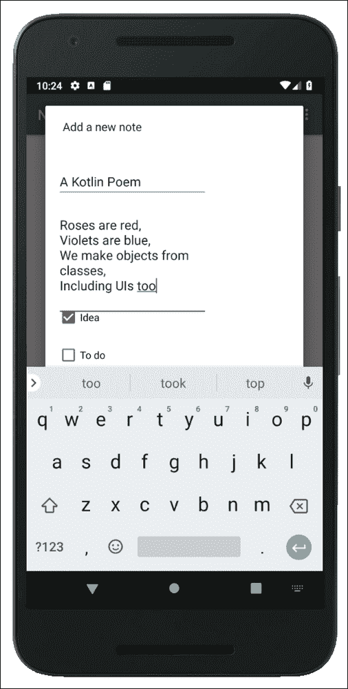

点击**确定**保存备注并返回主布局。接下来，我们可以点击**显示备注**按钮在如下截图所示的对话框中查看:

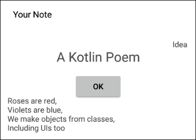

请注意如果您添加第二个音符，它将覆盖第一个音符，因为我们只有一个`Note`实例。此外，如果你关掉手机，或者完全关闭应用程序，那么笔记就会永远丢失。为了解决这些问题，我们需要再介绍一些柯特林。

# 总结

在本章中，我们已经看到并实现了一个使用`DialogFragment`类的带有对话框窗口的通用 UI 设计。

当我们启动笔记自助应用程序时，我们更进一步，实现了更复杂的对话框，可以从用户那里获取信息。我们看到`DialogFragment`让我们可以在一个对话框中拥有任何我们喜欢的 UI。

在下一章中，我们将通过探索 Kotlin 的数据处理类，开始处理用户只能有一个注释的明显问题。