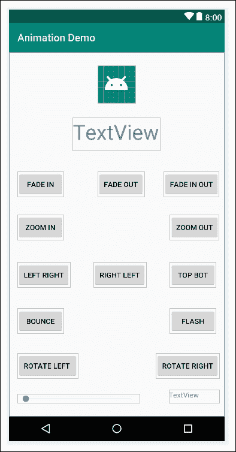
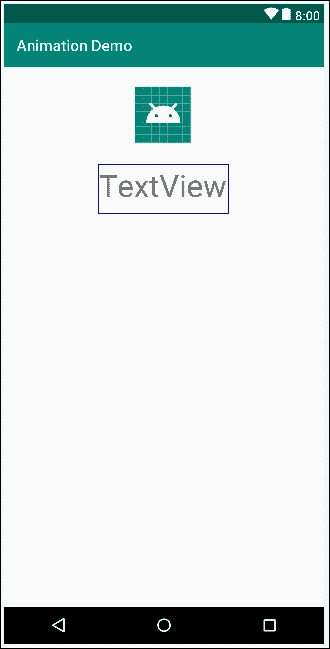
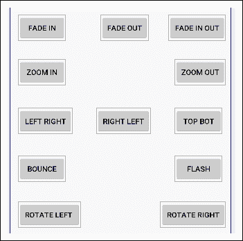
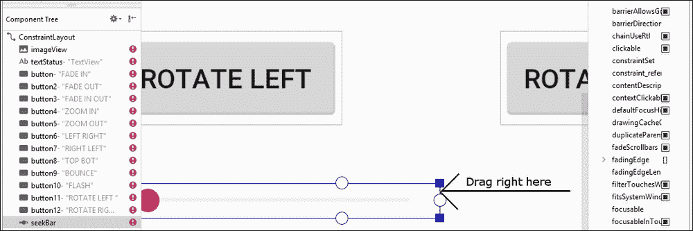
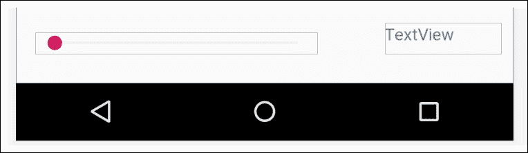
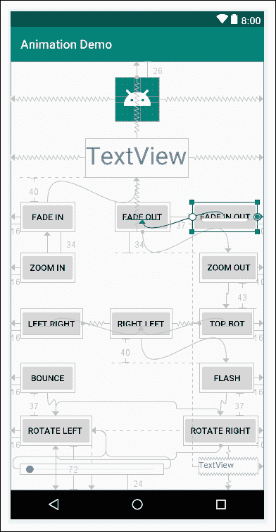
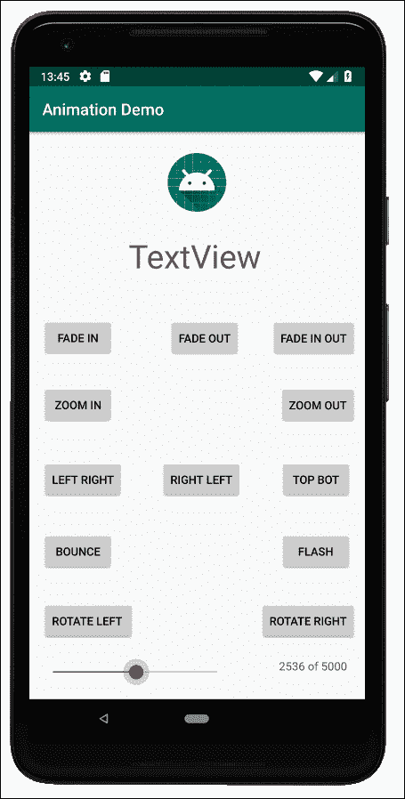
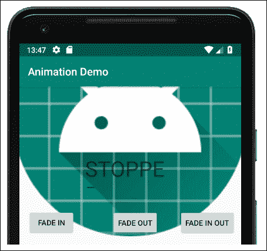
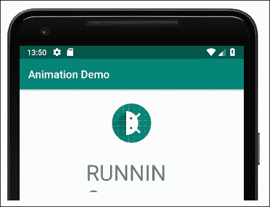

# 第十九章。动画和插值

在这里，我们将看到如何使用`Animation`类来使我们的 UI 少一点静态，多一点有趣。正如我们所料，安卓应用编程接口将允许我们用相对简单的代码做一些相当高级的事情，而`Animation`类也没有什么不同。

本章可大致分为以下几个部分:

*   介绍安卓系统中动画是如何工作和实现的
*   介绍一个我们还没有探索过的用户界面小部件`SeekBar` 类
*   一个有效的动画应用程序

首先，让我们探索动画在安卓系统中是如何工作的。

# 安卓动画

在安卓系统中创建动画的正常方式是通过 XML。我们可以编写 XML 动画，然后通过我们的 Kotlin 代码在指定的 UI 小部件上加载和播放它们。例如，我们可以写一个动画，在三秒钟内淡入淡出 5 次，然后在`ImageView`或任何其他小部件上播放该动画。我们可以将这些 XML 动画视为一个脚本，因为它们定义了类型、顺序和时间。

让我们探索一些不同的属性，我们可以分配给我们的动画，如何在我们的Kotlin代码中使用它们，最后，我们可以制作一个整洁的动画应用程序来尝试这一切。

## 用 XML 设计酷炫的动画

我们已经了解到，XML 可以用来描述动画以及 UI 布局，但是让我们来看看具体是如何做到的。我们可以陈述描述小部件开始和结束外观的动画的属性值。然后，我们的Kotlin代码可以通过引用包含动画的 XML 文件的名称来加载 XML，并将其转换为可用的Kotlin对象，这与用户界面布局没有什么不同。

许多动画属性成对出现。这里是我们可以用来创建动画的一些动画属性对的快速浏览。在我们看了一些 XML 之后，我们将了解如何使用它。

### 淡入淡出

阿尔法是透明度的量度。因此，通过陈述开始`fromAlpha`和结束`toAlpha`值，我们可以淡入淡出项目。`0.0`的值是不可见的，`1.0`是物体的正常外观。在两个之间稳定移动会产生淡入效果:

```kt
<alpha
   android:fromAlpha = "0.0"
   android:toAlpha = "1.0" />
```

### 动起来，动起来

我们可以使用类似的技术在用户界面中移动一个对象；`fromXDelta`和`toXDelta`可以将其值设置为动画对象大小的百分比。

下面的代码会将对象从左向右移动一段距离，该距离等于对象本身的宽度:

```kt
<translate     
android:fromXDelta = "-100%"
android:toXDelta = "0%"/>
```

此外，还有`fromYDelta`和`toYDelta`属性，用于制作向上和向下移动的动画。

### 缩放或拉伸

`fromXScale`和`toXScale`属性将增加或减少对象的比例。以为例，以下代码将运行动画的对象从正常大小更改为不可见:

```kt
<scale
android:fromXScale = "1.0"
android:fromYScale = "0.0"/>
```

作为另一个例子，我们可以使用`android:fromYScale = "0.1"`将物体缩小到通常尺寸的十分之一，或者使用`android:fromYScale = "10.0"`将其放大 10 倍。

### 控制持续时间

当然，如果这些动画在结束时立即到达，它们都不会特别有趣。为了使我们的动画更有趣，我们可以设置它们的持续时间为毫秒。一毫秒是千分之一秒。我们还可以通过设置`startOffset`属性来简化计时，尤其是相对于其他动画而言，该属性也是以毫秒为单位的。

下一个代码将在我们开始动画三分之一秒后开始动画(在代码中)，并且需要三分之二秒才能完成:

```kt
android:duration = "666"
android:startOffset = "333"
```

### 旋转动画

如果你想要旋转什么东西，就使用`fromDegrees`和`toDegrees`属性。下一段代码，可能可以预见，将使一个小部件在一个完整的圆内旋转，因为，当然，圆内有 360 度:

```kt
<rotate android:fromDegrees = "360"
        android:toDegrees = "0"
/>
```

### 重复动画

重复在某些动画中可能很重要，可能是抖动或抖动效果，所以我们可以添加一个`repeatCount`属性。此外，我们可以通过设置`repeatMode`属性来指定动画如何重复。

下面的代码将一个动画重复 10 次，每次都反转动画的方向。`repeatMode`属性相对于动画的当前状态。这意味着，例如，如果您将一个按钮从 0 度旋转到 360 度，动画的第二部分(第一次重复)将从 360 度旋转回 0 度。动画的第三部分(第二次重复)将再次反转并从 0°旋转到 360°:

```kt
android:repeatMode = "reverse"
android:repeatCount = "10"
```

### 将动画的属性与集合相结合

为了组合这些效果，我们需要一组属性。这段代码展示了我们如何将之前看到的所有代码片段组合成一个实际的 XML 动画，该动画将编译:

```kt
<?xml version="1.0" encoding="utf-8"?>
<set xmlns:android="http://schemas.android.com/apk/res/android"
     ...All our animations go here
</set>
```

我们仍然没有看到任何柯特林，用它来使这些动画栩栩如生。我们现在就解决这个问题。

## 实例化动画并用 Kotlin 代码控制它们

下面这段代码片段展示了我们如何声明一个`Animation`类型的对象，用一个名为`fade_in.xml`的 XML 文件中包含的动画初始化它，并在一个`ImageView`小部件上启动动画。我们将很快在一个项目中完成这项工作，并看看我们可以将 XML 动画放在哪里:

```kt
// Declare an Animation object
var animFadeOut: Animation? = null

// Initialize it 
animFadeIn = AnimationUtils.loadAnimation(
                this, R.anim.fade_in)

// Start the animation on the ImageView
// with an id property set to imageView
imageView.startAnimation(animFadeIn)
```

我们已经有了相当强大的动画和控制功能，例如时间。但是安卓应用编程接口给我们的不仅仅是这个。

## 更多动画功能

我们可以收听动画的状态，就像我们可以收听点击按钮一样。我们也可以使用**插值器**使我们的动画更加逼真和令人愉悦。先看听众。

### 听众

如果我们实现`AnimationListener`界面，我们确实可以通过覆盖告诉我们什么时候发生了什么的三个功能来监听动画的状态。我们可以根据这些事件采取行动。

`OnAnimationEnd`宣布动画结束，每次动画开始重复时都会调用`onAnimationRepeat`，并且——也许可以预见——当动画开始动画时会调用`onAnimationStart`。如果在动画 XML 中设置了`startOffset`，这可能与调用`startAnimation`的时间不同:

```kt
override fun onAnimationEnd(animation: Animation) {   
   // Take some action here

}

override fun onAnimationStart(animation: Animation) {

   // Take some action here

}

override fun onAnimationRepeat(animation: Animation){

   // Take some action here

}
```

我们将在动画演示应用程序中看到`AnimationListener`是如何工作的，我们还将把另一个小部件`SeekBar`付诸行动。

### 动画插值器

如果你可以回想一下高中的时候，你可能还记得关于计算加速度的激动人心的课程。如果我们以恒定的速度制作动画，乍一看，事情似乎还可以。如果我们将动画与另一个使用逐渐加速的动画进行比较，那么后者几乎肯定会更值得观看。

有可能，如果不告诉我们这两个动画的唯一区别是一个使用了加速，另一个没有，我们就无法说出*为什么*更喜欢它。我们的大脑更容易接受符合周围世界规范的事物。因此，增加一点真实世界的物理，比如加速和减速，可以改善我们的动画。

然而，我们想做的最后一件事是开始做一堆数学计算，只是为了在屏幕上滑动一个按钮或旋转一些文字。

这就是**插值器**的作用。它们是动画修改器，我们可以在 XML 中的一行代码中设置它们。

插值器的一些例子有`accelerate_interpolator`和`cycle_interpolator`:

```kt
android:interpolator="@android:anim/accelerate_interpolator"
android:interpolator="@android:anim/cycle_interpolator"/>
```

接下来，我们将使用一些插值器，以及一些 XML 动画和相关的 Kotlin 代码。

### 类型

你可以在安卓开发者网站上了解更多关于插值器和安卓`Animation`类的信息。

# 动画演示应用——介绍 SeekBar

这是足够的理论，特别是对于一些应该如此明显的东西。让我们构建一个动画演示应用程序，探索我们刚刚讨论的所有内容，还有更多。

这款应用包含大量不同文件中的少量代码。因此，我试图让它明白什么文件中有什么代码，这样您就可以跟踪正在发生的事情。这将使我们为这个应用编写的 Kotlin 也更容易理解。

该应用程序将演示旋转、淡入淡出、平移、动画事件、插值，以及使用`SeekBar`小部件控制持续时间。解释`SeekBar`做什么的最好方法是构建它，然后观察它的动作。

## 布置动画演示

使用**空活动**模板创建一个名为`Animation Demo`的新项目，将所有其他设置保留为其通常设置。像往常一样，如果您希望通过复制和粘贴布局、代码或动画 XML 来加快速度，可以在`Chapter19`文件夹中找到。

使用以下已完成布局的参考屏幕截图来帮助指导您完成后续步骤:



以下是如何为这个应用程序设计用户界面:

1.  在编辑器窗口的设计视图中打开`activity_main.xml`。
2.  删除默认**你好世界！** `TextView`。
3.  将**图像视图**添加到布局的顶部中间部分。用之前的参考截图来指导你。在弹出的**资源**窗口中选择**项目** | **ic_launcher** ，使用`@mipmap/ic_launcher`在`ImageView`中显示机器人。
4.  将`ImageView`的`id`属性设置为`imageView`。
5.  Directly below the `ImageView`, add a `TextView`. Set the `id` to `textStatus`. I made my `TextView` a little bigger by dragging its edges (not the constraint handles) and changed its `textSize` attribute to `40sp`. The layout so far should look something like this next screenshot:

    

6.  Now we will add a large selection of **Button** widgets to the layout. Exact positioning is not vital, but the exact `id` property values we add to them later in the tutorial will be. Follow this next screenshot to lay out 12 buttons in the layout. Alter the `text` attribute so that your buttons have the same text as those in the next screenshot. The `text` attributes are detailed specifically in the next step in case the screenshot isn't clear enough:

    

    ### 类型

    为了使布局按钮的过程更快，首先大致布局，然后添加下一步的`text`属性，然后微调按钮位置以获得整洁的布局。

7.  添加`text`值，如截图所示；这里是从左到右、从上到下的所有数值:`FADE IN`、`FADE OUT`、`FADE IN OUT`、`ZOOM IN`、`ZOOM OUT`、`LEFT RIGHT`、`RIGHT LEFT`、`TOP BOT`、`BOUNCE`、`FLASH`、`ROTATE LEFT`和`ROTATE RIGHT`。
8.  从调色板的**小部件**类别中添加一个`SeekBar`小部件，在按钮下方的左侧。将`id`属性设置为`seekBarSpeed` ，将`max`属性设置为`5000`。这意味着当用户从左向右拖动`SeekBar`小部件时，它将保持 0 到 5000 之间的值。我们将很快看到如何读取和使用这些数据。
9.  We want to make the `SeekBar` widget much wider. To achieve this, you use the exact same technique as with any widget; just drag the edges of the widget. However, as the `SeekBar` widget is quite small, it is hard to increase its size without accidentally selecting the constraint handles. To overcome this problem, zoom into the design view by holding the *Ctrl* key and rolling the middle mouse wheel forward. You can then grab the edges of the `SeekBar` widget without touching the constraint handles. I have shown this in action in the next screenshot:

    

10.  Now, add a `TextView` widget just to the right of the `SeekBar` widget and set its `id` property to `textSeekerSpeed`. This step, combined with the previous two, should look like this screenshot:

    

11.  Tweak the positions to look like the reference screenshot at the start of these steps, and then click the **Infer Constraints** button to lock the positions. Of course, you can do this manually if you want the practice. Here is a screenshot with all the constraints in place:

    

12.  接下来，将`id`属性后面的添加到按钮中，由您已经设置的文本属性标识。如果在输入这些值时询问您是否要**更新用法…** ， 选择**是**:

    <colgroup><col style="text-align: left"><col style="text-align: left"></colgroup>
    | **现有文本属性** | **要设置的身份证明（identification）属性的值** |
    | 渐显 | `btnFadeIn` |
    | 淡出 | `btnFadeOut` |
    | 淡入淡出 | `btnFadeInOut` |
    | 放大 | `btnZoomIn` |
    | 缩小 | `btnZoomOut` |
    | 左向右 | `btnLeftRight` |
    | 右左 | `btnRightLeft` |
    | 顶级 bot | `btnTopBottom` |
    | 活力 | `btnBounce` |
    | 闪光 | `btnFlash` |
    | 左旋 90 度 | `btnRotateLeft` |
    | 右旋 90 度 | `btnRotateRight` |

当我们在几节时间内开始对`MainActivity`类进行编码时，我们将看到如何在我们的用户界面(`SeekBar`)中使用这个新成员。

## 对 XML 动画进行编码

右键单击 **res** 文件夹上的，选择**新建|安卓资源目录**。在`Directory name:`字段输入`anim`，左键点击**确定**。

现在右击新的**动画**目录，选择**新建|动画资源文件**。在**文件名:**字段，输入`fade_in`，然后左键点击**确定**。删除内容并添加以下代码来创建动画:

```kt
<?xml version="1.0" encoding="utf-8"?>
<set xmlns:android="http://schemas.android.com/apk/res/android"
   android:fillAfter="true" >

   <alpha
   android:fromAlpha = "0.0"
   android:interpolator = 
              "@android:anim/accelerate_interpolator"

   android:toAlpha="1.0" />
</set>
```

右键单击**动画**目录，选择**新建|动画资源文件**。在`File name:`栏中，输入`fade_out`，然后左键单击**确定**。删除内容并添加以下代码来创建动画:

```kt
<?xml version="1.0" encoding="utf-8"?>
<set xmlns:android="http://schemas.android.com/apk/res/android"
   android:fillAfter = "true" >

   <alpha  
         android:fromAlpha = "1.0"
         android:interpolator = 
              "@android:anim/accelerate_interpolator"

   android:toAlpha = "0.0" />
</set>
```

右键单击**动画**目录中的，选择**新建|动画资源文件**。在`File name:`栏中，输入`fade_in_out`，然后左键单击**确定**。删除内容并添加以下代码来创建动画:

```kt
<?xml version="1.0" encoding="utf-8"?>
<set xmlns:android="http://schemas.android.com/apk/res/android"
    android:fillAfter = "true" >

    <alpha
          android:fromAlpha="0.0"
          android:interpolator = 
          "@android:anim/accelerate_interpolator"

          android:toAlpha = "1.0" />

    <alpha
       android:fromAlpha = "1.0"
          android:interpolator = 
         "@android:anim/accelerate_interpolator"

         android:toAlpha = "0.0" />
</set>
```

右键单击**动画**目录，选择**新建|动画资源文件**。在`File name:`栏中，输入`zoom_in`，然后左键单击**确定**。删除内容并添加以下代码来创建动画:

```kt
<set xmlns:android="http://schemas.android.com/apk/res/android"
    android:fillAfter = "true" >

    <scale
        android:fromXScale = "1"
        android:fromYScale = "1"
        android:pivotX = "50%"
        android:pivotY = "50%"
        android:toXScale = "6"
        android:toYScale = "6" >
    </scale>
</set>
```

右键单击**动画**目录中的，选择**新建** | **动画资源文件**。在`File name:`栏中，输入`zoom_out`，然后左键单击**确定**。删除内容并添加以下代码来创建动画:

```kt
<?xml version="1.0" encoding="utf-8"?>
<set xmlns:android="http://schemas.android.com/apk/res/android">
    <scale
        android:fromXScale = "6"
        android:fromYScale = "6"
        android:pivotX = "50%"
        android:pivotY = "50%"
        android:toXScale = "1"
        android:toYScale = "1" >
    </scale>
</set>
```

右键单击**动画**目录，选择**新建|动画资源文件**。在`File name:`栏中，输入`left_right`，然后左键单击**确定**。删除内容并添加以下代码来创建动画:

```kt
<?xml version="1.0" encoding="utf-8"?>
<set xmlns:android="http://schemas.android.com/apk/res/android">
    <translate     

        android:fromXDelta = "-500%"
        android:toXDelta = "0%"/>
</set>
```

再次右键点击**动画**目录，选择**新建|动画资源文件**。在**文件名:**字段，输入`right_left`，然后左键点击**确定**。删除全部内容并添加以下代码来创建动画:

```kt
<?xml version="1.0" encoding="utf-8"?>
<set xmlns:android="http://schemas.android.com/apk/res/android">
    <translate 
        android:fillAfter = "false"
        android:fromXDelta = "500%"
        android:toXDelta = "0%"/>
</set>
```

和以前一样，右键点击**动画**目录，选择**新建|动画资源文件**。在**文件名:**字段，输入`top_bot`，然后左键点击**确定**。删除全部内容并添加以下代码来创建动画:

```kt
<?xml version="1.0" encoding="utf-8"?>
<set xmlns:android="http://schemas.android.com/apk/res/android">
    <translate 
        android:fillAfter = "false"
        android:fromYDelta = "-100%"
        android:toYDelta = "0%"/>
</set>
```

你猜到了；右键点击**动漫**目录，选择**新建|动漫资源文件**。在**文件名:**字段中，键入`flash`，然后左键单击**确定**。删除内容并添加以下代码来创建动画:

```kt
<?xml version="1.0" encoding="utf-8"?>
<set xmlns:android="http://schemas.android.com/apk/res/android">
    <alpha android:fromAlpha = "0.0"
        android:toAlpha = "1.0"
        android:interpolator = 
           "@android:anim/accelerate_interpolator"

        android:repeatMode = "reverse"
        android:repeatCount = "10"/>
</set>
```

只剩下几个了–右击**动画**目录，选择**新建|动画资源文件**。在**文件名:**字段，输入`bounce`，然后左键点击**确定**。删除内容并添加以下代码来创建动画:

```kt
<?xml version="1.0" encoding="utf-8"?>
<set xmlns:android="http://schemas.android.com/apk/res/android"
    android:fillAfter = "true"
    android:interpolator = 
         "@android:anim/bounce_interpolator">

    <scale
        android:fromXScale = "1.0"
        android:fromYScale = "0.0"
        android:toXScale = "1.0"
        android:toYScale = "1.0" />

</set>
```

右键单击**动画**目录，选择**新建|动画资源文件**。在**文件名:**字段中，输入`rotate_left`，然后左键单击**确定**。删除内容并添加此代码来创建动画。这里我们看到一些新的东西，`pivotX="50%"`和`pivotY="50%"`。这使得旋转动画成为将要制作动画的小部件的中心。我们可以认为这是设置动画的*枢轴*点:

```kt
<?xml version="1.0" encoding="utf-8"?>
<set xmlns:android="http://schemas.android.com/apk/res/android">
    <rotate android:fromDegrees = "360"
        android:toDegrees = "0"
        android:pivotX = "50%"
        android:pivotY = "50%"
        android:interpolator = 
           "@android:anim/cycle_interpolator"/>
</set>
```

右键单击**动画**目录，选择**新建|动画资源文件**。在**文件名:**字段，输入`rotate_right`，然后左键点击**确定**。删除内容并添加以下代码来创建动画:

```kt
<?xml version="1.0" encoding="utf-8"?>
<set xmlns:android="http://schemas.android.com/apk/res/android">
    <rotate android:fromDegrees = "0"
        android:toDegrees = "360"
        android:pivotX = "50%"
        android:pivotY = "50%"
        android:interpolator =
             "@android:anim/cycle_interpolator"/>

</set>
```

唷！现在我们可以编写 Kotlin 代码，将我们的动画添加到我们的 UI 中。

## 在Kotlin连接动画演示应用

打开`MainActivity.kt`文件。现在，在类声明之后，我们可以为动画声明以下属性:

```kt
var seekSpeedProgress: Int = 0

private lateinit var animFadeIn: Animation
private lateinit var animFadeOut: Animation
private lateinit var animFadeInOut: Animation

private lateinit var animZoomIn: Animation
private lateinit var animZoomOut: Animation

private lateinit var animLeftRight: Animation
private lateinit var animRightLeft: Animation
private lateinit var animTopBottom: Animation

private lateinit var animBounce: Animation
private lateinit var animFlash: Animation 

private lateinit var animRotateLeft: Animation
private lateinit var animRotateRight: Animation
```

### 类型

此时需要添加以下`import`语句:

```kt
import android.view.animation.Animation;
```

在前面的代码中，我们在声明`Animation`实例时使用了`lateinit`关键字。这将意味着 Kotlin 将检查每个实例在使用前是否已经初始化。这避免了我们每次在其中一个实例上使用函数时使用`!!`(空检查)。关于`!!`操作员的复习，请参考[第 12 章](14.html "Chapter 12. Connecting Our Kotlin to the UI and Nullability")、*连接我们的Kotlin到用户界面和可空性*。

我们还增加了一个`Int`属性`seekSpeedProgress`，用来跟踪`SeekBar`的当前值/位置。

现在，在调用`setContentView`之后，让我们从`onCreate`调用一个新的函数:

```kt
override fun onCreate(savedInstanceState: Bundle?) {
   super.onCreate(savedInstanceState)
   setContentView(R.layout.activity_main)

 loadAnimations()
}
```

在这一点上，新的代码行将有一个错误，直到我们实现新的功能。

现在我们来实现`loadAnimations`功能。虽然这个函数中的代码相当广泛，但也非常简单。我们所做的就是使用`AnimationUtils`类的`loadAnimation`函数，用我们的一个 XML 动画初始化我们的每个`Animation`引用。你还会注意到，对于`animFadeIn` `Animation`，我们在上面也叫`setAnimationListener`。我们将很快编写函数来监听事件。

增加`loadAnimations`功能:

```kt
private fun loadAnimations() {

   animFadeIn = AnimationUtils.loadAnimation(
                this, R.anim.fade_in)
   animFadeIn.setAnimationListener(this)
   animFadeOut = AnimationUtils.loadAnimation(
                this, R.anim.fade_out)
   animFadeInOut = AnimationUtils.loadAnimation(
                this, R.anim.fade_in_out)

   animZoomIn = AnimationUtils.loadAnimation(
                this, R.anim.zoom_in)
   animZoomOut = AnimationUtils.loadAnimation(
                this, R.anim.zoom_out)

   animLeftRight = AnimationUtils.loadAnimation(
                 this, R.anim.left_right)
   animRightLeft = AnimationUtils.loadAnimation(
                 this, R.anim.right_left)
   animTopBottom = AnimationUtils.loadAnimation(
                 this, R.anim.top_bot)

   animBounce = AnimationUtils.loadAnimation(
                 this, R.anim.bounce)
   animFlash = AnimationUtils.loadAnimation(
                 this, R.anim.flash)

   animRotateLeft = AnimationUtils.loadAnimation(
                 this, R.anim.rotate_left)
   animRotateRight = AnimationUtils.loadAnimation(
                 this, R.anim.rotate_right)
}
```

### 类型

此时，您需要导入一个新类:

```kt
import android.view.animation.AnimationUtils
```

现在，我们将为每个按钮添加一个点击监听器。在`onCreate`函数的右大括号前添加以下代码:

```kt
btnFadeIn.setOnClickListener(this)
btnFadeOut.setOnClickListener(this)
btnFadeInOut.setOnClickListener(this)
btnZoomIn.setOnClickListener(this)
btnZoomOut.setOnClickListener(this)
btnLeftRight.setOnClickListener(this)
btnRightLeft.setOnClickListener(this)
btnTopBottom.setOnClickListener(this)
btnBounce.setOnClickListener(this)
btnFlash.setOnClickListener(this)
btnRotateLeft.setOnClickListener(this)
btnRotateRight.setOnClickListener(this)
```

### 注

我们刚刚添加的代码会在所有代码行中产生错误。我们可以暂时忽略它们，因为我们将很快修复它们并讨论发生了什么。

现在，我们可以使用一个λ来处理`SeekBar`交互。我们将覆盖三个功能，这是实现`OnSeekBarChangeListener`时接口所要求的:

*   检测`SeekBar`部件位置变化的功能，称为`onProgressChanged`
*   检测用户开始改变位置的功能，称为`onStartTrackingTouch`
*   检测用户何时使用完`SeekBar`小部件的功能，称为`onStopTrackingTouch`

为了实现我们的目标，我们只需要向`onProgressChanged`函数添加代码，但是我们仍然必须覆盖它们。

我们在`onProgressChanged`函数中所做的就是将`SeekBar`对象的当前值分配给`seekSpeedProgress`成员变量，这样就可以从其他地方访问它。然后，我们将该值与通过使用`seekBarSpeed.max`获得的`SeekBar`对象的最大可能值一起使用，并向`textSeekerSpeed` `TextView`输出消息。

在`onCreate`函数的右花括号前添加我们刚刚讨论过的代码:

```kt
seekBarSpeed.setOnSeekBarChangeListener(
         object : SeekBar.OnSeekBarChangeListener {

   override fun onProgressChanged(
                seekBar: SeekBar, value: Int, 
                fromUser: Boolean) {

         seekSpeedProgress = value
         textSeekerSpeed.text =
               "$seekSpeedProgress of $seekBarSpeed.max"
  }

  override fun onStartTrackingTouch(seekBar: SeekBar) {}

  override fun onStopTrackingTouch(seekBar: SeekBar) {}
})
```

现在，我们需要修改`MainActivity`类声明来实现两个接口。在这个应用中，我们将监听点击和动画事件，所以我们将使用的两个界面是`View.OnClickListener`和`Animation.AnimationListener`。您会注意到，要实现多个接口，我们只需用逗号分隔这些接口。

通过添加我们刚刚讨论过的高亮代码来更改`MainActivity`类声明:

```kt
class MainActivity : AppCompatActivity(),
        View.OnClickListener,
 Animation.AnimationListener {
```

在这个阶段，我们可以添加和实现这些接口所需的功能。首先是`AnimationListener`功能、`onAnimationEnd`、`onAnimationRepeat`和`onAnimationStart`。我们只需要给其中的两个函数添加一点代码。在`onAnimationEnd`中，我们将`textStatus`的`text`属性设置为`STOPPED`，在`onAnimationStart`中，我们将其设置为`RUNNING`。这将证明我们的动画听众确实在倾听和工作:

```kt
override fun onAnimationEnd(animation: Animation) {
   textStatus.text = "STOPPED"
}

override fun onAnimationRepeat(animation: Animation) {
}

override fun onAnimationStart(animation: Animation) {
   textStatus.text = "RUNNING"
}
```

`onClick`功能挺长的，但没什么复杂的。`when`块的每个选项处理用户界面中的每个按钮，根据`SeekBar`小部件的当前位置设置动画的持续时间，设置动画以便可以听到事件，然后开始动画。

### 类型

您需要使用您喜欢的技术来导入`View`类:

```kt
import android.view.View;

```

添加我们刚才讨论的`onClick`功能，然后我们完成了这个迷你应用:

```kt
override fun onClick(v: View) {
when (v.id) {
  R.id.btnFadeIn -> {
        animFadeIn.duration = seekSpeedProgress.toLong()
        animFadeIn.setAnimationListener(this)
        imageView.startAnimation(animFadeIn)
  }

  R.id.btnFadeOut -> {
        animFadeOut.duration = seekSpeedProgress.toLong()
        animFadeOut.setAnimationListener(this)
        imageView.startAnimation(animFadeOut)
  }

  R.id.btnFadeInOut -> {

        animFadeInOut.duration = seekSpeedProgress.toLong()
        animFadeInOut.setAnimationListener(this)
        imageView.startAnimation(animFadeInOut)
  }

  R.id.btnZoomIn -> {
        animZoomIn.duration = seekSpeedProgress.toLong()
        animZoomIn.setAnimationListener(this)
        imageView.startAnimation(animZoomIn)
  }

  R.id.btnZoomOut -> {
        animZoomOut.duration = seekSpeedProgress.toLong()
        animZoomOut.setAnimationListener(this)
        imageView.startAnimation(animZoomOut)
  }

  R.id.btnLeftRight -> {
        animLeftRight.duration = seekSpeedProgress.toLong()
        animLeftRight.setAnimationListener(this)
        imageView.startAnimation(animLeftRight)
  }

  R.id.btnRightLeft -> {
        animRightLeft.duration = seekSpeedProgress.toLong()
        animRightLeft.setAnimationListener(this)
        imageView.startAnimation(animRightLeft)
  }

  R.id.btnTopBottom -> {
        animTopBottom.duration = seekSpeedProgress.toLong()
        animTopBottom.setAnimationListener(this)
        imageView.startAnimation(animTopBottom)
  }

  R.id.btnBounce -> {
        /*
        Divide seekSpeedProgress by 10 because with
        the seekbar having a max value of 5000 it
        will make the animations range between
        almost instant and half a second
        5000 / 10 = 500 milliseconds
        */
        animBounce.duration = 
              (seekSpeedProgress / 10).toLong()
        animBounce.setAnimationListener(this)
        imageView.startAnimation(animBounce)
  }

  R.id.btnFlash -> {
        animFlash.duration = (seekSpeedProgress / 10).toLong()
        animFlash.setAnimationListener(this)
        imageView.startAnimation(animFlash)
  }

  R.id.btnRotateLeft -> {
        animRotateLeft.duration = seekSpeedProgress.toLong()
        animRotateLeft.setAnimationListener(this)
        imageView.startAnimation(animRotateLeft)
  }

  R.id.btnRotateRight -> {
        animRotateRight.duration = seekSpeedProgress.toLong()
        animRotateRight.setAnimationListener(this)
        imageView.startAnimation(animRotateRight)
  }
}

}
```

现在，运行应用程序并将`SeekBar`小部件大致移动到中心，以便动画运行一段合理的时间:



点击**放大**按钮:



请注意安卓机器人上的文本如何在适当的时候从 **RUNNING** 变为**stop**。现在，点击其中一个**旋转**按钮:



其他大部分动画在截图中没有做到公正，所以一定要亲自尝试一下。

# 常见问题

问题 1)我们现在知道如何制作小部件的动画，但是我自己制作的形状或图像呢？

a)一个`ImageView`小部件可以容纳任何你喜欢的图像。只需将图像添加到`drawable`文件夹，然后在`ImageView`小部件上设置适当的`src`属性。然后，您可以激活`ImageView`小部件中显示的任何图像。

问题 2)但是如果我想要比这更灵活的东西，更像一个绘图应用程序甚至一个游戏呢？

a)为了实现这种功能，我们需要了解另一个被称为**线程**的通用计算概念，以及一些更多的安卓类(如`Paint`、`Canvas`和`SurfaceView`)。我们将从下一章[第 20 章](22.html "Chapter 20. Drawing Graphics")、*绘制图形*开始，学习如何从单个像素绘制任何东西到形状，然后在屏幕上移动它们。

# 总结

现在我们又有了一个增强应用的锦囊妙计。在这一章中，我们看到安卓系统中的动画非常简单。我们用 XML 设计了一个动画，并将文件添加到`anim`文件夹中。接下来，我们在Kotlin代码中获得了对带有`Animation`对象的 XML 动画的引用。

然后，我们在用户界面中使用了对小部件的引用，使用`setAnimation`为其设置了动画，并传入了`Animation`对象。我们通过调用小部件的引用`startAnimation`开始动画。

我们还看到，我们可以控制动画的时间和收听动画事件。

在下一章中，我们将学习在 Android 中绘制图形。这将是关于图形的几个章节的开始，我们将在那里建立一个儿童风格的绘图应用程序。