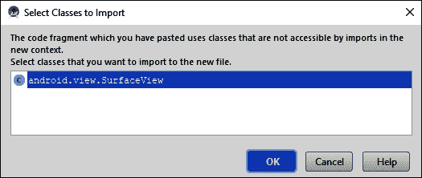
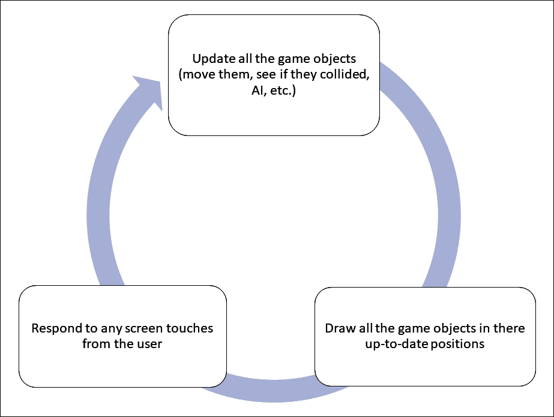
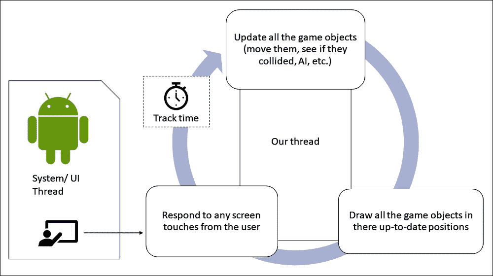
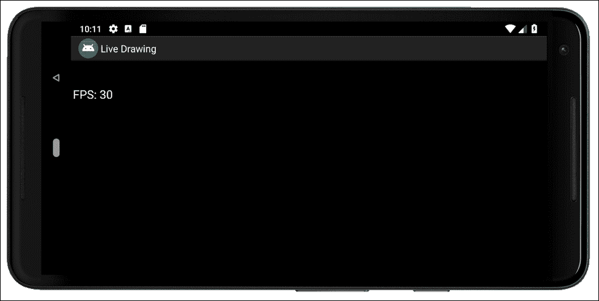

# 第二十一章。线程和启动实时绘图应用程序

在这一章，我们将开始我们的下一个应用。这款应用将是一款儿童风格的绘图应用，用户可以用手指在屏幕上画画。然而，我们创建的绘图应用程序将略有不同。用户绘制的线条将由爆炸成数千块的粒子系统组成。我们将项目称为*实景图*。

为此，我们将在本章中讨论以下主题:

*   开始使用实时绘图应用程序
*   学习关于实时互动，有时被称为**游戏循环**
*   了解**线程**
*   编写一个随时可以使用的实时系统

我们开始吧！

# 创建实时绘图项目

首先，在AndroidStudio创建一个新项目，并将其称为`Live Drawing`。使用**空活动**项目，将其余设置保留为默认值。

类似于上一章的两个绘图应用，这个应用只包含 Kotlin 文件，没有布局文件。到本章结束为止的 Kotlin 文件和所有代码都可以在下载包的`Chapter21`文件夹中找到。完整的项目可以在下载包的`Chapter22`文件夹中找到。

接下来，我们将创建空类，我们将在接下来的两章中对整个项目进行编码。创建一个名为`LiveDrawingView`的新类、一个名为`ParticleSystem,`的新类和一个名为`Particle`的新类。

# 展望实时绘图应用

由于这个 app 比较深入，需要实时响应，所以需要使用稍微深入一点的结构。起初，这可能看起来很复杂，但从长远来看，这将使我们的代码更简单、更容易理解。

我们将在实时绘图应用程序中有四个类，如下所示:

*   `MainActivity`:安卓 API 提供的`Activity`类是与**操作系统** ( **OS** )交互的类。我们已经看到了当玩家点击应用图标启动应用时，操作系统是如何与`onCreate`互动的。这个基于`Activity`的类将只处理我们应用程序的启动和关闭，并通过计算屏幕分辨率为初始化提供一些帮助，而不是拥有什么都做的`MainActivity`类。这个班应该是`Activity`型而不是`AppCompatActivity`型，这是有道理的。然而，正如您将很快看到的，我们将通过触摸将交互委托给另一个类，也就是同样处理应用程序几乎每个方面的同一个类。这将向我们介绍一些新的有趣的概念。
*   `LiveDrawingView`:这个类将负责绘制并创建实时环境，允许用户在他们的创作移动和进化的同时进行交互。
*   `ParticleSystem`:这是类，它将管理`Particle`类的上千个实例。
*   `Particle`:这个班会是所有班里面最简单的；它将在屏幕上有一个位置和一个标题。当`LiveDrawingView`类提示时，它会每秒更新大约 60 次。

现在，我们可以开始编码了。

# 对主要活动类进行编码

让我们从编写基于`Activity`的类开始。像往常一样，这个类被称为`MainActivity`，它是在我们创建项目时为我们自动生成的。

编辑类声明，并为`MainActivity`类添加代码的第一部分:

```kt
import android.app.Activity
import android.os.Bundle
import android.graphics.Point

class MainActivity : Activity() {

    private lateinit var liveDrawingView: LiveDrawingView

    override fun onCreate(savedInstanceState: Bundle?) {
        super.onCreate(savedInstanceState)

        val display = windowManager.defaultDisplay
        val size = Point()
        display.getSize(size)

        liveDrawingView = LiveDrawingView(this, size.x)

        setContentView(liveDrawingView)

    }
}
```

前面的代码显示了几个错误，我们稍后将讨论这些错误。首先要注意的是，我们正在声明我们的`LiveDrawingView`类的一个实例。目前，这是一个空类:

```kt
private lateinit var liveDrawingView: LiveDrawingView
```

下一个代码通过以下方式获取设备的像素数(水平和垂直):

```kt
val display = windowManager.defaultDisplay
```

我们创建一个名为`display`的`Display`类型的对象，并用`windowManager.defaultDisplay`初始化它，它是`Activity`类的一部分。

然后，我们创建一个名为`Point`类型的新对象`size`。我们将`size`作为参数发送给`display.getSize`功能。`Point`类型具有`x`和`y`属性，因此`size`对象也是如此，在第三行代码之后，它现在保存显示器的宽度和高度(以像素为单位)。现在，我们将`x`和`y`属性中的屏幕分辨率隐藏在`size`对象中。

接下来，在`onCreate`中，我们初始化`liveDrawingView`如下:

```kt
liveDrawingView = LiveDrawingView(this, size.x)
```

我们正在做的是将两个参数传递给`LiveDrawingView`构造函数。我们显然还没有编写构造函数，正如我们所知，默认构造函数接受零个参数。因此，这一行将导致一个错误，直到我们解决这个问题。

传入的参数很有趣。首先是`this`，是对`MainActivity`的引用。`LiveDrawingView`类需要执行它需要这个引用的动作(使用一些函数)。

第二个参数是水平屏幕分辨率。有意义的是，我们的应用程序将需要这些来执行任务，例如将其他绘图对象缩放到适当的大小。当我们开始编码`LiveDrawingView`构造函数时，我们将进一步讨论这些参数。

现在，看看下面这条更奇怪的线:

```kt
setContentView(liveDrawingView)
```

这就是我们在画布演示应用中设置`ImageView`作为应用内容的地方。记住`Activity`类的`setContentView`函数必须带一个`View`对象，`ImageView`是一个`View`对象。前一行代码似乎暗示我们将使用我们的`LiveDrawingView`类作为应用程序的可见内容？但是`LiveDrawingView`虽然有名字，却不是`View`对象。也就是说，至少现在还没有。

在我们向`MainActivity`添加几行代码后，我们将修复构造函数和 not-a- `View`问题。

添加这两个被覆盖的函数，然后我们将讨论它们。将它们添加到`onCreate`的右花括号下，但在右花括号`MainActivity`之前:

```kt
override fun onResume() {
   super.onResume()

   // More code here later in the chapter
}

override fun onPause() {
   super.onPause()

  // More code here later in the chapter
}
```

我们在这里所做的是覆盖`Activity`类的另外两个功能。我们将看到为什么我们需要这样做，以及我们将在这些函数中做什么。需要注意的是，通过添加这些被覆盖的功能，我们让操作系统有机会在另外两种情况下通知我们用户的意图，就像我们在 Note to self 应用程序中保存和加载数据时一样。

在这一点上，转到`LiveDrawingView`类是有意义的，这是这个应用程序最重要的类。我们将在本章接近尾声时`MainActivity`。

# 对 LiveDrawingView 类进行编码

我们要做的第一件事是解决我们的`LiveDrawingView`类不是`View`类型并且有错误的构造函数的问题。按如下方式更新类声明:

```kt
class LiveDrawingView(
        context: Context,
        screenX: Int)
    : SurfaceView(context){
```

系统会提示您导入`android.view.SurfaceView`类，如下图所示:



点击**确定**确认。

`SurfaceView`是`View`的后代，现在`LiveDrawingView`通过继承也是`View`的一个类型。看看已经添加的`import`声明。这种关系很清楚，如下面的代码所示:

```kt
android.view.SurfaceView

```

### 类型

请记住，正是因为多态性，我们才能将`View`的后代发送到`MainActivity`类中的`setContentView`函数，也正是因为继承，`LiveDrawingView`现在是`SurfaceView`的一种类型。

有相当多的`View`的后代，我们可以扩展来解决这个最初的问题，但是我们会看到`SurfaceView`有一些非常具体的功能，非常适合实时交互应用程序，并使这成为我们的正确选择。我们还提供了一个与从`MainActivity`调用的参数相匹配的构造函数。

要导入`Context`类，请执行以下步骤:

1.  将鼠标光标放在新构造函数签名中红色的`Context`文本上。
2.  按住 *Alt* 键，点击*回车*键。从弹出选项中选择**导入类**。

前面的步骤将导入`Context`类。现在，我们的`LiveDrawingView`类或初始化它的`MainActivity`类中没有错误。

在这个阶段，我们可以运行应用程序，看到使用`setContentView`中的`LiveDrawingView`作为`View`参数已经成功，我们有一个漂亮的空白屏幕，可以在上面绘制我们的粒子系统。如果你愿意，你可以试试这个，但是我们将对`LiveDrawingView`类进行编码，以便它接下来做一些事情。

记住`LiveDrawingView`看不到`MainActivity`中的变量。通过使用构造函数，`MainActivity`正在为`LiveDrawingView`提供对自身的引用(`this`)以及包含在`size.x`中的以像素为单位的屏幕分辨率。

在这个项目的过程中，我们会不断地回到这个班级。我们现在要做的是，在下一章对`ParticleSystem`实例进行编码之后，准备好添加它们的基础设置。

为此，我们将首先添加一些属性。接下来，我们将对`draw`函数进行编码，这将揭示我们需要采取的每秒在屏幕上绘制 60 次的新步骤。此外，我们将看到一些熟悉的代码，使用我们的老朋友，`Canvas`、`Paint`和`drawText`，从上一章。

此时，我们将需要讨论一些更多的理论；比如我们将如何为粒子的动画计时，以及我们如何在不干扰安卓流畅运行的情况下锁定这些计时等项目。这最后两个主题，即**游戏循环**和**线程，**将允许我们添加章节的最终代码，并见证我们的粒子系统绘画应用程序的运行，尽管只有一点文本。

### 类型

游戏循环是一个概念，它描述了允许虚拟系统在更新和绘制自己的同时，允许它们被用户更改和交互。

## 添加属性

在我们已经编码的`LiveDrawingView`声明和构造函数之后添加属性，如下面的代码块所示:

```kt
// Are we debugging?
private val debugging = true

// These objects are needed to do the drawing
private lateinit var canvas: Canvas
private val paint: Paint = Paint()

// How many frames per second did we get?
private var fps: Long = 0
// The number of milliseconds in a second
private val millisInSecond: Long = 1000

// How big will the text be?
// Font is 5% (1/20th) of screen width
// Margin is 1.5% (1/75th) of screen width
private val fontSize: Int = mScreenX / 20
private val fontMargin: Int = mScreenX / 75

// The particle systems will be declared here later
```

确定你研究代码，然后我们再谈。请注意，所有属性都被声明为`private`。您可以愉快地删除所有`private`访问说明符，代码仍然可以工作，但是，由于我们不需要从这个类之外访问这些属性中的任何一个，通过声明它们`private`来保证这永远不会发生是明智的。

第一个属性是`debugging`。我们将使用它，以便可以在打印调试信息和不打印调试信息之间手动切换。

我们声明实例的以下两个类将处理屏幕上的绘图:

```kt
// These objects are needed to do the drawing
private lateinit var canvas: Canvas
private val paint: Paint = Paint()
```

以下两个属性将让我们对实现流畅一致的动画所需的东西有所了解:

```kt
// How many frames per second did we get?
private var fps: Long = 0
// The number of milliseconds in a second
private val millisInSecond: Long = 1000
```

这两个属性都属于`long`类型，因为它们将持有一个我们用来测量时间的大数字。计算机根据 1970 年以来的毫秒数来测量时间。当我们了解游戏循环时，我们会更多地讨论这个问题；然而，就目前而言，我们需要知道的是，监控和测量动画每一帧的速度是我们如何确保粒子完全按照它们应该的方式移动。

第一个变量`fps`将在动画的每一帧中以大约每秒 60 次的速度重新初始化。它将被传递到每个`ParticleSystem`对象(动画的每一帧)中，以便他们知道已经过去了多少时间，然后可以计算移动或不移动多远。

`millisInSecond`变量初始化为`1000`。一秒钟确实有`1000`毫秒。我们将在计算中使用这个变量，因为它将使我们的代码比使用文字值 1，000 时更清晰。

为了方便起见，这里显示了我们刚刚添加的代码的下一部分:

```kt
// How big will the text be?
// Font is 5% (1/20th) of screen width
// Margin is 1.5% (1/75th) of screen width
private val fontSize: Int = screenX / 20
private val fontMargin: Int = screenX / 75
```

`fontSize`和`marginSize`属性将根据通过构造函数(`screenX`)传递的屏幕分辨率(以像素为单位)进行初始化。它们会以像素为单位保存一个值，使文本的格式更加简洁，而不是不断地对文本的每一位进行计算。

在我们继续之前，我们应该明确这些是您当前应该在`LiveDrawingView.kt`代码文件顶部看到的`import`语句:

```kt
import android.content.Context
import android.graphics.Canvas
import android.graphics.Paint
import android.view.SurfaceView
```

现在，让我们准备画画。

## 对绘图功能进行编码

在我们刚刚添加的属性之后立即添加`draw`功能。代码中会有几个错误。我们将首先处理它们，然后我们将详细讨论`draw`函数将如何与`SurfaceView`相关联地工作，因为那里有许多看起来像外星人的代码行，以及一些熟悉的代码行。添加以下代码:

```kt
// Draw the particle systems and the HUD
private fun draw() {
   if (holder.surface.isValid) {
         // Lock the canvas (graphics memory) ready to draw
         canvas = holder.lockCanvas()

         // Fill the screen with a solid color
         canvas.drawColor(Color.argb(255, 0, 0, 0))

         // Choose a color to paint with
         paint.color = Color.argb(255, 255, 255, 255)

         // Choose the font size
         paint.textSize = fontSize.toFloat()

         // Draw the particle systems

         // Draw the HUD

         if (debugging) {
               printDebuggingText()
         }
         // Display the drawing on screen
         // unlockCanvasAndPost is a 
         // function of SurfaceHolder
         holder.unlockCanvasAndPost(canvas)
   }
}
```

我们有两个错误——一个错误是`Color`类需要导入。您可以用通常的方法修复这个问题，或者手动添加下一行代码。无论您选择哪种方法，都需要在文件顶部的代码中添加以下额外的一行:

```kt
import android.graphics.Color;
```

现在让我们来处理另一个错误。

### 增加打印调试文本功能

第二个错误是对`printDebuggingText`的调用。该函数尚不存在；那么，现在让我们补充一下。在`draw`功能后添加代码，如下:

```kt
private fun printDebuggingText() {
   val debugSize = fontSize / 2
   val debugStart = 150
   paint.textSize = debugSize.toFloat()
   canvas.drawText("fps: $fps",
         10f, (debugStart + debugSize).toFloat(), paint)

 }
```

前面的代码使用局部`debugSize`变量来保存`fontSize`属性一半的值。这意味着当`fontSize`(用于**平视显示器**)基于屏幕分辨率动态初始化时，`debugSize`将始终是它的一半。

### 类型

平视显示器代表抬头显示，是一种奇特的方式来指代应用程序中覆盖其他对象的按钮和文本。

在我们开始绘制文本之前，`debugSize`变量用于设置字体的大小。`debugStart`变量是在一个整齐的垂直位置开始打印带有一点填充的调试文本的猜测，这样它就不会被挤压得太靠近屏幕边缘。

然后，这两个值用于在屏幕上定位一行文本，该行文本每秒显示当前帧。由于这个函数是从`draw`开始调用的，而`draw`又是从游戏循环中调用的，所以这一行文本每秒会被不断刷新高达 60 次。

### 注

在非常高或非常低分辨率的屏幕上，您可能需要试验这个值，以找到适合您屏幕的东西。

让我们在`draw`函数中探索这些新的代码行，并确切地检查我们如何使用`SurfaceView`，我们的`LiveDrawingView`类就是从这里派生出来的，来处理我们所有的绘图需求。

## 了解绘制功能和表面视图类

从功能中间的开始，向外进行改变，我们有一些熟悉的东西，比如对`drawColor`的调用，然后我们像以前一样设置颜色和文本大小。我们还可以看到注释，指示我们最终将在哪里添加代码来绘制粒子系统和平视显示器:

*   `drawColor`代码用纯色清除屏幕。
*   `paint`的`textSize`属性设置用于绘制抬头显示器的文本大小。
*   一旦我们对粒子系统进行了更多的探索，我们将对绘制平视显示器的过程进行编码。我们会让玩家知道他们画的有多少粒子和系统。

然而，全新的是`draw`函数最开始的代码，如下面的代码块所示:

```kt
if (holder.surface.isValid) {
         // Lock the canvas (graphics memory) ready to draw
         canvas = holder.lockCanvas()
```

`if`条件为`holder.surface.isValid`。如果这一行返回真，它确认我们想要操作来表示我们的画框的内存区域是可用的，然后代码在`if`语句中继续。

这是必要的，因为我们所有的绘图和其他处理(如移动对象)都将与检测用户输入并监听操作系统消息的代码异步进行。这在之前的项目中不是问题，因为我们的代码只是坐在那里等待输入，画一个单独的框架，然后再坐在那里等待。

现在，我们希望每秒连续执行代码 60 次，我们需要在访问内存之前，确认我们可以访问绘制图形的内存。

这就提出了另一个关于这段代码如何异步运行的问题。但这将在我们稍后讨论线程时得到回答。现在，只需知道代码行检查我们代码的另一部分，或者安卓本身，当前是否正在使用所需的内存部分。如果是自由的，则执行`if`语句内部的代码。

此外，要在`if`语句中执行的第一行代码调用`lockCanvas`，因此如果代码的另一部分试图在我们的代码访问内存时访问内存，它将无法访问内存，然后我们完成所有的绘图。

最后，在`draw`函数中，下面一行代码(加上注释)出现在末尾:

```kt
// Display the drawing on screen
// unlockCanvasAndPost is a 
// function of SurfaceHolder
holder.unlockCanvasAndPost(canvas)
```

`unlockCanvasAndPost`函数将我们新装饰的`Canvas`对象(`canvas`)发送到屏幕上进行绘制，并释放锁，以便其他代码区域可以使用它，尽管非常短暂，然后整个过程再次开始。这个过程发生在每一帧动画中。

我们现在理解`draw`函数中的代码。然而，我们仍然没有反复调用`draw`函数的机制。事实上，我们甚至一次都不调用`draw`函数。接下来，我们将讨论游戏循环和线程。

# 游戏循环

那么到底是什么游戏循环呢？几乎每个实时绘图、基于图形的应用程序和游戏都有一个游戏循环。即使是你可能没有想到的游戏，比如回合制游戏，仍然需要将玩家输入与绘图和 AI 同步，同时遵循底层 OS 的规则。

不断需要更新应用程序中的对象，例如移动对象并在当前位置绘制所有内容，同时响应用户输入:



我们的游戏循环包括三个主要阶段:

1.  通过移动、检测碰撞和处理人工智能(如粒子运动和状态变化)来更新所有游戏和绘图对象
2.  根据刚刚更新的数据，绘制最新状态的动画帧
3.  响应用户的屏幕触摸

我们已经有了处理这部分循环的`draw`函数。这表明我们也将有一个功能来完成所有的更新。我们将很快对一个`update`函数的轮廓进行编码。此外，我们知道我们可以响应屏幕触摸，尽管我们将需要稍微适应所有以前的项目，因为我们不再在`Activity`类中工作，也不再使用布局中的传统用户界面小部件。

还有一个问题是(正如我简要提到的)，所有的更新和绘制都是异步进行的，以检测屏幕触摸并监听操作系统。

### 类型

明确一点，异步意味着它不会同时发生。我们的代码将通过与安卓和用户界面共享执行时间来工作。CPU 会非常快速地在我们的代码和 Android 或用户输入之间来回切换。

但是这三个阶段到底是如何循环的呢？我们将如何对这个异步系统进行编码，从中可以调用`update`和`draw`，我们将如何使循环以正确的速度(或帧率)运行？

正如你可能猜到的，编写一个高效的游戏循环并不像`while`循环那么简单。

### 注

然而，我们的游戏循环也将包含一个`while`循环。

我们需要考虑定时、启动和停止循环，除了不要导致操作系统无响应，因为我们在单个循环中垄断了整个 CPU。

但是什么时候以及我们如何调用我们的`draw`函数呢？我们如何测量和跟踪帧速率？考虑到这些因素，我们完成的游戏循环是可能由下图更好地表示——注意**线程**概念的介绍:



现在我们知道了我们想要实现的目标，让我们了解一下线程。

# 螺纹

那么，是什么线程呢？你可以像看待故事中的线程一样看待编程中的线程。在故事的一个线索中，我们可能会看到主角在前线与敌人战斗，而在另一个线索中，士兵的家人却在日复一日地生活着。当然，一个故事不一定只有两条线索——我们可以引入第三条线索。例如，这个故事还讲述了政治家和军事指挥官做出的决定，这些决定然后微妙地，或者不那么微妙地，影响着其他线索中发生的事情。

编程线程就是这样。我们在程序中创建控制不同方面的部分或线程。在 Android 中，当我们需要确保一个任务不干扰应用的主(UI)线程时，或者如果我们有一个后台任务需要很长时间才能完成，并且必须不中断执行的主线程时，线程尤其有用。我们引入线程来表示这些不同的方面，原因如下:

*   从组织的角度来看，它们是有意义的
*   它们是一种行之有效的构建程序的方法
*   我们工作的系统的性质迫使我们无论如何都要使用它们

在安卓系统中，我们同时使用线程有三个原因——因为它有意义，它有效，而且我们必须使用线程，因为安卓系统的设计需要它。

通常，我们在不知情的情况下使用线程。这是因为我们使用代表我们使用线程的类。我们在[第 19 章](21.html "Chapter 19. Animations and Interpolations")、*动画和插值*中编码的所有动画都是在线程中运行的。安卓中的另一个这样的例子是`SoundPool`类，它在一个线程中加载声音。我们将在[第 23 章](25.html "Chapter 23. Android Sound Effects and the Spinner Widget")、*安卓音效和旋转器小部件*中看到，或者更确切地说听到`SoundPool`的动作。我们将再次看到，我们的代码不必处理我们将要学习的线程方面，因为它都是由类在内部处理的。然而，在这个项目中，我们需要更多的参与。

在实时系统中，想象一个线程正在接收玩家左右移动的按钮点击，同时监听来自操作系统的消息，例如调用`onCreate`(以及我们稍后将看到的其他功能)作为一个线程，另一个线程绘制所有图形并计算所有移动。

## 线程问题

有多个线程的程序可以有与之相关的问题，比如一个故事的线程；如果没有进行适当的同步，那么事情可能会出错。如果我们的士兵在战斗前或战争存在前就参战了呢？

假设我们有一个变量`Int x`，它代表程序的三个线程使用的一个关键数据。如果一个线程稍微领先于它自己，并使其他两个线程的数据“错误”，会发生什么？这个问题就是**正确性**的问题，这个问题是由多个线程在不经意间竞相完成造成的——因为它们毕竟只是哑代码。

正确性的问题可以通过密切监督线程和锁定来解决。**锁定**意味着暂时阻止一个线程中的执行，以确保事情以同步的方式工作；这类似于阻止士兵登船参战，直到船靠岸，跳板被放下，从而避免尴尬的水花。

多线程程序的另一个问题是**死锁**的问题。在这里，一个或多个线程被锁定，等待“合适”的时机访问`Int x`；然而，那个时刻从未到来，最终，整个项目陷入停顿。

您可能已经注意到，第一个问题(正确性)的解决方案是第二个问题(死锁)的原因。

幸运的是，问题已经为我们解决了。就像我们使用`Activity`类并覆盖`onCreate`来准确知道何时需要创建我们的应用程序一样，我们也可以使用其他类来创建和管理我们的线程。例如`Activity,`我们只需要知道如何使用它们，而不需要知道它们是如何工作的。

那么，为什么我告诉你线程，而你不需要知道它们，你问得对吗？这仅仅是因为我们将编写看起来不同的代码，并且是以一种不熟悉的方式构建的。然后，我们可以实现以下目标:

*   理解线程的一般概念，因为它与几乎同时发生的故事线程相同
*   学习使用线程的几个规则

通过这样做，我们将毫无困难地编写我们的 Kotlin 代码，以便在我们的线程中创建和工作。有几个不同的安卓类处理线程，不同的线程类在不同的情况下效果最好。

我们需要记住的是，我们将编写几乎同时在*和*运行的程序部分。

### 类型

几乎是什么意思？正在发生的是 CPU 轮流/异步地在线程之间切换。然而，这发生得如此之快，以至于我们除了同时性/同步性之外，将无法感知任何东西。当然，在故事线索类比中，人们确实完全同步行动。

让我们看一下我们的线程代码会是什么样子。暂时不要向项目中添加任何代码。然后，我们可以声明一个`Thread`类型的对象，如下所示:

```kt
private lateinit var thread: Thread
```

然后，您可以初始化并启动它，如下所示:

```kt
// Initialize the instance of Thread
thread = Thread(this)

// Start the thread
thread.start()
```

线程还有一个难题；再来看看初始化线程的构造函数。为了方便起见，下面是代码行:

```kt
thread = Thread(this)
```

看看传递给构造函数的参数；我们通过`this`。请记住，代码是进入`LiveDrawingView`类，而不是`MainActivity`类。因此，我们可以推测`this`是对`LiveDrawingView`类的引用(扩展了`SurfaceView`)。

当安卓总部的工程师编写`Thread`类时，他们似乎不太可能意识到有一天，我们会编写我们的`LiveDrawingView`类。那么，这怎么可能行得通呢？

`Thread`类需要一个完全不同的类型来传递给它的构造函数。`Thread`构造器需要一个`Runnable`对象。

### 注

你可以在这里参考安卓开发者网站上的`Thread`类来确认这个事实:[https://developer . Android . com/reference/Java/lang/Thread . html # Thread(Java . lang . runnable)](https://developer.android.com/reference/java/lang/Thread.html#Thread(java.lang.Runnable))。

你还记得我们在[第 12 章](14.html "Chapter 12. Connecting Our Kotlin to the UI and Nullability")、*中讨论过将我们的 Kotlin 连接到 UI 和可空性*吗？提醒一下，我们可以通过在类声明后添加接口名称来实现接口。

然后，我们必须实现接口的抽象功能。`Runnable`只有一个；它就是`run`功能。

### 注

你可以通过查看安卓开发者网站上的`Runnable`界面来确认前面的这个事实:https://developer . Android . com/reference/Java/lang/runnable . html。

我们可以然后使用`override`关键字来更改当操作系统允许我们的线程对象运行其代码时会发生什么:

```kt
override fun run() {
         // Anything in here executes in a thread
         // No skill needed on our part
         // It is all handled by Android, the Thread class
         // and the Runnable interface
}
```

在被覆盖的`run` 函数中，我们将调用两个函数，一个是我们已经启动的`draw`，另一个是`update`。`update`功能是我们所有计算和人工智能的去处。代码将类似于下面的块，但不要添加它:

```kt
override fun run() { 
    // Update the drawing based on
    // user input and physics
    update()

    // Draw all the particle systems in their updated locations
    draw() 
}
```

在适当的时候，我们也可以如下停止线程:

```kt
thread.join()
```

现在，`run`函数中的所有内容都在一个单独的线程中执行，让缺省或 UI 线程监听触摸和系统事件。我们将很快看到这两个线程如何在绘图项目中相互通信。

请注意，代码的所有这些部分将在我们的应用程序中具体到哪里还没有解释，但是它在实际项目中更容易展示给你。

# 用线程实现游戏循环

现在我们已经了解了游戏循环和线程，我们可以把它们放在一起，在 Living Drawing 项目中实现我们的游戏循环。

我们将为游戏循环添加完整的代码，包括在`MainActivity`类的两个函数中编写代码来启动和停止控制循环的线程。

### 类型

**读者挑战**

你能自己算出基于`Activity`的类将如何启动和停止`LiveDrawingView`类中的线程吗？

## 实现可运行并提供运行功能

通过实现`Runnable`更新类声明，如下图高亮显示的代码所示:

```kt
class LiveDrawingView(
        context: Context,
        screenX: Int)
    : SurfaceView(context), Runnable {
```

注意我们在代码中有一个新的错误。将鼠标光标悬停在单词`Runnable`上，您将看到一条消息，通知您我们需要实现`run`功能，正如我们在上一节讨论接口和线程时所讨论的那样。添加空的`run`功能，包括`override`标签。

添加到哪里并不重要，只要它在`LiveDrawingView`类的花括号内，而不是在另一个函数内。添加空`run`功能，如下:

```kt
// When we start the thread with:
// thread.start();
// the run function is continuously called by Android
// because we implemented the Runnable interface
// Calling thread.join();
// will stop the thread
override fun run() {

}
```

错误消失了，现在我们可以声明并初始化一个`Thread`对象。

## 对线程进行编码

声明类中所有其他成员下面的一些变量和实例，如下所示:

```kt
// Here is the Thread and two control variables
private lateinit var thread: Thread
// This volatile variable can be accessed
// from inside and outside the thread
@Volatile
private var drawing: Boolean = false
private var paused = true
```

现在，我们可以开始和停止线程——花点时间想想我们可以在哪里做这件事。请记住，应用程序需要响应正在启动和停止应用程序的操作系统。

## 启动和停止线程

现在，我们需要开始和停止线程。我们已经看到了我们需要的代码，但是我们应该在何时何地进行呢？让我们给两个函数添加代码——一个用于启动，一个用于停止——然后我们可以考虑何时何地调用这些函数。在`LiveDrawingView`类中添加这两个函数。如果他们的名字听起来耳熟，那不是偶然的:

```kt
// This function is called by MainActivity
// when the user quits the app
fun pause() {
   // Set drawing to false
   // Stopping the thread isn't
   // always instant
   drawing = false
   try {
         // Stop the thread
         thread.join()
  }  catch (e: InterruptedException) {
     Log.e("Error:", "joining thread")
  }

}

// This function is called by MainActivity
// when the player starts the app
fun resume() {
    drawing = true
    // Initialize the instance of Thread
    thread = Thread(this)

    // Start the thread
    thread.start()
}
```

发生了什么，评论略有透露。我们现在有一个`pause`和`resume`函数，使用我们之前讨论过的相同代码来停止和启动`Thread`对象。

注意新的函数是`public`，因此，它们可以从类外部访问到任何其他有`LiveDrawingView`实例的类。请记住`MainActivity`保存了`LiveDrawingView`的完全声明和初始化的实例。

让我们使用安卓活动生命周期来调用这两个新功能。

## 使用活动生命周期来启动和停止线程

更新`MainActivity`中被覆盖的`onResume`和`onPause`功能，如以下高亮显示的代码行所示:

```kt
override fun onResume() {
  super.onResume()

  // More code here later in the chapter
 liveDrawingView.resume()
}

override fun onPause() {
   super.onPause()

   // More code here later in the chapter
 liveDrawingView.pause()
}
```

现在，我们的线程将在操作系统恢复和暂停我们的应用程序时启动和停止。请记住`onResume`是在`onCreate`第一次启动应用后调用的，而不仅仅是从暂停中恢复。`onResume`和`onPause`内部的代码使用`liveDrawingView`对象来调用其`resume`和`pause`函数，而这些函数又有启动和停止线程的代码。该代码然后触发线程的`run`函数执行。正是在这个`run`功能中(在`LiveDrawingView`中)，我们将对我们的游戏循环进行编码。我们现在就开始吧。

## 对运行函数进行编码

虽然我们的线程已经设置好并准备好了，但是因为`run`函数是空的，所以什么也没有发生。对`run`功能进行编码，如下所示:

```kt
override fun run() {
   // The drawing Boolean gives us finer control
   // rather than just relying on the calls to run
   // drawing must be true AND
   // the thread running for the main
   // loop to execute
   while (drawing) {

         // What time is it now at the 
         // start of the loop?
         val frameStartTime = 
               System.currentTimeMillis()

        // Provided the app isn't paused
        // call the update function
        if (!paused) {
              update()
        }

        // The movement has been handled
        // we can draw the scene.
        draw()

        // How long did this frame/loop take?
        // Store the answer in timeThisFrame
        val timeThisFrame = System.currentTimeMillis() 
            - frameStartTime

      // Make sure timeThisFrame is 
      // at least 1 millisecond
      // because accidentally dividing
      // by zero crashes the app
      if (timeThisFrame > 0) {
            // Store the current frame rate in fps
            // ready to pass to the update functions of
            // of our particles in the next frame/loop
            fps = millisInSecond / timeThisFrame
      }
   }
}
```

注意AndroidStudio有两个错误。这是因为我们还没有写`update`函数。让我们快速为它添加一个空函数(带注释)；我在`run`功能后添加了我的:

```kt
private fun update() {
   // Update the particles
}
```

现在，让我们详细讨论一下`run`函数中的代码如何通过一步一步地查看整个事情来实现我们游戏循环的目标。

这个第一部分用`drawing`条件启动一个`while`循环，然后把剩下的代码包装在`run`里面，这样线程就需要被启动(为了调用`run`)并且`drawing`需要为真才能执行`while`循环:

```kt
override fun run() {
   // The drawing Boolean gives us finer control
   // rather than just relying on the calls to run
   // drawing must be true AND
   // the thread running for the main
   // loop to execute
   while (drawing) {
```

`while`循环中的第一行代码声明并初始化一个局部变量`frameStartTime`，无论当前时间是多少。`System`类的`currentTimeMillis`函数返回该值。如果我们稍后想要测量一帧花了多长时间，那么我们需要知道它开始的时间:

```kt
// What time is it now at the 
// start of the loop?
val frameStartTime = 
  System.currentTimeMillis()
```

接下来，仍然在`while`循环中，我们检查应用程序是否暂停，并且只有当应用程序没有暂停时，下一个代码才会被执行。如果逻辑允许在该块内执行，则调用`update`:

```kt
// Provided the app isn't paused
// call the update function
if (!paused) {
   update()
}
```

在之前的`if`语句之外，调用`draw`函数来绘制刚刚更新位置的所有对象。此时，另一个局部变量被声明并初始化为完成整个帧(更新和绘制)所需的时间长度。该值通过再次使用`currentTimeMillis`获取当前时间并从中减去`frameStartTime`来计算，如下所示:

```kt
// The movement has been handled
// we can draw the scene.
draw()

// How long did this frame/loop take?
// Store the answer in timeThisFrame
val timeThisFrame = System.currentTimeMillis() 
  - frameStartTime
```

下一条`if`语句检测`timeThisFrame`是否大于零。如果线程在对象初始化之前运行，该值可能为零。如果您查看`if`语句中的代码，它会通过将经过的时间除以`millisInSecond`来计算帧速率。如果你除以零，应用程序将崩溃，这就是为什么我们执行检查。

一旦`fps`获得分配给它的值，我们就可以在下一帧中使用它来传递给`update`函数，该函数会更新我们将在下一章中编码的所有粒子。他们将使用该值来确保他们根据目标速度和刚刚结束的动画帧所用的时间长度精确移动正确的量:

```kt
// Make sure timeThisFrame is 
// at least 1 millisecond
// because accidentally dividing
// by zero crashes the app
if (timeThisFrame > 0) {
   // Store the current frame rate in fps
   // ready to pass to the update functions of
   // of our particles in the next frame/loop
   fps = millisInSecond / timeThisFrame
}
```

在每一帧中初始化`fps`的计算结果是`fps`将保持 1 的一小部分。随着帧速率的波动，`fps`将保持不同的值，并为粒子系统提供适当的数量来计算每次移动。

# 运行应用

点击Android Studio 中的播放按钮，章节的辛苦和理论就会活过来:



你可以看到我们现在有了一个用我们的游戏循环和一个线程创建的实时系统。如果你在一个真实的设备上运行这个，在这个阶段你将很容易达到每秒 60 帧。

# 总结

这可能是迄今为止最技术性的一章。我们探索了线程、游戏循环、计时、使用界面和`Activity`生命周期——这是一个需要塞进去的非常长的主题列表。

如果这些事情之间的确切相互关系仍然不完全清楚，那就不是问题。你需要知道的是，当用户启动和停止应用时，`MainActivity`类会通过调用`LiveDrawingView`类的`pause`和`resume`函数来处理线程的启动和停止。它通过被操作系统调用的被覆盖的`onPause`和`onResume`函数来实现这一点。

线程运行后，`run`函数中的代码将与监听用户输入的用户界面线程一起执行。我们称`update`和`draw`功能为`run`功能，同时记录每一帧要花多长时间，这样我们的应用就可以开始摇摆了。

我们只需要允许用户在他们的作品中添加一些粒子，然后我们可以在每次调用`update`时更新它们，并在每次调用`draw`时绘制它们。

在下一章中，我们将编码、更新和绘制`Particle`和`ParticleSytem`类。此外，我们将为用户编写代码，与应用程序进行交互(绘制一些图形)。