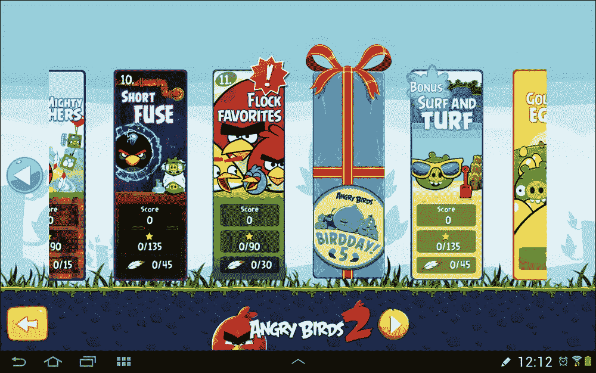
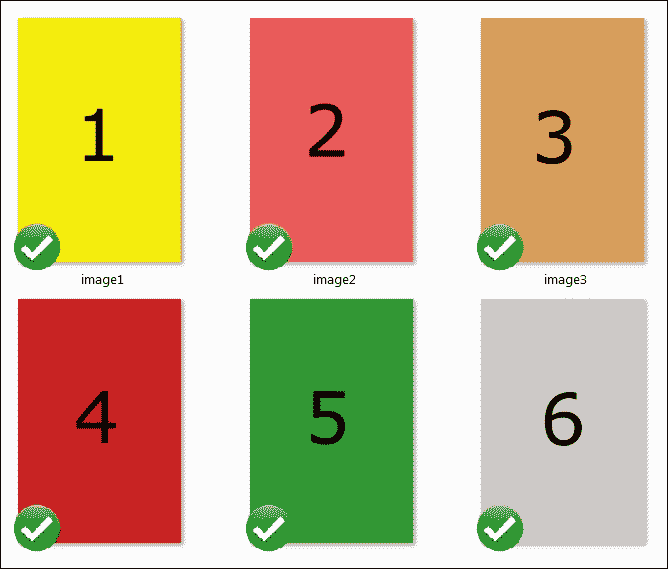
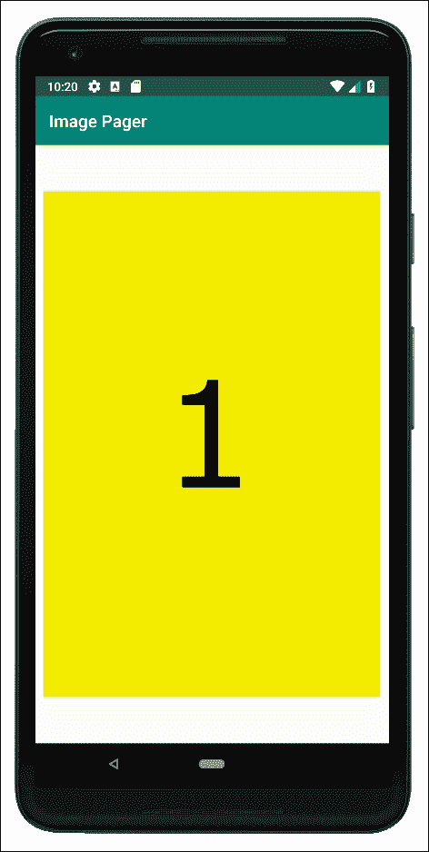
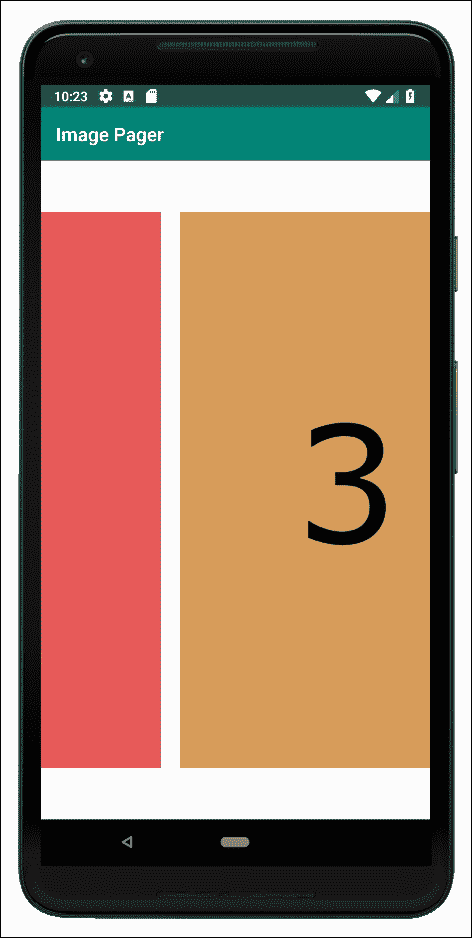
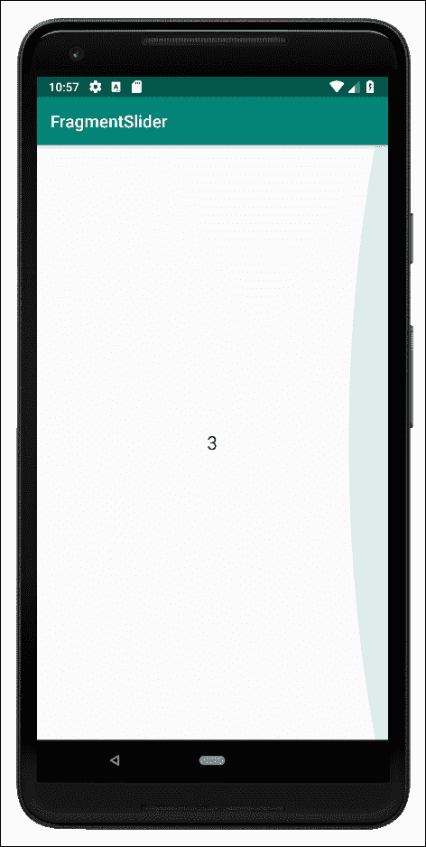

# 二十五、带分页和滑动的高级用户界面

**分页**是从一页移动到另一页的行为，在安卓系统上，我们通过在屏幕上滑动手指来完成。当前页面随后在方向和速度上转换，以匹配手指移动。这是一种在应用中导航的有用且实用的方法，但也许比这更重要的是，它对用户来说是一种极其令人满意的视觉效果。此外，像`RecyclerView`一样，我们可以有选择地加载当前页面所需的数据，也可以预先加载前一页和后一页的数据。

正如您所料，安卓应用编程接口有一些以非常简单的方式实现分页的解决方案。

在本章中，我们将学习执行以下操作:

*   像在照片库应用中一样，对图像进行分页和滑动
*   使用基于`Fragment`的布局实现分页和滑动，使我们的用户能够在整个用户界面中滑动

首先，我们来看一个刷卡的例子。

# 愤怒的小鸟经典刷卡菜单

在这里，我们可以看到著名的愤怒的小鸟等级选择菜单，显示滑动/分页正在运行:



让我们构建两个分页应用:一个有图像，一个有`Fragment`实例。

# 构建一个图库/滑块应用

在 AndroidStudio 创建一个名为`Image Pager`的新项目。使用**空活动**模板，将其余设置保留为默认值。

这些图像位于`Chapter25/Image Pager/drawable`文件夹的下载包中。下图显示了它们在窗口资源管理器中的位置:



将图像添加到项目浏览器的`drawable`文件夹中，当然，您也可以添加更多有趣的图像，也许是您拍摄的一些照片。

## 实施布局

对于一个简单的图片分页应用，我们使用`PagerAdapter`类。我们可以认为这就像`RecyclerApater`但是对于图像，因为它将处理`ViewPager`小部件中的图像阵列的显示。这很像`RecyclerAdapter`，它在`RecyclerView`中处理`ArrayList`的内容显示。我们需要做的就是覆盖适当的函数。

要用`PagerAdapter`实现一个图库，我们首先需要在我们的主布局中有一个`ViewPager`小部件。所以，你可以准确地看到需要什么；以下是`activity_main.xml`的实际 XML 代码。编辑`layout_main.xml`如下图所示:

```kt
<RelativeLayout xmlns:android=
   "http://schemas.android.com/apk/res/android"
    android:layout_width="fill_parent"
    android:layout_height="fill_parent" >

    <androidx.viewpager.widget.ViewPager
        android:id="@+id/pager"
        android:layout_width="wrap_content"
        android:layout_height="wrap_content" />

</RelativeLayout>
```

稍微有点不寻常的命名类`androidx.ViewPager.widget.ViewPager`，是在`ViewPager`之前发布的安卓版本中提供该功能的类。

接下来，有点像我们需要一个布局来表示列表项，我们需要一个布局来表示我们的`ViewPager`小部件中的一个项，在本例中是一个图像。用通常的方法新建一个布局文件，称之为`pager_item.xml`。它将有一个单一的`ImageView`和一个`imageView`的`id`属性。

使用可视化设计器来实现，或者将下面的 XML 复制到`pager_item.xml`中:

```kt
<RelativeLayout xmlns:android=
   "http://schemas.android.com/apk/res/android"
    android:layout_width="fill_parent"
    android:layout_height="fill_parent" >

    <androidx.viewpager.widget.ViewPager
        android:id="@+id/pager"
        android:layout_width="wrap_content"
        android:layout_height="wrap_content" />

</RelativeLayout>
```

现在，我们可以开始上课了。

## 对寻呼机适配器类进行编码

接下来，我们需要继承`PagerAdapter`来处理图像。创建一个名为`ImagePagerAdapter`的新类，并使其继承自`PagerAdapter`。在这一点上，代码应该是这样的:

```kt
class ImagePagerAdapter: PagerAdapter() {
}
```

将以下导入添加到`ImagePagerAdapter`类的顶部。我们通常依靠使用快捷方式 *Alt* + *进入*来添加进口。我们这次做的事情略有不同，因为安卓应用编程接口中有一些名称非常相似的类不适合我们的目标。

将以下导入添加到`ImagePagerAdapter`类:

```kt
import android.content.Context
import android.view.LayoutInflater
import android.view.Vie
import android.view.ViewGroup
import android.widget.ImageView
import android.widget.RelativeLayout

import androidx.viewpager.widget.PagerAdapter
import androidx.viewpager.widget.ViewPager
```

接下来，在类中添加一个构造函数，以便在创建实例时从`MainActivity`获得一个`Context`对象和一个`Int`数组(指图像资源标识):

```kt
class ImagePagerAdapter(
        var context: Context,
 private var images: IntArray)
        : PagerAdapter() {

}
```

现在，我们必须覆盖`PagerAdapter`所需的功能。在`ImagePagerAdapter`类的主体中，添加被覆盖的`getCount`函数，该函数简单地返回数组中图像标识的数量。该函数由类在内部使用:

```kt
override fun getCount(): Int {
   return images.size
}
```

现在，我们必须覆盖`isViewFromObject`函数，该函数只返回一个`Boolean`，这取决于当前`View`是否与作为参数传入的当前`Object`相同或相关联。同样，这是一个由类内部使用的函数。紧接着前面的代码，添加这个被覆盖的函数:

```kt
override fun isViewFromObject(
         view: View, `object`: Any)
       : Boolean {
   return view === `object`
}
```

现在，我们必须覆盖`instantiateItem`功能，这是我们做大多数与我们相关的工作的地方。首先，我们声明一个新的`ImageView`对象，然后我们初始化一个`LayoutInflater`。接下来，我们使用`LayoutInflater`从我们的`pager_item.xml`布局文件中声明并初始化一个新的`View`。

在此之后，我们得到对`pager_item.xml`布局内部的`ImageView`的引用。我们现在可以根据`instantiateItem`函数的`position`参数和来自`images`数组的适当标识，添加适当的图像作为`ImageView`小部件的内容。

最后，我们用`addView`将布局添加到`PagerAdapter`并从函数返回。

现在，添加我们刚刚讨论过的代码:

```kt
override fun instantiateItem(
         container: ViewGroup,
         position: Int)
         : View {

  val image: ImageView
  val inflater: LayoutInflater =
        context.getSystemService(
        Context.LAYOUT_INFLATER_SERVICE)
        as LayoutInflater

  val itemView =
        inflater.inflate(
              R.layout.pager_item, container,
              false)

     // get reference to imageView in pager_item layout
     image = itemView.findViewById<View>(
           R.id.imageView) as ImageView

  // Set an image to the ImageView
  image.setImageResource(images[position])

  // Add pager_item layout as 
  // the current page to the ViewPager
  (container as ViewPager).addView(itemView)

  return itemView
}
```

我们必须覆盖的最后一个函数是`destroyItem`，当类需要根据`position`参数的值移除一个合适的项目时，可以调用这个函数。

在上一个代码之后，`ImagePagerAdapter`类的右花括号之前添加`destroyItem`函数:

```kt
override fun destroyItem(
  container: ViewGroup, 
  position: Int, 
  `object`: Any) {

  // Remove pager_item layout from ViewPager
  (container as ViewPager).
        removeView(`object` as RelativeLayout)
}
```

正如我们在编码`ImagePagerAdapter`时看到的，这方面的内容很少。这只是正确实现`ImagePagerAdapter`类用来帮助幕后工作顺利进行的被覆盖函数的一个例子。

现在，我们可以对`MainActivity`类进行编码，它将使用`ImagePagerAdapter`。

## 对主要活动类进行编码

最后，我们可以对我们的`MainActivity`类进行编码。与`ImagePagerAdapter`类一样，为了清楚起见，在类声明之前将以下导入语句手动添加到`MainActivity`类中，如下代码所示:

```kt
import android.view.View
import androidx.viewpager.widget.ViewPager
import androidx.viewpager.widget.PagerAdapter
```

所有代码都进入`onCreate`功能。我们用添加到`drawable-xhdpi`文件夹的每个图像初始化我们的`Int`数组。

我们用`findViewByID`函数以通常的方式初始化一个`ViewPager`小部件。我们还通过传入对`MainActivity`和`images`数组的引用来初始化我们的`ImagePagerAdapter`实例，正如我们之前编码的构造函数所要求的那样。最后，我们用`setAdapter`将适配器绑定到寻呼机上。

将`onCreate`函数编码为如下代码:

```kt
override fun onCreate(savedInstanceState: Bundle?) {
   super.onCreate(savedInstanceState)

   setContentView(R.layout.activity_main)

   // Grab all the images and stuff them in our array
   val images: IntArray = intArrayOf(
         R.drawable.image1,
         R.drawable.image2,
         R.drawable.image3,
         R.drawable.image4,
         R.drawable.image5,
         R.drawable.image6)

  // get a reference to the ViewPager in the layout
  val viewPager: ViewPager =
        findViewById<View>(R.id.pager) as ViewPager

  // Initialize our adapter
  val adapter: PagerAdapter =
        ImagePagerAdapter(this, images)

  // Binds the Adapter to the ViewPager
  viewPager.adapter = adapter

}
```

现在，我们准备运行该应用。

## 运行图库应用

在这里，我们可以看到来自我们`int`阵列的第一个图像:



向左和向右滑动一点，查看图像平滑过渡的令人愉悦的方式:



现在，我们将构建一个具有几乎相同功能的应用，除了寻呼机中的每个页面都是一个`Fragment`实例，它可以具有普通`Fragment`可以具有的任何功能，因为它们是普通的`Fragments`。

在实现这一点之前，让我们学习更多的 Kotlin，这将有助于我们实现这一点。

# Kotlin 伴物体

伴随的对象在语法上类似于内部类，因为我们在常规类中声明它，但是注意我们称它为对象，而不是类。这意味着它本身是一个实例，而不是一个实例的蓝图。事情就是这样。当我们在一个类中声明一个伴随对象时，它的属性和函数由常规类的所有实例共享。当我们希望一堆常规类共享一组相关数据时，这是完美的。我们将在下一个应用中看到一个正在运行的伴随对象，在倒数第二章的年龄数据库应用中也是如此。

# 构建片段寻呼机/滑块应用

我们可以将整个`Fragment`实例作为页面放在`PagerAdapter`中。这非常强大，因为正如我们所知，一个`Fragment`实例可以有大量的功能——甚至是一个成熟的用户界面。

为了保持代码简短明了，我们将为每个`Fragment`布局添加一个单独的`TextView`，只是为了演示寻呼机正在工作。然而，当我们看到获取对`TextView,`的引用是多么容易的时候，很明显我们可以如何轻松地添加我们到目前为止所学的任何布局，然后让用户与之交互。

### 注

在下一个项目中，我们将看到显示多个`Fragment`实例、`NavigationView`的另一种方式，我们将实际实现多个编码的`Fragment`实例。

我们要做的第一件事是为滑块构建内容。当然，在这种情况下，内容是`Fragment`的一个实例。我们将构建一个名为`SimpleFragment`的简单类和一个名为`fragment_layout`的简单布局。

您可能认为这意味着每张幻灯片的外观都是相同的，但是我们将使用`FragmentManager`在实例化时传递的 ID 作为`TextView`的文本。这样，当我们翻转/扫过`Fragment`实例时，很明显每个实例都是一个新的独特实例。

当我们看到从列表中加载`Fragment`实例的代码时，将很容易设计出完全不同的`Fragment`类，就像我们之前所做的那样，并将这些不同的类用于一些或所有的幻灯片。当然，每个类也可以使用不同的布局。

## 编码简单片段类

与图像寻呼机应用一样，AndroidStudio 需要自动导入哪些类并不十分简单。我们使用我们所做的类，因为它们都是相互兼容的，有可能如果你让 AndroidStudio 建议导入哪些类，它会“出错”项目文件位于`Chapter25/Fragment Pager` 文件夹中。

使用**空活动**模板创建一个名为`Fragment Slider`的新项目，并将所有设置保留为默认值。

现在，创建一个名为`SimpleFragment`的新类，从`Fragment`继承，并添加`import`语句，如下代码所示:

```kt
import android.view.LayoutInflater
import android.view.View
import android.view.ViewGroup
import android.widget.TextView

import androidx.fragment.app.Fragment

class SimpleFragment: Fragment() {
}
```

我们必须添加两个函数，第一个是`newInstance`，并将包含在一个伴随对象中，我们将从`MainActivity`调用该伴随对象来设置并返回对`Fragment`的引用。下面的代码创建了类的一个新实例，但是它也将一个`String`放入`Bundle`对象中，该对象最终将从`onCreateView`函数中读取。添加到`Bundle`的`String`，作为该`newInstance`功能的唯一参数传入。

将伴随对象内的`newInstance`功能添加到`SimpleFragment`类，如下所示:

```kt
class SimpleFragment: Fragment() {
// Our companion object which
// we call to make a new Fragment

companion object {
   // Holds the fragment id passed in when created
   val messageID = "messageID"

   fun newInstance(message: String)
               : SimpleFragment {
        // Create the fragment
        val fragment = SimpleFragment()

        // Create a bundle for our message/id
        val bundle = Bundle(1)
        // Load up the Bundle
        bundle.putString(messageID, message)
        fragment.arguments = bundle
        return fragment
   }
}
```

我们的`SimpleFragment`类的最后一个函数需要覆盖`onCreateView`，像往常一样，我们将获得一个传递进来的布局的引用，并加载我们的`fragment_layout` XML 文件作为布局。

然后，第一行代码使用键-值对的`getArguments.getString`和`MESSAGE`标识符从`Bundle`解包`String`。

添加我们刚刚讨论过的`onCreateView`功能:

```kt
override fun onCreateView(
         inflater: LayoutInflater,
         container: ViewGroup?,
         savedInstanceState: Bundle?)
         : View? {

  // Get the id from the Bundle
  val message = arguments!!.getString(messageID)

  // Inflate the view as normal
  val view = inflater.inflate(
              R.layout.fragment_layout,
              container,
              false)

  // Get a reference to textView
  val messageTextView = view
        .findViewById<View>(R.id.textView) 
              as TextView

  // Display the id in the TextView
  messageTextView.text = message

  // We could also handle any UI
  // of any complexity in the usual way
  // And we will over the next two chapters
  // ..
  // ..

  return view
}
```

让我们也为`Fragment`做一个超级简单的布局，它当然会包含我们刚刚使用的`TextView`。

## 片段 _ 布局

`fragment_layout`是我们做过的最简单的布局。右键单击`layout`文件夹，选择**新建** | **资源布局文件**。命名文件`fragment_layout`，左键单击**确定**。现在，添加单个`TextView`并将其`id`属性设置为`textView`。

我们现在可以对`MainActivity`类进行编码了，它处理`FragmentPager`并赋予我们的`SimpleFragment`实例以生命。

## 对主要活动类进行编码

本课程由两个主要部分组成；首先，我们将对被覆盖的`onCreate`函数进行更改，其次，实现一个内部类及其被覆盖的`FragmentPagerAdapter`函数。

首先，添加以下导入:

```kt
import java.util.ArrayList

import androidx.appcompat.app.AppCompatActivity
import androidx.fragment.app.Fragment
import androidx.fragment.app.FragmentManager
import androidx.fragment.app.FragmentPagerAdapter
import androidx.viewpager.widget.ViewPager
```

接下来，在`onCreate`函数中，我们为`Fragment`实例创建一个`ArrayList`，然后创建并添加三个`SimpleFragment,`实例，传入一个数字标识符，打包到`Bundle`中。

然后我们初始化`SimpleFragmentPagerAdapter`(我们将很快对其进行编码)，传入我们的片段列表。

我们用`findViewByID`获取对`ViewPager`的引用，并用`setAdapter`将我们的适配器绑定到它。

将该代码添加到`MainActivity`的`onCreate`功能中:

```kt
public override fun onCreate(savedInstanceState: Bundle?) {
  super.onCreate(savedInstanceState)
  setContentView(R.layout.activity_main)

  // Initialize a list of three fragments
  val fragmentList = ArrayList<Fragment>()

  // Add three new Fragments to the list
  fragmentList.add(SimpleFragment.newInstance("1"))
  fragmentList.add(SimpleFragment.newInstance("2"))
  fragmentList.add(SimpleFragment.newInstance("3"))

  val pageAdapter = SimpleFragmentPagerAdapter(
              supportFragmentManager, fragmentList)

  val pager = findViewById<View>(R.id.pager) as ViewPager
  pager.adapter = pageAdapter

}
```

现在，我们将添加我们的`inner`类，`SimpleFragmentPagerAdapter`。我们所做的就是在构造函数中为`Fragment`实例添加一个`ArrayList`，用传入的列表初始化它。

然后，我们覆盖内部使用的`getItem`和`getCount`函数，就像我们在上一个项目中所做的一样。将我们刚刚讨论的以下`inner`类添加到`MainActivity`类中:

```kt
private inner class SimpleFragmentPagerAdapter
   // A constructor to receive a fragment manager
   (fm: FragmentManager,
   // An ArrayList to hold our fragments
   private val fragments: ArrayList<Fragment>)
   : FragmentPagerAdapter(fm) {

   // Just two methods to override to get the current
   // position of the adapter and the size of the List
   override fun getItem(position: Int): Fragment {
          return this.fragments[position]
   }

  override fun getCount(): Int {
          return this.fragments.size
  }
}
```

我们最后要做的就是为`MainActivity`添加布局。

## 活动 _ 主布局

通过复制以下代码实现`activity_main`布局。它包含一个小部件，一个`ViewPager`、，重要的是它来自正确的层次结构，这样它就可以与我们在这个项目中使用的其他类兼容。

修改我们刚才讨论的`layout_main.xml`文件中的代码:

```kt
<RelativeLayout xmlns:android=
      "http://schemas.android.com/apk/res/android"
      xmlns:tools="http://schemas.android.com/tools" 
      android:layout_width="match_parent"
      android:layout_height="match_parent"  
      tools:context=".MainActivity">

      <androidx.viewpager.widget.ViewPager
      android:id="@+id/pager"
      android:layout_width="wrap_content"
      android:layout_height="wrap_content" />

</RelativeLayout>
```

让我们看看我们的片段滑块在行动。

## 运行片段滑块应用

运行应用，然后你可以向左或向右滑动滑块中的片段。下面的截图显示了当用户试图在`List`中刷过最终的`Fragment`时`FragmentPagerAdapter`产生的视觉效果:



# 总结

在这一章中，我们看到我们可以将寻呼机用于简单的图片库或在整个用户界面的复杂页面上滑动，尽管我们通过一个非常简单的`TextView`演示了这一点。

在下一章中，我们将看看另一个非常酷的用户界面元素，它被用在许多最新的安卓应用中，可能是因为它看起来很棒，是一种真正的乐趣，并且非常实用。我们来看看`NavigationView`。