# 第二十六章。带有导航抽屉和片段的高级用户界面

在本章中，我们将看到什么是(可以说)最高级的用户界面。`NavigationView,`或导航抽屉(因为它滑出内容的方式)，可以在创建新项目时简单地选择它作为模板来创建。我们将这样做，然后我们将检查自动生成的代码，并学习如何与之交互。然后，我们将使用我们所知道的关于`Fragment`类的一切来用不同的行为和视图填充每个“抽屉”。然后，在下一章，我们将学习数据库，为每个`Fragment`增加一些新的功能。

本章将涵盖以下主题:

*   介绍`NavigationView`小部件
*   开始使用年龄数据库应用程序
*   使用项目模板实现`NavigationView`
*   向`NavigationView`添加多个`Fragment`实例和布局

让我们来看看这个非常酷的 UI 模式。

# 介绍导航视图

T2 有什么了不起的？嗯，第一件可能会吸引你眼球的事情是，它可以做得看起来非常时尚。看看下面这张截图，它展示了谷歌游戏应用程序中的一个动作`NavigationView`:

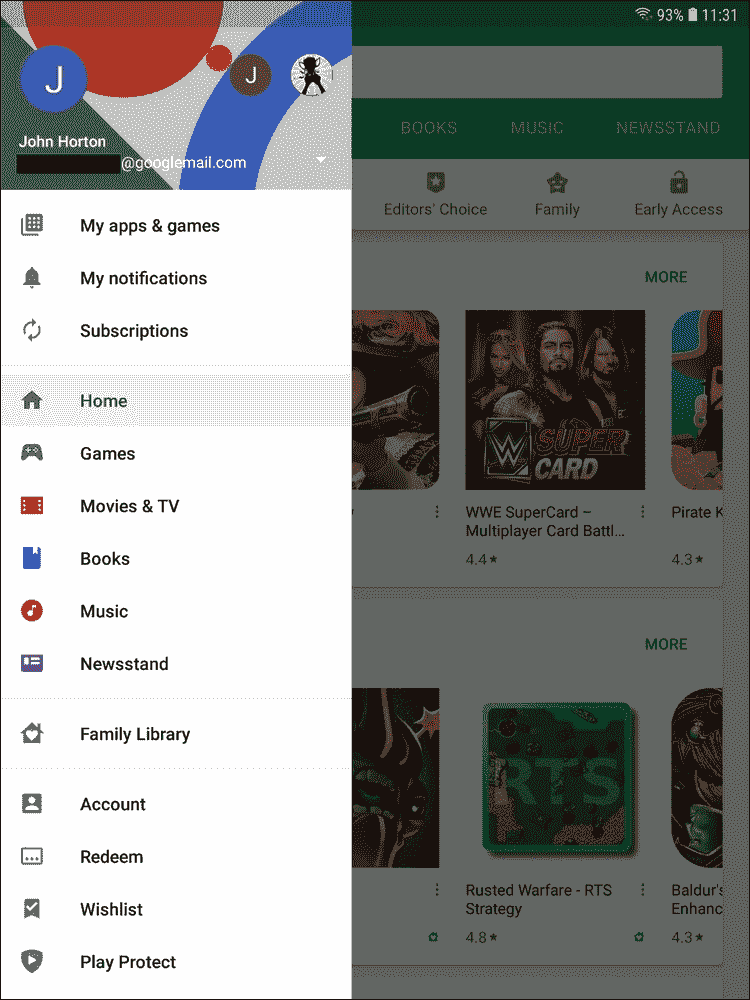

老实说，从一开始，我们的就不会像谷歌游戏应用程序中的那样花哨。然而，同样的功能将出现在我们的应用程序中。

这个用户界面的另一个优点是，当需要时，它可以滑动以隐藏或显示自己。正是因为这种行为，它可以是一个很大的尺寸，使得它在可以添加的选项方面非常灵活，并且当用户使用完它时，它会完全消失，就像抽屉一样。

### 类型

我建议你现在就试试谷歌游戏应用，看看它是如何工作的，如果你还没有的话。

你可以从屏幕的左边滑动你的拇指或手指，抽屉会慢慢滑出。当然，你可以把它再滑向相反的方向。

当导航抽屉打开时，屏幕的其余部分会稍微变暗(如前一张截图所示)，帮助用户专注于提供的导航选项。

您也可以在导航抽屉打开时轻按它的任何位置，它会自行滑动，为布局的其余部分留出整个屏幕的空间。

抽屉也可以通过点击左上角的菜单图标打开。

我们还可以调整和细化导航抽屉的行为，正如我们将在本章末尾看到的那样。

# 检查年龄数据库应用程序

在这一章中，我们将重点创建`NavigationView`并用四个`Fragment`类及其各自的布局填充它。在下一章中，我们将学习并实现数据库功能。

这就是我们荣耀的样子。请注意，在使用`NavigationView`活动模板时，许多选项以及大部分外观和装饰都是默认提供的:

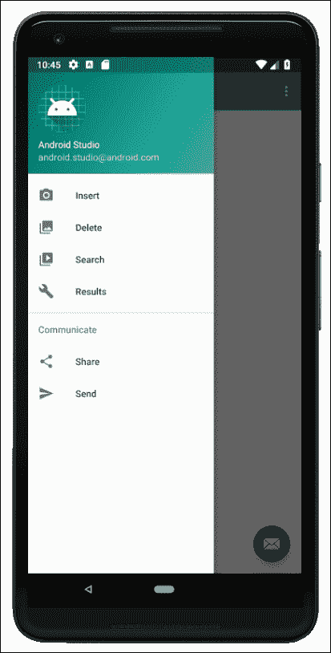

四个主要选项是我们将要添加到 UI 中的内容。分别是**插入**、**删除**、**搜索**、**结果**。下面显示了布局，并描述了它们的用途。

## 插入

第一个屏幕允许用户将一个人的名字和他们相关的年龄插入数据库:

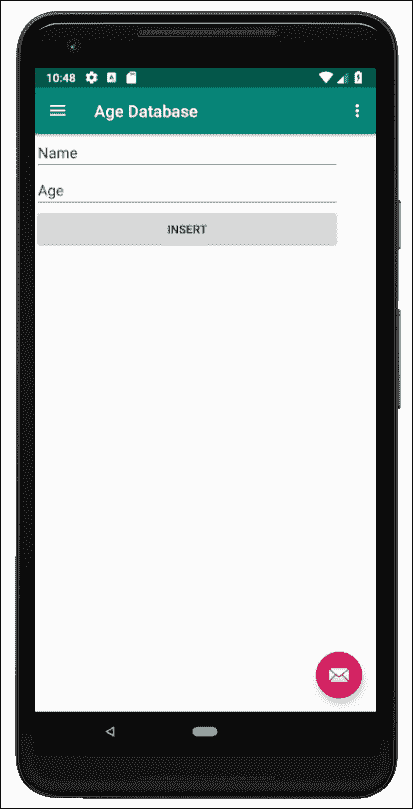

这个简单布局有两个`EditText`小部件和一个按钮。用户将输入姓名和年龄，然后点击**插入**按钮将其添加到数据库中。

## 删除

这个屏幕就更简单了。用户将在`EditText`小部件中输入一个名称，并点击按钮:

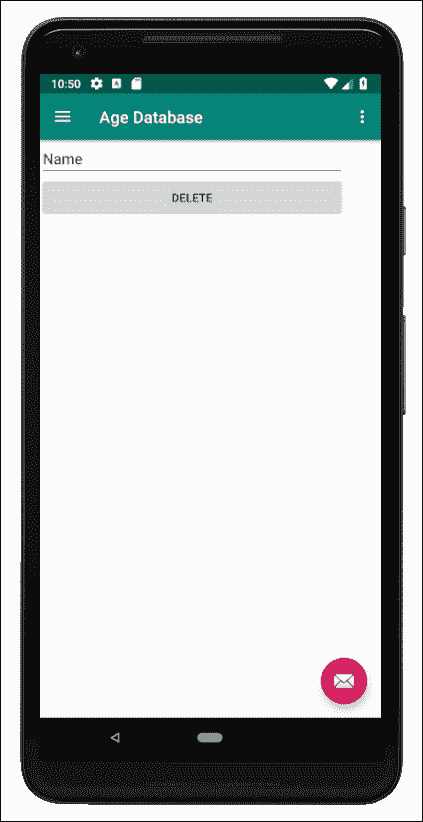

如果输入的姓名存在于数据库中，则该条目(姓名和年龄)将被删除。

## 搜索

这个布局和之前的布局差不多，但是目的不同:

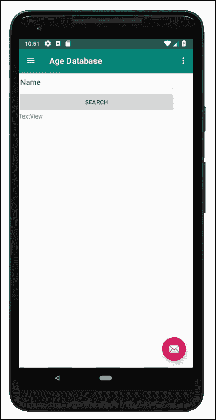

用户将在`EditText`中输入姓名，然后点击按钮。如果数据库中存在该名称，则它将与匹配的年龄一起显示。

## 结果

该屏幕显示整个数据库中的所有条目:


让我们从应用和导航抽屉开始。

# 启动年龄数据库项目

在AndroidStudio创建新项目。称之为`Age Database`，使用**导航抽屉活动**模板，将所有其他设置保留为我们在整本书中的设置。在我们做任何其他事情之前，非常值得在模拟器上运行该应用程序，看看有多少是作为该模板的一部分自动生成的，如下图所示:

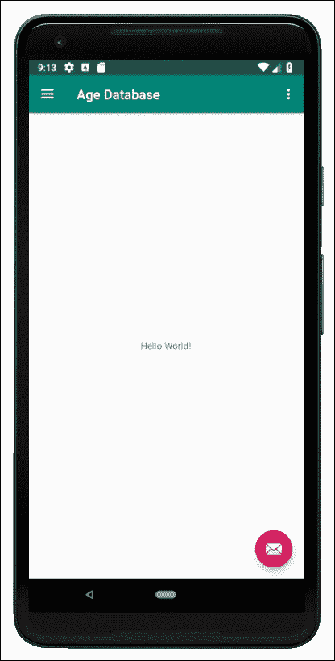

乍一看只是一个带有`TextView`的素净老布局。但是，从左边缘轻扫或按下菜单按钮，导航抽屉就会显示出来:

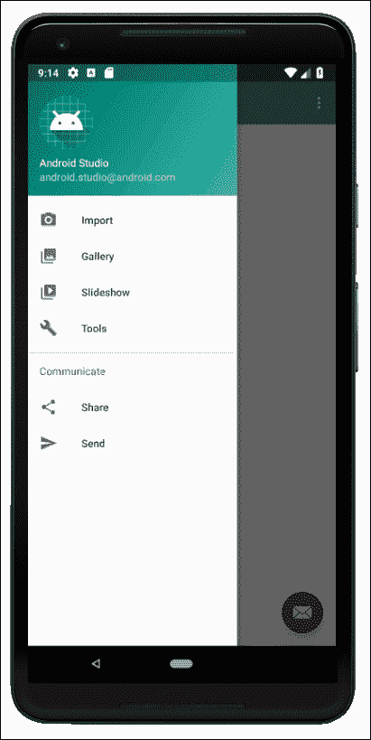

现在，我们可以修改选项，并为每个选项插入一个`Fragment`实例(带有布局)。为了理解它是如何工作的，让我们检查自动生成的代码。

# 探索自动生成的代码和资产

在`drawable`文件夹中，有一些图标，如下图截图所示:

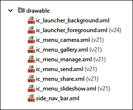

这些是常用的图标，也是出现在导航抽屉菜单中的图标。我们不会不厌其烦地改变这些，但是如果你想在你的应用中个性化图标，到本探索如何做到这一点时，它应该是显而易见的。

接下来，打开`res/menu`文件夹。请注意，还有一个名为`activity_main_drawer.xml`的额外文件。下面这段代码是这个文件的摘录，因此我们可以讨论它的内容:

```kt
<group android:checkableBehavior="single">
   <item
         android:id="@+id/nav_camera"
         android:icon="@drawable/ic_menu_camera"
         android:title="Import" />
   <item
         android:id="@+id/nav_gallery"
         android:icon="@drawable/ic_menu_gallery"
         android:title="Gallery" />
   <item
         android:id="@+id/nav_slideshow"
         android:icon="@drawable/ic_menu_slideshow"
         android:title="Slideshow" />
   <item
         android:id="@+id/nav_manage"
         android:icon="@drawable/ic_menu_manage"
         android:title="Tools" />
</group>
```

请注意，`group`标签中有四个`item`标签。现在，请注意从上到下的`title`标签(`Import`、`Gallery`、`Slideshow`和`Tools`)如何与自动生成的导航抽屉菜单中的前四个文本选项完全对应。此外，请注意，在每个`item`标签中有一个`id`标签，因此我们可以在我们的 Kotlin 代码中引用它们，还有一个`icon`标签，它对应于我们刚刚看到的`drawable`文件夹中的一个图标。

此外，查看`nav_header_main.xml`文件中的`layout`文件夹，其中包含抽屉标题的布局。

其余的文件与我们预期的一样，但是在 Kotlin 代码中还有一些关键点需要注意。这些都在`MainActivity.kt`文件中。现在打开，我们来看看。

第一个是`onCreate`函数中处理我们 UI 各个方面的额外代码。看看这段附加代码，然后我们可以讨论它:

```kt
val toggle = ActionBarDrawerToggle(
         this, drawer_layout, 
         toolbar, 
         R.string.navigation_drawer_open, 
         R.string.navigation_drawer_close)

drawer_layout.addDrawerListener(toggle)

toggle.syncState()

nav_view.setNavigationItemSelectedListener(this)
```

代码获得了一个`DrawerLayout,`的引用，它对应于我们刚刚看到的布局。该代码还创建了一个新的`ActionBarDrawerToggle`实例，允许控制或切换抽屉。最后一行代码在`NavigationView`上设置了一个监听器。现在，每次用户与导航抽屉交互时，安卓都会调用一个特殊的功能。我指的这个特殊功能是`onNavigationItemSelected`。我们将在一分钟后看到这个自动生成的函数。

接下来，看看`onBackPressed`功能:

```kt
override fun onBackPressed() {
   if (drawer_layout.isDrawerOpen(GravityCompat.START)) {
         drawer_layout.closeDrawer(GravityCompat.START)
   } else {
         super.onBackPressed()
  }
}
```

这是`Activity`类的一个覆盖函数，它处理当用户按下设备上的后退按钮时发生的事情。如果抽屉是打开的，代码关闭抽屉，如果不是，则简单地调用`super.onBackPressed`。这意味着如果抽屉打开，后退按钮将关闭抽屉，如果抽屉已经关闭，则使用默认行为。

现在，看看`onNavigationItemSelected`功能，它是这个应用功能的关键:

```kt
override fun onNavigationItemSelected(
   item: MenuItem)
   : Boolean {

   // Handle navigation view item clicks here.
   when (item.itemId) {
         R.id.nav_camera -> {
               // Handle the camera action
         }
         R.id.nav_gallery -> {

         }
         R.id.nav_slideshow -> {

         }
         R.id.nav_manage -> {

         }
         R.id.nav_share -> {

         }
         R.id.nav_send -> {

         }
   }

   drawer_layout.closeDrawer(GravityCompat.START)
   return true
}
```

请注意，`when`块分支对应于包含在`activity_main_drawer.xml`文件中的`id`值。这是我们响应用户在导航抽屉菜单中选择选项的地方。目前`when`代码没有任何作用。我们将对其进行更改，以将特定的`Fragment`及其相关的布局载入主视图。这将意味着我们的应用将有完全独立的功能和独立的用户界面，这取决于用户从菜单中的选择——正如我们在[第 24 章](26.html "Chapter 24. Design Patterns, Multiple Layouts, and Fragments")、*设计模式、多种布局和片段*中讨论 MVC 模式时所描述的那样。

让我们对`Fragment`类及其布局进行编码，然后我们可以回来编写代码，在`onNavigationItemSelected`函数中使用它们。

# 对片段类及其布局进行编码

我们将创建四个类，包括加载布局和实际布局的代码，但是在下一章了解安卓数据库之前，我们不会将任何数据库功能放入 Kotlin 代码中。

一旦我们有了我们的四个类和它们的布局，我们将看到如何从导航抽屉菜单中加载它们。到这一章结束时，我们将有一个完全正常工作的导航抽屉，允许用户在片段之间交换，但是片段在下一章之前不会做任何事情。

## 为类和布局创建空文件

右键单击`layout`文件夹，选择**新建** | **布局资源文件**，创建四个以竖排`LinearLayout`为父视图的布局文件。命名第一档`content_insert`，第二档`content_delete`，第三档`content_search`，第四档`content_results`。所有其他选项可以保留默认值。

您现在应该有四个包含`LinearLayout`父级的新布局文件，如下图所示:

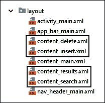

让我们对Kotlin类进行编码。

## 对类进行编码

右键单击包含`MainActivity.kt`文件的文件夹，选择**新建** | **柯特林文件/类**，创建四个新类。命名为`InsertFragment`、`DeleteFragment`、`SearchFragment`和`ResultsFragment`。从名字来看应该很清楚哪些片段会显示哪些布局。

接下来，让我们给每个类添加一些代码，使类从`Fragment`继承，并加载它们相关的布局。

打开`InsertFragment.kt`，编辑包含以下代码:

```kt
import android.os.Bundle
import android.view.LayoutInflater
import android.view.View
import android.view.ViewGroup

import androidx.fragment.app.Fragment

class InsertFragment : Fragment() {
    override fun onCreateView(
         inflater: LayoutInflater,
         container: ViewGroup?,
         savedInstanceState: Bundle?)
         : View? {

         val view = inflater.inflate(
                R.layout.content_insert,
                container,
                false)

        // Database and UI code goes here in next chapter

        return view
    }
}
```

打开`DeleteFragment.kt`并编辑，使其包含以下代码:

```kt
import android.os.Bundle
import android.view.LayoutInflater
import android.view.View
import android.view.ViewGroup

import androidx.fragment.app.Fragment

class DeleteFragment : Fragment() {
    override fun onCreateView(
         inflater: LayoutInflater,
        container: ViewGroup?,
        savedInstanceState:
        Bundle?)
        : View? {

        val view = inflater.inflate(
               R.layout.content_delete,
               container,
               false)

        // Database and UI code goes here in next chapter

        return view
    }
}
```

打开`SearchFragment.kt`并编辑，使其包含以下代码:

```kt
import android.os.Bundle
import android.view.LayoutInflater
import android.view.View
import android.view.ViewGroup

import androidx.fragment.app.Fragment

class SearchFragment : Fragment() {
    override fun onCreateView(
         inflater: LayoutInflater,
        container: ViewGroup?,
        savedInstanceState: Bundle?)
        : View? {

         val view = inflater.inflate(
               R.layout.content_search,
               container,
               false)

        // Database and UI code goes here in next chapter

        return view
    }
}
```

打开`ResultsFragment.kt`并编辑，使其包含以下代码:

```kt
import android.os.Bundle
import android.view.LayoutInflater
import android.view.View
import android.view.ViewGroup

import androidx.fragment.app.Fragment

class ResultsFragment : Fragment() {

    override fun onCreateView(
         inflater: LayoutInflater,
        container: ViewGroup?,
        savedInstanceState: Bundle?)
         : View? {

        val view = inflater.inflate(
               R.layout.content_results,
               container,
               false)

        // Database and UI code goes here in next chapter

        return inflater.inflate(R.layout.content_results,
                container,
                false)
    }
}
```

每个类都完全没有功能，除了在`onCreateView`函数中，从关联的布局文件中加载适当的布局。

让我们将用户界面添加到之前创建的布局文件中。

## 设计布局

正如我们在本章开头所看到的，所有的布局都很简单。让你的布局和我的一样并不重要，但是像往常一样，`id`属性值必须是相同的，否则我们在下一章中编写的Kotlin代码将不起作用。

## 设计内容 _ 插入. xml

将两个**纯文本**部件从调色板的**文本**类别拖到布局上。记住**纯文本**小部件是`EditText`实例。现在，在两个**编辑文本** / **纯文本**小部件后，将一个**按钮**拖到布局上。

根据下表配置小部件:

<colgroup><col style="text-align: left"> <col style="text-align: left"></colgroup> 
| 

小部件

 | 

属性和值

 |
| --- | --- |
| 顶部编辑文本 | id = `editName` |
| 顶部编辑文本 | 正文= `Name` |
| 第二次编辑文本 | id = `editAge` |
| 第二次编辑文本 | 正文= `Age` |
| 纽扣 | id = `btnInsert` |
| 纽扣 | 正文= `Insert` |

这是你的布局在AndroidStudio的设计视图中应该是什么样子:

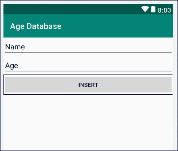

## 设计内容 _ 删除. xml

将**纯文本** / **编辑文本**小部件拖到布局上，下方有一个**按钮**。根据下表配置小部件:

<colgroup><col style="text-align: left"> <col style="text-align: left"></colgroup> 
| 

小部件

 | 

属性值

 |
| --- | --- |
| 编辑文本 | id = `editDelete` |
| 编辑文本 | 正文= `Name` |
| 纽扣 | id = `btnDelete` |
| 纽扣 | 正文= `Delete` |

这是您的布局在AndroidStudio的设计视图中应该是什么样子:

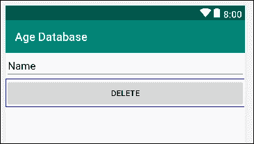

## 设计内容 _ 搜索. xml

将一个**纯文本** / **编辑文本**小部件，后跟一个**按钮**，然后是一个常规的**文本视图**，拖到布局上，然后根据下表配置小部件:

<colgroup><col style="text-align: left"> <col style="text-align: left"></colgroup> 
| 

小部件

 | 

属性值

 |
| --- | --- |
| 编辑文本 | id = `editSearch` |
| 编辑文本 | 正文= `Name` |
| 纽扣 | id = `btnSearch` |
| 纽扣 | 正文= `Search` |
| 文本视图 | id = `textResult` |

这是你的布局在AndroidStudio的设计视图中应该是什么样子:

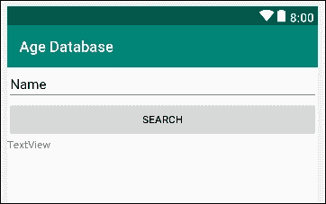

## 设计内容 _ 结果. xml

将单个`TextView`(这次不是**纯文本** / **编辑文本**)拖到布局上。我们将在下一章中看到如何将整个列表添加到这个单个`TextView`中。

根据下表配置小部件:

<colgroup><col style="text-align: left"> <col style="text-align: left"></colgroup> 
| 

小部件

 | 

属性值

 |
| --- | --- |
| 文本视图 | id = `textResults` |

这是您的布局在AndroidStudio的设计视图中应该是什么样子:

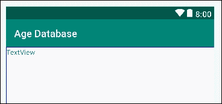

现在，我们可以根据`Fragment`类及其布局来使用类。

# 使用片段类及其布局

这个阶段有三个步骤。首先，我们需要编辑导航抽屉的菜单，以反映用户拥有的选项。接下来，我们需要布局中的一个`View`实例来保存活动的`Fragment`实例，最后，我们需要向`MainActivity.kt`添加代码，以便当用户点击导航抽屉的菜单时在不同的`Fragment`实例之间切换。

## 编辑导航抽屉菜单

在项目浏览器的`res/menu`文件夹中打开`activity_main_drawer.xml`文件。编辑我们之前看到的`group`标签中的代码，以反映我们的菜单选项**插入**、**删除**、**搜索**和**结果**:

```kt
<group android:checkableBehavior="single">
   <item
         android:id="@+id/nav_insert"
         android:icon="@drawable/ic_menu_camera"
         android:title="Insert" />
   <item
         android:id="@+id/nav_delete"
         android:icon="@drawable/ic_menu_gallery"
         android:title="Delete" />
   <item
         android:id="@+id/nav_search"
         android:icon="@drawable/ic_menu_slideshow"
         android:title="Search" />
   <item
         android:id="@+id/nav_results"
         android:icon="@drawable/ic_menu_manage"
         android:title="Results" />
</group>
```

### 类型

现在是向`drawable`文件夹添加新图标的好时机，如果你想使用自己的图标，可以编辑前面的代码来引用它们。

## 在主布局中添加支架

打开布局文件夹中的`content_main.xml`文件，并在`ConstraintLayout`的结束标记前添加这个高亮显示的 XML 代码，正好是:

```kt
<FrameLayout
 android:id="@+id/fragmentHolder"
 android:layout_width="0dp"
 android:layout_height="0dp"
 app:layout_constraintBottom_toBottomOf="parent"
 app:layout_constraintEnd_toEndOf="parent"
 app:layout_constraintStart_toStartOf="parent"
 app:layout_constraintTop_toTopOf="parent"> 
</FrameLayout>

</androidx.constraintlayout.widget.ConstraintLayout>
```

现在，我们有一个具有`fragmentHolder`属性的`FrameLayout`，我们可以引用它并将所有`Fragment`实例布局加载到其中。

## 对 MainActivity.kt 文件进行编码

打开`MainActivity`文件，编辑`onNavigationItemSelected`功能，处理所有用户可以选择的不同菜单选项:

```kt
override fun onNavigationItemSelected(
  item: MenuItem): 
  Boolean {

  // Create a transaction
  val transaction = 
        supportFragmentManager.beginTransaction()

  // Handle navigation view item clicks here.
  when (item.itemId) {
        R.id.nav_insert -> {
              // Create a new fragment of the appropriate type
              val fragment = InsertFragment()
              // What to do and where to do it
              transaction.replace(R.id.fragmentHolder, fragment)
    }
    R.id.nav_search -> {
              val fragment = SearchFragment()
              transaction.replace(R.id.fragmentHolder, fragment)
    }
    R.id.nav_delete -> {
              val fragment = DeleteFragment()
              transaction.replace(R.id.fragmentHolder, fragment)
    }
    R.id.nav_results -> {
      val fragment = ResultsFragment()
      transaction.replace(R.id.fragmentHolder, fragment)
    }

  }

   // Ask Android to remember which
   // menu options the user has chosen
   transaction.addToBackStack(null);

  // Implement the change
  transaction.commit();

   drawer_layout.closeDrawer(GravityCompat.START)
   return true
}
```

让我们看一下刚刚添加的代码。大部分代码应该看起来很熟悉。对于我们的每个菜单选项，我们创建一个适当类型的新`Fragment`实例，并将其插入到我们的`FrameLayout`中，其`id`值为`fragmentHolder`。

`transaction.addToBackStack`函数调用意味着所选的`Fragment`将和其他的一样被记住。这样做的结果是，如果用户选择**插入**片段，然后选择**结果**片段，然后点击后退按钮，应用程序会将用户返回到**插入**片段。

您现在可以运行该应用程序，并使用导航抽屉菜单在我们所有不同的`Fragment`实例之间切换。它们看起来就像本章开头的图片一样，但是还没有任何功能。

# 总结

在本章中，我们看到了拥有一个吸引人且令人愉悦的用户界面是多么简单，尽管我们的`Fragment`实例还没有任何功能，但是一旦我们了解了数据库，它们就已经准备好了。

在下一章中，在我们将功能添加到我们的`Fragment`类之前，我们将学习数据库的一般知识，以及安卓应用程序可以使用的特定数据库。