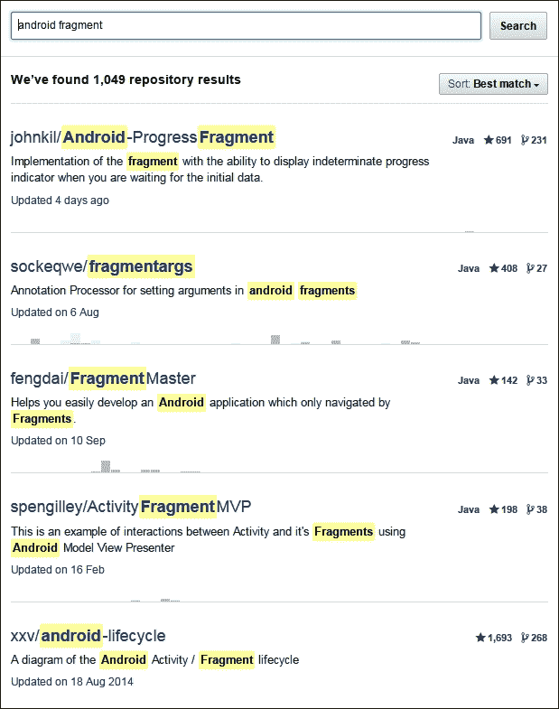
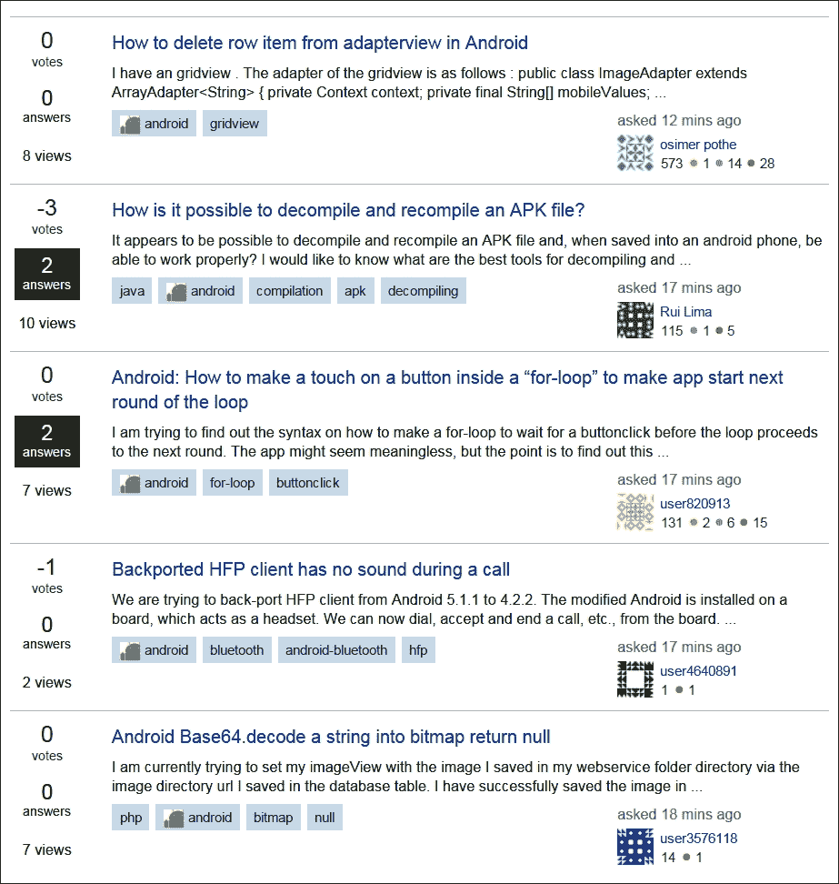

# 第二十八章。走之前聊一会儿

我们的旅程就要结束了。这一章只是一些想法和建议，你可能想在匆忙开始制作自己的应用程序之前看看:

*   出版
*   制作您的第一个应用程序
*   继续学习
*   谢谢

# 出版

你很容易知道足够多来设计你自己的应用。你甚至可以做一些修改，给书中的某个应用程序添加许多新功能。

我决定不在谷歌 Play 商店上做发布的分步指南，因为步骤并不复杂。然而，它们相当深入，有点费力。大多数步骤都涉及输入关于您和您的应用程序的个人信息和图像。这样的教程应该如下所示:

1.  填写此文本框。
2.  现在，填写文本框。
3.  上传这张图片。
4.  等等。

没什么乐趣和用处。

要开始使用，您只需访问[https://play.google.com/apps/publish](https://play.google.com/apps/publish)，并根据您所在地区的货币支付适当的费用(约 25 美元)。这让你可以终身发布应用。

### 类型

如果你想要一份发布清单，看看下面的网址:[https://developer . Android . com/distribute/best-practices/launch/launch-checkles . html](https://developer.android.com/distribute/best-practices/launch/launch-checklist.html)。你会发现这个过程很直观(如果非常冗长的话)。

# 做个 app！

如果你把这一点付诸实践，你可以忽略本章的其他内容:

### 类型

不要等到你成为专家后才开始制作应用！

开始构建你的梦想应用程序，一个具有所有功能的应用程序，它将会让谷歌 Play 大受欢迎。然而，一个简单的建议是:先做些计划！不过不要太多，然后开始吧。

在场外有一些更小更容易实现的项目；您将能够向朋友和家人展示的项目，以及探索对您来说是新的安卓领域的项目。如果你对这些应用程序有信心，你可以把它们上传到谷歌游戏。如果你担心评论者会如何接受它们，那么让它们自由，并在描述中注明它“只是一个原型”或类似的东西。

如果你的体验和我的一样，你会发现当你阅读、学习和构建应用程序时，你会发现你的梦想应用程序可以在很多方面得到改进，你可能会受到启发重新设计它，甚至重新开始。

当你这样做的时候，我可以保证下次你建造它的时候，你会用一半的时间，至少是两倍的好！

# 继续学习

如果你觉得你已经走了很长一段路，你是对的。然而，总有更多的东西需要学习。

## 继续阅读

你会发现在制作第一个 app 的时候，突然意识到自己的知识中有一个空白需要填补，才能让一些功能活起来。这是正常的，有保障的；不要让它影响你。想想如何描述问题，在谷歌上搜索解决方案。

您可能还会发现项目中的特定类会增长到超出实用和可维护的规模。这是一个迹象，表明有一种更好的方法来构造事物，并且可能有一种现成的设计模式会让你的生活变得更容易。

为了先发制人，为什么不马上研究一些模式呢？一个很好的来源是[https://proandraddev . com/kot Lin-design-patterns-8e 152540 ee 2c](https://proandroiddev.com/kotlin-design-patterns-8e152540ee2c)。

## GitHub

GitHub 允许你搜索和浏览别人写的代码，看看他们是如何解决问题的。这很有用，因为看到类的文件结构，然后深入了解它们，通常会显示如何从一开始就计划你的应用程序，并防止你从错误的路径开始。你甚至可以获得一个 GitHub 应用程序，让你在手机或平板电脑的舒适环境中完成这项工作。

你甚至可以配置AndroidStudio将你的项目保存并分享给 GitHub。比如在首页[www.github.com](http://www.github.com)搜索“安卓片段”，会看到 1000 多个相关项目可以窥探，如下图所示:

## 堆栈溢出

如果你卡住了，有一个奇怪的错误，或者一个无法解释的崩溃，通常最好的求助地点是谷歌。这样做，你会惊讶于 StackOverflow 在搜索结果中出现的频率；有充分的理由。

StackOverflow 允许用户发布他们问题的描述，以及示例代码，这样社区就可以用答案来回应。然而，根据我的经验，很少需要发布问题，因为几乎总有人遇到完全相同的问题。

StackOverflow 特别适合前沿问题。如果一个新的AndroidStudio版本有一个 bug，或者一个新版本的安卓应用编程接口似乎没有做它应该做的事情，那么你几乎可以肯定世界上有几千名其他开发人员和你有同样的问题。然后，一些聪明的程序员，通常来自安卓开发团队本身，会在那里给出一个答案。

StackOverflow 也有利于少量阅读。转到[www.stackoverflow.com](http://www.stackoverflow.com)主页，在搜索框中输入“安卓”，你会看到 StackOverflow 社区所有最新问题的列表:

我并不是建议你现在就开始尝试回答所有问题，但是阅读这些问题和建议会教会你很多，你可能会发现，通常情况下，你有解决方案，或者至少有解决方案的想法。

## 安卓用户论坛

另外，从用户的角度来看，很值得注册一些安卓论坛，偶尔访问一下，了解一下的热门话题和趋势是什么。我没有在这里列出任何，因为快速的网络搜索是所有需要的。

如果你是认真的，那么你可以参加一些安卓会议，在那里你可以和成千上万的其他开发人员接触并参加讲座。如果你对此感兴趣，可以在网上搜索 Droidcon、安卓开发者日或 GDG 开发者节。

## 更高层次的学习

你现在可以阅读更多安卓书籍。我在这本书的开头提到，没有Kotlin经验的读者很少有，可以说没有，教授安卓编程的书。这就是我写这本书的原因。

现在你对 OOP 和 Kotlin 有了很好的理解，对应用设计和 Android API 也有了一个简单的介绍，你完全可以像现在一样，为已经知道如何在 Kotlin 编程的人阅读 Android“初学者”书籍。

这些书充满了你可以建立或阅读的好例子，以巩固你在这本书里学到的东西，以不同的方式使用你的知识，当然，也学习一些全新的东西。

或许还值得读一些纯Kotlin的书。这可能很难相信，刚刚涉猎了大约 750 页，但柯特林还有很多东西没有来得及在这里介绍。

我可以说出一些书名，但亚马逊上正面评论最多的书往往是值得探索的。

# 我的其他频道

请保持联系:

*   [www.gamecodeschool.com](http://www.gamecodeschool.com)
*   [www.facebook.com/gamecodeschool](http://www.facebook.com/gamecodeschool)
*   [www.twitter.com/gamecodeschool](http://www.twitter.com/gamecodeschool)
*   [www . YouTube . com/channel/ucy 6 prqaxnwvio 3 dpmv 258 ig/videos](http://www.youtube.com/channel/UCY6pRQAXnwviO3dpmV258Ig/videos)
*   [www.linkedin.com/in/gamecodeschool](http://www.linkedin.com/in/gamecodeschool)

# 再见，谢谢

我写这本书很开心。我知道这是老生常谈，但也是事实。最重要的是，我希望你能从中学到一些东西，并把它作为你未来编程的垫脚石。

你读这篇文章可能是为了一点乐趣，或者是为了发布一个应用程序的荣誉，一个编程工作的垫脚石，或者你真的会开发一个让谷歌 Play 一炮而红的应用程序。

无论如何，我非常感谢你买了这本书，并祝你在未来的努力中一切顺利。

我认为每个人内心都有一个应用程序，你所需要做的就是足够努力地把它从你身上拿出来。