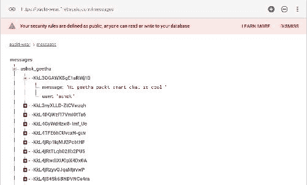
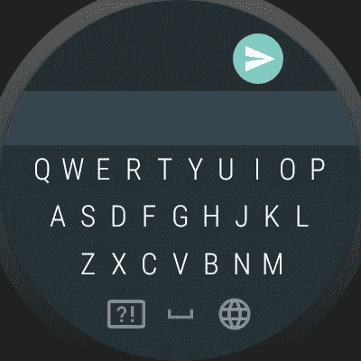

# 九、让我们以聪明的方式聊天——通知和更多

上一章帮助我们构建了一个对话式消息应用程序，但是 Wear 应用程序有一个非常正常的用户界面，没有任何通知。通知是消息传递应用程序的一个非常重要的方面，但是它需要复杂的基础结构来处理通知。当发件人向收件人发送消息时，收件人应该会收到一个通知，传达某些信息，如发件人姓名和快速消息预览。

通知是安卓系统中的一个组件，我们可以用它来显示信息。在消息应用程序的情况下，接收者应该获得推送通知来实例化通知组件。因此，每当 Firebase 中有实时数据库更新时，手持设备和穿戴设备都应该收到通知。谢天谢地，我们不需要服务器来处理通知；Firebase 将为您的消息应用程序处理推送通知。当实时数据库中有更新时，我们需要触发推送通知。

在本章中，我们将探讨以下内容:

*   火焰基函数
*   通知
*   材质设计穿戴应用

# 火焰基函数

Firebase 函数是监视数据库触发器和更多与服务器相关的执行的最聪明的解决方案。我们将利用 Firebase 技术之一来完成这项任务，而不是托管一个服务器，该服务器监听 Firebase 数据库的更改，然后发出推送通知。Firebase functions 对所有 Firebase 技术都有高效的控制，例如 Firebase 身份验证、存储、分析等等。Firebase 函数可用于各个方面；例如，当您的分析群组达到某个里程碑时，您可以发送有针对性的通知、邀请等。您可能想要在 Firebase 系统中实现的任何服务器级业务逻辑都是由 Firebase 函数实现的。我们将使用 Firebase 函数在数据库触发发生时发送推送通知。我们需要一个入门级的 JavaScript 理解来完成这项任务。

要开始使用 Firebase 功能，我们需要 Node.js 环境，您可以从[https://nodejs.org/](https://nodejs.org/)安装它。当你安装 Node.js 的时候，它也会安装**节点包管理器** ( **npm** )。它帮助安装 JavaScript 框架、插件等等。安装 Node.js 后，转到终端或命令行。

进入`$node --version`检查节点是否安装。如果命令行界面返回最新的版本号，您就可以开始了:

```java
//Install Firebase CLI 
$ npm install -g firebase-tools

```

如果遇到任何错误，您应该在超级用户模式下执行该命令:

```java
sudo su
npm install -g firebase-tools

```

导航到您希望保存 Firebase 功能程序的目录，并使用以下命令进行身份验证:

```java
//CLI authentication
$ firebase login

```

成功认证后，您可以初始化 Firebase 功能:

```java
//Initialise Firebase functions
$ firebase init functions

```

CLI 工具将在您初始化的目录中生成 Firebase 函数和必要的代码。在自己喜欢的编辑器中打开`index.js`。我们用`functions.database`为`Realtime`数据库事件创建一个 Firebase 函数来处理实时数据库触发器。我们将调用 ref(path)从函数到达特定的数据库`path. onwrite()`方法，每当数据库中有更新时，该方法将发送通知。

现在，为了构建我们的通知负载，让我们理解我们的实时数据库结构:



我们可以看到消息中有一个名为`ashok_geetha`的子代，它传达了这两个用户的对话是用一个唯一的 Firebase ID 存储在里面的。对于这个实现，我们将选择`ashok_geetha`进行推送通知。

现在，在`index.js`文件中，添加以下代码:

```java
//import firebase functions modules
const functions = require('firebase-functions');
//import admin module
        const admin = require('firebase-admin');
        admin.initializeApp(functions.config().firebase);

// Listens for new messages added to messages/:pushId
        exports.pushNotification = functions.database
        .ref('/messages/ashok_geetha/{pushId}').onWrite( event => {

        console.log('Push notification event triggered');

        //  Grab the current value of what was written to the Realtime 
        Database.
        var valueObject = event.data.val();

        if(valueObject.photoUrl != null) {
        valueObject.photoUrl= "Sent you a lot of love!";
        }

        // Create a notification
        const payload = {
        notification: {
        title:valueObject.message,
        body: valueObject.user || valueObject.photoUrl,
        sound: "default"
        },
        };

        //Create an options object that contains the time to live for 
        the notification and the priority
        const options = {
        priority: "high",
        timeToLive: 60 * 60 * 24
        };

        return admin.messaging().sendToTopic("pushNotifications", 
        payload, options);
        });

```

When we have different firebase structure, using the url-id configuration we can trigger the firebase functions for making the pushnotification to work with all your users. We just need to make the following change in the url. `/messages/{ChatID}/{pushId}`

现在，在终端中，使用`$ firebase deploy`命令完成 Firebase 功能的部署:


前面的 Node.js 设置使用 Firebase 函数触发推送通知。现在，我们需要一种机制来接收来自本地移动和穿戴应用程序中 Firebase 的消息。

切换到 Android Studio，将以下依赖项添加到您的移动项目渐变模块文件中:

```java
//Add the dependency
dependencies {
     compile 'com.google.firebase:firebase-messaging:10.2.4'
}

```

添加依赖后，创建一个名为`MessagingService`的类，扩展到`FirebaseMessagingService`类。`FirebaseMessaging`级扩展到`com.google.firebase.iid.zzb`级，`zzb`级扩展到安卓`Service`级。这个类将帮助 Firebase 消息传递和安卓应用程序之间的通信过程。它还可以自动显示通知。让我们创建该类并将其扩展到`FirebaseMessagingService`类，如下所示:

```java
public class MessagingService extends FirebaseMessagingService {

    //Override methods
}

```

是时候增加超驰方法`onMessageReceived`了。该方法在 app 处于前台或后台时接收通知，我们可以通过`getnotification()`方法检索所有通知参数:

```java
@Override
public void onMessageReceived(RemoteMessage remoteMessage) {
    super.onMessageReceived(remoteMessage);
}

```

`RemoteMessage`对象将拥有我们在 Firebase 函数的通知有效载荷中发送的所有数据。在方法内部，添加以下代码以获取标题和消息内容。我们在 Firebase 函数的标题参数中发送了一条消息；您可以根据您的用例对其进行定制:

```java
String notificationTitle = null, notificationBody = null;
// Check if message contains a notification payload.
if (remoteMessage.getNotification() != null) {
    Log.d(TAG, "Message Notification Body: " + remoteMessage.getNotification().getBody());
    notificationTitle = remoteMessage.getNotification().getTitle();
    notificationBody = remoteMessage.getNotification().getBody();
}

```

对于构建通知，我们将使用`NotificationCompat.Builder`，当用户点击通知时，我们将带他到`MainActivity`:

```java
private void sendNotification(String notificationTitle, String notificationBody) {
    Intent intent = new Intent(this, MainActivity.class);
    intent.addFlags(Intent.FLAG_ACTIVITY_CLEAR_TOP);
    PendingIntent pendingIntent = PendingIntent.getActivity(this, 0, 
    intent,
            PendingIntent.FLAG_ONE_SHOT);

    Uri defaultSoundUri= RingtoneManager.getDefaultUri
    (RingtoneManager.TYPE_NOTIFICATION);
    NotificationCompat.Builder notificationBuilder = 
    (NotificationCompat.Builder) new NotificationCompat.Builder(this)
            .setAutoCancel(true)   //Automatically delete the 
                                   notification
            .setSmallIcon(R.mipmap.ic_launcher) //Notification icon
            .setContentIntent(pendingIntent)
            .setContentTitle(notificationTitle)
            .setContentText(notificationBody)
            .setSound(defaultSoundUri);

    NotificationManager notificationManager = (NotificationManager) 
    getSystemService(Context.NOTIFICATION_SERVICE);

    notificationManager.notify(0, notificationBuilder.build());
}

```

调用`onMessageReceived`内部的方法，将内容传递给`sendNotification`方法:

```java
sendNotification(notificationTitle, notificationBody);

```

完整的类代码如下所示:

```java
public class MessagingService extends FirebaseMessagingService {

    private static final String TAG = "MessagingService";

    @Override
    public void onMessageReceived(RemoteMessage remoteMessage) {
        String notificationTitle = null, notificationBody = null;
        // Check if message contains a notification payload.
        if (remoteMessage.getNotification() != null) {
            Log.d(TAG, "Message Notification Body: " + 
            remoteMessage.getNotification().getBody());
            notificationTitle = 
            remoteMessage.getNotification().getTitle();
            notificationBody = 
            remoteMessage.getNotification().getBody();

            sendNotification(notificationTitle, notificationBody);

        }
    }

    private void sendNotification(String notificationTitle, String 
    notificationBody) {
        Intent intent = new Intent(this, MainActivity.class);
        intent.addFlags(Intent.FLAG_ACTIVITY_CLEAR_TOP);
        PendingIntent pendingIntent = PendingIntent.getActivity(this, 
       0, intent,
                PendingIntent.FLAG_ONE_SHOT);

        Uri defaultSoundUri= RingtoneManager.getDefaultUri
        (RingtoneManager.TYPE_NOTIFICATION);
        NotificationCompat.Builder notificationBuilder =     
        (NotificationCompat.Builder) 
        new NotificationCompat.Builder(this)
                .setAutoCancel(true)   //Automatically delete the 
                                  notification
                .setSmallIcon(R.mipmap.ic_launcher) //Notification icon
                .setContentIntent(pendingIntent)
                .setContentTitle(notificationTitle)
                .setContentText(notificationBody)
                .setSound(defaultSoundUri);

        NotificationManager notificationManager = (NotificationManager) 
       getSystemService(Context.NOTIFICATION_SERVICE);

        notificationManager.notify(0, notificationBuilder.build());
    }
}

```

我们现在可以在清单中注册以前的服务:

```java
<service
    android:name=".MessagingService">
    <intent-filter>
        <action android:name="com.google.firebase.MESSAGING_EVENT"/>
    </intent-filter>
</service>

```

毕竟，我们现在有一个用于收听`pushNotification`的服务，但是我们需要收听我们正在发送的特定字符串。我们可以将字符串添加到一些常量或 XML 文件中，但是当我们要求 Firebase 发送特定的频道通知时，我们需要订阅一个名为 topic 的频道。在`ChatActivity`和方法内部添加以下代码:

```java
FirebaseMessaging.getInstance().subscribeToTopic("pushNotifications");

```

要使早期操作全局化，创建一个扩展到`Application`类的类。在`oncreate`方法内部，我们可以订阅如下主题:

```java
public class PacktApp extends Application {

    @Override
    public void onCreate() {
        super.onCreate();
        Firebase.setAndroidContext(this);
        FirebaseMessaging.getInstance()
        .subscribeToTopic("pushNotifications");
    }
}

```

现在，我们需要在清单中注册应用程序类。应用程序类控制应用程序生命周期的`onCreate`方法，它将有助于维护应用程序的生命状态:

```java
<application
    android:name=".PacktApp"
    ...>

</application>

```

恭喜你！我们已成功配置推送通知，并正在手机上接收:


在连接的穿戴设备中，当我们收到以下通知时，我们将能够看到它。默认情况下，`NotificationCompat.Builder`类将帮助 Wear 设备接收通知，如果我们想要对其进行定制，我们可以按照接下来的部分进行。

从穿戴者通知组件，我们可以从穿戴者设备接收对移动应用程序的回复。为了能够实现这一点，我们将使用`NotificationCompat`类中的`WearExtender`组件。使用该设置，用户将能够访问语音输入、**输入法框架** ( **货币基金组织**)和表情符号来回复通知:

```java
 Notification notification = new NotificationCompat.Builder(mContext)
         .setContentTitle("New mail from " + sender.toString())
         .setContentText(subject)
         .setSmallIcon(R.drawable.new_mail)
         .extend(new NotificationCompat.WearableExtender()
                 .setContentIcon(R.drawable.new_mail))
         .build();
 NotificationManagerCompat.from(mContext).notify(0, notification);

```

将会有许多用例，我们需要用已经存储的回复和/或快速输入工具发送快速响应。在这种情况下，我们可以利用`Action.WearableExtender`:

```java
/Android Wear requires a hint to display the reply action inline.
Action.WearableExtender actionExtender =
    new Action.WearableExtender()
        .setHintLaunchesActivity(true)
        .setHintDisplayActionInline(true);
wearableExtender.addAction(actionBuilder.extend(actionExtender).build());

```

现在，在项目中，让我们更新我们的消息服务类，当后台服务收到推送通知时，我们将启动通知组件。

将以下实例添加到类的全局范围:

```java
private static final String TAG = "MessagingService";
public static final String EXTRA_VOICE_REPLY = "extra_voice_reply";
public static final String REPLY_ACTION =
        "com.packt.smartcha.ACTION_MESSAGE_REPLY";

```

当收到穿戴者的回复时，我们会将其作为参考，并将其传递给通知处理者:

```java
// Creates an Intent that will be triggered when a reply is received.
private Intent getMessageReplyIntent(int conversationId) {
    return new Intent().setAction(REPLY_ACTION).putExtra("1223", 
    conversationId);
}

```

穿戴通知随着每一个新的安卓版本而发展，在`NotificationCompat.Builder`中，我们拥有所有可以让您的移动应用与穿戴设备交互的功能。当你有一个移动应用，它有互动，如通知等，从 Wear 设备，你可以得到文本回复，即使你没有 Wear 伴侣应用。

# 消息服务类

在`MessagingService`类中，我们有一个名为`sendNotification`的方法，它向穿戴和移动设备发出通知。让我们用以下代码更改来更新方法:

```java
private void sendNotification(String notificationTitle, String notificationBody) {
    // Wear 2.0 allows for in-line actions, which will be used for 
    "reply".
    NotificationCompat.Action.WearableExtender inlineActionForWear2 =
            new NotificationCompat.Action.WearableExtender()
                    .setHintDisplayActionInline(true)
                    .setHintLaunchesActivity(false);

    RemoteInput remoteInput = new 
    RemoteInput.Builder("extra_voice_reply").build();

    // Building a Pending Intent for the reply action to trigger.
    PendingIntent replyIntent = PendingIntent.getBroadcast(
            getApplicationContext(),
            0,
            getMessageReplyIntent(1),
            PendingIntent.FLAG_UPDATE_CURRENT);

    // Add an action to allow replies.
    NotificationCompat.Action replyAction =
            new NotificationCompat.Action.Builder(
                    R.drawable.googleg_standard_color_18,
                    "Notification",
                    replyIntent)

                    /// TODO: Add better wear support.
                    .addRemoteInput(remoteInput)
                    .extend(inlineActionForWear2)
                    .build();

    Intent intent = new Intent(this, ChatActivity.class);
    intent.addFlags(Intent.FLAG_ACTIVITY_CLEAR_TOP);
    PendingIntent pendingIntent = PendingIntent.getActivity(this, 0, 
    intent,
            PendingIntent.FLAG_ONE_SHOT);

    Uri defaultSoundUri = RingtoneManager.getDefaultUri
    (RingtoneManager.TYPE_NOTIFICATION);
    NotificationCompat.Builder notificationBuilder =      
    (NotificationCompat.Builder) 
    new NotificationCompat.Builder(this)
            .setAutoCancel(true)   //Automatically delete the     
            notification
            .setSmallIcon(R.mipmap.ic_launcher) //Notification icon
            .setContentIntent(pendingIntent)
            .addAction(replyAction)
            .setContentTitle(notificationTitle)
            .setContentText(notificationBody)
            .setSound(defaultSoundUri);

    NotificationManagerCompat notificationManager = 
    NotificationManagerCompat.from(this);
    notificationManager.notify(0, notificationBuilder.build());
}

```

以前的方法在穿戴设备中具有货币基金组织输入、语音回复和绘制表情符号的功能。修改代码后的完整类如下所示:

```java
package com.packt.smartchat;

/**
 * Created by ashok.kumar on 02/06/17.
 */

public class MessagingService extends FirebaseMessagingService {

    private static final String TAG = "MessagingService";
    public static final String EXTRA_VOICE_REPLY = "extra_voice_reply";
    public static final String REPLY_ACTION =
            "com.packt.smartcha.ACTION_MESSAGE_REPLY";
            public static final String SEND_MESSAGE_ACTION =
            "com.packt.smartchat.ACTION_SEND_MESSAGE";

    @Override
    public void onMessageReceived(RemoteMessage remoteMessage) {
        String notificationTitle = null, notificationBody = null;
        // Check if message contains a notification payload.
        if (remoteMessage.getNotification() != null) {
            Log.d(TAG, "Message Notification Body: " + 
            remoteMessage.getNotification().getBody());
            notificationTitle = 
            remoteMessage.getNotification().getTitle();
            notificationBody = 
            remoteMessage.getNotification().getBody();

            sendNotification(notificationTitle, notificationBody);

        }
    }

    // Creates an intent that will be triggered when a message is read.
    private Intent getMessageReadIntent(int id) {
        return new Intent().setAction("1").putExtra("1482", id);
    }

    // Creates an Intent that will be triggered when a reply is 
    received.
    private Intent getMessageReplyIntent(int conversationId) {
        return new Intent().setAction(REPLY_ACTION).putExtra("1223", 
        conversationId);
    }

    private void sendNotification(String notificationTitle, String 
    notificationBody) {
        // Wear 2.0 allows for in-line actions, which will be used for 
        "reply".
        NotificationCompat.Action.WearableExtender 
        inlineActionForWear2 =
                new NotificationCompat.Action.WearableExtender()
                        .setHintDisplayActionInline(true)
                        .setHintLaunchesActivity(false);

        RemoteInput remoteInput = new 
        RemoteInput.Builder("extra_voice_reply").build();

        // Building a Pending Intent for the reply action to trigger.
        PendingIntent replyIntent = PendingIntent.getBroadcast(
                getApplicationContext(),
                0,
                getMessageReplyIntent(1),
                PendingIntent.FLAG_UPDATE_CURRENT);

        // Add an action to allow replies.
        NotificationCompat.Action replyAction =
                new NotificationCompat.Action.Builder(
                        R.drawable.googleg_standard_color_18,
                        "Notification",
                        replyIntent)

                        /// TODO: Add better wear support.
                        .addRemoteInput(remoteInput)
                        .extend(inlineActionForWear2)
                        .build();

        Intent intent = new Intent(this, ChatActivity.class);
        intent.addFlags(Intent.FLAG_ACTIVITY_CLEAR_TOP);
        PendingIntent pendingIntent = PendingIntent.getActivity(this, 
        0, intent,
                PendingIntent.FLAG_ONE_SHOT);

        Uri defaultSoundUri = RingtoneManager.getDefaultUri
         (RingtoneManager.TYPE_NOTIFICATION);
        NotificationCompat.Builder notificationBuilder = 
        (NotificationCompat.Builder) new 
         NotificationCompat.Builder(this)
                .setAutoCancel(true)   //Automatically delete the 
                notification
                .setSmallIcon(R.mipmap.ic_launcher) //Notification icon
                .setContentIntent(pendingIntent)
                .addAction(replyAction)
                .setContentTitle(notificationTitle)
                .setContentText(notificationBody)
                .setSound(defaultSoundUri);

        NotificationManagerCompat notificationManager = 
        NotificationManagerCompat.from(this);
        notificationManager.notify(0, notificationBuilder.build());
    }
}

```

收到的通知如下所示:


当用户点击通知时，他或她将获得三个选项，如下所示:


在穿戴设备上收到通知后，用户将通过文本或语音输入或表情符号的帮助来回复他或她的想法。为了处理这种情况，我们需要编写一个广播接收器。让我们创建一个名为`MessageReplyReceiver`的类，将其扩展到`BroadcastReceiver`类，并覆盖`onReceive`方法。得到回复后，用`conversationId. onReceive`方法更新意图即可，如下:

```java
@Override
public void onReceive(Context context, Intent intent) {
    if (MessagingService.REPLY_ACTION.equals(intent.getAction())) {
        int conversationId = intent.getIntExtra("reply", -1);
        CharSequence reply = getMessageText(intent);
        if (conversationId != -1) {
            Log.d(TAG, "Got reply (" + reply + ") for ConversationId " 
            + conversationId);
        }
        // Tell the Service to send another message.
        Intent serviceIntent = new Intent(context, 
        MessagingService.class);
        serviceIntent.setAction(MessagingService.SEND_MESSAGE_ACTION);
        context.startService(serviceIntent);
    }
}

```

从`remoteIntent`对象，接收数据并将意图数据转换为文本，使用以下方法:

```java
private CharSequence getMessageText(Intent intent) {
    Bundle remoteInput = RemoteInput.getResultsFromIntent(intent);
    if (remoteInput != null) {
        return 
        remoteInput.getCharSequence
        (MessagingService.EXTRA_VOICE_REPLY);
    }
    return null;
}

```

完整的`MessageReplyReceiver`类如下:

```java
public class MessageReplyReceiver extends BroadcastReceiver {

    private static final String TAG = 
    MessageReplyReceiver.class.getSimpleName();

    @Override
    public void onReceive(Context context, Intent intent) {
        if (MessagingService.REPLY_ACTION.equals(intent.getAction())) {
            int conversationId = intent.getIntExtra("reply", -1);
            CharSequence reply = getMessageText(intent);
            if (conversationId != -1) {
                Log.d(TAG, "Got reply (" + reply + ") for 
                ConversationId " + conversationId);
            }
            // Tell the Service to send another message.
            Intent serviceIntent = new Intent(context,    
            MessagingService.class);
            serviceIntent.setAction
           (MessagingService.SEND_MESSAGE_ACTION);
            context.startService(serviceIntent);
        }
    }

    private CharSequence getMessageText(Intent intent) {
        Bundle remoteInput = RemoteInput.getResultsFromIntent(intent);
        if (remoteInput != null) {
            return remoteInput.getCharSequence
            (MessagingService.EXTRA_VOICE_REPLY);
        }
        return null;
    }
}

```

之后，在清单中注册`broadcastreceiver`，如下所示:

```java
<receiver android:name=".MessageReplyReceiver">
    <intent-filter>
        <action 
        android:name="com.packt.smartchat.ACTION_MESSAGE_REPLY"/>
    </intent-filter>
</receiver>

```

现在，我们已经完全准备好从磨损通知组件接收数据到本地应用程序。

“佩戴”通知组件的语音输入屏幕如下所示:


使用此屏幕上的绘制表情符号，安卓将预测您绘制了什么:


基金组织可以通过输入以下内容进行回复:



# 摘要

在本章中，您已经学习了如何使用 Firebase 函数发送推送通知，以及如何使用 Wear 支持库中的通知组件。通知是智能设备中不可或缺的组件；它们通过提醒用户发挥着至关重要的作用。我们已经理解了`NotificationCompat.Builder`类和`WearableExtender`类。我们还探索了输入法框架和使用多种回复机制回复的最简单方法，例如表情符号、语音支持等。