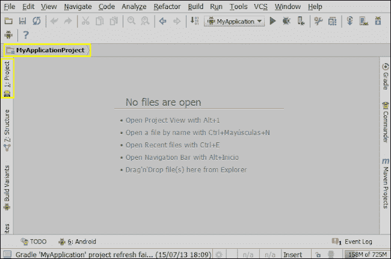
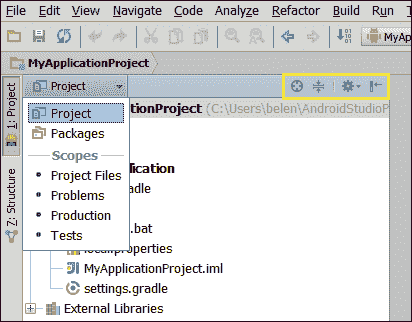

# 三、导航项目

你刚刚创建了你的第一个 Android Studio 项目，现在你想知道发生了什么。你想开始编程，但在此之前你需要熟悉项目的导航。一切是如何构成的？您可以在项目中更改哪些设置？你如何改变这些设置，它们意味着什么？

本章旨在介绍 Android Studio 中一个项目的结构。我们将从了解项目导航面板开始。我们将浏览项目中最重要的文件夹，`build`、`gen`、`libs,`以及`src/main`下的文件夹，我们将学习如何更改项目设置。

这些是我们将在本章中讨论的主题:

*   导航面板
*   项目结构
*   更改项目属性

# 项目导航面板

最初在 Android Studio 的主视图中，没有显示任何项目或文件，如下一张截图所示。Android Studio 建议，按 *Alt* + *1* 打开项目视图。也可以从左边缘点击**项目**按钮打开。

项目视图显示了打开的项目列表。项目使用分层视图显示。

在项目浏览器的左上角，我们可以更改视图类型:**项目**或**包**。第一个显示项目的目录结构，而第二个只显示包结构。

右上角有一些操作和一个下拉菜单来配置项目视图。这些操作在下面的屏幕截图中突出显示:

用鼠标右键点击项目名称打开上下文菜单，或者点击项目的任意元素。从该菜单中，我们可以:

*   创建新元素并将其添加到项目中
*   剪切、复制、粘贴或重命名项目中的文件
*   在项目中查找元素
*   分析并重新格式化代码
*   构建项目
*   比较文件
*   在资源管理器中打开文件

# 项目结构

在项目导航窗格中，我们可以检查项目结构。项目结构中有一个文件夹，里面有我们应用程序的名称。该文件夹包含应用程序结构和文件。应用程序结构最重要的元素是:

*   `build/`:一个文件夹，包含构建应用后编译的资源和安卓工具生成的类，如`R.java`文件，包含对应用资源的引用。
*   `libs/`:一个文件夹，包含从我们的代码中引用的库。
*   `src/main/`:包含应用程序来源的文件夹。您通常使用的所有文件都在此文件夹中。主文件夹细分如下:
    *   `java/`: A folder that contains the Java classes organized as packages. Every class we create will be in our project package namespace (`com.example.myapplication`). When we created our first project, we also created its main activity, so the activity class should be in this package. The next screenshot shows this main activity class inside the project structure:

        

    *   `res/`:包含项目资源的文件夹，如指定布局和菜单的 XML 文件或图像文件。
    *   `drawable/`:包含我们的应用程序中使用的图像的文件夹。有不同的可绘制文件夹分类到不同的屏幕密度。当我们创建第一个项目时，我们也创建了我们的应用程序图标，所以这个图标已经在这些名为`ic_launcher.png`的文件夹中了。
    *   `layout/`:包含视图及其元素的 XML 定义的文件夹。
    *   `menu/`:包含应用程序菜单的 XML 定义的文件夹。
    *   `values/`:包含定义名称-值对集合的 XML 文件的文件夹。这些值可以是颜色、字符串或样式。有不同的价值文件夹分类到不同的屏幕选项，以适应他们的界面。例如，当应用程序在平板电脑上运行时，放大组件或字体。
    *   `AndroidManifest.xml`:这个文件在安卓项目中是必不可少的，并且是在创建项目时自动生成的。该文件声明了安卓系统运行应用程序所需的基本信息、包名、版本、活动、权限、意图或所需的硬件。
*   `build.gradle`:这个文件是用来构建我们的应用程序的脚本。

# 项目设置

有两个对话框包含项目设置:**文件** | **设置**菜单和**文件** | **项目结构**。工具栏中也提供了这两种功能。

从项目视图中选择您的项目，并导航至**文件** | **设置**菜单。在设置对话框的左侧菜单中，有一个名为**项目设置【我的应用】**的部分。一些重要选项包括:

*   **代码样式**:配置默认代码样式方案。
*   **编译器**:配置构建我们的应用时使用的安卓 DX 编译器。
*   **文件编码**:更改文件的编码。默认编码是 UTF-8。
*   **渐变**:给渐变的配置。Gradle 是一个类似于 Apache Ant 和 Apache Maven 的工具，基于 Groovy 构建和管理 Java 项目。Gradle 集成在 Android Studio 中。
*   **语言注入**:添加或删除编辑器中使用的可用语言。
*   **Maven** :它给出了 Maven 的配置。Maven 是一个类似于 Apache Ant 和 Gradle 的工具，基于 XML 来构建和管理 Java 项目。Maven 集成在 Android Studio 中。
*   **版本控制**:配置版本控制选项。版本控制将在[第 7 章](07.html "Chapter 7. Tools")*工具*中详细解释。

除了这些设置，项目结构对话框中还有更多设置。导航至**文件** | **项目结构**菜单。**项目设置**为:

*   **项目**:我们可以更改项目名称和项目 SDK。记得在[第一章](01.html "Chapter 1. Installing and Configuring Android Studio")、*安装配置 Android Studio*的时候，我们选择了一个 SDK 作为默认的那个。在此屏幕中，我们可以仅针对当前项目更改此 SDK。
*   **模块**:这个屏幕显示了现有模块及其方面的列表。我们也可以删除它们或创建新的。根据 IntelliJ IDEA([http://www.jetbrains.com/idea/webhelp/module.html](http://www.jetbrains.com/idea/webhelp/module.html))

    > T7】模块是一个独立的功能单元,您可以独立编译、运行、测试和调试

*   **库**:此屏幕显示导入项目的库列表。我们也可以删除它们或添加新的。它们将被添加到`libs/`文件夹中。
*   **面**:此屏幕显示现有面的列表。我们也可以删除它们或创建新的。这些方面也显示在**模块**视图中。根据 IntelliJ IDEA([http://www.jetbrains.com/idea/webhelp/facet.html](http://www.jetbrains.com/idea/webhelp/facet.html))

    > T8】方面代表模块中使用的各种框架、技术和语言。它们让 IntelliJ IDEA 知道如何处理模块内容,从而确保符合相应的框架和技术

# 总结

我们已经了解了项目在 Android Studio 中是如何呈现的，以及一旦创建，默认情况下项目中有哪些文件夹。现在我们明白了每个文件夹的原因以及`AndroidManifest.xml`是为了什么。我们查看了**文件** | **设置**和**文件** | **项目结构**对话框中的项目设置。现在，你应该知道如何在 Android Studio 中操作和导航一个项目。

在下一章中，我们将学习如何使用文本编辑器。正确了解文本编辑器对于提高我们的编程效率非常重要。我们将学习编辑器设置以及如何自动完成代码、使用预生成的代码块和导航代码。我们还将学习一些有用的捷径。