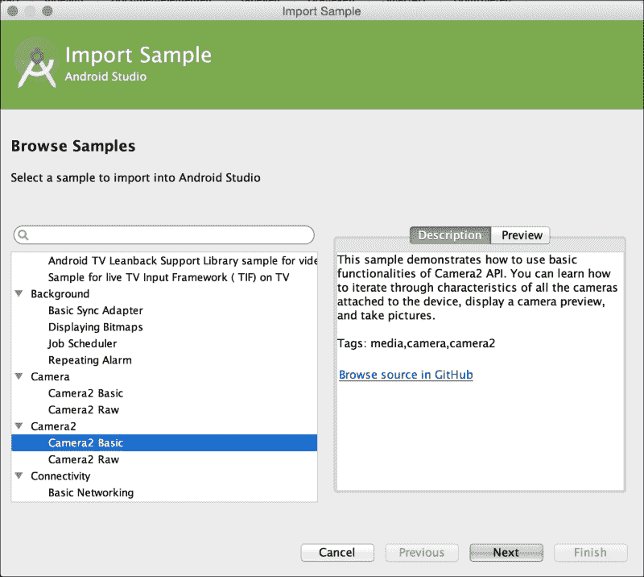
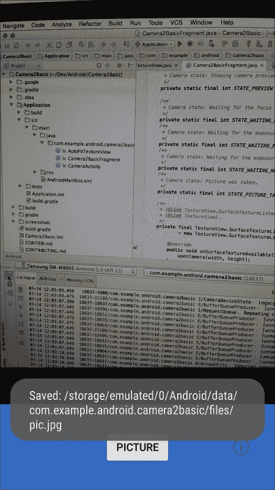
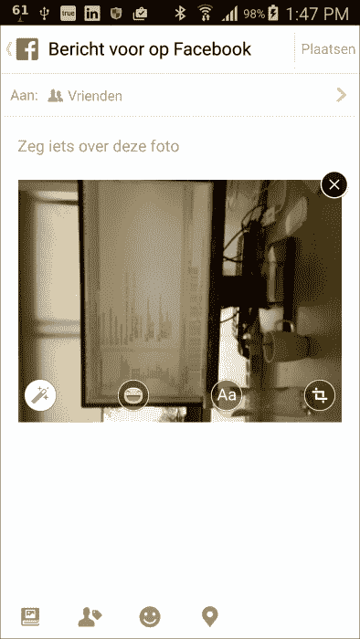
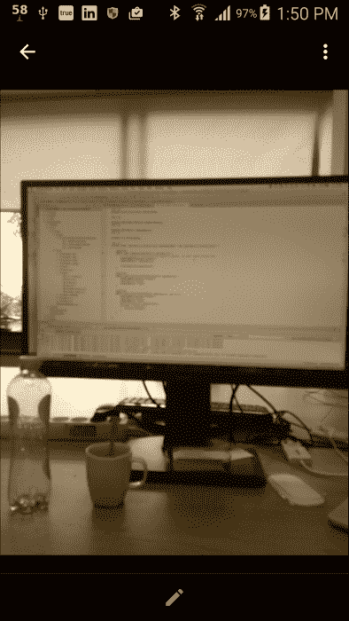

# 六、捕获和共享

我们喜欢与他人分享我们生活的世界，因此我们会使用智能手机拍摄我们关心的所有事物和所有人的图像或视频。使用安卓，这非常容易。

在本章中，您将了解以下内容:

*   轻松捕捉图像
*   使用 Camera2 应用编程接口进行图像捕获
*   图像共享
*   方向问题

# 简介

作为一名开发人员，您可以启动一个意图，获取数据，然后随心所欲地使用它。

如果你想自己处理图像或视频拍摄，事情会变得有点复杂。那么，为什么会有人想这么做呢？它为我们预览、过滤或处理相机的方式提供了更多的灵活性。

随着安卓棒棒糖的出现，我们一直使用的旧相机应用编程接口已经被相机 2 应用编程接口所取代，这是一个巨大的进步。不幸的是，一些定位问题仍然存在，主要是由于安卓硬件和软件的大规模碎片化。在某些设备上，捕获的图像似乎旋转了 90 度。为什么会这样？你会在本章的最后一个食谱中找到答案。

# 捕捉图像的简单方法

当然，安卓上有很多拍照或者录视频的方式。捕捉图像最简单的方法是使用启动相机应用的意图，并在拍摄图像后抓取结果。

## 做好准备

对于这个食谱，你只需要启动并运行 Android Studio。

## 怎么做...

启动相机的意图通常是这样的:

1.  在 Android Studio 中，创建一个新项目。
2.  在`activity_main.xml`布局中，添加一个新按钮和一个图像视图。命名图像视图`image`。
3.  为该按钮创建一个点击处理程序。
4.  从事件处理程序实现中调用`takePicture`方法。
5.  执行`takePicture`方法。如果设备支持，启动捕获意图:

    ```java
    static final int REQUEST_IMAGE_CAPTURE = 1;
    private void takePicture() {
      Intent captureIntent = new  
        Intent(MediaStore.ACTION_IMAGE_CAPTURE);
      if (captureIntent.resolveActivity(  
       getPackageManager()) != null) {
        startActivityForResult(captureIntent,   
           REQUEST_IMAGE_CAPTURE);
       }
    }
    ```

6.  覆盖`onActivityResult`方法。您将从返回的数据中获得缩略图，并在图像视图中显示结果:

    ```java
    @Override 
      protected void onActivityResult(int requestCode, int resultCode, Intent data) { 
       if (requestCode == REQUEST_IMAGE_CAPTURE &&resultCode == RESULT_OK) {     
            Bundle extras = data.getExtras();
            Bitmap thumbBitmap = (Bitmap)  
             extras.get("data");");
             ((ImageView)findViewById(R.id.image) 
             ).setImageBitmap(thumbBitmap);
        }
    }
    ```

这是捕捉图像最简单的方法，也许你以前已经这样做过了。

## 还有更多...

如果您想在自己的应用中预览图像，还有更多工作要做。Camera2 应用编程接口可用于预览、捕获和编码。

在 Camera2 API 中，您会发现诸如`CameraManager`、`CameraDevice`、`CaptureRequest`、`CameraCaptureSession`等组件。

这里列出了最重要的 Camera2 API 类:

<colgroup><col style="text-align: left"> <col style="text-align: left"></colgroup> 
| 

班级

 | 

目标

 |
| --- | --- |
| `CameraManager` | 选择相机，创建相机设备 |
| `CameraDevice` | `Create CaptureRequest`、`CameraCaptureSession` |
| `CaptureRequest, CameraBuilder` | 链接到曲面视图(预览) |
| `CameraCaptureSession` | 捕捉图像并将其显示在表面视图上 |

下一个食谱中我们要研究的样本*图像采集*，刚开始看起来可能有点混乱。这主要是因为设置过程需要很多步骤，而且大部分都是异步执行的。不过，别担心，我们会一步一步调查的。

# 使用 Camera2 应用编程接口进行图像采集

让我们与所爱的人分享我们周围的世界。一切都从预览和捕捉开始。这就是这个食谱的全部内容。我们也将回到那些照片是棕褐色调的好时光。

有许多应用，如 Instagram，提供了为照片添加滤镜或效果的选项。如果棕褐色是过滤和分享图片的唯一选择，会发生什么？也许我们可以创造一个趋势。# EverybodyLovesSepia！

我们将使用 Camera2 应用编程接口捕捉图像，基于谷歌的 Camera2 基本样本，可在 GitHub 上获得。作为配方中步骤的参考，您可以看看下面的类图。它将明确我们正在处理哪些类，以及它们如何相互作用:


我们将调查里面到底有什么，一旦你发现发生了什么，我们将通过让预览和捕获的图像以棕褐色显示(或者另一种效果，如果你喜欢的话)来添加一点我们自己。

## 做好准备

对于这个配方，我们将使用 Camera2 API。由于我们将使用这个应用编程接口，您需要有一个运行安卓 5.0 或更高版本的真实设备(推荐)，或者您需要创建一个虚拟设备。

## 怎么做...

让我们来看看如何快速跟上速度。谷歌已经为我们准备了一个简洁的例子:

1.  在 Android Studio，从启动向导中选择**导入安卓代码样本**，或者在**文件**菜单中选择**导入样本**。
2.  In the next dialog you will see many interesting sample apps demonstrating various Android features. Choose the **Camera2 Basic** sample, and click on the **Next** button:

    

3.  Name your project `EverybodyLovesSepia` and click on the **Finish** button.

    ### 注

    如果点击按钮后没有任何反应(由于 Android Studio 某些版本的 bug)，请再试一次，但这次保持项目名称不变。

4.  Android Studio 会为你从 GitHub 获取样本项目。你也可以在[https://github.com/googlesamples/android-Camera2Basic](https://github.com/googlesamples/android-Camera2Basic)找到。
5.  Run the app on a device or on a virtual device.

    ### 注

    如果您使用的是运行在 Genymotion 上的虚拟设备，请首先通过单击右侧的摄像机图标、打开摄像机开关并选择(网络)摄像机来启用摄像机。

在应用中，您将看到相机的预览，如下图所示:



很多事情已经又自动发生了！这个 Camera2 API 示例中有什么？捕捉图像需要什么？实际上，需要很多。开启`Camera2BasicFragment`课。这是大多数魔法发生的地方。

### 折叠所有方法

要创建一个不那么压倒性的视图，请折叠所有方法:

1.  您可以通过从**代码**菜单中选择**折叠**选项来实现。在子菜单中，选择**折叠所有**。
2.  You will also find other options in this submenu; for example, **Expand all** methods or **Expand** (which expands only the selected method).

    ### 类型

    使用快捷方式 *Cmd* 后跟 *+* 和 *Cmd* 后跟*–*(或 *Ctrl* 带 *+* 和 *Ctrl* 带*–*带用于窗口)分别展开或折叠一个方法。使用快捷键 *Cmd* + *用 *+* 移动*和 *Cmd* + *用*–*(*Ctrl*+*移动*和 *+* 和*移动* + *Ctrl* 和*–*进行*

3.  展开`onViewCreated`方法。这里我们看到`mTextureView`的初始化，是对自定义小部件`AutoFitTextureView`的引用。它将显示相机预览。
4.  接下来，展开`onResume`方法。最初，这是`SurfaceTextureListener`类的设置位置。正如示例中的注释已经所建议的，这允许我们在尝试打开相机之前等待表面准备就绪。双击`mSurfaceTextureListener`并使用快捷方式 *Cmd* + *B* (对于 Windows，这是 *Ctrl* + *B* )跳转到其声明，查看这是关于什么的。
5.  完全展开`mSurfaceTextureListener`的初始化。就像一个活动，纹理视图有一个生命周期。这里正在处理事件。就目前而言，这里最有趣的是`onSurfaceTextureAvailable`事件。一旦表面可用，就会调用`openCamera`方法。双击它并跳转到它。
6.  Many things happen in the `openCamera` method. There is a call to the `setUpCameraOutputs` method. This method will handle which camera to use (if there are multiple ones) by setting the private member `mCameraId` and the (preview) size of the image. This may be different for each type of device. It will also take care of the aspect ratio. Almost any device supports the 4:3 aspect ratio, but many also support 16:9 or other aspect ratios.

    ### 注

    大多数设备都有一两个摄像头。有的只有后置摄像头，有的只有前置摄像头。前置摄像头通常支持更少的图像尺寸和纵横比。

    此外，随着安卓棉花糖(安卓 6.0)的新许可政策，您的应用可能根本不允许使用任何相机。这意味着您总是需要测试相机功能是否可用于您的应用。如果不能，你必须通过显示一个对话框或吐司向你的用户提供一些反馈。

7.  接下来我们来看看`openCamera`法中的下面一行。上面写着打开`setCameraOutputs`方法为我们选择的摄像头:

    ```java
    manager.openCamera(mCameraId, mStateCallback, mBackgroundHandler);
    ```

8.  它还提供了一个`mStateCallback`参数。如果双击它并跳转到它，您可以看到它的声明。事情在这里再次异步发生。
9.  相机一打开，预览会话就开始了。让我们跳到`createCameraPreviewSession`法。
10.  看看`mCameraDevice.createCaptureSession`。进入该方法的参数之一是捕获会话状态回调。它用于确定会话是否配置成功，以便显示预览。
11.  现在，拍照需要做什么？找到`onClick`方法。您会注意到对`takePicture`方法的调用。跳过去。`takePicture`方法又称为`lockFocus`方法。跳过去。
12.  拍照需要几个步骤。摄像机的焦点必须锁定。接下来，需要创建一个新的捕获请求，并且需要调用`capture`方法:

    ```java
    mCaptureSession.capture(mPreviewRequestBuilder.build(),  
     mCaptureCallback, mBackgroundHandler);
    ```

13.  进入`capture`方法的参数之一是`mCaptureCallback`。使用 *Cmd* + *B* (或窗口的 *Ctrl* + *B* 跳转到其声明。
14.  你会注意到两种方法:`onCaptureProgressed`和`onCaptureCompleted`。它们都调用私有方法`process`并将结果或部分结果传递给它。
15.  `process`方法将对各种可能的状态采取不同的行动。最后，它会调用`captureStillPicture`方法。使用 *Cmd* + *B* (或 *Ctrl* + *B* 进行申报。
16.  `captureStillPicture`方法初始化一个`CaptureRequest.Builder`类，用于拍摄图片并以正确的属性存储，如方位信息。一旦完成拍摄并保存了文件，相机焦点就会解锁，并通过祝酒词通知用户:

    ```java
    CameraCaptureSession.CaptureCallback CaptureCallback= new CameraCaptureSession.CaptureCallback() {
        @Override
        public void onCaptureCompleted 
         (CameraCaptureSession session, 
             CaptureRequest request, TotalCaptureResult  
              result) {
               showToast("Saved: " + mFile);
              unlockFocus();
           }
    };
    ```

前面的步骤向您展示了 basic(！)Camera2 示例应用。仅仅在你的应用中拍一张照片就已经是相当大的工作量了！如果你不需要在你的应用中预览，你可以考虑只使用一个意图来拍照。然而，拥有自己的预览可以让你在控制和效果上更加灵活。

### 加入乌贼效果

我们将在预览中添加一个棕褐色效果，仅仅是因为它看起来很酷(当然，也是因为早期的一切都更好)，使用以下步骤:

1.  转到`createCameraPreviewSession`方法，在摄像机捕捉会话状态回调实现的`onConfigured`类中，在设置`autofocus`参数

    ```java
    mPreviewRequestBuilder.set(
     CaptureRequest.CONTROL_EFFECT_MODE,  
      CaptureRequest.CONTROL_EFFECT_MODE_SEPIA);
    ```

    之前添加这一行
2.  如果你现在运行你的应用，你的预览会是棕褐色的。但是，如果您按下按钮来捕获图像，它将不会有此效果。在`onCaptureStillPicture`方法中，你将不得不做同样的事情。在设置`autofocus`参数的线的正上方添加这条线:

    ```java
    captureBuilder.set(   
     CaptureRequest.CONTROL_EFFECT_MODE,  
      CaptureRequest.CONTROL_EFFECT_MODE_SEPIA);
    ```

再次运行您的应用，捕获图像，并使用 Astro 应用(或其他文件浏览器应用)找到捕获的文件。您可以在`Android/data/com.example.android.camera2basic`找到它(显然是如果您已经接受了建议的包名，或者路径包括您提供的包名)。是棕褐色的！

如果你愿意，你可以用负片或任何其他可用的效果做一些进一步的实验，这也很有趣，至少在一段时间内是这样。

现在就这样。我们还没有做太多的编程，但是我们已经看了一些有趣的代码片段。在下一个食谱中，我们将分享我们在脸书拍摄的图像。

## 还有更多...

更多信息，请查看位于[https://github.com/googlesamples/安卓-Camera2Basic](https://github.com/googlesamples/ android-Camera2Basic) 的 GitHub 和位于[的谷歌 Camera2 API](https://developer.android.com/reference/android/hardware/camera2/package-summary.html) 参考。

一个有趣的带有二维码扫描支持的 Camera2 API 样本的叉可以在[https://github.com/ChristianBecker/Camera2Basic](https://github.com/ChristianBecker/Camera2Basic)找到。

# 图片分享

图片没有分享图片的能力，抓拍毫无乐趣；例如，在脸书。我们将为此使用脸书软件开发工具包。

挑战！如果您正在构建一个在 Parse 后端上运行的应用，就像我们在[第 2 章](02.html "Chapter 2. Applications with a Cloud-based Backend")、*应用和一个基于云的后端*中所做的那样，那么这是没有必要的，因为脸书 SDK 已经在那里了。如果你愿意，你可以把[第二章](02.html "Chapter 2. Applications with a Cloud-based Backend")、*应用中的食谱和这个结合起来，快速创建一个非常酷的应用！*

## 做好准备

对于这个配方，你需要成功完成之前的配方，并且你需要一个真实的安卓设备(或者一个虚拟设备，但是这需要一些额外的步骤)。

您还需要有一个脸书帐户，或者您可以创建一个仅用于测试目的。

## 怎么做...

让我们来看看如何分享我们在脸书拍摄的棕褐色图像:

1.  从之前的配方中获取代码。打开`app`文件夹中的`build.gradle`文件。在`dependencies`部分添加一个新的依赖项，点击**立即同步**链接，该链接将在您添加该行后出现:

    ```java
    compile 'com.facebook.android:facebook-android-sdk:4.1.0'

    ```

2.  要获取脸书应用 ID，请浏览至[https://developers.facebook.com](https://developers.facebook.com)(是的，这需要脸书帐户)。从**我的 App**菜单中，选择**添加新应用**，选择**安卓**作为您的平台，输入您的应用名称，点击**创建新的脸书应用 ID** 。选择一个类别，例如**娱乐**，点击**创建应用标识**。
3.  将创建您的应用，并显示快速启动页面。一直向下滚动到**告诉我们你的安卓项目**部分。在**包名**和**默认活动类名**字段输入详细信息，点击**下一步**按钮。
4.  将显示一个弹出警告。您可以放心地忽略警告，点击**使用该包名**按钮。脸书会开始思考，过一会儿**添加你的开发并发布关键哈希**的部分会出现。
5.  To obtain development key hashes, open the Terminal app (in Windows, start Command Prompt) and type the following:

    ```java
    keytool -exportcert -alias androiddebugkey -keystore ~/.android/debug.keystore | openssl sha1 -binary | openssl base64
    ```

    ### 类型

    如果提示您输入密钥库密码，请输入`android`，这应该就可以了-当然，除非您之前已经更改了密码。

6.  点击*进入*，复制显示的数值，粘贴到**开发密钥哈希**的脸书网页中。点击**下一步**按钮继续。
7.  In the section **Next Steps**, click on the **Skip to developer dashboard** button. It will bring you straight to the information you need, the app ID. Copy the value in the **App ID** field:

    

8.  接下来，初始化脸书软件开发工具包。打开`CameraActivity`类，在`onCreate`方法中，在`super.OnCreate`行之后添加以下行。使用 *Alt* + *进入*快捷方式导入所需包裹`com.facebook.FacebookSdk` :

    ```java
    FacebookSdk.sdkInitialize(getApplicationContext());
    ```

9.  现在我们需要告诉应用关于脸书应用 ID。从`res/values`文件夹打开`strings.xml`文件。添加一个包含您的脸书应用 id 的新字符串:

    ```java
    <string name="facebook_app_id">Your facebook app id</string>
    ```

10.  打开`AndroidManifest.xml`文件。
11.  向`application`元素添加元数据元素:

    ```java
    <meta-data android:name="com.facebook.sdk.ApplicationId" android:value="@string/facebook_app_id"/>
    ```

12.  向`manifest`文件添加`FacebookActivity`声明:

    ```java
    <activity android:name="com.facebook.FacebookActivity"android:configChanges="keyboard|keyboardHidden|screenLayout|   
       screenSize|orientation"
      android:theme="@android:style/Theme.Translucent.
       NoTitleBar"
      android:label="@string/app_name" />
    ```

13.  在`Camera2BasicFragment`类中，定位`captureStillPicture`方法。在`onCaptureCompleted`回调实现的末尾添加一个新的调用，就在`unlockFocus`类:

    ```java
    sharePictureOnFacebook();
    ```

    之后
14.  最后，在`manifest`文件中添加一个提供者(在`application`部分)，它将允许你在脸书共享图像。下一章将讨论内容供应器。现在只需在`authorities`的`FaceBookContentProvider`末尾添加您的应用标识，替换此处示例中的零:

    ```java
    <provider android:authorities="com.facebook.app. 
      FacebookContentProvider000000000000"android:name="com.facebook.FacebookContentProvider"android:exported="true" />
    ```

15.  执行`sharePictureOnFacebook`方法。我们将从文件中加载位图。在真实的应用中，我们需要计算`inSampleSize`的所需值，但是为了简单起见，我们将在这里使用`4`的固定`inSampleSize`设置。在大多数设备上，这足以避免任何可能发生的`OutOfMemory`异常。另外，我们会将照片添加到拍照后显示的`share`对话框中:

    ```java
    private void sharePictureOnFacebook(){
        final BitmapFactory.Options options = new  
         BitmapFactory.Options();
        options.inJustDecodeBounds = false;
        options.inSampleSize = 4;
        Bitmap bitmap =  
         BitmapFactory.decodeFile(mFile.getPath(), options); 
        SharePhoto photo = new  
        SharePhoto.Builder().setBitmap(bitmap).build();
        SharePhotoContent content = new  
        SharePhotoContent.Builder().addPhoto(photo).build();
        ShareDialog.show(getActivity(), content);
    }
    ```

16.  为了安全起见，我们希望为每张图片创建一个唯一的文件名。修改`onActivityCreated`方法以达到此目的:

    ```java
    @Override
    public void onActivityCreated(Bundle savedInstanceState) {
        super.onActivityCreated(savedInstanceState);
        mFile = new 
        File(getActivity().getExternalFilesDir(null),  
          "pic"+ new Date().getTime()+".jpg");
    }
    ```

17.  The page will look like this on your Facebook timeline. Here it is shown in the Dutch language:

    

18.  运行该应用，并在您自己的脸书时间线上分享一些棕褐色图像！

我们的应用已经功能齐全，尽管它可能需要一些调整。在我的三星设备上，我在人像模式下拍摄的所有图像都旋转了 90 度。这有点太艺术了。让我们在下一个食谱中解决它！

# 定位问题

在某些设备上(如三星设备)，人像模式下拍摄的图像旋转 90 度；而在其他设备上(比如 Nexus 设备)，一切似乎都很好。例如，如果您使用 Astro 应用查看文件，您不会注意到这一点，但是如果您在脸书**共享**对话框中看到预览，您会注意到这一点。

这对许多安卓开发者来说是一个众所周知的挑战。图像可能包含关于旋转度的元数据，但显然不是每个应用都尊重这些元数据。最好的解决方案是什么？您是否应该在每次想要显示图像时旋转图像？是否应该旋转位图本身，这可能会非常耗时且耗费处理器？

## 做好准备

对于此配方，您需要成功完成之前的配方。如果你有多台安卓设备来测试你的应用，那就太理想了。否则，如果您至少有一台三星设备可用，那就太好了，因为该品牌的大多数(如果不是全部)型号都可以重现定位问题。

## 怎么做...

让我们来看看如果出现这种情况，您如何解决方向问题:

1.  In the Facebook **share** dialog, the preview image is rotated 90 degrees (on some devices), as shown here:

    

2.  这看起来不像我生活的世界。它以这种方式出现在我的三星 Galaxy Note 3 设备上，但不在我的 Nexus 5 设备上。显然，三星从风景的角度存储图片，然后向其添加元数据以指示图像已经旋转(与默认方向相比)。然而，如果你想在脸书分享它，事情就会变得不对劲，例如，元数据中的方向信息没有得到尊重。
3.  因此，我们需要检查元数据，并找出其中是否有任何旋转信息。添加`getRotationFromMetaData`方法:

    ```java
    private int getRotationFromMetaData(){
       try {
          ExifInterface exif = new 
          ExifInterface(mFile.getAbsolutePath());
          int orientation = exif.getAttributeInt(
           ExifInterface.TAG_ORIENTATION,
            ExifInterface.ORIENTATION_NORMAL);
          switch (orientation) {
    		  case ExifInterface.ORIENTATION_ROTATE_270:
                    return 270;
              case ExifInterface.ORIENTATION_ROTATE_180:
                    return 180;case ExifInterface.ORIENTATION_ROTATE_90:
                    return 90;
              default:
                    return 0;
          }
       }
       catch (IOException ex){
           return 0;
       }
    }
    ```

4.  If needed, you have to rotate the bitmap before showing the sharing preview. That is where the `rotateCaptureImageIfNeeded` method comes in.

    在这里，我们可以安全地旋转内存中的位图，因为`4`的`inSampleSet`值。如果你旋转原始全尺寸位图，很有可能你会耗尽内存。无论哪种方式，都将非常耗时，并且会导致捕获图像和显示共享预览对话框之间的延迟:

    ```java
    private Bitmap rotateCapturedImageIfNeeded(Bitmap bitmap){
        int rotate = getRotationFromMetaData();
        Matrix matrix = new Matrix();
        matrix.postRotate(rotate);
        bitmap = Bitmap.createBitmap(bitmap, 0, 0, bitmap.getWidth(),
         bitmap.getHeight(), matrix, true);
        Bitmap mutableBitmap = bitmap.copy(Bitmap.Config.ARGB_8888,  
         true);
       return mutableBitmap;
    }
    ```

5.  然后，在`sharePictureOnFacebook`方法中，在使用`BitmapFactory`类检索位图之后，调用`onRotateCaptureImageIfNeeded`方法，并将位图作为参数传递:

    ```java
    bitmap = rotateCapturedImageIfNeeded(bitmap);

    ```

6.  If you run the app again, you will see that everything is fine in portrait mode too:

    

这些东西很容易实现，并将提高你的应用的质量，尽管它们有时也会让你发疯，让你想知道为什么一个解决方案不能只在任何设备上工作。现在一切看起来都很好，但是在平板电脑上或者在华为、LG 或者 HTC 设备上会是什么样子呢？没有什么是不可修复的，但是因为你没有安卓设备的图纸(或者也许你有)，测试是困难的。

在尽可能多的设备上测试你的应用总是一件好事。考虑使用一个服务进行远程测试，例如 TestDroid。你可以在[www.testdroid.com](http://www.testdroid.com)找到他们的网站。在[第 8 章](08.html "Chapter 8. Improving Quality")、*提升质量*中，会讨论这个和其他话题，但在接下来的章节中，我们会先看一下可观察对象和内容供应器。

## 还有更多...

捕捉视频更有趣。还有一个摄像机 2 应用编程接口样本用于视频捕捉。您也可以通过**导入样本**选项检查样本项目。

## 另见

*   [第八章](08.html "Chapter 8. Improving Quality")*提升品质*