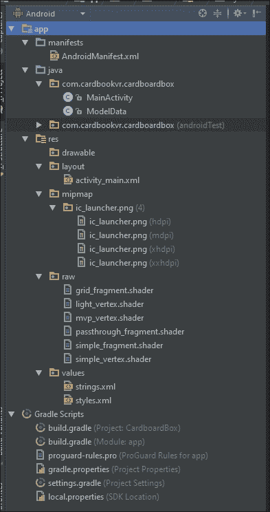
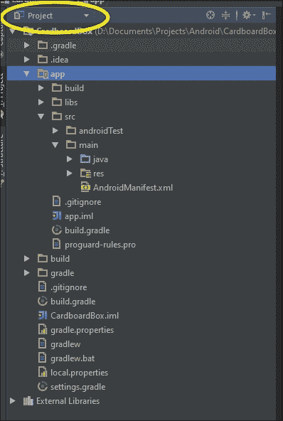
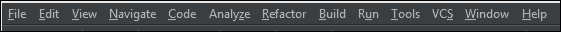
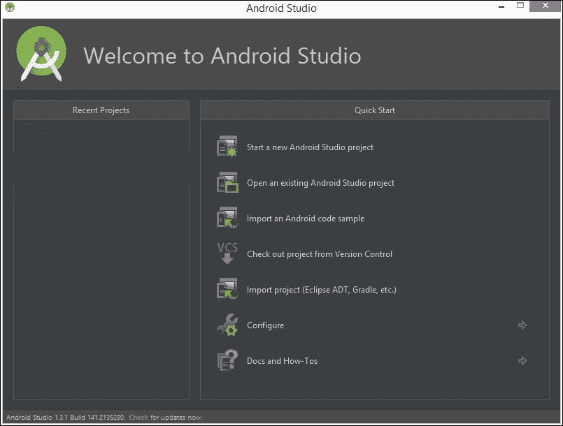
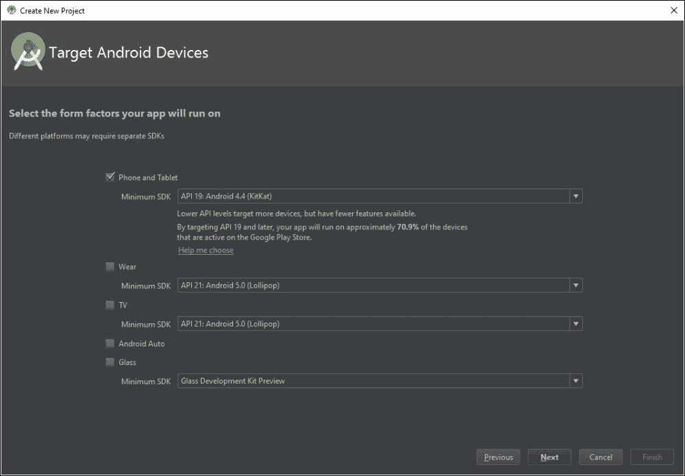
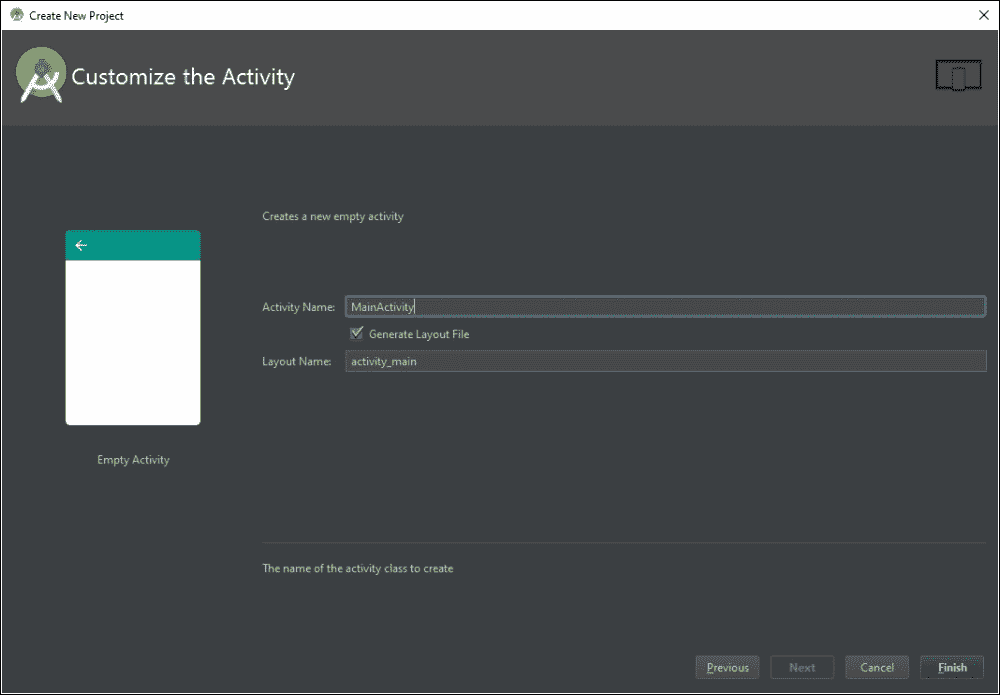
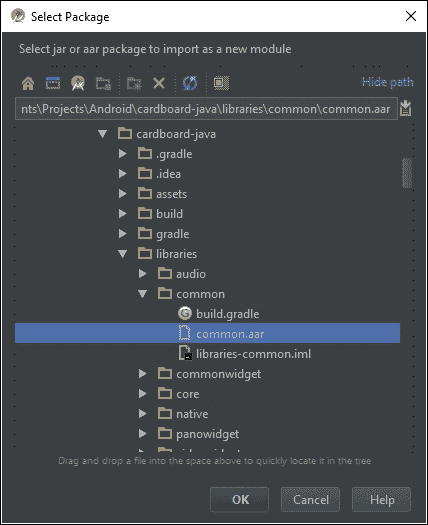
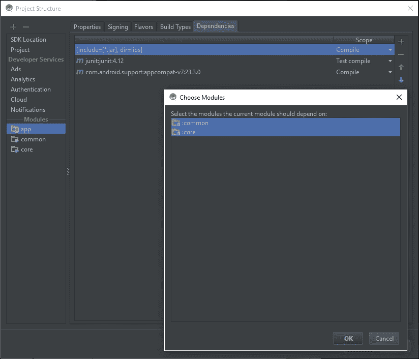
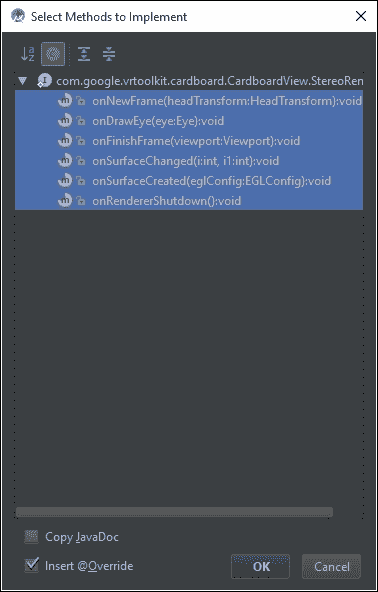

# 二、框架纸板项目

在本章中，您将学习如何构建一个框架纸板项目，这可以作为本书中其他项目的起点。我们将从介绍 Android Studio、纸板软件开发工具包和 Java 编程开始。我们希望确保您总体上了解工具和安卓项目。然后，我们将引导您建立一个新的纸板项目，这样我们就不需要在每个项目中重复这些细节。如果有些或所有这些你已经熟悉了，太好了！你也许能浏览一下。在本章中，我们将涵盖以下主题:

*   安卓应用里有什么？
*   安卓项目结构
*   Android Studio 入门
*   创建新的纸板项目
*   添加纸板 Java 软件开发工具包
*   编辑清单、布局和`MainActivity`
*   构建和运行应用

# 安卓应用里有什么？

对于我们的项目，我们将使用强大的 Android Studio 集成开发环境来构建运行在安卓设备上的谷歌纸板虚拟现实应用。*呜！*Android Studio 将多个不同的工具和流程整合在一个屋檐下。

你努力开发安卓应用的结果是一个安卓应用包或一个`.apk`文件，它通过谷歌 Play 商店或你选择分发你的应用的方式分发给用户。这个文件安装在他们的安卓设备上。

我们一会儿就跳到 Android Studio 本身。然而，为了对这里发生的事情有所了解，让我们首先考虑这个最终结果`.apk`文件。到底是什么？我们怎么拿到的？理解构建过程会有所帮助。

记住这一点，为了好玩和获得视角，让我们从头开始，从 APK 开始，通过构建管道，我们的应用源代码。

## APK 文件

APK 文件实际上是一个由许多不同文件组成的压缩包，包括编译后的 Java 代码和非编译资源，比如图像。

APK 文件是为安卓的特定*目标*版本构建的，但它也表示一个*最低*版本。一般来说，为旧版本安卓构建的应用会在新版本安卓上运行，但不会反过来运行。然而，为旧版本的安卓构建意味着新的功能将无法用于该应用。你想选择支持你需要的功能的安卓最低版本，以便瞄准尽可能多的设备。或者，如果出于性能原因，您希望支持更小的设备子集，您可以选择人为设置的高最低 API 版本。

要在 Android Studio 中构建您的项目并创建 APK 文件，您需要单击**构建菜单**选项并选择 **制作项目**(或单击绿色箭头图标在设备上或 **Android 虚拟设备** ( **AVD** )内构建、部署和运行应用)，这将启动 Gradle 构建过程。您可以构建一个版本来开发和调试，或者构建一个更优化的应用发布版本来分发。您可以通过点击**构建**菜单并选择**选择构建变体来进行选择...**。

## 梯度构建过程

Android Studio 使用名为**的工具**从你的项目文件中构建 APK 文件。以下是取自安卓文档的 Gradle 构建过程的流程图。事实上，大多数插图细节对我们来说并不重要。重要的是要看到许多部分以及它们是如何组合在一起的。


在上图最下方的框中，您可以看到构建的结果是一个经过签名和对齐的`.apk`文件，这是我们的应用的最终版本，该版本已经从早期的构建过程中编译(从源代码转换而来)、压缩(压缩)和签名(用于身份验证)。最后一步，zipalign，沿着 4 字节边界对齐压缩的资源，以便在运行时快速访问它们。基本上，这最后一步使应用加载更快。

在图的中间，你会看到`.apk`(未签名、未压缩)文件是由`.dex`文件、已编译的 Java 类和其他资源(如图像和媒体文件)组装而成的。

一个`.dex`文件是 Java 代码，它已经被编译成一种格式(Dalvik 字节码)，运行在你设备上的 **Dalvik** **虚拟机** ( **DVM** )上。这是你的程序的可执行文件。您在模块构建中包含的任何第三方库和编译后的 Java 源代码文件(`.class`)都会转换为`.dex`文件，以便打包到最终的`.apk`文件中。

同样，如果这个对你来说是新的，不要担心的细节。重要的是我们将在谷歌纸板项目中处理许多不同的文件。这将有助于我们了解它们在构建过程中的使用环境。

例如，带有纸板软件开发工具包的`common.aar`文件(二进制安卓库档案)是我们将使用的第三方库之一。您项目的`res/`目录的内容，如`layout/activity_main.xml`，通过 **安卓素材打包工具** **(aapt)** 传递。

## 一个 Java 编译器

什么输入到`.dex`文件中？一个 Java 编译器获取 Java 语言源代码，生成一个包含字节码的`.dex`文件。通过参考前面的 Gradle 构建流程图，在图的顶部，您将看到 Java 编译器的输入包括以下内容:

*   您的应用的 Java 源代码
*   您的应用的 XML 资源，如`AndroidManifest.xml`文件，使用 **aapt** 编译，并用于生成`R.java`文件
*   您的应用的 Java 接口(**安卓接口定义语言** `.aidl`文件)，使用的 **aidl** 工具编译

在这本书的剩余部分，我们将谈论很多关于这些源代码文件。那是你写的东西！那是你施展魔法的地方！这就是我们程序员生活的世界。

现在让我们看看你的安卓项目源代码的目录结构。

# 安卓项目结构

你的安卓项目根目录包含各种文件和子目录。或者，我应该说，你的安卓项目的根文件夹包含各种文件和*子文件夹。*T3】哈哈。我们将在本书中交替使用“文件夹”和“目录”这两个词，就像 Android Studio 似乎也在做的那样(实际上是有区别的，正如在[http://stackoverflow . com/questions/29454427/new-directory-vs-new-folder-in-Android-Studio](http://stackoverflow.com/questions/29454427/new-directory-vs-new-folder-in-android-studio)中所讨论的那样)。

如安卓层次结构所示，在下面的 Cardboard 项目示例中，根目录包含一个 `app/`子目录，该子目录又包含以下子目录:

*   `app/manifests/`:包含`AndroidManifest.xml`清单文件，指定应用的组件，包括活动(UI)、设备权限和其他配置
*   `app/java/`:这包含了应用 Java 文件的子文件夹，这些文件实现了应用的`MainActivity`和其他类
*   `app/res/`: This contains subfolders with resources, including the layout XML definition files, values definitions (`strings.xml`, `styles.xml`, and so on), icons, and other resource files

    

这些目录对应前面 Gradle 构建过程图最上面一行的框，这不是巧合；它们提供通过 Java 编译器运行的源文件。

此外，根目录下还有 Gradle 脚本，不需要直接编辑，因为 Android Studio IDE 提供了方便的对话框来管理设置。在某些情况下，您可能会发现直接修改这些文件更容易。

请注意，在层次窗格的左上角有一个选项卡选择菜单。在前面的截图中，设置为**安卓**，只显示安卓特有的文件。还有其他视图可能也很有用，例如**项目**，它列出了同一应用的项目根目录下的所有文件和子目录，如下图所示。**项目**层次结构显示了文件在实际文件系统上的结构。其他层次人为地重组您的项目，使其更容易工作。



### 类型

有时，您需要在**安卓**视图和**项目**视图之间切换。

# Android Studio 入门

在为安卓开发硬纸板应用时，有大量的东西需要跟踪，包括你所有的文件和文件夹、Java 类和对象、函数和变量。您需要一个组织合理的 Java 程序结构和有效的语言语法。您需要设置选项和管理流程来构建和调试应用。*咻！*

谢天谢地，我们有了 Android Studio，一个强大的集成开发环境 T2。它是建立在由流行的智能 Java 开发工具套件 JetBrains 开发的 IntelliJ IDEA 之上的。

它之所以智能，是因为它实际上在您编写代码时为您提供了相关建议( *Ctrl* + *Space* )，帮助您在相关引用和文件之间导航( *Ctrl* + *B* ， *Alt* + *F7* )以及自动执行重构操作，例如重命名类或方法( *Alt* + *Enter* )。在某些方面，它可能知道你想做什么，即使你不知道。*这有多聪明？*

## 安装 Android Studio

如果你的开发机上还没有安装安卓 Studio，还等什么？前往安卓开发者页面([http://developer.android.com/develop/index.html](http://developer.android.com/develop/index.html))并下载到你的系统。它适用于 Windows、Mac OS X 或 Linux。你可以安装完整的 Android Studio 软件包，而不仅仅是软件开发工具包工具。然后，乖乖地按照安装说明进行操作。

## Android Studio 用户界面

Android Studio 还有很多。在大多数情况下，我们只是在前进的过程中借助例子进行解释。但是让我们花一点时间来回顾一些特性，尤其是那些与 Cardboard 开发相关的特性。只需确保您阅读安卓开发者工具页面上的可用文档(如有需要，[http://developer.android.com/tools/studio/index.html](http://developer.android.com/tools/studio/index.html))。

对于初学者来说，Android Studio 的用户界面似乎令人望而生畏。而默认界面只是开始；编辑器主题和布局可以根据您的喜好进行定制。更糟糕的是，它有随着新版本而改变的趋势，所以教程可能会显得过时。虽然这可能会使您在特定场合找到所需的东西变得很有挑战性，但底层功能并没有发生很大变化。在大多数情况下，安卓应用就是安卓应用。我们在这本书中使用了 Android Studio 2.1 操作系统(虽然一些屏幕截图来自早期版本，但界面基本相同)。

### 注

使用 Android Studio 时，您可能会收到可用新更新的通知。我们建议您不要在项目中途升级，除非您知道自己确实需要新的改进。即使如此，如果引入了兼容性问题，请确保您有备份。

让我们简单浏览一下 Android Studio 窗口，如下图截图所示:


Android Studio 的菜单有:

*   顶部是主菜单栏( **#1** )，带有下拉菜单，可以拉出几乎所有可用功能的菜单。
*   菜单栏下是方便的主工具栏( **#2** )，带有常用功能的快捷方式。将鼠标悬停在图标上会显示一个工具提示，提示它的作用。
*   工具栏下方是主编辑器窗格( **#3** )。当没有文件打开时，显示**没有文件打开**。当打开多个文件时，主编辑器窗格沿顶部带有选项卡。
*   层次导航器窗格位于左侧( **#4** )。
*   The hierarchy navigator pane has tabs along the left-hand side (vertical tabs, **#5**) to select between the various views of your project.

    ### 注

    请注意层次窗格左上角的选择菜单。在前面的截图中，设置为**安卓**，只显示安卓特有的文件。还有其他可能有用的视图，例如**项目**，它显示了您的项目根目录下的所有文件和子目录，如前所述。

*   Along the bottom is an additional tool bar (**#6**) used to choose other dynamic tools you might need, including a Terminal window, build messages, debugging information, and even a to-do list. Perhaps the most important one is the Android Monitor **logcat** tab that provides a window to the Android logging system to collect and view the system debug output.

    ### 注

    关注 **logcat** 内的**可调试应用**下拉菜单、**日志级别**等过滤器，将有助于你过滤掉那些会让你很难找到你要找的输出的“日志垃圾邮件”。此外，请注意，即使在具有快速中央处理器的高端计算机上，这种日志视图也会将 Android Studio 拖得很慢。建议您在不使用时隐藏此视图，尤其是当您打开多个 Android Studio 实例时。

*   每个窗格角落中的控件通常与管理 IDE 窗格本身有关。

闲逛和浏览 Android Studio 提供的所有不同的东西会很有趣。要了解更多信息，请点击**帮助** | **帮助主题**菜单项(或**？工具栏上的**图标)打开 IntelliJ IDEA 帮助文档([https://www.jetbrains.com/idea/help/intellij-idea.html](https://www.jetbrains.com/idea/help/intellij-idea.html))。

请记住，Android Studio 是建立在智能集成开发环境之上的，它不仅仅可以用于安卓开发。所以，这里有很多；有些你永远不会用到；其他你需要但可能不得不寻找的人。

### 类型

这里有一点建议:权力大，责任大(*我以前在哪里听过这个？*)。其实有了这么多用户界面的东西，一点点的隧道视野就派上用场了(*对，我刚编的那个*)。当你需要使用它们的时候，专注于你需要使用的，不要担心其他细节。

在我们继续之前，让我们看一下主菜单栏。它看起来像下面的截图:



从左到右阅读，菜单项的组织方式与应用开发过程本身有些相似:创建、编辑、重构、构建、调试和管理。

*   **文件**:这些是项目文件和设置
*   **编辑**:包括剪切、复制、粘贴和宏选项等等
*   **查看**:这允许我们查看窗口、工具栏和 UI 模式
*   **导航**:指文件之间基于内容的导航
*   **代码**:这些是代码编辑快捷键
*   **分析**:用于检查和分析代码的错误和低效
*   **重构**:用于编辑语义相关文件的代码
*   **构建**:这个构建项目
*   **运行**:用于运行和调试
*   **工具**:这是一个与外部和第三方工具的接口
*   **VCS** :指版本控制(即`git`)命令
*   **窗口**:管理 IDE 用户界面
*   **帮助**:包括文档和帮助链接

现在，有那么可怕吗？

如果你还没有的话，你可能想试着从谷歌开发者网站的安卓软件开发工具包入门页面(参考[https://developers.google.com/cardboard/android/get-started](https://developers.google.com/cardboard/android/get-started))中构建纸板安卓演示应用。

在撰写本书时，演示应用名为**寻宝**，并有如何从其 GitHub 存储库中克隆项目的说明。只要克隆它，在 Android Studio 打开它，然后点击绿色的播放按钮来构建它，并运行它。其余的**入门**页面将带您浏览解释关键元素的代码。

*酷！*在下一章中，我们将开始并重建几乎相同的项目，但从头开始。

# 创建新的纸板项目

安装了安卓 Studio，让我们创建一个新项目。这些是你在这本书的任何项目中要遵循的步骤。我们只需制作一个空框架，并确保它可以构建和运行:

1.  After opening the IDE, you'll see a **Welcome** screen, as shown in the following screenshot:

    

2.  Select **Start a new Android Studio project**, and the **New Project** screen appears, as follows:

    

3.  Fill in your **Application name:**, such as `Skeleton`, and your **Company Domain:**, for example, `cardbookvr.com`. You can also change the **Project location**. Then, click on **Next**:

    

4.  On the **Target Android Devices** screen, ensure that the **Phone and Tablet** checkbox is checked. In the **Minimum SDK**, select **API 19: Android 4.4 (KitKat)**. Then, click on **Next**:

    

5.  On the **Add an activity to Mobile** screen, select **Empty Activity**. We're going to build this project from scratch. Then, click on **Next**:

    

6.  保留建议名称，`MainActivity`。然后，点击**完成**。

你全新的项目出现在 Studio 上。如果需要，按下 *Alt* + *1* 打开**项目视图** ( *命令* + *1* 在 Mac 上)。

# 添加纸板 Java SDK

现在是将纸板软件开发工具包库`.aar`文件添加到您的项目中的好时机。对于本书中的基本项目，您需要的库(在编写 v0.7 时)是:

*   `common.aar`
*   `core.aar`

### 注

请注意，SDK 包含了我们在本书的项目中不使用的其他库，但可能对您的项目有用。`audio.aar`文件用于空间化音频支持。`panowidget`和`videowidget`库是为 2D 应用设计的，这些应用想通过虚拟现实来观看 360 度的图像或视频。

在撰写本文时，要获得 Cardboard Android SDK 客户端库，您可以克隆`cardboard-java` GitHub 存储库，如谷歌开发者 Cardboard get 入门页面、**在[https://Developers . Google . com/Cardboard/Android/入门#start_your_own_project](https://developers.google.com/cardboard/android/get-started#start_your_own_project) 上所述。通过运行以下命令克隆`cardboard-java` GitHub 存储库:**

```java
git clone https://github.com/googlesamples/cardboard-java.git

```

要对我们在这里使用的相同的 SDK 版本 0.7 使用精确的提交，请`checkout`提交:

```java
git checkout 67051a25dcabbd7661422a59224ce6c414affdbc -b sdk07

```

或者，SDK 0.7 库文件包含在来自 Packt Publishing 的每个下载项目`.zip`文件中，以及本书位于[https://github.com/cardbookvr](https://github.com/cardbookvr)的 GitHub 项目中。

一旦您有了库的本地副本，一定要在文件系统上找到它们。要将库添加到我们的项目中，请执行以下步骤:

1.  For each of the required libraries, create new modules. In Android Studio, select **File** | **New** | **New Module…**. Select **Import .JAR/.AAR Package**:

    

2.  Locate one of the AARs and import it.

    

3.  Add the new modules as dependencies to your main app by navigating to **File** | **Project** **Structure** | **Modules** (on the left hand side) | **app** (your app name) | **Dependencies** | **+** | **Module Dependency**:

    

现在我们可以在我们的应用中使用纸板软件开发工具包。

# AnDroidManifest . XML 文件

新的空应用包括一些默认文件，包括`manifests/AndroidManifest.xml`文件(这是如果你激活了**安卓**视图。在**项目**视图中，在`app/src/main`中)。每个应用必须在其清单目录中有一个`AndroidManifest.xml`文件，该文件告诉安卓系统它需要什么来运行应用的代码以及其他元数据。

### 注

更多信息可在[http://developer . Android . com/guide/topics/manifest/manifest-intro . html](http://developer.android.com/guide/topics/manifest/manifest-intro.html)上找到。

让我们先设置这个。在编辑器中打开您的`AndroidManifest.xml`文件。修改如下:

```java
<?xml version="1.0" encoding="utf-8"?>
<manifest xmlns:android="http://schemas.android.com/apk/res/android"
    package="com.cardbookvr.skeleton" >

   <uses-permission android:name="android.permission.NFC" />
   <uses-permission android:name="android.permission.INTERNET" />
    <uses-permission android:name="android.permission.READ_EXTERNAL_STORAGE" />
	<uses-permission android:name="android.permission.WRITE_EXTERNAL_STORAGE" />
    <uses-permission android:name="android.permission.VIBRATE" />

    <uses-sdk android:minSdkVersion="16" 
    android:targetSdkVersion="19"/>
    <uses-feature android:glEsVersion="0x00020000" android:required="true" />
    <uses-feature android:name="android.hardware.sensor.accelerometer" android:required="true"/>
    <uses-feature android:name="android.hardware.sensor.gyroscope" android:required="true"/>

    <application
        android:allowBackup="true"
        android:icon="@mipmap/ic_launcher"
        android:label="@string/app_name"
        android:theme="@style/AppTheme" >
        <activity
            android:name=".MainActivity"

            android:screenOrientation="landscape"
            android:configChanges="orientation|keyboardHidden|screenSize" >

            <intent-filter>
                <action android:name="android.intent.action.MAIN" />
                <category android:name="android.intent.category.LAUNCHER" />
                <category android:name="com.google.intent.category.CARDBOARD" />
            </intent-filter>
        </activity>
    </application>

</manifest>
```

前面列表`package="com.cardbookvr.skeleton"`中显示的包名对于您的项目可能不同。`<uses-permission>`标签表明该项目可能正在使用 NFC 传感器，纸板软件开发工具包可以使用该传感器来检测已经插入纸板查看器设备的智能手机。软件开发工具包下载、读取和写入配置设置选项需要互联网和读/写存储权限。为了正确处理权限，我们需要做更多的工作，但是这发生在另一个文件中，我们将在后面讨论。

`<uses-feature>`标签指定我们将使用 OpenGL ES 2.0 图形处理库。

还强烈建议您包括加速度计和陀螺仪传感器`uses-feature`标签。太多用户的手机缺少一个或两个传感器。当应用无法正确跟踪他们的头部运动时，他们可能会认为是应用而不是他们的手机造成的。在`<application>`标签(其默认属性是在我们创建文件时生成的)中，有一个名为`.MainActivity`的`<activity>`定义和屏幕设置。这里，我们指定`android:screenOrientation`属性，因为我们的纸板应用使用正常(左)横向。我们还指定`android:configChanges`活动将自行处理。

这些和其他属性设置可能会因应用的要求而异。例如，改为使用`android:screenOrientation="sensorLandscape"`将允许基于手机传感器的正常或反向横向定位(并在屏幕翻转时触发`onSurfaceChanged`回拨)。

我们在`<intent-filter>`标签中指定我们的*意图* 元数据。在安卓系统中，**意图**是一个消息对象，用于促进应用组件之间的通信。它还可以用来查询已安装的应用，并匹配应用清单文件中定义的特定意图过滤器。例如，一个想要拍照的应用会用`ACTION_IMAGE_CAPTURE`动作过滤器广播一个意图。操作系统将会以一个已安装的应用列表作为回应，该列表包含可以响应此类操作的活动。

定义了`MainActivity`类之后，我们将指定它可以响应标准的`MAIN`动作并匹配`LAUNCHER`类别。`MAIN`表示该活动是应用的入口点；也就是说，当您启动应用时，会创建此活动。`LAUNCHER`意味着该应用应该作为顶级应用出现在主屏幕的启动器中。

我们添加了一个意图，这样这个活动也将匹配`CARDBOARD`类别，因为我们希望其他应用将此视为纸板应用！

谷歌对安卓 6.0 棉花糖(API 23)中的权限系统做了大改动。虽然您仍然必须在`AndroidManifest.xml`文件中包含您想要的权限，但是您现在还必须调用一个特殊的应用编程接口函数来在运行时请求权限。这有多种原因，但其目的是让用户更好地控制应用权限，并避免在安装和运行时要求一长串权限。这一新功能还允许用户在被授予权限后有选择地撤销权限。这对用户来说很好，但对我们应用开发人员来说很不幸，因为这意味着当我们需要访问这些受保护的功能时，我们需要做更多的工作。本质上，您需要引入一个步骤来检查是否授予了特定的权限，如果没有，则提示用户。一旦用户授予权限，就会调用回调方法，您可以自由地做任何需要权限的事情。或者，如果一直授予权限，您可以继续使用受限功能。

在撰写本文时，我们的项目代码和当前版本的 Cardboard SDK 没有实现这个新的权限系统。相反，我们将迫使 Android Studio 根据旧版本的软件开发工具包(API 22)来构建我们的项目，这样我们就可以避开新功能。未来，安卓可能会打破与旧权限系统的向后兼容性。不过，你可以在安卓文档中阅读到一个非常清晰的关于如何使用新权限系统的指南(参考[http://developer . Android . com/training/permissions/requesting . html](http://developer.android.com/training/permissions/requesting.html))。我们希望解决这个问题，以及在线 GitHub 存储库中的任何未来问题，但请记住，文本中的代码和提供的 zip 文件可能不适用于最新版本的安卓。这就是软件维护的本质。

让我们应用这个变通方法来构建 22 版的 SDK。很可能你刚刚安装了 Android Studio 2.1 或更高版本，该版本附带 SDK 23 或更高版本。每当你创建一个新项目时，Android Studio 确实会询问你想要的最低软件开发工具包，但不会让你选择用于编译的软件开发工具包。没关系，因为我们可以在`build.gradle`文件中手动设置。不要害怕；构建工具集又大又吓人，但我们只是稍微调整了一下项目设置。请记住，您的项目中有几个`build.gradle`文件。每一个都将在文件系统上对应的模块文件夹中，并且在项目视图的安卓风格的 Gradle 脚本部分中被相应地标记。我们想为 T3 模块更换 T2。修改如下:

```java
apply plugin: 'com.android.application'

android {
    compileSdkVersion 22
    ...

    defaultConfig {
        minSdkVersion 19
        targetSdkVersion 22
        ...
    }
    ...
}

dependencies {
    compile 'com.android.support:appcompat-v7:22.1.0'
    ...
}
```

重要的更改是对 compileSdkVersion、minSdkVersion、targetSdkVersion 以及依赖项中的最后一个，我们在其中更改了链接到的支持存储库的版本。从技术上讲，我们可以完全消除这种依赖性，但是项目模板包含了一堆对它的引用，这是一个很难消除的问题。然而，如果我们离开默认设置，Gradle 很可能会因为版本不匹配而对我们大喊大叫。一旦你做了这些改变，编辑器的顶部应该会有一个黄色条，上面有一个链接，上面写着**现在同步**。立即同步。如果你幸运的话，梯度同步将成功完成，你可以继续你的快乐之路。如果没有，您可能会丢失 SDK 平台或其他依赖项。**消息**窗口应该有可点击的链接来适当安装和更新安卓系统。如果遇到错误，请尝试重新启动 Android Studio。

从这一点开始，您可能希望避免更新 Android Studio 或您的 SDK 平台版本。请特别注意在另一台计算机上导入项目时或更新到 Android Studio 后会发生什么。您可能需要让集成开发环境操作您的渐变文件，它可能会修改您的编译版本。这个权限问题是偷偷摸摸的，因为它只会在运行 6.0 及以上版本的手机上运行时暴露自己。您的应用在运行旧版本安卓的设备上可能看起来运行良好，但实际上在新设备上遇到了问题。

# activity _ main . XML 文件

我们的应用需要一个布局，我们将定义一个画布来绘制我们的图形。Android Studio 创建的新项目在`app/res/layout/`文件夹中创建了一个默认布局文件(使用安卓视图或`app/src/main/res/layout`使用**项目**视图)。找到`activity_main.xml`文件，双击进行编辑。

Android Studio 编辑器中有两种布局文件视图:**设计**和**文本**，通过窗口左下角的选项卡选择。如果选择**设计**视图选项卡，您将看到一个交互式编辑器，左侧是模拟智能手机图像、用户界面组件调色板，右侧是**属性**编辑器。我们不会用这种观点。如有必要，选择`activity_main.xml`编辑器窗格底部的**文本**选项卡以使用文本模式。

纸板应用应该在全屏下运行，所以我们去掉了任何填充。我们还将删除我们不打算使用的默认`TextView`。相反，我们将其替换为`CardboardView`，如下所示:

```java
<?xml version="1.0" encoding="utf-8"?>
<RelativeLayout xmlns:android="http://schemas.android.com/apk/res/android"
    xmlns:tools="http://schemas.android.com/tools"
    android:layout_width="match_parent"
    android:layout_height="match_parent"
    tools:context=".MainActivity">

    <com.google.vrtoolkit.cardboard.CardboardView
        android:id="@+id/cardboard_view"
        android:layout_width="fill_parent"
        android:layout_height="fill_parent"
        android:layout_alignParentTop="true"
        android:layout_alignParentLeft="true" />

</RelativeLayout>
```

`AndroidManifest.xml`文件引用了名为`MainActivity`的主活动。我们现在来看看。

# 主要活动类

用`Empty Activity`生成的默认项目也创建了一个默认的`MainActivity.java`文件。在层次窗格中，找到包含名为`com.cardbookvr.skeleton`的子目录的`app/java/`目录。

### 注

注意，这个和`androidTest`版本的目录不一样，我们没有用那个！(您的姓名可能因实际项目和创建项目时给出的域名而异。)

在该文件夹中，双击`MainActivity.java`文件将其打开进行编辑。默认文件如下所示:

```java
package com.cardbookvr.skeleton;

import ...

public class MainActivity extends AppCompatActivity {

    @Override
    protected void onCreate(Bundle savedInstanceState) {
        super.onCreate(savedInstanceState);
        setContentView(R.layout.activity_main);
    }
}
```

首先要注意的是内置安卓动作栏的扩展`AppCompatActivity`类(或`ActionBarActivity`)。我们不需要这个。我们更愿意将活动定义为扩展`CardboardActivity`并实现`CardboardView.StereoRenderer`接口。修改类声明的代码行，如下所示:

```java
public class MainActivity extends CardboardActivity implements CardboardView.StereoRenderer {
```

由于这是一个谷歌纸板应用，我们需要将`MainActivity`类定义为由 SDK 给出的`CardboardActivity`类的子类。我们使用`extends`关键字来实现。

`MainActivity`至少还需要实现定义为`CardboardView.StereoRender`的立体渲染器接口。我们使用`implements`关键字来实现。

Android Studio 的一个优点是，当你写代码时，它是如何为你工作的。当您输入`extends CardboardActivity`时，IDE 会在文件顶部自动为`CardboardActivity`类添加一个`import`语句。当您进入`implements CardboardView.StereoRenderer`时，它会在`CardboardView`类中添加一个`import`语句。

随着我们继续添加代码，Android Studio 将识别我们何时需要额外的导入语句，并自动为我们添加它们。因此，在接下来的代码中，我不会费心向您展示`import`语句。有时，它可能会发现错误的一个，例如，当您的库中有多个`Camera`或`Matrix`类时，您需要将其解析为正确的引用。

我们现在将在`MainActivity`类的主体中填入我们需要的函数的存根。我们正在使用的`CardboardView.StereoRenderer`接口定义了许多我们可以覆盖的抽象方法，如该接口的安卓应用编程接口参考(参考[https://developers . Google . com/cardboard/Android/latest/Reference/com/Google/VR toolkit/CardboardView)中所述。立体渲染器](https://developers.google.com/cardboard/android/latest/reference/com/google/vrtoolkit/cardboard/CardboardView.StereoRenderer))。

这可以通过多种方式在 Studio 中快速完成。使用智能感知上下文菜单(灯泡图标)或转到**代码** | **实施方法……**(或 *Ctrl* + *I* )。将光标放在红色的错误下划线上，按下 *Alt* + *回车*，也可以达到同样的目的。现在就做。您将被要求确认要实现的方法，如下图所示:



确保全部选中，点击**确定**。

以下方法的存根将被添加到`MainActivity`类中:

*   `onSurfaceCreated`:这是创建或重新创建曲面时调用的。它应该创建显示图形所需的缓冲区和变量。
*   `onNewFrame`:当即将绘制新的帧时调用。它应该更新从一帧到下一帧变化的应用数据，例如动画。
*   `onDrawEye`:这会为当前相机视点渲染一只眼睛的场景(每帧调用两次，除非你有三只眼睛！).
*   `onFinishFrame`:这是在一帧结束前调用的。
*   `onRenderShutdown`:渲染器线程关闭时调用(很少使用)。
*   `onSurfaceChanged`:当表面尺寸发生变化时(例如，当检测到纵向/横向旋转时)，会调用这个函数。

我已经按照反映 Cardboard Android 应用生命周期的顺序列出了这些方法。

`@Override`指令意味着这些函数最初是在`CardboardView.StereoRenderer`接口中定义的，我们将在这里的`MainActivity`类中替换(覆盖)它们。

## 预设 onCreate

所有安卓活动都公开了一个`onCreate()`方法，该方法在第一次创建活动时被调用。这是你应该做所有正常静态设置和绑定的地方。立体声渲染器界面和纸板活动类是纸板软件开发工具包的基础。

默认的`onCreate`方法对父活动进行标准的`onCreate`调用。然后，它将`activity_main`布局注册为当前内容视图。

通过添加`CardboadView`实例来编辑`onCreate()`，如下所示:

```java
    @Override
    protected void onCreate(Bundle savedInstanceState) {
        super.onCreate(savedInstanceState);
        setContentView(R.layout.activity_main);

        CardboardView cardboardView = (CardboardView) findViewById(R.id.cardboard_view);
        cardboardView.setRenderer(this);
        setCardboardView(cardboardView);
    }
```

要为应用设置`CardboardView`实例，我们通过在`activity_main.xml`中给定的资源标识查找它来获得它的实例，然后用几个函数调用来设置它。

这个对象要对显示器做立体渲染，所以我们调用`setRenderer(this)`指定它为`StereoRenderer`接口方法的接收器。

### 注

请注意，您的活动不必实现接口。您可以让任何类定义这些方法，例如我们将在本书后面看到的抽象渲染器。

然后我们通过调用`setCardboardView(cardboardView)`将类与这个活动相关联，这样我们就能够接收任何所需的生命周期通知，包括`StereoRenderer`接口方法，如`onSurfaceCreated`和`onDrawEye`。

## 建造和运行

让我们构建并运行它:

1.  转到**运行** | **运行‘app’**，或者只需使用工具栏上的绿色三角形**运行**图标。
2.  如果你已经做了的改变，Gradle 将完成它的构建。
3.  选择 Android Studio 窗口底部的**渐变控制台**选项卡，查看渐变构建消息。然后，假设一切顺利，APK 将被安装在你连接的手机上(它已经连接并打开了，对吗？).
4.  选择底部的**运行**选项卡，查看上传和启动消息。

您不应该得到任何构建错误。但当然，这个应用实际上并不做任何事情，也不在屏幕上画任何东西。嗯，那不完全是真的！纸板 SDK 通过`CardboardView.StereoRenderer`提供了一个立体分屏，中间有一条垂直线和一个齿轮图标，如下图所示:


垂直线将用于在纸板查看器设备上正确对齐您的手机。

档位图标打开标准配置设置实用程序，其中包括扫描二维码的功能，以配置特定设备的镜头和其他物理属性的软件开发工具包(如[第 1 章](01.html "Chapter 1. Virtual Reality for Everyone")、*人人虚拟现实*中*配置纸板浏览器*部分所述)。

现在，我们已经为安卓构建了一个框架谷歌纸板应用。在本书中，您将按照类似的步骤开始每个项目。

# 总结

在这一章中，我们研究了一个 Android Cardboard 应用的结构和涉及到的许多文件，包括 Java 源代码、XML 清单、`.aar`库，以及在你的 Android 设备上运行的最终构建的 APK。我们安装了 Android Studio 开发环境，并进行了简短的参观。然后，我们指导您创建一个新的安卓项目，添加 Cardboard Java SDK，并定义`AndroidManifest.xml`文件和布局，以及一个存根化的`MainActivity` Java 类文件。您将按照类似的步骤开始本书中的每个纸板项目。

在下一章中，我们将从头开始构建一个名为`CardboardBox`的谷歌纸板项目，场景包含一些简单的几何图形(一个三角形和一个立方体)、3D 变换和着色器，它们将图形渲染到你的纸板设备上。