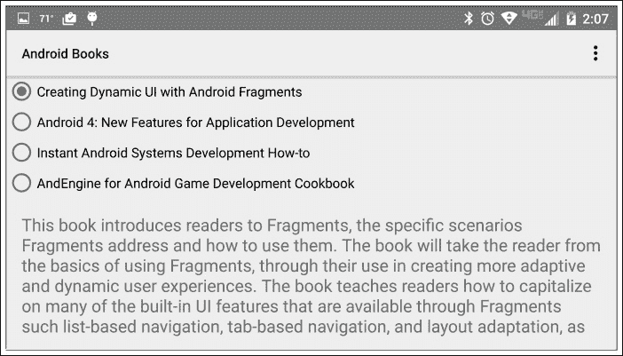
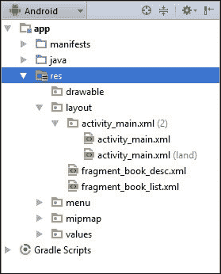
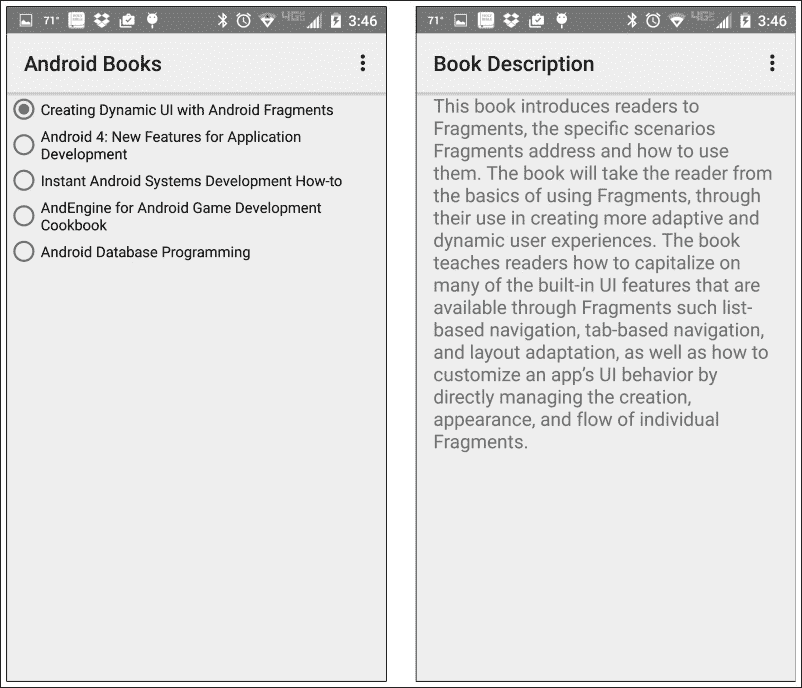

# 二、片段和用户界面灵活性

本章基于前一章中介绍的概念，为解决器件布局中的具体差异提供了解决方案。本章解释了如何使用自适应活动布局定义来创建应用程序，这些应用程序会根据设备外形的差异自动重新排列用户界面。有了自适应活动布局定义，应用程序只需使用几个适当设计的片段就能够支持各种各样的设备。

在本章中，我们将涵盖以下主题:

*   简化支持设备差异的挑战
*   动态资源选择
*   协调片段内容
*   `FragmentManager`的作用
*   支持跨活动的片段

到本章结束时，我们将能够实现一个用户界面，该界面使用片段来自动适应设备布局的差异，并跨所涉及的片段协调用户操作。

# 创造用户界面的灵活性

在我们的用户界面设计中利用片段为创建更容易适应设备差异的应用程序提供了良好的基础，但是我们必须更进一步来创建真正灵活的用户界面。我们必须设计我们的应用程序，使得组成用户界面的片段可以根据应用程序当前运行的设备的特性轻松地重新排列。

为了实现这一点，我们必须遵循适当的技术来动态改变单个片段的布局，以响应当前设备的特性。一旦我们使用了这些技术，我们必须确保我们以这样一种方式实现我们的片段，即每个片段都可以有效地运行，而不依赖于可能影响活动中其他片段的行为甚至存在的布局变化。

## 动态片段布局选择

正如我们在上一节中提到的，创建灵活的 UI 需要活动中片段的布局和定位能够响应设备特性的差异而改变。我们可以在我们的应用程序中包含代码，以根据运行我们的应用程序的设备的外形来动态排列片段，但在大多数情况下，这样做不仅没有必要，而且也是不可取的。用户界面和应用程序代码之间的依赖性越深，维护和增强应用程序就越困难。尽管我们的用户界面和应用程序代码之间总会有一定程度的依赖关系，但我们希望将这种依赖关系最小化，而是尽可能多地在布局资源中进行用户界面布局相关的工作。

在我们的应用程序用户界面中构建灵活性的最简单方法是利用安卓资源系统的内置设备适应性。Android 允许我们为我们的应用程序设计不同的布局相关资源，每个资源都针对一组特定的设备特性进行了优化(并与之相关联)。在运行时，安卓资源系统负责为当前设备自动选择和加载适当的资源。虽然这个特性可以用来动态修改任何活动的布局，但是当与片段结合使用时，它特别有效。

要查看安卓资源选择的运行情况，让我们继续上一章的应用程序。您会记得，我们活动的布局在`activity_main.xml`资源文件中，看起来类似于这样:

```java
<LinearLayout
  android:orientation="vertical"
  android:layout_width="match_parent"
  android:layout_height="match_parent"
  xmlns:android="http://schemas.android.com/apk/res/android">

  <!-- List of Book Titles -->
  <fragment
    android:layout_width="match_parent"
    android:layout_height="0dp"
    android:layout_weight="1"
    android:name="com.jwhh.fragments.BookListFragment"
    android:id="@+id/fragmentTitles"/>

  <!-- Description of selected book -->
  <fragment
    android:layout_width="match_parent"
    android:layout_height="0dp"
    android:layout_weight="1"
    android:name="com.jwhh.fragments.BookDescFragment"
    android:id="@+id/fragmentDescription"/>
</LinearLayout>
```

这个布局将我们的片段`BookListFragment`和`BookDescFragment`堆叠在一起，一个在另一个之上。虽然这种布局在纵向垂直握持的智能手机上表现良好，但旋转手机使其横向水平握持会产生不太吸引人的外观，如下图所示:



目前的布局显然没有在这个方向上最好地利用可用的屏幕空间。当手机面向风景时，如果我们将两个片段并排放置，应用程序会看起来更好。

### 添加替代布局资源

我们可以通过创建一个新的活动布局资源文件来为我们的应用程序添加对替代布局的支持，其中片段被适当地排列。

要使用 Android Studio 创建新的资源文件，请执行以下步骤:

1.  在项目浏览器窗口中展开**应用程序**文件夹。
2.  展开 **src** 下的 **res** 文件夹。
3.  然后，右键单击 **res** 下的**布局**文件夹。
4.  选择**新建**。
5.  现在，选择**布局资源文件**打开**新建资源文件**对话框。
6.  将文件名输入为`activity_main.xml`(确保其拼写与现有的`activity_main.xml`资源文件完全相同)。
7.  接下来，在**可用限定词:**下突出显示**方向**，并点击 **> >** 按钮将其移动到**选定限定词:**。
8.  在**屏幕方向下选择**风景**:**

将出现**新建资源文件**对话框，如下图所示:


点击**确定** 按钮创建新的资源文件。

一旦创建了新的活动布局资源文件，项目资源管理器中的 **res** 文件夹将类似于下面的截图:



在截图中注意到名为 **activity_main.xml** 的文件夹出现在**布局**文件夹下。 **activity_main.xml** 文件夹包含两个`activity_main.xml`文件副本，您刚刚创建的文件旁边有`(land)`文本，表示布局资源是与横向屏幕方向相关联的。看似位于名为 **activity_main.xml** 的单个文件夹中的`activity_main.xml`文件实际上有点像 Android Studio 的诡计。

如果您浏览显示在电脑文件系统中的布局文件夹，您会发现有两个与布局相关的文件夹:一个名为**布局**，另一个名为**布局-土地**。原始的`activity_main.xml`文件在**布局**文件夹中，新创建的面向景观的版本在**布局-土地**文件夹中。运行时，安卓设备依赖这些单独的文件夹，根据设备当前的方向来识别使用哪个版本的`activity_main.xml`文件。幸运的是，Android Studio 管理这些文件系统细节。作为开发人员，我们将简单地选择每个资源文件的具体方向，Android Studio 将负责文件系统的细节。

复制原`activity_main.xml`文件的内容，粘贴到`activity_main.xml (land)`文件中。我们现在可以修改`activity_main.xml (land)`资源文件来安排片段，以便在手机处于横向时正确渲染。首先，我们将`LinearLayout`元素从垂直方向切换到水平方向。然后，我们将每个片段的`layout_width`值更改为`0dp`，将`layout_height`值更改为`match_parent`。我们可以将每个片段的`layout_weight`值保留为`1`，以便`LinearLayout`将它们从左到右等距隔开。

更新后的资源文件如下所示:

```java
<LinearLayout
  android:orientation="horozontal"
  android:layout_width="match_parent"
  android:layout_height="match_parent"
  xmlns:android="http://schemas.android.com/apk/res/android">

  <!-- List of Book Titles -->
  <fragment
    android:layout_width="0dp"
    android:layout_height=" match_parent"
    android:layout_weight="1"
    android:name="com.jwhh.fragments.BookListFragment"
    android:id="@+id/fragmentTitles"/>

  <!-- Description of selected book -->
  <fragment
    android:layout_width="0dp"
    android:layout_height="match_parent"
    android:layout_weight="1"
    android:name="com.jwhh.fragments.BookDescFragment"
    android:id="@+id/fragmentDescription"/>
</LinearLayout>
```

除了将这个简单的资源文件添加到我们的项目中之外，该应用程序现在在横向设备上运行时，会一个接一个地显示标题列表和书籍描述，如下图所示:


在运行时，当`MainActivity`类加载`R.layout.activity_main`资源时，安卓资源系统返回该方向的`activity_main.xml`资源文件的适当版本。当用户将设备旋转到不同的方向时，安卓会自动重新创建活动，并为新方向加载适当的资源。

安卓环境检测到各种各样的设备外形特征。通过利用片段，我们能够创建一个应用程序，通过简单地提供不同的布局资源文件，这些文件在片段的位置上移动，就像它们是拼图块一样，从而轻松地适应设备差异。

如果没有片段，我们就必须在两个布局文件中为活动提供整个布局——单选按钮、文本视图和所有内容。然后，我们会发现自己不得不维护两个复杂的、几乎相同的文件。使用片段，各个片段是独立的，不重复的。片段以一种简单的方式修改布局，并简化我们应用程序的维护。

### 按屏幕大小管理片段布局

我们用于调整用户界面以适应设备方向差异的相同技术可以进一步用于处理屏幕尺寸的差异。

设备屏幕大小的差异是使用布局资源管理片段的最常见原因之一。在这种情况下，了解如何使用布局资源来处理屏幕大小的差异对于有效处理片段至关重要。

为了将资源与特定的屏幕尺寸特征相关联，我们使用资源屏幕尺寸限定符。屏幕尺寸限定符为我们提供了非常详细的控制级别，以控制哪些布局资源与每个设备外形相关联。

为了避免各种屏幕像素密度和物理屏幕尺寸固有的复杂性，安卓在管理屏幕尺寸时使用了一种标准化的度量单位，称为**密度无关像素** ( **dp** )。如果你已经在安卓系统上工作了很长时间，你可能已经熟悉了密度无关像素，因为在安卓用户界面中定位和调整视图时，它们是首选的度量单位。

dp 单位始终对应于 160 dpi 设备上像素的物理大小，因此提供了一个一致的测量单位，与设备的物理像素大小无关。例如，一台配备 7 英寸显示器的设备的物理像素计数可能为 1280x720，而另一台配备 7 英寸显示器的设备的物理像素计数为 1920x1080，但两台设备的 dp 计数都约为 1000x600。安卓平台负责设备的密度无关像素和物理像素之间的映射细节。

安卓提供了三种屏幕尺寸限定符:最小宽度、可用屏幕宽度和可用屏幕高度。它们可以解释如下:

*   **最小宽度屏幕尺寸限定符**:这对应于屏幕最窄点的设备无关像素数量，与设备方向无关。更改设备方向不会改变设备的最小宽度。在 Android Studio 中，我们通过在**新资源文件**对话框中选择**最小屏幕宽度**并将所需值输入到以 dp 单位表示的**最小屏幕宽度:**字段中，将资源文件与该限定符相关联。
*   **可用宽度屏幕尺寸限定符:**这对应于在设备当前方向从左到右测量的设备无关像素的数量。更改设备方向会更改可用宽度。在 Android Studio 中，我们通过在**新资源文件**对话框中选择**屏幕宽度**，并在**屏幕宽度:**字段中输入以 dp 单位表示的所需值，将资源文件与该限定符相关联。
*   **可用高度屏幕尺寸限定符**:这对应于从上到下测量的设备独立像素的数量，但在其他方面与可用宽度屏幕尺寸限定符的行为相同。在 Android Studio 中，我们通过在**新资源文件**对话框中选择**屏幕高度**，并在**屏幕高度:**字段中输入以 dp 单位表示的所需值，将资源文件与该限定符相关联。

### 消除冗余布局描述

随着我们的应用程序目标中形状因子数量的增长，管理具有不同布局资源限定符的资源文件可能会变得有些复杂，因为我们可能希望对不同的限定符使用相同的布局资源文件。为了演示这个问题，让我们更新我们的应用程序，以便我们当前用于面向风景的设备的活动布局也用于当前宽度为 600dp 或更大的设备。

更新我们的应用程序以使用 600dp 和更宽设备的横向布局的一个选择是将面向横向布局的资源文件`activity_main.xml (land)`的全部内容复制到与 600dp 的**屏幕宽度**限定符相关联的新的`activity_main.xml`布局资源文件。对整个景观布局资源文件内容做一个简单的拷贝是很容易的，但是这样做给我们留下了一个维护上的麻烦。布局细节复制在两个不同版本的`activity_main.xml`文件中，每次我们对布局进行更改时，我们都必须确保在两个版本的`activity_main.xml`中进行更改。

为了避免这种资源布局重复，我们可以使用布局别名。

#### 布局混叠

布局别名允许我们拥有每个唯一布局描述的单一副本。然后，我们可以告诉资源系统将该资源描述的内容包含在与我们想要使用该布局的资源限定符相关联的资源文件中。

要开始，请执行以下步骤:

1.  使用**新资源文件**对话框创建名为`activity_main_wide.xml`的新资源文件。不要将任何限定符与`activity_main_wide.xml`相关联。
2.  将`activity_main.xml (land)`的内容复制到`activity_main_wide.xml`文件中。
3.  删除`activity_main.xml (land)`的内容。
4.  然后，在`activity_main.xml (land)`中添加以下代码:

    ```java
    <merge>
      <include layout="@layout/activity_main_wide"/>
    </merge>
    ```

前面的代码告诉资源系统在处理`activity_main.xml (land)`时包含`activity_main_wide.xml`的内容。

我们现在将为宽度为 600dp 或更大的设备创建布局资源文件。要创建文件，请执行以下步骤:

1.  打开 Android Studio**新资源文件**对话框。命名文件`activity_main.xml`(确保拼写与现有的两个`activity_main.xml`资源文件完全相同)。
2.  选择**屏幕宽度**限定符。
3.  现在，输入`600`作为**屏幕宽度:**值。
4.  点击**确定**按钮。

您现在应该会在 Android Studio 项目浏览器的 **activity_main.xml** 文件夹下看到`activity_main.xml (w600dp)`文件，如下图所示:


### 注

在某些情况下，Android Studio 不会立即在项目浏览器中显示新创建的资源文件。如果在 **activity_main.xml** 文件夹下没有看到`activity_main.xml (w600dp)`文件，请折叠**布局**和 **res** 文件夹。当您展开 **res** 、**布局**和 **activity_main.xml** 文件夹时，新创建的资源文件将可见。

将以下代码添加到`activity_main.xml (w600dp)`文件中:

```java
<merge>
  <include layout="@layout/activity_main_wide"/>
</merge>
```

前面的代码与我们之前添加到`activity_main.xml (land)`文件中的代码相同。就像在`activity_main.xml (land)`文件的情况下一样，该代码使资源系统在处理`activity_main.xml (w600dp)`文件时包含`activity_main_wide.xml`文件的内容。

使用这种资源混叠技术，我们现在有一个单一的布局描述被应用到每一个想要的形状因素，没有不必要的布局资源文件的重复。 `activity_main_wide.xml`文件为布局描述提供了`activity_main.xml (land)`和`activity_main.xml (w600dp)`文件，将`activity_main_wide.xml`的内容作为安卓资源构建过程的一部分。

### 注

安卓*提供资源*指南的*表 2* 中，安卓在执行布局混叠时遵循的优先顺序；这可以在[http://developer . Android . com/guide/topics/resources/provider-resources . html](http://developer.android.com/guide/topics/resources/providing-resources.html)上找到。

## 设计灵活的片段

随着我们的用户界面被很好地划分和适应，我们需要确保每个片段都有效地运行，因为布局差异会导致行为，甚至可能导致活动中其他片段的存在发生变化。当一个应用程序用户界面被分割成多个片段时，这些片段很少完全独立存在。通常，用户与一个片段的交互会对同一活动中的其他片段产生一些影响。在我们应用程序的案例中，当用户在`BookListFragment`内选择一本书时，就会出现这个问题。响应用户的选择，应用程序负责在`BookDescFragment`中显示相应的描述。

### 避免紧密耦合

协调片段内容的一种可能的解决方案是允许片段彼此直接通信。为了协调应用程序中的内容，我们可以在第一次创建活动时将`BookDescFragment`引用传递到`BookListFragment`中。响应于在`BookListFragment`内的每个用户选择，`BookListFragment`将直接更新包含在`BookDescFragment`内的`TextView`。

虽然实现起来很简单，但是这个解决方案是有问题的，因为它将两个`Fragment`类紧密地耦合在一起。`BookListFragment`片段只能在同样包含`BookDescFragment`片段的活动中使用，更改`BookDescFragment`的布局可能会破坏`BookListFragment`。

我们总是想记住，使用片段的关键目标是被很好地划分和适应。

### 提取片段关系

我们可以利用接口提供的抽象，而不是在片段之间创建直接的关系。通过定义一个简单的回调接口来表示用户进行选书的动作，我们可以完全消除片段之间的紧密耦合。可以编写`BookListFragment`类，通过界面通知用户的选择。通过在活动上实现接口，活动可以通过更新在`BookDeskFragment`内显示的描述来处理在`BookListFragment`内协调用户选择。

当使用 Android Studio**新安卓活动**对话框创建新片段时，该对话框包括一个标记为**的选项包括界面回调？**。选择此选项会自动定义并连接一个基本接口，以便与包含的活动进行通信。当我们转换一个现有片段而不是创建一个新片段时，我们需要自己定义接口并将其连接到活动。

#### 定义回调接口

`callback`界面应包括与片段进行任何交互的方法，这些方法可能对包含该片段的活动有意义。同时，界面不要让给活动增加不必要的细节负担。界面应该关注应用程序级的操作，比如选择一本书，而不是实现级的操作，比如点击单选按钮。实现级别的细节应该隔离在片段中。我们还应该确保在设计界面时，对活动将如何处理通知没有任何先入为主的想法。

在`BookListFragment`的情况下，活动唯一感兴趣的动作是用户选择一本书。这告诉我们接口只需要一个方法；我们就称之为接口方法`onSelectedBookChanged`。我们知道，在这个应用程序的情况下，目标是显示所选的书籍描述，因此一种可能性是让`onSelectedBookChanged`方法包含书籍描述的参数。传递书籍描述的问题在于，这样做会将`BookListFragment`的使用限制在只有一个用例:显示书籍描述。相反，通过传递书籍的标识符，`BookListFragment`可用于用户选择书籍的任何用例。为简单起见，在我们的示例中，我们将使用数组索引作为标识符；在真实的场景中，标识符更有可能是在数据存储或服务中定位图书信息的密钥。

我们将称我们的新界面为`OnSelectedBookChangeListener`。界面如下所示:

```java
public interface OnSelectedBookChangeListener {
  void onSelectedBookChanged(int bookIndex);
}
```

#### 使片段独立

`BookListFragment`类需要隐藏用户选择的细节，而是将每个选择翻译成一个图书标识符，在我们的例子中是一个数组索引。我们首先需要更新 `BookListFragment`类，通过实现`RadioGroup.OnCheckedChangeListener`界面来处理单选按钮的选择，如下所示:

```java
public class BookListFragment extends Fragment
  implements RadioGroup.OnCheckedChangeListener {
  @Override
  public void onCheckedChanged(RadioGroup radioGroup, int id) {
  }
  // Other members elided for clarity
}
```

在`BookListFragment`类的`onCreateView`方法中，我们将广播组的点击收听者设置为`BookListFragment`类，如下所示:

```java
public View onCreateView(LayoutInflater inflater,
  ViewGroup container, Bundle savedInstanceState) {
  View viewHierarchy = inflater.inflate(
    R.layout.fragment_book_list, container, false);

  // Connect the listener to the radio group
  RadioGroup group = (RadioGroup)
  viewHierarchy.findViewById(R.id.bookSelectGroup);
  group.setOnCheckedChangeListener(this);

  return viewHierarchy;
}
```

有许多方法可以确定与所选单选按钮对应的图书索引，例如设置每个单选按钮上的标签值或使用查找表。为了简单起见，我们将创建一个包含`switch`语句的简单方法，如以下代码所示:

```java
int translateIdToIndex(int id) {
  int index = -1;
  switch (id) {
    case R.id.dynamicUiBook:
      index = 0 ;
      break;
    case R.id.android4NewBook:
      index = 1 ;
      break;
    case R.id.androidSysDevBook:
      index = 2 ;
      break;
    case R.id.androidEngineBook:
      index = 3 ;
      break;
    case R.id.androidDbProgBook:
      index = 4 ;
      break;
  }
  return index;
}
```

#### 片段通知

片段始终可以使用`getActivity`方法访问它所在的活动。在`BookListFragment`类的`onClick`方法中，我们可以使用`getActivity`方法来访问活动，将其投射到`OnSelectedBookChangeListener`界面，然后调用`onSelectedBookChanged`方法，并将其传递给所选单选按钮的图书索引，如下代码所示:

```java
public void onCheckedChanged(RadioGroup radioGroup, int checkedId) {
  // Translate radio button to book index
  int bookIndex = translateIdToIndex(checkedId);

  // Get parent Activity and send notification
  OnSelectedBookChangeListener listener =
    (OnSelectedBookChangeListener) getActivity();
  listener.onSelectedBookChanged(bookIndex);
}
```

`BookListFragment`类现在完全处理通知父活动用户图书选择的每个变化。

### 封装片段操作

在`BookDescFragment`类中，我们希望封装关于用户界面如何更新的任何细节。我们将通过提供一个简单的方法来做到这一点，该方法接受书籍索引，处理定位和显示书籍描述的细节。在实现这个方法之前，我们需要更新`BookDescFragment`类的`onCreateView`方法来检索图书描述列表，检索对`R.id.bookDescription`标识的`TextView`的引用，并将两者分配给类级字段，如下所示:

```java
public class BookDescFragment extends Fragment {
  String[] mBookDescriptions;
  TextView mBookDescriptionTextView;
  @Override
  public View onCreateView(LayoutInflater inflater,
    ViewGroup container, Bundle savedInstanceState) {
    View viewHierarchy = inflater.inflate(
      R.layout.fragment_book_desc, container, false);

    // Load array of book descriptions
    mBookDescriptions = getResources().
      getStringArray(R.array.book_descriptions);

    // Get reference to book description text view
    mBookDescriptionTextView = (TextView)
      viewHierarchy.findViewById(R.id.bookDescription);

    return viewHierarchy;
  }
}
```

我们现在可以添加一个`setBook`方法，该方法接受书籍索引，访问适当的书籍描述，并更新`mBookDescriptionTextView`。`setBook`方法如下所示:

```java
public void setBook(int bookIndex) {
  // Lookup the book description
  String bookDescription = mBookDescriptions[bookIndex];

  // Display it
  mBookDescriptionTextView.setText(bookDescription);
}
```

### 在片段之间创建松散连接的关系

接口和封装的良好使用大大简化了任何组件的使用，片段也没有什么不同。有了我们在`BookListFragment`和`BookDescFragment`类上所做的工作，我们的活动现在可以通过三个简单的步骤更新`BookDescFragment`来协调`BookListFragment`中的用户交互，如下所示:

1.  实现`OnSelectedBookChangeListener`界面。
2.  获取对`BookDescFragment`类的引用。
3.  调用`BookDescFragment`类的`setBook`方法。

让我们先看第 2 步。与使用视图不同，活动不能直接引用其中包含的片段。相反，片段处理被委托给`FragmentManager`类。

通过`FragmentManager`，活动可以通过调用`FragmentManager.findFragmentById`方法并从布局资源传递所需片段的标识值来访问包含的片段。

使用`FragmentManager`访问`BookDescFragment`，我们可以在活动中实现`BookListFragment.OnSelectedBookChangeListener`界面，更新`BookListFragment`中每个用户选择的显示描述。看看下面的代码:

```java
public class MainActivity extends AppCompatActivity
  implements OnSelectedBookChangeListener{
  @Override
  public void onSelectedBookChanged(int bookIndex) {
    // Access the FragmentManager
    FragmentManager fragmentManager = getFragmentManager();
    // Get the book description fragment
    BookDescFragment bookDescFragment = (BookDescFragment)
      fragmentManager.findFragmentById (R.id.fragmentDescription);

    // Display the book title
    if(bookDescFragment != null)
      bookDescFragment.setBook(bookIndex);
  }

  // other members elided for clarity
}
```

# 片段可以抵御意外

用户界面灵活性的真正测试在于当遇到意外的变更请求时，用户界面的设计和实现表现如何。一个设计良好的基于片段的用户界面允许我们创建难以置信的动态用户界面，这些界面可以在对代码影响最小的情况下发展和变化。作为一个例子，让我们对我们的应用程序进行一个潜在的重大设计变更。

目前，应用程序总是显示同一活动的图书列表和描述。唯一的区别是片段是相对于彼此垂直定位还是水平定位。想象一下，我们从用户那里收到反馈，说他们不喜欢在纵向手机上查看应用程序时的外观，列表位于描述上方。当在面向肖像的手机上查看时，他们希望列表和描述出现在单独的活动中。在所有其他情况下，他们希望应用程序继续并排显示列表和描述。

## 创建图书描述活动

要显示书籍描述，请使用 Android Studio**新安卓活动**对话框添加一个名为`BookDescActivity`的空白活动，该活动使用名为`activity_book_desc.xml`的布局资源文件。复制`activity_main.xml`文件默认版本的内容，粘贴到`activity_book_desc.xml`文件中。`activity_main.xml`文件的默认版本是在 Android Studio 项目浏览器中名称后面没有`(land)`或`(w600dp)`的版本。

从`activity_book_desc.xml`文件中删除`BookListFragment`的片段元素，使其仅显示`BookDescFragment`，如以下代码所示:

```java
<LinearLayout
  xmlns:tools="http://schemas.android.com/tools"
  android:orientation="vertical"
  android:layout_width="match_parent"
  android:layout_height="match_parent"
  xmlns:android="http://schemas.android.com/apk/res/android">

  <!--  Description of selected book  -->
  <fragment
    android:layout_width="match_parent"
    android:layout_height="0dp"
    android:layout_weight="1"
    android:name="com.jwhh.fragments_after.BookDescFragment"
    android:id="@+id/fragmentDescription"
    tools:layout="@layout/fragment_book_desc"/>
</LinearLayout>
```

在`activity_main.xml`资源文件的默认版本中，删除`BookDescFragment`，使其仅显示列表，如以下代码所示:

```java
<LinearLayout
  xmlns:tools="http://schemas.android.com/tools"
  android:orientation="vertical"
  android:layout_width="match_parent"
  android:layout_height="match_parent"
  xmlns:android="http://schemas.android.com/apk/res/android">

  <!--    List of Book Titles  -->
  <fragment
    android:layout_width="match_parent"
    android:layout_height="0dp"
    android:layout_weight="1"
    android:name="com.jwhh.fragments_after.BookListFragment"
    android:id="@+id/fragmentTitles"
    tools:layout="@layout/fragment_book_list"/>
</LinearLayout>
```

我们现在有支持分别显示列表和描述的活动。请记住，在使用`activity_main_wide.xml`资源文件的场景中，这些更改不会影响应用程序的外观。

## 为图书描述活动添加功能

`BookDescActivity`依靠“额外意图”通过图书索引。由于`BookDescFragment`包含显示图书描述所需的所有逻辑，我们可以简单地获取对`BookDescFragment`的引用，并像在`MainActivity`类中一样设置图书索引，如下所示:

```java
public class BookDescActivity extends AppCompatActivity {
  @Override
  protected void onCreate(Bundle savedInstanceState) {
    super.onCreate(savedInstanceState);
    setContentView(R.layout.activity_book_desc);

    // Retrieve the book index from the Activity Intent
    Intent intent = getIntent();
    int bookIndex = intent.getIntExtra("bookIndex", -1);
    if (bookIndex != -1) {
      // Use FragmentManager to access BookDescFragment
      FragmentManager fm = getFragmentManager();
      BookDescFragment bookDescFragment = (BookDescFragment)
        fm.findFragmentById(R.id.fragmentDescription);

      // Display the book title
      bookDescFragment.setBook(bookIndex);
    }
  }
}
```

## 使主活动类具有适应性

`MainActivity`类现在有一些额外的工作要做，因为其中包含的特定片段各不相同。当运行在屏幕至少 600dp 宽的设备上时，`MainActivity`类总是包含一个`BookDescFragment`的实例。另一方面，当在其他设备上运行时，`BookDescFragment`的存在将取决于设备的当前方向。我们可以向`MainActivity`类添加代码来测试所有这些不同的场景，或者我们可以采取更简单的方法，即检查活动是否包含`BookDescFragment`类的实例。

使用这种方法，我们有`MainActivity`类的`onSelectedBookChanged`方法来检查`FragmentManager`返回的`BookDescFragment`的有效性。如果`FragmentManager`返回一个有效的引用，该方法可以直接在`BookDescFragment`上调用`setBook`。如果返回的引用无效，`onSelectedBookChanged`方法调用`startActivity`，并带有一个包含信息的`Intent`实例来显示`BookDescActivity`，其中包含`bookIndex`作为额外的信息，如下代码所示:

```java
public void onSelectedBookChanged(int bookIndex) {
  // Access the FragmentManager
  FragmentManager fm = getFragmentManager();

  // Get the book description fragment
  BookDescFragment bookDescFragment = (BookDescFragment)
    fm.findFragmentById(R.id.fragmentDescription);

  // Check validity of fragment reference
  if(bookDescFragment == null || !bookDescFragment.isVisible()){
    // Use activity to display description
    if(!mCreating) {
      Intent intent = new Intent(this, BookDescActivity.class);
      intent.putExtra("bookIndex", bookIndex);
      startActivity(intent);
    }
  }
  else {
    // Use contained fragment to display description
    bookDescFragment.setBook(bookIndex);
  }
}
```

注意检查`bookDescFragment`有效性的`if`语句。在大多数情况下，我们只需要简单地检查一下引用是否是`null`。一个例外是，当应用程序在手持设备上运行时，用户以横向方式查看应用程序，然后将设备旋转到纵向。在这种情况下，`BookDescFragment`实例不可见，但是活动的`FragmentManager`实例可能正在缓存对景观布局中剩余的不可见实例的引用。为此，我们将检查空引用和可见性。在接下来的两章中，我们将讨论片段生命周期、创建和缓存的细节。

还要注意检查`mCreating`字段值的`if`语句。当设备在不同方向之间旋转时，安卓会完全重新创建活动实例。作为这个过程的一部分，安卓恢复用户的单选按钮选择，然后调用`onSelectedBookChanged`方法。我们将包括这个`if`检查，以便不处理活动创建期间发生的调用。

为了管理`mCreating`字段的值，我们将使用初始值`false`进行声明，然后在`MainActivity`类的`onResume`方法中将其设置为`true`，如下代码所示:

```java
public class MainActivity extends Activity
  implements OnSelectedBookChangeListener{
  boolean mCreating = true;
  @Override
  protected void onResume() {
    super.onResume();
    mCreating = false;
  }
  // other members elided for clarity
}
```

我们现在在应用程序中内置了适应性。使用`activity_main_wide.xml`资源文件的场景看起来像往常一样。在面向肖像的手机设备上，我们的应用程序为用户界面提供了两个独立的活动:一个用于图书列表，一个用于图书描述。该应用程序现在出现在面向人像的手持设备上，如下所示:



# 总结

片段为我们的应用程序提供了某种程度的用户界面灵活性，否则很难实现。通过适当地设计我们的应用程序来使用片段，并将片段资源与适当的设备特性相关联，我们能够构建包含丰富用户界面的应用程序，该界面可以自动适应现有的各种安卓设备外形。我们获得了所有这些功能，同时只编写了最少的代码。

在下一章中，我们将深入片段的生命周期，并探索如何利用片段生命周期来创建更具响应性的用户界面，以及如何利用专门的`Fragment`类。