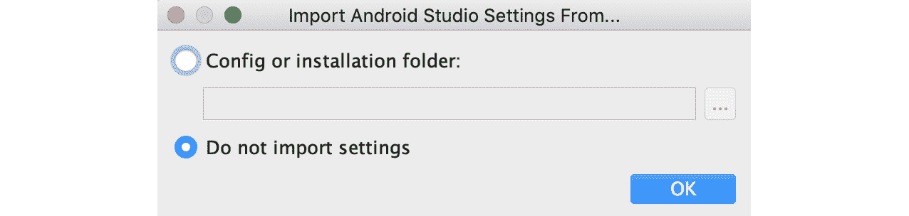
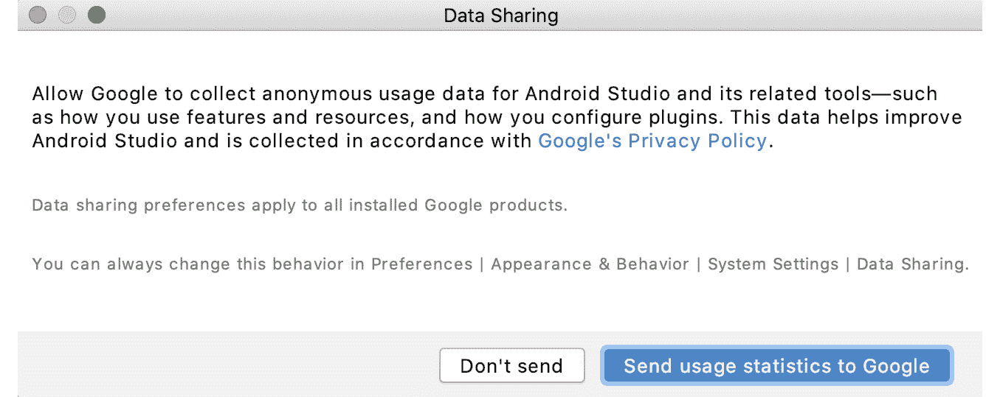
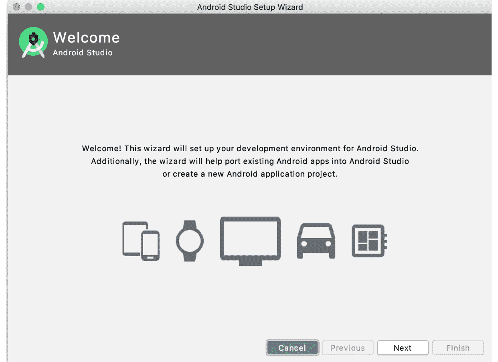
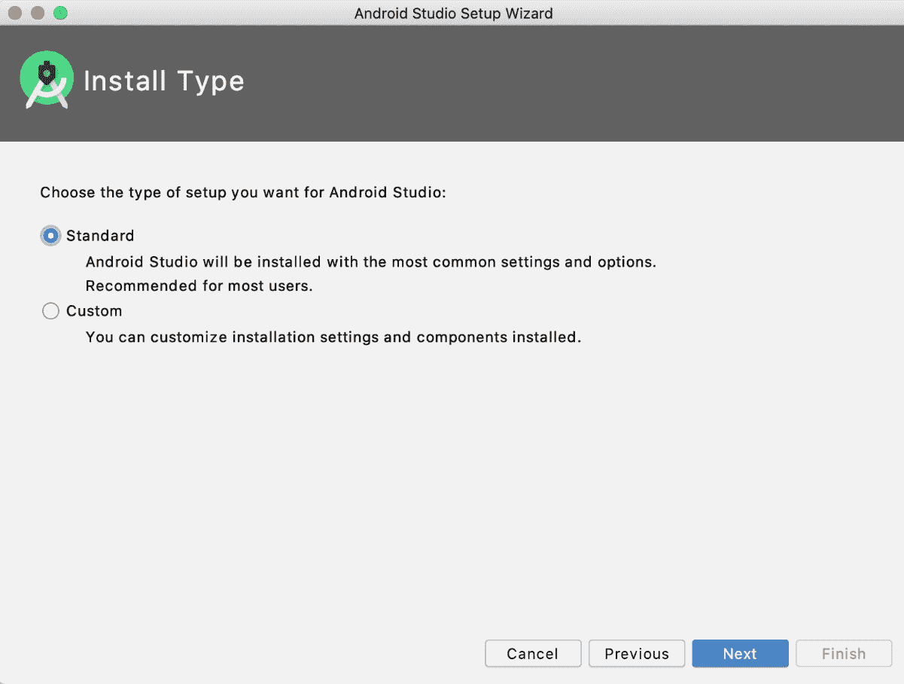
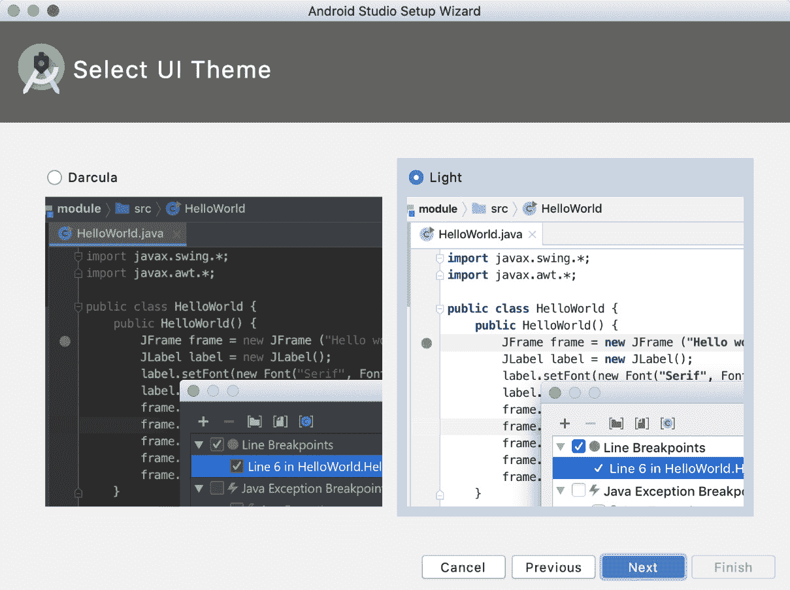
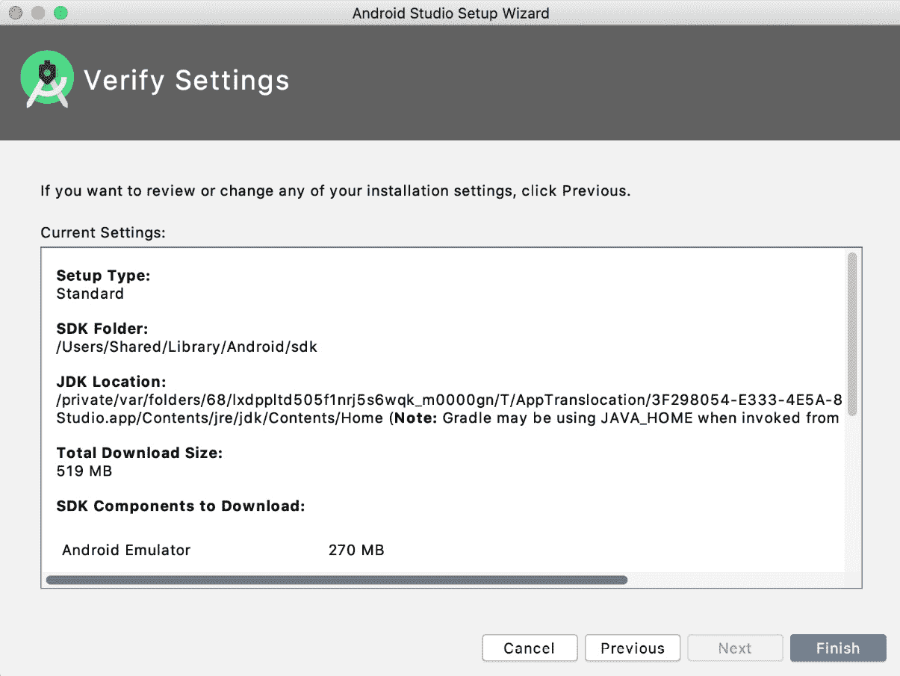

# 前言

# 关于这本书

在过去的十年里，安卓一直统治着应用市场，开发者越来越希望开始构建自己的安卓应用。*如何用 Kotlin 构建 Android Apps】从 Android 开发的构建模块开始，教你如何使用 Android 的集成开发环境(IDE)Android Studio，用编程语言 Kotlin 进行应用开发。然后，您将通过指导练习学习如何创建应用并在虚拟设备上运行它们。您将学习安卓开发的基础知识，从构建应用到用活动和片段以及各种导航模式构建用户界面。随着章节的进行，您将深入研究安卓的 RecyclerView，以充分利用显示的数据列表，并适应从网络服务获取数据和处理图像。然后，在处理通知和如何保存数据之前，您将了解映射、位置服务和权限模型。继续，您将掌握测试，覆盖测试金字塔的全部范围。您还将学习如何使用 AAC(安卓架构组件)来清晰地构建您的代码，并探索各种架构模式和依赖注入的好处。异步编程涵盖了 RxJava 和 Coroutines 的核心库。然后焦点回到用户界面，演示当用户与你的应用交互时如何添加动作和过渡。最后，你将构建一个有趣的应用，从电影数据库中检索和显示热门电影，然后看看如何在谷歌游戏上发布你的应用。到本书结束时，您将拥有使用 Kotlin 构建成熟的安卓应用所需的技能和信心。*

## 关于作者

*Alex Forrester* 是一位经验丰富的软件开发人员，在移动、web 开发和内容管理系统方面拥有超过 20 年的经验。他已经与安卓合作了 8 年多，为天空、汽车协会、汇丰银行、探索频道和 O2 等多个行业的蓝筹股公司创建旗舰应用。亚历克斯和他的妻子和女儿住在赫特福德郡。当他没有发育的时候，他喜欢橄榄球和在奇尔特恩山跑步。

*Eran Boudjnah* 是一家在开发桌面应用、网站、互动景点和移动应用方面拥有 20 多年经验的开发人员。他已经与安卓合作了大约 7 年，为从初创公司(JustEat)到大型公司(Sky)和企业集团等广泛的客户开发应用并领导移动团队。他对棋盘游戏充满热情(拥有数百款游戏的适度收藏)，并拥有令他颇为自豪的变形金刚系列。艾伦和他的妻子莉娅住在伦敦北部。

*alexandreu Dumbravan*2011 年开始安卓开发，在一家数字机构工作。2016 年，他搬到了伦敦，主要在 FinTech 部门工作。在他的职业生涯中，他有机会在安卓设备上分析和集成许多不同的技术，从著名的应用(如脸书登录)到不太知名的技术(如专有网络协议)。

*若马尔 Tigcal* 是一家拥有超过 10 年移动和软件开发经验的安卓开发者。他曾为小型初创公司和大公司从事过不同阶段的应用开发工作。若马尔还就安卓系统进行了演讲、培训和研讨会。闲暇时，他喜欢跑步和阅读。他和妻子席琳住在加拿大温哥华。

## 观众

如果你想用 Kotlin 构建自己的安卓应用，但不确定如何开始，那么这本书就是为你准备的。对 Kotlin 编程语言的基本理解将帮助您更快地掌握本书涵盖的主题。

## 关于章节

*第一章**打造你的第一款应用*，展示如何使用AndroidStudio打造你的第一款安卓应用。在这里，您将创建一个AndroidStudio项目，了解它是由什么组成的，并探索在虚拟设备上构建和部署应用所需的工具。您还将了解安卓应用的结构。

*第二章*、*构建用户屏幕流*，深入安卓生态系统和安卓应用的构建模块。将介绍活动及其生命周期、意图和任务等概念，以及恢复状态和在屏幕或活动之间传递数据。

*第 3 章*、*用片段*开发 UI，教你在安卓应用的用户界面中使用片段的基本原理。您将学习如何以多种方式使用片段来构建手机和平板电脑的应用布局，包括使用 Jetpack 导航组件。

*第 4 章**构建 App 导航*，在一个应用中经历不同类型的导航。您将了解带有滑动布局、底部导航和选项卡式导航的导航抽屉。

*第 5 章，基本库:改装、Moshi 和 Glide* ，让您深入了解如何构建应用，通过使用改装库和 Moshi 库将数据转换为 Kotlin 对象，从远程数据源获取数据。您还将了解将远程图像加载到您的应用中的 Glide 库。

*第 6 章，recycle view*，介绍了在 recycle view 小部件的帮助下构建列表并显示列表的概念。

*第 7 章*、*安卓权限和谷歌地图*，介绍了权限的概念以及如何向用户请求权限，以便您的应用执行特定任务，并向您介绍了地图应用编程接口。

*第 8 章*、*服务、工作管理器和通知*详细介绍了安卓应用中后台工作的概念，以及如何让应用以用户不可见的方式执行某些任务，以及如何显示这项工作的通知。

*第 9 章*、*JUnit、Mockito 和 Espresso* 的单元测试和集成测试，教你一个 Android 应用的不同类型的测试，每种类型的测试使用什么框架，以及测试驱动开发的概念。

*第 10 章*、*安卓架构组件*深入分析了安卓 Jetpack 库中的组件，例如帮助您构建代码的 LiveData 和 ViewModel，以及允许您将设备上的数据保存在数据库中的 Room。

*第 11 章*、*持久化数据*，向您展示了在设备上存储数据的各种方法，从共享引用到文件。还将引入存储库概念，让您了解如何在不同的层中构建您的应用。

*第 12 章*、*使用 Dagger 和 Koin* 进行依赖注入，解释依赖注入的概念以及它给应用带来的好处。引入了像 Dagger 和 Koin 这样的框架来帮助您管理依赖关系。

*第十三章*、 *RxJava 和 Coroutines* ，介绍如何用 RxJava 和 Coroutines 做后台操作和数据操作。您还将了解如何使用 RxJava 运算符和 LiveData 转换来操作和显示数据。

*第 14 章*、*架构模式*，解释了您可以用来构建您的安卓项目的架构模式，以将它们分成具有不同功能的不同组件。这些使您更容易开发、测试和维护代码。

*第 15 章*、*带有坐标布局和运动布局的动画和过渡*，讨论了如何通过带有坐标布局和运动布局的动画和过渡来增强您的应用。

*第 16 章*、*在 Google Play 上发布你的应用*本书的结尾向你展示了如何在 Google Play 上发布你的应用:从准备发布，到创建 Google Play 开发者帐户，再到最终发布你的应用。

## 约定

文本中的码字、数据库表名、文件夹名、文件名、文件扩展名、路径名、虚拟网址、用户输入和推特句柄如下所示:

“可以在主项目窗口`MyApplication` | `app` | `src` | `main`下找到。”

代码块设置如下:

```kt
<resources>
    <string name="app_name">My Application</string>
</resources>
```

在某些情况下，重要的代码行会被突出显示。这些案例介绍如下:

```kt
<?xml version="1.0" encoding="utf-8"?>
<resources>
 <string name="app_name">My Application</string>
 <string name="first_name_text">First name:</string>
 <string name="last_name_text">Last name:</string>
</resources>
```

你在屏幕上看到的单词，例如菜单或对话框中的单词，也会出现在这样的文本中:“点击`Finish`，你的虚拟设备就会被创建。”

新的术语和重要词汇是这样显示的:“它是安卓开发的官方**集成开发环境** ( **IDE** )，建立在 JetBrains 的 **IntelliJ IDEA 软件**上，由谷歌的AndroidStudio团队开发。"

## 开始之前

每一次伟大的旅程都是从一小步开始的。在我们能够在安卓系统中做令人敬畏的事情之前，我们需要准备好一个高效的环境。在本节中，我们将看到如何做到这一点。

## 最低硬件要求

为了获得最佳的学习体验，我们推荐以下硬件配置:

*   处理器:英特尔酷睿 i5 或同等或更高版本
*   内存:最小 4 GB 内存；建议使用 8 GB 内存
*   存储:4 GB 可用空间

## 软件需求

您还需要提前安装以下软件:

*   操作系统:Windows 7 SP1 64 位、Windows 8.1 64 位或 Windows 10 64 位、macOS 或 Linux
*   AndroidStudio 4.1 或更高版本

## 安装和设置

在开始阅读这本书之前，您需要安装AndroidStudio 4.1(或更高版本)，这是您将在各章中使用的主要工具。你可以从[https://developer.android.com/studio](00.html)下载AndroidStudio。

在苹果电脑上，启动 DMG 文件，将AndroidStudio拖放到`Applications`文件夹中。完成后，打开AndroidStudio。在 Windows 上，启动 EXE 文件。如果您使用的是 Linux，请将 ZIP 文件解压到您喜欢的位置。打开终端，导航至`android-studio/bin/`目录，执行`studio.sh`。如果您看到一个`Import Settings`对话框弹出，选择`Do not import settings`并点击`OK`按钮(这通常发生在以前安装AndroidStudio时):



图 0.1:导入设置对话框

接下来会弹出`Data Sharing`对话框；点击`Don't send`按钮，禁止向谷歌发送匿名使用数据:



图 0.2:数据共享对话框

在`Welcome`对话框中，点击`Next`按钮开始设置:



图 0.3:欢迎对话框

在`Install Type`对话框中，选择`Standard`安装推荐设置。然后，点击`Next`按钮:



图 0.4:安装类型对话框

在`Select UI Theme`对话框中，选择您喜欢的 IDE 主题—或者`Light`或者`Dracula`(深色主题)—然后点击`Next`按钮:



图 0.5:选择用户界面主题对话框

在`Verify Settings`对话框中，查看您的设置，然后单击`Finish`按钮。安装向导下载并安装附加组件，包括安卓软件开发工具包:



图 0.6:验证设置对话框

下载完成后，可以点击`Finish`按钮。您现在可以创建您的安卓项目了。

## 安装代码包

您可以通过[https://GitHub . com/packt publishing/How-Build-Android-Apps-with-Kotlin](00.html)从 GitHub 下载代码文件和活动解决方案。有关完整的代码包，请参考这些代码文件。

## 取得联系

我们随时欢迎读者的反馈。

**综合反馈**:如果您对本书有任何疑问，请在留言主题中提及书名，并在`customercare@packtpub.com`给我们发邮件。

**勘误表**:虽然我们已经尽了最大的努力来保证内容的准确性，但是错误还是会发生。如果你在这本书里发现了错误，如果你能向我们报告，我们将不胜感激。请访问[www.packtpub.com/support/errata](00.html)并填写表格。

**盗版**:如果您在互联网上遇到任何形式的我们作品的非法拷贝，如果您能提供我们的位置地址或网站名称，我们将不胜感激。请通过`copyright@packt.com`联系我们，并提供材质链接。

**如果你有兴趣成为一名作者**:如果有一个你有专长的话题，你有兴趣写或者投稿一本书，请访问[authors.packtpub.com](00.html)。

## 请留下评论

在亚马逊上留下详细、公正的评论，让我们知道你的想法。我们感谢所有反馈，这有助于我们继续生产优秀的产品，并帮助有抱负的开发人员提高技能。请抽出几分钟时间发表您的想法，这对我们有很大影响。