# 三、用片段开发用户界面

概观

本章涵盖片段和片段生命周期。它演示了如何使用它们来构建高效和动态的布局，以响应不同的屏幕大小和配置，并允许您将用户界面分成不同的部分。到本章结束时，您将能够创建静态和动态片段，在片段和活动之间传递数据，并使用 Jetpack Navigation 组件详细说明片段如何组合在一起。

# 简介

在前一章中，我们探索了安卓**活动生命周期**，并研究了如何在应用中使用它在屏幕之间导航。我们还分析了各种类型的启动模式，这些模式定义了屏幕之间的转换是如何发生的。在本章中，您将探索**碎片**。片段是安卓活动的一部分，顾名思义，就是片段。

在这一章中，您将学习如何使用片段，了解它们如何存在于多个活动中，并发现如何在一个活动中使用多个片段。您将从向活动添加简单的片段开始，然后开始学习静态片段和动态片段之间的区别。碎片可用于简化使用双窗格布局为具有更大外形的安卓平板电脑创建布局。例如，如果您有一个中等大小的电话屏幕，并且您想要包含一个新闻报道列表，您可能只有足够的空间来显示该列表。如果您在平板电脑上查看相同的故事列表，您将有更多的可用空间，这样您就可以在列表右侧显示相同的列表和故事本身。屏幕的每个不同区域都可以使用一个片段。然后，您可以在手机和平板电脑上使用相同的片段。您可以从重用和简化布局中受益，并且不必重复创建类似的功能。

一旦你探索了片段是如何被创建和使用的，你将学习如何用片段组织你的用户旅程。您将应用一些以这种方式使用片段的既定实践。最后，您将学习如何通过使用 Android Jetpack 导航组件创建导航图来简化片段的使用，该组件允许您指定将片段与目的地链接在一起。

让我们从片段生命周期开始。

# 碎片生命周期

片段是一个有自己生命周期的组件。理解**片段生命周期**至关重要，因为它在片段创建、运行状态和销毁的某些阶段提供回调，您可以在这些阶段配置初始化、显示和清理。片段在活动中运行，片段的生命周期绑定到活动的生命周期。

在许多方面，片段生命周期与活动生命周期非常相似，乍一看，前者似乎复制了后者。片段生命周期中相同或相似的回调和活动生命周期中相同或相似的回调一样多，例如`onCreate(savedInstanceState: Bundle?)`。

片段生命周期与活动生命周期相关联，因此无论在哪里使用片段，片段回调都与活动回调交织在一起。

注意

官方文件中说明了片段和活动之间交互的完整顺序:[https://developer.android.com/guide/fragments/lifecycle](https://developer.android.com/guide/fragments/lifecycle)

通过相同的步骤来初始化片段，并准备在用户可以与之交互之前将其显示给用户。当应用被后台化、隐藏和退出时，活动经历的同样的拆卸步骤也发生在片段上。像活动一样，片段必须从父类`Fragment`扩展/派生，您可以根据您的用例选择覆盖哪些回调。现在让我们来探究一下这些回调、它们出现的顺序以及它们的作用。

## 月饼

`override fun onAttach(context: Context)`:这是你的片段链接到它所使用的活动的点。它允许您引用活动，尽管在这个阶段，片段和活动都没有完全创建。

## onCreate

`override fun onCreate(savedInstanceState: Bundle?)`:这是你初始化片段的地方。这不是您设置片段布局的地方，因为在这个阶段，没有可显示的用户界面，也没有活动中的`setContentView`可用。与活动的`onCreate()`功能相同，您可以使用`savedInstanceState`参数来恢复片段重新创建时的状态。

## onCreateView

`override fun onCreateView(inflater: LayoutInflater, container: ViewGroup?, savedInstanceState: Bundle?): View?`:现在，这是你创建片段布局的地方。这里要记住的最重要的一点是，片段实际上会从这个函数返回布局`View?`，而不是设置布局(就像一个活动的情况一样)。您在布局中的视图可以在此处参考，但有一些注意事项。您需要先创建布局，然后才能引用其中包含的视图，这就是为什么更喜欢在`onViewCreated`中进行视图操作的原因。

## onViewCreated

`override fun onViewCreated(view View, savedInstanceState: Bundle?)`:这个回调是你的片段被完全创建和对用户可见之间的回调。您通常会在这里设置视图，并为这些视图添加任何功能和交互性。这可能是添加一个`click listener`到一个按钮，然后当它被点击时调用一个函数。

## onActivityCreated

`override fun onActivityCreated(context: Context)`:活动的`onCreate`运行后立即调用。片段视图状态的大部分初始化都已经完成，如果需要，这是进行最终设置的地方。

## 启动

`override fun onStart()`:当片段即将变得对用户可见，但用户还不能与之交互时，会调用这个函数。

## 在恢复期

`override fun onResume()`:在本次通话结束时，您的片段可供用户进行交互。通常，在这个回调中定义了最少的设置或功能，因为当应用进入后台，然后回到前台时，这个回调将总是被调用。因此，您不希望不必要地重复片段的设置，而这可以通过回调来完成，当片段变得可见时，回调不会运行。

## on case

`override fun onPause()`:像它的对应物一样，活动中的`onPause()`表示你的应用正在进入后台或者已经被屏幕上的其他东西部分覆盖。使用此选项保存对片段状态的任何更改。

## 在顶部

`override fun onStop()`:该片段在本次通话结束后不再可见，进入后台。

## onDestroyView

`override fun onDestroyView()`:这通常是为了在碎片被破坏之前做最后的清理。如果需要清理任何资源，应该使用这个回调。如果片段被推到后栈并保留，那么它也可以在不破坏片段的情况下被调用。回调完成后，片段的布局视图将被移除。

## where stroy

`override fun onDestroy()`:碎片正在被销毁。这可能是因为该应用正在被删除，或者该片段正被另一个片段替换。

## 正下方

`override fun onDetach()`:当片段已经脱离其活动时，调用这个。

有更多的片段回调，但这些是您将在大多数情况下使用的。通常，您将只使用这些回调的子集:`onAttach()`将活动与片段相关联，`onCreate`初始化片段，`onCreateView`设置布局，然后`onViewCreated` / `onActivityCreated`进行进一步的初始化，或许`onPause()`进行一些清理。

注意

这些回调的更多细节可以在 https://developer.android.com/guide/fragments 的官方文档中找到。

现在，我们已经了解了片段生命周期的一些理论，以及它是如何受到主机活动生命周期的影响的，让我们看看那些回调是如何运行的。

## 练习 3.01:添加基本片段和片段生命周期

在本练习中，我们将创建一个基本片段并将其添加到应用中。本练习的目的是熟悉片段是如何添加到活动中的，以及它们显示的布局。为此，您将在 Android Studio 中创建新的空白片段，其布局如下。然后，您将把片段添加到活动中，并通过显示片段布局来验证该片段已经被添加。请执行以下步骤:

1.  在 Android Studio 中创建一个名为`Fragment Lifecycle`的空活动应用，包名为“`com.example.fragmentlifecyle`”。
2.  Next, create a new fragment by going to `File` | `New` | `Fragment (Blank)`. You just want to create a plain vanilla fragment at this stage, so you use the `Fragment (Blank)` option. When you've selected this option, you will be presented with the screen shown in *Figure 3.1*:

    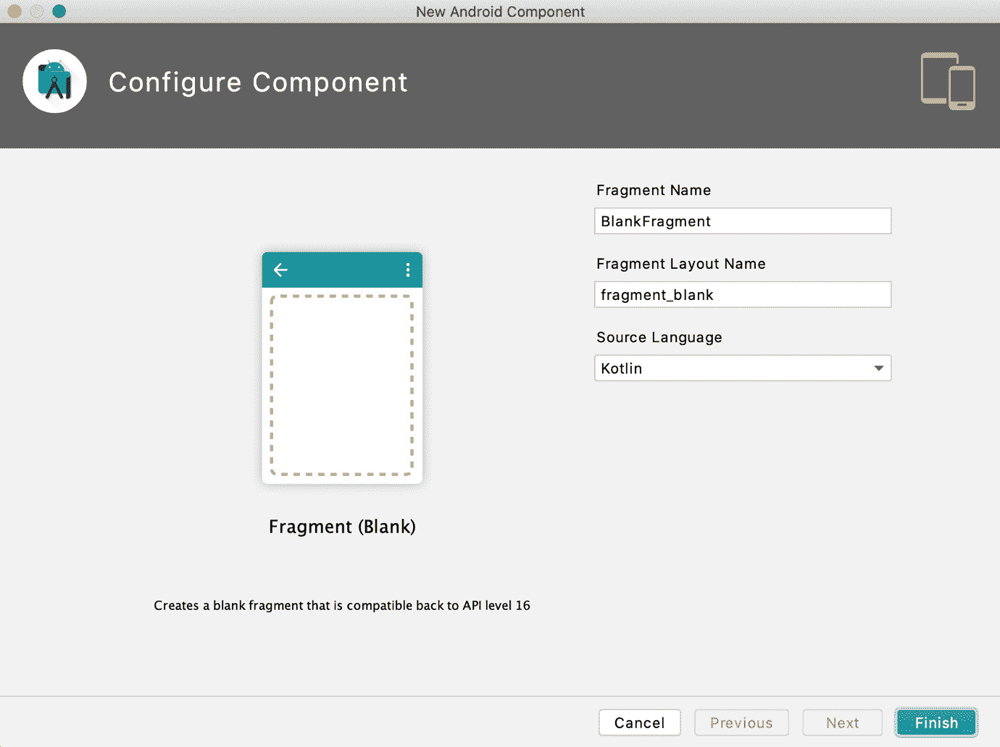

    图 3.1:创建一个新片段

3.  将片段重命名为`MainFragment`，布局重命名为`fragment_main`。然后，按下`Finish`，碎片类将被创建并打开。增加了一个功能`onCreateView`(如下图所示)，用于扩展片段的布局文件。

    ```kt
        override fun onCreateView(
            inflater: LayoutInflater, container: ViewGroup?,
            savedInstanceState: Bundle?
        ): View? {
            // Inflate the layout for this fragment
            return inflater.inflate(R.layout.fragment_main,           container, false)
        }
    ```

4.  When you open up `fragment_main.xml` layout file, you'll see the following code:

    ```kt
    <?xml version="1.0" encoding="utf-8"?>
    ```

    <framelayout xmlns:android="http://schemas.android.com/apk/res/android" xmlns:tools="http://schemas.android.com/tools" android:layout_width="match_parent" android:layout_height="match_parent" tools:context=".MainFragment"></framelayout>

    ```kt
        <!-- TODO: Update blank fragment layout -->
        <TextView
            android:layout_width="match_parent"
            android:layout_height="match_parent"
            android:text="@string/hello_blank_fragment" />
    </FrameLayout>
    ```

    一个简单的布局已经添加了一个`TextView`和一些使用`@string/hello_blank_fragment`的示例文本。这个字符串资源有文本`hello blank fragment`。由于`layout_width`和`layout_height`被指定为`match_parent`，因此`TextView`将占据整个屏幕。但是，文本本身将以默认位置添加到视图的左上角。

5.  Add the `android:gravity="center"` attribute and value to the `TextView` so that the text appears in the center of the screen:

    ```kt
        <TextView
            android:layout_width="match_parent"
            android:layout_height="match_parent"
            android:gravity="center"
            android:text="@string/hello_blank_fragment" />
    ```

    如果你现在运行用户界面，你会看到“你好世界！”在*图 3.2* 中显示:

    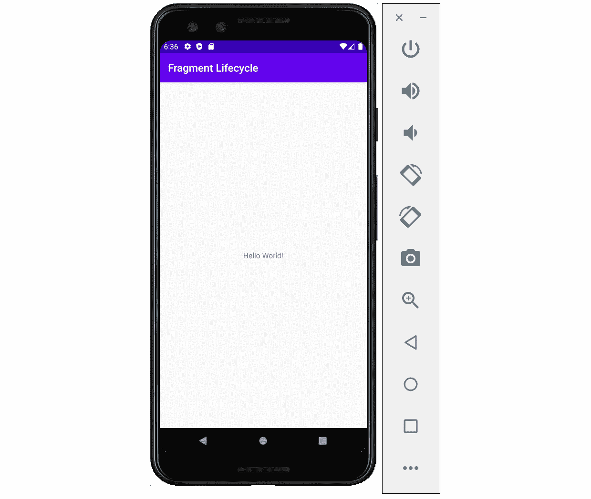

    图 3.2:没有添加片段的初始应用布局显示

    嗯，你可以看到一些`Hello World!`文本，但不是你可能期待的`hello blank fragment`文本。创建活动时，片段及其布局不会自动添加到活动中。这是一个手动过程。

6.  Open the `activity_main.xml` file and replace the contents with the following:

    ```kt
    <?xml version="1.0" encoding="utf-8"?>
    <androidx.constraintlayout.widget.ConstraintLayout 
        xmlns:android="http://schemas.android.com/apk/res/android"
        xmlns:tools="http://schemas.android.com/tools"
        android:layout_width="match_parent"
        android:layout_height="match_parent"
        tools:context=".MainActivity">
        <fragment
            android:id="@+id/main_fragment"
            android:name="com.example.fragmentlifecycle.MainFragment"
            android:layout_width="match_parent"
            android:layout_height="match_parent" />
    </androidx.constraintlayout.widget.ConstraintLayout>
    ```

    正如您可以在 XML 中向布局添加视图声明一样，还有一个`fragment`元素。您已经在`layout_width`和`layout_height`中添加了带有`match_parent`约束的片段到`ConstraintLayout`中，因此它将占据整个屏幕。这里要考察的最重要的`xml`属性是`android:name`。在这里，您可以指定包的完全限定名和要用`com.example.fragmentlifecycle.MainFragment`添加到布局中的`Fragment`类。

7.  Now run the app, and you will see the output shown in *Figure 3.3*:

    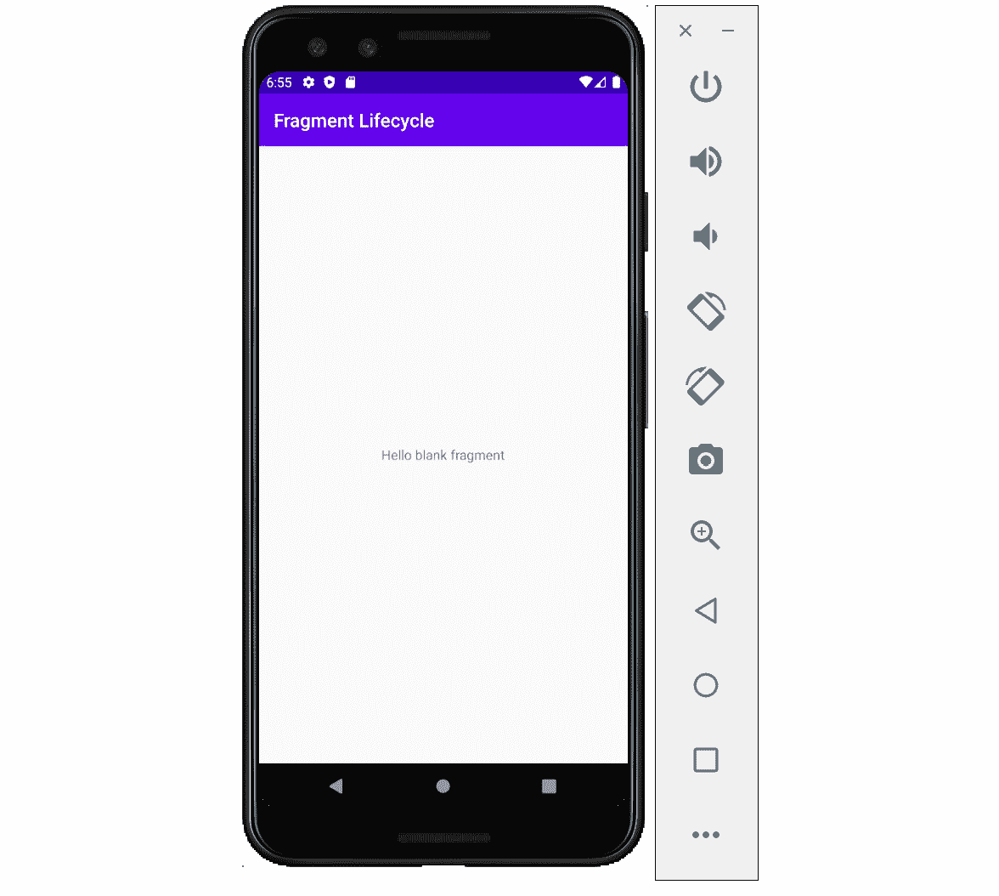

    图 3.3:添加了片段的应用布局显示

    这证明您的带有文本`Hello blank fragment`的片段已经添加到活动中，并且正在显示您定义的布局。接下来，您将检查活动和片段之间的回调方法，以及这是如何发生的。

8.  Open up the `MainFragment` class and add a `TAG` constant to the companion object with the value `"MainFragment"` to identify the class. Then add/update the functions with appropriate log statements. You will need to add the imports for the 'Log' statement and the 'context' to the imports at the top of the class. The code snippet below is truncated. Follow the link shown to see the full code block you need to use:

    MainFragment.kt

    ```kt
    3    import android.content.Context
    4    import android.util.Log
    27        override fun onAttach(context: Context) {
    28            super.onAttach(context)
    29            Log.d(TAG, "onAttach")
    30        }
    31
    32        override fun onCreate(savedInstanceState: Bundle?) {
    33            super.onCreate(savedInstanceState)
    34            Log.d(TAG, "onCreate")
    35            arguments?.let {
    36                param1 = it.getString(ARG_PARAM1)
    37                param2 = it.getString(ARG_PARAM2)
    38            }
    39        }
    40
    41        override fun onCreateView(
    42            inflater: LayoutInflater, container: ViewGroup?,
    43            savedInstanceState: Bundle?
    44        ): View? {
    45            Log.d(TAG, "onCreateView")
    46
    47            // Inflate the layout for this fragment
    48            return inflater.inflate(R.layout.fragment_main,                 container, false)
    49        }
    ```

    您可以在[http://packt.live/3bYaNY6](http://packt.live/3bYaNY6)找到该步骤的完整代码。

    您需要将`Log.d(TAG, "onCreateView"`添加到`onCreateView`回调中，将`Log.d(TAG, "onCreate"`添加到已经存在的`onCreate`回调中。

9.  Next, open the `MainActivity` class and add the common callback methods `onStart` and `onResume`. Then add a companion object with a `TAG` constant with the value `"MainActivity"` as shown below and also add the Log import to the top of the class:

    ```kt
        import android.util.log
        override fun onCreate(savedInstanceState: Bundle?) {
            super.onCreate(savedInstanceState)
            setContentView(R.layout.activity_main)
            Log.d(TAG, "onCreate")
        }
        override fun onStart() {
            super.onStart()
            Log.d(TAG, "onStart")
        }
        override fun onResume() {
            super.onResume()
            Log.d(TAG, "onResume")
        }
        companion object {
            private const val TAG = "MainActivity"
        }
    ```

    您将看到，您还必须添加`onCreate`日志语句`Log.d(TAG, "onCreate")`，因为当您在项目中添加活动时，这个回调已经在那里了。

    您在*第 2 章*、*构建用户屏幕流*中学习了如何查看日志语句，您将在 Android Studio 中打开`Logcat`窗口来检查日志以及运行应用时调用它们的顺序。在*第 2 章*、*构建用户屏幕流*中，您正在查看单个活动的日志，因此您可以看到它们被调用的顺序。现在，您将检查`MainActivity`和`MainFragment`回调发生的顺序。

10.  Open up the `Logcat` window. (Just to remind you, it can be accessed by clicking the `Logcat` tab at the bottom of the screen and also from the toolbar with `View` | `Tool Windows` | `Logcat`). As both `MainActivity` and `MainFragment` start with the text `Main`, you can type `Main` in the search box to filter the logs to only show statements with this text. Run the app, and you should see the following:

    

    图 3.4:启动应用时显示的 Logcat 语句

    有趣的是，前几个回调来自片段。它通过`onAttach`回调链接到它已被放置的活动。片段被初始化，其视图显示在`onCreate`和`onCreateView`中，然后调用另一个回调`onViewCreated`，确认片段 UI 准备显示。这是在活动的`onCreate`方法被调用之前。这是有意义的，因为活动基于它包含的内容创建它的用户界面。由于这是一个定义自己布局的片段，活动需要知道如何像在`onCreate`方法中一样测量、布局和绘制片段。然后，在片段和活动都开始在`onStart`中显示用户界面之前，片段接收到已经通过`onActivityCreated`回调完成的确认，然后准备用户在它们各自的`onResume`回调完成之后与其交互。

    注意

    前面详述的活动和片段生命周期之间的交互是针对创建静态片段的情况，静态片段是在活动的布局中定义的。对于可以在活动已经运行时添加的动态片段，交互可能会有所不同。

    那么，现在显示了片段和包含的活动，当应用被后台化或关闭时会发生什么呢？当片段和活动暂停、停止和完成时，回调仍然是交错的。

11.  向`MainFragment`类添加以下回调:

    ```kt
    override fun onPause() {
        super.onPause()
        Log.d(TAG, "onPause")
    }
    override fun onStop() {
        super.onStop()
        Log.d(TAG, "onStop")
    }
    override fun onDestroyView() {
        super.onDestroyView()
        Log.d(TAG, "onDestroyView")
    }
    override fun onDestroy() {
        super.onDestroy()
        Log.d(TAG, "onDestroy")
    }
    override fun onDetach() {
        super.onDetach()
        Log.d(TAG, "onDetach")
    }
    ```

12.  然后将这些回调添加到`MainActivity` :

    ```kt
    override fun onPause() {
        super.onPause()
        Log.d(TAG, "onPause")
    }
    override fun onStop() {
        super.onStop()
        Log.d(TAG, "onStop")
    }
    override fun onDestroy() {
        super.onDestroy()
        Log.d(TAG, "onDestroy")
    }
    ```

13.  Build the app up, and once it is running, you'll see the callbacks from before starting both the fragment and activity. You can use the dustbin icon at the top left of the `Logcat` window to clear the statements. Then close the app and review the output log statements:

    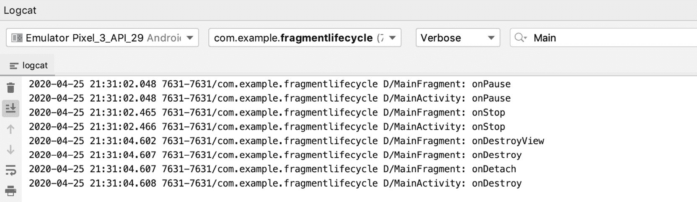

图 3.5:关闭应用时显示的 Logcat 语句

`onPause`和`onStop`语句与您可能预期的一样，因为片段包含在活动中，所以会首先收到这些回调的通知。您可以认为这是由内向外的，因为子元素会在包含它的父元素之前得到通知，所以父元素知道如何响应。然后，在`onDestroy`中完成任何最终清理后，活动本身被销毁之前，碎片被撕掉，从活动中移除，然后用`onDestroyView`、`onDestroy`和`onDetach`功能销毁。直到组成活动的所有组成部分都被移除，活动才结束是没有意义的。

完整的片段生命周期回调以及它们如何与活动回调相关联是安卓的一个复杂领域，因为在哪些情况下应用哪些回调可能会有很大不同。要查看更详细的概述，请参见位于[https://developer.android.com/guide/fragments](https://developer.android.com/guide/fragments)的官方文档。

对于大多数情况，您将只使用前面的片段回调。这个例子既展示了独立的片段在它们的创建、显示和销毁中是如何的，也展示了它们对包含活动的相互依赖。通过`onAttach`和`onActivityCreated`回调，它们可以访问包含活动及其状态，这将在下面的示例中演示。

现在，我们已经完成了向活动添加片段并检查片段和活动之间的交互的基本示例，让我们看看如何向活动添加两个片段的更详细的示例。

## 练习 3.02:向活动静态添加片段

本练习将演示如何向一个活动添加两个片段，它们有自己的用户界面和独立的功能。您将创建一个简单的计数器类和一个样式类，前者增加和减少一个数字，后者以编程方式更改应用于某些`Hello World`文本的样式。请执行以下步骤:

1.  Create an application in Android Studio with an empty activity called `Fragment Intro`. Then replace the content with the following strings required for the exercise in the `res` | `values` | `strings.xml` file:

    ```kt
    <resources>
        <string name="app_name">Fragment Intro</string>
        <string name="hello_world">Hello World</string>
        <string name="bold_text">Bold</string>
        <string name="italic_text">Italic</string>
        <string name="reset">Reset</string>
        <string name="zero">0</string>
        <string name="plus">+</string>
        <string name="minus">-</string>
        <string name="counter_text">Counter</string>
    </resources>
    ```

    这些字符串被用在计数器片段和样式片段中，您接下来将创建样式片段。

2.  通过转到布局名称为`fragment_counter`的`File` | `New` | `Fragment (Blank)`添加一个新的空白片段
3.  Now make changes to the `fragment_counter.xml` file. To add the fields, you'll need to create the `counter` in the `Fragment` class. The code below is truncated for space. Follow the link shown for the full code you need to use:

    片段 _ 计数器. xml

    ```kt
    9    <TextView
    10        android:id="@+id/counter_text"
    11        android:layout_width="wrap_content"
    12        android:layout_height="wrap_content"
    13        android:text="@string/counter_text"
    14        android:paddingTop="10dp"
    15        android:textSize="44sp"
    16        app:layout_constraintEnd_toEndOf="parent"
    17        app:layout_constraintStart_toStartOf="parent"
    18        app:layout_constraintTop_toTopOf="parent"/>
    19
    20    <TextView
    21        android:id="@+id/counter"
    22        android:layout_width="wrap_content"
    23        android:layout_height="wrap_content"
    24        android:text="@string/zero"
    25        android:textSize="54sp"
    26        android:textStyle="bold"
    27        app:layout_constraintEnd_toEndOf="parent"
    28        app:layout_constraintStart_toStartOf="parent"
    29        app:layout_constraintTop_toBottomOf="@id/counter_text"
    30        app:layout_constraintBottom_toTopOf="@id/plus"/>
    ```

    您可以在[http://packt.live/2LFCJpa](http://packt.live/2LFCJpa)找到该步骤的完整代码。

    我们正在使用一个简单的`ConstraintLayout`文件，该文件具有为标题`@+id/counter_text`设置的`TextViews`和`android:id="@+id/counter"`的值(默认为`@string/zero`，将通过`android:id="@+id/plus"`和`android:id="@+id/minus"`按钮进行更改。

    注意

    对于这样一个简单的例子，您不需要在视图上用`style="@some_style"`符号设置单独的样式，最好避免在每个视图上重复这些值。

4.  Now open the `CounterFragment` and override the `onViewCreated` function. You will also need to add the following imports:

    ```kt
    import android.widget.Button
    import android.widget.TextView
    override fun onViewCreated(view: View, savedInstanceState: Bundle?) {
        super.onViewCreated(view, savedInstanceState)
        val counter = view.findViewById<TextView>(R.id.counter)
        view.findViewById<Button>(R.id.plus).setOnClickListener {
            var counterValue = counter.text.toString().toInt()
            counter.text = (++counterValue).toString()
        }
        view.findViewById<Button>(R.id.minus).setOnClickListener {
            var counterValue = counter.text.toString().toInt()
            if (counterValue > 0) counter.text 
              = (--counterValue).toString()
        }
    }
    ```

    我们添加了`onViewCreated`，这是布局应用到你的片段时的回调运行。创建视图的`onCreateView`回调在片段本身创建时运行。您在前面片段中指定的按钮上设置了`click listeners`来增加和减少`counter`视图的值。

5.  首先，通过这一行，您将计数器的当前值检索为整数:

    ```kt
    var counterValue = counter.text.toString().toInt()
    ```

6.  Then with the following line, you are incrementing the value by `1` with the `++` notation:

    ```kt
    counter.text = (++counterValue).toString()
    ```

    因为这是通过在`counterValue`之前添加`++`来完成的，所以它在转换为字符串之前增加整数值。如果您没有这样做，而是用`counter++`进行了一个后置增量，那么该值只有在您下次在语句中使用该值时才可用，这会将计数器重置为相同的值。

7.  The line within the minus button `click listener` does a similar thing to the add `click listener` but decrements the value by `1`:

    ```kt
    if (counterValue > 0) counter.text = (--counterValue).toString()
    ```

    只有当值大于`0`时，才能进行操作，这样就不会设置负数。

8.  You have not added the fragment to the `MainActivity` layout. To do this, go into the `activity_main.xml` and add the following code:

    ```kt
    <?xml version="1.0" encoding="utf-8"?>
    <LinearLayout xmlns:android="http://schemas.android.com/apk/res/  android"
        xmlns:tools="http://schemas.android.com/tools"
        android:layout_width="match_parent"
        android:layout_height="match_parent"
        android:orientation="vertical"
        tools:context=".MainActivity">
        <fragment
            android:id="@+id/counter_fragment"
            android:name="com.example.fragmentintro.CounterFragment"
            android:layout_width="match_parent"
            android:layout_height="match_parent"/>
    </LinearLayout>
    ```

    您将把布局从`FrameLayout`更改为`LinearLayout`，因为当您添加下一个片段时，您需要将一个片段放在另一个片段之上。您可以通过`name`属性指定要在`fragment` XML 元素中使用的片段，该属性具有用于该类的完全限定的包名: `android:name="com.example.fragmentintro.CounterFragment`。如果您在创建应用时使用了不同的包名，那么这必须参考您创建的`CounterFragment`。这里需要把握的重要一点是，您已经在主活动布局中添加了一个片段，该片段也有一个布局。这展示了使用片段的一些能力，因为您可以封装应用的一个功能，用布局文件和片段类来完成，并将其添加到多个活动中。

    完成后，在虚拟设备中运行该片段，如图 3.6*所示:*

    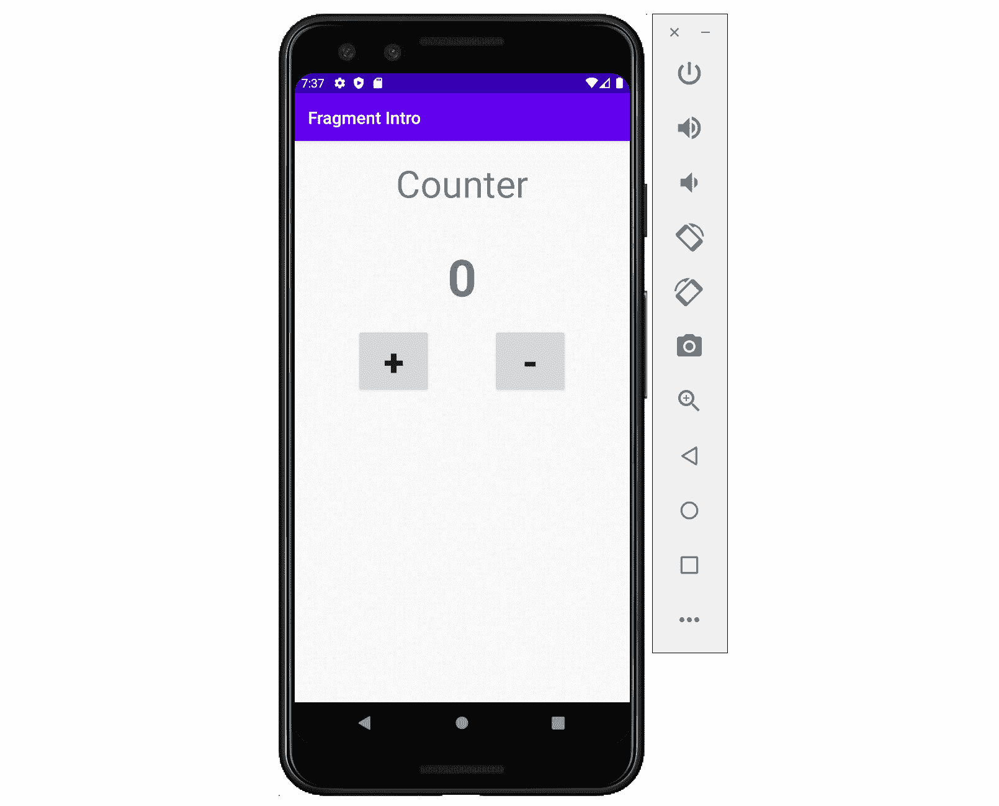

    图 3.6:显示计数器片段的应用

    您已经创建了一个简单的计数器。基本功能按预期工作，递增和递减计数器值。

9.  在下一步中，您将向屏幕的下半部分添加另一个片段。这证明了片段的多功能性。您可以在屏幕的不同区域封装具有功能和特性的用户界面。
10.  现在使用先前创建名为`fragment_style`的布局名称为`StyleFragment`的`CounterFragment`的步骤创建一个新片段。
11.  Next, open up the `fragment_style.xml` file that has been created and replace the contents with the code at the link below. The snippet shown below is truncated – see the link for the full code:

    fragment_style.xml

    ```kt
    10    <TextView
    11        android:id="@+id/hello_world"
    12        android:layout_width="wrap_content"
    13        android:layout_height="0dp"
    14        android:textSize="34sp"
    15        android:paddingBottom="12dp"
    16        android:text="@string/hello_world"
    17        app:layout_constraintEnd_toEndOf="parent"
    18        app:layout_constraintStart_toStartOf="parent"
    19        app:layout_constraintTop_toTopOf="parent" />
    20
    21    <Button
    22        android:id="@+id/bold_button"
    23        android:layout_width="wrap_content"
    24        android:layout_height="0dp"
    25        android:textSize="24sp"
    26        android:text="@string/bold_text"
    27        app:layout_constraintEnd_toStartOf="@+id/italic_button"
    28        app:layout_constraintStart_toStartOf="parent"
    29        app:layout_constraintTop_toBottomOf="@id/hello_world" />
    ```

    您可以在[http://packt.live/2KykTDS](http://packt.live/2KykTDS)找到该步骤的完整代码。

    布局增加了一个带有三个按钮的`TextView`。`TextView`文本和所有按钮的文本被设置为字符串资源`(@string`。

12.  Next, go into the `activity_main.xml` file and add the `StyleFragment` below the `CounterFragment` inside the `LinearLayout`:

    ```kt
    <?xml version="1.0" encoding="utf-8"?>
    <LinearLayout xmlns:android="http://schemas.android.com/apk/res/  android"
        xmlns:tools="http://schemas.android.com/tools"
        android:layout_width="match_parent"
        android:layout_height="match_parent"
        android:orientation="vertical"
        tools:context=".MainActivity">
        <fragment
            android:id="@+id/counter_fragment"
            android:name="com.example.fragmentintro.CounterFragment"
            android:layout_width="match_parent"
            android:layout_height="match_parent"/>
        <fragment
            android:id="@+id/style_fragment"
            android:name="com.example.fragmentintro.StyleFragment"
            android:layout_width="match_parent"
            android:layout_height="match_parent"/>
    </LinearLayout>
    ```

    运行该应用时，会看到`StyleFragment`不可见，如图*图 3.7* :

    

    图 3.7:显示的应用没有显示样式片段

    您已经将`StyleFragment`包括在布局中，但是由于`CounterFragment`的宽度和高度设置为与其父视图(`android:layout_width="match_parent android:layout_height="match_parent"`)相匹配，并且它是布局中的第一个视图，因此它占据了所有空间。

    你需要的是某种方式来指定每个碎片应该占据的高度比例。`LinearLayout`方向设置为垂直，因此当`layout_height`没有设置为`match_parent`时，碎片会一个在另一个上面出现。为了定义这个高度的比例，需要在`activity_main.xml`布局文件中给每个片段添加另一个属性`layout_weight`。当你用`layout_weight`确定这个比例高度时，碎片应该占据你设置碎片的`layout_height`为`0dp`。

13.  Update the `activity_main.xml` layout with the following changes setting the `layout_height` of both fragments to `0dp` and adding the `layout_weight` attributes with the values below:

    ```kt
    <?xml version="1.0" encoding="utf-8"?>
    <LinearLayout xmlns:android="http://schemas.android.com/apk/res/  android"
        xmlns:tools="http://schemas.android.com/tools"
        android:layout_width="match_parent"
        android:layout_height="match_parent"
        android:orientation="vertical"
        tools:context=".MainActivity">
        <fragment
            android:id="@+id/counter_fragment"
            android:name="com.example.fragmentintro.CounterFragment"
            android:layout_width="match_parent"
            android:layout_height="0dp"
            android:layout_weight="2"/>
        <fragment
            android:id="@+id/style_fragment"
            android:name="com.example.fragmentintro.StyleFragment"
            android:layout_width="match_parent"
            android:layout_height="0dp"
            android:layout_weight="1"/>
    </LinearLayout>
    ```

    这些变化使得`CounterFragment`占据了`StyleFragment`的两倍高度，如图*图 3.8* :

    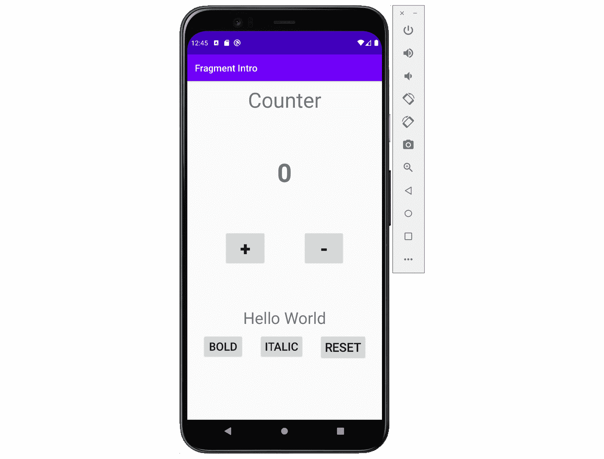

    图 3.8:分配了两倍垂直空间的反片段

    您可以通过更改权重值来进行实验，以查看您可以对布局显示做出的改变。

14.  At this point, pressing the styling buttons `Bold` and `Italic` will have no effect on the text `Hello World`. The button actions have not been specified. The next step involves adding interactivity to the buttons to make changes to the style of the `Hello World` text. Add the following `onViewCreated` function, which overrides its parent to add behavior to the fragment after the layout view has been set up. You will also need to add the following widgets and the typeface import to change the style for the text:

    ```kt
    import android.widget.Button
    import android.widget.TextView
    import android.graphics.Typeface
    override fun onViewCreated(view: View, savedInstanceState: Bundle?) {
        super.onViewCreated(view, savedInstanceState)
        val boldButton = view.findViewById<Button>(R.id.bold_button)
        val italicButton = view.findViewById<Button>(R.id.italic_button)
        val resetButton = view.findViewById<Button>(R.id.reset_button)
        val helloWorldTextView = view.findViewById<TextView>
          (R.id.hello_world)
        boldButton.setOnClickListener {
            if (helloWorldTextView.typeface?.isItalic == true) 
              helloWorldTextView.setTypeface(helloWorldTextView.typeface, 
              Typeface.BOLD_ITALIC) 
            else helloWorldTextView.setTypeface(null, Typeface.BOLD)
        }
        italicButton.setOnClickListener {
            if (helloWorldTextView.typeface?.isBold == true)           helloWorldTextView.setTypeface(helloWorldTextView.typeface,             Typeface.BOLD_ITALIC)
            else helloWorldTextView.setTypeface(null, Typeface.ITALIC)
        }
        resetButton.setOnClickListener {
            helloWorldTextView.setTypeface(null, Typeface.NORMAL)
        }
    } 
    ```

    这里，您将在布局中定义的每个按钮上添加`click listeners`，并将`Hello World`文本设置为所需的`Typeface`。(在本文中，`Typeface`是指将应用于文本的样式，而不是字体)。`bold_button`的条件语句检查是否设置了斜体`Typeface`，如果设置了，则使文本加粗和斜体，如果没有，则使文本加粗。该逻辑对`italic_button`的工作方式相反，检查`Typeface`的状态并对`Typeface`进行相应的更改，如果没有定义`TypeFace`，则将其初始设置为斜体。

15.  Finally, the `reset_button` clears the `Typeface` and sets it back to normal. Run the app up and click the `ITALIC` and `BOLD` buttons. You should see a display as in *Figure 3.9*:

    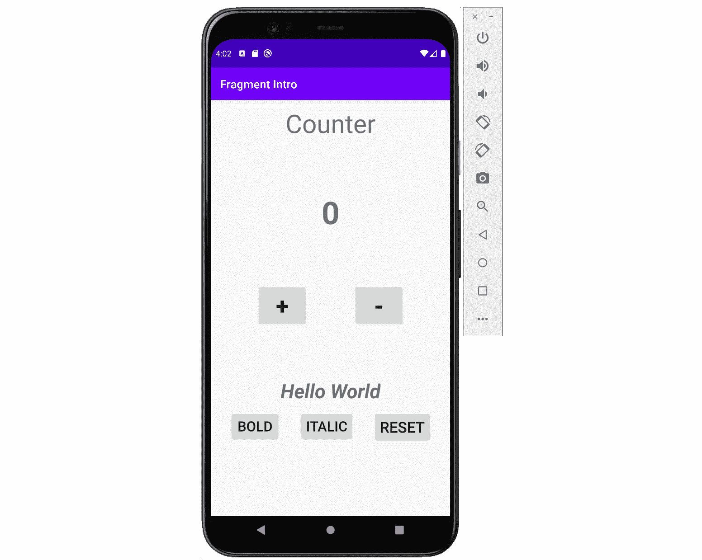

图 3.9:样式片段将文本设置为粗体和斜体

这个练习虽然简单，但是演示了一些使用片段的基本概念。用户可以与之交互的应用功能可以独立开发，而不依赖于将两个或多个功能捆绑到一个布局和活动中。这使得片段可以重用，意味着在开发应用时，您可以将注意力集中在将定义良好的用户界面、逻辑和功能添加到单个片段中。

# 静态片段和双窗格布局

前面的练习向您介绍了静态片段，这些片段可以在活动 XML 布局文件中定义。安卓开发环境的优势之一是能够为不同的屏幕尺寸创建不同的布局和资源。这用于根据设备是手机还是平板电脑来决定显示哪些资源。随着平板电脑尺寸的增大，用于布局用户界面元素的空间会大大增加。安卓系统允许根据不同的外形来指定不同的资源。在`res`(资源)文件夹中经常用来定义平板电脑的限定词是`sw600dp`。这表示如果设备的**最短宽度** ( **sw** )超过 600 dp，则使用这些资源。该限定符用于 7 英寸及更大的平板电脑。平板电脑促进了所谓的双窗格布局。窗格代表用户界面的独立部分。如果屏幕足够大，则可以支持两个窗格(双窗格)布局。这也为一个窗格与另一个窗格交互以更新内容提供了机会。

## 练习 3.03:带有静态片段的双窗格布局

在本练习中，您将创建一个简单的应用，其中显示了星座列表和每个星座的具体信息。它将为手机和平板电脑使用不同的显示器。手机将显示一个列表，然后在另一个屏幕中打开所选列表项的内容，而平板电脑将在一个窗格中显示相同的列表，并在双窗格布局中在同一屏幕的另一个窗格中打开列表项的内容。为此，您必须创建另一个仅用于 7 英寸及以上平板电脑的布局。请执行以下步骤:

1.  首先，创建一个名为`Dual Pane Layouts`的新AndroidStudio项目`Empty Activity`。创建后，转到已创建的布局文件，`res` | `layout` | `activity_main.xml`。
2.  Once you've selected this in the top toolbar of the design view, select the orientation layout button.

    

3.  In this dropdown, you can select `Create Tablet Variation` for the app. This creates a new folder in the `main` | `res` folder named `'layout-sw600dp'` with the layout file `activity_main.xml` added:

    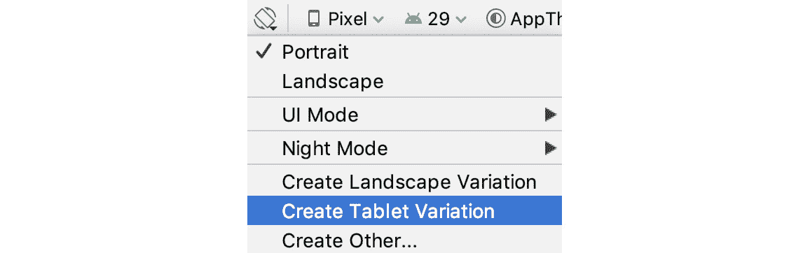

    图 3.10:设计视图方向按钮下拉列表

    目前，它是您创建应用时添加的`activity_main.xml`文件的副本，但您将对其进行更改，以定制平板电脑的屏幕显示。

    为了演示双窗格布局的使用，您将创建一个星形标志列表，当选择列表项时，该列表将显示有关星形标志的一些基本信息。

4.  Go to the top toolbar and select `File` | `New` | `Fragment` | `Fragment (Blank)`. Call it `ListFragment`.

    在本练习中，您需要更新`strings.xml`和`themes.xml`文件，添加以下条目:

    strings.xml

    ```kt
        <string name="star_signs">Star Signs</string>
        <string name="symbol">Symbol: %s</string>
        <string name="date_range">Date Range: %s</string>
        <string name="aquarius">Aquarius</string>
        <string name="pisces">Pisces</string>
        <string name="aries">Aries</string>
        <string name="taurus">Taurus</string>
        <string name="gemini">Gemini</string>
        <string name="cancer">Cancer</string>
        <string name="leo">Leo</string>
        <string name="virgo">Virgo</string>
        <string name="libra">Libra</string>
        <string name="scorpio">Scorpio</string>
        <string name="sagittarius">Sagittarius</string>
        <string name="capricorn">Capricorn</string>
        <string name="unknown_star_sign">Unknown Star Sign</string>
    ```

    主题. xml

    ```kt
        <style name="StarSignTextView"       parent="Base.TextAppearance.AppCompat.Large" >
            <item name="android:padding">18dp</item>
        </style>
        <style name="StarSignTextViewHeader"       parent="Base.TextAppearance.AppCompat.Display1" >
            <item name="android:padding">18dp</item>
        </style>
    ```

    打开`main` | `res` | `layout` | `fragment_list.xml`文件，用以下内容替换默认内容:

    ```kt
    <?xml version="1.0" encoding="utf-8"?>
    <ScrollView xmlns:android="http://schemas.android.com/apk/res/  android"
        xmlns:tools="http://schemas.android.com/tools"
        android:layout_width="match_parent"
        android:layout_height="wrap_content"
        tools:context=".ListFragment">
        <LinearLayout
            android:layout_width="match_parent"
            android:layout_height="wrap_content"
            android:orientation="vertical">
            <TextView
                android:layout_width="match_parent"
                android:layout_height="wrap_content"
                android:gravity="center"
                android:textSize="24sp"
                android:textStyle="bold"
                style="@style/StarSignTextView"
                android:text="@string/star_signs" />
            <View
                android:layout_width="match_parent"
                android:layout_height="1dp"
                android:background="?android:attr/dividerVertical" />
            <TextView
                android:id="@+id/aquarius"
                style="@style/StarSignTextView"
                android:layout_width="match_parent"
                android:layout_height="wrap_content"
                android:text="@string/aquarius" />
        </LinearLayout>
    </ScrollView>
    ```

    你会看到第一个`xml`元素是一个`ScrollView`。一个`ScrollView`是一个允许内容滚动的`ViewGroup`，当你将在它包含的`LinearLayout`中添加 12 个星标时，这可能会占据比屏幕上更多的垂直空间。

    添加`ScrollView`可以防止内容在没有空间显示时被垂直切断，并滚动布局。一个`ScrollView`只能包含一个子视图。这里是一个`LinearLayout`，由于内容会垂直显示，方向设置为垂直(`android:orientation="vertical"`)。在第一个标题`TextView`下面，你为第一个星座水瓶座增加了一个分隔线`View`和一个`TextView`。

5.  Add the other 11 star signs with the same format, adding first the divider and then the `TextView`. The name of the string resource and the `id` should be the same for each `TextView`. The names of the star signs you will create a view from are specified in the `strings.xml` file.

    注意

    举例来说，用于布局列表的技术是不错的，但是在现实世界的应用中，你会创建一个`RecyclerView`来显示可以滚动的列表，数据通过适配器绑定到列表。你将在后面的章节中谈到这一点。

6.  Next create the StarSignListener and make the MainActivity implement it by adding the following:

    ```kt
    interface StarSignListener {
        fun onSelected(id: Int)
    }
    class MainActivity : AppCompatActivity(), StarSignListener {
        ...
        override fun onSelected(id: Int) {
            TODO("not implemented yet")
        }
    }
    ```

    当用户从`ListFragment`中选择一个星号时，片段将如何与活动通信，并将根据双窗格是否可用来添加逻辑。

7.  Once you've created the layout file, go into the `ListFragment` class and update it with the contents below, keeping `onCreateView()` in place. You can see in the fragment in the `onAttach()` callback you are stating that the activity implements the `StarSignListener` interface so it can be notified when the user clicks an item in the list: Add the import for the `Context` required for `onAttach` with the other imports at the top of the file:

    ```kt
    import android.content.Context
    class ListFragment : Fragment(), View.OnClickListener {
        private lateinit var starSignListener: StarSignListener
            override fun onAttach(context: Context) {
            super.onAttach(context)
            if (context is StarSignListener) {
                starSignListener = context
            } else {
                throw RuntimeException("Must implement StarSignListener")
            }
        }
        override fun onCreateView(...)
        override fun onViewCreated(view: View,       savedInstanceState:Bundle?) {
            super.onViewCreated(view, savedInstanceState)
            val starSigns = listOf<View>(
                view.findViewById(R.id.aquarius),
                view.findViewById(R.id.pisces),
                view.findViewById(R.id.aries),
                view.findViewById(R.id.taurus),
                view.findViewById(R.id.gemini),
                view.findViewById(R.id.cancer),
                view.findViewById(R.id.leo),
                view.findViewById(R.id.virgo),
                view.findViewById(R.id.libra),
                view.findViewById(R.id.scorpio),
                view.findViewById(R.id.sagittarius),
                view.findViewById(R.id.capricorn)
            ) 
            starSigns.forEach {
                it.setOnClickListener(this)
            }
        }
        override fun onClick(v: View?) {
            v?.let { starSign ->
                starSignListener.onSelected(starSign.id)
            }
        }
    }
    ```

    剩下的回调与您在前面的练习中看到的类似。您可以使用`onCreateView`创建片段视图。您可以在`onViewCreated`中用`click listener`设置按钮，然后在`onClick`中处理点击。

    `onViewCreated`中的`listOf`语法是用指定的元素创建`readonly`列表的一种方式，在本例中，这些元素是您的星号`TextViews`。然后，在下面的代码中，您循环这些`TextViews`，通过用`forEach`语句迭代`TextView`列表来为每个单独的`TextViews`设置`click listener`。这里的`it`语法是指正在操作的列表元素，它将是 12 个星号`TextViews`之一。

8.  Finally, the `onClick` statement communicates back to the activity through the `StarSignListener` when one of the star signs in the list has been clicked:

    ```kt
    v?.let { starSign ->
        starSignListener.onSelected(starSign.id)
    }
    ```

    您可以使用`?`检查指定为`v`的视图是否为空，如果不是，则仅使用`let`范围功能对其进行操作，然后将星号的`id`传递给`Activity` / `StarSignListener`。

    注意

    侦听器是对变化做出反应的常见方式。通过指定一个`Listener`界面，您就指定了一个要履行的合同。然后，实现类被告知侦听器操作的结果。

9.  Next create the `DetailFragment`, which will display the star sign details. Create a fragment as you have done before and call it `DetailFragment`. Replace the `fragment_detail` layout file contents with the following XML file:

    ```kt
    <?xml version="1.0" encoding="utf-8"?>
    <LinearLayout xmlns:android="http://schemas.android.com/apk/res/  android"
        xmlns:tools="http://schemas.android.com/tools"
        android:layout_width="match_parent"
        android:layout_height="match_parent"
        android:orientation="vertical"
        tools:context=".DetailFragment">
        <TextView
            android:id="@+id/star_sign"
            style="@style/StarSignTextViewHeader"
            android:textStyle="bold"
            android:gravity="center"
            android:layout_width="match_parent"
            android:layout_height="wrap_content"
            tools:text="Aquarius"/>
        <TextView
            android:id="@+id/symbol"
            style="@style/StarSignTextView"
            android:layout_width="match_parent"
            android:layout_height="wrap_content"
            tools:text="Water Carrier"/>
        <TextView
            android:id="@+id/date_range"
            style="@style/StarSignTextView"
            android:layout_width="match_parent"
            android:layout_height="wrap_content"
            tools:text="Date Range: January 20 - February 18" />
    </LinearLayout>
    ```

    在这里，您创建一个简单的`LinearLayout`，它将显示星座名称、星座符号和日期范围。您将在`DetailFragment`中设置这些值。

10.  Open the `DetailFragment` and update the contents with the following text and also add widget imports to the imports list:

    ```kt
    import android.widget.TextView
    import android.widget.Toast 
    class DetailFragment : Fragment() {
        private val starSign: TextView?
            get() = view?.findViewById(R.id.star_sign)
        private val symbol: TextView?
            get() = view?.findViewById(R.id.symbol)
        private val dateRange: TextView?
            get() = view?.findViewById(R.id.date_range)
        override fun onCreateView(
            inflater: LayoutInflater, container: ViewGroup?,          savedInstanceState: Bundle?): View? {
            // Inflate the layout for this fragment
            return inflater.inflate(R.layout.fragment_detail,           container,false)
        }
        fun setStarSignData(starSignId: Int) {
            when (starSignId) {
                R.id.aquarius -> {
                    starSign?.text = getString(R.string.aquarius)
                    symbol?.text = getString(R.string.symbol,
                      "Water Carrier")
                    dateRange?.text = getString(R.string.date_range,                  "January 20 - February 18")
                }
            }
        }
    }
    ```

    `onCreateView`正常放大布局。`setStarSignData()`函数用于填充从`starSignId`传递的数据。`when`表达式用于确定星标的 ID 并设置合适的内容。

    上面的`setStarSignData`函数格式化用`getString`函数–`getString(R.string.symbol,"Water Carrier")`传递的文本，例如，将文本`Water Carrier`传递到`symbol`字符串`<string name="symbol">Symbol: %s</string>`中，并用传入的值替换`%s`。你可以在官方文档中看到还有哪些字符串格式选项:[https://developer . Android . com/guide/topics/resources/string-resource](https://developer.android.com/guide/topics/resources/string-resource)。

    按照星标`aquarius`引入的模式，在`aquarius`区块下方增加另外 11 个星标。为简单起见，所有详细的星标文本并未添加到`strings.xml`文件中。有关完整的类文件，请参考此处的示例:

    [http://packing . live/35 vynkx](http://packt.live/35Vynkx)

    现在，您已经添加了`ListFragment`和`DetailFragment`。但是，目前它们还没有同步在一起，所以在`ListFragment`中选择星标项目不会将内容加载到`DetailFragment`中。让我们看看如何改变这一点。

11.  首先，你需要改变`layout`文件夹和`layout-sw600dp`中`activity_main.xml`的布局。
12.  如果在项目视图中，打开`res` | `layout` | `activity_main.xml`。在默认的安卓视图中，打开`res` | `layout` | `activity_main.xml`，选择最上面的`activity_main.xml`无文件(sw600dp)。将内容替换为以下内容:

    ```kt
    <?xml version="1.0" encoding="utf-8"?>
    <androidx.constraintlayout.widget.ConstraintLayout   xmlns:android="http://schemas.android.com/apk/res/android"
        xmlns:tools="http://schemas.android.com/tools"
        android:layout_width="match_parent"
        android:layout_height="match_parent"
        tools:context=".MainActivity">
        <fragment
            android:id="@+id/star_sign_list"
            android:name="com.example.staticfragments.ListFragment"
            android:layout_height="match_parent"
            android:layout_width="match_parent"/>
    </androidx.constraintlayout.widget.ConstraintLayout>
    ```

13.  Then open up `res` | `layout-sw600dp` | `activity_main.xml` if in the Project View. In the default Android View open up `res` | `layout` | `activity_main.xml (sw600dp)`. Replace the contents with the following:

    ```kt
    <?xml version="1.0" encoding="utf-8"?>
    <LinearLayout xmlns:android="http://schemas.android.com/apk/res/  android"
        xmlns:tools="http://schemas.android.com/tools"
        android:layout_width="match_parent"
        android:layout_height="match_parent"
        android:orientation="horizontal"
        tools:context=".MainActivity">
        <fragment
            android:id="@+id/star_sign_list"
            android:name="com.example.staticfragments.ListFragment"
            android:layout_height="match_parent"
            android:layout_width="0dp"
            android:layout_weight="1"/>
        <View
            android:layout_width="1dp"
            android:layout_height="match_parent"
            android:background="?android:attr/dividerVertical" />
        <fragment
            android:id="@+id/star_sign_detail"
            android:name="com.example.staticfragments.DetailFragment"
            android:layout_height="match_parent"
            android:layout_width="0dp"
            android:layout_weight="2"/>
    </LinearLayout>
    ```

    您正在添加一个`LinearLayout`，默认情况下，它将水平布局其内容。

    您添加`ListFragment`，一个分隔符，然后添加`DetailFragment`，并为片段分配适当的标识。还要注意，您正在使用权重的概念来分配每个片段的可用空间。当你这样做的时候，你指定`android:layout_width="0dp"`。当`LinearLayout`设置为水平布局碎片时，`layout_weight`然后设置重量测量可用的宽度比例。`ListFragment`指定为`android:layout_weight="1"`，`DetailFragment`指定为`android:layout_weight="2"`，告知系统将`DetailFragment`指定为`ListFragment`宽度的两倍。在这种情况下，如果有三个视图包括分割线，这是一个固定的 dp 宽度，这将大致导致`ListFragment`占据三分之一的宽度和`DetailFragment`占据三分之二的宽度。

14.  要查看该应用，请创建一个新的虚拟设备，如*第 1 章*、*创建您的第一个应用*，并选择`Category` | `Tablet` | `Nexus 7`。
15.  This will create a 7" tablet. Then launch the virtual device and run the app. This is the initial view you will see when you launch the tablet in portrait mode:

    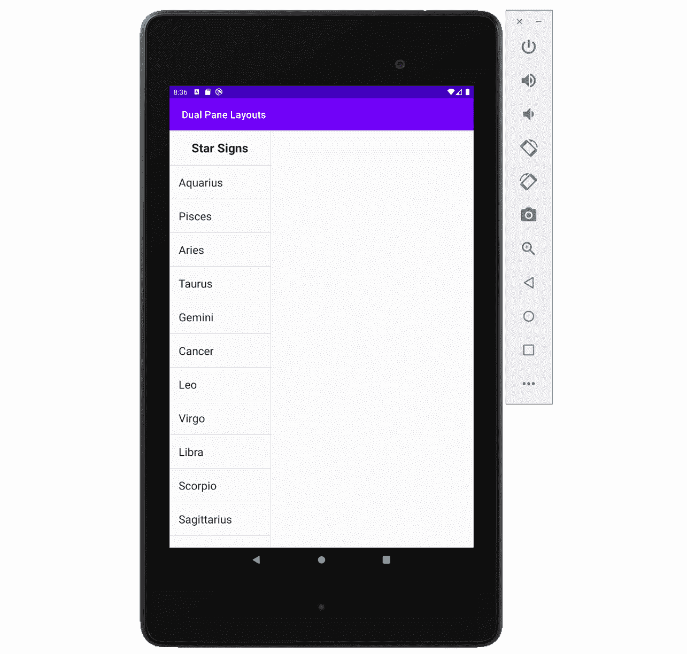

    图 3.11:初始星标 app UI 显示

    可以看到列表占据了屏幕的三分之一左右，空白占据了屏幕的三分之二。

16.  点击虚拟设备上的底部旋转按钮，将虚拟设备顺时针旋转 90 度。
17.  完成后，虚拟设备将进入横向模式。但是，它不会将屏幕方向更改为横向。
18.  In order to do this, click on the  rotate button in the bottom-left corner of the virtual device. You can also select the status bar at the top of the virtual device, hold and drag down to display the quick settings bar where you can turn on auto-rotation by selecting the rotate button.

    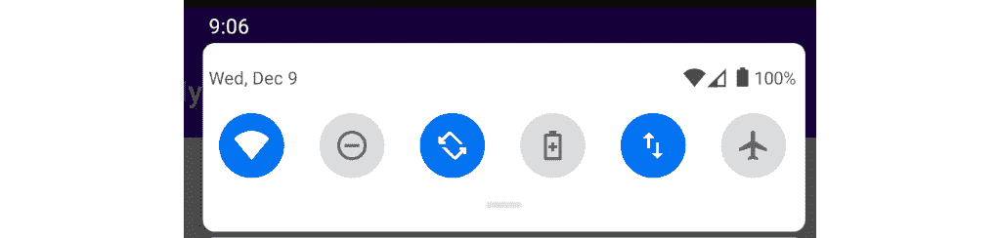

    图 3.12:选择自动旋转的快速设置栏

19.  This will then change the tablet layout to landscape:

    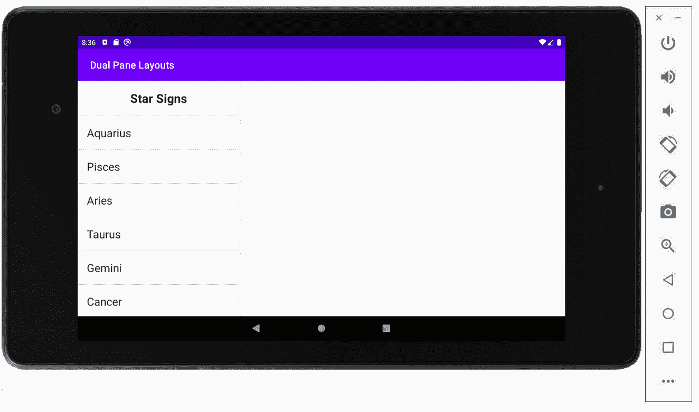

    图 3.13:平板电脑上横向显示的初始星标应用用户界面

20.  The next thing to do is enable selecting a list item to load contents into the `Detail` pane of the screen. For that, we need to make changes in the `MainActivity`. Update the following code to retrieve fragments by their ID in the pattern of retrieving views by their IDs:

    ```kt
    package com.example.dualpanelayouts
    import android.content.Intent
    import android.os.Bundle
    import android.view.View
    import androidx.appcompat.app.AppCompatActivity
    const val STAR_SIGN_ID = "STAR_SIGN_ID"
    interface StarSignListener {
        fun onSelected(id: Int)
    }
    class MainActivity : AppCompatActivity(), StarSignListener {
        var isDualPane: Boolean = false
        override fun onCreate(savedInstanceState: Bundle?) {
            super.onCreate(savedInstanceState)
            setContentView(R.layout.activity_main)
            isDualPane = findViewById<View>(R.id.star_sign_detail) != null
        }
        override fun onSelected(id: Int) {
           if (isDualPane) {
               val detailFragment = supportFragmentManager
                .findFragmentById(R.id.star_sign_detail) as DetailFragment
               detailFragment.setStarSignData(id)
           } else {
               val detailIntent = Intent(this, 
                 DetailActivity::class.java).apply {
                  putExtra(STAR_SIGN_ID, id)
               }
                startActivity(detailIntent)
            }
        }
    }
    ```

    注意

    这个例子和后面的例子使用`supportFragmentManager.findFragmentById`。

    但是，如果使用`android:tag="MyFragmentTag"`向片段 XML 添加标签，也可以通过`Tag`检索片段。

21.  然后，您可以使用`supportFragmentManager.findFragmentByTag("MyFragmentTag")`检索片段。
22.  为了从片段中检索数据，活动需要实现`StarSignListener`。这就完成了片段中的约定集，将细节传递回实现类。`onCreate`功能设置布局，然后通过检查 id `R.id.star_sign_detail`是否存在来检查`DetailFragment`是否在活动的膨胀布局中。从项目视图中，`res` | `layout` | `activity_main.xml`文件只包含`ListFragment`，但是您已经在`res` | `layout-sw600dp` | `activity_main.xml`文件中添加了代码来包含带有`android:id="@+id/star_sign_detail"`的`DetailFragment`。这将用于 Nexus 7 平板电脑的布局。在默认的安卓视图中，打开`res` | `layout` | `activity_main.xml`，选择最上面的`activity_main.xml`无(sw600dp)文件，然后选择`activity_main.xml (sw600dp)`查看这些区别。
23.  所以现在我们可以通过`StarSignListener`取回从`ListFragment`传回到`MainActivity`的星标 ID，并将其传入`DetailFragment`。这是通过检查`isDualPane`布尔来实现的，如果评估为`true`，你知道你可以通过这个代码将星标标识传递给`DetailFragment`:

    ```kt
    val detailFragment = supportFragmentManager .findFragmentById   (R.id.star_sign_detail) as DetailFragment
    detailFragment.setStarSignData(id)
    ```

24.  您将片段从`id`投射到`DetailFragment`并调用以下内容:

    ```kt
    detailFragment.setStarSignData(id)
    ```

25.  As you've implemented this function in the fragment and are checking by the `id` which contents to display, the UI is updated:

    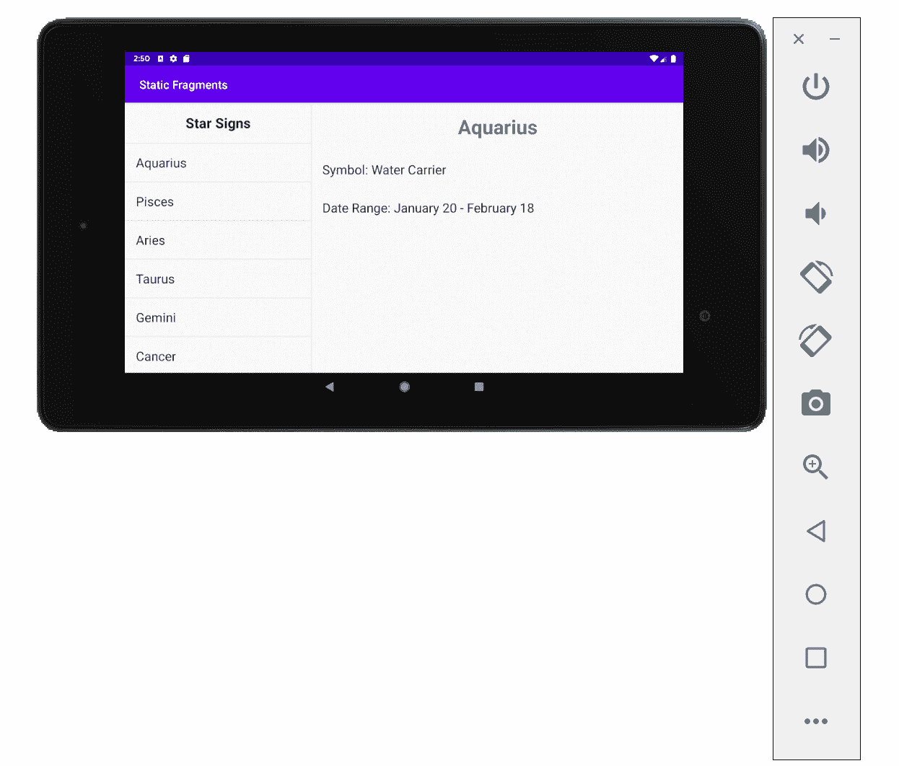

    图 3.14:平板电脑上横向显示的星标应用双窗格

26.  现在点击一个列表项可以正常工作，显示内容设置正确的双窗格布局。
27.  If the device is not a tablet, however, even when a list item is clicked, nothing will happen as there is not an `else` branch condition to do anything if the device is not a tablet, which is defined by `isDualPane` Boolean. The display will be as in *Figure 3.15* and won't change when items are selected:

    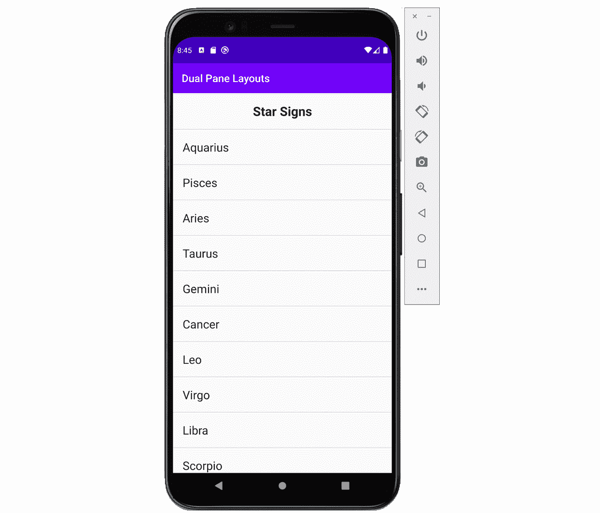

    图 3.15:手机上初始星标应用 UI 显示

28.  您将在另一个活动中显示星座细节。前往`File` | `New` | `Activity` | `Empty Activity`创建一个新的`DetailActivity`。创建后，用此布局更新`activity_detail.xml`:

    ```kt
    <?xml version="1.0" encoding="utf-8"?>
    <androidx.constraintlayout.widget.ConstraintLayout   xmlns:android="http://schemas.android.com/apk/res/android"
        xmlns:app="http://schemas.android.com/apk/res-auto"
        xmlns:tools="http://schemas.android.com/tools"
        android:layout_width="match_parent"
        android:layout_height="match_parent"
        tools:context=".DetailActivity">
        <fragment
            android:id="@+id/star_sign_detail"
            android:name="com.example.staticfragments.DetailFragment"
            android:layout_height="match_parent"
            android:layout_width="match_parent"/>
    </androidx.constraintlayout.widget.ConstraintLayout>
    ```

29.  这会将`DetailFragment`添加为布局中的唯一片段。现将`DetailActivity`更新为以下内容:

    ```kt
    override fun onCreate(savedInstanceState: Bundle?) {
        super.onCreate(savedInstanceState)
        setContentView(R.layout.activity_detail)
        val starSignId = intent.extras?.getInt(STAR_SIGN_ID, 0) ?: 0
        val detailFragment = supportFragmentManager       .findFragmentById(R.id.star_sign_detail) as DetailFragment
        detailFragment.setStarSignData(starSignId)
    }
    ```

30.  星标`id`预计将通过在意向附加项中设置一个键(也称为**束**)从另一个活动传递到这个活动。我们在*第 2 章*、*构建用户屏幕流、*中介绍了意图，但提醒一下，它们支持不同组件之间的通信，也可以发送数据。在这种情况下，打开此活动的意图已经设置了一个星标标识。它将使用`id`在`DetailFragment`中设置星标标识。接下来，您需要执行`isDualPane`检查的`else`分支，通过意向中的星标标识启动`DetailActivity`。更新`MainActivity`以完成以下操作。您还需要将`Intent`导入添加到导入列表中:

    ```kt
    import android.content.Intent
    override fun onSelected(id: Int) {
        if (isDualPane) {
            val detailFragment = supportFragmentManager
              .findFragmentById(R.id.star_sign_detail) 
              as DetailFragment
            detailFragment.setStarSignData(id)
        } else {
            val detailIntent = Intent(this, DetailActivity::class.java)
              .apply {
               putExtra(STAR_SIGN_ID, id)
            }
            startActivity(detailIntent)
        }
    }
    ```

31.  Once you click on one of the star sign names on a phone display, it shows the contents in the `DetailActivity` occupying the whole of the screen without the list:

    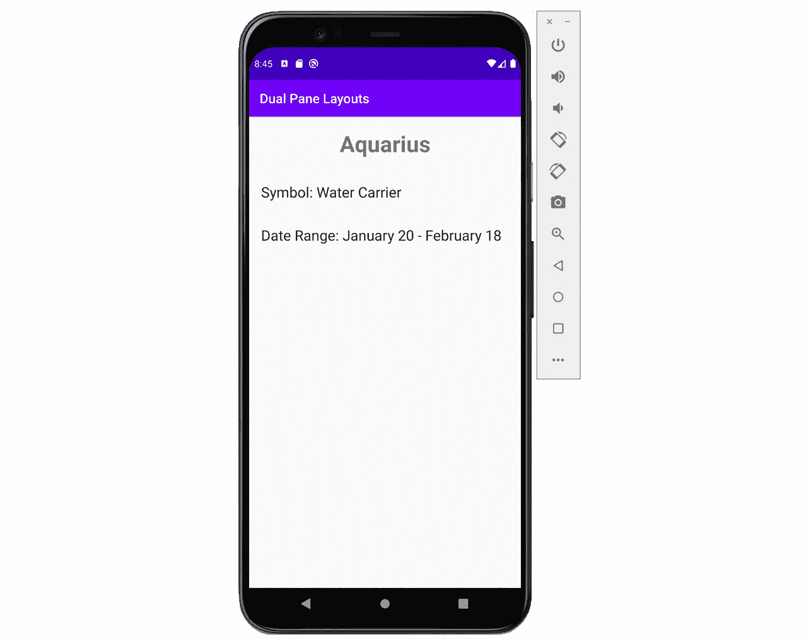

图 3.16:手机上的单窗格星标详细信息屏幕

这个练习展示了片段的灵活性。它们可以封装应用不同功能的逻辑和显示，这些功能可以根据设备的外形以不同的方式集成。它们可以以各种方式排列在屏幕上，这些方式受到它们所包含的布局的限制，因此它们可以作为双窗格布局的一部分或单窗格布局的全部或一部分。这个练习展示了在平板电脑上并排摆放的碎片，但是它们也可以一个放在另一个上面，以各种其他方式摆放。下一个主题说明了应用中使用的片段的配置如何不必在 XML 中静态指定，也可以动态完成。

# 动态碎片

到目前为止，您只看到了在编译时以 XML 添加的片段。虽然这可以满足许多用例，但是您可能希望在运行时动态添加片段来响应用户的操作。这可以通过添加一个`ViewGroup`作为碎片容器，然后从`ViewGroup`中添加、替换和移除碎片来实现。这种技术更加灵活，因为片段可以是活动的，直到不再需要它们，然后被移除，而不是像静态片段那样总是在 XML 布局中膨胀。如果在一个活动中需要 3 个或 4 个以上的片段来完成单独的用户旅程，那么首选的方法是通过动态添加/替换片段来对用户在用户界面中的交互做出反应。当用户与 UI 的交互在编译时是固定的，并且您提前知道您需要多少片段时，使用静态片段会更好。例如，从列表中选择项目来显示内容就是这种情况。

## 练习 3.04:向活动动态添加片段

在本练习中，我们将构建与之前相同的星标应用，但将演示如何将列表和细节片段动态添加到屏幕布局中，而不是直接添加到 XML 布局中。您也可以将参数传递到片段中。为了简单起见，您将为手机和平板电脑创建相同的配置。请执行以下步骤:

1.  用名为`Dynamic Fragments`的`Empty Activity`创建一个新项目。
2.  完成后，添加以下依赖项，您需要使用`FragmentContainerView`，一个优化的视图组来处理片段事务到`dependences{ }`块内的【T1:

    ```kt
    implementation 'androidx.fragment:fragment-ktx:1.2.5'
    ```

3.  从*练习 3.03* 、*带有静态片段的双窗格布局*中复制以下 XML 资源文件的内容，并将其添加到本练习的相应文件中:`strings.xml`(将`app_name`字符串从`Static Fragments`更改为`Dynamic Fragments`)、`fragment_detail.xml`和`fragment_list.xml`。所有这些文件都存在于上一练习中创建的项目中，您只需将内容添加到这个新项目中。然后将`DetailFragment`和`ListFragment`复制到新项目中。在这两个文件中，您必须将软件包名称从`package com.example.staticfragments`更改为`package com.example.dynamicfragments`。最后，将上一个练习中主题. xml 中基本应用样式下面定义的样式添加到这个项目中的主题. xml 中。
4.  You now have the same fragments set up as in the previous exercise. Now open the `activity_main.xml` layout and replace the contents with this:

    ```kt
    <?xml version="1.0" encoding="utf-8"?>
    <androidx.fragment.app.FragmentContainerView   xmlns:android="http://schemas.android.com/apk/res/android"
        android:id="@+id/fragment_container"
        android:layout_width="match_parent"
        android:layout_height="match_parent" />
    ```

    这是您要添加片段的`FragmentContainerView`。您会注意到布局 XML 中没有添加任何片段，因为这些片段是动态添加的。

5.  Go into the `MainActivity` and replace the content with the following:

    ```kt
    package com.example.dynamicfragments
    import androidx.appcompat.app.AppCompatActivity
    import android.os.Bundle
    import androidx.fragment.app.FragmentContainerView
    class MainActivity : AppCompatActivity() {
        override fun onCreate(savedInstanceState: Bundle?) {
            super.onCreate(savedInstanceState)
            setContentView(R.layout.activity_main)
            if (savedInstanceState == null) {
                findViewById<FragmentContainerView>              (R.id.fragment_container)?.let { frameLayout ->
                    val listFragment = ListFragment()
                    supportFragmentManager.beginTransaction()
                        .add(frameLayout.id, listFragment).commit()
                }
            }
        }
    }
    ```

    您将获得对在`activity_main.xml`中指定的`FrameLayout`的引用，创建一个新的`ListFragment`，然后将该片段添加到具有`fragment_container`的 ID 的`ViewGroup` `FrameLayout`中。指定的片段事务是`add`，因为您是第一次向`FrameLayout`添加片段。你调用`commit()`立即执行交易。如果没有要恢复的状态，则使用`savedInstanceState`进行空检查，以仅添加此`ListFragment`，如果之前添加了片段，则会有此状态。

6.  接下来，通过添加以下内容使`MainActivity`实现`StarSignListener`，并添加一个常量，将星号从列表片段传递到详细片段:

    ```kt
    class MainActivity : AppCompatActivity(), StarSignListener {
    ...
    override fun onSelected(id: Int) {
        }
    }
    ```

7.  Now if you run the app, you will see the Star sign list being displayed on mobile and tablet.

    你现在遇到的问题是，既然不是在一个 XML 布局中，如何将星标 ID 传递给`DetailFragment`。

    一种选择是使用与上一个例子中相同的技术，创建一个新的活动，并在一个意图中传递星号标识，但是您不应该必须创建一个新的活动来添加一个新的片段，否则您可能会放弃片段，只使用活动。你要把`FrameLayout`里的`ListFragment`换成`DetailFragment`，但是首先你要想办法把星标 ID 传到`DetailFragment`里。在创建片段时，您可以通过将这个`id`作为参数来实现。标准的方法是在片段中使用`Factory`方法。

8.  Add the following code to the bottom of the `DetailFragment`: (A sample factory method will have been added when you created the fragment using the template/wizard which you can update here)

    ```kt
    companion object {
        private const val STAR_SIGN_ID = "STAR_SIGN_ID"
        fun newInstance(starSignId: Int) = DetailFragment().apply {
            arguments = Bundle().apply {
                putInt(STAR_SIGN_ID, starSignId)
            }
        }
    }
    ```

    一个`companion`对象允许你在你的类中添加 Java 等价的静态成员。这里，您正在实例化一个新的`DetailFragment`并设置传入片段的参数。片段的参数存储在一个`Bundle()`中，所以以与一个活动的额外意图(也是一个包)相同的方式，您将这些值添加为键对。在这种情况下，您正在将键`STAR_SIGN_ID`与值`starSignId`相加。

9.  接下来要做的是覆盖其中一个`DetailFragment`生命周期函数，使用传入的参数:

    ```kt
    override fun onViewCreated(view: View, savedInstanceState: Bundle?) {
        val starSignId = arguments?.getInt(STAR_SIGN_ID, 0) ?: 0
        setStarSignData(starSignId)
    }
    ```

10.  您可以在`onViewCreated`中执行此操作，因为在此阶段，片段的布局已经完成，您可以访问视图层次结构(而如果您访问了`onCreate`中的参数，片段布局将不可用，因为这是在`onCreateView`中完成的):

    ```kt
    val starSignId = arguments?.getInt(STAR_SIGN_ID, 0) ?: 0
    ```

11.  该行从传入的片段参数中获取星号标识，如果找不到`STAR_SIGN_ID`键，则设置默认值`0`。然后调用`setStarSignData(starSignId)`显示星座内容。
12.  Now you just need to implement the `StarSignListener` interface in the `MainActivity` to retrieve the star sign ID from the `ListFragment`:

    ```kt
    class MainActivity : AppCompatActivity(), StarSignListener {
        override fun onCreate(savedInstanceState: Bundle?) {
            super.onCreate(savedInstanceState)
            setContentView(R.layout.activity_main)
            if (savedInstanceState == null) {
                findViewById<FragmentContainerView>              (R.id.fragment_container)?.let { frameLayout ->
                    val listFragment = ListFragment()
                    supportFragmentManager.beginTransaction()
                        .add(frameLayout.id, listFragment).commit()
                }
            }
        }
     override fun onSelected(starSignId: Int) {
     findViewById<FragmentContainerView>(R.id.fragment_container)           ?.let {frameLayout ->
     val detailFragment = DetailFragment.newInstance(starSignId)
     supportFragmentManager.beginTransaction()
     .replace(frameLayout.id, detailFragment)
     .addToBackStack(null)
     .commit()
     }
     }
    }
    ```

    如前所述，您创建了`DetailFragment`，工厂方法传入了星号标识:`DetailFragment.newInstance(starSignId)`。

在这个阶段，`ListFragment`仍然是已经添加到活动`FrameLayout`中的片段。你需要用`DetailFragment`替换它，这需要另一个交易。但是这次，您使用`replace`功能将`ListFragment`替换为`DetailFragment`。在提交事务之前，您调用`.addToBackStack(null)`，因此当按下后退按钮时，应用不会退出，而是通过将`DetailFragment`从片段堆栈中弹出来返回到`ListFragment`。

本练习介绍了如何动态地向活动中添加片段。下一个主题介绍了一种更好定义的创建片段的结构，称为导航图。

# Jetpack 导航

使用动态和静态片段虽然非常灵活，但会在应用中引入大量样板代码，当用户在管理后端堆栈时需要添加、移除和替换多个片段时，这可能会变得相当复杂。正如您在*第 1 章*、*创建您的第一个应用*中了解到的，谷歌引入了喷气背包组件，以便在您的代码中使用既定的最佳实践。Jetpack 组件套件中的`Navigation`组件使您能够减少样板代码并简化应用中的导航。我们现在要用它来更新*星标*应用来使用这个组件。

## 练习 3.05:添加喷气背包导航图

在本练习中，我们将重用上一练习中的大多数类和资源。我们将首先创建一个空项目并复制资源。接下来，我们将添加依赖项并创建一个导航图。使用一步一步的方法，我们将配置导航图并添加目的地以在片段之间导航。请执行以下步骤:

1.  创建一个名为`Jetpack Fragments`的新项目。
2.  从上一练习中复制`strings.xml`、`fragment_detail.xml`、`fragment_list.xml`、`DetailFragment`和`ListFragment`，记住更改`strings.xml`中的`app_name`字符串和片段类的包名。最后，将上一个练习中主题. xml 中基本应用样式下面定义的样式添加到这个项目中的主题. xml 中。您还需要在`MainActivity`中的类头上方添加常量属性`const val STAR_SIGN_ID = "STAR_SIGN_ID"`。
3.  完成后，将使用`Navigation`组件所需的以下依赖项添加到`dependences{ }`块内的`app/build.gradle`中:

    ```kt
    implementation "androidx.navigation:navigation-fragment-ktx:2.3.2"
    implementation "androidx.navigation:navigation-ui-ktx:2.3.2"
    ```

4.  It will prompt you to `sync now` in the top-right hand corner of the screen to update the dependencies. Click the button, and after they've updated, make sure the 'app' module is selected and go to `File` | `New` | `Android Resource` file:

    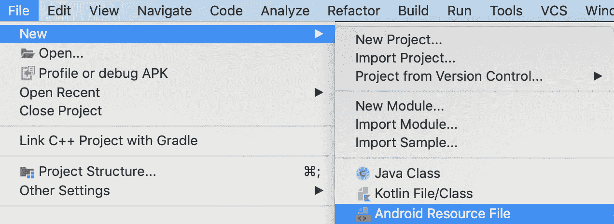

    图 3.17:创建安卓资源文件的菜单选项

5.  Once this dialog appears, change the `Resource type` to `Navigation` and then name the file `nav_graph`:

    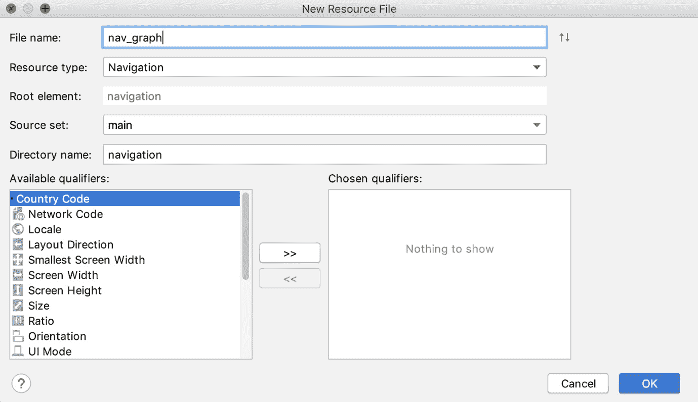

    图 3.18:新建资源文件对话框

    单击“确定”继续。这将在名为`Navigation`的`res`文件夹中创建新文件夹，其中包含`nav_graph.xml`。

6.  Opening the file, you see the following code:

    ```kt
    <?xml version="1.0" encoding="utf-8"?>
    <navigation xmlns:android="http://schemas.android.com/apk/res/  android"
        xmlns:app="http://schemas.android.com/apk/res-auto"
        android:id="@+id/nav_graph">
    </navigation>
    ```

    由于它没有在任何地方使用，您可能会看到带有红色下划线的`<navigation>`元素的警告:

    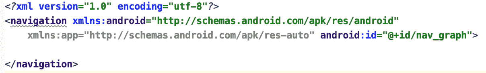

    图 3.19:导航未使用警告下划线

    暂时忽略这个。

7.  Update the `nav_graph.xml` navigation file with the following code:

    ```kt
    <?xml version="1.0" encoding="utf-8"?>
    <navigation xmlns:android="http://schemas.android.com/apk/res/  android"
        xmlns:app="http://schemas.android.com/apk/res-auto"
        xmlns:tools="http://schemas.android.com/tools"
        android:id="@+id/nav_graph"
        app:startDestination="@id/starSignList">
        <fragment
            android:id="@+id/starSignList"
            android:name="com.example.jetpackfragments.ListFragment"
            android:label="List"
            tools:layout="@layout/fragment_list">
            <action
                android:id="@+id/star_sign_id_action"
                app:destination="@id/starSign">
            </action>
        </fragment>
        <fragment
            android:id="@+id/starSign"
            android:name="com.example.jetpackfragments.DetailFragment"
            android:label="Detail"
            tools:layout="@layout/fragment_detail" />
    </navigation>
    ```

    前面的文件是一个工作`Navigation`图。虽然语法不熟悉，但理解起来很简单:

    a.如果您添加静态片段，则`ListFragment`和`DetailFragment`将保持原样。

    b.有一个`id`来标识根`<navigation>`元素的图形和片段本身的标识。导航图引入了目的地的概念，所以在根`navigation`级别，有`app:startDestination`，它有`starSignList`的 ID，这是`ListFragment`，然后在`<fragment>`标签内，有`<action>`元素。

    c.动作是将导航图中的目的地链接在一起的东西。这里的目标操作有一个标识，因此您可以在代码中引用它，并且有一个目标，当使用时，它将指向该目标。

    现在您已经添加了导航图，您需要使用它来将活动和片段链接在一起。

8.  Open up `activity_main.xml` and replace the `TextView` inside the `ConstraintLayout` with the following `FragmentContainerView`:

    ```kt
    <?xml version="1.0" encoding="utf-8"?>
    <androidx.fragment.app.FragmentContainerView   xmlns:android="http://schemas.android.com/apk/res/android"
        xmlns:app="http://schemas.android.com/apk/res-auto"
        android:id="@+id/nav_host_fragment"
        android:name="androidx.navigation.fragment.NavHostFragment"
        android:layout_width="match_parent"
        android:layout_height="match_parent"
        app:defaultNavHost="true"
        app:navGraph="@navigation/nav_graph" /> 
    ```

    添加了一个`FragmentContainerView`，名字为`android:name="androidx.navigation.fragment.NavHostFragment"`。它将托管您刚刚创建的`app:navGraph="@navigation/nav_graph"`的片段。`app:defaultNavHost`表示这是应用的默认导航图。当一个片段替换另一个片段时，它还控制反向导航。您可以在一个布局中有多个`NavHostFragment`来控制屏幕的两个或更多区域来管理它们自己的片段，您可以在平板电脑中使用双面板布局，但是只能有一个默认值。

    在`ListFragment`中，您需要进行一些更改才能使应用按预期工作。

9.  Firstly, remove the class file header and references to the `StarSignListener`. So, the following will be replaced:

    ```kt
    interface StarSignListener {
        fun onSelected(starSignId: Int)
    }
    class ListFragment : Fragment(), View.OnClickListener {
        private lateinit var starSignListener: StarSignListener
        override fun onAttach(context: Context) {
            super.onAttach(context)
            if (context is StarSignListener) {
                starSignListener = context
            } else {
                throw RuntimeException("Must implement StarSignListener")
            }
        }
    ```

    它将被替换为下面一行代码:

    ```kt
    class ListFragment : Fragment() {
    ```

10.  接下来，在类的底部，移除`onClick`被覆盖的方法，因为您没有实现`View.OnClicklistener` :

    ```kt
    override fun onClick(v: View?) {
        v?.let { starSign ->
            starSignListener.onSelected(starSign.id)
        }
    }
    ```

11.  In the `onViewCreated` method, replace the `forEach` statement that loops over the star sign views:

    ```kt
    starSigns.forEach {
        it.setOnClickListener(this)
    }
    ```

    用下面的代码替换它，并将导航导入添加到导入列表中:

    ```kt
    import androidx.navigation.Navigation
    starSigns.forEach { starSign ->
        val fragmentBundle = Bundle()
        fragmentBundle.putInt(STAR_SIGN_ID, starSign.id)
        starSign.setOnClickListener(
            Navigation.createNavigateOnClickListener(
                R.id.star_sign_id_action,
                fragmentBundle
            )
        )
    }
    ```

    这里，您正在创建一个包，将带有所选星标视图标识的`STAR_SIGN_ID`传递给一个`NavigationClickListener`。当点击`R.id.star_sign_id_action`动作时，它使用该动作的标识来加载`DetailFragment`，因为这是该动作的目的地。`DetailFragment`不需要任何更改，使用传入的片段参数加载所选星座 ID 的详细信息。

12.  运行该应用，您将看到该应用的行为与以前一样。

现在，您已经能够删除大量样板代码，并在导航图中记录应用内的导航。此外，您已经将更多的**片段生命周期**的管理转移到了安卓框架上，从而节省了更多的时间来处理特性。Jetpack Navigation 是一个强大的`androidx`组件，使您能够映射整个应用以及片段、活动等之间的关系。您还可以有选择地使用它来管理应用中定义了用户流的不同区域，例如，启动应用并引导用户通过一系列欢迎屏幕，或者一些向导布局用户旅程。

有了这些知识，让我们试着用从所有这些练习中学到的技巧来完成一项活动。

## 活动 3.01:创建行星测验

在本活动中，您将创建一个测验，用户必须回答太阳系行星上的三个问题之一。您选择使用的片段数量由您决定。但是，考虑到本章的内容，即将 UI 和逻辑分离成单独的片段组件，很可能您将使用两个或更多片段来实现这一点。下面的截图显示了一种方法，但是有多种方法可以创建这个应用。您可以使用本章中详细介绍的方法之一，例如静态片段、动态片段、Jetpack Navigation 组件，或者使用这些方法和其他方法的组合的一些自定义方法。

小考内容如下。在用户界面中，你需要问用户这三个问题:

*   最大的行星是什么？
*   哪个星球的卫星最多？
*   哪颗行星会侧转？

然后你需要提供一个行星列表，用户可以在其中选择一个他们认为是问题答案的行星:

*   `MERCURY`
*   `VENUS`
*   `EARTH`
*   `MARS`
*   `JUPITER`
*   `SATURN`
*   `URANUS`
*   `NEPTUNE`

一旦他们给出了答案，你需要向他们展示他们是对还是错。正确的答案应该附有一些文字，给出问题答案的更多细节。

```kt
Jupiter is the largest planet and is 2.5 times the mass of all the other planets put together.
Saturn has the most moons and has 82 moons.
Uranus spins on its side with its axis at nearly a right angle to the sun.
```

以下是一些截图，展示了用户界面如何满足您需要构建的应用的要求:

**问题屏幕**

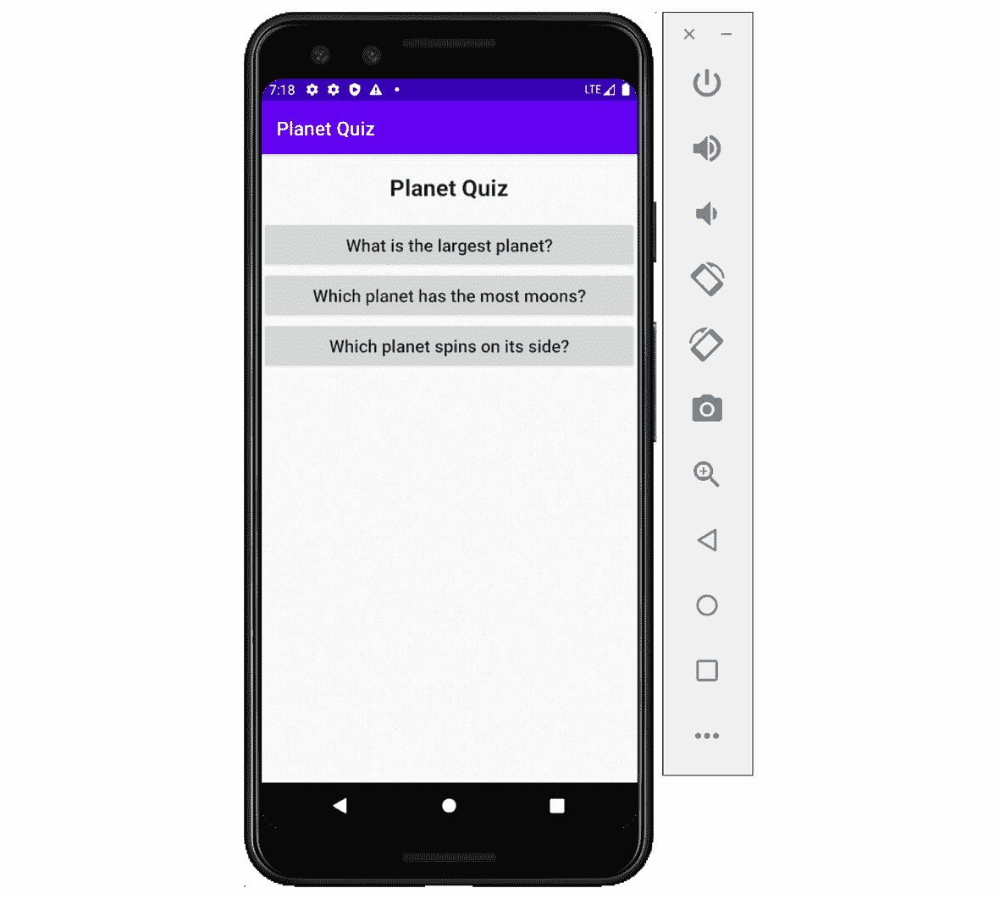

图 3.20:行星测验问题屏幕

**答案选项屏幕**

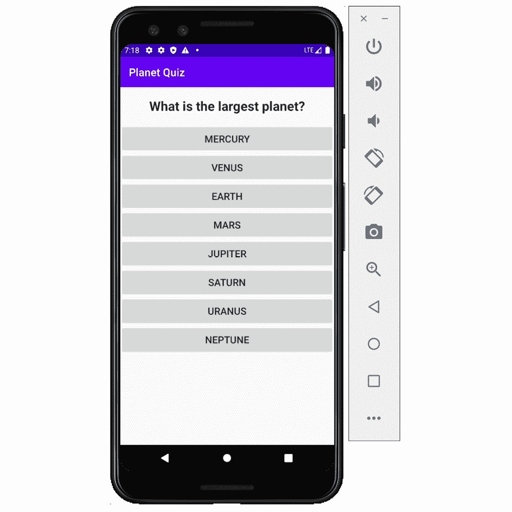

图 3.21:行星测验选择题答案屏幕

**回答画面**

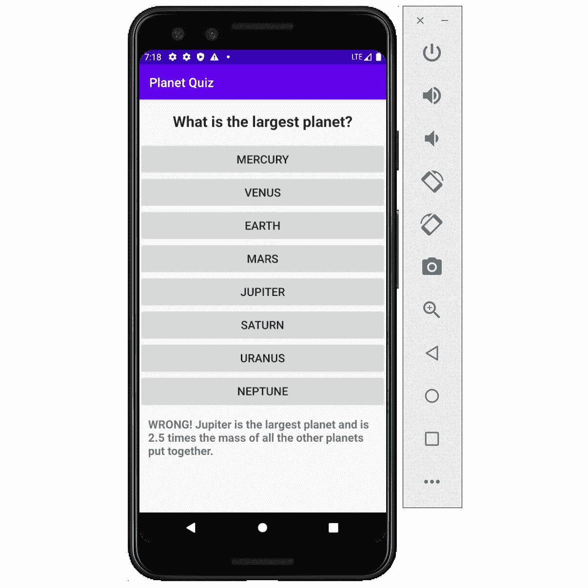

图 3.22:包含详细答案的行星测验答案屏幕

以下步骤将有助于完成活动:

1.  用`Empty Activity`创建一个安卓项目
2.  用项目所需的条目更新`strings.xml`文件。
3.  用项目的样式修改`themes.xml`文件。
4.  创建一个`QuestionsFragment`，用问题更新布局，添加与按钮和点击监听器的交互。
5.  或者，创建一个选择题片段，并添加答案选项和按钮点击处理(这也可以通过将可能的答案选项添加到`QuestionsFragment`来完成)。
6.  Create an `AnswersFragment` that displays the relevant question's answer and also displays more details about the answer itself.

    注意

    这个活动的解决方案可以在:[http://packt.live/3sKj1cp](03.html)找到

本章所有练习和活动的来源位于[http://packt.live/3qw0nms](http://packt.live/3qw0nms)。

# 总结

本章已经深入介绍了 f 片段，首先学习**片段生命周期**以及在您自己的片段中要覆盖的关键功能。然后，我们继续用 XML 向应用静态添加简单的片段，并演示用户界面显示和逻辑如何在单个片段中独立存在。然后介绍了如何使用`ViewGroup`向应用添加片段以及动态添加和替换片段的其他选项。然后，我们完成了如何通过使用喷气背包导航组件来简化这一过程。

碎片是安卓开发的基础构件之一。您在这里学到的概念将允许您在创建越来越高级的应用的基础上继续前进。片段是在应用中构建有效导航的核心，以便绑定简单易用的特性和功能。下一章将通过使用已建立的用户界面模式来构建清晰一致的导航来详细探讨这一领域，并说明如何使用片段来实现这一点。