# 4。构建应用导航

概观

在本章中，您将通过三种主要模式构建用户友好的应用程序导航:底部导航、导航抽屉和选项卡式导航。通过指导理论和实践，您将了解这些模式的工作原理，以便用户可以轻松访问您的应用程序内容。本章还将重点关注让用户知道他们在应用程序中的位置，以及他们可以导航到应用程序层次结构的哪个级别。

到本章结束时，您将知道如何使用这三种主要导航模式，并了解它们如何与应用程序栏一起支持导航。

# 简介

在前一章中，您探索了片段和**片段生命周期**，并使用了 Jetpack 导航来简化它们在应用程序中的使用。在本章中，您将学习如何在继续使用 Jetpack 导航的同时，向您的应用程序添加不同类型的导航。在探索底部导航和选项卡导航之前，您将首先了解导航抽屉，这是安卓应用程序中最早广泛采用的导航模式。您将了解安卓导航用户流，它是如何围绕目的地构建的，以及它们如何管理应用程序中的导航。将解释主要和次要目的地之间的区别，以及三种主要导航模式中哪一种更合适，这取决于您的应用程序的用例。

让我们从导航概述开始。

# 导航概述

安卓导航用户流是围绕你的应用中所谓的*目的地*构建的。在应用程序的顶层有主要目的地，随后，它们总是显示在主应用程序导航和次要目的地中。三种导航模式中的每一种的指导原则都是在上下文中提供关于用户在任何时间点所处的应用程序主要部分的信息。

这可以采取用户所在目的地的顶部应用栏中的标签的形式，可选地显示用户不在顶层的箭头提示，和/或在用户界面中提供指示用户所在部分的高亮文本和图标。应用程序中的导航应该流畅自然，直观地引导用户，同时提供他们在任何给定时间点所处位置的一些上下文。您将要探索的三种导航模式都以不同的方式实现了这个目标。这些导航模式中的一些更适合用于显示更多的顶级主要目的地，而另一些则不太适合。

# 导航抽屉

导航抽屉是安卓应用中最常见的导航模式之一，当然也是第一个被广泛采用的模式。下面是下一个练习高潮的截图，显示了一个处于关闭状态的简单导航抽屉:

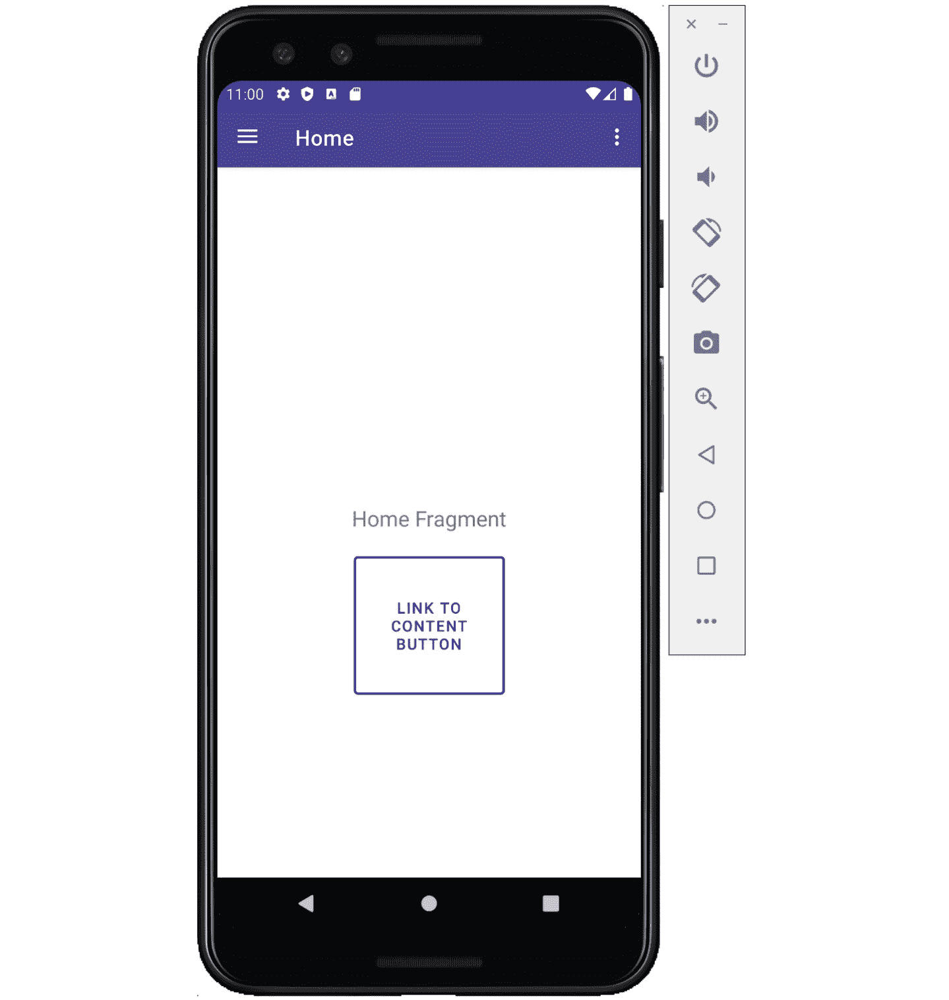

图 4.1:导航抽屉关闭的应用程序

导航抽屉是通过俗称的汉堡菜单进入的，汉堡菜单是*图 4.1* 左上角三条横线的图标。导航选项在屏幕上不可见，但关于您所在屏幕的上下文信息会显示在顶部的应用程序栏中。这还可以伴随着屏幕右侧的溢出菜单，通过它可以访问其他上下文相关的导航选项。下面的截图是一个处于打开状态的导航抽屉，显示了所有的导航选项:

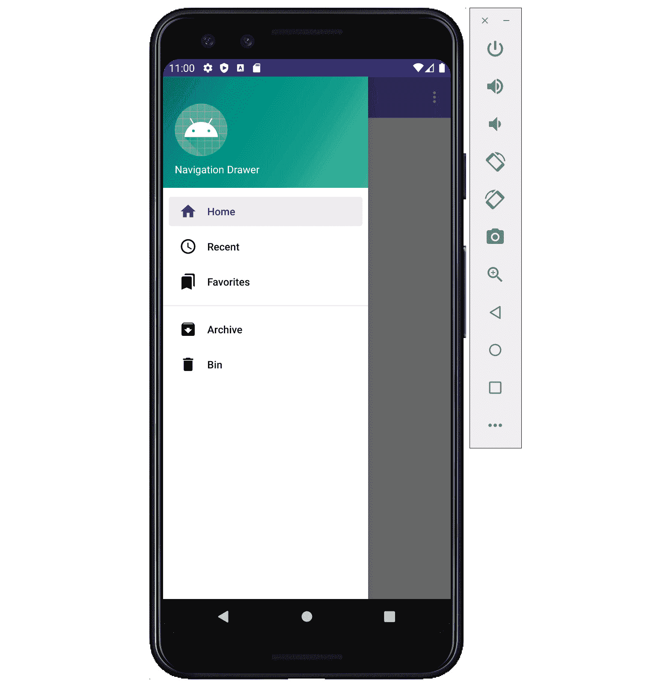

图 4.2:打开导航抽屉的应用程序

选择汉堡菜单后，导航抽屉从左侧滑出，当前部分高亮显示。可以显示图标，也可以不显示图标。由于导航占据屏幕高度的特性，它最适合五个或更多顶级目的地。目的地也可以分组在一起，以指示主目的地的多个层次结构(由前面屏幕截图中的分隔线显示)，并且这些层次结构也可以有标签。此外，抽屉内容也是可滚动的。总之，导航抽屉是一种非常方便的方式，可以快速访问应用程序的许多不同目的地。导航抽屉的一个缺点是，它需要用户选择汉堡菜单，目的地才变得可见。相比之下，选项卡和底部导航(带有固定选项卡)总是可见的。相反，这也是导航抽屉的一个优势，因为更多的屏幕空间可以用于应用程序的内容。

让我们从本章的第一个练习开始，创建一个导航抽屉，这样我们就可以访问应用程序的所有部分。

## 练习 4.01:使用导航抽屉创建应用程序

在本练习中，您将在安卓工作室中使用空活动项目模板创建一个名为`Navigation Drawer` 的新应用程序，同时保持所有其他默认值不变。有一些向导选项，您可以使用本章练习中将要生成的所有导航模式创建一个新项目，但是我们将逐步构建应用程序来指导您完成这些步骤。您将构建一个经常使用导航抽屉的应用程序，例如新闻或邮件应用程序。我们将要添加的部分是`Home`、`Favorites`、`Recents`、`Archive`、`Bin`和`Settings`。

执行以下步骤完成本练习:

1.  使用名为“导航抽屉”的空活动创建一个新项目。不要使用`Navigation Drawer Activity`项目模板，因为我们将使用增量步骤来构建应用程序。
2.  将您需要的渐变依赖项添加到`app/build.gradle` :

    ```kt
    implementation   'androidx.navigation:navigation-fragment-ktx:2.3.2'
    implementation 'androidx.navigation:navigation-ui-ktx:2.3.2'
    ```

3.  Then, add/update all the resource files you will need in the app. Start by adding the `dimens.xml` file to the `res/values` folder:

    dimens . XML

    ```kt
    <?xml version="1.0" encoding="utf-8"?>
    <resources>
        <dimen name="activity_horizontal_padding">16dp</dimen>
        <dimen name="activity_vertical_padding">16dp</dimen>
        <dimen name="nav_header_vertical_spacing">8dp</dimen>
        <dimen name="nav_header_height">176dp</dimen>
    </resources>
    ```

4.  Update `strings.xml` and replace `themes.xml` in the `res/values` folder with the following content:

    **strings.xml**

    ```kt
        <string name="nav_header_desc">Navigation header</string>
        <string name="home">Home</string>
        <string name="settings">Settings</string>
        <string name="content">Content</string>
        <string name="archive">Archive</string>
        <string name="recent">Recent</string>
        <string name="favorites">Favorites</string>
        <string name="bin">Bin</string>
        <string name="home_fragment">Home Fragment</string>
        <string name="settings_fragment">      Settings Fragment</string>
        <string name="content_fragment">Content Fragment</string>
        <string name="archive_fragment">Archive Fragment</string>
        <string name="recent_fragment">Recent Fragment</string>
        <string name="favorites_fragment">      Favorites Fragment</string>
        <string name="bin_fragment">Bin Fragment</string>
        <string name="link_to_content_button">      Link to Content Button</string>
    ```

    **themes.xml**

    ```kt
    <resources xmlns:tools="http://schemas.android.com/tools">
        <!-- Base application theme. -->
        <style name="Theme.NavigationDrawer" parent=      "Theme.MaterialComponents.DayNight.DarkActionBar">
            <!-- Primary brand color. -->
            <item name="colorPrimary">@color/purple_500</item>
            <item name="colorPrimaryVariant">          @color/purple_700</item>
            <item name="colorOnPrimary">@color/white</item>
            <!-- Secondary brand color. -->
            <item name="colorSecondary">@color/teal_200</item>
            <item name="colorSecondaryVariant">          @color/teal_700</item>
            <item name="colorOnSecondary">@color/black</item>
            <!-- Status bar color. -->
            <item name="windowActionBar">false</item>
            <item name="windowNoTitle">true</item>
            <!-- Customize your theme here. -->
        </style>
        <style name="Theme.NavigationDrawer.NoActionBar">
            <item name="windowActionBar">false</item>
            <item name="windowNoTitle">true</item>
        </style>
        <style name="Theme.NavigationDrawer.AppBarOverlay"       parent="ThemeOverlay.AppCompat.Dark.ActionBar" />
        <style name="Theme.NavigationDrawer.PopupOverlay"         parent="ThemeOverlay.AppCompat.Light" />
        <style name="button_card" parent=        "Widget.MaterialComponents.Button.OutlinedButton">
            <item name="strokeColor">@color/purple_700</item>
            <item name="strokeWidth">2dp</item>
        </style>
    </resources>
    ```

5.  从工具栏创建以下片段`(File` | `New` | `Fragment` | `Fragment (Blank)`:
    *   `HomeFragment`
    *   `FavoritesFragment`
    *   `RecentFragment`
    *   `ArchiveFragment`
    *   `SettingsFragment`
    *   `BinFragment`
    *   `ContentFragment`
6.  Change each of these fragment layouts to use the following content:

    ```kt
    <?xml version="1.0" encoding="utf-8"?>
    <androidx.constraintlayout.widget.ConstraintLayout   xmlns:android="http://schemas.android.com/apk/res/android"
        xmlns:app="http://schemas.android.com/apk/res-auto"
        android:layout_width="match_parent"
        android:layout_height="match_parent">
        <TextView
            android:layout_width="match_parent"
            android:layout_height="wrap_content"
            android:layout_marginStart="8dp"
            android:layout_marginTop="8dp"
            android:layout_marginBottom="8dp"
            android:layout_marginEnd="8dp"
            android:text="@string/archive_fragment"
            android:textAlignment="center"
            android:layout_gravity="center_horizontal"
            android:textSize="20sp"
            app:layout_constraintBottom_toBottomOf="parent"
            app:layout_constraintEnd_toEndOf="parent"
            app:layout_constraintStart_toStartOf="parent"
            app:layout_constraintTop_toTopOf="parent" />
    </androidx.constraintlayout.widget.ConstraintLayout>
    ```

    唯一不同的是`android:text`属性，它会有来自`strings.xml`文件的对应字符串。因此，用正确的字符串创建这些片段，指示用户正在查看哪个片段。这看起来有点重复，可以用这个文本更新一个片段，但是它展示了如何在一个真实的应用程序中分离不同的部分。

7.  Update the `fragment_home.xml` layout adding a button to it (this is the body content you can see in *Figure 4.1*, with the closed navigation drawer):

    ```kt
    <?xml version="1.0" encoding="utf-8"?>
    <androidx.constraintlayout.widget.ConstraintLayout   xmlns:android="http://schemas.android.com/apk/res/android"
        xmlns:app="http://schemas.android.com/apk/res-auto"
        android:layout_width="match_parent"
        android:layout_height="match_parent">
        <TextView
            android:id="@+id/text_home"
            android:layout_width="match_parent"
            android:layout_height="wrap_content"
            android:layout_marginStart="8dp"
            android:layout_marginEnd="8dp"
            android:layout_marginBottom="8dp"
            android:text="@string/home_fragment"
            android:textAlignment="center"
            android:layout_gravity="center_horizontal"
            android:textSize="20sp"
            app:layout_constraintBottom_toBottomOf="parent"
            app:layout_constraintEnd_toEndOf="parent"
            app:layout_constraintStart_toStartOf="parent"
            app:layout_constraintTop_toTopOf="parent" />
     <com.google.android.material.button.MaterialButton
     android:id="@+id/button_home"
     style="@style/button_card"
     android:layout_width="140dp"
     android:layout_height="140dp"
     android:layout_marginTop="16dp"
     android:text="@string/link_to_content_button"
     app:layout_constraintEnd_toEndOf="parent"
     app:layout_constraintStart_toStartOf="parent"
     app:layout_constraintTop_toBottomOf="@+id/text_home" />
    </androidx.constraintlayout.widget.ConstraintLayout>
    ```

    `TextView`与其他片段布局中指定的相同，除了它有一个 ID ( `id`)来约束它下面的按钮。

8.  Create the navigation graph that will be used in the app.

    选择`File` | `New` | `Android Resource File`(确保在项目窗口中选择了 res 文件夹，这样您就可以看到该选项)或者右键单击 res 文件夹来查看该选项。选择`Navigation`作为资源类型，并将其命名为`mobile_navigation.xml`。

    这将创建导航图:

    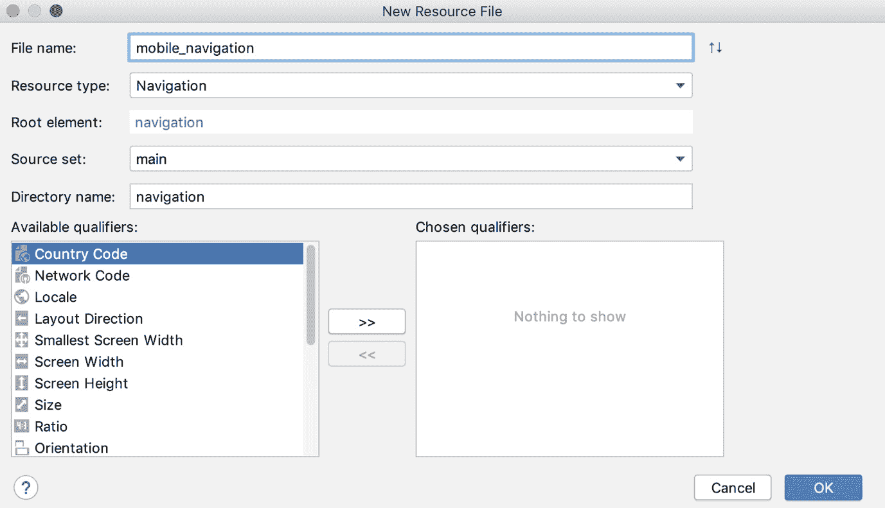

    图 4.3:安卓工作室新资源文件对话框

9.  Open the `mobile_navigation.xml` file in the `res/navigation` folder and update it with the code from the file in the link below. A truncated version of the code is shown here. See the link for the entire code block you need to use:

    mobile_navigation.xml

    ```kt
    8    <fragment
    9        android:id="@+id/nav_home"
    10        android:name="com.example.navigationdrawer                            .HomeFragment"
    11        android:label="@string/home"
    12        tools:layout="@layout/fragment_home">
    13        <action
    14            android:id="@+id/nav_home_to_content"
    15            app:destination="@id/nav_content"
    16            app:popUpTo="@id/nav_home" />
    17    </fragment>
    18
    19    <fragment
    20        android:id="@+id/nav_content"
    21        android:name="com.example.navigationdrawer                            .ContentFragment"
    22        android:label="@string/content"
    23        tools:layout="@layout/fragment_content" />
    ```

    这个步骤的完整代码可以在[http://packt.live/38W9maC](http://packt.live/38W9maC)找到。

    这将在您的应用程序中创建所有目的地。但是，它没有指定这些是主要目的地还是次要目的地。从上一章的片段 Jetpack 导航练习中应该很熟悉这一点。这里需要注意的最重要的一点是`app:startDestination="@+id/nav_home`，它指定了当导航加载时将显示什么，并且在`HomeFragment`内有一个动作可以移动到图形中的`nav_content`目的地:

    ```kt
            <action
                android:id="@+id/nav_home_to_content"
                app:destination="@id/nav_content"
                app:popUpTo="@id/nav_home" />
    ```

    您现在将看到这是如何在`HomeFragment`中设置的及其布局。

10.  Open the fragment_home.xml layout file. Then open the layout file in design view by selecting the `Design` option in the top-right-hand corner:

    

    图 4.4:安卓工作室设计视图标题

    您将看到显示器呈现为正方形，有时称为`card`显示器。如果你看一下按钮的样式，你会发现它继承自一个材质组件。`Material`风格使你的应用程序与基本交互元素的主题化变得非常简单。在这种情况下，您正在按钮周围添加一个带有笔画(边框)的样式，当您运行该应用程序时，您将在**用户界面** ( **用户界面**)中选择它时会看到一个按钮动画:

    ```kt
    <style name="button_card"   parent="Widget.MaterialComponents.Button.OutlinedButton">
        <item name="strokeColor">@color/colorPrimary</item>
        <item name="strokeWidth">2dp</item>
    </style>
    ```

11.  `Open HomeFragment` and update `onCreateView` to set up the button:

    **HomeFragment**

    ```kt
    package com.example.navigationdrawer
    import android.os.Bundle
    import android.view.LayoutInflater
    import android.view.View
    import android.view.ViewGroup
    import android.widget.Button
    import androidx.fragment.app.Fragment
    import androidx.navigation.Navigation
    class HomeFragment : Fragment() {
        override fun onCreateView(
            inflater: LayoutInflater,
            container: ViewGroup?,
            savedInstanceState: Bundle?
        ): View? {
            val view = inflater.inflate(R.layout.fragment_home,           container, false)
            view.findViewById<Button>          (R.id.button_home)?.setOnClickListener(
                Navigation.createNavigateOnClickListener               (R.id.nav_home_to_content, null)
            )
            return view
        }
    }
    ```

    这使用导航点击监听器在点击`button_home`时完成`R.id.nav_home_to_content`动作。

    但是，这些更改不会有任何作用，因为您仍然需要为应用程序设置导航主机，并添加所有其他布局文件以及导航抽屉。

12.  通过在名为`content_main.xml`的布局文件夹中创建新文件来创建`Nav`主机片段。这可以通过右键单击`res`目录中的`layout`文件夹，然后转到`File` | `New` | `Layout Resource File`来完成。一旦创建，用`FragmentContainerView` :

    ```kt
    <?xml version="1.0" encoding="utf-8"?>
    <androidx.fragment.app.FragmentContainerView
        xmlns:android="http://schemas.android.com/apk/res/android"
        xmlns:app="http://schemas.android.com/apk/res-auto"
        android:id="@+id/nav_host_fragment"
        android:name="androidx.navigation.fragment       .NavHostFragment"
        android:layout_width="match_parent"
        android:layout_height="match_parent"
        app:defaultNavHost="true"
        app:navGraph="@navigation/mobile_navigation" />
    ```

    更新它
13.  您会注意到导航图被设置为您刚刚创建的图:

    ```kt
            app:navGraph="@navigation/mobile_navigation"
    ```

14.  With that, the body of the app and its destination have been set up. Now, you need to set up the UI navigation. Create another layout resource file called `nav_header_main.xml` and add the following content:

    ```kt
    <?xml version="1.0" encoding="utf-8"?>
    <LinearLayout   xmlns:android="http://schemas.android.com/apk/res/android"
        xmlns:app="http://schemas.android.com/apk/res-auto"
        android:layout_width="match_parent"
        android:layout_height="@dimen/nav_header_height"
        android:background="@color/teal_700"
        android:gravity="bottom"
        android:orientation="vertical"
        android:paddingLeft="@dimen/activity_horizontal_margin"
        android:paddingTop="@dimen/activity_vertical_margin"
        android:paddingRight="@dimen/activity_horizontal_margin"
        android:paddingBottom="@dimen/activity_vertical_margin"
        android:theme="@style/ThemeOverlay.AppCompat.Dark">
        <ImageView
            android:id="@+id/imageView"
            android:layout_width="wrap_content"
            android:layout_height="wrap_content"
            android:contentDescription="@string/nav_header_desc"
            android:paddingTop=          "@dimen/nav_header_vertical_spacing"
            app:srcCompat="@mipmap/ic_launcher_round" />
        <TextView
            android:layout_width="match_parent"
            android:layout_height="wrap_content"
            android:paddingTop=          "@dimen/nav_header_vertical_spacing"
            android:text="@string/app_name"
            android:textAppearance=          "@style/TextAppearance.AppCompat.Body1" />
    </LinearLayout>
    ```

    这是导航抽屉标题中显示的布局。

15.  Create the app bar with a toolbar layout file, called `app_bar_main.xml`, and include the following content:

    ```kt
    <?xml version="1.0" encoding="utf-8"?>
    <androidx.coordinatorlayout.widget.CoordinatorLayout   xmlns:android="http://schemas.android.com/apk/res/android"
        xmlns:app="http://schemas.android.com/apk/res-auto"
        xmlns:tools="http://schemas.android.com/tools"
        android:layout_width="match_parent"
        android:layout_height="match_parent"
        tools:context=".MainActivity">
        <com.google.android.material.appbar.AppBarLayout
            android:layout_width="match_parent"
            android:layout_height="wrap_content"
            android:theme=          "@style/Theme.NavigationDrawer.AppBarOverlay">
            <androidx.appcompat.widget.Toolbar
                android:id="@+id/toolbar"
                android:layout_width="match_parent"
                android:layout_height="?attr/actionBarSize"
                android:background="?attr/colorPrimary"
                app:popupTheme=              "@style/Theme.NavigationDrawer.PopupOverlay" />
        </com.google.android.material.appbar.AppBarLayout>
        <include layout="@layout/content_main" />
    </androidx.coordinatorlayout.widget.CoordinatorLayout>
    ```

    这将应用程序的主体布局与其上方的应用程序栏集成在一起。剩下的部分是创建将出现在导航抽屉中的项目，并使用这些项目创建和填充导航抽屉。

16.  To use icons with these menu items you need to copy the vector assets in the drawable folder of the completed exercise to the drawable folder of your project. Vector assets use coordinates for points, lines and curves to layout images with associated color information. They are significantly smaller when compared to png and jpg images and vectors can be resized to different sizes without loss of quality. You can find them here: [http://packt.live/2XQnY5a](http://packt.live/2XQnY5a )

    复制以下图纸:

    *   `favorites.xml`
    *   `archive.xml`
    *   `recent.xml`
    *   `home.xml`
    *   `bin.xml`
17.  These icons are going to be used for the menu items. To create your own icon, import a `.svg` file into Android Studio or select one of the stock images that come bundled with Android Studio. To see this in action, go to `File` | `New` | `Vector Asset` and make sure you have the `res` folder selected so that these menu options appear. An example of one of these assets is below (You can select the 'Clip Art' icon to see others):

    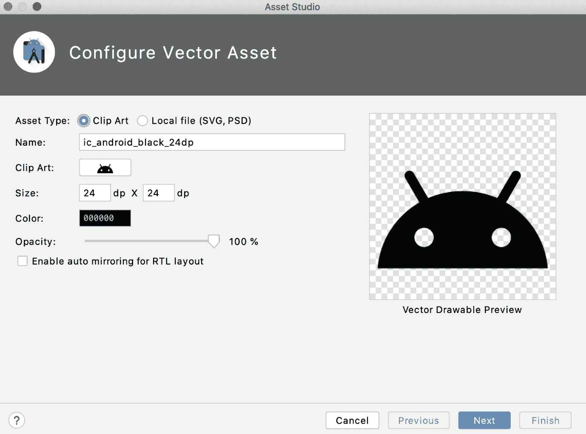

    图 4.5:配置矢量资产

18.  使用本地文件选项导入`.svg`或`.psd`文件，或选择剪贴画添加一个安卓工作室图标。
19.  Create a menu with these items. To do this, go to `File` | `New` | `Android Resource File`, select `Menu` as the resource type, call it `activity_main_drawer`, and then populate it with the following content:

    ```kt
    <?xml version="1.0" encoding="utf-8"?>
    <menu   xmlns:android="http://schemas.android.com/apk/res/android"
        xmlns:tools="http://schemas.android.com/tools"
        tools:showIn="navigation_view">
        <group
            android:id="@+id/menu_top"
            android:checkableBehavior="single">
            <item
                android:id="@+id/nav_home"
                android:icon="@drawable/home"
                android:title="@string/home" />
            <item
                android:id="@+id/nav_recent"
                android:icon="@drawable/recent"
                android:title="@string/recent" />
            <item
                android:id="@+id/nav_favorites"
                android:icon="@drawable/favorites"
                android:title="@string/favorites" />
        </group>
        <group
            android:id="@+id/menu_bottom"
            android:checkableBehavior="single">
            <item
                android:id="@+id/nav_archive"
                android:icon="@drawable/archive"
                android:title="@string/archive" />
            <item
                android:id="@+id/nav_bin"
                android:icon="@drawable/bin"
                android:title="@string/bin" />
        </group>
    </menu>
    ```

    这将设置出现在导航抽屉本身中的菜单项。将菜单项与导航图中的目的地联系起来的神奇之处在于标识的名称。如果菜单项的标识(在`activity_main_drawer.xml`中)与导航图中目的地的标识完全匹配(在本例中，目的地是`mobile_navigation.xml`中的片段)，则目的地会自动加载到导航主机中。

20.  `MainActivity`的布局将导航抽屉与之前指定的所有布局联系起来。打开`activity_main.xml`，更新内容如下:

    ```kt
    <?xml version="1.0" encoding="utf-8"?>
    <androidx.drawerlayout.widget.DrawerLayout   xmlns:android="http://schemas.android.com/apk/res/android"
        xmlns:app="http://schemas.android.com/apk/res-auto"
        xmlns:tools="http://schemas.android.com/tools"
        android:id="@+id/drawer_layout"
        android:layout_width="match_parent"
        android:layout_height="match_parent"
        android:fitsSystemWindows="true"
        tools:openDrawer="start">
        <include
            layout="@layout/app_bar_main"
            android:layout_width="match_parent"
            android:layout_height="match_parent" />
        <com.google.android.material.navigation.NavigationView
            android:id="@+id/nav_view"
            android:layout_width="wrap_content"
            android:layout_height="match_parent"
            android:layout_gravity="start"
            android:fitsSystemWindows="true"
            app:headerLayout="@layout/nav_header_main"
            app:menu="@menu/activity_main_drawer" />
    </androidx.drawerlayout.widget.DrawerLayout>
    ```

21.  如你所见，有一个`include`用来添加`app_bar_main.xml`。`<include>`元素允许您添加将在编译时用实际布局本身替换的布局。它们允许我们封装不同的布局，因为它们可以在应用程序的多个布局文件中重用。`NavigationView`(创建导航抽屉的类)指定您刚刚创建的布局文件，以配置其标题和菜单项:

    ```kt
            app:headerLayout="@layout/nav_header_main"
            app:menu="@menu/activity_main_drawer"
    ```

22.  Now that you have specified all the layout files, update `MainActivity` by adding the following interaction logic:

    ```kt
    package com.example.navigationdrawer
    import android.os.Bundle
    import androidx.appcompat.app.AppCompatActivity
    import androidx.navigation.findNavController
    import androidx.navigation.fragment.NavHostFragment
    import androidx.navigation.ui.*
    import com.google.android.material.navigation.NavigationView
    class MainActivity : AppCompatActivity() {
        private lateinit var appBarConfiguration:       AppBarConfiguration
        override fun onCreate(savedInstanceState: Bundle?) {
            super.onCreate(savedInstanceState)
            setContentView(R.layout.activity_main)
            setSupportActionBar(findViewById(R.id.toolbar))
            val navHostFragment = supportFragmentManager           .findFragmentById(R.id.nav_host_fragment) as             NavHostFragment
            val navController = navHostFragment.navController
            //Creating top level destinations 
            //and adding them to the draw
            appBarConfiguration = AppBarConfiguration(
                setOf(
                    R.id.nav_home, R.id.nav_recent,                   R.id.nav_favorites, R.id.nav_archive,                     R.id.nav_bin
                ), findViewById(R.id.drawer_layout)
            )
            setupActionBarWithNavController(navController,           appBarConfiguration)
            findViewById<NavigationView>(R.id.nav_view)          ?.setupWithNavController(navController)
        }
        override fun onSupportNavigateUp(): Boolean {
            val navController =           findNavController(R.id.nav_host_fragment)
            return navController.navigateUp(appBarConfiguration)           || super.onSupportNavigateUp()
        }
    }
    ```

    现在，让我们看一下前面的代码。`setSupportActionBar(toolbar)`通过从布局中引用并设置工具栏来配置应用中使用的工具栏。使用以下代码检索`NavHostFragment`:

    ```kt
            val navHostFragment = supportFragmentManager
              .findFragmentById(R.id.nav_host_fragment) as             NavHostFragment
            val navController = navHostFragment.navController
    ```

    接下来，添加要在导航抽屉中显示的菜单项:

    ```kt
    appBarConfiguration = AppBarConfiguration(
        setOf(
            R.id.nav_home, R.id.nav_recent, R.id.nav_favorites,           R.id.nav_archive, R.id.nav_bin
        ), findViewById(R.id.drawer_layout)
    )
    ```

    `drawer_layout`是主 app 栏`nav_view`及其包含内容的容器。

    当这些项目显示在导航抽屉的`activity_main_drawer.xml`菜单中时，这看起来像是你做了两次。然而，在`AppBarConfiguration`中设置这些的功能是，当这些主要目的地被选择时，它们不会显示向上箭头，因为它们在顶层。它还添加了`drawer_layout`作为最后一个参数，以指定在导航抽屉中选择显示汉堡菜单时应该使用哪种布局。

    下一行如下:

    ```kt
    setupActionBarWithNavController(navController,   appBarConfiguration)
    ```

    这将设置带有导航图的应用程序栏，以便对目的地所做的任何更改都会反映在应用程序栏中:

    ```kt
    findViewById<NavigationView>  (R.id.nav_view)?.setupWithNavController(navController)
    ```

    这是`onCreate`中的最后一条语句，它指定了导航抽屉中当用户点击时应该突出显示的项目。

    类中的下一个函数处理按下辅助目标的向上按钮，确保它返回到其父主目标:

    ```kt
    override fun onSupportNavigateUp(): Boolean {
        val navController =       findNavController(R.id.nav_host_fragment)
        return navController.navigateUp(appBarConfiguration) ||       super.onSupportNavigateUp()
    }
    ```

    应用程序栏还可以通过溢出菜单显示其他菜单项，配置后，溢出菜单显示为右侧顶部的三个垂直点。看一看`menu/main.xml`文件:

    ```kt
    <?xml version="1.0" encoding="utf-8"?>
    <menu   xmlns:android="http://schemas.android.com/apk/res/android"
        xmlns:app="http://schemas.android.com/apk/res-auto">
        <item
            android:id="@+id/nav_settings"
            android:title="@string/settings"
            app:showAsAction="never" />
    </menu>
    ```

    该配置显示一项:`Settings`。由于它在导航图中指定了与`SettingsFragment`目的地相同的标识，`android:id="@+id/nav_settings"`将打开`SettingsFragment`。设置为`app:showAsAction="never"`的属性确保它将作为三点溢出菜单中的一个菜单选项，不会出现在应用程序栏本身。`app:showAsAction`还有其他值，设置菜单选项总是出现在应用栏上，如果有空间的话。详见此处完整列表:[https://developer . Android . com/guide/topics/resources/menu-resource](https://developer.android.com/guide/topics/resources/menu-resource)。

23.  To add the overflow menu to the app bar, add the following to the `MainActivity` class:

    ```kt
    override fun onCreateOptionsMenu(menu: Menu): Boolean {
        menuInflater.inflate(R.menu.main, menu)
        return true
    }
    override fun onOptionsItemSelected(item: MenuItem): Boolean {
        return item.onNavDestinationSelected(findNavController       (R.id.nav_host_fragment))
    }
    ```

    您还需要添加以下导入:

    ```kt
    import android.view.Menu
    import android.view.MenuItem
    ```

    `onCreateOptionsMenu`功能选择要添加到应用程序栏的菜单，而`onOptionsItemSelected`使用`item.onNavDestinationSelected(findNavController(R.id.nav_host_fragment))`导航功能处理选择项目时要做的事情。这用于导航到导航图中的目的地。

24.  Run the app and navigate to a top-level destination by using the navigation drawer. The following screenshot shows an example of navigating to the `Recent` destination:

    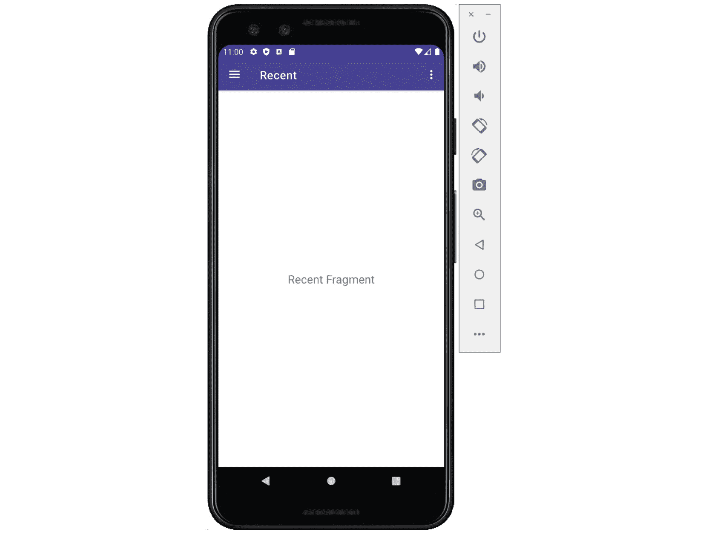

    图 4.6:从导航抽屉中打开的最近菜单项

25.  When you select the navigation drawer again to toggle it out, you will see that the `Recent` menu item is selected:

    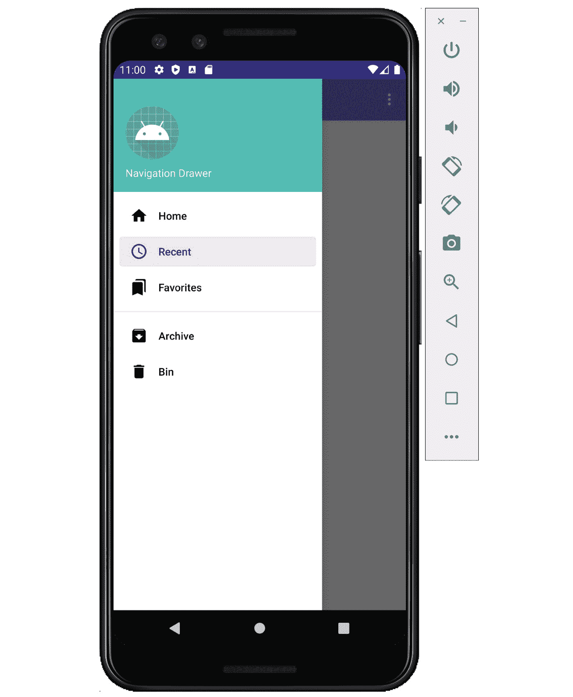

    图 4.7:导航抽屉中突出显示的最近菜单项

26.  Select the `Home` menu item again. This screen shows a link in the material-themed button that goes to a secondary content destination. When you select the button, a nice material animation will emanate from the center of the button to the outside:

    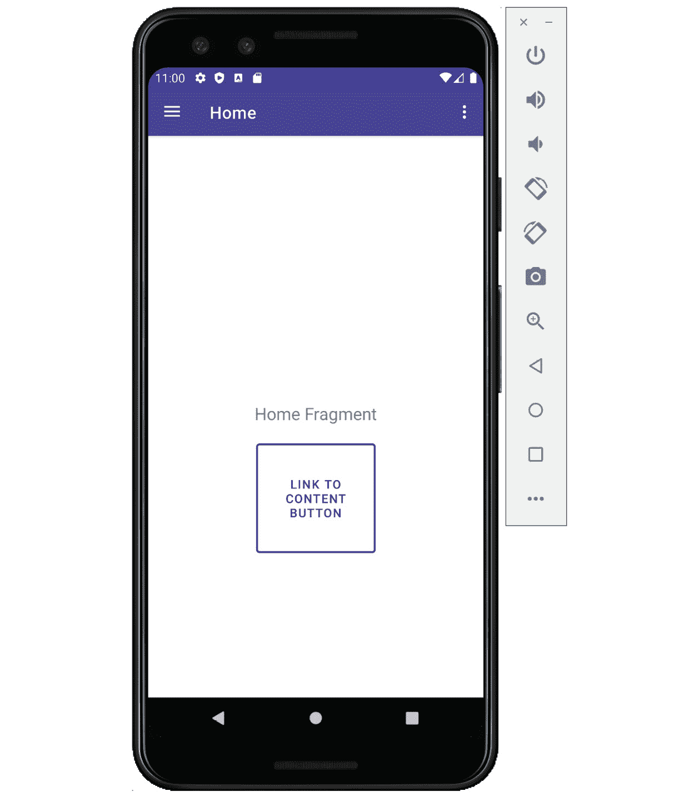

    图 4.8:带有辅助目的地按钮的主屏幕

27.  单击此按钮转到辅助目的地。您将看到一个向上的箭头显示:

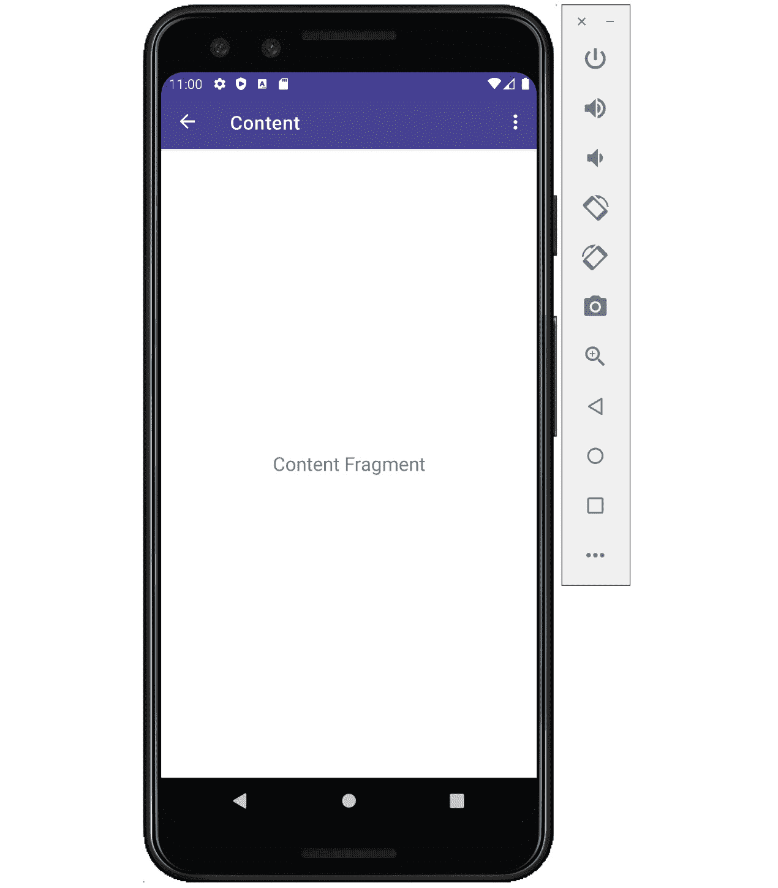

图 4.9:显示向上箭头的辅助目的地

在前面的所有截图中，显示了溢出菜单。选中后，会出现一个`Settings`选项。按下后，您将进入`SettingsFragment`，并显示向上箭头:

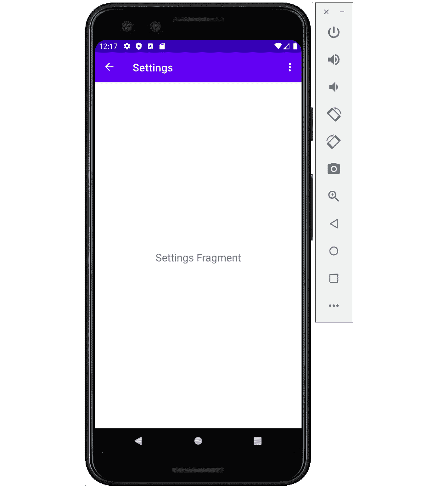

图 4.10:设置片段

虽然设置一个带有导航抽屉的应用程序需要经过很多步骤，但一旦创建，它就非常容易配置。通过在抽屉菜单中添加菜单项，在导航图中添加目的地，可以创建新的片段并立即设置使用。这删除了您在上一章中使用片段所需的大量样板代码。您将探索的下一个导航模式是底部导航。这已经成为安卓系统中最流行的导航模式，主要是因为它使应用程序的主要部分易于访问。

# 底部导航

当顶层目的地数量有限时，使用底部导航，这些目的地的范围可以从三个到五个彼此不相关的主要目的地。底部导航栏上的每个项目都显示一个图标和一个可选的文本标签。这种导航允许快速访问，因为无论用户导航到应用程序的哪个辅助目的地，项目总是可用的。

## 练习 4.02:在应用程序中添加底部导航

使用`Empty Activity`项目模板在安卓工作室创建一个名为`Bottom Navigation`的新应用，保持所有其他默认设置不变。不要使用`Bottom Navigation Activity`项目模板，因为我们将使用增量步骤来构建应用程序。您将构建一个忠诚度应用程序，为已经注册使用它的客户提供优惠、奖励等。底部导航在这类应用中非常常见，因为通常顶层目的地有限。让我们开始吧:

1.  许多步骤与前面的练习非常相似，因为您将使用 Jetpack 导航，并在导航图和相应的菜单中定义目的地。
2.  使用名为“导航抽屉”的空活动创建一个新项目。
3.  将您需要的渐变依赖项添加到`app/build.gradle` :

    ```kt
    implementation 'androidx.navigation:navigation-fragment-  ktx:2.3.2'
    implementation 'androidx.navigation:navigation-ui-ktx:2.3.2'
    ```

4.  将`colors.xml`替换为:

    ```kt
    <?xml version="1.0" encoding="utf-8"?>
    <resources>
        <color name="colorPrimary">#6200EE</color>
        <color name="colorPrimaryDark">#3700B3</color>
        <color name="colorAccent">#03DAC5</color>
    </resources>
    ```

5.  Append `strings.xml` and `themes.xml` in the `res/values` folder with the values below:

    **strings.xml**

    ```kt
        <!-- Bottom Navigation -->
        <string name="home">Home</string>
        <string name="tickets">Tickets</string>
        <string name="offers">Offers</string>
        <string name="rewards">Rewards</string>
        <!-- Action Bar -->
        <string name="settings">Settings</string>
        <string name="cart">Shopping Cart</string>
        <string name="content">Content</string>
        <string name="home_fragment">Home Fragment</string>
        <string name="tickets_fragment">Tickets Fragment</string>
        <string name="offers_fragment">Offers Fragment</string>
        <string name="rewards_fragment">Rewards Fragment</string>
        <string name="settings_fragment">      Settings Fragment</string>
        <string name="cart_fragment">      Shopping Cart Fragment</string>
        <string name="content_fragment">Content Fragment</string>
        <string name="link_to_content_button">      Link to Content Button</string>
    ```

    **themes.xml**

    ```kt
        <style name="button_card" parent=      "Widget.MaterialComponents.Button.OutlinedButton">
            <item name="strokeColor">@color/colorPrimary</item>
            <item name="strokeWidth">2dp</item>
            <item name="android:textColor">          @color/colorPrimary</item>
        </style>
    ```

    这里使用的材质样式与上一练习中创建主屏幕按钮时使用的样式相同。

6.  用以下名称创建八个片段:
    *   `HomeFragment`
    *   `ContentFragment`
    *   `OffersFragment`
    *   `RewardsFragment`
    *   `SettingsFragment`
    *   `TicketsFragment`
    *   `CartFragment`
7.  对添加相应字符串资源的所有片段应用与上一练习中相同的布局，除了`fragment_home.xml`。对于此布局，请使用上一练习中使用的相同布局文件。
8.  Create the navigation graph as you did in the previous exercise and call it `mobile_navigation`. Update it with the code from the file linked below. A truncated snippet of the code is shown here. Follow the link to see the full code you need to use:

    **mobile_navigation.xml**

    ```kt
    8    <fragment
    9        android:id="@+id/nav_home"
    10        android:name="com.example.bottomnavigation                            .HomeFragment"
    11        android:label="@string/home"
    12        tools:layout="@layout/fragment_home">
    13
    14        <action
    15            android:id="@+id/nav_home_to_content"
    16            app:destination="@id/nav_content"
    17            app:popUpTo="@id/nav_home" />
    18    </fragment>
    19
    20    <fragment
    21        android:id="@+id/nav_content"
    22        android:name="com.example.bottomnavigation                            .ContentFragment"
    23        android:label="@string/content"
    24        tools:layout="@layout/fragment_content" />
    ```

    这一步的完整代码可以在[http://packt.live/2KrgcLV](http://packt.live/2KrgcLV)找到。

9.  更新`HomeFragment`中的`onCreateView`功能，使用导航图中的目的地导航至`ContentFragment`。您还需要添加以下导入:

    ```kt
    import android.widget.Button
    import androidx.navigation.Navigation
        override fun onCreateView(
        inflater: LayoutInflater,
        container: ViewGroup?,
        savedInstanceState: Bundle?
    ): View? {
        val view = inflater.inflate(R.layout.fragment_home,       container, false)
        view.findViewById<Button>(R.id.button_home)      ?.setOnClickListener(
            Navigation.createNavigateOnClickListener           (R.id.nav_home_to_content, null)
        )
        return view
    }
    ```

10.  Now that the destinations have been defined in the navigation graph, create the menu in the bottom navigation to reference these destinations. First, however, you need to gather the icons that will be used in this exercise. Go to the completed exercise on GitHub and find the vector assets in the `drawable` folder:

    [http://packing . live/3qvuzjq](http://packt.live/3qvUzJQ)

    复制以下图纸:

    *   `cart.xml`
    *   `home.xml`
    *   `offers.xml`
    *   `rewards.xml`
    *   `tickets.xml`
11.  Create a `bottom_nav_menu` (Right click on the `res` folder and select `Android Resource File` and select `Menu` using all of these icons except the `cart.xml` vector asset which will be used for the top toolbar. Notice that the IDs of the items match the IDs in the navigation graph.

    **bottom_nav_menu.xml**

    ```kt
    <?xml version="1.0" encoding="utf-8"?>
    <menu   xmlns:android="http://schemas.android.com/apk/res/android">
        <item
            android:id="@+id/nav_home"
            android:icon="@drawable/home"
            android:title="@string/home" />
        <item
            android:id="@+id/nav_tickets"
            android:icon="@drawable/tickets"
            android:title="@string/tickets"/>
        <item
            android:id="@+id/nav_offers"
            android:icon="@drawable/offers"
            android:title="@string/offers" />
        <item
            android:id="@+id/nav_rewards"
            android:icon="@drawable/rewards"
            android:title="@string/rewards"/>
    </menu>
    ```

12.  Update the `activity_main.xml` file with the following content:

    **activity_main.xml**

    ```kt
    <?xml version="1.0" encoding="utf-8"?>
    <androidx.constraintlayout.widget.ConstraintLayout   xmlns:android="http://schemas.android.com/apk/res/android"
        xmlns:app="http://schemas.android.com/apk/res-auto"
        android:id="@+id/container"
        android:layout_width="match_parent"
        android:layout_height="match_parent"
        android:paddingTop="?attr/actionBarSize">
        <com.google.android.material.bottomnavigation       .BottomNavigationView
            android:id="@+id/nav_view"
            android:layout_width="0dp"
            android:layout_height="wrap_content"
            android:layout_marginStart="0dp"
            android:layout_marginEnd="0dp"
            android:background="?android:attr/windowBackground"
            app:layout_constraintBottom_toBottomOf="parent"
            app:layout_constraintLeft_toLeftOf="parent"
            app:layout_constraintRight_toRightOf="parent"
            app:menu="@menu/bottom_nav_menu"
            app:labelVisibilityMode="labeled"/>
        <androidx.fragment.app.FragmentContainerView
            android:id="@+id/nav_host_fragment"
            app:layout_constraintStart_toStartOf="parent"
            app:layout_constraintEnd_toEndOf="parent"
            app:layout_constraintLeft_toLeftOf="parent"
            app:layout_constraintRight_toRightOf="parent"
            app:layout_constraintTop_toTopOf="parent"
            android:name           ="androidx.navigation.fragment.NavHostFragment"
            android:layout_width="match_parent"
            android:layout_height="match_parent"
            app:defaultNavHost="true"
            app:navGraph="@navigation/mobile_navigation" />
    </androidx.constraintlayout.widget.ConstraintLayout>
    ```

    `BottomNavigation`视图配置了您之前创建的菜单，即`app:menu="@menu/bottom_nav_menu"`，而`NavHostFragment`配置了`app:navGraph="@navigation/mobile_navigation"`。由于应用程序中的底部导航没有直接连接到应用程序栏，因此需要设置的布局文件较少。这与导航抽屉不同，导航抽屉有一个汉堡包菜单，可以在应用程序栏中切换导航抽屉。

13.  Update `MainActivity` with the following content:

    ```kt
    package com.example.bottomnavigation
    import android.os.Bundle
    import androidx.appcompat.app.AppCompatActivity
    import androidx.navigation.findNavController
    import androidx.navigation.fragment.NavHostFragment
    import androidx.navigation.ui.*
    import com.google.android.material.bottomnavigation
      .BottomNavigationView
    class MainActivity : AppCompatActivity() {
        private lateinit var appBarConfiguration:       AppBarConfiguration
        override fun onCreate(savedInstanceState: Bundle?) {
            super.onCreate(savedInstanceState)
            setContentView(R.layout.activity_main)
        val navHostFragment =       supportFragmentManager.findFragmentById         (R.id.nav_host_fragment) as NavHostFragment
        val navController = navHostFragment.navController
            //Creating top level destinations 
            //and adding them to bottom navigation
            appBarConfiguration = AppBarConfiguration(setOf(
                R.id.nav_home, R.id.nav_tickets, R.id.nav_offers,               R.id.nav_rewards))
            setupActionBarWithNavController(navController,           appBarConfiguration)
            findViewById<BottomNavigationView>(R.id.nav_view)          ?.setupWithNavController(navController)
        }
        override fun onSupportNavigateUp(): Boolean {
            val navController           = findNavController(R.id.nav_host_fragment)
            return navController.navigateUp(appBarConfiguration)           || super.onSupportNavigateUp()
        }
    }
    ```

    前面的代码应该很熟悉，因为在前面的练习中已经解释过了。这里的主要变化是，不再有一个保存导航抽屉主 UI 导航的`NavigationView`，现在换成了`BottomNavigationView`。这之后的配置是一样的。

14.  Run the app. You should see the following output:

    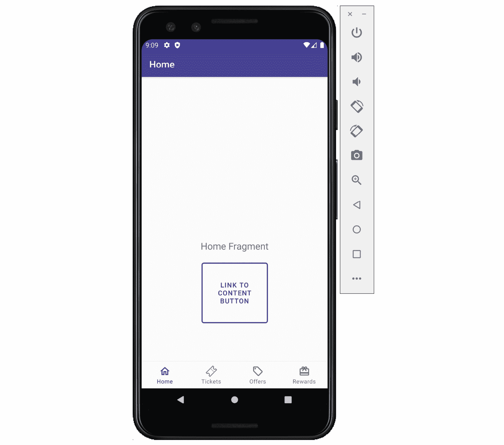

    图 4.11:选择主页的底部导航

15.  The display shows the four menu items you set up, with the `Home` item selected as the start destination. Click the square button to be taken to the secondary destination within `Home`:

    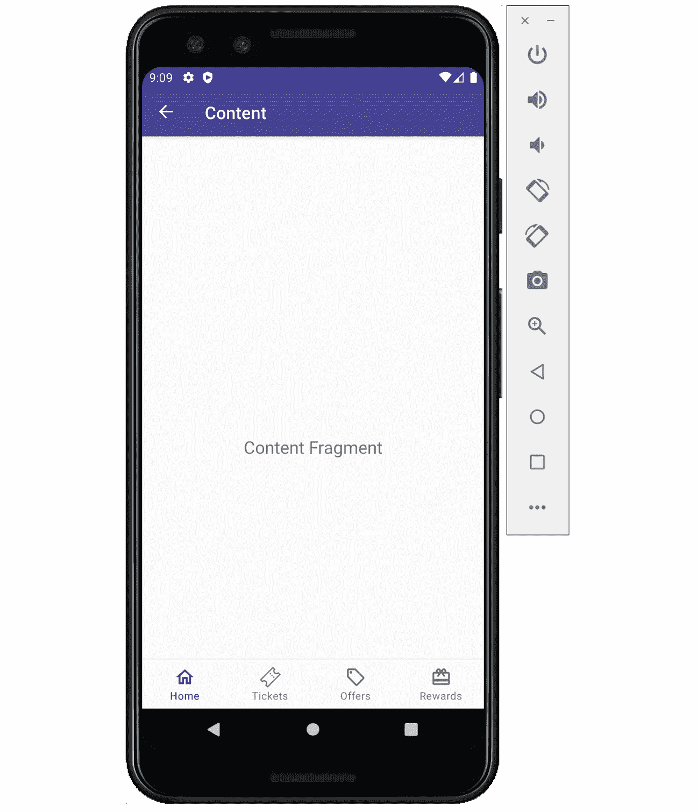

    图 4.12:家庭中的第二目的地

16.  The action that makes this possible is specified in the navigation graph:

    **mobile_navigation.xml(片段)**

    ```kt
    <fragment
        android:id="@+id/nav_home"
        android:name="com.example.bottomnavigation.HomeFragment"
        android:label="@string/home"
        tools:layout="@layout/fragment_home">
        <action
            android:id="@+id/nav_home_to_content"
            app:destination="@id/nav_content"
            app:popUpTo="@id/nav_home" />
    </fragment>
    ```

17.  Since there is no hamburger menu available in the bottom navigation UI, sometimes, action items (those that have a dedicated icon) are added to the app bar. Create another menu called `Main` and add the following content:

    **main.xml**

    ```kt
    <?xml version="1.0" encoding="utf-8"?>
    <menu   xmlns:android="http://schemas.android.com/apk/res/android"
        xmlns:app="http://schemas.android.com/apk/res-auto">
        <item
            android:id="@+id/nav_cart"
            android:title="@string/cart"
            android:icon="@drawable/cart"
            app:showAsAction="always" />
        <item
            android:id="@+id/nav_settings"
            android:title="@string/settings"
            app:showAsAction="never" />
    </menu>
    ```

18.  This menu will be used in the overflow menu in the app bar. The overflow menu will be available when you click on the three dots. A `cart` vector asset will also be displayed on the top app bar because the `app:showAsAction` attribute is set to `always`. Configure the overflow menu within `MainActivity` by adding the following:

    在文件顶部添加这两个导入:

    ```kt
    import android.view.Menu
    import android.view.MenuItem
    ```

    然后这两个功能:

    ```kt
    override fun onCreateOptionsMenu(menu: Menu): Boolean {
        menuInflater.inflate(R.menu.main, menu)
        return true
    }
    override fun onOptionsItemSelected(item: MenuItem): Boolean {
        super.onOptionsItemSelected(item)
        return item.onNavDestinationSelected(findNavController       (R.id.nav_host_fragment))
    }
    ```

19.  这将在应用程序栏中显示主菜单。再次运行该应用程序，您将看到以下内容:


图 4.13:带有溢出菜单的底部导航

选择购物车会将您带到我们在导航图中配置的辅助目的地:


图 4.14:底部导航，溢出菜单位于辅助目的地

正如您在本练习中看到的，设置底部导航非常简单。导航图和菜单设置使得将菜单项链接到片段变得简单。此外，集成动作栏和溢出菜单也是实现的小步骤。如果您正在开发的应用程序具有非常明确的顶级目的地，并且在它们之间切换很重要，那么这些目的地的可见性使底部导航成为理想的选择。最后要探索的主要导航模式是选项卡式导航。这是一个通用的模式，因为它可以用作应用程序的主导航，但也可以与我们研究过的其他导航模式一起用作辅助导航。

# 选项卡式导航

当您想要显示相关项目时，通常使用选项卡式导航。如果只有几个固定标签(通常在两到五个标签之间)，则通常会有固定标签，如果有五个以上的标签，则通常会有滚动水平标签。它们主要用于对同一层级的目的地进行分组。

如果目的地相关，这可以是主要导航。如果您开发的应用程序位于主要目的地相关的狭窄或特定主题领域，例如新闻应用程序，可能会出现这种情况。更常见的是，它与底部导航一起使用，以呈现主目的地内可用的辅助导航。下面的练习演示了如何使用选项卡式导航来显示相关项目。

## 练习 4.03:使用选项卡进行应用导航

在安卓工作室新建一个名为`Tab Navigation`的空活动应用。您将构建一个骨架电影应用程序，显示电影的流派。让我们开始吧:

1.  Replace `strings.xml` content and update `themes.xml` in the `res/values` folder:

    **strings.xml**

    ```kt
     <resources>
        <string name="app_name">Tab Navigation</string>
        <string name="action">Action</string>
        <string name="comedy">Comedy</string>
        <string name="drama">Drama</string>
        <string name="sci_fi">Sci-Fi</string>
        <string name="family">Family</string>
        <string name="crime">Crime</string>
         <string name="history">History</string>
        <string name="dummy_text">
            Lorem ipsum dolor sit amet, consectetuer adipiscing         elit. Aenean commodo ligula eget dolor. Aenean massa.         Cum sociis natoque penatibus et magnis dis parturient         montes, nascetur ridiculus mus. Donec quam felis,         ultricies nec, pellentesque eu, pretium quis, sem.         Nulla consequat massa quis enim. Donec pede justo,         fringilla vel, aliquet nec, vulputate eget, arcu. In         enim justo, rhoncus ut, imperdiet a, venenatis vitae,         justo. Nullam dictum felis eu pede mollis pretium.         Integer tincidunt. Cras dapibus. Vivamus elementum         semper nisi. Aenean vulputate eleifend tellus. Aenean         leo ligula, porttitor eu, consequat vitae, eleifend         ac, enim. Aliquam lorem ante, dapibus in, viverra         quis, feugiat a, tellus. Phasellus viverra nulla ut         metus varius laoreet. Quisque rutrum. Aenean         imperdiet. Etiam ultricies nisi vel augue. Curabitur         ullamcorper ultricies nisi.
        </string>
    </resources>
    ```

    指定的`<string name="dummy_text">`文件为每种电影类型提供了一些正文:

    **themes.xml**

    ```kt
    <resources xmlns:tools="http://schemas.android.com/tools">
        <!-- Base application theme. -->
        <style name="Theme.TabNavigation"       parent="Theme.AppCompat.DayNight.DarkActionBar">
            <!-- Primary brand color. -->
            <item name="colorPrimary">@color/purple_500</item>
            <item name="colorPrimaryVariant">          @color/purple_700</item>
            <item name="colorOnPrimary">@color/white</item>
            <!-- Secondary brand color. -->
            <item name="colorSecondary">@color/teal_200</item>
            <item name="colorSecondaryVariant">          @color/teal_700</item>
            <item name="colorOnSecondary">@color/black</item>
            <!-- Customize your theme here. -->
            <item name="windowActionBar">false</item>
            <item name="windowNoTitle">true</item>
            <!-- Status bar color. -->
            <item name="android:statusBarColor"           tools:targetApi="l">?attr/colorPrimaryVariant</item>
        </style>
        <style name="Theme.TabNavigation.AppBarOverlay"       parent="ThemeOverlay.AppCompat.Dark.ActionBar" />
        <style name="Theme.TabNavigation.PopupOverlay"       parent="ThemeOverlay.AppCompat.Light" />
        <style name="title" >
            <item name="android:textSize">24sp</item>
            <item name="android:textStyle">bold</item>
        </style>
        <style name="body" >
            <item name="android:textSize">16sp</item>
        </style>
    </resources>
    ```

2.  Create a single `MoviesFragment` which displays the title of a movie genre and some dummy text. The title will be updated dynamically. Then update the movie fragment layout:

    **fragment_movies.xml**

    ```kt
    <?xml version="1.0" encoding="utf-8"?>
    <androidx.constraintlayout.widget.ConstraintLayout   xmlns:android="http://schemas.android.com/apk/res/android"
        xmlns:app="http://schemas.android.com/apk/res-auto"
        xmlns:tools="http://schemas.android.com/tools"
        android:layout_width="match_parent"
        android:layout_height="match_parent"
        tools:context=".MoviesFragment">
        <TextView
            android:id="@+id/movie_genre"
            android:layout_width="wrap_content"
            android:layout_height="wrap_content"
            android:paddingTop="8dp"
            style="@style/title"
            android:layout_margin="16dp"
            app:layout_constraintStart_toStartOf="parent"
            app:layout_constraintTop_toTopOf="parent" />
        <TextView
            android:layout_width="wrap_content"
            android:layout_height="wrap_content"
            style="@style/body"
            android:text="@string/dummy_text"
            android:padding="16dp"
            app:layout_constraintStart_toStartOf="parent"
            app:layout_constraintTop_toBottomOf="@id/movie_genre"
            />
    </androidx.constraintlayout.widget.ConstraintLayout>
    ```

    在`fragment_movies`布局中，`movie_type`标识的`TextView`标签会动态更新标题。您添加到`strings.xml`文件中的虚拟文本将显示在其下方。

3.  Update `MoviesFragment` with the following content:

    **电影片段**

    ```kt
    package com.example.tabnavigation
    import android.os.Bundle
    import android.view.LayoutInflater
    import android.view.View
    import android.view.ViewGroup
    import android.widget.TextView
    import androidx.fragment.app.Fragment
    class MoviesFragment : Fragment() {
        override fun onCreateView(
            inflater: LayoutInflater, container: ViewGroup?,
            savedInstanceState: Bundle?
        ): View? {
            val root = inflater.inflate           (R.layout.fragment_movies, container, false)
            root.findViewById<TextView>(R.id.movie_genre)?.text           = arguments?.getString(MOVIE_GENRE)             ?: "Undefined Genre"
            return root
        }
        companion object {
            private const val MOVIE_GENRE = "MOVIE_TYPE"
            @JvmStatic
            fun newInstance(movieGenre: String): MoviesFragment {
                return MoviesFragment().apply {
                    arguments = Bundle().apply {
                        putString(MOVIE_GENRE, movieGenre)
                    }
                }
            }
        }
    }
    ```

    这里有几点需要强调。首先，注意正在使用工厂方法创建`MoviesFragment`。因为这是从一个伴随对象中完成的，所以它可以直接从另一个具有静态语法的类中引用，例如`MoviesFragment.newInstance` ( `movieGenre`)。第二点是工厂方法将`MOVIE_GENRE`键设置为带有`movieGenre`字符串的`Bundle`参数，以便以后可以从`MoviesFragment`中检索。

4.  Update the `activity_main.xml` file with the following content:

    ```kt
    <?xml version="1.0" encoding="utf-8"?>
    <androidx.coordinatorlayout.widget.CoordinatorLayout   xmlns:android="http://schemas.android.com/apk/res/android"
        xmlns:app="http://schemas.android.com/apk/res-auto"
        xmlns:tools="http://schemas.android.com/tools"
        android:layout_width="match_parent"
        android:layout_height="match_parent"
        tools:context=".MainActivity">
        <com.google.android.material.appbar.AppBarLayout
            android:layout_width="match_parent"
            android:layout_height="wrap_content"
            android:theme           ="@style/Theme.TabNavigation.AppBarOverlay">
            <androidx.appcompat.widget.Toolbar
                android:id="@+id/toolbar"
                android:layout_width="match_parent"
                android:layout_height="?attr/actionBarSize"
                android:background="?attr/colorPrimary"
                app:popupTheme               ="@style/Theme.TabNavigation.PopupOverlay"/>
            <com.google.android.material.tabs.TabLayout
                android:id="@+id/tabs"
                android:layout_width="match_parent"
                android:layout_height="wrap_content"
                app:tabIndicatorHeight="4dp"
                app:tabIndicatorColor="@color/teal_200"
                app:tabRippleColor="@android:color/transparent"
                android:background="?attr/colorPrimary" />
        </com.google.android.material.appbar.AppBarLayout>
        <androidx.viewpager.widget.ViewPager
            android:id="@+id/view_pager"
            android:layout_width="match_parent"
            android:layout_height="match_parent"
            app:layout_behavior="@string/appbar_scrolling_view_behavior" />
    </androidx.coordinatorlayout.widget.CoordinatorLayout>
    ```

    `AppBarLayout`标签和其中包含的工具栏在前面的练习中已经很熟悉了。工具栏下方显示一个`TabLayout`标签，其中包含电影标签。您可以使用各种属性来设置选项卡的样式。这里，您将选项卡的高度、颜色和材质波纹效果设置为透明，以不显示正常的材质样式按钮。要显示所需内容，您将使用`ViewPager`。`ViewPager`是一个可切换的布局，允许您添加多个视图或片段，以便当用户切换以更改其中一个选项卡时，正文内容显示相应的视图或片段。在本练习中，您将在电影片段之间滑动。提供在`ViewPager`中使用的数据的组件被称为适配器。

5.  Create a simple adapter that will be used to display our movies. Call it `MovieGenresPagerAdapter`:

    ```kt
    package com.example.tabnavigation
    import android.content.Context
    import androidx.fragment.app.Fragment
    import androidx.fragment.app.FragmentManager
    import androidx.fragment.app.FragmentPagerAdapter
        private val TAB_GENRES_SCROLLABLE = listOf(
            R.string.action,
            R.string.comedy,
            R.string.drama,
            R.string.sci_fi,
            R.string.family,
            R.string.crime,
            R.string.history
    )
    private val TAB_GENRES_FIXED = listOf(
        R.string.action,
        R.string.comedy,
        R.string.drama
    )
    class MovieGenresPagerAdapter(private val context: Context,   fm: FragmentManager)
    : FragmentPagerAdapter(fm,   BEHAVIOR_RESUME_ONLY_CURRENT_FRAGMENT) {
        override fun getItem(position: Int): Fragment {
            return MoviesFragment.newInstance(context.resources           .getString(TAB_GENRES_FIXED[position]))
        }
        override fun getPageTitle(position: Int): CharSequence? {
            return context.resources           .getString(TAB_GENRES_FIXED[position])
        }
        override fun getCount(): Int {
            // Show total pages.
            return TAB_GENRES_FIXED.size
        }
    }
    ```

    首先看`MovieGenresPagerAdapter`类表头。它从`FragmentPagerAdapter`延伸而来，T1 是专门用于刷卡的适配器。这也称为片段分页。`FragmentPagerAdapter`用于定义片段数量不太大的情况。因为您将它用于一组选项卡，所以这是理想的。

    由于`FragmentPagerAdapter`不在屏幕上的时候会把片段保存在内存中，所以不适合大量的片段。在这种情况下，你可以使用`FragmentStatePagerAdpater`，当碎片不在屏幕上时，它可以回收碎片。

    创建`FragmentPagerAdapter`时，传入一个`FragmentManager`，负责管理活动中使用的片段。`BEHAVIOR_RESUME_ONLY_CURRENT_FRAGMENT`标志仅将当前片段保持在可供用户交互的状态(`RESUMED`)。其他碎片处于`STARTED`状态，这意味着它们在滑动时是可见的，但不是活动的。

    回调方法的功能如下:

    *   `getCount()`:此方法返回要显示的项目总数。
    *   `getPageTitle(position: Int): CharSequence?`:这将通过使用特定位置来检索列表中指定位置的流派标题。
    *   `getItem(position: Int): Fragment`: This gets `MoviesFragment` at this position in the list (or creates a new `MoviesFragment` if it's being accessed for the first time) by passing in the genre title you want to display in the fragment. Once created, `MoviesFragment` will be kept in memory.

        选项卡可以是固定的，也可以是可滚动的。您将看到的第一个示例是固定选项卡。由于所有这些方法都在使用`TAB_GENRES_FIXED`，因此只会显示三个选项卡。但是，这不会将`TabLayout`设置为固定或可滚动。这需要在活动中完成。

6.  更新`MainActivity`使其使用带有`ViewPager` :

    ```kt
    package com.example.tabnavigation
    import android.os.Bundle
    import androidx.appcompat.app.AppCompatActivity
    import androidx.viewpager.widget.ViewPager
    import com.google.android.material.tabs.TabLayout
    class MainActivity : AppCompatActivity() {
        override fun onCreate(savedInstanceState: Bundle?) {
            super.onCreate(savedInstanceState)
            setContentView(R.layout.activity_main)
            setSupportActionBar(findViewById(R.id.toolbar))
            val viewPager = findViewById<ViewPager>          (R.id.view_pager)
            val tabs = findViewById<TabLayout>(R.id.tabs)
            viewPager.adapter = MovieGenresPagerAdapter(this,           supportFragmentManager)
            tabs?.tabMode = TabLayout.MODE_FIXED
            tabs?.setupWithViewPager(viewPager)
        }
    }
    ```

    的标签
7.  在`onCreate`方法中，设置布局后，设置 app 栏，使其使用工具栏:

    ```kt
    setSupportActionBar(toolbar)
    ```

8.  设置要在可切换`ViewPager`中显示的数据，使其来自`MovieGenresPagerAdapter`:T2
9.  将`TabLayout`设置为显示已配置的`ViewPager` :

    ```kt
    tabs?.tabMode = TabLayout.MODE_FIXED
    tabs?.setupWithViewPager(viewPager)
    ```

10.  This takes care of settings the tab titles and making the tab body content swipeable. `tabMode` has been set to `FIXED` (`tabs.tabMode = TabLayout.MODE_FIXED`) so that the tabs will be laid out uniformly with a width that's equal to the width of the screen. Now, run the app. You should see the following:

    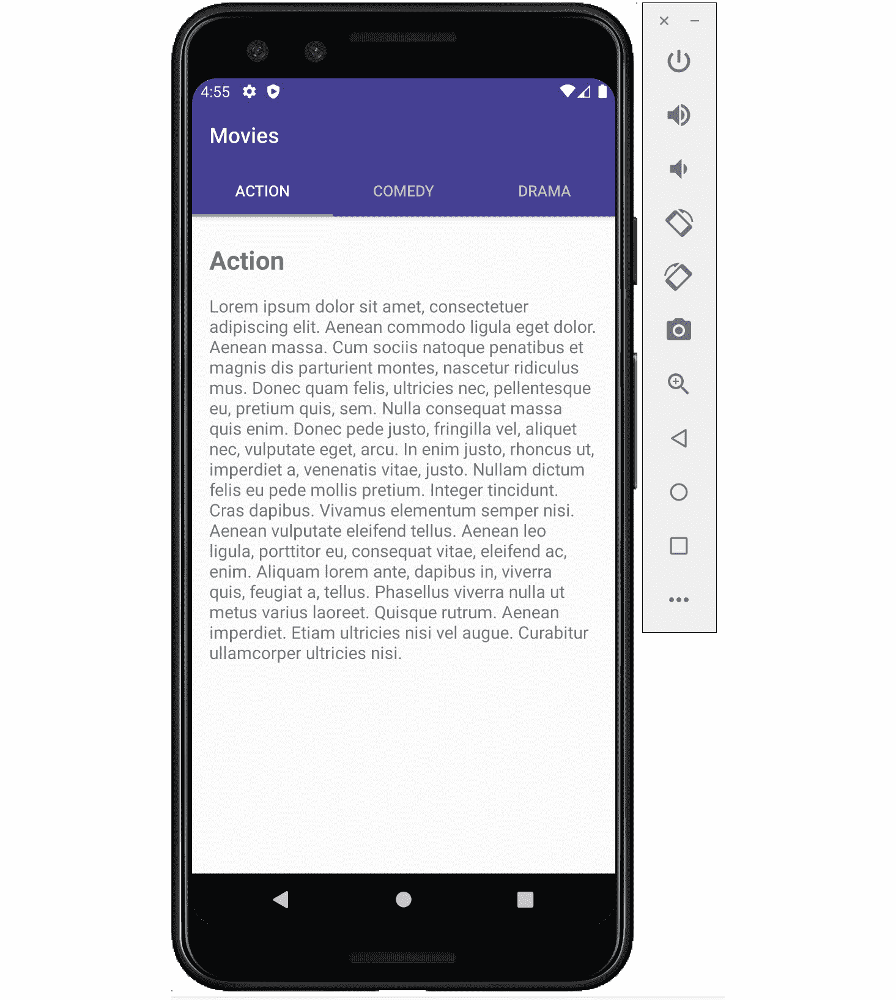

    图 4.15:带有固定选项卡的选项卡布局

    您可以在页面主体中向左和向右滑动以转到三个选项卡中的每一个，也可以选择相应的选项卡之一来执行相同的操作。现在，让我们更改正在显示的选项卡数据，并设置选项卡，以便它们可以滚动。

11.  首先，改变`MovieGenresPagerAdapter`使其使用一些额外的流派:

    ```kt
    class MovieGenresPagerAdapter(private val context: Context,   fm: FragmentManager)
    : FragmentPagerAdapter(fm,   BEHAVIOR_RESUME_ONLY_CURRENT_FRAGMENT) {
        override fun getItem(position: Int): Fragment {
            return MoviesFragment.newInstance(context.resources           .getString(TAB_GENRES_SCROLLABLE[position]))
        }
        override fun getPageTitle(position: Int): CharSequence? {
            return context.resources           .getString(TAB_GENRES_SCROLLABLE[position])
        }
        override fun getCount(): Int {
            // Show total pages.
            return TAB_GENRES_SCROLLABLE.size
        }
    }
    ```

12.  在`MainActivity`中，设置`tabMode`使其可滚动:

    ```kt
    tabs.tabMode = TabLayout.MODE_SCROLLABLE
    ```

13.  运行应用程序。您应该会看到以下内容:

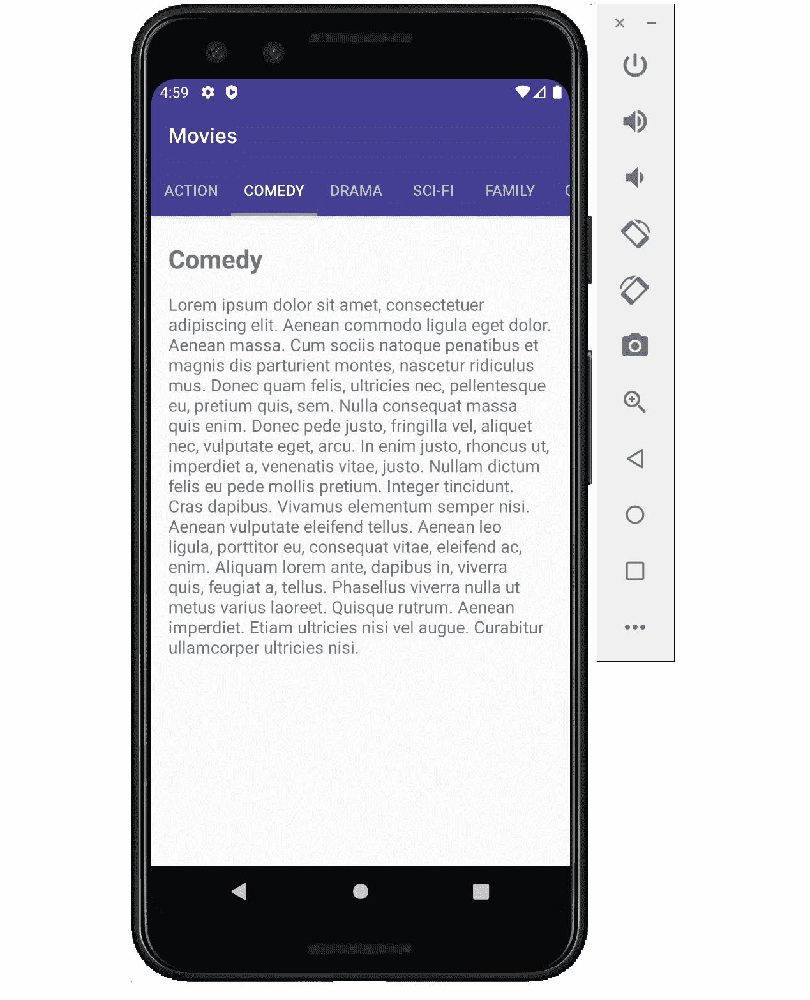

图 4.16:带有可滚动选项卡的选项卡布局

选项卡列表继续在屏幕外显示。可以滑动和选择选项卡，也可以滑动正文内容，这样您就可以左右浏览选项卡页面。

通过本练习，您已经了解了在应用程序中提供导航时，选项卡的用途有多广泛。固定宽度选项卡可用于主导航和辅助导航，而可滚动选项卡可用于将相关项目组合在一起进行辅助导航。可滚动标签充当辅助导航，所以你也需要给应用添加主要导航。在本例中，为了简单起见，省略了主导航，但是对于更真实的世界和复杂的应用程序，您可以添加导航抽屉或底部导航。

## 活动 4.01:构建主应用程序和辅助应用程序导航

您的任务是创建一个体育应用程序。它可以有三个或更多顶级目的地。然而，主要目的地之一必须被称为`My Sports`，并且应该链接到一个或多个次要目的地，这些次要目的地是体育。您可以使用我们在本章中探讨的任何一种导航模式，或者它们的组合，您还可以引入您认为合适的任何自定义。用户当前所在的每个目的地应显示在`App`栏中。

尝试这项活动有不同的方式。一种方法是使用底部导航，并将各个次要体育目的地添加到导航图中，以便它可以链接到这些目的地。它相当简单，并使用操作委托给导航图。以下是使用这种方法后主屏幕的外观:

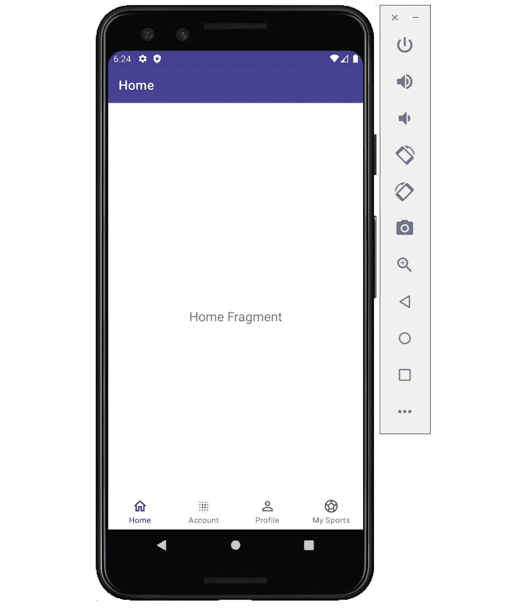

图 4.17:我的运动应用的底部导航

注意

这个活动的解决方案可以在:[http://packt.live/3sKj1cp](04.html)找到

本章中所有练习和活动的来源都在这里:[http://packt.live/39IAjxL](http://packt.live/39IAjxL)

# 总结

本章涵盖了您需要了解的最重要的导航技术，以便在应用程序中创建清晰一致的导航。您首先学习了如何创建一个带有导航抽屉的安卓工作室项目，以使用 Jetpack 导航将导航菜单项连接到单个片段。然后，您进入 Jetpack 导航中的操作，在导航图中导航到应用程序中的其他辅助目的地。

接下来的练习使用底部导航来显示主导航目的地，这些目的地在屏幕上总是可见的。接下来，我们看了选项卡式导航，在这里您学习了如何显示固定和可滚动选项卡。对于每种不同的导航模式，您会看到什么时候更适合使用，这取决于您正在构建的应用程序的类型。我们通过使用这些导航模式中的一个或多个来构建我们自己的应用程序，并添加主要和次要目的地来完成这一章。

本章建立在我们在*第 1 章*、*创建您的第一个应用程序*中对安卓和安卓工作室提供的全面介绍，以及您在*第 2 章*、*构建用户屏幕流*、*第 3 章*、*使用片段开发 UI*中了解到的活动和片段的基础上。这些章节涵盖了创建应用程序所需的知识、实践和基本安卓组件。这一章将前几章联系在一起，通过引导您浏览可用的主要导航模式，使您的应用程序脱颖而出并易于使用。

下一章将以这些概念为基础，向您介绍显示应用程序内容的更高级方式。您将从使用`RecyclerView`学习将数据与列表绑定开始。之后，您将探索可用于在应用程序中检索和填充内容的不同机制。