# 6.回收商视图

概观

在本章中，你将学习如何在你的应用程序中添加物品列表和网格，并有效利用`RecyclerView`的回收能力。您还将学习如何处理用户与屏幕上项目视图的交互，并支持不同的项目视图类型，例如标题。在本章的后面，您将动态添加和删除项目。

到本章结束时，您将具备向用户呈现丰富项目的交互式列表所需的技能。

# 简介

在前一章中，我们学习了如何从 API 获取数据，包括项目列表和图像 URL，以及如何从 URL 加载图像。本章的目标是将这些知识与显示项目列表的能力结合起来。

通常，您会希望向用户呈现一个项目列表。例如，您可能希望在他们的设备上向他们显示一个图片列表，或者让他们从所有国家的列表中选择他们的国家。为此，您需要填充多个视图，所有视图共享相同的布局，但呈现不同的内容。

历史上，这是通过使用`ListView`或`GridView`来实现的。虽然两者都是可行的选择，但它们没有`RecyclerView`的稳健性和灵活性。例如，它们不太支持大数据集，不支持水平滚动，也不提供丰富的分割线定制。使用`RecyclerView.ItemDecorator`可以很容易地在`RecyclerView`中定制项目之间的分隔线。

那么`RecyclerView`是做什么的呢？`RecyclerView`协调表示项目列表的视图的创建、填充和重用(因此得名)。要使用`RecyclerView`，您需要熟悉它的两个依赖项:适配器(以及视图持有者)和布局管理器。这些依赖关系为我们的`RecyclerView`提供了要显示的内容，并告诉它如何呈现该内容以及如何在屏幕上布局。

适配器为`RecyclerView`提供子视图(嵌套在`RecyclerView`中的安卓视图，用于表示单个数据项)以在屏幕上绘制，将这些视图绑定到数据(通过`ViewHolder`实例)，并报告用户与这些视图的交互。布局管理器告诉`RecyclerView`如何布局其子节点。我们默认提供了三种布局类型:线性、网格和交错网格—分别由`LinearLayoutManager`、`GridLayoutManager`和`StaggeredGridLayoutManager`管理。

在这一章中，我们将开发一个应用程序，列出秘密特工以及他们当前是活跃的还是睡眠的(因此不可用)。然后，该应用程序将允许我们添加新的代理或通过刷掉现有代理来删除它们。不过，这里有一个转折——正如你在*第 5 章*、*基本库:改装、魔石和滑翔*中看到的，我们所有的特工都将是猫。

# 向我们的布局添加回收视图

在*第 3 章*、*屏幕和用户界面*中，我们看到了如何将视图添加到布局中，以通过活动、片段或自定义视图进行膨胀。`RecyclerView`只是另一种这样的看法。要将其添加到我们的布局中，我们需要在布局中添加以下标签:

```kt
<androidx.recyclerview.widget.RecyclerView
    android:id="@+id/recycler_view"
    android:layout_width="match_parent"
    android:layout_height="wrap_content"
    tools:listitem="@layout/item_sample" />
```

你应该已经能够识别`android:id`属性，以及`android:layout_width`和`android:layout_height`属性了。

我们可以使用可选的`tools:listitem`属性来告诉安卓工作室在我们的预览工具栏中放大哪个布局作为列表项。这将让我们了解`RecyclerView`在我们的应用程序中的外观。

向我们的布局添加一个`RecyclerView`标签意味着我们现在有一个空容器来保存表示我们的列表项的子视图。一旦填充，它将为我们处理子视图的呈现、滚动和回收。

## 练习 6.01:将空回收视图添加到您的主要活动中

要在你的应用中使用`RecyclerView`，你首先需要将它添加到你的一个布局中。让我们将其添加到由主要活动膨胀的布局中:

1.  首先创建一个新的空活动项目(`File` | `New` | `New Project` | `Empty Activity`)。说出你的申请`My RecyclerView App`。确保您的套餐名称为`com.example.myrecyclerviewapp`。
2.  Set the save location to where you want to save your project. Leave everything else at its default values and click `Finish`. Make sure you are on the `Android` view in your `Project` pane:

    

    图 6.1:项目窗格中的安卓视图

3.  在`Text`模式下打开你的`activity_main.xml`文件。
4.  要将您的标签变成屏幕顶部的标题，您可以在标题下添加您的`RecyclerView`，向`TextView`添加一个 ID 并将其与顶部对齐，如:

    ```kt
    <TextView
     android:id="@+id/hello_label"
        android:layout_width="wrap_content"
        android:layout_height="wrap_content"
        android:text="Hello World!"
        app:layout_constraintLeft_toLeftOf="parent"
        app:layout_constraintRight_toRightOf="parent"
     app:layout_constraintTop_toTopOf="parent" />
    ```

5.  Add the following after `TextView` tag to add an empty `RecyclerView` element to our layout, constrained below your `hello_label` `TextView` title:

    ```kt
    <androidx.recyclerview.widget.RecyclerView
        android:id="@+id/recycler_view"
        android:layout_width="match_parent"
        android:layout_height="wrap_content"
        app:layout_constraintTop_toBottomOf="@+id/hello_label" />
    ```

    您的布局文件现在应该如下所示:

    ```kt
    <?xml version="1.0" encoding="utf-8"?>
    <androidx.constraintlayout.widget.ConstraintLayout xmlns:android="http://schemas.android.com/apk/res/android"
        xmlns:app="http://schemas.android.com/apk/res-auto"
        xmlns:tools="http://schemas.android.com/tools"
        android:layout_width="match_parent"
        android:layout_height="match_parent"
        tools:context=".MainActivity">
        <TextView
            android:id="@+id/hello_label"
            android:layout_width="wrap_content"
            android:layout_height="wrap_content"
            android:text="Hello World!"
            app:layout_constraintLeft_toLeftOf="parent"
            app:layout_constraintRight_toRightOf="parent"
            app:layout_constraintTop_toTopOf="parent" />
        <androidx.recyclerview.widget.RecyclerView
            android:id="@+id/recycler_view"
            android:layout_width="match_parent"
            android:layout_height="wrap_content"
            app:layout_constraintTop_toBottomOf="@+id/hello_label" />
    </androidx.constraintlayout.widget.ConstraintLayout>
    ```

6.  通过点击`Run app`按钮或按下 *Ctrl* + *R* ( *在 Windows 上移动* + *F10* )来运行你的应用。在模拟器上，它应该如下所示:

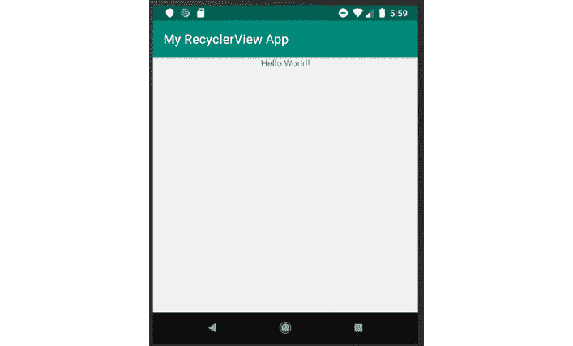

图 6.2:带有空 RecyclerView 的应用程序(为节省空间而裁剪的图像)

如您所见，我们的应用程序运行，我们的布局呈现在屏幕上。然而，我们看不到我们的`RecyclerView`。为什么会这样？现阶段我们的`RecyclerView`已经没有内容了。没有内容的`RecyclerView`默认不渲染——所以，虽然我们的`RecyclerView`确实在屏幕上，但它是不可见的。这就把我们带到了下一步——用我们能真正看到的内容填充`RecyclerView`。

# 填充回收视图

所以，我们在布局中增加了`RecyclerView`。为了让我们从`RecyclerView`中受益，我们需要给它添加内容。让我们看看该怎么做。

正如我们之前提到的，要向我们的`RecyclerView`添加内容，我们需要实现一个适配器。适配器将我们的数据绑定到子视图。更简单地说，这意味着它告诉`RecyclerView`如何将数据插入到设计用于呈现该数据的视图中。

例如，假设我们想要呈现一个员工列表。

首先，我们需要设计我们的用户界面模型。这将是一个数据对象，包含我们的视图呈现单个员工所需的所有信息。因为这是一个 UI 模型，所以一个惯例是在它的名字后面加上`UiModel`:

```kt
data class EmployeeUiModel(
    val name: String,
    val biography: String,
    val role: EmployeeRole,
    val gender: Gender,
    val imageUrl: String
)
```

我们将`EmployeeRole`和`Gender`定义如下:

```kt
enum class EmployeeRole {
    HumanResources,
    Management,
    Technology
}
enum class Gender {
    Female,
    Male,
    Unknown
}
```

当然，这些值是作为示例提供的。随意添加更多你自己的！

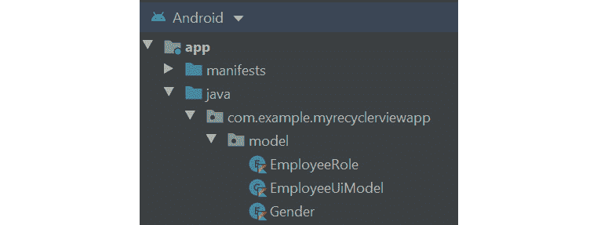

图 6.3:模型的层次结构

现在，我们知道了绑定到视图时需要什么数据——因此，我们可以设计视图来呈现这些数据(这是实际布局的简化版本，我们将保存为`item_employee.xml`)。我们将从`ImageView`开始:

```kt
<?xml version="1.0" encoding="utf-8"?>
<androidx.constraintlayout.widget.ConstraintLayout   xmlns:android="http://schemas.android.com/apk/res/android"
    xmlns:app="http://schemas.android.com/apk/res-auto"
    xmlns:tools="http://schemas.android.com/tools"
    android:layout_width="match_parent"
    android:layout_height="wrap_content"
    android:orientation="vertical"
    android:padding="8dp">
    <ImageView
        android:id="@+id/item_employee_photo"
        android:layout_width="60dp"
        android:layout_height="60dp"
        android:contentDescription="@string/item_employee_photo"
        app:layout_constraintStart_toStartOf="parent"
        app:layout_constraintTop_toTopOf="parent"
        tools:background="@color/colorPrimary" />
```

然后添加各个`TextView`:

```kt
    <TextView
        android:id="@+id/item_employee_name"
        android:layout_width="wrap_content"
        android:layout_height="wrap_content"
        android:layout_marginStart="16dp"
        android:layout_marginLeft="16dp"
        android:textStyle="bold"
        app:layout_constraintStart_toEndOf="@+id/item_employee_photo"
        app:layout_constraintTop_toTopOf="parent"
        tools:text="Oliver" />
    <TextView
        android:id="@+id/item_employee_role"
        android:layout_width="wrap_content"
        android:layout_height="wrap_content"
        android:textColor="@color/colorAccent"
        app:layout_constraintStart_toStartOf="@+id/item_employee_name"
        app:layout_constraintTop_toBottomOf="@+id/item_employee_name"
        tools:text="Exotic Shorthair" />
    <TextView
        android:id="@+id/item_employee_biography"
        android:layout_width="wrap_content"
        android:layout_height="wrap_content"
        app:layout_constraintStart_toStartOf="@+id/item_employee_role"
        app:layout_constraintTop_toBottomOf="@+id/item_employee_role"
        tools:text="Stealthy and witty. Better avoid in dark alleys." />
    <TextView
        android:id="@+id/item_employee_gender"
        android:layout_width="wrap_content"
        android:layout_height="wrap_content"
        android:textSize="30sp"
        app:layout_constraintEnd_toEndOf="parent"
        app:layout_constraintTop_toTopOf="parent"
        tools:text="&#9794;" />
</androidx.constraintlayout.widget.ConstraintLayout>
```

到目前为止，没有什么新鲜事。您应该能够从*第 2 章*、*构建用户屏幕流*中识别所有不同的视图类型:


图 6.4:项目布局文件的预览

有了数据模型和布局，我们现在拥有了将数据绑定到视图所需的一切。为此，我们将实现一个视图持有人。通常，视图持有人有两个职责:它持有对视图的引用(顾名思义)，但它也将数据绑定到该视图。我们将按如下方式实现我们的观点持有人:

```kt
private val FEMALE_SYMBOL by lazy {
    HtmlCompat.fromHtml("&#9793;", HtmlCompat.FROM_HTML_MODE_LEGACY)
}
private val MALE_SYMBOL by lazy {
    HtmlCompat.fromHtml("&#9794;", HtmlCompat.FROM_HTML_MODE_LEGACY)
}
private const val UNKNOWN_SYMBOL = "?"
class EmployeeViewHolder(
    containerView: View,
    private val imageLoader: ImageLoader
) : ViewHolder(containerView) {
private val employeeNameView: TextView
by lazy { containerView.findViewById(R.id.item_employee_name) }
private val employeeRoleView: TextView
by lazy { containerView.findViewById(R.id.item_employee_role) }
private val employeeBioView: TextView
by lazy { containerView.findViewById(R.id.item_employee_bio) }
private val employeeGenderView: TextView
by lazy { containerView.findViewById(R.id.item_employee_gender) }
    fun bindData(employeeData: EmployeeUiModel) {
        imageLoader.loadImage(employeeData.imageUrl, employeePhotoView)
        employeeNameView.text = employeeData.name
        employeeRoleView.text = when (employeeData.role) {
            EmployeeRole.HumanResources -> "Human Resources"
            EmployeeRole.Management -> "Management"
            EmployeeRole.Technology -> "Technology"
        }
        employeeBioView.text = employeeData.biography
        employeeGenderView.text = when (employeeData.gender) {
            Gender.Female -> FEMALE_SYMBOL
            Gender.Male -> MALE_SYMBOL
            else -> UNKNOWN_SYMBOL
        }
    }
}
```

在前面的代码中有几件事值得注意。首先，按照惯例，我们在视图持有人的名字后面加上`ViewHolder`。第二，注意`EmployeeViewHolder`需要实现抽象的`RecyclerView.ViewHolder`类。这是必需的，这样我们的适配器的通用类型就可以成为我们的视图持有者。最后，我们懒洋洋地引用我们感兴趣的观点。第一次调用`bindData(EmployeeUiModel)`时，我们会在布局中找到这些视图，并保留对它们的引用。

接下来，我们介绍一个`bindData(EmployeeUiModel)`函数。我们的适配器将调用这个函数，将数据绑定到视图持有人持有的视图。最后但也是最重要的一点要注意的是，我们总是确保为所有可能的输入设置所有修改视图的状态。

设置好视图持有人后，我们就可以开始实现适配器了。我们将从实现所需的最小函数开始，加上一个设置数据的函数。我们的适配器看起来像这样:

```kt
class EmployeesAdapter(
    private val layoutInflater: LayoutInflater,
    private val imageLoader: ImageLoader
) : RecyclerView.Adapter<EmployeeViewHolder>() {
    private val employeesData = mutableListOf<EmployeeUiModel>()
    fun setData(employeesData: List<EmployeeUiModel>) {
        this.employeesData.clear()
        this.employeesData.addAll(employeesData)
        notifyDataSetChanged()
    }
    override fun onCreateViewHolder(parent: ViewGroup, viewType: Int):       EmployeeViewHolder {
        val view = layoutInflater.inflate(R.layout.item_employee,           parent, false)
        return EmployeeViewHolder(view, imageLoader)
    }
    override fun getItemCount() = employeesData.size
    override fun onBindViewHolder(holder: EmployeeViewHolder,       position:Int) {
        holder.bindData(employeesData[position])
    }
}
```

让我们看一下这个实现。首先，我们通过适配器的构造函数将依赖关系注入到适配器中。这将使测试我们的适配器变得容易得多，但也将允许我们轻松地改变它的一些行为(例如，替换图像加载库)。事实上，在这种情况下，我们根本不需要更改适配器。

然后，我们定义一个私有的可变列表`EmployeeUiModel`来存储适配器当前提供给`RecyclerView`的数据。我们还介绍了一种设置列表的方法。请注意，我们保留一个本地列表并设置其内容，而不是允许直接设置`employeesData`。这主要是因为 Kotlin 就像 Java 一样，通过引用传递变量。通过引用传递变量意味着对传递到适配器的列表内容的更改将会改变适配器持有的列表。例如，如果从适配器外部移除一个项目，适配器也会移除该项目。这成为一个问题，因为适配器不会意识到这一变化，因此无法通知`RecyclerView`。从适配器外部修改列表还有其他风险，但涵盖这些风险超出了本书的范围。

将数据的修改封装在函数中的另一个好处是，我们避免了忘记通知`RecyclerView`数据集已经更改的风险，我们通过调用`notifyDataSetChanged()`来做到这一点。

我们继续实现适配器的`onCreateViewHolder(ViewGroup, Int)`功能。当`RecyclerView`需要一个新的`ViewHolder`在屏幕上渲染数据时，调用这个函数。它为我们提供了一个容器`ViewGroup`和一个视图类型(我们将在本章后面讨论视图类型)。然后，该函数期望我们返回一个用视图初始化的视图容器(在我们的例子中，是一个膨胀的视图容器)。因此，我们扩展了之前设计的视图，将其传递给一个新的`EmployeeViewHolder`实例。请注意，膨胀函数的最后一个参数是`false`。这确保了我们不会将新膨胀的视图附加到父视图。附着和分离视图将由布局管理器管理。将其设置为`true`或省略将导致`IllegalStateException`被抛出。最后，我们返回新创建的`EmployeeViewHolder`。

为了实现`getItemCount()`，我们只需返回我们的`employeesData`列表的大小。

最后，我们实现`onBindViewHolder(EmployeeViewHolder, Int)`。这是通过将存储在`catsData`中给定位置的`EmployeeUiModel`传递给我们的视图支架的`bindData(EmployeeUiModel)`功能来完成的。我们的适配器现在准备好了。

如果我们试图在此时将适配器插入我们的`RecyclerView`并运行我们的应用程序，我们仍然看不到任何内容。这是因为我们仍然缺少两个小步骤:为我们的适配器设置数据和为我们的`RecyclerView`分配布局管理器。完整的工作代码如下所示:

```kt
class MainActivity : AppCompatActivity() {
    private val employeesAdapter by lazy { 
        EmployeesAdapter(layoutInflater, GlideImageLoader(this)) }
    private val recyclerView: RecyclerView by lazy
        { findViewById(R.id.main_recycler_view) }
    override fun onCreate(savedInstanceState: Bundle?) {
        super.onCreate(savedInstanceState)
        setContentView(R.layout.activity_main)
        recyclerView.adapter = employeesAdapter
        recyclerView.layoutManager =
            LinearLayoutManager(this, LinearLayoutManager.VERTICAL, 
              false)
        employeesAdapter.setData(
            listOf(
                EmployeeUiModel(
                    "Robert",
                    "Rose quickly through the organization",
                    EmployeeRole.Management,
                    Gender.Male,
                    "https://images.pexels.com/photos/220453                       /pexels-photo-220453.jpeg?auto                         =compress&cs=tinysrgb&h=650&w=940"
                ),
                EmployeeUiModel(
                    "Wilma",
                    "A talented developer",
                    EmployeeRole.Technology,
                    Gender.Female,
                    "https://images.pexels.com/photos/3189024                       /pexels-photo-3189024.jpeg?auto=compress&cs                         =tinysrgb&h=650&w=940"
                ),
                EmployeeUiModel(
                    "Curious George",
                    "Excellent at retention",
                    EmployeeRole.HumanResources,
                    Gender.Unknown,
                    "https://images.pexels.com/photos/771742                       /pexels-photo-771742.jpeg?auto                         =compress&cs=tinysrgb&h=750&w=1260"
                )
            )
        )
    }
}
```

现在运行我们的应用程序，我们会看到我们的员工列表。

请注意，我们对员工列表进行了硬编码。在生产应用中，遵循**模型-视图-视图-模型** ( **MVVM** )模式(我们将在*第 14 章*、*架构模式*中介绍该模式)，您的`ViewModel`将向您提供要呈现的数据。还需要注意的是，我们保留了对`employeesAdapter`的引用。这样我们就可以在以后将数据设置为不同的值。一些实现依赖于从`RecyclerView`本身读取适配器——这可能导致不必要的转换操作和适配器尚未分配给`RecyclerView`的意外状态，因此这通常不是推荐的方法。

最后，请注意，我们选择使用`LinearLayoutManager`，为其提供上下文活动、`VERTICAL`方向标志和`false`来告诉其我们不希望列表中项目的顺序颠倒。

## 练习 6.02:填充您的回收视图

`RecyclerView`没有任何内容就不是很有意思。是时候通过添加你的秘密猫特工来填充`RecyclerView`了。

在开始之前，先简单回顾一下:在之前的练习中，我们引入了一个空列表，用来保存用户可以使用的秘密猫特工的列表。在本练习中，您将填写该列表，向用户展示该机构中可用的秘密卡特彼勒代理商:

1.  To keep our file structure tidy, we will start by creating a model package. Right-click on the package name of our app, then select `New` | `Package`:

    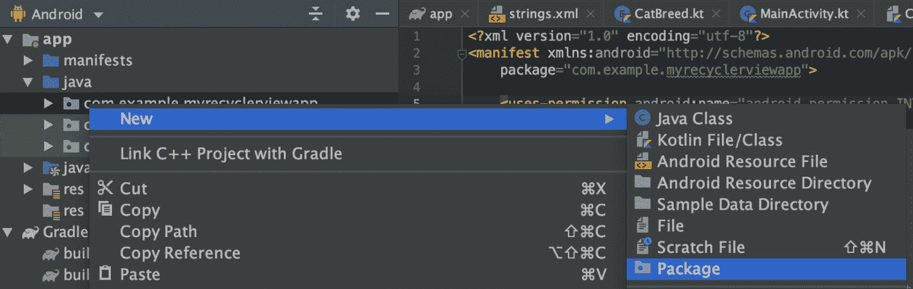

    图 6.5:创建新包

2.  命名新包`model`。点击`OK`创建包。
3.  要创建我们的第一个模型数据类，右键单击新创建的模型包，然后选择`New` | `Kotlin File/Class`。
4.  在`name`下，填写`CatUiModel`。将`kind`留为`File`，点击`OK`。这将是保存我们关于每个单独的卡特彼勒代理商的数据的班级。
5.  Add the following to the newly created `CatUiModel.kt` file to define the data class with all the relevant properties of a cat agent:

    ```kt
    data class CatUiModel(
        val gender: Gender,
        val breed: CatBreed,
        val name: String,
        val biography: String,
        val imageUrl: String
    )
    ```

    对于每个猫特工，除了他们的名字和照片，我们还想知道性别、品种和传记。这将帮助我们为任务选择合适的代理。

6.  再次右键单击模型包，然后导航至`New` | `Kotlin File/Class`。
7.  这次，命名新文件`CatBreed`并将`kind`设置为`Enum`类。这个班将举办我们不同的猫品种。
8.  用一些初始值更新您新创建的枚举，如下所示:

    ```kt
    enum class CatBreed {
        AmericanCurl,
        BalineseJavanese,
        ExoticShorthair
    }
    ```

9.  重复*步骤 6* 和 *7* ，只是这次调用你的文件`Gender`。这将保持猫特工性别的公认值。
10.  像这样更新`Gender`枚举:

    ```kt
    enum class Gender {
        Female,
        Male,
        Unknown
    }
    ```

11.  Now, to define the layout of the view holding the data about each cat agent, create a new layout resource file by right-clicking on `layout` and then selecting `New` | `Layout resource file`:

    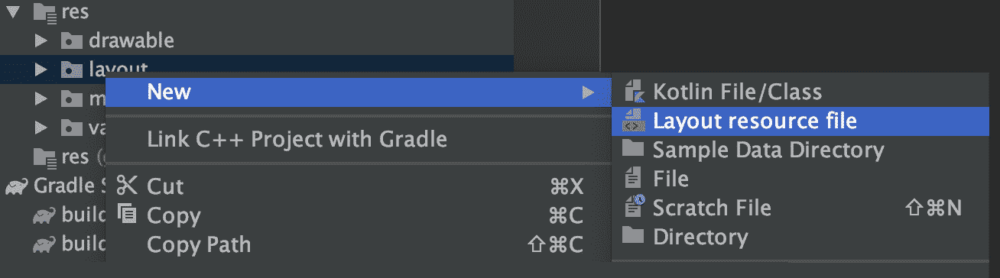

    图 6.6:创建新的布局资源文件

12.  命名你的资源`item_cat`。保持所有其他字段不变，点击`OK`。
13.  Update the contents of the newly created `item_cat.xml` file. (The following code block has been truncated for space. Use the link below to see the full code that you need to add.)

    item_cat.xml

    ```kt
    10    <ImageView
    11        android:id="@+id/item_cat_photo"
    12        android:layout_width="60dp"
    13        android:layout_height="60dp"
    14        android:contentDescription="@string/item_cat_photo"
    15        app:layout_constraintStart_toStartOf="parent"
    16        app:layout_constraintTop_toTopOf="parent"
    17        tools:background="@color/colorPrimary" />
    18
    19    <TextView
    20        android:id="@+id/item_cat_name"
    21        android:layout_width="wrap_content"
    22        android:layout_height="wrap_content"
    23        android:layout_marginStart="16dp"
    24        android:layout_marginLeft="16dp"
    25        android:textStyle="bold"
    26        app:layout_constraintStart_toEndOf="@+id/item_cat_photo"
    27        app:layout_constraintTop_toTopOf="parent"
    28        tools:text="Oliver" />
    ```

    这一步的完整代码可以在[http://packt.live/3sopUjo](http://packt.live/3sopUjo)找到。

    这将创建一个带有图像和文本字段的布局，用于我们的列表中的姓名、品种和传记。

14.  You will notice that *line 14* is highlighted in red. This is because you haven't declared `item_cat_photo` in `strings.xml` under the `res/values` folder yet. Do so now by placing the text cursor over `item_cat_photo` and pressing *Alt* + *Enter* (*Option* + *Enter* on Mac), then select `Create string value resource 'item_cat_photo'`:

    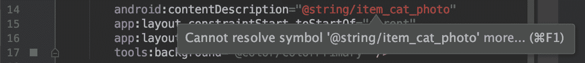

    图 6.7:字符串资源尚未定义

15.  在`Resource value`下，填写`Photo`。按下`OK`。
16.  您将需要一份`ImageLoader.kt`的副本，在*第 5 章*、*基本库:改装、摩石和滑翔*中介绍过，所以右键单击您的应用的包名，导航到`New` | `Kotlin File/Class`，然后将名称设置为`ImageLoader`、`kind`设置为`Interface`，然后单击`OK`。
17.  Similar to *Chapter 5*, *Essential Libraries: Retrofit, Moshi, and Glide*, you only need to add one function here:

    ```kt
    interface ImageLoader {
        fun loadImage(imageUrl: String, imageView: ImageView)
    }
    ```

    确保导入`ImageView`。

18.  再次右键点击应用的包名，然后选择`New` | `Kotlin File/Class`。
19.  调用新文件`CatViewHolder`。点击`OK`。
20.  要实现将卡特彼勒代理商数据绑定到您的视图的`CatViewHolder`，请将`CatViewHolder.kt`文件的内容替换为以下内容:

    ```kt
    private val FEMALE_SYMBOL by lazy {
        HtmlCompat.fromHtml("&#9793;", HtmlCompat.FROM_HTML_MODE_LEGACY)
    }
    private val MALE_SYMBOL by lazy {
        HtmlCompat.fromHtml("&#9794;", HtmlCompat.FROM_HTML_MODE_LEGACY)
    }
    private const val UNKNOWN_SYMBOL = "?"
    class CatViewHolder(
        containerView: View,
        private val imageLoader: ImageLoader
    ) : ViewHolder(containerView) {
        private val catBiographyView: TextView
            by lazy { containerView.findViewById(R.id.item_cat_biography) }
        private val catBreedView: TextView
            by lazy { containerView.findViewById(R.id.item_cat_breed) }
        private val catGenderView: TextView
            by lazy { containerView.findViewById(R.id.item_cat_gender) } 
        private val catNameView: TextView
            by lazy { containerView.findViewById(R.id.item_cat_name) } 
        private val catPhotoView: ImageView
            by lazy { containerView.findViewById(R.id.item_cat_photo) }
        fun bindData(catData: CatUiModel) {
            imageLoader.loadImage(catData.imageUrl, catPhotoView)
            catNameView.text = catData.name
            catBreedView.text = when (catData.breed) {
                CatBreed.AmericanCurl -> "American Curl"
                CatBreed.BalineseJavanese -> "Balinese-Javanese"
                CatBreed.ExoticShorthair -> "Exotic Shorthair"
            }
            catBiographyView.text = catData.biography
            catGenderView.text = when (catData.gender) {
                Gender.Female -> FEMALE_SYMBOL
                Gender.Male -> MALE_SYMBOL
                else -> UNKNOWN_SYMBOL
            }
        }
    }
    ```

21.  仍然在我们的应用包名称下，创建一个名为`CatsAdapter`的新 Kotlin 文件。
22.  要实现负责存储`RecyclerView`数据的`CatsAdapter`，以及创建视图持有者的实例并使用它们将数据绑定到视图，请将`CatsAdapter.kt`文件的内容替换为:

    ```kt
    package com.example.myrecyclerviewapp
    import android.view.LayoutInflater
    import android.view.ViewGroup
    import androidx.recyclerview.widget.RecyclerView
    import com.example.myrecyclerviewapp.model.CatUiModel
    class CatsAdapter(
        private val layoutInflater: LayoutInflater,
        private val imageLoader: ImageLoader
    ) : RecyclerView.Adapter<CatViewHolder>() {
        private val catsData = mutableListOf<CatUiModel>()
        fun setData(catsData: List<CatUiModel>) {
            this.catsData.clear()
            this.catsData.addAll(catsData)
            notifyDataSetChanged()
        }
        override fun onCreateViewHolder(parent: ViewGroup, 
          viewType: Int): CatViewHolder {
            val view = layoutInflater.inflate(R.layout.item_cat, 
          parent, false)
            return CatViewHolder(view, imageLoader)
        }
        override fun getItemCount() = catsData.size
        override fun onBindViewHolder(holder: CatViewHolder, 
          position: Int) {
            holder.bindData(catsData[position])
        }
    }
    ```

23.  在这一点上，你需要在你的项目中包含 Glide。首先，将下面一行代码添加到应用程序的`gradle.build`文件中的`dependencies`块中:

    ```kt
    implementation 'com.github.bumptech.glide:glide:4.11.0'
    ```

24.  Create a `GlideImageLoader` class in your app package path, containing the following:

    ```kt
    package com.example.myrecyclerviewapp
    import android.content.Context
    import android.widget.ImageView
    import com.bumptech.glide.Glide
    class GlideImageLoader(private val context: Context) : ImageLoader {
        override fun loadImage(imageUrl: String, imageView: ImageView) {
            Glide.with(context)
                .load(imageUrl)
                .centerCrop()
                .into(imageView)
        }
    }
    ```

    这是一个简单的实现，假设加载的图像应该总是居中裁剪。

25.  Update your `MainActivity` file:

    ```kt
    class MainActivity : AppCompatActivity() {
        private val recyclerView: RecyclerView
            by lazy { findViewById(R.id.recycler_view) }
        private val catsAdapter by lazy { CatsAdapter(layoutInflater,       GlideImageLoader(this)) }
        override fun onCreate(savedInstanceState: Bundle?) {
            super.onCreate(savedInstanceState)
            setContentView(R.layout.activity_main)
            recyclerView.adapter = catsAdapter
            recyclerView.layoutManager = LinearLayoutManager(this, 
              LinearLayoutManager.VERTICAL, false)
            catsAdapter.setData(
                listOf(
                    CatUiModel(
                        Gender.Male,
                        CatBreed.BalineseJavanese,
                        "Fred",
                        "Silent and deadly",
                        "https://cdn2.thecatapi.cimg/DBmIBhhyv.jpg"
                    ),
                    CatUiModel(
                        Gender.Female,
                        CatBreed.ExoticShorthair,
                        "Wilma",
                        "Cuddly assassin",
                        "https://cdn2.thecatapi.cimg/KJF8fB_20.jpg"
                    ),
                    CatUiModel(
                        Gender.Unknown,
                        CatBreed.AmericanCurl,
                        "Curious George",
                        "Award winning investigator",
                        "https://cdn2.thecatapi.cimg/vJB8rwfdX.jpg"
                    )
                )
            )
        }
    }
    ```

    这将定义您的适配器，将其附加到`RecyclerView`，并用一些硬编码的数据填充它。

26.  In your `AndroidManifest.xml` file, add the following in the `manifest` tag before the application tag:

    ```kt
    <uses-permission android:name="android.permission.INTERNET" />
    ```

    这将允许您的应用程序从互联网下载图像。

27.  对于一些最后的润色，比如给我们的标题视图一个合适的名称和文本，像这样更新你的`activity_main.xml`文件:

    ```kt
    <?xml version="1.0" encoding="utf-8"?>
    <androidx.constraintlayout.widget.ConstraintLayout   xmlns:android="http://schemas.android.com/apk/res/android"
        xmlns:app="http://schemas.android.com/apk/res-auto"
        xmlns:tools="http://schemas.android.com/tools"
        android:layout_width="match_parent"
        android:layout_height="match_parent"
        tools:context=".MainActivity">
        <TextView
            android:id="@+id/main_label"
            android:layout_width="wrap_content"
            android:layout_height="wrap_content"
            android:text="@string/main_title"
            android:textSize="24sp"
            app:layout_constraintLeft_toLeftOf="parent"
            app:layout_constraintRight_toRightOf="parent"
            app:layout_constraintTop_toTopOf="parent" />
        <androidx.recyclerview.widget.RecyclerView
            android:id="@+id/recycler_view"
            android:layout_width="match_parent"
            android:layout_height="wrap_content"
            app:layout_constraintTop_toBottomOf="@+id/main_label" />
    </androidx.constraintlayout.widget.ConstraintLayout>
    ```

28.  另外，更新你的`strings.xml`文件，给你的应用一个合适的名字和标题:

    ```kt
    <resources>
        <string name="app_name">SCA - Secret Cat Agents</string>
        <string name="item_cat_photo">Cat photo</string>
        <string name="main_title">Our Agents</string>
    </resources>
    ```

29.  运行您的应用程序。应该是这样的:

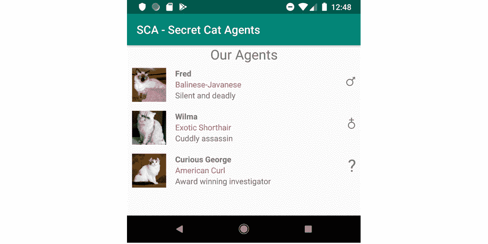

图 6.8:带有硬编码秘密卡特彼勒代理商的回收视图

可以看到，`RecyclerView`现在有内容了，你的 app 也开始成型了。请注意，基于绑定到每个实例的数据，如何使用相同的布局来呈现不同的项。正如你所料，如果你添加了足够的项目让它们离开屏幕，滚动就能工作。接下来，我们将研究允许用户与我们的`RecyclerView`中的项目进行交互。

# 响应回收视图中的点击

如果我们想让用户从显示的列表中选择一个项目，该怎么办？为了实现这一点，我们需要将点击量传回我们的应用程序。

实现点击交互的第一步是在`ViewHolder`级捕捉对项目的点击。

为了保持我们的视图支架和适配器之间的分离，我们在视图支架中定义了一个嵌套的`OnClickListener`接口。我们选择在视图容器中定义接口，因为它们紧密耦合。在我们的例子中，接口只有一个功能。该功能的目的是通知视图持有者关于点击的信息。视图持有者的所有者通常是片段或活动。因为我们知道视图持有人可以被重用，所以我们知道在构建时用一种告诉我们哪个项目被点击的方式来定义它是有挑战性的(因为该项目会随着重用而改变)。我们通过点击将当前呈现的项目返回给视图持有者的所有者来解决这个问题。这意味着我们的界面如下所示:

```kt
interface OnClickListener {
    fun onClick(catData: CatUiModel)
}
```

我们还将把这个监听器作为参数添加到我们的`ViewHolder`构造函数中:

```kt
class CatViewHolder(
    containerView: View,
    private val imageLoader: ImageLoader,
 private val onClickListener: OnClickListener
) : ViewHolder(containerView) {
    .
    .
    .
}
```

它将被这样使用:

```kt
containerView.setOnClickListener { onClickListener.onClick(catData) }
```

现在，我们希望适配器传入一个侦听器。接下来，该监听器将负责通知适配器的所有者点击。这意味着我们的适配器也需要一个嵌套的侦听器接口，与我们在视图容器中实现的接口非常相似。

虽然这看起来像是可以通过重用同一个侦听器来避免的重复，但这并不是一个好主意，因为它通过侦听器导致视图固定器和适配器之间的紧密耦合。当您希望适配器也通过侦听器报告其他事件时会发生什么？您必须处理那些来自视图持有者的事件，即使它们实际上不会在视图持有者中实现。

最后，为了处理 click 事件并显示一个对话框，我们在活动中定义了一个侦听器，并将其传递给适配器。我们设置监听器在点击时显示一个对话框。在 MVVM 实现中，您将在此时通知`ViewModel`点击。`ViewModel`然后会更新它的状态，告诉视图(我们的活动)它应该显示对话框。

## 练习 6.03:回应点击

您的应用程序已经向用户显示了秘密猫特工的列表。是时候让你的用户通过点击它的视图来选择一个秘密的猫特工了。点击事件是从视图持有者到适配器到活动的委托，如图 6.9*所示:*

 *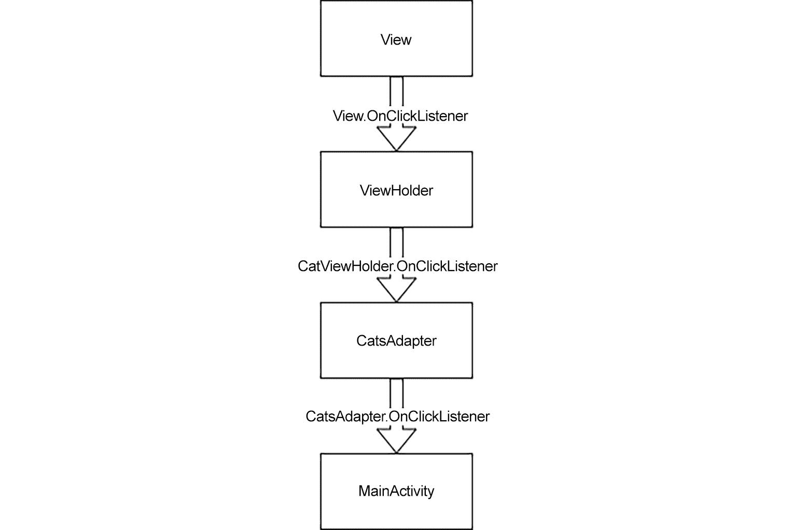

图 6.9:点击事件的流程

完成本练习需要遵循以下步骤:

1.  Open your `CatViewHolder.kt` file. Add a nested interface to it right before the final closing curly bracket:

    ```kt
        interface OnClickListener {
            fun onClick(catData: CatUiModel)
        }
    ```

    这将是侦听器必须实现的接口，以便注册单个 cat 项目上的点击事件。

2.  Update the `CatViewHolder` constructor to accept `OnClickListener` and make containerView accessible:

    ```kt
    class CatViewHolder(
        private val containerView: View,
        private val imageLoader: ImageLoader,
     private val onClickListener: OnClickListener
    ) : ViewHolder(containerView) {
    ```

    现在，当构造一个`CatViewHolder`构造函数时，你也可以注册点击项目视图。

3.  在您的`bindData(CatUiModel)`函数顶部，添加以下内容来拦截点击并将其报告给提供的监听器:

    ```kt
    containerView.setOnClickListener { onClickListener.onClick(catData) }
    ```

4.  Now, open your `CatsAdapter.kt` file. Add this nested interface right before the final closing curly bracket:

    ```kt
    interface OnClickListener { 
        fun onItemClick(catData: CatUiModel) 
    }
    ```

    这定义了侦听器必须实现的接口，以便从适配器接收项目单击事件。

5.  更新`CatsAdapter`构造函数以接受实现您刚刚定义的`OnClickListener`适配器的调用:

    ```kt
    class CatsAdapter(
        private val layoutInflater: LayoutInflater,
        private val imageLoader: ImageLoader,
     private val onClickListener: OnClickListener
    ) : RecyclerView.Adapter<CatViewHolder>() {
    ```

6.  In `onCreateViewHolder(ViewGroup, Int)`, update the creation of the view holder, as follows:

    ```kt
            return CatViewHolder(view, imageLoader, object : 
              CatViewHolder.OnClickListener {
                override fun onClick(catData: CatUiModel) = 
                  onClickListener.onItemClick(catData)
            })
    ```

    这将添加一个匿名类，将`ViewHolder`点击事件委托给适配器监听器。

7.  最后，打开你的`MainActivity.kt`文件。如下更新您的`catsAdapter`结构，以匿名监听器的形式提供适配器所需的依赖关系，通过显示一个对话框来处理点击事件:

    ```kt
        private val catsAdapter by lazy {
            CatsAdapter(
                layoutInflater,
                GlideImageLoader(this),
     object : CatsAdapter.OnClickListener {
     override fun onClick(catData: CatUiModel) =               onClickListener.onItemClick(catData)
     }
            )
        }
    ```

8.  Add the following function right before the final closing curly bracket:

    ```kt
        private fun showSelectionDialog(catData: CatUiModel) {
            AlertDialog.Builder(this)
                .setTitle("Agent Selected")
                .setMessage("You have selected agent ${catData.name}")
                .setPositiveButton("OK") { _, _ -> }
                .show()
        }
    ```

    该功能将显示一个对话框，其中显示数据传入的猫的名称。

9.  一定要导入正确版本的`AlertDialog`，也就是`androidx.appcompat.app.AlertDialog`，而不是`android.app.AlertDialog`。这通常是支持向后兼容的更好选择。
10.  运行您的应用程序。点击其中一只猫应该会显示一个对话框:

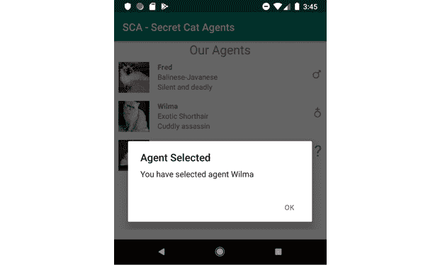

图 6.10:显示代理已被选中的对话框

尝试点按不同的项目，并记下呈现的不同消息。你现在知道如何回应用户点击你的`RecyclerView`内的项目。接下来，我们将看看如何在列表中支持不同的项目类型。

# 支持不同的项目类型

在前几节中，我们学习了如何处理单一类型的项目列表(在我们的例子中，我们所有的项目都是`CatUiModel`)。如果您想要支持多种类型的项目，会发生什么情况？一个很好的例子是在我们的列表中有组标题。

假设我们没有得到猫的列表，而是得到一个包含快乐猫和悲伤猫的列表。两组猫的每一组前面都有相应组的名称。我们的列表现在将包含`ListItem`个实例，而不是`CatUiModel`个实例的列表。`ListItem`可能是这样的:

```kt
sealed class ListItem {
    data class Group(val name: String) : ListItem()
    data class Cat(val data: CatUiModel) : ListItem()
}
```

我们的项目列表可能如下所示:

```kt
listOf(
    ListItem.Group("Happy Cats"),
    ListItem.Cat(
        CatUiModel(
            Gender.Female,
            CatBreed.AmericanCurl,
            "Kitty",
            "Kitty is warm and fuzzy.",
            "https://cdn2.thecatapi.cimg/..."
        )
    ),
    ListItem.Cat(
        CatUiModel(
            Gender.Male,
            CatBreed.ExoticShorthair,
            "Joey",
            "Loves to cuddle.",
            "https://cdn2.thecatapi.cimg/..."
        )
    ),
    ListItem.Group("Sad Cats"),
    ListItem.Cat(
        CatUiModel(
            Gender.Unknown,
            CatBreed.AmericanCurl,
            "Ginger",
            "Just not in the mood.",
            "https://cdn2.thecatapi.cimg/..."
        )
    ),
    ListItem.Cat(
        CatUiModel(
            Gender.Female,
            CatBreed.ExoticShorthair,
            "Butters",
            "Sleeps most of the time.",
            "https://cdn2.thecatapi.cimg/..."
        )
    )
)
```

在这种情况下，只有一种布局类型是不行的。幸运的是，正如您在我们之前的练习中可能已经注意到的那样，`RecyclerView.Adapter`为我们提供了一个机制来处理这个问题(还记得`onCreateViewHolder(ViewGroup, Int)`函数中使用的`viewType`参数吗？).

为了帮助适配器确定每个项目需要哪种视图类型，我们覆盖了它的`getItemViewType(Int)`功能。下面是一个对我们有用的实现示例:

```kt
override fun getItemViewType(position: Int) = when (listData[position]) {
    is ListItem.Group -> VIEW_TYPE_GROUP
    is ListItem.Cat -> VIEW_TYPE_CAT
}
```

这里，`VIEW_TYPE_GROUP`和`VIEW_TYPE_CAT`的定义如下:

```kt
private const val VIEW_TYPE_GROUP = 0
private const val VIEW_TYPE_CAT = 1
```

这个实现将给定位置的数据类型映射到一个常量值，该常量值代表我们已知的布局类型之一。在我们的例子中，我们知道头衔和猫，因此是两种类型。我们使用的值可以是任何整数值，因为它们像在`onCreateViewHolder(ViewGroup, Int)`函数中一样被传递回我们。我们需要做的就是确保不要重复同一个值超过一次。

既然我们已经告诉适配器需要哪些视图类型以及在哪里，我们还需要告诉它每个视图类型使用哪个视图持有者。这是通过实现`onCreateViewHolder(ViewGroup, Int)`功能来实现的:

```kt
override fun onCreateViewHolder(parent: ViewGroup, viewType: Int) =   when (viewType) {
    VIEW_TYPE_GROUP -> {
        val view = layoutInflater.inflate(R.layout.item_title, 
          parent, false)
        GroupViewHolder(view)
    }
    VIEW_TYPE_CAT -> {
        val view = layoutInflater.inflate(R.layout.item_cat, parent, false)
        CatViewHolder(view, imageLoader, object : 
          CatViewHolder.OnClickListener {
            override fun onClick(catData: CatUiModel) =              onClickListener.onItemClick(catData)
        })
    }
    else -> throw IllegalArgumentException("Unknown view type requested:       $viewType")
}
```

与该函数的早期实现不同，我们现在考虑`viewType`的值。

我们现在知道，`viewType`预计是我们从`getItemViewType(Int)`返回的值之一。

对于这些值中的每一个(`VIEW_TYPE_GROUP`和`VIEW_TYPE_CAT`，我们对相应的布局进行膨胀，并构建一个合适的视图支架。请注意，我们从不期望接收任何其他值，因此如果遇到这样的值，就会抛出异常。根据您的需要，您可以返回一个默认的视图支架，该支架的布局显示有错误或根本没有错误。记录这样的值也可能是一个好主意，这样可以让您调查为什么会收到这些值，并决定如何处理它们。

对于我们的标题布局，一个简单的`TextView`可能就足够了。`item_cat.xml`布局可以保持原样。

现在转到视图支架上。我们需要为标题创建一个视图支架。这意味着我们现在将有两个不同的观点持有人。但是，我们的适配器只支持一种适配器类型。最简单的解决方案是定义一个共同的视图支架，使`GroupViewHolder`和`CatViewHolder`都可以延伸。姑且称之为`ListItemViewHolder`。`ListItemViewHolder`类可以是抽象的，因为我们从来不打算直接使用它。为了方便绑定数据，我们还可以在抽象视图中引入一个函数——`abstract fun bindData(listItem: ListItemUiModel)`。我们的具体实现可以预期接收特定的类型，因此我们可以分别向`GroupViewHolder`和`CatViewHolder`添加以下行:

```kt
require(listItem is ListItemUiModel.Cat) {
    "Expected ListItemUiModel.Cat"
}
```

我们还可以添加以下内容:

```kt
require(listItem is ListItemUiModel.Cat) { "Expected ListItemUiModel.Cat" }
```

具体来说，在`CatViewHolder`中，由于一些科特林魔法，我们可以使用`define val catData = listItem.data`而保持类的其余部分不变。

做出这些改变后，我们现在可以期待看到`Happy Cats`和`Sad Cats`组的标题，每个标题后面都有相关的猫。

## 练习 6.04:向回收视图添加标题

我们现在希望能够分两组展示我们的秘密卡特彼勒代理商:可供我们部署到现场的主动代理商和目前无法部署的潜伏代理商。为此，我们将在活动代理上方添加一个标题，在睡眠代理上方添加另一个标题:

1.  在`com.example.myrecyclerviewapp.model`下，新建一个名为`ListItemUiModel`的 Kotlin 文件。
2.  将以下内容添加到`ListItemUiModel.kt`文件中，定义我们的两种数据类型——标题和猫:

    ```kt
    sealed class ListItemUiModel {
        data class Title(val title: String) : ListItemUiModel()
        data class Cat(val data: CatUiModel) : ListItemUiModel()
    }
    ```

3.  在`com.example.myrecyclerviewapp`中创建新的名为`ListItemViewHolder`的 Kotlin 文件。这将是我们的基本观点持有人。
4.  用以下内容填充`ListItemViewHolder.kt`文件:

    ```kt
    abstract class ListItemViewHolder(
        containerView: View
    ) : RecyclerView.ViewHolder(containerView) {
        abstract fun bindData(listItem: ListItemUiModel)
    }
    ```

5.  打开`CatViewHolder.kt`文件。
6.  使`CatViewHolder`延伸`ListItemViewHolder` :

    ```kt
    class CatViewHolder(
        ...
    ) : ListItemViewHolder(containerView) {
    ```

7.  将`bindData(CatUiModel)`参数替换为`ListItemUiModel`并使其覆盖`ListItemViewHolder`抽象函数:

    ```kt
        override fun bindData(listItem: ListItemUiModel)
    ```

8.  Add the following two lines to the top of the `bindData(ListItemUiModel)` function to enforce casting `ListItemUiModel` to `ListItemUiModel.Cat` and to fetch the cat data from it:

    ```kt
    require(listItem is ListItemUiModel.Cat) { 
      "Expected ListItemUiModel.Cat" } 
    val catData = listItem.data
    ```

    保持文件的其余部分不变。

9.  创建新的布局文件。命名你的布局`item_title`。
10.  Replace the default content of the newly created `item_title.xml` file with the following:

    ```kt
    <?xml version="1.0" encoding="utf-8"?>
    <TextView xmlns:android="http://schemas.android.com/apk/res/android"
        xmlns:app="http://schemas.android.com/apk/res-auto"
        xmlns:tools="http://schemas.android.com/tools"
        android:id="@+id/item_title_title"
        android:layout_width="match_parent"
        android:layout_height="wrap_content"
        android:padding="8dp"
        android:textSize="16sp"
        android:textStyle="bold"
        app:layout_constraintStart_toStartOf="parent"
        app:layout_constraintTop_toTopOf="parent"
        tools:text="Sleeper Agents" />
    ```

    这个新的布局，只包含一个 16sp 大小的粗体`TextView`，将包含我们的标题:

    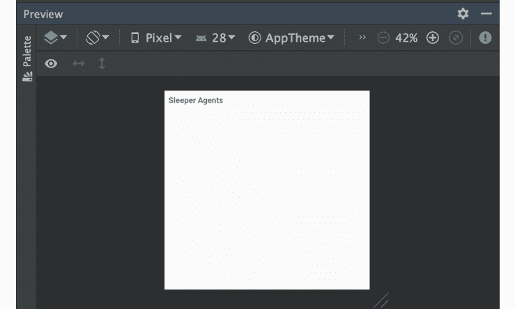

    图 6.11:项目布局的预览

11.  Implement `TitleViewHolder` in a new file with the same name under `com.example.myrecyclerviewapp`:

    ```kt
    class TitleViewHolder(
        containerView: View
    ) : ListItemViewHolder(containerView) {
        private val titleView: TextView
            by lazy { containerView           .findViewById(R.id.item_title_title) }
        override fun bindData(listItem: ListItemUiModel) {
            require(listItem is ListItemUiModel.Title) {
                "Expected ListItemUiModel.Title"
            }
            titleView.text = listItem.title
        }
    }
    ```

    这和`CatViewHolder`很像，但由于我们只在`TextView`上设置了文字，也简单多了。

12.  现在，选择`CatViewHolder`、`ListItemViewHolder`、`TitleViewHolder`让事情更整洁。
13.  将所有文件移动到新的名称空间:右键单击其中一个文件，然后选择`Refactor` | `Move`(或按下 *F6* )。
14.  将`/viewholder`追加到预填充的`To directory`字段。勾选`Search references`和`Update package directive (Kotlin files)`，不勾选`Open moved files in editor`。点击`OK`。
15.  打开`CatsAdapter.kt`文件。
16.  现在，将`CatsAdapter`重命名为`ListItemsAdapter`。保持变量、函数和类的命名以反映它们的实际用法是很重要的，以避免将来的混乱。在代码窗口中右键单击`CatsAdapter`类名，然后选择`Refactor` | `Rename`(或 *Shift* + *F6* )。
17.  当`CatsAdapter`高亮显示时，输入`ListItemsAdapter`并按*进入*。
18.  将适配器通用类型更改为`ListItemViewHolder` :

    ```kt
    class ListItemsAdapter(
        ...
    ) : RecyclerView.Adapter<ListItemViewHolder>() {
    ```

19.  更新`listData`和`setData(List<CatUiModel>)`处理`ListItemUiModel`改为:

    ```kt
        private val listData = mutableListOf<ListItemUiModel>()
        fun setData(listData: List<ListItemUiModel>) {
            this.listData.clear()
            this.listData.addAll(listData)
            notifyDataSetChanged()
        }
    ```

20.  更新`onBindViewHolder(CatViewHolder)`以符合适配器合同变更:

    ```kt
        override fun onBindViewHolder(holder: ListItemViewHolder,       position: Int) {
            holder.bindData(listData[position])
        }
    ```

21.  在文件的顶部，在导入之后和类定义之前，添加视图类型常量:

    ```kt
    private const val VIEW_TYPE_TITLE = 0
    private const val VIEW_TYPE_CAT = 1
    ```

22.  像这样执行`getItemViewType(Int)`:

    ```kt
        override fun getItemViewType(position: Int) =       when (listData[position]) {
            is ListItemUiModel.Title -> VIEW_TYPE_TITLE
            is ListItemUiModel.Cat -> VIEW_TYPE_CAT
        }
    ```

23.  最后，更改您的`onCreateViewHolder(ViewGroup, Int)`实现，如下所示:

    ```kt
        override fun onCreateViewHolder(parent: ViewGroup,       viewType: Int) = when (viewType) {
            VIEW_TYPE_TITLE -> {
                val view = layoutInflater.inflate(R.layout.item_title,               parent, false)
                TitleViewHolder(view)
            }
            VIEW_TYPE_CAT -> {
                val view = layoutInflater.inflate(R.layout.item_cat,               parent, false)
                CatViewHolder(
                    view,
                    imageLoader,
                    object : CatViewHolder.OnClickListener {
                        override fun onClick(catData: CatUiModel) =
                            onClickListener.onItemClick(catData)
                    })
            }
            else -> throw IllegalArgumentException("Unknown view type           requested: $viewType")
        }
    ```

24.  Update `MainActivity` to populate the adapter with appropriate data, replacing the previous `catsAdapter.setData(List<CatUiModel>)` call. (Please note that the code below has been truncated for space. Refer to the link below to access the full code that you need to add.)

    MainActivity.kt 公司

    ```kt
    32      listItemsAdapter.setData(
    33          listOf(
    34              ListItemUiModel.Title("Sleeper Agents"),
    35              ListItemUiModel.Cat(
    36                  CatUiModel(
    37                      Gender.Male,
    38                      CatBreed.ExoticShorthair,
    39                      "Garvey",
    40                      "Garvey is as a lazy, fat, and cynical orange cat.",
    41                      "https://cdn2.thecatapi.cimg/FZpeiLi4n.jpg"
    42                  )
    43              ),
    44              ListItemUiModel.Cat(
    45                  CatUiModel(
    46                      Gender.Unknown,
    47                      CatBreed.AmericanCurl,
    48                      "Curious George",
    49                      "Award winning investigator",
    50                      "https://cdn2.thecatapi.cimg/vJB8rwfdX.jpg"
    51                  )
    52              ),
    53              ListItemUiModel.Title("Active Agents"),
    ```

    这一步的完整代码可以在[http://packt.live/3icCrSt](http://packt.live/3icCrSt)找到。

25.  既然`catsAdapter`不再持有`CatsAdapter`而是`ListItemsAdapter`，那就相应改名。命名为`listItemsAdapter`。
26.  运行应用程序。您应该会看到类似以下内容的内容:

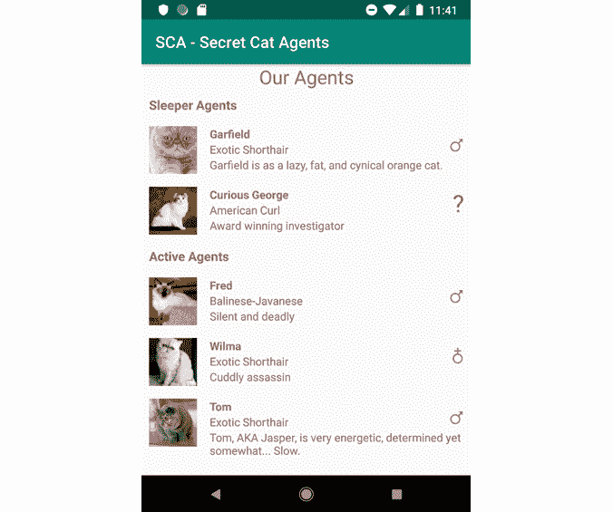

图 6.12:带有休眠代理/活动代理标题视图的回收视图

正如你所看到的，我们现在有两个代理组以上的标题。与`Our Agents`标题不同，这些标题会随着我们的内容滚动。接下来，我们将学习如何从`RecyclerView`中滑动一个项目以将其移除。

# 滑动以移除项目

在前几节中，我们学习了如何呈现不同的视图类型。然而，到目前为止，我们一直在使用一个固定的项目列表。如果您希望能够从列表中删除项目，该怎么办？有一些常见的机制可以实现这一点——固定的删除按钮、滑动以删除、长按以选择然后“单击以删除”按钮，等等。在本节中，我们将重点介绍“滑动删除”方法。

让我们从向适配器添加删除功能开始。要告诉适配器移除一个项目，我们需要指出要移除哪个项目。实现这一点的最简单方法是提供项目的位置。在我们的实现中，这将直接关联到项目在我们的`listData`列表中的位置。所以，我们的`removeItem(Int)`功能应该是这样的:

```kt
fun removeItem(position: Int) {
    listData.removeAt(position)
    notifyItemRemoved(position)
}
```

注意

就像在设置数据时，我们需要通知`RecyclerView`数据集发生了变化——在这种情况下，一个项目被移除了。

接下来，我们需要定义滑动手势检测。这是通过利用`ItemTouchHelper`来完成的。现在，`ItemTouchHelper`通过回调向我们报告某些触摸事件，即拖拽和滑动。我们通过实现`ItemTouchHelper.Callback`来处理这些回调。另外，`RecyclerView`提供了`ItemTouchHelper.SimpleCallback`，省去了大量样板代码的编写。

我们想要响应滑动手势，但忽略移动手势。更具体地说，我们想对向右的重击做出反应。移动用于重新排序项目，这超出了本章的范围。因此，我们对`SwipToDeleteCallback`的实现如下:

```kt
inner class SwipeToDeleteCallback :
    ItemTouchHelper.SimpleCallback(0, ItemTouchHelper.RIGHT) {
    override fun onMove(
        recyclerView: RecyclerView,
        viewHolder: RecyclerView.ViewHolder,
        target: RecyclerView.ViewHolder
    ): Boolean = false
    override fun getMovementFlags(
        recyclerView: RecyclerView,
        viewHolder: RecyclerView.ViewHolder
    ) = if (viewHolder is CatViewHolder) {
        makeMovementFlags(
            ItemTouchHelper.ACTION_STATE_IDLE,
            ItemTouchHelper.RIGHT
        )or makeMovementFlags(
            ItemTouchHelper.ACTION_STATE_SWIPE,
            ItemTouchHelper.RIGHT
        )
    } else {
        0
    }
    override fun onSwiped(viewHolder: RecyclerView.ViewHolder, 
      direction: Int) {
        val position = viewHolder.adapterPosition
        removeItem(position)
    }
}
```

因为我们的实现与适配器及其视图类型紧密耦合，所以我们可以轻松地将其定义为内部类。我们获得的好处是能够直接调用适配器上的方法。

如您所见，我们从`onMove(RecyclerView, ViewHolder, ViewHolder)`功能返回`false`。这意味着我们忽略移动事件。

接下来，我们需要告诉`ItemTouchHelper`哪些物品可以刷卡。我们通过覆盖`getMovementFlags(RecyclerView, ViewHolder)`来实现这一点。当用户即将开始拖动或滑动手势时，会调用此功能。`ItemTouchHelper`希望我们为提供的视图持有者返回有效的手势。我们检查`ViewHolder`类，如果是`CatViewHolder`，我们希望允许刷卡——否则，我们不允许。我们使用`makeMovementFlags(Int, Int)`，这是一个辅助函数，用于以`ItemTouchHelper`可以解密的方式构造标志。请注意，我们为`ACTION_STATE_IDLE`定义了规则，T7 是手势的开始状态，因此允许手势从左边或右边开始。然后，我们将它(使用`or`)与`ACTION_STATE_SWIPE`标志相结合，允许正在进行的手势向左或向右滑动。返回`0`意味着所提供的视图支架既不会滑动也不会移动。

一旦完成滑动操作，就会调用`onSwiped(ViewHolder, Int)`。然后我们通过调用`adapterPosition`从传入的视图固定器中获取位置。现在，`adapterPosition`很重要，因为它是获取视图持有者所呈现项目的真实位置的唯一可靠方法。

有了正确的位置，我们可以通过调用适配器上的`removeItem(Int)`来移除该项目。

为了展示我们新创建的`SwipeToDeleteCallback`实现，我们在适配器中定义了一个只读变量，即`swipeToDeleteCallback`，并将其设置为`SwipeToDeleteCallback`的一个新实例。

最后，要将我们的`callback`机制插入到`RecyclerView`中，我们需要构建一个新的`ItemTouchHelper`并将其附加到我们的`RecyclerView`中。我们应该在设置我们的`RecyclerView`时这样做，我们在主要活动的`onCreate(Bundle?)`功能中这样做。这是创建和附加的外观:

```kt
val itemTouchHelper = ItemTouchHelper(listItemsAdapter.swipeToDeleteCallback)
itemTouchHelper.attachToRecyclerView(recyclerView)
```

我们现在可以滑动项目以将其从列表中移除。请注意，我们的标题不能像我们预期的那样被窃取。

你可能已经注意到一个小故障:最后一个项目被切断，因为它的动画。发生这种情况是因为`RecyclerView`在动画开始前缩小以容纳新的(较小的)项目数量。对此的一个快速解决方案是通过将我们的`RecyclerView`的底部限制在其父代的底部来固定它的高度。

## 练习 6.05:添加滑动删除功能

我们之前在我们的应用中添加了`RecyclerView`，然后在其中添加了不同类型的项目。我们现在将允许用户通过向左或向右滑动来删除一些项目(我们希望让用户删除秘密的猫特工，但不删除标题):

1.  要为我们的适配器添加物品移除功能，请在`setData(List<ListItemUiModel>)`功能之后的`ListItemsAdapter`中添加以下功能:

    ```kt
        fun removeItem(position: Int) {
            listData.removeAt(position)
            notifyItemRemoved(position)
        }
    ```

2.  Next, right before the closing curly bracket of your `ListItemsAdapter` class, add the following `callback` implementation to handle the user swiping a cat agent left or right:

    ```kt
        inner class SwipeToDeleteCallback :
            ItemTouchHelper.SimpleCallback(0, ItemTouchHelper.LEFT or           ItemTouchHelper.RIGHT) {
            override fun onMove(
                recyclerView: RecyclerView,
                viewHolder: RecyclerView.ViewHolder,
                target: RecyclerView.ViewHolder
            ): Boolean = false
            override fun getMovementFlags(
                recyclerView: RecyclerView,
                viewHolder: RecyclerView.ViewHolder
            ) = if (viewHolder is CatViewHolder) {
                makeMovementFlags(
                    ItemTouchHelper.ACTION_STATE_IDLE,
                    ItemTouchHelper.LEFT or ItemTouchHelper.RIGHT
                ) or makeMovementFlags(
                    ItemTouchHelper.ACTION_STATE_SWIPE,
                    ItemTouchHelper.LEFT or ItemTouchHelper.RIGHT
                )
            } else {
                0
            }
            override fun onSwiped(viewHolder: RecyclerView.ViewHolder,           direction: Int) {
                val position = viewHolder.adapterPosition
                removeItem(position)
            }
        }
    ```

    我们已经实现了一个`ItemTouchHelper.SimpleCallback`实例，传递了我们感兴趣的方向— `LEFT`和`RIGHT`。通过使用`or`布尔运算符来连接这些值。

    我们已经覆盖了`getMovementFlags`功能，以确保我们只处理了在卡特彼勒代理商视图上的滑动，而不是标题。为`ItemTouchHelper.ACTION_STATE_SWIPE`和`ItemTouchHelper.ACTION_STATE_IDLE`创建标志允许我们分别拦截滑动和释放事件。

    一旦完成滑动(用户已经将手指从屏幕上抬起)，将调用`onSwiped`，作为响应，我们在拖动的视图支架提供的位置移除项目。

3.  在适配器的顶部，公开刚刚创建的`SwipeToDeleteCallback`类的一个实例:

    ```kt
    class ListItemsAdapter(
        ...
    ) : RecyclerView.Adapter<ListItemViewHolder>() {
     val swipeToDeleteCallback = SwipeToDeleteCallback()
    ```

4.  最后，通过实现`ItemViewHelper`并将其附加到我们的`RecyclerView`来将所有这些联系在一起。将布局管理器分配给适配器后，立即将以下代码添加到您的`MainActivity`文件的`onCreate(Bundle?)`功能中:

    ```kt
        recyclerView.layoutManager = ...
        val itemTouchHelper = ItemTouchHelper(listItemsAdapter       .swipeToDeleteCallback)
        itemTouchHelper.attachToRecyclerView(recyclerView)
    ```

5.  To address the small visual glitch you would get when items are removed, scale `RecyclerView` to fit the screen by updating the code in `activity_main.xml`, as follows. The changes are in `RecyclerView` tag, right before the `app:layout_constraintTop_toBottomOf` attribute:

    ```kt
            android:layout_height="0dp"
     app:layout_constraintBottom_toBottomOf="parent"
            app:layout_constraintTop_toBottomOf="@+id/main_label" />
    ```

    注意有两个变化:我们在父视图的底部增加了视图底部的约束，我们将布局高度设置为`0dp`。后一个变化告诉我们的 app 根据其约束计算`RecyclerView`的高度:

    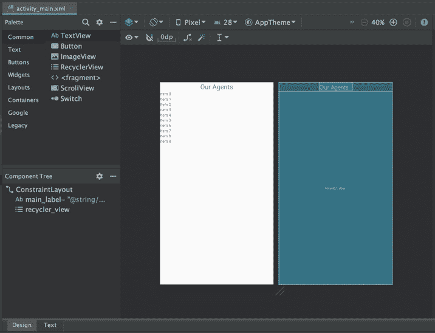

    图 6.13:回收视图获取布局的全部高度

6.  运行您的应用程序。现在，您应该可以向左或向右滑动秘密猫特工，将他们从列表中删除。注意`RecyclerView`为我们处理折叠动画:

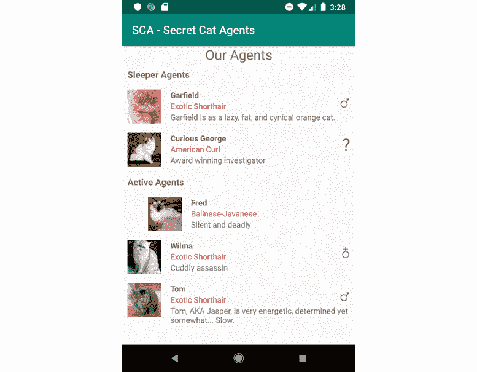

图 6.14:一只猫被刷到了右边

请注意，即使标题是项目视图，它们也不能被刷。您已经为滑动手势实现了一个回调，可以区分不同的项目类型，并通过删除滑动的项目来响应滑动。现在我们知道如何交互移除项目了。接下来，我们还将学习如何添加新项目。

# 交互添加项目

我们刚刚学习了如何交互移除项目。添加新项目怎么样？让我们调查一下。

类似于我们实现项目移除的方式，我们从向适配器添加一个函数开始:

```kt
fun addItem(position: Int, item: ListItemUiModel) {
    listData.add(position, item)
    notifyItemInserted(position)
}
```

您会注意到，实现与我们之前实现的`removeItem(Int)`函数非常相似。这一次，我们还收到一个要添加的项目和一个要添加的位置。然后我们将其添加到我们的`listData`列表中，并通知`RecyclerView`我们在请求的位置添加了一个项目。

要触发对`addItem(Int, ListItemUiModel)`的调用，我们可以在主活动布局中添加一个按钮。该按钮可以如下所示:

```kt
<Button
    android:id="@+id/main_add_item_button"
    android:layout_width="match_parent"
    android:layout_height="wrap_content"
    android:text="Add A Cat"
    app:layout_constraintBottom_toBottomOf="parent" />
```

该应用程序现在将如下所示:

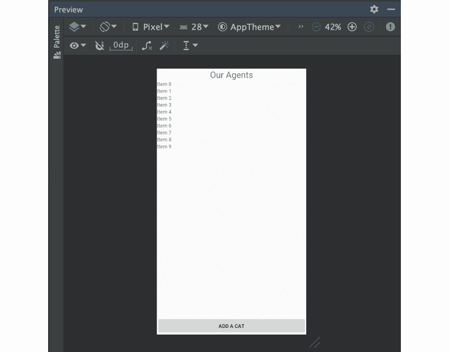

图 6.15:添加猫按钮的主布局

别忘了更新你的`RecyclerView`，这样它的底部就会被限制在这个按钮的顶部。否则，按钮和`RecyclerView`会重叠。

在生产应用程序中，您可以添加一个关于新项目的基本原理。例如，您可以让用户填写不同的详细信息。为了简单起见，在我们的例子中，我们将总是添加相同的虚拟物品——一个匿名的女性秘密猫特工。

要添加项目，我们在按钮上设置`OnClickListener`:

```kt
addItemButton.setOnClickListener {
    listItemsAdapter.addItem(
        1,
        ListItemUiModel.Cat(
            CatUiModel(
                Gender.Female,
                CatBreed.BalineseJavanese,
                "Anonymous",
                "Unknown",
                "https://cdn2.thecatapi.cimg/zJkeHza2K.jpg"
            )
        )
    )
}
```

就是这样。我们在位置 1 添加项目，这样它就被添加到我们第一个标题的正下方，也就是位置 0 的项目。在生产应用程序中，您可以通过逻辑来确定插入项目的正确位置。它可以在相关标题的下方，或者总是添加在顶部、底部或正确的位置，以保留一些现有的顺序。

我们现在可以运行该应用程序。我们现在将有一个新的`Add A Cat`按钮。我们每次点击按钮，都会在`RecyclerView`增加一个匿名的密猫特工。新增加的猫可以刷走拿走，就像之前的硬编码猫一样。

## 练习 6.06:实现“添加猫”按钮

实现了移除项目的机制之后，现在是我们实现添加项目的机制的时候了:

1.  给`ListItemsAdapter`增加一个功能，支持增加项目。在`removeItem(Int)`功能下方添加:

    ```kt
        fun addItem(position: Int, item: ListItemUiModel) {
            listData.add(position, item)
            notifyItemInserted(position)
        }
    ```

2.  在`RecyclerView`标签后的`activity_main.xml`处添加一个按钮:

    ```kt
        <Button
            android:id="@+id/main_add_item_button"
            android:layout_width="match_parent"
            android:layout_height="wrap_content"
            android:text="Add A Cat"
            app:layout_constraintBottom_toBottomOf="parent" />
    ```

3.  你会注意到`android:text="Add A Cat"`高亮显示。如果您将鼠标悬停在它上面，您会看到这是因为硬编码的字符串。点击`Add`字，将编辑器光标置于其上。
4.  按*选项* + *进入* (iOS)或 *Alt* + *进入* (Windows)显示上下文菜单，然后*再次进入*显示`Extract Resource`对话框。
5.  命名资源`add_button_label`。按下`OK`。
6.  To change the bottom constraint on `RecyclerView` so that the button and `RecyclerView` do not overlap, within your `RecyclerView` tag, locate the following:

    ```kt
        app:layout_constraintBottom_toBottomOf="parent"
    ```

    用下面一行代码替换它:

    ```kt
        app:layout_constraintBottom_toTopOf="@+id/main_add_item_button"
    ```

7.  Add a lazy field holding a reference to the button at the top of the class, right after the definition of `recyclerView`:

    ```kt
        private val addItemButton: View
            by lazy { findViewById(R.id.main_add_item_button) }
    ```

    注意`addItemButton`被定义为视图。这是因为在我们的代码中，我们不需要知道视图的类型就可以添加点击监听器。选择更抽象的类型允许我们稍后更改布局中视图的类型，而不必修改这段代码。

8.  Lastly, update `MainActivity` to handle the click. Find the line that says the following:

    ```kt
            itemTouchHelper.attachToRecyclerView(recyclerView)
    ```

    紧接着，添加以下内容:

    ```kt
            addItemButton.setOnClickListener {
              listItemsAdapter.addItem(
                1,
                ListItemUiModel.Cat(
                  CatUiModel(
                    Gender.Female,
                    CatBreed.BalineseJavanese,
                    "Anonymous",
                    "Unknown",
                    "https://cdn2.thecatapi.cimg/zJkeHza2K.jpg"
                  )
                )
              )
    ```

    这将在每次点击按钮时向`RecyclerView`添加一个新项目。

9.  Run the app. You should see a new button at the bottom of your app:

    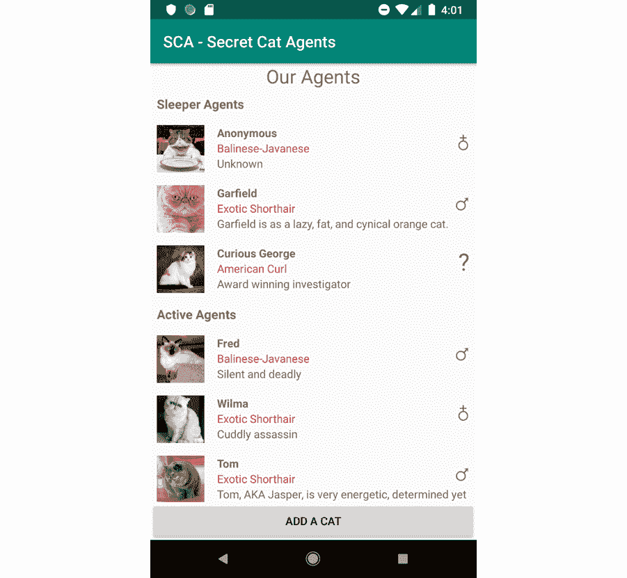

    图 6.16:通过点击按钮添加了一只匿名猫

10.  试着点击几次。每次你点击它，一个新的匿名秘密猫特工就会添加到你的`RecyclerView`中。你可以像刷硬编码猫一样刷掉新添加的猫。

在本练习中，您向`RecyclerView`添加了新项目以响应用户交互。现在您知道如何在运行时更改`RecyclerView`的内容了。了解如何在运行时更新列表非常有用，因为在应用程序运行时，您呈现给用户的数据经常会发生变化，您希望向用户呈现一个全新的最新状态。

## 活动 6.01:管理项目列表

假设你想开发一个食谱管理应用程序。你的应用程序将支持甜食和美味的食谱。你的应用程序的用户可以添加新的甜味或咸味食谱，在添加的食谱列表中滚动——按味道(甜味或咸味)分组——点击一个食谱以获取相关信息，最后，他们可以通过将食谱滑动到一边来删除它们。

这项活动的目的是创建一个带有`RecyclerView`的应用程序，列出食谱的标题，按口味分组。`RecyclerView`将支持用户交互。每个食谱都有标题、描述和味道。互动将包括点击和刷屏。点击后，用户会看到一个显示配方描述的对话框。轻扫将从应用程序中移除轻扫的食谱。最后，通过两个`EditText`字段(参见*第三章，屏幕和用户界面*)和两个按钮，用户可以分别添加新的甜味或咸味食谱，标题和描述设置为`EditText`字段中设置的值。

要完成的步骤如下:

1.  创建新的空活动应用程序。
2.  将`RecyclerView`支持添加到应用的`build.gradle`文件中。
3.  Add `RecyclerView`, two `EditText` fields, and two buttons to the main layout. Your layout should look something like this:

    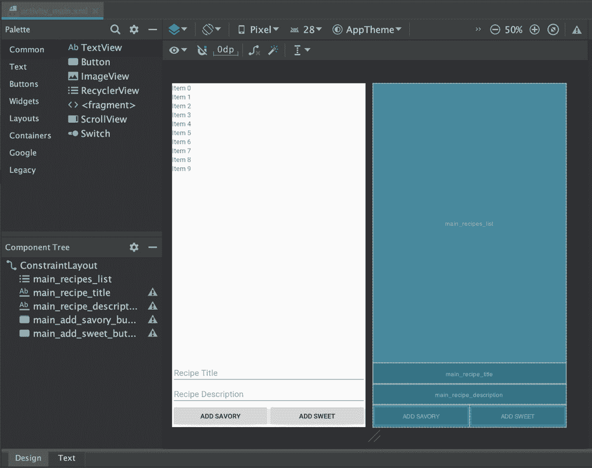

    图 6.17:带有回收视图、两个编辑文本字段和两个按钮的布局

4.  添加风味名称和配方的模型，以及风味的枚举。
5.  为风味标题添加布局。
6.  添加配方标题的布局。
7.  添加风味标题和配方标题的视图支架，以及一个适配器。
8.  添加点击监听器以显示一个包含配方描述的对话框。
9.  更新`MainActivity`以构建新的适配器，并连接按钮以添加新的咸味和甜味食谱。确保添加配方后表格被清除。
10.  添加滑动帮助器以移除项目。

最终输出如下:

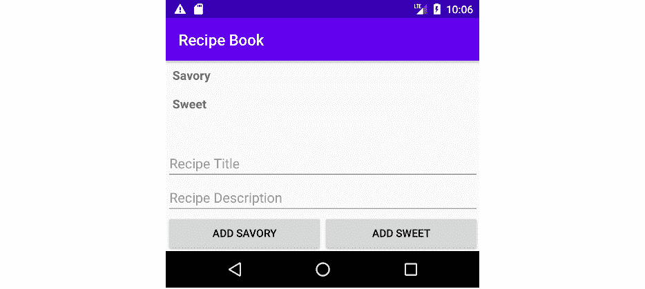

图 6.18:菜谱应用程序

注意

这个活动的解决方案可以在:[http://packt.live/3sKj1cp](06.html)找到

# 总结

在本章中，我们学习了如何将`RecyclerView`添加到我们的项目中。我们还学习了如何将它添加到布局中，以及如何用项目填充它。我们添加了不同的项目类型，这对标题特别有用。我们介绍了与`RecyclerView`的交互:对单个项目的点击做出响应和对滑动手势做出响应。最后，我们学习了如何在`RecyclerView`中动态添加和删除项目。`RecyclerView`的世界很丰富，我们只触及了表面。更进一步将超出本书的范围。但是，强烈建议您自行研究，以便在应用程序中拥有旋转木马、设计好的分隔器和更高级的滑动效果。你可以从这里开始你的探索:[https://awesomeopensource.com/projects/recyclerview-adapter](https://awesomeopensource.com/projects/recyclerview-adapter)。

在下一章中，我们将研究代表我们的应用程序请求特殊权限，以便能够执行某些任务，例如访问用户的联系人列表或他们的麦克风。我们还将研究使用谷歌地图应用编程接口和访问用户的物理位置。*