# 9。JUnit、Mockito 和 Espresso 的单元测试和集成测试

概观

在本章中，您将了解安卓平台上的测试，以及如何创建单元测试、集成测试和用户界面测试。您将看到如何创建每一种类型的测试，分析它如何运行，以及如何与 JUnit、Mockito、Robolectric 和 Espresso 等框架一起工作。您还将了解测试驱动开发，这是一种优先考虑测试而不是实现的软件开发实践。到本章结束时，你将能够结合你的新测试技能来完成一个现实的项目。

# 简介

在前面的章节中，您学习了如何加载后台数据并在 UI 中显示它，以及如何设置 API 调用来检索数据。但是你怎么能确定事情进展顺利呢？如果你在一个项目中必须修复一个 bug，而这个项目是你过去很少接触的，你会怎么做？你怎么知道你正在应用的修复不会触发另一个 bug？这些问题的答案是通过测试。

在本章中，我们将分析开发人员可以编写的测试类型，并查看可用的测试工具来简化测试体验。出现的第一个问题是，使用具有不同操作系统的台式机或笔记本电脑来开发移动应用程序。这意味着测试也必须在设备或仿真器上运行，这会降低测试速度。为了解决这个问题，我们提供了两种类型的测试:**本地测试**，位于`test`文件夹中，将在您的机器上运行；以及**仪表测试**，位于`androidTest`文件夹中，将在设备或仿真器上运行。

这两个测试都依赖于 Java **JUnit** 库，该库帮助开发人员设置他们的测试并将它们分组到不同的类别中。它还提供了不同的配置选项，以及其他库可以构建的扩展。我们还将研究测试金字塔，它有助于指导开发人员如何构建他们的测试。我们将从金字塔的底部开始，以**单元测试**为代表，向上通过**集成测试**，最后到达顶部，以**端到端测试**为代表(UI 测试)。您将有机会了解有助于编写这些类型测试的工具:

*   **mochito**和**mochito-kotlin**，它们主要在单元测试中提供帮助，并且对于创建 mocks 或测试 double 非常有用，在这些测试中，我们可以操纵输入，以便我们可以断言不同的场景。(模拟或测试替身是模仿另一个对象实现的对象。每次测试与模拟交互时，您都可以指定这些交互的行为。)
*   **roboleelectric**，一个开源库，将 Android 框架带到你的机器上，允许你在本地测试活动和片段，而不是在模拟器上。这可以用于单元测试和集成测试。
*   **Espresso** ，允许开发人员在仪表化测试中，在应用程序的 UI 上创建交互(单击按钮，在`EditText`组件中插入文本，等等)和断言(验证视图是否显示某些文本，当前是否向用户显示，是否启用等等)。

在本章中，我们还将看一下**测试驱动开发** ( **TDD** )。这是一个测试优先的软件开发过程。描述它的一个简单方法是先写测试。我们将分析在为安卓应用程序开发功能时如何采用这种方法。需要记住的一点是，为了让应用程序得到正确的测试，它的类必须被正确地编写。一种方法是明确定义类之间的界限，并根据您希望它们完成的任务来划分它们。一旦你做到了这一点，你也可以在编写你的类时依赖**依赖反转**和**依赖注入**原则。当这些原则被正确应用时，您应该能够将假对象注入到您的测试主题中，并操纵输入以适合您的测试场景。在编写检测测试时，依赖注入也有助于帮助您交换使用本地数据进行网络调用的模块，以便使您的测试独立于外部因素，如网络。仪表化测试是在设备或仿真器上运行的测试。“instrument”关键字来自检测框架，该框架组装这些测试，然后在设备上执行它们。

理想情况下，每个应用程序应该有三种类型的测试:

*   **单元测试**:这些是验证单个类和方法的局部测试。它们应该代表您的大多数测试，并且应该快速、易于调试、易于维护。它们也被称为小测试。
*   **集成测试**:这些测试或者是使用 Robolectric 的本地测试，或者是验证应用程序模块和组件之间交互的仪器测试。这些比单元测试更慢、更复杂。复杂性的增加是由于组件之间的相互作用。这些也被称为中等测试。
*   **用户界面测试(端到端测试)**:这些是验证完整用户旅程和场景的仪表化测试。这使得它们更加复杂，更难维护；它们应该代表您的测试总数中最小的数字。这些也被称为大型测试。

下图中可以观察到**测试金字塔**。谷歌的建议是为你的测试保持 70:20:10 的比例(单元测试:集成测试:UI 测试)；

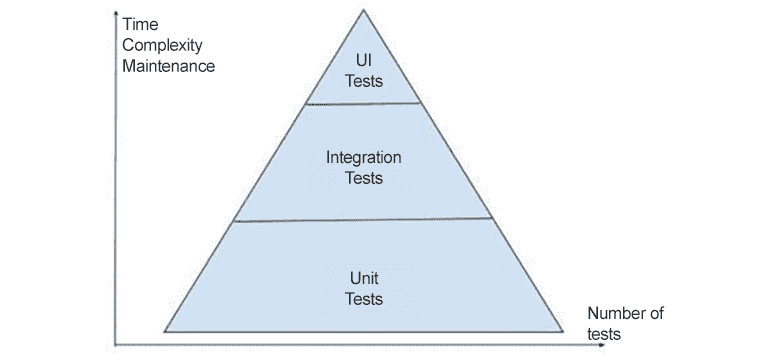

图 9.1:测试金字塔

A 正如上一节提到的，单元测试是验证一小部分代码的测试，大部分测试应该是覆盖各种场景(成功、错误、限制等等)的单元测试。理想情况下，这些测试应该是本地的，但是也有一些例外，您可以对它们进行检测。这种情况很少见，应该仅限于您想要与设备的特定硬件进行交互的时候。

# J 单位

JUnit 是一个用 Java 和 Android 编写单元测试的框架。它负责测试如何执行，允许开发人员配置他们的测试。它提供了许多功能，例如:

*   **设置和拆卸**:这些在每个测试方法执行前后调用，允许开发人员为测试设置相关数据，并在测试执行后清除。它们由`@Before`和`@After`注释表示。
*   **断言**:用于对照期望值验证操作结果。
*   **规则**:这些允许开发人员设置多个测试通用的输入。
*   **跑步者**:使用这些，您可以指定如何执行测试。
*   **参数**:这些参数允许一个测试方法在多个输入下执行。
*   **顺序**:这些指定了测试的执行顺序。
*   **匹配器**:这些允许你定义模式，然后可以用来验证你的测试主题的结果，或者帮助你控制模仿的行为。

在安卓工作室中，当一个新项目被创建时，`app`模块附带了 Gradle 中的 JUnit 库。这应该在`app/build.gradle`中可见:

```kt
testImplementation 'junit:junit:4.13.1'
```

让我们看看下面需要测试的类:

```kt
class MyClass {
    fun factorial(n: Int): Int {
        return IntArray(n) {
            it+1
        }.reduce { acc, i ->
            acc * i
        }
    }
}
```

这个方法应该返回数字`n`的阶乘。我们可以从检查值的简单测试开始。为了创建新的单元测试，您需要在项目的`test`目录中创建新的类。大多数开发人员遵循的典型惯例是在类名中添加`Test`后缀，并将其放在`test`目录中的同一个包下。例如`com.mypackage.ClassA`将在`com.mypackage.ClassATest`进行测试:

```kt
import org.junit.Assert.assertEquals
import org.junit.Test
class MyClassTest {
    private val myClass = MyClass()
    @Test
    fun computesFactorial() {
        val n = 3
        val result = myClass.factorial(n)
        assertEquals(6, result)
    }
}
```

在这个测试中，可以看到我们初始化了被测类，测试方法本身用`@Test`标注进行了标注。测试方法本身会断言`(3!)==6`。断言是使用 JUnit 库中的`assertEquals`方法完成的。开发中常见的做法是将测试分成三个区域，也称为 AAA(安排-行动-断言):

*   排列-输入初始化的位置
*   Act -测试中的方法被调用的地方
*   断言-验证在哪里完成

我们可以编写另一个测试来确保值是正确的，但这意味着我们最终会复制代码。我们现在可以尝试编写一个参数化测试。为了做到这一点，我们需要使用参数化的测试运行器。前面的测试有它自己的内置 runner，由 JUnit 提供。参数化的运行程序将针对我们提供的不同值重复运行测试，如下所示。(请注意，为了简洁起见，导入语句已被删除。)

```kt
@RunWith(Parameterized::class)
class MyClassTest(
    private val input: Int,
    private val expected: Int
) {
    companion object {
        @Parameterized.Parameters
        @JvmStatic
        fun getData(): Collection<Array<Int>> = listOf(
            arrayOf(0, 1),
            arrayOf(1, 1),
            arrayOf(2, 2),
            arrayOf(3, 6),
            arrayOf(4, 24),
            arrayOf(5, 120)
        )
    }
    private val myClass = MyClass()
    @Test
    fun computesFactorial() {
        val result = myClass.factorial(input)
        assertEquals(expected, result)
    }
}
```

这实际上会运行六个测试。`@Parameterized`注释的使用告诉 JUnit，这是一个具有多个参数的测试，并且还允许我们为测试添加一个构造函数，该构造函数将表示我们的阶乘函数的输入值和输出。然后，我们使用`@Parameterized.Parameters`注释定义了一组参数。该测试的每个参数都是包含输入和预期输出的单独列表。当 JUnit 运行这个测试时，它将为每个参数运行一个新的实例，然后执行测试方法。这将在我们测试 *0 时产生五个成功和一个失败！*，意思是我们发现了一个 bug。我们从未考虑过 *n = 0* 的情况。现在，我们可以返回到我们的代码来修复故障。我们可以通过替换`reduce`函数来实现，该函数不允许我们用`fold`函数指定初始值，该函数允许我们给出`1`的初始值:

```kt
fun factorial(n: Int): Int {
        return IntArray(n) {
            it + 1
        }.fold(1, { acc, i -> acc * i })
    }
```

现在运行测试，它们都会通过。但这并不意味着我们就此结束。有很多事情会出错。如果`n`是负数会怎么样？因为我们在处理阶乘，我们可能会得到非常大的数字。我们在示例中使用的是整数，这意味着整数将在 *12 之后溢出！*。通常，我们会在`MyClassTest`类中创建新的测试方法，但是由于使用了参数化的 runner，我们所有的新方法都将运行多次，这将花费我们的时间，因此我们将创建一个新的测试类来检查我们的错误:

```kt
class MyClassTest2 {
    private val myClass = MyClass()
    @Test(expected = MyClass.FactorialNotFoundException::class)
    fun computeNegatives() {
        myClass.factorial(-10)
    }
}
```

这将导致所测试的类发生以下变化:

```kt
class MyClass {
    @Throws(FactorialNotFoundException::class)
    fun factorial(n: Int): Int {
        if (n < 0) {
            throw FactorialNotFoundException
        }
        return IntArray(n) {
            it + 1
        }.fold(1, { acc, i -> acc * i })
    }
    object FactorialNotFoundException : Throwable()
}
```

让我们用很大的阶乘来解决这个问题。我们可以使用`BigInteger`类，它能够容纳大量的数字。我们可以如下更新测试(未显示导入语句):

```kt
@RunWith(Parameterized::class)
class MyClassTest(
    private val input: Int,
    private val expected: BigInteger
) {
    companion object {
        @Parameterized.Parameters
        @JvmStatic
        fun getData(): Collection<Array<Any>> = listOf(
            arrayOf(0, BigInteger.ONE),
            arrayOf(1, BigInteger.ONE),
            arrayOf(2, BigInteger.valueOf(2)),
            arrayOf(3, BigInteger.valueOf(6)),
            arrayOf(4, BigInteger.valueOf(24)),
            arrayOf(5, BigInteger.valueOf(120)),
            arrayOf(13, BigInteger("6227020800")),
            arrayOf(25, BigInteger("15511210043330985984000000"))
        )
    }
    private val myClass = MyClass()
    @Test
    fun computesFactorial() {
        val result = myClass.factorial(input)
        assertEquals(expected, result)
    }
}
```

测试中的类现在如下所示:

```kt
    @Throws(FactorialNotFoundException::class)
    fun factorial(n: Int): BigInteger {
        if (n < 0) {
            throw FactorialNotFoundException
        }
        return IntArray(n) {
            it + 1
        }.fold(BigInteger.ONE, { acc, i -> acc * i.toBigInteger() })
    }
```

在前面的例子中，我们借助`IntArray`实现了阶乘。这种实现更多地基于 Kotlin 将方法链接在一起的能力，但是它有一个缺点:它在不需要的时候为数组使用内存。我们只关心阶乘，不存储从 1 到 *n* 的所有数字。我们可以将实现更改为简单的`for`循环，并在重构过程中使用测试来指导我们。我们可以在这里观察到在您的应用程序中进行测试的两个好处:

*   它们作为应该如何实现特性的更新文档。
*   在重构代码时，它们通过维护相同的断言并检测对代码的新更改是否破坏了它来指导我们。

让我们更新代码以摆脱`IntArray`:

```kt
    @Throws(FactorialNotFoundException::class)
    fun factorial(n: Int): BigInteger {
        if (n < 0) {
            throw FactorialNotFoundException
        }
        var result = BigInteger.ONE
        for (i in 1..n){
            result = result.times(i.toBigInteger())
        }
        return result
    }
```

如果我们像前面的例子一样修改`factorial`函数，并运行测试，我们应该看到它们都通过了。

在某些情况下，您的测试将使用测试或应用程序共有的资源(数据库、文件等)。理想情况下，这不应该发生在单元测试中，但是总会有例外。让我们分析一下这个场景，看看 JUnit 如何帮助我们。我们将添加一个`companion`对象，它将存储结果，以便模拟这种行为:

```kt
    companion object {
        var result: BigInteger = BigInteger.ONE
    }
    @Throws(FactorialNotFoundException::class)
    fun factorial(n: Int): BigInteger {
        if (n < 0) {
            throw FactorialNotFoundException
        }
        for (i in 1..n) {
            result = result.times(i.toBigInteger())
        }
        return result
    }
```

如果我们执行前面代码的测试，我们将开始看到一些将会失败。这是因为在第一次测试执行`factorial`函数后，结果将具有已执行测试的值，当执行新测试时，阶乘的结果将乘以结果的前一个值。通常，这很好，因为测试告诉我们我们做错了什么，我们应该纠正这一点，但是对于这个例子，我们将在测试中直接解决这个问题:

```kt
    @Before
    fun setUp(){
        MyClass.result = BigInteger.ONE
    }
    @After
    fun tearDown(){
        MyClass.result = BigInteger.ONE
    }
    @Test
    fun computesFactorial() {
        val result = myClass.factorial(input)
        assertEquals(expected, result)
    }
```

在测试中，我们添加了两个带有`@Before`和`@After`注释的方法。引入这些方法后，JUnit 会将执行流程更改如下:执行所有带有`@Before`注释的方法，执行一个带有`@Test`注释的方法，然后执行所有带有`@After`注释的方法。这个过程会对你班上的每一个`@Test`方法重复。

如果你发现自己在`@Before`方法中重复同样的语句，你可以考虑使用`@Rule`来消除重复。我们可以为前面的例子设置一个测试规则。测试规则应该在`test`或`androidTest`包装中，因为它们的使用仅限于测试。它们倾向于在多个测试中使用，因此您可以将规则放在`rules`包中(未显示导入语句):

```kt
class ResultRule : TestRule {
    override fun apply(
        base: Statement,
        description: Description?
    ): Statement? {
        return object : Statement() {
            @Throws(Throwable::class)
            override fun evaluate() {
                MyClass.result = BigInteger.ONE
                try {
                    base.evaluate()
                } finally {
                    MyClass.result = BigInteger.ONE
                }
            }
        }
    }
}
```

在前面的例子中，我们可以看到规则将实现`TestRule`，而这又伴随着`apply()`方法。然后，我们创建一个新的`Statement`对象，它将执行基本语句(测试本身)，并在语句前后重置结果的值。我们现在可以修改测试如下:

```kt
    @JvmField
    @Rule
    val resultRule = ResultRule()
    private val myClass = MyClass()
    @Test
    fun computesFactorial() {
        val result = myClass.factorial(input)
        assertEquals(expected, result)
    }
```

为了将规则添加到测试中，我们使用`@Rule`注释。由于测试是用 Kotlin 编写的，我们使用`@JvmField`来避免生成 getters 和 setters，因为`@Rule`需要一个公共字段，而不是一个方法。

# 一个 ndroid 工作室测试提示

安卓工作室有一套很好的快捷方式和可视化工具来帮助测试。如果你想为你的班级创建一个新的测试或者转到你的班级现有的测试，你可以使用*Ctrl*+*Shift*+*T*(Windows)或者*命令*+*Shift*+*T*(Mac)快捷方式。为了运行测试，有多个选项:右键单击您的文件或包并选择`Run Tests in...`选项，或者如果您想独立运行测试，您可以转到特定的测试方法并选择类顶部的绿色图标，它将执行类中的所有测试；或者，对于单个测试，您可以单击`@Test`注释方法旁边的绿色图标。这将触发测试执行，测试执行将显示在`Run`选项卡中，如下图所示。测试完成后，它们会变成红色或绿色，具体取决于它们的成功状态:

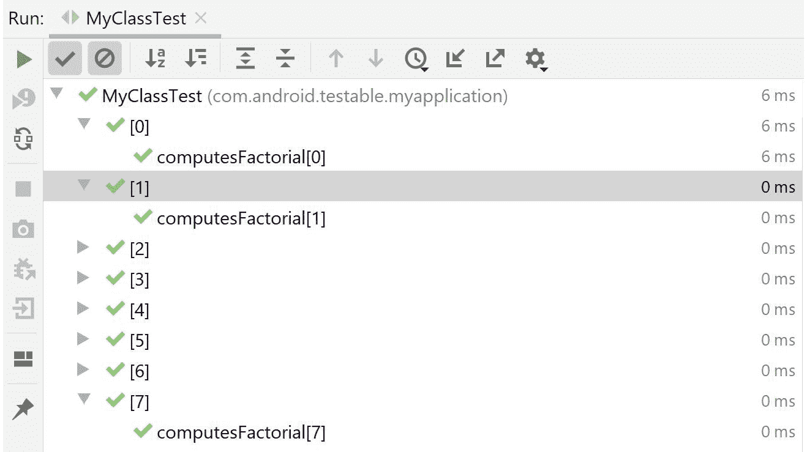

图 9.2:安卓工作室的测试输出

在测试中可以找到的另一个重要特性是调试特性。这很重要，因为您可以调试测试和测试中的方法，所以如果您在修复问题时发现问题，您可以使用它来查看测试使用什么作为输入，以及您的代码如何处理输入。您可以在测试旁边的绿色图标中找到的第三个功能是`Run With Coverage`选项。

这有助于开发人员识别哪些代码行被测试覆盖，哪些被跳过。覆盖率越高，发现崩溃和错误的机会就越高:

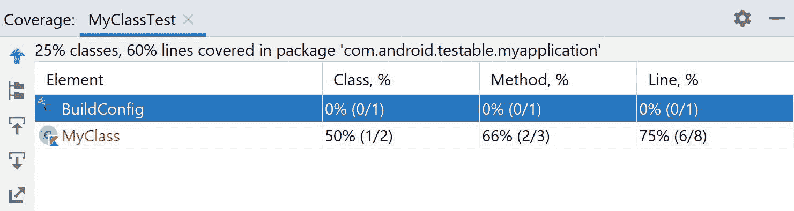

图 9.3:安卓工作室中的测试覆盖率

在上图中，您可以看到我们的类的覆盖范围被分解成测试中的类的数量、测试中的方法的数量和测试中的行数。

另一种为你的安卓应用运行测试的方法是通过命令行。在您的项目设置了**持续集成**的情况下，这通常很方便，这意味着每次您将代码上传到云中的存储库中时，都会触发一组脚本来测试它并确保功能。因为这是在云中完成的，所以不需要安装安卓工作室。为了简单起见，我们将使用安卓工作室中的`Terminal`标签来模拟这种行为。`Terminal`选项卡通常位于安卓工作室底部靠近`Logcat`选项卡的栏中。在每个安卓工作室项目中，都有一个名为`gradlew`的文件。这是一个允许开发人员执行 Gradle 命令的可执行文件。为了运行本地单元测试，您可以使用以下内容:

*   `gradlew.bat test`(适用于窗户)
*   `./gradlew test`(适用于 Mac 和 Linux)

一旦该命令被执行，应用程序将被构建和测试。你可以在安卓工作室右侧的`Gradle`标签中找到各种可以在`Terminal`中输入的命令。当从`Terminal`或`Gradle`选项卡执行时，测试的输出可以在`app/build/reports`文件夹中找到:

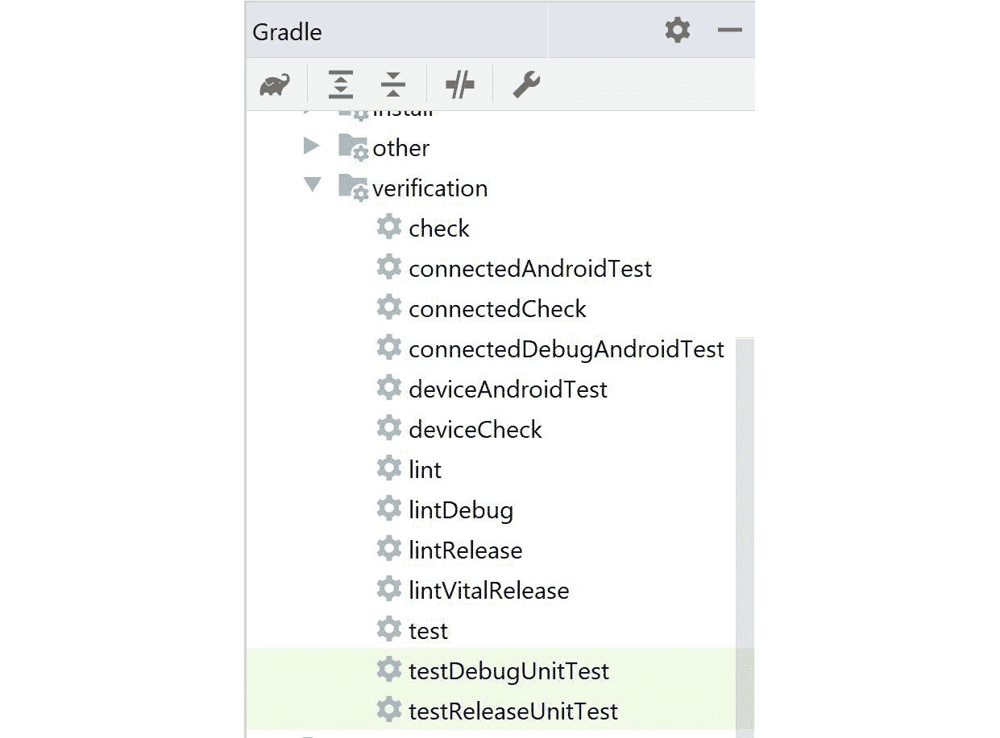

图 9.4:安卓工作室中的 Gradle 命令

# 嘲笑伊藤

在前面的例子中，我们研究了如何设置单元测试，以及如何使用断言来验证操作的结果。如果我们想验证某个方法是否被调用了呢？或者如果我们想要操纵测试输入来测试一个特定的场景呢？在这些类型的情况下，我们可以使用**mochito**。这是一个帮助开发人员设置虚拟对象的库，这些虚拟对象可以被注入到被测对象中，并允许他们验证方法调用、设置输入，甚至监控测试对象本身。

该库应添加到您的`test`梯度设置中，如下所示:

```kt
testImplementation 'org.mockito:mockito-core:3.6.0'
```

现在，让我们看看下面的代码示例(请注意，为了简洁起见，导入语句已从下面的代码片段中删除):

```kt
class StringConcatenator(private val context: Context) {
    fun concatenate(@StringRes stringRes1: Int, 
      @StringRes stringRes2: Int): String {
      return context.getString(stringRes1).plus(context
          .getString(stringRes2))
    }
}
```

这里，我们有`Context`对象，它通常不能进行单元测试，因为它是安卓框架的一部分。我们可以使用`mockito`创建一个测试替身，并将其注入到`StringConcatenator`对象中。然后，我们可以操纵对`getString()`的调用来返回我们选择的任何输入。这个过程被称为嘲讽。

```kt
class StringConcatenatorTest {
    private val context = Mockito.mock(Context::class.java)
    private val stringConcatenator = StringConcatenator(context)
    @Test
    fun concatenate() {
        val stringRes1 = 1
        val stringRes2 = 2
        val string1 = "string1"
        val string2 = "string2"
        Mockito.`when`(context.getString(stringRes1)).thenReturn(string1)
        Mockito.`when`(context.getString(stringRes2)).thenReturn(string2)
        val result = stringConcatenator.concatenate(stringRes1,
            stringRes2)
        assertEquals(string1.plus(string2), result)
    }
}
```

注意

```kt是 Kotlin 中出现的转义字符，不应与引号混淆。它允许开发人员给方法起任何他们想要的名字，包括特殊字符或保留字。

在测试中，我们创建了一个`mock`上下文。当测试`concatenate`方法时，当使用特定的输入调用`getString()`方法时，我们使用 Mockito 返回特定的字符串。这让我们可以断言最终结果。

莫奇托不仅限于嘲讽安卓框架类。我们可以创建一个`SpecificStringConcatenator`类，它将使用`StringConcatenator`来连接来自`strings.xml`的两个特定字符串:

```
class SpecificStringConcatenator(private val stringConcatenator:   StringConcatenator) {
    fun concatenateSpecificStrings(): String {
        return stringConcatenator.concatenate(R.string.string_1,           R.string.string_2)
    }
}
```kt

我们可以为它编写如下测试:

```
class SpecificStringConcatenatorTest {
    private val stringConcatenator = Mockito
      .mock(StringConcatenator::class.java)
    private val specificStringConcatenator = 
      SpecificStringConcatenator(stringConcatenator)
    @Test
    fun concatenateSpecificStrings() {
        val expected = "expected"
        Mockito.'when'(stringConcatenator.concatenate(R.string.string_1, 
          R.string.string_2))
            .thenReturn(expected)
        val result = specificStringConcatenator
          .concatenateSpecificStrings()
        assertEquals(expected, result)
    }
}
```kt

在这里，我们在嘲讽之前的`StringConcatenator`并指示嘲讽者返回一个特定的结果。如果我们运行测试，它将会失败，因为 Mockito 仅限于模拟最终课程。在这里，它遇到了与Kotlin的冲突，这使得所有的类*最终成为*，除非我们指定它们为*开放*。幸运的是，我们可以应用一种配置来解决这个困境，而不需要让被测类*打开*:

1.  在`test`包中创建一个名为`resources`的文件夹。
2.  在`resources`中，创建一个名为`mockito-extensions`的文件夹。
3.  在`mockito-extensions`文件夹中，创建一个名为`org.mockito.plugins.MockMaker`的文件。
4.  在文件内部，添加以下行:

    ```
    mock-maker-inline
    ```kt

在回调或异步工作并且不能使用 JUnit 断言的情况下，可以使用`mockito`来验证回调或 lambdas 上的调用:

```
class SpecificStringConcatenator(private val stringConcatenator:   StringConcatenator) {
    fun concatenateSpecificStrings(): String {
        return stringConcatenator.concatenate(R.string.string_1,           R.string.string_2)
    }
    fun concatenateWithCallback(callback: Callback) {
        callback.onStringReady(concatenateSpecificStrings())
    }
    interface Callback {
        fun onStringReady(input: String)
    }
}
```kt

在前面的例子中，我们添加了`concatenateWithCallback`方法，它将使用`concatenateSpecificStrings`方法的结果调用回调。该方法的测试如下所示:

```
    @Test
    fun concatenateWithCallback() {
        val expected = "expected"
        Mockito.`when`(stringConcatenator.concatenate(R.string.string_1,           R.string.string_2))
            .thenReturn(expected)
        val callback =           Mockito.mock(SpecificStringConcatenator.Callback::class.java)
        specificStringConcatenator.concatenateWithCallback(callback)
        Mockito.verify(callback).onStringReady(expected)
    }
```kt

这里，我们正在创建一个模拟`Callback`对象，然后我们可以在最后用预期的结果进行验证。请注意，为了测试`concatenateWithCallback`方法，我们必须复制`concatenateSpecificStrings`方法的设置。你不应该嘲笑你正在测试的对象；但是，可以使用`spy`来改变自己的行为。我们可以窥探`stringConcatenator`的对象以改变`concatenateSpecificStrings`的结局的方法:

```
    @Test
    fun concatenateWithCallback() {
        val expected = "expected"
        val spy = Mockito.spy(specificStringConcatenator)
        Mockito.`when`(spy.concatenateSpecificStrings())          .thenReturn(expected)
        val callback           = Mockito.mock(SpecificStringConcatenator.Callback::class.java)
        specificStringConcatenator.concatenateWithCallback(callback)
        Mockito.verify(callback).onStringReady(expected)
    }
```kt

Mockito 还依赖依赖注入来初始化类变量，并且有一个定制的构建 JUnit 测试运行器。这可以简化变量的初始化，如下所示:

```
@RunWith(MockitoJUnitRunner::class)
class SpecificStringConcatenatorTest {
    @Mock
    lateinit var stringConcatenator: StringConcatenator
    @InjectMocks
    lateinit var specificStringConcatenator: SpecificStringConcatenator
}
```kt

在前面的例子中，`MockitoRunner`将用带有模型的`@Mock`注释注入变量。接下来，它将使用`@InjectionMocks`注释创建一个新的未模拟的字段实例。创建这个实例时，Mockito 将尝试注入与该对象的构造函数签名相匹配的 mock 对象。

## 伊藤Kotlin

你可能已经注意到了，在前面的例子中，莫奇托的`when`方法已经逃脱了。这是因为与 Kotlin 编程语言的冲突。Mockito 主要是为 Java 构建的，在创建 Kotlin 时，引入了这个关键字。像这样的冲突使用```字符来避免。这一点，以及其他一些小问题，在 Kotlin 中使用 Mockito 时会带来一些不便。引入了一些库来包装 Mockito，并在使用它时提供更好的体验。其中之一就是`mockito-kotlin`。您可以使用以下命令将此库添加到模块中:

```kt
testImplementation "com.nhaarman.mockitokotlin2:mockito-kotlin:2.2.0"
```

这个库增加的一个明显的变化是将`when`方法替换为`whenever`。另一个有用的变化是取代了依赖泛型的`mock`方法，而不是类对象。其余的语法类似于 Mockito 语法。

我们现在可以用新的库更新之前的测试，从`StringConcatenatorTest`开始(为简洁起见，导入语句已被删除):

```kt
class StringConcatenatorTest {
    private val context = mock<Context>()
    private val stringConcatenator = StringConcatenator(context)
    @Test
    fun concatenate() {
        val stringRes1 = 1
        val stringRes2 = 2
        val string1 = "string1"
        val string2 = "string2"
        whenever(context.getString(stringRes1)).thenReturn(string1)
        whenever(context.getString(stringRes2)).thenReturn(string2)
        val result =           stringConcatenator.concatenate(stringRes1, stringRes2)
        assertEquals(string1.plus(string2), result)
    }
}
```

如您所见，```kt字符已经消失，我们对`Context`对象的模拟初始化已经简化。我们可以对`SpecificConcatenatorTest`类应用同样的东西(为了简洁起见，已经删除了导入语句):

```
@RunWith(MockitoJUnitRunner::class)
class SpecificStringConcatenatorTest {
    @Mock
    lateinit var stringConcatenator: StringConcatenator
    @InjectMocks
    lateinit var specificStringConcatenator: SpecificStringConcatenator
    @Test
    fun concatenateSpecificStrings() {
        val expected = "expected"
        whenever(stringConcatenator.concatenate(R.string.string_1,           R.string.string_2))
            .thenReturn(expected)
        val result =           specificStringConcatenator.concatenateSpecificStrings()
        assertEquals(expected, result)
    }
    @Test
    fun concatenateWithCallback() {
        val expected = "expected"
        val spy = spy(specificStringConcatenator)
        whenever(spy.concatenateSpecificStrings()).thenReturn(expected)
        val callback = mock<SpecificStringConcatenator.Callback>()
        specificStringConcatenator.concatenateWithCallback(callback)
        verify(callback).onStringReady(expected)
    }
}
```kt

## 练习练习 9.01:测试数字的总和

使用 JUnit、Mockito 和`mockito-kotlin`，为下面的类编写一组测试，应该涵盖以下场景:

*   断言`0`、`1`、`5`、`20`和`Int.MAX_VALUE`的值。
*   断言负数的结果。
*   Fix the code and replace the sum of numbers with the formula *n*(n+1)/2*.

    注意

    在本练习中，没有显示导入语句。要查看完整的代码文件，请参考[http://packt.live/35TW8JI](http://packt.live/35TW8JI)):

要测试的代码如下。

```
class NumberAdder {
    @Throws(InvalidNumberException::class)
    fun sum(n: Int, callback: (BigInteger) -> Unit) {
        if (n < 0) {
            throw InvalidNumberException
        }
        var result = BigInteger.ZERO
        for (i in 1..n){
          result = result.plus(i.toBigInteger())
        }
        callback(result)

    }
    object InvalidNumberException : Throwable()
}
```kt

执行以下步骤完成本练习:

1.  让我们确保将必要的库添加到`app/build.gradle`文件中:

    ```
     testImplementation 'junit:junit:4.13.1'
     testImplementation 'org.mockito:mockito-core:3.6.0'
     testImplementation 'com.nhaarman.mockitokotlin2:mockito-kotlin:2.2.0'
    ```kt

2.  创建一个名为`NumberAdder`的类，并在其中复制前面的代码。
3.  将光标移到新创建的类中，用*命令* + *移动* + *T* 或 *Ctrl* + *移动* + *T* ，创建一个名为`NumberAdderParameterTest`的测试类。
4.  在这个类中创建一个参数化测试，该测试将断言`0`、`1`、`5`、`20`和`Int.MAX_VALUE`值:

    ```
    @RunWith(Parameterized::class)
    class NumberAdderParameterTest(
        private val input: Int,
        private val expected: BigInteger
    ) {
        companion object {
            @Parameterized.Parameters
            @JvmStatic
            fun getData(): List<Array<out Any>> = listOf(
                arrayOf(0, BigInteger.ZERO),
                arrayOf(1, BigInteger.ONE),
                arrayOf(5, 15.toBigInteger()),
                arrayOf(20, 210.toBigInteger()),
                arrayOf(Int.MAX_VALUE, BigInteger("2305843008139952128"))
            )
        }
        private val numberAdder = NumberAdder()
        @Test
        fun sum() {
            val callback = mock<(BigInteger) -> Unit>()
            numberAdder.sum(input, callback)
            verify(callback).invoke(expected)
        }
    }
    ```kt

    的结果
5.  创建一个单独的测试类来处理当出现负数时抛出的异常，名为`NumberAdderErrorHandlingTest` :

    ```
    @RunWith(MockitoJUnitRunner::class)
    class NumberAdderErrorHandlingTest {
        @InjectMocks
        lateinit var numberAdder: NumberAdder
        @Test(expected = NumberAdder.InvalidNumberException::class)
        fun sum() {
            val input = -1
            val callback = mock<(BigInteger) -> Unit>()
            numberAdder.sum(input, callback)
        }
    }
    ```kt

6.  自 *1 + 2 +...n = n * (n + 1) / 2* ，我们可以使用代码中的公式，这将使方法的执行运行得更快:

    ```
    class NumberAdder {
        @Throws(InvalidNumberException::class)
        fun sum(n: Int, callback: (BigInteger) -> Unit) {
            if (n < 0) {
                throw InvalidNumberException
            }
             callback(n.toBigInteger().times((n.toBigInteger() +            1.toBigInteger())).divide(2.toBigInteger()))
        }
        object InvalidNumberException : Throwable()
    }
    ```kt

右键单击测试所在的包并选择`Run all in [package_name]`，运行测试。将出现类似以下的输出，表示测试已通过:

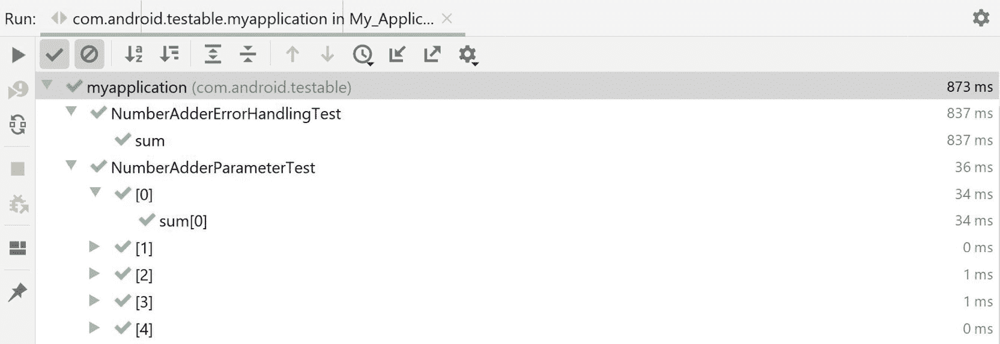

图 9.5:练习 9.01 的输出

通过完成这个练习，我们已经迈出了单元测试的第一步，成功地为单个操作创建了多个测试用例，迈出了理解 Mockito 的第一步，并使用测试来指导我们如何在不引入任何新问题的情况下重构代码。

# 整合定量测试

让我们假设您的项目被单元测试所覆盖，其中包含了您的大量逻辑。现在，您必须将这些经过测试的类添加到活动或片段中，并要求它们更新您的用户界面。你怎么能确定这些课程会很好地相互配合呢？这个问题的答案是通过集成测试。这种类型的测试背后的想法是确保应用程序中的不同组件能够很好地相互集成。一些例子包括:

*   确保您的 API 相关组件很好地解析数据，并与您的存储组件很好地交互。
*   存储组件能够正确存储和检索数据。
*   用户界面组件加载并显示适当的数据。
*   应用程序中不同屏幕之间的转换。

为了帮助集成测试，需求有时以`Given - When - Then`的格式编写。这些通常代表用户故事的接受标准。举以下例子:

```
Given I am not logged in
And I open the application
When I enter my credentials
And click Login
Then I see the Main screen
```kt

我们可以使用这些步骤来探讨如何为我们正在开发的特性编写集成测试。

在安卓平台上，集成测试可以通过两个库来实现:

*   **robo electric**:这个库让开发人员能够将 Android 组件作为单元测试进行测试；也就是说，在没有实际设备或仿真器的情况下执行集成测试。
*   **Espresso** :这个库对安卓设备或模拟器上的仪器测试很有帮助。

在接下来的部分中，我们将详细了解这些库。

## robol〔t0〕ectric

Robolectric 最初是一个开源库，旨在让用户能够从安卓框架中单元测试类，作为他们本地测试的一部分，而不是仪表化测试。最近，它得到了谷歌的认可，并与 AndroidX Jetpack 组件集成在一起。这个库的主要好处之一是测试活动和片段的简单性。对于集成测试来说，这是一个好处，因为我们可以使用这个特性来确保我们的组件能够很好地相互集成。Robolectric 的一些特性如下:

*   实例化和测试活动和片段生命周期的可能性
*   测试视图膨胀的可能性
*   为不同的安卓应用程序接口、方向、屏幕尺寸、布局方向等提供配置的可能性
*   更改`Application`类的可能性，这有助于更改模块以允许插入数据模型

为了添加 Robolectric 和 AndroidX 集成，我们需要以下库:

```
    testImplementation 'org.robolectric:robolectric:4.3'
    testImplementation 'androidx.test.ext:junit:1.1.1'
```kt

第二个库将带来一套测试 Android 组件所需的`utility`方法和类。

让我们假设我们必须交付一个特性，其中我们显示文本`Result x`，其中`x`是用户将插入到`EditText`元素中的数字的阶乘函数。为了实现这一点，我们有两个类，一个计算阶乘，另一个将单词`Result`与阶乘连接起来(如果数字是正数)，或者如果数字是负数，它将返回文本`Error`。阶乘类看起来如下所示(在整个示例中，为了简洁起见，已经删除了 import 语句):

```
class FactorialGenerator {
    @Throws(FactorialNotFoundException::class)
    fun factorial(n: Int): BigInteger {
        if (n < 0) {
            throw FactorialNotFoundException
        }
        var result = BigInteger.ONE
        for (i in 1..n) {
            result = result.times(i.toBigInteger())
        }
        return result
    }
    object FactorialNotFoundException : Throwable()
}
```kt

`TextFormatter`类将如下所示:

```
class TextFormatter(
    private val factorialGenerator: FactorialGenerator,
    private val context: Context
) {
    fun getFactorialResult(n: Int): String {
        return try {
            context.getString(R.string.result,               factorialGenerator.factorial(n).toString())
        } catch (e: FactorialGenerator.FactorialNotFoundException) {
            context.getString(R.string.error)
        }
    }
}
```kt

我们可以在我们的活动中结合这两个组件，并有类似的东西:

```
class MainActivity : AppCompatActivity() {
    private lateinit var textFormatter: TextFormatter
    override fun onCreate(savedInstanceState: Bundle?) {
        super.onCreate(savedInstanceState)
        setContentView(R.layout.activity_main)
        ttextFormatter = TextFormatter(FactorialGenerator(), 
          applicationContext)
        findViewById<Button>(R.id.button).setOnClickListener {
            findViewById<TextView>(R.id.text_view).text               = textFormatter.getFactorialResult(findViewById<EditText>                (R.id.edit_text).text.toString().toInt())
        }
    }
}
```kt

在这种情况下，我们可以观察到三个组件相互作用。我们可以用机器人来测试我们的活动。通过测试创建组件的活动，我们也可以测试所有三个组件之间的交互。我们可以写一个测试，如下所示:

```
@RunWith(AndroidJUnit4::class)
class MainActivityTest {
    private val context = getApplicationContext<Application>()
    @Test
    fun `show factorial result in text view`() {
        val scenario = launch<MainActivity>(MainActivity::class.java)
        scenario.moveToState(Lifecycle.State.RESUMED)
        scenario.onActivity { activity ->
            activity.edit_text.setText(5.toString())
            activity.button.performClick()
            assertEquals(context.getString(R.string.result,               "120"),activity.text_view.text)
        }
    }
}
```kt

在前面的例子中，我们可以看到 AndroidX 对活动测试的支持。`AndroidJUnit4`测试运行程序将设置 Robolectric 并创建必要的配置，而`launch`方法将返回一个`scenario`对象，然后我们可以使用它来实现测试的必要条件。

如果我们想为测试添加配置，我们可以在类和每个测试方法上使用`@Config`注释:

```
@Config(
    sdk = [Build.VERSION_CODES.P],
    minSdk = Build.VERSION_CODES.KITKAT,
    maxSdk = Build.VERSION_CODES.Q,
    application = Application::class,
    assetDir = "/assetDir/"
)
@RunWith(AndroidJUnit4::class)
class MainActivityTest 
```kt

我们也可以在`robolectric.properties`文件的`test/resources`文件夹中指定全局配置，如下所示:

```
sdk=28
minSdk = 14
maxSdk = 29
```kt

最近添加到 robolecircuit 的另一个重要功能是对 Espresso 库的支持。这允许开发人员使用 Espresso 中的语法与视图进行交互，并对视图进行断言。另一个可以和 Robolectric 结合使用的库是`FragmentScenario`，它允许测试碎片的可能性。这些库可以通过以下方式添加到 Gradle 中:

```
    testImplementation 'androidx.fragment:fragment-testing:1.1.0'
    testImplementation 'androidx.test.espresso:espresso-core:3.2.0'
```kt

测试片段类似于使用`scenario`设置的活动:

```
val scenario = launchFragmentInContainer<MainFragment>()
scenario.moveToState(Lifecycle.State.CREATED)
```kt

## espe〔t0〕SSO

Espresso 是一个旨在以简洁的方式执行交互和断言的库。它最初被设计用于仪表测试，现在已经迁移到与 Robolectric 一起使用。执行操作的典型用法如下:

```
onView(Matcher<View>).perform(ViewAction)
```kt

为了验证，我们可以使用以下内容:

```
onView(Matcher<View>).check(ViewAssertion)
```kt

如果在`ViewMatchers`类中找不到，我们可以提供自定义`ViewMatchers`。最常见的有`withId`和`withText`。这两个允许我们根据它们的`R.id.myId`标识符或文本标识符来识别视图。理想情况下，第一个应该用于识别特定的视图。Espresso 的另一个有趣的方面是匹配器对`Hamcrest`库的依赖。这是一个旨在改进测试的 Java 库。这允许在必要时组合多个匹配器。假设相同的标识出现在用户界面的不同视图中。您可以使用以下表达式缩小对特定视图的搜索范围:

```
onView(allOf(withId(R.id.edit_text), withParent(withId(R.id.root))))
```kt

`allOf`表达式将计算所有其他操作符，并且只有当所有内部操作符都通过时才会通过。前面的表达式将翻译为“使用`id=edit_text`找到父视图为`id=R.id.root`的视图。”其他`Hamcrest`操作员可能包括`anyOf`、`both`、`either`、`is`、`isA`、`hasItem`、`equalTo`、`any`、`instanceOf`、`not`、`null`和`notNull`。

`ViewActions`有类似于`ViewMatchers`的做法。我们可以在`ViewActions`班找到常见的。常见的有`typeText`、`click`、`scrollTo`、`clearText`、`swipeLeft`、`swipeRight`、`swipeUp`、`swipeDown`、`closeSoftKeyboard`、`pressBack`、`pressKey`、`doubleClick`、`longClick`。如果您有自定义视图并且需要某些操作，那么您可以通过实现`ViewAction`接口来实现自己的`ViewAction`元素。

类似于前面的例子，`ViewAssertions`有自己的类。通常，使用`matches`方法，然后您可以使用`ViewMatchers`和`Hamcrest`匹配器来验证结果:

```
onView(withId(R.id.text_view)).check(matches(withText("My text")))) 
```kt

前面的示例将验证具有`text_view`标识的视图将包含文本`My text`:

```
onView(withId(R.id.button)).perform(click())
```kt

这将单击带有标识按钮的视图。

我们现在可以重写 Robolectric 测试并添加 Espresso，这将为我们提供以下信息(未显示导入语句):

```
@RunWith(AndroidJUnit4::class)
class MainActivityTest {
    @Test
    fun `show factorial result in text view`() {
        val scenario = launch<MainActivity>(MainActivity::class.java)
        scenario.moveToState(Lifecycle.State.RESUMED)
        scenario.onActivity { activity ->
            onView(withId(R.id.edit_text)).perform(typeText("5"))
            onView(withId(R.id.button)).perform(click())
            onView(withId(R.id.text_view))
              .check(matches(withText(activity                 .getString(R.string.result, "120"))))
        }
    }
}
```kt

在前面的代码示例中，我们可以观察到如何使用 Espresso 在`EditText`中输入数字`5`，然后点击按钮，然后借助`onView()`方法断言在`TextView`中显示的文本以获得对视图的引用，然后使用`perform()`执行操作或使用`check()`进行断言。

注意

在下面的练习中，您将需要一个仿真器或启用了 USB 调试的物理设备。在安卓工作室选择`Tools` | `AVD Manager`即可。然后，您可以通过选择仿真器的类型，单击`Next`，然后选择 x86 映像，使用`Create Virtual Device`选项创建一个。任何比棒棒糖大的图像都适合这个练习。接下来，您可以为您的图像命名并点击`Finish`。

## exrecise 9.02:双积分

开发遵守以下要求的应用程序:

```
Given I open the application
And I insert the number n
When I press the Calculate button
Then I should see the text "The sum of numbers from 1 to n is [result]"
Given I open the application
And I insert the number -n
When I press the Calculate button
Then I should see the text "Error: Invalid number"
```kt

您应该使用 Robolectric 和 Espresso 实现单元测试和集成测试，并将集成测试迁移为仪器测试。

注意

在本练习中，没有显示导入语句。要查看完整的代码文件，请参考[http://packt.live/2M1MtcY](http://packt.live/2M1MtcY)):

执行以下步骤来完成本练习:

1.  让我们从向`app/build.gradle` :

    ```
        testImplementation 'junit:junit:4.13.1'
        testImplementation 'org.mockito:mockito-core:3.6.0'
        testImplementation 'com.nhaarman.mockitokotlin2
          :mockito-kotlin:2.2.0'
        testImplementation 'org.robolectric:robolectric:4.4'
        testImplementation 'androidx.test.ext:junit:1.1.2'
        testImplementation 'androidx.test.espresso:espresso-core:3.3.0'
        androidTestImplementation 'androidx.test.ext:junit:1.1.2'
        androidTestImplementation 'androidx.test
          .espresso:espresso-core:3.3.0'
        androidTestImplementation 'androidx.test:rules:1.3.0'
    ```kt

    添加必要的测试库开始
2.  对于 Robolectric，我们需要添加额外的配置，首先是在`android`闭包中的`app/build.gradle`中添加以下行:

    ```
    testOptions.unitTests.includeAndroidResources = true
    ```kt

3.  在`test`包中创建`resources`目录。
4.  添加`robolectric.properties`文件，并在该文件中添加以下配置:

    ```
    sdk=28
    ```kt

5.  在测试包中创建一个名为`resources`的文件夹。
6.  在`resources`中，创建一个名为`mockito-extensions`的文件夹。
7.  在`mockito-extensions`文件夹中，创建一个名为`org.mockito.plugins.MockMaker`的文件，并在该文件中添加以下行:

    ```
    mock-maker-inline
    ```kt

8.  创建`NumberAdder`类。这类似于*练习 9.01* :

    ```
    import java.math.BigInteger
    class NumberAdder {
        @Throws(InvalidNumberException::class)
        fun sum(n: Int, callback: (BigInteger) -> Unit) {
            if (n < 0) {
                throw InvalidNumberException
            }
            callback(n.toBigInteger().times((n.toLong()           + 1).toBigInteger()).divide(2.toBigInteger()))
        }
        object InvalidNumberException : Throwable()
    }
    ```kt

    中的练习
9.  在`test`文件夹中为`NumberAdder`创建测试。首先，创建`NumberAdderParameterTest` :

    ```
    @RunWith(Parameterized::class)
    class NumberAdderParameterTest(
        private val input: Int,
        private val expected: BigInteger
    ) {
        companion object {
            @Parameterized.Parameters
            @JvmStatic
            fun getData(): List<Array<out Any>> = listOf(
                arrayOf(0, BigInteger.ZERO),
                arrayOf(1, BigInteger.ONE),
                arrayOf(5, 15.toBigInteger()),
                arrayOf(20, 210.toBigInteger()),
                arrayOf(Int.MAX_VALUE, BigInteger("2305843008139952128"))
            )
        }
        private val numberAdder = NumberAdder()
        @Test
        fun sum() {
            val callback = mock<(BigInteger) -> Unit>()
            numberAdder.sum(input, callback)
            verify(callback).invoke(expected)
        }
    }
    ```kt

10.  然后，创建`NumberAdderErrorHandlingTest`测试:

    ```
    @RunWith(MockitoJUnitRunner::class)
    class NumberAdderErrorHandlingTest {
        @InjectMocks
        lateinit var numberAdder: NumberAdder
        @Test(expected = NumberAdder.InvalidNumberException::class)
        fun sum() {
            val input = -1
            val callback = mock<(BigInteger) -> Unit>()
            numberAdder.sum(input, callback)
        }
    }
    ```kt

11.  创建一个类来格式化总和，并用必要的字符串连接它:

    ```
    class TextFormatter(
        private val numberAdder: NumberAdder,
        private val context: Context
    ) {
        fun getSumResult(n: Int, callback: (String) -> Unit) {
            try {
                numberAdder.sum(n) {
                    callback(
                        context.getString(
                            R.string.the_sum_of_numbers_from_1_to_is,
                            n,
                            it.toString()
                        )
                    )
                }
            } catch (e: NumberAdder.InvalidNumberException) {
                callback(context.getString
                  (R.string.error_invalid_number))
            }
        }
    }
    ```kt

12.  Unit test this class for both the success and error scenarios. Start with the success scenario:

    ```
    @RunWith(MockitoJUnitRunner::class)
    class TextFormatterTest {
        @InjectMocks
        lateinit var textFormatter: TextFormatter
        @Mock
        lateinit var numberAdder: NumberAdder
        @Mock
        lateinit var context: Context
        @Test
        fun getSumResult_success() {
            val n = 10
            val sumResult = BigInteger.TEN
            val expected = "expected"
            whenever(numberAdder.sum(eq(n), any())).thenAnswer {
                (it.arguments[1] as (BigInteger)->Unit)
                    .invoke(sumResult)
            }
            whenever(context.getString
              (R.string.the_sum_of_numbers_from_1_to_is, n, 
                sumResult.toString())).thenReturn(expected)
            val callback = mock<(String)->Unit>()
            textFormatter.getSumResult(n, callback)
            verify(callback).invoke(expected)
        }
    ```kt

    然后，为错误场景创建测试:

    ```
        @Test
        fun getSumResult_error() {
            val n = 10
            val expected = "expected"
            whenever(numberAdder.sum(eq(n),           any())).thenThrow(NumberAdder.InvalidNumberException)
            whenever(context.getString(R.string.error_invalid_number))          .thenReturn(expected)
            val callback = mock<(String)->Unit>()
            textFormatter.getSumResult(n, callback)
            verify(callback).invoke(expected)
        }
    }
    ```kt

13.  为`activity_main.xml` :

    ```
    <?xml version="1.0" encoding="utf-8"?>
    <LinearLayout xmlns:android="http://schemas.android.com/apk/res/android"
        android:id="@+id/root"
        android:layout_width="match_parent"
        android:layout_height="match_parent"
        android:orientation="vertical">
        <EditText
            android:id="@+id/edit_text"
            android:layout_width="match_parent"
            android:layout_height="wrap_content"
            android:inputType="number" />
        <Button
            android:id="@+id/button"
            android:layout_width="wrap_content"
            android:layout_height="wrap_content"
            android:layout_gravity="center_horizontal"
            android:text="@string/calculate" />
        <TextView
            android:id="@+id/text_view"
            android:layout_width="wrap_content"
            android:layout_height="wrap_content"
            android:layout_gravity="center_horizontal" />
    </LinearLayout>
    ```kt

    创建布局
14.  创建`MainActivity`类，它将包含所有其他组件:

    ```
    class MainActivity : AppCompatActivity() {
        private lateinit var textFormatter: TextFormatter

        override fun onCreate(savedInstanceState: Bundle?) {
            super.onCreate(savedInstanceState)
            setContentView(R.layout.activity_main)
            textFormatter = TextFormatter(NumberAdder(), applicationContext)
            findViewById<Button>(R.id.button).setOnClickListener {
                textFormatter.getSumResult(findViewById<EditText>              (R.id.edit_text).text.toString().toIntOrNull() ?: 0) {
                    findViewById<TextView>(R.id.text_view).text = it
                }
            }
        }
    }
    ```kt

15.  Create a test for `MainActivity` and place it in the `test` directory. It will contain two test methods, one for success and one for error:

    ```
    @RunWith(AndroidJUnit4::class)
    class MainActivityTest {
        @Test
        fun `show sum result in text view`() {
            val scenario = launch<MainActivity>(MainActivity::class.java)
            scenario.moveToState(Lifecycle.State.RESUMED)
            scenario.onActivity { activity ->
                onView(withId(R.id.edit_text)).perform(replaceText("5"))
                onView(withId(R.id.button)).perform(click())
                onView(withId(R.id.text_view)).check(matches(withText
                 (activity.getString
                   (R.string.the_sum_of_numbers_from_1_to_is, 5, "15"))))
            }
        }
        @Test
        fun `show error in text view`() {
            val scenario = launch<MainActivity>(MainActivity::class.java)
            scenario.moveToState(Lifecycle.State.RESUMED)
            scenario.onActivity { activity ->
                onView(withId(R.id.edit_text))
                    .perform(replaceText("-5"))
                onView(withId(R.id.button)).perform(click())
                onView(withId(R.id.text_view)).check(
                    matches(withText(activity.getString(
                    R.string.error_invalid_number))))
            }
        }
    }
    ```kt

    如果您通过右键单击测试所在的包并选择`Run all in [package_name]`来运行测试，那么将出现类似于以下内容的输出:

    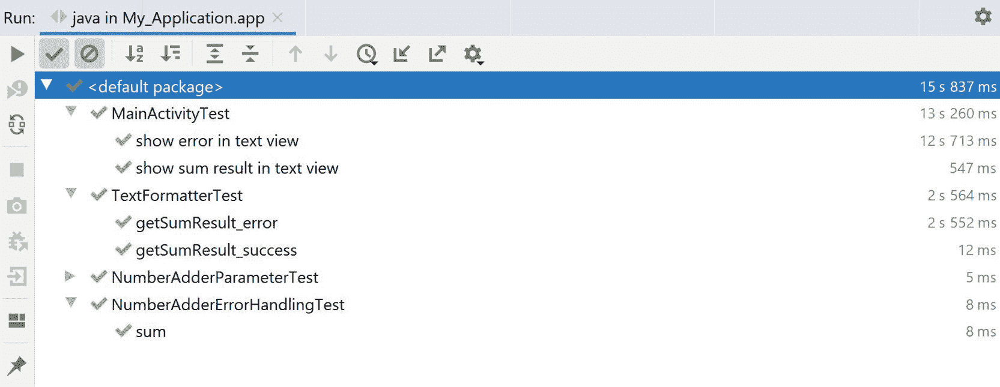

    图 9.6:在练习 9.02 的测试文件夹中执行测试的结果

    如果执行前面的测试，应该会看到类似于*图 9.6* 的输出。机械测试的执行方式与常规单元测试相同；但是，执行时间会增加。

16.  Let's now migrate the preceding test to an instrumented integration test. In order to do this, we will copy the preceding test from the `test` package into the `androidTest` package and remove the code related to scenarios from our tests. After copying the file, we will use `ActivityTestRule`, which will launch our activity before every test is executed. We will also need to rename the class to avoid duplicates and rename the test methods because the syntax is not supported for instrumented tests:

    ```
    @RunWith(AndroidJUnit4::class)
    class MainActivityUiTest {
        @JvmField
        @Rule
        var activityRule: ActivityTestRule<MainActivity> = 
          ActivityTestRule(MainActivity::class.java)
        @Test
        fun showSumResultInTextView() {
            activityRule.activity.let { activity ->
                onView(withId(R.id.edit_text)).perform(replaceText("5"))
                onView(withId(R.id.button)).perform(click())
                onView(withId(R.id.text_view)).check(matches
                 (withText(activity.getString
                  (R.string.the_sum_of_numbers_from_1_to_is, 5, "15"))))
            }
        }
        @Test
        fun showErrorInTextView() {
            activityRule.activity.let { activity ->
                onView(withId(R.id.edit_text)).perform(replaceText("-5"))
                onView(withId(R.id.button)).perform(click())
                onView(withId(R.id.text_view)).check(matches               (withText(activity.getString                 (R.string.error_invalid_number))))
            }
        }
    }
    ```kt

    如果您通过右键单击测试所在的包并选择`Run all in [package_name]`来运行测试，那么将出现类似于以下内容的输出:

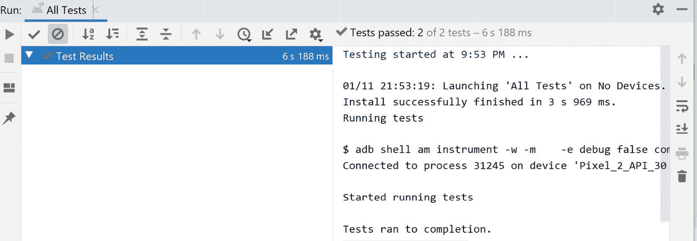

图 9.7:在练习 9.02 的 androidTest 文件夹中执行测试的结果

在*图 9.7* 中，我们可以看到安卓工作室显示什么作为结果的输出。如果您在测试执行时关注模拟器，您可以看到对于每个测试，您的活动将被打开，输入将被设置在字段中，并且按钮将被单击。我们的两个集成测试(在工作站和模拟器上)都试图匹配需求的公认标准。集成测试验证了相同的行为，唯一的区别是一个在本地检查，另一个在安卓设备或模拟器上检查。这里的主要好处是，Espresso 能够弥合它们之间的差距，使集成测试更容易设置和执行。

# 用户界面测试 s

用户界面测试是仪表化测试，开发人员可以在其中模拟用户旅程，并验证应用程序不同模块之间的交互。它们也被称为端到端测试。对于小型应用程序，您可以有一个测试套件，但是对于大型应用程序，您应该分割您的测试套件以覆盖特定的用户旅程(登录、创建帐户、设置流程等)。因为它们是在设备上执行的，所以您需要将它们写入`androidTest`包，这意味着它们将使用**仪器**框架运行。仪器的工作原理如下:

*   该应用程序已构建并安装在设备上。
*   测试应用程序也将安装在设备上，用于监控您的应用程序。
*   测试应用程序将在您的应用程序上执行测试并记录结果。

这样做的一个缺点是，测试将共享持久化数据，因此如果一个测试在设备上存储数据，那么第二个测试可以访问该数据，这意味着有失败的风险。另一个缺点是，如果测试遇到崩溃，这将停止整个测试，因为被测试的应用程序被停止。随着**管弦乐队**框架的引入，这些问题在喷气背包更新中得到了解决。Orchestrators 使您能够在每次测试执行后清除数据，从而使开发人员无需进行任何调整。编排器由另一个应用程序表示，该应用程序将管理测试应用程序如何协调测试以及测试之间的数据。为了将其添加到您的项目中，您需要在`app/build.gradle`文件中进行类似的配置:

```
android {
    ...
    defaultConfig {
        ...
        testInstrumentationRunner           "androidx.test.runner.AndroidJUnitRunner"
        testInstrumentationRunnerArguments clearPackageData: 'true'
    }
    testOptions {
        execution 'ANDROIDX_TEST_ORCHESTRATOR'
    }
}
dependencies {
    ...
    androidTestUtil 'androidx.test:orchestrator:1.3.0'
}
```kt

您可以使用 Gradle 的`connectedCheck`命令，从`Terminal`或 Gradle 命令列表中，在连接的设备上执行 orchestrator 测试。

在配置中，您会注意到下面一行:`testInstrumentationRunner`。这允许我们为测试创建一个定制的配置，这给了我们向模块中注入模拟数据的机会:

```
testInstrumentationRunner "com.android.CustomTestRunner"
```kt

`CustomTestRunner`如下所示(以下代码片段中未显示导入语句):

```
class CustomTestRunner: AndroidJUnitRunner() {
    @Throws(Exception::class)
    override fun newApplication(
        cl: ClassLoader?,
        className: String?,
        context: Context?
    ): Application? {
        return super.newApplication(cl,           MyApplication::class.java.name, context)
    }
}
```kt

测试类本身可以通过在`androidx.test.ext.junit.runners.AndroidJUnit4`测试运行程序的帮助下应用 JUnit4 语法来编写:

```
@RunWith(AndroidJUnit4::class)
class MainActivityUiTest {
}
```kt

来自 AndroidX 测试支持的另一个重要特性是活动规则。当此规则与默认构造函数一起使用时，活动将在每次测试之前启动，并为交互和断言做好准备:

```
    @JvmField
    @Rule
    var activityRule: ActivityTestRule<MainActivity>       = ActivityTestRule(MainActivity::class.java)
```kt

您也可以使用规则来避免启动活动，并在测试中自定义启动活动的意图:

```
    @JvmField
    @Rule
    var activityRule: ActivityTestRule<MainActivity> =       ActivityTestRule(MainActivity::class.java, false ,false)
    @Test
    fun myTestMethod() {
        val myIntent = Intent()
        activityRule.launchActivity(myIntent)
    }
```kt

`@Test`方法本身在一个专用的测试线程中运行，这就是为什么像 Espresso 这样的库是有帮助的。Espresso 将自动移动用户界面线程上的每个视图交互。浓缩咖啡可用于用户界面测试，其方式与机器人测试相似:

```
    @Test
    fun myTest() {
        onView(withId(R.id.edit_text)).perform(replaceText("5"))
        onView(withId(R.id.button)).perform(click())
        onView(withId(R.id.text_view))          .check(matches(withText("my test")))
    }
```kt

通常，在用户界面测试中，您会发现交互和断言可能会重复。为了避免在代码中重复多个场景，您可以应用名为**机器人**的模式。每个屏幕都有一个相关的`Robot`类，在这个类中，交互和断言可以被分组到特定的方法中。您的测试代码将使用机器人并断言它们。典型的机器人看起来像这样:

```
class MyScreenRobot {
    fun setText(): MyScreenRobot {
        onView(ViewMatchers.withId(R.id.edit_text))          .perform(ViewActions.replaceText("5"))
        return this
    }
    fun pressButton(): MyScreenRobot {
        onView(ViewMatchers.withId(R.id.button))          .perform(ViewActions.click())
        return this
    }
    fun assertText(): MyScreenRobot {
        onView(ViewMatchers.withId(R.id.text_view))          .check(ViewAssertions.matches(ViewMatchers           .withText("my test")))
        return this
    }
}
```kt

测试将如下所示:

```
    @Test
    fun myTest() {
       MyScreenRobot()
           .setText()
           .pressButton()
           .assertText()
    }
```kt

因为应用程序可以是多线程的，有时从各种来源(互联网、文件、本地存储等)加载数据需要一段时间，所以用户界面测试必须知道用户界面何时可用于交互。实现这一点的一种方法是使用闲置资源。这些对象可以在测试之前注册到 Espresso，并注入到完成多线程工作的应用程序组件中。当工作正在进行时，应用程序会将它们标记为非空闲，当工作完成时，应用程序会将它们标记为空闲。此时，浓缩咖啡将开始执行测试。其中最常用的是`CountingIdlingResource`。这个特定的实现使用了一个计数器，当您希望 Espresso 等待您的代码完成执行时，该计数器应该递增，当您希望让 Espresso 验证您的代码时，该计数器应该递减。当计数器达到`0`时，浓缩咖啡将恢复测试。具有空闲资源的组件示例如下所示:

```
class MyHeavyliftingComponent(private val   countingIdlingResource:CountingIdlingResource) {
    fun doHeavyWork() {
        countingIdlingResource.increment()
        // do work
        countingIdlingResource.decrement()
    }
}
```kt

`Application`类可以用来注入空闲资源，如下所示:

```
class MyApplication : Application(){
    val countingIdlingResource = CountingIdlingResource("My heavy work")
    val myHeavyliftingComponent =       MyHeavyliftingComponent(countingIdlingResource)
}
```kt

然后，在测试中，我们可以访问`Application`类并将资源注册到 Espresso:

```
@RunWith(AndroidJUnit4::class)
class MyTest {
    @Before
    fun setUp() {
        val myApplication = getApplicationContext<MyApplication>()
        IdlingRegistry.getInstance()          .register(myApplication.countingIdlingResource)
    }
}
```kt

Espresso 附带了一组扩展，可以用来断言不同的安卓组件。一个扩展是意图测试。当您想要单独测试一个活动时，这很有用(更适合集成测试)。为了使用此功能，您需要将库添加到 Gradle:

```
androidTestImplementation 'androidx.test.espresso:espresso-intents:3.3.0'
```kt

添加库后，需要使用`IntentsTestRule`来设置必要的意图监控。该规则是`ActivityTestRule`的子类:

```
    @JvmField
    @Rule
    var intentsRule: IntentsTestRule<MainActivity>       = IntentsTestRule(MainActivity::class.java)
```kt

为了断言意图的值，您需要触发适当的动作，然后使用`intended`方法:

```
        onView(withId(R.id.button)).perform(click())
        intended(allOf(
            hasComponent(hasShortClassName(".MainActivity")),
            hasExtra(MainActivity.MY_EXTRA, "myExtraValue")))
```kt

`intended`方法的工作方式与`onView`方法相似。它需要一个可以和`Hamcrest`火柴结合的火柴。意图相关匹配器可以在`IntentMatchers`类中找到。这个类包含断言`Intent`类的不同方法的方法:附加、数据、组件、包等等。

另一个重要的扩展库借助`RecyclerView`。浓缩咖啡的`onData`方法只能测试`AdapterViews`如`ListView`，不能断言`RecyclerView`。为了使用扩展，您需要将以下库添加到项目中:

```
androidTestImplementation   'com.android.support.test.espresso:espresso-contrib:3.0.2'
```kt

这个库提供了一个`RecyclerViewActions`类，它包含一组允许你对`RecyclerView`内的项目执行操作的方法:

```
onView(withId(R.id.recycler_view))  .perform(RecyclerViewActions.actionOnItemAtPosition(0, click()))
```kt

前面的语句将点击位置`0`处的项目:

```
onView(withId(R.id.recycler_view)).perform(RecyclerViewActions   .scrollToPosition<RecyclerView.ViewHolder>(10))
```kt

这将滚动到列表中的第十项:

```
onView(withText("myText")).check(matches(isDisplayed()))
```kt

前面的代码将检查是否显示带有`myText`文本的视图，这也适用于`RecyclerView`项。

## 练习 e 9.03:随机等待时间

编写一个有两个屏幕的应用程序。第一个屏幕将有一个按钮。当用户按下按钮时，它将随机等待 1 到 5 秒钟，然后启动第二个屏幕，该屏幕将显示文本`Opened after x seconds`，其中`x`是经过的秒数。编写一个用户界面测试，它将覆盖这个场景，并针对测试调整以下特性:

*   当测试运行时，`random`功能将返回数值`1`。
*   `CountingIdlingResource` will be used to indicate when the timer has stopped.

    注意

    在本练习中，没有显示导入语句。要查看完整的代码文件，请参考[http://packt.live/38V7krh](http://packt.live/38V7krh)):

采取以下步骤完成本练习:

1.  将以下库添加到`app/build.gradle` :

    ```
        implementation 'androidx.test.espresso:espresso-core:3.3.0'
        testImplementation 'junit:junit:4.13.1'
        androidTestImplementation 'androidx.test.ext:junit:1.1.2'
        androidTestImplementation 'androidx.test:rules:1.3.0'
    ```kt

2.  然后，从一个`Randomizer`类开始:

    ```
    class Randomizer(private val random: Random) {
        fun getTimeToWait(): Int {
            return random.nextInt(5) + 1
        }
    }
    ```kt

3.  接下来，创建一个`Synchronizer`类，它将使用`Randomizer`和`Timer`来等待随机的时间间隔。它还将使用`CountingIdlingResource`来标记任务的开始和任务的结束:

    ```
    class Synchronizer(
        private val randomizer: Randomizer,
        private val timer: Timer,
        private val countingIdlingResource: CountingIdlingResource
    ) {
        fun executeAfterDelay(callback: (Int) -> Unit) {
            val timeToWait = randomizer.getTimeToWait()
            countingIdlingResource.increment()
            timer.schedule(CallbackTask(callback, timeToWait),           timeToWait * 1000L)
        }
        inner class CallbackTask(
            private val callback: (Int) -> Unit,
            private val time: Int
        ) : TimerTask() {
            override fun run() {
                callback(time)
                countingIdlingResource.decrement()
            }
        }
    }
    ```kt

4.  现在创建一个`Application`类，负责创建前面类的所有实例:

    ```
    class MyApplication : Application() {
        val countingIdlingResource =       CountingIdlingResource("Timer resource")
        val randomizer = Randomizer(Random())
        val synchronizer = Synchronizer(randomizer, Timer(),       countingIdlingResource)
    }
    ```kt

5.  将`MyApplication`类添加到带有`android:name`属性的`application`标签中的`AndroidManifest`中。
6.  创建一个`activity_1`布局文件，该文件将包含一个父布局和一个按钮:

    ```
    <?xml version="1.0" encoding="utf-8"?>
    <LinearLayout xmlns:android="http://schemas.android.com/apk/res/android"
        android:layout_width="match_parent"
        android:layout_height="match_parent"
        android:orientation="vertical">

        <Button
            android:id="@+id/activity_1_button"
            android:layout_width="wrap_content"
            android:layout_height="wrap_content"
            android:layout_gravity="center"
            android:text="@string/press_me" />
    </LinearLayout>
    ```kt

7.  创建一个`activity_2`布局文件，该文件将包含一个父布局和`TextView` :

    ```
    <?xml version="1.0" encoding="utf-8"?>
    <LinearLayout xmlns:android="http://schemas.android.com/apk/res/android"
        android:layout_width="match_parent"
        android:layout_height="match_parent"
        android:orientation="vertical">
        <TextView
            android:id="@+id/activity_2_text_view"
            android:layout_width="wrap_content"
            android:layout_height="wrap_content"
            android:layout_gravity="center" />
    </LinearLayout>
    ```kt

8.  创建`Activity1`类，它将实现按钮点击的逻辑:

    ```
    class Activity1 : AppCompatActivity() {
        override fun onCreate(savedInstanceState: Bundle?) {
            super.onCreate(savedInstanceState)
            setContentView(R.layout.activity_1)
            findViewById<Button>(R.id.activity_1_button)
              .setOnClickListener {
                (application as MyApplication).synchronizer
                  .executeAfterDelay {
                    startActivity(Activity2.newIntent(this, it))
                }
            }
        }
    }
    ```kt

9.  创建`Activity2`类，该类将通过意图显示接收到的数据:

    ```
    class Activity2 : AppCompatActivity() {
        companion object {
            private const val EXTRA_SECONDS = "extra_seconds"
            fun newIntent(context: Context, seconds: Int) =
                Intent(context, Activity2::class.java).putExtra(
                    EXTRA_SECONDS, seconds
                )
        }
        override fun onCreate(savedInstanceState: Bundle?) {
            super.onCreate(savedInstanceState)
            setContentView(R.layout.activity_2)
            findViewById<TextView>(R.id.activity_2_text_view).text =
                getString(R.string.opened_after_x_seconds,               intent.getIntExtra(EXTRA_SECONDS, 0))
        }
    }
    ```kt

10.  在`androidTest`目录中创建一个`FlowTest`类，它将从`MyApplication`对象中注册`IdlingResource`，并将断言点击的结果:

    ```
    @RunWith(AndroidJUnit4::class)
    @LargeTest
    class FlowTest {
        @JvmField
        @Rule
        var activityRule: ActivityTestRule<Activity1> =       ActivityTestRule(Activity1::class.java)
        private val myApplication = getApplicationContext<MyApplication>()
        @Before
        fun setUp() {
            IdlingRegistry.getInstance().register(myApplication           .countingIdlingResource)
        }
        @Test
        fun verifyFlow() {
            onView(withId(R.id.activity_1_button)).perform(click())
            onView(withId(R.id.activity_2_text_view))          .check(matches(withText(myApplication             .getString(R.string.opened_after_x_seconds, 1))))
        }
    }
    ```kt

11.  多次运行测试并检查测试结果。请注意，测试将有 20%的成功机会，但它将等到按钮被单击。这意味着空闲资源正在工作。另一个需要观察的是，这里有一个随机性的因素。
12.  测试不喜欢随机性，所以我们需要通过打开`Randomizer`类并在`androidTest`目录下创建一个子类来消除随机性。我们可以为`MyApplication`类做同样的事情，并提供一个名为`TestRandomizer` :

    ```
    class TestRandomizer(random: Random) : Randomizer(random) {
        override fun getTimeToWait(): Int {
            return 1
        }
    }
    ```kt

    的不同随机化器
13.  现在，修改`MyApplication`类，我们可以覆盖子类

    ```
    open class MyApplication : Application() {
        val countingIdlingResource =       CountingIdlingResource("Timer resource")
        lateinit var synchronizer: Synchronizer
        override fun onCreate() {
            super.onCreate()
            synchronizer = Synchronizer(createRandomizer(), Timer(),           countingIdlingResource)
        }
        open fun createRandomizer() = Randomizer(Random())
    }
    ```kt

    中的随机化器
14.  在`androidTest`目录中，创建`TestMyApplication`，它将扩展`MyApplication`并覆盖`createRandomizer`方法:

    ```
    class TestMyApplication : MyApplication() {
        override fun createRandomizer(): Randomizer {
            return TestRandomizer(Random())
        }
    }
    ```kt

15.  最后，创建一个仪器测试运行程序，它将在测试中使用这个新的`Application`类:

    ```
    class MyApplicationTestRunner : AndroidJUnitRunner() {
        @Throws(Exception::class)
        override fun newApplication(
            cl: ClassLoader?,
            className: String?,
            context: Context?
        ): Application? {
            return super.newApplication(cl,           TestMyApplication::class.java.name, context)
        }
    }
    ```kt

16.  Add the new test runner to the Gradle configuration:

    ```
    android {
        ...
        defaultConfig {        
            ...
            testInstrumentationRunner            "com.android.testable.myapplication            .MyApplicationTestRunner"
        }
    }
    ```kt

    现在运行测试，一切都应该通过类似*图 9.8* :

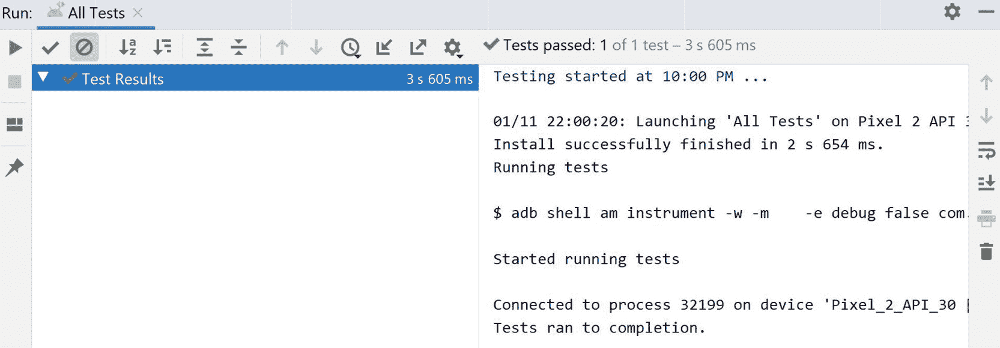

图 9.8:练习 9.03 的输出

这种类型的练习展示了如何避免测试中的随机性，并提供具体和可重复的输入，以使我们的测试可靠。依赖注入框架也采用了类似的方法，其中整个模块可以在测试套件中替换，以确保测试的可靠性。最常被替换的东西之一是 API 通信。这种方法解决的另一个问题是等待时间的减少。如果这种类型的场景在您的测试中重复出现，那么它们的执行时间会因此而增加。

# 测试驱动开发

让我们假设您的任务是构建一个活动，该活动显示一个带有加减乘除选项的计算器。您还必须为您的实现编写测试。通常，您会构建您的用户界面和您的活动以及一个单独的`Calculator`类。然后，你要为你的`Calculator`课和你的活动课写单元测试。

在**安卓 TDD** 流程下，你必须首先用你的场景编写你的用户界面测试。为了实现这一点，您可以创建一个框架用户界面来避免编译时错误。在你的用户界面测试之后，你需要写你的`Calculator`测试。在这里，您还需要在`Calculator`类中创建必要的方法，以避免编译时错误。

如果你在这个阶段运行测试，它们将会失败。这将迫使您实现代码，直到测试通过。一旦您的`Calculator`测试通过，您可以将计算器连接到您的用户界面，直到您的用户界面测试通过。虽然这似乎是一种反直觉的方法，但一旦掌握了这个过程，它就解决了两个问题:

*   编写代码将花费更少的时间，因为您将确保您的代码是可测试的，并且您只需要编写测试通过所需的代码量。
*   引入的 bug 会更少，因为开发人员将能够分析不同的结果。

请看下图，它显示了 TDD 周期:

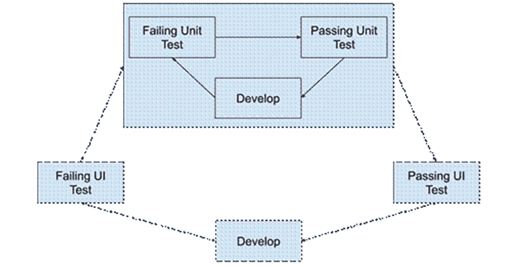

图 9.9: TDD 周期

在上图中，我们可以看到 TDD 过程中的开发周期。你应该从测试失败的地方开始。实施变更，以便测试通过。当您更新或添加新功能时，可以重复该过程。

回到我们的阶乘例子，我们从一个阶乘函数开始，它没有覆盖我们所有的场景，并且必须在每次添加新测试时不断更新函数。TDD 就是在这样的想法下建立的。你从一个空函数开始。你开始定义你的测试场景:成功的条件是什么？最低是多少？最高限额是多少？主要规则有例外吗？它们是什么？这些问题可以帮助开发人员定义他们的测试用例。然后，这些案例就可以写了。现在让我们看看如何在下一个练习中做到这一点。

## 练习 9.04:用 TDD 计算数字之和

编写一个函数，将整数 *n* 作为输入，并将数字的总和从 1 返回到 *n* 。该函数应采用 TDD 方法编写，并应满足以下标准:

*   对于 *n < =0* ，该函数将返回值`-1`。
*   该函数应该能够为`Int.MAX_VALUE`返回正确的值。
*   The function should be quick, even for `Int.MAX_VALUE`.

    注意

    在本练习中，没有显示导入语句。要查看完整的代码文件，请参考[http://packt.live/3a0jJd9](http://packt.live/3a0jJd9)):

执行以下步骤完成本练习:

1.  确保以下库被添加到`app/build.gradle` :

    ```
    testImplementation 'junit:junit:4.13.1'
    ```kt

2.  使用`sum`方法创建一个`Adder`类，该类将返回`0`，以满足编译器:

    ```
    class Adder {
        fun sum(n: Int): Int = 0
    }
    ```kt

3.  在测试目录中创建一个`AdderTest`类，并定义我们的测试用例。我们将有以下测试用例: *n=1* ， *n=2* ， *n=0* ， *n=-1* ， *n=10* ， *n=20* ，以及 *n=Int。最大值*。我们可以将成功的场景分成一种方法，不成功的场景分成单独的方法:

    ```
    class AdderTest {
        private val adder = Adder()
        @Test
        fun sumSuccess() {
            assertEquals(1, adder.sum(1))
            assertEquals(3, adder.sum(2))
            assertEquals(55, adder.sum(10))
            assertEquals(210, adder.sum(20))
            assertEquals(2305843008139952128L, adder.sum(Int.MAX_VALUE))
        }
        @Test
        fun sumError(){
            assertEquals(-1, adder.sum(0))
            assertEquals(-1, adder.sum(-1))
        }
    }
    ```kt

4.  If we run the tests for the `AdderTest` class, we will see an output similar to the following figure, meaning that all our tests failed:

    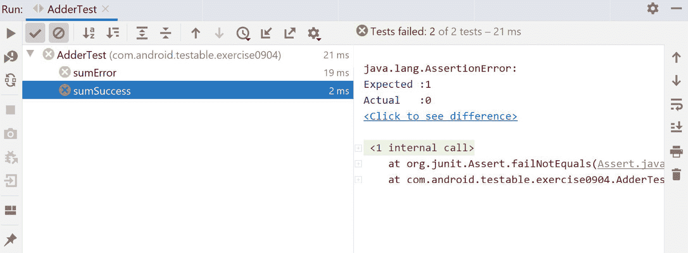

    图 9.10:练习 9.04 的初始测试状态

5.  让我们首先通过在从 1 到 *n* :

    ```
    class Adder {
        fun sum(n: Int): Long {
            var result = 0L
            for (i in 1..n) {
                result += i
            }
            return result
        }
    }
    ```kt

    的循环中实现和来解决成功场景
6.  If we run the tests now, you will see that one will pass and the other will fail, similar to the following figure:

    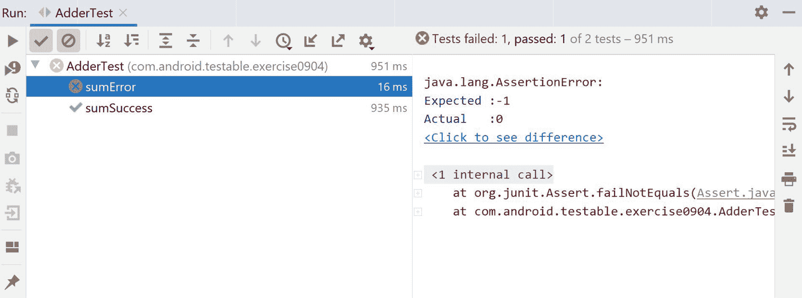

    图 9.11:解决练习 9.04 的成功场景后的测试状态

7.  If we take a look at the time it took to execute the successful test, it seems a bit long. This can add up when thousands of unit tests are present in one project. We can now optimize our code to deal with the issue by applying the *n(n+1)/2* formula:

    ```
    class Adder {
        fun sum(n: Int): Long {
            return (n * (n.toLong() + 1)) / 2
        }
    }
    ```kt

    现在运行测试会将速度大幅降低到几毫秒。

8.  现在，让我们专注于解决我们的失败场景。我们可以通过添加当 *n* 小于或等于`0` :

    ```
    class Adder {
        fun sum(n: Int): Long {
            return if (n > 0) (n * (n.toLong() + 1)) / 2 else -1
        }
    }
    ```

    的条件来实现
9.  If we run the tests now, we should see them all passing, similar to the following figure:

    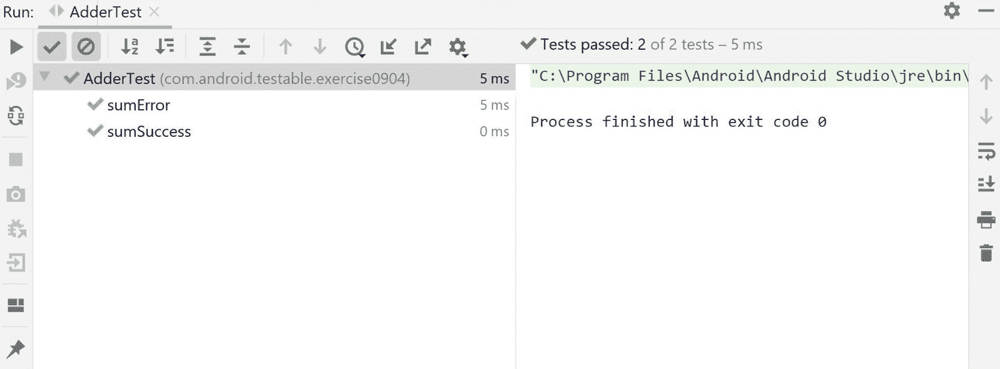

图 9.12:通过练习 9.04 的测试

在本练习中，我们将 TDD 的概念应用到一个非常小的示例中，以演示如何使用该技术。我们已经观察到如何从框架代码开始，我们可以创建一套测试来验证我们的条件，以及如何通过不断运行测试来改进代码，直到所有测试都通过。正如你可能已经注意到的，这个概念不是一个直观的概念。一些开发人员发现很难定义骨架代码应该有多大才能开始创建测试用例，而另一些开发人员出于习惯，会先专注于编写代码，然后开发测试。无论是哪种情况，开发人员都需要大量的技术实践，直到完全掌握。

## 活动 9.0 1:用 TDD 开发

使用 TDD 方法，开发一个包含以下三个活动和工作的应用程序:

*   在活动 1 中，您将显示一个数字`EditText`元素和一个按钮。点击按钮后，`EditText`中的数字将传递给活动 2。
*   活动 2 将异步生成一个项目列表。项目的数量将由从活动 1 传递的数量表示。可以使用`Timer`类，延时 1 秒。列表中的每个项目将显示文本`Item x`。`x`是榜单中的位置。当一个项目被点击时，你应该把被点击的项目传递给活动 3。
*   活动 3 将显示文本`You clicked y`。`y`是用户点击的项目的文本。

该应用程序将进行以下测试:

*   单元测试用莫奇托和`mockito-kotlin`标注`@SmallTest`
*   用`@MediumTest`标注的机器咖啡和浓缩咖啡的整合测试
*   使用带`@LargeTest`注释的浓缩咖啡和机器人模式进行用户界面测试

从命令行运行测试命令。

为了完成本活动，您需要采取以下步骤:

1.  你将需要安卓工作室 4.1.1 或更高版本的 Kotlin 1.4.21 或更高版本的 Parcelize Kotlin 插件
2.  创建三个活动和每个活动的用户界面。
3.  在`androidTest`文件夹中，创建三个机器人，每个活动一个:
    *   机器人 1 将包含与`EditText`和按钮的交互。
    *   机器人 2 将断言屏幕上项目的数量以及与列表中项目的交互。
    *   机器人 3 将断言`TextView`中显示的文本。
4.  使用前面的机器人创建一个具有一种测试方法的测试类。
5.  创建一个`Application`类，它将保存所有将要进行单元测试的类的实例。
6.  创建三个表示集成测试的类，每个活动一个。这些类中的每一个都将包含一个交互和数据加载的测试方法。每个集成测试都会断言活动之间传递的意图。
7.  创建一个提供用户界面所需文本的类。它将引用一个`Context`对象，并将包含两个为用户界面提供文本的方法，用户界面将返回一个空字符串。
8.  为测试这两种方法的前一个类创建测试。
9.  实现类，以便通过前面的测试。
10.  在`Activity2`中创建一个负责加载列表的类，并提供一个空的加载方法。该类将引用计时器和空闲资源。在这里，您还应该创建一个数据类来表示`RecyclerView`的模型。
11.  为前面的类创建一个单元测试。
12.  为前面的类创建实现，并运行单元测试，直到它们通过。
13.  在`Application`类中，实例化经过单元测试的类，并开始在活动中使用它们。这样做，直到您的集成测试通过。
14.  提供`IntegrationTestApplication`，它将返回负责加载的类的新实现。这是为了避免让活动 2 的集成测试等到加载完成。
15.  Provide `UiTestApplication`, which will again reduce the loading time of your models and connect the idling resource to Espresso. Implement the remaining work in order for the UI test to pass.

    注意

    这个活动的解决方案可以在:[http://packt.live/3sKj1cp](09.html)找到

# 总结

在他的章节中，我们看到了不同类型的测试和实现这些测试的框架。我们还研究了测试环境，以及如何为每个环境构建测试环境，以及如何在可以单独进行单元测试的多个组件中构建代码。我们分析了测试代码的不同方法，我们应该如何进行测试，以及如何通过查看不同的测试结果来改进我们的代码。通过 TDD，我们了解到从测试开始，我们可以更快地编写代码，并确保它不容易出错。这个活动是所有这些概念结合在一起构建一个简单的安卓应用程序的地方，我们可以通过添加测试来观察开发时间是如何增加的，但是从长远来看，这是有回报的，因为它消除了代码修改时可能出现的错误。

我们研究的框架是一些最常见的框架，但也有其他框架建立在这些框架之上，并被开发人员在他们的项目中使用，包括 mockk(一个为 Kotlin 设计的嘲讽库，利用了该语言的许多特性)、Barista(编写在 Espresso 之上并简化了 UI 测试的语法)、截图测试(截取您的 UI 测试的截图并进行比较，以验证没有引入任何 bug)， UIAutomator，以及 monkeyrunner(执行 UI 测试时不需要访问应用程序的代码，但编写在代码之上)、Spoon(允许在多个仿真器上并行执行 UI 测试，以减少测试时间)和 Firebase Test Lab(允许在云中执行测试)。

将这里提出的所有概念都看作是适合软件工程世界中两个过程的构建块:自动化和持续集成。自动化把多余和重复的工作从开发人员手中拿走，放到机器手中。您可以通过各种测试和测试用例来指导机器测试应用程序，而不是让一组质量保证人员测试您的应用程序以确保满足需求，并且只需要一个人来审查测试结果。持续集成建立在自动化的概念之上，以便在您提交代码供其他开发人员审查时验证您的代码。一个持续集成的项目会有一个如下的设置:一个开发人员在一个源代码控制存储库中提交工作供评审，比如 GitHub。

然后，云中的一台机器将开始执行整个项目的测试，确保没有任何故障，开发人员可以继续进行新的任务。如果测试通过，那么剩下的开发人员可以检查代码，当代码正确时，可以合并代码，并在云中创建一个新的构建，并分发给团队的其他成员和测试人员。所有这些都发生在初始开发人员可以安全地处理其他事情的时候。如果在这个过程中有任何失败，那么他们可以暂停新的任务，去解决他们工作中的任何问题。然后，连续集成过程可以扩展到连续交付，在准备提交到谷歌游戏时，可以设置类似的自动化，这几乎可以完全由机器处理，开发者只需少量参与。在接下来的章节中，您将学习如何在构建更复杂的应用程序时组织代码，这些应用程序使用设备的存储功能并连接到云以请求数据。这些组件中的每一个都可以单独进行单元测试，您可以应用集成测试来断言多个组件的成功集成。