# 11 时。持久化数据

概观

本章深入讨论了安卓系统中的数据持久性，以及对存储库模式的探索。到本章结束时，您将能够构建一个可以连接到多个数据源的存储库，然后使用该存储库从应用编程接口下载文件并将其保存在设备上。您将了解直接在设备上存储(持久保存)数据的多种方法，以及可以实现这一点的框架。在处理文件系统时，您将了解它是如何分区的，以及如何在不同的位置和使用不同的框架读写文件。

# 简介

在前一章中，您学习了如何构造代码以及如何保存数据。在活动中，您还有机会构建一个存储库，并使用它通过 Room 访问数据和保存数据。您可能会问这样一个问题:为什么需要这个存储库？本章将试图回答这个问题。使用存储库模式，您将能够从服务器检索数据，并以集中的方式将其存储在本地。该模式在多个地方需要相同数据的情况下非常有用，从而避免了代码重复，同时也保持了视图模型没有任何不必要的额外逻辑。

如果您查看设备上的设置应用程序或许多应用程序的设置功能，您会发现一些相似之处。带有可以打开或关闭的开关的项目列表。这是通过`SharedPreferences`和`PreferenceFragments`实现的。`SharedPreferences`是一种允许你在文件中存储键值对的方法。它有专门的读写机制，从而消除了对线程的担忧。它对少量数据很有用，并且不需要像 Room 这样的东西。

在本章中，您还将了解安卓文件系统以及它是如何构造到外部和内部内存中的。您还将了解读写权限、如何创建`FileProvider`类以便让其他应用程序访问您的文件，以及如何在不请求外部驱动器权限的情况下保存这些文件。您还将看到如何从互联网下载文件并将它们保存在文件系统中。

本章将探讨的另一个概念是使用*相机*应用程序代表您的应用程序拍摄照片和视频，并使用文件提供程序将其保存到外部存储中。

# 储存库

存储库是一种帮助开发人员将数据源代码与活动和视图模型分开的模式。它提供对数据的集中访问，然后可以进行单元测试:

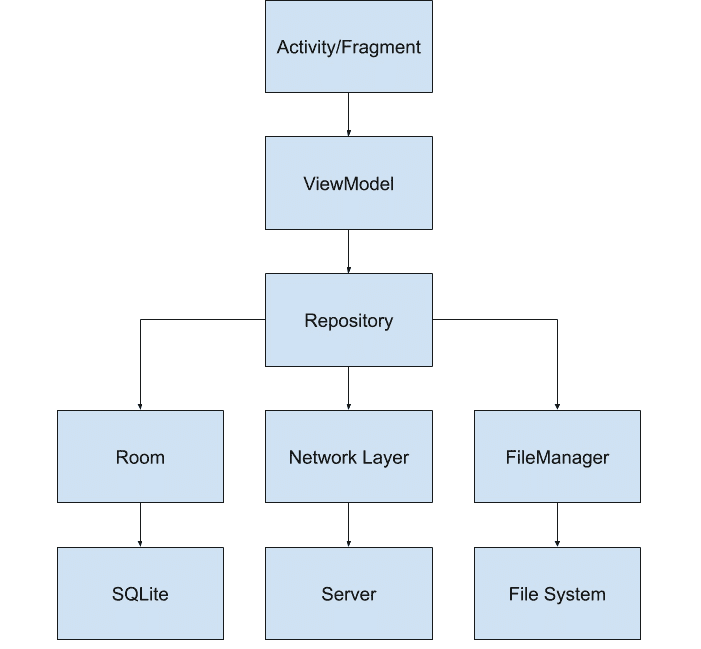

图 11.1:存储库架构图

在上图中，您可以看到存储库在应用程序代码中扮演的中心角色。其职责包括:

*   保留您的活动或应用程序所需的所有数据源(SQLite、网络、文件系统)
*   将来自多个来源的数据组合并转换为活动级别所需的单一输出
*   将数据从一个数据源传输到另一个数据源(将网络呼叫的结果保存到房间)
*   刷新过期数据(如有必要)

房间、网络层和`FileManager`代表您的存储库可以拥有的不同类型的数据源。房间可用于保存网络中的大量数据，而文件系统可用于存储少量(`SharedPreferences`)或整个文件。

`ViewModel`将引用您的存储库，并将结果传递给活动，活动将显示结果。

注意

存储库应该基于域来组织，这意味着你的应用应该针对不同的域有不同的存储库，而不是一个巨大的存储库。

## 练习 11.01:创建存储库

在本练习中，我们将在AndroidStudio中创建一个应用程序，使用改装连接到位于[https://jsonplaceholder.typicode.com/posts](https://jsonplaceholder.typicode.com/posts)的应用编程接口，并检索一个帖子列表，然后使用房间保存。界面会在`RecyclerView`显示每个帖子的标题和正文。我们将使用带有`ViewModel`的存储库模式来实现这一点。

为了完成本练习，我们需要构建以下内容:

*   负责下载和解析 JSON 文件的网络组件
*   负责将数据与一个实体存储在一起的房间数据库
*   管理先前构建的组件之间的数据的存储库
*   访问存储库的`ViewModel`
*   显示数据的带有`RecyclerView`模型的活动

执行以下步骤完成本练习:

1.  让我们首先将**所需的库**添加到`app/build.gradle`文件夹:

    ```kt
        implementation "androidx.constraintlayout       :constraintlayout:2.0.4"
        implementation 'androidx.recyclerview:recyclerview:1.1.0'
        def lifecycle_version = "2.2.0"
        implementation "androidx.lifecycle:lifecycle-extensions       :$lifecycle_version"
        def room_version = "2.2.5"
          implementation "androidx.room:room-runtime:$room_version"
        kapt "androidx.room:room-compiler:$room_version"
        implementation 'com.squareup.retrofit2:retrofit:2.6.2'
        implementation 'com.squareup.retrofit2:converter-gson:2.6.2'
        implementation 'com.google.code.gson:gson:2.8.6'
        testImplementation 'junit:junit:4.12'
        testImplementation 'android.arch.core:core-testing:2.1.0'
        testImplementation 'org.mockito:mockito-core:2.23.0'
        androidTestImplementation 'androidx.test.ext:junit:1.1.2'
        androidTestImplementation 'androidx.test.espresso:espresso-      core:3.3.0
    ```

2.  我们需要对处理应用编程接口通信的类进行分组。我们将通过创建一个包含网络所需类的`api`包来做到这一点。
3.  接下来，我们定义一个`Post`类，它将映射 JSON 文件中的数据。JSON 文件中代表帖子的每个字段将在我们的新模型中定义:

    ```kt
    data class Post(
        @SerializedName("id") val id: Long,
        @SerializedName("userId") val userId: Long,
        @SerializedName("title") val title: String,
        @SerializedName("body") val body: String
    )
    ```

4.  接下来，我们创建一个`PostService`接口，它将负责通过改装从服务器加载数据。该类将有一个检索帖子列表的方法，并将执行`HTTP GET`调用来检索数据:

    ```kt
    interface PostService {
        @GET("posts")
        fun getPosts(): Call<List<Post>>
    }
    ```

5.  接下来，让我们设置我们的 Room 数据库，它将包含一个实体和一个数据访问对象。让我们为此定义一个`db`包。
6.  `PostEntity`类将具有与`Post`类相似的字段:

    ```kt
    @Entity(tableName = "posts")
    data class PostEntity(
        @PrimaryKey(autoGenerate = true) @ColumnInfo(name = "id")       val id: Long,
        @ColumnInfo(name = "userId") val userId: Long,
        @ColumnInfo(name = "title") val title: String,
        @ColumnInfo(name = "body") val body: String
    )
    ```

7.  `PostDao`应该包含存储帖子列表和检索帖子列表的方法:

    ```kt
    @Dao
    interface PostDao {
        @Insert(onConflict = OnConflictStrategy.REPLACE)
        fun insertPosts(posts: List<PostEntity>)
        @Query("SELECT * FROM posts")
        fun loadPosts(): LiveData<List<PostEntity>>
    }
    ```

8.  And finally, in the case of the Room configuration, the `Post` database should look like this:

    ```kt
    @Database(
        entities = [PostEntity::class],
        version = 1
    )
    abstract class PostDatabase : RoomDatabase() {
        abstract fun postDao(): PostDao
    }
    ```

    是时候进入`Repository`领地了。因此，让我们创建一个存储库包。

9.  之前，我们定义了两种类型的`Post`，一种是基于 JSON 建模的，一种是实体。让我们定义一个从一个转换到另一个的`PostMapper`类:

    ```kt
    class PostMapper {
        fun serviceToEntity(post: Post): PostEntity {
            return PostEntity(post.id, post.userId, post.title,           post.body)
        }
    }
    ```

10.  现在让我们定义一个负责加载数据的存储库接口。存储库将从 API 加载数据，并使用 Room 存储数据，然后向`LiveData`提供`Room`实体，用户界面层将使用该实体:

    ```kt
    interface PostRepository {
        fun getPosts(): LiveData<List<PostEntity>>
    }
    ```

11.  Now, let's provide the implementation for this:

    ```kt
    class PostRepositoryImpl(
        private val postService: PostService,
        private val postDao: PostDao,
        private val postMapper: PostMapper,
        private val executor: Executor
    ) : PostRepository {
        override fun getPosts(): LiveData<List<PostEntity>> {
            postService.getPosts().enqueue(object :           Callback<List<Post>> {
                override fun onFailure(call: Call<List<Post>>, t:               Throwable) {
                }
                override fun onResponse(call: Call<List<Post>>,               response: Response<List<Post>>) {
                    response.body()?.let { posts ->
                        executor.execute {
                            postDao.insertPosts(posts.map { post ->
                                postMapper.serviceToEntity(post)
                            })
                        }
                    }
                }
            })
            return postDao.loadPosts()
        }
    }
    ```

    如果您查看前面的代码，您可以看到当帖子被加载时，我们将异步调用网络来加载帖子。当呼叫结束时，我们在一个单独的线程上用一个新的帖子列表更新房间。该方法将始终返回 Room 返回的内容。这是因为当数据最终在房间中改变时，它将被传播给观察者。

12.  现在让我们建立我们的依赖关系。因为我们没有依赖注入框架，我们将不得不依赖`Application`类，这意味着我们将需要一个`RepositoryApplication`类，在其中我们将初始化存储库需要的所有服务，然后创建存储库:

    ```kt
    class RepositoryApplication : Application() {
        lateinit var postRepository: PostRepository
        override fun onCreate() {
            super.onCreate()
            val retrofit = Retrofit.Builder()
                .baseUrl("https://jsonplaceholder.typicode.com/")
                .addConverterFactory(GsonConverterFactory.create())
                .build()
            val postService =           retrofit.create<PostService>(PostService::class.java)
            val notesDatabase =
                Room.databaseBuilder(applicationContext,               PostDatabase::class.java, "post-db")
                    .build()
            postRepository = PostRepositoryImpl(
                postService,
                notesDatabase.postDao(),
                PostMapper(),
                Executors.newSingleThreadExecutor()
            )
        }
    }
    ```

13.  在`AndroidManifest.xml`的`<application>`标签中添加`RepositoryApplication`到`android:name`。
14.  将互联网权限添加到`AndroidManifest.xml`文件:

    ```kt
    <uses-permission android:name="android.permission.INTERNET" />
    ```

15.  现在让我们定义一下我们的`ViewModel`:T1
16.  每行的`view_post_row.xml`布局文件如下:

    ```kt
    <?xml version="1.0" encoding="utf-8"?>
    <androidx.constraintlayout.widget.ConstraintLayout   xmlns:android="http://schemas.android.com/apk/res/android"
        xmlns:app="http://schemas.android.com/apk/res-auto"
        android:layout_width="match_parent"
        android:layout_height="wrap_content"
        android:padding="10dp">
        <TextView
            android:id="@+id/view_post_row_title"
            android:layout_width="wrap_content"
            android:layout_height="wrap_content"
            app:layout_constraintStart_toStartOf="parent"
            app:layout_constraintTop_toTopOf="parent" />
        <TextView
            android:id="@+id/view_post_row_body"
            android:layout_width="wrap_content"
            android:layout_height="wrap_content"
            android:layout_marginTop="5dp"
            app:layout_constraintStart_toStartOf="parent"
            app:layout_constraintTop_toBottomOf           ="@id/view_post_row_title" />
    </androidx.constraintlayout.widget.ConstraintLayout>
    ```

17.  我们活动的`activity_main.xml`布局文件如下:

    ```kt
    <?xml version="1.0" encoding="utf-8"?>
    <androidx.constraintlayout.widget.ConstraintLayout   xmlns:android="http://schemas.android.com/apk/res/android"
        xmlns:app="http://schemas.android.com/apk/res-auto"
        xmlns:tools="http://schemas.android.com/tools"
        android:layout_width="match_parent"
        android:layout_height="match_parent"
        tools:context=".MainActivity">
        <androidx.recyclerview.widget.RecyclerView
            android:id="@+id/activity_main_recycler_view"
            android:layout_width="0dp"
            android:layout_height="0dp"
            app:layout_constraintBottom_toBottomOf="parent"
            app:layout_constraintLeft_toLeftOf="parent"
            app:layout_constraintRight_toRightOf="parent"
            app:layout_constraintTop_toTopOf="parent" />
    </androidx.constraintlayout.widget.ConstraintLayout>
    ```

18.  各行的`PostAdapter`等级如下:

    ```kt
    class PostAdapter(private val layoutInflater: LayoutInflater) :
        RecyclerView.Adapter<PostAdapter.PostViewHolder>() {
        private val posts = mutableListOf<PostEntity>()
        override fun onCreateViewHolder(parent: ViewGroup, viewType:       Int): PostViewHolder =
            PostViewHolder(layoutInflater.inflate           (R.layout.view_post_row, parent, false))
        override fun getItemCount() = posts.size
        override fun onBindViewHolder(holder: PostViewHolder,       position: Int) {
            holder.bind(posts[position])
        }
        fun updatePosts(posts: List<PostEntity>) {
            this.posts.clear()
            this.posts.addAll(posts)
            this.notifyDataSetChanged()
        }
        inner class PostViewHolder(containerView: View) :       RecyclerView.ViewHolder(containerView) {
            private val titleTextView: TextView =           containerView.findViewById<TextView>            (R.id.view_post_row_title)
            private val bodyTextView: TextView = 
              containerView.findViewById<TextView>            (R.id.view_post_row_body)
            fun bind(postEntity: PostEntity) {
                bodyTextView.text = postEntity.body
                titleTextView.text = postEntity.title
            }
        }
    }
    ```

19.  And finally, the `MainActivity` file will be as follows:

    ```kt
    class MainActivity : AppCompatActivity() {
        private lateinit var postAdapter: PostAdapter
        override fun onCreate(savedInstanceState: Bundle?) {
            super.onCreate(savedInstanceState)
            setContentView(R.layout.activity_main)
            postAdapter = PostAdapter(LayoutInflater.from(this))
            val recyclerView = findViewById<RecyclerView>          (R.id.activity_main_recycler_view)
            recyclerView.adapter = postAdapter
            recyclerView.layoutManager = LinearLayoutManager(this)
            val postRepository = (application as           RepositoryApplication).postRepository
            val postViewModel = ViewModelProvider(this, object :           ViewModelProvider.Factory {
                override fun <T : ViewModel?> create(modelClass:               Class<T>): T {
                    return PostViewModel(postRepository) as T
                }
            }).get(PostViewModel::class.java)
            postViewModel.getPosts().observe(this, Observer {
                postAdapter.updatePosts(it)
            })
        }
    }
    ```

    如果运行前面的代码，您将看到以下输出:

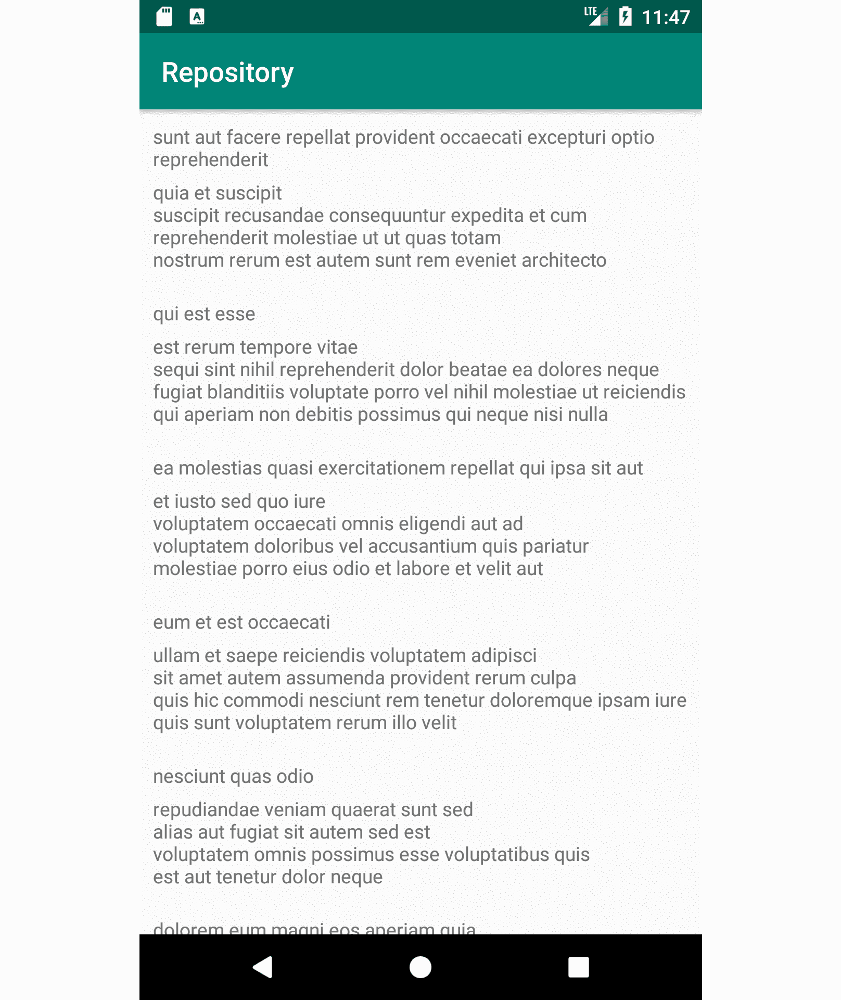

图 11.2:练习 11.01 的输出

现在，您可以打开和关闭互联网，关闭并重新打开应用程序，以查看最初保存的数据是否会继续显示。在当前的实现中，错误处理暂时是空的。这意味着，如果在检索帖子列表时出现问题，用户将不会被告知这一点。这可能会成为一个问题，让用户感到沮丧。大多数应用程序的用户界面上都显示一些错误信息或其他信息，其中最常见的错误信息是`Something went wrong. Please try again`，当错误没有被正确识别时，它被用作通用占位符。

## Ex ercise 11.02:添加错误处理

在本练习中，我们将修改前面的练习。在互联网出错的情况下，我们将确保它会显示祝酒词，并显示“出了问题”*。在添加错误处理的过程中，我们还需要通过创建一个保存相关数据的新模型类来消除用户界面和实体类之间的依赖关系。*

 *为了处理该错误，我们需要构建以下内容:

*   只包含正文和文本的新模型类
*   包含三个内部类的密封类，分别用于成功、错误和加载
*   我们的新模型和网络帖子之间的映射函数

执行以下步骤完成本练习:

1.  让我们从我们的新模型开始。当与存储库模式结合时，这种类型的模型很常见，原因很简单。新模型可能包含特定于该屏幕的数据，这需要一些额外的逻辑(假设您有一个用户拥有`firstName`和`lastName`，但是您的用户界面要求您在同一个`TextView`中显示这两个数据。通过创建一个带有名称字段的新模型，您可以解决这个问题，还可以对转换进行单元测试，并避免在用户界面层上移动连接:

    ```kt
    data class UiPost(
        val title: String,
        val body: String
    )
    ```

2.  现在是我们新的密封课。这个密封类的子类包含数据加载的所有状态。当存储库开始加载数据时会发出`Loading`状态，当存储库成功加载数据并包含帖子列表时会发出`Success`状态，当出现错误时会发出`Error`状态:

    ```kt
    sealed class Result {
        object Loading : Result()
        class Success(val uiPosts: List<UiPost>) : Result()
        class Error(val throwable: Throwable) : Result()
    }
    ```

3.  `PostMapper`中的映射方式会是这样的。它有一个额外的方法，将从应用编程接口提取的数据转换为用户界面模型，该模型只有用户界面正确显示所需的字段:

    ```kt
    class PostMapper {
        fun serviceToEntity(post: Post): PostEntity {
            return PostEntity(post.id, post.userId, post.title,           post.body)
        }
        fun serviceToUi(post: Post): UiPost {
            return UiPost(post.title, post.body)
        }
    }
    ```

4.  现在，让我们修改`PostRepository`:T1
5.  现在让我们修改`PostRepositoryImpl`。我们的结果将是以`Loading`值开始的`MutableLiveData`，根据 HTTP 请求的状态，它将发送带有项目列表的`Success`消息或带有错误`Retrofit encountered`的`Error`消息。这种方法将不再依赖于始终显示存储的值。当请求成功时，将传递 HTTP 调用的输出，而不是房间的输出:

    ```kt
    override fun getPosts(): LiveData<Result> {
     val result = MutableLiveData<Result>()
     result.postValue(Result.Loading)
            postService.getPosts().enqueue(object :           Callback<List<Post>> {
                override fun onFailure(call: Call<List<Post>>, t:               Throwable) {
                    result.postValue(Result.Error(t))
                }
                override fun onResponse(call: Call<List<Post>>,               response: Response<List<Post>>) {
                    if (response.isSuccessful) {
     response.body()?.let { posts ->
     executor.execute {
     postDao.insertPosts(posts.map                               { post ->
     postMapper.serviceToEntity(post)
     })
     result.postValue(Result                               .Success(posts.map { post ->
     postMapper.serviceToUi(post)
     }))
     }
     }
     } else {
     result.postValue(Result.Error                       (RuntimeException("Unexpected error")))
     }
                }
            })
            return result
        }
    ```

6.  在您观察实时数据的活动中，需要实现以下更改。在这里，我们将检查每个状态，并相应地更新用户界面。如果有错误，我们会显示一条错误消息；如果成功，我们显示项目列表；当它正在加载时，我们显示一个进度条，向用户指示工作正在后台完成:

    ```kt
            postViewModel.getPosts().observe(this,           Observer { result ->
                when (result) {
                    is Result.Error -> {
                        Toast.makeText(applicationContext,                       R.string.error_message, Toast.LENGTH_LONG)
                            .show()
                        result.throwable.printStackTrace()
                    }
                    is Result.Loading -> {
                        // TODO show loading spinner
                    }
                    is Result.Success -> {
                        postAdapter.updatePosts(result.uiPosts)
                    }
                }
            })
    ```

7.  And finally, your adapter should be as follows:

    ```kt
    class PostAdapter(private val layoutInflater: LayoutInflater) :
        RecyclerView.Adapter<PostAdapter.PostViewHolder>() {
        private val posts = mutableListOf<UiPost>()
        override fun onCreateViewHolder(parent: ViewGroup, viewType:       Int): PostViewHolder =
            PostViewHolder(layoutInflater           .inflate(R.layout.view_post_row, parent, false))
        override fun getItemCount(): Int = posts.size
        override fun onBindViewHolder(holder: PostViewHolder,       position: Int) {
            holder.bind(posts[position])
        }
        fun updatePosts(posts: List<UiPost>) {
            this.posts.clear()
            this.posts.addAll(posts)
            this.notifyDataSetChanged()
        }
        inner class PostViewHolder(containerView: View) :       RecyclerView.ViewHolder(containerView) {
            private val titleTextView: TextView =         containerView.findViewById<TextView>          (R.id.view_post_row_title)
            private val bodyTextView: TextView =           containerView.findViewById<TextView>            (R.id.view_post_row_body)
            fun bind(post: UiPost) {
     bodyTextView.text = post.body
                titleTextView.text = post.title
            }
        }
    }
    ```

    当您运行前面的代码时，您应该会看到出现在*图 11.3* 中的屏幕:

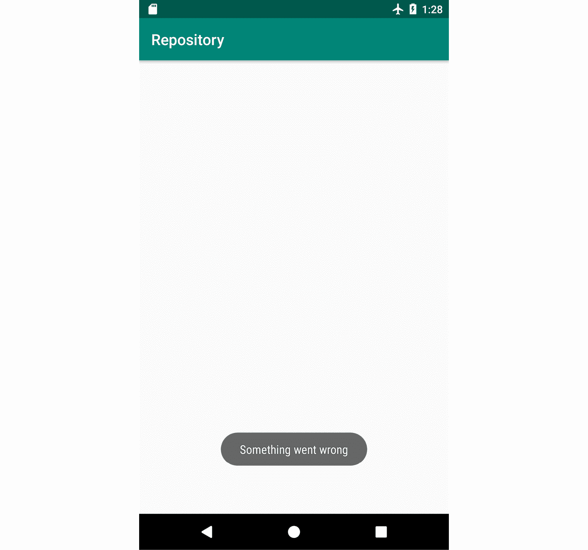

图 11.3:练习 11.02 的输出

从这一点开始，可以通过多种方式扩展存储库:

*   添加仅在特定时间过去后才会请求数据的算法
*   定义一个更复杂的结果类，它能够存储缓存的数据和错误消息
*   添加内存缓存
*   增加了向下滑动`RecyclerView`时刷新数据的滑动刷新功能，并将加载部件连接到`Loading`状态

# 预差异

假设您的任务是集成第三方应用编程接口，该接口使用 OAuth 之类的东西来实现与脸书、谷歌等的登录。这些机制的工作方式如下:它们给你一个令牌，你必须将它存储在本地，然后可以用来发送访问用户数据的其他请求。你面临的问题是:你如何存储那个令牌？你用房间只是为了一个象征吗？您是否将令牌保存在单独的文件中并实现写入文件的方法？如果必须同时在多个位置访问该文件，该怎么办？`SharedPreferences`就是对这些问题的回答。`SharedPreferences`是一个允许您将布尔值、整数、浮点、长整型、字符串和字符串集保存到一个 XML 文件中的功能。当您想要保存新值时，您可以指定要为关联键保存哪些值，完成后，您可以提交更改，这将以异步方式触发保存到 XML 文件。`SharedPreferences`映射也保存在内存中，因此当您想要读取这些值时，它是即时的，从而不需要异步调用来读取 XML 文件。

访问`SharedPreferences`数据的标准方式是通过`SharedPreferences`对象和最近的`EncryptedSharedPreferences`选项(如果您希望保持数据加密)。通过`PreferenceFragments`也有专门的实现。这些在您想要实现类似设置的屏幕的情况下非常有用，在该屏幕中，您想要存储用户希望调整的不同配置数据。

## Sha 红色首选项

访问`SharedPreference`对象的方式是通过`Context`对象:

```kt
val prefs = getSharedPreferences("my-prefs-file",   Context.MODE_PRIVATE)
```

第一个参数是您指定首选项名称的位置，第二个参数是您希望如何将文件公开给其他应用程序。目前最好的模式是私人模式。所有其他的都存在潜在的安全风险。

有一个访问默认`SharedPreferences`文件的专门实现，由`PreferenceFragment`使用:

```kt
PreferenceManager.getDefaultSharedPreferences(context)
```

如果要将数据写入首选项文件，首先需要访问首选项编辑器。编辑会给你写数据的权限。然后，您可以在编辑器中写入数据。写完之后，您必须将触发持久性的更改应用到 XML 文件中，并且更改内存中的值。您有两个选择来应用您的首选项文件中的更改:`apply`或`commit`。`apply`会立即将您的更改保存在内存中，但随后对磁盘的写入将是异步的，如果您想从应用程序的主线程调用它，这很好。`commit`同步进行所有操作，并给出一个布尔结果，通知您操作是否成功。实际上，`apply`比`commit`更受青睐。

```kt
     val editor = prefs.edit()
     editor.putBoolean("my_key_1", true)
     editor.putString("my_key_2", "my string")
     editor.putLong("my_key_3", 1L)
     editor.apply()
```

现在，您想要清除所有数据。同样的原则也适用；你需要`editor`、`clear`和`apply`:

```kt
     val editor = prefs.edit()
     editor.clear()
     editor.apply()
```

如果想读取之前保存的值，可以使用`SharedPreferences`对象读取存储的值。如果没有保存的值，您可以选择返回默认值。

```kt
     prefs.getBoolean("my_key_1", false)
     prefs.getString("my_key_2", "")
     prefs.getLong("my_key_3", 0L)
```

## Exe rcise 11.03:包装共享引用

我们将构建一个显示`TextView`、`EditText`和一个按钮的应用程序。`TextView`将在`SharedPreferences`中显示之前保存的值。用户可以输入新的文本，点击按钮后，文本将保存在`SharedPreferences`中，`TextView`将显示更新后的文本。我们将需要使用`ViewModel`和`LiveData`来使代码更加可测试。

为了完成这个练习，我们需要创建一个`Wrapper`类，负责保存文本。该类将文本的值返回为`LiveData`。这将注入我们的`ViewModel`，这将绑定到活动:

1.  让我们从向`app/build.gradle` :

    ```kt
        implementation       "androidx.constraintlayout:constraintlayout:2.0.4"
        def lifecycle_version = "2.2.0"
        implementation "androidx.lifecycle:lifecycle-      extensions:$lifecycle_version"
        testImplementation 'junit:junit:4.12'
        testImplementation 'android.arch.core:core-testing:2.1.0'
        testImplementation 'org.mockito:mockito-core:2.23.0'
        androidTestImplementation 'androidx.test.ext:junit:1.1.2'
        androidTestImplementation       'androidx.test.espresso:espresso-core:3.3.0'
    ```

    添加适当的库开始
2.  Let's make our `Wrapper` class, which will listen for changes in `SharedPreferences` and update the value of `LiveData` when the preferences change. The class will contain methods to save the new text and to retrieve `LiveData`:

    ```kt
    const val KEY_TEXT = "keyText"
    class PreferenceWrapper(private val sharedPreferences:   SharedPreferences) {
        private val textLiveData = MutableLiveData<String>()
        init {
            sharedPreferences           .registerOnSharedPreferenceChangeListener { _, key ->
                when (key) {
                    KEY_TEXT -> {
                        textLiveData.postValue(sharedPreferences                       .getString(KEY_TEXT, ""))
                    }
                }
            }
        }
        fun saveText(text: String) {
            sharedPreferences.edit()
                .putString(KEY_TEXT, text)
                .apply()
        }
        fun getText(): LiveData<String> {
            textLiveData.postValue(sharedPreferences           .getString(KEY_TEXT, ""))
            return textLiveData
        }
    }
    ```

    请注意文件的顶部。我们添加了一个监听器，这样当我们的`SharedPreferences`值改变时，我们可以查找新值并更新我们的`LiveData`模型。这将允许我们观察`LiveData`的任何变化，并更新用户界面。`saveText`方法将打开编辑器，设置新值，并应用更改。`getText`方法将读取最后保存的值，将其设置在`LiveData`中，并返回`LiveData`对象。这在应用程序打开并且我们希望在应用程序关闭之前访问最后一个值的情况下很有帮助。

3.  现在，让我们用首选项的实例来设置`Application`类:

    ```kt
    class PreferenceApplication : Application() {
        lateinit var preferenceWrapper: PreferenceWrapper
        override fun onCreate() {
            super.onCreate()
            preferenceWrapper =           PreferenceWrapper(getSharedPreferences("prefs",             Context.MODE_PRIVATE))
        }
    }
    ```

4.  现在，让我们将`application`标签中的适当属性添加到`AndroidManifest.xml` :

    ```kt
    android:name=".PreferenceApplication"
    ```

5.  现在，让我们构建`ViewModel`组件:

    ```kt
    class PreferenceViewModel(private val preferenceWrapper:   PreferenceWrapper) : ViewModel() {
        fun saveText(text: String) {
            preferenceWrapper.saveText(text)
        }
        fun getText(): LiveData<String> {
            return preferenceWrapper.getText()
        }
    }
    ```

6.  Finally, let's define our `activity_main.xml` layout file:

    activity_main.xml

    ```kt
    9    <TextView
    10        android:id="@+id/activity_main_text_view"
    11        android:layout_width="wrap_content"
    12        android:layout_height="wrap_content"
    13        android:layout_marginTop="50dp"
    14        app:layout_constraintLeft_toLeftOf="parent"
    15        app:layout_constraintRight_toRightOf="parent"
    16        app:layout_constraintTop_toTopOf="parent" />
    17
    18    <EditText
    19        android:id="@+id/activity_main_edit_text"
    20        android:layout_width="200dp"
    21        android:layout_height="wrap_content"
    22        android:inputType="none"
    23        app:layout_constraintLeft_toLeftOf="parent"
    24        app:layout_constraintRight_toRightOf="parent"
    25        app:layout_constraintTop_toBottomOf=             "@id/activity_main_text_view" />
    26
    27    <Button
    28        android:id="@+id/activity_main_button"
    29        android:layout_width="wrap_content"
    30        android:layout_height="wrap_content"
    31        android:inputType="none"
    32        android:text="@android:string/ok"
    33        app:layout_constraintLeft_toLeftOf="parent"
    34        app:layout_constraintRight_toRightOf="parent"
    35        app:layout_constraintTop_toBottomOf=            "@id/activity_main_edit_text" /> 
    ```

    这一步的完整代码可以在[http://packt.live/39RhIj0](http://packt.live/39RhIj0)找到。

7.  And finally, in `MainActivity`, perform the following steps:

    ```kt
    class MainActivity : AppCompatActivity() {
        override fun onCreate(savedInstanceState: Bundle?) {
            super.onCreate(savedInstanceState)
            setContentView(R.layout.activity_main)
            val preferenceWrapper = (application as         PreferenceApplication).preferenceWrapper
            val preferenceViewModel = ViewModelProvider(this, object           : ViewModelProvider.Factory {
                override fun <T : ViewModel?> create(modelClass:               Class<T>): T {
                    return PreferenceViewModel(preferenceWrapper)                   as T
                }
            }).get(PreferenceViewModel::class.java)
            preferenceViewModel.getText().observe(this, Observer {
            findViewById<TextView>(R.id.activity_main_text_view)           .text = it
            })
            findViewById<Button>(R.id.activity_main_button)          .setOnClickListener {
            preferenceViewModel.saveText(findViewById<EditText>          (R.id.activity_main_edit_text).text.toString())
            }
        }
    }
    ```

    前面的代码将产生在*图 11.4* 中显示的输出:

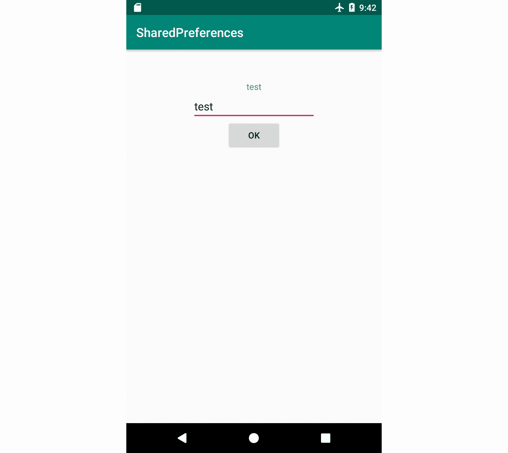

图 11.4:练习 11.03 的输出

插入值后，尝试关闭应用程序并重新打开它。该应用程序将显示最后一个持久值。

## pref〔t0〕管理片段

如前所述，`PreferenceFragment`是依赖于`SharedPreferences`来存储用户设置的片段的专用实现。它的功能包括基于开/关切换存储布尔值，基于显示给用户的对话框存储文本，基于单选项和多选项对话框存储字符串集，基于`SeekBars`存储整数，以及对部分进行分类并链接到其他`PreferenceFragment`类。

虽然`PreferenceFragment`类是安卓框架的一部分，但它们被标记为不推荐使用，这意味着片段的推荐方法是依赖于引入 `PreferenceFragmentCompat`的 Jetpack Preference 库。`PreferenceFragmentCompat` 有助于确保新安卓框架和旧框架之间的向后兼容性。

为了建立一个`PreferenceFragment`类，需要两件事:

*   `res/xml`文件夹中的一个资源，您的首选项的结构将在此处构建
*   一个扩展`PreferenceFragment`的类，它将把 XML 文件和片段链接起来

如果您想访问您的`PreferenceFragment`从非`PreferenceFragment`资源存储的值，您可以使用`PreferenceManager.getDefaultSharedPreferences(context)`方法访问`SharedPreference`对象。访问这些值的键是您在 XML 文件中定义的键。

名为 settings_preference.xml 的首选项 XML 文件的示例如下所示:

```kt
<?xml version="1.0" encoding="utf-8"?>
<PreferenceScreen xmlns:app="http://schemas.android.com/apk/res-auto">
    <PreferenceCategory app:title="Primary settings">
        <SwitchPreferenceCompat
            app:key="work_offline"
            app:title="Work offline" />
        <Preference
            app:icon="@mipmap/ic_launcher"
            app:key="my_key"
            app:summary="Summary"
            app:title="Title" />
    </PreferenceCategory>
</PreferenceScreen>
```

对于每个首选项，您都可以显示图标、标题、摘要、当前值以及是否可选。一个重要的事情是密钥以及如何将其链接到您的 Kotlin 代码。您可以使用`strings.xml`文件声明不可翻译的字符串，然后可以在您的 Kotlin 代码中提取这些字符串。

你的`PreferenceFragment`会看起来像这样:

```kt
class MyPreferenceFragment : PreferenceFragmentCompat() {
    override fun onCreatePreferences(savedInstanceState: Bundle?,       rootKey: String?) {
 setPreferencesFromResource(R.xml.settings_preferences,           rootKey)
    }
}
```

`onCreatePreferences`方法是抽象的，您需要实现它，以便通过`setPreferencesFromResource`方法为您的首选项指定 XML 资源。

您也可以使用`findPreference`方法以编程方式访问首选项:

```kt
findPreference<>(key)
```

这将返回一个从`Preference`延伸的对象。对象的性质应该与 XML 中为该特定键声明的类型相匹配。您可以通过编程修改`Preference`对象并更改所需的字段。

您也可以在继承自`PreferenceFragment`的`PreferenceManager`类上使用`createPreferenceScreen(Context)`以编程方式构建设置屏幕:

```kt
val preferenceScreen =   preferenceManager.createPreferenceScreen(context)
```

您可以使用`PreferenceScreen`容器上的`addPreference(Preference)`方法添加新的`Preference`对象:

```kt
val editTextPreference = EditTextPreference(context)
editTextPreference.key = "key"
editTextPreference.title = "title"
val preferenceScreen = preferenceManager.createPreferenceScreen(context)
preferenceScreen.addPreference(editTextPreference)
setPreferenceScreen(preferenceScreen)
```

现在让我们继续下一个练习来自定义您的设置。

## 练习练习 11.04:自定义设置

在本练习中，我们将构建一个虚拟专用网应用程序的设置。设置页面的产品要求如下:

*   **连接**:网络扫描–切换；频率–`SeekBar`
*   **配置** : IP 地址–文本；域-文本
*   **更多**:这将打开一个包含一个名为`Use mobile data`的选项的新屏幕，下面有一个包含文本`Manage your mobile data wisely`的切换和不可选择的选项。

执行以下步骤完成本练习:

1.  让我们从添加喷气背包偏好库开始:

    ```kt
    implementation 'androidx.preference:preference-ktx:1.1.1'
    ```

2.  在`res/values`中，创建一个名为`preference_keys.xml`的文件，让我们定义`More preferences`屏幕的键:

    ```kt
    <?xml version="1.0" encoding="utf-8"?>
    <resources>
        <string name="key_mobile_data"       translatable="false">mobile_data</string>
    </resources>
    ```

3.  如果不可用，在`res`中创建`xml`文件夹。
4.  在`res/xml`文件夹中创建`preferences_more.xml`文件。
5.  在`preferences_more.xml`文件中，添加以下首选项:

    ```kt
    <?xml version="1.0" encoding="utf-8"?>
    <PreferenceScreen xmlns:app=  "http://schemas.android.com/apk/res-auto">
        <SwitchPreferenceCompat
            app:key="@string/key_mobile_data"
            app:title="@string/mobile_data" />
        <Preference
            app:selectable="false"
            app:summary="@string/manage_data_wisely" />
    </PreferenceScreen>
    ```

6.  在`strings.xml`中，添加以下字符串:

    ```kt
    <string name="mobile_data">Mobile data</string>
    <string name="manage_data_wisely">Manage your data   wisely</string>
    ```

7.  Create a `PreferenceFragment` class called `MorePreferenceFragment`:

    ```kt
    class MorePreferenceFragment : PreferenceFragmentCompat() {
        override fun onCreatePreferences(savedInstanceState: Bundle?,       rootKey: String?) {
            setPreferencesFromResource(R.xml.preferences_more,           rootKey)
        }
    }
    ```

    我们完成了`More`部分。现在让我们创建主要部分。

8.  让我们为主首选项部分创建键。在`preference_keys.xml`中，增加以下内容:

    ```kt
    <string name="key_network_scan"   translatable="false">network_scan</string>
    <string name="key_frequency"   translatable="false">frequency</string>
    <string name="key_ip_address"   translatable="false">ip_address</string>
    <string name="key_domain" translatable="false">domain</string>
    ```

9.  在`res/xml`中，创建`preferences_settings.xml`文件。
10.  Now, define your preferences according to the specs:

    ```kt
    <?xml version="1.0" encoding="utf-8"?>
    <PreferenceScreen xmlns:app=  "http://schemas.android.com/apk/res-auto">
        <PreferenceCategory app:title="@string/connectivity">
            <SwitchPreferenceCompat
                app:key="@string/key_network_scan"
                app:title="@string/network_scan" />
            <SeekBarPreference
                app:key="@string/key_frequency"
                app:title="@string/frequency" />
        </PreferenceCategory>
        <PreferenceCategory app:title="@string/configuration">
            <EditTextPreference
                app:key="@string/key_ip_address"
                app:title="@string/ip_address" />
            <EditTextPreference
                app:key="@string/key_domain"
                app:title="@string/domain" />
        </PreferenceCategory>
     <Preference
     app:fragment="com.android.testable.preferencefragments           .MorePreferenceFragment"
     app:title="@string/more" />
    </PreferenceScreen>
    ```

    注意最后一部分。这就是我们如何在一个`PreferenceFragment`和另一个之间建立联系。默认情况下，系统会为我们进行转换，但是有一种方法可以覆盖这种行为，以防我们想要更新用户界面。

11.  在`strings.xml`中，确保你有以下值:

    ```kt
    <string name="connectivity">Connectivity</string>
    <string name="network_scan">Network scan</string>
    <string name="frequency">Frequency</string>
    <string name="configuration">Configuration</string>
    <string name="ip_address">IP Address</string>
    <string name="domain">Domain</string>
    <string name="more">More</string>
    ```

12.  创建一个名为`SettingsPreferenceFragment`的片段。
13.  添加以下设置:

    ```kt
    class SettingsPreferenceFragment : PreferenceFragmentCompat() {
        override fun onCreatePreferences(savedInstanceState: Bundle?,       rootKey: String?) {
            setPreferencesFromResource(R.xml.preferences_settings,           rootKey)
        }
    }
    ```

14.  现在，让我们将`Fragments`添加到我们的活动中。
15.  在`activity_main.xml`中，定义一个`FrameLayout`标签来包含片段:

    ```kt
    <?xml version="1.0" encoding="utf-8"?>
    <FrameLayout   xmlns:android="http://schemas.android.com/apk/res/android"
        xmlns:tools="http://schemas.android.com/tools"
        android:layout_width="match_parent"
        android:layout_height="match_parent"
        tools:context=".MainActivity"
        android:id="@+id/fragment_container"/>
    ```

16.  And finally, in `MainActivity`, perform the following steps:

    ```kt
    class MainActivity : AppCompatActivity(),
        PreferenceFragmentCompat.OnPreferenceStartFragmentCallback {
        override fun onCreate(savedInstanceState: Bundle?) {
            super.onCreate(savedInstanceState)
            setContentView(R.layout.activity_main)
            if (savedInstanceState == null) {
                supportFragmentManager.beginTransaction()
                    .replace(R.id.fragment_container,                   SettingsPreferenceFragment())
                    .commit()
            }
        }
     override fun onPreferenceStartFragment(
     caller: PreferenceFragmentCompat?,
     pref: Preference
     ): Boolean {
     val args = pref.extras
     val fragment =           supportFragmentManager.fragmentFactory.instantiate(
     classLoader,
     pref.fragment
     )
     fragment.arguments = args
     fragment.setTargetFragment(caller, 0)
     supportFragmentManager.beginTransaction()
     .replace(R.id.fragment_container, fragment)
     .addToBackStack(null)
     .commit()
     return true
     }
    }
    ```

    从`PreferenceFragmentCompat.OnPreferenceStartFragmentCallback`界面看`onPreferenceStartFragment`。这允许我们截取片段之间的切换并添加我们自己的行为。方法的前半部分将使用方法的输入来创建`MorePreferenceFragment`的新实例，而后半部分执行片段事务。然后，我们返回`true`，因为我们已经自己处理了过渡。

17.  Running the preceding code will produce the following output:

    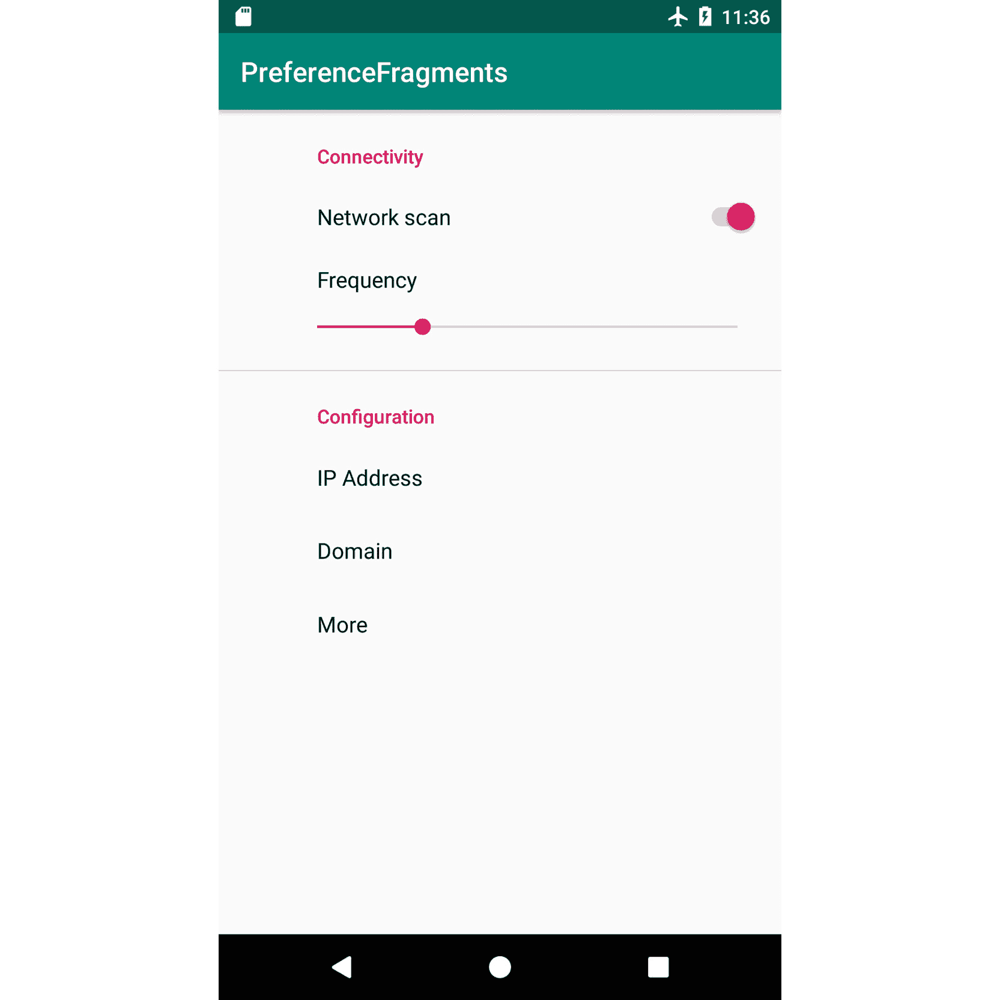

    图 11.5:练习 11.04 的输出

    我们现在可以监控对首选项的更改，并在用户界面中显示它们。我们可以将此功能应用于 IP 地址和域部分，以显示用户键入的摘要。

18.  现在让我们修改`SettingsPreferenceFragment`以编程方式设置一个监听器，当值改变时，监听器将在摘要中显示新值。首次打开屏幕时，我们还需要设置保存的值。我们需要使用`findPreference(key)`找到我们想要修改的偏好。这允许我们以编程方式修改偏好。我们还可以在首选项上注册侦听器，这将使我们能够访问新值。在我们的例子中，我们可以注册一个监听器来记录 IP 地址何时改变，这样我们就可以根据用户在`EditText`中介绍的内容来更新字段的摘要:

    ```kt
    class SettingsPreferenceFragment : PreferenceFragmentCompat() {
        override fun onCreatePreferences(savedInstanceState: Bundle?,       rootKey: String?) {
            setPreferencesFromResource(R.xml.preferences_settings,           rootKey)
            val ipAddressPref =           findPreference<EditTextPreference>(getString             (R.string.key_ip_address))
            ipAddressPref?.setOnPreferenceChangeListener {           preference, newValue ->
                preference.summary = newValue.toString()
                true
            }
            val domainPref = findPreference<EditTextPreference>          (getString(R.string.key_domain))
            domainPref?.setOnPreferenceChangeListener { preference,           newValue ->
                preference.summary = newValue.toString()
                true
            }
            val sharedPrefs = PreferenceManager           .getDefaultSharedPreferences(requireContext())
            ipAddressPref?.summary = sharedPrefs           .getString(getString(R.string.key_ip_address), "")
            domainPref?.summary = sharedPrefs           .getString(getString(R.string.key_domain), "")
        }
    }
    ```

`PreferenceFragment`是为任何应用程序构建类似设置的功能的好方法。它与`SharedPreferences`和内置用户界面组件的集成允许开发人员比平时更快地构建元素，并解决了与处理每个设置元素的点击和元素插入相关的许多问题。

# 文件

我们已经讨论了 Room 和`SharedPreferences`并指定了它们存储的数据如何写入文件。你可能会问自己，这些文件存放在哪里？这些特定文件存储在内部存储器中。内部存储是其他应用程序无法访问的每个应用程序的专用空间(除非设备是根设备)。您的应用程序使用的存储量没有限制。但是，用户可以从“设置”菜单中删除应用程序的文件。内部存储占总可用空间的比例较小，这意味着在内部存储中存储文件时应该小心。还有外部存储。其他应用程序可以访问您的应用程序商店中的文件，您的应用程序也可以访问其他应用程序中的文件:

注意

在AndroidStudio中，您可以使用设备文件浏览器工具在设备或模拟器上浏览文件。内部存储位于`/data/data/{packageName}`。如果您有权访问此文件夹，这意味着设备已被根用户。使用这个，您可以可视化数据库文件和`SharedPreferences`文件。

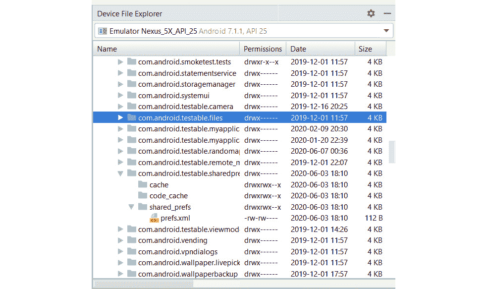

图 11.6:安卓设备文件浏览器

## 实习生铝储存

内部存储不需要用户的权限。要访问内部存储目录，可以从`Context`对象使用以下方法之一:

*   `getDataDir()`:返回应用沙箱的根文件夹。
*   `getFilesDir()`:应用文件专用文件夹；推荐使用。
*   `getCacheDir()`:可以缓存文件的专用文件夹。在此存储文件并不能保证您以后可以检索它们，因为系统可能会决定删除此目录以释放内存。该文件夹链接到`Settings`中的`Clear Cache`选项。
*   `getDir(name, mode)`:根据指定的名称返回一个不存在的文件夹。

当用户使用`Settings`中的`Clear Data`选项时，这些文件夹中的大部分将被删除，使应用程序进入与全新安装相似的状态。卸载应用程序后，这些文件也会被删除。

读取缓存文件的典型示例如下:

```kt
        val cacheDir = context.cacheDir
        val fileToReadFrom = File(cacheDir, "my-file.txt")
        val size = fileToReadFrom.length().toInt()
        val bytes = ByteArray(size)
        val tmpBuff = ByteArray(size)
        val fis = FileInputStream(fileToReadFrom)
        try {
            var read = fis.read(bytes, 0, size)
            if (read < size) {
                var remain = size - read
                while (remain > 0) {
                    read = fis.read(tmpBuff, 0, remain)
                    System.arraycopy(tmpBuff, 0, bytes,                                      size - remain, read)
                    remain -= read
                }
            }
        } catch (e: IOException) {
            throw e
        } finally {
            fis.close()
        }
```

前面的示例将从位于`Cache`目录中的`my-file.txt`读取，并将为该文件创建`FileInputStream`。然后，将使用一个缓冲区从文件中收集字节。收集的字节将被放入`bytes`字节数组，该数组将包含从该文件读取的所有数据。当文件的整个长度被读取后，读取将停止。

写入`my-file.txt`文件将看起来像这样:

```kt
        val bytesToWrite = ByteArray(100)
        val cacheDir = context.cacheDir
        val fileToWriteIn = File(cacheDir, "my-file.txt")
        try {
            if (!fileToWriteIn.exists()) {
                fileToWriteIn.createNewFile()
            }
            val fos = FileOutputStream(fileToWriteIn)
            fos.write(bytesToWrite)
            fos.close()
        } catch (e: Exception) {
            e.printStackTrace()
        }
```

前面的例子是取你要写的字节数组，新建一个`File`对象，如果不存在就创建文件，通过`FileOutputStream`将字节写入文件。

注意

处理文件有许多替代方法。阅读器(`StreamReader`、`StreamWriter`等)更适合基于字符的数据。还有第三方库帮助进行磁盘输入/输出操作。帮助输入/输出操作的最常见的第三方之一称为 Okio。它作为`OkHttp`库的一部分开始了它的生命，该库与改装结合使用来进行应用编程接口调用。Okio 提供的方法与它在 HTTP 通信中用于写入和读取数据的方法相同。

## 外部铝存储

在外部存储中读写需要用户的读写权限。如果授予了写权限，那么您的应用程序就有能力读取外部存储。一旦这些权限被授予，您的应用程序就可以在外部存储上为所欲为。这可能会带来问题，因为用户可能不会选择授予这些权限。但是，有一些专门的方法可以让您在专用于您的应用程序的文件夹中写入外部存储。

一些最常见的访问外部存储的方式来自`Context`和`Environment`对象:

*   `Context.getExternalFilesDir(mode)`:此方法将返回专用于您的应用程序的外部存储上的目录的路径。指定不同的模式(图片、电影等)将根据您希望文件的保存方式创建不同的子文件夹。这个方法*不需要权限*。
*   `Context.getExternalCacheDir()`:这将指向应用程序在外部存储上的缓存目录。对于内部存储选项，同样的考虑应适用于此`cache`文件夹。这个方法*不需要权限*。
*   The `Environment` class has access to paths of some of the most common folders on the device. However, on newer devices, apps may not have access to those files and folders.

    注意

    避免使用文件和文件夹的硬编码路径。安卓操作系统可能会根据设备或操作系统改变文件夹的位置。

## filepr〔t0〕羊

这代表了`ContentProviders`的一个专门实现，它在组织应用程序的文件和文件夹结构时非常有用。它允许您指定一个 XML 文件，如果您选择这样做，您可以在其中定义如何在内部和外部存储之间分割文件。它还让您能够通过隐藏路径并生成唯一的 URI 来识别和查询您的文件，从而授予其他应用程序对您的文件的访问权限。

`FileProvider`让您可以在六个不同的文件夹中进行选择，您可以在其中设置文件夹层次结构:

*   `Context.getFilesDir()`(文件-路径)
*   `Context.getCacheDir()`(缓存路径)
*   `Environment.getExternalStorageDirectory()`(外部路径)
*   `Context.getExternalFilesDir(null)`(外部文件路径)
*   `Context.getExternalCacheDir()`(外部缓存路径)
*   `Context.getExternalMediaDirs()`的第一个结果(外部媒体路径)

`FileProvider`的主要好处是它提供了组织文件的抽象，因为让开发人员在一个 XML 文件中定义路径，更重要的是，如果您选择使用它来存储外部存储上的文件，您不必向用户请求权限。另一个好处是，它使内部文件的共享变得更加容易，同时让开发人员可以控制其他应用程序可以访问哪些文件，而不会暴露它们的真实位置。

让我们通过下面的例子更好地理解:

```kt
<paths xmlns:android="http://schemas.android.com/apk/res/android">
    <files-path name="my-visible-name" path="/my-folder-name" />
</paths>
```

前面的例子将使`FileProvider`使用内部`files`目录并创建一个名为`my-folder-name`的文件夹。当路径转换为 URI 时，那么 URI 将使用`my-visible-name`。

## 存储 e 访问框架

SAF 是安卓 KitKat 中引入的文件选择器，应用程序可以使用它让用户挑选文件，以便进行处理或上传。您可以在应用程序中将其用于以下场景:

1.  您的应用程序要求用户处理另一个应用程序保存在设备上的文件(照片和视频)。
2.  您希望在设备上保存文件，并让用户选择保存文件的位置和文件名。
3.  您希望将您的应用程序使用的文件提供给其他应用程序，用于类似场景 1 的场景。

这也很有用，因为您的应用程序将避免读写权限，仍然可以写入和访问外部存储。这种方式是基于意图的。您可以通过`Intent.ACTION_OPEN_DOCUMENT`或`Intent.ACTION_CREATE_DOCUMENT`为结果开始活动。然后，在`onActivityResult`中，系统会给你一个 URI，授予你对该文件的临时权限，允许你读写。

SAF 的另一个好处是文件不必在设备上。像谷歌驱动这样的应用程序在 SAF 中公开它们的内容，当谷歌驱动文件被选中时，它将被下载到设备上，结果 URI 将被发送。另一个需要提及的重要内容是 SAF 对虚拟文件的支持，这意味着它将公开谷歌文档，这些文档有自己的格式，但是当这些文档通过 SAF 下载时，它们的格式将被转换为 PDF 等通用格式。

## 资产文件

资产文件是可以打包成 APK 的一部分的文件。如果你在应用程序启动时或作为教程的一部分使用了播放某些视频或 gif 的应用程序，那么这些视频很可能是与 APK 捆绑在一起的。要将文件添加到您的资产中，您需要项目中的`assets`文件夹。然后，您可以使用文件夹对资产中的文件进行分组。

您可以在运行时通过`AssetManager`类访问这些文件，该类本身可以通过上下文对象访问。`AssetManager`允许您查找和读取文件，但不允许任何写操作:

```kt
        val assetManager = context.assets
        val root = ""
        val files = assetManager.list(root)
        files?.forEach {
            val inputStream = assetManager.open(root + it)
        }
```

上例列出了`assets`文件夹根目录下的所有文件。`open`功能返回`inputStream`，必要时可用于读取文件信息。

`assets`文件夹的一个常见用法是自定义字体。如果您的应用程序使用自定义字体，那么您可以使用`assets`文件夹来存储字体文件。

## Exerci se 11.05:复制文件

注意

在本练习中，您将需要一个仿真器。你可以在AndroidStudio选择`Tools` | `AVD Manager`来完成。然后，您可以使用`Create Virtual Device`选项创建一个，选择模拟器的类型，单击`Next`，然后选择一个 x86 映像。任何比棒棒糖大的图像都可以接受。接下来，您可以为您的图像命名并点击`Finish`。

让我们创建一个应用程序，在`assets`目录中保存一个名为`my-app-file.txt`的文件。该应用将显示两个名为`FileProvider`和`SAF`的按钮。当点击`FileProvider`按钮时，文件将保存在应用程序外部存储专用区域(`Context.getExternalFilesDir(null)`)内的外部存储上。`SAF`按钮将打开 SAF，并允许用户指示文件应该保存在哪里。

为了实施这项工作，将采用以下方法:

*   定义将使用`Context.getExternalFilesDir(null)`位置的文件提供程序。
*   点击`FileProvider`按钮时将`my-app-file.txt`复制到前面的位置。
*   点击`SAF`按钮时使用`Intent.ACTION_CREATE_DOCUMENT`，将文件复制到提供的位置。
*   为文件副本使用单独的线程，以符合安卓指南。
*   通过提供允许我们将数据从输入流复制到输出流的方法，使用 Apache IO 库来帮助实现文件复制功能。

完成步骤如下:

1.  让我们从我们的梯度配置开始:

    ```kt
    implementation 'commons-io:commons-io:2.6'
    testImplementation 'org.mockito:mockito-core:2.23.0'
    ```

2.  在`main/assets`文件夹中创建`my-app-file.txt`文件。请随意用您想要阅读的文本填充它。如果`main/assets`文件夹不存在，那么你可以创建它。要创建`assets`文件夹，您可以右键单击`main`文件夹并选择`New`，然后选择`Directory`并将其命名为`assets`。该文件夹现在将被构建系统识别，其中的任何文件也将与应用程序一起安装在设备上。
3.  我们还可以定义一个包装`AssetManager`的类，并定义一个访问这个特定文件的方法:

    ```kt
    class AssetFileManager(private val assetManager: AssetManager) {
        fun getMyAppFileInputStream() =       assetManager.open("my-app-file.txt")
    }
    ```

4.  现在，让我们进行`FileProvider`方面的工作。在`res`文件夹中创建`xml`文件夹。在新文件夹内定义`file_provider_paths.xml`。我们将定义`external-files-path`，将其命名为`docs`，并将其放入`docs/`文件夹:

    ```kt
    <?xml version="1.0" encoding="utf-8"?>
    <paths>
        <external-files-path name="docs" path="docs/"/>
    </paths>
    ```

5.  Next, we need to add `FileProvider` to the `AndroidManifest.xml` file and link it with the new path we defined:

    ```kt
            <provider
                android:name="androidx.core.content.FileProvider"
                android:authorities="com.android.testable.files"
                android:exported="false"
                android:grantUriPermissions="true">
                <meta-data
                    android:name="android.support                               .FILE_PROVIDER_PATHS"
                    android:resource="@xml/file_provider_paths" />
            </provider>
    ```

    该名称将指向`FileProvider`路径，该路径是安卓支持库的一部分。权限字段代表应用程序拥有的域(通常是应用程序的包名)。导出字段指示我们是否希望与其他应用程序共享我们的提供商，`grantUriPermissions`指示我们是否希望授权其他应用程序通过 URI 访问某些文件。元数据将我们之前定义的 XML 文件与`FileProvider`联系起来。

6.  Define the `ProviderFileManager` class, which is responsible for accessing the `docs` folder and writing data into the file:

    ```kt
    class ProviderFileManager(
        private val context: Context,
        private val fileToUriMapper: FileToUriMapper,
        private val executor: Executor
    ) {
        private fun getDocsFolder(): File {
            val folder = File(context.getExternalFilesDir(null),           "docs")
            if (!folder.exists()) {
                folder.mkdirs()
            }
            return folder
        }
     fun writeStream(name: String, inputStream: InputStream) {
     executor.execute {
     val fileToSave = File(getDocsFolder(), name)
     val outputStream =               context.contentResolver.openOutputStream(
     fileToUriMapper.getUriFromFile(
     context,
     fileToSave
     ), "rw"
     )
     IOUtils.copy(inputStream, outputStream)
     }
     }
    }
    ```

    `getDocsFolder`将返回到我们在 XML 中定义的`docs`文件夹的路径。如果该文件夹不存在，则将创建它。`writeStream`方法将提取我们想要保存的文件的 URI，并且使用安卓`ContentResolver`类，将允许我们访问我们将要保存的文件的`OutputStream`类。注意`FileToUriMapper`还不存在。代码被移到一个单独的类中，以便使这个类可测试。

7.  The `FileToUriMapper` class looks like this:

    ```kt
    class FileToUriMapper {
        fun getUriFromFile(context: Context, file: File): Uri {
            return FileProvider.getUriForFile(context,           "com.android.testable.files", file)
        }
    }
    ```

    `getUriForFile`方法是`FileProvider`类的一部分，它的作用是将文件的路径转换成一个 URI，可以被`ContentProviders` / `ContentResolvers`用来访问数据。因为这个方法是静态的，它阻止我们正确地测试。

    注意我们使用的测试规则。这在测试文件时非常有用。它所做的是为测试提供必要的文件和文件夹，当测试完成时，它将删除所有文件和文件夹。

8.  Let's now move on to defining our UI for the `activity_main.xml` file:

    activity_main.xml

    ```kt
    9    <Button
    10        android:id="@+id/activity_main_file_provider"
    11        android:layout_width="wrap_content"
    12        android:layout_height="wrap_content"
    13        android:layout_marginTop="200dp"
    14        android:text="@string/file_provider"
    15        app:layout_constraintEnd_toEndOf="parent"
    16        app:layout_constraintStart_toStartOf="parent"
    17        app:layout_constraintTop_toTopOf="parent" />
    18
    19    <Button
    20        android:id="@+id/activity_main_saf"
    21        android:layout_width="wrap_content"
    22        android:layout_height="wrap_content"
    23        android:layout_marginTop="50dp"
    24        android:text="@string/saf"
    25        app:layout_constraintEnd_toEndOf="parent"
    26        app:layout_constraintStart_toStartOf="parent"
    27        app:layout_constraintTop_toBottomOf=            "@id/activity_main_file_provider" /> 
    ```

    这一步的完整代码可以在[http://packt.live/3bTNmz4](http://packt.live/3bTNmz4)找到。

9.  Now, let's define our `MainActivity` class:

    ```kt
    class MainActivity : AppCompatActivity() {
        private val assetFileManager: AssetFileManager by lazy {
            AssetFileManager(applicationContext.assets)
        }
        private val providerFileManager: ProviderFileManager by lazy {
            ProviderFileManager(
                applicationContext,
                FileToUriMapper(),
                Executors.newSingleThreadExecutor()
            )
        }
        override fun onCreate(savedInstanceState: Bundle?) {
            super.onCreate(savedInstanceState)
            setContentView(R.layout.activity_main)
            findViewById<Button>(R.id.activity_main_file_provider)          .setOnClickListener {
                val newFileName = "Copied.txt"
     providerFileManager.writeStream(newFileName,               assetFileManager.getMyAppFileInputStream())
            }
        }
    }
    ```

    对于这个例子，我们选择`MainActivity`来创建我们的对象，并将数据注入到我们拥有的不同类中。如果我们执行这段代码并点击`FileProvider`按钮，我们在用户界面上看不到输出。然而，如果我们用安卓设备文件浏览器查看，我们可以找到文件保存的位置。不同设备和操作系统上的路径可能不同。路径可能如下:

    *   `mnt/sdcard/Android/data/<package_name>/files/docs`
    *   `sdcard/Android/data/<package_name>/files/docs`
    *   `storage/emulated/0/Android/data/<package_name>/files/docs`

输出如下:

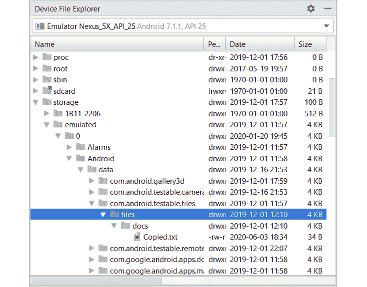

图 11.7:通过文件提供程序输出副本

1.  Let's add the logic for the `SAF` button. We will need to start an activity pointing toward the `SAF` with the `CREATE_DOCUMENT` intent in which we specify that we want to create a text file. We will then need the result of the `SAF` so we can copy the file to the location selected by the user. In `MainActivity` in `onCreateMethod`, we can add the following:

    ```kt
            findViewById<Button>(R.id.activity_main_saf)      .setOnClickListener {
                if (Build.VERSION.SDK_INT >=               Build.VERSION_CODES.KITKAT) {
                    val intent =                   Intent(Intent.ACTION_CREATE_DOCUMENT).apply {
                        addCategory(Intent.CATEGORY_OPENABLE)
                        type = "text/plain"
                        putExtra(Intent.EXTRA_TITLE, "Copied.txt")
                    }
                    startActivityForResult(intent,                   REQUEST_CODE_CREATE_DOC)
                }
            }
    ```

    前面的代码将创建一个意图，创建一个名为`Copied.txt`和`text/plain` MIME(多用途互联网邮件扩展)类型(适用于文本文件)的文档。这段代码只会在比 KitKat 更大的安卓版本中运行。

2.  现在让我们告诉活动如何处理文档创建的结果。我们将收到一个 URI 对象，其中包含用户选择的空文件。我们现在可以将文件复制到那个位置。在`MainActivity`中，我们添加`onActivityResult`，如下图:

    ```kt
        override fun onActivityResult(requestCode: Int, resultCode:       Int, data: Intent?) {
            if (requestCode == REQUEST_CODE_CREATE_DOC           && resultCode == Activity.RESULT_OK) {
                data?.data?.let { uri ->
                }
            } else {
                super.onActivityResult(requestCode, resultCode, data)
            }
        }
    ```

3.  我们现在有了 URI。我们可以给`ProviderFileManager`添加一个方法，将我们的文件复制到`uri`给定的位置:

    ```kt
        fun writeStreamFromUri(name: String, inputStream:       InputStream, uri:Uri){
            executor.execute {
                val outputStream =               context.contentResolver.openOutputStream(uri, "rw")
                IOUtils.copy(inputStream, outputStream)
            }
        }
    ```

4.  And we can invoke this method from the `onActivityResult` method of `MainActivity` like this:

    ```kt
            if (requestCode == REQUEST_CODE_CREATE_DOC           && resultCode == Activity.RESULT_OK) {
                data?.data?.let { uri ->
                    val newFileName = "Copied.txt"
                    providerFileManager.writeStreamFromUri(
                        newFileName,
                        assetFileManager.getMyAppFileInputStream(),
                        uri
                    )
                }
            }
    ```

    如果我们运行前面的代码并点击`SAF`按钮，我们将看到在*图 11.8* 中显示的输出:

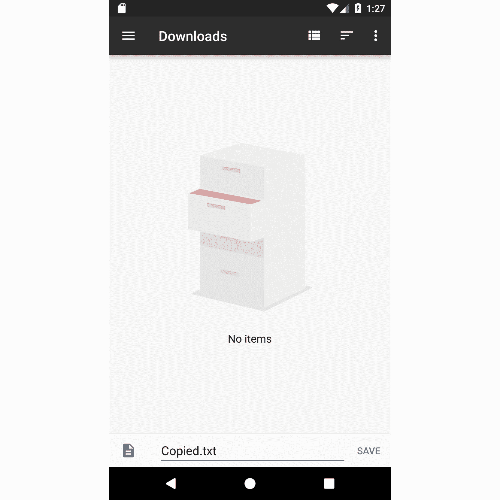

图 11.8:通过 SAF 输出副本

如果您选择保存文件，SAF 将被关闭，我们活动的`onActivityResult`方法将被调用，这将触发文件复制。之后，您可以导航安卓设备文件管理器工具，查看文件是否保存正确。

# 作用域存储

自从 Android 10 和 Android 11 的进一步更新，作用域存储的概念被引入。这背后的主要思想是允许应用程序在外部存储上获得对其文件的更多控制，并防止其他应用程序访问这些文件。这意味着`READ_EXTERNAL_STORAGE`和`WRITE_EXTERNAL_STORAGE`将只适用于用户交互的文件(如媒体文件)。这使得应用程序不愿意在外部存储上创建自己的目录，而是坚持使用已经通过`Context.getExternalFilesDir`提供给它们的目录。

文件提供者和存储访问框架是保持应用程序符合范围存储实践的好方法，因为一个允许应用程序使用`Context.getExternalFilesDir`，另一个使用内置的文件资源管理器应用程序，该应用程序现在将避免文件来自外部存储上的`Android/data`和`Android/obb`文件夹中的其他应用程序。

## 摄像机 a 第二媒体存储器

安卓提供了多种在安卓设备上与媒体互动的方式，从构建自己的相机应用程序并控制用户如何拍摄照片和视频，到使用现有的相机应用程序并指导其如何拍摄照片和视频。安卓还附带了一个`MediaStore`内容提供商，允许应用程序提取关于设置在设备上并在应用程序之间共享的媒体文件的信息。这在您想要为设备上存在的媒体文件(如照片或音乐播放器应用程序)自定义显示的情况下，以及在您使用`MediaStore.ACTION_PICK`意图从设备中选择照片并想要提取关于所选媒体图像的信息的情况下(这通常是不能使用 SAF 的旧应用程序的情况)非常有用。

为了使用现有的相机应用程序，您将需要使用`MediaStore.ACTION_IMAGE_CAPTURE`意图来启动相机应用程序以获得结果，并传递您想要保存的图像的 URI。然后用户将进入相机活动，拍摄照片，然后您处理操作的结果:

```kt
        val intent = Intent(MediaStore.ACTION_IMAGE_CAPTURE)
        intent.putExtra(MediaStore.EXTRA_OUTPUT, photoUri)
        startActivityForResult(intent, REQUEST_IMAGE_CAPTURE)
```

`photoUri`参数将代表您希望保存照片的位置。它应该指向一个扩展名为 JPEG 的空文件。您可以通过两种方式构建该文件:

*   使用`File`对象在外部存储器上创建一个文件(这需要`WRITE_EXTERNAL_STORAGE`权限)，然后使用`Uri.fromFile()`方法将其转换为`URI` -不再适用于 Android 10 及以上版本
*   Create a file in a `FileProvider` location using the `File` object and then use the `FileProvider.getUriForFile()` method to obtain the URI and grant it permissions if necessary. - the recommended approach for when your app targets Android 10 and Android 11

    注意

    同样的机制可以应用于使用`MediaStore.ACTION_VIDEO_CAPTURE`的视频。

如果您的应用程序严重依赖摄像头功能，那么您可以通过向`AndroidManifest.xml`文件添加`<uses-feature>`标签，将该应用程序从设备没有摄像头的用户中排除。您也可以将摄像机指定为非必需的，并使用`Context.hasSystemFeature(PackageManager.FEATURE_CAMERA_ANY)`方法查询摄像机是否可用。

如果您希望将文件保存在`MediaStore`中，有多种方法可以实现:

*   用你们媒体的 URI 发送一个`ACTION_MEDIA_SCANNER_SCAN_FILE`广播:

    ```kt
                val intent =               Intent(Intent.ACTION_MEDIA_SCANNER_SCAN_FILE)
           intent.data = photoUri
           sendBroadcast(intent)
    ```

*   使用媒体扫描仪直接扫描文件:

    ```kt
            val paths = arrayOf("path1", "path2")
            val mimeTypes= arrayOf("type1", "type2")
            MediaScannerConnection.scanFile(context,paths,           mimeTypes) { path, uri ->
            }
    ```

*   Insert the media into `ContentProvider` directly using `ContentResolver`:

    ```kt
            val contentValues = ContentValues()
            contentValues.put(MediaStore.Images.ImageColumns.TITLE,           "my title")
                contentValues.put(MediaStore.Images.ImageColumns               .DATE_ADDED, timeInMillis)
                contentValues.put(MediaStore.Images.ImageColumns               .MIME_TYPE, "img/*")
                contentValues.put(MediaStore.Images.ImageColumns               .DATA, "my-path")
                val newUri = contentResolver.insert(MediaStore.Video               .Media.EXTERNAL_CONTENT_URI, contentValues)
                    newUri?.let { 
                  val outputStream = contentResolver                 .openOutputStream(newUri)
                    // Copy content in outputstream
                }
    ```

    注意

    `MediaScanner` 功能不再添加安卓 10 及以上版本中`Context.getExternalFilesDir`的文件。如果应用程序选择与其他应用程序共享其媒体文件，则应该使用`insert`方法。

## 练习 11.06:拍照

我们将构建一个有两个按钮的应用程序:第一个按钮将打开相机应用程序拍摄照片，第二个按钮将打开相机应用程序录制视频。我们将使用`FileProvider`将照片保存到两个文件夹中的外部存储器(外部路径):`pictures`和`movies`。照片使用`img_{timestamp}.jpg`保存，视频使用`video_{timestamp}.mp4`保存。保存照片和视频后，您会将文件从`FileProvider`复制到`MediaStore`中，以便其他应用程序可以看到:

1.  让我们在`app/build.gradle` :

    ```kt
        implementation 'commons-io:commons-io:2.6'
        testImplementation 'org.mockito:mockito-core:2.23.0'
    ```

    中添加库
2.  我们将以安卓 11 为目标，这意味着我们需要在`app/build.gradle`

    ```kt
    ...
    compileSdkVersion 30
        defaultConfig {
            ...
            targetSdkVersion 30
            ...
        }
    ...
    ```

    中进行以下配置
3.  对于安卓 10 以下的设备，我们需要请求 WRITE_EXTERNAL_STORAGE 权限，这意味着我们需要在`AndroidManifest.xml`中进行以下操作:

    ```kt
    <uses-permission
            android:name="android.permission.WRITE_EXTERNAL_STORAGE"
            android:maxSdkVersion="28" />
    ```

4.  让我们定义一个`FileHelper`类，它将包含在`test`包中更难测试的方法:

    ```kt
    class FileHelper(private val context: Context) {
        fun getUriFromFile(file: File): Uri {
            return FileProvider.getUriForFile(context,           "com.android.testable.camera", file)
        }
        fun getPicturesFolder(): String =       Environment.DIRECTORY_PICTURES

        fun getVideosFolder(): String = Environment.DIRECTORY_MOVIES
    }
    ```

5.  让我们在`res/xml/file_provider_paths.xml`中定义我们的`FileProvider`路径。确保在`FileProvider` :

    ```kt
    <?xml version="1.0" encoding="utf-8"?>
    <paths>
        <external-path name="photos" path="Android/data       /com.android.testable.camera/files/Pictures"/>
        <external-path name="videos" path="Android/data       /com.android.testable.camera/files/Movies"/>
    </paths>
    ```

    中包含适用于您的应用程序的软件包名称
6.  让我们将文件提供程序路径添加到`AndroidManifest.xml`文件:

    ```kt
            <provider
                android:name="androidx.core.content.FileProvider"
                android:authorities="com.android.testable.camera"
                android:exported="false"
                android:grantUriPermissions="true">
                <meta-data
                    android:name="android.support                   .FILE_PROVIDER_PATHS"
                    android:resource="@xml/file_provider_paths" />
            </provider>
    ```

7.  现在让我们定义一个模型，它将保存文件的`Uri`和相关路径:

    ```kt
    data class FileInfo(
        val uri: Uri,
        val file: File,
        val name: String,
        val relativePath:String,
        val mimeType:String
    )
    ```

8.  Let's create a `ContentHelper` class which will provide us with data required for the `ContentResolver`. We will define two methods for accessing the Photo and Video content Uri and two methods that will create the `ContentValues`. We do this because of the static methods required to obtain Uris and the `ContentValues` creation which makes this functionality hard to test. The code below is truncated for space. The full code you need to add can be found via the link below.

    MediaContentHelper.kt

    ```kt
    7    class MediaContentHelper {
    8
    9        fun getImageContentUri(): Uri =
    10            if (android.os.Build.VERSION.SDK_INT >=                 android.os.Build.VERSION_CODES.Q) {
    11                MediaStore.Images.Media.getContentUri                     (MediaStore.VOLUME_EXTERNAL_PRIMARY)
    12            } else {
    13                MediaStore.Images.Media.EXTERNAL_CONTENT_URI
    14            }
    15
    16        fun generateImageContentValues(fileInfo: FileInfo)             = ContentValues().apply {
    17            this.put(MediaStore.Images.Media
                         .DISPLAY_NAME, fileInfo.name)
    18        if (android.os.Build.VERSION.SDK_INT >= 
                    android.os.Build.VERSION_CODES.Q) {
    19                this.put(MediaStore.Images.Media                     .RELATIVE_PATH, fileInfo.relativePath)
    20        }
    21        this.put(MediaStore.Images.Media             .MIME_TYPE, fileInfo.mimeType)
    22    }
    ```

    这一步的完整代码可以在[http://packt.live/3ivwekp](http://packt.live/3ivwekp)找到。

9.  Now, let's create the `ProviderFileManager` class, where we will define methods to generate files for photos and videos that will then be used by the camera and the methods that will save to the media store. Again, the code has been truncated for brevity. Please see the link below for the full code that you need to use:

    ProviderFileManager.kt

    ```kt
    12    class ProviderFileManager(
    13        private val context: Context,
    14        private val fileHelper: FileHelper,
    15        private val contentResolver: ContentResolver,
    16        private val executor: Executor,
    17        private val mediaContentHelper: MediaContentHelper
    18    ) {
    19
    20        fun generatePhotoUri(time: Long): FileInfo {
    21            val name = "img_$time.jpg"
    22            val file = File(
    23                context.getExternalFilesDir(fileHelper                     .getPicturesFolder()),
    24                name
    25            )
    26            return FileInfo(
    27                fileHelper.getUriFromFile(file),
    28                file,
    29                name,
    30                fileHelper.getPicturesFolder(),
    31                "img/jpeg"
    32            )
    33        }
    ```

    这一步的完整代码可以在[http://packt.live/2XXB9Bu](http://packt.live/2XXB9Bu)找到。

    请注意我们如何将根文件夹定义为`context.getExternalFilesDir(Environment.DIRECTORY_PICTURES)`和`context.getExternalFilesDir(Environment.DIRECTORY_MOVIES)`。这将连接到`file_provider_paths.xml`，它将在外部存储的应用程序专用文件夹中创建一组名为`Movies`和`Pictures`的文件夹。`insertToStore`方法是将文件复制到`MediaStore`中。首先，我们将在该存储中创建一个条目，为该条目提供一个 Uri。接下来，我们将文件内容从`FileProvider`生成的 Uri 复制到指向`MediaStore`条目的`OutputStream`中。

10.  Let's define the layout for our activity in `res/layout/activity_main.xml`:

    activity_main.xml

    ```kt
    10    <Button
    11        android:id="@+id/photo_button"
    12        android:layout_width="wrap_content"
    13        android:layout_height="wrap_content"
    14        android:text="@string/photo" />
    15
    16    <Button
    17        android:id="@+id/video_button"
    18        android:layout_width="wrap_content"
    19        android:layout_height="wrap_content"
    20        android:layout_marginTop="5dp"
    21        android:text="@string/video" />
    ```

    这一步的完整代码可以在[http://packt.live/3qDSyLU](http://packt.live/3qDSyLU)找到。

11.  Let's create the `MainActivity` class where we will check if we need to request the WRITE_STORAGE_PERMISSION, request it if we need to and after it was granted open the camera to take a photo or a video. As above, code has been truncated for brevity. You can access the full code using the link shown:

    MainActivity.kt 公司

    ```kt
    14    class MainActivity : AppCompatActivity() {
    15 
    16        companion object {
    17
    18            private const val REQUEST_IMAGE_CAPTURE = 1
    19            private const val REQUEST_VIDEO_CAPTURE = 2
    20            private const val REQUEST_EXTERNAL_STORAGE = 3
    21        }
    22
    23        private lateinit var providerFileManager:             ProviderFileManager
    24        private var photoInfo: FileInfo? = null
    25        private var videoInfo: FileInfo? = null
    26        private var isCapturingVideo = false
    27
    28        override fun onCreate(savedInstanceState: Bundle?) {
    29            super.onCreate(savedInstanceState)
    30            setContentView(R.layout.activity_main)
    31            providerFileManager =
    32                ProviderFileManager(
    33                    applicationContext,
    34                    FileHelper(applicationContext),
    35                    contentResolver,
    36                    Executors.newSingleThreadExecutor(),
    37                    MediaContentHelper()
    38                )
    ```

    这一步的完整代码可以在[http://packt.live/3ivUTpm](http://packt.live/3ivUTpm)找到。

    如果我们执行前面的代码，我们将看到以下内容:

    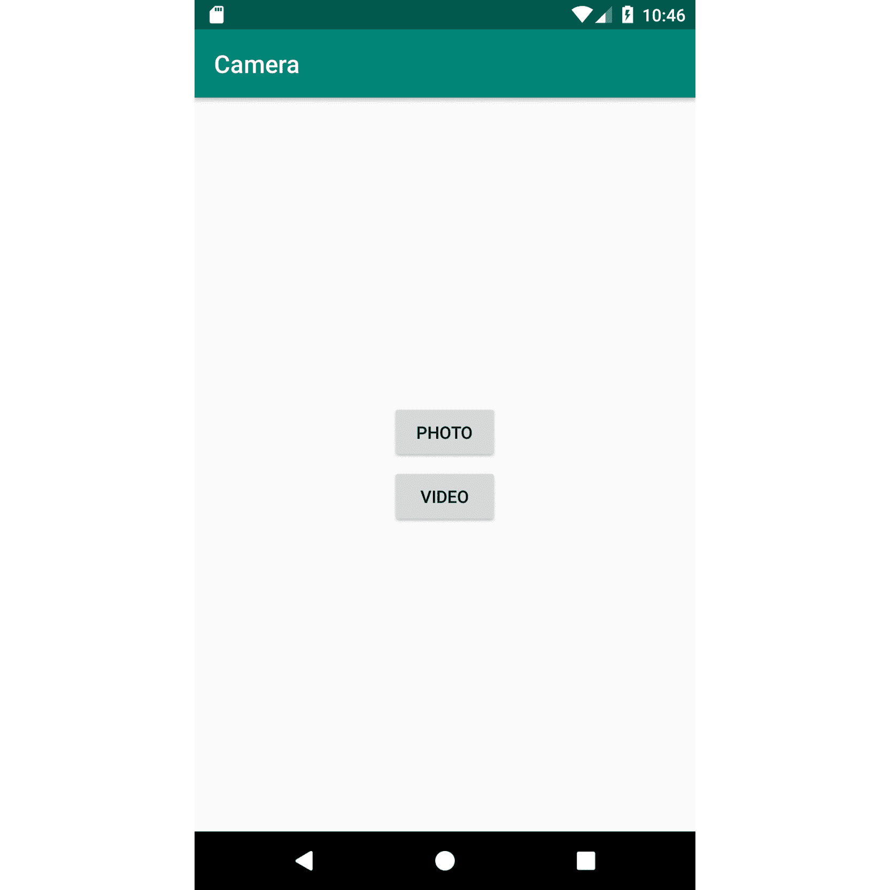

    图 11.9:练习 11.06 的输出

12.  By clicking on either of the buttons, you will be redirected to the camera application where you can take a photo or a video if you are running the example on Android 10 and above. If you're running on lower Android versions then the permissions will be asked first. Once you have taken your photo and confirmed it, you will be taken back to the application. The photo will be saved in the location you defined in `FileProvider`:

    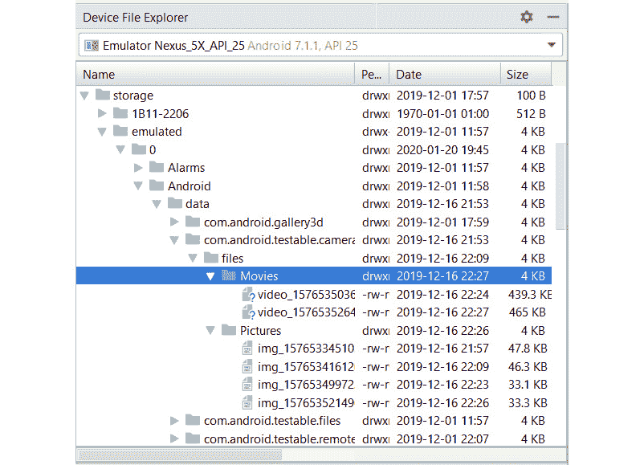

    图 11.10:通过相机应用程序捕获的文件的位置

    在前面的截图中，您可以在AndroidStudio设备文件浏览器的帮助下看到文件的位置。

13.  Modify `MainActivity` and add the `onActivityResult` method to trigger the save of the files to the MediaStore:

    ```kt
        override fun onActivityResult(requestCode: Int,       resultCode: Int, data: Intent?) {
            when (requestCode) {
                REQUEST_IMAGE_CAPTURE -> {
                    providerFileManager.insertImageToStore(photoInfo)
                }
                REQUEST_VIDEO_CAPTURE -> {
                    providerFileManager.insertVideoToStore(videoInfo)
                }
                else -> {
                    super.onActivityResult(requestCode,                   resultCode, data)
                }
            }
        }
    ```

    如果您打开任何文件浏览应用程序，如“文件”应用程序或图库或谷歌照片应用程序，您将能够看到拍摄的视频和图片。

    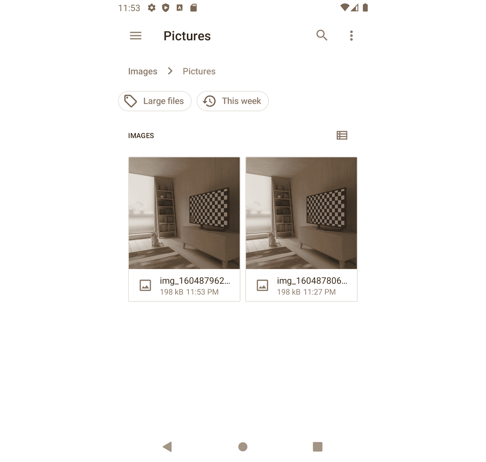

图 11.11:文件浏览器应用程序中的文件

## 活动 1 1.01:狗下载器

您的任务是构建一个应用程序，该应用程序将针对 API 21 以上的安卓版本，将显示狗照片的网址列表。您将连接到的网址是`https://dog.ceo/api/breed/houimg/random/{number}`，其中`number`将通过设置屏幕进行控制，用户可以选择他们想要显示的网址数量。设置屏幕将通过主屏幕上显示的选项打开。当用户点击一个网址时，图像将被本地下载到应用程序的外部缓存路径中。下载图像时，用户会看到一个不确定的进度条。网址列表将使用房间保存在本地。

将使用的技术如下:

*   改装用于检索网址列表和下载文件
*   保留网址列表的空间
*   `SharedPreferences`和`PreferencesFragment`用于存储要检索的网址数量
*   `FileProvider`用于将文件存储在缓存中
*   用于编写文件的 Apache IO
*   用于组合所有数据源的存储库
*   `LiveData`和`ViewModel`用于处理来自用户的逻辑
*   `RecyclerView`为项目列表

JSON 的响应看起来类似于这样:

```kt
{
    "message": [
        "https://images.dog.ceo/breeds/hound-          afghan/n02088094_4837.jpg",
        "https://images.dog.ceo/breeds/hound-          basset/n02088238_13908.jpg",
        "https://images.dog.ceo/breeds/hound-          ibizan/n02091244_3939.jpg"
    ],
    "status": "success"
}
```

执行以下步骤完成本活动:

1.  创建一个包含网络相关类的`api`包。
2.  创建一个将对响应 JSON 建模的数据类。
3.  创建一个包含两种方法的改装`Service`类。第一个方法将表示返回品种列表的 API 调用，第二个方法将表示下载文件的 API 调用。
4.  创建一个`storage`包，并在`storage`包内创建一个`room`包。
5.  创建`Dog`实体，它将包含一个自动生成的标识和一个网址。
6.  创建`DogDao`类，包含插入`Dogs`列表、删除所有`Dogs`和查询所有`Dogs`的方法。`delete`方法是必需的，因为应用编程接口模型没有任何唯一的标识符。
7.  在`storage`包内，创建一个`preference`包。
8.  在`preference`包中，围绕`SharedPreferences`创建一个包装类，它将返回我们需要使用的 URL 数量。默认为`10`。
9.  在`res/xml`中，为`FileProvider`定义你的文件夹结构。文件应保存在`external-cache-path`标签的根文件夹中。
10.  在`storage`包内，创建一个`filesystem`包。
11.  在`filesystem`包中，使用`Context.externalCacheDir`定义一个负责将`InputStream`写入`FileProvider`文件的类。
12.  创建`repository`包。
13.  在`repository`包中，创建一个密封的类来保存应用编程接口调用的结果。密封类的子类是`Success`、`Error`和`Loading`。
14.  定义一个`Repository`界面，该界面将包含两种方法，一种是加载网址列表，另一种是下载文件。
15.  定义一个`DogUi`模型类，该类将在应用程序的用户界面层中使用，并将在您的存储库中创建。
16.  定义一个映射器类，它将把你的应用编程接口模型转换成实体，把实体转换成用户界面模型。
17.  为`Repository`定义一个实现，它将实现前面两个方法。存储库将保存对`DogDao`、改装`Service`类、`Preferences`包装器类、管理文件的类、`Dog`映射类和用于多线程的`Executor`类的引用。下载文件时，我们将使用从网址中提取的文件名。
18.  创建一个将扩展`Application`的类，它将初始化存储库。
19.  定义你的用户界面使用的`ViewModel`，它会引用`Repository`并调用`Repository`来加载网址列表和下载图片。
20.  定义您的用户界面，它将由两个活动组成:
    *   该活动将显示网址列表，并有点击动作来开始下载。此活动将有一个进度条，在下载时显示。该屏幕还将有一个`Settings`选项，该选项将打开设置屏幕。
    *   The Settings activity, which will display one setting indicating the number of URLs to load.

        注意

        这个活动的解决方案可以在:[http://packt.live/3sKj1cp](11.html)找到

# 总结

在这一章中，我们已经分析了在 Android 中持久化数据的不同方式，以及如何通过存储库模式来集中它们。我们从模式本身开始，看看如何通过组合 Room 和 refughting 来组织数据源。

然后，当涉及到持久化数据时，我们继续分析 Room 的替代方案。我们首先看了`SharedPreferences`以及当数据是键值格式并且数据量很小时，它们如何构成数据持久性的便捷解决方案。然后我们研究了如何使用`SharedPreferences`将数据直接保存在设备上，然后我们研究了`PreferenceFragments`以及如何使用它们来接收用户输入并将其存储在本地。

接下来，我们研究了安卓框架中不断变化的东西。这是关于文件系统的抽象的发展。我们首先概述了安卓拥有的存储类型，然后更深入地研究了两个抽象概念:`FileProvider`，如果需要，您的应用程序可以使用它在设备上存储文件并与其他人共享，以及 SAF，它可以用于将文件保存在设备上用户选择的位置。

我们还利用`FileProvider`的优势为文件生成 URIs，以便使用相机应用程序拍摄照片和录制视频，并将它们保存在应用程序的文件中，同时也将它们添加到`MediaStore`中。

本章中执行的活动结合了上面讨论的所有元素，以说明即使您必须在应用程序中平衡多个源，您也可以用一种更易读的方式来完成。

请注意，对于本章和上一章中的活动和练习，我们一直不得不使用应用程序类来实例化数据源。在下一章中，您将学习如何通过依赖注入来克服这一点，并了解它如何使安卓应用程序受益。*