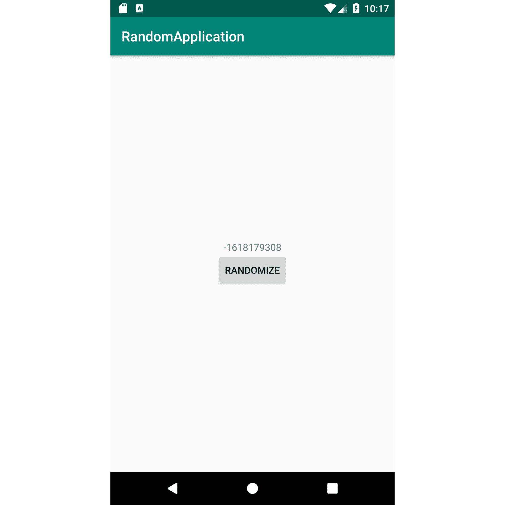
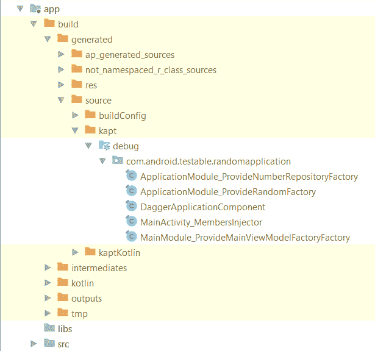
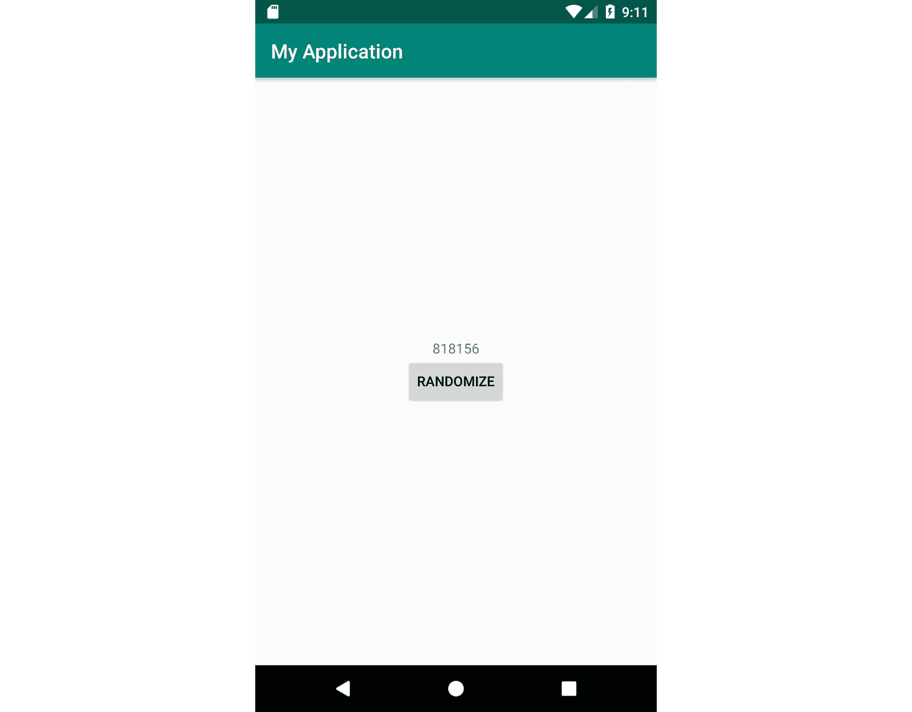
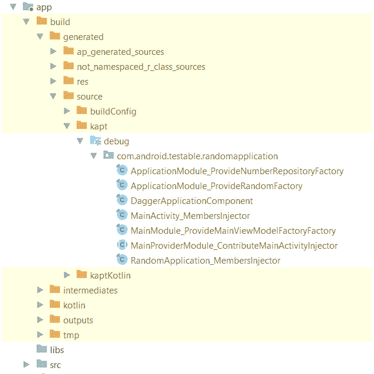
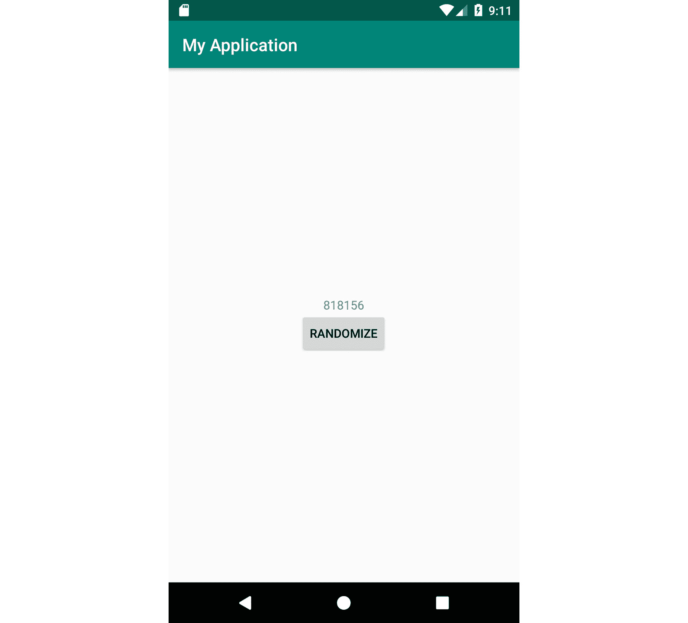

# 12 时。匕首和锦鲤的依赖注入

概观

本章介绍依赖注入的概念以及它给安卓应用程序带来的好处。我们将看看如何在容器类的帮助下手动执行依赖注入。我们还将介绍 Android、Java 和 Kotlin 可用的一些框架，这些框架可以帮助开发人员应用这个概念。到本章结束时，您将能够使用 Dagger 和 Koin 来管理应用程序的依赖关系，并且您将知道如何高效地组织它们。

# 简介

在前一章中，我们研究了如何将代码组织成不同的组件，包括视图模型、存储库、应用编程接口组件和持久性组件。总是出现的困难之一是所有这些组件之间的依赖性，尤其是当涉及到我们如何为它们进行单元测试时。

我们一直使用`Application`类来创建这些组件的实例，并将它们传递给上面一层组件的构造器(我们创建了应用编程接口和房间实例，然后是存储库实例，等等)。我们所做的是依赖注入的简单版本。

**依赖注入** ( **DI** )是一种软件技术，其中一个对象(应用程序)提供另一个对象(存储库，`ViewModels`)的依赖。这样做的原因是为了增加代码的可重用性和可测试性，并将创建实例的责任从我们的组件转移到`Application`类。DI 的好处之一在于如何跨代码库创建对象。DI 将对象的创建和使用分开。换句话说，一个对象不应该关心另一个对象是如何创建的；它应该只关注与其他对象的交互。

在本章中，我们将分析如何在安卓中注入依赖关系的三种方式:手动 DI、匕首和 Koin。

**手动 DI** 是一种开发人员通过创建容器类来手动处理 DI 的技术。在这一章中，我们将研究如何在安卓系统中做到这一点。通过研究我们如何手动管理依赖关系，我们将对其他 DI 框架如何运行有所了解，并为我们如何集成这些框架奠定基础。

**匕首**是为 Java 开发的阿迪框架。它允许你将你的依赖项分组到不同的**模块**中。您还可以定义**组件**，其中添加了模块以创建依赖图，以及匕首自动实现哪个组件以执行注入。它依赖注释处理器来生成执行注入所需的代码。

**Koin** 是为 Kotlin 开发的轻量级 DI 库。它不依赖注释处理器；它依靠科特林的机制来执行注射。在这里，我们还可以将依赖关系拆分成**模块**。

在接下来的内容中，我们将探索这两个库是如何工作的，以及将它们添加到一个简单的安卓应用程序所需的步骤。

# 手册

为了理解 DI 是如何工作的，我们可以首先分析如何在整个安卓应用程序中手动将依赖关系注入不同的对象。这可以通过创建容器对象来实现，这些对象将包含整个应用程序所需的依赖关系。您还可以创建多个容器来表示应用程序所需的不同范围。在这里，您可以定义仅在显示特定屏幕时才需要的依赖关系，并且当屏幕被破坏时，实例也可以被垃圾收集。

此处显示了一个容器示例，只要应用程序存在，该容器就会保存实例:

```kt
class AppContainer(applicationContext:Context) {
    val myRepository: MyRepository
    init {
        val retrofit =           Retrofit.Builder().baseUrl("https://google.com/").build()
        val myService=           retrofit.create<MyService>(MyService::class.java)
        val database = Room.databaseBuilder(applicationContext,           MyDatabase::class.java, "db").build()
        myRepository = MyRepositoryImpl(myService, database.myDao())
    }
}
```

使用该容器的`Application`类如下所示:

```kt
class MyApplication : Application() {
    lateinit var appContainer: AppContainer
    override fun onCreate() {
        super.onCreate()
        appContainer = AppContainer(this)
    }
}
```

正如您在前面的例子中所看到的，创建依赖关系的责任从`Application`类转移到了`Container`类。代码库中的活动仍然可以使用以下命令访问依赖项:

```kt
    override fun onCreate(savedInstanceState: Bundle?) {
        .... 
        val myRepository = (application as           MyApplication).appContainer. myRepository
        ...
}
```

范围有限的模块可以用于创建`ViewModel`工厂之类的事情，而这些工厂又被框架用来创建`ViewModel`:

```kt
class MyContainer(private val myRepository: MyRepository) {
    fun geMyViewModelFactory(): ViewModelProvider.Factory {
        return object : ViewModelProvider.Factory {
            override fun <T : ViewModel?> create(modelClass:               Class<T>): T {
                return MyViewModel(myRepository) as T
            }
        }
    }
}
```

活动或片段可以使用这个特定的容器来初始化`ViewModel`:

```kt
class MyActivity : AppCompatActivity() {
    private lateinit var myViewModel: MyViewModel
    private lateinit var myContainer: MyContainer
    override fun onCreate(savedInstanceState: Bundle?) {
        super.onCreate(savedInstanceState)
        ....
        val myRepository = (application as           MyApplication).appContainer. myRepository
        myContainer = MyContainer (myRepository)
        myViewModel = ViewModelProvider(this,           myContainer.geMyViewModelFactory())            .get(MyViewModel::class.java)
    }
}
```

同样，我们在这里看到创建`Factory`类的责任从`Activity`类转移到了`Container`类。`MyContainer`可以扩展以提供`MyActivity`要求的实例，如果这些实例的生命周期应该与活动相同，或者构造函数可以扩展以提供具有不同生命周期的实例。

现在，让我们把这些例子应用到一个练习中。

## 练习 12.01:手动注射

在本练习中，我们将编写一个应用手动 DI 概念的安卓应用程序。该应用程序将有一个存储库，该存储库将生成一个随机数和一个带有`LiveData`对象的`ViewModel`对象，该对象负责检索存储库生成的数字并将其发布到`LiveData`对象中。为此，我们需要创建两个容器来管理以下依赖关系:

*   贮藏室ˌ仓库
*   一个`ViewModel`工厂负责创建`ViewModel`

每次点击按钮时，应用程序本身都会显示随机生成的数字:

1.  让我们从将`ViewModel`和`LiveData`库添加到`app/build.gradle`文件开始:

    ```kt
        implementation "androidx.lifecycle:lifecycle-      extensions:2.2.0"
    ```

2.  接下来，让我们编写一个`NumberRepository`接口，它将包含一个检索整数的方法:

    ```kt
    interface NumberRepository {
        fun generateNextNumber(): Int
    }
    ```

3.  现在，我们将为此提供实现。我们可以使用`java.util.Random`类生成一个随机数:

    ```kt
    class NumberRepositoryImpl(private val random: Random) :   NumberRepository {
        override fun generateNextNumber(): Int {
            return random.nextInt()
        }
    }
    ```

4.  我们现在将进入`MainViewModel`类，它将包含一个`LiveData`对象，该对象包含从存储库中生成的每个编号:

    ```kt
    class MainViewModel(private val numberRepository:   NumberRepository) : ViewModel() {
        private val numberLiveData = MutableLiveData<Int>()
        fun getLiveData(): LiveData<Int> = numberLiveData
        fun generateNextNumber() {
            numberLiveData.postValue(numberRepository           .generateNextNumber())
        }
    }
    ```

5.  接下来，让我们继续创建我们的用户界面，包含用于显示数字的`TextView`和用于生成下一个随机数的`Button`。这将是`res/layout/activity_main.xml`文件的一部分:

    ```kt
    <?xml version="1.0" encoding="utf-8"?>
    <LinearLayout xmlns:android="http://schemas.android.com/apk/res/android"
        android:layout_width="match_parent"
        android:layout_height="match_parent"
        android:gravity="center"
        android:orientation="vertical">
        <TextView
            android:id="@+id/activity_main_text_view"
            android:layout_width="wrap_content"
            android:layout_height="wrap_content" />
        <Button
            android:id="@+id/activity_main_button"
            android:layout_width="wrap_content"
            android:layout_height="wrap_content"
            android:text="@string/randomize" />
    </LinearLayout>
    ```

6.  确保将按钮的字符串添加到`res/values/strings.xml`文件中:

    ```kt
       <string name="randomize">Randomize</string>
    ```

7.  现在让我们创建`MainActivity`类，负责呈现前面的 UI:

    ```kt
    class MainActivity : AppCompatActivity() {
        override fun onCreate(savedInstanceState: Bundle?) {
            super.onCreate(savedInstanceState)
            setContentView(R.layout.activity_main)
        }
    }
    ```

8.  现在，让我们创建我们的`Application`类:

    ```kt
    class RandomApplication : Application() {
        override fun onCreate() {
            super.onCreate()
        }
    }
    ```

9.  让我们也将`Application`类添加到`application`标签中的`AndroidManifest.xml`文件中:

    ```kt
        <application
            ...
            android:name=".RandomApplication"
    .../>
    ```

10.  现在，让我们创建第一个负责管理`NumberRepository`依赖关系的容器:

    ```kt
    class ApplicationContainer {
        val numberRepository: NumberRepository =       NumberRepositoryImpl(Random())
    }
    ```

11.  让我们将这个容器添加到`RandomApplication`类中:

    ```kt
    class RandomApplication : Application() {
        val applicationContainer = ApplicationContainer()
        override fun onCreate() {
            super.onCreate()
        }
    }
    ```

12.  我们现在继续创建`MainContainer`，这将需要对`NumberRepository`依赖项的引用，并将为创建`MainViewModel`所需的`ViewModel`工厂提供依赖项:

    ```kt
    class MainContainer(private val numberRepository:   NumberRepository) {
        fun getMainViewModelFactory(): ViewModelProvider.Factory {
            return object : ViewModelProvider.Factory {
                override fun <T : ViewModel?> create(modelClass:               Class<T>): T {
                    return MainViewModel(numberRepository) as T
                }
            }
        }
    }
    ```

13.  最后，我们可以修改`MainActivity`从我们的容器中注入我们的依赖项，并连接 UI 元素，以便显示输出:

    ```kt
    class MainActivity : AppCompatActivity() {
        override fun onCreate(savedInstanceState: Bundle?) {
            super.onCreate(savedInstanceState)
            setContentView(R.layout.activity_main)
            val mainContainer = MainContainer((application as           RandomApplication).applicationContainer             .numberRepository)
     val viewModel = ViewModelProvider(this,           mainContainer.getMainViewModelFactory())            .get(MainViewModel::class.java)
            viewModel.getLiveData().observe(this, Observer {
                findViewById<TextView>              (R.id.activity_main_text_view).text = it.toString()
            }
            )
            findViewById<TextView>(R.id.activity_main_button)          .setOnClickListener {
                viewModel.generateNextNumber()
            }
        }
    }
    ```

14.  在高亮显示的代码中，我们可以看到我们正在使用`ApplicationContainer`中定义的存储库，并将其注入`MainContainer`，然后通过`ViewModelProvider.Factory`将其注入`ViewModel`。前面的例子应该呈现在*图 12.1* 中的输出:



图 12.1:练习 12.01 的模拟器输出显示了一个随机生成的数字

在应用程序很小的情况下，手动 DI 是一种设置依赖关系的简单方法，但是随着应用程序的增长，这可能会变得极其困难。想象一下，如果在*练习 12.01* 、*手动注射*中，我们有两个从`NumberRepository`延伸出来的课程。我们将如何处理这种情况？开发人员如何知道哪个人参加了什么活动？这些类型的问题在谷歌 Play 上大多数知名应用中变得非常普遍，这就是为什么很少使用手动 DI。使用时，它可能会采用阿迪框架的形式，类似于我们接下来将看到的形式。

# D agger

D agger 提供了一种综合的方法来组织应用程序的依赖关系。它的优势在于，在 Kotlin 推出之前，首先被开发者社区采用在安卓系统上。这也是很多安卓应用使用 Dagger 作为其 DI 框架的原因之一。该框架的另一个优势是针对用 Java 编写的安卓项目，因为该库是用相同的语言开发的。该框架最初由 Square(匕首 1)开发，后来过渡到谷歌(匕首 2)。我们将在本章中介绍匕首 2，并描述它的优点。匕首 2 提供的一些关键功能如下:

*   注射
*   模块中分组的依赖关系
*   用于生成依赖图的组件
*   预选赛
*   领域
*   子组件

注释是处理 Dagger 时的关键元素，因为它通过注释处理器生成执行 DI 所需的代码。主要注释可分为以下几类:

*   **提供者**:用`@Module`标注的类负责提供一个可以注入的对象(依赖对象)。
*   **消费者**:注释`@Inject`用于定义依赖关系。
*   **连接器**:带注释的接口定义了提供者和消费者之间的连接。

为了将匕首添加到您的项目中，在`app/build.gradle`文件中，您将需要以下依赖项:

```kt
implementation 'com.google.dagger:dagger:2.29.1' 
kapt 'com.google.dagger:dagger-compiler:2.29.1'
```

由于我们处理的是注释处理器，在同一个`build.gradle`文件中，您需要为它们添加插件:

```kt
apply plugin: 'com.android.application'
apply plugin: 'kotlin-android'
apply plugin: 'kotlin-kapt'
```

## 消费者

匕首使用`javax.inject.Inject`识别需要注射的物体。注入依赖项有多种方法，但推荐的方法是通过构造函数注入和字段注入。构造函数注入类似于下面的代码:

```kt
import javax.inject.Inject
class ClassA @Inject constructor()
class ClassB @Inject constructor(private val classA: ClassA)
```

当构造函数用`@Inject`标注时，Dagger 将生成`Factory`类，负责实例化对象。在`ClassB`的例子中，Dagger 将尝试找到适合构造函数签名的适当依赖项，在这个例子中，构造函数是`ClassA`，Dagger 已经为它创建了一个实例。

如果您不想让 Dagger 管理`ClassB`的实例化，但仍然对注入的`ClassA`有依赖性，您可以使用字段注入，它看起来像这样:

```kt
import javax.inject.Inject
class ClassA @Inject constructor()
class ClassB {
    @Inject
    lateinit var classA: ClassA
}
```

在这种情况下，Dagger 将生成必要的代码，只是为了注入`ClassB`和`ClassA`之间的依赖关系。

## 提供商

您会发现自己处于应用程序使用外部依赖关系的情况。这意味着您将无法通过构造函数注入来提供实例。另一种不可能注入构造函数的情况是使用接口或抽象类时。在这种情况下，匕首提供了使用`@Provides`注释提供实例的可能性。然后，您需要将提供实例的方法分组到用`@Module`注释的模块中:

```kt
import dagger.Module
import dagger.Provides
class ClassA
class ClassB(private val classA: ClassA)
@Module
object MyModule {
    @Provides
    fun provideClassA(): ClassA = ClassA()
    @Provides
    fun provideClassB(classA: ClassA): ClassB = ClassB(classA)
}
```

如前例所示，`ClassA`和`ClassB`没有任何匕首标注。创建了一个模块，该模块将为`ClassA`提供实例，然后将用于为`ClassB`提供实例。在这种情况下，匕首将为每个带注释的方法生成一个`Factory`类。

## 连接器

假设我们将有多个模块，我们需要将它们组合成一个依赖图，可以在整个应用程序中使用。匕首提供了`@Component`注释。这通常用于将由 Dagger 实现的接口或抽象类。除了组装依赖图之外，组件还提供了添加方法的功能，以将依赖注入到某个对象的成员中。在组件中，您可以指定提供方法来返回模块中提供的依赖项:

```kt
import dagger.Component
@Component(modules = [MyModule::class])
interface MyComponent {
 fun inject(myApplication: MyApplication)
}
```

对于前面的`Component`，Dagger 将生成一个`DaggerMyComponent`类，我们可以按照下面的代码来构建它:

```kt
import android.app.Application
import javax.inject.Inject
class MyApplication : Application() {
    @Inject
    lateinit var classB: ClassB
    override fun onCreate() {
        super.onCreate()
        val component = DaggerMyComponent.create()
        //needs to build the project once to generate 
        //DaggerMyComponent.class
        component.inject(this)
    }
}
```

`Application`类将创建匕首依赖图和组件。`Component`中的`inject`方法允许我们对用`@Inject`注释的`Application`类中的变量执行 DI，从而允许我们访问模块中定义的`ClassB`对象。

## 限定词

如果希望提供同一个类的多个实例(例如在应用程序中注入不同的字符串或整数)，可以使用限定符。这些注释可以帮助您识别实例。最常见的一种是`@Named`限定词，如以下代码所述:

```kt
@Module
object MyModule {
    @Named("classA1")
    @Provides
    fun provideClassA1(): ClassA = ClassA()
    @Named("classA2")
    @Provides
    fun provideClassA2(): ClassA = ClassA()
    @Provides
    fun provideClassB(@Named("classA1") classA: ClassA): ClassB =       ClassB(classA)
}
```

在这个例子中，我们创建了两个`ClassA`的实例，并给它们起了不同的名字。然后我们尽可能使用第一个实例来创建`ClassB`。我们还可以创建自定义限定符来代替`@Named`注释，如以下代码所述:

```kt
import javax.inject.Qualifier
@Qualifier
@MustBeDocumented
@kotlin.annotation.Retention(AnnotationRetention.RUNTIME)
annotation class ClassA1Qualifier
@Qualifier
@MustBeDocumented
@kotlin.annotation.Retention(AnnotationRetention.RUNTIME)
annotation class ClassA2Qualifier
```

模块可以这样更新:

```kt
@Module
object MyModule {
    @ClassA1Qualifier
    @Provides
    fun provideClassA1(): ClassA = ClassA()
    @ClassA2Qualifier
    @Provides
    fun provideClassA2(): ClassA = ClassA()
    @Provides
    fun provideClassB(@ClassA1Qualifier classA: ClassA): ClassB =       ClassB(classA)
}
```

## 示波器

如果您想跟踪组件的生命周期和依赖关系，可以使用范围。匕首提供了一个`@Singleton`范围。这通常表明您的组件将和您的应用程序一样长久。范围对对象的生命周期没有影响；它们的构建是为了帮助开发人员识别对象的生命周期。建议给组件一个作用域，并将代码分组以反映该作用域。安卓上一些常见的匕首范围与活动或片段相关:

```kt
import javax.inject.Scope
@Scope
@MustBeDocumented
@kotlin.annotation.Retention(AnnotationRetention.RUNTIME)
annotation class ActivityScope
@Scope
@MustBeDocumented
@kotlin.annotation.Retention(AnnotationRetention.RUNTIME)
annotation class FragmentScope
```

注释可以用在提供依赖关系的模块中:

```kt
    @ActivityScope
    @Provides
    fun provideClassA(): ClassA = ClassA()
```

`Component`的代码如下:

```kt
@ActivityScope
@Component(modules = [MyModule::class])
interface MyComponent {
}
```

前面的例子表明`Component`只能使用相同范围的对象。如果属于这个`Component`的任何模块包含不同范围的依赖项，匕首将抛出一个错误，表明范围有问题。

## 子组件

与范围密切相关的是子组件。它们允许您为更小的范围组织依赖关系。安卓上一个常见的用例是为活动和片段创建子组件。子组件从父组件继承依赖关系，并为子组件的范围生成新的依赖关系图。

假设我们有一个单独的模块:

```kt
class ClassC
@Module
object MySubcomponentModule {
    @Provides
    fun provideClassC(): ClassC = ClassC()
}
```

将为该模块生成依赖图的`Subcomponent`看起来如下所示:

```kt
import dagger.Subcomponent
@ActivityScope
@Subcomponent(modules = [MySubcomponentModule::class])
interface MySubcomponent {
    fun inject(mainActivity: MainActivity)
}
```

父组件需要声明新组件，如下面的代码片段所示:

```kt
import dagger.Component
@Component(modules = [MyModule::class])
interface MyComponent {
    fun inject(myApplication: MyApplication)
    fun createSubcomponent(mySubcomponentModule:       MySubcomponentModule): MySubcomponent
}
```

您可以将`ClassC`注入到您的活动中，如下所示:

```kt
@Inject
    lateinit var classC: ClassC
     override fun onCreate(savedInstanceState: Bundle?) {
        super.onCreate(savedInstanceState)
 (application as MyApplication).component           .createSubcomponent(MySubcomponentModule).inject(this)
}
```

有了这些知识，让我们继续练习。

## 练习 12.02:匕首注射

在本练习中，我们将编写一个安卓应用程序，该应用程序将使用匕首应用 DI 的概念。该应用将具有在*练习 12.01* 、*手动注射*中定义的相同`Repository`和`ViewModel`。我们将需要使用 Dagger 来公开相同的两个依赖项:

*   `Repository`:这将有`@Singleton`范围，由`ApplicationModule`提供。现在，`ApplicationModule`将作为`ApplicationComponent`的一部分曝光。
*   `ViewModelProvider.Factory`:这将有一个名为`MainScope`的自定义范围，由`MainModule`提供。现在，`MainModule`将被`MainSubComponent`曝光。另外，`MainSubComponent`将由`ApplicationComponent`生成。

每次点击按钮时，应用程序本身都会显示一个随机生成的数字:

1.  让我们从将匕首和**视图模型**库添加到`app/build.gradle`文件开始:

    ```kt
        implementation 'com.google.dagger:dagger:2.29.1'
        kapt 'com.google.dagger:dagger-compiler:2.29.1'
        implementation "androidx.lifecycle:lifecycle-      extensions:2.2.0"
    ```

2.  我们还需要`app/build.gradle`模块中的`kapt`插件。附上如下所示的插件:

    ```kt
    apply plugin: 'kotlin-kapt'
    ```

3.  我们现在需要添加`NumberRepository`、`NumberRepositoryImpl`、`MainViewModel`和`RandomApplication`类，并用`MainActivity`构建我们的用户界面。这可以从*练习 12.01* 、*手动注射*开始，按照*步骤 2-9* 进行。
4.  现在，让我们进入`ApplicationModule`，它将提供`NumberRepository`依赖:

    ```kt
    @Module
        class ApplicationModule {
            @Provides
            fun provideRandom(): Random = Random()
            @Provides
            fun provideNumberRepository(random: Random):           NumberRepository = NumberRepositoryImpl(random)
    }
    ```

5.  现在，让我们创建`MainModule`，它将提供`ViewModel.Factory`的实例:

    ```kt
    @Module
    class MainModule {

        @Provides
        fun provideMainViewModelFactory(numberRepository:       NumberRepository): ViewModelProvider.Factory {
            return object : ViewModelProvider.Factory {
                override fun <T : ViewModel?> create(modelClass:               Class<T>): T {
                    return MainViewModel(numberRepository) as T
                }
            }
        }
    }
    ```

6.  现在，让我们创建`MainScope`:T1
7.  我们需要`MainSubcomponent`，它将使用前面的范围:

    ```kt
    @MainScope
    @Subcomponent(modules = [MainModule::class])
    interface MainSubcomponent {
        fun inject(mainActivity: MainActivity)
    }
    ```

8.  接下来，我们将要求`ApplicationComponent` :

    ```kt
    @Singleton
    @Component(modules = [ApplicationModule::class])
    interface ApplicationComponent {
        fun createMainSubcomponent(): MainSubcomponent
    }
    ```

9.  我们将需要导航到`Build`并点击安卓工作室中的`Rebuild project`，以便我们生成用于执行 DI 的匕首代码。
10.  接下来，我们修改`RandomApplication`类，以便添加初始化匕首依赖图所需的代码:

    ```kt
    class RandomApplication : Application() {
        lateinit var applicationComponent: ApplicationComponent
        override fun onCreate() {
            super.onCreate()
            applicationComponent =           DaggerApplicationComponent.create()
        }
    }
    ```

11.  We now modify the `MainActivity` class to inject `ViewModelProvider.Factory` and initialize `ViewModel` so that we can display the random number:

    ```kt
    class MainActivity : AppCompatActivity() {
        @Inject
        lateinit var factory: ViewModelProvider.Factory
        override fun onCreate(savedInstanceState: Bundle?) {
            (application as RandomApplication).applicationComponent           .createMainSubcomponent().inject(this)
            super.onCreate(savedInstanceState)
            setContentView(R.layout.activity_main)
            val viewModel = ViewModelProvider(this,           factory).get(MainViewModel::class.java)
            viewModel.getLiveData().observe(this, Observer {
                findViewById<TextView>(R.id.activity_main_text_view)              .text = it.toString()
            }
            )
            findViewById<TextView>(R.id.activity_main_button)          .setOnClickListener {
                viewModel.generateNextNumber()
            }
        }
    }
    ```

    如果运行前面的代码，它将构建一个应用程序，当您单击按钮时，该应用程序将显示不同的随机输出:

    

    图 12.2:练习 12.02 的模拟器输出显示了一个随机生成的数字

12.  *图 12.2* 显示了应用程序的样子。您可以在`app/build`文件夹中查看生成的匕首代码:



图 12.3:练习 12.02 生成的匕首代码

在*图 12.3* 中，我们可以看到 Dagger 为了满足依赖关系而生成的代码。对于每一个需要注入的依赖，Dagger 都会生成一个合适的`Factory`类(基于`Factory`设计模式)，负责创建依赖。Dagger 还会查看需要注入依赖项的地方，并生成一个`Injector`类，该类将负责为依赖项赋值(在这种情况下，它会为在`MainActivity`类中用`@Inject`注释的成员赋值)。最后，Dagger 为带有`@Component`注释的接口创建实现。在实现中，Dagger 将处理如何创建模块，并提供一个构建器，开发人员可以在其中指定如何构建模块。

## Dag〔t0〕ger Android

在前面的示例中，您可能已经注意到，在活动中，您必须调用组件和子组件来执行注入。这往往会在应用程序中重复出现。也不建议活动和片段知道谁在执行注射。所有这些都来自于 Dagger 和 Android 框架之间的根本冲突。在匕首中，你负责提供和注入你的依赖。在 Android 中，片段和活动由系统实例化。换句话说，您不能将活动或片段的创建移动到 Dagger 模块中并注入依赖项，因此您必须求助于构建子组件。通过使用子组件，您可以在子组件和活动之间创建依赖关系。幸运的是，Dagger 为 Android 提供了一套解决这些问题的库，可以添加到您的`build.gradle`文件中:

```kt
    implementation 'com.google.dagger:dagger-android:2.29.1' 
    implementation 'com.google.dagger:dagger-android-support:2.29.1' 
    kapt 'com.google.dagger:dagger-android-processor:2.29.1'
```

安卓匕首库提供了专门的注入方法，匕首使用这些方法将依赖注入活动和片段。这种设置还通过消除对子组件的需求，简化了更简单项目的依赖设置。一个设置活动注入的模块如下所示:

```kt
@Module
abstract class ActivityProviderModule {
 @ContributesAndroidInjector(modules = [ActivityModule::class])
    @ActivityScope
    abstract fun contributeMyActivityInjector(): MyActivity
}
```

(请注意，这些示例没有显示导入语句。)

这里重要的一点是引入了`@ContributesAndroidInjector`注释，当应用于抽象方法时，允许 Dagger 创建一个实现，在该实现中将创建`AndroidInjector`，然后将使用该实现来执行对活动的注入。`Application`组件将需要一个专用的`AndroidInjectionModule`或`AndroidSupportInjection`模块(如果您正在使用兼容性库来实现您的片段):

```kt
@Singleton
@Component(
    modules = [AndroidSupportInjectionModule::class,
        ApplicationModule::class,
        ActivityProviderModule::class
    ]
)
interface ApplicationComponent {
    fun inject(myApplication: MyApplication)
}
```

`AndroidSupportInjectionModule`来自 Dagger Android 库，提供了一组绑定，通过跟踪您添加到`Application`、`Activity`和`Fragment`类中的不同注入器，这些绑定在使用 Android 框架类时证明是有用的。这是匕首将如何知道每个依赖应该如何注入到您的活动或片段。

在你的`Application`类中，你将需要一个`HasAndroidInjector`实现。这将负责为应用程序的每个活动提供注入。如果您使用的是服务或`ContentProvider`，同样的规则也适用:

```kt
class MyApplication : Application(), HasAndroidInjector {
 @Inject
 lateinit var dispatchingAndroidInjector:       DispatchingAndroidInjector<Any>
    lateinit var applicationComponent: ApplicationComponent
    override fun onCreate() {
        super.onCreate()
        applicationComponent = DaggerApplicationComponent.create()
        applicationComponent.inject(this)
    }
    override fun androidInjector(): AndroidInjector<Any> =       dispatchingAndroidInjector
}
```

匕首在你的`Application`类`onCreate()`中将做的是创建图形并将一个`AndroidInjector`对象注入到`Application`类中。`AndroidInjector`对象随后将被用于将依赖注入到每个指定的活动中。最后，在您的活动中，您可以使用`AndroidInjection.inject()`方法注入依赖项。当`inject()`被调用时，匕首会查找负责 DI 的注射器。如果从活动中调用`inject()`，那么它将使用应用程序注入器。这就是应用程序中的`androidInjector()`方法将被匕首调用的地方。如果喷油器有效，则执行去离子。如果从片段中调用`inject()`，那么 Dagger 将在父活动中寻找注入器。如果从嵌套片段调用`inject()`，那么 Dagger 会在父片段中寻找注入器，这就是为什么它只限于一个嵌套片段:

```kt
class MyActivity : AppCompatActivity() {
    @Inject
    lateinit var myClass: MyClass
    override fun onCreate(savedInstanceState: Bundle?) {
        AndroidInjection.inject(this)
        super.onCreate(savedInstanceState)
    }
}
```

为了在您的片段中执行 DI，您之前执行的每个活动都必须遵循类似的原则。假设`MyActivity`有`MyFragment`。我们需要为`MyActivity`实施`HasAndroidInjector`:

```kt
class MyActivity : AppCompatActivity(), HasAndroidInjector {
 @Inject
 lateinit var dispatchingAndroidInjector:       DispatchingAndroidInjector<Any>
    override fun onCreate(savedInstanceState: Bundle?) {
        AndroidInjection.inject(this)
        super.onCreate(savedInstanceState)
    }
 override fun androidInjector(): AndroidInjector<Any> =       dispatchingAndroidInjector
}
```

接下来，我们需要一个类似于活动提供者模块的片段提供者模块:

```kt
@Module
abstract class FragmentProviderModule {
    @ContributesAndroidInjector(modules = [FragmentModule::class])
    @FragmentScope
    abstract fun contributeMyFragmentInjector(): MyFragment
}
```

最后在`ActivityProviderModule`中，需要添加`FragmentProviderModule`:

```kt
    @ContributesAndroidInjector(modules = [ActivityModule::class,       FragmentProviderModule::class])
    @ActivityScope
    abstract fun contributeMyActivityInjector(): MyActivity
```

这对于每个包含依赖项需要注入的片段的活动都是必需的。

匕首安卓提供了一组具有`HasAndroidInjector`实现的类。如果您希望避免在您的类中实现`HasAndroidInjector`方法，请使用以下一些类:`DaggerApplication`、`DaggerActivity`、`DaggerFragment`和`DaggerSupportFragment`。使用它们只需要扩展它们，而不是`Application`、`Activity`等等。

## 执行 rcise 12.03:更换喷油器

在本练习中，我们将更改*练习 12.02* 、*匕首注射*，以添加安卓注射器功能。输出将显示一个随机生成的数字，并且需要以下列方式展示相同的依赖关系:

*   `Repository`:这将有`@Singleton`范围，由`ApplicationModule`提供。现在，`ApplicationModule`将作为`ApplicationComponent`的一部分曝光(与*练习 12.02* 、*匕首注射*相同)。
*   `ViewModelProvider.Factory`:这将有一个名为`MainScope`的自定义范围，由`MainModule`提供。现在，`MainModule`将被`MainProviderModule`曝光。
*   依赖项将使用安卓注入器注入`MainActivity`。`RandomApplication`将增加安卓注射器，以便注射正常进行。

执行以下步骤完成练习:

1.  让我们将匕首安卓依赖项添加到`app/build.gradle`文件中，这将使您的依赖项看起来像这样:

    ```kt
        implementation 'com.google.dagger:dagger:2.29.1'
        kapt 'com.google.dagger:dagger-compiler:2.29.1'
        implementation 'com.google.dagger:dagger-android:2.29.1'
        implementation 'com.google.dagger:dagger-android-      support:2.29.1'
        kapt 'com.google.dagger:dagger-android-processor:2.29.1'
    ```

2.  接下来，删除`MainSubcomponent`类。
3.  创建一个`MainProviderModule`类，它将提供`MainActivity`参考:

    ```kt
    @Module
    abstract class MainProviderModule {
        @MainScope
        @ContributesAndroidInjector(modules = [MainModule::class])
        abstract fun contributeMainActivityInjector(): MainActivity
    }
    ```

4.  更新`ApplicationComponent`以便为`Application`类添加`inject`方法，并添加`ActivityProviderModule`和`AndroidSupportInjectionModule` :

    ```kt
    @Singleton
    @Component(modules = [ApplicationModule::class, AndroidSupportInjectionModule::class, MainProviderModule::class])
    interface ApplicationComponent {
        fun inject(randomApplication: RandomApplication)
    }
    ```

5.  更改`Application`类以实现`HasAndroidInjector`，并让匕首向其中注入注射器对象:

    ```kt
    class RandomApplication : Application(), HasAndroidInjector {
        @Inject
     lateinit var dispatchingAndroidInjector:       DispatchingAndroidInjector<Any>
        lateinit var applicationComponent: ApplicationComponent
        override fun onCreate() {
            super.onCreate()
            applicationComponent =           DaggerApplicationComponent.create()
            applicationComponent.inject(this)
        }
        override fun androidInjector(): AndroidInjector<Any> =       dispatchingAndroidInjector
    }
    ```

6.  In `MainActivity`, replace the old injection with the `AndroidInjection.inject` method:

    ```kt
        override fun onCreate(savedInstanceState: Bundle?) {
            AndroidInjection.inject(this)
            super.onCreate(savedInstanceState)
            setContentView(R.layout.activity_main)
            val viewModel = ViewModelProvider(this,             factory).get(MainViewModel::class.java)
            viewModel.getLiveData().observe(this, Observer {
                findViewById<TextView>(R.id.activity_main_text_view)              .text = it.toString()
            }
            )
            findViewById<TextView>(R.id.activity_main_button)          .setOnClickListener {
                viewModel.generateNextNumber()
            }
        }
    ```

    最终输出如下:



图 12.4:练习 12.03 的模拟器输出显示了一个随机生成的数字

看看构建应用程序时生成的代码:



图 12.5:练习 12.03 生成的匕首代码

运行前面的代码不应该改变练习的结果或*图 12.3* 中显示的依赖范围。您可以观察到`MainActivity`对象如何不再依赖于`Application`类或任何组件或子组件。*图 12.5* 显示了匕首安卓注射器生成的代码。大部分与现有的类似，但是我们可以看到为`MainProviderModule`生成的代码，它实际上生成了一个子组件。

在组织安卓应用程序的依赖关系时，您会发现一个常见的设置如下:

*   **应用模块**:这里定义了整个项目的公共依赖关系。这里可以提供上下文、资源和其他安卓框架对象等对象。
*   **网络模块**:这是存储与 API 调用相关的依赖关系的地方。
*   **存储模块**:这是存储与持久性相关的依赖关系的地方。可以拆分为`DatabaseModule`、`FilesModule`、`SharedPreferencesModule`等。
*   **视图模型模块**:这是对`ViewModels`或`ViewModel`工厂的依赖关系存储的地方。
*   **特征模块**:这是一个特定活动或片段的依赖关系被组织的地方，它们有自己的`ViewModel`。在这里，子组件或安卓注射器用于此目的。

我们已经提出了一些关于手动 DI 如何出错的问题。现在我们已经看到了匕首如何解决这些问题。虽然它能完成工作，而且在性能方面做得很快，但它也是一个复杂的框架，具有非常陡峭的学习曲线。

# 硬币

Koin 是一个较轻的框架，适用于较小的应用。它不需要代码生成，并且是基于 Kotlin 的功能扩展构建的。也是**领域专用语言** ( **DSL** )。您可能已经注意到，在使用 Dagger 时，为了设置 DI，必须编写大量代码。Koin 的 DI 方法解决了大部分问题，允许更快的集成。

通过将以下依赖项添加到您的`build.gradle`文件中，可以将 Koin 添加到您的项目中:

```kt
implementation 'org.koin:koin-android:2.2.0-rc-4'
```

为了在应用程序中设置 Koin，您需要使用 DSL 语法进行`startKoin`调用:

```kt
class MyApplication : Application() {
    override fun onCreate() {
        super.onCreate()
        startKoin {
            androidLogger(Level.INFO)
            androidContext(this@MyApplication)
            androidFileProperties()
            modules(myModules)
        }
    }
}
```

在这里，您可以配置您的应用程序上下文是什么(在`androidContext`方法中)，指定属性文件来定义 Koin 配置(在`androidFileProperties`中)，为 Koin 声明 Logger Level，它将在`LogCat`中根据 Level 输出 Koin 操作的结果(在`androidLogger`方法中)，并列出您的应用程序使用的模块。类似的语法用于创建模块:

```kt
class ClassA
class ClassB(private val classB: ClassA)
    val moduleForClassA = module {
 single { ClassA() }
 }
    val moduleForClassB = module {
 factory { ClassB(get()) }
 }
    override fun onCreate() {
        super.onCreate()
        startKoin {
            androidLogger(Level.INFO)
            androidContext(this@MyApplication)
            androidFileProperties()
            modules(listOf(moduleForClassA, moduleForClassB))
        }
    }
```

在前面的示例中，这两个对象将有两个不同的生命周期。当使用**单个**符号提供依赖关系时，那么在应用程序的整个生命周期中只使用一个实例。这对于存储库、数据库和应用编程接口组件非常有用，因为多个实例对于应用程序来说成本很高。每次注射时，**工厂**符号将创建一个新对象。在对象需要像活动或片段一样长时间存在的情况下，这可能很有用。

可以使用`by inject()`方法或`get()`方法注入依赖关系，如下代码所示:

```kt
    class MainActivity : AppCompatActivity() {
      val classB: ClassB by inject()
    }
    override fun onCreate(savedInstanceState: Bundle?) {
        super.onCreate(savedInstanceState)
        val classB: ClassB = get()
    }
```

Koin 还提供了在创建模块时借助`named()`方法使用限定符的可能性。这允许您提供相同类型的多个实现(例如，提供两个或多个具有不同内容的列表对象):

```kt
    val moduleForClassA = module {
        single(named("name")) { ClassA() }
    }
```

Koin 对 Android 应用程序的主要特性之一是活动和片段的范围，可以定义为如下代码片段所示:

```kt
    val moduleForClassB = module {
 scope(named<MainActivity>()) {
 scoped { ClassB(get()) }
 }
    }
```

前面的例子将`ClassB`依赖的生命周期与`MainActivity`的生命周期联系起来。为了将实例注入到您的活动中，您需要扩展`ScopeActivity`课程。只要活动存在，这个类就负责保存引用。类似的类也存在于其他安卓组件中，如碎片(`ScopeFragment`)和服务(`ScopeService`)

```kt
class MainActivity : ScopeActivity() {
    val classB: ClassB by inject()
}
```

您可以使用`inject()`方法将实例注入到您的活动中。这在您希望限制谁可以访问依赖项的情况下非常有用。在前面的例子中，如果另一个活动想要访问对`ClassB`的引用，那么它将无法在范围中找到它。

另一个对安卓有用的功能是`ViewModel`注射。要进行设置，您需要将库添加到`build.gradle`:

```kt
implementation "org.koin:koin-android-viewmodel:2.2.0-rc-4"
```

回想一下，`ViewModels`需要`ViewModelProvider.Factories`才能实例化。Koin 自动解决了这个问题，允许`ViewModels`直接注射并处理工厂工作:

```kt
    val moduleForClassB = module {
        factory {
            ClassB(get())
        }
        viewModel { MyViewModel(get()) }
    }
```

为了将`ViewModel`的依赖注入到你的活动中，你可以使用`viewModel()`方法:

```kt
class MainActivity : AppCompatActivity() {
    val model: MyViewModel by viewModel()
}
```

或者，您可以直接使用方法:

```kt
    override fun onCreate(savedInstanceState: Bundle?) {
        super.onCreate(savedInstanceState)
        val model : MyViewModel = getViewModel()
    }
```

正如我们在前面的设置中看到的，Koin 充分利用了 Kotlin 的语言特性，并减少了定义模块及其范围所需的样板文件的数量。

## Exerc ise 12.04: Koin 注射液

在这里，我们将编写一个安卓应用程序，它将使用 Koin 执行 DI。应用将基于*练习 12.01* 、*手动注射*，通过保持`NumberRepository`、`NumberRepositoryImpl`、`MainViewModel`和`MainActivity`。将注入以下依赖项:

*   `Repository`:作为名为`appModule`的模块的一部分。
*   `MainViewModel`:这就要靠 Koin 对`ViewModels`的专门实现了。这将作为名为`mainModule`的模块的一部分提供，范围为`MainActivity`。

执行以下步骤完成练习:

1.  每次点击按钮时，应用程序本身都会显示一个随机生成的数字。让我们从添加锦鲤库开始:

    ```kt
    implementation "androidx.lifecycle:lifecycle-extensions:2.2.0"
    implementation 'org.koin:koin-android:2.2.0-rc-4'
    implementation "org.koin:koin-android-viewmodel:2.2.0-rc-4"
    ```

2.  让我们从定义`MyApplication`类中的`appModule`变量开始。这将有一个类似的结构`AppModule`与匕首设置:

    ```kt
    class RandomApplication : Application() {
        val appModule = module {
            single {
                Random()
            }
            single<NumberRepository> {
                NumberRepositoryImpl(get())
            }
    }
    }
    ```

3.  现在，让我们在`appModule`之后添加活动模块变量:

    ```kt
        val mainModule = module {
            scope(named<MainActivity>()) {
                scoped {
                    MainViewModel(get())
                }
            }
        }
    ```

4.  现在，让我们初始化`RandomApplication` :

    ```kt
            super.onCreate()
            startKoin {
                androidLogger()
                androidContext(this@RandomApplication)
                modules(listOf(appModule, mainModule))
            }
        }
    ```

    的`onCreate()`方法中的`Koin`
5.  最后，让我们将依赖注入到活动中:

    ```kt
    class MainActivity :  ScopeActivity() {
        private val mainViewModel: MainViewModel by inject()
        override fun onCreate(savedInstanceState: Bundle?) {
            super.onCreate(savedInstanceState)
            setContentView(R.layout.activity_main)
            mainViewModel.getLiveData().observe(this, Observer {
                findViewById<TextView>(R.id.activity_main_text_view)              .text = it.toString()
            }
            )
            findViewById<TextView>(R.id.activity_main_button)          .setOnClickListener {
                mainViewModel.generateNextNumber()
            }
        }
    }
    ```

6.  如果您运行前面的代码，应用程序应该按照前面的例子工作。但是，如果您检查`LogCat`，您将看到类似于以下内容的输出:

    ```kt
    [Koin]: [init] declare Android Context
    [Koin]: bind type:'android.content.Context' ~ [type:Single,primary_type:'android.content.Context']
    [Koin]: bind type:'android.app.Application' ~ [type:Single,primary_type:'android.app.Application']
    [Koin]: bind type:'java.util.Random' ~ [type:Single,primary_type:'java.util.Random']
    [Koin]: bind type:'com.android.testable.randomapplication   .NumberRepository' ~ [type:Single,primary_type:'com.android   .testable.randomapplication.NumberRepository']
    [Koin]: total 5 registered definitions
    [Koin]: load modules in 0.4638 ms
    ```

在*图 12.6* 中，我们可以看到与前面练习相同的输出:



图 12.6:练习 12.04 的模拟器输出显示了一个随机生成的数字

从这个练习中我们可以看到，Koin 的集成速度要快得多，也容易得多，尤其是它的`ViewModel`库。这对小项目来说很方便，但是一旦项目增长，它的性能就会受到影响。

## Activi ty 12.01:注入存储库

在本练习中，您将在安卓工作室中创建一个应用程序，该应用程序使用改装库连接到示例应用编程接口[https://jsonplaceholder.typicode.com/posts](https://jsonplaceholder.typicode.com/posts)，并从网页中检索帖子列表，然后显示在屏幕上。然后，您需要设置一个用户界面测试，在该测试中，您将断言数据在屏幕上被正确断言，但是您将提供虚拟数据供测试在屏幕上显示，而不是连接到实际的端点。您将利用 DI 概念，以便在应用程序执行时交换依赖关系，而不是在应用程序测试时交换依赖关系。

为了实现这一点，您需要构建以下内容:

*   负责下载和解析 JSON 文件的网络组件
*   从应用编程接口层访问数据的存储库
*   访问存储库的`ViewModel`实例
*   显示数据的带有`RecycleView`的活动
*   一个用于提供存储库实例的 Dagger 模块和一个用于提供`ViewModel`工厂实例的 Dagger 模块，以及一个将交换存储库依赖性的测试模块
*   One UI test that will assert the rows and uses a dummy object to generate the API data

    注意

    对于此活动，可以避免错误处理。

执行以下步骤以完成本活动:

1.  在安卓工作室中，用`Empty Activity` ( `MainActivity`)创建一个应用程序，并添加一个`api`包来存储你的应用编程接口调用。
2.  定义一个负责应用编程接口调用的类。
3.  创建`repository`包。
4.  定义一个有一种方法的存储库界面，返回带有帖子列表的`LiveData`。
5.  为存储库类创建实现。
6.  创建一个`ViewModel`实例，它将调用存储库来检索数据。
7.  为用户界面的行创建一个适配器。
8.  创建将呈现用户界面的活动。
9.  设置一个 Dagger 模块，初始化网络相关的依赖关系。
10.  创建一个匕首模块，负责定义活动所需的依赖关系。
11.  创建一个子组件，它将使用关联的模块并在活动中进行注入。
12.  创建`AppComponent`，管理所有模块。
13.  设置用户界面测试和测试应用程序，并提供一个单独的`RepositoryModule`类，该类将返回一个包含虚拟数据的依赖项。
14.  Implement the UI test.

    注意

    这个活动的解决方案可以在:[http://packt.live/3sKj1cp](12.html)找到

## Activi ty 12.02:注入 Koin 的存储库

在本活动中，您将把*活动 12.01* 、*注入存储库*中内置的应用从匕首迁移到锦鲤，保持需求不变。

假设代码中的组件与上一个活动中的组件相同，那么需要遵循以下步骤来完成该活动:

1.  从`build.gradle`和`kapt`插件中移除匕首 2 依赖。这将产生的编译错误将能够指导您删除不必要的代码。
2.  添加标准`Koin`库和`ViewModels`库。
3.  从代码中删除匕首模块和组件。
4.  创建`networkModule`、`repositoryModule`和`activityModule`模块。
5.  使用前面的模块设置 Koin。
6.  将`ViewModel`注入`MainActivity`。
7.  Override `repositoryModule` in `TestApplication` to return `DummyRepository`.

    注意

    这个活动的解决方案可以在:[http://packt.live/3sKj1cp](12.html)找到

# 概要 y

在这一章中，我们分析了 DI 的概念，以及如何应用它来分离关注点和防止对象负责创建其他对象，以及这对测试有什么好处。我们从分析手动 DI 的概念开始这一章。这是一个很好的例子，说明了人工智能是如何工作的，以及如何将其应用于安卓应用程序；在比较 DI 框架时，它充当了基线。

我们还分析了帮助开发人员注入依赖关系的两个最流行的框架。我们从匕首 2 形式的强大而快速的框架开始，它依赖注释处理器来生成代码以执行注入。我们还研究了 Koin，这是一个用 Kotlin 编写的轻量级框架，性能较慢，但集成更简单，并且非常关注安卓组件。

本章中的练习旨在探索如何使用多个解决方案解决同一个问题，并比较解决方案之间的难度。在本章的活动中，我们利用了 Dagger 和 Koin 的模块，以便在运行应用程序时注入某些依赖关系，并在使用`ViewModels`、存储库和 API 加载数据的应用程序上运行测试时注入其他依赖关系。这旨在展示实现不同目标的多个框架的无缝集成。这些活动还代表了前几章中学习的不同技能的组合，从教你如何在用户界面上显示数据的基本技能到更复杂的技能，例如与网络、测试、`ViewModels`、存储库和 DI 相关的技能。

在接下来的章节中，您将有机会通过添加与线程和如何处理后台操作相关的概念，在迄今为止所获得的知识的基础上进行构建。您将有机会探索 RxJava 之类的库以及它的反应式线程方法，您还将了解 coroutines，它采用了一种不同的线程方法。您还将观察到 coroutines 和 RxJava 如何非常有效地与 Room 和 refughty 等库相结合。最后，您将能够在一个健壮的应用程序中结合所有这些概念，该应用程序将具有高度的未来可扩展性。