# 15。带有协调布局和运动布局的动画和过渡

概观

本章将向您介绍动画以及如何处理布局之间的变化。它涵盖了使用`MotionLayout`和安卓中的运动编辑器对移动对象的描述，以及对约束集的详细解释。本章还包括修改路径和为帧的运动添加关键帧。

本章结束时，您将能够使用`CoordinatorLayout`和`MotionLayout`创建动画，并使用安卓工作室中的运动编辑器创建`MotionLayout`动画。

# 简介

在前一章中，您学习了诸如 MVVM 这样的架构模式。你现在知道如何改进应用程序的架构了。接下来，我们将学习如何使用动画来增强我们的应用程序的外观和感觉，并使其与其他应用程序不同且更好。

有时候，我们开发的应用程序可能看起来有点简单。我们可以在我们的应用程序中包含一些移动部分和令人愉快的动画，使它们更加生动，并使用户界面和用户体验更好。例如，我们可以添加视觉提示，这样用户就不会对下一步做什么感到困惑，并且可以被引导完成他们可以采取的步骤。加载时的动画可以在获取或处理内容时娱乐用户。当应用程序遇到错误时，漂亮的动画可以帮助防止用户对发生的事情生气，并可以通知他们有什么选择。

在这一章中，我们将从用安卓做动画的一些传统方式开始。我们将通过查看更新的`MotionLayout`选项来结束这一章。让我们从活动过渡开始，这是最简单和最常用的动画之一。

# 活动转变

当打开和关闭一个活动时，安卓会播放一个默认的过渡。我们可以定制活动过渡，以反映品牌和/或区分我们的应用。从安卓 5.0 棒棒糖(API 级别 21)开始，活动过渡是可用的。

活动转换有两个部分:进入转换和退出转换。输入转换定义了活动及其视图在活动打开时的动画效果。同时，退出转换描述了当活动关闭或新活动打开时，活动和视图是如何动画化的。安卓支持以下内置过渡:

*   **爆炸**:这将视图从中心移入或移出。
*   **淡化**:这个视图慢慢出现或者消失。
*   **滑动**:这将视图从边缘移入或移出。

现在，让我们看看如何在下一节中添加活动转换。有两种方法可以添加活动转换:通过 XML 和通过代码。首先，我们将学习如何通过 XML，然后通过代码添加转换。

## 通过 XML 添加活动转换

您可以通过 XML 添加活动转换。第一步是启用窗口内容转换。这是通过在`themes.xml`中添加活动主题来完成的，如下所示:

```kt
<item name="android:windowActivityTransitions">true</item>
```

之后，您可以添加带有`android:windowEnterTransition`和`android:windowExitTransition`样式属性的进入和退出过渡。例如，如果您想使用来自`@android:transition/`的默认过渡，您需要添加的属性如下:

```kt
<item name="android:windowEnterTransition">  @android:transition/slide_left</item>
<item name="android:windowExitTransition">  @android:@transition/explode</item>
```

您的`themes.xml`文件将如下所示:

```kt
    <style name="AppTheme"       parent="Theme.AppCompat.Light.DarkActionBar">
        ...
        <item name="android:windowActivityTransitions">true</item>
        <item name="android:windowEnterTransition">          @android:@transition/slide_left</item>
        <item name="android:windowExitTransition">          @android:@transition/explode</item>
    </style>
```

活动转换通过`<item name="android:windowActivityTransitions">true</item>`启用。`<item name="android:windowEnterTransition">@android:transition/slide_left</item>`属性设置进入过渡，而`@android:@transition/explode`是退出过渡文件，由`<item name="android:windowExitTransition">@android:transition/explode</item>`属性设置。

在下一节中，您将学习如何通过编码添加活动转换。

## 通过代码添加活动转换

活动转换也可以通过编程方式添加。第一步是启用窗口内容转换。在调用`setContentView()`之前，您可以通过在活动中调用以下函数来实现:

```kt
window.requestFeature(Window.FEATURE_CONTENT_TRANSITIONS)
```

之后可以分别用`window.enterTransition`和`window.exitTransition`添加进入和退出交易。我们可以从`android.transition`套装中使用内置的`Explode()`、`Slide()`和`Fade()`过渡。例如，如果我们想使用`Explode()`作为进入过渡和`Slide()`作为退出过渡，我们可以添加以下代码:

```kt
window.enterTransition = Explode()
window.exitTransition = Slide()
```

如果你的应用程序支持的最低 SDK 低于 21，记得用`Build.VERSION.SDK_INT >= Build.VERSION_CODES.LOLLIPOP`检查来结束这些调用。

现在，您已经知道如何通过代码或 XML 添加进入和退出活动转换，您需要学习如何在打开活动时激活转换。我们将在下一节中这样做。

## 通过活动转换开始活动

一旦将活动转换添加到活动中(通过 XML 或编码)，就可以在打开活动时激活转换。代替`startActivity(intent)`调用，你应该传入一个带有过渡动画的包。为此，请使用以下代码开始您的活动:

```kt
startActivity(intent,ActivityOptions   .makeSceneTransitionAnimation(this).toBundle())
```

`ActivityOptions.makeSceneTransitionAnimation(this).toBundle()`参数将使用我们为活动指定的进入和退出转换(通过 XML 或代码)创建一个包。

让我们通过在应用程序中添加活动过渡来尝试一下到目前为止所学的内容。

## 练习 15.01:在应用程序中创建活动转换

在许多企业中，给小费(通常称为小费)是很常见的。这是为了表示对某项服务的感谢而给的一笔钱——例如，给餐馆里等候的工作人员。小费是在最终账单上标明的基本费用之外提供的。

在本章中，我们将使用一个应用程序来计算应该作为小费的金额。该值将基于账单金额(基本费用)和用户想要给出的额外百分比。用户将输入这两个值，应用程序将计算小费值。

在本练习中，我们将自定义输入和输出屏幕之间的活动转换:

1.  在 Android Studio 中创建新项目。
2.  在`Choose Your Project`对话框中，选择`Empty Activity`，然后点击`Next`。
3.  In the `Configure Your Project` dialog, as shown in *Figure 15.1*, name the project `Tip Calculator` and set the package name as `com.example.tipcalculator`:

    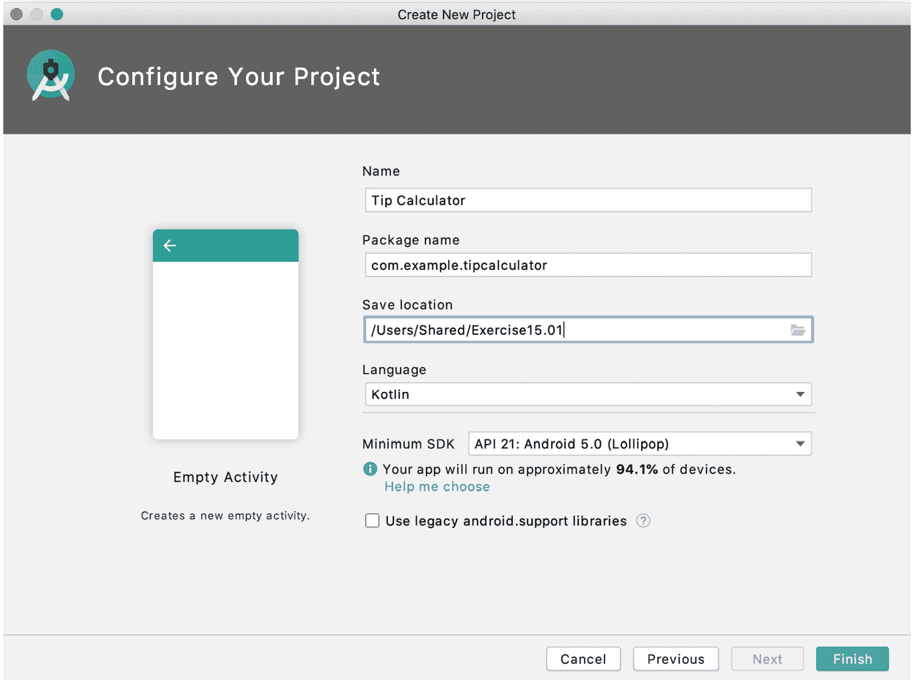

    图 15.1:配置您的项目对话框

4.  设置要保存项目的位置。选择`Minimum SDK`的`API 21: Android 5.0 Lollipop`，然后点击`Finish`按钮。这将创建一个带有布局文件`activity_main.xml`的默认`MainActivity`。
5.  Add the `MaterialComponents` dependency to your `app/build.gradle` file:

    ```kt
    implementation 'com.google.android.material:material:1.2.1'
    ```

    我们将需要这个能够使用输入文本字段的`TextInputLayout`和`TextInputEditText`。

6.  Open the `themes.xml` file and make sure that the activity's theme is using a theme from `MaterialComponents`. See the following example:

    ```kt
    <style name="AppTheme"   parent="Theme.MaterialComponents.Light.DarkActionBar">
    ```

    我们需要这样做，因为我们稍后将使用的`TextInputLayout`和`TextInputEditText`要求您的活动使用一个`MaterialComponents`主题。

7.  打开`activity_main.xml`。删除`Hello World` `TextView`，增加金额输入文本字段:

    ```kt
    <com.google.android.material.textfield.TextInputLayout
        android:id="@+id/amount_text_layout"
        style="@style/Widget.MaterialComponents       .TextInputLayout.OutlinedBox"
        android:layout_width="match_parent"
        android:layout_height="wrap_content"
        android:layout_marginStart="16dp"
        android:layout_marginTop="100dp"
        android:layout_marginEnd="16dp"
        android:layout_marginBottom="16dp"
        android:alpha="1"
        android:hint="Amount"
        app:layout_constraintEnd_toEndOf="parent"
        app:layout_constraintStart_toStartOf="parent"
        app:layout_constraintTop_toTopOf="parent">
        <com.google.android.material.textfield       .TextInputEditText
            android:id="@+id/amount_text"
            android:layout_width="match_parent"
            android:layout_height="wrap_content"
            android:inputType="numberDecimal"
            android:textSize="18sp" />
    </com.google.android.material.textfield.TextInputLayout>
    ```

8.  在金额文本字段下方为小费百分比添加另一个输入文本字段:

    ```kt
    <com.google.android.material.textfield.TextInputLayout
        android:id="@+id/percent_text_layout"
        style="@style/Widget.MaterialComponents       .TextInputLayout.OutlinedBox"
        android:layout_width="match_parent"
        android:layout_height="wrap_content"
        android:layout_margin="16dp"
        android:alpha="1"
        android:hint="Tip Percent"
        app:layout_constraintEnd_toEndOf="parent"
        app:layout_constraintStart_toStartOf="parent"
        app:layout_constraintTop_toBottomOf       ="@id/amount_text_layout">
        <com.google.android.material.textfield       .TextInputEditText
            android:id="@+id/percent_text"
            android:layout_width="match_parent"
            android:layout_height="wrap_content"
            android:inputType="numberDecimal"
            android:textSize="18sp" />
    </com.google.android.material.textfield.TextInputLayout>
    ```

9.  最后，在小费百分比文本字段的底部添加一个`Compute`按钮:

    ```kt
    <Button
        android:id="@+id/compute_button"
        android:layout_width="wrap_content"
        android:layout_height="wrap_content"
        android:layout_marginTop="36dp"
        android:text="Compute"
        app:layout_constraintEnd_toEndOf       ="@+id/percent_text_layout"
        app:layout_constraintTop_toBottomOf       ="@+id/percent_text_layout" />
    ```

10.  创建另一个活动。进入`File`菜单，点击`New` | `Activity` | `Empty Activity`。命名为`OutputActivity`。确保`Generate Layout File`已选中，以便创建`activity_output`。
11.  Open `MainActivity`. At the end of the `onCreate` function, add the following code:

    ```kt
            val amountText: EditText =           findViewById(R.id.amount_text)
            val percentText: EditText =           findViewById(R.id.percent_text)
            val computeButton: Button =           findViewById(R.id.compute_button)
            computeButon.setOnClickListener {
                val amount =
                    if (amountText.text.toString().isNotBlank())                   amountText.text.toString() else "0"
                val percent =
                    if (percentText.text.toString().isNotBlank())                   percentText.text.toString() else "0"
                val intent = Intent(this,               OutputActivity::class.java).apply {
                    putExtra("amount", amount)
                    putExtra("percent", percent)
                }
                startActivity(intent)
            }
    ```

    这将为`Compute`按钮添加一个`ClickListener`组件，这样当点击该组件时，系统将打开`OutputActivity`，并将金额和百分比值作为额外的意图传递。

12.  打开`activity_output.xml`并添加`TextView`显示提示:

    ```kt
       <TextView
            android:id="@+id/tip_text"
            android:layout_width="wrap_content"
            android:layout_height="wrap_content"
            app:layout_constraintBottom_toBottomOf="parent"
            app:layout_constraintEnd_toEndOf="parent"
            app:layout_constraintStart_toStartOf="parent"
            app:layout_constraintTop_toTopOf="parent"
            style="@style/TextAppearance.AppCompat.Headline"
            tools:text="The tip is " />
    ```

13.  Open `OutputActivity`. At the end of the `onCreate` function, add the following code:

    ```kt
            val amount = intent?.getStringExtra("amount")          ?.toBigDecimal() ?: BigDecimal.ZERO
            val percent = intent?.getStringExtra("percent")          ?.toBigDecimal() ?: BigDecimal.ZERO
            val tip = amount * (percent.divide("100"          .toBigDecimal()))
            val tipText: TextView = findViewById(R.id.tip_text)
            tipText.text = "The tip is $tip"
    ```

    这将根据输入的金额和百分比计算并显示小费。

14.  运行应用程序。点击`Compute`按钮，注意打开`OutputActivity`返回时的情况。关闭`MainActivity`和打开关闭`OutputActivity`时有默认动画。
15.  Now, let's start adding transition animations. Open `themes.xml` and update the activity theme with the `windowActivityTransitions`, `windowEnterTransition`, and `windowExitTransition` style attributes:

    ```kt
            <item name="android:windowActivityTransitions">          true</item>
            <item name="android:windowEnterTransition">          @android:transition/explode</item>
            <item name="android:windowExitTransition">          @android:transition/slide_left</item>
    ```

    这将启用活动过渡，添加分解进入过渡，并向活动添加向左滑动退出过渡。

16.  Go back to the `MainActivity` file and replace `startActivity(intent)` with the following:

    ```kt
    startActivity(intent, ActivityOptions   .makeSceneTransitionAnimation(this).toBundle())
    ```

    这将使用我们在 XML 文件中指定的过渡动画打开`OutputActivity`(这是我们在上一步中设置的)。

17.  运行应用程序。你会看到`MainActivity`和`OutputActivity`开合时的动画发生了变化。当安卓用户界面打开`OutputActivity`时，你会注意到文本正在向中心移动。关闭时，视图向左滑动:

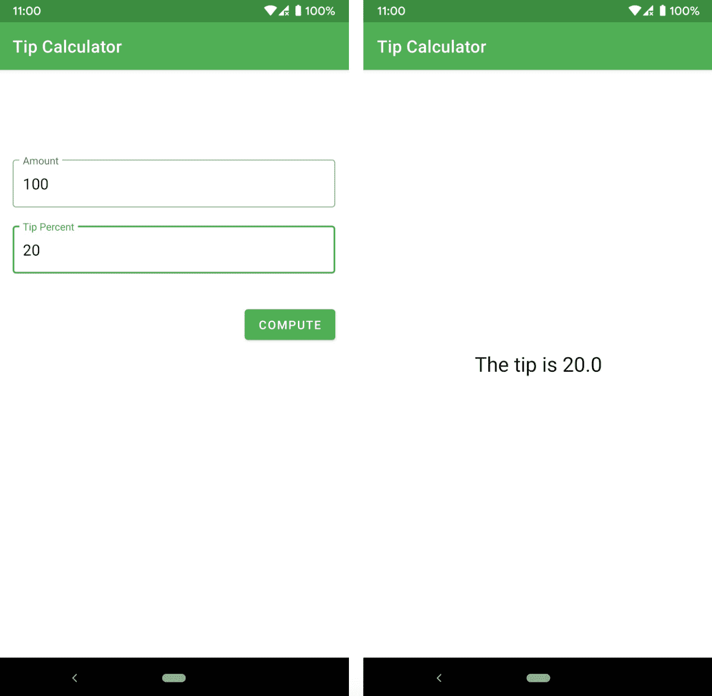

图 15.2:应用屏幕:输入屏幕(左侧)和输出屏幕(右侧)

我们已将活动过渡添加到应用程序中。当我们打开一个新活动时，将播放新活动的进入过渡。它的退出转换将在活动关闭时播放。

有时，当我们从一个活动打开另一个活动时，两个活动中都存在一个共同的元素。在下一节中，我们将学习如何添加这个共享元素转换。

## 添加共享元素转换

有时应用程序会从一个活动转移到另一个活动，这两个活动中都存在一个公共元素。我们可以在这个共享元素中添加一个动画，向用户强调这两个活动之间的联系。

例如，在电影应用程序中，带有电影列表(带有缩略图)的活动可以打开一个新活动，其中包含所选电影的详细信息以及顶部的全尺寸图像。为图像添加共享元素过渡会将列表活动上的缩略图链接到详细信息活动上的图像。

共享元素转换有两个部分:进入转换和退出转换。这些转换可以通过 XML 或代码来完成。

第一步是启用窗口内容转换。您可以通过以下方式将活动主题添加到`themes.xml`中:

```kt
<item name="android:windowContentTransitions">true</item>
```

您也可以通过在调用`setContentView()`之前在活动中调用以下函数来以编程方式实现这一点:

```kt
window.requestFeature(Window.FEATURE_CONTENT_TRANSITIONS)
```

带有`true`值和`window.requestFeature(Window.FEATURE_CONTENT_TRANSITIONS)`的`android:windowContentTransitions`属性将启用窗口内容转换。

之后，您可以添加共享元素进入转换和共享元素退出转换。如果您的`res/transitions`目录中有`enter_transition.xml`和`exit_transition.xml`，您可以通过添加以下样式属性来添加共享元素 enter transition:

```kt
<item name="android:windowSharedElementEnterTransition">  @transition/enter_transition</item>
```

您也可以通过下面几行代码来实现这一点:

```kt
val enterTransition = TransitionInflater.from(this)  .inflateTransition(R.transition.enter_transition)
window.sharedElementEnterTransition = enterTransition
```

`windowSharedElementEnterTransition`属性和`window.sharedElementEnterTransition`将设置我们进入`enter_transition.xml`文件的过渡。

要添加共享元素退出过渡，可以添加以下样式属性:

```kt
<item name="android:windowSharedElementExitTransition">  @transition/exit_transition</item>
```

这可以通过以下几行代码以编程方式完成:

```kt
val exitTransition = TransitionInflater.from(this)  .inflateTransition(R.transition.exit_transition)
window.sharedElementExitTransition = exitTransition
```

`windowSharedElementExitTransition`属性和`window.sharedElementExitTransition`将我们的退出转换设置为`exit_transition.xml`文件。

您已经学习了如何添加共享元素过渡。在下一节中，我们将学习如何从共享元素转换开始活动。

## 用共享元素转换开始活动

一旦将共享元素转换添加到活动中(通过 XML 或编程方式)，就可以在打开活动时激活转换。在此之前，添加一个`transitionName`属性。将其值设置为两个活动中共享元素的相同文本。

例如，在`ImageView`中，我们可以为`transitionName`属性添加一个`transition_name`值:

```kt
    <ImageView
        ...
        android:transitionName="transition_name"
        android:id="@+id/sharedImage"
    ... />
```

为了用共享元素开始活动，我们将传递一个带有过渡动画的包。为此，请使用以下代码开始您的活动:

```kt
startActivity(intent, ActivityOptions   .makeSceneTransitionAnimation(this, sharedImage,     "transition_name").toBundle());
```

`ActivityOptions.makeSceneTransitionAnimation(this, sharedImage, "transition_name").toBundle()`参数将创建一个包含共享元素(`sharedImage`)和转换名(`transition_name`)的包。

如果有多个共享元素，可以传递`View`的`Pair<View, String>`变量参数和过渡名`String`来代替。例如，如果我们将视图的按钮和图像作为共享元素，我们可以执行以下操作:

```kt
val buttonPair: Pair<View, String> = Pair(button, "button") 
val imagePair: Pair<View, String> = Pair(image, "image") 
val activityOptions = ActivityOptions   .makeSceneTransitionAnimation(this, buttonPair, imagePair)
startActivity(intent, activityOptions.toBundle())
```

注意

记得导入`android.util.Pair`而不是`kotlin.Pair`，因为`makeSceneTransitionAnimation`正在等待安卓软件开发工具包中的配对。

让我们通过在*提示计算器*应用程序中添加共享元素过渡来尝试一下到目前为止所学的内容。

## 练习 15.02:创建共享元素过渡

在第一个练习中，我们为`MainActivity`和`OutputActivity`定制了活动过渡。在本练习中，我们将为这两个活动添加一个图像。当从输入屏幕移动到输出屏幕时，该共享元素将被动画化。我们将使用`ImageView`的应用启动器图标(`res/mipmap/ic_launcher`)。您可以更改您的，而不是使用默认的:

1.  打开我们在`Exercise 15.01`、`Creating Activity Transitions in an App`开发的`Tip Calculator`项目。
2.  Go to the `activity_main.xml` file and add an `ImageView` at the top of the amount text field:

    ```kt
        <ImageView
            android:id="@+id/image"
            android:layout_width="wrap_content"
            android:layout_height="wrap_content"
            android:layout_marginTop="100dp"
            android:src="@mipmap/ic_launcher"
            android:transitionName="transition_name"
            app:layout_constraintEnd_toEndOf="parent"
            app:layout_constraintStart_toStartOf="parent"
            app:layout_constraintTop_toTopOf="parent" />
    ```

    `transition_name`的`transitionName`值将用于将其标识为共享元素。

3.  Change the top constraint of `amount_text_layout` `TextInputLayout` by changing `app:layout_constraintTop_toTopOf="parent"` with the following:

    ```kt
    app:layout_constraintTop_toBottomOf="@id/image"
    ```

    这将在图像下方移动`TextInputLayout`类的数量。

4.  Now, open the `activity_output.xml` file and add an image above the tip `TextView` with a height and width of 200dp and a `scaleType` of `fitXY` to fit the image to the dimensions of the `ImageView`.

    ```kt
        <ImageView
            android:id="@+id/image"
            android:layout_width="200dp"
            android:layout_height="200dp"
            android:layout_marginBottom="40dp"
            android:src="@mipmap/ic_launcher"
            android:scaleType="fitXY"
            android:transitionName="transition_name"
            app:layout_constraintEnd_toEndOf="parent"
            app:layout_constraintStart_toStartOf="parent"
            app:layout_constraintBottom_toTopOf="@id/tip_text" />
    ```

    `transition_name`的`transitionName`值与`MainActivity`的`ImageView`值相同。

5.  Open `MainActivity` and change the `startActivity` code to the following:

    ```kt
    val image: ImageView = findViewById(R.id.image)
    startActivity(intent, ActivityOptions   .makeSceneTransitionAnimation(this, image,     "transition_name").toBundle())
    ```

    这将开始从具有 ID 图像的`MainActivity`中的`ImageView`过渡到`OutputActivity`中的另一个图像，其`transitionName`值也是`transition_name`。

6.  运行应用程序。提供一个数量和百分比，点击`Compute`按钮。您将看到输入活动中的图像似乎放大并定位在`OutputActivity`中:

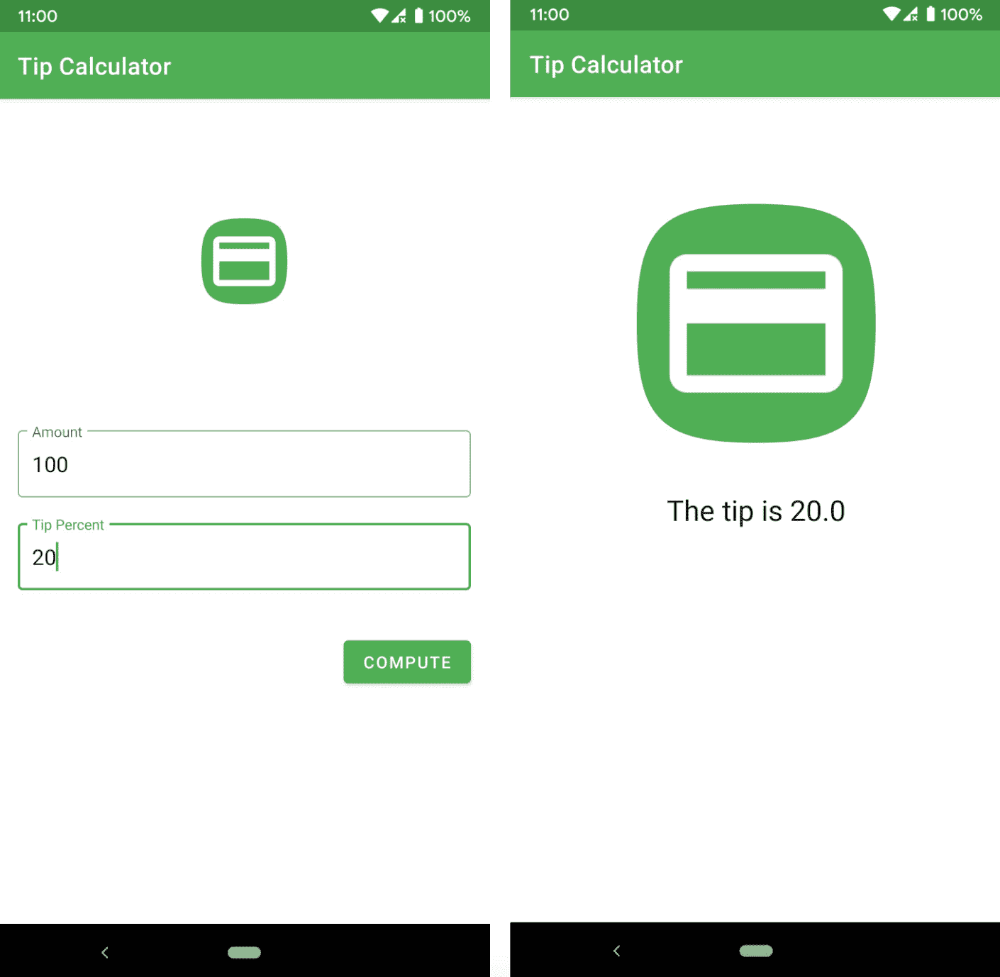

图 15.3:应用屏幕:输入屏幕(左侧)和输出屏幕(右侧)

我们已经了解了添加活动转换和共享元素转换。现在，让我们来看看布局内的动画视图。如果我们有一个以上的元素在里面，可能很难动画每个元素。`CoordinatorLayout`可以用来简化这个动画。我们将在下一节讨论这个问题。

# 具有协调布局的动画

`CoordinatorLayout`是处理其子视图之间运动的布局。当您使用`CoordinatorLayout`作为父视图组时，您可以轻松地对其中的视图进行动画制作。您可以通过在`app/build.gradle`文件中添加以下依赖项来将`CoordinatorLayout`添加到您的项目中:

```kt
implementation 'androidx.coordinatorlayout:coordinatorlayout:1.1.0'
```

这将允许我们在布局文件中使用`CoordinatorLayout`。

假设我们有一个布局文件，里面有一个浮动的动作按钮`CoordinatorLayout`。点击浮动动作按钮时，界面显示`Snackbar`信息。

注意

A `Snackbar`是一个安卓小部件，在屏幕底部向用户提供简短的信息。

如果您使用除`CoordinatorLayout`以外的任何布局，带有消息的 Snackbar 将呈现在浮动动作按钮的顶部。如果我们使用`CoordinatorLayout`作为父视图组，布局会向上推动浮动动作按钮，显示其下方的 Snackbar，当 Snackbar 消失后再向后移动。*图 15.4* 显示了如何调整布局以防止 Snackbar 位于浮动动作按钮的顶部:

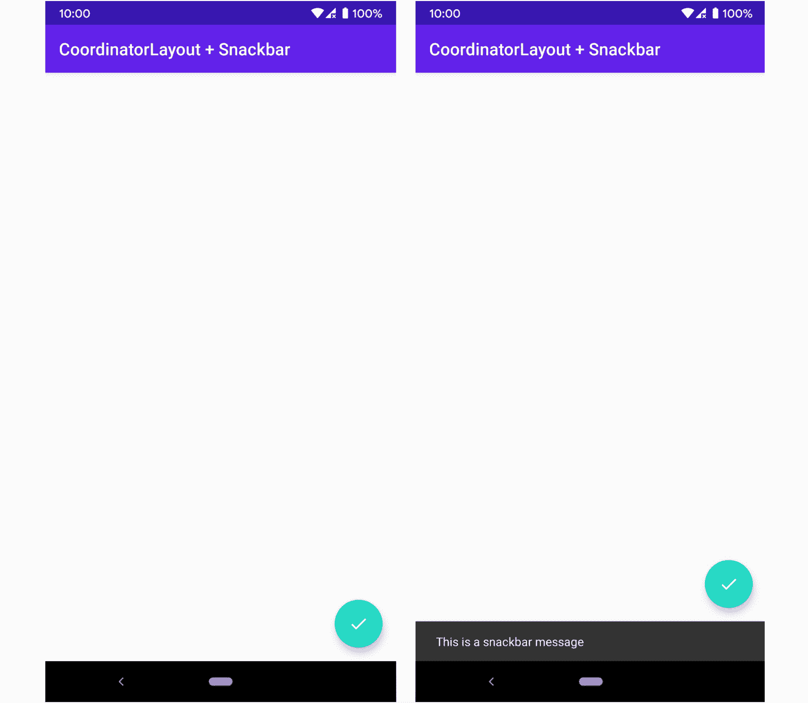

图 15.4:左侧截图显示了 Snackbar 显示前后的 UI。右侧的屏幕截图显示了用户界面，而图标条是可见的

浮动操作按钮移动并为 Snackbar 消息留出空间，因为它有一个名为`FloatingActionButton.Behavior`的默认行为，这是`CoordinatorLayout.Behavior`的子类。`FloatingActionButton.Behavior`在显示 Snackbar 时移动浮动动作按钮，这样 Snackbar 就不会覆盖浮动动作按钮。

并非所有的观点都有`CoordinatorLayout`行为。要实现自定义行为，可以从扩展`CoordinatorLayout.Behavior`开始。然后，您可以将其附加到具有`layout_behavior`属性的视图中。例如，如果我们在`com.example.behavior`包中为一个按钮制作了`CustomBehavior`，我们可以用以下内容更新布局中的按钮:

```kt
...
<Button
    ...
    app:layout_behavior="com.example.behavior.CustomBehavior">
    .../>
```

我们已经学习了如何使用`CoordinatorLayout`创建动画和过渡。在下一节中，我们将研究另一种布局，`MotionLayout`，它允许开发人员更多地控制运动。

# 带有运动布局的动画

在安卓系统中创建动画有时很耗时。您需要处理 XML 和代码文件，甚至创建简单的动画。更复杂的动画和过渡需要更多的时间来制作。

为了帮助开发者轻松制作动画，谷歌创建了`MotionLayout`。`MotionLayout`是一种通过 XML 创建运动和动画的新方法。它从 API 级别 14 (Android 4.0)开始提供。

借助`MotionLayout`，我们可以对一个或多个视图的位置、宽度/高度、可见性、alpha、颜色、旋转、高程和其他属性进行动画制作。通常，有些代码很难做到，但是`MotionLayout`允许我们使用声明性的 XML 轻松调整它们，这样我们就可以更专注于我们的应用程序。

让我们从在应用程序中添加`MotionLayout`开始。

## 添加运动布局

要将`MotionLayout`添加到您的项目中，您只需要为 ConstraintLayout 2.0 添加依赖项。ConstraintLayout 2.0 是 ConstraintLayout 的新版本，增加了新功能，包括`MotionLayout`。在您的应用程序/ `build.gradle`中添加以下文件依赖项:

```kt
implementation 'androidx.constraintlayout:constraintlayout:2.0.4'
```

这将向您的应用程序添加最新版本的 ConstraintLayout(截至编写本文时为 2.0.4)。对于这本书，我们将使用 AndroidX 版本。如果您还没有更新您的项目，请考虑从支持库更新到 AndroidX。

添加依赖后，我们现在可以使用`MotionLayout`创建动画。我们将在下一节讨论这个问题。

## 使用运动布局创建动画

`MotionLayout`是我们的好老朋友 ConstraintLayout 的子类。要使用`MotionLayout`创建动画，请打开布局文件，我们将在其中添加动画。用`androidx.constraintlayout.motion.widget.MotionLayout`替换根约束布局容器。

动画本身不会在布局文件中，而是在另一个名为 `motion_scene`的 XML 文件中。`motion_scene`将指定`MotionLayout`将如何为其内部的视图设置动画。`motion_scene`文件应放在`res/xml`目录下。布局文件将以根视图组中的`app:layoutDescription`属性链接到此`motion_scene`文件。您的布局文件应该如下所示:

```kt
<?xml version="1.0" encoding="utf-8"?>
<androidx.constraintlayout.motion.widget.MotionLayout
    ...
    app:layoutDescription="@xml/motion_scene">
    ...
</androidx.constraintlayout.motion.widget.MotionLayout>
```

要用`MotionLayout`创建动画，我们必须有视图的初始状态和最终状态。`MotionLayout`会自动动画化两者之间的过渡。您可以在同一个`motion_scene`文件中指定这两个状态。如果布局中有很多视图，也可以对动画的开始和结束状态使用两种不同的布局。

`motion_scene`文件的根容器是`motion_scene`。这是我们为`MotionLayout`添加约束和动画的地方。它包含以下内容:

*   **约束设置**:指定视图/布局动画的开始和结束位置和样式。
*   **过渡**:指定要在视图上完成的动画的开始、结束、持续时间和其他细节。

让我们通过添加到我们的*提示计算器*应用来尝试添加带有`MotionLayout`的动画。

## 练习 15.03:添加带有运动布局的动画

在本练习中，我们将使用`MotionLayout`动画更新我们的*提示计算器*应用程序。在输出屏幕中，点击时提示文本上方的图像将向下移动，再次点击时将返回其原始位置:

1.  在 Android Studio 4.0 或更高版本中打开*提示计算器*项目。
2.  Open the `app/build.gradle` file and replace the dependency for `ConstraintLayout` with the following:

    ```kt
    implementation 'androidx   .constraintlayout:constraintlayout:2.0.4'
    ```

    有了这个，我们就可以在布局文件中使用`MotionLayout`。

3.  打开`activity_output.xml`文件，将根`ConstraintLayout`标签改为`MotionLayout`。将`androidx.constraintlayout.widget.ConstraintLayout`改为如下:

    ```kt
    androidx.constraintlayout.motion.widget.MotionLayout
    ```

4.  将`app:layoutDescription="@xml/motion_scene"`添加到`MotionLayout`标签中。集成开发环境将警告您该文件尚不存在。暂时忽略它，因为我们将在下一步中添加它。你的文件应该看起来像这样:

    ```kt
    <?xml version="1.0" encoding="utf-8"?>
    <androidx.constraintlayout.motion.widget.MotionLayout
        xmlns:android="http://schemas.android.com/apk/res/android"
        xmlns:app="http://schemas.android.com/apk/res-auto"
        xmlns:tools="http://schemas.android.com/tools"
        android:layout_width="match_parent"
        android:layout_height="match_parent"
        app:layoutDescription="@xml/motion_scene"
        tools:context=".OutputActivity">
        ...
    </androidx.constraintlayout.motion.widget.MotionLayout>
    ```

5.  在`res/xml`目录下创建`motion_scene.xml`文件。这将是我们定义动画配置的`motion_scene`文件。使用`motion_scene`作为文件的根元素。
6.  Add the starting `Constraint` element by adding the following inside the `motion_scene` file:

    ```kt
       <ConstraintSet android:id="@+id/start_constraint">
            <Constraint
                android:id="@id/image"
                android:layout_width="200dp"
                android:layout_height="200dp"
                android:layout_marginBottom="40dp"
                app:layout_constraintBottom_toTopOf="@id/tip_text"
                app:layout_constraintEnd_toEndOf="parent"
                app:layout_constraintStart_toStartOf="parent" />
        </ConstraintSet>
    ```

    这就是图像在当前位置(被限制在屏幕顶部)的方式。

7.  Next, add the ending `Constraint` element by adding the following inside the `motion_scene` file:

    ```kt
        <ConstraintSet android:id="@+id/end_constraint">
            <Constraint
                android:id="@id/image"
                android:layout_width="200dp"
                android:layout_height="200dp"
                android:layout_marginBottom="40dp"
                app:layout_constraintBottom_toBottomOf="parent"
                app:layout_constraintEnd_toEndOf="parent"
                app:layout_constraintStart_toStartOf="parent" />
        </ConstraintSet>
    ```

    在结束动画时，`ImageView`将位于屏幕底部。

8.  Let's now add in the transition for our `ImageView`:

    ```kt
        <Transition
            app:constraintSetEnd="@id/end_constraint"
            app:constraintSetStart="@id/start_constraint"
            app:duration="2000">
            <OnClick
                app:clickAction="toggle"
                app:targetId="@id/image" />
        </Transition>
    ```

    这里，我们指定了开始和结束约束，它将动画化 2000 毫秒(2 秒)。我们还在`ImageView`中增加了`OnClick`事件。切换将从开始到结束动画化视图，如果视图已经处于结束状态，它将动画化回到开始状态。

9.  您完成的`motion_scene.xml`文件应该如下所示:

    ```kt
    <?xml version="1.0" encoding="utf-8"?>
    <MotionScene xmlns:android   ="http://schemas.android.com/apk/res/android"
        xmlns:app="http://schemas.android.com/apk/res-auto">
        <ConstraintSet android:id="@+id/start_constraint">
            <Constraint
                android:id="@id/image"
                android:layout_width="200dp"
                android:layout_height="200dp"
                android:layout_marginBottom="40dp"
                app:layout_constraintBottom_toTopOf="@id/tip_text"
                app:layout_constraintEnd_toEndOf="parent"
                app:layout_constraintStart_toStartOf="parent" />
        </ConstraintSet>
        <ConstraintSet android:id="@+id/end_constraint">
            <Constraint
                android:id="@id/image"
                android:layout_width="200dp"
                android:layout_height="200dp"
                android:layout_marginBottom="40dp"
                app:layout_constraintBottom_toBottomOf="parent"
                app:layout_constraintEnd_toEndOf="parent"
                app:layout_constraintStart_toStartOf="parent" />
        </ConstraintSet>
        <Transition
            app:constraintSetEnd="@id/end_constraint"
            app:constraintSetStart="@id/start_constraint"
            app:duration="2000">
            <OnClick
                app:clickAction="toggle"
                app:targetId="@id/image" />
        </Transition>
    </MotionScene>
    ```

10.  运行应用程序，点击`ImageView`。它将在大约 2 秒钟内直线向下移动。再次点击它，它将在 2 秒钟内向上移动。*图 15.5* 显示了这个动画的开始和结束:

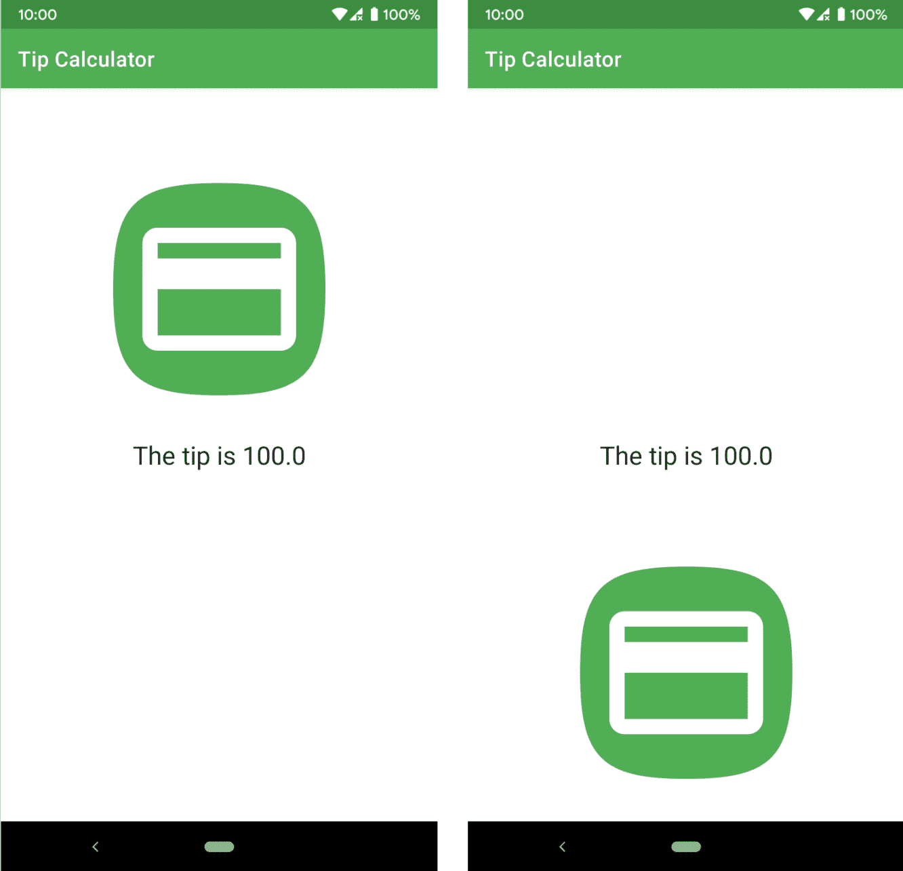

图 15.5:开始动画(左)和结束动画(右)

在本练习中，我们通过指定开始约束、结束约束以及带有持续时间和`OnClick`事件的过渡，在`MotionLayout`中设置了`ImageView`的动画。`MotionLayout`自动播放从开始位置到结束位置的动画(在我们看来，当轻击时，它会自动沿直线上下移动)。

我们已经用`MotionLayout`创建了动画。在下一部分，我们将使用安卓工作室的运动编辑器来创建`MotionLayout`动画。

## 运动编辑器

安卓工作室从 4.0 版本开始，包括运动编辑器。运动编辑器可以帮助开发者用`MotionLayout`创建动画。这使得开发人员更容易创建和预览过渡和其他动作，而不是手动操作并运行它来查看变化。编辑器还会自动生成相应的文件。

您可以通过右键单击预览并单击`Convert to MotionLayout`项，将布局编辑器中的约束布局转换为运动布局。安卓工作室将进行转换，并为您创建运动场景文件。

在`Design`视图中查看以`MotionLayout`为根的布局文件时，运动编辑器界面将包含在`Design`视图中，如图 15.6 所示:

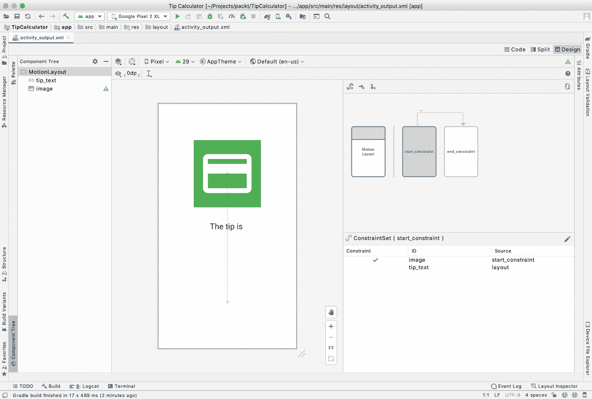

图 15.6:安卓工作室 4.0 中的运动编辑器

在右上角的窗口(`Overview`面板)中，您可以看到`MotionLayout`以及开始和结束约束的可视化。过渡从开始显示为箭头。开始约束附近的点显示了过渡的单击动作。*图 15.7* 显示选择`start_constraint`的`Overview`面板:

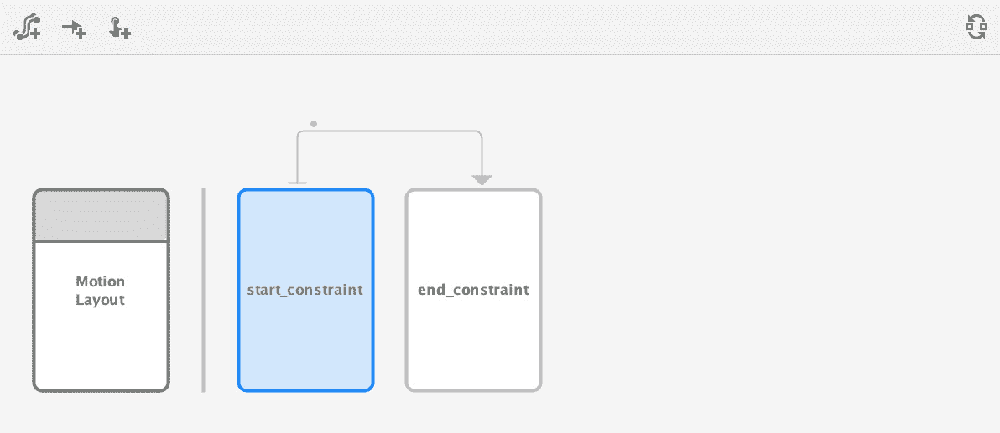

图 15.7:选择了 start_constraint 的运动编辑器的“概述”面板

右下角的窗口是`Selection`面板，显示约束集中的视图或在`Overview`面板中选择的`MotionLayout`。当过渡箭头被选中时，它也可以显示过渡。*图 15.8* 显示选择`start_constraint`时的`Selection`面板:


图 15.8:运动编辑器的选择面板显示 start_constraint 的约束集

点击`Overview`面板左侧的`MotionLayout`，下方的`Selection`面板将显示视图及其约束，如图*图 15.9* :

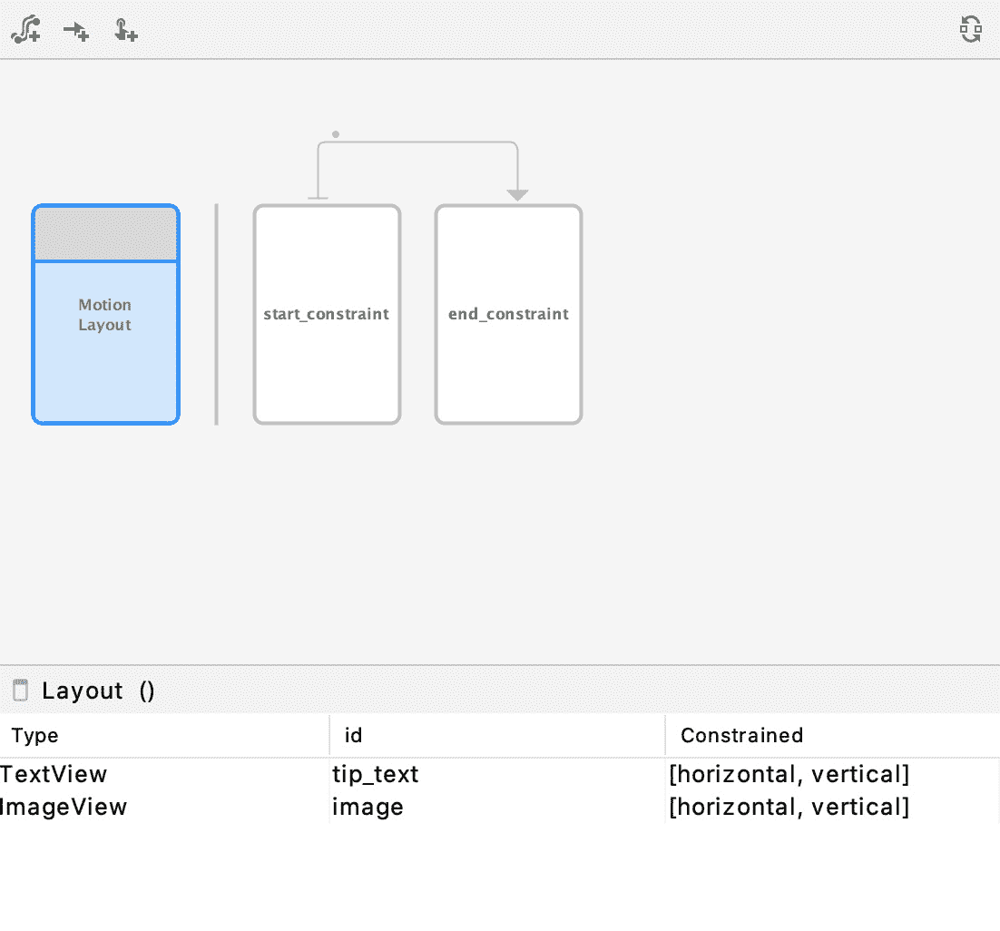

图 15.9:选择运动布局时的概览和选择面板

当您点击`start_constraint`或`end_constraint`时，左侧的预览窗口将显示开始或结束状态的外观。`Selection`面板也将显示视图及其约束。看看*图 15.10* 选择`start_constraint`后的样子:

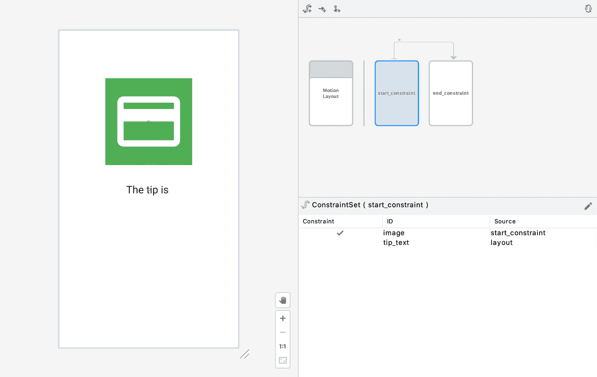

图 15.10:选择 start_constraint 时运动编辑器的外观

*图 15.11* 显示了如果选择`end_constraint`运动编辑器的外观:

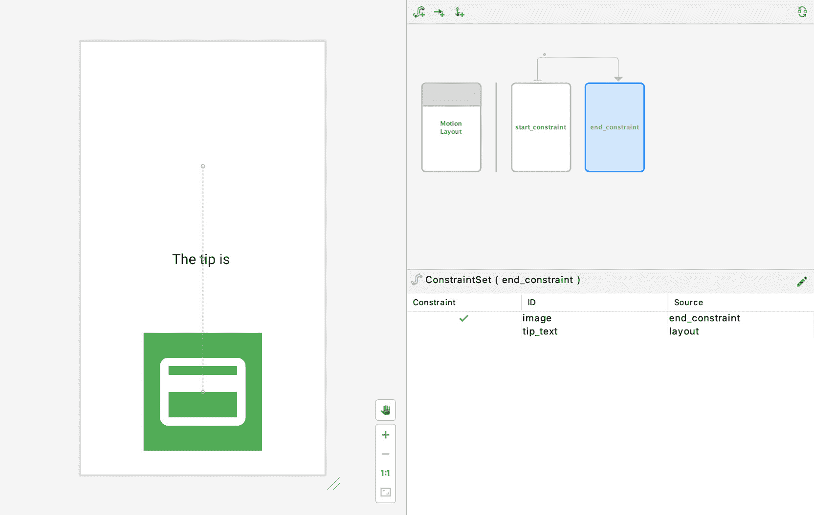

图 15.11:选择 end_constraint 时运动编辑器的外观

连接`start_constraint`和`end_constraint`的箭头代表`MotionLayout`的过渡。在`Selection`面板上，有播放或进入第一/最后状态的控件。您也可以将箭头拖到特定位置。*图 15.12* 展示了它在中间的样子(动画的 50%):

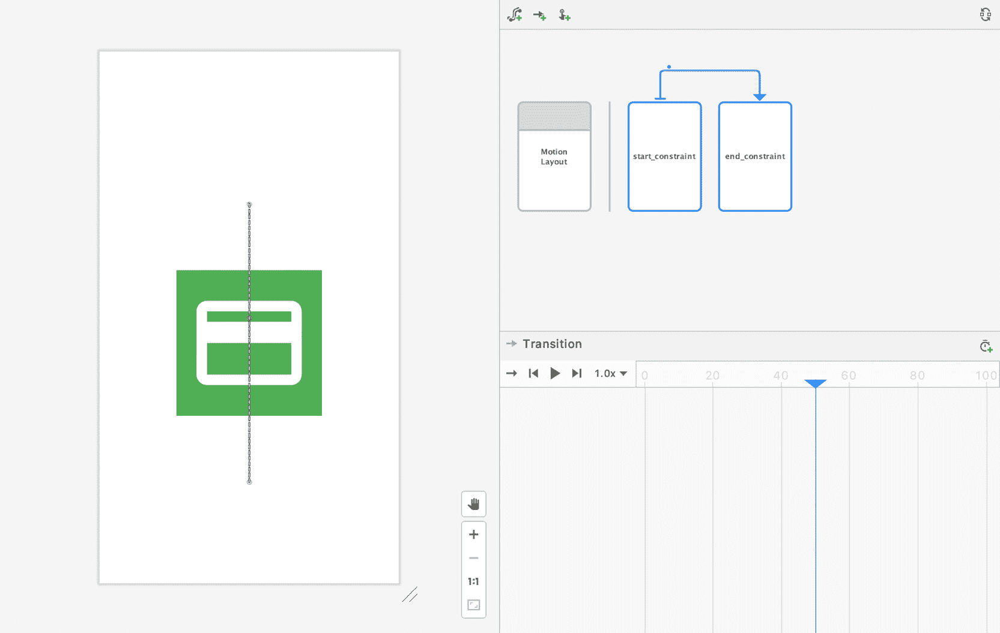

图 15.12:动画中间的过渡

在使用`MotionLayout`开发动画的过程中，如果我们能够调试动画以确保我们做得正确，那就更好了。我们将在下一节讨论如何做到这一点。

## 调试运动布局

为了帮助您在运行应用程序之前可视化`MotionLayout`动画，您可以在运动编辑器中显示运动路径和动画进度。运动路径是要设置动画的对象从开始到结束状态的直线路径。

为了显示路径和/或进度动画，我们可以给`MotionLayout`容器添加一个`motionDebug`属性。我们可以对`motionDebug`使用以下值:

*   `SHOW_PATH`:仅显示运动路径。
*   `SHOW_PROGRESS`:仅显示动画进度。
*   `SHOW_ALL`:显示动画的路径和进度。
*   `NO_DEBUG`:这将隐藏所有动画。

要显示`MotionLayout`路径和进度，我们可以使用以下内容:

```kt
<androidx.constraintlayout.motion.widget.MotionLayout
    ...
    app:motionDebug="SHOW_ALL"
    ...>
```

`SHOW_ALL`值将显示动画的路径和进度。*图 15.13* 展示了我们使用`SHOW_PATH`和`SHOW_PROGRESS`时的样子:

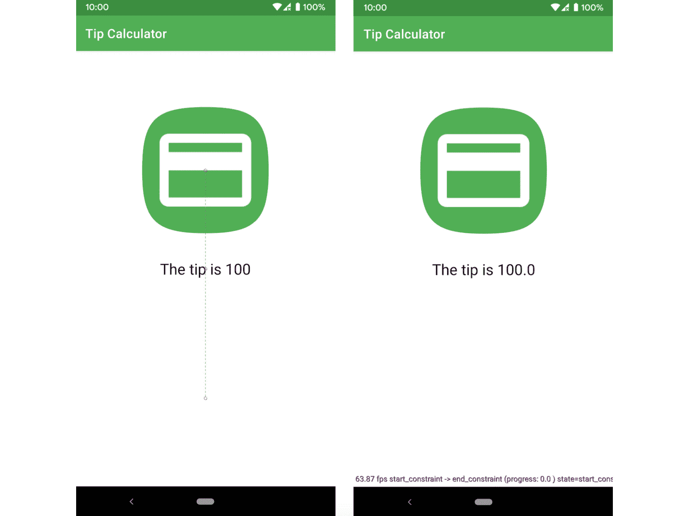

图 15.13:使用 SHOW_PATH(左)显示动画路径，而 SHOW_PROGRESS(右)显示动画进度

虽然`motionDebug`听起来像是只在调试模式下出现的东西，但它也会出现在发布版本中，所以当您准备发布应用程序时，应该将其删除。

在`MotionLayout`动画期间，开始约束将过渡到结束约束，即使有一个或多个元素可以阻挡运动中的对象。我们将在下一节讨论如何避免这种情况发生。

## 修改运动布局路径

在带有`MotionLayout`的动画中，UI 会播放从开始约束到结束约束的运动，即使中间有元素可以阻挡我们移动的视图。例如`MotionLayout`如果涉及到从屏幕顶部到底部移动的文字，反之亦然，我们在中间加一个按钮，按钮会覆盖移动的文字。

*图 15.14* 显示了`OK`按钮如何阻挡动画中间的移动文本:

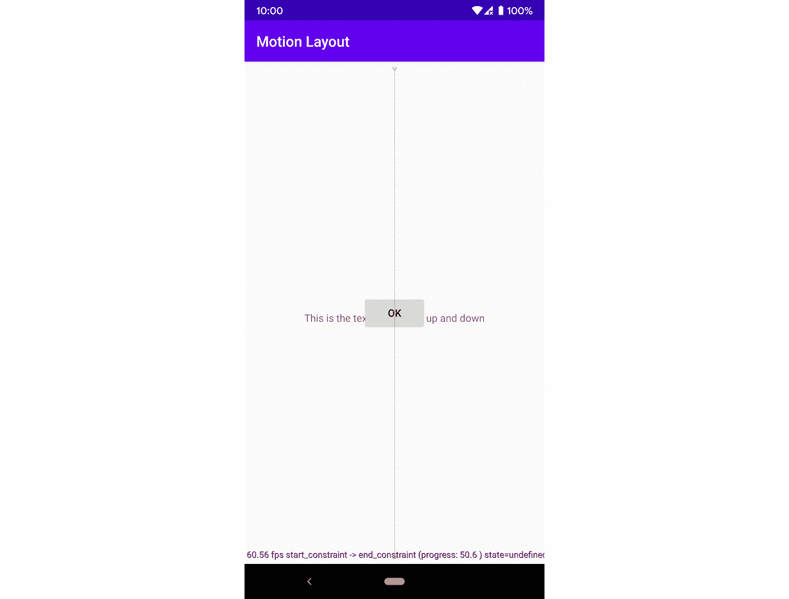

图 15.14:确定按钮挡住了文本动画的中间

`MotionLayout`以直线路径播放从起点到终点约束的动画，并根据指定的属性调整视图。我们可以在开始和结束约束之间添加关键帧，以调整动画路径和/或视图属性。例如，在动画期间，除了更改移动文本的位置以避开按钮之外，我们还可以更改文本或其他视图的属性。

关键帧可以作为`motion_scene`过渡属性的子级添加到`KeyFrameSet`中。我们可以使用以下关键帧:

*   `KeyPosition`:指定动画过程中视图在特定点的位置，以调整路径。
*   `KeyAttribute`:指定动画过程中特定点的视图属性。
*   `KeyCycle`:这增加了动画过程中的振荡。
*   `KeyTimeCycle`:这允许周期由时间驱动，而不是动画进度。
*   `KeyTrigger`:这增加了一个可以根据动画进度触发事件的元素。

我们将重点关注`KeyPosition`和`KeyAttribute`，因为`KeyCycle`、`KeyTimeCycle`和`KeyTrigger`是更高级的关键帧，仍然会发生变化。

`KeyPosition`允许我们在`MotionLayout`动画中间改变视图的位置。它具有以下属性:

*   `motionTarget`:指定关键帧控制的对象。
*   `framePosition`:从 1 到 99 编号，指定位置改变时运动的百分比。例如，25 表示它在动画的四分之一处，50 是中点。
*   `percentX`:指定路径的`x`值将被修改多少。
*   `percentY`:指定路径的`y`值将被修改多少。
*   `keyPositionType`:指定`KeyPosition`如何修改路径。

`keyPositionType`属性可以有以下值:

*   `parentRelative` : `percentX`和`percentY`是基于视图的父级指定的。
*   `pathRelative` : `percentX`和`percentY`是基于从开始约束到结束约束的直线路径指定的。
*   `deltaRelative` : `percentX`和`percentY`是根据视图的位置指定的。

例如，如果我们想要修改`TextView`的路径，使`text_view` ID 正好在动画的中间(50%)，通过相对于`TextView`的父容器移动`x`10%和`y`10%，我们将在`motion_scene`中有以下关键位置:

```kt
<KeyPosition
    app:motionTarget="@+id/text_view"
    app:framePosition="50"
    app:keyPositionType="parentRelative"
    app:percentY="0.1"
    app:percentX="0.1"
/>
```

同时，`KeyAttribute`允许我们在`MotionLayout`动画进行的同时改变视图的属性。我们可以更改的一些视图属性有`visibility`、`alpha`、`elevation`、`rotation`、`scale`和`translation`。它具有以下属性:

*   `motionTarget`:指定关键帧控制的对象。
*   `framePosition`:编号从 1 到 99，指定应用视图属性时运动的百分比。例如，20 表示它处于动画的五分之一，75 表示动画的四分之三点。

让我们尝试向*提示计算器*应用程序添加关键帧。在`ImageView`的动画中，它出现在显示提示的文本之上。我们会用关键帧来解决这个问题。

## 练习 15.04:使用关键帧修改动画路径

在前面的练习中，我们设置了图像的动画，使其在轻敲时直接向下移动(或者当图像已经在底部时向上移动)。当它在中间时，图像覆盖了尖端`TextView`。在本练习中，我们将通过使用安卓工作室的运动编辑器将`KeyFrame`添加到`motion_scene`来解决这个问题:

1.  用安卓工作室 4.0 或更高版本打开*提示计算器*应用。
2.  打开`res/layout`目录下的`activity_output.xml`文件。
3.  切换到`Design`视图。
4.  将`app:motionDebug="SHOW_ALL"`添加到`MotionLayout`容器中。这将允许我们在安卓工作室和我们的设备/模拟器上看到路径和进度信息。您的`MotionLayout`集装箱将如下所示:

    ```kt
    <androidx.constraintlayout.motion.widget.MotionLayout
        xmlns:android="http://schemas.android.com/apk/res/android"
        xmlns:app="http://schemas.android.com/apk/res-auto"
        xmlns:tools="http://schemas.android.com/tools"
        android:layout_width="match_parent"
        android:layout_height="match_parent"
        app:layoutDescription="@xml/motion_scene"
        app:motionDebug="SHOW_ALL"
            tools:context=".OutputActivity"> 
    ```

5.  Run the app and make a computation. On the output screen, tap on the image. Look at the tip text while the animation is in progress. You will notice that the text is covered by the image in the middle of the animation, as shown in *Figure 15.15*:

    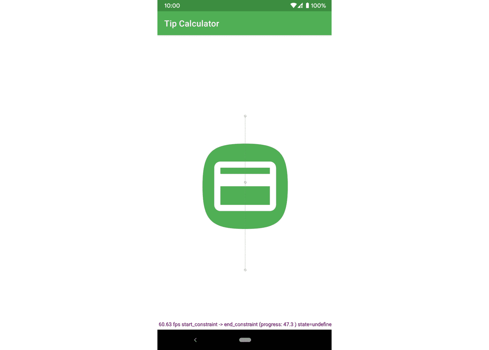

    图 15.15:图像隐藏了显示提示的文本视图

6.  回到安卓工作室的`activity_output.xml`文件。确保它在`Design`视图中打开。
7.  In the `Overview` panel at the top right, click the arrow connecting `start_constraint` and `end_constraint`. Drag the down arrow in the `Selection` panel to the middle (50%), as shown in *Figure 15.16*:

    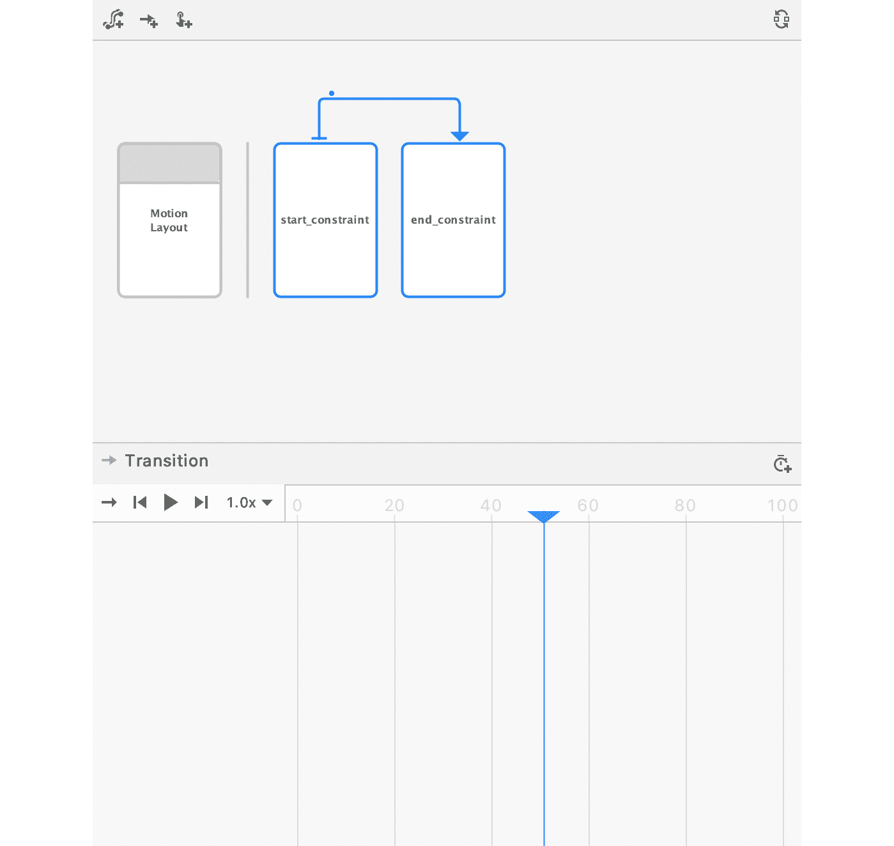

    图 15.16:选择代表开始和结束约束之间过渡的箭头

8.  Click the `Create KeyFrames` icon to the right of `Transition` in the `Selection` panel (the one with a green `+` symbol). Refer to *Figure 15.17* to see the icon:

    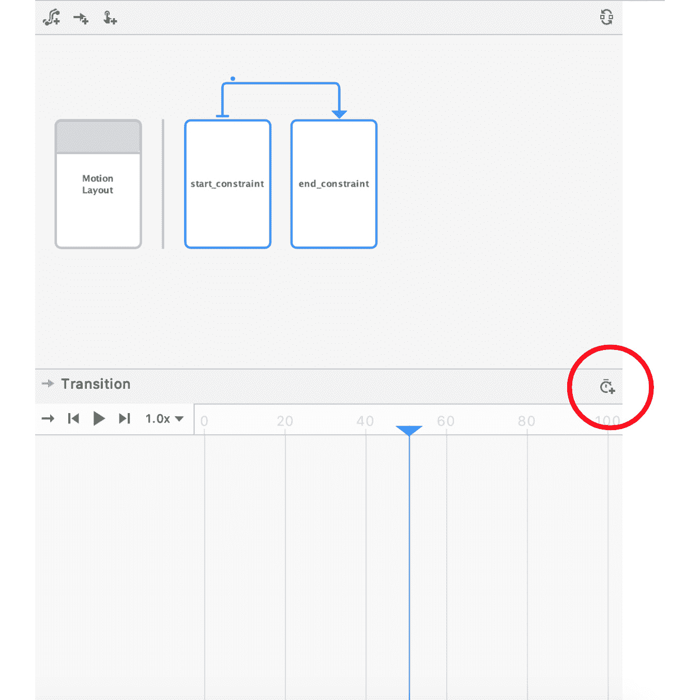

    图 15.17:创建关键帧图标

9.  选择`KeyPosition`。我们将使用`KeyPosition`来调整文本位置并避开按钮。
10.  Select `ID`, choose `image`, and set the input position to `50`. The `Type` is `parentRelative`, and `PercentX` is `1.5`, as *Figure 15.18* shows. This will add a `KeyPosition` attribute for the image at the middle (50%) of the transition, which is at 1.5 times relative to the `x` axis of the parent:

    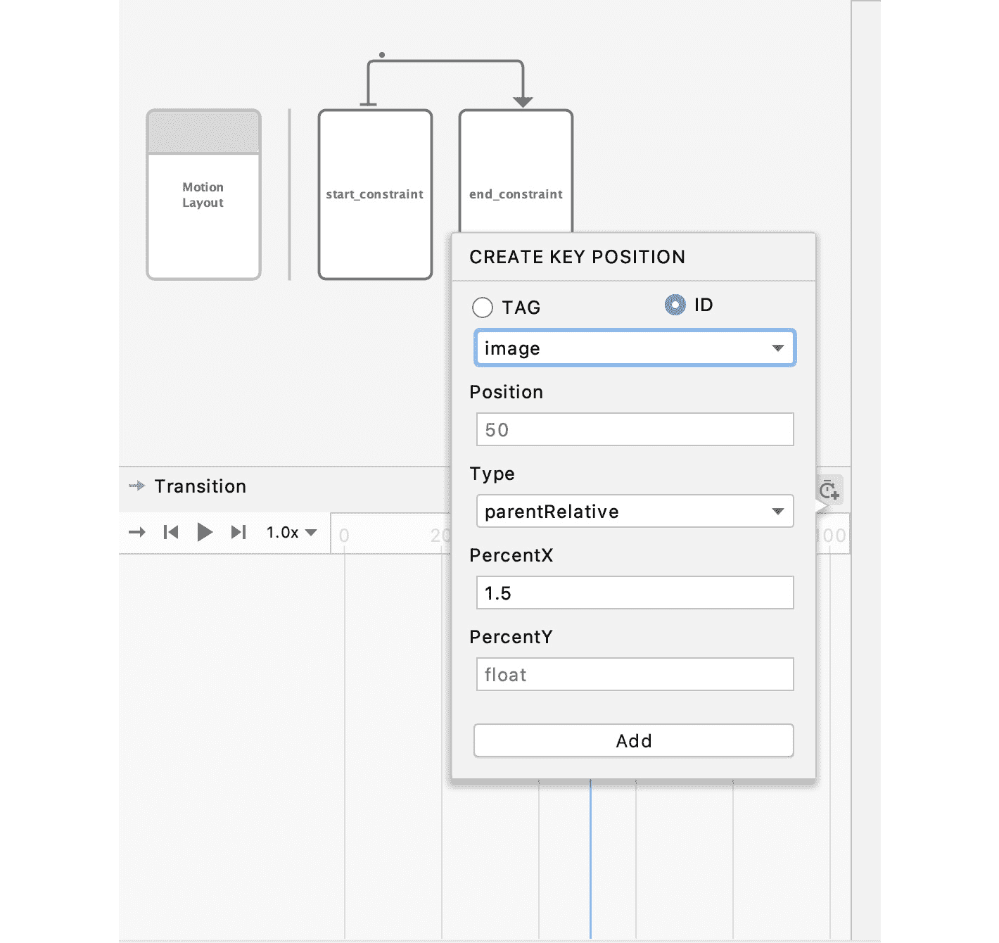

    图 15.18:提供要进行的关键位置的输入

11.  Click the `Add` button. You will see in the `Design` preview, as shown in *Figure 15.19*, that the motion path is no longer a straight line. At position 50 (the middle of the animation), the text will no longer be covered by the `ImageView`. The `ImageView` will be to the right of the `TextView`:

    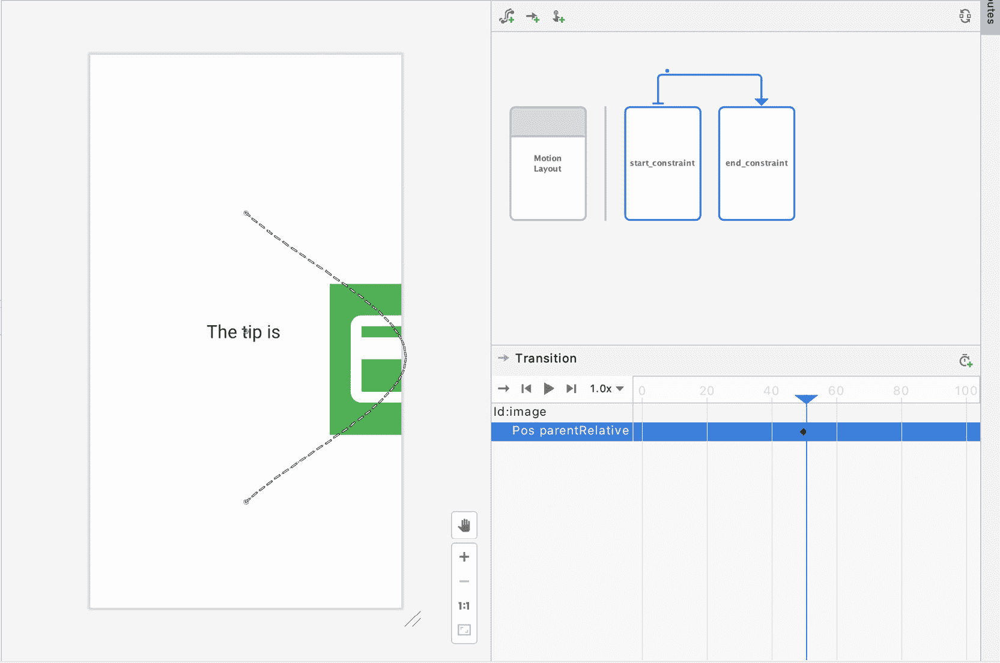

    图 15.19:路径现在将是弯曲的，而不是直的。过渡面板也将有一个新的关键位置项目

12.  Click the play icon to see how it will animate. Run the application to verify it on a device or emulator. You will see that the animation is now curving to the right instead of taking its previous straight path, as in *Figure 15.20*:

    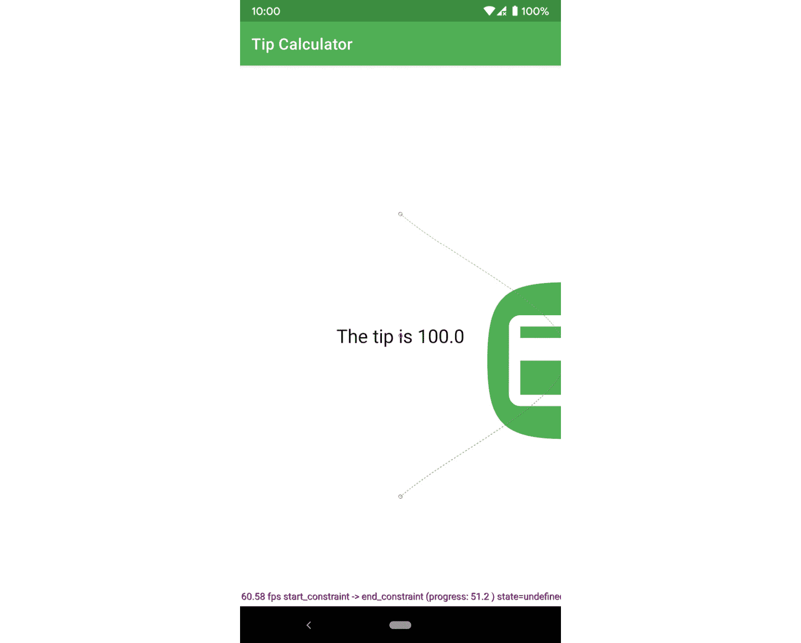

    图 15.20:动画现在避免了带有提示的文本视图

13.  The Motion Editor will automatically generate the code for `KeyPosition`. If you go to the `motion_scene.xml` file, you will see that the Motion Editor added the following code in the transition attribute:

    ```kt
    <KeyFrameSet>
        <KeyPosition
            app:framePosition="50"
            app:keyPositionType="parentRelative"
            app:motionTarget="@+id/image"
            app:percentX="1.5" />
    </KeyFrameSet>
    ```

    过渡期间，关键帧中添加了一个`KeyPosition`属性。在动画的 50%时，图像的`x`位置将相对于其父视图移动 1.5 倍。这允许图像在动画过程中避开其他元素。

在本练习中，您添加了一个关键位置，该位置将调整`MotionLayout`动画，使其不会在其路径中被另一个视图遮挡或阻挡。

让我们通过做一个活动来测试你所学的一切。

## 活动 15.01:通过单词生成器

使用强密码对于保护我们的在线帐户非常重要。它必须是唯一的，并且必须包括大小写字母、数字和特殊字符。在本活动中，您将开发一个可以生成强密码的应用程序。

该应用程序将有两个屏幕:输入屏幕和输出屏幕。在输入屏幕中，用户可以提供密码的长度，并指定密码必须是大写还是小写字母、数字还是特殊字符。输出屏幕将显示三个可能的密码，当用户选择一个时，其他密码将移开，并显示一个按钮将密码复制到剪贴板。您应该自定义从输入到输出屏幕的过渡。

要完成的步骤如下:

1.  在安卓工作室 4.0 或更高版本中创建一个新项目并命名为`Password Generator`。设置其包名和`Minimum SDK`。
2.  将`MaterialComponents`依赖项添加到您的`app/build.gradle`文件中。
3.  更新`ConstraintLayout`的依赖关系。
4.  确保活动主题使用的是`themes.xml`文件中`MaterialComponents`的主题。
5.  在`activity_main.xml`文件中，删除`Hello World` `TextView`并添加长度的输入文本字段。
6.  为大写字母、数字和特殊字符的复选框添加代码。
7.  在复选框底部添加一个`Generate`按钮。
8.  创建另一个活动并命名为`OutputActivity`。
9.  自定义从输入屏幕(`MainActivity`)到`OutputActivity`的活动转换。打开`themes.xml`，用`windowActivityTransitions`、`windowEnterTransition`和`windowExitTransition`风格属性更新活动主题。
10.  更新`MainActivity`中`onCreate`功能的结束。
11.  更新`activity_output.xml`文件中`androidx.constraintlayout.widget.ConstraintLayout`的代码。
12.  将`app:layoutDescription="@xml/motion_scene"`和`app:motionDebug="SHOW_ALL"`添加到`MotionLayout`标签中。
13.  为生成的三个密码的输出活动添加三个`TextView`实例。
14.  在屏幕底部增加一个`Copy`按钮。
15.  在`OutputActivity`中增加`generatePassword`功能。
16.  添加代码，根据用户输入生成三个密码，并在`Copy`按钮上添加`ClickListener`组件，供用户将选择的密码复制到剪贴板。
17.  在`OutputActivity`中，根据密码`TextView`创建动画。
18.  为默认视图创建`ConstraintSet`。
19.  选择第一个、第二个、第三个密码时添加`ConstraintSet`。
20.  接下来，选择每个密码后，添加`Transition`。
21.  进入`Run`菜单，点击`Run app`菜单项，运行应用程序。
22.  输入长度，选择大写、数字和特殊字符，点击`Generate`按钮。将显示三个密码。
23.  选择一个，其余的将移出视野。还会显示一个`Copy`按钮。点击它，检查你选择的密码是否在剪贴板上。输出屏幕的初始和最终状态将类似于*图 15.21* :

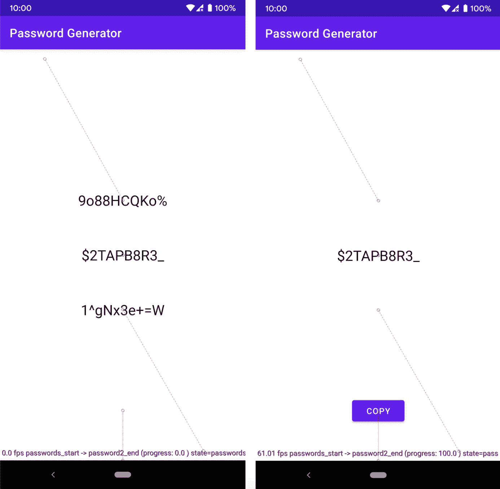

图 15.21:密码生成器应用程序中运动布局的开始和结束状态

注意

这个活动的解决方案可以在:[http://packt.live/3sKj1cp](15.html)找到

# 总结

本章介绍了使用`CoordinatorLayout`和`MotionLayout`创建动画和过渡。动画可以提高我们应用程序的可用性，并使其与其他应用程序相比脱颖而出。

我们从在打开和关闭带有活动转换的活动时自定义转换开始。我们还了解了当一个活动和它打开的活动都包含相同的元素时，如何添加共享元素转换，以便我们可以向用户突出显示共享元素之间的链接。

我们学习了如何使用`CoordinatorLayout`来处理其子视图的运动。有些视图有内置的行为来处理它们在`CoordinatorLayout`中的工作方式。您也可以将自定义行为添加到其他视图中。然后，我们继续使用`MotionLayout`通过指定开始约束、结束约束以及它们之间的过渡来创建动画。我们还研究了通过在动画中间添加关键帧来修改运动路径。我们学习了关键帧，如`KeyPosition`，它可以更改视图的位置，`KeyAttribute`，它可以更改视图的样式。我们还研究了在安卓工作室中使用运动编辑器来简化动画的创建和预览以及修改路径。

在下一章中，我们将了解谷歌游戏商店。我们将讨论您如何创建帐户并准备发布您的应用程序，以及如何发布它们供用户下载和使用。