# 16。在谷歌游戏上启动你的应用

概观

本章将向您介绍 Google Play 控制台、发布渠道以及整个发布过程。它包括创建一个谷歌游戏开发者帐户，为我们开发的应用程序设置商店条目，以及创建一个密钥商店(包括密码的重要性和存储文件的位置)。我们还将了解应用捆绑包和 APK，了解如何生成应用的 APK 或 AAB 文件。在本章的后面，我们将设置发布路径，打开 beta，关闭 alpha，最后我们将把我们的应用程序上传到商店，并在设备上下载。

在本章结束时，您将能够创建自己的谷歌游戏开发者帐户，为发布准备您的签名 APK 或应用包，并在谷歌游戏上发布您的第一个应用程序。

# 简介

在前一章中，您已经学习了如何使用`CoordinatorLayout`和`MotionLayout`添加动画和过渡。现在，您已经准备好开发和启动安卓应用程序了。

开发安卓应用后，它们将只在你的设备和模拟器上可用。你必须让每个人都可以使用它们，这样他们就可以下载它们。反过来，你将获得用户，你可以从中获利。安卓应用的官方市场是谷歌游戏。有了谷歌游戏，你发布的应用和游戏可以在全球超过 20 亿活跃的安卓设备上使用。

在这一章中，我们将学习如何在谷歌游戏上启动你的应用程序。我们将从准备应用程序发布开始，并创建一个谷歌游戏开发者帐户。然后，我们将继续上传您的应用程序并管理应用程序发布。

让我们开始准备您的应用程序，以便在谷歌游戏上发布。

# 准备发布您的应用程序

在谷歌 Play 上发布应用程序之前，您必须确保它是用发布密钥签名的，并且具有正确的版本信息。否则，您将无法发布新应用程序或已发布应用程序的更新。

让我们从向您的应用程序添加版本开始。

## 版本化应用

您的应用程序版本很重要，原因如下:

*   用户可以看到他们下载的版本。他们可以用这个来检查是否有更新，或者在报告应用程序的错误/问题时是否有已知问题。
*   该设备和谷歌 Play 使用版本值来确定应用程序是否可以或应该更新。
*   开发人员还可以使用该值在特定版本中添加功能支持。他们还可以警告或强制用户升级到最新版本，以获得关于 bug 或安全问题的重要修复。

一个安卓应用有两个版本:`versionCode`和`versionName`。现在，`versionCode`是开发者、谷歌 Play 和安卓系统使用的整数，而`versionName`是用户在你的应用的谷歌 Play 页面上看到的字符串。

一个应用的初始版本可以有一个`versionCode`值`1`，你应该为每个新版本增加它。

`versionName`可以采用 *x.y* 格式(其中 *x* 为主要版本， *y* 为次要版本)。也可以使用语义版本化，如 *x.y.z* 中，通过添加带有 *z* 的补丁版本。要了解更多语义版本化，请参考[https://semver.org](https://semver.org)。

在模块的`build.gradle`文件中，`versionCode`和`versionName`是在 Android Studio 中创建新项目时自动生成的。他们在`android`街区下面的`defaultConfig`街区。一个示例`build.gradle`文件显示了这些值:

```kt
android {
    compileSdkVersion 29
    defaultConfig {
        applicationId "com.example.app"
        minSdkVersion 16
        targetSdkVersion 29
        versionCode 1
        versionName "1.0"
        ...
    }
    ...
}
```

发布更新时，要发布的新包必须具有更高的`versionCode`值，因为用户不能降级其应用程序，只能下载新版本。

在确保应用版本正确后，发布过程的下一步是获取密钥库来对应用进行签名。这将在下一节中讨论。

## 创建密钥库

安卓应用程序运行时，会自动通过调试密钥进行签名。然而，在发布到谷歌 Play 商店之前，应用程序必须使用发布密钥进行签名。为此，您必须有一个密钥库。如果你还没有，你可以在安卓工作室创建一个。

## 练习 16.01:在 Android Studio 中创建密钥库

在本练习中，我们将使用安卓工作室制作一个密钥库，用于签署安卓应用程序。按照以下步骤完成本练习:

1.  在 Android Studio 中打开一个项目。
2.  Go to the `Build` menu and then click on `Generate Signed Bundle or APK...`:

    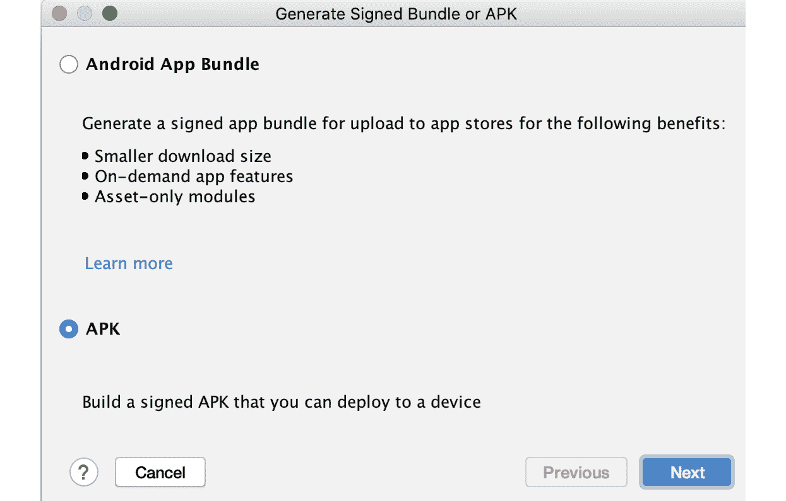

    图 16.1:生成签名包或 APK 对话框

3.  Make sure either `APK` or `Android App Bundle` is selected, and then click the `Next` button. Here, you can choose an existing keystore or create a new one:

    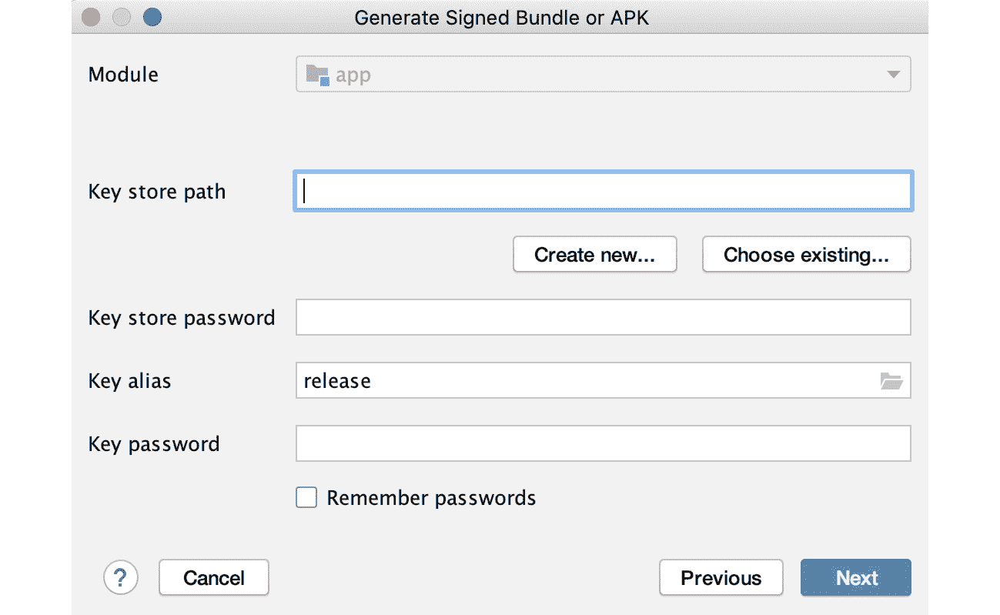

    图 16.2:选择 APK 并按下“下一步”按钮后，生成签名包或 APK 对话框

4.  Click the `Create new…` button. The `New Key Store` dialog will then appear:

    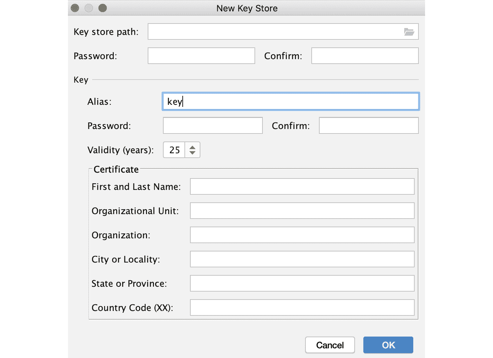

    图 16.3:新建密钥存储对话框

5.  在`Key store path`字段中，选择密钥库文件的保存位置。您可以单击右侧的文件夹图标来选择您的文件夹并键入文件名。该值将类似于`users/packt/downloads/keystore.keystore`
6.  在`Password`和`Confirm`字段中提供密码。
7.  在`Key`下的证书部分，输入名字和姓氏、组织单位、组织、城市/地区、州/省和国家代码。只需要其中的一个，但是提供所有信息是很好的。
8.  点击`OK`按钮。如果没有错误，将在您提供的路径中创建密钥库，您将返回到带有密钥库值的`Generate Signed Bundle or APK`对话框，以便继续生成 APK 包或应用包。如果您只想创建密钥库，可以关闭对话框。

在本练习中，您已经创建了自己的密钥库，可以用来签署可以发布到 Google Play 的应用程序。

如果您愿意，也可以使用命令行生成密钥库。`keytool`命令可以在 **Java 开发工具包** ( **JDK** )中找到。命令如下:

```kt
keytool -genkey -v -keystore my-key.jks -keyalg RSA -keysize 
  2048 -validity 9125 -alias key-alias
```

该命令在当前工作目录下创建一个 2，048 位的 RSA 密钥库，文件名为`my-key.jks`，别名为`key-alias`；有效期为 9，125 天(25 年)。命令行将提示您输入密钥库密码，然后提示您再次输入以进行确认。然后它会询问您的名字和姓氏、组织单位、组织名称、城市或地方、州或省以及国家代码，一次一个。只需要其中一个；如果您想保留空白，可以按下*进入*键。不过，提供所有信息是一种很好的做法。

在国家代码提示后，您将被要求验证所提供的输入。您可以键入“是”进行确认。然后会要求您提供密钥别名的密码。如果想和密钥库密码一样，可以按*进入*。然后将生成密钥库。

既然您有了用于签署应用程序的密钥库，您需要知道如何保护它的安全。在下一节中，您将了解到这一点。

## Sto 响铃密钥库和密码

您需要将密钥库和密码保存在安全的地方，因为如果您丢失了密钥库和/或其凭据，您将无法再为您的应用程序发布更新。如果黑客也获得了这些权限，他们可能无需您的同意就能更新您的应用程序。

您可以将密钥库存储在配置项/构建服务器或安全服务器中。

保留凭证有点棘手，因为您稍后在签署应用程序更新版本时会需要它们。一种方法是将这些信息包含在项目的`build.gradle`文件中。

在`android`块中，您可以有`signingConfigs`，它引用密钥库文件、其密码以及密钥的别名和密码:

```kt
android {
    ...
    signingConfigs {
        release {
            storeFile file("keystore-file")
            storePassword "keystore-password"
            keyAlias "key-alias"
            keyPassword "key-password"
        }
    }
    ...
}
```

在项目的`build.gradle`文件中`buildTypes`的发布块下，您可以在`signingConfigs`块中指定发布配置:

```kt
buildTypes {
        release {
            ...
            signingConfig signingConfigs.release
        }
        ...
}
```

将签名配置存储在`build.gradle`文件中并不那么安全，因为有权访问项目或存储库的人可能会危及应用程序。

您可以将这些凭据存储在环境变量中，以使其更加安全。通过这种方法，即使恶意用户访问了您的代码，应用程序更新仍然是安全的，因为签名配置不会存储在您的代码中，而是存储在系统中。环境变量是在集成开发环境或项目之外设置的键值对，例如，在您自己的计算机或构建服务器上。

要在 Gradle 中为密钥库配置使用环境变量，可以为存储文件路径、存储密码、密钥别名和密钥密码创建环境变量。例如，您可以使用`KEYSTORE_FILE`、`KEYSTORE_PASSWORD`、`KEY_ALIAS`和`KEY_PASSWORD`环境变量。

在 Mac 和 Linux 上，您可以使用以下命令设置环境变量:

```kt
export KEYSTORE_PASSWORD=securepassword
```

如果您使用的是 Windows，可以通过以下方式完成:

```kt
set KEYSTORE_PASSWORD=securepassword
```

该命令将创建一个以`securepassword`为值的`KEYSTORE_PASSWORD`环境变量。在应用程序`build.gradle`文件中，您可以使用来自环境变量的值:

```kt
storeFile System.getenv("KEYSTORE_FILE")
storePassword System.getenv("KEYSTORE_PASSWORD")
keyAlias System.getenv("KEY_ALIAS")
keyPassword System.getenv("KEY_PASSWORD")
```

您的密钥库将用于签署您的应用程序以供发布，以便您可以在谷歌游戏上发布它。我们将在下一节讨论这个问题。

## 签署让你的应用程序发布

当您在模拟器或实际设备上运行应用程序时，安卓工作室会自动使用调试密钥库对其进行签名。要在 Google Play 上发布，您必须使用自己在 Android Studio 中制作的密钥库或从命令行使用自己的密钥签署 APK 或应用捆绑包。

如果您已经在`build.gradle`文件中添加了发布版本的签名配置，您可以通过在`Build Variants`窗口中选择发布版本来自动构建已签名的 APK 或应用捆绑包。然后您需要进入`Build`菜单，点击`Build Bundle(s)`项，然后选择`Build APK(s)`或`Build Bundle(s)`。APK 或应用包将在您项目的`app/build/output`目录中生成。

## Exe rcise 16.02:创建签名的 APK

在本练习中，我们将使用安卓工作室为安卓项目创建一个签名的 APK:

1.  在 Android Studio 中打开一个项目。
2.  Go to the `Build` menu and then click on the `Generate Signed Bundle or APK…` menu item:

    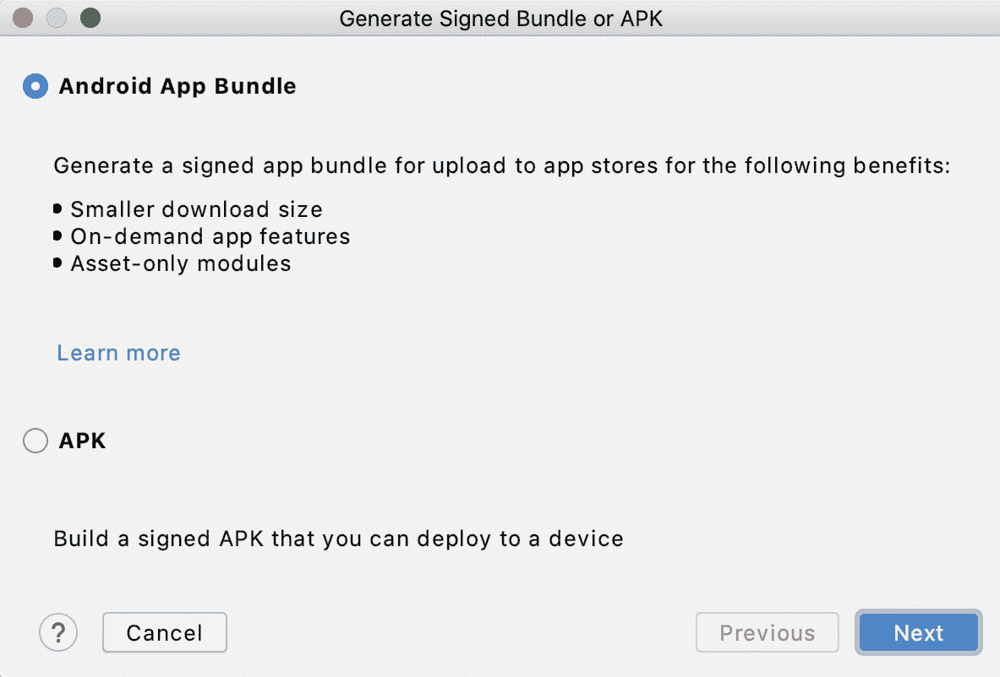

    图 16.4:生成签名包或 APK 对话框

3.  Select `APK` and then click the `Next` button:

    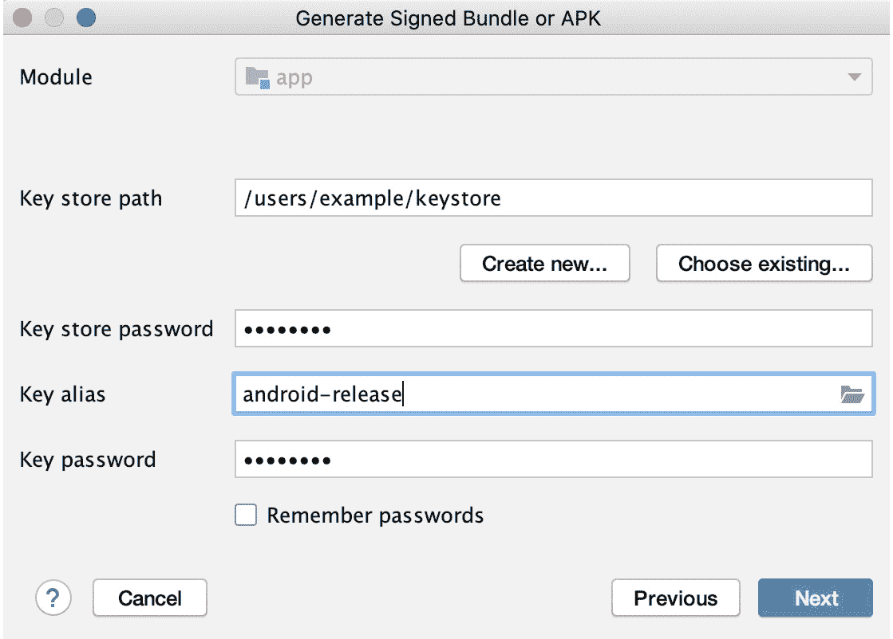

    图 16.5:单击“下一步”按钮后的“生成签名包或 APK”对话框

4.  选择您在*练习 16.01* 、*中制作的密钥库，在安卓工作室*中创建密钥库。
5.  在`Key store password`字段提供密码。
6.  在`Key alias`字段，点击右侧图标，选择按键别名。
7.  在`Key password`字段提供别名密码。
8.  点击`Next`按钮。
9.  选择将生成签名 APK 的目标文件夹。
10.  In the `Build Variants` field, make sure the `release` variant is selected:

    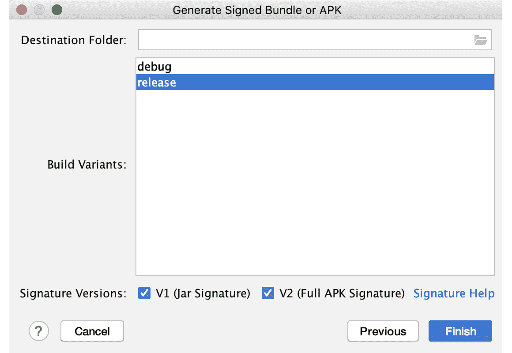

    图 16.6:在生成签名包或 APK 对话框中选择发布版本

11.  对于签名版本，请选择 V1 和 V2。`V2 (Full APK Signature)`是一个全文件方案，增加了你的应用安全性，让安装更快。这仅适用于安卓 7.0 牛轧糖及以上版本。如果你的目标低于这个，你也应该使用`V1 (Jar Signature)`，这是签署 apk 的老方法，但不如 v2 安全。
12.  点击`Finish`按钮。安卓工作室将建造签署的 APK。将弹出一个 IDE 通知，通知您已生成签名的 APK。您可以点击`locate`进入签署的 APK 文件所在的目录:

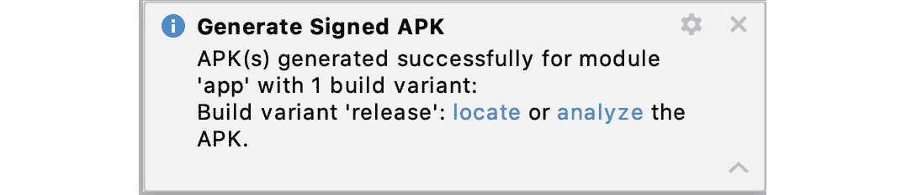

图 16.7:成功签名的 APK 生成的弹出通知

在本练习中，您制作了一个签名的 APK，现在可以在谷歌 Play 上发布。在下一节中，您将了解安卓应用捆绑包，这是一种打包应用以供发布的新方式。

## 安卓应用捆绑包

发布安卓应用的传统方式是通过 APK 或应用包。这个 APK 文件是用户安装你的应用程序时下载到他们设备上的文件。这是一个大文件，将包含所有设备配置的所有字符串、图像和其他资源。

随着您支持更多设备类型和更多国家，此 APK 文件的大小将会增加。用户下载的 APK 将包含他们的设备并不真正需要的东西。这对于您来说是个问题，因为存储空间不足的用户可能没有足够的空间来安装您的应用程序。数据计划昂贵或网络连接缓慢的用户也可能会避免下载太大的应用程序。他们可能还会卸载您的应用程序以节省存储空间。

一些开发人员一直在构建和发布多个 apk 来避免这些问题。然而，这是一个复杂且低效的解决方案，尤其是当您针对不同的屏幕密度、CPU 架构和语言时。每次发布都要维护太多的 APK 文件。

安卓应用捆绑包是一种新的发布应用打包方式。您只需生成一个应用捆绑文件(使用安卓工作室 3.2 及更高版本)，并将其上传到谷歌 Play 上。Google Play 将自动为每个设备配置、CPU 架构和语言生成基本的 APK 文件和 APK 文件。当用户安装你的应用程序时，他们只会为他们的设备下载必要的 apk。与通用 APK 相比，它的体积会更小。

这将适用于安卓 5.0 棒棒糖及以上的设备；对于下面的文件，将生成的 APK 文件仅用于设备配置和 CPU 架构。所有语言和其他资源都将包含在每个 APK 文件中。

## 练习 e 16.03:创建已签名的应用捆绑包

在本练习中，我们将使用安卓工作室为安卓项目创建一个签名的应用捆绑包:

1.  在 Android Studio 中打开一个项目。
2.  Go to the `Build` menu, then click on the `Generate Signed Bundle or APK…` menu item:

    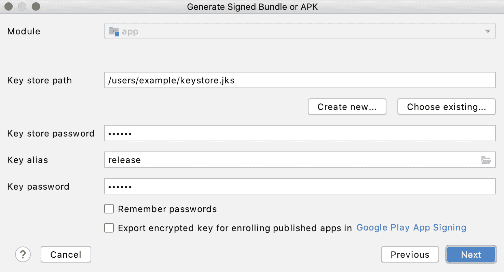

    图 16.8:生成签名包或 APK 对话框

3.  Select `Android App Bundle`, then click the `Next` button:

    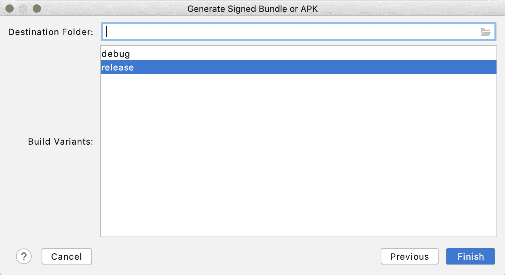

    图 16.9:单击“下一步”按钮后的“生成签名包或 APK”对话框

4.  选择您在*练习 16.01* 、*中制作的密钥库，在安卓工作室*中创建密钥库。
5.  在`Key store password`字段提供密码。
6.  在`Key alias`字段，点击右侧图标，选择按键别名。
7.  在`Key password`字段提供别名密码。
8.  点击`Next`按钮。
9.  选择将生成已签名应用捆绑包的目标文件夹。
10.  In the `Build Variants` field, make sure the `release` variant is selected:

    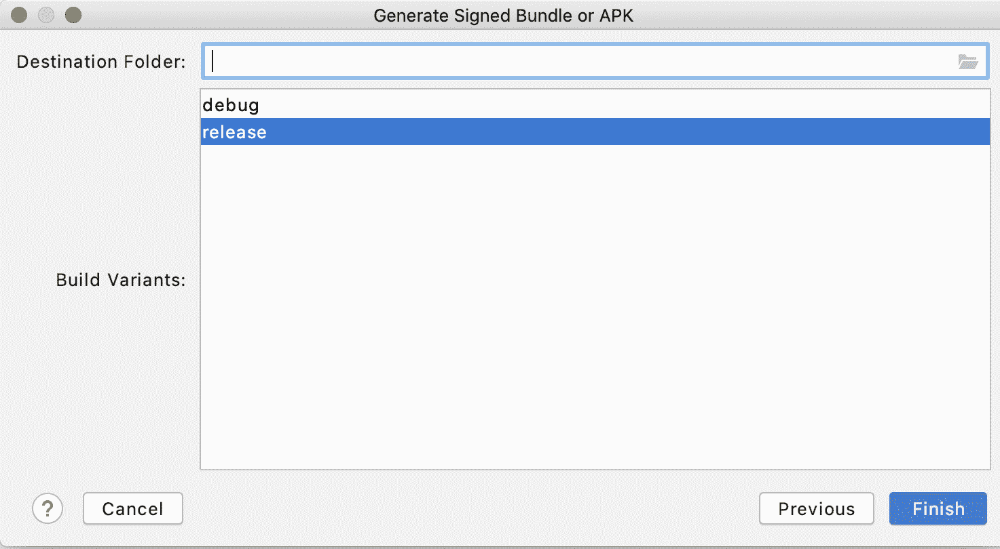

    图 16.10:在生成签名包或 APK 对话框中选择发布版本

11.  点击`Finish`按钮。安卓工作室将构建签名的应用捆绑包。将弹出一个集成开发环境通知，通知您已生成签名的应用捆绑包。您可以点击`locate`进入已签名的 app bundle 文件所在的目录:

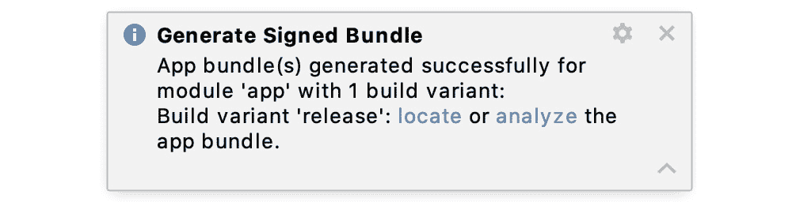

图 16.11:弹出已签名应用包已生成的通知

在本练习中，您制作了一个签名的应用捆绑包，现在可以在谷歌 Play 上发布。

为了能够以安卓应用捆绑格式发布您的应用，您需要选择通过谷歌游戏进行应用签名。我们将在下一节讨论谷歌游戏应用程序签名。

## 谷歌游戏的应用签名

谷歌 Play 提供了一项名为应用签名的服务，允许谷歌管理和保护您的应用签名密钥，并自动为用户重新签名您的应用。

使用谷歌 Play 应用程序签名，您可以让谷歌生成签名密钥，也可以上传您的签名密钥。您还可以创建不同的上传密钥以提高安全性。您可以使用上传密钥对应用进行签名，并在 Play Console 上发布应用。谷歌将检查上传密钥，将其删除，并使用应用签名密钥对应用进行重新签名，以分发给用户。为应用启用应用签名时，可以重置上传密钥。如果您丢失了上传密钥或觉得它已经被泄露，您只需联系谷歌 Play 开发人员支持，验证您的身份，并获得一个新的上传密钥。

发布新应用时，很容易选择应用签名。在谷歌游戏控制台([https://play.google.com/console](https://play.google.com/console))中，你可以进入`Release Management` | `App Releases`部分，在`Let Google manage and protect your app signing key`部分选择`Continue`。您最初用于签署应用程序的密钥将成为上传密钥，谷歌 Play 将生成新的应用程序签署密钥。

您也可以将现有应用程序转换为使用应用程序签名。这可以在谷歌游戏控制台的应用程序的`Release` | `Setup` | `App Signing`部分找到。您需要上传现有的应用程序签名密钥并生成新的上传密钥。

一旦您注册了谷歌游戏应用程序签名，您将不再能够选择退出。此外，如果您使用第三方服务，您将需要使用应用程序签名密钥的证书。这在`Release Management` | `App Signing`中有。

应用签名还可以让你上传应用包，谷歌 Play 会自动签名并生成 APK 文件，用户在安装你的应用时会下载这些文件。

在下一部分，您将创建一个谷歌游戏开发者帐户，这样您就可以向谷歌游戏发布一个应用的 APK 签名或应用捆绑包。

# 创建开发人员帐户

要在谷歌 Play 上发布应用程序，您需要采取的第一步是创建一个谷歌 Play 开发人员帐户。前往[https://play.google.com/console/signup](https://play.google.com/console/signup)并使用您的谷歌帐户登录。如果没有，应该先创建一个。

建议使用您计划长期使用的谷歌帐户，而不是一次性帐户。阅读开发商分销协议并同意服务条款。

注意

如果您的目标是销售付费应用或向您的应用/游戏添加应用内产品，您还必须创建一个商家帐户。不幸的是，这并不是所有国家都有。这里我们就不做赘述了，不过大家可以在注册页面或者[https://support . Google . com/googleplay/Android-developer/answer/150324](https://support.google.com/googleplay/android-developer/answer/150324)上了解更多。

您需要支付 25 美元的注册费来创建您的谷歌游戏开发者帐户。这是一次性付款)。费用必须使用有效的借记卡/信用卡支付，但是一些预付费/虚拟信用卡也可以。您可以使用的内容因地点/国家而异。

最后一步是完成帐户详细信息，如开发人员姓名、电子邮件地址、网站和电话号码。这些也可以在以后更新，将形成应用商店列表中显示的开发者信息。

完成注册后，您将收到一封确认电子邮件。处理您的付款和注册您的帐户可能需要几个小时(最多 48 小时)，所以请耐心等待。理想情况下，即使你的应用程序还没有准备好，你也应该提前这样做，这样一旦它准备好发布，你就可以轻松地发布应用程序。

当您收到来自谷歌的确认电子邮件时，您可以开始向谷歌游戏发布应用程序和游戏。

在下一部分，我们将讨论上传应用到谷歌游戏。

# 上传一个 n 应用到谷歌游戏

一旦你有了可以发布的应用和谷歌游戏开发者账号，你就可以去谷歌游戏控制台([https://play.google.com/console](https://play.google.com/console))发布应用了。

要上传应用，进入播放控制台，点击`All Apps`，然后点击`Create app`。提供应用程序的名称和默认语言。在“应用程序或游戏”部分，设置它是应用程序还是游戏。同样，在免费或付费部分，设置是免费还是付费。创建您的商店列表，准备应用程序版本，并推出该版本。我们将在本节中了解详细的步骤。

## 创建商店列表

商店列表是用户在谷歌游戏上打开你的应用页面时首先看到的。如果 app 已经发布，可以先进入`Grow` 再进入`Store presence`，然后选择`Main store listing`。

### 应用详情

您将被导航到`App details`页面。在`App details`页面，需要填写以下字段:

*   `App name`:你的 app 名称(最多 50 个字符)。
*   `Short description`:总结你的 app 的短文本(最多 80 个字符)。
*   `Full description`: Long description of your app. The limit is 4,000 characters, so you can add a lot of relevant information here, such as what its features are and things users would need to know.

    注意

    有关产品详情，您可以根据发布应用的语言/国家添加本地化版本。

    您的应用标题和描述不得包含受版权保护的材料和垃圾邮件，因为这可能会导致您的应用被拒绝。

### 图形资产

在本节中，提供以下详细信息:

*   图标(512 x 512 的高分辨率图标)。
*   特征图形(1，024 x 500):
*   2-8 个 app 截图。如果您的应用程序支持其他外形规格(平板电脑、电视或穿戴式操作系统)，您还应该为每个外形规格添加屏幕截图:

你也可以添加宣传画和宣传片视频，如果你有。

如果您使用了违反谷歌播放政策的图形，您的应用程序可能会被拒绝，因此请确保您使用的图像是您自己的，并且不包括受版权保护或不适当的内容。

## 准备释放

在准备发布之前，请确保您的构建使用签名密钥进行了签名。如果您要发布应用程序更新，请确保它具有相同的软件包名称，使用相同的密钥签名，并且版本代码高于 Play 上的当前版本代码。

您还必须确保遵循开发者政策(以避免任何违规行为)，并确保您的应用遵循应用质量指南。更多这些都列在发射清单上，你可以在[https://support.google.com/googleplay/android-developer/](https://support.google.com/googleplay/android-developer/)看到。

### APK/应用捆绑包

你可以上传一个 APK(一个安卓包)或者更新的格式:安卓应用包。转到`Release` ，然后转到`App Releases`。这将显示每个轨道中活动版本和草稿版本的摘要。

您可以在不同的轨道上发布应用:

*   生产
*   开放测试
*   封闭测试
*   内部测试

我们将在本章的`Managing App Releases`部分详细讨论发布轨迹。

选择您将创建发行版的轨道。对于生产轨迹，可以选择左边的`Manage`。对于其他轨道，首先点击`Testing`，然后选择轨道。要在封闭的测试赛道上发布，您还必须选择`Manage track`，然后通过点击`Create track`创建新赛道。

完成后，您可以点击页面右上角的`Create new release`。在`Android App Bundles and APKs to add`部分，您可以上传您的 APK 或应用包。

确保应用捆绑包或 APK 文件由您的发行版签名密钥签名。如果没有正确签名，谷歌游戏控制台将不会接受它。如果要发布更新，应用捆绑包或 APK 的版本代码必须高于现有版本。

您还可以添加发行名称和发行说明。发布名称供开发人员用来跟踪发布，用户看不到。默认情况下，上传的 APK 或应用捆绑包的版本名称被设置为发布名称。发行说明构成了将在“播放”页面上显示的文本，并将通知用户对应用程序的更新。

发行说明的文本必须添加到该语言的标签中。例如，默认美国英语语言的开始和结束标签是`<en-US>`和`</en-US>`。如果您的应用程序支持多种语言，默认情况下，每个语言标签都会显示在发行说明的字段中。然后，您可以为每种语言添加发行说明。

如果您已经发布了该应用程序，您可以复制以前版本的发行说明，并通过单击`Copy from a previous release`按钮并从列表中选择来重用或修改它们。

当您点击`Save`按钮时，释放将被保存，您可以稍后返回。`Review release`按钮将带您进入屏幕，在那里您可以查看和推出版本。

## 推出一个版本

如果您准备好推出您的版本，请转到播放控制台并选择您的应用程序。转到`Release`选择你的释放轨迹。单击释放选项卡，然后单击释放旁边的`Edit`按钮:

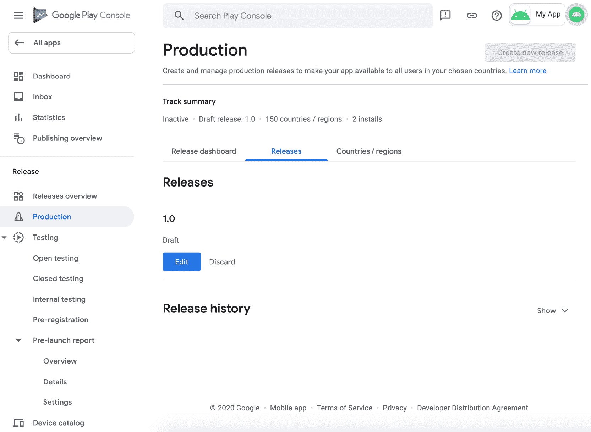

图 16.12:生产轨道上的草稿版本

您可以查看 APK 或应用捆绑包、发行名称和发行说明。单击`Review release`按钮开始释放的卷展栏。游戏控制台将打开`Review and release`屏幕。在这里，您可以查看发布信息并检查是否有警告和错误。

如果要更新应用程序，也可以在创建另一个版本时选择卷展栏百分比。将其设置为 100%意味着它将可供您的所有用户下载。当您将其设置为较低的百分比(例如 50%)时，该版本将可供一半的现有用户使用。

如果对发布有信心，可以选择页面底部的`START ROLLOUT TO PRODUCTION` 按钮。发布应用程序后，需要一段时间(新应用程序需要 7 天或更长时间)才能进行审查。你可以在谷歌游戏控制台的右上角看到状态。这些状态包括以下内容:

*   待发布(您的新应用正在审核中)
*   已发布(您的应用程序现在可以在谷歌 Play 上使用)
*   已拒绝(由于违反策略，您的应用程序未发布)
*   已暂停(您的应用违反了谷歌游戏政策，已被暂停)

如果您的应用程序有问题，您可以解决这些问题并重新提交应用程序。您的应用程序可能会因版权侵权、假冒和垃圾邮件等原因而被拒绝。

一旦应用程序发布，用户现在就可以下载了。新应用或应用更新在谷歌 Play 上上线可能需要一段时间。如果你试图在谷歌游戏上搜索你的应用，它可能是不可搜索的。请确保您在制作或开放轨道上发布它。

# 管理应用发布

你可以在不同的轨道上慢慢发布你的应用，这样你就可以在向用户公开发布之前测试它。你也可以进行定时发布，让应用在某个日期可用，而不是在谷歌批准后自动发布。

## 释放追踪 ks

为应用程序创建发行版时，您可以在四个不同的轨道之间进行选择:

*   生产是每个人都能看到应用的地方。
*   开放测试的目标是更广泛的公共测试。该版本将在谷歌 Play 上发布，任何人都可以加入测试计划并进行测试。
*   封闭测试是针对测试预发布版本的小用户群体。
*   内部测试是针对开发人员/测试人员在开发/测试应用程序时构建的。

内部的、封闭的和开放的轨道允许开发人员创建一个特殊的版本，并允许真正的用户下载它，而其余的用户在生产版本上。这将为您提供一种快速了解该版本是否有 bug 的方法，并在向所有人推出之前快速修复它们。用户对这些曲目的反馈也不会影响您的应用的公众评论/评级。

理想的方法是在开发和内部测试期间首先在内部轨道上发布它。当预发布版本准备就绪时，您可以为一小组受信任的人/用户/测试人员创建一个封闭的测试。然后，您可以创建一个开放测试，允许其他用户在正式投入生产之前试用您的应用程序。

要前往每个曲目并管理版本，您可以前往谷歌游戏控制台的`Release` 部分，选择`Production`或`Testing`，然后选择开放、关闭或内部曲目。

### 反馈通道和选择加入链接

在内部轨道、闭合轨道和开放轨道中，有一个部分用于`Feedback URL or email address`和`How testers join your test`。您可以在`Feedback URL or email address`提供一个电子邮件地址或网站，测试人员可以在那里发送他们的反馈。当他们选择加入您的测试程序时，会显示此信息。

在`How testers join your test`部分，你可以复制链接与你的测试人员分享。然后，他们可以使用此链接加入测试计划。

### 内部测试

此跟踪用于开发/测试应用程序时的构建。这里的版本将很快在谷歌 Play 上提供给内部测试人员。在`Testers`选项卡中，有一个测试人员部分。您可以选择现有列表或创建新列表。内部测试最多有 100 名测试人员。

### 封闭测试

在`Testers`选项卡中，可以为测试人员选择电子邮件列表或谷歌群组。如果你选择电子邮件列表，选择一个测试者列表或者创建一个新列表。封闭式测试最多有 2000 名测试人员:

如果您选择谷歌群组，您可以提供谷歌群组电子邮件地址(例如，`the-alpha-group@googlegroups.com`)，该群组的所有成员将成为测试人员:

### 开放测试

在测试人员选项卡中，您可以为测试人员设置`Unlimited`或`Limited number`。您可以设置的有限测试的最少测试人员为 1，000 人:

在开放的、封闭的和内部的轨道上，你可以添加用户作为你的应用程序的测试者。在下一节中，您将学习如何添加测试人员。

## 分级罗罗 uts

在推出应用程序更新时，您可以先将它们发布给一小部分用户。当版本有问题时，您可以停止部署或发布另一个更新来解决问题。如果没有，您可以慢慢增加卷展栏百分比。这被称为**阶段性推出**。

如果您向不到 100%的用户发布了更新，您可以转到播放控制台，选择`Release`，点按曲目，然后选择`Releases`标签。在你想要更新的版本下面，你可以看到`Manage rollout`下拉列表。它将有更新或暂停推出的选项。

您可以选择`Manage rollout`然后选择`Update rollout`来增加版本的卷展栏百分比。将出现一个对话框，您可以在其中输入卷展栏百分比。您可以点击`Update`按钮更新百分比。

100%的推广将使您的所有用户都可以使用该版本。低于该百分比意味着该版本将只对该百分比的用户可用。

如果在分阶段卷展栏期间，发现重大错误或崩溃，您可以转到播放控制台，选择`Release`，点按轨道，然后选择`Releases`标签。在您想要更新的版本下，选择`Manage rollout`然后选择`Halt rollout`。将出现一个包含附加信息的对话框。添加可选备注，然后点击`Halt`按钮确认:

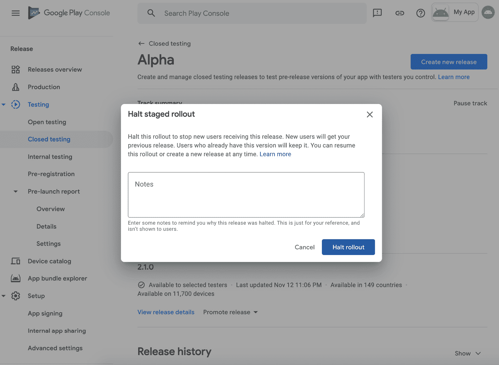

图 16.13:暂停分阶段部署的对话框

当分阶段的卷展栏暂停时，您的轨迹页面中的发布页面将更新为`Rollout halted` 文本和一个`Resume rollout`按钮:

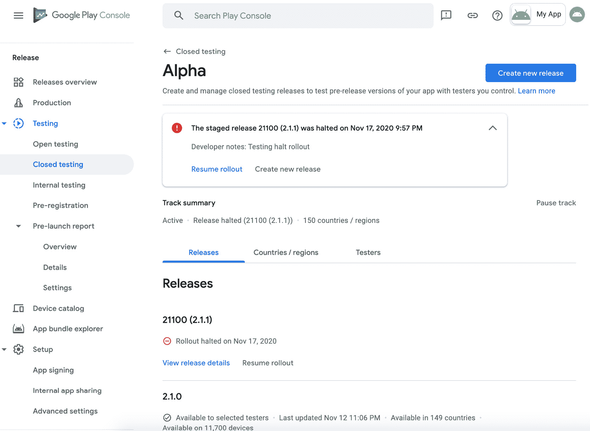

图 16.14:暂停的分阶段部署的发布页面

例如，如果您已经修复了后端的问题，并且不需要发布新的更新，那么您可以恢复您的分阶段部署。为此，请转到播放控制台并选择`Release`，点按轨道，然后选择`Releases`标签。选择释放并点击`Resume rollout`按钮。在`Resume staged rollout`对话框中，您可以更新百分比，然后单击`Resume rollout`继续卷展栏。

## 托管公共事业

当你在谷歌 Play 上推出新版本时，几分钟后就会发布。您可以将其更改为稍后发布。当您的目标是某一天时，例如 iOS/web 发布的同一天或发布日期之后，这非常有用。

在创建和发布要控制发布的更新之前，必须设置托管发布。当您在谷歌游戏控制台上选择您的应用时，您可以选择左侧的`Publishing Overview`。在`Managed publishing status`部分，点击`Manage`按钮:

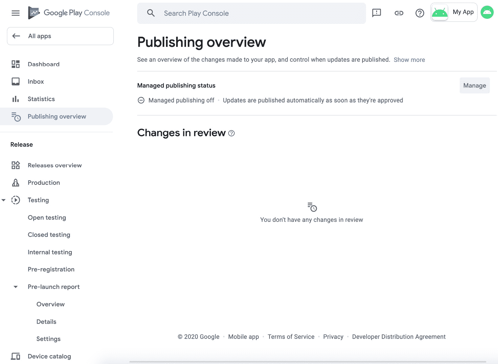

图 16.15:发布概述上的托管发布

将显示托管发布状态。在这里，您可以打开或关闭托管发布，然后单击`Save`按钮。

打开`Managed publishing`后，可以继续向 app 添加和提交更新。您可以在`Changes in review` 部分的`Publishing overview`中看到这些变化:

一旦更改被批准，`Changes in review`将为空，并被移至`Changes ready to publish`部分。在那里，你可以点击`Review and publish`按钮。在出现的对话框中，您可以点击`Publish`按钮进行确认。您的更新将立即发布。

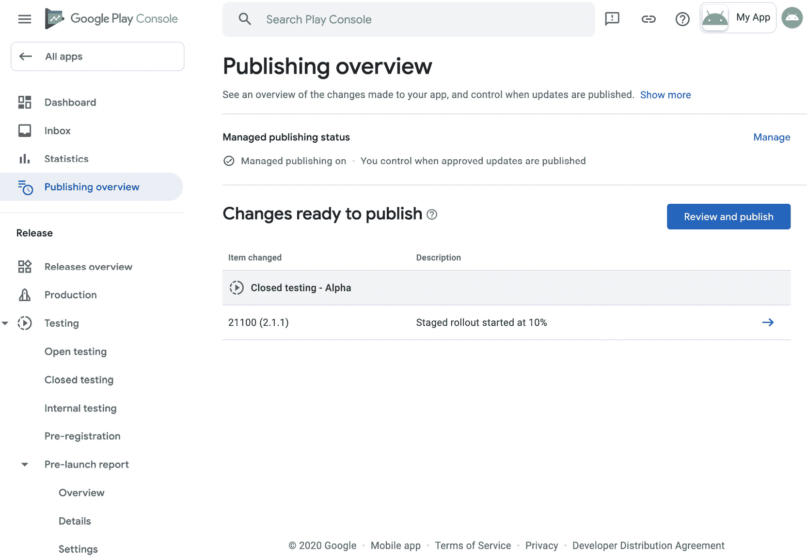

图 16.16:准备发布的托管发布更改

## 活动 16.01: 发布应用

作为这本书的最后一项活动，你的任务是创建一个谷歌游戏开发者账户，并发布一个你新开发的安卓应用程序。您可以发布作为本书一部分而构建的某个应用程序，或者您正在开发的另一个项目。您可以使用以下步骤作为指南:

1.  转到谷歌游戏开发者控制台([https://play.google.com/console](https://play.google.com/console))并创建一个帐户。
2.  创建一个密钥库，用于签署发布版本。
3.  生成一个安卓应用包进行发布。
4.  Publish the app on an open beta track, before releasing it to the production track.

    注意

    本章已经解释了发布应用程序的详细步骤，因此本活动没有单独的解决方案。您可以按照本章的练习成功完成前面的步骤。所需的具体步骤将因您的应用程序而异，并取决于您想要使用的设置。

# 总结

这一章涵盖了谷歌 Play 商店:从准备发布，到创建谷歌游戏开发者帐户，到最终发布你的应用。我们首先对您的应用程序进行版本控制，生成密钥库，创建 APK 文件或安卓应用捆绑包，并使用发布密钥库对其进行签名，然后存储密钥库及其凭据。然后，我们继续在谷歌游戏控制台上注册一个帐户，上传你的 APK 文件或应用包，并管理发布。

这是本书所做工作的高潮——发布你的应用程序并向世界开放是一项伟大的成就，展示了你在整个课程中取得的进步。

在这本书里，你学到了很多技能，从安卓应用程序开发的基础知识开始，一直到实现诸如`RecyclerViews`、从网络服务获取数据、通知和测试等功能。你已经看到了如何用最佳实践、架构模式和动画来改进你的应用程序，最后，你已经学会了如何在谷歌游戏上发布它们。

这仍然只是你作为安卓开发者旅程的开始。当你继续构建你自己的更复杂的应用程序，并扩展你在这里学到的东西时，还有许多更高级的技能需要你去发展。请记住，安卓在不断发展，所以让自己了解最新的安卓版本是件好事。可以去[https://developer.android.com/](https://developer.android.com/)寻找最新资源，进一步沉浸在安卓世界中。